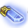
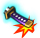
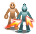

# Registlet (GemCart) reference

Recovered offline from `libil2cpp.so` + the master/text bundles. Evidence labels: **Code** (decoded from the client), **Inferred**, **Text** (in-game string).

## Files

| file | content |
|---|---|
| `registlet.csv` | one row per GemCartId (182): master fields, names (th/us/jp), description, class, skills |
| `registlet.json` | everything: 6-language names/descriptions, per-level display value and description, internal values, decoded buff methods, consumers, skill uses, icons |
| `effects_by_level.csv` | internal effect values per level (BonusType bonuses and `OnGetValue` results) |
| `REGISTLET.md` | per-registlet pages |
| `icons/` | `GemCart` (the icon every registlet uses), `GemCartPiece`, `stargem`, `stargem_peace`; `icons/skill/` = icons of the skills that read each registlet |

## How it fits together

- **Master** `RegistletMaster` (Code, `GemCartMasterData.CreateGemCartData`): u32 version, u16 count, then `{i16 Id, i16 LevelCap, i32 EnhancePowder}` x 159. Identical in all 20 cached/CDN versions (1 distinct blob).
- **Text** `Registlet_<lang>` (477 rows = 159 ids x name / description / base value). Description `{0}` is filled by `UIRegistletMainManager.GetDescriptionValueText(id, lv, baseValue)` (Code, emulated for every id and level by `emu_desc_value.py`): default `baseValue * lv`, with per-id exceptions (`baseValue - lv`, `15 - lv`, `100 - ...`, `/10`, `/100`). That is `display_by_level`; `display_check` compares it with the internal value (`differs` is normal: the UI shows a reduction or a rescaled number).
- **Id enum** `GemCartId` (182 names). 159 are in the master; the other 23 (`Nil` + 22 named ones) have no master row and no text, and no client consumer was found for them either (unreleased or removed).
- **Behaviour** `GemCartBufferFactory.Create(id, lv, status)` builds one `GemCartBuffer.*Buff` class per id (jump table emulated). Classes expose `OnGetValue(GemCartBufferId)`, `GetBonusData(out id[], out val[])`, `CheckTrigger`, hooks, ctor.
- **Kinds**: buff class 131, marker (factory returns a bare `System.Object`; the effect lives in the code that tests `ContainsBuffer`) 25, no object 26 (incl. `Nil`).
- **Level cap / powder**: `GemCartMasterData.LevelCap`, `EnhancePowder`. Bag size = `FunctionLimitManager` value 0x8c and slot count = `RegistletData.Slot` are fed by the server; the per-level cost curve is not in the client.
- **Icon**: `UIRegistletListButton.SetButtonData` calls `SetIcon("GemCart")` for every entry (Code). No per-registlet art exists in the client atlas or the CDN catalogs; `icons/skill/` links each registlet to the skill icon it modifies.

### Engine readers (`GemCartBufferManager`)

- `GetRecieveDamageRate`: GemCartBufferId ReceiveDmgUpRate / ReceiveDmgDownRate via GetBufferValue; registlets 28, 39, 46, 73, 74, 75 (area shields, MobActionPattern checks) are read directly
- `GetLastDamageRate`: GemCartBufferId LastDmgUpRate / LastDmgDownRate via GetBufferValue; registlet 27 read directly
- `GetNormalAttackRate`: GemCartBufferId NormalAttackRate via GetBufferValue (8-byte tail call)
- `GetTalentElementType`: registlets 1, 2 filtered with Where<>; the 53-58 *Talent markers carry the element (Inferred)
- `GetBufferValue`: sums GetValue(id) over every equipped buff (Dictionary enumerator loop; Inferred from the call list)

## All registlets

| id | enum | kind | name (th) | cap | powder | effect via |
|---|---|---|---|---|---|---|
| 0 | Nil | none |  |  |  | none found in client (server-side or unreleased) |
| 1 | AtkUp | buff | เพิ่มการโจมตีทางกายภาพ | 30 | 100 | stat bonus (GetBonusData -> BonusType) |
| 2 | MAtkUp | buff | เพิ่มการโจมตีเวทมนตร์ | 30 | 100 | stat bonus (GetBonusData -> BonusType) |
| 3 | MaxHpUp | buff | เพิ่ม HP สูงสุด | 100 | 10 | stat bonus (GetBonusData -> BonusType) |
| 4 | MaxMpUp | buff | เพิ่ม MP สูงสุด | 100 | 10 | stat bonus (GetBonusData -> BonusType) |
| 5 | DefUp | buff | เพิ่มการป้องกันทางกายภาพ | 50 | 20 | stat bonus (GetBonusData -> BonusType) |
| 6 | MDefUp | buff | เพิ่มการป้องกันเวทมนตร์ | 50 | 20 | stat bonus (GetBonusData -> BonusType) |
| 7 | HitUp | buff | เพิ่มความแม่น | 10 | 200 | stat bonus (GetBonusData -> BonusType) |
| 8 | FleeUp | buff | เพิ่มหลบหลีก | 10 | 200 | stat bonus (GetBonusData -> BonusType) |
| 9 | AspdUp | buff | เพิ่มความเร็วในการโจมตี | 100 | 20 | stat bonus (GetBonusData -> BonusType) |
| 10 | CspdUp | buff | เพิ่มความเร็วเวทมนตร์ | 100 | 20 | stat bonus (GetBonusData -> BonusType) |
| 11 | PursuitResist | buff | ลดการไล่โจมตี | 20 | 75 | engine aggregate GemCartBufferManager.GetBufferValue(ReceiveDmgDownRate); own hooks (CheckTrigger) |
| 12 | PoisonRecovery | buff | ฟื้นฟูจากพิษ | 30 | 50 | GetValue(Value) read by consumer code |
| 13 | BurningFightingSpirit | buff | วิญญาณแห่งการต่อสู้ที่เผาไหม้ | 10 | 150 | GetValue(Value) read by consumer code |
| 14 | NeuralControl | buff | การควบคุมระบบประสาท | 30 | 50 | GetValue(Value) read by consumer code; presence/level read by other code (consumers) |
| 15 | CatEye | buff | เนตรวิฬาร์ | 1 |  | GetValue(Value) read by consumer code; own hooks (CheckTrigger); presence/level read by other code (consumers) |
| 16 | Hyperthermia | buff | ไฮเปอร์เทอร์เมีย | 20 | 75 | GetValue(Value) read by consumer code |
| 17 | Temporaryrepairs | buff | ซ่อมแซมฉุกเฉิน | 20 | 75 | GetValue(Value) read by consumer code |
| 18 | Spike | buff | สไปก์ | 10 | 150 | GetValue(Value) read by consumer code; own hooks (CheckTrigger); presence/level read by other code (consumers) |
| 19 | StandingWithArmsCrossed | buff | นิโอดาจิ | 10 | 50 | engine aggregate GemCartBufferManager.GetBufferValue(ReceiveDmgDownRate); own hooks (CheckTrigger) |
| 20 | BloodyWarrior | buff | นักรบอาบโลหิต | 20 | 150 | own hooks (CheckTrigger) |
| 21 | SilentRecharge | buff | ไซเลนชาร์จ | 20 | 150 | GetValue(AtkMpRecoveryUpRate) read by consumer code |
| 22 | ShortSleeper | buff | ชอร์ทสลีปเปอร์ | 5 | 300 | GetValue(Value) read by consumer code; presence/level read by other code (consumers) |
| 23 | MagicalNonExplosion | buff | พลังเวทไม่สมบูรณ์ | 1 |  | GetValue(Value) read by consumer code |
| 24 | MonsterHunt | buff | ล่ามอนสเตอร์ | 10 | 150 | GetValue(Value) read by consumer code |
| 25 | CoffeeBreak | buff | คอฟฟี่เบรค | 10 | 150 | GetValue(Value) read by consumer code |
| 26 | Practitioner | buff | ผู้ฝึกตน | 10 | 150 | engine aggregate GemCartBufferManager.GetBufferValue(LastDmgDownRate); presence/level read by other code (consumers) |
| 27 | PetOfAttacker | buff | สัตว์เลี้ยงผู้โจมตี | 10 | 150 | engine aggregate GemCartBufferManager.GetBufferValue(LastDmgUpRate, LastDmgDownRate); read directly by GemCartBufferManager.GetLastDamageRate |
| 28 | PetOfTanker | buff | สัตว์เลี้ยงผู้บึกบึน | 10 | 150 | engine aggregate GemCartBufferManager.GetBufferValue(ReceiveDmgDownRate, ReceiveDmgUpRate); read directly by GemCartBufferManager.GetRecieveDamageRate |
| 29 | EmergencyHpRecovery | buff | ฟื้นฟู HP เร่งด่วน | 10 | 150 | GetValue(Value) read by consumer code |
| 30 | EmergencyMpRecovery | buff | ฟื้นฟู MP เร่งด่วน | 10 | 150 | GetValue(Value) read by consumer code; presence/level read by other code (consumers) |
| 31 | MagicalBash | buff | อัดด้วยพลังเวท | 1 |  | engine aggregate GemCartBufferManager.GetBufferValue(NormalAttackRate) |
| 32 | SavingTechnique | buff | เทคนิคการประหยัด | 10 | 150 | GetValue(Value) read by consumer code; presence/level read by other code (consumers) |
| 33 | LastHero | buff | ฮีโร่คนสุดท้าย | 10 | 150 | GetValue(Value) read by consumer code |
| 34 | Lonely | buff | คนขี้เหงา | 5 | 300 | GetValue(Value) read by consumer code |
| 35 | StartDash | buff | สตาร์ทแดช | 5 | 300 | GetValue(Value) read by consumer code; own hooks (CheckTrigger, Synchronization, Update); presence/level read by other code (consumers) |
| 36 | BaskInTheSun | buff | แสงอบอุ่น | 4 | 375 | GetValue(Value) read by consumer code; own hooks (CheckTrigger) |
| 37 | TheSameBoat | buff | ชะตากรรมร่วม | 2 | 750 | GetValue(Value) read by consumer code; presence/level read by other code (consumers) |
| 38 | LastResistance | buff | ลาสสแตนด์ | 5 | 300 | GetValue(Value) read by consumer code; own hooks (CheckTrigger); presence/level read by other code (consumers) |
| 39 | BackwardWarning | buff | คำเตือนจากด้านหลัง | 10 | 150 | engine aggregate GemCartBufferManager.GetBufferValue(ReceiveDmgDownRate); read directly by GemCartBufferManager.GetRecieveDamageRate |
| 40 | Saviour | buff | ผู้ช่วยชีวิต | 1 |  | GetValue(Value) read by consumer code; own hooks (CheckTrigger); presence/level read by other code (consumers) |
| 41 | Panic | buff | แพนิค | 10 | 150 | GetValue(Value) read by consumer code |
| 42 | Transfer | buff | ทรานเฟอร์ | 10 | 150 | stat bonus (GetBonusData -> BonusType) |
| 43 | HideCombo | buff | ไฮด์คอมโบ  | 10 | 600 | none found in client (server-side or unreleased) |
| 44 | NothingStyle | buff | ไร้ลักษณ์ | 10 | 500 | GetValue(Value) read by consumer code; own hooks (CheckBuffValid); presence/level read by other code (consumers) |
| 45 | FailTrapper | buff | เฟลแรปเปอร์ | 1 |  | presence/level read by other code (consumers) |
| 46 | Guitarist | buff | กีตาริสท์ | 6 | 1000 | GetValue(Value) read by consumer code; presence/level read by other code (consumers); read directly by GemCartBufferManager.GetRecieveDamageRate |
| 47 | QuickDance | buff | ชอตเพอฟอร์แมนซ์  | 1 |  | GetValue(Value) read by consumer code; presence/level read by other code (consumers) |
| 48 | SeoulConnect | none |  |  |  | none found in client (server-side or unreleased) |
| 49 | ExtremeSurvival | none |  |  |  | none found in client (server-side or unreleased) |
| 50 | AvoidSet | marker | ตั้งการหลบหลีก | 1 |  | presence/level read by other code (consumers) |
| 51 | LongStep | none |  |  |  | none found in client (server-side or unreleased) |
| 52 | TeleportStep | none |  |  |  | none found in client (server-side or unreleased) |
| 53 | FireTalent | marker | ไฟร์ทาเลนท์ | 1 |  | read directly by GemCartBufferManager.GetTalentElementType (Inferred) |
| 54 | WaterTalent | marker | วอเตอร์ทาเลนท์ | 1 |  | read directly by GemCartBufferManager.GetTalentElementType (Inferred) |
| 55 | WindTalent | marker | วินด์ทาเลนท์ | 1 |  | read directly by GemCartBufferManager.GetTalentElementType (Inferred) |
| 56 | LandTalent | marker | เอิร์ธทาเลนท์ | 1 |  | read directly by GemCartBufferManager.GetTalentElementType (Inferred) |
| 57 | LightTalent | marker | ไลท์ทาเลนท์ | 1 |  | read directly by GemCartBufferManager.GetTalentElementType (Inferred) |
| 58 | DarkTalent | marker | ดาร์คทาเลนท์ | 1 |  | read directly by GemCartBufferManager.GetTalentElementType (Inferred) |
| 59 | CriticalCare | none | รักษาฉุกเฉิน | 10 | 750 | none found in client (server-side or unreleased) |
| 60 | NoneNow | none |  |  |  | none found in client (server-side or unreleased) |
| 61 | TargetDeclaration | marker | แจ้งเตือนเป้าหมาย | 1 |  | presence/level read by other code (consumers) |
| 62 | LeavingWorkNotification | marker | แจ้งพลังหมด | 1 |  | presence/level read by other code (consumers) |
| 63 | DamageCheck | marker | เช็คความเสียหาย | 1 |  | presence/level read by other code (consumers) |
| 64 | PoisonBooster | none |  |  |  | none found in client (server-side or unreleased) |
| 65 | FlameBooster | none |  |  |  | none found in client (server-side or unreleased) |
| 66 | WeaknessBlade | none |  |  |  | none found in client (server-side or unreleased) |
| 67 | PreparationPoison | none |  |  |  | none found in client (server-side or unreleased) |
| 68 | Instructor | none | ผู้ฝึกสอน | 10 | 600 | presence/level read by other code (consumers) |
| 69 | CheckThePreparation | marker | พิสูจน์ฝีมือ | 10 | 600 | presence/level read by other code (consumers) |
| 70 | KnightsIntuition | marker | สัญชาตญาณนักรบ | 5 | 1200 | presence/level read by other code (consumers) |
| 71 | HealingHands | marker | มือแห่งการเยียวยา | 10 | 600 | presence/level read by other code (consumers) |
| 72 | IronFist | marker | กำปั้นเหล็ก | 5 | 1200 | presence/level read by other code (consumers) |
| 73 | ExclusiveSP | marker | SP คนพิเศษ | 10 | 1000 | read directly by GemCartBufferManager.GetRecieveDamageRate |
| 74 | RedAreaShield | marker | เกราะเขตแดง | 10 | 1000 | read directly by GemCartBufferManager.GetRecieveDamageRate |
| 75 | BlueAreaShield | marker | เกราะเขตน้ำเงิน | 10 | 1000 | read directly by GemCartBufferManager.GetRecieveDamageRate |
| 76 | MineralizationInvincible | none |  |  |  | none found in client (server-side or unreleased) |
| 77 | EatingTooFast | none |  |  |  | none found in client (server-side or unreleased) |
| 78 | NonSlip | none |  |  |  | none found in client (server-side or unreleased) |
| 101 | HardHitEnhance | buff | ฮาร์ดฮิต:อัพเกรด | 20 | 50 | GetValue(SkillRate) read by consumer code; presence/level read by other code (consumers) |
| 102 | AccelBladeExtension | buff | โซนิคเบรด:ขยาย | 20 | 50 | GetValue(Value) read by consumer code; presence/level read by other code (consumers) |
| 103 | PowerShootSharp | buff | พาวเวอร์ชู้ต:จู่โจม | 20 | 50 | GetValue(SkillRate) read by consumer code; presence/level read by other code (consumers) |
| 104 | OneWheelEnhance | buff | บูลส์อาย:อัพเกรด | 20 | 50 | GetValue(SkillRate) read by consumer code; presence/level read by other code (consumers) |
| 105 | MagicArrowPursuit | buff | เวทมนตร์:แอร์โรว์:โจมตีเพิ่ม | 4 | 250 | GetValue(Value) read by consumer code; presence/level read by other code (consumers) |
| 106 | MagicWallEnhance | buff | เวทมนตร์:กำแพง:อัพเกรด | 20 | 50 | GetValue(SkillRate) read by consumer code; presence/level read by other code (consumers) |
| 107 | SmashEnhance | buff | สแมช:อัพเกรด | 20 | 50 | GetValue(SkillRate) read by consumer code; presence/level read by other code (consumers) |
| 108 | SonicWaveEnhance | buff | โซนิคเวฟ:อัพเกรด | 20 | 50 | GetValue(SkillRate) read by consumer code; presence/level read by other code (consumers) |
| 109 | TwinSlashEnhance | buff | ทวินสแลช:อัพเกรด | 20 | 50 | GetValue(Value) read by consumer code; presence/level read by other code (consumers) |
| 110 | ParryingSwordEnhance | buff | ครอสแพรี่:อัพเกรด | 20 | 50 | GetValue(SkillRate) read by consumer code; presence/level read by other code (consumers) |
| 111 | FlashStubEnhance | buff | เฟลชสเต็ป:อัพเกรด | 20 | 50 | GetValue(SkillRate) read by consumer code; presence/level read by other code (consumers) |
| 112 | CannonSpearJamming | buff | แคนนอนสเปียร์:กีดขวาง | 10 | 100 | GetValue(Value) read by consumer code; presence/level read by other code (consumers) |
| 113 | FlashDrawnSwordEnhance | buff | เฟลช:อัพเกรด | 20 | 50 | GetValue(SkillRate) read by consumer code; presence/level read by other code (consumers) |
| 114 | StrikeBackOfSwordJamming | buff | ปอมเมลสไตร์ค:กีดขวาง | 5 | 200 | GetValue(Value) read by consumer code; presence/level read by other code (consumers) |
| 201 | TriggerSlashElement | buff | ทริกเกอร์สแลช:ธาตุ | 1 |  | presence/level read by other code (consumers) |
| 202 | SpiralAirEnhance | buff | สไปรัลแอร์:อัพเกรด | 20 | 100 | GetValue(SkillRate) read by consumer code; presence/level read by other code (consumers) |
| 203 | ArrowRainPursuit | buff | แอร์โรว์เรน:โจมตีเพิ่ม | 2 | 1000 | GetValue(Value) read by consumer code; presence/level read by other code (consumers) |
| 204 | ParalysisShotExtension | buff | พาราไลซิสช็อต:ขยาย | 10 | 200 | GetValue(Value) read by consumer code; presence/level read by other code (consumers) |
| 205 | MagicLancerAcceleration | buff | เวทมนตร์:แลนซ์:เพิ่มความเร็ว | 5 | 400 | GetValue(Value) read by consumer code; presence/level read by other code (consumers) |
| 206 | MagicBlastAcceleration | buff | เวทมนตร์:บลาส:เพิ่มความเร็ว | 5 | 400 | GetValue(Value) read by consumer code; presence/level read by other code (consumers) |
| 207 | PowerWaveChange | buff | พาวเวอร์เวฟ:เปลี่ยนแปลง | 10 | 200 | engine aggregate GemCartBufferManager.GetBufferValue(NormalAttackRate); presence/level read by other code (consumers) |
| 208 | ShellBreakEnhance | buff | เชลเบรค:อัพเกรด | 5 | 400 | GetValue(Value) read by consumer code; presence/level read by other code (consumers) |
| 209 | EarthBindEnhance | buff | เอิร์ธไบด์:อัพเกรด | 10 | 200 | GetValue(Value) read by consumer code; presence/level read by other code (consumers) |
| 210 | AirSlideCompression | buff | สปินนิ่งสแลช:บีบอัด | 10 | 200 | GetValue(SkillRate, Value) read by consumer code; presence/level read by other code (consumers) |
| 211 | DragoonSwordCritical | buff | ชาร์จจิ้งสแลช:สมใจ | 10 | 200 | GetValue(SkillRate) read by consumer code; presence/level read by other code (consumers) |
| 212 | DragonTailEnhance | buff | ดราก้อนเทล:อัพเกรด | 20 | 100 | GetValue(SkillRate) read by consumer code; presence/level read by other code (consumers) |
| 213 | AdversityRoarHostility | buff | วอร์ครายสทรักเกิ้ล:ปรปักษ์ | 10 | 200 | GetValue(Value) read by consumer code |
| 214 | ThreeStageThrustImmobility | buff | ทริปเปิ้ลทรัสต์:ไม่ขยับ | 1 |  | presence/level read by other code (consumers) |
| 215 | CutOffTheDisasterMagicRemoval | buff | มากาดาจิ:ลดเวท | 6 | 333 | GetValue(Value) read by consumer code; presence/level read by other code (consumers) |
| 216 | ClearAndSereneConventional | buff | เมเคียวชิซุย:ทั่วไป | 1 |  | presence/level read by other code (consumers) |
| 217 | SonicThrustDirectHit | buff | โซนิคทรัสต์/โจมตีโดยตรง | 1 |  | presence/level read by other code (consumers) |
| 301 | SwordTempestExtension | buff | ซอร์ดเทมเพสต์:ขยาย | 1 |  | presence/level read by other code (consumers) |
| 302 | RampageRecovery | buff | รัมเพจ:ฟื้นฟู | 10 | 300 | GetValue(Value) read by consumer code; presence/level read by other code (consumers) |
| 303 | SmokeDustExtension | buff | สโมคดัส:ขยาย | 10 | 300 | GetValue(Value) read by consumer code; presence/level read by other code (consumers) |
| 304 | HeavySmashPenetration | buff | เฮวี่สแมช:เจาะเข้า | 10 | 300 | GetValue(Value) read by consumer code; presence/level read by other code (consumers) |
| 305 | PhantomRaveEnhance | buff | แฟนทอมสแลช:อัพเกรด | 20 | 150 | GetValue(SkillRate) read by consumer code; presence/level read by other code (consumers) |
| 306 | DiveImpactConvergence | buff | ไดฟ์อิมแพ็ค:บรรจบกัน | 5 | 600 | GetValue(Value) read by consumer code; presence/level read by other code (consumers) |
| 307 | PhiloEclairDazzle | none |  |  |  | none found in client (server-side or unreleased) |
| 308 | MagicStormExtension | buff | เวทมนตร์:สตรอม/ขยาย | 5 | 600 | GetValue(Value) read by consumer code; presence/level read by other code (consumers) |
| 309 | StormBlazerParry | buff | สตรอมเบลซ/รับกระแส | 1 |  | presence/level read by other code (consumers) |
| 401 | BerserkSuppression | buff | เบอร์เซิร์ก:ควบคุม | 1 |  | own hooks (Exemption); presence/level read by other code (consumers) |
| 402 | DecoyShooterCompression | buff | เดคอยชูตเตอร์:บีบอัด | 10 | 400 | GetValue(SkillRate) read by consumer code; presence/level read by other code (consumers) |
| 403 | MagicImpactFightingSpirit | marker | เวทมนตร์:อิมแพ็ค:ต่อสู้ | 1 |  | presence/level read by other code (consumers) |
| 404 | MaximuyzerSwitching | marker | แม็กซ์ไมเซอร์:คอนเวอร์เตอร์ | 1 |  | presence/level read by other code (consumers) |
| 405 | ThreeStageThrustAvoidance | marker | ทริปเปิ้ลทรัสต์:หลบหลีก | 10 | 400 | none found in client (server-side or unreleased) |
| 406 | ZanteisettetsuCutdown | none |  |  |  | none found in client (server-side or unreleased) |
| 407 | SwordMoveDelete | buff | เคลื่อนไหวตอนเก็บคาตานะ/ลบ | 1 |  | presence/level read by other code (consumers) |
| 408 | BerserkRushForward | buff | เบอร์เซิร์ก: บุกทะลวง | 5 | 1600 | GetValue(Value) read by consumer code; presence/level read by other code (consumers) |
| 409 | CronosDriveIronCore | buff | โครนอสไดรฟ์: แกนเหล็ก | 1 |  | presence/level read by other code (consumers) |
| 410 | WaterStyleWaterMirror | buff | คาถาน้ำ: กระจกนที | 1 |  | presence/level read by other code (consumers) |
| 1001 | ShieldBashSaving | buff | ชีลด์บาช:ประหยัด | 10 | 100 | GetValue(Value) read by consumer code; presence/level read by other code (consumers) |
| 1002 | AssaultAttackExpress | buff | แอสเซาต์แอคแทค:รวดเร็ว | 10 | 100 | GetValue(SkillRate) read by consumer code; presence/level read by other code (consumers) |
| 1003 | ManaCrystalAcceleration | buff | มานาคริสตัล:เพิ่มความเร็ว | 5 | 200 | GetValue(Value) read by consumer code; presence/level read by other code (consumers) |
| 1004 | AssassinStubEnhance | buff | แอสแซสซินสแทบ:อัพเกรด | 10 | 200 | GetValue(SkillRate, Value) read by consumer code; presence/level read by other code (consumers) |
| 1005 | HolyLightGodPunishment | buff | โฮลี่ไลท์:ทัณฑ์สวรรค์ | 10 | 400 | GetValue(Value) read by consumer code; presence/level read by other code (consumers) |
| 1006 | RecoveryHeal | buff | รีคัฟเวอรี่:ฟื้นฟู | 5 | 400 | GetValue(Value) read by consumer code; presence/level read by other code (consumers) |
| 1007 | HealSaving | buff | ฮีล:ประหยัด | 1 |  | presence/level read by other code (consumers) |
| 1008 | HeavyBlowSecret | buff | เต็มแรง:แก่นแท้ | 5 | 600 | GetValue(Value) read by consumer code; presence/level read by other code (consumers) |
| 1009 | ConcentrationSecret | buff | สมาธิ:แก่นแท้ | 5 | 600 | GetValue(Value) read by consumer code; presence/level read by other code (consumers) |
| 1010 | ThePursuitOfPursuitEnhance | buff | แก่นแท้แห่งการโจมตี:อัพเกรด | 1 |  | presence/level read by other code (consumers) |
| 1011 | ResonanceFirepower | buff | เรโซแนนซ์:พลังไฟ | 9 | 500 | GetValue(Value) read by consumer code |
| 1012 | ResonanceAcceleration | buff | เรโซแนนซ์:เพิ่มความเร็ว | 9 | 500 | GetValue(Value) read by consumer code |
| 1013 | ResonanceConcentration | buff | เรโซแนนซ์:สมาธิ | 9 | 500 | GetValue(Value) read by consumer code |
| 1014 | EtherFlareExtension | buff | อีเทอร์แฟลร์:ขยาย | 1 |  | presence/level read by other code (consumers) |
| 1015 | BloodBiteEnhance | buff | บลัดดี้ไบท์:อัพเกรด | 10 | 100 | GetValue(SkillRate) read by consumer code; presence/level read by other code (consumers) |
| 1016 | DemonCroweConvergence | buff | เดมอนคลอว์:รวบรวม | 1 |  | presence/level read by other code (consumers) |
| 1017 | WarCryOvercome | buff | วอร์คราย:เอาชนะ | 1 |  | presence/level read by other code (consumers) |
| 1018 | CollectQigongBest | buff | ชาร์จพลังชี่กง:เต็มกำลัง | 10 | 100 | GetValue(Value) read by consumer code |
| 1019 | RageSwordEnhance | buff | เรจซอร์ด:อัพเกรด | 10 | 100 | GetValue(SkillRate) read by consumer code; presence/level read by other code (consumers) |
| 1020 | P_DeffenceQuiet | buff | Pดีเฟ้นส์:เงียบสงัด | 10 | 100 | GetValue(Value) read by consumer code; presence/level read by other code (consumers) |
| 1021 | BindStrikeChange | buff | ไบด์สไตร์ค:เปลี่ยนแปลง | 1 |  | presence/level read by other code (consumers) |
| 1022 | MeteorStrikeSingleShot | buff | เมเทโอสตอร์มสไตร์ค:หนึ่งเดียว | 1 |  | presence/level read by other code (consumers) |
| 1023 | FamiliaComrades | buff | แฟมิเรีย:สหายร่วมรบ | 1 |  | presence/level read by other code (consumers) |
| 1024 | ShadowWalkIllusion | buff | ชาโดว์วอล์ค:ลวงตา | 1 |  | presence/level read by other code (consumers) |
| 1025 | HighnessHealExpansion | buff | ไฮเนสฮีล:ขยาย | 8 | 500 | GetValue(Value) read by consumer code; presence/level read by other code (consumers) |
| 1026 | HealStockpile | buff | ฮีล:เก็บสะสม | 10 | 400 | own hooks (Update); presence/level read by other code (consumers) |
| 1027 | AAAAA | none |  |  |  | none found in client (server-side or unreleased) |
| 1028 | FloatingKickAvoidance | marker | ฟลายอิ้งคิก:หลบหลีก | 1 |  | presence/level read by other code (consumers) |
| 1029 | HideAttackTimelimit | marker | สเนคแอคแทค/จำกัดเวลา | 1 |  | presence/level read by other code (consumers) |
| 1030 | FumaShurikenStrengthen | marker | ชูริเคนปีศาจวายุ:อัพเกรด | 2 | 2000 | presence/level read by other code (consumers) |
| 1031 | FireStyleStrengthen | buff | คาถาไฟ:มังกรเพลิง | 10 | 400 | presence/level read by other code (consumers) |
| 1032 | BBBBB | none |  |  |  | none found in client (server-side or unreleased) |
| 1033 | RepelBladeTough | none |  |  |  | none found in client (server-side or unreleased) |
| 1034 | ForceShieldReinforce | none |  |  |  | none found in client (server-side or unreleased) |
| 1035 | MagicalShieldReinforce | none |  |  |  | none found in client (server-side or unreleased) |
| 1036 | ProtectionAegis | marker | โพรเทคชั่นอีจิส | 1 |  | presence/level read by other code (consumers) |
| 1037 | BreathingMethodSavings | marker | วิธีการหายใจ:ประหยัด | 1 |  | presence/level read by other code (consumers) |
| 1038 | WindStyleUnsheathedsword | buff | คาถาลม/คาตานะ | 10 | 400 | GetValue(Value) read by consumer code; presence/level read by other code (consumers) |
| 1039 | ChronosShiftTenacity | buff | โครนอสชิฟท์/มุ่งมั่น   | 5 | 2000 | GetValue(Value) read by consumer code; presence/level read by other code (consumers) |
| 1040 | LunaDitherStarSavings | buff | ルーナディザスター・節約 | 1 |  | presence/level read by other code (consumers) |
| 1041 | AuraBladeSwordPressure | buff | ออร่าเบลด/รัศมีดาบ | 8 | 1250 | GetValue(Value) read by consumer code; presence/level read by other code (consumers) |
| 1042 | MagicFallShootingStar | buff | เวทมนตร์:แครช/ดาวตก | 5 | 2000 | GetValue(Value) read by consumer code; presence/level read by other code (consumers) |
| 1043 | ArkSaberMoonlight | buff | อาร์คเซเบอร์/เงาจันทร์ | 5 | 2000 | none found in client (server-side or unreleased) |
| 1044 | BusterLanceLongThrow | buff | บัสเตอร์แลนซ์/ขว้างไกล | 10 | 1000 | GetValue(SkillRate) read by consumer code; presence/level read by other code (consumers) |
| 1045 | InflexibilityEmerging | buff | ดอนท์เลส/ไร้พ่าย | 3 | 3333 | GetValue(Value) read by consumer code; own hooks (Damaged); presence/level read by other code (consumers) |
| 1046 | DecoyShooterInduction | none | เดคอยชูตเตอร์/เหนี่ยวนำ | 1 |  | none found in client (server-side or unreleased) |
| 1047 | LunaDitherStarAssault | buff | ลูนาดิธเธอร์สตาร์: แอสเซาท์ | 10 | 1000 | GetValue(Value) read by consumer code; presence/level read by other code (consumers) |
| 1048 | TwinBusterBladeExorcism | buff | ทวินบัสตาร์ดเบลด: ชำระล้าง | 3 | 3333 | GetValue(Value) read by consumer code; presence/level read by other code (consumers) |
| 1049 | ParabolaCannonIdentify | buff | พาราโบลาแคนนอน: ตรวจจับ | 1 |  | presence/level read by other code (consumers) |
| 1050 | MoonSlashaAbsorb | buff | ลูนาร์สแลช: ดูดมานา | 10 | 1000 | GetValue(Value) read by consumer code; presence/level read by other code (consumers) |
| 1051 | ThunderStyleDisturbance | none |  |  |  | none found in client (server-side or unreleased) |
| 1052 | ConquesterChange | none |  |  |  | none found in client (server-side or unreleased) |
| 1053 | SkullShakerStop | none |  |  |  | none found in client (server-side or unreleased) |

## Per registlet

### 1 AtkUp - เพิ่มการโจมตีทางกายภาพ (Physical Attack Boost)

 kind: **buff** `AtkUpBuff` · cap 30 · enhance powder 100 · base value 1

Description (th): เพิ่ม [ffff64]{0}[ffffff] ATK

Description (us): ATK +[ffff64]{0}[ffffff]

Displayed `{0}` by level: Lv1=1, Lv2=2, Lv3=3, Lv4=4, Lv5=5, Lv6=6, Lv7=7, Lv8=8, Lv9=9, Lv10=10, Lv11=11, Lv12=12, Lv13=13, Lv14=14, Lv15=15, Lv16=16, Lv17=17, Lv18=18, Lv19=19, Lv20=20, Lv21=21, Lv22=22, Lv23=23, Lv24=24, Lv25=25, Lv26=26, Lv27=27, Lv28=28, Lv29=29, Lv30=30

Stat bonus `bAtk` = `Lv` -> [1, 2, 3, 4, 5, 6, 7, 8, 9, 10, 11, 12, 13, 14, 15, 16, 17, 18, 19, 20, 21, 22, 23, 24, 25, 26, 27, 28, 29, 30]

- hook `GetBonusData`: [0x165d9d4(meta(0x3972660, short[]_TypeInfo), 1, val, ?x3)+0x18] ne 0 && [0x165d9d4(meta(0x3972660, short[]_TypeInfo), 1, ?x2, ?x3)+0x18] ne 0 -> 1
- hook `GetBonusData`: [0x165d9d4(meta(0x3972660, short[]_TypeInfo), 1, val, ?x3)+0x18] ne 0 && [0x165d9d4(meta(0x3972660, short[]_TypeInfo), 1, ?x2, ?x3)+0x18] eq 0
- hook `GetBonusData`: [0x165d9d4(meta(0x3972660, short[]_TypeInfo), 1, val, ?x3)+0x18] eq 0
Effect via: stat bonus (GetBonusData -> BonusType)

### 2 MAtkUp - เพิ่มการโจมตีเวทมนตร์ (Magic Attack Boost)

 kind: **buff** `MatkUpBuff` · cap 30 · enhance powder 100 · base value 1

Description (th): เพิ่ม [ffff64]{0}[ffffff] MATK

Description (us): MATK +[ffff64]{0}[ffffff]

Displayed `{0}` by level: Lv1=1, Lv2=2, Lv3=3, Lv4=4, Lv5=5, Lv6=6, Lv7=7, Lv8=8, Lv9=9, Lv10=10, Lv11=11, Lv12=12, Lv13=13, Lv14=14, Lv15=15, Lv16=16, Lv17=17, Lv18=18, Lv19=19, Lv20=20, Lv21=21, Lv22=22, Lv23=23, Lv24=24, Lv25=25, Lv26=26, Lv27=27, Lv28=28, Lv29=29, Lv30=30

Stat bonus `bMatk` = `Lv` -> [1, 2, 3, 4, 5, 6, 7, 8, 9, 10, 11, 12, 13, 14, 15, 16, 17, 18, 19, 20, 21, 22, 23, 24, 25, 26, 27, 28, 29, 30]

- hook `GetBonusData`: [0x165d9d4(meta(0x3972660, short[]_TypeInfo), 1, val, ?x3)+0x18] ne 0 && [0x165d9d4(meta(0x3972660, short[]_TypeInfo), 1, ?x2, ?x3)+0x18] ne 0 -> 1
- hook `GetBonusData`: [0x165d9d4(meta(0x3972660, short[]_TypeInfo), 1, val, ?x3)+0x18] ne 0 && [0x165d9d4(meta(0x3972660, short[]_TypeInfo), 1, ?x2, ?x3)+0x18] eq 0
- hook `GetBonusData`: [0x165d9d4(meta(0x3972660, short[]_TypeInfo), 1, val, ?x3)+0x18] eq 0
Effect via: stat bonus (GetBonusData -> BonusType)

### 3 MaxHpUp - เพิ่ม HP สูงสุด (Max HP Boost)

 kind: **buff** `MaxHpUpBuff` · cap 100 · enhance powder 10 · base value 10

Description (th): เพิ่ม [ffff64]{0}[ffffff] HP สูงสุด

Description (us): MaxHP +[ffff64]{0}[ffffff]

Displayed `{0}` by level: Lv1=10, Lv2=20, Lv3=30, Lv4=40, Lv5=50, Lv6=60, Lv7=70, Lv8=80, Lv9=90, Lv10=100, Lv11=110, Lv12=120, Lv13=130, Lv14=140, Lv15=150, Lv16=160, Lv17=170, Lv18=180, Lv19=190, Lv20=200, Lv21=210, Lv22=220, Lv23=230, Lv24=240, Lv25=250, Lv26=260, Lv27=270, Lv28=280, Lv29=290, Lv30=300, Lv31=310, Lv32=320, Lv33=330, Lv34=340, Lv35=350, Lv36=360, Lv37=370, Lv38=380, Lv39=390, Lv40=400, Lv41=410, Lv42=420, Lv43=430, Lv44=440, Lv45=450, Lv46=460, Lv47=470, Lv48=480, Lv49=490, Lv50=500, Lv51=510, Lv52=520, Lv53=530, Lv54=540, Lv55=550, Lv56=560, Lv57=570, Lv58=580, Lv59=590, Lv60=600, Lv61=610, Lv62=620, Lv63=630, Lv64=640, Lv65=650, Lv66=660, Lv67=670, Lv68=680, Lv69=690, Lv70=700, Lv71=710, Lv72=720, Lv73=730, Lv74=740, Lv75=750, Lv76=760, Lv77=770, Lv78=780, Lv79=790, Lv80=800, Lv81=810, Lv82=820, Lv83=830, Lv84=840, Lv85=850, Lv86=860, Lv87=870, Lv88=880, Lv89=890, Lv90=900, Lv91=910, Lv92=920, Lv93=930, Lv94=940, Lv95=950, Lv96=960, Lv97=970, Lv98=980, Lv99=990, Lv100=1000

Stat bonus `bMaxHpTo10` = `Lv` -> [1, 2, 3, 4, 5, 6, 7, 8, 9, 10, 11, 12, 13, 14, 15, 16, 17, 18, 19, 20, 21, 22, 23, 24, 25, 26, 27, 28, 29, 30, 31, 32, 33, 34, 35, 36, 37, 38, 39, 40, 41, 42, 43, 44, 45, 46, 47, 48, 49, 50, 51, 52, 53, 54, 55, 56, 57, 58, 59, 60, 61, 62, 63, 64, 65, 66, 67, 68, 69, 70, 71, 72, 73, 74, 75, 76, 77, 78, 79, 80, 81, 82, 83, 84, 85, 86, 87, 88, 89, 90, 91, 92, 93, 94, 95, 96, 97, 98, 99, 100]

- hook `GetBonusData`: [0x165d9d4(meta(0x3972660, short[]_TypeInfo), 1, val, ?x3)+0x18] ne 0 && [0x165d9d4(meta(0x3972660, short[]_TypeInfo), 1, ?x2, ?x3)+0x18] ne 0 -> 1
- hook `GetBonusData`: [0x165d9d4(meta(0x3972660, short[]_TypeInfo), 1, val, ?x3)+0x18] ne 0 && [0x165d9d4(meta(0x3972660, short[]_TypeInfo), 1, ?x2, ?x3)+0x18] eq 0
- hook `GetBonusData`: [0x165d9d4(meta(0x3972660, short[]_TypeInfo), 1, val, ?x3)+0x18] eq 0
Effect via: stat bonus (GetBonusData -> BonusType)

### 4 MaxMpUp - เพิ่ม MP สูงสุด (Max MP Boost)

 kind: **buff** `MaxMpUpBuff` · cap 100 · enhance powder 10 · base value 1

Description (th): เพิ่ม [ffff64]{0}[ffffff] MP สูงสุด

Description (us): MaxMP +[ffff64]{0}[ffffff]

Displayed `{0}` by level: Lv1=1, Lv2=2, Lv3=3, Lv4=4, Lv5=5, Lv6=6, Lv7=7, Lv8=8, Lv9=9, Lv10=10, Lv11=11, Lv12=12, Lv13=13, Lv14=14, Lv15=15, Lv16=16, Lv17=17, Lv18=18, Lv19=19, Lv20=20, Lv21=21, Lv22=22, Lv23=23, Lv24=24, Lv25=25, Lv26=26, Lv27=27, Lv28=28, Lv29=29, Lv30=30, Lv31=31, Lv32=32, Lv33=33, Lv34=34, Lv35=35, Lv36=36, Lv37=37, Lv38=38, Lv39=39, Lv40=40, Lv41=41, Lv42=42, Lv43=43, Lv44=44, Lv45=45, Lv46=46, Lv47=47, Lv48=48, Lv49=49, Lv50=50, Lv51=51, Lv52=52, Lv53=53, Lv54=54, Lv55=55, Lv56=56, Lv57=57, Lv58=58, Lv59=59, Lv60=60, Lv61=61, Lv62=62, Lv63=63, Lv64=64, Lv65=65, Lv66=66, Lv67=67, Lv68=68, Lv69=69, Lv70=70, Lv71=71, Lv72=72, Lv73=73, Lv74=74, Lv75=75, Lv76=76, Lv77=77, Lv78=78, Lv79=79, Lv80=80, Lv81=81, Lv82=82, Lv83=83, Lv84=84, Lv85=85, Lv86=86, Lv87=87, Lv88=88, Lv89=89, Lv90=90, Lv91=91, Lv92=92, Lv93=93, Lv94=94, Lv95=95, Lv96=96, Lv97=97, Lv98=98, Lv99=99, Lv100=100

Stat bonus `bMaxMp` = `Lv` -> [1, 2, 3, 4, 5, 6, 7, 8, 9, 10, 11, 12, 13, 14, 15, 16, 17, 18, 19, 20, 21, 22, 23, 24, 25, 26, 27, 28, 29, 30, 31, 32, 33, 34, 35, 36, 37, 38, 39, 40, 41, 42, 43, 44, 45, 46, 47, 48, 49, 50, 51, 52, 53, 54, 55, 56, 57, 58, 59, 60, 61, 62, 63, 64, 65, 66, 67, 68, 69, 70, 71, 72, 73, 74, 75, 76, 77, 78, 79, 80, 81, 82, 83, 84, 85, 86, 87, 88, 89, 90, 91, 92, 93, 94, 95, 96, 97, 98, 99, 100]

- hook `GetBonusData`: [0x165d9d4(meta(0x3972660, short[]_TypeInfo), 1, val, ?x3)+0x18] ne 0 && [0x165d9d4(meta(0x3972660, short[]_TypeInfo), 1, ?x2, ?x3)+0x18] ne 0 -> 1
- hook `GetBonusData`: [0x165d9d4(meta(0x3972660, short[]_TypeInfo), 1, val, ?x3)+0x18] ne 0 && [0x165d9d4(meta(0x3972660, short[]_TypeInfo), 1, ?x2, ?x3)+0x18] eq 0
- hook `GetBonusData`: [0x165d9d4(meta(0x3972660, short[]_TypeInfo), 1, val, ?x3)+0x18] eq 0
Effect via: stat bonus (GetBonusData -> BonusType)

### 5 DefUp - เพิ่มการป้องกันทางกายภาพ (Physical Defense Boost)

 kind: **buff** `DefUpBuff` · cap 50 · enhance powder 20 · base value 1

Description (th): เพิ่ม [ffff64]{0}[ffffff] DEF

Description (us): DEF +[ffff64]{0}[ffffff]

Displayed `{0}` by level: Lv1=1, Lv2=2, Lv3=3, Lv4=4, Lv5=5, Lv6=6, Lv7=7, Lv8=8, Lv9=9, Lv10=10, Lv11=11, Lv12=12, Lv13=13, Lv14=14, Lv15=15, Lv16=16, Lv17=17, Lv18=18, Lv19=19, Lv20=20, Lv21=21, Lv22=22, Lv23=23, Lv24=24, Lv25=25, Lv26=26, Lv27=27, Lv28=28, Lv29=29, Lv30=30, Lv31=31, Lv32=32, Lv33=33, Lv34=34, Lv35=35, Lv36=36, Lv37=37, Lv38=38, Lv39=39, Lv40=40, Lv41=41, Lv42=42, Lv43=43, Lv44=44, Lv45=45, Lv46=46, Lv47=47, Lv48=48, Lv49=49, Lv50=50

Stat bonus `bDef` = `Lv` -> [1, 2, 3, 4, 5, 6, 7, 8, 9, 10, 11, 12, 13, 14, 15, 16, 17, 18, 19, 20, 21, 22, 23, 24, 25, 26, 27, 28, 29, 30, 31, 32, 33, 34, 35, 36, 37, 38, 39, 40, 41, 42, 43, 44, 45, 46, 47, 48, 49, 50]

- hook `GetBonusData`: [0x165d9d4(meta(0x3972660, short[]_TypeInfo), 1, val, ?x3)+0x18] ne 0 && [0x165d9d4(meta(0x3972660, short[]_TypeInfo), 1, ?x2, ?x3)+0x18] ne 0 -> 1
- hook `GetBonusData`: [0x165d9d4(meta(0x3972660, short[]_TypeInfo), 1, val, ?x3)+0x18] ne 0 && [0x165d9d4(meta(0x3972660, short[]_TypeInfo), 1, ?x2, ?x3)+0x18] eq 0
- hook `GetBonusData`: [0x165d9d4(meta(0x3972660, short[]_TypeInfo), 1, val, ?x3)+0x18] eq 0
Effect via: stat bonus (GetBonusData -> BonusType)

### 6 MDefUp - เพิ่มการป้องกันเวทมนตร์ (Magic Defense Boost)

 kind: **buff** `MdefUpBuff` · cap 50 · enhance powder 20 · base value 1

Description (th): เพิ่ม [ffff64]{0}[ffffff] MDEF

Description (us): MDEF +[ffff64]{0}[ffffff]

Displayed `{0}` by level: Lv1=1, Lv2=2, Lv3=3, Lv4=4, Lv5=5, Lv6=6, Lv7=7, Lv8=8, Lv9=9, Lv10=10, Lv11=11, Lv12=12, Lv13=13, Lv14=14, Lv15=15, Lv16=16, Lv17=17, Lv18=18, Lv19=19, Lv20=20, Lv21=21, Lv22=22, Lv23=23, Lv24=24, Lv25=25, Lv26=26, Lv27=27, Lv28=28, Lv29=29, Lv30=30, Lv31=31, Lv32=32, Lv33=33, Lv34=34, Lv35=35, Lv36=36, Lv37=37, Lv38=38, Lv39=39, Lv40=40, Lv41=41, Lv42=42, Lv43=43, Lv44=44, Lv45=45, Lv46=46, Lv47=47, Lv48=48, Lv49=49, Lv50=50

Stat bonus `bMdef` = `Lv` -> [1, 2, 3, 4, 5, 6, 7, 8, 9, 10, 11, 12, 13, 14, 15, 16, 17, 18, 19, 20, 21, 22, 23, 24, 25, 26, 27, 28, 29, 30, 31, 32, 33, 34, 35, 36, 37, 38, 39, 40, 41, 42, 43, 44, 45, 46, 47, 48, 49, 50]

- hook `GetBonusData`: [0x165d9d4(meta(0x3972660, short[]_TypeInfo), 1, val, ?x3)+0x18] ne 0 && [0x165d9d4(meta(0x3972660, short[]_TypeInfo), 1, ?x2, ?x3)+0x18] ne 0 -> 1
- hook `GetBonusData`: [0x165d9d4(meta(0x3972660, short[]_TypeInfo), 1, val, ?x3)+0x18] ne 0 && [0x165d9d4(meta(0x3972660, short[]_TypeInfo), 1, ?x2, ?x3)+0x18] eq 0
- hook `GetBonusData`: [0x165d9d4(meta(0x3972660, short[]_TypeInfo), 1, val, ?x3)+0x18] eq 0
Effect via: stat bonus (GetBonusData -> BonusType)

### 7 HitUp - เพิ่มความแม่น (Accuracy Boost)

 kind: **buff** `HitUpBuff` · cap 10 · enhance powder 200 · base value 1

Description (th): เพิ่ม [ffff64]{0}[ffffff] ความแม่น

Description (us): Accuracy +[ffff64]{0}[ffffff]

Displayed `{0}` by level: Lv1=1, Lv2=2, Lv3=3, Lv4=4, Lv5=5, Lv6=6, Lv7=7, Lv8=8, Lv9=9, Lv10=10

Stat bonus `bHit` = `Lv` -> [1, 2, 3, 4, 5, 6, 7, 8, 9, 10]

- hook `GetBonusData`: [0x165d9d4(meta(0x3972660, short[]_TypeInfo), 1, val, ?x3)+0x18] ne 0 && [0x165d9d4(meta(0x3972660, short[]_TypeInfo), 1, ?x2, ?x3)+0x18] ne 0 -> 1
- hook `GetBonusData`: [0x165d9d4(meta(0x3972660, short[]_TypeInfo), 1, val, ?x3)+0x18] ne 0 && [0x165d9d4(meta(0x3972660, short[]_TypeInfo), 1, ?x2, ?x3)+0x18] eq 0
- hook `GetBonusData`: [0x165d9d4(meta(0x3972660, short[]_TypeInfo), 1, val, ?x3)+0x18] eq 0
Effect via: stat bonus (GetBonusData -> BonusType)

### 8 FleeUp - เพิ่มหลบหลีก (Dodge Boost)

 kind: **buff** `FleeUpBuff` · cap 10 · enhance powder 200 · base value 1

Description (th): เพิ่ม [ffff64]{0}[ffffff] หลบหลีก

Description (us): Dodge +[ffff64]{0}[ffffff]

Displayed `{0}` by level: Lv1=1, Lv2=2, Lv3=3, Lv4=4, Lv5=5, Lv6=6, Lv7=7, Lv8=8, Lv9=9, Lv10=10

Stat bonus `bFlee` = `Lv` -> [1, 2, 3, 4, 5, 6, 7, 8, 9, 10]

- hook `GetBonusData`: [0x165d9d4(meta(0x3972660, short[]_TypeInfo), 1, val, ?x3)+0x18] ne 0 && [0x165d9d4(meta(0x3972660, short[]_TypeInfo), 1, ?x2, ?x3)+0x18] ne 0 -> 1
- hook `GetBonusData`: [0x165d9d4(meta(0x3972660, short[]_TypeInfo), 1, val, ?x3)+0x18] ne 0 && [0x165d9d4(meta(0x3972660, short[]_TypeInfo), 1, ?x2, ?x3)+0x18] eq 0
- hook `GetBonusData`: [0x165d9d4(meta(0x3972660, short[]_TypeInfo), 1, val, ?x3)+0x18] eq 0
Effect via: stat bonus (GetBonusData -> BonusType)

### 9 AspdUp - เพิ่มความเร็วในการโจมตี (Attack Speed Boost)

 kind: **buff** `AspdUpBuff` · cap 100 · enhance powder 20 · base value 1

Description (th): เพิ่ม [ffff64]{0}[ffffff] ASPD

Description (us): ASPD +[ffff64]{0}[ffffff]

Displayed `{0}` by level: Lv1=1, Lv2=2, Lv3=3, Lv4=4, Lv5=5, Lv6=6, Lv7=7, Lv8=8, Lv9=9, Lv10=10, Lv11=11, Lv12=12, Lv13=13, Lv14=14, Lv15=15, Lv16=16, Lv17=17, Lv18=18, Lv19=19, Lv20=20, Lv21=21, Lv22=22, Lv23=23, Lv24=24, Lv25=25, Lv26=26, Lv27=27, Lv28=28, Lv29=29, Lv30=30, Lv31=31, Lv32=32, Lv33=33, Lv34=34, Lv35=35, Lv36=36, Lv37=37, Lv38=38, Lv39=39, Lv40=40, Lv41=41, Lv42=42, Lv43=43, Lv44=44, Lv45=45, Lv46=46, Lv47=47, Lv48=48, Lv49=49, Lv50=50, Lv51=51, Lv52=52, Lv53=53, Lv54=54, Lv55=55, Lv56=56, Lv57=57, Lv58=58, Lv59=59, Lv60=60, Lv61=61, Lv62=62, Lv63=63, Lv64=64, Lv65=65, Lv66=66, Lv67=67, Lv68=68, Lv69=69, Lv70=70, Lv71=71, Lv72=72, Lv73=73, Lv74=74, Lv75=75, Lv76=76, Lv77=77, Lv78=78, Lv79=79, Lv80=80, Lv81=81, Lv82=82, Lv83=83, Lv84=84, Lv85=85, Lv86=86, Lv87=87, Lv88=88, Lv89=89, Lv90=90, Lv91=91, Lv92=92, Lv93=93, Lv94=94, Lv95=95, Lv96=96, Lv97=97, Lv98=98, Lv99=99, Lv100=100

Stat bonus `bAspd` = `Lv` -> [1, 2, 3, 4, 5, 6, 7, 8, 9, 10, 11, 12, 13, 14, 15, 16, 17, 18, 19, 20, 21, 22, 23, 24, 25, 26, 27, 28, 29, 30, 31, 32, 33, 34, 35, 36, 37, 38, 39, 40, 41, 42, 43, 44, 45, 46, 47, 48, 49, 50, 51, 52, 53, 54, 55, 56, 57, 58, 59, 60, 61, 62, 63, 64, 65, 66, 67, 68, 69, 70, 71, 72, 73, 74, 75, 76, 77, 78, 79, 80, 81, 82, 83, 84, 85, 86, 87, 88, 89, 90, 91, 92, 93, 94, 95, 96, 97, 98, 99, 100]

- hook `GetBonusData`: [0x165d9d4(meta(0x3972660, short[]_TypeInfo), 1, val, ?x3)+0x18] ne 0 && [0x165d9d4(meta(0x3972660, short[]_TypeInfo), 1, ?x2, ?x3)+0x18] ne 0 -> 1
- hook `GetBonusData`: [0x165d9d4(meta(0x3972660, short[]_TypeInfo), 1, val, ?x3)+0x18] ne 0 && [0x165d9d4(meta(0x3972660, short[]_TypeInfo), 1, ?x2, ?x3)+0x18] eq 0
- hook `GetBonusData`: [0x165d9d4(meta(0x3972660, short[]_TypeInfo), 1, val, ?x3)+0x18] eq 0
Effect via: stat bonus (GetBonusData -> BonusType)

### 10 CspdUp - เพิ่มความเร็วเวทมนตร์ (Magic Speed Boost)

 kind: **buff** `CspdUpBuff` · cap 100 · enhance powder 20 · base value 1

Description (th): เพิ่ม [ffff64]{0}[ffffff] CSPD

Description (us): CSPD +[ffff64]{0}[ffffff]

Displayed `{0}` by level: Lv1=1, Lv2=2, Lv3=3, Lv4=4, Lv5=5, Lv6=6, Lv7=7, Lv8=8, Lv9=9, Lv10=10, Lv11=11, Lv12=12, Lv13=13, Lv14=14, Lv15=15, Lv16=16, Lv17=17, Lv18=18, Lv19=19, Lv20=20, Lv21=21, Lv22=22, Lv23=23, Lv24=24, Lv25=25, Lv26=26, Lv27=27, Lv28=28, Lv29=29, Lv30=30, Lv31=31, Lv32=32, Lv33=33, Lv34=34, Lv35=35, Lv36=36, Lv37=37, Lv38=38, Lv39=39, Lv40=40, Lv41=41, Lv42=42, Lv43=43, Lv44=44, Lv45=45, Lv46=46, Lv47=47, Lv48=48, Lv49=49, Lv50=50, Lv51=51, Lv52=52, Lv53=53, Lv54=54, Lv55=55, Lv56=56, Lv57=57, Lv58=58, Lv59=59, Lv60=60, Lv61=61, Lv62=62, Lv63=63, Lv64=64, Lv65=65, Lv66=66, Lv67=67, Lv68=68, Lv69=69, Lv70=70, Lv71=71, Lv72=72, Lv73=73, Lv74=74, Lv75=75, Lv76=76, Lv77=77, Lv78=78, Lv79=79, Lv80=80, Lv81=81, Lv82=82, Lv83=83, Lv84=84, Lv85=85, Lv86=86, Lv87=87, Lv88=88, Lv89=89, Lv90=90, Lv91=91, Lv92=92, Lv93=93, Lv94=94, Lv95=95, Lv96=96, Lv97=97, Lv98=98, Lv99=99, Lv100=100

Stat bonus `bCspd` = `Lv` -> [1, 2, 3, 4, 5, 6, 7, 8, 9, 10, 11, 12, 13, 14, 15, 16, 17, 18, 19, 20, 21, 22, 23, 24, 25, 26, 27, 28, 29, 30, 31, 32, 33, 34, 35, 36, 37, 38, 39, 40, 41, 42, 43, 44, 45, 46, 47, 48, 49, 50, 51, 52, 53, 54, 55, 56, 57, 58, 59, 60, 61, 62, 63, 64, 65, 66, 67, 68, 69, 70, 71, 72, 73, 74, 75, 76, 77, 78, 79, 80, 81, 82, 83, 84, 85, 86, 87, 88, 89, 90, 91, 92, 93, 94, 95, 96, 97, 98, 99, 100]

- hook `GetBonusData`: [0x165d9d4(meta(0x3972660, short[]_TypeInfo), 1, val, ?x3)+0x18] ne 0 && [0x165d9d4(meta(0x3972660, short[]_TypeInfo), 1, ?x2, ?x3)+0x18] ne 0 -> 1
- hook `GetBonusData`: [0x165d9d4(meta(0x3972660, short[]_TypeInfo), 1, val, ?x3)+0x18] ne 0 && [0x165d9d4(meta(0x3972660, short[]_TypeInfo), 1, ?x2, ?x3)+0x18] eq 0
- hook `GetBonusData`: [0x165d9d4(meta(0x3972660, short[]_TypeInfo), 1, val, ?x3)+0x18] eq 0
Effect via: stat bonus (GetBonusData -> BonusType)

### 11 PursuitResist - ลดการไล่โจมตี (Pursuit Relief)

 kind: **buff** `PursuitResistBuff` · cap 20 · enhance powder 75 · base value 1

Description (th): ลดความเสียหายที่ได้รับ [ffff64]{0}%[ffffff] เมื่อไม่สามารถขยับได้ เช่นตอนผงะ, ล้มคว่ำ หรือหมดสติ

Description (us): Reduces damage taken by [ffff64]{0}%[ffffff] when you can't move while afflicted with Flinch, Tumble or Stun.

Displayed `{0}` by level: Lv1=1, Lv2=2, Lv3=3, Lv4=4, Lv5=5, Lv6=6, Lv7=7, Lv8=8, Lv9=9, Lv10=10, Lv11=11, Lv12=12, Lv13=13, Lv14=14, Lv15=15, Lv16=16, Lv17=17, Lv18=18, Lv19=19, Lv20=20

`OnGetValue(ReceiveDmgDownRate)` = `Lv` -> [1, 2, 3, 4, 5, 6, 7, 8, 9, 10, 11, 12, 13, 14, 15, 16, 17, 18, 19, 20]

- hook `CheckTrigger`: always -> [CharacterActionManagerBase.get_DefaultMoveSpeed()+0x51]
Effect via: engine aggregate GemCartBufferManager.GetBufferValue(ReceiveDmgDownRate); own hooks (CheckTrigger)

### 12 PoisonRecovery - ฟื้นฟูจากพิษ (Poison Heal)

 kind: **buff** `PoisonRecoveryBuff` · cap 30 · enhance powder 50 · base value 1

Description (th): มีโอกาส [ffff64]{0}%[ffffff] ที่จะถอนพิษ เมื่อได้รับความเสียหายจากพิษ

Description (us): [ffff64]{0}%[ffffff] chance of having Poison status removed when taking damage inflicted by Poison.

Displayed `{0}` by level: Lv1=1, Lv2=2, Lv3=3, Lv4=4, Lv5=5, Lv6=6, Lv7=7, Lv8=8, Lv9=9, Lv10=10, Lv11=11, Lv12=12, Lv13=13, Lv14=14, Lv15=15, Lv16=16, Lv17=17, Lv18=18, Lv19=19, Lv20=20, Lv21=21, Lv22=22, Lv23=23, Lv24=24, Lv25=25, Lv26=26, Lv27=27, Lv28=28, Lv29=29, Lv30=30

`OnGetValue(Value)` = `Lv` -> [1, 2, 3, 4, 5, 6, 7, 8, 9, 10, 11, 12, 13, 14, 15, 16, 17, 18, 19, 20, 21, 22, 23, 24, 25, 26, 27, 28, 29, 30]

Effect via: GetValue(Value) read by consumer code

### 13 BurningFightingSpirit - วิญญาณแห่งการต่อสู้ที่เผาไหม้ (Burning Spirit)

 kind: **buff** `BurningFightingSpiritBuff` · cap 10 · enhance powder 150 · base value 5

Description (th): ฟื้นฟู MP การโจมตีของตัวเอง ฟื้นฟู [ffff64]{0}%[ffffff] ของ MP เมื่อได้รับความเสียหายจากไหม้ไฟ

Description (us): Restores MP as much as [ffff64]{0}%[ffffff] of your Attack MP Recovery when taking damage inflicted by Ignite.

Displayed `{0}` by level: Lv1=5, Lv2=10, Lv3=15, Lv4=20, Lv5=25, Lv6=30, Lv7=35, Lv8=40, Lv9=45, Lv10=50

`OnGetValue(Value)` = `(Lv + (Lv << 2))` -> [5, 10, 15, 20, 25, 30, 35, 40, 45, 50]

Effect via: GetValue(Value) read by consumer code

### 14 NeuralControl - การควบคุมระบบประสาท (Neural Control)

 kind: **buff** `NeuralControlBuff` · cap 30 · enhance powder 50 · base value 2

Description (th): ลดการลด ASPD จากอัมพาตลง [ffff64]{0}%[ffffff]

Description (us): Reduces the amount of ASPD lowered due to Paralysis by [ffff64]{0}%[ffffff].

Displayed `{0}` by level: Lv1=2, Lv2=4, Lv3=6, Lv4=8, Lv5=10, Lv6=12, Lv7=14, Lv8=16, Lv9=18, Lv10=20, Lv11=22, Lv12=24, Lv13=26, Lv14=28, Lv15=30, Lv16=32, Lv17=34, Lv18=36, Lv19=38, Lv20=40, Lv21=42, Lv22=44, Lv23=46, Lv24=48, Lv25=50, Lv26=52, Lv27=54, Lv28=56, Lv29=58, Lv30=60

`OnGetValue(Value)` = `(Lv << 1)` -> [2, 4, 6, 8, 10, 12, 14, 16, 18, 20, 22, 24, 26, 28, 30, 32, 34, 36, 38, 40, 42, 44, 46, 48, 50, 52, 54, 56, 58, 60]

Consumers (Code): PlayerBattleStatus$$get_Aspd

Effect via: GetValue(Value) read by consumer code; presence/level read by other code (consumers)

### 15 CatEye - เนตรวิฬาร์ (Cat's Eye)

 kind: **buff** `CatEyeBuff` · cap 1 · enhance powder 0 · base value -1

Description (th): เพิ่มฮิตของ Graze เมื่อสามารถโจมตีด้วย Graze ในความมืดแล้ว MISS

Description (us): A MISS hit while you are Blind may be turned into a GRAZE hit when possible.

Displayed `{0}` by level: Lv1=-1

`OnGetValue(Value)` = `1` -> [1]

- hook `CheckTrigger`: always -> AbnormalStateManager.Contains(CharacterActionManagerBase.get_DefaultMoveSpeed(), 7)

Consumers (Code): PlayerAttackBase$$ChackCorrectHit, PlayerSecondaryStatus$$get_CurrectHit

Effect via: GetValue(Value) read by consumer code; own hooks (CheckTrigger); presence/level read by other code (consumers)

### 16 Hyperthermia - ไฮเปอร์เทอร์เมีย (Pyrexia)

 kind: **buff** `HyperthermiaBuff` · cap 20 · enhance powder 75 · base value 5

Description (th): มีโอกาส [ffff64]{0}%[ffffff] ที่จะถอนการแช่แข็ง เมื่อทำการโจมตีปกติระหว่างแช่แข็ง

Description (us): [ffff64]{0}%[ffffff] chance of having Freeze status removed if you do a normal attack while frozen.

Displayed `{0}` by level: Lv1=5, Lv2=10, Lv3=15, Lv4=20, Lv5=25, Lv6=30, Lv7=35, Lv8=40, Lv9=45, Lv10=50, Lv11=55, Lv12=60, Lv13=65, Lv14=70, Lv15=75, Lv16=80, Lv17=85, Lv18=90, Lv19=95, Lv20=100

`OnGetValue(Value)` = `(Lv + (Lv << 2))` -> [5, 10, 15, 20, 25, 30, 35, 40, 45, 50, 55, 60, 65, 70, 75, 80, 85, 90, 95, 100]

Effect via: GetValue(Value) read by consumer code

### 17 Temporaryrepairs - ซ่อมแซมฉุกเฉิน (Emergency Repair)

 kind: **buff** `TemporaryrepairsBuff` · cap 20 · enhance powder 75 · base value 5

Description (th): มีโอกาส [ffff64]{0}%[ffffff] ที่จะลดการป้องกัน เมื่อได้รับความเสียหายจากผลของลดการป้องกันเพิ่มขึ้น

Description (us): [ffff64]{0}%[ffffff] chance of having Armor Break status removed when the damage taken increases because of it.

Displayed `{0}` by level: Lv1=5, Lv2=10, Lv3=15, Lv4=20, Lv5=25, Lv6=30, Lv7=35, Lv8=40, Lv9=45, Lv10=50, Lv11=55, Lv12=60, Lv13=65, Lv14=70, Lv15=75, Lv16=80, Lv17=85, Lv18=90, Lv19=95, Lv20=100

`OnGetValue(Value)` = `(Lv + (Lv << 2))` -> [5, 10, 15, 20, 25, 30, 35, 40, 45, 50, 55, 60, 65, 70, 75, 80, 85, 90, 95, 100]

Effect via: GetValue(Value) read by consumer code

### 18 Spike - สไปก์ (Impetus)

 kind: **buff** `SpikeBuff` · cap 10 · enhance powder 150 · base value 5

Description (th): ลดการลดลงของความเร็วการเคลื่อนที่จากเชื่องช้าลง [ffff64]{0}%[ffffff]

Description (us): Reduces movement speed decline due to Slow by [ffff64]{0}%[ffffff].

Displayed `{0}` by level: Lv1=5, Lv2=10, Lv3=15, Lv4=20, Lv5=25, Lv6=30, Lv7=35, Lv8=40, Lv9=45, Lv10=50

`OnGetValue(Value)` = `(Lv + (Lv << 2))` -> [5, 10, 15, 20, 25, 30, 35, 40, 45, 50]

- hook `CheckTrigger`: always -> AbnormalStateManager.Contains(CharacterActionManagerBase.get_DefaultMoveSpeed(), 11)

Consumers (Code): MobaPlayerActionManager$$get_MoveSpeed, PlayerActionManager$$get_MoveSpeed

Effect via: GetValue(Value) read by consumer code; own hooks (CheckTrigger); presence/level read by other code (consumers)

### 19 StandingWithArmsCrossed - นิโอดาจิ (Steady Stance)

 kind: **buff** `StandingWithArmsCrossedBuff` · cap 10 · enhance powder 50 · base value 3

Description (th): ความเสียหายลดลง [ffff64]{0}%[ffffff] เมื่อหยุด ถ้าได้รับความเสียหายขณะหยุดนิ่ง

Description (us): Reduces damage taken while afflicted with Stop by [ffff64]{0}%[ffffff] if you stand still.

Displayed `{0}` by level: Lv1=3, Lv2=6, Lv3=9, Lv4=12, Lv5=15, Lv6=18, Lv7=21, Lv8=24, Lv9=27, Lv10=30

`OnGetValue(ReceiveDmgDownRate)` = `(Lv + (Lv << 1))` -> [3, 6, 9, 12, 15, 18, 21, 24, 27, 30]

- hook `CheckTrigger`: (AbnormalStateManager.Contains(CharacterActionManagerBase.get_DefaultMoveSpeed(), 12) & 1) ne 0 && (InputManager.get_LeftInputKey(Singleton<InputManager>.get_In -> 0
- hook `CheckTrigger`: (AbnormalStateManager.Contains(CharacterActionManagerBase.get_DefaultMoveSpeed(), 12) & 1) ne 0 && (InputManager.get_LeftInputKey(Singleton<InputManager>.get_In -> 1
- hook `CheckTrigger`: (AbnormalStateManager.Contains(CharacterActionManagerBase.get_DefaultMoveSpeed(), 12) & 1) ne 0 && (InputManager.get_LeftInputKey(Singleton<InputManager>.get_In -> 1
- hook `CheckTrigger`: (AbnormalStateManager.Contains(CharacterActionManagerBase.get_DefaultMoveSpeed(), 12) & 1) eq 0 -> 0
Effect via: engine aggregate GemCartBufferManager.GetBufferValue(ReceiveDmgDownRate); own hooks (CheckTrigger)

### 20 BloodyWarrior - นักรบอาบโลหิต (Bloody Warrior)

 kind: **buff** `BloodyWarriorBuff` · cap 20 · enhance powder 150 · base value 5

Description (th): พลังการโจมตีปกติกับการฟื้นฟู MP การโจมตี [ffff64]{0}%[ffffff] ระหว่างเลือดออก

Description (us): Raises normal attack power and Attack MP Recovery by [ffff64]{0}%[ffffff] while afflicted with Bleed.

Displayed `{0}` by level: Lv1=5, Lv2=10, Lv3=15, Lv4=20, Lv5=25, Lv6=30, Lv7=35, Lv8=40, Lv9=45, Lv10=50, Lv11=55, Lv12=60, Lv13=65, Lv14=70, Lv15=75, Lv16=80, Lv17=85, Lv18=90, Lv19=95, Lv20=100

- hook `CheckTrigger`: always -> AbnormalStateManager.Contains(CharacterActionManagerBase.get_DefaultMoveSpeed(), 19)
Effect via: own hooks (CheckTrigger)

### 21 SilentRecharge - ไซเลนชาร์จ (Silent Recharge)

 kind: **buff** `SilentRechargeBuff` · cap 20 · enhance powder 150 · base value 5

Description (th): ปริมาณการฟื้นฟู MP เพิ่มขึ้น [ffff64]{0}%[ffffff] เมื่อใช้ชาร์จ MP ระหว่างนิ่งเงียบ

Description (us): Increases the amount of MP recovered by [ffff64]{0}%[ffffff] if "MP Charge" is used while afflicted with Silence.

Displayed `{0}` by level: Lv1=5, Lv2=10, Lv3=15, Lv4=20, Lv5=25, Lv6=30, Lv7=35, Lv8=40, Lv9=45, Lv10=50, Lv11=55, Lv12=60, Lv13=65, Lv14=70, Lv15=75, Lv16=80, Lv17=85, Lv18=90, Lv19=95, Lv20=100

`OnGetValue(AtkMpRecoveryUpRate)` = `(Lv + (Lv << 2))` -> [5, 10, 15, 20, 25, 30, 35, 40, 45, 50, 55, 60, 65, 70, 75, 80, 85, 90, 95, 100]

Effect via: GetValue(AtkMpRecoveryUpRate) read by consumer code

### 22 ShortSleeper - ชอร์ทสลีปเปอร์ (Forty Winks)

 kind: **buff** `ShortSleeperBuff` · cap 5 · enhance powder 300 · base value 10

Description (th): ลดระยะเวลาหลับลง [ffff64]{0}%[ffffff]

Description (us): Shortens Sleep duration by [ffff64]{0}%[ffffff].

Displayed `{0}` by level: Lv1=10, Lv2=20, Lv3=30, Lv4=40, Lv5=50

`OnGetValue(Value)` = `((Lv + (Lv << 2)) << 1)` -> [10, 20, 30, 40, 50]

Consumers (Code): PlayerActionManager$$AddAbnormalState

Effect via: GetValue(Value) read by consumer code; presence/level read by other code (consumers)

### 23 MagicalNonExplosion - พลังเวทไม่สมบูรณ์ (Mana Defuser)

 kind: **buff** `MagicalNonExplosionBuff` · cap 1 · enhance powder 0 · base value -1

Description (th): ฟื้นฟู 100 MP ทันที ถ้าใช้ระเบิดพลังเวทแล้วยังมีชีวิตรอด

Description (us): Immediately restores 100 MP if you survive a Mana Explosion.

Displayed `{0}` by level: Lv1=-1

`OnGetValue(Value)` = `100` -> [100]

Effect via: GetValue(Value) read by consumer code

### 24 MonsterHunt - ล่ามอนสเตอร์ (Monster Hunter)

 kind: **buff** `MonsterHuntBuff` · cap 10 · enhance powder 150 · base value 30

Description (th): ฟื้นฟู 100 MP เมื่อจัดการมอนสเตอร์ได้ หลังจากใช้ไปแล้วจะใช้ไม่ได้อีกในระยะเวลา [ffff64]{0} วินาที[ffffff]

Description (us): Restores 100 MP when you defeat a monster. Cooldown: [ffff64]{0} seconds[ffffff]

Displayed `{0}` by level: Lv1=29, Lv2=28, Lv3=27, Lv4=26, Lv5=25, Lv6=24, Lv7=23, Lv8=22, Lv9=21, Lv10=20

`OnGetValue(Value)` = `100` -> [100, 100, 100, 100, 100, 100, 100, 100, 100, 100]

Cooldown: `this`

Effect via: GetValue(Value) read by consumer code

### 25 CoffeeBreak - คอฟฟี่เบรค (Coffee Break)

 kind: **buff** `CoffeeBreakBuff` · cap 10 · enhance powder 150 · base value 30

Description (th): ฟื้นฟู HP 10% เมื่อจัดการมอนสเตอร์ได้ หลังจากใช้ไปแล้วจะใช้ไม่ได้อีกในระยะเวลา [ffff64]{0} วินาที[ffffff]

Description (us): Restores 10% of your HP when you defeat a monster. Cooldown: [ffff64]{0} seconds[ffffff]

Displayed `{0}` by level: Lv1=29, Lv2=28, Lv3=27, Lv4=26, Lv5=25, Lv6=24, Lv7=23, Lv8=22, Lv9=21, Lv10=20

`OnGetValue(Value)` = `10` -> [10, 10, 10, 10, 10, 10, 10, 10, 10, 10]

Cooldown: `this`

Effect via: GetValue(Value) read by consumer code

### 26 Practitioner - ผู้ฝึกตน (Wayfarer)

 kind: **buff** `PractitionerBuff` · cap 10 · enhance powder 150 · base value 15

Description (th): เพิ่ม EXP ที่ได้รับ 10%  แต่ลดความเสียหายที่ทำได้ [ffff64]{0}%[ffffff]

Description (us): Increases EXP Gain by 10% but lowers damage dealt by [ffff64]{0}%[ffffff].

Displayed `{0}` by level: Lv1=14, Lv2=13, Lv3=12, Lv4=11, Lv5=10, Lv6=9, Lv7=8, Lv8=7, Lv9=6, Lv10=5

`OnGetValue(LastDmgDownRate)` = `(15 - Lv)` -> [14, 13, 12, 11, 10, 9, 8, 7, 6, 5]

Consumers (Code): PlayerSecondaryStatus$$GetExpBonus

Effect via: engine aggregate GemCartBufferManager.GetBufferValue(LastDmgDownRate); presence/level read by other code (consumers)

### 27 PetOfAttacker - สัตว์เลี้ยงผู้โจมตี (Attacker's Pet)

 kind: **buff** `PetOfAttackerBuff` · cap 10 · enhance powder 150 · base value 3

Description (th): ความเสียหายที่มาสเตอร์ทำได้จะลดลงอย่างมาก แต่ความเสียหายที่ทำโดยสัตว์เลี้ยงจะเพิ่มขึ้น [ffff64]{0}%[ffffff]

Description (us): Raises the damage dealt by pet by [ffff64]{0}%[ffffff], but greatly decreases its owner's.

Displayed `{0}` by level: Lv1=3, Lv2=6, Lv3=9, Lv4=12, Lv5=15, Lv6=18, Lv7=21, Lv8=24, Lv9=27, Lv10=30

`OnGetValue(LastDmgUpRate)` = `(Lv + (Lv << 1))` -> [3, 6, 9, 12, 15, 18, 21, 24, 27, 30]

`OnGetValue(LastDmgDownRate)` = `30` -> [30, 30, 30, 30, 30, 30, 30, 30, 30, 30]

Effect via: engine aggregate GemCartBufferManager.GetBufferValue(LastDmgUpRate, LastDmgDownRate); read directly by GemCartBufferManager.GetLastDamageRate

### 28 PetOfTanker - สัตว์เลี้ยงผู้บึกบึน (Tanker's Pet)

 kind: **buff** `PetOfTankerBuff` · cap 10 · enhance powder 150 · base value 3

Description (th): ความเสียหายที่มาสเตอร์ได้รับเพิ่มขึ้นอย่างมาก แต่ความเสียหายที่สัตว์เลี้ยงได้รับจะลดลง [ffff64]{0}%[ffffff]

Description (us): Lowers the damage received by pet by [ffff64]{0}%[ffffff], but greatly increases the damage received by its owner.

Displayed `{0}` by level: Lv1=3, Lv2=6, Lv3=9, Lv4=12, Lv5=15, Lv6=18, Lv7=21, Lv8=24, Lv9=27, Lv10=30

`OnGetValue(ReceiveDmgDownRate)` = `(Lv + (Lv << 1))` -> [3, 6, 9, 12, 15, 18, 21, 24, 27, 30]

`OnGetValue(ReceiveDmgUpRate)` = `30` -> [30, 30, 30, 30, 30, 30, 30, 30, 30, 30]

Effect via: engine aggregate GemCartBufferManager.GetBufferValue(ReceiveDmgDownRate, ReceiveDmgUpRate); read directly by GemCartBufferManager.GetRecieveDamageRate

### 29 EmergencyHpRecovery - ฟื้นฟู HP เร่งด่วน (Emergency HP Heal)

 kind: **buff** `EmergencyHpRecoveryBuff` · cap 10 · enhance powder 150 · base value 10

Description (th): ถ้า HP เหลือน้อยกว่า 25% เพราะความเสียหายที่เกิดจากมอนสเตอร์ จะฟื้นฟู HP [ffff64]{0}%[ffffff] ทันที หลังจากใช้ไปแล้วจะใช้ไม่ได้อีกในระยะเวลา 60 วินาที

Description (us): Instantly restores [ffff64]{0}%[ffffff] of your HP when there is only 25% or less due to monster's attacks. Cooldown: 60 seconds

Displayed `{0}` by level: Lv1=11, Lv2=12, Lv3=13, Lv4=14, Lv5=15, Lv6=16, Lv7=17, Lv8=18, Lv9=19, Lv10=20

`OnGetValue(Value)` = `(Lv + 10)` -> [11, 12, 13, 14, 15, 16, 17, 18, 19, 20]

Cooldown: `this`

Effect via: GetValue(Value) read by consumer code

### 30 EmergencyMpRecovery - ฟื้นฟู MP เร่งด่วน (Emergency MP Heal)

 kind: **buff** `EmergencyMpRecoveryBuff` · cap 10 · enhance powder 150 · base value 10

Description (th): ฟื้นฟู [ffff64]{0}[ffffff] MP ทันที เมื่อ MP ไม่พอ หลังจากใช้ไปแล้วจะใช้ไม่ได้อีกในระยะเวลา 60 วินาที

Description (us): Immediately restores [ffff64]{0}[ffffff] MP if there is not enough MP. Cooldown: 60 seconds

Displayed `{0}` by level: Lv1=10, Lv2=20, Lv3=30, Lv4=40, Lv5=50, Lv6=60, Lv7=70, Lv8=80, Lv9=90, Lv10=100

`OnGetValue(Value)` = `((Lv + (Lv << 2)) << 1)` -> [10, 20, 30, 40, 50, 60, 70, 80, 90, 100]

Cooldown: `this`

Consumers (Code): PlayerAttackBase$$CheckGemCartEmergencyMpRecovery

Effect via: GetValue(Value) read by consumer code; presence/level read by other code (consumers)

### 31 MagicalBash - อัดด้วยพลังเวท (Mana Thrash)

 kind: **buff** `MagicalBashBuff` · cap 1 · enhance powder 0 · base value -1

Description (th): เพิ่มพลังการโจมตีปกติ แทนการฟื้นฟู MP การโจมตีที่เสียไป [ffff64]*ยิ่งการฟื้นฟู MP การโจมตีสูงขึ้น พลังโจมตีก็จะยิ่งมากขึ้น[ffffff]

Description (us): Raises normal attack power in exchange for Attack MP Recovery. [ffff64]*Power increases more with higher Attack MP Recovery.[ffffff]

Displayed `{0}` by level: Lv1=-1

`OnGetValue(NormalAttackRate)` = `((IPlayerStatusCalculator.get_AtkMpRecovery(CharacterActionManagerBase.get_UnTargetDist()) lt 0 ? (IPlayerStatusCalculator.get_AtkMpRecovery(CharacterActionManagerBase.get_UnTargetDist()) + 1) : IPlayerStatusCalculator.get_AtkMpRecovery(CharacterActionManagerBase.get_UnTargetDist())) >> 1)`

Effect via: engine aggregate GemCartBufferManager.GetBufferValue(NormalAttackRate)

### 32 SavingTechnique - เทคนิคการประหยัด (Parsimony)

 kind: **buff** `SavingTechniqueBuff` · cap 10 · enhance powder 150 · base value 40

Description (th): เมื่อใช้งานไอเท็มอัตโนมัติ ไอเท็มจะดีเลย์เพิ่มเป็น 2 เท่า แทนการใช้ไอเท็มนั้นให้หมดไป หลังจากใช้ไปแล้วจะใช้ไม่ได้อีกในระยะเวลา [ffff64]{0} วินาที[ffffff]

Description (us): Instead of consuming a triggered auto-item, the item cooldown is doubled. Cooldown: [ffff64]{0} seconds[ffffff]

Displayed `{0}` by level: Lv1=39, Lv2=38, Lv3=37, Lv4=36, Lv5=35, Lv6=34, Lv7=33, Lv8=32, Lv9=31, Lv10=30

`OnGetValue(Value)` = `1` -> [1, 1, 1, 1, 1, 1, 1, 1, 1, 1]

Cooldown: `this`

Consumers (Code): MainPlayer$$UseItem

Effect via: GetValue(Value) read by consumer code; presence/level read by other code (consumers)

### 33 LastHero - ฮีโร่คนสุดท้าย (Last Hero)

 kind: **buff** `LastHeroBuff` · cap 10 · enhance powder 150 · base value 10

Description (th): ฟื้นฟู HP กับ MP ของตัวเอง [ffff64]{0}%[ffffff] ต่อการตายของสมาชิกปาร์ตี้ 1 คน จะฟื้นฟูต่อเมื่อสมาชิกทุกคนตายหมดเหลือตัวเองเป็นคนสุดท้าย หลังจากใช้ไปแล้วจะใช้ไม่ได้อีกในระยะเวลา [ffff64]300 วินาที[ffffff]

Description (us): Restores [ffff64]{0}%[ffffff] of your HP and MP per knocked out party member when you are the only one left. Cooldown: 300 seconds.

Displayed `{0}` by level: Lv1=11, Lv2=12, Lv3=13, Lv4=14, Lv5=15, Lv6=16, Lv7=17, Lv8=18, Lv9=19, Lv10=20

`OnGetValue(Value)` = `(Lv + 10)` -> [11, 12, 13, 14, 15, 16, 17, 18, 19, 20]

Cooldown: `this`

Effect via: GetValue(Value) read by consumer code

### 34 Lonely - คนขี้เหงา (Monophobia)

 kind: **buff** `LonelyBuff` · cap 5 · enhance powder 300 · base value -1

Description (th): ถ้าเข้าไปใกล้สมาชิกปาร์ตี้จะฟื้นฟู 100 HP ทุก 10 วินาที แต่ถ้าไม่ได้อยู่ใกล้จะสูญเสีย  100 HP [ffff64]*การใช้ HP จะไม่ทำให้อยู่ในสภาพที่ไม่สามารถต่อสู้ได้

Description (us): Restores 100 HP per 10 seconds when near a party member, but when not, 100 HP will be lost. [ffff64]*This HP loss won't knock player out.[ffffff]

Displayed `{0}` by level: Lv1=-1, Lv2=-2, Lv3=-3, Lv4=-4, Lv5=-5

`OnGetValue(Value)` = `100` -> [100, 100, 100, 100, 100]

Cooldown: `this`

Effect via: GetValue(Value) read by consumer code

### 35 StartDash - สตาร์ทแดช (Start Dash)

 kind: **buff** `StartDashBuff` · cap 5 · enhance powder 300 · base value 5

Description (th): เมื่อได้รับเฮทของมอนสเตอร์ที่เป็นเป้าหมายในครั้งแรก การโจมตีปกติจะดีเลย์ 0 วินาที เป็นระยะเวลา [ffff64]{0} วินาที[ffffff] หลังจากใช้ไปแล้วจะใช้ไม่ได้อีกในระยะเวลา 60 วินาที

Description (us): Normal attack has 0 second cooldown for [ffff64]{0} seconds[ffffff] when getting aggro from the target monster for the first time. Cooldown: 60 seconds

Displayed `{0}` by level: Lv1=6, Lv2=7, Lv3=8, Lv4=9, Lv5=10

`OnGetValue(Value)` = `1` when ['this.+0x18 gt 0']

`OnGetValue(Value)` = `0` when ['this.+0x18 le 0']

Cooldown: `this`

- hook `Update`: this.+0x18 gt 0 && (this.+0x18 - UnityEngine.Time.get_deltaTime()) mi 0 && this.+0x20 gt 0 && (this.+0x20 - UnityEngine.Time.get_deltaTime()) ls 0 -> UnityEngine.Time.get_deltaTime() sets [('+0x18', '(this.+0x18 - UnityEngine.Time.get_deltaTime())'), ('+0x18', '0'), ('+0x20', '(this.+0x20 - UnityEngine.Time.get_deltaTime())')]
- hook `Update`: this.+0x18 gt 0 && (this.+0x18 - UnityEngine.Time.get_deltaTime()) mi 0 && this.+0x20 gt 0 && (this.+0x20 - UnityEngine.Time.get_deltaTime()) hi 0 -> UnityEngine.Time.get_deltaTime() sets [('+0x18', '(this.+0x18 - UnityEngine.Time.get_deltaTime())'), ('+0x18', '0'), ('+0x20', '(this.+0x20 - UnityEngine.Time.get_deltaTime())')]
- hook `Update`: this.+0x18 gt 0 && (this.+0x18 - UnityEngine.Time.get_deltaTime()) mi 0 && this.+0x20 le 0 -> UnityEngine.Time.get_deltaTime() sets [('+0x18', '(this.+0x18 - UnityEngine.Time.get_deltaTime())'), ('+0x18', '0')]
- hook `Update`: this.+0x18 gt 0 && (this.+0x18 - UnityEngine.Time.get_deltaTime()) pl 0 && this.+0x20 gt 0 && (this.+0x20 - UnityEngine.Time.get_deltaTime()) ls 0 -> UnityEngine.Time.get_deltaTime() sets [('+0x18', '(this.+0x18 - UnityEngine.Time.get_deltaTime())'), ('+0x20', '(this.+0x20 - UnityEngine.Time.get_deltaTime())'), ('+0x20', '0')]
- hook `CheckTrigger`: always -> (this.+0x18 gt 0 ? 1 : 0)
- hook `Synchronization`: always -> this sets [('+0x18', '0'), ('+0x20', '((serverState & 4095) * 0.1)')]

Consumers (Code): GameManager$$ReceivePlayerAttackStart, MobaPlayerBattleManager$$OnSkillActionEnd, PlayerBattleManager$$CheckZeroActionDelay, ReceiveBattleResult$$Attack

Effect via: GetValue(Value) read by consumer code; own hooks (CheckTrigger, Synchronization, Update); presence/level read by other code (consumers)

### 36 BaskInTheSun - แสงอบอุ่น (Sunbath)

 kind: **buff** `BaskInTheSunBuff` · cap 4 · enhance powder 375 · base value 25

Description (th): เพิ่มการฟื้นฟู MP [ffff64]{0}%[ffffff] เมื่อใช้อีโมชั่นเพิ่มการฟื้นฟูตามธรรมชาติ

Description (us): When using Emotions that increase Natural Regen, an additional [ffff64]{0}%[ffffff] of MP will be restored.

Displayed `{0}` by level: Lv1=25, Lv2=50, Lv3=75, Lv4=100

`OnGetValue(Value)` = `(Lv * 25)` -> [25, 50, 75, 100]

- hook `CheckTrigger`: (UnityEngine.Object.op_Equality(this.+0x18, 0) & 1) ne 0 -> 0
- hook `CheckTrigger`: (UnityEngine.Object.op_Equality(this.+0x18, 0) & 1) eq 0 -> EmotionPlayer.get_IsMoveLock(this.+0x18)
Effect via: GetValue(Value) read by consumer code; own hooks (CheckTrigger)

### 37 TheSameBoat - ชะตากรรมร่วม (Shared Destiny)

 kind: **buff** `TheSameBoatBuff` · cap 2 · enhance powder 750 · base value 100

Description (th): เพิ่ม ATK และ MATK 1% ต่อจำนวนสมาชิกปาร์ตี้แต่ละคน ยกเว้นตัวเอง แต่ทุกครั้งที่มีคนในปาร์ตี้ พลังชีวิตหมดจะสูญเสีย HP [64ffff]{0}%[ffffff] [ff6464]*การสูญเสีย HP นี้สามารถทำให้พลังชีวิตหมดได้[ffffff]

Description (us): Each party member (excluding yourself) will raise your ATK and MATK by 1%, but [64ffff]{0}%[ffffff] of HP will be lost whenever a member gets knocked out. [ff6464]*This HP loss could knock you out.[ffffff]

Displayed `{0}` by level: Lv1=100, Lv2=99

`OnGetValue(Value)` = `System.Math.Max(0, (PartyManager.get_LoginFieldUserPartyMemberNum(Singleton<PartyManager>.get_Instance(id)) - 1))` when ['System.Math.Max(0, (PartyManager.get_LoginFieldUserPartyMemberNum(Singleton<PartyManager>.get_Instance(id)) - 1)) ge 1']

Consumers (Code): EquipItemData.WeaponTypeCalculatorBase$$CalcAtk, EquipItemData.WeaponTypeCalculatorBase$$CalcMatk

Effect via: GetValue(Value) read by consumer code; presence/level read by other code (consumers)

### 38 LastResistance - ลาสสแตนด์ (Final Resistance)

 kind: **buff** `LastResistanceBuff` · cap 5 · enhance powder 300 · base value 5

Description (th): ถ้าสมาชิกปาร์ตี้เสียชีวิตเป็นครั้งสุดท้าย จะฟื้นคืนชีพทันทีด้วยพลังเฮือกสุดท้าย แต่หลังจากนั้นอีก [ffff64]{0} วินาที[ffffff]ก็จะเสียชีวิตอีกครั้ง [ff6464]*จะใช้ปฐมพยาบาล, พยายามเข้านะ! และหยาดแห่งชีวิตไม่ได้ 

Description (us): If you get knocked out last in the party, you will squeeze out every last bit of your strength to quickly revive for [ffff64]{0} seconds[ffffff] before becoming unable to battle again. [ff6464]*First Aid, Struggle, Revive Droplets Unavailable.[ffffff]

Displayed `{0}` by level: Lv1=6, Lv2=7, Lv3=8, Lv4=9, Lv5=10

`OnGetValue(Value)` = `(Lv + 5)` -> [6, 7, 8, 9, 10]

- hook `CheckTrigger`: (PartyManager.get_IsParty(Singleton<PartyManager>.get_Instance()) & 1) ne 0 && (PartyManager.get_IsPendingOnly(Singleton<PartyManager>.get_Instance()) & 1) ne 0 -> 0
- hook `CheckTrigger`: (PartyManager.get_IsParty(Singleton<PartyManager>.get_Instance()) & 1) ne 0 && (PartyManager.get_IsPendingOnly(Singleton<PartyManager>.get_Instance()) & 1) eq 0
- hook `CheckTrigger`: (PartyManager.get_IsParty(Singleton<PartyManager>.get_Instance()) & 1) ne 0 && (PartyManager.get_IsPendingOnly(Singleton<PartyManager>.get_Instance()) & 1) eq 0
- hook `CheckTrigger`: (PartyManager.get_IsParty(Singleton<PartyManager>.get_Instance()) & 1) ne 0 && (PartyManager.get_IsPendingOnly(Singleton<PartyManager>.get_Instance()) & 1) eq 0

Consumers (Code): MobaPlayerActionManager$$Damaged, PlayerActionManager$$Damaged, PlayerActionManager$$EventDamaged

Effect via: GetValue(Value) read by consumer code; own hooks (CheckTrigger); presence/level read by other code (consumers)

### 39 BackwardWarning - คำเตือนจากด้านหลัง (Eagle Eye)

 kind: **buff** `BackwardWarningBuff` · cap 10 · enhance powder 150 · base value 1

Description (th): ความเสียหายที่ได้รับจาก([999999]มุมกล้อง[ffffff])ด้านหลัง จะลดลง [ffff64]{0}%[ffffff] และถ้าเป็น ด้านหลังโดยตรงก็จะลดลงไปอีก

Description (us): Reduces damage taken from behind ([999999]opposite camera direction[ffffff]) by [ffff64]{0}%[ffffff]. The damage will be further reduced when taken from directly behind.

Displayed `{0}` by level: Lv1=1, Lv2=2, Lv3=3, Lv4=4, Lv5=5, Lv6=6, Lv7=7, Lv8=8, Lv9=9, Lv10=10

`OnGetValue(ReceiveDmgDownRate)` = `Lv` -> [1, 2, 3, 4, 5, 6, 7, 8, 9, 10]

Effect via: engine aggregate GemCartBufferManager.GetBufferValue(ReceiveDmgDownRate); read directly by GemCartBufferManager.GetRecieveDamageRate

### 40 Saviour - ผู้ช่วยชีวิต (Savior)

 kind: **buff** `SaviourBuff` · cap 1 · enhance powder 0 · base value -1

Description (th): ถ้าคนในปาร์ตี้เสียชีวิตทั้งหมด จะได้รับคงกระพัน 10 วินาที

Description (us): Grants a 10-second invincibility if you revive when all of your party members get knocked out.

Displayed `{0}` by level: Lv1=-1

`OnGetValue(Value)` = `1` -> [1]

- hook `CheckTrigger`: (PartyManager.get_IsParty(Singleton<PartyManager>.get_Instance()) & 1) ne 0 && (PartyManager.get_IsPendingOnly(Singleton<PartyManager>.get_Instance()) & 1) ne 0 -> 0
- hook `CheckTrigger`: (PartyManager.get_IsParty(Singleton<PartyManager>.get_Instance()) & 1) ne 0 && (PartyManager.get_IsPendingOnly(Singleton<PartyManager>.get_Instance()) & 1) eq 0
- hook `CheckTrigger`: (PartyManager.get_IsParty(Singleton<PartyManager>.get_Instance()) & 1) ne 0 && (PartyManager.get_IsPendingOnly(Singleton<PartyManager>.get_Instance()) & 1) eq 0
- hook `CheckTrigger`: (PartyManager.get_IsParty(Singleton<PartyManager>.get_Instance()) & 1) ne 0 && (PartyManager.get_IsPendingOnly(Singleton<PartyManager>.get_Instance()) & 1) eq 0

Consumers (Code): PlayerActionManager$$OnRespawn

Effect via: GetValue(Value) read by consumer code; own hooks (CheckTrigger); presence/level read by other code (consumers)

### 41 Panic - แพนิค (Panic)

 kind: **buff** `PanicBuff` · cap 10 · enhance powder 150 · base value 10

Description (th): จะฟื้นฟู [ffff64]{0}[ffffff] MP ทุก 3 วินาที แต่ถ้าเฮทอยู่ที่ตัวเองจะสูญเสีย MP ทั้งหมด แทนการฟื้นฟู MP และจะใช้รีจิสเตอเล็ตไม่ได้ 30 วินาที

Description (us): Restores [ffff64]{0}[ffffff] MP every 3 seconds, but all MP will be lost if you get aggro and this Registlet will be suspended for 30 seconds.

Displayed `{0}` by level: Lv1=11, Lv2=12, Lv3=13, Lv4=14, Lv5=15, Lv6=16, Lv7=17, Lv8=18, Lv9=19, Lv10=20

`OnGetValue(Value)` = `(Lv + 10)` -> [11, 12, 13, 14, 15, 16, 17, 18, 19, 20]

Cooldown: `this`

Effect via: GetValue(Value) read by consumer code

### 42 Transfer - ทรานเฟอร์ (Transfer)

 kind: **buff** `TransferBuff` · cap 10 · enhance powder 150 · base value 1000

Description (th): MP สูงสุดจะลดลง [64ffff]{0}[ffffff] แต่เมื่อตัวเองเสียชีวิต MP ที่เหลือจะถูกแจกจ่ายให้สมาชิกในปาร์ตี้ [ff6464]*ผู้เล่นที่ฟื้นฟู MP จากผลนี้ จะไม่ได้รับผลแบบเดียวกันเป็นเวลา 180 วินาที[ffffff]

Description (us): Lowers MaxMP by [64ffff]{0}[ffffff], but when you are knocked out, the remaining MP will be shared among your party members. [ff6464]*Players whose MP gets restored by this effect cannot enjoy the same effect for 180 seconds.[ffffff]

Displayed `{0}` by level: Lv1=1000, Lv2=900, Lv3=800, Lv4=700, Lv5=600, Lv6=500, Lv7=400, Lv8=300, Lv9=200, Lv10=100

Stat bonus `bMaxMp` = `((Lv * 100) - 1100)` -> [-1000, -900, -800, -700, -600, -500, -400, -300, -200, -100]

- hook `GetBonusData`: [0x165d9d4(meta(0x3972660, short[]_TypeInfo), 1, val, ?x3)+0x18] ne 0 && [0x165d9d4(meta(0x3972660, short[]_TypeInfo), 1, ?x2, ?x3)+0x18] ne 0 -> 1
- hook `GetBonusData`: [0x165d9d4(meta(0x3972660, short[]_TypeInfo), 1, val, ?x3)+0x18] ne 0 && [0x165d9d4(meta(0x3972660, short[]_TypeInfo), 1, ?x2, ?x3)+0x18] eq 0
- hook `GetBonusData`: [0x165d9d4(meta(0x3972660, short[]_TypeInfo), 1, val, ?x3)+0x18] eq 0
Effect via: stat bonus (GetBonusData -> BonusType)

### 43 HideCombo - ไฮด์คอมโบ  (Secret Combo)

 kind: **buff** `HideComboBuff` · cap 10 · enhance powder 600 · base value 1

Description (th): ลดจำนวนเฮทลง[ffff64]{0}%[ffffff]ต่อ 1 คอมโบ คอมโบยิ่งนานผลของเอฟเฟกต์ก็จะยิ่งสูงขึ้น

Description (us): Reduces aggro by [ffff64]{0}%[ffffff] per 1 combo. Better effect with longer combo.

Displayed `{0}` by level: Lv1=1, Lv2=2, Lv3=3, Lv4=4, Lv5=5, Lv6=6, Lv7=7, Lv8=8, Lv9=9, Lv10=10

Effect via: none found in client (server-side or unreleased)

### 44 NothingStyle - ไร้ลักษณ์ (Zero Stance)

 kind: **buff** `NothingStyleBuff` · cap 10 · enhance powder 500 · base value 1

Description (th): เพิ่มความเสียหายของสกิลที่เปิดใช้งาน [ffff64]{0} เท่า[ffffff]โดยไม่ใช้คอมโบ *[64ffff]ไม่สามารถใช้งานได้กับบางสกิล เช่น ชาร์จสกิล

Description (us): Damage dealt with skill activated without using a combo is multiplied by [ffff64]{0}[ffffff]. [64ffff]*Does not apply to some skills such as charge skills.[ffffff]

Displayed `{0}` by level: Lv1=1.01, Lv2=1.02, Lv3=1.03, Lv4=1.04, Lv5=1.05, Lv6=1.06, Lv7=1.07, Lv8=1.08, Lv9=1.09, Lv10=1.10

`OnGetValue(Value)` = `Lv` -> [1, 2, 3, 4, 5, 6, 7, 8, 9, 10]

- hook `CheckBuffValid`: always -> 0

Skills reading it:  649 [N]แฟนทอมสแลช[N2]แฟนทอมอิคลิพส์[N]

Consumers (Code): PhantomRaveAction$$CalcPhantomRaveLastDamageRate, PlayerAttackBase$$CalcLastDamageRate

Effect via: GetValue(Value) read by consumer code; own hooks (CheckBuffValid); presence/level read by other code (consumers)

### 45 FailTrapper - เฟลแรปเปอร์ (Chancy Trap)

 kind: **buff** `FailTrapperBuff` · cap 1 · enhance powder 0 · base value -1

Description (th): สกิลกับดักสามารถติดตั้งที่เท้าของเป้าหมายได้ แต่ถ้าเปิดใช้งานในทันทีตัวเองจะได้รับ เอฟเฟกต์จากกับดักนั้นด้วย

Description (us): Enables a trap skill to be set at the target's feet, but if it activates immediately, you will also be affected.

Displayed `{0}` by level: Lv1=-1

Skills reading it:  549 กับดักนิทรา,  550 กับดักล่าสัตว์,  551 ทุ่นระเบิด,  552 กับดักความมืด

- skill 549 `OnInitialize` set `failTrapper` = `(hasGemCart(45) & 1)` when `always`
- skill 550 `OnInitialize` set `failTrapper` = `(hasGemCart(45) & 1)` when `always`
- skill 551 `OnInitialize` set `failTrapper` = `(hasGemCart(45) & 1)` when `(0 | (subWeapon == Arrow ? 1 : 0)) ne 0 AND (System.Collections.Generic.Dictionary<Int32Enum, object>.ContainsKey!PlayerStatusBase.get_Skill`
- skill 552 `OnInitialize` set `failTrapper` = `(hasGemCart(45) & 1)` when `always`

Consumers (Code): BlankTrapAction$$OnInitialize, ExplossiveAction$$OnInitialize, SleepTrapAction$$OnInitialize, SteelTrapAction$$OnInitialize

Effect via: presence/level read by other code (consumers)

### 46 Guitarist - กีตาริสท์ (Guitarist)

 kind: **buff** `GuitaristBuff` · cap 6 · enhance powder 1000 · base value 1

Description (th): ช่วยให้การกลับมาบรรเล่นเพลงด้วยแอดลิบราบรื่นยิ่งขึ้น และหากทำการปัดป้องด้วยแอดลิบสำเร็จ จะได้รับ [ffff64]{0} สแต็ค[ffffff]ของบีทบลาสต์

Description (us): Allows smooth song resumption with Ad-lib. A successful parry with Ad-lib grants [ffff64]{0}[ffffff] stack(s) of Beat Blast.

Displayed `{0}` by level: Lv1=1, Lv2=2, Lv3=3, Lv4=4, Lv5=5, Lv6=6

`OnGetValue(Value)` = `Lv` -> [1, 2, 3, 4, 5, 6]

Skills reading it:  773 แอดลิบ

Consumers (Code): ImprovisationSongAction$$ActionPreparation, OldSong.SkillSongBufferDataBase$$.ctor, OldSong.SkillSongBufferDataBase$$songbuff_lvup

Effect via: GetValue(Value) read by consumer code; presence/level read by other code (consumers); read directly by GemCartBufferManager.GetRecieveDamageRate

### 47 QuickDance - ชอตเพอฟอร์แมนซ์  (Short Performance)

 kind: **buff** `QuickDanceBuff` · cap 1 · enhance powder 0 · base value -1

Description (th): ระยะเวลาเอฟเฟกต์ของสกิลเต้นสั้นลง 5 วินาที [64ffff]*ใช้ไม่ได้กับการร่ายรำให้กำลังใจ[ffffff]

Description (us): Shortens the duration of dance skill effect by 5 sec. [64ffff]*Does not apply to Spirited Dance.[ffffff]

Displayed `{0}` by level: Lv1=-1

`OnGetValue(Value)` = `5` -> [5]

Consumers (Code): SkillBufferManager$$AddSelfDanceBuf

Effect via: GetValue(Value) read by consumer code; presence/level read by other code (consumers)

### 50 AvoidSet - ตั้งการหลบหลีก (Evasion Set)

 kind: **marker** `` · cap 1 · enhance powder 0 · base value -1

Description (th): ใช้ Avoid ได้แม้ว่าจะเป็น อุปกรณ์ที่ไม่สามารถใช้ Avoid ได้

Description (us): Evasion becomes usable even with equipment that doesn't allow it.

Displayed `{0}` by level: Lv1=-1

Consumers (Code): PlayerSecondaryStatus$$get_AvoidSpeed, PlayerSecondaryStatus$$get_AvoidStack

Effect via: presence/level read by other code (consumers)

### 53 FireTalent - ไฟร์ทาเลนท์ (Fire Talent)

 kind: **marker** `` · cap 1 · enhance powder 0 · base value -1

Description (th): ตั้งให้ผลของสกิลที่เปลี่ยนไปตามธาตุ ให้เป็นธาตุไฟ

Description (us): Sets skill effects that change based on element to fire element.

Displayed `{0}` by level: Lv1=-1

Effect via: read directly by GemCartBufferManager.GetTalentElementType (Inferred)

### 54 WaterTalent - วอเตอร์ทาเลนท์ (Water Talent)

 kind: **marker** `` · cap 1 · enhance powder 0 · base value -1

Description (th): ตั้งให้ผลของสกิลที่เปลี่ยนไปตามธาตุ ให้เป็นธาตุน้ำ

Description (us): Sets skill effects that change based on element to water element.

Displayed `{0}` by level: Lv1=-1

Effect via: read directly by GemCartBufferManager.GetTalentElementType (Inferred)

### 55 WindTalent - วินด์ทาเลนท์ (Wind Talent)

 kind: **marker** `` · cap 1 · enhance powder 0 · base value -1

Description (th): ตั้งให้ผลของสกิลที่เปลี่ยนไปตามธาตุ ให้เป็นธาตุลม

Description (us): Sets skill effects that change based on element to wind element.

Displayed `{0}` by level: Lv1=-1

Effect via: read directly by GemCartBufferManager.GetTalentElementType (Inferred)

### 56 LandTalent - เอิร์ธทาเลนท์ (Earth Talent)

 kind: **marker** `` · cap 1 · enhance powder 0 · base value -1

Description (th): ตั้งให้ผลของสกิลที่เปลี่ยนไปตามธาตุ ให้เป็นธาตุดิน

Description (us): Sets skill effects that change based on element to earth element.

Displayed `{0}` by level: Lv1=-1

Effect via: read directly by GemCartBufferManager.GetTalentElementType (Inferred)

### 57 LightTalent - ไลท์ทาเลนท์ (Light Talent)

 kind: **marker** `` · cap 1 · enhance powder 0 · base value -1

Description (th): ตั้งให้ผลของสกิลที่เปลี่ยนไปตามธาตุ ให้เป็นธาตุแสง

Description (us): Sets skill effects that change based on element to light element.

Displayed `{0}` by level: Lv1=-1

Effect via: read directly by GemCartBufferManager.GetTalentElementType (Inferred)

### 58 DarkTalent - ดาร์คทาเลนท์ (Dark Talent)

 kind: **marker** `` · cap 1 · enhance powder 0 · base value -1

Description (th): ตั้งให้ผลของสกิลที่เปลี่ยนไปตามธาตุ ให้เป็นธาตุมืด

Description (us): Sets skill effects that change based on element to dark element.

Displayed `{0}` by level: Lv1=-1

Effect via: read directly by GemCartBufferManager.GetTalentElementType (Inferred)

### 59 CriticalCare - รักษาฉุกเฉิน (Emergency Care)

 kind: **none** `` · cap 10 · enhance powder 750 · base value 1

Description (th): ลด MP เฮทที่เกิดจาก 'ปฐมพยาบาล' ลง [ffff64]{0}[ffffff] [ffff64]* MP ที่ใช้ขั้นต่ำสูงสุดไม่เกิน 100[ffffff]

Description (us): Reduces the MP Aggro triggered by "First Aid" by [ffff64]{0}[ffffff]. [ffff64]*Up to MP Cost 100 at the minimum.[ffffff]

Displayed `{0}` by level: Lv1=1, Lv2=2, Lv3=3, Lv4=4, Lv5=5, Lv6=6, Lv7=7, Lv8=8, Lv9=9, Lv10=10

Effect via: none found in client (server-side or unreleased)

### 61 TargetDeclaration - แจ้งเตือนเป้าหมาย (Target Declaration)

 kind: **marker** `` · cap 1 · enhance powder 0 · base value -1

Description (th): แจ้งเตือนไปที่แชทของปาร์ตี้ เมื่อเฮทพุ่งเป้าไปที่ตัวเอง  จะส่งแชทไปที่Sayเมื่อเป็นกิลด์เรด

Description (us): When you are drawing the enemy's attention (aggro), you will declare it through Party Chat.  If it is a Guild RAID, you will declare it through Say Chat.

Displayed `{0}` by level: Lv1=-1

Consumers (Code): PhotonListener$$OnActionPartyChangeHateMine, PhotonListener$$OnActionRoomChangeHateMine

Effect via: presence/level read by other code (consumers)

### 62 LeavingWorkNotification - แจ้งพลังหมด (Check Out Notice)

 kind: **marker** `` · cap 1 · enhance powder 0 · base value -1

Description (th): ตัวเองจะแจ้งไปที่แชทของปาร์ตี้ เมื่อพลังชีวิตหมด

Description (us): When you get knocked out, you will declare it through Party Chat.  If it is a Guild RAID, you will declare it through Say Chat.

Displayed `{0}` by level: Lv1=-1

Consumers (Code): MainPlayer$$OnChangeState

Effect via: presence/level read by other code (consumers)

### 63 DamageCheck - เช็คความเสียหาย (Damage Check)

 kind: **marker** `` · cap 1 · enhance powder 0 · base value -1

Description (th): แสดงแจ้งเตือนเพิ่มเติม เมื่อก้าวเข้าสู่พื้นที่แจ้งเตือน ถ้าพลังโจมตีรุนแรงเกิน 50%ของHPปัจจุบัน

Description (us): Displays an additional warning message when stepping on a warning area if the damage from the attack exceeds 50% of your current HP.

Displayed `{0}` by level: Lv1=-1

Consumers (Code): PlayerActionManager$$InMobAttackArea

Effect via: presence/level read by other code (consumers)

### 68 Instructor - ผู้ฝึกสอน (Instructor)

 kind: **none** `` · cap 10 · enhance powder 600 · base value 1

Description (th): เพิ่มEXPที่ได้รับของสมาชิกปาร์ตี้ระดับต่ำสุด ขึ้น [ffff64]{0}%[ffffff] แทนการลด EXPที่ได้รับของตัวเองเป็น 0  ประสิทธิภาพจะลดลงถ้ามีหลายเป้าหมาย

Description (us): Sets your own EXP Gain to 0 to increase the EXP Gain of the party member with the lowest level by [ffff64]{0}%[ffffff].  Less effective if there are multiple recipients. 

Displayed `{0}` by level: Lv1=1, Lv2=2, Lv3=3, Lv4=4, Lv5=5, Lv6=6, Lv7=7, Lv8=8, Lv9=9, Lv10=10

Consumers (Code): UIPlayerStatusDetailPanel$$CalcExpValue

Effect via: presence/level read by other code (consumers)

### 69 CheckThePreparation - พิสูจน์ฝีมือ (Role Model)

 kind: **marker** `` · cap 10 · enhance powder 600 · base value 1

Description (th): เพิ่มEXPที่ได้รับของสมาชิกปาร์ตี้ [ffff64]{0}%[ffffff] แทนการลดความเสียหาย ที่ตัวเองสร้างจำนวนมาก

Description (us): Greatly suppresses your own damage output to increase your party members' EXP Gain by [ffff64]{0}%[ffffff].

Displayed `{0}` by level: Lv1=1, Lv2=2, Lv3=3, Lv4=4, Lv5=5, Lv6=6, Lv7=7, Lv8=8, Lv9=9, Lv10=10

Skills reading it: 0 

Consumers (Code): CallGolemNormalAttackAction$$calcPlayerToMobDamage, HuntingOneNormalAttackAction$$calcPlayerToMobDamage, NormalAttackAction$$calcPlayerToMobDamage, PlayerAttackBase$$CalcPlayerDamageUpLimit, PlayerAttackBase$$CheckPlayerDamageUpLimit, SummonDemonicAttackAction$$calcPlayerToMobDamage, SummonDemonicSpecialAttack$$calcPlayerToMobDamage

Effect via: presence/level read by other code (consumers)

### 70 KnightsIntuition - สัญชาตญาณนักรบ (Knight's Intuition)

 kind: **marker** `` · cap 5 · enhance powder 1200 · base value 1

Description (th): เมื่อติดตั้งดาบมือเดียวการคาดการณ์จะเพิ่มขึ้น [ffff64]{0}%[ffffff] และเพิ่มขึ้นสามเท่าเมื่อติดตั้งโล่  

Description (us): Anticipate increases by [ffff64]{0}%[ffffff] if a one-handed sword is equipped. Equipping a shield will triple the amount increased.

Displayed `{0}` by level: Lv1=1, Lv2=2, Lv3=3, Lv4=4, Lv5=5

Consumers (Code): PlayerAttackBase$$CalcHitReaction, UIPlayerStatusDetailPanel$$CalcAvoidBreakerValue

Effect via: presence/level read by other code (consumers)

### 71 HealingHands - มือแห่งการเยียวยา (Healing Hands)

 kind: **marker** `` · cap 10 · enhance powder 600 · base value 10

Description (th): ลดการฟื้นฟูรีจิสเตอเล็ต ที่เกี่ยวกับการรักษาลง [ffff64]{0}%[ffffff]

Description (us): Alleviates the reduced recovery of Heal-related Registlets by [ffff64]{0}%[ffffff].

Displayed `{0}` by level: Lv1=10, Lv2=20, Lv3=30, Lv4=40, Lv5=50, Lv6=60, Lv7=70, Lv8=80, Lv9=90, Lv10=100

Skills reading it:  228 มินิฮีล,  237 ฮีล,  839 ไฮเนสฮีล

Consumers (Code): HealAction$$OnInitialize, HighnessHealAction$$OnInitialize, PutitHealAction$$ActionPreparation

Effect via: presence/level read by other code (consumers)

### 72 IronFist - กำปั้นเหล็ก (Iron Fist)

 kind: **marker** `` · cap 5 · enhance powder 1200 · base value 1

Description (th): เมื่อใช้มือเปล่าหรือสนับมือ(เฉพาะMAIN) ทำลายการป้องกันจะเพิ่มขึ้น [ffff64]{0}%[ffffff] ถ้าซัพเป็นมือเปล่าจะเพิ่มขึ้นเป็นสามเท่า

Description (us): Guard Break increases by [ffff64]{0}%[ffffff] when barehanded or equipping knuckles (main only). The amount increased will be tripled if sub-weapon is empty.

Displayed `{0}` by level: Lv1=1, Lv2=2, Lv3=3, Lv4=4, Lv5=5

Consumers (Code): PlayerAttackBase$$CalcHitReaction, UIPlayerStatusDetailPanel$$CalcGuardBreakerValue

Effect via: presence/level read by other code (consumers)

### 73 ExclusiveSP - SP คนพิเศษ (Exclusive Bodyguard)

 kind: **marker** `` · cap 10 · enhance powder 1000 · base value 3

Description (th): หากจ้างทหารรับจ้างหรือเรียกพาร์ทเนอร์ที่เป็นสายป้องกัน ออกมาทหารรับจ้างและพาร์ทเนอร์นั้นจะได้รับการลด ความเสียหายทางกายภาพ/เวทมนตร์/ตามอัตราส่วนลง [ffff64]{0}%[ffffff]

Description (us): Reduces the Physical/Magic/Fractional Damage received by the mercenary or partner summoned as a Defender by [ffff64]{0}%[ffffff].

Displayed `{0}` by level: Lv1=3, Lv2=6, Lv3=9, Lv4=12, Lv5=15, Lv6=18, Lv7=21, Lv8=24, Lv9=27, Lv10=30

Effect via: read directly by GemCartBufferManager.GetRecieveDamageRate

### 74 RedAreaShield - เกราะเขตแดง (Red Zone Shield)

 kind: **marker** `` · cap 10 · enhance powder 1000 · base value 1

Description (th): ลดความเสียหายที่ได้รับจากการโจมตีที่แสดงผลการเตือน ด้วยสีแดงของมอนสเตอร์ลง [ffff64]{0}%[ffffff]  [ff6464]แต่ความเสียหายที่ได้รับจากการโจมตีเป้าหมายเดี่ยว จะเพิ่มขึ้น 10% (ข้อเสีย)[ffffff]

Description (us): Reduces the damage from monster attacks shown with a red warning by [ffff64]{0}%[ffffff].  [ff6464]However, damage taken from single-target attacks increases by 10%. (disadvantage)[ffffff]

Displayed `{0}` by level: Lv1=1, Lv2=2, Lv3=3, Lv4=4, Lv5=5, Lv6=6, Lv7=7, Lv8=8, Lv9=9, Lv10=10

Effect via: read directly by GemCartBufferManager.GetRecieveDamageRate

### 75 BlueAreaShield - เกราะเขตน้ำเงิน (Blue Zone Shield)

 kind: **marker** `` · cap 10 · enhance powder 1000 · base value 1

Description (th): ลดความเสียหายที่ได้รับจากการโจมตีที่แสดงผลการเตือน ด้วยสีน้ำเงินของมอนสเตอร์ลง [ffff64]{0}%[ffffff]  [ff6464]แต่ความเสียหายที่ได้รับจากการโจมตีเป้าหมายเดี่ยว จะเพิ่มขึ้น 10% (ข้อเสีย)[ffffff]

Description (us): Reduces the damage from monster attacks shown with a blue warning by [ffff64]{0}%[ffffff].  [ff6464]However, damage taken from single-target attacks increases by 10%. (disadvantage)[ffffff]

Displayed `{0}` by level: Lv1=1, Lv2=2, Lv3=3, Lv4=4, Lv5=5, Lv6=6, Lv7=7, Lv8=8, Lv9=9, Lv10=10

Effect via: read directly by GemCartBufferManager.GetRecieveDamageRate

### 101 HardHitEnhance - ฮาร์ดฮิต:อัพเกรด (Hard Hit Enhancer)

 kind: **buff** `HardHitEnhanceBuff` · cap 20 · enhance powder 50 · base value 5

Description (th): เพิ่มพลังสกิล[ฮาร์ดฮิต] [ffff64]{0}%[ffffff]

Description (us): Raises the power of "Hard Hit" by [ffff64]{0}%[ffffff].

Displayed `{0}` by level: Lv1=5, Lv2=10, Lv3=15, Lv4=20, Lv5=25, Lv6=30, Lv7=35, Lv8=40, Lv9=45, Lv10=50, Lv11=55, Lv12=60, Lv13=65, Lv14=70, Lv15=75, Lv16=80, Lv17=85, Lv18=90, Lv19=95, Lv20=100

`OnGetValue(SkillRate)` = `(Lv + (Lv << 2))` -> [5, 10, 15, 20, 25, 30, 35, 40, 45, 50, 55, 60, 65, 70, 75, 80, 85, 90, 95, 100]

Skills reading it:  33 ฮาร์ดฮิต

- skill 33 `OnInitialize` set `skillRate` = `(((((Lv * 5) + 100) + 50) + gemCart(101[4])) / 100)` when `mainWeapon == TwoHandSword`
- skill 33 `OnInitialize` set `skillRate` = `((((Lv * 5) + 100) + gemCart(101[4])) / 100)` when `mainWeapon != TwoHandSword AND mainWeapon == OneHandSword OR mainWeapon != OneHandSword AND mainWeapon != TwoHandSword`

Consumers (Code): HardHitAction$$OnInitialize

Effect via: GetValue(SkillRate) read by consumer code; presence/level read by other code (consumers)

### 102 AccelBladeExtension - โซนิคเบรด:ขยาย (Sonic Blade Extender)

 kind: **buff** `AccelBladeExtensionBuff` · cap 20 · enhance powder 50 · base value 1

Description (th): ขยายการตัดสินการเพิ่มพลังของ สกิล[โซนิคเบรด] [ffff64]{0} วินาที[ffffff]

Description (us): Extends the time you must reuse "Sonic Blade" to turn it into "Super Sonic Blade" by [ffff64]{0} second(s)[ffffff].

Displayed `{0}` by level: Lv1=1, Lv2=2, Lv3=3, Lv4=4, Lv5=5, Lv6=6, Lv7=7, Lv8=8, Lv9=9, Lv10=10, Lv11=11, Lv12=12, Lv13=13, Lv14=14, Lv15=15, Lv16=16, Lv17=17, Lv18=18, Lv19=19, Lv20=20

`OnGetValue(Value)` = `Lv` -> [1, 2, 3, 4, 5, 6, 7, 8, 9, 10, 11, 12, 13, 14, 15, 16, 17, 18, 19, 20]

Skills reading it:  35 N$โซนิคเบรด$R2$ไฮโซนิคเบรด

- skill 35 `OnInitialize` set `rankUpReceptionTime` = `(5 + gemCart(102[2]))` when `always`

Consumers (Code): AccelBladeAction$$OnInitialize

Effect via: GetValue(Value) read by consumer code; presence/level read by other code (consumers)

### 103 PowerShootSharp - พาวเวอร์ชู้ต:จู่โจม (Power Shot Boost)

 kind: **buff** `PowerShootSharpBuff` · cap 20 · enhance powder 50 · base value 15

Description (th): เพิ่มพลัง [ffff64]{0}%[ffffff] เมื่อทำให้ล้มคว่ำ ด้วยสกิล[พาวเวอร์ชู้ต]สำเร็จ

Description (us): Raises the power of "Power Shot" by [ffff64]{0}%[ffffff] when Tumble is inflicted.

Displayed `{0}` by level: Lv1=15, Lv2=30, Lv3=45, Lv4=60, Lv5=75, Lv6=90, Lv7=105, Lv8=120, Lv9=135, Lv10=150, Lv11=165, Lv12=180, Lv13=195, Lv14=210, Lv15=225, Lv16=240, Lv17=255, Lv18=270, Lv19=285, Lv20=300

`OnGetValue(SkillRate)` = `((Lv << 4) - Lv)` -> [15, 30, 45, 60, 75, 90, 105, 120, 135, 150, 165, 180, 195, 210, 225, 240, 255, 270, 285, 300]

Skills reading it:  65 พาวเวอร์ชู้ต

- skill 65 `calcPlayerToMobDamage` set `skillRate` = `(skillRate + gemCart(103[4]))` when `AbnormalStateManager.Contains(MobActionManagerBase.get_AbnormalStateManager(mobAction), 11) AND PlayerAttackBase.checkAbnormalPercent(this, `
- skill 65 `calcPlayerToMobDamage` tpl `AddRate[SkillRate]` = `((skillRate + gemCart(103[4])) / 100)` when `AbnormalStateManager.Contains(MobActionManagerBase.get_AbnormalStateManager(mobAction), 11) AND PlayerAttackBase.checkAbnormalPercent(this, `

Consumers (Code): PowerShootAction$$calcPlayerToMobDamage

Effect via: GetValue(SkillRate) read by consumer code; presence/level read by other code (consumers)

### 104 OneWheelEnhance - บูลส์อาย:อัพเกรด (Bullseye Enhancer)

 kind: **buff** `OneWheelEnhanceBuff` · cap 20 · enhance powder 50 · base value 5

Description (th): เพิ่มพลังสกิล[บูลส์อาย] [ffff64]{0}%[ffffff]

Description (us): Raises the power of "Bullseye" by [ffff64]{0}%[ffffff].

Displayed `{0}` by level: Lv1=5, Lv2=10, Lv3=15, Lv4=20, Lv5=25, Lv6=30, Lv7=35, Lv8=40, Lv9=45, Lv10=50, Lv11=55, Lv12=60, Lv13=65, Lv14=70, Lv15=75, Lv16=80, Lv17=85, Lv18=90, Lv19=95, Lv20=100

`OnGetValue(SkillRate)` = `(Lv + (Lv << 2))` -> [5, 10, 15, 20, 25, 30, 35, 40, 45, 50, 55, 60, 65, 70, 75, 80, 85, 90, 95, 100]

Skills reading it:  66 บูลส์อาย

- skill 66 `OnInitialize` set `skillRate` = `((((Lv + (Lv << 2)) + 25) + gemCart(104[4])) + 25)` when `(mainWeaponType & 0xfffffffe) ne 12 AND difBreakPercent.Length hi 2 AND difBreakPercent.Length ne 0 AND difBreakPercent.Length ne 1 AND subW`
- skill 66 `OnInitialize` set `skillRate` = `(((Lv + (Lv << 2)) + 25) + gemCart(104[4]))` when `(mainWeaponType & 0xfffffffe) ne 12 AND difBreakPercent.Length eq 0 OR (mainWeaponType & 0xfffffffe) eq 12 AND difBreakPercent.Length eq 0 O`

Consumers (Code): OneWheelAction$$OnInitialize

Effect via: GetValue(SkillRate) read by consumer code; presence/level read by other code (consumers)

### 105 MagicArrowPursuit - เวทมนตร์:แอร์โรว์:โจมตีเพิ่ม (Magic: Arrows Enhancer)

 kind: **buff** `MagicArrowPursuitBuff` · cap 4 · enhance powder 250 · base value 1

Description (th): เพิ่มจำนวนครั้งการโจมตีของสกิล [เวทมนตร์:แอร์โรว์] [ffff64]{0} นัด[ffffff]

Description (us): Adds [ffff64]{0} shot(s)[ffffff] to the skill "Magic: Arrows".

Displayed `{0}` by level: Lv1=1, Lv2=2, Lv3=3, Lv4=4

`OnGetValue(Value)` = `Lv` -> [1, 2, 3, 4]

Skills reading it:  97 [N]เวทมนตร์:แอร์โรว์[F]ธนูไฟ[A]ธนูน้ำ[W]ธนูลม[E]ธนูดิน[L]ธนูแสง[D]ธนูมืด[N]  

- skill 97 `OnInitialize` set `damageCount` = `(gemCart(105[2]) + (((((Lv - 1) + (((Lv - 1) & 0x8000) >> 15)) >> 1) + 2) + 2))` when `(mainWeapon==Magictool & 1) ne 0 AND (mainWeapon==Rod & 1) eq 0 OR (mainWeapon==Magictool & 1) ne 0 AND (mainWeapon==Rod & 1) eq 0 AND TryGe`
- skill 97 `OnInitialize` set `LoopParam` = `(gemCart(105[2]) + (((((Lv - 1) + (((Lv - 1) & 0x8000) >> 15)) >> 1) + 2) + 2))` when `(mainWeapon==Magictool & 1) ne 0 AND (mainWeapon==Rod & 1) eq 0 OR (mainWeapon==Magictool & 1) ne 0 AND (mainWeapon==Rod & 1) eq 0 AND TryGe`
- skill 97 `OnInitialize` set `damageCount` = `(gemCart(105[2]) + ((((Lv - 1) + (((Lv - 1) & 0x8000) >> 15)) >> 1) + 2))` when `(mainWeapon==Rod & 1) ne 0 OR (mainWeapon==Rod & 1) ne 0 AND TryGetExSkillData<object>.out2(PlayerDataManager.get_ExSkillManager(PlayerDataM`
- skill 97 `OnInitialize` set `LoopParam` = `(gemCart(105[2]) + ((((Lv - 1) + (((Lv - 1) & 0x8000) >> 15)) >> 1) + 2))` when `(mainWeapon==Rod & 1) ne 0 OR (mainWeapon==Rod & 1) ne 0 AND TryGetExSkillData<object>.out2(PlayerDataManager.get_ExSkillManager(PlayerDataM`
- skill 97 `InitializeEnchantedSpell` set `LoopParam` = `((gemCart(105[2]) + ((((Lv - 1) + (((Lv - 1) & 0x8000) >> 15)) >> 1) + 2)) + 2)` when `(isPlayer & 1) ne 0 AND (mainWeapon==Magictool & 1) ne 0 AND UnityEngine.Object.op_Inequality(actarAction) OR !UnityEngine.Object.op_Inequal`
- skill 97 `InitializeEnchantedSpell` set `damageCount` = `((gemCart(105[2]) + ((((Lv - 1) + (((Lv - 1) & 0x8000) >> 15)) >> 1) + 2)) + 2)` when `(isPlayer & 1) ne 0 AND (mainWeapon==Magictool & 1) ne 0 AND UnityEngine.Object.op_Inequality(actarAction) OR !UnityEngine.Object.op_Inequal`

Consumers (Code): MagicArrowAction$$InitializeEnchantedSpell, MagicArrowAction$$OnInitialize

Effect via: GetValue(Value) read by consumer code; presence/level read by other code (consumers)

### 106 MagicWallEnhance - เวทมนตร์:กำแพง:อัพเกรด (Magic: Wall Enhancer)

 kind: **buff** `MagicWallEnhanceBuff` · cap 20 · enhance powder 50 · base value 5

Description (th): เพิ่มพลังสกิล[เวทมนตร์:กำแพง] [ffff64]{0}%[ffffff]

Description (us): Raises the power of "Magic: Wall" by [ffff64]{0}%[ffffff].

Displayed `{0}` by level: Lv1=5, Lv2=10, Lv3=15, Lv4=20, Lv5=25, Lv6=30, Lv7=35, Lv8=40, Lv9=45, Lv10=50, Lv11=55, Lv12=60, Lv13=65, Lv14=70, Lv15=75, Lv16=80, Lv17=85, Lv18=90, Lv19=95, Lv20=100

`OnGetValue(SkillRate)` = `(Lv + (Lv << 2))` -> [5, 10, 15, 20, 25, 30, 35, 40, 45, 50, 55, 60, 65, 70, 75, 80, 85, 90, 95, 100]

Skills reading it:  99 [N]เวทมนตร์:กำแพง[F]กำแพงอัคคี[A]ม่านวารี[W]กำแพงวายุ[E]เขตแดนปฐพี[L]เขตแดนศักดิ์สิทธิ์[D]ประตูอสูร[N]  

- skill 99 `InitializeEnchantedSpell` set `skillRate` = `((((Lv * 4) + 80) + (baseINT // 10)) + gemCart(106[4]))` when `(isPlayer & 1) ne 0 AND (mainWeapon==Magictool & 1) ne 0 AND UnityEngine.Object.op_Inequality(actarAction) OR !UnityEngine.Object.op_Inequal`
- skill 99 `InitializeEnchantedSpell` set `skillRate` = `(((Lv * 4) + 80) + gemCart(106[4]))` when `(isPlayer & 1) ne 0 AND (mainWeapon==Magictool & 1) eq 0 AND UnityEngine.Object.op_Inequality(actarAction) OR !UnityEngine.Object.op_Inequal`

Consumers (Code): MagicWallAction$$InitializeEnchantedSpell, MagicWallAction$$OnInitialize

Effect via: GetValue(SkillRate) read by consumer code; presence/level read by other code (consumers)

### 107 SmashEnhance - สแมช:อัพเกรด (Smash Enhancer)

 kind: **buff** `SmashEnhanceBuff` · cap 20 · enhance powder 50 · base value 5

Description (th): เพิ่มพลัง [ffff64]{0}%[ffffff] เมื่อใช้สกิล[สแมช]ด้วยสนับมือ

Description (us): Raises the power of "Smash" by [ffff64]{0}%[ffffff] if used with knuckles.

Displayed `{0}` by level: Lv1=5, Lv2=10, Lv3=15, Lv4=20, Lv5=25, Lv6=30, Lv7=35, Lv8=40, Lv9=45, Lv10=50, Lv11=55, Lv12=60, Lv13=65, Lv14=70, Lv15=75, Lv16=80, Lv17=85, Lv18=90, Lv19=95, Lv20=100

`OnGetValue(SkillRate)` = `(Lv + (Lv << 2))` -> [5, 10, 15, 20, 25, 30, 35, 40, 45, 50, 55, 60, 65, 70, 75, 80, 85, 90, 95, 100]

Skills reading it:  129 สแมช

- skill 129 `OnInitialize` set `skillRate` = `((((Lv + Lv) + 50) + ((Lv + (Lv << 1)) + 50)) + gemCart(107[4]))` when `always`

Consumers (Code): SmashAction$$OnInitialize

Effect via: GetValue(SkillRate) read by consumer code; presence/level read by other code (consumers)

### 108 SonicWaveEnhance - โซนิคเวฟ:อัพเกรด (Sonic Wave Enhancer)

 kind: **buff** `SonicWaveEnhanceBuff` · cap 20 · enhance powder 50 · base value 5

Description (th): เพิ่มพลัง [ffff64]{0}%[ffffff] เมื่อใช้สกิล[โซนิคเวฟ]ด้วยสนับมือ

Description (us): Raises the power of "Sonic Wave" by [ffff64]{0}%[ffffff] if used with knuckles.

Displayed `{0}` by level: Lv1=5, Lv2=10, Lv3=15, Lv4=20, Lv5=25, Lv6=30, Lv7=35, Lv8=40, Lv9=45, Lv10=50, Lv11=55, Lv12=60, Lv13=65, Lv14=70, Lv15=75, Lv16=80, Lv17=85, Lv18=90, Lv19=95, Lv20=100

`OnGetValue(SkillRate)` = `(Lv + (Lv << 2))` -> [5, 10, 15, 20, 25, 30, 35, 40, 45, 50, 55, 60, 65, 70, 75, 80, 85, 90, 95, 100]

Skills reading it:  131 โซนิคเวฟ

- skill 131 `OnInitialize` set `skillRate` = `((((Lv * 0.5) + ((Lv + Lv) + 75)) + 25) + gemCart(108[4]))` when `always`

Consumers (Code): SonicWaveAction$$OnInitialize

Effect via: GetValue(SkillRate) read by consumer code; presence/level read by other code (consumers)

### 109 TwinSlashEnhance - ทวินสแลช:อัพเกรด (Twin Slash Enhancer)

 kind: **buff** `TwinSlashEnhanceBuff` · cap 20 · enhance powder 50 · base value 1

Description (th): เพิ่มความเสียหายคริติคอล ของสกิล[ทวินสแลช] [ffff64]{0}%[ffffff]

Description (us): Raises the critical damage from "Twin Slash" by [ffff64]{0}%[ffffff].

Displayed `{0}` by level: Lv1=1, Lv2=2, Lv3=3, Lv4=4, Lv5=5, Lv6=6, Lv7=7, Lv8=8, Lv9=9, Lv10=10, Lv11=11, Lv12=12, Lv13=13, Lv14=14, Lv15=15, Lv16=16, Lv17=17, Lv18=18, Lv19=19, Lv20=20

`OnGetValue(Value)` = `Lv` -> [1, 2, 3, 4, 5, 6, 7, 8, 9, 10, 11, 12, 13, 14, 15, 16, 17, 18, 19, 20]

Skills reading it:  642 ทวินสแลช

- skill 642 `OnInitialize` set `crtDamageRate` = `((((Lv + (Lv << 2)) + 50) + gemCart(109[2])) / 100)` when `always`

Consumers (Code): TwinSlashAction$$OnInitialize

Effect via: GetValue(Value) read by consumer code; presence/level read by other code (consumers)

### 110 ParryingSwordEnhance - ครอสแพรี่:อัพเกรด (Cross Parry Enhancer)

 kind: **buff** `ParryingSwordEnhanceBuff` · cap 20 · enhance powder 50 · base value 5

Description (th): เพิ่มพลังสกิล[ครอสแพรี่] [ffff64]{0}%[ffffff]

Description (us): Raises the power of "Cross Parry" by [ffff64]{0}%[ffffff].

Displayed `{0}` by level: Lv1=5, Lv2=10, Lv3=15, Lv4=20, Lv5=25, Lv6=30, Lv7=35, Lv8=40, Lv9=45, Lv10=50, Lv11=55, Lv12=60, Lv13=65, Lv14=70, Lv15=75, Lv16=80, Lv17=85, Lv18=90, Lv19=95, Lv20=100

`OnGetValue(SkillRate)` = `(Lv + (Lv << 2))` -> [5, 10, 15, 20, 25, 30, 35, 40, 45, 50, 55, 60, 65, 70, 75, 80, 85, 90, 95, 100]

Skills reading it:  643 ครอสแพรี่

- skill 643 `OnInitialize` set `skillRate` = `(((Lv + 100) + gemCart(110[4])) / 100)` when `always`

Consumers (Code): ParryingSwordAction$$OnInitialize

Effect via: GetValue(SkillRate) read by consumer code; presence/level read by other code (consumers)

### 111 FlashStubEnhance - เฟลชสเต็ป:อัพเกรด (Flash Stab Enhancer)

 kind: **buff** `FlashStubEnhanceBuff` · cap 20 · enhance powder 50 · base value 5

Description (th): เพิ่มพลังสกิล[เฟลชสเต็ป] [ffff64]{0}%[ffffff]

Description (us): Raises the power of "Flash Stab" by [ffff64]{0}%[ffffff].

Displayed `{0}` by level: Lv1=5, Lv2=10, Lv3=15, Lv4=20, Lv5=25, Lv6=30, Lv7=35, Lv8=40, Lv9=45, Lv10=50, Lv11=55, Lv12=60, Lv13=65, Lv14=70, Lv15=75, Lv16=80, Lv17=85, Lv18=90, Lv19=95, Lv20=100

`OnGetValue(SkillRate)` = `(Lv + (Lv << 2))` -> [5, 10, 15, 20, 25, 30, 35, 40, 45, 50, 55, 60, 65, 70, 75, 80, 85, 90, 95, 100]

Skills reading it:  961 เฟลชสเต็ป

- skill 961 `OnInitialize` set `skillRate` = `((((Lv * 5) + 100) + gemCart(111[4])) / 100)` when `always`

Consumers (Code): FlashStubAction$$OnInitialize

Effect via: GetValue(SkillRate) read by consumer code; presence/level read by other code (consumers)

### 112 CannonSpearJamming - แคนนอนสเปียร์:กีดขวาง (Cannon Spear Enhancer)

 kind: **buff** `CannonSpearJammingBuff` · cap 10 · enhance powder 100 · base value 10

Description (th): เพิ่มโอกาสเกิดสภาวะผิดปกติ[ผงะ] [ffff64]{0}%[ffffff] ให้กับครั้งแรกของสกิล[แคนนอนสเปียร์]

Description (us): Adds a(n) [ffff64]{0}%[ffffff] chance of inflicting "Flinch" to the first attack.

Displayed `{0}` by level: Lv1=10, Lv2=20, Lv3=30, Lv4=40, Lv5=50, Lv6=60, Lv7=70, Lv8=80, Lv9=90, Lv10=100

`OnGetValue(Value)` = `((Lv + (Lv << 2)) << 1)` -> [10, 20, 30, 40, 50, 60, 70, 80, 90, 100]

Skills reading it:  962 แคนนอนสเปียร์

- skill 962 `calcPlayerToMobDamage` tpl `AddRate[SkillRate]` = `skillRate[0]` when `isFristAttck ne 0 AND skillRate.Length ne 0 OR PlayerAttackBase.checkAbnormalPercent(this, 1, gemCart(112[2]), playerAction) AND isFristAttc`
- skill 962 `calcPlayerToMobDamage` tpl `AddConstant[SkillConstantDamage]` = `fixAddDamage` when `isFristAttck ne 0 AND skillRate.Length ne 0 OR isFristAttck eq 0 AND skillRate.Length hi 1 OR PlayerAttackBase.checkAbnormalPercent(this, 1,`
- skill 962 `calcPlayerToMobDamage` call `PlayerAttackBase.SetBufferConstantDamage` = `SetBufferConstantDamage(PlayerAttackBase.TemplateAssignment(this, new SkillCalcTemplate, playerAction, mobAction), 2)` when `isFristAttck ne 0 AND skillRate.Length ne 0 OR isFristAttck eq 0 AND skillRate.Length hi 1 OR PlayerAttackBase.checkAbnormalPercent(this, 1,`
- skill 962 `calcPlayerToMobDamage` call `PlayerAttackBase.checkAbnormalPercent` = `checkAbnormalPercent(1, gemCart(112[2]), playerAction)` when `PlayerAttackBase.checkAbnormalPercent(this, 1, gemCart(112[2]), playerAction) AND isFristAttck ne 0 AND skillRate.Length ne 0 OR !PlayerAtta`
- skill 962 `calcPlayerToMobDamage` call `PlayerAttackBase.checkAbnormalPercent` = `checkAbnormalPercent(1, gemCart(112[2]), playerAction)` when `PlayerAttackBase.checkAbnormalPercent(this, 1, gemCart(112[2]), playerAction) AND isFristAttck ne 0 AND skillRate.Length ne 0 OR !PlayerAtta`
- skill 962 `calcPlayerToMobDamage` call `SkillDamageData.SetAbnormalType` = `SetAbnormalType(1, 0)` when `PlayerAttackBase.checkAbnormalPercent(this, 1, gemCart(112[2]), playerAction) AND isFristAttck ne 0 AND skillRate.Length ne 0`

Consumers (Code): CannonSpearAction$$calcPlayerToMobDamage

Effect via: GetValue(Value) read by consumer code; presence/level read by other code (consumers)

### 113 FlashDrawnSwordEnhance - เฟลช:อัพเกรด (Issen Enhancer)

 kind: **buff** `FlashDrawnSwordEnhanceBuff` · cap 20 · enhance powder 50 · base value 5

Description (th): เพิ่มพลังสกิลเฟลชในครั้งที่ 2 [ffff64]{0}%[ffffff]

Description (us): Raises the power of the second hit of "Issen" by [ffff64]{0}%[ffffff].

Displayed `{0}` by level: Lv1=5, Lv2=10, Lv3=15, Lv4=20, Lv5=25, Lv6=30, Lv7=35, Lv8=40, Lv9=45, Lv10=50, Lv11=55, Lv12=60, Lv13=65, Lv14=70, Lv15=75, Lv16=80, Lv17=85, Lv18=90, Lv19=95, Lv20=100

`OnGetValue(SkillRate)` = `(Lv + (Lv << 2))` -> [5, 10, 15, 20, 25, 30, 35, 40, 45, 50, 55, 60, 65, 70, 75, 80, 85, 90, 95, 100]

Skills reading it:  609 เฟลช

- skill 609 `OnInitialize` set `skillRate[1]` = `((((Lv + (Lv << 2)) + 100) + gemCart(113[4])) / 100)` when `fixAddDamage.Length hi 1 AND fixAddDamage.Length ne 0 AND mainWeapon == Bow AND skillRate.Length hi 1 AND skillRate.Length ne 0 OR fixAddDam`
- skill 609 `OnInitialize` set `skillRate[1]` = `(((Lv + (Lv << 2)) + 100) + gemCart(113[4]))` when `fixAddDamage.Length ne 0 AND mainWeapon == Bow AND skillRate.Length hi 1 AND skillRate.Length ls 1 AND skillRate.Length ne 0 OR fixAddDamage`

Consumers (Code): FlashDrawnSwordAction$$OnInitialize

Effect via: GetValue(SkillRate) read by consumer code; presence/level read by other code (consumers)

### 114 StrikeBackOfSwordJamming - ปอมเมลสไตร์ค:กีดขวาง (Pommel Strike Enhancer)

 kind: **buff** `StrikeBackOfSwordJammingBuff` · cap 5 · enhance powder 200 · base value 1

Description (th): จะขยายเวลาที่ติดอัมพาตด้วยสกิล [ปอมเมลสไตร์ค]ออกไป [ffff64]{0} วินาที[ffffff]

Description (us): Extends the duration of Paralysis caused by the skill "Pommel Strike" by [ffff64]{0} second(s)[ffffff].

Displayed `{0}` by level: Lv1=1, Lv2=2, Lv3=3, Lv4=4, Lv5=5

`OnGetValue(Value)` = `Lv` -> [1, 2, 3, 4, 5]

Skills reading it:  610 ปอมเมลสไตร์ค

Consumers (Code): StrikeBackOfSwordAction$$calcPlayerToMobDamage

Effect via: GetValue(Value) read by consumer code; presence/level read by other code (consumers)

### 201 TriggerSlashElement - ทริกเกอร์สแลช:ธาตุ (Elemental Trigger Slash)

 kind: **buff** `TriggerSlashElementBuff` · cap 1 · enhance powder 0 · base value -1

Description (th): เปลี่ยนสกิล[ทริกเกอร์สแลช]จากธาตุไฟ เป็นธาตุของอาวุธที่ติดตั้ง

Description (us): Converts the element of "Trigger Slash" from fire to that of the weapon equipped.

Displayed `{0}` by level: Lv1=-1

Skills reading it:  38 ทริกเกอร์สแลช

Consumers (Code): TriggerSlashAction$$OnInitialize

Effect via: presence/level read by other code (consumers)

### 202 SpiralAirEnhance - สไปรัลแอร์:อัพเกรด (Spiral Air Enhancer)

 kind: **buff** `SpiralAirEnhanceBuff` · cap 20 · enhance powder 100 · base value 2

Description (th): เพิ่มพลังของสกิล [สไปรัลแอร์] [ffff64]{0}%[ffffff]

Description (us): Raises the power of "Spiral Air" by [ffff64]{0}%[ffffff].

Displayed `{0}` by level: Lv1=2, Lv2=4, Lv3=6, Lv4=8, Lv5=10, Lv6=12, Lv7=14, Lv8=16, Lv9=18, Lv10=20, Lv11=22, Lv12=24, Lv13=26, Lv14=28, Lv15=30, Lv16=32, Lv17=34, Lv18=36, Lv19=38, Lv20=40

`OnGetValue(SkillRate)` = `(Lv << 1)` -> [2, 4, 6, 8, 10, 12, 14, 16, 18, 20, 22, 24, 26, 28, 30, 32, 34, 36, 38, 40]

Skills reading it:  39 สไปรัลแอร์

- skill 39 `OnInitialize` set `skillRate` = `(((((Lv * 6) + 20) + 5) + gemCart(202[4])) / 100)` when `mainWeapon == TwoHandSword`
- skill 39 `OnInitialize` set `skillRate` = `((((Lv * 6) + 20) + gemCart(202[4])) / 100)` when `mainWeapon != TwoHandSword`

Consumers (Code): SpiralAirAction$$OnInitialize

Effect via: GetValue(SkillRate) read by consumer code; presence/level read by other code (consumers)

### 203 ArrowRainPursuit - แอร์โรว์เรน:โจมตีเพิ่ม (Arrow Rain Enhancer)

 kind: **buff** `ArrowRainPursuitBuff` · cap 2 · enhance powder 1000 · base value 1

Description (th): เพิ่มจำนวนการโจมตีของสกิล [แอร์โรว์เรน] [ffff64]{0} ครั้ง[ffffff]

Description (us): The number of attacks of the skill "Arrow Rain" is added [ffff64]{0} time(s)[ffffff].

Displayed `{0}` by level: Lv1=1, Lv2=2

`OnGetValue(Value)` = `Lv` -> [1, 2]

Skills reading it:  70 แอร์โรว์เรน

- skill 70 `OnInitialize` set `damageCount` = `((gemCart(203[2]) + ((Lv // 3) + 1)) << 1)` when `(mainWeaponType & 0xfffffffe) ne 12 AND Lv hs 2 AND subWeapon != Bowgun AND subWeapon == Bow OR (mainWeaponType & 0xfffffffe) ne 12 AND Lv l`
- skill 70 `OnInitialize` set `LoopParam` = `(gemCart(203[2]) + ((Lv // 3) + 1))` when `always`
- skill 70 `OnInitialize` set `damageCount` = `(gemCart(203[2]) + ((Lv // 3) + 1))` when `(mainWeaponType & 0xfffffffe) ne 12 AND Lv hs 2 AND subWeapon == Bowgun OR (mainWeaponType & 0xfffffffe) ne 12 AND Lv lo 2 AND subWeapon == `

Consumers (Code): ArrowRainAction$$OnInitialize

Effect via: GetValue(Value) read by consumer code; presence/level read by other code (consumers)

### 204 ParalysisShotExtension - พาราไลซิสช็อต:ขยาย (Paralysis Shot Extender)

 kind: **buff** `ParalysisShotExtensionBuff` · cap 10 · enhance powder 200 · base value 1

Description (th): ขยายผลการอัพเกรดของสกิล [พาราไลซิสช็อต] [ffff64]{0} วินาที[ffffff]

Description (us): Extends the duration of buff from the skill "Paralysis Shot" by [ffff64]{0} second(s)[ffffff].

Displayed `{0}` by level: Lv1=1, Lv2=2, Lv3=3, Lv4=4, Lv5=5, Lv6=6, Lv7=7, Lv8=8, Lv9=9, Lv10=10

`OnGetValue(Value)` = `Lv` -> [1, 2, 3, 4, 5, 6, 7, 8, 9, 10]

Skills reading it:  71 พาราไลซิสช็อต

Consumers (Code): ParalysisShotAction$$CalcBufferTime

Effect via: GetValue(Value) read by consumer code; presence/level read by other code (consumers)

### 205 MagicLancerAcceleration - เวทมนตร์:แลนซ์:เพิ่มความเร็ว (Magic: Lances Catalyst)

 kind: **buff** `MagicLancerAccelerationBuff` · cap 5 · enhance powder 400 · base value 1

Description (th): ช่วงการยิงของสกิล[เวทมนตร์:แลนซ์] จะเร็วขึ้น [ffff64]{0} วินาที[ffffff]

Description (us): Shortens the interval between shots of the skill "Magic: Lances" by [ffff64]{0} second[ffffff].

Displayed `{0}` by level: Lv1=0.1, Lv2=0.2, Lv3=0.3, Lv4=0.4, Lv5=0.5

`OnGetValue(Value)` = `Lv` -> [1, 2, 3, 4, 5]

Skills reading it:  102 [N]เวทมนตร์:แลนซ์ [F]วัลแคน [A]ไอซ์ซิเคิล[W]สลาตัน[E]ปืนใหญ่ศิลา[L]แสงสังหาร[D]สุริยคราส[N]  

- skill 102 `OnInitialize` set `interval` = `max((ExSkillSpellTuning.GetEnabledConfig(TryGetExSkillData<object>.out2(PlayerDataManager.get_ExSkillManager(PlayerDataManager.GetPlayerData` when `(mainWeapon==Rod & 1) ne 0 AND +0x141 ne 0 AND ExSkillSpellTuning.GetEnabledConfig(TryGetExSkillData<object>.out2(PlayerDataManager.get_ExSk`
- skill 102 `OnInitialize` set `SkillIndividualFlag` = `max((ExSkillSpellTuning.GetEnabledConfig(TryGetExSkillData<object>.out2(PlayerDataManager.get_ExSkillManager(PlayerDataManager.GetPlayerData` when `(mainWeapon==Rod & 1) ne 0 AND +0x141 ne 0 AND ExSkillSpellTuning.GetEnabledConfig(TryGetExSkillData<object>.out2(PlayerDataManager.get_ExSk`
- skill 102 `OnInitialize` set `interval` = `(20 - gemCart(205[2]))` when `((spellTuningLancer eq 0 ? (20 - gemCart(205[2])) : ((20 - gemCart(205[2])) - 10)) & 0x80000000) eq 0 AND (mainWeapon==Rod & 1) ne 0 AND +0x`
- skill 102 `OnInitialize` set `interval` = `(20 - gemCart(205[2]))` when `((spellTuningLancer eq 0 ? (20 - gemCart(205[2])) : ((20 - gemCart(205[2])) - 10)) & 0x80000000) eq 0 AND (mainWeapon==Rod & 1) ne 0 AND +0x`
- skill 102 `OnInitialize` set `SkillIndividualFlag` = `(20 - gemCart(205[2]))` when `((spellTuningLancer eq 0 ? (20 - gemCart(205[2])) : ((20 - gemCart(205[2])) - 10)) & 0x80000000) eq 0 AND (mainWeapon==Rod & 1) ne 0 AND +0x`
- skill 102 `OnInitialize` set `SkillIndividualFlag` = `(20 - gemCart(205[2]))` when `((spellTuningLancer eq 0 ? (20 - gemCart(205[2])) : ((20 - gemCart(205[2])) - 10)) & 0x80000000) eq 0 AND (mainWeapon==Rod & 1) ne 0 AND +0x`

Consumers (Code): MagicLancerAction$$InitializeEnchantedSpell, MagicLancerAction$$OnInitialize

Effect via: GetValue(Value) read by consumer code; presence/level read by other code (consumers)

### 206 MagicBlastAcceleration - เวทมนตร์:บลาส:เพิ่มความเร็ว (Magic: Blast Catalyst)

 kind: **buff** `MagicBlastAccelerationBuff` · cap 5 · enhance powder 400 · base value 2

Description (th): เวลาร่ายสกิล[เวทมนตร์:บลาส] จะสั้นลง [ffff64]{0} วินาที[ffffff]

Description (us): Shortens the time to cast the skill "Magic: Blast" by [ffff64]{0} second[ffffff].

Displayed `{0}` by level: Lv1=0.2, Lv2=0.4, Lv3=0.6, Lv4=0.8, Lv5=1.0

`OnGetValue(Value)` = `(Lv << 1)` -> [2, 4, 6, 8, 10]

Skills reading it:  103 [N]เวทมนตร์:บลาส[F]เอ็กซ์โพลชั่น [A]แอบโซลูทซีโร่[W]แอร์โรว์บลาส[E]จีโออิมแพ็ค[L]ไชน์นิ่งบลาส[D]อีวิลบลาส[N]

- skill 103 `OnInitialize` set `CastTime` = `PlayerAttackBase.CalcCastTime(this, (((ExSkillSpellTuning.GetEnabledConfig(TryGetExSkillData<object>.out2(PlayerDataManager.get_ExSkillManag` when `(mainWeapon==Rod & 1) ne 0 AND +0x151 ne 0 AND TryGetExSkillData<object>.out2(PlayerDataManager.get_ExSkillManager(PlayerDataManager.GetPlay`
- skill 103 `OnInitialize` set `CastTime` = `PlayerAttackBase.CalcCastTime(this, ((ExSkillSpellTuning.GetEnabledConfig(TryGetExSkillData<object>.out2(PlayerDataManager.get_ExSkillManage` when `(mainWeapon==Rod & 1) ne 0 AND +0x151 eq 0 AND TryGetExSkillData<object>.out2(PlayerDataManager.get_ExSkillManager(PlayerDataManager.GetPlay`
- skill 103 `OnInitialize` set `CastTime` = `PlayerAttackBase.CalcCastTime(this, (((spellTuningBlast eq 0 ? 4 : 3) + -2) + (gemCart(206[2]) * -0.1)), PlayerActionManagerBase.get_PlayerS` when `(mainWeapon==Rod & 1) ne 0 AND +0x151 ne 0 OR (mainWeapon==Magictool & 1) ne 0 AND (mainWeapon==Rod & 1) eq 0 AND +0x151 ne 0 OR (mainWeapon`
- skill 103 `OnInitialize` set `CastTime` = `PlayerAttackBase.CalcCastTime(this, ((spellTuningBlast eq 0 ? 4 : 3) + (gemCart(206[2]) * -0.1)), PlayerActionManagerBase.get_PlayerStatus()` when `(mainWeapon==Rod & 1) ne 0 AND +0x151 eq 0 OR (mainWeapon==Magictool & 1) ne 0 AND (mainWeapon==Rod & 1) eq 0 AND +0x151 eq 0 OR (mainWeapon`

Consumers (Code): MagicBlastAction$$OnInitialize

Effect via: GetValue(Value) read by consumer code; presence/level read by other code (consumers)

### 207 PowerWaveChange - พาวเวอร์เวฟ:เปลี่ยนแปลง (Power Wave Modifier)

 kind: **buff** `PowerWaveChangeBuff` · cap 10 · enhance powder 200 · base value 1

Description (th): เพิ่มพลังของการโจมตีปกติแทนการลบผล การขยายระยะโจมตีของสกิล[พาวเวอร์เวฟ] [ffff64]{0}%[ffffff] [ff6464]*ค่าที่เพิ่มขึ้นจะแตกต่างกันไปขึ้นอยู่กับ Lv ของสกิล[ffffff]

Description (us): Modifies the effect of "Power Wave" so that it raises normal attack power by [ffff64]{0}%[ffffff] instead of extending the range. [ff6464]*The increment depends on the skill level[ffffff].

Displayed `{0}` by level: Lv1=0, Lv2=1, Lv3=1, Lv4=2, Lv5=2, Lv6=3, Lv7=3, Lv8=4, Lv9=4, Lv10=5

`OnGetValue(NormalAttackRate)` = `(((SkillManager.GetSkillLv(CharacterActionManagerBase.get_IsDeadOrLocalDead(), 107, 1) + Lv) lt 0 ? ((SkillManager.GetSkillLv(CharacterActionManagerBase.get_IsDeadOrLocalDead(), 107, 1) + Lv) + 1) : (SkillManager.GetSkillLv(CharacterActionManagerBase.get_IsDeadOrLocalDead(), 107, 1) + Lv)) >> 1)`

Skills reading it: 0 , 733 

- skill 733 `ActionPreparation` set `validPowerWave` = `1` when `!hasGemCart(207) AND (mainWeapon==Rod & 1) ne 0 AND ActionRange mi meter(0) AND TryGetValue.out2() ne 0 AND UnityEngine.Object.op_Inequality`
- skill 733 `ActionPreparation` set `powerWaveSkillRate` = `(([[TryGetValue.out2()+0x10]+0x18] + ([[TryGetValue.out2()+0x10]+0x18] << 2)) + 40)` when `!hasGemCart(207) AND (mainWeapon==Rod & 1) ne 0 AND ActionRange mi meter(0) AND TryGetValue.out2() ne 0 AND UnityEngine.Object.op_Inequality`
- skill 733 `ActionPreparation` call `SkillActionBase.ApplyBufferData..ctor` = `.ctor(616, TryGetValue.out2(), [TryGetValue.out2()+0x20])` when `!hasGemCart(207) AND TryGetValue.out2() ne 0 AND UnityEngine.Object.op_Inequality(actarAction) OR TryGetValue.out2() ne 0 AND UnityEngine.Ob`
- skill 733 `ActionPreparation` set `powerWaveSkillRate` = `(([[TryGetValue.out2()+0x10]+0x18] + ([[TryGetValue.out2()+0x10]+0x18] << 2)) + 70)` when `!hasGemCart(207) AND (mainWeapon==Magictool & 1) ne 0 AND (mainWeapon==Rod & 1) eq 0 AND ActionRange mi meter(0) AND TryGetValue.out2() ne 0`
- skill 733 `ActionPreparation` set `powerWaveSkillRate` = `([[TryGetValue.out2()+0x10]+0x18] + ([[TryGetValue.out2()+0x10]+0x18] << 2))` when `!hasGemCart(207) AND (mainWeapon==Magictool & 1) eq 0 AND (mainWeapon==Rod & 1) eq 0 AND ActionRange mi meter(0) AND TryGetValue.out2() ne 0`

Consumers (Code): AutoDeviceAttackAction$$ActionPreparation, NormalAttackAction$$OnInitialize

Effect via: engine aggregate GemCartBufferManager.GetBufferValue(NormalAttackRate); presence/level read by other code (consumers)

### 208 ShellBreakEnhance - เชลเบรค:อัพเกรด (Shell Break Enhancer)

 kind: **buff** `ShellBreakEnhanceBuff` · cap 5 · enhance powder 400 · base value 5

Description (th): เพิ่มโอกาสติดลดการป้องกันด้วยสกิล[เชลเบรค] [ffff64]{0}%[ffffff]

Description (us): Raises the chance to inflict Armor Break with the skill "Shell Break" by [ffff64]{0}%[ffffff].

Displayed `{0}` by level: Lv1=5, Lv2=10, Lv3=15, Lv4=20, Lv5=25

`OnGetValue(Value)` = `(Lv + (Lv << 2))` -> [5, 10, 15, 20, 25]

Skills reading it:  134 เชลเบรค

- skill 134 `OnInitialize` set `breakPercent` = `(SkillBufferDataBase.GetParam(TryGetBuf.buf(PlayerStatusBase.get_SkillBufferManager(), 1159), 50) + (gemCart(208[2]) + ((int(((Lv * 0.5) + L` when `EquipItemData.WeaponTypeCalculatorBase.get_WeaponType(PlayerStatusBase.get_EquipItemData().mainWeaponCalculator) eq 16 AND TryGetBuf.buf(Pla`
- skill 134 `OnInitialize` set `breakPercent` = `(gemCart(208[2]) + ((int(((Lv * 0.5) + Lv)) + 10) + 25))` when `EquipItemData.WeaponTypeCalculatorBase.get_WeaponType(PlayerStatusBase.get_EquipItemData().mainWeaponCalculator) eq 16 OR EquipItemData.Weap`
- skill 134 `OnInitialize` set `breakPercent` = `(SkillBufferDataBase.GetParam(TryGetBuf.buf(PlayerStatusBase.get_SkillBufferManager(), 1159), 50) + (gemCart(208[2]) + (int(((Lv * 0.5) + Lv` when `EquipItemData.WeaponTypeCalculatorBase.get_WeaponType(PlayerStatusBase.get_EquipItemData().mainWeaponCalculator) ne 16 AND TryGetBuf.buf(Pla`
- skill 134 `OnInitialize` set `breakPercent` = `(gemCart(208[2]) + (int(((Lv * 0.5) + Lv)) + 10))` when `EquipItemData.WeaponTypeCalculatorBase.get_WeaponType(PlayerStatusBase.get_EquipItemData().mainWeaponCalculator) ne 16 OR EquipItemData.Weap`

Consumers (Code): ShellBreakAction$$OnInitialize

Effect via: GetValue(Value) read by consumer code; presence/level read by other code (consumers)

### 209 EarthBindEnhance - เอิร์ธไบด์:อัพเกรด (Earthbind Enhancer)

 kind: **buff** `EarthBindEnhanceBuff` · cap 10 · enhance powder 200 · base value 5

Description (th): พลังจะเพิ่มขึ้น [ffff64]{0}%[ffffff] ถ้าใช้สกิล[เอิร์ธไบด์]ด้วยสนับมือ

Description (us): Raises the power of "Earthbind" by [ffff64]{0}%[ffffff] if used with knuckles.

Displayed `{0}` by level: Lv1=5, Lv2=10, Lv3=15, Lv4=20, Lv5=25, Lv6=30, Lv7=35, Lv8=40, Lv9=45, Lv10=50

`OnGetValue(Value)` = `(Lv + (Lv << 2))` -> [5, 10, 15, 20, 25, 30, 35, 40, 45, 50]

Skills reading it:  135 เอิร์ธไบด์

- skill 135 `OnInitialize` set `skillRate` = `(((int((Lv * 2.5)) + 100) + ((status.Agi // 5) + 25)) + gemCart(209[2]))` when `always`

Consumers (Code): EarthBindAction$$OnInitialize

Effect via: GetValue(Value) read by consumer code; presence/level read by other code (consumers)

### 210 AirSlideCompression - สปินนิ่งสแลช:บีบอัด (Spinning Slash Compress)

 kind: **buff** `AirSlideCompressionBuff` · cap 10 · enhance powder 200 · base value 5

Description (th): ระยะแสดงผลของสกิล[สปินนิ่งสแลช]ลดลง และผลักกระเด็นก็ถูกลบออกไปด้วย แต่พลังจะเพิ่มขึ้น [ffff64]{0}%[ffffff]

Description (us): Reduces the range of "Spinning Slash" and removes the knock back effect, but raises its power by [ffff64]{0}%[ffffff].

Displayed `{0}` by level: Lv1=5, Lv2=10, Lv3=15, Lv4=20, Lv5=25, Lv6=30, Lv7=35, Lv8=40, Lv9=45, Lv10=50

`OnGetValue(SkillRate)` = `(Lv + (Lv << 2))` -> [5, 10, 15, 20, 25, 30, 35, 40, 45, 50]

`OnGetValue(Value)` = `50` -> [50, 50, 50, 50, 50, 50, 50, 50, 50, 50]

Skills reading it:  646 สปินนิ่งสแลช,  658 แอร์สไลเซอร์

- skill 646 `OnInitialize` set `skillRate` = `((((Lv + Lv) + 30) + gemCart(210[4])) / 100)` when `always`
- skill 646 `OnInitialize` set `skillRateFirst` = `(((int((Lv * 2.5)) + 125) + gemCart(210[4])) / 100)` when `always`
- skill 646 `OnInitialize` set `SkillIndividualFlag` = `int(((gemCart(210[2]) * 0.01) * 100))` when `always`
- skill 658 `OnInitialize` set `firstSkillRate` = `((((gemCart(210[4]) + ((SkillManager.GetSkillLv(PlayerStatusBase.get_SkillManager(), 646, 1) << 1) + 30)) + ((gemCart(210[4]) + ((SkillManag` when `always`

Consumers (Code): AirSlicerAction$$OnInitialize, AirSlideAction$$OnInitialize

Effect via: GetValue(SkillRate, Value) read by consumer code; presence/level read by other code (consumers)

### 211 DragoonSwordCritical - ชาร์จจิ้งสแลช:สมใจ (Critical Charging Slash)

 kind: **buff** `DragoonSwordCriticalBuff` · cap 10 · enhance powder 200 · base value 100

Description (th): จะได้รับคริติคอลที่แน่นอนทดแทน พลังของสกิล[ชาร์จจิ้งสแลช] ที่ลดลง[64ffff]{0}%[ffffff]

Description (us): Lowers the power of "Charging Slash" by [64ffff]{0}%[ffffff] and guarantees a critical hit.

Displayed `{0}` by level: Lv1=100, Lv2=90, Lv3=80, Lv4=70, Lv5=60, Lv6=50, Lv7=40, Lv8=30, Lv9=20, Lv10=10

`OnGetValue(SkillRate)` = `((Lv * 10) - 110)` -> [-100, -90, -80, -70, -60, -50, -40, -30, -20, -10]

Skills reading it:  647 ชาร์จจิ้งสแลช

- skill 647 `OnInitialize` set `skillRate` = `(((((Lv + (Lv << 2)) << 2) + 200) + gemCart(211[4])) / 100)` when `always`

Consumers (Code): DragoonSwordAction$$OnInitialize

Effect via: GetValue(SkillRate) read by consumer code; presence/level read by other code (consumers)

### 212 DragonTailEnhance - ดราก้อนเทล:อัพเกรด (Dragon Tail Enhancer)

 kind: **buff** `DragonTailEnhanceBuff` · cap 20 · enhance powder 100 · base value 5

Description (th): เพิ่มพลังสกิล[ดราก้อนเทล]ในครั้งที่ 2 [ffff64]{0}%[ffffff]

Description (us): Raises the power of the second hit of "Dragon Tail" by [ffff64]{0}%[ffffff].

Displayed `{0}` by level: Lv1=5, Lv2=10, Lv3=15, Lv4=20, Lv5=25, Lv6=30, Lv7=35, Lv8=40, Lv9=45, Lv10=50, Lv11=55, Lv12=60, Lv13=65, Lv14=70, Lv15=75, Lv16=80, Lv17=85, Lv18=90, Lv19=95, Lv20=100

`OnGetValue(SkillRate)` = `(Lv + (Lv << 2))` -> [5, 10, 15, 20, 25, 30, 35, 40, 45, 50, 55, 60, 65, 70, 75, 80, 85, 90, 95, 100]

Skills reading it:  966 ดราก้อนเทล

- skill 966 `OnInitialize` set `secondSkillRate` = `((((Lv * 20) + 200) + gemCart(212[4])) / 100)` when `always`

Consumers (Code): DragonTailAction$$OnInitialize

Effect via: GetValue(SkillRate) read by consumer code; presence/level read by other code (consumers)

### 213 AdversityRoarHostility - วอร์ครายสทรักเกิ้ล:ปรปักษ์ (Mega War Cry of Struggle)

 kind: **buff** `AdversityRoarHostilityBuff` · cap 10 · enhance powder 200 · base value 300

Description (th): เพิ่มปริมาณเฮทที่เกิดจากสกิล[วอร์ครายสทรักเกิ้ล]อีก [ffff64]{0}[ffffff]

Description (us): Increases the aggro generated by the skill "War Cry of Struggle" by [ffff64]{0}[ffffff].

Displayed `{0}` by level: Lv1=300, Lv2=600, Lv3=900, Lv4=1200, Lv5=1500, Lv6=1800, Lv7=2100, Lv8=2400, Lv9=2700, Lv10=3000

`OnGetValue(Value)` = `(Lv * 300)` -> [300, 600, 900, 1200, 1500, 1800, 2100, 2400, 2700, 3000]

Effect via: GetValue(Value) read by consumer code

### 214 ThreeStageThrustImmobility - ทริปเปิ้ลทรัสต์:ไม่ขยับ (Static Triple Thrust)

 kind: **buff** `ThreeStageThrustImmobilityBuff` · cap 1 · enhance powder 0 · base value -1

Description (th): ไม่สามารถเคลื่อนที่ด้วยสกิล[ทริปเปิ้ลทรัสต์]

Description (us): You will remain in the same spot when using the skill "Triple Thrust".

Displayed `{0}` by level: Lv1=-1

Skills reading it:  614 ทริปเปิ้ลทรัสต์

- skill 614 `OnInitialize` set `ActionRange` = `PlayerAttackBase.GetWeaponRange(GetWeaponType.item(actarAction))` when `hasGemCart(214)`
- skill 614 `OnInitialize` set `ActionRange` = `MathUtil.DisplayMeterToDistance(12)` when `!hasGemCart(214)`

Consumers (Code): ThreeStageThrustAction$$OnInitialize

Effect via: presence/level read by other code (consumers)

### 215 CutOffTheDisasterMagicRemoval - มากาดาจิ:ลดเวท (Magadachi Amulet)

 kind: **buff** `CutOffTheDisasterMagicRemovalBuff` · cap 6 · enhance powder 333 · base value 5

Description (th): เพิ่มการลดความเสียหายเวทมนตร์ ของสกิล[มากาดาจิ] [ffff64]{0}%[ffffff]

Description (us): Raises magic damage reduction by the skill "Magadachi" by [ffff64]{0}%[ffffff].

Displayed `{0}` by level: Lv1=5, Lv2=10, Lv3=15, Lv4=20, Lv5=25, Lv6=30

`OnGetValue(Value)` = `(Lv + (Lv << 2))` -> [5, 10, 15, 20, 25, 30]

Skills reading it:  615 N$มากาดาจิ$R2$เท็นริวรันเซ: ซันโน

Consumers (Code): CutOffTheDisasterAction$$DamageCut, PlayerActionManager$$Damaged

Effect via: GetValue(Value) read by consumer code; presence/level read by other code (consumers)

### 216 ClearAndSereneConventional - เมเคียวชิซุย:ทั่วไป (Meikyo Shisui Preserver)

 kind: **buff** `ClearAndSereneConventionalBuff` · cap 1 · enhance powder 0 · base value -1

Description (th): สกิลเมเคียวชิซุย จะถูกใช้หรือไม่ถูกใช้ขึ้นอยู่กับสกิล

Description (us): The effect from "Meikyo Shisui" remains when using a skill.

Displayed `{0}` by level: Lv1=-1

Consumers (Code): MobaPlayerSecondaryStatus$$GetCrtConstant, PlayerSecondaryStatus$$GetCrtConstant, SkillActionBase$$AddTemporarySkillBuffer

Effect via: presence/level read by other code (consumers)

### 217 SonicThrustDirectHit - โซนิคทรัสต์/โจมตีโดยตรง (Direct Sonic Thrust)

 kind: **buff** `SonicThrustDirectHitBuff` · cap 1 · enhance powder 0 · base value -1

Description (th): จะได้รับผลของAvoidเจาะเข้าแทน การสูญเสียผลของสกิล'โซนิคทรัสต์'อย่างรวดเร็ว

Description (us): The skill "Sonic Thrust" loses its swift effect, but gains an effect that ignores Evasion in return.

Displayed `{0}` by level: Lv1=-1

Skills reading it:  522 โซนิคทรัสต์

- skill 522 `calcPlayerToMobDamage` call `PlayerAttackBase.checkAbnormalPercent` = `checkAbnormalPercent(2, percent, playerAction)` when `PlayerAttackBase.checkAbnormalPercent(this, 2, percent, playerAction) AND hasGemCart(217) OR !PlayerAttackBase.checkAbnormalPercent(this, 2,`
- skill 522 `calcPlayerToMobDamage` call `SkillDamageData.SetAbnormalType` = `SetAbnormalType(2, 0)` when `PlayerAttackBase.checkAbnormalPercent(this, 2, percent, playerAction) AND hasGemCart(217) OR !hasGemCart(217) AND PlayerAttackBase.checkAbno`

Consumers (Code): SonicThrustAction$$ActionStart, SonicThrustAction$$calcPlayerToMobDamage

Effect via: presence/level read by other code (consumers)

### 301 SwordTempestExtension - ซอร์ดเทมเพสต์:ขยาย (Sword Tempest Extender)

 kind: **buff** `SwordTempestExtensionBuff` · cap 1 · enhance powder 0 · base value -1

Description (th): เพิ่มจำนวนฮิตของสกิล[ซอร์ดเทมเพสต์] 1 ครั้ืง

Description (us): Adds 1 hit to the skill "Sword Tempest".

Displayed `{0}` by level: Lv1=-1

Skills reading it:  42 ซอร์ดเทมเพสต์

- skill 42 `OnInitialize` set `skillRateFirst` = `((((Lv * 10) + 150) + ((baseSTR // 5) + 100)) / 100)` when `PlayerStatusBase.GetEquip(PlayerActionManagerBase.get_PlayerStatus(), 1).Type eq 11 AND hasGemCart(301) OR !hasGemCart(301) AND PlayerStatus`
- skill 42 `OnInitialize` set `skillRate` = `(((Lv * 5) + 50) / 100)` when `PlayerStatusBase.GetEquip(PlayerActionManagerBase.get_PlayerStatus(), 1).Type eq 11 AND hasGemCart(301) OR !hasGemCart(301) AND PlayerStatus`
- skill 42 `OnInitialize` set `damageCount` = `((int(((Lv * 0.5) + 0.5)) + 1) + 1)` when `PlayerStatusBase.GetEquip(PlayerActionManagerBase.get_PlayerStatus(), 1).Type eq 11 AND hasGemCart(301) OR PlayerStatusBase.GetEquip(PlayerA`
- skill 42 `OnInitialize` set `damageCount` = `(int(((Lv * 0.5) + 0.5)) + 1)` when `!hasGemCart(301) AND PlayerStatusBase.GetEquip(PlayerActionManagerBase.get_PlayerStatus(), 1).Type eq 11 OR !hasGemCart(301) AND PlayerStatu`
- skill 42 `OnInitialize` set `skillRateFirst` = `(((Lv * 10) + 150) / 100)` when `PlayerStatusBase.GetEquip(PlayerActionManagerBase.get_PlayerStatus(), 1).Type eq 10 AND PlayerStatusBase.GetEquip(PlayerActionManagerBase.ge`
- skill 42 `OnInitialize` set `skillRate` = `((((Lv * 5) + 50) + (baseDEX // 5)) / 100)` when `PlayerStatusBase.GetEquip(PlayerActionManagerBase.get_PlayerStatus(), 1).Type eq 10 AND PlayerStatusBase.GetEquip(PlayerActionManagerBase.ge`

Consumers (Code): SwordTempestAction$$OnInitialize

Effect via: presence/level read by other code (consumers)

### 302 RampageRecovery - รัมเพจ:ฟื้นฟู (Remedial Rampage)

 kind: **buff** `RampageRecoveryBuff` · cap 10 · enhance powder 300 · base value 50

Description (th): ฟื้นฟู [ffff64]{0}[ffffff] HP แทนที่ การลบการโจมตีตอนจบของสกิล[รัมเพจ]

Description (us): Removes the finishing attack of the skill "Rampage" and restores [ffff64]{0}[ffffff] HP.

Displayed `{0}` by level: Lv1=50, Lv2=100, Lv3=150, Lv4=200, Lv5=250, Lv6=300, Lv7=350, Lv8=400, Lv9=450, Lv10=500

`OnGetValue(Value)` = `(Lv * 50)` -> [50, 100, 150, 200, 250, 300, 350, 400, 450, 500]

Skills reading it: 0 

Consumers (Code): NormalAttackAction$$OnInitialize, NormalAttackAction$$RampageHitCheck, NormalAttackAction$$calcRampageConstantDamage, NormalAttackAction$$calcRampageFinish, NormalAttackAction$$calcRampageSkillRate

Effect via: GetValue(Value) read by consumer code; presence/level read by other code (consumers)

### 303 SmokeDustExtension - สโมคดัส:ขยาย (Smoke Dust Extender)

 kind: **buff** `SmokeDustExtensionBuff` · cap 10 · enhance powder 300 · base value 1

Description (th): ขยายผลการอัพเกรด ของสกิล[สโมคดัส] [ffff64]{0} วินาที[ffffff]

Description (us): Extends the duration of buff from the skill "Smoke Dust" by [ffff64]{0} second(s)[ffffff].

Displayed `{0}` by level: Lv1=1, Lv2=2, Lv3=3, Lv4=4, Lv5=5, Lv6=6, Lv7=7, Lv8=8, Lv9=9, Lv10=10

`OnGetValue(Value)` = `Lv` -> [1, 2, 3, 4, 5, 6, 7, 8, 9, 10]

Skills reading it:  74 สโมคดัส

Consumers (Code): SmokeDustAction$$CalcBufferTime

Effect via: GetValue(Value) read by consumer code; presence/level read by other code (consumers)

### 304 HeavySmashPenetration - เฮวี่สแมช:เจาะเข้า (Piercing Heavy Smash)

 kind: **buff** `HeavySmashPenetrationBuff` · cap 10 · enhance powder 300 · base value 5

Description (th): เพิ่มอาวุธเจาะเข้า [ffff64]{0}%[ffffff] ถ้าใช้สกิล[เฮวี่สแมช]ด้วยสนับมือ

Description (us): Adds a [ffff64]{0}%[ffffff] of Physical Pierce to the skill "Heavy Smash" if used with knuckles.

Displayed `{0}` by level: Lv1=5, Lv2=10, Lv3=15, Lv4=20, Lv5=25, Lv6=30, Lv7=35, Lv8=40, Lv9=45, Lv10=50

`OnGetValue(Value)` = `(Lv + (Lv << 2))` -> [5, 10, 15, 20, 25, 30, 35, 40, 45, 50]

Skills reading it:  137 เฮวี่สแมช

- skill 137 `OnInitialize` set `powerRegisterBreaker` = `(gemCart(304[2]) + powerRegisterBreaker)` when `always`

Consumers (Code): HeavySmashAction$$OnInitialize

Effect via: GetValue(Value) read by consumer code; presence/level read by other code (consumers)

### 305 PhantomRaveEnhance - แฟนทอมสแลช:อัพเกรด (Phantom Slash Enhancer)

 kind: **buff** `PhantomRaveEnhanceBuff` · cap 20 · enhance powder 150 · base value 5

Description (th): เพิ่มพลังสกิล[แฟนทอมสแลช] [ffff64]{0}%[ffffff]

Description (us): Raises the power of "Phantom Slash" by [ffff64]{0}%[ffffff].

Displayed `{0}` by level: Lv1=5, Lv2=10, Lv3=15, Lv4=20, Lv5=25, Lv6=30, Lv7=35, Lv8=40, Lv9=45, Lv10=50, Lv11=55, Lv12=60, Lv13=65, Lv14=70, Lv15=75, Lv16=80, Lv17=85, Lv18=90, Lv19=95, Lv20=100

`OnGetValue(SkillRate)` = `(Lv + (Lv << 2))` -> [5, 10, 15, 20, 25, 30, 35, 40, 45, 50, 55, 60, 65, 70, 75, 80, 85, 90, 95, 100]

Skills reading it:  649 [N]แฟนทอมสแลช[N2]แฟนทอมอิคลิพส์[N]

- skill 649 `OnInitialize` set `skillRate` = `((((Lv * 20) + 500) + gemCart(305[4])) / 100)` when `always`

Consumers (Code): PhantomRaveAction$$OnInitialize

Effect via: GetValue(SkillRate) read by consumer code; presence/level read by other code (consumers)

### 306 DiveImpactConvergence - ไดฟ์อิมแพ็ค:บรรจบกัน (Focus Dive Impact)

 kind: **buff** `DiveImpactConvergenceBuff` · cap 5 · enhance powder 600 · base value 2

Description (th): สกิล[ไดฟ์อิมแพ็ค]จะพุ่งตรงไปที่เป้าหมาย และเปลี่ยนเป็นการโจมตีตัวเดียว เวลาต้านทานตาพร่าจะสั้นลง [ffff64]{0} วินาที[ffffff] 

Description (us): Turns the skill "Dive Impact" into an attack that pierces through a single target. Resistance to Dazzled is shortened by [ffff64]{0} seconds[ffffff].

Displayed `{0}` by level: Lv1=2, Lv2=4, Lv3=6, Lv4=8, Lv5=10

`OnGetValue(Value)` = `(Lv << 1)` -> [2, 4, 6, 8, 10]

Skills reading it:  969 ไดฟ์อิมแพ็ค

Consumers (Code): DiveImpactAction$$OnInitialize

Effect via: GetValue(Value) read by consumer code; presence/level read by other code (consumers)

### 308 MagicStormExtension - เวทมนตร์:สตรอม/ขยาย (Magic: Storm Extender)

 kind: **buff** `MagicStormExtensionBuff` · cap 5 · enhance powder 600 · base value 1

Description (th): เพิ่มระยะเวลาต่อเนื่อง [ffff64]{0} วินาที[ffffff] แทนการลดพลังสกิล[เวทมนตร์:สตรอม]ลง 50%

Description (us): Lowers the power of "Magic: Storm" by 50% to make its effect last [ffff64]{0}s[ffffff] longer.

Displayed `{0}` by level: Lv1=1, Lv2=2, Lv3=3, Lv4=4, Lv5=5

`OnGetValue(Value)` = `Lv` -> [1, 2, 3, 4, 5]

Skills reading it:  106 [N]เวทมนตร์:สตรอม[F]ไฟเออร์สตรอม[A]โฟรเซนไซโคลน[W]ธันเดอร์สตรอม[E]แซนด์สตรอม[L]ลักซ์วอร์เทคซ์[D]อีวิวเทมเพสต์[N]

- skill 106 `OnInitialize` set `damageCount` = `(gemCart(308[2]) + int((floor((Lv * 0.5)) + 1)))` when `(mainWeapon==Rod & 1) ne 0 AND spellTuningStorm ne 0 OR (mainWeapon==Rod & 1) ne 0 AND spellTuningStorm eq 0 OR (mainWeapon==Rod & 1) ne 0 A`
- skill 106 `OnInitialize` set `LoopParam` = `(gemCart(308[2]) + int((floor((Lv * 0.5)) + 1)))` when `(mainWeapon==Rod & 1) ne 0 AND spellTuningStorm ne 0 OR (mainWeapon==Rod & 1) ne 0 AND spellTuningStorm eq 0 OR (mainWeapon==Rod & 1) ne 0 A`

Consumers (Code): MagicStormAction$$InitializeEnchantedSpell, MagicStormAction$$OnInitialize

Effect via: GetValue(Value) read by consumer code; presence/level read by other code (consumers)

### 309 StormBlazerParry - สตรอมเบลซ/รับกระแส (Parrier Storm Blaze )

 kind: **buff** `StormBlazerParryBuff` · cap 1 · enhance powder 0 · base value -1

Description (th): เพิ่มให้การตั้งท่าของสกิล[สตรอมเบลซ] ถูกมองว่าเป็นGuardและถ้าสำเร็จ ปริมาณMPที่ฟื้นฟูจะเพิ่มเป็นสองเท่า

Description (us): A Guard check is added to the skill "Storm Blaze". A successful Guard will double the amount of MP recovered.

Displayed `{0}` by level: Lv1=-1

Skills reading it:  54 สตรอมเบลซ

- skill 54 `ActionPreparation` set `effectPos` = `UnityEngine.Transform.get_position(UnityEngine.Component.get_transform(actarAction)).x` when `!PlayerAttackBase.IsBlank(this) AND TryGetBuf<object>.out2(PlayerStatusBase.get_SkillBufferManager(), 54) eq 0 AND UnityEngine.Object.op_Ine`
- skill 54 `ActionPreparation` set `effectPos.y` = `UnityEngine.Transform.get_position(UnityEngine.Component.get_transform(actarAction)).y` when `!PlayerAttackBase.IsBlank(this) AND TryGetBuf<object>.out2(PlayerStatusBase.get_SkillBufferManager(), 54) eq 0 AND UnityEngine.Object.op_Ine`
- skill 54 `ActionPreparation` set `effectPos.z` = `UnityEngine.Transform.get_position(UnityEngine.Component.get_transform(actarAction)).z` when `!PlayerAttackBase.IsBlank(this) AND TryGetBuf<object>.out2(PlayerStatusBase.get_SkillBufferManager(), 54) eq 0 AND UnityEngine.Object.op_Ine`
- skill 54 `ActionPreparation` set `SkillIndividualFlag` = `StormBlazerBuf.Pay(TryGetBuf<object>.out2(PlayerStatusBase.get_SkillBufferManager(), 54))` when `!PlayerAttackBase.IsBlank(this) AND StormBlazerBuf.Pay(TryGetBuf<object>.out2(PlayerStatusBase.get_SkillBufferManager(), 54)) ge 1 AND TryGe`
- skill 54 `ActionPreparation` set `skillRate` = `(skillRate * StormBlazerBuf.Pay(TryGetBuf<object>.out2(PlayerStatusBase.get_SkillBufferManager(), 54)))` when `!PlayerAttackBase.IsBlank(this) AND StormBlazerBuf.Pay(TryGetBuf<object>.out2(PlayerStatusBase.get_SkillBufferManager(), 54)) ge 1 AND TryGe`
- skill 54 `ActionPreparation` set `Radius` = `MathUtil.DisplayMeterToDistance(((StormBlazerBuf.Pay(TryGetBuf<object>.out2(PlayerStatusBase.get_SkillBufferManager(), 54)) * 0.5) + 1))` when `!PlayerAttackBase.IsBlank(this) AND StormBlazerBuf.Pay(TryGetBuf<object>.out2(PlayerStatusBase.get_SkillBufferManager(), 54)) ge 1 AND TryGe`

Consumers (Code): StormBlazerAction$$ActionPreparation

Effect via: presence/level read by other code (consumers)

### 401 BerserkSuppression - เบอร์เซิร์ก:ควบคุม (Berserk Control)

 kind: **buff** `BerserkSuppressionBuff` · cap 1 · enhance powder 0 · base value -1

Description (th): มีโอกาส 10% ที่จะปลดรัมเพจต่อการเรียนรู้ สกิล[เบอร์เซิร์ก]ทุก 1 เลเวล

Description (us): Rampage state has a 10% chance of not getting removed per level of "Berserk" acquired.

Displayed `{0}` by level: Lv1=-1

- hook `Exemption`: (GemCartBufferManager.ContainsBuffer(PlayerStatusBase.get_GemCartBuffManager(), 401) & 1) ne 0 && (SkillBufferManager.ContainsBuffer(PlayerStatusBase.get_SkillB -> MathUtil.CheckPercent(((SkillManager.GetSkillLv(PlayerStatusBase.get_SkillManager(), 46, 1) + (SkillManager.GetSkillLv(PlayerStatusBase.get_SkillManager(), 46, 
- hook `Exemption`: (GemCartBufferManager.ContainsBuffer(PlayerStatusBase.get_GemCartBuffManager(), 401) & 1) ne 0 && (SkillBufferManager.ContainsBuffer(PlayerStatusBase.get_SkillB -> 0
- hook `Exemption`: (GemCartBufferManager.ContainsBuffer(PlayerStatusBase.get_GemCartBuffManager(), 401) & 1) ne 0 && (SkillBufferManager.ContainsBuffer(PlayerStatusBase.get_SkillB -> 0
- hook `Exemption`: (GemCartBufferManager.ContainsBuffer(PlayerStatusBase.get_GemCartBuffManager(), 401) & 1) ne 0 && (SkillBufferManager.ContainsBuffer(PlayerStatusBase.get_SkillB -> 0

Skills reading it:  622 ไคริกิรันชิน,  660 ฮอร์ริซอนคัท,  1058 แซครีไฟซ์

- skill 622 `ActionStart` set `flag` = `(flag | 1)` when `!UnityEngine.Object.op_Equality(actarAction) AND IsInstanceOf(actarAction, PlayerActionManager) eq 1 AND MathUtil.CheckPercent(((SkillManage`
- skill 622 `ActionStart` set `abnormalLocalId` = `TryGetAbnormalLocalId.abnormalLocalId(actarAction)` when `!UnityEngine.Object.op_Equality(actarAction) AND !hasGemCart(401) AND IsInstanceOf(actarAction, PlayerActionManager) eq 1 OR !UnityEngine.Ob`
- skill 622 `ActionStart` call `MathUtil.CheckPercent` = `CheckPercent()` when `!UnityEngine.Object.op_Equality(actarAction) AND IsInstanceOf(actarAction, PlayerActionManager) eq 1 AND MathUtil.CheckPercent(((SkillManage`
- skill 622 `ActionStart` set `abnormalLocalId` = `0` when `!UnityEngine.Object.op_Equality(actarAction) AND !hasGemCart(401) AND IsInstanceOf(actarAction, PlayerActionManager) eq 1 OR !UnityEngine.Ob`
- skill 660 `Damaged` call `MathUtil.CheckPercent` = `CheckPercent()` when `!SkillActionBase.op_Equality(SkillActionManagerBase.get_CurrentSkill(), 0) AND !SkillActionBase.op_Inequality(action) AND (!MathUtil.CheckPe`
- skill 660 `Damaged` call `SkillBufferManager.RemoveSelfBuffer` = `RemoveSelfBuffer(41)` when `!SkillActionBase.op_Equality(SkillActionManagerBase.get_CurrentSkill(), 0) AND !SkillActionBase.op_Inequality(action) AND !hasGemCart(401) A`

Consumers (Code): GemCartBuffer.BerserkSuppressionBuff$$Exemption, HorizontalCutAction$$Damaged, SacrificeAction$$ActionStart, WeirdnessOfGodAction$$ActionStart

Effect via: own hooks (Exemption); presence/level read by other code (consumers)

### 402 DecoyShooterCompression - เดคอยชูตเตอร์:บีบอัด (Decoy Shot Compress)

 kind: **buff** `DecoyShooterCompressionBuff` · cap 10 · enhance powder 400 · base value 10

Description (th): ลบผลักกระเด็นของสกิลแอสเซาต์แอคแทคกับสภาวะเชื่องช้า และเพิ่มพลัง[ffff64]{0}%[ffffff]

Description (us): Halves the duration of "Decoy Shot" but increases the power by [ffff64]{0}%[ffffff].

Displayed `{0}` by level: Lv1=10, Lv2=20, Lv3=30, Lv4=40, Lv5=50, Lv6=60, Lv7=70, Lv8=80, Lv9=90, Lv10=100

`OnGetValue(SkillRate)` = `((Lv + (Lv << 2)) << 1)` -> [10, 20, 30, 40, 50, 60, 70, 80, 90, 100]

Skills reading it:  78 เดคอยชูตเตอร์

- skill 78 `OnInitialize` set `skillRate` = `(gemCart(402[4]) + (int(GemCartBufferManager.GetNormalAttackRate(PlayerStatusBase.get_GemCartBuffManager())) + ((Lv << 3) + 20)))` when `always`

Consumers (Code): DecoyShooterAction$$OnInitialize, DecoyShooterPursuitAction$$OnInitialize

Effect via: GetValue(SkillRate) read by consumer code; presence/level read by other code (consumers)

### 403 MagicImpactFightingSpirit - เวทมนตร์:อิมแพ็ค:ต่อสู้ (Fighter's Magic: Impact)

 kind: **marker** `` · cap 1 · enhance powder 0 · base value -1

Description (th): เปลี่ยนสกิล 'เวทมนตร์:อิมแพ็ค' เป็นความเคยชินกายภาพ

Description (us): Changes the proration of "Magic: Impact" to physical proration.

Displayed `{0}` by level: Lv1=-1

Skills reading it:  105 เวทมนตร์:อิมแพ็ค

- skill 105 `OnInitialize` set `isGemCart` = `(hasGemCart(403) & 1)` when `always`

Consumers (Code): MagicImpactAction$$OnInitialize

Effect via: presence/level read by other code (consumers)

### 404 MaximuyzerSwitching - แม็กซ์ไมเซอร์:คอนเวอร์เตอร์ (Maximizer Converter)

 kind: **marker** `` · cap 1 · enhance powder 0 · base value -1

Description (th): จะเปลี่ยนไปเปิดใช้ ชาร์จ MP แทน เมื่อใช้สกิล 'แม็กซ์ไมเซอร์' เพียงอย่างเดียว และไม่เป็นไปตามเงื่อนไขการเปิดใช้งานทันที

Description (us): Switches "Maximizer" to activate MP Charge instead when used alone and the condition for instant activation is not met.

Displayed `{0}` by level: Lv1=-1

Consumers (Code): MaximuyzerSwitchingBuff$$ConverterMaximuyzerSwitching

Effect via: presence/level read by other code (consumers)

### 405 ThreeStageThrustAvoidance - ทริปเปิ้ลทรัสต์:หลบหลีก (Perfect Triple Thrust)

 kind: **marker** `` · cap 10 · enhance powder 400 · base value 10

Description (th): ฟื้นฟู [ffff64]{0}[ffffff] MP ถ้าใช้ 'ทริปเปิ้ลทรัสต์' เพียงอย่างเดียวได้สำเร็จ โดยไม่ได้รับค่าความเสียหาย

Description (us): Restores [ffff64]{0}[ffffff] MP if "Triple Thrust" is successfully activated without taking any damage when used alone.

Displayed `{0}` by level: Lv1=10, Lv2=20, Lv3=30, Lv4=40, Lv5=50, Lv6=60, Lv7=70, Lv8=80, Lv9=90, Lv10=100

Effect via: none found in client (server-side or unreleased)

### 407 SwordMoveDelete - เคลื่อนไหวตอนเก็บคาตานะ/ลบ (Sprint Sheathe Remover)

 kind: **buff** `SwordMoveDeleteBuff` · cap 1 · enhance powder 0 · base value -1

Description (th): การเคลื่อนไหวตอนเก็บคาตานะจะไม่ถูกเปิดใช้งาน

Description (us): Sheathing while moving will no longer occur.

Displayed `{0}` by level: Lv1=-1

Consumers (Code): ISwordMove$$CheckSwordMoveStart

Effect via: presence/level read by other code (consumers)

### 408 BerserkRushForward - เบอร์เซิร์ก: บุกทะลวง (Berserk Rush)

 kind: **buff** `BerserkRushForwardBuff` · cap 5 · enhance powder 1600 · base value 1

Description (th): เมื่อได้รับความเสียหายจากมอนสเตอร์ ในขณะที่ใช้สกิลเบอร์เซิร์กจะช่วยลดผลกระทบ ด้านลบของเบอร์เซิร์กลง [ffff64]{0}%[ffffff]

Description (us): Reduces the negative effect of "Berserk" by [ffff64]{0}%[ffffff] if you take damage from a monster while the skill is active.

Displayed `{0}` by level: Lv1=1, Lv2=2, Lv3=3, Lv4=4, Lv5=5

`OnGetValue(Value)` = `Lv` -> [1, 2, 3, 4, 5]

Skills reading it:  46 เบอร์เซิร์ก

- skill 46 `ActionHit` call `BerserkBuf..ctor` = `.ctor(Lv, gemCart(408[2]), mainWeaponType)` when `always`

Consumers (Code): BerserkAction$$ActionHit

Effect via: GetValue(Value) read by consumer code; presence/level read by other code (consumers)

### 409 CronosDriveIronCore - โครนอสไดรฟ์: แกนเหล็ก (Ironhearted Chronos Drive)

 kind: **buff** `CronosDriveIronCoreBuff` · cap 1 · enhance powder 0 · base value -1

Description (th): เปลี่ยนผลการโจมตีเพิ่มของสกิล[โครนอสไดรฟ์] จากการโจมตีเวทมนตร์ (ปรับตาม INT) ให้เป็นการโจมตีทางกายภาพ (ปรับตาม STR)

Description (us): Changes the additional attack effect of "Chronos Drive" from magic attack (based on INT) to physical attack (based on STR).

Displayed `{0}` by level: Lv1=-1

Skills reading it: 15 

- skill 15 `OnInitialize` set `IsMagicAttack` = `0` when `IsInstanceOf(actarAction, PlayerActionManagerBase) ne 1 AND hasGemCart(409) OR IsInstanceOf(actarAction, PlayerActionManagerBase) eq 1 AND h`
- skill 15 `OnInitialize` set `skillRate` = `((Lv + 40) + (status.Int // 5))` when `IsInstanceOf(actarAction, PlayerActionManagerBase) ne 1 AND hasGemCart(409) OR !hasGemCart(409) AND IsMagicAttack ne 0`
- skill 15 `OnInitialize` set `skillRate` = `((Lv + 40) + (status.Str // 5))` when `IsInstanceOf(actarAction, PlayerActionManagerBase) eq 1 AND hasGemCart(409) OR !hasGemCart(409) AND IsMagicAttack eq 0`

Consumers (Code): CronosDrivePursuitAction$$OnInitialize

Effect via: presence/level read by other code (consumers)

### 410 WaterStyleWaterMirror - คาถาน้ำ: กระจกนที (Water Release: Aqua Mirror)

 kind: **buff** `WaterStyleWaterMirrorBuff` · cap 1 · enhance powder 0 · base value -1

Description (th): เปลี่ยนสกิล[คาถาน้ำ]จาก สกิลติดตั้งเป็นสกิลบัฟ

Description (us): Changes "Water Release" from a deployable skill to a buff skill.

Displayed `{0}` by level: Lv1=-1

Skills reading it:  1223 คาถาน้ำ, 1245 

- skill 1223 `OnInitialize` set `isWaterMirror` = `1` when `hasGemCart(410)`
- skill 1245 `OnInitialize` set `isWaterMirror` = `1` when `hasGemCart(410)`

Consumers (Code): RapidAquaVortexAction$$OnInitialize, WaterStyleAction$$OnInitialize

Effect via: presence/level read by other code (consumers)

### 1001 ShieldBashSaving - ชีลด์บาช:ประหยัด (Frugal Shield Bash)

 kind: **buff** `ShieldBashSavingBuff` · cap 10 · enhance powder 100 · base value 10

Description (th): เมื่อติดสภาวะหมดสติด้วยสกิล[ชีลด์บาช] จะฟื้นฟู[ffff64]{0}[ffffff] MP

Description (us): Restores [ffff64]{0}[ffffff] MP when "Shield Bash" inflicts [Stun].

Displayed `{0}` by level: Lv1=10, Lv2=20, Lv3=30, Lv4=40, Lv5=50, Lv6=60, Lv7=70, Lv8=80, Lv9=90, Lv10=100

`OnGetValue(Value)` = `((Lv + (Lv << 2)) << 1)` -> [10, 20, 30, 40, 50, 60, 70, 80, 90, 100]

Skills reading it:  258 ชีลด์บาช

Consumers (Code): ShieldBashAction$$CheckAbnormalSubEffect

Effect via: GetValue(Value) read by consumer code; presence/level read by other code (consumers)

### 1002 AssaultAttackExpress - แอสเซาต์แอคแทค:รวดเร็ว (Express Assault Attack)

 kind: **buff** `AssaultAttackExpressBuff` · cap 10 · enhance powder 100 · base value 10

Description (th): ความต่อเนื่องของสกิล[เดคอยชูตเตอร์]ลดลงครึ่งหนึ่ง แต่จะพลังจะเพิ่มขึ้น[ffff64]{0}%[ffffff]

Description (us): Removes [Knock Back] and [Slow] from "Assault Attack" and increases its power by [ffff64]{0}%[ffffff].

Displayed `{0}` by level: Lv1=10, Lv2=20, Lv3=30, Lv4=40, Lv5=50, Lv6=60, Lv7=70, Lv8=80, Lv9=90, Lv10=100

`OnGetValue(SkillRate)` = `((Lv + (Lv << 2)) << 1)` -> [10, 20, 30, 40, 50, 60, 70, 80, 90, 100]

Skills reading it:  513 แอสเซาต์แอคแทค

- skill 513 `OnInitialize` set `skillRate` = `(((((Lv + (Lv << 2)) << 1) + 25) + 25) + gemCart(1002[4]))` when `subWeapon == Shield`
- skill 513 `OnInitialize` set `skillRate` = `((((Lv + (Lv << 2)) << 1) + 25) + gemCart(1002[4]))` when `subWeapon != Shield`

Consumers (Code): AssaultAttackAction$$OnInitialize

Effect via: GetValue(SkillRate) read by consumer code; presence/level read by other code (consumers)

### 1003 ManaCrystalAcceleration - มานาคริสตัล:เพิ่มความเร็ว (Mana Crystal Catalyst)

 kind: **buff** `ManaCrystalAccelerationBuff` · cap 5 · enhance powder 200 · base value 10

Description (th): ปริมาณการฟื้นฟู MP ของสกิล[มานาคริสตัล]ลดลง 100 แต่เวลาร่ายจะเร็วขึ้น[ffff64]{0}%[ffffff]

Description (us): Reduces the casting time of "Mana Crystal" by [ffff64]{0}%[ffffff], but the amount of MP recovered gets reduced by 100.

Displayed `{0}` by level: Lv1=10, Lv2=20, Lv3=30, Lv4=40, Lv5=50

`OnGetValue(Value)` = `((Lv * 0xfffffff6) + 100)` -> [90, 80, 70, 60, 50]

Skills reading it:  1026 มานาคริสตัล

- skill 1026 `OnInitialize` set `CastTime` = `PlayerAttackBase.CalcCastTime(this, ((gemCart(1003[2]) * 4) / 100), PlayerActionManagerBase.get_PlayerStatus())` when `always`

Consumers (Code): ManaCrystalAction$$OnInitialize

Effect via: GetValue(Value) read by consumer code; presence/level read by other code (consumers)

### 1004 AssassinStubEnhance - แอสแซสซินสแทบ:อัพเกรด (Assassin Stab Enhancer)

 kind: **buff** `AssassinStubEnhanceBuff` · cap 10 · enhance powder 200 · base value 1

Description (th): เพิ่มพลังของสกิล[แอสแซสซินสแทบ][ffff64]{0}%[ffffff] นอกจากนี้ถ้าเป็นแบ็คสแต็บจะเพิ่มอัตราความแม่นอีก[ffff64]{1}%[ffffff]

Description (us): Raises the power of "Assassin Stab" by [ffff64]{0}%[ffffff]. Furthermore, the accuracy is raised by [ffff64]{1}%[ffffff] if it is Back Stab.

Displayed `{0}` by level: Lv1=1, Lv2=2, Lv3=3, Lv4=4, Lv5=5, Lv6=6, Lv7=7, Lv8=8, Lv9=9, Lv10=10

`OnGetValue(SkillRate)` = `Lv` -> [1, 2, 3, 4, 5, 6, 7, 8, 9, 10]

`OnGetValue(Value)` = `((Lv + (Lv << 2)) << 1)` -> [10, 20, 30, 40, 50, 60, 70, 80, 90, 100]

Skills reading it:  993 [N]แอสแซสซินสแทบ[F]ฟรอนท์สแทบ[S]ไซด์สแทบ[B]แบ็คสแทบ[N]

- skill 993 `ActionPreparation` set `skillRate` = `((((isEquipBonus eq 0 ? 105 : 205) + (Lv + (Lv << 1))) + gemCart(1004[4])) + AssassinationSecrets.GetAssassinStubSkillRate(SkillManager.GetS` when `!UnityEngine.Object.op_Equality(playerAction) AND SkillManager.GetSkillLv(PlayerStatusBase.get_SkillManager(), 1005, 1) ge 1 AND fsqrt((((Un`
- skill 993 `ActionPreparation` set `skillRate` = `(((isEquipBonus eq 0 ? 105 : 205) + (Lv + (Lv << 1))) + gemCart(1004[4]))` when `!UnityEngine.Object.op_Equality(playerAction) AND SkillManager.GetSkillLv(PlayerStatusBase.get_SkillManager(), 1005, 1) lt 1 AND fsqrt((((Un`
- skill 993 `ActionPreparation` set `skillRate` = `((((Lv + (isEquipBonus eq 0 ? 0 : 50)) + 100) + gemCart(1004[4])) + AssassinationSecrets.GetAssassinStubSkillRate(SkillManager.GetSkillLv(Pl` when `!UnityEngine.Object.op_Equality(playerAction) AND SkillManager.GetSkillLv(PlayerStatusBase.get_SkillManager(), 1005, 1) ge 1 AND fsqrt((((Un`
- skill 993 `ActionPreparation` set `skillRate` = `(((Lv + (isEquipBonus eq 0 ? 0 : 50)) + 100) + gemCart(1004[4]))` when `!UnityEngine.Object.op_Equality(playerAction) AND SkillManager.GetSkillLv(PlayerStatusBase.get_SkillManager(), 1005, 1) lt 1 AND fsqrt((((Un`
- skill 993 `ActionPreparation` set `skillRate` = `((((isEquipBonus eq 0 ? 110 : 410) + (Lv + (Lv << 3))) + gemCart(1004[4])) + AssassinationSecrets.GetAssassinStubSkillRate(SkillManager.GetS` when `!UnityEngine.Object.op_Equality(playerAction) AND SkillManager.GetSkillLv(PlayerStatusBase.get_SkillManager(), 1005, 1) ge 1 AND fsqrt((((Un`
- skill 993 `ActionPreparation` call `AssassinStubBuf..ctor` = `.ctor(Lv, gemCart(1004[2]))` when `!UnityEngine.Object.op_Equality(playerAction) AND SkillManager.GetSkillLv(PlayerStatusBase.get_SkillManager(), 1005, 1) ge 1 AND fsqrt((((Un`

Consumers (Code): AssassinStubAction$$ActionPreparation

Effect via: GetValue(SkillRate, Value) read by consumer code; presence/level read by other code (consumers)

### 1005 HolyLightGodPunishment - โฮลี่ไลท์:ทัณฑ์สวรรค์ (Holy Light Retribution)

 kind: **buff** `HolyLightGodPunishmentBuff` · cap 10 · enhance powder 400 · base value 1

Description (th): เมื่อโดนสกิล[โฮลี่ไลท์]มีโอกาส 1% ที่จะเปิดใช้ เวทมนตร์: ไฟนอลธาตุแสง[ffff64]Lv{0}[ffffff]

Description (us): There is a 1% chance that [ffff64]Lv{0}[ffffff] light element Magic: Finale will activate when "Holy Light" hits the target. 

Displayed `{0}` by level: Lv1=1, Lv2=2, Lv3=3, Lv4=4, Lv5=5, Lv6=6, Lv7=7, Lv8=8, Lv9=9, Lv10=10

`OnGetValue(Value)` = `Lv` -> [1, 2, 3, 4, 5, 6, 7, 8, 9, 10]

Consumers (Code): MobaPlayerBattleManager$$StartMagicFinawPursuitAttack, PlayerBattleManager$$StartMagicFinawPursuitAttack

Effect via: GetValue(Value) read by consumer code; presence/level read by other code (consumers)

### 1006 RecoveryHeal - รีคัฟเวอรี่:ฟื้นฟู (Extra Recovery)

 kind: **buff** `RecoveryHealBuff` · cap 5 · enhance powder 400 · base value 10

Description (th): เพิ่มผลการฟื้นฟู HP ให้กับสกิล [รีคัฟเวอรี่] ปริมาณการฟื้นฟูจะเท่ากับ[ffff64]{0}%[ffffff] ของมินิฮีลที่ได้เรียนรู้มา

Description (us): Adds a HP recovery effect to the skill "Recovery". The amount of HP restored is [ffff64]{0}%[ffffff] of the HP recovered by the Mini Heal learned.

Displayed `{0}` by level: Lv1=10, Lv2=20, Lv3=30, Lv4=40, Lv5=50

`OnGetValue(Value)` = `((Lv + (Lv << 2)) << 1)` -> [10, 20, 30, 40, 50]

Skills reading it:  231 รีคัฟเวอรี่

- skill 231 `OnInitialize` set `hpHeal` = `((gemCart(1006[2]) * [SkillFactory.CreateSkill(228)+0x120]) // 100)` when `SkillActionBase.op_Inequality(SkillFactory.CreateSkill(228), 0) AND SkillManager.GetSkillLv(PlayerStatusBase.get_SkillManager(), 228, 1) ge `
- skill 231 `OnInitialize` set `SkillIndividualFlag` = `((gemCart(1006[2]) * [SkillFactory.CreateSkill(228)+0x120]) // 100)` when `SkillActionBase.op_Inequality(SkillFactory.CreateSkill(228), 0) AND SkillManager.GetSkillLv(PlayerStatusBase.get_SkillManager(), 228, 1) ge `

Consumers (Code): RecoveryAction$$OnInitialize

Effect via: GetValue(Value) read by consumer code; presence/level read by other code (consumers)

### 1007 HealSaving - ฮีล:ประหยัด (Frugal Heal)

 kind: **buff** `HealSavingBuff` · cap 1 · enhance powder 0 · base value -1

Description (th): ลด MP ที่ใช้ของสกิล[ฮีล]ลง 100

Description (us): Reduces the MP Cost of the skill "Heal" by 100.

Displayed `{0}` by level: Lv1=-1

Skills reading it:  237 ฮีล

- skill 237 `OnInitialize` set `CastTime` = `0` when `!hasGemCart(1026) AND SkillBufferDataBase.GetParam(20) ge ((hasGemCart(1007) ? 200 : 300) // 100) AND TryGetBuf.buf(PlayerStatusBase.get_Ski`
- skill 237 `OnInitialize` set `baseMp` = `(hasGemCart(1007) ? 200 : 300)` when `always`
- skill 237 `OnInitialize` set `SkillIndividualFlag` = `1` when `!hasGemCart(1026) AND SkillBufferDataBase.GetParam(20) ge ((hasGemCart(1007) ? 200 : 300) // 100) AND TryGetBuf.buf(PlayerStatusBase.get_Ski`

Consumers (Code): HealAction$$OnInitialize

Effect via: presence/level read by other code (consumers)

### 1008 HeavyBlowSecret - เต็มแรง:แก่นแท้ (Extreme Whack)

 kind: **buff** `HeavyBlowSecretBuff` · cap 5 · enhance powder 600 · base value 1

Description (th): เพิ่มอัตราการเปิดใช้งานของสกิล[เต็มแรง][ffff64]{0}%[ffffff]

Description (us): Increases the activation rate of "Whack" by [ffff64]{0}%[ffffff].

Displayed `{0}` by level: Lv1=1, Lv2=2, Lv3=3, Lv4=4, Lv5=5

`OnGetValue(Value)` = `Lv` -> [1, 2, 3, 4, 5]

Skills reading it:  649 [N]แฟนทอมสแลช[N2]แฟนทอมอิคลิพส์[N]

Consumers (Code): PhantomRaveAction$$CalcPhantomRaveLastDamageRate, PlayerAttackBase$$CalcSkillMasteryLastDamageRate

Effect via: GetValue(Value) read by consumer code; presence/level read by other code (consumers)

### 1009 ConcentrationSecret - สมาธิ:แก่นแท้ (Extreme Concentrate)

 kind: **buff** `ConcentrationSecretBuff` · cap 5 · enhance powder 600 · base value 1

Description (th): เพิ่มอัตราการเปิดใช้งานของสกิล[สมาธิ][ffff64]{0}%[ffffff]

Description (us): Increases the activation rate of "Concentrate" by [ffff64]{0}%[ffffff].

Displayed `{0}` by level: Lv1=1, Lv2=2, Lv3=3, Lv4=4, Lv5=5

`OnGetValue(Value)` = `Lv` -> [1, 2, 3, 4, 5]

Consumers (Code): PlayerAttackBase$$CalcSkillMasteryLastDamageRate

Effect via: GetValue(Value) read by consumer code; presence/level read by other code (consumers)

### 1010 ThePursuitOfPursuitEnhance - แก่นแท้แห่งการโจมตี:อัพเกรด (Secret Chase ATK Boost)

 kind: **buff** `ThePursuitOfPursuitEnhanceBuff` · cap 1 · enhance powder 0 · base value -1

Description (th): เพิ่มอัตราการเกิดการโจมตีของสกิล[แก่นแท้แห่งการโจมตี] อีก 1% ต่อการเรียนรู้ทุก 1 เลเวล

Description (us): Increases the activation rate of additional attack of "Secret Chase Attack" by 1% per level of the skill acquired.

Displayed `{0}` by level: Lv1=-1

Consumers (Code): MagicPursuit$$Calc, PhysicalPursuit$$Calc, PlayerBattleManager$$PursuitAttack

Effect via: presence/level read by other code (consumers)

### 1011 ResonanceFirepower - เรโซแนนซ์:พลังไฟ (Power Resonance)

 kind: **buff** `ResonanceFirepowerBuff` · cap 9 · enhance powder 500 · base value 5

Description (th): รายละเอียดการอัพเกรดของสกิล[เรโซแนนซ์] จะเป็นประเภทพลังไฟแบบคงที่ แต่ปริมาณการเพิ่มขึ้นจะลดลง[ffff64]{0}%[ffffff]

Description (us): "Resonance" will only enhance stats that affect firepower, but the enhancement is reduced by [ffff64]{0}%[ffffff].

Displayed `{0}` by level: Lv1=90, Lv2=85, Lv3=80, Lv4=75, Lv5=70, Lv6=65, Lv7=60, Lv8=55, Lv9=50

`OnGetValue(Value)` = `((Lv + (Lv << 2)) + 5)` -> [10, 15, 20, 25, 30, 35, 40, 45, 50]

Effect via: GetValue(Value) read by consumer code

### 1012 ResonanceAcceleration - เรโซแนนซ์:เพิ่มความเร็ว (Speed Resonance)

 kind: **buff** `ResonanceAccelerationBuff` · cap 9 · enhance powder 500 · base value 5

Description (th): รายละเอียดการอัพเกรดของสกิล[เรโซแนนซ์] จะเป็นประเภทเพิ่มความเร็วแบบคงที่ แต่ปริมาณการเพิ่มขึ้นจะลดลง[ffff64]{0}%[ffffff]

Description (us): "Resonance" will only enhance stats that affect acceleration, but the enhancement is reduced by [ffff64]{0}%[ffffff].

Displayed `{0}` by level: Lv1=90, Lv2=85, Lv3=80, Lv4=75, Lv5=70, Lv6=65, Lv7=60, Lv8=55, Lv9=50

`OnGetValue(Value)` = `((Lv + (Lv << 2)) + 5)` -> [10, 15, 20, 25, 30, 35, 40, 45, 50]

Effect via: GetValue(Value) read by consumer code

### 1013 ResonanceConcentration - เรโซแนนซ์:สมาธิ (Focus Resonance)

 kind: **buff** `ResonanceConcentrationBuff` · cap 9 · enhance powder 500 · base value 5

Description (th): รายละเอียดการอัพเกรดของสกิล[เรโซแนนซ์] จะเป็นประเภทสมาธิแบบคงที่ แต่ปริมาณการเพิ่มขึ้นจะลดลง[ffff64]{0}%[ffffff]

Description (us): "Resonance" will only enhance stats that affect concentration and precision, but the enhancement is reduced by [ffff64]{0}%[ffffff].

Displayed `{0}` by level: Lv1=90, Lv2=85, Lv3=80, Lv4=75, Lv5=70, Lv6=65, Lv7=60, Lv8=55, Lv9=50

`OnGetValue(Value)` = `((Lv + (Lv << 2)) + 5)` -> [10, 15, 20, 25, 30, 35, 40, 45, 50]

Effect via: GetValue(Value) read by consumer code

### 1014 EtherFlareExtension - อีเทอร์แฟลร์:ขยาย (Ether Flare Extender)

 kind: **buff** `EtherFlareExtensionBuff` · cap 1 · enhance powder 0 · base value -1

Description (th): ขยายระยะเวลาผลของสกิล[อีเทอร์แฟลร์] แต่อัตราฟื้นฟู MP การโจมตีจะลดลง

Description (us): Extends the duration of "Ether Flare" in exchange for lowered Attack MP Recovery.

Displayed `{0}` by level: Lv1=-1

Skills reading it:  866 อีเทอร์แฟลร์

- skill 866 `OnInitialize` set `isGemCartBuf` = `(hasGemCart(1014) & 1)` when `always`

Consumers (Code): EtherFlareAction$$OnInitialize

Effect via: presence/level read by other code (consumers)

### 1015 BloodBiteEnhance - บลัดดี้ไบท์:อัพเกรด (Bloody Bite Enhancer)

 kind: **buff** `BloodBiteEnhanceBuff` · cap 10 · enhance powder 100 · base value 10

Description (th): เพิ่มพลังของสกิล[บลัดดี้ไบท์][ffff64]{0}%[ffffff]

Description (us): Raises the power of "Bloody Bite" by [ffff64]{0}%[ffffff].

Displayed `{0}` by level: Lv1=10, Lv2=20, Lv3=30, Lv4=40, Lv5=50, Lv6=60, Lv7=70, Lv8=80, Lv9=90, Lv10=100

`OnGetValue(SkillRate)` = `((Lv + (Lv << 2)) << 1)` -> [10, 20, 30, 40, 50, 60, 70, 80, 90, 100]

Skills reading it:  1057 บลัดดี้ไบท์

- skill 1057 `OnInitialize` set `skillRate` = `(((Lv * 10) + 100) + gemCart(1015[4]))` when `always`

Consumers (Code): BloodBiteAction$$OnInitialize

Effect via: GetValue(SkillRate) read by consumer code; presence/level read by other code (consumers)

### 1016 DemonCroweConvergence - เดมอนคลอว์:รวบรวม (Focus Demon Claw)

 kind: **buff** `DemonCroweConvergenceBuff` · cap 1 · enhance powder 0 · base value -1

Description (th): ลดพลังของสกิล[เดมอนคลอว์] 100% เปลี่ยนเป็นการโจมตีเดี่ยว

Description (us): The power of "Demon Claw" is reduced by 100% but the skill will focus on attacking a single target.

Displayed `{0}` by level: Lv1=-1

Skills reading it:  1060 เดมอนคลอว์

- skill 1060 `ActionPreparation` set `attackPos.y` = `UnityEngine.Transform.get_position(UnityEngine.Component.get_transform(actarAction)).y` when `!PlayerAttackBase.IsBlank(this) AND !UnityEngine.Object.op_Inequality(actarAction) OR !PlayerAttackBase.IsBlank(this) AND UnityEngine.Object`
- skill 1060 `ActionPreparation` set `attackPos.z` = `UnityEngine.Transform.get_position(UnityEngine.Component.get_transform(actarAction)).z` when `!PlayerAttackBase.IsBlank(this) AND !UnityEngine.Object.op_Inequality(actarAction) OR !PlayerAttackBase.IsBlank(this) AND UnityEngine.Object`
- skill 1060 `ActionPreparation` set `target` = `UnityEngine.GameObject.get_transform(target)` when `!PlayerAttackBase.IsBlank(this) AND !UnityEngine.Object.op_Inequality(actarAction) OR !PlayerAttackBase.IsBlank(this) AND UnityEngine.Object`
- skill 1060 `ActionPreparation` set `isGemCartBuf` = `(hasGemCart(1016) & 1)` when `!PlayerAttackBase.IsBlank(this) AND UnityEngine.Object.op_Inequality(actarAction) AND hasGemCart(1016) OR !PlayerAttackBase.IsBlank(this) AN`
- skill 1060 `ActionPreparation` set `isGemCartBuf` = `(hasGemCart(1016) & 1)` when `!PlayerAttackBase.IsBlank(this) AND UnityEngine.Object.op_Inequality(actarAction) AND hasGemCart(1016) OR !PlayerAttackBase.IsBlank(this) AN`
- skill 1060 `ActionPreparation` set `SkillIndividualFlag` = `1` when `!PlayerAttackBase.IsBlank(this) AND UnityEngine.Object.op_Inequality(actarAction) AND hasGemCart(1016)`

Consumers (Code): DemonCroweAction$$ActionPreparation

Effect via: presence/level read by other code (consumers)

### 1017 WarCryOvercome - วอร์คราย:เอาชนะ (Dominant War Cry)

 kind: **buff** `WarCryOvercomeBuff` · cap 1 · enhance powder 0 · base value -1

Description (th): การเปิดใช้สกิล[วอร์คราย] จะไม่ถูกกีดขวางด้วยสภาวะหวาดกลัว

Description (us): The activation of "War Cry" will no longer be interrupted by [Fear].

Displayed `{0}` by level: Lv1=-1

Skills reading it:  43 วอร์คราย

- skill 43 `ActionPreparation` set `SkillParam` = `((SkillParam | 16) | 512)` when `!hasGemCart(1017) AND AbnormalStateManager.Contains(PlayerStatusBase.get_AbnormalStatusManager(), 13) AND MobManager.HasPlayerHateManager(Ta`
- skill 43 `ActionPreparation` set `SkillParam` = `(SkillParam | 16)` when `!UnityEngine.Object.op_Inequality(PlayerStatusBase.get_SkillManager(), 0) AND !hasGemCart(1017) AND AbnormalStateManager.Contains(PlayerStat`
- skill 43 `ActionPreparation` set `SkillParam` = `(SkillParam | 512)` when `!AbnormalStateManager.Contains(PlayerStatusBase.get_AbnormalStatusManager(), 13) AND MobManager.HasPlayerHateManager(TargetableListManagerBa`

Consumers (Code): WarCryAction$$ActionPreparation

Effect via: presence/level read by other code (consumers)

### 1018 CollectQigongBest - ชาร์จพลังชี่กง:เต็มกำลัง (Full Power Qi Charge)

 kind: **buff** `CollectQigongBestBuff` · cap 10 · enhance powder 100 · base value 10

Description (th): ตอนที่ไม่มีเอฟเฟกต์ของสกิล[ชาร์จพลังชี่กง] แล้วใช้ 2000 MP เพื่อเปิดใช้งาน จำนวนของชี่กงจะเพิ่มขึ้น [ffff64]{0}%[ffffff]

Description (us): When "Qi Charge" gives no effect, qi will increase by [ffff64]{0}%[ffffff] if the skill is activated using 2000 MP.

Displayed `{0}` by level: Lv1=10, Lv2=20, Lv3=30, Lv4=40, Lv5=50, Lv6=60, Lv7=70, Lv8=80, Lv9=90, Lv10=100

`OnGetValue(Value)` = `((Lv + (Lv << 2)) << 1)` -> [10, 20, 30, 40, 50, 60, 70, 80, 90, 100]

Effect via: GetValue(Value) read by consumer code

### 1019 RageSwordEnhance - เรจซอร์ด:อัพเกรด (Rage Sword Enhancer)

 kind: **buff** `RageSwordEnhanceBuff` · cap 10 · enhance powder 100 · base value 10

Description (th): เพิ่มพลังของสกิล[เรจซอร์ด][ffff64]{0}%[ffffff] ถ้าเฮทของเป้าหมายอยู่ที่ตัวคุณ ปริมาณเฮทจะเพิ่มขึ้นเป็น 2 เท่า

Description (us): Raises the power of "Rage Sword" by [ffff64]{0}%[ffffff]. Aggro doubles if the target is hostile towards you.

Displayed `{0}` by level: Lv1=10, Lv2=20, Lv3=30, Lv4=40, Lv5=50, Lv6=60, Lv7=70, Lv8=80, Lv9=90, Lv10=100

`OnGetValue(SkillRate)` = `((Lv + (Lv << 2)) << 1)` -> [10, 20, 30, 40, 50, 60, 70, 80, 90, 100]

Skills reading it:  516 เรจซอร์ด

- skill 516 `calcPlayerToMobDamage` set `skillRate` = `(skillRate + gemCart(1019[4]))` when `always`
- skill 516 `calcPlayerToMobDamage` tpl `AddRate[SkillRate]` = `((skillRate + gemCart(1019[4])) / 100)` when `always`

Consumers (Code): RageSwordAction$$calcPlayerToMobDamage

Effect via: GetValue(SkillRate) read by consumer code; presence/level read by other code (consumers)

### 1020 P_DeffenceQuiet - Pดีเฟ้นส์:เงียบสงัด (Silent P. Defense )

 kind: **buff** `P_DeffenceQuietBuff` · cap 10 · enhance powder 100 · base value 10

Description (th): ลดปริมาณเฮทที่เกิดลง[ffff64]{0}%[ffffff]เมื่อสกิล[Pดีเฟ้นส์]สำเร็จ

Description (us): Reduces the aggro generated when P. Defense is successful by [ffff64]{0}%[ffffff].

Displayed `{0}` by level: Lv1=10, Lv2=20, Lv3=30, Lv4=40, Lv5=50, Lv6=60, Lv7=70, Lv8=80, Lv9=90, Lv10=100

`OnGetValue(Value)` = `((Lv + (Lv << 2)) << 1)` -> [10, 20, 30, 40, 50, 60, 70, 80, 90, 100]

Skills reading it:  517 N$Pดีเฟนส์$F$เพอร์เฟกต์ดีเฟนส์

Consumers (Code): P_DeffenceAction$$ActionPreparation

Effect via: GetValue(Value) read by consumer code; presence/level read by other code (consumers)

### 1021 BindStrikeChange - ไบด์สไตร์ค:เปลี่ยนแปลง (Binding Strike Modifier)

 kind: **buff** `BindStrikeChangeBuff` · cap 1 · enhance powder 0 · base value -1

Description (th): ลบผลสภาวะหยุดนิ่งของสกิล[ไบด์สไตร์ค] และเปลี่ยนเป็นติดสภาวะหมดสติให้กับเป้าหมายเท่านั้น

Description (us): Modifies "Binding Strike" so that it inflicts [Stun] to the target only and the [Stop] effect is removed.

Displayed `{0}` by level: Lv1=-1

Skills reading it:  518 ไบด์สไตร์ค

- skill 518 `calcPlayerToMobDamage` tpl `AddRate[SkillRate]` = `((skillRate + status.Vit) / 100)` when `UnityEngine.Object.op_Equality(MobActionManagerBase.get_Target(mobAction), UnityEngine.Component.get_gameObject(playerAction)) AND isEquipSh`
- skill 518 `calcPlayerToMobDamage` call `PlayerAttackBase.checkAbnormalPercent` = `checkAbnormalPercent(3, percent, playerAction)` when `PlayerAttackBase.checkAbnormalPercent(this, 3, percent, playerAction) AND UnityEngine.Object.op_Equality(MobActionManagerBase.get_transform(`
- skill 518 `calcPlayerToMobDamage` call `SkillDamageData.SetAbnormalType` = `SetAbnormalType(3, ?stack)` when `PlayerAttackBase.checkAbnormalPercent(this, 3, percent, playerAction) AND UnityEngine.Object.op_Equality(MobActionManagerBase.get_transform(`
- skill 518 `calcPlayerToMobDamage` call `PlayerAttackBase.checkAbnormalPercent` = `checkAbnormalPercent(12, percent, playerAction)` when `!hasGemCart(1021) AND PlayerAttackBase.checkAbnormalPercent(this, 12, percent, playerAction) AND isEquipShield eq 0 OR !PlayerAttackBase.che`
- skill 518 `calcPlayerToMobDamage` call `SkillDamageData.SetAbnormalType` = `SetAbnormalType(12, 0)` when `!hasGemCart(1021) AND PlayerAttackBase.checkAbnormalPercent(this, 12, percent, playerAction) AND isEquipShield eq 0 OR !hasGemCart(1021) AND`
- skill 518 `calcPlayerToMobDamage` tpl `AddRate[SkillRate]` = `(skillRate / 100)` when `isEquipShield eq 0 OR !UnityEngine.Object.op_Equality(MobActionManagerBase.get_Target(mobAction), UnityEngine.Component.get_gameObject(playe`

Consumers (Code): BindStrikeAction$$PossibilityAbnormalState, BindStrikeAction$$calcPlayerToMobDamage

Effect via: presence/level read by other code (consumers)

### 1022 MeteorStrikeSingleShot - เมเทโอสตอร์มสไตร์ค:หนึ่งเดียว (Single Meteor Strike)

 kind: **buff** `MeteorStrikeSingleShotBuff` · cap 1 · enhance powder 0 · base value -1

Description (th): จำนวนอุกกาบาตของสกิล[เมเทโอสตอร์มสไตร์ค]เหลือแค่ 1 และจะไม่มีการทำให้ติดสภาวะผิดปกติ แต่การตกแบบสุ่มจะหายไป

Description (us): Reduces the number of meteorites dropped from "Meteor Strike" to 1, but the drop point will no longer be random. It will no longer inflict status ailments either.

Displayed `{0}` by level: Lv1=-1

Skills reading it:  1029 เมเทโอสตอร์มสไตร์ค

- skill 1029 `ActionPreparation` set `isSingleShot` = `(hasGemCart(1022) & 1)` when `always`
- skill 1029 `InitializeHighFamilia` set `isSingleShot` = `(hasGemCart(1022) & 1)` when `UnityEngine.Object.op_Inequality(actarAction)`

Consumers (Code): FamiliaMeteorStrikeAction$$OnInitialize, MeteorStrikeAction$$ActionPreparation, MeteorStrikeAction$$InitializeHighFamilia

Effect via: presence/level read by other code (consumers)

### 1023 FamiliaComrades - แฟมิเรีย:สหายร่วมรบ (Comrade Familia)

 kind: **buff** `FamiliaComradesBuff` · cap 1 · enhance powder 0 · base value -1

Description (th): ลดโอกาสที่ปีศาจรับใช้ของสกิล[แฟมิเรีย]หนีไปลง 1% และความเร็วการเคลื่อนที่ของไฮแฟมิเรีย จะเร็วขึ้น 1 วินาที

Description (us): The chance of the familiar summoned with "Familia" fleeing is reduced by 1%. Movement becomes 1 second faster for Advanced Familia.

Displayed `{0}` by level: Lv1=-1

Consumers (Code): FamiliaActionManager$$UpdateHighFamilia

Effect via: presence/level read by other code (consumers)

### 1024 ShadowWalkIllusion - ชาโดว์วอล์ค:ลวงตา (Tricky Shadow Walk)

 kind: **buff** `ShadowWalkIllusionBuff` · cap 1 · enhance powder 0 · base value -1

Description (th): จะไม่เกิดความเคยชินด้วยการไล่โจมตีของสกิล[ชาโดว์วอล์ค]

Description (us): Additional attack of "Shadow Walk" will no longer cause proration.

Displayed `{0}` by level: Lv1=-1

Skills reading it: 20 

Consumers (Code): ShadowWalkAttackAction$$OnInitialize

Effect via: presence/level read by other code (consumers)

### 1025 HighnessHealExpansion - ไฮเนสฮีล:ขยาย (Mega Royal Heal)

 kind: **buff** `HighnessHealExpansionBuff` · cap 8 · enhance powder 500 · base value 1

Description (th): เพิ่มระยะเอฟเฟกต์ของ[ไฮเนสฮีล][ffff64]{0}m[ffffff] แต่จะลดปริมาณฟื้นฟู HP ลงครึ่งหนึ่ง

Description (us): The range of "Royal Heal" effect is increased by [ffff64]{0}m[ffffff], but the amount of HP restores is halved. 

Displayed `{0}` by level: Lv1=1, Lv2=2, Lv3=3, Lv4=4, Lv5=5, Lv6=6, Lv7=7, Lv8=8

`OnGetValue(Value)` = `Lv` -> [1, 2, 3, 4, 5, 6, 7, 8]

Skills reading it:  839 ไฮเนสฮีล

- skill 839 `OnInitialize` set `healRange` = `MathUtil.DisplayMeterToDistance((gemCart(1025[2]) + 8))` when `always`

Consumers (Code): HighnessHealAction$$OnInitialize

Effect via: GetValue(Value) read by consumer code; presence/level read by other code (consumers)

### 1026 HealStockpile - ฮีล:เก็บสะสม (Heal Bank)

 kind: **buff** `HealStockpileBuff` · cap 10 · enhance powder 400 · base value 1

Description (th): ปริมาณการฟื้นฟูของสกิล[มินิฮีล]กับ[ฮีล] จะลดลงครึ่งหนึ่ง  บัฟจะสะสมได้ถึง[ffff64]{0}[ffffff]ทุกๆ 3 วินาที และถ้าใช้สกิลกับเพื่อน จะสามารถใช้บัฟเปิดแทนการใช้ MP

Description (us): The amount of HP recovered by "Mini Heal" and "Heal" is halved.  Accumulates up to [ffff64]{0}[ffffff] stacks of buff every 3 sec. When using the skill to heal an ally, the buff is consumed instead of MP to activate it.

Displayed `{0}` by level: Lv1=1, Lv2=2, Lv3=3, Lv4=4, Lv5=5, Lv6=6, Lv7=7, Lv8=8, Lv9=9, Lv10=10

- hook `Update`: (CharacterActionManagerBase.OnDead() & 1) ne 0 -> CharacterActionManagerBase.OnDead() sets [('+0x20', '0')]
- hook `Update`: (CharacterActionManagerBase.OnDead() & 1) eq 0 && (SkillBufferManager.TryGetBuf(CharacterActionManagerBase.get_IsValid(), 23, stkp(-56)) & 1) ne 0 && TryGetBuf. -> SkillBufferDataBase.vslot23() sets [('+0x20', '(this.+0x20 + UnityEngine.Time.get_deltaTime())'), ('+0x20', '((this.+0x20 + UnityEngine.Time.get_deltaTime()) + -3)')]
- hook `Update`: (CharacterActionManagerBase.OnDead() & 1) eq 0 && (SkillBufferManager.TryGetBuf(CharacterActionManagerBase.get_IsValid(), 23, stkp(-56)) & 1) ne 0 && TryGetBuf. -> SkillBufferDataBase.vslot21() sets [('+0x20', '(this.+0x20 + UnityEngine.Time.get_deltaTime())')]
- hook `Update`: (CharacterActionManagerBase.OnDead() & 1) eq 0 && (SkillBufferManager.TryGetBuf(CharacterActionManagerBase.get_IsValid(), 23, stkp(-56)) & 1) ne 0 && TryGetBuf. -> SkillBufferDataBase.vslot21() sets [('+0x20', '(this.+0x20 + UnityEngine.Time.get_deltaTime())'), ('+0x20', '0')]

Skills reading it:  228 มินิฮีล,  237 ฮีล

- skill 228 `ActionPreparation` set `hpHeal` = `(hpHeal - int((((((GemCartBufferManager.GetBufferLevel(PlayerStatusBase.get_GemCartBuffManager(), 71) + (GemCartBufferManager.GetBufferLevel` when `GemCartBufferManager.GetBufferLevel(PlayerStatusBase.get_GemCartBuffManager(), 71) ge 1 AND SkillIndividualFlag eq 1 AND hasGemCart(1026) OR`
- skill 228 `ActionPreparation` set `hpHeal` = `(hpHeal - ((hpHeal lt 0 ? (hpHeal + 1) : hpHeal) >> 1))` when `GemCartBufferManager.GetBufferLevel(PlayerStatusBase.get_GemCartBuffManager(), 71) lt 1 AND SkillIndividualFlag eq 1 AND hasGemCart(1026) OR`
- skill 237 `OnInitialize` set `CastTime` = `0` when `!hasGemCart(1026) AND SkillBufferDataBase.GetParam(20) ge ((hasGemCart(1007) ? 200 : 300) // 100) AND TryGetBuf.buf(PlayerStatusBase.get_Ski`
- skill 237 `OnInitialize` set `hpHeal` = `(((((Lv + 10) * status.MaxHp) // 100) + (Lv * 300)) - int((((((GemCartBufferManager.GetBufferLevel(PlayerStatusBase.get_GemCartBuffManager()` when `GemCartBufferManager.GetBufferLevel(PlayerStatusBase.get_GemCartBuffManager(), 71) ge 1 AND hasGemCart(1026) OR GemCartBufferManager.GetBuff`
- skill 237 `OnInitialize` set `SkillIndividualFlag` = `1` when `!hasGemCart(1026) AND SkillBufferDataBase.GetParam(20) ge ((hasGemCart(1007) ? 200 : 300) // 100) AND TryGetBuf.buf(PlayerStatusBase.get_Ski`
- skill 237 `OnInitialize` set `CastTime` = `SkillUtil.CalcCastTime(1, PlayerStatusBase.get_BattleStatus())` when `!hasGemCart(1026) OR GemCartBufferManager.GetBufferLevel(PlayerStatusBase.get_GemCartBuffManager(), 71) ge 1 AND hasGemCart(1026) OR GemCart`

Consumers (Code): GemCartHealStockpileBuf$$Updata, HealAction$$OnInitialize, PutitHealAction$$ActionPreparation

Effect via: own hooks (Update); presence/level read by other code (consumers)

### 1028 FloatingKickAvoidance - ฟลายอิ้งคิก:หลบหลีก (Evasive Floating Kick)

 kind: **marker** `` · cap 1 · enhance powder 0 · base value -1

Description (th): คงกระพันเป็นเวลา 1 วินาที ถ้าเปิดใช้ 'ฟลายอิ้งคิก' ขณะเคลื่อนที่

Description (us): Becomes invincible for 1 second if "Floating Kick" is activated while moving.

Displayed `{0}` by level: Lv1=-1

Skills reading it:  1156 ฟลายอิ้งคิก

Consumers (Code): FloatingKickAction$$ActionPreparation

Effect via: presence/level read by other code (consumers)

### 1029 HideAttackTimelimit - สเนคแอคแทค/จำกัดเวลา (Sneak Attack Timer)

 kind: **marker** `` · cap 1 · enhance powder 0 · base value -1

Description (th): สกิล[สเนคแอคแทค]เปลี่ยนเป็น บัฟเวลาแทนจำนวนครั้งที่เหลืออยู่

Description (us): The skill "Sneak Attack" changes into a time-based buff instead of remaining use-based.

Displayed `{0}` by level: Lv1=-1

Skills reading it:  69 สเนคแอคแทค,  85 ควิกโหลดเดอร์, 158 

- skill 69 `ActionHit` call `HideAttackBuf..ctor` = `.ctor(Lv, (hasGemCart(1029) & 1))` when `UnityEngine.Object.op_Inequality(actarAction)`
- skill 85 `ActionHit` call `HideAttackBuf..ctor` = `.ctor((SkillManager.GetSkillLv(PlayerStatusBase.get_SkillManager(), 69, 1) gt Lv ? Lv : SkillManager.GetSkillLv(PlayerStatusBase.get_SkillMa` when `SkillManager.GetSkillLv(PlayerStatusBase.get_SkillManager(), 69, 1) ge 1 AND UnityEngine.Object.op_Inequality(actarAction)`
- skill 158 `ActionHit` call `HideAttackBuf..ctor` = `.ctor([baseSkill+0x14], (hasGemCart(1029) & 1))` when `CharacterActionManagerBase.get_IsLocalDead() eq 69 AND CharacterActionManagerBase.get_IsLocalDead() le 142 AND CharacterActionManagerBase.ge`

Consumers (Code): HideAttackAction$$ActionHit, MindimageSenjuSupportAction$$ActionHit, QuickLoaderAction$$ActionHit

Effect via: presence/level read by other code (consumers)

### 1030 FumaShurikenStrengthen - ชูริเคนปีศาจวายุ:อัพเกรด (Mega Demon Wind Shuriken)

 kind: **marker** `` · cap 2 · enhance powder 2000 · base value 100

Description (th): ค่า MP ที่ใช้ของชูริเคนปีศาจวายุเพิ่มขึ้นเป็น[64ffff]{0}[ffffff] แต่จำนวนครั้งที่พลังเพิ่มขึ้น+1

Description (us): MP Cost of "Demon Wind Shuriken" increases by [64ffff]{0}[ffffff] and in exchange, the number of times power goes up increases by 1 time.

Displayed `{0}` by level: Lv1=200, Lv2=100

Skills reading it:  1220 ชูริเคนปีศาจวายุ

- skill 1220 `OnInitialize` set `baseMp` = `NinjaSkillBase.CalcNinjaSkillBaseMp(this, (gemCart(1030[2]) + 500), actarAction)` when `always`

Consumers (Code): FumaShurikenAction$$OnInitialize

Effect via: presence/level read by other code (consumers)

### 1031 FireStyleStrengthen - คาถาไฟ:มังกรเพลิง (Dragon Fire Release)

 kind: **buff** `FireStyleStrengthenBuff` · cap 10 · enhance powder 400 · base value 25

Description (th): เวลาในการร่าย 'คาถาไฟ' เพิ่มขึ้น 1 วินาที แต่จะได้เวทเจาะเข้า [ffff64]{0}%[ffffff] เวทเจาะเข้าเพิ่มขึ้นสองเท่าเมื่อเปลี่ยนสกิล

Description (us): The time to cast "Fire Release" is increased by 1 second to get [ffff64]{0}%[ffffff] Magic Pierce. The increase of Magic Pierce doubles when the skill changes.

Displayed `{0}` by level: Lv1=2.5, Lv2=5.0, Lv3=7.5, Lv4=10.0, Lv5=12.5, Lv6=15.0, Lv7=17.5, Lv8=20.0, Lv9=22.5, Lv10=25.0

Skills reading it:  1221 [N]คาถาไฟ[N2]ระเบิดเพลิงโลกันต์[N]

- skill 1221 `OnInitialize` set `magicResistBreaker` = `gemCart(1031[2])` when `always`

Consumers (Code): FireStyleAction$$OnInitialize

Effect via: presence/level read by other code (consumers)

### 1036 ProtectionAegis - โพรเทคชั่นอีจิส (Protection Aegis)

 kind: **marker** `` · cap 1 · enhance powder 0 · base value -1

Description (th): เมื่อเปิดใช้สกิล 'โพรเทคชั่น' 'อีจิส' ที่เรียนมาจะเปิดถูกเปิดใช้งานพร้อมกัน [ffff64]*สกิลที่เปิดใช้งานสามารถย้อนกลับได้[ffffff]

Description (us): When "Protection" is activated, the "Aegis" you've acquired will also be activated at the same time. [ffff64]*It also works the other way around.[ffffff]

Displayed `{0}` by level: Lv1=-1

Skills reading it:  263 โพรเทคชั่น,  264 อีจิส

- skill 263 `ActionHit` call `ProtectionBuf..ctor` = `.ctor(Lv)` when `!hasGemCart(1036) OR SkillManager.GetSkillLv(PlayerStatusBase.get_SkillManager(), 264, 1) ge 1 AND hasGemCart(1036) OR SkillManager.GetSkill`
- skill 263 `ActionHit` call `SkillBufferManager.AddBuffer` = `AddBuffer(new ProtectionBuf, 0)` when `!hasGemCart(1036) OR SkillManager.GetSkillLv(PlayerStatusBase.get_SkillManager(), 264, 1) ge 1 AND hasGemCart(1036) OR SkillManager.GetSkill`
- skill 263 `ActionHit` call `AegisBuf..ctor` = `.ctor(SkillManager.GetSkillLv(PlayerStatusBase.get_SkillManager(), 264, 1))` when `SkillManager.GetSkillLv(PlayerStatusBase.get_SkillManager(), 264, 1) ge 1 AND hasGemCart(1036)`
- skill 263 `ActionHit` call `SkillBufferManager.AddBuffer` = `AddBuffer(new AegisBuf, 0)` when `SkillManager.GetSkillLv(PlayerStatusBase.get_SkillManager(), 264, 1) ge 1 AND hasGemCart(1036)`
- skill 264 `ActionHit` call `AegisBuf..ctor` = `.ctor(Lv)` when `!hasGemCart(1036) OR SkillManager.GetSkillLv(PlayerStatusBase.get_SkillManager(), 263, 1) ge 1 AND hasGemCart(1036) OR SkillManager.GetSkill`
- skill 264 `ActionHit` call `SkillBufferManager.AddBuffer` = `AddBuffer(new AegisBuf, 0)` when `!hasGemCart(1036) OR SkillManager.GetSkillLv(PlayerStatusBase.get_SkillManager(), 263, 1) ge 1 AND hasGemCart(1036) OR SkillManager.GetSkill`

Consumers (Code): AegisAction$$ActionHit, ProtectionAction$$ActionHit

Effect via: presence/level read by other code (consumers)

### 1037 BreathingMethodSavings - วิธีการหายใจ:ประหยัด (Frugal Breathwork)

 kind: **marker** `` · cap 1 · enhance powder 0 · base value -1

Description (th): ลด MP ที่ใช้ของ 'วิธีการหายใจ' ลง 100

Description (us): Reduces the MP Cost of "Breathwork" by 100.

Displayed `{0}` by level: Lv1=-1

Skills reading it:  1154 วิธีการหายใจ

- skill 1154 `OnInitialize` set `mp` = `(mp - 100)` when `hasGemCart(1037)`

Consumers (Code): BreathingMethodAction$$OnInitialize

Effect via: presence/level read by other code (consumers)

### 1038 WindStyleUnsheathedsword - คาถาลม/คาตานะ (Unsheather Wind Release)

 kind: **buff** `WindStyleUnsheathedswordBuff` · cap 10 · enhance powder 400 · base value 5

Description (th): เพิ่มเวทเจาะเข้า [ffff64]{0}%[ffffff]ให้สกิล[คาถาลม]และ การเปลี่ยนแปลงสกิลจะเพิ่มคุณสมบัติคาตานะ

Description (us): Adds Magic Pierce [ffff64]{0}%[ffffff] attribute to the skill "Wind Release" and when the skill changes, an Unsheathe Attack attribute is added.

Displayed `{0}` by level: Lv1=5, Lv2=10, Lv3=15, Lv4=20, Lv5=25, Lv6=30, Lv7=35, Lv8=40, Lv9=45, Lv10=50

`OnGetValue(Value)` = `(Lv + (Lv << 2))` -> [5, 10, 15, 20, 25, 30, 35, 40, 45, 50]

Skills reading it:  1225 [N]คาถาลม[N2]เจาะเกราะ[N]

- skill 1225 `OnInitialize` set `magicResist` = `gemCart(1038[2])` when `always`

Consumers (Code): WindStyleAction$$OnInitialize

Effect via: GetValue(Value) read by consumer code; presence/level read by other code (consumers)

### 1039 ChronosShiftTenacity - โครนอสชิฟท์/มุ่งมั่น   (Extreme Chronos Shift)

 kind: **buff** `ChronosShiftTenacityBuff` · cap 5 · enhance powder 2000 · base value 10

Description (th): แม้ว่าMPจะไม่เพียงพอก็เปิดใช้งานสกิล[โครนอสชิฟท์] ได้โดยใช้HP ต้องใช้HP [ffff64]{0}%[ffffff] ต่อทุก 100 MPที่ขาดไป [ff6464]การใช้HPนี้มีอาจทำให้พลังชีวิตหมด[ffffff]

Description (us): "Chronos Shift" can be activated even if there is not enough MP by consuming HP. [ffff64]{0}%[ffffff] HP required per 100 MP you're short of. [ff6464]This HP consumption could get you knocked out.[ffffff]

Displayed `{0}` by level: Lv1=50, Lv2=40, Lv3=30, Lv4=20, Lv5=10

`OnGetValue(Value)` = `((Lv * 0xfffffff6) + 60)` -> [50, 40, 30, 20, 10]

Consumers (Code): PlayerActionManager$$SkillReserveMpLess, PlayerBattleManager$$OnSkillActionStart

Effect via: GetValue(Value) read by consumer code; presence/level read by other code (consumers)

### 1040 LunaDitherStarSavings - ルーナディザスター・節約 (ルーナディザスター・節約)

 kind: **buff** `LunaDitherStarSavingsBuff` · cap 1 · enhance powder 0 · base value -1

Description (th): No Info …

Description (us): No Info …

Displayed `{0}` by level: Lv1=-1

Skills reading it:  655 ลูนาดิธเธอร์สตาร์

- skill 655 `OnInitialize` set `baseMp` = `(hasGemCart(1040) ? 300 : 400)` when `always`

Consumers (Code): LunaDitherStarAction$$OnInitialize

Effect via: presence/level read by other code (consumers)

### 1041 AuraBladeSwordPressure - ออร่าเบลด/รัศมีดาบ (Aura Blade Force)

 kind: **buff** `AuraBladeSwordPressureBuff` · cap 8 · enhance powder 1250 · base value 10

Description (th): หากมอนสเตอร์ที่เป็นเป้าหมายของสกิล[ออร่าเบลด] อยู่นอกระยะยิง จะปล่อยคลื่นทำลายล้าง(โจมตีครั้งเดียว) สร้างความเสียหาย [ffff64]{0}%[ffffff]

Description (us): Releases a shock wave (single target attack) dealing [ffff64]{0}%[ffffff] damage if the monster targeted by "Aura Blade" is out of range.

Displayed `{0}` by level: Lv1=10, Lv2=20, Lv3=30, Lv4=40, Lv5=50, Lv6=60, Lv7=70, Lv8=80

`OnGetValue(Value)` = `((Lv + (Lv << 2)) << 1)` -> [10, 20, 30, 40, 50, 60, 70, 80]

Skills reading it:  50 ออร่าเบลด

- skill 50 `ActionPreparation` set `gemCartTarget` = `UnityEngine.GameObject.GetComponent<MobActionManagerBase>(target)` when `!AuraBladeAction.CheckRangeHit(UnityEngine.Component.get_transform(actarAction), UnityEngine.GameObject.get_transform(target), MobActionMana`
- skill 50 `ActionPreparation` set `maxAttackCount` = `2` when `!AuraBladeAction.CheckRangeHit(UnityEngine.Component.get_transform(actarAction), UnityEngine.GameObject.get_transform(target), MobActionMana`
- skill 50 `ActionPreparation` set `SkillIndividualFlag` = `1` when `!AuraBladeAction.CheckRangeHit(UnityEngine.Component.get_transform(actarAction), UnityEngine.GameObject.get_transform(target), MobActionMana`
- skill 50 `ActionPreparation` set `gemCartTarget` = `0` when `!AuraBladeAction.CheckRangeHit(UnityEngine.Component.get_transform(actarAction), UnityEngine.GameObject.get_transform(target), MobActionMana`
- skill 50 `ActionPreparation` set `+0x13c` = `0` when `!AuraBladeAction.CheckRangeHit(UnityEngine.Component.get_transform(actarAction), UnityEngine.GameObject.get_transform(target), MobActionMana`

Consumers (Code): AuraBladeAction$$ActionPreparation, AuraBladeAction$$calcPlayerToMobDamage

Effect via: GetValue(Value) read by consumer code; presence/level read by other code (consumers)

### 1042 MagicFallShootingStar - เวทมนตร์:แครช/ดาวตก (Meteor Magic: Crash)

 kind: **buff** `MagicFallShootingStarBuff` · cap 5 · enhance powder 2000 · base value 1

Description (th): เพิ่มภาวะผิดปกติให้กับ[เวทมนตร์:แครช]ถึงขนาดจะลดลงอย่างมาก แต่เวลาของผลสะท้อนก็จะลดลง [ffff64]{0} วินาที[ffffff] และจะไม่ Guard อีก

Description (us): The size of the meteorites from "Magic: Crash" and their chance to inflict ailments are greatly reduced, but their time to impact is shortened by [ffff64]{0}s[ffffff], and Guard no longer works against them.

Displayed `{0}` by level: Lv1=0.0, Lv2=0.1, Lv3=0.2, Lv4=0.3, Lv5=0.4

`OnGetValue(Value)` = `Lv` -> [1, 2, 3, 4, 5]

Skills reading it:  113 [N]เวทมนตร์:แครช[F]เมเทโอเรน[A]เฮล[W]ฟลูกูไรต์[E]ร็อคฟอล[L]เมเทโอไลท์[D]คอสมอส[N]    

Consumers (Code): MagicFallAction$$ActionStart

Effect via: GetValue(Value) read by consumer code; presence/level read by other code (consumers)

### 1043 ArkSaberMoonlight - อาร์คเซเบอร์/เงาจันทร์ (Moonlight Crescent Saber)

 kind: **buff** `ArkSaberMoonlightBuff` · cap 5 · enhance powder 2000 · base value 15

Description (th): ขณะที่เปิดใช้งานสกิล[อาร์คเซเบอร์] เฮททั้งหมดที่เกิดขึ้นจะลดลง [ffff64]{0}%[ffffff] และจะไม่เปิดใช้งานหากตัวเองถูกเล็งเป้า

Description (us): While "Crescent Saber" is active, all aggro generated will be reduced by [ffff64]{0}%[ffffff]. Doesn't activate if you are being targeted. 

Displayed `{0}` by level: Lv1=15, Lv2=30, Lv3=45, Lv4=60, Lv5=75

Effect via: none found in client (server-side or unreleased)

### 1044 BusterLanceLongThrow - บัสเตอร์แลนซ์/ขว้างไกล (Distant Buster Lance)

 kind: **buff** `BusterLanceLongThrowBuff` · cap 10 · enhance powder 1000 · base value 10

Description (th): พลังของสกิล[บัสเตอร์แลนซ์]จะเพิ่มขึ้น [ffff64]{0}%[ffffff] ระยะการยิงและการเริ่มลดทอนพลังจะขยายออกไป ทำให้กลายเป็นระยะไกลเสมอ

Description (us): Increases the power of "Buster Lance" by [ffff64]{0}%[ffffff]. The range and distance at which the power starts to weaken is increased, making it always a long-range attack.

Displayed `{0}` by level: Lv1=10, Lv2=20, Lv3=30, Lv4=40, Lv5=50, Lv6=60, Lv7=70, Lv8=80, Lv9=90, Lv10=100

`OnGetValue(SkillRate)` = `((Lv + (Lv << 2)) << 1)` -> [10, 20, 30, 40, 50, 60, 70, 80, 90, 100]

Skills reading it:  975 [N]บัสเตอร์แลนซ์[P]แพนิกบัสเตอร์แลนซ์[N]

- skill 975 `OnInitialize` set `gemCartRate` = `gemCart(1044[4])` when `always`

Consumers (Code): BusterLanceAction$$OnInitialize

Effect via: GetValue(SkillRate) read by consumer code; presence/level read by other code (consumers)

### 1045 InflexibilityEmerging - ดอนท์เลส/ไร้พ่าย (Invincible Dauntless)

 kind: **buff** `InflexibilityEmergingBuff` · cap 3 · enhance powder 3333 · base value 3

Description (th): การเคาท์อัพของสกิล[ดอนท์เลส]จะเร็วขึ้น 1 วินาที แต่การนับจะลดลง[64ffff] {0} [ffffff] เมื่อได้รับความเสียหาย

Description (us): "Dauntless" accumulates 1 second faster, but the count will decrease by [64ffff]{0}[ffffff] when taking damage. However, it won't decrease if the damage is blocked with Guard or certain Mononofu skills. 

Displayed `{0}` by level: Lv1=9, Lv2=6, Lv3=3

`OnGetValue(Value)` = `(((Lv - (Lv << 2)) gt -9 ? (Lv - (Lv << 2)) : 0xfffffff7) + 12)` -> [9, 6, 3]

- hook `Damaged`: damage ge 1 && (hitReaction | 4) eq 6 -> playerAction
- hook `Damaged`: damage ge 1 && (hitReaction | 4) ne 6 && (SkillActionBase.op_Inequality(SkillActionManagerBase.get_CurrentSkill(), 0) & 1) ne 0 && SkillActionBase.get_ActionID( -> InflexibilityBuf.PrevSkip(GemCartBufferBase.GetValue(GemCartBufferManager.GetGemCartBuffer(PlayerStatusBase.get_GemCartBuffManager(), 1045), 2))
- hook `Damaged`: damage ge 1 && (hitReaction | 4) ne 6 && (SkillActionBase.op_Inequality(SkillActionManagerBase.get_CurrentSkill(), 0) & 1) ne 0 && SkillActionBase.get_ActionID(
- hook `Damaged`: damage ge 1 && (hitReaction | 4) ne 6 && (SkillActionBase.op_Inequality(SkillActionManagerBase.get_CurrentSkill(), 0) & 1) ne 0 && SkillActionBase.get_ActionID( -> SkillBufferManager.TryGetBuf<InflexibilityBuf>(PlayerStatusBase.get_SkillBufferManager(), 627, stkp(-40))

Consumers (Code): GemCartBuffer.InflexibilityEmergingBuff$$Damaged, ReceiveSupportResult$$OnEventPlayerSupport

Effect via: GetValue(Value) read by consumer code; own hooks (Damaged); presence/level read by other code (consumers)

### 1046 DecoyShooterInduction - เดคอยชูตเตอร์/เหนี่ยวนำ (Decoy Shot Guide)

 kind: **none** `` · cap 1 · enhance powder 0 · base value -1

Description (th): การฟื้นฟู MP การโจมตีของสกิล'เดคอยชูตเตอร์'จะลดลงครึ่งหนึ่ง แทนการที่ตัวเองจะไม่ถูกกำหนดเป้าหมาย หากเดคอยทำงานอยู่การโจมตีบางอย่างที่มุ่งเป้า ไปที่ตัวเองจะย้ายไปที่เดคอย และเดคอยจะหายไป

Description (us): Halves the Attack MP Recovery of "Decoy Shot". If you're not being targeted and the clone is active, some attacks aimed at you will be redirected to the clone's position and the clone will be removed.

Displayed `{0}` by level: Lv1=-1

Effect via: none found in client (server-side or unreleased)

### 1047 LunaDitherStarAssault - ลูนาดิธเธอร์สตาร์: แอสเซาท์ (Violent Lunar Misfortune)

 kind: **buff** `LunaDitherStarAssaultBuff` · cap 10 · enhance powder 1000 · base value 1

Description (th): เมื่อได้รับบัฟจากสกิลสตอร์มรีปเปอร์ สกิล[ลูนาดิธเธอร์สตาร์]จะกลายเป็น การโจมตีระยะประชิดจากทุกระยะ  หลังใช้จะไม่สามารถใช้ซ้ำได้เป็นเวลา [ffff64]{0} วินาที[ffffff]

Description (us): While Storm Reaper's buff is active the skill "Lunar Misfortune" becomes a close-range attack regardless of distance.  [ffff64]{0}-second[ffffff] cooldown after activation.

Displayed `{0}` by level: Lv1=14, Lv2=13, Lv3=12, Lv4=11, Lv5=10, Lv6=9, Lv7=8, Lv8=7, Lv9=6, Lv10=5

`OnGetValue(Value)` = `Lv` -> [1, 2, 3, 4, 5, 6, 7, 8, 9, 10]

Cooldown: `GemCartBuffer.LunaDitherStarAssaultBuff.vslot10()`

Skills reading it:  655 ลูนาดิธเธอร์สตาร์

Consumers (Code): LunaDitherStarAction$$ActionStart

Effect via: GetValue(Value) read by consumer code; presence/level read by other code (consumers)

### 1048 TwinBusterBladeExorcism - ทวินบัสตาร์ดเบลด: ชำระล้าง (Purifying Twin Buster Blade)

 kind: **buff** `TwinBusterBladeExorcismBuff` · cap 3 · enhance powder 3333 · base value 1

Description (th): สกิล[ทวินบัสตาร์ดเบลด] จะมีพลังโจมตีเพิ่มขึ้นตามจำนวนดีบัฟ ที่เป้าหมายมีอยู่ ([ffff64]สูงสุดไม่เกิน {0} ชนิด[ffffff])

Description (us): The power of "Twin Buster Blade" now increases based on the number of debuffs ([ffff64]max {0} types[ffffff]) on the target.

Displayed `{0}` by level: Lv1=1, Lv2=2, Lv3=3

`OnGetValue(Value)` = `Lv` -> [1, 2, 3]

Skills reading it:  656 ทวินบัสตาร์ดเบลด

- skill 656 `ActionStart` set `maxDebufCount` = `gemCart(1048[2])` when `!PlayerAttackBase.IsBlank(this) AND !UnityEngine.Object.op_Equality(actarAction) AND SkillManager.GetSkillLv(PlayerStatusBase.get_SkillManag`
- skill 656 `ActionStart` set `debufCount` = `(gemCart(1048[2]) lt MobBuffManager.GetDebuffCount(EnemyMobActionManagerBase.get_BuffManager(UnityEngine.GameObject.GetComponent<EnemyMobAct` when `!PlayerAttackBase.IsBlank(this) AND !UnityEngine.Object.op_Equality(actarAction) AND SkillManager.GetSkillLv(PlayerStatusBase.get_SkillManag`

Consumers (Code): TwinBusterBladeAction$$ActionStart

Effect via: GetValue(Value) read by consumer code; presence/level read by other code (consumers)

### 1049 ParabolaCannonIdentify - พาราโบลาแคนนอน: ตรวจจับ (Distinct Parabola Cannon)

 kind: **buff** `ParabolaCannonIdentifyBuff` · cap 1 · enhance powder 0 · base value -1

Description (th): สกิล[พาราโบลาแคนนอน] จะโจมตีโดนเฉพาะมอนสเตอร์ที่กำลังต่อสู้อยู่เท่านั้น และการันตีคริติคอล

Description (us): The skill "Parabola Cannon" now only hits monsters currently in combat and guarantees a critical hit.

Displayed `{0}` by level: Lv1=-1

Skills reading it:  81 พาราโบลาแคนนอน

- skill 81 `ActionStart` set `allowedRolling` = `0` when `!PlayerAttackBase.IsBlank(this) AND !UnityEngine.Object.op_Inequality(actarAction) AND (WeaponType & 0xfffffffe) ne 12 AND fsqrt((((UnityEng`
- skill 81 `ActionStart` set `isIdentify` = `1` when `!PlayerAttackBase.IsBlank(this) AND (WeaponType & 0xfffffffe) ne 12 AND UnityEngine.Object.op_Inequality(actarAction) AND fsqrt((((UnityEngi`

Consumers (Code): ParabolaCannonAction$$ActionStart

Effect via: presence/level read by other code (consumers)

### 1050 MoonSlashaAbsorb - ลูนาร์สแลช: ดูดมานา (Lunar Slash Absorber)

 kind: **buff** `MoonSlashaAbsorbBuff` · cap 10 · enhance powder 1000 · base value 1

Description (th): เมื่อได้รับสแต็คของสกิล[ลูนาร์สแลช]เพิ่ม จะเปลี่ยนสแต็คปัจจุบันที่มีอยู่ เป็น [ffff64]{0}[ffffff] MP ต่อ 1 สแต็ค

Description (us): When gaining a new stack, each of the current "Lunar Slash" stacks is converted into [ffff64]{0}[ffffff] MP.

Displayed `{0}` by level: Lv1=1, Lv2=2, Lv3=3, Lv4=4, Lv5=5, Lv6=6, Lv7=7, Lv8=8, Lv9=9, Lv10=10

`OnGetValue(Value)` = `Lv` -> [1, 2, 3, 4, 5, 6, 7, 8, 9, 10]

Skills reading it:  49 ลูนาร์สแลช

Consumers (Code): MoonSlashAction$$ActionStart

Effect via: GetValue(Value) read by consumer code; presence/level read by other code (consumers)

