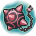

# AvatarSkill_1 (`AvatarSkill_1`) — skill details

5 entries.

### เอ็กซ์โพชั่น (Explosion) · uid 1281

**Type:** Attack · **Max Lv:** 1 · **Weapons:** Hand, OneHandSword, TwoHandSword, Bow, Bowgun, Rod, Magictool, Knuckle, Halberd, Katana · **Flags:** NoMarketSearch · **Client class:** `ExplosionAction`

> สกิลที่ลอกเลียนแบบมาจากเวทเอ็กซ์โพชั่นของเมกุมิน
> จะทำให้เป้าหมายได้รับความเสียหายจากธาตุไฟ
> ยิ่งใช้ MP มากเท่าไหร่พลังปลดปล่อยออกมาก็จะยิ่งสูงขึ้น
> เมื่อใช้งานจะทำให้ตัวผู้ใช้หมดสติ
> ไม่สามารถตั้งค่าในคอมโบได้
> ระหว่างอีเว้นท์ พลังการโจมตีและขอบเขตการใช้จะเพิ่มขึ้น

**How it works**

- Attack; usable with Hand, OneHandSword, TwoHandSword, Bow, Bowgun, Rod, Magictool, Knuckle, Halberd, Katana.
- It deals damage: the action builds a damage template and the shared damage engine finishes the calculation.
- MP: `System.Math.Max(PlayerAttackBase.CalcCostMp(this, actarAction), 100)` (conditional variants below).
- Damage (`calcPlayerToMobDamage` x1; each template is a full damage roll with its own crit):
  - `calcPlayerToMobDamage`: skill multiplier depends on helper PlayerAttackBase.CalcCostMp (formula below); skill multiplier depends on helper PlayerAttackBase.CalcCostMp (formula below); flat damage +1000; flat damage +100
- Proration: magic proration slot, mode `first_hit_per_target`.

**Cost, timing and range**

- **MP cost** (`mp` in `OnInitialize`): `System.Math.Max(PlayerAttackBase.CalcCostMp(this, actarAction), 100)`
- **MP cost** (`costMp` in `OnInitialize`): `System.Math.Max(PlayerAttackBase.CalcCostMp(this, actarAction), 100)`
- **MP cost** (`mp` in `RecalcCostMp`): `System.Math.Max(PlayerAttackBase.CalcCostMp(this, playerAction), 100)`
- **MP cost** (`costMp` in `RecalcCostMp`): `System.Math.Max(PlayerAttackBase.CalcCostMp(this, playerAction), 100)`
- **ActionRange** (`ActionRange`): `MathUtil.DisplayMeterToDistance(12)`
- **Range** (`range`) (Unity units, 2 = 1 m): `(MathUtil.DisplayMeterToDistance(4) * 3)`
- **Range** (`range`) (Unity units, 2 = 1 m): `MathUtil.DisplayMeterToDistance(4)`

**When each part runs**

- `OnInitialize` — skill setup (fields the action starts with): 10 set
- `InitializeOthers` — setup used when another player's client replays the action: 2 set
- `ActionStart` — when the cast starts: 3 set
- `ActionSkillEvent` — on an animation/skill event during the motion: 1 call
- `calcPlayerToMobDamage` — damage calculation against a monster: 2 tpl, 1 info
- `RecalcCostMp` — skill-specific method: 2 set

**Damage numbers by level** (gem bonuses assumed 0)

| | Lv1 | Lv2 | Lv3 | Lv4 | Lv5 | Lv6 | Lv7 | Lv8 | Lv9 | Lv10 |
|---|---|---|---|---|---|---|---|---|---|---|
| Flat dmg + | 1000 | 1000 | 1000 | 1000 | 1000 | 1000 | 1000 | 1000 | 1000 | 1000 |
| Flat dmg + | 100 | 100 | 100 | 100 | 100 | 100 | 100 | 100 | 100 | 100 |

**Damage terms that depend on live stats (not tabulated)**

- SkillRate × `(((((System.Math.Max(PlayerAttackBase.CalcCostMp(this, actarAction), 100) // 100) * 100) * 3)) / 100)`
- SkillRate × `(((((System.Math.Max(PlayerAttackBase.CalcCostMp(this, actarAction), 100) // 100) * 100) * 3)) / 100)`

**Every damage-template term, per method** (`int()` after each multiplier; engine terms are added by `TemplateAssignment`)

- `calcPlayerToMobDamage` (damage calculation against a monster): `AddRate[SkillRate]` = `(((((System.Math.Max(PlayerAttackBase.CalcCostMp(this, actarAction), 100) // 100) * 100) * 3)) / 100)`
- `calcPlayerToMobDamage` (damage calculation against a monster): `AddConstant[SkillConstantDamage]` = `(1000)`

Engine terms (always present): `BaseDamage`, target `Def` (after pierce), element bonus, stability, `ExpRate = p[slot]/100` (proration), type / last-damage / gem multipliers.

**Proration:** slot `Magic`, mode `first_hit_per_target`, attack type `Magic`, action id 1281
- Uses the magic proration slot; Proration changes on the FIRST damaging hit of one cast on each target only; later hits of the same cast read the updated value but do not change it.

**Status ailments**

- Uses the default ailment duration (`ActionSkillEvent`)
  - when `param ne 0 AND param ne 1 OR IsInstanceOf(actarAction, PlayerActionManager) eq 1 AND param eq 1 AND param ne 0 OR IsInstanceOf(actarAction, OtherPlayerActionManager) eq 1 AND IsInstanceOf(actarAction, PlayerActionManager) ne 1 AND param eq 1 AND param ne 0`

**Other recovered parameters**

- **MP cost** (`mp`): `System.Math.Max(PlayerAttackBase.CalcCostMp(this, actarAction), 100)`; `System.Math.Max(PlayerAttackBase.CalcCostMp(this, playerAction), 100)`
- **MP cost** (`costMp`): `System.Math.Max(PlayerAttackBase.CalcCostMp(this, actarAction), 100)`; `System.Math.Max(PlayerAttackBase.CalcCostMp(this, playerAction), 100)`
- **Range** (`range`): `(MathUtil.DisplayMeterToDistance(4) * 3)`; `MathUtil.DisplayMeterToDistance(4)`

_Raw recovered data (every method item): [trees/AvatarSkill_1.md](../trees/AvatarSkill_1.md) — uid 1281_

---

### ไลท์ออฟเซเบอร์ (LightOfSaber) · uid 1282

**Type:** Attack · **Max Lv:** 1 · **Weapons:** Hand, OneHandSword, TwoHandSword, Bow, Bowgun, Rod, Magictool, Knuckle, Halberd, Katana · **Flags:** NoMarketSearch · **Client class:** `LightOfSaberAction`

> สกิลที่ลอกเลียนแบบมาจากเวทแห่งแสงของยุนยุน
> จะทำให้เป้าหมายได้รับความเสียหายจากธาตุแสง
> ยิ่งคนในปาร์ตี้น้อยเท่าไหร่พลังโจมตีก็จะยิ่งสูงขึ้น
> ไม่สามารถตั้งค่าในคอมโบได้
> ระหว่างอีเว้นท์ พลังการโจมตีและขอบเขตการใช้จะเพิ่มขึ้น

**How it works**

- Attack; usable with Hand, OneHandSword, TwoHandSword, Bow, Bowgun, Rod, Magictool, Knuckle, Halberd, Katana.
- It deals damage: the action builds a damage template and the shared damage engine finishes the calculation.
- Damage (`calcPlayerToMobDamage` x1; each template is a full damage roll with its own crit):
  - `calcPlayerToMobDamage`: skill multiplier ×7; skill multiplier ×3.5; flat damage +600; flat damage +300
  - `calcPlayerToMobDamage` [PartyManager.get_IsParty(Singleton<PartyManager>.get_Instance(UnityEngine.GameObject.get_transform(target)))]: skill multiplier depends on live values (formula below)
- Proration: magic proration slot, mode `first_hit_per_target`.

**Cost, timing and range**

- **Cast time** (`CastTime`): `PlayerAttackBase.CalcCastTime(this, 0, PlayerActionManagerBase.get_PlayerStatus())`
- **ActionRange** (`ActionRange`): `MathUtil.DisplayMeterToDistance(12)`

**When each part runs**

- `OnInitialize` — skill setup (fields the action starts with): 9 set
- `InitializeOthers` — setup used when another player's client replays the action: 2 set
- `ActionStart` — when the cast starts: 5 set
- `calcPlayerToMobDamage` — damage calculation against a monster: 2 tpl, 1 info

**Damage numbers by level** (gem bonuses assumed 0)

| | Lv1 | Lv2 | Lv3 | Lv4 | Lv5 | Lv6 | Lv7 | Lv8 | Lv9 | Lv10 |
|---|---|---|---|---|---|---|---|---|---|---|
| SkillRate × | 7 | 7 | 7 | 7 | 7 | 7 | 7 | 7 | 7 | 7 |
| SkillRate × | 3.5 | 3.5 | 3.5 | 3.5 | 3.5 | 3.5 | 3.5 | 3.5 | 3.5 | 3.5 |
| Flat dmg + | 600 | 600 | 600 | 600 | 600 | 600 | 600 | 600 | 600 | 600 |
| Flat dmg + | 300 | 300 | 300 | 300 | 300 | 300 | 300 | 300 | 300 | 300 |

**Damage terms that depend on live stats (not tabulated)**

- SkillRate × `((700) / 100)` — PartyManager.get_IsParty(Singleton<PartyManager>.get_Instance(UnityEngine.GameObject.get_transform(target)))

**Every damage-template term, per method** (`int()` after each multiplier; engine terms are added by `TemplateAssignment`)

- `calcPlayerToMobDamage` (damage calculation against a monster): `AddRate[SkillRate]` = `((700) / 100)`
- `calcPlayerToMobDamage` (damage calculation against a monster): `AddConstant[SkillConstantDamage]` = `(600)`

Engine terms (always present): `BaseDamage`, target `Def` (after pierce), element bonus, stability, `ExpRate = p[slot]/100` (proration), type / last-damage / gem multipliers.

**Proration:** slot `Magic`, mode `first_hit_per_target`, attack type `Magic`, action id 1282
- Uses the magic proration slot; Proration changes on the FIRST damaging hit of one cast on each target only; later hits of the same cast read the updated value but do not change it.

**Other recovered parameters**

- **Cast time modifier** (`CastTime`): `PlayerAttackBase.CalcCastTime(this, 0, PlayerActionManagerBase.get_PlayerStatus())`

_Raw recovered data (every method item): [trees/AvatarSkill_1.md](../trees/AvatarSkill_1.md) — uid 1282_

---

### Morning Star (MorningStar) · uid 1283

 
**Type:** Attack · **Max Lv:** 1 · **Weapons:** Hand, OneHandSword, TwoHandSword, Bow, Bowgun, Rod, Magictool, Knuckle, Halberd, Katana · **Flags:** MercenaryCanUseSkill · **Client class:** `MorningStarAction`

> สกิลที่ทำเลียนแบบ Morning Star ของ Rem
> รูปแบบการใช้จะเปลี่ยนแปลงตามสถานะ
> ของคาแรคเตอร์เวลาใช้สกิล
> ไม่สามารถนำไปตั้งเป็นคอมโบได้
> ระหว่าง COLLABORATION พลังโจมตีจะเพิ่มขึ้นเป็นอย่างมาก!!
> Re:Zero -Starting Life in Another World-

**How it works**

- Attack; usable with Hand, OneHandSword, TwoHandSword, Bow, Bowgun, Rod, Magictool, Knuckle, Halberd, Katana.
- It deals damage: the action builds a damage template and the shared damage engine finishes the calculation.
- It installs a buff on the caster.
- Damage (`calcPlayerToMobDamage` x3; each template is a full damage roll with its own crit):
  - `calcPlayerToMobDamage` [1 eq (attackDirection eq 1 ? 2 : 1) OR 1 ne (attackDirection eq 1 ? 2 : 1) AND 2 eq (attackDirection eq 1 ? 2 : 1) OR 1 ne (attackDirection eq 1 ? 2 : 1) AND 2 ne (attackDirection eq 1 ? 2 : 1) AND 3 eq (attackDirection eq 1 ? 2 : 1)]: skill multiplier depends on Lv (formula below); skill multiplier depends on Lv (formula below); flat damage +100
- Proration: physical-skill proration slot, mode `first_hit_per_target`.
- Buffs:
  - `MorningStarBuf`
  - `SkillBufferDataBase`: marker buff (no parameters; other code tests whether it is present)

**Cost, timing and range**

- **Cast time** (`CastTime`): `int(UnityEngine.Quaternion.Internal_MakePositive(0).y)`
  - when `!PlayerAttackBase.IsBlank(this) AND InputManager.get_LeftInputKey(Singleton<InputManager>.get_Instance()) AND fsqrt(((((InputManager.get_LeftInputValue(Singleton<InputManager>.get_Instance()).x * UnityEngine.Transform.get_right(UnityEngine.Component.get_transform(UnityEngine.Camera.get_main())).z) + (InputManager.get_LeftInputValue(Singleton<InputManager>.get_Instance()).y * UnityEngine.Transform.get_forward(UnityEngine.Component.get_transform(UnityEngine.Camera.get_main())).z)) * ((InputManager.get_LeftInputValue(Singleton<InputManager>.get_Instance()).x * UnityEngine.Transform.get_right(UnityEngine.Component.get_transform(UnityEngine.Camera.get_main())).z) + (InputManager.get_LeftInputValue(Singleton<InputManager>.get_Instance()).y * UnityEngine.Transform.get_forward(UnityEngine.Component.get_transform(UnityEngine.Camera.get_main())).z))) + (((InputManager.get_LeftInputValue(Singleton<InputManager>.get_Instance()).x * UnityEngine.Transform.get_right(UnityEngine.Component.get_transform(UnityEngine.Camera.get_main())).x) + (InputManager.get_LeftInputValue(Singleton<InputManager>.get_Instance()).y * UnityEngine.Transform.get_forward(UnityEngine.Component.get_transform(UnityEngine.Camera.get_main())).x)) * ((InputManager.get_LeftInputValue(Singleton<InputManager>.get_Instance()).x * UnityEngine.Transform.get_right(UnityEngine.Component.get_transform(UnityEngine.Camera.get_main())).x) + (InputManager.get_LeftInputValue(Singleton<InputManager>.get_Instance()).y * UnityEngine.Transform.get_forward(UnityEngine.Component.get_transform(UnityEngine.Camera.get_main())).x))))) gt 1e-05 AND fsqrt((((UnityEngine.Transform.get_position(UnityEngine.GameObject.get_transform(target)).z - UnityEngine.Transform.get_position(UnityEngine.Component.get_transform(actarAction)).z) * (UnityEngine.Transform.get_position(UnityEngine.GameObject.get_transform(target)).z - UnityEngine.Transform.get_position(UnityEngine.Component.get_transform(actarAction)).z)) + ((UnityEngine.Transform.get_position(UnityEngine.GameObject.get_transform(target)).x - UnityEngine.Transform.get_position(UnityEngine.Component.get_transform(actarAction)).x) * (UnityEngine.Transform.get_position(UnityEngine.GameObject.get_transform(target)).x - UnityEngine.Transform.get_position(UnityEngine.Component.get_transform(actarAction)).x)))) gt 1e-05 OR !PlayerAttackBase.IsBlank(this) AND InputManager.get_LeftInputKey(Singleton<InputManager>.get_Instance()) AND fsqrt(((((InputManager.get_LeftInputValue(Singleton<InputManager>.get_Instance()).x * UnityEngine.Transform.get_right(UnityEngine.Component.get_transform(UnityEngine.Camera.get_main())).z) + (InputManager.get_LeftInputValue(Singleton<InputManager>.get_Instance()).y * UnityEngine.Transform.get_forward(UnityEngine.Component.get_transform(UnityEngine.Camera.get_main())).z)) * ((InputManager.get_LeftInputValue(Singleton<InputManager>.get_Instance()).x * UnityEngine.Transform.get_right(UnityEngine.Component.get_transform(UnityEngine.Camera.get_main())).z) + (InputManager.get_LeftInputValue(Singleton<InputManager>.get_Instance()).y * UnityEngine.Transform.get_forward(UnityEngine.Component.get_transform(UnityEngine.Camera.get_main())).z))) + (((InputManager.get_LeftInputValue(Singleton<InputManager>.get_Instance()).x * UnityEngine.Transform.get_right(UnityEngine.Component.get_transform(UnityEngine.Camera.get_main())).x) + (InputManager.get_LeftInputValue(Singleton<InputManager>.get_Instance()).y * UnityEngine.Transform.get_forward(UnityEngine.Component.get_transform(UnityEngine.Camera.get_main())).x)) * ((InputManager.get_LeftInputValue(Singleton<InputManager>.get_Instance()).x * UnityEngine.Transform.get_right(UnityEngine.Component.get_transform(UnityEngine.Camera.get_main())).x) + (InputManager.get_LeftInputValue(Singleton<InputManager>.get_Instance()).y * UnityEngine.Transform.get_forward(UnityEngine.Component.get_transform(UnityEngine.Camera.get_main())).x))))) gt 1e-05 AND fsqrt((((UnityEngine.Transform.get_position(UnityEngine.GameObject.get_transform(target)).z - UnityEngine.Transform.get_position(UnityEngine.Component.get_transform(actarAction)).z) * (UnityEngine.Transform.get_position(UnityEngine.GameObject.get_transform(target)).z - UnityEngine.Transform.get_position(UnityEngine.Component.get_transform(actarAction)).z)) + ((UnityEngine.Transform.get_position(UnityEngine.GameObject.get_transform(target)).x - UnityEngine.Transform.get_position(UnityEngine.Component.get_transform(actarAction)).x) * (UnityEngine.Transform.get_position(UnityEngine.GameObject.get_transform(target)).x - UnityEngine.Transform.get_position(UnityEngine.Component.get_transform(actarAction)).x)))) le 1e-05 OR !PlayerAttackBase.IsBlank(this) AND InputManager.get_LeftInputKey(Singleton<InputManager>.get_Instance()) AND fsqrt(((((InputManager.get_LeftInputValue(Singleton<InputManager>.get_Instance()).x * UnityEngine.Transform.get_right(UnityEngine.Component.get_transform(UnityEngine.Camera.get_main())).z) + (InputManager.get_LeftInputValue(Singleton<InputManager>.get_Instance()).y * UnityEngine.Transform.get_forward(UnityEngine.Component.get_transform(UnityEngine.Camera.get_main())).z)) * ((InputManager.get_LeftInputValue(Singleton<InputManager>.get_Instance()).x * UnityEngine.Transform.get_right(UnityEngine.Component.get_transform(UnityEngine.Camera.get_main())).z) + (InputManager.get_LeftInputValue(Singleton<InputManager>.get_Instance()).y * UnityEngine.Transform.get_forward(UnityEngine.Component.get_transform(UnityEngine.Camera.get_main())).z))) + (((InputManager.get_LeftInputValue(Singleton<InputManager>.get_Instance()).x * UnityEngine.Transform.get_right(UnityEngine.Component.get_transform(UnityEngine.Camera.get_main())).x) + (InputManager.get_LeftInputValue(Singleton<InputManager>.get_Instance()).y * UnityEngine.Transform.get_forward(UnityEngine.Component.get_transform(UnityEngine.Camera.get_main())).x)) * ((InputManager.get_LeftInputValue(Singleton<InputManager>.get_Instance()).x * UnityEngine.Transform.get_right(UnityEngine.Component.get_transform(UnityEngine.Camera.get_main())).x) + (InputManager.get_LeftInputValue(Singleton<InputManager>.get_Instance()).y * UnityEngine.Transform.get_forward(UnityEngine.Component.get_transform(UnityEngine.Camera.get_main())).x))))) le 1e-05 AND fsqrt((((UnityEngine.Transform.get_position(UnityEngine.GameObject.get_transform(target)).z - UnityEngine.Transform.get_position(UnityEngine.Component.get_transform(actarAction)).z) * (UnityEngine.Transform.get_position(UnityEngine.GameObject.get_transform(target)).z - UnityEngine.Transform.get_position(UnityEngine.Component.get_transform(actarAction)).z)) + ((UnityEngine.Transform.get_position(UnityEngine.GameObject.get_transform(target)).x - UnityEngine.Transform.get_position(UnityEngine.Component.get_transform(actarAction)).x) * (UnityEngine.Transform.get_position(UnityEngine.GameObject.get_transform(target)).x - UnityEngine.Transform.get_position(UnityEngine.Component.get_transform(actarAction)).x)))) gt 1e-05`
- **ActionRange** (`ActionRange`): `MathUtil.DisplayMeterToDistance(6)`

**When each part runs**

- `OnInitialize` — skill setup (fields the action starts with): 6 set
- `ActionPreparation` — before the cast starts: 11 set
- `ActionStart` — when the cast starts: 2 call
- `InitializeOthers` — setup used when another player's client replays the action: 2 set
- `ActionStartOthers` — skill-specific method: 1 set
- `calcPlayerToMobDamage` — damage calculation against a monster: 2 tpl, 3 info
- `.<>c__DisplayClass27_0::<ActionStart>b__0` — skill-specific method: 1 call

**Damage numbers by level** (gem bonuses assumed 0)

| | Lv1 | Lv2 | Lv3 | Lv4 | Lv5 | Lv6 | Lv7 | Lv8 | Lv9 | Lv10 |
|---|---|---|---|---|---|---|---|---|---|---|
| Flat dmg + | 100 | 100 | 100 | 100 | 100 | 100 | 100 | 100 | 100 | 100 |

**Damage terms that depend on live stats (not tabulated)**

- SkillRate × `(((((Lv * 30) + ((status.Lv lt 0 ? (status.Lv + 3) : status.Lv) >> 2)) + 300)) / 100)` — 1 eq (attackDirection eq 1 ? 2 : 1) OR 1 ne (attackDirection eq 1 ? 2 : 1) AND 2 eq (attackDirection eq 1 ? 2 : 1) OR 1 ne (attackDirection eq 1 ? 2 : 1) AND 2 ne (attackDirection eq 1 ? 2 : 1) AND 3 eq (attackDirection eq 1 ? 2 : 1)
- SkillRate × `(((((Lv * 30) + ((status.Lv lt 0 ? (status.Lv + 3) : status.Lv) >> 2)) + 300)) / 100)` — 1 eq (attackDirection eq 1 ? 2 : 1) OR 1 ne (attackDirection eq 1 ? 2 : 1) AND 2 eq (attackDirection eq 1 ? 2 : 1) OR 1 ne (attackDirection eq 1 ? 2 : 1) AND 2 ne (attackDirection eq 1 ? 2 : 1) AND 3 eq (attackDirection eq 1 ? 2 : 1)

**Every damage-template term, per method** (`int()` after each multiplier; engine terms are added by `TemplateAssignment`)

- `calcPlayerToMobDamage` (damage calculation against a monster): `AddRate[SkillRate]` = `(((((Lv * 30) + ((status.Lv lt 0 ? (status.Lv + 3) : status.Lv) >> 2)) + 300)) / 100)`
  - when `1 eq (attackDirection eq 1 ? 2 : 1) OR 1 ne (attackDirection eq 1 ? 2 : 1) AND 2 eq (attackDirection eq 1 ? 2 : 1) OR 1 ne (attackDirection eq 1 ? 2 : 1) AND 2 ne (attackDirection eq 1 ? 2 : 1) AND 3 eq (attackDirection eq 1 ? 2 : 1)`
- `calcPlayerToMobDamage` (damage calculation against a monster): `AddConstant[SkillConstantDamage]` = `(100)`
  - when `1 eq (attackDirection eq 1 ? 2 : 1) OR 1 ne (attackDirection eq 1 ? 2 : 1) AND 2 eq (attackDirection eq 1 ? 2 : 1) OR 1 ne (attackDirection eq 1 ? 2 : 1) AND 2 ne (attackDirection eq 1 ? 2 : 1) AND 3 eq (attackDirection eq 1 ? 2 : 1)`

Engine terms (always present): `BaseDamage`, target `Def` (after pierce), element bonus, stability, `ExpRate = p[slot]/100` (proration), type / last-damage / gem multipliers.

**Proration:** slot `Skill`, mode `first_hit_per_target`, attack type `Physics`, action id 1283
- Uses the physical-skill proration slot; Proration changes on the FIRST damaging hit of one cast on each target only; later hits of the same cast read the updated value but do not change it.

**Buffs and effects it installs or removes**

- `ActionStart` (when the cast starts): constructs `MorningStarBuf` — `.ctor(Lv, isEvent)`
  - when `!PlayerAttackBase.IsBlank(this) AND UnityEngine.Object.op_Inequality(actarAction)`
- `ActionStart` (when the cast starts): adds the caster's buff of `new MorningStarBuf` — `AddSelfBuffer(new MorningStarBuf, Id)`
  - when `!PlayerAttackBase.IsBlank(this) AND UnityEngine.Object.op_Inequality(actarAction)`
- `.<>c__DisplayClass27_0::<ActionStart>b__0` (method): removes the caster's buff of `CharacterActionManagerBase.get_IsLocalDead()` — `RemoveSelfBuffer(CharacterActionManagerBase.get_IsLocalDead())`

**Other recovered parameters**

- **Cast time modifier** (`CastTime`): `int(UnityEngine.Quaternion.Internal_MakePositive(0).y)` _(when !PlayerAttackBase.IsBlank(this) AND InputManager.get_LeftInputKey(Singleton<InputManager>.get_Instance()) AND fsqrt(((((InputManager.get_LeftInputValue(Singleton<InputManager>.get_Instance()).x * UnityEngine.Transform.get_right(UnityEngine.Component.get_transform(UnityEngine.Camera.get_main())).z) + (InputManager.get_LeftInputValue(Singleton<InputManager>.get_Instance()).y * UnityEngine.Transform.get_forward(UnityEngine.Component.get_transform(UnityEngine.Camera.get_main())).z)) * ((InputManager.get_LeftInputValue(Singleton<InputManager>.get_Instance()).x * UnityEngine.Transform.get_right(UnityEngine.Component.get_transform(UnityEngine.Camera.get_main())).z) + (InputManager.get_LeftInputValue(Singleton<InputManager>.get_Instance()).y * UnityEngine.Transform.get_forward(UnityEngine.Component.get_transform(UnityEngine.Camera.get_main())).z))) + (((InputManager.get_LeftInputValue(Singleton<InputManager>.get_Instance()).x * UnityEngine.Transform.get_right(UnityEngine.Component.get_transform(UnityEngine.Camera.get_main())).x) + (InputManager.get_LeftInputValue(Singleton<InputManager>.get_Instance()).y * UnityEngine.Transform.get_forward(UnityEngine.Component.get_transform(UnityEngine.Camera.get_main())).x)) * ((InputManager.get_LeftInputValue(Singleton<InputManager>.get_Instance()).x * UnityEngine.Transform.get_right(UnityEngine.Component.get_transform(UnityEngine.Camera.get_main())).x) + (InputManager.get_LeftInputValue(Singleton<InputManager>.get_Instance()).y * UnityEngine.Transform.get_forward(UnityEngine.Component.get_transform(UnityEngine.Camera.get_main())).x))))) gt 1e-05 AND fsqrt((((UnityEngine.Transform.get_position(UnityEngine.GameObject.get_transform(target)).z - UnityEngine.Transform.get_position(UnityEngine.Component.get_transform(actarAction)).z) * (UnityEngine.Transform.get_position(UnityEngine.GameObject.get_transform(target)).z - UnityEngine.Transform.get_position(UnityEngine.Component.get_transform(actarAction)).z)) + ((UnityEngine.Transform.get_position(UnityEngine.GameObject.get_transform(target)).x - UnityEngine.Transform.get_position(UnityEngine.Component.get_transform(actarAction)).x) * (UnityEngine.Transform.get_position(UnityEngine.GameObject.get_transform(target)).x - UnityEngine.Transform.get_position(UnityEngine.Component.get_transform(actarAction)).x)))) gt 1e-05 OR !PlayerAttackBase.IsBlank(this) AND InputManager.get_LeftInputKey(Singleton<InputManager>.get_Instance()) AND fsqrt(((((InputManager.get_LeftInputValue(Singleton<InputManager>.get_Instance()).x * UnityEngine.Transform.get_right(UnityEngine.Component.get_transform(UnityEngine.Camera.get_main())).z) + (InputManager.get_LeftInputValue(Singleton<InputManager>.get_Instance()).y * UnityEngine.Transform.get_forward(UnityEngine.Component.get_transform(UnityEngine.Camera.get_main())).z)) * ((InputManager.get_LeftInputValue(Singleton<InputManager>.get_Instance()).x * UnityEngine.Transform.get_right(UnityEngine.Component.get_transform(UnityEngine.Camera.get_main())).z) + (InputManager.get_LeftInputValue(Singleton<InputManager>.get_Instance()).y * UnityEngine.Transform.get_forward(UnityEngine.Component.get_transform(UnityEngine.Camera.get_main())).z))) + (((InputManager.get_LeftInputValue(Singleton<InputManager>.get_Instance()).x * UnityEngine.Transform.get_right(UnityEngine.Component.get_transform(UnityEngine.Camera.get_main())).x) + (InputManager.get_LeftInputValue(Singleton<InputManager>.get_Instance()).y * UnityEngine.Transform.get_forward(UnityEngine.Component.get_transform(UnityEngine.Camera.get_main())).x)) * ((InputManager.get_LeftInputValue(Singleton<InputManager>.get_Instance()).x * UnityEngine.Transform.get_right(UnityEngine.Component.get_transform(UnityEngine.Camera.get_main())).x) + (InputManager.get_LeftInputValue(Singleton<InputManager>.get_Instance()).y * UnityEngine.Transform.get_forward(UnityEngine.Component.get_transform(UnityEngine.Camera.get_main())).x))))) gt 1e-05 AND fsqrt((((UnityEngine.Transform.get_position(UnityEngine.GameObject.get_transform(target)).z - UnityEngine.Transform.get_position(UnityEngine.Component.get_transform(actarAction)).z) * (UnityEngine.Transform.get_position(UnityEngine.GameObject.get_transform(target)).z - UnityEngine.Transform.get_position(UnityEngine.Component.get_transform(actarAction)).z)) + ((UnityEngine.Transform.get_position(UnityEngine.GameObject.get_transform(target)).x - UnityEngine.Transform.get_position(UnityEngine.Component.get_transform(actarAction)).x) * (UnityEngine.Transform.get_position(UnityEngine.GameObject.get_transform(target)).x - UnityEngine.Transform.get_position(UnityEngine.Component.get_transform(actarAction)).x)))) le 1e-05 OR !PlayerAttackBase.IsBlank(this) AND InputManager.get_LeftInputKey(Singleton<InputManager>.get_Instance()) AND fsqrt(((((InputManager.get_LeftInputValue(Singleton<InputManager>.get_Instance()).x * UnityEngine.Transform.get_right(UnityEngine.Component.get_transform(UnityEngine.Camera.get_main())).z) + (InputManager.get_LeftInputValue(Singleton<InputManager>.get_Instance()).y * UnityEngine.Transform.get_forward(UnityEngine.Component.get_transform(UnityEngine.Camera.get_main())).z)) * ((InputManager.get_LeftInputValue(Singleton<InputManager>.get_Instance()).x * UnityEngine.Transform.get_right(UnityEngine.Component.get_transform(UnityEngine.Camera.get_main())).z) + (InputManager.get_LeftInputValue(Singleton<InputManager>.get_Instance()).y * UnityEngine.Transform.get_forward(UnityEngine.Component.get_transform(UnityEngine.Camera.get_main())).z))) + (((InputManager.get_LeftInputValue(Singleton<InputManager>.get_Instance()).x * UnityEngine.Transform.get_right(UnityEngine.Component.get_transform(UnityEngine.Camera.get_main())).x) + (InputManager.get_LeftInputValue(Singleton<InputManager>.get_Instance()).y * UnityEngine.Transform.get_forward(UnityEngine.Component.get_transform(UnityEngine.Camera.get_main())).x)) * ((InputManager.get_LeftInputValue(Singleton<InputManager>.get_Instance()).x * UnityEngine.Transform.get_right(UnityEngine.Component.get_transform(UnityEngine.Camera.get_main())).x) + (InputManager.get_LeftInputValue(Singleton<InputManager>.get_Instance()).y * UnityEngine.Transform.get_forward(UnityEngine.Component.get_transform(UnityEngine.Camera.get_main())).x))))) le 1e-05 AND fsqrt((((UnityEngine.Transform.get_position(UnityEngine.GameObject.get_transform(target)).z - UnityEngine.Transform.get_position(UnityEngine.Component.get_transform(actarAction)).z) * (UnityEngine.Transform.get_position(UnityEngine.GameObject.get_transform(target)).z - UnityEngine.Transform.get_position(UnityEngine.Component.get_transform(actarAction)).z)) + ((UnityEngine.Transform.get_position(UnityEngine.GameObject.get_transform(target)).x - UnityEngine.Transform.get_position(UnityEngine.Component.get_transform(actarAction)).x) * (UnityEngine.Transform.get_position(UnityEngine.GameObject.get_transform(target)).x - UnityEngine.Transform.get_position(UnityEngine.Component.get_transform(actarAction)).x)))) gt 1e-05)_

**Buff values** (every recovered field; durations in seconds)

**Buff `MorningStarBuf`**
- `MobLastDamageRateBuf` = `(((isEvent & 1) ne 0 ? (Lv + 20) : Lv))` _(when BuffEffectActive ne 0)_
- `MobLastDamageRateBuf` = `0` _(when BuffEffectActive eq 0)_
- Buff fields set in the constructor (all recovered):
  - `damageCut` = `((isEvent & 1) ne 0 ? (Lv + 20) : Lv)`
**Buff `SkillBufferDataBase`**
- Attached to this skill via `caller2:MorningStarBuf$$.ctor<-MorningStarAction$$ActionStart` (no direct constructor call in the skill's own code).
- Buff hook methods: `get_BufEffectTakeId`, `get_IsAbnormalDamageCancel`, `get_IsDamageCancel`, `get_IsEnd`, `get_IsRange`, `get_IsSelfAction`, `get_LeftTime`, `get_Level`, `set_IsDamageCancel`, `set_IsEnd`, `set_IsSelfAction`, `set_LeftTime`, `set_Level`
- Hook `set_Level`: `Level`=value
- Hook `set_IsSelfAction`: `IsSelfAction`=(value & 1)
- Hook `set_IsDamageCancel`: `IsDamageCancel`=(value & 1)
- Hook `set_LeftTime`: `LeftTime`=value

Parameter meanings (inferred from the `SkillBufferId` names):

- `MobLastDamageRateBuf`: final damage multiplier vs monsters (buff category)

_Raw recovered data (every method item): [trees/AvatarSkill_1.md](../trees/AvatarSkill_1.md) — uid 1283_

---

### 1284 (DivaCheering) · uid 1284

 
**Type:** Buffer · **Max Lv:** 1 · **Weapons:** Hand, OneHandSword, TwoHandSword, Bow, Bowgun, Rod, Magictool, Knuckle, Halberd, Katana · **Flags:** NoMarketSearch

**How it works**

- Buffer; usable with Hand, OneHandSword, TwoHandSword, Bow, Bowgun, Rod, Magictool, Knuckle, Halberd, Katana.
- It installs a buff on the caster.
- Client status: **consumer-only** — no action class; effect applied in consumer code (see page).
- Buffs:
  - `DivaCheeringBuf`: lasts `10` s; Lv1 → Lv10: CspdUp (cast speed +) 750 → 750, Aspd (attack speed +) 750 → 750, AttackMprecoveryUp (MP recovered per attack (flat)) 15 → 15
- Its effect is applied by client code: `NewWaveRoomData$$ReceiveMinusHateEvent` (formulas in the last section).
- Other client code reads this skill (1 lookup; see the last section).

**Buff values** (every recovered field; durations in seconds)

**Buff `DivaCheeringBuf`**
- Attached to this skill via `name` (no direct constructor call in the skill's own code).
- Duration: `10` s
- `LastDmgUpRate` = `(lastDamageRate)` _(when BuffEffectActive ne 0)_

| | Lv1 | Lv2 | Lv3 | Lv4 | Lv5 | Lv6 | Lv7 | Lv8 | Lv9 | Lv10 |
|---|---|---|---|---|---|---|---|---|---|---|
| CspdUp | 750 | 750 | 750 | 750 | 750 | 750 | 750 | 750 | 750 | 750 |
| Aspd | 750 | 750 | 750 | 750 | 750 | 750 | 750 | 750 | 750 | 750 |
| AttackMprecoveryUp | 15 | 15 | 15 | 15 | 15 | 15 | 15 | 15 | 15 | 15 |

- Buff fields set in the constructor (all recovered):
  - `aspd` = `750` = 750
  - `cspd` = `750` = 750
  - `atkMpHeal` = `15` = 15
  - `lastDamageRate` = `lastDamageRate`
- Hook `Updata`: `LeftTime`=(LeftTime - UnityEngine.Time.get_deltaTime())

Parameter meanings (inferred from the `SkillBufferId` names):

- `Aspd`: attack speed +
- `AttackMprecoveryUp`: MP recovered per attack (flat)
- `CspdUp`: cast speed +
- `LastDmgUpRate`: final damage dealt %

**Where else this skill takes effect**

- Effect applied in `NewWaveRoomData$$ReceiveMinusHateEvent` (18 guarded paths):
  - always
    - calls `PlayerDataManager$$GetPlayerDataManager`, `PlayerDataManager$$get_PlayerArchetypeId`, `PlayerDataManager$$get_SkillBufferManager`, `0x165db78`, `Singleton<object>$$get_Instance`, `Singleton<object>$$get_Instance`, `0x165db78`, `System.Action<int, Int32Enum, int>$$.ctor`
  - always
    - calls `PlayerDataManager$$GetPlayerDataManager`, `PlayerDataManager$$get_PlayerArchetypeId`, `PlayerDataManager$$get_SkillBufferManager`, `0x165db78`, `Singleton<object>$$get_Instance`, `Singleton<object>$$get_Instance`, `0x165db78`, `System.Action<int, Int32Enum, int>$$.ctor`
  - always
    - calls `PlayerDataManager$$GetPlayerDataManager`, `PlayerDataManager$$get_PlayerArchetypeId`, `PlayerDataManager$$get_SkillBufferManager`, `0x165db78`, `Singleton<object>$$get_Instance`, `Singleton<object>$$get_Instance`, `0x165db78`, `System.Action<int, Int32Enum, int>$$.ctor`
  - always
    - calls `PlayerDataManager$$GetPlayerDataManager`, `PlayerDataManager$$get_PlayerArchetypeId`, `PlayerDataManager$$get_SkillBufferManager`, `0x165db78`, `DivaCheeringBuf$$.ctor`, `PlayerDataManager$$get_SkillBufferManager`, `SkillBufferManager$$AddBuffer`, `Toram.Common.ArchetypeUid$$get_Type`
  - always
    - calls `PlayerDataManager$$GetPlayerDataManager`, `PlayerDataManager$$get_PlayerArchetypeId`, `PlayerDataManager$$get_SkillBufferManager`, `0x165db78`, `DivaCheeringBuf$$.ctor`, `PlayerDataManager$$get_SkillBufferManager`, `SkillBufferManager$$AddBuffer`, `Toram.Common.ArchetypeUid$$get_Type`
  - always
    - calls `PlayerDataManager$$GetPlayerDataManager`, `PlayerDataManager$$get_PlayerArchetypeId`, `PlayerDataManager$$get_SkillBufferManager`, `0x165db78`, `DivaCheeringBuf$$.ctor`, `PlayerDataManager$$get_SkillBufferManager`, `SkillBufferManager$$AddBuffer`, `Toram.Common.ArchetypeUid$$get_Type`
  - always
    - calls `PlayerDataManager$$GetPlayerDataManager`, `PlayerDataManager$$get_PlayerArchetypeId`, `PlayerDataManager$$get_PlayerArchetypeId`, `PlayerDataManager$$get_SkillBufferManager`, `0x165db78`, `Singleton<object>$$get_Instance`, `Singleton<object>$$get_Instance`, `0x165db78`
  - always
    - calls `PlayerDataManager$$GetPlayerDataManager`, `PlayerDataManager$$get_PlayerArchetypeId`, `PlayerDataManager$$get_PlayerArchetypeId`, `PlayerDataManager$$get_SkillBufferManager`, `0x165db78`, `Singleton<object>$$get_Instance`, `Singleton<object>$$get_Instance`, `0x165db78`
- Code that reads this skill's level / buff by constant id: `NewWaveRoomData$$ReceiveMinusHateEvent (ContainsBuffer)`

_Raw recovered data (every method item): [trees/AvatarSkill_1.md](../trees/AvatarSkill_1.md) — uid 1284_

---

### ดราก้อนสเลฟ / ดราก้อนสเลฟ (DragSlave) · uid 1285

**Type:** Attack · **Max Lv:** 1 · **Weapons:** Hand, OneHandSword, TwoHandSword, Bow, Bowgun, Rod, Magictool, Knuckle, Halberd, Katana · **Flags:** NoMarketSearch · **Client class:** `DragSlaveAction`

> สกิลที่มีโมเดลมาจากดราก้อนสเลฟ
> สร้างความเสียหายแบบไร้ธาตุกับเป้าหมาย
> พลังจะเพิ่มขึ้นตาม MP ที่ใช้และ MP สูงสุด
> ทุกเป้าหมายที่โดนจะติด[อ่อนแอ]และ[ลดการป้องกัน]
> ใช้กับคอมโบไม่ได้
> พลังจะเพิ่มขึ้นอย่างมากระหว่างโคลาโบ!!

**How it works**

- Attack; usable with Hand, OneHandSword, TwoHandSword, Bow, Bowgun, Rod, Magictool, Knuckle, Halberd, Katana.
- It deals damage: the action builds a damage template and the shared damage engine finishes the calculation.
- It can inflict a status ailment (chance and type below).
- MP: `PlayerAttackBase.CalcCostMp(this, actarAction)` (conditional variants below).
- Damage (`calcPlayerToMobDamage` x1; each template is a full damage roll with its own crit):
  - `calcPlayerToMobDamage` [first eq 0 AND target.Element eq 7 OR first eq 0 AND target.Element ne 7 OR PlayerAttackBase.checkAbnormalPercent(this, 10, breakPercent, playerAction) AND first eq 0 AND target.Element eq 7]: skill multiplier depends on helper PlayerAttackBase.CalcCostMp (formula below); skill multiplier depends on helper PlayerAttackBase.CalcCostMp (formula below); flat damage depends on live values (formula below)
- Proration: magic proration slot, mode `first_hit_per_target`.
- Can inflict on the target: Collapse (16), Breaking (10).

**Cost, timing and range**

- **MP cost** (`mp` in `OnInitialize`): `PlayerAttackBase.CalcCostMp(this, actarAction)`
- **MP cost** (`costMp` in `OnInitialize`): `PlayerAttackBase.CalcCostMp(this, actarAction)`
- **Cast time** (`CastTime`): `PlayerAttackBase.CalcCastTime(this, 5, PlayerActionManagerBase.get_PlayerStatus())`
- **ActionRange** (`ActionRange`): `MathUtil.DisplayMeterToDistance(12)`
- **Attack range** (`attackRange`) (Unity units, 2 = 1 m): `MathUtil.DisplayMeterToDistance(min((((max((PlayerAttackBase.get_Mp() - 1000), 0) // 100) * 0.5) + ((PlayerAttackBase.get_Mp() lt 1000 ? PlayerAttackBase.get_Mp() : 1000) // 100)), 15))`

**When each part runs**

- `OnInitialize` — skill setup (fields the action starts with): 11 set
- `ActionStart` — when the cast starts: 4 set
- `InitializeOthers` — setup used when another player's client replays the action: 2 set
- `ActionStartOthers` — skill-specific method: 3 set
- `CheckRangeHit` — range-hit test: 2 set
- `ActionSkillEvent` — on an animation/skill event during the motion: 3 set
- `NextRangeHit` — next range-hit pass: 1 set
- `calcPlayerToMobDamage` — damage calculation against a monster: 4 call, 5 tpl, 1 info

**Damage terms that depend on live stats (not tabulated)**

- SkillRate × `((((int(((((PlayerSecondaryStatus.CalcBaseMaxMp(PlayerStatusBase.get_SecondaryStatus()) / 20) * 0.5) * (PlayerAttackBase.CalcCostMp(this, actarAction) / 200)) + (((PlayerSecondaryStatus.CalcBaseMaxMp(PlayerStatusBase.get_SecondaryStatus()) / 20) * (((PlayerAttackBase.CalcCostMp(this, actarAction) / 200) / 20) + 0.5)) * 10))) + int(((((PlayerSecondaryStatus.CalcBaseMaxMp(PlayerStatusBase.get_SecondaryStatus()) / 20) * 0.5) * (PlayerAttackBase.CalcCostMp(this, actarAction) / 200)) + (((PlayerSecondaryStatus.CalcBaseMaxMp(PlayerStatusBase.get_SecondaryStatus()) / 20) * (((PlayerAttackBase.CalcCostMp(this, actarAction) / 200) / 20) + 0.5)) * 10)))) mi 4000 ? (int(((((PlayerSecondaryStatus.CalcBaseMaxMp(PlayerStatusBase.get_SecondaryStatus()) / 20) * 0.5) * (PlayerAttackBase.CalcCostMp(this, actarAction) / 200)) + (((PlayerSecondaryStatus.CalcBaseMaxMp(PlayerStatusBase.get_SecondaryStatus()) / 20) * (((PlayerAttackBase.CalcCostMp(this, actarAction) / 200) / 20) + 0.5)) * 10))) + int(((((PlayerSecondaryStatus.CalcBaseMaxMp(PlayerStatusBase.get_SecondaryStatus()) / 20) * 0.5) * (PlayerAttackBase.CalcCostMp(this, actarAction) / 200)) + (((PlayerSecondaryStatus.CalcBaseMaxMp(PlayerStatusBase.get_SecondaryStatus()) / 20) * (((PlayerAttackBase.CalcCostMp(this, actarAction) / 200) / 20) + 0.5)) * 10)))) : 4000)) / 100)` — first eq 0 AND target.Element eq 7 OR first eq 0 AND target.Element ne 7 OR PlayerAttackBase.checkAbnormalPercent(this, 10, breakPercent, playerAction) AND first eq 0 AND target.Element eq 7
- SkillRate × `((((int(((((PlayerSecondaryStatus.CalcBaseMaxMp(PlayerStatusBase.get_SecondaryStatus()) / 20) * 0.5) * (PlayerAttackBase.CalcCostMp(this, actarAction) / 200)) + (((PlayerSecondaryStatus.CalcBaseMaxMp(PlayerStatusBase.get_SecondaryStatus()) / 20) * (((PlayerAttackBase.CalcCostMp(this, actarAction) / 200) / 20) + 0.5)) * 10))) + int(((((PlayerSecondaryStatus.CalcBaseMaxMp(PlayerStatusBase.get_SecondaryStatus()) / 20) * 0.5) * (PlayerAttackBase.CalcCostMp(this, actarAction) / 200)) + (((PlayerSecondaryStatus.CalcBaseMaxMp(PlayerStatusBase.get_SecondaryStatus()) / 20) * (((PlayerAttackBase.CalcCostMp(this, actarAction) / 200) / 20) + 0.5)) * 10)))) mi 4000 ? (int(((((PlayerSecondaryStatus.CalcBaseMaxMp(PlayerStatusBase.get_SecondaryStatus()) / 20) * 0.5) * (PlayerAttackBase.CalcCostMp(this, actarAction) / 200)) + (((PlayerSecondaryStatus.CalcBaseMaxMp(PlayerStatusBase.get_SecondaryStatus()) / 20) * (((PlayerAttackBase.CalcCostMp(this, actarAction) / 200) / 20) + 0.5)) * 10))) + int(((((PlayerSecondaryStatus.CalcBaseMaxMp(PlayerStatusBase.get_SecondaryStatus()) / 20) * 0.5) * (PlayerAttackBase.CalcCostMp(this, actarAction) / 200)) + (((PlayerSecondaryStatus.CalcBaseMaxMp(PlayerStatusBase.get_SecondaryStatus()) / 20) * (((PlayerAttackBase.CalcCostMp(this, actarAction) / 200) / 20) + 0.5)) * 10)))) : 4000)) / 100)` — first eq 0 AND target.Element eq 7 OR first eq 0 AND target.Element ne 7 OR PlayerAttackBase.checkAbnormalPercent(this, 10, breakPercent, playerAction) AND first eq 0 AND target.Element eq 7
- Flat dmg + `(((PlayerAttackBase.get_Mp() // 100) * 50))` — first eq 0 AND target.Element eq 7 OR first eq 0 AND target.Element ne 7 OR PlayerAttackBase.checkAbnormalPercent(this, 10, breakPercent, playerAction) AND first eq 0 AND target.Element eq 7

**Every damage-template term, per method** (`int()` after each multiplier; engine terms are added by `TemplateAssignment`)

- `calcPlayerToMobDamage` (damage calculation against a monster): `AddRate[SkillRate]` = `((((int(((((PlayerSecondaryStatus.CalcBaseMaxMp(PlayerStatusBase.get_SecondaryStatus()) / 20) * 0.5) * (PlayerAttackBase.CalcCostMp(this, actarAction) / 200)) + (((PlayerSecondaryStatus.CalcBaseMaxMp(PlayerStatusBase.get_SecondaryStatus()) / 20) * (((PlayerAttackBase.CalcCostMp(this, actarAction) / 200) / 20) + 0.5)) * 10))) + int(((((PlayerSecondaryStatus.CalcBaseMaxMp(PlayerStatusBase.get_SecondaryStatus()) / 20) * 0.5) * (PlayerAttackBase.CalcCostMp(this, actarAction) / 200)) + (((PlayerSecondaryStatus.CalcBaseMaxMp(PlayerStatusBase.get_SecondaryStatus()) / 20) * (((PlayerAttackBase.CalcCostMp(this, actarAction) / 200) / 20) + 0.5)) * 10)))) mi 4000 ? (int(((((PlayerSecondaryStatus.CalcBaseMaxMp(PlayerStatusBase.get_SecondaryStatus()) / 20) * 0.5) * (PlayerAttackBase.CalcCostMp(this, actarAction) / 200)) + (((PlayerSecondaryStatus.CalcBaseMaxMp(PlayerStatusBase.get_SecondaryStatus()) / 20) * (((PlayerAttackBase.CalcCostMp(this, actarAction) / 200) / 20) + 0.5)) * 10))) + int(((((PlayerSecondaryStatus.CalcBaseMaxMp(PlayerStatusBase.get_SecondaryStatus()) / 20) * 0.5) * (PlayerAttackBase.CalcCostMp(this, actarAction) / 200)) + (((PlayerSecondaryStatus.CalcBaseMaxMp(PlayerStatusBase.get_SecondaryStatus()) / 20) * (((PlayerAttackBase.CalcCostMp(this, actarAction) / 200) / 20) + 0.5)) * 10)))) : 4000)) / 100)`
  - when `first eq 0 AND target.Element eq 7 OR first eq 0 AND target.Element ne 7 OR PlayerAttackBase.checkAbnormalPercent(this, 10, breakPercent, playerAction) AND first eq 0 AND target.Element eq 7`
- `calcPlayerToMobDamage` (damage calculation against a monster): `AddConstant[SkillConstantDamage]` = `(((PlayerAttackBase.get_Mp() // 100) * 50))`
  - when `first eq 0 AND target.Element eq 7 OR first eq 0 AND target.Element ne 7 OR PlayerAttackBase.checkAbnormalPercent(this, 10, breakPercent, playerAction) AND first eq 0 AND target.Element eq 7`
- `calcPlayerToMobDamage` (damage calculation against a monster): `SetRate[ExpRate]` = `(target.ExpDefMagic / 100)`
  - when `first eq 0 AND target.Element eq 7 OR first eq 0 AND target.Element ne 7 OR PlayerAttackBase.checkAbnormalPercent(this, 10, breakPercent, playerAction) AND first eq 0 AND target.Element eq 7`
- `calcPlayerToMobDamage` (damage calculation against a monster): `AddRate[ElementBonusRate]` = `((25) / 100)`
  - when `first eq 0 AND target.Element eq 7 OR PlayerAttackBase.checkAbnormalPercent(this, 10, breakPercent, playerAction) AND first eq 0 AND target.Element eq 7 OR !PlayerAttackBase.checkAbnormalPercent(this, 10, breakPercent, playerAction) AND first eq 0 AND target.Element eq 7`
- `calcPlayerToMobDamage` (damage calculation against a monster): `SetRate[ExpRate]` = `(targetMagicExpList[MobActionManagerBase.get_gameObject(mobAction)] / 100)`
  - when `first eq 0 AND target.Element eq 7 OR first eq 0 AND target.Element ne 7 OR PlayerAttackBase.checkAbnormalPercent(this, 10, breakPercent, playerAction) AND first eq 0 AND target.Element eq 7`

Engine terms (always present): `BaseDamage`, target `Def` (after pierce), element bonus, stability, `ExpRate = p[slot]/100` (proration), type / last-damage / gem multipliers.

**Proration:** slot `Magic`, mode `first_hit_per_target`, attack type `Magic`, action id 1285
- Uses the magic proration slot; Proration changes on the FIRST damaging hit of one cast on each target only; later hits of the same cast read the updated value but do not change it.

**Status ailments**

- Chance field `breakPercent` (ailment chance): `((PlayerAttackBase.CalcCostMp(this, actarAction) // 10) lt 100 ? (PlayerAttackBase.CalcCostMp(this, actarAction) // 10) : 100)`
- Rolls `100`% to inflict **Collapse (16)** (`calcPlayerToMobDamage`)
  - when `PlayerAttackBase.checkAbnormalPercent(this, 16, 100, playerAction) AND first ne 0 OR !PlayerAttackBase.checkAbnormalPercent(this, 16, 100, playerAction) AND first ne 0`
- Marks the hit with ailment **Collapse (16)** (`calcPlayerToMobDamage`)
  - when `PlayerAttackBase.checkAbnormalPercent(this, 16, 100, playerAction) AND first ne 0`
- Rolls `breakPercent`% to inflict **Breaking (10)** (`calcPlayerToMobDamage`)
  - when `PlayerAttackBase.checkAbnormalPercent(this, 10, breakPercent, playerAction) AND first eq 0 AND target.Element eq 7 OR !PlayerAttackBase.checkAbnormalPercent(this, 10, breakPercent, playerAction) AND first eq 0 AND target.Element eq 7 OR PlayerAttackBase.checkAbnormalPercent(this, 10, breakPercent, playerAction) AND first eq 0 AND target.Element ne 7`
- Marks the hit with ailment **Breaking (10)** (`calcPlayerToMobDamage`)
  - when `PlayerAttackBase.checkAbnormalPercent(this, 10, breakPercent, playerAction) AND first eq 0 AND target.Element eq 7 OR PlayerAttackBase.checkAbnormalPercent(this, 10, breakPercent, playerAction) AND first eq 0 AND target.Element ne 7`

**Other recovered parameters**

- **MP cost** (`mp`): `PlayerAttackBase.CalcCostMp(this, actarAction)`
- **MP cost** (`costMp`): `PlayerAttackBase.CalcCostMp(this, actarAction)`
- **Attack range** (`attackRange`): `MathUtil.DisplayMeterToDistance(min((((max((PlayerAttackBase.get_Mp() - 1000), 0) // 100) * 0.5) + ((PlayerAttackBase.get_Mp() lt 1000 ? PlayerAttackBase.get_Mp() : 1000) // 100)), 15))`
- **Cast time modifier** (`CastTime`): `PlayerAttackBase.CalcCastTime(this, 5, PlayerActionManagerBase.get_PlayerStatus())`

_Raw recovered data (every method item): [trees/AvatarSkill_1.md](../trees/AvatarSkill_1.md) — uid 1285_

---
