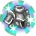

# GuardSkill (`GuardSkill`) — skill details

7 entries.

### เฮวี่อาร์เมอร์มาสเตอรี่ (HeavyArmorMastary) · uid 161

 
**Type:** Mastery · **Max Lv:** 30 · **Weapons:** HevyArmor · **Flags:** StarGem · **Client class:** `HeavyArmorMastary` (passive mastery)

> เพิ่มการฟื้นฟู Guard ของเกราะหนักที่ปรับแต่งแล้วเมื่อสวมใส่

**How it works**

- Mastery; usable with HevyArmor.
- It is a passive: while learned it returns stat bonuses from `GetMasteryParam`, no cast is needed.
- Passive modifiers (negative = penalty): Guard (guard rate) 1 at Lv1 to 10 at Lv10.

**Passive modifiers by level** (`GetMasteryParam(MasteryId)`; negative = penalty)

| | Lv1 | Lv2 | Lv3 | Lv4 | Lv5 | Lv6 | Lv7 | Lv8 | Lv9 | Lv10 |
|---|---|---|---|---|---|---|---|---|---|---|
| Guard | 1 | 2 | 3 | 4 | 5 | 6 | 7 | 8 | 9 | 10 |

Bonus meanings (inferred from the names):

- `Guard`: guard rate

_Raw recovered data (every method item): [trees/GuardSkill.md](../trees/GuardSkill.md) — uid 161_

---

### ไลท์อาร์เมอร์มาสเตอรี่ (LightArmorMastary) · uid 162

 
**Type:** Mastery · **Max Lv:** 30 · **Weapons:** LightArmor · **Flags:** StarGem · **Client class:** `LightArmorMastary` (passive mastery)

> เพิ่มการฟื้นฟู  Avoid ของเกราะเบาที่ปรับแต่งแล้วเมื่อสวมใส่

**How it works**

- Mastery; usable with LightArmor.
- It is a passive: while learned it returns stat bonuses from `GetMasteryParam`, no cast is needed.
- Passive modifiers (negative = penalty): Avoid (dodge) 1 at Lv1 to 10 at Lv10.

**Passive modifiers by level** (`GetMasteryParam(MasteryId)`; negative = penalty)

| | Lv1 | Lv2 | Lv3 | Lv4 | Lv5 | Lv6 | Lv7 | Lv8 | Lv9 | Lv10 |
|---|---|---|---|---|---|---|---|---|---|---|
| Avoid | 1 | 2 | 3 | 4 | 5 | 6 | 7 | 8 | 9 | 10 |

Bonus meanings (inferred from the names):

- `Avoid`: dodge

_Raw recovered data (every method item): [trees/GuardSkill.md](../trees/GuardSkill.md) — uid 162_

---

### แอดวานซ์การ์ด (AdvanceGuard) · uid 163

 
**Type:** Mastery · **Max Lv:** 120 · **Weapons:** HevyArmor · **Requires:** เฮวี่อาร์เมอร์มาสเตอรี่ · **Client class:** `AdvanceGuard` (passive mastery)

> เพิ่ม(การลดความเสียหาย)ด้วยพลัง Guard
> และเพิ่มการฟื้นฟู Guard ของเกราะหนักที่ปรับแต่งแล้ว
> เล็กน้อยเมื่อสวมใส่

**How it works**

- Mastery; usable with HevyArmor.
- It is a passive: while learned it returns stat bonuses from `GetMasteryParam`, no cast is needed.
- Passive modifiers (negative = penalty): Guard (guard rate) 0 at Lv1 to 5 at Lv10, GuardPower (guard power) 1 at Lv1 to 5 at Lv10.

**Passive modifiers by level** (`GetMasteryParam(MasteryId)`; negative = penalty)

| | Lv1 | Lv2 | Lv3 | Lv4 | Lv5 | Lv6 | Lv7 | Lv8 | Lv9 | Lv10 |
|---|---|---|---|---|---|---|---|---|---|---|
| Guard | 0 | 1 | 1 | 2 | 2 | 3 | 3 | 4 | 4 | 5 |
| GuardPower | 1 | 1 | 2 | 2 | 3 | 3 | 4 | 4 | 5 | 5 |

Bonus meanings (inferred from the names):

- `Guard`: guard rate
- `GuardPower`: guard power

_Raw recovered data (every method item): [trees/GuardSkill.md](../trees/GuardSkill.md) — uid 163_

---

### แอดวานซ์อีวาชั่น (AdvanceFlee) · uid 164

 
**Type:** Mastery · **Max Lv:** 120 · **Weapons:** LightArmor · **Requires:** ไลท์อาร์เมอร์มาสเตอรี่ · **Client class:** `AdvanceFlee` (passive mastery)

> เพิ่มการฟื้นฟู  Avoid ของเกราะเบาที่ปรับแต่งแล้วเมื่อสวมใส่
> 
> จำนวนที่ลดลงต่อเลเวลเท่ากับผลของ
> ไลท์อาร์เมอร์มาสเตอรี่.

**How it works**

- Mastery; usable with LightArmor.
- It is a passive: while learned it returns stat bonuses from `GetMasteryParam`, no cast is needed.
- Passive modifiers (negative = penalty): Avoid (dodge) 1 at Lv1 to 10 at Lv10.

**Passive modifiers by level** (`GetMasteryParam(MasteryId)`; negative = penalty)

| | Lv1 | Lv2 | Lv3 | Lv4 | Lv5 | Lv6 | Lv7 | Lv8 | Lv9 | Lv10 |
|---|---|---|---|---|---|---|---|---|---|---|
| Avoid | 1 | 2 | 3 | 4 | 5 | 6 | 7 | 8 | 9 | 10 |

Bonus meanings (inferred from the names):

- `Avoid`: dodge

_Raw recovered data (every method item): [trees/GuardSkill.md](../trees/GuardSkill.md) — uid 164_

---

### ฟิซิคัลการ์ด (PhysicalGuard) · uid 165

 
**Type:** Mastery · **Max Lv:** 180 · **Weapons:** Hand, OneHandSword, TwoHandSword, Bow, Bowgun, Rod, Magictool, Knuckle, Halberd, Katana · **Requires:** เฮวี่อาร์เมอร์มาสเตอรี่ · **Client class:** `PhysicalGuard` (passive mastery)

> เพิ่มความต้านทานความผิดปกติจาก Guard เมื่อ HP เหลือน้อย
> 
> ถ้าสกิลเลเวลเพิ่มขึ้นจะใช้งานได้กับ
> จำนวน HP ที่เหลือเพิ่มมากขึ้น

**How it works**

- Mastery; usable with Hand, OneHandSword, TwoHandSword, Bow, Bowgun, Rod, Magictool, Knuckle, Halberd, Katana.
- It is a passive: while learned it returns stat bonuses from `GetMasteryParam`, no cast is needed.
- Passive modifiers (negative = penalty): Trigger (trigger chance (%)) 14 at Lv1 to 50 at Lv10.

**Passive modifiers by level** (`GetMasteryParam(MasteryId)`; negative = penalty)

| | Lv1 | Lv2 | Lv3 | Lv4 | Lv5 | Lv6 | Lv7 | Lv8 | Lv9 | Lv10 |
|---|---|---|---|---|---|---|---|---|---|---|
| Trigger | 14 | 18 | 22 | 26 | 30 | 34 | 38 | 42 | 46 | 50 |

Bonus meanings (inferred from the names):

- `Trigger`: trigger chance (%)

_Raw recovered data (every method item): [trees/GuardSkill.md](../trees/GuardSkill.md) — uid 165_

---

### มิราจอีวาชั่น (MirageStep) · uid 166

 
**Type:** Mastery · **Max Lv:** 180 · **Weapons:** Hand, OneHandSword, TwoHandSword, Bow, Bowgun, Rod, Magictool, Knuckle, Halberd, Katana · **Requires:** ไลท์อาร์เมอร์มาสเตอรี่ · **Client class:** `MirageStep` (passive mastery)

> ใช้ Avoid ได้ระหว่างกำลังชาร์จหรือร่ายเวทย์
> 
> เมื่อใช้ไปครั้งหนึ่งแล้วผลจะหายไปในเวลาไม่กี่วินาที
> ขึ้นอยู่กับสกิลเลเวล

**How it works**

- Mastery; usable with Hand, OneHandSword, TwoHandSword, Bow, Bowgun, Rod, Magictool, Knuckle, Halberd, Katana.
- It installs a buff on the caster.
- It is a passive: while learned it returns stat bonuses from `GetMasteryParam`, no cast is needed.
- Buffs:
  - `MirageStepBuf`: lasts `(20 - lv)` s
- Passive modifiers (negative = penalty): Trigger (trigger chance (%)) 19 at Lv1 to 10 at Lv10.
- Other client code reads this skill (2 lookups; see the last section).

**Buff values** (every recovered field; durations in seconds)

**Buff `MirageStepBuf`**
- Attached to this skill via `name` (no direct constructor call in the skill's own code).
- Duration: `(20 - lv)` s
- Hook `Updata`: `LeftTime`=(LeftTime - UnityEngine.Time.get_deltaTime())

**Passive modifiers by level** (`GetMasteryParam(MasteryId)`; negative = penalty)

| | Lv1 | Lv2 | Lv3 | Lv4 | Lv5 | Lv6 | Lv7 | Lv8 | Lv9 | Lv10 |
|---|---|---|---|---|---|---|---|---|---|---|
| Trigger | 19 | 18 | 17 | 16 | 15 | 14 | 13 | 12 | 11 | 10 |

Bonus meanings (inferred from the names):

- `Trigger`: trigger chance (%)

**Where else this skill takes effect**

- Code that reads this skill's level / buff by constant id: `AvoidActionManager$$AvoidMove (GetSkillLv)`, `AvoidActionManager$$AvoidStart (GetSkillLv)`

_Raw recovered data (every method item): [trees/GuardSkill.md](../trees/GuardSkill.md) — uid 166_

---

### #ガードスキル · uid 192

**Type:** Unknown

**How it works**

- Unknown.
- Client status: **no-client-code** — tree-header placeholder: no SkillId enum entry (enum jumps 168 -> 193), max_level 0, no text/icon.

_Raw recovered data (every method item): [trees/GuardSkill.md](../trees/GuardSkill.md) — uid 192_

---
