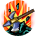
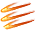
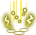

# ハルバードスキル (`HalberdSkill`) — skill details

22 entries.

### เฟลชสเต็ป (FlashStub) · uid 961

 
**Tree:** ハルバードスキル (`HalberdSkill`, tier 1) · **Type:** Attack · **Max Lv:** 10 · **Weapons:** OneHandSword, Halberd · **Flags:** StarGem, MercenaryCanUseSkill · **Client class:** `FlashStubAction`

> โจมตีศัตรูอย่างแม่นยำด้วยการเคลื่อนไหวที่รวดเร็ว

**How it works**

- Attack skill of the ハルバードスキル tree (tier 1, max Lv 10); usable with OneHandSword, Halberd.
- It deals damage: the action builds a damage template and the shared damage engine finishes the calculation.
- Damage (`calcPlayerToMobDamage` x1; each template is a full damage roll with its own crit):
  - `calcPlayerToMobDamage`: skill multiplier ×1.05 at Lv1 to 1.5 at Lv10; flat damage +55 at Lv1 to 100 at Lv10
- Proration: physical-skill proration slot, mode `first_hit_per_target`.

**Cost, timing and range**

- **ActionRange** (`ActionRange`): `PlayerAttackBase.GetWeaponRange(GetWeaponType.item(actarAction))`
- **Element**: follows the element of the equipped weapon.

**When each part runs**

- `OnInitialize` — skill setup (fields the action starts with): 4 set
- `InitializeOthers` — setup used when another player's client replays the action: 2 set
- `calcPlayerToMobDamage` — damage calculation against a monster: 1 set, 2 tpl, 1 info

**Damage numbers by level** (gem bonuses assumed 0)

| | Lv1 | Lv2 | Lv3 | Lv4 | Lv5 | Lv6 | Lv7 | Lv8 | Lv9 | Lv10 |
|---|---|---|---|---|---|---|---|---|---|---|
| SkillRate × | 1.05 | 1.1 | 1.15 | 1.2 | 1.25 | 1.3 | 1.35 | 1.4 | 1.45 | 1.5 |
| Flat dmg + | 55 | 60 | 65 | 70 | 75 | 80 | 85 | 90 | 95 | 100 |

**Every damage-template term, per method** (`int()` after each multiplier; engine terms are added by `TemplateAssignment`)

- `calcPlayerToMobDamage` (damage calculation against a monster): `SetRate[SkillRate]` = `(((((Lv * 5) + 100) + gemCart(111[4])) / 100))`
- `calcPlayerToMobDamage` (damage calculation against a monster): `SetConstant[SkillConstantDamage]` = `(((Lv + (Lv << 2)) + 50))`

Engine terms (always present): `BaseDamage`, target `Def` (after pierce), element bonus, stability, `ExpRate = p[slot]/100` (proration), type / last-damage / gem multipliers.

**Proration:** slot `Skill`, mode `first_hit_per_target`, attack type `Physics`, action id 961
- Uses the physical-skill proration slot; Proration changes on the FIRST damaging hit of one cast on each target only; later hits of the same cast read the updated value but do not change it.

**In-game level notes**

- Lv9: *เพิ่มความเร็วในการใช้

_Raw recovered data (every method item): [trees/HalberdSkill.md](../trees/HalberdSkill.md) — uid 961_

---

### แคนนอนสเปียร์ (CannonSpear) · uid 962

 
**Tree:** ハルバードスキル (`HalberdSkill`, tier 1) · **Type:** Attack · **Max Lv:** 10 · **Weapons:** Halberd · **Requires:** เฟลชสเต็ป · **Flags:** StarGem, MercenaryCanUseSkill · **Client class:** `CannonSpearAction`

> โจมตีด้วยการปาหอกวายุ
> ระยะโจมตีจะเพิ่มขึ้นเมื่อเลเวลเพิ่มขึ้น

**How it works**

- Attack skill of the ハルバードスキル tree (tier 1, max Lv 10); usable with Halberd.
- It deals damage: the action builds a damage template and the shared damage engine finishes the calculation.
- It can inflict a status ailment (chance and type below).
- Damage (`calcPlayerToMobDamage` x1; each template is a full damage roll with its own crit):
  - `calcPlayerToMobDamage` [isFristAttck ne 0 AND skillRate.Length ne 0 OR PlayerAttackBase.checkAbnormalPercent(this, 1, gemCart(112[2]), playerAction) AND isFristAttck ne 0 AND skillRate.Length ne 0 OR !PlayerAttackBase.checkAbnormalPercent(this, 1, gemCart(112[2]), playerAction) AND isFristAttck ne 0 AND skillRate.Length ne 0]: skill multiplier depends on live values (formula below)
  - `calcPlayerToMobDamage` [isFristAttck eq 0 AND skillRate.Length hi 1]: skill multiplier depends on live values (formula below)
  - `calcPlayerToMobDamage` [isFristAttck ne 0 AND skillRate.Length ne 0 OR isFristAttck eq 0 AND skillRate.Length hi 1 OR PlayerAttackBase.checkAbnormalPercent(this, 1, gemCart(112[2]), playerAction) AND isFristAttck ne 0 AND skillRate.Length ne 0]: flat damage +110 at Lv1 to 200 at Lv10
- Proration: physical-skill proration slot, mode `first_hit_per_target`.
- Can inflict on the target: Flinch (1).

**Cost, timing and range**

- **Range** (`range`) (Unity units, 2 = 1 m): `MathUtil.DisplayMeterToDistance(((((Lv - 1) + (((Lv - 1) & 0x8000) >> 15)) >> 1) + 8))`
- **ActionRange** (`ActionRange`): `PlayerAttackBase.GetWeaponRange(GetWeaponType.item(actarAction))`
- **Element**: follows the element of the equipped weapon.

**When each part runs**

- `OnInitialize` — skill setup (fields the action starts with): 8 set
- `InitializeOthers` — setup used when another player's client replays the action: 2 set
- `ActionStart` — when the cast starts: 1 set
- `NextRangeHit` — next range-hit pass: 1 set
- `calcPlayerToMobDamage` — damage calculation against a monster: 1 set, 5 tpl, 3 call, 1 info

**Damage numbers by level** (gem bonuses assumed 0)

| | Lv1 | Lv2 | Lv3 | Lv4 | Lv5 | Lv6 | Lv7 | Lv8 | Lv9 | Lv10 |
|---|---|---|---|---|---|---|---|---|---|---|
| Flat dmg + | 110 | 120 | 130 | 140 | 150 | 160 | 170 | 180 | 190 | 200 |

**Damage terms that depend on live stats (not tabulated)**

- SkillRate × `skillRate[0]` — isFristAttck ne 0 AND skillRate.Length ne 0 OR PlayerAttackBase.checkAbnormalPercent(this, 1, gemCart(112[2]), playerAction) AND isFristAttck ne 0 AND skillRate.Length ne 0 OR !PlayerAttackBase.checkAbnormalPercent(this, 1, gemCart(112[2]), playerAction) AND isFristAttck ne 0 AND skillRate.Length ne 0
- SkillRate × `skillRate[1]` — isFristAttck eq 0 AND skillRate.Length hi 1

**Every damage-template term, per method** (`int()` after each multiplier; engine terms are added by `TemplateAssignment`)

- `calcPlayerToMobDamage` (damage calculation against a monster): `SetRate[ExpRate]` = `(target.ExpDefSkill / 100)`
  - when `isFristAttck ne 0 AND skillRate.Length ne 0 OR isFristAttck ne 0 AND skillRate.Length eq 0 OR isFristAttck eq 0 AND skillRate.Length hi 1`
- `calcPlayerToMobDamage` (damage calculation against a monster): `AddRate[SkillRate]` = `skillRate[0]`
  - when `isFristAttck ne 0 AND skillRate.Length ne 0 OR PlayerAttackBase.checkAbnormalPercent(this, 1, gemCart(112[2]), playerAction) AND isFristAttck ne 0 AND skillRate.Length ne 0 OR !PlayerAttackBase.checkAbnormalPercent(this, 1, gemCart(112[2]), playerAction) AND isFristAttck ne 0 AND skillRate.Length ne 0`
- `calcPlayerToMobDamage` (damage calculation against a monster): `AddConstant[SkillConstantDamage]` = `((((Lv + (Lv << 2)) << 1) + 100))`
  - when `isFristAttck ne 0 AND skillRate.Length ne 0 OR isFristAttck eq 0 AND skillRate.Length hi 1 OR PlayerAttackBase.checkAbnormalPercent(this, 1, gemCart(112[2]), playerAction) AND isFristAttck ne 0 AND skillRate.Length ne 0`
- `calcPlayerToMobDamage` (damage calculation against a monster): `AddRate[SkillRate]` = `skillRate[1]`
  - when `isFristAttck eq 0 AND skillRate.Length hi 1`
- `calcPlayerToMobDamage` (damage calculation against a monster): `SetRate[ExpRate]` = `(targetExpRegister[MobActionManagerBase.get_CharacterActionManagerBase(mobAction)] / 100)`
  - when `isFristAttck ne 0 AND skillRate.Length ne 0 OR isFristAttck ne 0 AND skillRate.Length eq 0 OR isFristAttck eq 0 AND skillRate.Length hi 1`

Engine terms (always present): `BaseDamage`, target `Def` (after pierce), element bonus, stability, `ExpRate = p[slot]/100` (proration), type / last-damage / gem multipliers.

**Proration:** slot `Skill`, mode `first_hit_per_target`, attack type `Physics`, action id 962
- Uses the physical-skill proration slot; Proration changes on the FIRST damaging hit of one cast on each target only; later hits of the same cast read the updated value but do not change it.

**Status ailments**

- Rolls `gemCart(112[2])`% to inflict **Flinch (1)** (`calcPlayerToMobDamage`)
  - when `PlayerAttackBase.checkAbnormalPercent(this, 1, gemCart(112[2]), playerAction) AND isFristAttck ne 0 AND skillRate.Length ne 0 OR !PlayerAttackBase.checkAbnormalPercent(this, 1, gemCart(112[2]), playerAction) AND isFristAttck ne 0 AND skillRate.Length ne 0`
- Marks the hit with ailment **Flinch (1)** (`calcPlayerToMobDamage`)
  - when `PlayerAttackBase.checkAbnormalPercent(this, 1, gemCart(112[2]), playerAction) AND isFristAttck ne 0 AND skillRate.Length ne 0`

**Buffs and effects it installs or removes**

- `calcPlayerToMobDamage` (damage calculation against a monster): adds the buff-provided flat damage to the template — `SetBufferConstantDamage(PlayerAttackBase.TemplateAssignment(this, new SkillCalcTemplate, playerAction, mobAction), 2)`
  - when `isFristAttck ne 0 AND skillRate.Length ne 0 OR isFristAttck eq 0 AND skillRate.Length hi 1 OR PlayerAttackBase.checkAbnormalPercent(this, 1, gemCart(112[2]), playerAction) AND isFristAttck ne 0 AND skillRate.Length ne 0`

**Other recovered parameters**

- **Range** (`range`): `MathUtil.DisplayMeterToDistance(((((Lv - 1) + (((Lv - 1) & 0x8000) >> 15)) >> 1) + 8))`

_Raw recovered data (every method item): [trees/HalberdSkill.md](../trees/HalberdSkill.md) — uid 962_

---

### เดดลี่สเปียร์ (DeadlySpear) · uid 963

 
**Tree:** ハルバードスキル (`HalberdSkill`, tier 1) · **Type:** Attack · **Max Lv:** 10 · **Weapons:** OneHandSword, Halberd · **Requires:** เฟลชสเต็ป · **Flags:** StarGem, MercenaryCanUseSkill · **Client class:** `DeadlySpearAction`

> แทงศัตรูได้แม่นยำและสร้างความเสียหายอย่างรุนแรง
> แม้การใช้สกิลกินเวลานานแต่จะเพิกเฉยต่อการป้องกันได้ในระดับหนึ่ง
> ทำให้มีโอกาสมากที่จะเกิดความเสียหายจากคริติคอลอย่างรุนแรง
> ถ้าสกิลนี้ติดคริติคอล จะลดการ MP ที่ใช้ของสกิลถัดไปลงครึ่งหนึ่ง

**How it works**

- Attack skill of the ハルバードスキル tree (tier 1, max Lv 10); usable with OneHandSword, Halberd.
- It deals damage: the action builds a damage template and the shared damage engine finishes the calculation.
- It installs a buff on the caster.
- Damage (`calcPlayerToMobDamage` x1; each template is a full damage roll with its own crit):
  - `calcPlayerToMobDamage` [mainWeapon == OneHandSword]: skill multiplier ×1.1 at Lv1 to 1.5 at Lv10
  - `calcPlayerToMobDamage` [mainWeapon != OneHandSword]: skill multiplier ×1.3 at Lv1 to 1.7 at Lv10
  - `calcPlayerToMobDamage`: flat damage +83 at Lv1 to 110 at Lv10
- Proration: physical-skill proration slot, mode `first_hit_per_target`.
- Buffs:
  - `DeadlySpearBuf`: marker buff (no parameters; other code tests whether it is present)
- Other client code reads this skill (3 lookups; see the last section).

**Cost, timing and range**

- **Cast time** (`CastTime`): `(int(((11 - Lv) * 0.3)) * 0.5)` → Lv1..10 [1.5, 1.0, 1.0, 1.0, 0.5, 0.5, 0.5, 0.0, 0.0, 0.0]
- **ActionRange** (`ActionRange`): `PlayerAttackBase.GetWeaponRange(GetWeaponType.item(actarAction))`
- **Element**: follows the element of the equipped weapon.

**When each part runs**

- `OnInitialize` — skill setup (fields the action starts with): 8 set
- `InitializeOthers` — setup used when another player's client replays the action: 2 set
- `calcPlayerToMobDamage` — damage calculation against a monster: 2 set, 2 tpl, 1 info
- `ActionHit` — when the attack connects: 1 call

**Damage numbers by level** (gem bonuses assumed 0)

| | Lv1 | Lv2 | Lv3 | Lv4 | Lv5 | Lv6 | Lv7 | Lv8 | Lv9 | Lv10 |
|---|---|---|---|---|---|---|---|---|---|---|
| SkillRate × [mainWeapon == OneHandSword] | 1.1 | 1.1 | 1.15 | 1.2 | 1.25 | 1.3 | 1.35 | 1.4 | 1.45 | 1.5 |
| SkillRate × [mainWeapon != OneHandSword] | 1.3 | 1.3 | 1.35 | 1.4 | 1.45 | 1.5 | 1.55 | 1.6 | 1.65 | 1.7 |
| Flat dmg + | 83 | 86 | 89 | 92 | 95 | 98 | 101 | 104 | 107 | 110 |

**Every damage-template term, per method** (`int()` after each multiplier; engine terms are added by `TemplateAssignment`)

- `calcPlayerToMobDamage` (damage calculation against a monster): `SetRate[SkillRate]` = `(((((((Lv hi 2 ? Lv : 2) - 2) * 5) + 130) + -20) / 100))`
- `calcPlayerToMobDamage` (damage calculation against a monster): `SetConstant[SkillConstantDamage]` = `(((Lv + (Lv << 1)) + 80))`

Engine terms (always present): `BaseDamage`, target `Def` (after pierce), element bonus, stability, `ExpRate = p[slot]/100` (proration), type / last-damage / gem multipliers.

**Proration:** slot `Skill`, mode `first_hit_per_target`, attack type `Physics`, action id 963
- Uses the physical-skill proration slot; Proration changes on the FIRST damaging hit of one cast on each target only; later hits of the same cast read the updated value but do not change it.

**Status ailments**

- Chance field `criticalPercent` (Extra critical chance (%)): `50` = 50
  - when `mainWeapon == OneHandSword`
- Chance field `criticalPercent` (Extra critical chance (%)): `300` = 300
  - when `mainWeapon != OneHandSword`

**Buffs and effects it installs or removes**

- `ActionHit` (when the attack connects): adds the caster's buff of skill 963 (DeadlySpear) — `AddSelfBuffer(963, Lv, Id)`
  - when `MobaMode eq 0 AND UnityEngine.Object.op_Inequality(actarAction) AND isCritical ne 0`

**Other recovered parameters**

- **Resistance value** (`resist`): `((int((Lv * 0.3)) + (int((Lv * 0.3)) << 2)) + 10)` → Lv1..10 [10, 10, 10, 15, 15, 15, 20, 20, 20, 25]
- **Cast time modifier** (`CastTime`): `(int(((11 - Lv) * 0.3)) * 0.5)` → Lv1..10 [1.5, 1.0, 1.0, 1.0, 0.5, 0.5, 0.5, 0.0, 0.0, 0.0]

**Buff values** (every recovered field; durations in seconds)

**Buff `DeadlySpearBuf`**
- Attached to this skill via `factory:CreateSkillBuffer` (no direct constructor call in the skill's own code).

**In-game level notes**

- Lv9: *พลัง+20
- Lv10: *ลดอัตราคริติคอล

**Where else this skill takes effect**

- Effect applied in `PlayerAttackBase$$CalcCostMp` (300 guarded paths, truncated):
  - when `(SkillBufferManager.TryGetBuf<object>(?blr, 105, stkp(-56), meta(0x399f9d8, Method$SkillBufferManager.TryGetBuf<MagicImpactBuf>())) & 1) ne 0` AND `TryGetBuf<object>.out2() ne 0` AND `(SkillBufferManager.TryGetBuf(?blr, 627, stkp(-40), 0) & 1) ne 0` AND `TryGetBuf.out2() ne 0`
    - returns `300`
    - set `CostMpType` = `6`
    - calls `InflexibilityBuf$$CheckMpHalving`, `EquipItemData.WeaponTypeCalculatorBase$$get_WeaponType`, `MultipleHuntBuf$$CheckMode`, `virtual PlayerAttackBase.get_ActionID`, `AbnormalStateManager$$Contains`, `AshuraAuraBuf$$CheckMpIncrease`
  - when `(SkillBufferManager.TryGetBuf<object>(?blr, 105, stkp(-56), meta(0x399f9d8, Method$SkillBufferManager.TryGetBuf<MagicImpactBuf>())) & 1) ne 0` AND `TryGetBuf<object>.out2() ne 0` AND `(SkillBufferManager.TryGetBuf(?blr, 627, stkp(-40), 0) & 1) ne 0` AND `TryGetBuf.out2() ne 0`
    - returns `200`
    - set `CostMpType` = `2`
    - calls `InflexibilityBuf$$CheckMpHalving`, `EquipItemData.WeaponTypeCalculatorBase$$get_WeaponType`, `MultipleHuntBuf$$CheckMode`, `virtual PlayerAttackBase.get_ActionID`, `AbnormalStateManager$$Contains`, `AshuraAuraBuf$$CheckMpIncrease`
  - when `(SkillBufferManager.TryGetBuf<object>(?blr, 105, stkp(-56), meta(0x399f9d8, Method$SkillBufferManager.TryGetBuf<MagicImpactBuf>())) & 1) ne 0` AND `TryGetBuf<object>.out2() ne 0` AND `(SkillBufferManager.TryGetBuf(?blr, 627, stkp(-40), 0) & 1) ne 0` AND `TryGetBuf.out2() ne 0`
    - returns `200`
    - set `CostMpType` = `2`
    - calls `InflexibilityBuf$$CheckMpHalving`, `EquipItemData.WeaponTypeCalculatorBase$$get_WeaponType`, `MultipleHuntBuf$$CheckMode`, `virtual PlayerAttackBase.get_ActionID`, `AbnormalStateManager$$Contains`, `AshuraAuraBuf$$CheckMpIncrease`
  - when `(SkillBufferManager.TryGetBuf<object>(?blr, 105, stkp(-56), meta(0x399f9d8, Method$SkillBufferManager.TryGetBuf<MagicImpactBuf>())) & 1) ne 0` AND `TryGetBuf<object>.out2() ne 0` AND `(SkillBufferManager.TryGetBuf(?blr, 627, stkp(-40), 0) & 1) ne 0` AND `TryGetBuf.out2() ne 0`
    - returns `200`
    - set `CostMpType` = `2`
    - calls `InflexibilityBuf$$CheckMpHalving`, `EquipItemData.WeaponTypeCalculatorBase$$get_WeaponType`, `MultipleHuntBuf$$CheckMode`, `virtual PlayerAttackBase.get_ActionID`, `AbnormalStateManager$$Contains`
  - when `(SkillBufferManager.TryGetBuf<object>(?blr, 105, stkp(-56), meta(0x399f9d8, Method$SkillBufferManager.TryGetBuf<MagicImpactBuf>())) & 1) ne 0` AND `TryGetBuf<object>.out2() ne 0` AND `(SkillBufferManager.TryGetBuf(?blr, 627, stkp(-40), 0) & 1) ne 0` AND `TryGetBuf.out2() ne 0`
    - returns `200`
    - set `CostMpType` = `4`
    - calls `InflexibilityBuf$$CheckMpHalving`, `EquipItemData.WeaponTypeCalculatorBase$$get_WeaponType`, `MultipleHuntBuf$$CheckMode`, `virtual PlayerAttackBase.get_ActionID`, `AbnormalStateManager$$Contains`, `AshuraAuraBuf$$CheckMpIncrease`
  - when `(SkillBufferManager.TryGetBuf<object>(?blr, 105, stkp(-56), meta(0x399f9d8, Method$SkillBufferManager.TryGetBuf<MagicImpactBuf>())) & 1) ne 0` AND `TryGetBuf<object>.out2() ne 0` AND `(SkillBufferManager.TryGetBuf(?blr, 627, stkp(-40), 0) & 1) ne 0` AND `TryGetBuf.out2() ne 0`
    - returns `100`
    - set `CostMpType` = `0`
    - calls `InflexibilityBuf$$CheckMpHalving`, `EquipItemData.WeaponTypeCalculatorBase$$get_WeaponType`, `MultipleHuntBuf$$CheckMode`, `virtual PlayerAttackBase.get_ActionID`, `AbnormalStateManager$$Contains`, `AshuraAuraBuf$$CheckMpIncrease`
  - when `(SkillBufferManager.TryGetBuf<object>(?blr, 105, stkp(-56), meta(0x399f9d8, Method$SkillBufferManager.TryGetBuf<MagicImpactBuf>())) & 1) ne 0` AND `TryGetBuf<object>.out2() ne 0` AND `(SkillBufferManager.TryGetBuf(?blr, 627, stkp(-40), 0) & 1) ne 0` AND `TryGetBuf.out2() ne 0`
    - returns `100`
    - set `CostMpType` = `0`
    - calls `InflexibilityBuf$$CheckMpHalving`, `EquipItemData.WeaponTypeCalculatorBase$$get_WeaponType`, `MultipleHuntBuf$$CheckMode`, `virtual PlayerAttackBase.get_ActionID`, `AbnormalStateManager$$Contains`, `AshuraAuraBuf$$CheckMpIncrease`
  - when `(SkillBufferManager.TryGetBuf<object>(?blr, 105, stkp(-56), meta(0x399f9d8, Method$SkillBufferManager.TryGetBuf<MagicImpactBuf>())) & 1) ne 0` AND `TryGetBuf<object>.out2() ne 0` AND `(SkillBufferManager.TryGetBuf(?blr, 627, stkp(-40), 0) & 1) ne 0` AND `TryGetBuf.out2() ne 0`
    - returns `100`
    - set `CostMpType` = `0`
    - calls `InflexibilityBuf$$CheckMpHalving`, `EquipItemData.WeaponTypeCalculatorBase$$get_WeaponType`, `MultipleHuntBuf$$CheckMode`, `virtual PlayerAttackBase.get_ActionID`, `AbnormalStateManager$$Contains`
- Effect applied in `PlayerAttackBase$$RemoveAfterSkillBuf` (300 guarded paths, truncated):
  - when `TryGetValue.out2() ne 0` AND `PlayerAttackBase.get_ActionID() ne 517`
    - returns `SkillBufferManager.RemoveSelfBuffer(?blr, 1129, 0, ?x3)`
    - set `_motionSpeed` = `CharacterActionManagerBase.set_DefaultMoveSpeed()`
    - set `appliedQuicklyMotionSpeedValue` = `255`
    - set `appliedQuicklyType` = `(((appliedQuicklyType | 2) | 16) | 8)`
    - calls `virtual PlayerAttackBase.get_ActionID`, `PlayerAttackBase$$ContainsNotApplicableSkill`, `virtual CharacterActionManagerBase.set_DefaultMoveSpeed`, `SkillBufferManager$$RemoveSelfBuffer`, `SkillBufferManager$$RemoveBuffer`, `SkillBufferManager$$RemoveBuffer`, `SkillBufferManager$$RemoveBuffer`, `virtual PlayerAttackBase.get_ActionID`
  - when `TryGetValue.out2() ne 0` AND `PlayerAttackBase.get_ActionID() ne 517`
    - returns `SkillBufferManager.TryGetBuf(?blr, 1129, stkp(-88), 0)`
    - set `_motionSpeed` = `((SkillActionBase.get_MotionSpeed(this, 0, ?mi, ?x3) - CharacterActionManagerBase.set_DefaultMoveSpeed()) gt 50 ? (SkillActionBase.get_MotionSpeed(this, 0, ?mi, ?x3) - CharacterActionManagerBase.set_DefaultMoveSpeed()) : 50)`
    - set `appliedQuicklyMotionSpeedValue` = `CharacterActionManagerBase.set_DefaultMoveSpeed()`
    - set `appliedQuicklyType` = `((appliedQuicklyType | 2) | 16)`
    - calls `virtual PlayerAttackBase.get_ActionID`, `PlayerAttackBase$$ContainsNotApplicableSkill`, `virtual CharacterActionManagerBase.set_DefaultMoveSpeed`, `SkillBufferManager$$RemoveSelfBuffer`, `SkillBufferManager$$RemoveBuffer`, `SkillBufferManager$$RemoveBuffer`, `SkillBufferManager$$RemoveBuffer`, `virtual PlayerAttackBase.get_ActionID`
  - when `TryGetValue.out2() ne 0` AND `PlayerAttackBase.get_ActionID() ne 517`
    - returns `SkillBufferManager.RemoveSelfBuffer(?blr, 1129, 0, ?x3)`
    - set `_motionSpeed` = `CharacterActionManagerBase.set_DefaultMoveSpeed()`
    - set `appliedQuicklyMotionSpeedValue` = `255`
    - set `appliedQuicklyType` = `(((appliedQuicklyType | 2) | 16) | 8)`
    - calls `virtual PlayerAttackBase.get_ActionID`, `PlayerAttackBase$$ContainsNotApplicableSkill`, `virtual CharacterActionManagerBase.set_DefaultMoveSpeed`, `SkillBufferManager$$RemoveSelfBuffer`, `SkillBufferManager$$RemoveBuffer`, `SkillBufferManager$$RemoveBuffer`, `SkillBufferManager$$RemoveBuffer`, `virtual PlayerAttackBase.get_ActionID`
  - when `TryGetValue.out2() ne 0` AND `PlayerAttackBase.get_ActionID() ne 517`
    - returns `SkillBufferManager.TryGetBuf(?blr, 1129, stkp(-88), 0)`
    - set `_motionSpeed` = `((SkillActionBase.get_MotionSpeed(this, 0, ?mi, ?x3) - CharacterActionManagerBase.set_DefaultMoveSpeed()) gt 50 ? (SkillActionBase.get_MotionSpeed(this, 0, ?mi, ?x3) - CharacterActionManagerBase.set_DefaultMoveSpeed()) : 50)`
    - set `appliedQuicklyMotionSpeedValue` = `CharacterActionManagerBase.set_DefaultMoveSpeed()`
    - set `appliedQuicklyType` = `((appliedQuicklyType | 2) | 16)`
    - calls `virtual PlayerAttackBase.get_ActionID`, `PlayerAttackBase$$ContainsNotApplicableSkill`, `virtual CharacterActionManagerBase.set_DefaultMoveSpeed`, `SkillBufferManager$$RemoveSelfBuffer`, `SkillBufferManager$$RemoveBuffer`, `SkillBufferManager$$RemoveBuffer`, `SkillBufferManager$$RemoveBuffer`, `virtual PlayerAttackBase.get_ActionID`
  - when `TryGetValue.out2() ne 0` AND `PlayerAttackBase.get_ActionID() ne 517`
    - returns `SkillBufferManager.RemoveSelfBuffer(?blr, 1129, 0, ?x3)`
    - set `_motionSpeed` = `CharacterActionManagerBase.set_DefaultMoveSpeed()`
    - set `appliedQuicklyMotionSpeedValue` = `255`
    - set `appliedQuicklyType` = `(((appliedQuicklyType | 2) | 16) | 8)`
    - calls `virtual PlayerAttackBase.get_ActionID`, `PlayerAttackBase$$ContainsNotApplicableSkill`, `virtual CharacterActionManagerBase.set_DefaultMoveSpeed`, `SkillBufferManager$$RemoveSelfBuffer`, `SkillBufferManager$$RemoveBuffer`, `SkillBufferManager$$RemoveBuffer`, `SkillBufferManager$$RemoveBuffer`, `virtual PlayerAttackBase.get_ActionID`
  - when `TryGetValue.out2() ne 0` AND `PlayerAttackBase.get_ActionID() ne 517`
    - returns `SkillBufferManager.TryGetBuf(?blr, 1129, stkp(-88), 0)`
    - set `_motionSpeed` = `((SkillActionBase.get_MotionSpeed(this, 0, ?mi, ?x3) - CharacterActionManagerBase.set_DefaultMoveSpeed()) gt 50 ? (SkillActionBase.get_MotionSpeed(this, 0, ?mi, ?x3) - CharacterActionManagerBase.set_DefaultMoveSpeed()) : 50)`
    - set `appliedQuicklyMotionSpeedValue` = `CharacterActionManagerBase.set_DefaultMoveSpeed()`
    - set `appliedQuicklyType` = `((appliedQuicklyType | 2) | 16)`
    - calls `virtual PlayerAttackBase.get_ActionID`, `PlayerAttackBase$$ContainsNotApplicableSkill`, `virtual CharacterActionManagerBase.set_DefaultMoveSpeed`, `SkillBufferManager$$RemoveSelfBuffer`, `SkillBufferManager$$RemoveBuffer`, `SkillBufferManager$$RemoveBuffer`, `SkillBufferManager$$RemoveBuffer`, `virtual PlayerAttackBase.get_ActionID`
  - when `TryGetValue.out2() ne 0` AND `PlayerAttackBase.get_ActionID() ne 517`
    - returns `SkillBufferManager.RemoveSelfBuffer(?blr, 1129, 0, ?x3)`
    - set `_motionSpeed` = `CharacterActionManagerBase.set_DefaultMoveSpeed()`
    - set `appliedQuicklyMotionSpeedValue` = `255`
    - set `appliedQuicklyType` = `(((appliedQuicklyType | 2) | 16) | 8)`
    - calls `virtual PlayerAttackBase.get_ActionID`, `PlayerAttackBase$$ContainsNotApplicableSkill`, `virtual CharacterActionManagerBase.set_DefaultMoveSpeed`, `SkillBufferManager$$RemoveSelfBuffer`, `SkillBufferManager$$RemoveBuffer`, `SkillBufferManager$$RemoveBuffer`, `SkillBufferManager$$RemoveBuffer`, `virtual PlayerAttackBase.get_ActionID`
  - when `TryGetValue.out2() ne 0` AND `PlayerAttackBase.get_ActionID() ne 517`
    - returns `SkillBufferManager.TryGetBuf(?blr, 1129, stkp(-88), 0)`
    - set `_motionSpeed` = `((SkillActionBase.get_MotionSpeed(this, 0, ?mi, ?x3) - CharacterActionManagerBase.set_DefaultMoveSpeed()) gt 50 ? (SkillActionBase.get_MotionSpeed(this, 0, ?mi, ?x3) - CharacterActionManagerBase.set_DefaultMoveSpeed()) : 50)`
    - set `appliedQuicklyMotionSpeedValue` = `CharacterActionManagerBase.set_DefaultMoveSpeed()`
    - set `appliedQuicklyType` = `((appliedQuicklyType | 2) | 16)`
    - calls `virtual PlayerAttackBase.get_ActionID`, `PlayerAttackBase$$ContainsNotApplicableSkill`, `virtual CharacterActionManagerBase.set_DefaultMoveSpeed`, `SkillBufferManager$$RemoveSelfBuffer`, `SkillBufferManager$$RemoveBuffer`, `SkillBufferManager$$RemoveBuffer`, `SkillBufferManager$$RemoveBuffer`, `virtual PlayerAttackBase.get_ActionID`
- Code that reads this skill's level / buff by constant id: `MobaPlayerActionManager$$ReceiveAttack (GetSkillLv)`, `PlayerAttackBase$$CalcCostMp (ContainsBuffer)`, `PlayerAttackBase$$RemoveAfterSkillBuf (ContainsBuffer)`

_Raw recovered data (every method item): [trees/HalberdSkill.md](../trees/HalberdSkill.md) — uid 963_

---

### ฮัลเบิร์ทมาสเตอรี่ (HalberdMastery) · uid 964

 
**Tree:** ハルバードスキル (`HalberdSkill`, tier 1) · **Type:** Mastery · **Max Lv:** 10 · **Weapons:** Halberd · **Flags:** StarGem · **Client class:** `HalberdMastery` (passive mastery)

> ใช้หอกวายุได้ชำนาญขึ้น
> เพิ่มพลังโจมตีเมื่อใช้หอกวายุ

**How it works**

- Mastery skill of the ハルバードスキル tree (tier 1, max Lv 10); usable with Halberd.
- It is a passive: while learned it returns stat bonuses from `GetMasteryParam`, no cast is needed.
- Passive modifiers (negative = penalty): EqAtkRate (weapon ATK %) 3 at Lv1 to 30 at Lv10, AtkRate (ATK %) 1 at Lv1 to 3 at Lv10.

**Passive modifiers by level** (`GetMasteryParam(MasteryId)`; negative = penalty)

| | Lv1 | Lv2 | Lv3 | Lv4 | Lv5 | Lv6 | Lv7 | Lv8 | Lv9 | Lv10 |
|---|---|---|---|---|---|---|---|---|---|---|
| EqAtkRate | 3 | 6 | 9 | 12 | 15 | 18 | 21 | 24 | 27 | 30 |
| AtkRate | 1 | 1 | 2 | 2 | 2 | 2 | 2 | 3 | 3 | 3 |

Bonus meanings (inferred from the names):

- `EqAtkRate`: weapon ATK %
- `AtkRate`: ATK %

_Raw recovered data (every method item): [trees/HalberdSkill.md](../trees/HalberdSkill.md) — uid 964_

---

### ควิกออร่า (QuickAura) · uid 965

 
**Tree:** ハルバードスキル (`HalberdSkill`, tier 1) · **Type:** Buffer · **Max Lv:** 10 · **Weapons:** Hand, OneHandSword, TwoHandSword, Bow, Bowgun, Rod, Magictool, Knuckle, Halberd, Katana · **Flags:** StarGem · **Client class:** `QuickAuraAction`

> เพิ่มความเร็วของตัวเองด้วยพลังใจ
> ใช้ HP แทน MP ในใช้สกิล
> ASPD จะเพิ่มขึ้นชั่วขณะ

**How it works**

- Buffer skill of the ハルバードスキル tree (tier 1, max Lv 10); usable with Hand, OneHandSword, TwoHandSword, Bow, Bowgun, Rod, Magictool, Knuckle, Halberd, Katana.
- It installs a buff on other players / the party.

**When each part runs**

- `OnInitialize` — skill setup (fields the action starts with): 1 set
- `InitializeOthers` — setup used when another player's client replays the action: 1 set
- `ActionHit` — when the attack connects: 1 call
- `OnInheritance` — state carried over when this action follows another: 1 set

**Proration:** slot `none`, mode `never (ExpType None: no proration slot)`, attack type `None`, action id 965
- No proration slot: ExpType None: no proration slot.

**Buffs and effects it installs or removes**

- `ActionHit` (when the attack connects): adds a target's buff of skill 965 (QuickAura) — `AddBuffer(965, Lv, time)`

**In-game level notes**

- Lv9: *HP ที่ใช้-5% *ระยะเวลาแสดงผล+120 วิ

_Raw recovered data (every method item): [trees/HalberdSkill.md](../trees/HalberdSkill.md) — uid 965_

---

### ดราก้อนเทล (DragonTail) · uid 966

 
**Tree:** ハルバードスキル (`HalberdSkill`, tier 2) · **Type:** Attack · **Max Lv:** 30 · **Weapons:** Halberd · **Requires:** แคนนอนสเปียร์ · **Flags:** MercenaryCanUseSkill · **Client class:** `DragonTailAction`

> ควงหอกวายุกวาดล้างศัตรู
> ลดความเสียหายที่ได้รับ (2 ครั้ง) ระหว่างใช้สกิล
> มีโอกาสทำให้เป้าหมาย[ล้มคว่ำ]
> สร้างความเสียหายให้บอสไม่ได้

**How it works**

- Attack skill of the ハルバードスキル tree (tier 2, max Lv 30); usable with Halberd.
- It deals damage: the action builds a damage template and the shared damage engine finishes the calculation.
- It installs a buff on the caster.
- It can inflict a status ailment (chance and type below).
- Damage (`calcPlayerToMobDamage` x1; each template is a full damage roll with its own crit):
  - `calcPlayerToMobDamage`: skill multiplier ×0.73 at Lv1 to 1 at Lv10; skill multiplier ×2.2 at Lv1 to 4 at Lv10; flat damage +100; flat damage +65 at Lv1 to 200 at Lv10
- Proration: physical-skill proration slot, mode `first_hit_per_target`.
- Can inflict on the target: Tumble (2).
- Buffs:
  - `DragonTailBuf`; Lv1 → Lv10: MobLastDamageRateUnique (final damage multiplier vs monsters (unique category)) 10 → 100
  - `SkillBufferDataBase`: marker buff (no parameters; other code tests whether it is present)

**Cost, timing and range**

- **ActionRange** (`ActionRange`): `MathUtil.DisplayMeterToDistance(100)`
- **Element**: follows the element of the equipped weapon.

**When each part runs**

- `OnInitialize` — skill setup (fields the action starts with): 10 set
- `InitializeOthers` — setup used when another player's client replays the action: 2 set
- `ActionStart` — when the cast starts: 1 set, 2 call
- `NextRangeHit` — next range-hit pass: 1 set
- `calcPlayerToMobDamage` — damage calculation against a monster: 1 set, 4 tpl, 3 call, 1 info
- `.<>c__DisplayClass30_0::<ActionStart>b__0` — skill-specific method: 1 call
- `.<>c__DisplayClass30_0::<ActionStart>b__1` — skill-specific method: 3 call

**Damage numbers by level** (gem bonuses assumed 0)

| | Lv1 | Lv2 | Lv3 | Lv4 | Lv5 | Lv6 | Lv7 | Lv8 | Lv9 | Lv10 |
|---|---|---|---|---|---|---|---|---|---|---|
| SkillRate × | 0.73 | 0.76 | 0.79 | 0.82 | 0.85 | 0.88 | 0.91 | 0.94 | 0.97 | 1 |
| SkillRate × | 2.2 | 2.4 | 2.6 | 2.8 | 3 | 3.2 | 3.4 | 3.6 | 3.8 | 4 |
| Flat dmg + | 100 | 100 | 100 | 100 | 100 | 100 | 100 | 100 | 100 | 100 |
| Flat dmg + | 65 | 80 | 95 | 110 | 125 | 140 | 155 | 170 | 185 | 200 |

**Every damage-template term, per method** (`int()` after each multiplier; engine terms are added by `TemplateAssignment`)

- `calcPlayerToMobDamage` (damage calculation against a monster): `SetRate[ExpRate]` = `(target.ExpDefSkill / 100)`
- `calcPlayerToMobDamage` (damage calculation against a monster): `AddRate[SkillRate]` = `((1) eq 0 ? (((((Lv * 20) + 200) + gemCart(212[4])) / 100)) : ((((Lv + (Lv << 1)) + 70) / 100)))`
- `calcPlayerToMobDamage` (damage calculation against a monster): `AddConstant[SkillConstantDamage]` = `((1) eq 0 ? ((((Lv << 4) - Lv) + 50)) : (100))`
- `calcPlayerToMobDamage` (damage calculation against a monster): `SetRate[ExpRate]` = `(targetExpRegister[MobActionManagerBase.get_CharacterActionManagerBase(mobAction)] / 100)`

Engine terms (always present): `BaseDamage`, target `Def` (after pierce), element bonus, stability, `ExpRate = p[slot]/100` (proration), type / last-damage / gem multipliers.

**Proration:** slot `Skill`, mode `first_hit_per_target`, attack type `Physics`, action id 966
- Uses the physical-skill proration slot; Proration changes on the FIRST damaging hit of one cast on each target only; later hits of the same cast read the updated value but do not change it.

**Status ailments**

- Chance field `tumblePercent` (Tumble chance (%)): `((Lv + (Lv << 2)) << 1)` → Lv1..10 [10, 20, 30, 40, 50, 60, 70, 80, 90, 100]
- Rolls `tumblePercent`% to inflict **Tumble (2)** (`calcPlayerToMobDamage`)
  - when `!MobActionManagerBase.CheckMultiFlag(mobAction) AND PlayerAttackBase.checkAbnormalPercent(this, 2, tumblePercent, playerAction) AND isFristAttck eq 0 OR !MobActionManagerBase.CheckMultiFlag(mobAction) AND !PlayerAttackBase.checkAbnormalPercent(this, 2, tumblePercent, playerAction) AND isFristAttck eq 0`
- Marks the hit with ailment **Tumble (2)** (`calcPlayerToMobDamage`)
  - when `!MobActionManagerBase.CheckMultiFlag(mobAction) AND PlayerAttackBase.checkAbnormalPercent(this, 2, tumblePercent, playerAction) AND isFristAttck eq 0`

**Buffs and effects it installs or removes**

- `ActionStart` (when the cast starts): constructs `DragonTailBuf` — `.ctor(Lv, 1)`
  - when `UnityEngine.Object.op_Inequality(actarAction)`
- `ActionStart` (when the cast starts): adds the caster's buff of `new DragonTailBuf` — `AddSelfBuffer(new DragonTailBuf, Id)`
  - when `UnityEngine.Object.op_Inequality(actarAction)`
- `calcPlayerToMobDamage` (damage calculation against a monster): adds the buff-provided flat damage to the template — `SetBufferConstantDamage(PlayerAttackBase.TemplateAssignment(this, new SkillCalcTemplate, playerAction, mobAction), 2)`
- `.<>c__DisplayClass30_0::<ActionStart>b__0` (method): removes the caster's buff of `CharacterActionManagerBase.get_IsLocalDead()` — `RemoveSelfBuffer(CharacterActionManagerBase.get_IsLocalDead())`
- `.<>c__DisplayClass30_0::<ActionStart>b__1` (method): removes the caster's buff of `CharacterActionManagerBase.get_IsLocalDead()` — `RemoveSelfBuffer(CharacterActionManagerBase.get_IsLocalDead())`
- `.<>c__DisplayClass30_0::<ActionStart>b__1` (method): constructs `DragonTailBuf` — `.ctor([<>c__DisplayClass30_0.<>4__this+0x14], 2)`
- `.<>c__DisplayClass30_0::<ActionStart>b__1` (method): adds the caster's buff of `new DragonTailBuf` — `AddSelfBuffer(new DragonTailBuf, [<>c__DisplayClass30_0.<>4__this+0x10])`

**Other recovered parameters**

- **Second-part multiplier** (`secondSkillRate`): `((((Lv * 20) + 200) + gemCart(212[4])) / 100)`
- **Second-part flat damage** (`secondFixAddDamage`): `(((Lv << 4) - Lv) + 50)` → Lv1..10 [65, 80, 95, 110, 125, 140, 155, 170, 185, 200]

**Buff values** (every recovered field; durations in seconds)

**Buff `DragonTailBuf`**
- `MobLastDamageRateUnique` = `0` _(when BuffEffectActive eq 0)_

| | Lv1 | Lv2 | Lv3 | Lv4 | Lv5 | Lv6 | Lv7 | Lv8 | Lv9 | Lv10 |
|---|---|---|---|---|---|---|---|---|---|---|
| MobLastDamageRateUnique | 10 | 20 | 30 | 40 | 50 | 60 | 70 | 80 | 90 | 100 |

- Buff parameters that depend on the weapon/gem (constructor overloads):
  - `IsDamageCancel` = `1` = 1 when count eq 1 OR count eq 2 AND count ne 1 OR count ne 1 AND count ne 2
  - `damageCut` = `(((Lv << 2) + lv) << 1)` → Lv1..10 [10, 20, 30, 40, 50, 60, 70, 80, 90, 100] when count eq 2 AND count ne 1
  - `damageCut` = `50` = 50 when count eq 1
**Buff `SkillBufferDataBase`**
- Attached to this skill via `caller2:DragonTailBuf$$.ctor<-DragonTailAction$$ActionStart` (no direct constructor call in the skill's own code).
- Buff hook methods: `get_BufEffectTakeId`, `get_IsAbnormalDamageCancel`, `get_IsDamageCancel`, `get_IsEnd`, `get_IsRange`, `get_IsSelfAction`, `get_LeftTime`, `get_Level`, `set_IsDamageCancel`, `set_IsEnd`, `set_IsSelfAction`, `set_LeftTime`, `set_Level`
- Hook `set_Level`: `Level`=value
- Hook `set_IsSelfAction`: `IsSelfAction`=(value & 1)
- Hook `set_IsDamageCancel`: `IsDamageCancel`=(value & 1)
- Hook `set_LeftTime`: `LeftTime`=value

Parameter meanings (inferred from the `SkillBufferId` names):

- `MobLastDamageRateUnique`: final damage multiplier vs monsters (unique category)

_Raw recovered data (every method item): [trees/HalberdSkill.md](../trees/HalberdSkill.md) — uid 966_

---

### วานิชเรย์ (PunishRay) · uid 967

 
**Tree:** ハルバードスキル (`HalberdSkill`, tier 2) · **Type:** Attack · **Max Lv:** 30 · **Weapons:** OneHandSword, Halberd · **Requires:** เดดลี่สเปียร์ · **Flags:** MercenaryCanUseSkill · **Client class:** `PunishRayAction`

> ใช้หอกวายุร่ายเวทแทนไม้เท้า
> พลังโจมตีเวทมนตร์ที่ศัตรูได้รับจะขึ้นอยู่กับ ATK
> อัตราคริติคอลของ 3 สกิลถัดไปจะเพิ่มขึ้น

**How it works**

- Attack skill of the ハルバードスキル tree (tier 2, max Lv 30); usable with OneHandSword, Halberd.
- It deals damage: the action builds a damage template and the shared damage engine finishes the calculation.
- It installs a buff on the caster.
- Damage (`calcPlayerToMobDamage` x1; each template is a full damage roll with its own crit):
  - `calcPlayerToMobDamage`: skill multiplier depends on live values (formula below); skill multiplier depends on Int (formula below); flat damage depends on live values (formula below)
- Proration: magic proration slot, mode `first_hit_per_target`.
- Buffs:
  - `PunishRayBuf`
  - `CountBufferBase`
- Other client code reads this skill (1 lookup; see the last section).

**Cost, timing and range**

- **Cast time** (`CastTime`): `PlayerAttackBase.CalcCastTime(this, 2, PlayerActionManagerBase.get_PlayerStatus())`
- **Cast time** (`CastTime`): `-1` = -1
  - when `(isPlayer & 1) ne 0`
- **ActionRange** (`ActionRange`): `MathUtil.DisplayMeterToDistance(12)`

**When each part runs**

- `OnInitialize` — skill setup (fields the action starts with): 5 set
- `InitializeOthers` — setup used when another player's client replays the action: 2 set
- `ActionStart` — when the cast starts: 2 set, 2 call
- `ActionSkillEvent` — on an animation/skill event during the motion: 2 call
- `calcPlayerToMobDamage` — damage calculation against a monster: 4 tpl, 1 info
- `InitializeEnchantedSpell` — skill-specific method: 1 set

**Damage terms that depend on live stats (not tabulated)**

- SkillRate × `(((mainWeapon == Halberd ? (((Lv * Lv) + 25) + ((Lv * Lv) + 25)) : ((Lv * Lv) + 25)) / 100))`
- SkillRate × `((((status.Int lt 0 ? (status.Int + 3) : status.Int) >> 2) / 100))`
- Flat dmg + `fixAddDamage`

**Every damage-template term, per method** (`int()` after each multiplier; engine terms are added by `TemplateAssignment`)

- `calcPlayerToMobDamage` (damage calculation against a monster): `SetConstant[BaseDamage]` = `PlayerAttackBase.calcBaseDamage(playerAction, mobAction, 1, [skillMaster+0x24], (PlayerAttackBase.CheckMagicCritical(this, PlayerActionManagerBase.get_PlayerStatus(), mobAction) & 1))`
- `calcPlayerToMobDamage` (damage calculation against a monster): `AddRate[SkillRate]` = `(((mainWeapon == Halberd ? (((Lv * Lv) + 25) + ((Lv * Lv) + 25)) : ((Lv * Lv) + 25)) / 100))`
- `calcPlayerToMobDamage` (damage calculation against a monster): `AddRate[SkillRate]` = `((((status.Int lt 0 ? (status.Int + 3) : status.Int) >> 2) / 100))`
- `calcPlayerToMobDamage` (damage calculation against a monster): `AddConstant[SkillConstantDamage]` = `fixAddDamage`

Engine terms (always present): `BaseDamage`, target `Def` (after pierce), element bonus, stability, `ExpRate = p[slot]/100` (proration), type / last-damage / gem multipliers.

**Proration:** slot `Magic`, mode `first_hit_per_target`, attack type `Magic`, action id 967
- Uses the magic proration slot; Proration changes on the FIRST damaging hit of one cast on each target only; later hits of the same cast read the updated value but do not change it.

**Buffs and effects it installs or removes**

- `ActionStart` (when the cast starts): constructs `PunishRayBuf` — `.ctor(Lv, 15)`
  - when `PlayerAttackBase.CheckSkillParamFlag(this, 1024) AND isHit ne 0`
- `ActionStart` (when the cast starts): adds the caster's buff of `new PunishRayBuf` — `AddSelfBuffer(new PunishRayBuf, Id)`
  - when `PlayerAttackBase.CheckSkillParamFlag(this, 1024) AND isHit ne 0`
- `ActionSkillEvent` (on an animation/skill event during the motion): constructs `PunishRayBuf` — `.ctor(Lv, EquipItemData.WeaponTypeCalculatorBase.get_WeaponType(PlayerStatusBase.get_EquipItemData().mainWeaponCalculator))`
  - when `IsInstanceOf(actarAction, MobaPlayerActionManager) ne 1 AND IsOtherPlayer eq 0 AND UnityEngine.Object.op_Inequality(actarAction) AND isHit ne 0 AND param eq 100`
- `ActionSkillEvent` (on an animation/skill event during the motion): adds the caster's buff of `new PunishRayBuf` — `AddSelfBuffer(new PunishRayBuf, Id)`
  - when `IsInstanceOf(actarAction, MobaPlayerActionManager) ne 1 AND IsOtherPlayer eq 0 AND UnityEngine.Object.op_Inequality(actarAction) AND isHit ne 0 AND param eq 100`

**Other recovered parameters**

- **Alternate skill multiplier (%)** (`bonusSkillRate`): `(((status.Int lt 0 ? (status.Int + 3) : status.Int) >> 2) / 100)`
- **Cast time modifier** (`CastTime`): `PlayerAttackBase.CalcCastTime(this, 2, PlayerActionManagerBase.get_PlayerStatus())`; `-1` = -1 _(when (isPlayer & 1) ne 0)_

**Buff values** (every recovered field; durations in seconds)

**Buff `PunishRayBuf`**
- Buff hook methods: `BusterLanceReset`
- `CrtUp` = `critical[max(Count)]` _(when BuffEffectActive ne 0; max(Count) lo critical.Length)_
- Buff fields set in the constructor (all recovered):
  - `temporaryCount` = `-1` = -1
- Hook `BusterLanceReset`: `Count`=-1
**Buff `CountBufferBase`**
- Attached to this skill via `caller2:PunishRayBuf$$.ctor<-PunishRayAction$$ActionSkillEvent` (no direct constructor call in the skill's own code).
- Buff hook methods: `Next`, `NextSkip`, `Prev`, `PrevSkip`, `get_Count`, `get_Max`, `get_Peak`, `set_Count`, `set_Max`
- `Count` = `(0)`
- Buff fields set in the constructor (all recovered):
  - `Count` = `0`
  - `Max` = `max`
- Hook `set_Count`: `Count`=value
- Hook `set_Max`: `Max`=value
- Hook `Next`: `Count`=System.Math.Min((Count + 1), Max)
- Hook `NextSkip`: `Count`=System.Math.Min((Count + count), Max)
- Hook `Prev`: `Count`=System.Math.Max((Count - 1), 0)
- Hook `PrevSkip`: `Count`=System.Math.Max((Count - count), 0)

Parameter meanings (inferred from the `SkillBufferId` names):

- `Count`: stack / hit counter
- `CrtUp`: critical rate +

**In-game level notes**

- Lv9: *พลัง×2

**Where else this skill takes effect**

- Code that reads this skill's level / buff by constant id: `MobaPlayerActionManager$$ReceiveAttack (GetSkillLv)`

_Raw recovered data (every method item): [trees/HalberdSkill.md](../trees/HalberdSkill.md) — uid 967_

---

### วอร์ครายสทรักเกิ้ล (AdversityRoar) · uid 968

 
**Tree:** ハルバードスキル (`HalberdSkill`, tier 2) · **Type:** Buffer · **Max Lv:** 30 · **Weapons:** Hand, OneHandSword, TwoHandSword, Bow, Bowgun, Rod, Magictool, Knuckle, Halberd, Katana · **Requires:** ควิกออร่า · **Client class:** `AdversityRoarAction`

> ตะโกนขอชีวิตในตอนตกภาวะที่นั่งลำบาก
> ฟื้นฟู MP ได้เล็กน้อย
> ยิ่งปริมาณ HP ที่มีน้อยเท่าไหร่ปริมาณการฟื้นฟูจะยิ่งเพิ่มมากขึ้น

**How it works**

- Buffer skill of the ハルバードスキル tree (tier 2, max Lv 30); usable with Hand, OneHandSword, TwoHandSword, Bow, Bowgun, Rod, Magictool, Knuckle, Halberd, Katana.
- It is a utility / system action (movement, state change) rather than a damage or buff skill.

**Cost, timing and range**

- **Cast time** (`CastTime`): `PlayerAttackBase.CalcCastTime(this, ((6 - frintp((Lv / 3))) + -1), PlayerActionManagerBase.get_PlayerStatus())`
  - when `PlayerStatusBase.GetHpPercent(PlayerActionManagerBase.get_PlayerStatus()) hi 55 AND PlayerStatusBase.GetHpPercent(PlayerActionManagerBase.get_PlayerStatus()) ls 70 AND PlayerStatusBase.GetHpPercent(PlayerActionManagerBase.get_PlayerStatus()) ls 85 AND mainWeapon == Halberd OR PlayerStatusBase.GetHpPercent(PlayerActionManagerBase.get_PlayerStatus()) ls 55 AND PlayerStatusBase.GetHpPercent(PlayerActionManagerBase.get_PlayerStatus()) ls 70 AND PlayerStatusBase.GetHpPercent(PlayerActionManagerBase.get_PlayerStatus()) ls 85 AND mainWeapon == Halberd OR PlayerStatusBase.GetHpPercent(PlayerActionManagerBase.get_PlayerStatus()) hi 55 AND PlayerStatusBase.GetHpPercent(PlayerActionManagerBase.get_PlayerStatus()) hi 70 AND PlayerStatusBase.GetHpPercent(PlayerActionManagerBase.get_PlayerStatus()) ls 85 AND mainWeapon == Halberd`
- **Cast time** (`CastTime`): `PlayerAttackBase.CalcCastTime(this, (6 - frintp((Lv / 3))), PlayerActionManagerBase.get_PlayerStatus())`
  - when `PlayerStatusBase.GetHpPercent(PlayerActionManagerBase.get_PlayerStatus()) hi 55 AND PlayerStatusBase.GetHpPercent(PlayerActionManagerBase.get_PlayerStatus()) ls 70 AND PlayerStatusBase.GetHpPercent(PlayerActionManagerBase.get_PlayerStatus()) ls 85 AND mainWeapon != Halberd OR PlayerStatusBase.GetHpPercent(PlayerActionManagerBase.get_PlayerStatus()) ls 55 AND PlayerStatusBase.GetHpPercent(PlayerActionManagerBase.get_PlayerStatus()) ls 70 AND PlayerStatusBase.GetHpPercent(PlayerActionManagerBase.get_PlayerStatus()) ls 85 AND mainWeapon != Halberd OR PlayerStatusBase.GetHpPercent(PlayerActionManagerBase.get_PlayerStatus()) hi 55 AND PlayerStatusBase.GetHpPercent(PlayerActionManagerBase.get_PlayerStatus()) hi 70 AND PlayerStatusBase.GetHpPercent(PlayerActionManagerBase.get_PlayerStatus()) ls 85 AND mainWeapon != Halberd`

**When each part runs**

- `OnInitialize` — skill setup (fields the action starts with): 11 set
- `InitializeOthers` — setup used when another player's client replays the action: 1 set
- `OnInheritance` — state carried over when this action follows another: 1 set

**Proration:** slot `none`, mode `never (ExpType None: no proration slot)`, attack type `None`, action id 968
- No proration slot: ExpType None: no proration slot.

**Other recovered parameters**

- **MP recovered** (`mpRecovery`): `((120 + (Lv << 1)) + (Lv << 2))` → Lv1..10 [126, 132, 138, 144, 150, 156, 162, 168, 174, 180] _(when PlayerStatusBase.GetHpPercent(PlayerActionManagerBase.get_PlayerStatus()) hi 55 AND PlayerStatusBase.GetHpPercent(PlayerActionManagerBase.get_PlayerStatus()) ls 70 AND PlayerStatusBase.GetHpPercent(PlayerActionManagerBase.get_PlayerStatus()) ls 85 AND mainWeapon == Halberd OR PlayerStatusBase.GetHpPercent(PlayerActionManagerBase.get_PlayerStatus()) hi 55 AND PlayerStatusBase.GetHpPercent(PlayerActionManagerBase.get_PlayerStatus()) ls 70 AND PlayerStatusBase.GetHpPercent(PlayerActionManagerBase.get_PlayerStatus()) ls 85 AND mainWeapon != Halberd)_; `(((Lv * 10) + ((120 + (Lv << 1)) + (Lv << 2))) + 20)` → Lv1..10 [156, 172, 188, 204, 220, 236, 252, 268, 284, 300] _(when PlayerStatusBase.GetHpPercent(PlayerActionManagerBase.get_PlayerStatus()) ls 55 AND PlayerStatusBase.GetHpPercent(PlayerActionManagerBase.get_PlayerStatus()) ls 70 AND PlayerStatusBase.GetHpPercent(PlayerActionManagerBase.get_PlayerStatus()) ls 85 AND mainWeapon == Halberd OR PlayerStatusBase.GetHpPercent(PlayerActionManagerBase.get_PlayerStatus()) ls 55 AND PlayerStatusBase.GetHpPercent(PlayerActionManagerBase.get_PlayerStatus()) ls 70 AND PlayerStatusBase.GetHpPercent(PlayerActionManagerBase.get_PlayerStatus()) ls 85 AND mainWeapon != Halberd)_; `(120 + (Lv << 1))` → Lv1..10 [122, 124, 126, 128, 130, 132, 134, 136, 138, 140] _(when PlayerStatusBase.GetHpPercent(PlayerActionManagerBase.get_PlayerStatus()) hi 55 AND PlayerStatusBase.GetHpPercent(PlayerActionManagerBase.get_PlayerStatus()) hi 70 AND PlayerStatusBase.GetHpPercent(PlayerActionManagerBase.get_PlayerStatus()) ls 85 AND mainWeapon == Halberd OR PlayerStatusBase.GetHpPercent(PlayerActionManagerBase.get_PlayerStatus()) hi 55 AND PlayerStatusBase.GetHpPercent(PlayerActionManagerBase.get_PlayerStatus()) hi 70 AND PlayerStatusBase.GetHpPercent(PlayerActionManagerBase.get_PlayerStatus()) ls 85 AND mainWeapon != Halberd)_
- **Cast time modifier** (`CastTime`): `PlayerAttackBase.CalcCastTime(this, ((6 - frintp((Lv / 3))) + -1), PlayerActionManagerBase.get_PlayerStatus())` _(when PlayerStatusBase.GetHpPercent(PlayerActionManagerBase.get_PlayerStatus()) hi 55 AND PlayerStatusBase.GetHpPercent(PlayerActionManagerBase.get_PlayerStatus()) ls 70 AND PlayerStatusBase.GetHpPercent(PlayerActionManagerBase.get_PlayerStatus()) ls 85 AND mainWeapon == Halberd OR PlayerStatusBase.GetHpPercent(PlayerActionManagerBase.get_PlayerStatus()) ls 55 AND PlayerStatusBase.GetHpPercent(PlayerActionManagerBase.get_PlayerStatus()) ls 70 AND PlayerStatusBase.GetHpPercent(PlayerActionManagerBase.get_PlayerStatus()) ls 85 AND mainWeapon == Halberd OR PlayerStatusBase.GetHpPercent(PlayerActionManagerBase.get_PlayerStatus()) hi 55 AND PlayerStatusBase.GetHpPercent(PlayerActionManagerBase.get_PlayerStatus()) hi 70 AND PlayerStatusBase.GetHpPercent(PlayerActionManagerBase.get_PlayerStatus()) ls 85 AND mainWeapon == Halberd)_; `PlayerAttackBase.CalcCastTime(this, (6 - frintp((Lv / 3))), PlayerActionManagerBase.get_PlayerStatus())` _(when PlayerStatusBase.GetHpPercent(PlayerActionManagerBase.get_PlayerStatus()) hi 55 AND PlayerStatusBase.GetHpPercent(PlayerActionManagerBase.get_PlayerStatus()) ls 70 AND PlayerStatusBase.GetHpPercent(PlayerActionManagerBase.get_PlayerStatus()) ls 85 AND mainWeapon != Halberd OR PlayerStatusBase.GetHpPercent(PlayerActionManagerBase.get_PlayerStatus()) ls 55 AND PlayerStatusBase.GetHpPercent(PlayerActionManagerBase.get_PlayerStatus()) ls 70 AND PlayerStatusBase.GetHpPercent(PlayerActionManagerBase.get_PlayerStatus()) ls 85 AND mainWeapon != Halberd OR PlayerStatusBase.GetHpPercent(PlayerActionManagerBase.get_PlayerStatus()) hi 55 AND PlayerStatusBase.GetHpPercent(PlayerActionManagerBase.get_PlayerStatus()) hi 70 AND PlayerStatusBase.GetHpPercent(PlayerActionManagerBase.get_PlayerStatus()) ls 85 AND mainWeapon != Halberd)_

**In-game level notes**

- Lv9: *เวลาชาร์จน้อยลง

_Raw recovered data (every method item): [trees/HalberdSkill.md](../trees/HalberdSkill.md) — uid 968_

---

### ไดฟ์อิมแพ็ค (DiveImpact) · uid 969

 
**Tree:** ハルバードスキル (`HalberdSkill`, tier 3) · **Type:** Object · **Max Lv:** 70 · **Weapons:** Halberd · **Requires:** ดราก้อนเทล · **Flags:** MercenaryCanUseSkill · **Client class:** `DiveImpactAction`

> ใช้หอกกระแทกผืนดินให้แตกเป็นผุยผง
> หลังใช้สกิลจะทำให้จุดที่โจมตีเกิดการระเบิด เพิ่มค่าความเสียหาย
> และมีโอกาสทำให้เป้าหมายติด "ตาพร่า" 
> ตัวเองจะติดไร้พ่ายระหว่างใช้สกิล

**How it works**

- Object skill of the ハルバードスキル tree (tier 3, max Lv 70); usable with Halberd.
- It deals damage: the action builds a damage template and the shared damage engine finishes the calculation.
- It can inflict a status ailment (chance and type below).
- It places an object in the world (trap, summon or field object).
- Damage (`calcPlayerToMobDamage` x1; each template is a full damage roll with its own crit):
  - `calcPlayerToMobDamage`: skill multiplier depends on Int, Str (formula below); skill multiplier depends on Int, Str (formula below)
  - `calcPlayerToMobDamage` [isEquipConvergenceGemCart ne 0 AND isFirstAttck ne 0 OR isEquipConvergenceGemCart eq 0 AND isFirstAttck ne 0]: flat damage +220 at Lv1 to 400 at Lv10
  - `calcPlayerToMobDamage` [isEquipConvergenceGemCart ne 0 AND isFirstAttck eq 0 OR isEquipConvergenceGemCart eq 0 AND isFirstAttck eq 0 OR PlayerAttackBase.checkAbnormalPercent(this, 33, flashPercent, playerAction) AND isEquipConvergenceGemCart ne 0 AND isFirstAttck eq 0]: flat damage +0
- Proration: physical-skill proration slot, mode `first_hit_per_target`.
- Can inflict on the target: Flash (33).

**Cost, timing and range**

- **ActionRange** (`ActionRange`): `PlayerAttackBase.GetWeaponRange(GetWeaponType.item(actarAction))`
- **Element**: follows the element of the equipped weapon.

**When each part runs**

- `OnInitialize` — skill setup (fields the action starts with): 12 set
- `InitializeOthers` — setup used when another player's client replays the action: 4 set
- `OtherPlayerAttackStartReceive` — skill-specific method: 1 set
- `ActionStart` — when the cast starts: 8 set
- `calcPlayerToMobDamage` — damage calculation against a monster: 1 set, 5 tpl, 3 call, 1 info
- `NextRangeHit` — next range-hit pass: 2 set

**Damage numbers by level** (gem bonuses assumed 0)

| | Lv1 | Lv2 | Lv3 | Lv4 | Lv5 | Lv6 | Lv7 | Lv8 | Lv9 | Lv10 |
|---|---|---|---|---|---|---|---|---|---|---|
| Flat dmg + [isEquipConvergenceGemCart ne 0 AND isFirstAttck ne 0 OR isEquipConvergenceGemCart eq 0 AND isFirstAttck ne 0] | 220 | 240 | 260 | 280 | 300 | 320 | 340 | 360 | 380 | 400 |
| Flat dmg + [isEquipConvergenceGemCart ne 0 AND isFirstAttck eq 0 OR isEquipConvergenceGemCart eq 0 AND isFirstAttck eq 0 OR PlayerAttackBase.checkAbnormalPercent(this, 33, flashPercent, playerAction) AND isEquipConvergenceGemCart ne 0 AND isFirstAttck eq 0] | 0 | 0 | 0 | 0 | 0 | 0 | 0 | 0 | 0 | 0 |

**Damage terms that depend on live stats (not tabulated)**

- SkillRate × `((1) eq 0 ? (((((Lv * 40) + status.Int) + 200) / 100)) : ((((status.Str / 2.5) + ((Lv * 20) + 200)) / 100)))`
- SkillRate × `((1) eq 0 ? (((((Lv * 40) + status.Int) + 200) / 100)) : ((((status.Str / 2.5) + ((Lv * 20) + 200)) / 100)))`

**Every damage-template term, per method** (`int()` after each multiplier; engine terms are added by `TemplateAssignment`)

- `calcPlayerToMobDamage` (damage calculation against a monster): `SetRate[ExpRate]` = `(target.ExpDefSkill / 100)`
  - when `isEquipConvergenceGemCart ne 0 AND isFirstAttck ne 0 OR isEquipConvergenceGemCart eq 0 AND isFirstAttck ne 0 OR isEquipConvergenceGemCart ne 0 AND isFirstAttck eq 0`
- `calcPlayerToMobDamage` (damage calculation against a monster): `AddRate[SkillRate]` = `((1) eq 0 ? (((((Lv * 40) + status.Int) + 200) / 100)) : ((((status.Str / 2.5) + ((Lv * 20) + 200)) / 100)))`
- `calcPlayerToMobDamage` (damage calculation against a monster): `AddConstant[SkillConstantDamage]` = `(((Lv * 20) + 200))`
  - when `isEquipConvergenceGemCart ne 0 AND isFirstAttck ne 0 OR isEquipConvergenceGemCart eq 0 AND isFirstAttck ne 0`
- `calcPlayerToMobDamage` (damage calculation against a monster): `AddConstant[SkillConstantDamage]` = `0`
  - when `isEquipConvergenceGemCart ne 0 AND isFirstAttck eq 0 OR isEquipConvergenceGemCart eq 0 AND isFirstAttck eq 0 OR PlayerAttackBase.checkAbnormalPercent(this, 33, flashPercent, playerAction) AND isEquipConvergenceGemCart ne 0 AND isFirstAttck eq 0`
- `calcPlayerToMobDamage` (damage calculation against a monster): `SetRate[ExpRate]` = `(targetExpRegister[MobActionManagerBase.get_CharacterActionManagerBase(mobAction)] / 100)`
  - when `isEquipConvergenceGemCart ne 0 AND isFirstAttck ne 0 OR isEquipConvergenceGemCart eq 0 AND isFirstAttck ne 0 OR isEquipConvergenceGemCart ne 0 AND isFirstAttck eq 0`

Engine terms (always present): `BaseDamage`, target `Def` (after pierce), element bonus, stability, `ExpRate = p[slot]/100` (proration), type / last-damage / gem multipliers.

**Proration:** slot `Skill`, mode `first_hit_per_target`, attack type `Physics`, action id 969
- Uses the physical-skill proration slot; Proration changes on the FIRST damaging hit of one cast on each target only; later hits of the same cast read the updated value but do not change it.

**Hit counts**

- Loop / hit-repeat count (`LoopParam`): `motionSpeed`
- Loop / hit-repeat count (`LoopParam`): `int((((SkillActionBase.get_MotionSpeed(this) / 100) + (SkillActionBase.get_MotionSpeed(this) / 100)) * 10))`

**Status ailments**

- Chance field `flashPercent` (ailment chance): `((Lv + (Lv << 2)) << 1)` → Lv1..10 [10, 20, 30, 40, 50, 60, 70, 80, 90, 100]
- Rolls `flashPercent`% to inflict **Flash (33)** (`calcPlayerToMobDamage`)
  - when `PlayerAttackBase.checkAbnormalPercent(this, 33, flashPercent, playerAction) AND isEquipConvergenceGemCart ne 0 AND isFirstAttck eq 0 OR !PlayerAttackBase.checkAbnormalPercent(this, 33, flashPercent, playerAction) AND isEquipConvergenceGemCart ne 0 AND isFirstAttck eq 0 OR PlayerAttackBase.checkAbnormalPercent(this, 33, flashPercent, playerAction) AND isEquipConvergenceGemCart eq 0 AND isFirstAttck eq 0`
- Marks the hit with ailment **Flash (33)** (`calcPlayerToMobDamage`)
  - when `PlayerAttackBase.checkAbnormalPercent(this, 33, flashPercent, playerAction) AND isEquipConvergenceGemCart ne 0 AND isFirstAttck eq 0 OR PlayerAttackBase.checkAbnormalPercent(this, 33, flashPercent, playerAction) AND isEquipConvergenceGemCart eq 0 AND isFirstAttck eq 0`

**Buffs and effects it installs or removes**

- `calcPlayerToMobDamage` (damage calculation against a monster): adds the buff-provided flat damage to the template — `SetBufferConstantDamage(PlayerAttackBase.TemplateAssignment(this, new SkillCalcTemplate, playerAction, mobAction), 2)`
  - when `isEquipConvergenceGemCart ne 0 AND isFirstAttck ne 0 OR isEquipConvergenceGemCart eq 0 AND isFirstAttck ne 0 OR isEquipConvergenceGemCart ne 0 AND isFirstAttck eq 0`

**Other recovered parameters**

- **Second-part multiplier** (`secondSkillRate`): `((((Lv * 40) + status.Int) + 200) / 100)`
- **Loop / hit-repeat count** (`LoopParam`): `motionSpeed`; `int((((SkillActionBase.get_MotionSpeed(this) / 100) + (SkillActionBase.get_MotionSpeed(this) / 100)) * 10))`

_Raw recovered data (every method item): [trees/HalberdSkill.md](../trees/HalberdSkill.md) — uid 969_

---

### สไตร์คสเต็ป (StrikeStub) · uid 970

 
**Tree:** ハルバードスキル (`HalberdSkill`, tier 3) · **Type:** Attack · **Max Lv:** 70 · **Weapons:** OneHandSword, Halberd · **Requires:** เดดลี่สเปียร์ · **Flags:** MercenaryCanUseSkill · **Client class:** `StrikeStubAction`

> โจมตีศัตรูด้วยการเคลื่อนไหวอย่างรวดเร็ว
> ค่าความเสียหายจะเพิ่มขึ้นเมื่อเป้าหมายติดสภาวะผิดปกติ
> มีโอกาสเกิดคริติคอลได้ยาก

**How it works**

- Attack skill of the ハルバードスキル tree (tier 3, max Lv 70); usable with OneHandSword, Halberd.
- It deals damage: the action builds a damage template and the shared damage engine finishes the calculation.
- It can inflict a status ailment (chance and type below).
- Damage (`calcPlayerToMobDamage` x1; each template is a full damage roll with its own crit):
  - `calcPlayerToMobDamage` [mainWeapon != OneHandSword AND mainWeapon == Halberd & AbnormalStateManager.get_AbnormalCount(MobActionManagerBase.get_AbnormalStateManager(mobAction)) ge 1 AND IsInstanceOf(playerAction, PlayerActionManager) ne 1 AND damageCount lt 1 OR AbnormalStateManager.get_AbnormalCount(MobActionManagerBase.get_AbnormalStateManager(mobAction)) ge 1 AND IsInstanceOf(playerAction, PlayerActionManager) eq 1 AND damageCount lt 1 OR 1 ge damageCount AND AbnormalStateManager.get_AbnormalCount(MobActionManagerBase.get_AbnormalStateManager(mobAction)) ge 1 AND IsInstanceOf(playerAction, PlayerActionManager) ne 1 AND damageCount ge 1]: skill multiplier ×2.11 at Lv1 to 4 at Lv10
  - `calcPlayerToMobDamage` [mainWeapon == OneHandSword OR mainWeapon != Halberd AND mainWeapon != OneHandSword & AbnormalStateManager.get_AbnormalCount(MobActionManagerBase.get_AbnormalStateManager(mobAction)) ge 1 AND IsInstanceOf(playerAction, PlayerActionManager) ne 1 AND damageCount lt 1 OR AbnormalStateManager.get_AbnormalCount(MobActionManagerBase.get_AbnormalStateManager(mobAction)) ge 1 AND IsInstanceOf(playerAction, PlayerActionManager) eq 1 AND damageCount lt 1 OR 1 ge damageCount AND AbnormalStateManager.get_AbnormalCount(MobActionManagerBase.get_AbnormalStateManager(mobAction)) ge 1 AND IsInstanceOf(playerAction, PlayerActionManager) ne 1 AND damageCount ge 1]: skill multiplier ×2.01 at Lv1 to 3 at Lv10
  - `calcPlayerToMobDamage` [AbnormalStateManager.get_AbnormalCount(MobActionManagerBase.get_AbnormalStateManager(mobAction)) lt 1 AND IsInstanceOf(playerAction, PlayerActionManager) ne 1 AND damageCount lt 1 OR AbnormalStateManager.get_AbnormalCount(MobActionManagerBase.get_AbnormalStateManager(mobAction)) lt 1 AND IsInstanceOf(playerAction, PlayerActionManager) eq 1 AND damageCount lt 1 OR 1 ge damageCount AND AbnormalStateManager.get_AbnormalCount(MobActionManagerBase.get_AbnormalStateManager(mobAction)) lt 1 AND IsInstanceOf(playerAction, PlayerActionManager) ne 1 AND damageCount ge 1]: skill multiplier ×1.91 at Lv1 to 2 at Lv10
  - `calcPlayerToMobDamage` [AbnormalStateManager.get_AbnormalCount(MobActionManagerBase.get_AbnormalStateManager(mobAction)) ge 1 AND IsInstanceOf(playerAction, PlayerActionManager) ne 1 AND damageCount lt 1 OR AbnormalStateManager.get_AbnormalCount(MobActionManagerBase.get_AbnormalStateManager(mobAction)) ge 1 AND IsInstanceOf(playerAction, PlayerActionManager) eq 1 AND damageCount lt 1 OR 1 ge damageCount AND AbnormalStateManager.get_AbnormalCount(MobActionManagerBase.get_AbnormalStateManager(mobAction)) ge 1 AND IsInstanceOf(playerAction, PlayerActionManager) ne 1 AND damageCount ge 1 & mainWeapon != OneHandSword AND mainWeapon == Halberd & AbnormalStateManager.get_AbnormalCount(MobActionManagerBase.get_AbnormalStateManager(mobAction)) ge 1 AND IsInstanceOf(playerAction, PlayerActionManager) ne 1 AND damageCount lt 1 OR AbnormalStateManager.get_AbnormalCount(MobActionManagerBase.get_AbnormalStateManager(mobAction)) ge 1 AND IsInstanceOf(playerAction, PlayerActionManager) eq 1 AND damageCount lt 1 OR 1 ge damageCount AND AbnormalStateManager.get_AbnormalCount(MobActionManagerBase.get_AbnormalStateManager(mobAction)) ge 1 AND IsInstanceOf(playerAction, PlayerActionManager) ne 1 AND damageCount ge 1]: skill multiplier depends on live values (formula below)
  - `calcPlayerToMobDamage` [AbnormalStateManager.get_AbnormalCount(MobActionManagerBase.get_AbnormalStateManager(mobAction)) ge 1 AND IsInstanceOf(playerAction, PlayerActionManager) ne 1 AND damageCount lt 1 OR AbnormalStateManager.get_AbnormalCount(MobActionManagerBase.get_AbnormalStateManager(mobAction)) ge 1 AND IsInstanceOf(playerAction, PlayerActionManager) eq 1 AND damageCount lt 1 OR 1 ge damageCount AND AbnormalStateManager.get_AbnormalCount(MobActionManagerBase.get_AbnormalStateManager(mobAction)) ge 1 AND IsInstanceOf(playerAction, PlayerActionManager) ne 1 AND damageCount ge 1 & mainWeapon == OneHandSword OR mainWeapon != Halberd AND mainWeapon != OneHandSword & AbnormalStateManager.get_AbnormalCount(MobActionManagerBase.get_AbnormalStateManager(mobAction)) ge 1 AND IsInstanceOf(playerAction, PlayerActionManager) ne 1 AND damageCount lt 1 OR AbnormalStateManager.get_AbnormalCount(MobActionManagerBase.get_AbnormalStateManager(mobAction)) ge 1 AND IsInstanceOf(playerAction, PlayerActionManager) eq 1 AND damageCount lt 1 OR 1 ge damageCount AND AbnormalStateManager.get_AbnormalCount(MobActionManagerBase.get_AbnormalStateManager(mobAction)) ge 1 AND IsInstanceOf(playerAction, PlayerActionManager) ne 1 AND damageCount ge 1]: skill multiplier depends on live values (formula below)
  - `calcPlayerToMobDamage`: skill multiplier depends on Str (formula below)
  - `calcPlayerToMobDamage` [AbnormalStateManager.get_AbnormalCount(MobActionManagerBase.get_AbnormalStateManager(mobAction)) ge 1 AND IsInstanceOf(playerAction, PlayerActionManager) ne 1 AND damageCount lt 1 OR AbnormalStateManager.get_AbnormalCount(MobActionManagerBase.get_AbnormalStateManager(mobAction)) ge 1 AND IsInstanceOf(playerAction, PlayerActionManager) eq 1 AND damageCount lt 1 OR 1 ge damageCount AND AbnormalStateManager.get_AbnormalCount(MobActionManagerBase.get_AbnormalStateManager(mobAction)) ge 1 AND IsInstanceOf(playerAction, PlayerActionManager) ne 1 AND damageCount ge 1 & AbnormalStateManager.get_AbnormalCount(MobActionManagerBase.get_AbnormalStateManager(mobAction)) lt 1 AND IsInstanceOf(playerAction, PlayerActionManager) ne 1 AND damageCount lt 1 OR AbnormalStateManager.get_AbnormalCount(MobActionManagerBase.get_AbnormalStateManager(mobAction)) lt 1 AND IsInstanceOf(playerAction, PlayerActionManager) eq 1 AND damageCount lt 1 OR 1 ge damageCount AND AbnormalStateManager.get_AbnormalCount(MobActionManagerBase.get_AbnormalStateManager(mobAction)) lt 1 AND IsInstanceOf(playerAction, PlayerActionManager) ne 1 AND damageCount ge 1]: skill multiplier depends on live values (formula below)
  - `calcPlayerToMobDamage` [mainWeapon != OneHandSword AND mainWeapon == Halberd]: flat damage +200
  - ... and 1 more variants (see the tables below)
- Proration: physical-skill proration slot, mode `first_hit_per_target`.

**Cost, timing and range**

- **ActionRange** (`ActionRange`): `PlayerAttackBase.GetWeaponRange(GetWeaponType.item(actarAction))`

**When each part runs**

- `OnInitialize` — skill setup (fields the action starts with): 10 set
- `InitializeOthers` — setup used when another player's client replays the action: 2 set
- `calcPlayerToMobDamage` — damage calculation against a monster: 1 set, 4 tpl, 1 info

**Damage numbers by level** (gem bonuses assumed 0)

| | Lv1 | Lv2 | Lv3 | Lv4 | Lv5 | Lv6 | Lv7 | Lv8 | Lv9 | Lv10 |
|---|---|---|---|---|---|---|---|---|---|---|
| SkillRate × [mainWeapon != OneHandSword AND mainWeapon == Halberd & AbnormalStateManager.get_AbnormalCount(MobActionManagerBase.get_AbnormalStateManager(mobAction)) ge 1 AND IsInstanceOf(playerAction, PlayerActionManager) ne 1 AND damageCount lt 1 OR AbnormalStateManager.get_AbnormalCount(MobActionManagerBase.get_AbnormalStateManager(mobAction)) ge 1 AND IsInstanceOf(playerAction, PlayerActionManager) eq 1 AND damageCount lt 1 OR 1 ge damageCount AND AbnormalStateManager.get_AbnormalCount(MobActionManagerBase.get_AbnormalStateManager(mobAction)) ge 1 AND IsInstanceOf(playerAction, PlayerActionManager) ne 1 AND damageCount ge 1] | 2.11 | 2.32 | 2.53 | 2.74 | 2.95 | 3.16 | 3.37 | 3.58 | 3.79 | 4 |
| SkillRate × [mainWeapon == OneHandSword OR mainWeapon != Halberd AND mainWeapon != OneHandSword & AbnormalStateManager.get_AbnormalCount(MobActionManagerBase.get_AbnormalStateManager(mobAction)) ge 1 AND IsInstanceOf(playerAction, PlayerActionManager) ne 1 AND damageCount lt 1 OR AbnormalStateManager.get_AbnormalCount(MobActionManagerBase.get_AbnormalStateManager(mobAction)) ge 1 AND IsInstanceOf(playerAction, PlayerActionManager) eq 1 AND damageCount lt 1 OR 1 ge damageCount AND AbnormalStateManager.get_AbnormalCount(MobActionManagerBase.get_AbnormalStateManager(mobAction)) ge 1 AND IsInstanceOf(playerAction, PlayerActionManager) ne 1 AND damageCount ge 1] | 2.01 | 2.12 | 2.23 | 2.34 | 2.45 | 2.56 | 2.67 | 2.78 | 2.89 | 3 |
| SkillRate × [AbnormalStateManager.get_AbnormalCount(MobActionManagerBase.get_AbnormalStateManager(mobAction)) lt 1 AND IsInstanceOf(playerAction, PlayerActionManager) ne 1 AND damageCount lt 1 OR AbnormalStateManager.get_AbnormalCount(MobActionManagerBase.get_AbnormalStateManager(mobAction)) lt 1 AND IsInstanceOf(playerAction, PlayerActionManager) eq 1 AND damageCount lt 1 OR 1 ge damageCount AND AbnormalStateManager.get_AbnormalCount(MobActionManagerBase.get_AbnormalStateManager(mobAction)) lt 1 AND IsInstanceOf(playerAction, PlayerActionManager) ne 1 AND damageCount ge 1] | 1.91 | 1.92 | 1.93 | 1.94 | 1.95 | 1.96 | 1.97 | 1.98 | 1.99 | 2 |
| Flat dmg + [mainWeapon != OneHandSword AND mainWeapon == Halberd] | 200 | 200 | 200 | 200 | 200 | 200 | 200 | 200 | 200 | 200 |
| Flat dmg + [mainWeapon == OneHandSword OR mainWeapon != Halberd AND mainWeapon != OneHandSword] | 100 | 100 | 100 | 100 | 100 | 100 | 100 | 100 | 100 | 100 |

**Damage terms that depend on live stats (not tabulated)**

- SkillRate × `((((Lv + 190) / 100)) + (((((Lv + (Lv << 2)) << 1) + ((Lv + (Lv << 2)) << 1)) / 100)))` — AbnormalStateManager.get_AbnormalCount(MobActionManagerBase.get_AbnormalStateManager(mobAction)) ge 1 AND IsInstanceOf(playerAction, PlayerActionManager) ne 1 AND damageCount lt 1 OR AbnormalStateManager.get_AbnormalCount(MobActionManagerBase.get_AbnormalStateManager(mobAction)) ge 1 AND IsInstanceOf(playerAction, PlayerActionManager) eq 1 AND damageCount lt 1 OR 1 ge damageCount AND AbnormalStateManager.get_AbnormalCount(MobActionManagerBase.get_AbnormalStateManager(mobAction)) ge 1 AND IsInstanceOf(playerAction, PlayerActionManager) ne 1 AND damageCount ge 1 & mainWeapon != OneHandSword AND mainWeapon == Halberd & AbnormalStateManager.get_AbnormalCount(MobActionManagerBase.get_AbnormalStateManager(mobAction)) ge 1 AND IsInstanceOf(playerAction, PlayerActionManager) ne 1 AND damageCount lt 1 OR AbnormalStateManager.get_AbnormalCount(MobActionManagerBase.get_AbnormalStateManager(mobAction)) ge 1 AND IsInstanceOf(playerAction, PlayerActionManager) eq 1 AND damageCount lt 1 OR 1 ge damageCount AND AbnormalStateManager.get_AbnormalCount(MobActionManagerBase.get_AbnormalStateManager(mobAction)) ge 1 AND IsInstanceOf(playerAction, PlayerActionManager) ne 1 AND damageCount ge 1
- SkillRate × `((((Lv + 190) / 100)) + (((((Lv + (Lv << 2)) << 1) + ((Lv + (Lv << 2)) << 1)) / 100)))` — AbnormalStateManager.get_AbnormalCount(MobActionManagerBase.get_AbnormalStateManager(mobAction)) ge 1 AND IsInstanceOf(playerAction, PlayerActionManager) ne 1 AND damageCount lt 1 OR AbnormalStateManager.get_AbnormalCount(MobActionManagerBase.get_AbnormalStateManager(mobAction)) ge 1 AND IsInstanceOf(playerAction, PlayerActionManager) eq 1 AND damageCount lt 1 OR 1 ge damageCount AND AbnormalStateManager.get_AbnormalCount(MobActionManagerBase.get_AbnormalStateManager(mobAction)) ge 1 AND IsInstanceOf(playerAction, PlayerActionManager) ne 1 AND damageCount ge 1 & mainWeapon == OneHandSword OR mainWeapon != Halberd AND mainWeapon != OneHandSword & AbnormalStateManager.get_AbnormalCount(MobActionManagerBase.get_AbnormalStateManager(mobAction)) ge 1 AND IsInstanceOf(playerAction, PlayerActionManager) ne 1 AND damageCount lt 1 OR AbnormalStateManager.get_AbnormalCount(MobActionManagerBase.get_AbnormalStateManager(mobAction)) ge 1 AND IsInstanceOf(playerAction, PlayerActionManager) eq 1 AND damageCount lt 1 OR 1 ge damageCount AND AbnormalStateManager.get_AbnormalCount(MobActionManagerBase.get_AbnormalStateManager(mobAction)) ge 1 AND IsInstanceOf(playerAction, PlayerActionManager) ne 1 AND damageCount ge 1
- SkillRate × `(((status.Str // 5) / 100))`
- SkillRate × `(((Lv + 190) / 100))` — AbnormalStateManager.get_AbnormalCount(MobActionManagerBase.get_AbnormalStateManager(mobAction)) ge 1 AND IsInstanceOf(playerAction, PlayerActionManager) ne 1 AND damageCount lt 1 OR AbnormalStateManager.get_AbnormalCount(MobActionManagerBase.get_AbnormalStateManager(mobAction)) ge 1 AND IsInstanceOf(playerAction, PlayerActionManager) eq 1 AND damageCount lt 1 OR 1 ge damageCount AND AbnormalStateManager.get_AbnormalCount(MobActionManagerBase.get_AbnormalStateManager(mobAction)) ge 1 AND IsInstanceOf(playerAction, PlayerActionManager) ne 1 AND damageCount ge 1 & AbnormalStateManager.get_AbnormalCount(MobActionManagerBase.get_AbnormalStateManager(mobAction)) lt 1 AND IsInstanceOf(playerAction, PlayerActionManager) ne 1 AND damageCount lt 1 OR AbnormalStateManager.get_AbnormalCount(MobActionManagerBase.get_AbnormalStateManager(mobAction)) lt 1 AND IsInstanceOf(playerAction, PlayerActionManager) eq 1 AND damageCount lt 1 OR 1 ge damageCount AND AbnormalStateManager.get_AbnormalCount(MobActionManagerBase.get_AbnormalStateManager(mobAction)) lt 1 AND IsInstanceOf(playerAction, PlayerActionManager) ne 1 AND damageCount ge 1

**Every damage-template term, per method** (`int()` after each multiplier; engine terms are added by `TemplateAssignment`)

- `calcPlayerToMobDamage` (damage calculation against a monster): `AddRate[SkillRate]` = `((((Lv + 190) / 100)) + (((((Lv + (Lv << 2)) << 1) + ((Lv + (Lv << 2)) << 1)) / 100)))`
  - when `AbnormalStateManager.get_AbnormalCount(MobActionManagerBase.get_AbnormalStateManager(mobAction)) ge 1 AND IsInstanceOf(playerAction, PlayerActionManager) ne 1 AND damageCount lt 1 OR AbnormalStateManager.get_AbnormalCount(MobActionManagerBase.get_AbnormalStateManager(mobAction)) ge 1 AND IsInstanceOf(playerAction, PlayerActionManager) eq 1 AND damageCount lt 1 OR 1 ge damageCount AND AbnormalStateManager.get_AbnormalCount(MobActionManagerBase.get_AbnormalStateManager(mobAction)) ge 1 AND IsInstanceOf(playerAction, PlayerActionManager) ne 1 AND damageCount ge 1`
- `calcPlayerToMobDamage` (damage calculation against a monster): `AddRate[SkillRate]` = `(((status.Str // 5) / 100))`
- `calcPlayerToMobDamage` (damage calculation against a monster): `AddConstant[SkillConstantDamage]` = `(200)`
- `calcPlayerToMobDamage` (damage calculation against a monster): `AddRate[SkillRate]` = `(((Lv + 190) / 100))`
  - when `AbnormalStateManager.get_AbnormalCount(MobActionManagerBase.get_AbnormalStateManager(mobAction)) lt 1 AND IsInstanceOf(playerAction, PlayerActionManager) ne 1 AND damageCount lt 1 OR AbnormalStateManager.get_AbnormalCount(MobActionManagerBase.get_AbnormalStateManager(mobAction)) lt 1 AND IsInstanceOf(playerAction, PlayerActionManager) eq 1 AND damageCount lt 1 OR 1 ge damageCount AND AbnormalStateManager.get_AbnormalCount(MobActionManagerBase.get_AbnormalStateManager(mobAction)) lt 1 AND IsInstanceOf(playerAction, PlayerActionManager) ne 1 AND damageCount ge 1`

Engine terms (always present): `BaseDamage`, target `Def` (after pierce), element bonus, stability, `ExpRate = p[slot]/100` (proration), type / last-damage / gem multipliers.

**Proration:** slot `Skill`, mode `first_hit_per_target`, attack type `Physics`, action id 970
- Uses the physical-skill proration slot; Proration changes on the FIRST damaging hit of one cast on each target only; later hits of the same cast read the updated value but do not change it.

**Status ailments**

- Chance field `criticalPercent` (Extra critical chance (%)): `(100 - (Lv + (Lv << 2)))` → Lv1..10 [95, 90, 85, 80, 75, 70, 65, 60, 55, 50]
  - when `mainWeapon != OneHandSword AND mainWeapon == Halberd OR mainWeapon != Halberd AND mainWeapon != OneHandSword`
- Chance field `abnormalRate` (Ailment chance (%)): `((((Lv + (Lv << 2)) << 1) + ((Lv + (Lv << 2)) << 1)) / 100)` → Lv1..10 [0.2, 0.4, 0.6, 0.8, 1.0, 1.2, 1.4, 1.6, 1.8, 2.0]
  - when `mainWeapon != OneHandSword AND mainWeapon == Halberd`
- Chance field `abnormalRate` (Ailment chance (%)): `(((Lv + (Lv << 2)) << 1) / 100)` → Lv1..10 [0.1, 0.2, 0.3, 0.4, 0.5, 0.6, 0.7, 0.8, 0.9, 1.0]
  - when `mainWeapon == OneHandSword OR mainWeapon != Halberd AND mainWeapon != OneHandSword`
- Chance field `criticalPercent` (Extra critical chance (%)): `((100 - (Lv + (Lv << 2))) * 0.5)` → Lv1..10 [47.5, 45.0, 42.5, 40.0, 37.5, 35.0, 32.5, 30.0, 27.5, 25.0]
  - when `mainWeapon == OneHandSword`

**Other recovered parameters**

- **Alternate skill multiplier (%)** (`bonusSkillRate`): `((status.Str // 5) / 100)`

**In-game level notes**

- Lv9: *พลังสกิล+300 *ค่าความเสียหายของสภาวะผิดปกติx2
- Lv10: *ลดอัตราคริติคอล

_Raw recovered data (every method item): [trees/HalberdSkill.md](../trees/HalberdSkill.md) — uid 970_

---

### คริติคอลสเปียร์ (HandlingSatisfaction) · uid 971

 
**Tree:** ハルバードスキル (`HalberdSkill`, tier 3) · **Type:** Mastery · **Max Lv:** 70 · **Weapons:** Halberd · **Requires:** ฮัลเบิร์ทมาสเตอรี่ · **Client class:** `HandlingSatisfactionMastary` (passive mastery)

> เรียนเคล็ดวิชาหอกวายุ
> อัตราคริติคอลจะเพิ่มขึ้นเมื่อติดตั้งหอกวายุ

**How it works**

- Mastery skill of the ハルバードスキル tree (tier 3, max Lv 70); usable with Halberd.
- It is a passive: while learned it returns stat bonuses from `GetMasteryParam`, no cast is needed.
- Passive modifiers (negative = penalty): CrtRate (critical rate %) 0 at Lv1 to 5 at Lv10, Crt (critical rate) 1 at Lv1 to 5 at Lv10.

**Passive modifiers by level** (`GetMasteryParam(MasteryId)`; negative = penalty)

| | Lv1 | Lv2 | Lv3 | Lv4 | Lv5 | Lv6 | Lv7 | Lv8 | Lv9 | Lv10 |
|---|---|---|---|---|---|---|---|---|---|---|
| CrtRate | 0 | 1 | 1 | 2 | 2 | 3 | 3 | 4 | 4 | 5 |
| Crt | 1 | 1 | 2 | 2 | 3 | 3 | 4 | 4 | 5 | 5 |

Bonus meanings (inferred from the names):

- `CrtRate`: critical rate %
- `Crt`: critical rate

_Raw recovered data (every method item): [trees/HalberdSkill.md](../trees/HalberdSkill.md) — uid 971_

---

### บัสเตอร์แลนซ์ / แพนิกบัสเตอร์แลนซ์ (BusterLunce) · uid 975

 
**Tree:** ハルバードスキル (`HalberdSkill`, tier 3) · **Type:** Attack · **Max Lv:** 70 · **Weapons:** Halberd · **Flags:** NoMarketSearch, MercenaryCanUseSkill · **Client class:** `BusterLanceAction`

> โจมตีระยะไกลด้วยการขวางหอก
> ยิ่งห่างมากพลังโจมตีจะยิ่งต่ำลง
> ถ้าทำเงื่อนไขครบถ้วนสกิลจะเปลี่ยนไป
> การลดทอนระยะทางก็จะคลายลงเช่นกัน

**How it works**

- Attack skill of the ハルバードスキル tree (tier 3, max Lv 70); usable with Halberd.
- It deals damage: the action builds a damage template and the shared damage engine finishes the calculation.
- Damage (`calcPlayerToMobDamage` x1; each template is a full damage roll with its own crit):
  - `calcPlayerToMobDamage`: skill multiplier depends on Agi, Str (formula below); skill multiplier depends on Agi, Str (formula below); flat damage +100
  - `calcPlayerToMobDamage` [!AbnormalStateManager.Contains(PlayerStatusBase.get_AbnormalStatusManager(), 13) AND !PlayerAttackBase.IsBlank(this) AND !UnityEngine.Object.op_Equality(actarAction) AND UnityEngine.Object.op_Inequality(actarAction) OR !AbnormalStateManager.Contains(PlayerStatusBase.get_AbnormalStatusManager(), 13) AND !PlayerAttackBase.IsBlank(this) AND MobaMode ne 0 AND UnityEngine.Object.op_Equality(actarAction) AND UnityEngine.Object.op_Inequality(actarAction) OR !AbnormalStateManager.Contains(PlayerStatusBase.get_AbnormalStatusManager(), 13) AND !PlayerAttackBase.IsBlank(this) AND MobaMode eq 0 AND UnityEngine.Object.op_Equality(actarAction) AND UnityEngine.Object.op_Inequality(actarAction)]: skill multiplier depends on Agi, Str (formula below); skill multiplier depends on Agi, Str (formula below); flat damage depends on live values (formula below)
- Proration: slot chosen at runtime (physical or magic by a per-cast flag), mode `first_hit_per_target`.

**Cost, timing and range**

- **ActionRange** (`ActionRange`): `MathUtil.DisplayMeterToDistance(15)`
- **Element**: follows the element of the equipped weapon.

**When each part runs**

- `OnInitialize` — skill setup (fields the action starts with): 7 set
- `ActionPreparation` — before the cast starts: 6 set
- `InitializeOthers` — setup used when another player's client replays the action: 2 set
- `calcPlayerToMobDamage` — damage calculation against a monster: 1 set, 3 tpl, 1 info
- `GetLocalizeKey` — skill-specific method: 1 set

**Damage numbers by level** (gem bonuses assumed 0)

| | Lv1 | Lv2 | Lv3 | Lv4 | Lv5 | Lv6 | Lv7 | Lv8 | Lv9 | Lv10 |
|---|---|---|---|---|---|---|---|---|---|---|
| Flat dmg + | 100 | 100 | 100 | 100 | 100 | 100 | 100 | 100 | 100 | 100 |

**Damage terms that depend on live stats (not tabulated)**

- SkillRate × `((((((500 + (((status.Agi + status.Str) lt 0 ? ((status.Agi + status.Str) + 1) : (status.Agi + status.Str)) >> 1))) - (((100 - (Lv + (Lv << 2)))) * max((((MathUtil.DistanceToDisplayMeter((MathUtil.DisplayMeterToDistance(15))) mi MobActionManagerBase.get_PlayerMeterDistance(mobAction) ? MathUtil.DistanceToDisplayMeter((MathUtil.DisplayMeterToDistance(15))) : MobActionManagerBase.get_PlayerMeterDistance(mobAction)) - attenuationStartDist) + 1), 0))) pl 100 ? min((((500 + (((status.Agi + status.Str) lt 0 ? ((status.Agi + status.Str) + 1) : (status.Agi + status.Str)) >> 1))) - (((100 - (Lv + (Lv << 2)))) * max((((MathUtil.DistanceToDisplayMeter((MathUtil.DisplayMeterToDistance(15))) mi MobActionManagerBase.get_PlayerMeterDistance(mobAction) ? MathUtil.DistanceToDisplayMeter(ActionRange) : MobActionManagerBase.get_PlayerMeterDistance(mobAction)) - attenuationStartDist) + 1), 0))), 855) : 100) + (gemCart(1044[4]))) / 100)`
- SkillRate × `((((((500 + (((status.Agi + status.Str) lt 0 ? ((status.Agi + status.Str) + 1) : (status.Agi + status.Str)) >> 1))) - (((100 - (Lv + (Lv << 2)))) * max((((MathUtil.DistanceToDisplayMeter((MathUtil.DisplayMeterToDistance(15))) mi MobActionManagerBase.get_PlayerMeterDistance(mobAction) ? MathUtil.DistanceToDisplayMeter((MathUtil.DisplayMeterToDistance(15))) : MobActionManagerBase.get_PlayerMeterDistance(mobAction)) - attenuationStartDist) + 1), 0))) pl 100 ? min((((500 + (((status.Agi + status.Str) lt 0 ? ((status.Agi + status.Str) + 1) : (status.Agi + status.Str)) >> 1))) - (((100 - (Lv + (Lv << 2)))) * max((((MathUtil.DistanceToDisplayMeter((MathUtil.DisplayMeterToDistance(15))) mi MobActionManagerBase.get_PlayerMeterDistance(mobAction) ? MathUtil.DistanceToDisplayMeter(ActionRange) : MobActionManagerBase.get_PlayerMeterDistance(mobAction)) - attenuationStartDist) + 1), 0))), 855) : 100) + (gemCart(1044[4]))) / 100)` — !AbnormalStateManager.Contains(PlayerStatusBase.get_AbnormalStatusManager(), 13) AND !PlayerAttackBase.IsBlank(this) AND !UnityEngine.Object.op_Equality(actarAction) AND UnityEngine.Object.op_Inequality(actarAction) OR !AbnormalStateManager.Contains(PlayerStatusBase.get_AbnormalStatusManager(), 13) AND !PlayerAttackBase.IsBlank(this) AND MobaMode ne 0 AND UnityEngine.Object.op_Equality(actarAction) AND UnityEngine.Object.op_Inequality(actarAction) OR !AbnormalStateManager.Contains(PlayerStatusBase.get_AbnormalStatusManager(), 13) AND !PlayerAttackBase.IsBlank(this) AND MobaMode eq 0 AND UnityEngine.Object.op_Equality(actarAction) AND UnityEngine.Object.op_Inequality(actarAction)
- SkillRate × `((((((500 + (((status.Agi + status.Str) lt 0 ? ((status.Agi + status.Str) + 1) : (status.Agi + status.Str)) >> 1))) - (((100 - (Lv + (Lv << 2)))) * max((((MathUtil.DistanceToDisplayMeter((MathUtil.DisplayMeterToDistance(15))) mi MobActionManagerBase.get_PlayerMeterDistance(mobAction) ? MathUtil.DistanceToDisplayMeter((MathUtil.DisplayMeterToDistance(15))) : MobActionManagerBase.get_PlayerMeterDistance(mobAction)) - attenuationStartDist) + 1), 0))) pl 100 ? min((((500 + (((status.Agi + status.Str) lt 0 ? ((status.Agi + status.Str) + 1) : (status.Agi + status.Str)) >> 1))) - (((100 - (Lv + (Lv << 2)))) * max((((MathUtil.DistanceToDisplayMeter((MathUtil.DisplayMeterToDistance(15))) mi MobActionManagerBase.get_PlayerMeterDistance(mobAction) ? MathUtil.DistanceToDisplayMeter(ActionRange) : MobActionManagerBase.get_PlayerMeterDistance(mobAction)) - attenuationStartDist) + 1), 0))), 855) : 100) + (gemCart(1044[4]))) / 100)`
- SkillRate × `((((((500 + (((status.Agi + status.Str) lt 0 ? ((status.Agi + status.Str) + 1) : (status.Agi + status.Str)) >> 1))) - (((100 - (Lv + (Lv << 2)))) * max((((MathUtil.DistanceToDisplayMeter((MathUtil.DisplayMeterToDistance(15))) mi MobActionManagerBase.get_PlayerMeterDistance(mobAction) ? MathUtil.DistanceToDisplayMeter((MathUtil.DisplayMeterToDistance(15))) : MobActionManagerBase.get_PlayerMeterDistance(mobAction)) - attenuationStartDist) + 1), 0))) pl 100 ? min((((500 + (((status.Agi + status.Str) lt 0 ? ((status.Agi + status.Str) + 1) : (status.Agi + status.Str)) >> 1))) - (((100 - (Lv + (Lv << 2)))) * max((((MathUtil.DistanceToDisplayMeter((MathUtil.DisplayMeterToDistance(15))) mi MobActionManagerBase.get_PlayerMeterDistance(mobAction) ? MathUtil.DistanceToDisplayMeter(ActionRange) : MobActionManagerBase.get_PlayerMeterDistance(mobAction)) - attenuationStartDist) + 1), 0))), 855) : 100) + (gemCart(1044[4]))) / 100)` — !AbnormalStateManager.Contains(PlayerStatusBase.get_AbnormalStatusManager(), 13) AND !PlayerAttackBase.IsBlank(this) AND !UnityEngine.Object.op_Equality(actarAction) AND UnityEngine.Object.op_Inequality(actarAction) OR !AbnormalStateManager.Contains(PlayerStatusBase.get_AbnormalStatusManager(), 13) AND !PlayerAttackBase.IsBlank(this) AND MobaMode ne 0 AND UnityEngine.Object.op_Equality(actarAction) AND UnityEngine.Object.op_Inequality(actarAction) OR !AbnormalStateManager.Contains(PlayerStatusBase.get_AbnormalStatusManager(), 13) AND !PlayerAttackBase.IsBlank(this) AND MobaMode eq 0 AND UnityEngine.Object.op_Equality(actarAction) AND UnityEngine.Object.op_Inequality(actarAction)
- Flat dmg + `(100)` — !AbnormalStateManager.Contains(PlayerStatusBase.get_AbnormalStatusManager(), 13) AND !PlayerAttackBase.IsBlank(this) AND !UnityEngine.Object.op_Equality(actarAction) AND UnityEngine.Object.op_Inequality(actarAction) OR !AbnormalStateManager.Contains(PlayerStatusBase.get_AbnormalStatusManager(), 13) AND !PlayerAttackBase.IsBlank(this) AND MobaMode ne 0 AND UnityEngine.Object.op_Equality(actarAction) AND UnityEngine.Object.op_Inequality(actarAction) OR !AbnormalStateManager.Contains(PlayerStatusBase.get_AbnormalStatusManager(), 13) AND !PlayerAttackBase.IsBlank(this) AND MobaMode eq 0 AND UnityEngine.Object.op_Equality(actarAction) AND UnityEngine.Object.op_Inequality(actarAction)

**Every damage-template term, per method** (`int()` after each multiplier; engine terms are added by `TemplateAssignment`)

- `calcPlayerToMobDamage` (damage calculation against a monster): `AddRate[SkillRate]` = `((((((500 + (((status.Agi + status.Str) lt 0 ? ((status.Agi + status.Str) + 1) : (status.Agi + status.Str)) >> 1))) - (((100 - (Lv + (Lv << 2)))) * max((((MathUtil.DistanceToDisplayMeter((MathUtil.DisplayMeterToDistance(15))) mi MobActionManagerBase.get_PlayerMeterDistance(mobAction) ? MathUtil.DistanceToDisplayMeter((MathUtil.DisplayMeterToDistance(15))) : MobActionManagerBase.get_PlayerMeterDistance(mobAction)) - attenuationStartDist) + 1), 0))) pl 100 ? min((((500 + (((status.Agi + status.Str) lt 0 ? ((status.Agi + status.Str) + 1) : (status.Agi + status.Str)) >> 1))) - (((100 - (Lv + (Lv << 2)))) * max((((MathUtil.DistanceToDisplayMeter((MathUtil.DisplayMeterToDistance(15))) mi MobActionManagerBase.get_PlayerMeterDistance(mobAction) ? MathUtil.DistanceToDisplayMeter(ActionRange) : MobActionManagerBase.get_PlayerMeterDistance(mobAction)) - attenuationStartDist) + 1), 0))), 855) : 100) + (gemCart(1044[4]))) / 100)`
- `calcPlayerToMobDamage` (damage calculation against a monster): `AddConstant[SkillConstantDamage]` = `(100)`
- `calcPlayerToMobDamage` (damage calculation against a monster): `SetRate[ExpRate]` = `ExtensionMethod.ExSkillData.SkillDataExtentionMethod.GetTargetExpRate(BusterLanceAction.get_AttackType(), PlayerAttackBase.get_ActionID(), MobActionManagerBase.get_MobBattleStatus(mobAction))`

Engine terms (always present): `BaseDamage`, target `Def` (after pierce), element bonus, stability, `ExpRate = p[slot]/100` (proration), type / last-damage / gem multipliers.

**Proration:** slot `dynamic`, mode `first_hit_per_target`, attack type `dynamic`, action id 975
- Uses the slot chosen at runtime (physical or magic by a per-cast flag); Proration changes on the FIRST damaging hit of one cast on each target only; later hits of the same cast read the updated value but do not change it.

_Raw recovered data (every method item): [trees/HalberdSkill.md](../trees/HalberdSkill.md) — uid 975_

---

### บลิทซ์ไปก์ (BlitzPike) · uid 980

 
**Tree:** ハルバードスキル (`HalberdSkill`, tier 3) · **Type:** Object · **Max Lv:** 70 · **Weapons:** Halberd · **Requires:** วานิชเรย์ · **Client class:** `BlitzPikeAction`

> โจมตีด้วยสายฟ้าลมกรดอย่างรวดเร็ว
> เมื่อเปิดใช้งานในระยะใกล้มีโอกาสทำให้ติด "อัมพาต"
> เป้าหมายที่ติดอัมพาตจะถูกโจมตีด้วยเวทมนตร์
> เมื่อเปิดใช้งานในระยะไกลจะเรียกหอกสายฟ้าออกมา
> และโจมตีเป้าหมายที่เข้ามาใกล้โดยอัตโนมัติ

**How it works**

- Object skill of the ハルバードスキル tree (tier 3, max Lv 70); usable with Halberd.
- It deals damage: the action builds a damage template and the shared damage engine finishes the calculation.
- It installs a buff on the caster.
- It can inflict a status ailment (chance and type below).
- It places an object in the world (trap, summon or field object).
- Damage (`CalcFirstDamageData` x1, `CalcSecondDamageData` x1; each template is a full damage roll with its own crit):
  - `calcPlayerToMobDamage` [CalcFirstDamageData fixAddDamage.Length ne 0 AND skillRate.Length ne 0 OR fixAddDamage.Length eq 0 AND skillRate.Length ne 0 OR PlayerAttackBase.checkAbnormalPercent(this, 6, abnormalPer, playerAction) AND fixAddDamage.Length ne 0 AND skillRate.Length ne 0]: skill multiplier depends on live values (formula below)
  - `calcPlayerToMobDamage` [CalcSecondDamageData fixAddDamage.Length hi 1 AND skillRate.Length hi 1 OR fixAddDamage.Length ls 1 AND skillRate.Length hi 1]: skill multiplier depends on live values (formula below)
  - `calcPlayerToMobDamage` [CalcFirstDamageData fixAddDamage.Length ne 0 AND skillRate.Length ne 0 OR PlayerAttackBase.checkAbnormalPercent(this, 6, abnormalPer, playerAction) AND fixAddDamage.Length ne 0 AND skillRate.Length ne 0 OR !PlayerAttackBase.checkAbnormalPercent(this, 6, abnormalPer, playerAction) AND fixAddDamage.Length ne 0 AND skillRate.Length ne 0]: flat damage depends on live values (formula below)
  - `calcPlayerToMobDamage` [CalcSecondDamageData fixAddDamage.Length hi 1 AND skillRate.Length hi 1]: flat damage depends on live values (formula below)
- Proration: magic proration slot, mode `first_hit_per_target`.
- Can inflict on the target: Paralysis (6).
- Buffs:
  - `BlitzPikeBuf`
  - `SkillBufferDataBase`: marker buff (no parameters; other code tests whether it is present)
- Other client code reads this skill (1 lookup; see the last section).

**Cost, timing and range**

- **ActionRange** (`ActionRange`): `MathUtil.DisplayMeterToDistance(24)`

**When each part runs**

- `OnInitialize` — skill setup (fields the action starts with): 9 set
- `ActionStart` — when the cast starts: 3 set
- `InitializeOthers` — setup used when another player's client replays the action: 2 set
- `NextRangeHit` — next range-hit pass: 1 set
- `calcPlayerToMobDamage` — damage calculation against a monster: 2 call
- `CalcFirstDamageData` — skill-specific method: 2 set, 3 tpl, 2 call, 1 info
- `CalcSecondDamageData` — skill-specific method: 2 set, 3 tpl, 1 info
- `ActionSkillEvent` — on an animation/skill event during the motion: 2 call

**Damage terms that depend on live stats (not tabulated)**

- SkillRate × `(skillRate[0] / 100)` — CalcFirstDamageData fixAddDamage.Length ne 0 AND skillRate.Length ne 0 OR fixAddDamage.Length eq 0 AND skillRate.Length ne 0 OR PlayerAttackBase.checkAbnormalPercent(this, 6, abnormalPer, playerAction) AND fixAddDamage.Length ne 0 AND skillRate.Length ne 0
- SkillRate × `(skillRate[1] / 100)` — CalcSecondDamageData fixAddDamage.Length hi 1 AND skillRate.Length hi 1 OR fixAddDamage.Length ls 1 AND skillRate.Length hi 1
- Flat dmg + `fixAddDamage[0]` — CalcFirstDamageData fixAddDamage.Length ne 0 AND skillRate.Length ne 0 OR PlayerAttackBase.checkAbnormalPercent(this, 6, abnormalPer, playerAction) AND fixAddDamage.Length ne 0 AND skillRate.Length ne 0 OR !PlayerAttackBase.checkAbnormalPercent(this, 6, abnormalPer, playerAction) AND fixAddDamage.Length ne 0 AND skillRate.Length ne 0
- Flat dmg + `fixAddDamage[1]` — CalcSecondDamageData fixAddDamage.Length hi 1 AND skillRate.Length hi 1

**Every damage-template term, per method** (`int()` after each multiplier; engine terms are added by `TemplateAssignment`)

- `CalcFirstDamageData` (method): `AddRate[SkillRate]` = `(skillRate[0] / 100)`
  - when `fixAddDamage.Length ne 0 AND skillRate.Length ne 0 OR fixAddDamage.Length eq 0 AND skillRate.Length ne 0 OR PlayerAttackBase.checkAbnormalPercent(this, 6, abnormalPer, playerAction) AND fixAddDamage.Length ne 0 AND skillRate.Length ne 0`
- `CalcFirstDamageData` (method): `AddConstant[SkillConstantDamage]` = `fixAddDamage[0]`
  - when `fixAddDamage.Length ne 0 AND skillRate.Length ne 0 OR PlayerAttackBase.checkAbnormalPercent(this, 6, abnormalPer, playerAction) AND fixAddDamage.Length ne 0 AND skillRate.Length ne 0 OR !PlayerAttackBase.checkAbnormalPercent(this, 6, abnormalPer, playerAction) AND fixAddDamage.Length ne 0 AND skillRate.Length ne 0`
- `CalcFirstDamageData` (method): `SetRate[ExpRate]` = `(exp / 100)`
  - when `fixAddDamage.Length ne 0 AND skillRate.Length ne 0 OR PlayerAttackBase.checkAbnormalPercent(this, 6, abnormalPer, playerAction) AND fixAddDamage.Length ne 0 AND skillRate.Length ne 0 OR !PlayerAttackBase.checkAbnormalPercent(this, 6, abnormalPer, playerAction) AND fixAddDamage.Length ne 0 AND skillRate.Length ne 0`
- `CalcSecondDamageData` (method): `AddRate[SkillRate]` = `(skillRate[1] / 100)`
  - when `fixAddDamage.Length hi 1 AND skillRate.Length hi 1 OR fixAddDamage.Length ls 1 AND skillRate.Length hi 1`
- `CalcSecondDamageData` (method): `AddConstant[SkillConstantDamage]` = `fixAddDamage[1]`
  - when `fixAddDamage.Length hi 1 AND skillRate.Length hi 1`
- `CalcSecondDamageData` (method): `SetRate[ExpRate]` = `(exp / 100)`
  - when `fixAddDamage.Length hi 1 AND skillRate.Length hi 1`

Engine terms (always present): `BaseDamage`, target `Def` (after pierce), element bonus, stability, `ExpRate = p[slot]/100` (proration), type / last-damage / gem multipliers.

**Proration:** slot `Magic`, mode `first_hit_per_target`, attack type `dynamic`, action id 980
- Uses the magic proration slot; Proration changes on the FIRST damaging hit of one cast on each target only; later hits of the same cast read the updated value but do not change it.

**Status ailments**

- Rolls `abnormalPer`% to inflict **Paralysis (6)** (`CalcFirstDamageData`)
  - when `PlayerAttackBase.checkAbnormalPercent(this, 6, abnormalPer, playerAction) AND fixAddDamage.Length ne 0 AND skillRate.Length ne 0 OR !PlayerAttackBase.checkAbnormalPercent(this, 6, abnormalPer, playerAction) AND fixAddDamage.Length ne 0 AND skillRate.Length ne 0`
- Marks the hit with ailment **Paralysis (6)** (`CalcFirstDamageData`)
  - when `PlayerAttackBase.checkAbnormalPercent(this, 6, abnormalPer, playerAction) AND fixAddDamage.Length ne 0 AND skillRate.Length ne 0`

**Buffs and effects it installs or removes**

- `calcPlayerToMobDamage` (damage calculation against a monster): adds the caster's buff of skill 987 — `AddSelfBuffer(987, 0, 0)`
  - when `attackCount eq 2 OR attackCount eq 0 AND attackCount ne 2 OR attackCount ne 0 AND attackCount ne 2`
- `calcPlayerToMobDamage` (damage calculation against a monster): removes the caster's buff of skill 987 — `RemoveSelfBuffer(987)`
  - when `attackCount eq 2 OR attackCount eq 0 AND attackCount ne 2 OR attackCount ne 0 AND attackCount ne 2`
- `ActionSkillEvent` (on an animation/skill event during the motion): constructs `BlitzPikeBuf` — `.ctor(Lv, actarAction)`
  - when `UnityEngine.Object.op_Inequality(actarAction) AND param eq 101 OR TryGetBuf<object>.out2(PlayerStatusBase.get_SkillBufferManager(), 980) ne 0 AND UnityEngine.Object.op_Inequality(actarAction) AND param eq 101`
- `ActionSkillEvent` (on an animation/skill event during the motion): adds the caster's buff of `new BlitzPikeBuf` — `AddSelfBuffer(new BlitzPikeBuf, Id)`
  - when `UnityEngine.Object.op_Inequality(actarAction) AND param eq 101 OR TryGetBuf<object>.out2(PlayerStatusBase.get_SkillBufferManager(), 980) ne 0 AND UnityEngine.Object.op_Inequality(actarAction) AND param eq 101`

**Buff values** (every recovered field; durations in seconds)

**Buff `BlitzPikeBuf`**
- Buff hook methods: `<Prev>b__21_0`, `<Updata>b__20_0`, `ClearEffect`, `EffectUpdate`, `OnLeave`, `Prev`, `TakeEvent`, `UpdateParam`
- `Value` = `int((intervalTimer * 100))`
- `Count` = `(0)`
- Buff fields set in the constructor (all recovered):
  - `effectPosList` = `0x165d9d4(meta(0x3973d10, UnityEngine.Vector3[]_TypeInfo), 4, playerAction)`
  - `effectDataList` = `new System.Collections.Generic.List<BlitzPikeBuf.EffectData>`
  - `Count` = `0`
  - `Max` = `4` = 4
  - `playerAction` = `playerAction`
- Hook `UpdateParam`: `takeController`=[Singleton<TakeManager>.get_Instance()+0x20]
- Hook `Updata`: `intervalTimer`=max((intervalTimer - UnityEngine.Time.get_deltaTime()), 0)
- Hook `Prev`: `intervalTimer`=1
**Buff `SkillBufferDataBase`**
- Attached to this skill via `caller2:BlitzPikeBuf$$.ctor<-BlitzPikeAction$$ActionSkillEvent` (no direct constructor call in the skill's own code).
- Buff hook methods: `get_BufEffectTakeId`, `get_IsAbnormalDamageCancel`, `get_IsDamageCancel`, `get_IsEnd`, `get_IsRange`, `get_IsSelfAction`, `get_LeftTime`, `get_Level`, `set_IsDamageCancel`, `set_IsEnd`, `set_IsSelfAction`, `set_LeftTime`, `set_Level`
- Hook `set_Level`: `Level`=value
- Hook `set_IsSelfAction`: `IsSelfAction`=(value & 1)
- Hook `set_IsDamageCancel`: `IsDamageCancel`=(value & 1)
- Hook `set_LeftTime`: `LeftTime`=value

Parameter meanings (inferred from the `SkillBufferId` names):

- `Count`: stack / hit counter
- `Value`: generic value (meaning set by the code that reads the buff)

**Where else this skill takes effect**

- Effect applied in `SkillBufferManager$$UpdateIndividualBuf` (9 guarded paths):
  - when `TryGetBuf.out2() ne 0`
    - returns `SkillBufferManager.RemoveBuffer(this, 301, ?x2, ?x3)`
    - calls `virtual CharacterActionManagerBase.get_DefaultMoveSpeed`, `SkillBufferManager$$RemoveBuffer`, `virtual CharacterActionManagerBase.get_DefaultMoveSpeed`, `SkillBufferManager$$RemoveBuffer`
  - when `TryGetBuf.out2() ne 0`
    - returns `SkillBufferManager.TryGetBuf(this, 301, stkp(-24), ?x3)`
    - calls `virtual CharacterActionManagerBase.get_DefaultMoveSpeed`, `SkillBufferManager$$RemoveBuffer`
  - when `TryGetBuf.out2() ne 0`
    - returns `CharacterActionManagerBase.get_DefaultMoveSpeed()`
    - calls `virtual CharacterActionManagerBase.get_DefaultMoveSpeed`, `virtual CharacterActionManagerBase.get_DefaultMoveSpeed`
  - when `TryGetBuf.out2() ne 0`
    - returns `SkillBufferManager.TryGetBuf(this, 301, stkp(-24), ?x3)`
    - calls `virtual CharacterActionManagerBase.get_DefaultMoveSpeed`
  - when `TryGetBuf.out2() eq 0`
    - calls `0x165db84`
  - when `TryGetBuf.out2() ne 0`
    - returns `SkillBufferManager.RemoveBuffer(this, 301, ?x2, ?x3)`
    - calls `virtual CharacterActionManagerBase.get_DefaultMoveSpeed`, `SkillBufferManager$$RemoveBuffer`
  - when `TryGetBuf.out2() ne 0`
    - returns `CharacterActionManagerBase.get_DefaultMoveSpeed()`
    - calls `virtual CharacterActionManagerBase.get_DefaultMoveSpeed`
  - when `TryGetBuf.out2() eq 0`
    - calls `0x165db84`
- Code that reads this skill's level / buff by constant id: `SkillBufferManager$$UpdateIndividualBuf (TryGetBuf)`

_Raw recovered data (every method item): [trees/HalberdSkill.md](../trees/HalberdSkill.md) — uid 980_

---

### ดราก้อนทูธ (DragonTooth) · uid 972

 
**Tree:** ハルバードスキル (`HalberdSkill`, tier 4) · **Type:** Attack · **Max Lv:** 150 · **Weapons:** Halberd · **Requires:** ดราก้อนเทล · **Flags:** MercenaryCanUseSkill · **Client class:** `DragonToothAction`

> กระโจนพุ่งเข้าใส่แล้วโจมตีเป้าหมาย
> หลังจากใช้สกิลสำเร็จจะกลับไปอยู่ที่เดิม
> เพิ่มอัตราการโจมตีทะลุพลังป้องกัน​และอัตราคริติคอลในระดับสูง
> แต่ไม่มีบวกโบนัสพลังสกิล

**How it works**

- Attack skill of the ハルバードスキル tree (tier 4, max Lv 150); usable with Halberd.
- It deals damage: the action builds a damage template and the shared damage engine finishes the calculation.
- It can inflict a status ailment (chance and type below).
- Damage (`calcFirstDamage` x1, `calcSecondDamage` x1; each template is a full damage roll with its own crit):
  - `calcFirstDamage`: skill multiplier ×0.75 at Lv1 to 7.5 at Lv10
  - `calcSecondDamage`: skill multiplier ×7.5
- Proration: physical-skill proration slot, mode `first_hit_per_target`.
- Can inflict on the target: None (0).
- Other client code reads this skill (1 lookup; see the last section).

**Cost, timing and range**

- **ActionRange** (`ActionRange`): `MathUtil.DisplayMeterToDistance(12)`
- **Attack range** (`attackRange`) (Unity units, 2 = 1 m): `PlayerAttackBase.GetWeaponRange(GetWeaponType.item(actarAction))`
- **Element**: follows the element of the equipped weapon.

**When each part runs**

- `OnInitialize` — skill setup (fields the action starts with): 5 set
- `InitializeOthers` — setup used when another player's client replays the action: 3 set
- `ActionStartOthers` — skill-specific method: 2 set
- `ActionStart` — when the cast starts: 7 set
- `calcPlayerToMobDamage` — damage calculation against a monster: 1 set
- `calcFirstDamage` — damage calculation of hit 1: 1 tpl, 1 info
- `calcSecondDamage` — damage calculation of hit 2: 1 tpl, 1 info
- `Damaged` — when the caster takes damage while the action / buff is active: 1 call

**Damage numbers by level** (gem bonuses assumed 0)

| | Lv1 | Lv2 | Lv3 | Lv4 | Lv5 | Lv6 | Lv7 | Lv8 | Lv9 | Lv10 |
|---|---|---|---|---|---|---|---|---|---|---|
| SkillRate × [calcFirstDamage] | 0.75 | 1.5 | 2.25 | 3 | 3.75 | 4.5 | 5.25 | 6 | 6.75 | 7.5 |
| SkillRate × [calcSecondDamage] | 7.5 | 7.5 | 7.5 | 7.5 | 7.5 | 7.5 | 7.5 | 7.5 | 7.5 | 7.5 |

**Every damage-template term, per method** (`int()` after each multiplier; engine terms are added by `TemplateAssignment`)

- `calcFirstDamage` (damage calculation of hit 1): `AddRate[SkillRate]` = `(((Lv * 75) / 100))`
- `calcSecondDamage` (damage calculation of hit 2): `AddRate[SkillRate]` = `7.5`

Engine terms (always present): `BaseDamage`, target `Def` (after pierce), element bonus, stability, `ExpRate = p[slot]/100` (proration), type / last-damage / gem multipliers.

**Proration:** slot `Skill`, mode `first_hit_per_target`, attack type `Physics`, action id 972
- Uses the physical-skill proration slot; Proration changes on the FIRST damaging hit of one cast on each target only; later hits of the same cast read the updated value but do not change it.

**Status ailments**

- Marks the hit with ailment **None (0)** (`Damaged`)
  - when `(damageData.AbnormalType - 1) ls 2 AND IsInstanceOf(SkillActionManagerBase.get_CurrentSkill(), DragonToothAction) eq 1`

**Other recovered parameters**

- **Attack range** (`attackRange`): `PlayerAttackBase.GetWeaponRange(GetWeaponType.item(actarAction))`
- **Resistance value** (`resist`): `((Lv + (Lv << 2)) << 1)` → Lv1..10 [10, 20, 30, 40, 50, 60, 70, 80, 90, 100]

**Where else this skill takes effect**

- Code that reads this skill's level / buff by constant id: `N_DragonToothAction$$OnInitialize (GetSkillLv)`

_Raw recovered data (every method item): [trees/HalberdSkill.md](../trees/HalberdSkill.md) — uid 972_

---

### โครนอสไดรฟ์ (CronosDrive) · uid 973

 
**Tree:** ハルバードスキル (`HalberdSkill`, tier 4) · **Type:** Attack · **Max Lv:** 150 · **Weapons:** Halberd · **Requires:** สไตร์คสเต็ป · **Flags:** MercenaryCanUseSkill · **Client class:** `CronosDriveAction`

> ท่าลับที่ทำให้แทงทะลุซ้ำๆ กันได้หลายครั้ง
> จะสร้างความเสียหายกับมอนสเตอร์ที่เป็นเป้าหมายอย่างต่อเนื่อง
> พร้อมฟื้นฟู MP ให้ตัวเองเล็กน้อยเป็นเวลาหลายวินาที

**How it works**

- Attack skill of the ハルバードスキル tree (tier 4, max Lv 150); usable with Halberd.
- It deals damage: the action builds a damage template and the shared damage engine finishes the calculation.
- It installs a buff on the caster.
- Damage (`calcPlayerToMobDamage` x1; each template is a full damage roll with its own crit):
  - `calcPlayerToMobDamage`: skill multiplier ×1.5 at Lv1 to 6 at Lv10; flat damage +40 at Lv1 to 400 at Lv10
- Proration: physical-skill proration slot, mode `first_hit_per_target`.
- Buffs:
  - `CronosDriveBuf`: lasts `(int((Lv eq 0 ? 0 : ((?ands - 1) * 0.5))) + 5)` s / `10` s
- Other client code reads this skill (2 lookups; see the last section).

**Cost, timing and range**

- **ActionRange** (`ActionRange`): `PlayerAttackBase.GetWeaponRange(GetWeaponType.item(actarAction))`
- **Element**: follows the element of the equipped weapon.

**When each part runs**

- `OnInitialize` — skill setup (fields the action starts with): 4 set
- `InitializeOthers` — setup used when another player's client replays the action: 2 set
- `calcPlayerToMobDamage` — damage calculation against a monster: 2 set, 2 tpl, 1 info
- `via PlayerAttackBase$$HitReactionAssign` — skill-specific method: 1 call, 2 tpl

**Damage numbers by level** (gem bonuses assumed 0)

| | Lv1 | Lv2 | Lv3 | Lv4 | Lv5 | Lv6 | Lv7 | Lv8 | Lv9 | Lv10 |
|---|---|---|---|---|---|---|---|---|---|---|
| SkillRate × | 1.5 | 2 | 2.5 | 3 | 3.5 | 4 | 4.5 | 5 | 5.5 | 6 |
| Flat dmg + | 40 | 80 | 120 | 160 | 200 | 240 | 280 | 320 | 360 | 400 |

**Every damage-template term, per method** (`int()` after each multiplier; engine terms are added by `TemplateAssignment`)

- `calcPlayerToMobDamage` (damage calculation against a monster): `AddRate[SkillRate]` = `((((Lv * 50) + 100) / 100))`
- `calcPlayerToMobDamage` (damage calculation against a monster): `AddConstant[SkillConstantDamage]` = `(((Lv + (Lv << 2)) << 3))`
- `via PlayerAttackBase$$HitReactionAssign` (method): `SetCalcValue[GuardPower]` = `System.Math.Max(0, (25 - MobBuffer.GuardUpBuff.get_GuardUpval(TryGetBuff.buff(MobActionManagerBase.get_BuffManager(mobAction), 4))))`
  - when `!MobActionManagerBase.get_SystemInvincible(mobAction) AND ((1 | isCritical) & 1) ne 0 AND (False & 1) eq 0 AND MobaMode eq 0 AND PlayerAttackBase.CalcHitReaction(this, attackType, playerAction, mobAction) eq 2 AND PlayerAttackBase.CalcHitReaction(this, attackType, playerAction, mobAction) ne 0 AND TryGetBuff.buff(MobActionManagerBase.get_BuffManager(mobAction), 4) ne 0 AND attackType eq 2 AND comboType ne 3 OR !MobActionManagerBase.get_SystemInvincible(mobAction) AND ((1 | isCritical) & 1) eq 0 AND (False & 1) eq 0 AND MobaMode eq 0 AND PlayerAttackBase.CalcHitReaction(this, attackType, playerAction, mobAction) eq 2 AND PlayerAttackBase.CalcHitReaction(this, attackType, playerAction, mobAction) ne 0 AND TryGetBuff.buff(MobActionManagerBase.get_BuffManager(mobAction), 4) ne 0 AND attackType eq 2 AND comboType ne 3 OR !MobActionManagerBase.get_SystemInvincible(mobAction) AND (False & 1) eq 0 AND AbnormalStateManager.Contains(PlayerStatusBase.get_AbnormalStatusManager(), 33) AND MobaMode eq 0 AND PlayerAttackBase.CalcHitReaction(this, attackType, playerAction, mobAction) eq 2 AND PlayerAttackBase.CalcHitReaction(this, attackType, playerAction, mobAction) ne 0 AND TryGetBuff.buff(MobActionManagerBase.get_BuffManager(mobAction), 4) ne 0 AND attackType ne 2 AND comboType ne 3`
- `via PlayerAttackBase$$HitReactionAssign` (method): `SetCalcValue[GuardPower]` = `25`
  - when `!MobActionManagerBase.get_SystemInvincible(mobAction) AND ((1 | isCritical) & 1) ne 0 AND (False & 1) eq 0 AND MobaMode eq 0 AND PlayerAttackBase.CalcHitReaction(this, attackType, playerAction, mobAction) eq 2 AND PlayerAttackBase.CalcHitReaction(this, attackType, playerAction, mobAction) ne 0 AND attackType eq 2 AND comboType ne 3 OR !MobActionManagerBase.get_SystemInvincible(mobAction) AND ((1 | isCritical) & 1) eq 0 AND (False & 1) eq 0 AND MobaMode eq 0 AND PlayerAttackBase.CalcHitReaction(this, attackType, playerAction, mobAction) eq 2 AND PlayerAttackBase.CalcHitReaction(this, attackType, playerAction, mobAction) ne 0 AND attackType eq 2 AND comboType ne 3 OR !MobActionManagerBase.get_SystemInvincible(mobAction) AND (False & 1) eq 0 AND AbnormalStateManager.Contains(PlayerStatusBase.get_AbnormalStatusManager(), 33) AND MobaMode eq 0 AND PlayerAttackBase.CalcHitReaction(this, attackType, playerAction, mobAction) eq 2 AND PlayerAttackBase.CalcHitReaction(this, attackType, playerAction, mobAction) ne 0 AND attackType ne 2 AND comboType ne 3`

Engine terms (always present): `BaseDamage`, target `Def` (after pierce), element bonus, stability, `ExpRate = p[slot]/100` (proration), type / last-damage / gem multipliers.

**Proration:** slot `Skill`, mode `first_hit_per_target`, attack type `Physics`, action id 973
- Uses the physical-skill proration slot; Proration changes on the FIRST damaging hit of one cast on each target only; later hits of the same cast read the updated value but do not change it.

**Status ailments**

- Extra percent roll `CheckPercent` (`via PlayerAttackBase$$HitReactionAssign`)
  - when `!MobActionManagerBase.get_SystemInvincible(mobAction) AND !SkillActionBase.op_Inequality(this) AND ((1 | isCritical) & 1) ne 0 AND MathUtil.CheckPercent(SkillComboState.GetThirdEyeValue(_currentSkillCombo)) AND MobaMode eq 0 AND PlayerAttackBase.CalcHitReaction(this, attackType, playerAction, mobAction) eq 0 AND attackType eq 2 AND comboType eq 3 OR !MathUtil.CheckPercent(SkillComboState.GetThirdEyeValue(_currentSkillCombo)) AND !MobActionManagerBase.get_SystemInvincible(mobAction) AND !SkillActionBase.op_Inequality(this) AND ((1 | isCritical) & 1) ne 0 AND MobaMode eq 0 AND PlayerAttackBase.CalcHitReaction(this, attackType, playerAction, mobAction) eq 0 AND attackType eq 2 AND comboType eq 3 OR !MobActionManagerBase.get_SystemInvincible(mobAction) AND !SkillActionBase.op_Inequality(this) AND ((1 | isCritical) & 1) eq 0 AND MathUtil.CheckPercent(SkillComboState.GetThirdEyeValue(_currentSkillCombo)) AND MobaMode eq 0 AND PlayerAttackBase.CalcHitReaction(this, attackType, playerAction, mobAction) eq 0 AND attackType eq 2 AND comboType eq 3`

**Buff values** (every recovered field; durations in seconds)

**Buff `CronosDriveBuf`**
- Attached to this skill via `factory:CreateSkillBuffer` (no direct constructor call in the skill's own code).
- Duration: `(int((Lv eq 0 ? 0 : ((?ands - 1) * 0.5))) + 5)` s [Lv ne 10]; `10` s [Lv eq 10]
- Hook `Updata`: `LeftTime`=(LeftTime - UnityEngine.Time.get_deltaTime()); `LeftTime`=0

**Where else this skill takes effect**

- Effect applied in `DimensionTillAction$$ActionHit` (1 guarded path):
  - always
    - returns `SkillBufferManager.ContainsBuffer(?blr, 973, 0, ?x3)`
    - set `isCronosDriveBuf` = `(SkillBufferManager.ContainsBuffer(?blr, 973, 0, ?x3) & 1)`
    - set `hitCount` = `(hitCount + 1)`
    - calls `SkillActionBase$$ActionHit`
- Code that reads this skill's level / buff by constant id: `DimensionTillAction$$ActionHit (ContainsBuffer)`, `MobaPlayerBattleManager$$ReceiveSkillMotionEnd (GetSkillLv)`

_Raw recovered data (every method item): [trees/HalberdSkill.md](../trees/HalberdSkill.md) — uid 973_

---

### เทพลมกรด (HandlingerOfGodspeed) · uid 974

 
**Tree:** ハルバードスキル (`HalberdSkill`, tier 4) · **Type:** Buffer · **Max Lv:** 150 · **Weapons:** Hand, OneHandSword, TwoHandSword, Bow, Bowgun, Rod, Magictool, Knuckle, Halberd, Katana · **Requires:** วอร์ครายสทรักเกิ้ล · **Client class:** `HandlingerOfGodspeedAction`

> ใช้ MP สูงสุดและปล่อยพลังซ้อนกันได้ไม่เกิน 3 ครั้ง
> อัพเกรด ASPD/ความเร็วการเคลื่อนที่/การฟื้นฟู Avoid ในระยะเวลาสั้นๆ
> ลดต้านทานอาวุธ/ต้านทานเวทย์ลงเป็นจำนวนมาก
> ผลจะสิ้นสุดลงเมื่อได้รับความเสียหาย

**How it works**

- Buffer skill of the ハルバードスキル tree (tier 4, max Lv 150); usable with Hand, OneHandSword, TwoHandSword, Bow, Bowgun, Rod, Magictool, Knuckle, Halberd, Katana.
- It installs a buff on the caster.
- Buffs:
  - `HandlingerOfGodspeedBuf`: lasts `((Lv << 1) + 10)` s; Lv1 → Lv10: AvoidUp (dodge +) 1 → 10, MaxMpUp (max MP +) -100 → -100, Aspd (attack speed +) 30 → 300, MotionSpeedRate (motion speed %) 1 → 10
- Other client code reads this skill (9 lookups; see the last section).

**Cost, timing and range**

- **Cast time** (`CastTime`): `PlayerAttackBase.CalcCastTime(this, 0, PlayerActionManagerBase.get_PlayerStatus())`

**When each part runs**

- `OnInitialize` — skill setup (fields the action starts with): 2 set
- `InitializeOthers` — setup used when another player's client replays the action: 1 set
- `ActionHit` — when the attack connects: 1 call
- `OnInheritance` — state carried over when this action follows another: 1 set

**Proration:** slot `none`, mode `never (ExpType None: no proration slot)`, attack type `None`, action id 974
- No proration slot: ExpType None: no proration slot.

**Buffs and effects it installs or removes**

- `ActionHit` (when the attack connects): adds the caster's buff of skill 974 (HandlingerOfGodspeed) — `AddSelfBuffer(974, Lv, Id)`
  - when `IsInstanceOf(SkillBufferManager.AddSelfBuffer(PlayerStatusBase.get_SkillBufferManager(), 974, Lv, Id), HandlingerOfGodspeedBuf) eq 1 AND UnityEngine.Object.op_Inequality(actarAction) OR IsInstanceOf(SkillBufferManager.AddSelfBuffer(PlayerStatusBase.get_SkillBufferManager(), 974, Lv, Id), HandlingerOfGodspeedBuf) ne 1 AND UnityEngine.Object.op_Inequality(actarAction)`

**Other recovered parameters**

- **Cast time modifier** (`CastTime`): `PlayerAttackBase.CalcCastTime(this, 0, PlayerActionManagerBase.get_PlayerStatus())`

**Buff values** (every recovered field; durations in seconds)

**Buff `HandlingerOfGodspeedBuf`**
- Attached to this skill via `factory:CreateSkillBuffer` (no direct constructor call in the skill's own code).
- Buff hook methods: `CalcParam`, `DamageFunction`, `GetGodSpearHandlingParam`, `NextParam`, `UpdateParam`, `get_BufEffectTakeId`
- Duration: `((Lv << 1) + 10)` s
- `Value` = `cverlayCount` _(when BuffEffectActive ne 0)_
- `MagicDmgCut` = `(cverlayCount * (HandlingerOfGodspeedBuf.GetGodSpearHandlingParam(this, id) - (((Lv - lv) + 100))))` _(when BuffEffectActive ne 0)_
- `PowerDmgCut` = `(cverlayCount * (HandlingerOfGodspeedBuf.GetGodSpearHandlingParam(this, id) - (((Lv - lv) + 100))))` _(when BuffEffectActive ne 0)_

| | Lv1 | Lv2 | Lv3 | Lv4 | Lv5 | Lv6 | Lv7 | Lv8 | Lv9 | Lv10 |
|---|---|---|---|---|---|---|---|---|---|---|
| AvoidUp | 1 | 2 | 3 | 4 | 5 | 6 | 7 | 8 | 9 | 10 |
| MaxMpUp | -100 | -100 | -100 | -100 | -100 | -100 | -100 | -100 | -100 | -100 |
| Aspd | 30 | 60 | 90 | 120 | 150 | 180 | 210 | 240 | 270 | 300 |
| MotionSpeedRate | 1 | 2 | 3 | 4 | 5 | 6 | 7 | 8 | 9 | 10 |

- Buff fields set in the constructor (all recovered):
  - `bufTakeId` = `0x11e1aad0` = 300002000
  - `avoid` = `Lv` → Lv1..10 [1, 2, 3, 4, 5, 6, 7, 8, 9, 10]
  - `maxMp` = `100` = 100
  - `aspd` = `(Lv * 30)` → Lv1..10 [30, 60, 90, 120, 150, 180, 210, 240, 270, 300]
  - `actionSpeed` = `Lv` → Lv1..10 [1, 2, 3, 4, 5, 6, 7, 8, 9, 10]
  - `IsDamageCancel` = `1` = 1
  - `physicsResist` = `((Lv - lv) + 100)` = 100
  - `magicResist` = `((Lv - lv) + 100)` = 100
- Hook `Updata`: `LeftTime`=(LeftTime - UnityEngine.Time.get_deltaTime()); `LeftTime`=0
- Hook `DamageFunction`: `cverlayCount`=(cverlayCount - 1); `bufTakeId`=((cverlayCount - 1) + 0x11e1aad0); `avoid`=((cverlayCount - 1) * Lv); `maxMp`=((cverlayCount - 1) * 100)
- Hook `NextParam`: `playerStatus`=status; `bufTakeId`=(cverlayCount + 0x11e1aad0); `aspd`=((type eq 9 ? (((level & 255) * 30) + 100) : ((level & 255) * 30)) * cverlayCount); `actionSpeed`=(cverlayCount * (level & 255))
- Hook `UpdateParam`: `playerStatus`=PlayerActionManagerBase.get_PlayerStatus(); `cverlayCount`=((cverlayCount lt 3 ? cverlayCount : 3) gt 1 ? (cverlayCount lt 3 ? cverlayCount : 3) : 1); `bufTakeId`=(cverlayCount + 0x11e1aad0); `avoid`=(((cverlayCount lt 3 ? cverlayCount : 3) gt 1 ? (cverlayCount lt 3 ? cverlayCount : 3) : 1) * Lv)
- Hook `CalcParam`: `avoid`=(cverlayCount * Lv); `maxMp`=(cverlayCount * 100); `aspd`=((type eq 9 ? ((Lv * 30) + 100) : (Lv * 30)) * cverlayCount); `actionSpeed`=(cverlayCount * Lv)

Parameter meanings (inferred from the `SkillBufferId` names):

- `Aspd`: attack speed +
- `AvoidUp`: dodge +
- `MagicDmgCut`: magic damage taken reduction
- `MaxMpUp`: max MP +
- `MotionSpeedRate`: motion speed %
- `PowerDmgCut`: physical damage taken reduction
- `Value`: generic value (meaning set by the code that reads the buff)

**In-game level notes**

- Lv9: *เพิ่มปริมาณการเพิ่ม ASPD *ลดการลดลงของต้านทานอาวุธ ลดการลดลงของต้านทานเวทย์ ระยะเวลาแสดงผล +30 วินาที

**Where else this skill takes effect**

- Effect applied in `GodSpearHandling1Action$$ActionHit` (4 guarded paths):
  - when `SkillLv(974) ge 1` AND `TryGetValue.out2() ne 0`
    - returns `HandlingerOfGodspeedBuf.UpdateParam(TryGetValue.out2(), WeaponType, 1, SkillLv(974))`
    - calls `HandlingerOfGodspeedBuf$$UpdateParam`
  - when `SkillLv(974) ge 1` AND `TryGetValue.out2() eq 0`
    - calls `0x165db84`
  - when `SkillLv(974) ge 1`
    - returns `HandlingerOfGodspeedBuf.UpdateParam(SkillBufferManager.AddSelfBuffer(?blr, 974, SkillLv(974), Id), WeaponType, 1, SkillLv(974))`
    - calls `SkillBufferManager$$AddSelfBuffer`, `HandlingerOfGodspeedBuf$$UpdateParam`
  - when `SkillLv(974) lt 1`
    - returns `SkillLv(974)`
- Effect applied in `GodSpearHandling1Action$$IsFailure` (9 guarded paths):
  - when `SkillLv(974) gt 0` AND `SkillLv(978) gt 9` AND `(SkillBufferManager.TryGetBuf(PlayerStatusBase.get_SkillBufferManager(), 974, stkp(-56), 0) & 1) ne 0` AND `TryGetBuf.out2() ne 0`
    - returns `1`
    - calls `virtual PlayerStatusBase.get_SkillManager`, `virtual PlayerStatusBase.get_SkillManager`, `virtual PlayerStatusBase.get_SecondaryStatus`, `interface IPlayerStatusCalculator.get_MaxMp`, `virtual PlayerStatusBase.get_SkillBufferManager`, `virtual CharacterActionManagerBase.set_DefaultMoveSpeed`, `virtual PlayerStatusBase.get_SecondaryStatus`, `interface IPlayerStatusCalculator.get_MaxMp`
  - when `SkillLv(974) gt 0` AND `SkillLv(978) gt 9` AND `(SkillBufferManager.TryGetBuf(PlayerStatusBase.get_SkillBufferManager(), 974, stkp(-56), 0) & 1) ne 0` AND `TryGetBuf.out2() ne 0`
    - returns `0`
    - calls `virtual PlayerStatusBase.get_SkillManager`, `virtual PlayerStatusBase.get_SkillManager`, `virtual PlayerStatusBase.get_SecondaryStatus`, `interface IPlayerStatusCalculator.get_MaxMp`, `virtual PlayerStatusBase.get_SkillBufferManager`, `virtual CharacterActionManagerBase.set_DefaultMoveSpeed`, `virtual PlayerStatusBase.get_SecondaryStatus`, `interface IPlayerStatusCalculator.get_MaxMp`
  - when `SkillLv(974) gt 0` AND `SkillLv(978) gt 9` AND `(SkillBufferManager.TryGetBuf(PlayerStatusBase.get_SkillBufferManager(), 974, stkp(-56), 0) & 1) ne 0` AND `TryGetBuf.out2() ne 0`
    - returns `(PlayerAttackBase.IsFailure(this, status, missType, 0) & 1)`
    - calls `virtual PlayerStatusBase.get_SkillManager`, `virtual PlayerStatusBase.get_SkillManager`, `virtual PlayerStatusBase.get_SecondaryStatus`, `interface IPlayerStatusCalculator.get_MaxMp`, `virtual PlayerStatusBase.get_SkillBufferManager`, `virtual CharacterActionManagerBase.set_DefaultMoveSpeed`, `virtual PlayerStatusBase.get_SecondaryStatus`, `interface IPlayerStatusCalculator.get_MaxMp`
  - when `SkillLv(974) gt 0` AND `SkillLv(978) gt 9` AND `(SkillBufferManager.TryGetBuf(PlayerStatusBase.get_SkillBufferManager(), 974, stkp(-56), 0) & 1) ne 0` AND `TryGetBuf.out2() eq 0`
    - calls `virtual PlayerStatusBase.get_SkillManager`, `virtual PlayerStatusBase.get_SkillManager`, `virtual PlayerStatusBase.get_SecondaryStatus`, `interface IPlayerStatusCalculator.get_MaxMp`, `virtual PlayerStatusBase.get_SkillBufferManager`, `0x165db84`
  - when `SkillLv(974) gt 0` AND `SkillLv(978) gt 9` AND `(SkillBufferManager.TryGetBuf(PlayerStatusBase.get_SkillBufferManager(), 974, stkp(-56), 0) & 1) eq 0` AND `IPlayerStatusCalculator.get_MaxMp(PlayerStatusBase.get_SecondaryStatus()) lt 100`
    - returns `1`
    - calls `virtual PlayerStatusBase.get_SkillManager`, `virtual PlayerStatusBase.get_SkillManager`, `virtual PlayerStatusBase.get_SecondaryStatus`, `interface IPlayerStatusCalculator.get_MaxMp`, `virtual PlayerStatusBase.get_SkillBufferManager`, `virtual PlayerStatusBase.get_SecondaryStatus`, `interface IPlayerStatusCalculator.get_MaxMp`, `virtual PlayerStatusBase.get_GameStatus`
  - when `SkillLv(974) gt 0` AND `SkillLv(978) gt 9` AND `(SkillBufferManager.TryGetBuf(PlayerStatusBase.get_SkillBufferManager(), 974, stkp(-56), 0) & 1) eq 0` AND `IPlayerStatusCalculator.get_MaxMp(PlayerStatusBase.get_SecondaryStatus()) lt 100`
    - returns `0`
    - calls `virtual PlayerStatusBase.get_SkillManager`, `virtual PlayerStatusBase.get_SkillManager`, `virtual PlayerStatusBase.get_SecondaryStatus`, `interface IPlayerStatusCalculator.get_MaxMp`, `virtual PlayerStatusBase.get_SkillBufferManager`, `virtual PlayerStatusBase.get_SecondaryStatus`, `interface IPlayerStatusCalculator.get_MaxMp`, `virtual PlayerStatusBase.get_GameStatus`
  - when `SkillLv(974) gt 0` AND `SkillLv(978) gt 9` AND `(SkillBufferManager.TryGetBuf(PlayerStatusBase.get_SkillBufferManager(), 974, stkp(-56), 0) & 1) eq 0` AND `IPlayerStatusCalculator.get_MaxMp(PlayerStatusBase.get_SecondaryStatus()) ge 100`
    - returns `(PlayerAttackBase.IsFailure(this, status, missType, 0) & 1)`
    - calls `virtual PlayerStatusBase.get_SkillManager`, `virtual PlayerStatusBase.get_SkillManager`, `virtual PlayerStatusBase.get_SecondaryStatus`, `interface IPlayerStatusCalculator.get_MaxMp`, `virtual PlayerStatusBase.get_SkillBufferManager`, `virtual PlayerStatusBase.get_SecondaryStatus`, `interface IPlayerStatusCalculator.get_MaxMp`, `PlayerAttackBase$$IsFailure`
  - when `SkillLv(974) gt 0` AND `SkillLv(978) le 9`
    - returns `1`
    - calls `virtual PlayerStatusBase.get_SkillManager`, `virtual PlayerStatusBase.get_SkillManager`
- Effect applied in `GodSpearHandling2Action$$ActionHit` (4 guarded paths):
  - when `SkillLv(974) ge 1` AND `TryGetValue.out2() ne 0`
    - returns `HandlingerOfGodspeedBuf.UpdateParam(TryGetValue.out2(), WeaponType, 2, SkillLv(974))`
    - calls `HandlingerOfGodspeedBuf$$UpdateParam`
  - when `SkillLv(974) ge 1` AND `TryGetValue.out2() eq 0`
    - calls `0x165db84`
  - when `SkillLv(974) ge 1`
    - returns `HandlingerOfGodspeedBuf.UpdateParam(SkillBufferManager.AddSelfBuffer(?blr, 974, SkillLv(974), Id), WeaponType, 2, SkillLv(974))`
    - calls `SkillBufferManager$$AddSelfBuffer`, `HandlingerOfGodspeedBuf$$UpdateParam`
  - when `SkillLv(974) lt 1`
    - returns `SkillLv(974)`
- Effect applied in `GodSpearHandling2Action$$IsFailure` (9 guarded paths):
  - when `SkillLv(974) gt 0` AND `SkillLv(978) gt 4` AND `(SkillBufferManager.TryGetBuf(PlayerStatusBase.get_SkillBufferManager(), 974, stkp(-56), 0) & 1) ne 0` AND `TryGetBuf.out2() ne 0`
    - returns `1`
    - calls `virtual PlayerStatusBase.get_SkillManager`, `virtual PlayerStatusBase.get_SkillManager`, `virtual PlayerStatusBase.get_SecondaryStatus`, `interface IPlayerStatusCalculator.get_MaxMp`, `virtual PlayerStatusBase.get_SkillBufferManager`, `virtual CharacterActionManagerBase.set_DefaultMoveSpeed`, `virtual PlayerStatusBase.get_SecondaryStatus`, `interface IPlayerStatusCalculator.get_MaxMp`
  - when `SkillLv(974) gt 0` AND `SkillLv(978) gt 4` AND `(SkillBufferManager.TryGetBuf(PlayerStatusBase.get_SkillBufferManager(), 974, stkp(-56), 0) & 1) ne 0` AND `TryGetBuf.out2() ne 0`
    - returns `0`
    - calls `virtual PlayerStatusBase.get_SkillManager`, `virtual PlayerStatusBase.get_SkillManager`, `virtual PlayerStatusBase.get_SecondaryStatus`, `interface IPlayerStatusCalculator.get_MaxMp`, `virtual PlayerStatusBase.get_SkillBufferManager`, `virtual CharacterActionManagerBase.set_DefaultMoveSpeed`, `virtual PlayerStatusBase.get_SecondaryStatus`, `interface IPlayerStatusCalculator.get_MaxMp`
  - when `SkillLv(974) gt 0` AND `SkillLv(978) gt 4` AND `(SkillBufferManager.TryGetBuf(PlayerStatusBase.get_SkillBufferManager(), 974, stkp(-56), 0) & 1) ne 0` AND `TryGetBuf.out2() ne 0`
    - returns `(PlayerAttackBase.IsFailure(this, status, missType, 0) & 1)`
    - calls `virtual PlayerStatusBase.get_SkillManager`, `virtual PlayerStatusBase.get_SkillManager`, `virtual PlayerStatusBase.get_SecondaryStatus`, `interface IPlayerStatusCalculator.get_MaxMp`, `virtual PlayerStatusBase.get_SkillBufferManager`, `virtual CharacterActionManagerBase.set_DefaultMoveSpeed`, `virtual PlayerStatusBase.get_SecondaryStatus`, `interface IPlayerStatusCalculator.get_MaxMp`
  - when `SkillLv(974) gt 0` AND `SkillLv(978) gt 4` AND `(SkillBufferManager.TryGetBuf(PlayerStatusBase.get_SkillBufferManager(), 974, stkp(-56), 0) & 1) ne 0` AND `TryGetBuf.out2() eq 0`
    - calls `virtual PlayerStatusBase.get_SkillManager`, `virtual PlayerStatusBase.get_SkillManager`, `virtual PlayerStatusBase.get_SecondaryStatus`, `interface IPlayerStatusCalculator.get_MaxMp`, `virtual PlayerStatusBase.get_SkillBufferManager`, `0x165db84`
  - when `SkillLv(974) gt 0` AND `SkillLv(978) gt 4` AND `(SkillBufferManager.TryGetBuf(PlayerStatusBase.get_SkillBufferManager(), 974, stkp(-56), 0) & 1) eq 0` AND `IPlayerStatusCalculator.get_MaxMp(PlayerStatusBase.get_SecondaryStatus()) lt 200`
    - returns `1`
    - calls `virtual PlayerStatusBase.get_SkillManager`, `virtual PlayerStatusBase.get_SkillManager`, `virtual PlayerStatusBase.get_SecondaryStatus`, `interface IPlayerStatusCalculator.get_MaxMp`, `virtual PlayerStatusBase.get_SkillBufferManager`, `virtual PlayerStatusBase.get_SecondaryStatus`, `interface IPlayerStatusCalculator.get_MaxMp`, `virtual PlayerStatusBase.get_GameStatus`
  - when `SkillLv(974) gt 0` AND `SkillLv(978) gt 4` AND `(SkillBufferManager.TryGetBuf(PlayerStatusBase.get_SkillBufferManager(), 974, stkp(-56), 0) & 1) eq 0` AND `IPlayerStatusCalculator.get_MaxMp(PlayerStatusBase.get_SecondaryStatus()) lt 200`
    - returns `0`
    - calls `virtual PlayerStatusBase.get_SkillManager`, `virtual PlayerStatusBase.get_SkillManager`, `virtual PlayerStatusBase.get_SecondaryStatus`, `interface IPlayerStatusCalculator.get_MaxMp`, `virtual PlayerStatusBase.get_SkillBufferManager`, `virtual PlayerStatusBase.get_SecondaryStatus`, `interface IPlayerStatusCalculator.get_MaxMp`, `virtual PlayerStatusBase.get_GameStatus`
  - when `SkillLv(974) gt 0` AND `SkillLv(978) gt 4` AND `(SkillBufferManager.TryGetBuf(PlayerStatusBase.get_SkillBufferManager(), 974, stkp(-56), 0) & 1) eq 0` AND `IPlayerStatusCalculator.get_MaxMp(PlayerStatusBase.get_SecondaryStatus()) ge 200`
    - returns `(PlayerAttackBase.IsFailure(this, status, missType, 0) & 1)`
    - calls `virtual PlayerStatusBase.get_SkillManager`, `virtual PlayerStatusBase.get_SkillManager`, `virtual PlayerStatusBase.get_SecondaryStatus`, `interface IPlayerStatusCalculator.get_MaxMp`, `virtual PlayerStatusBase.get_SkillBufferManager`, `virtual PlayerStatusBase.get_SecondaryStatus`, `interface IPlayerStatusCalculator.get_MaxMp`, `PlayerAttackBase$$IsFailure`
  - when `SkillLv(974) gt 0` AND `SkillLv(978) le 4`
    - returns `1`
    - calls `virtual PlayerStatusBase.get_SkillManager`, `virtual PlayerStatusBase.get_SkillManager`
- Effect applied in `GodSpearHandling3Action$$ActionHit` (4 guarded paths):
  - when `SkillLv(974) ge 1` AND `TryGetValue.out2() ne 0`
    - returns `HandlingerOfGodspeedBuf.UpdateParam(TryGetValue.out2(), WeaponType, 3, SkillLv(974))`
    - calls `HandlingerOfGodspeedBuf$$UpdateParam`
  - when `SkillLv(974) ge 1` AND `TryGetValue.out2() eq 0`
    - calls `0x165db84`
  - when `SkillLv(974) ge 1`
    - returns `HandlingerOfGodspeedBuf.UpdateParam(SkillBufferManager.AddSelfBuffer(?blr, 974, SkillLv(974), Id), WeaponType, 3, SkillLv(974))`
    - calls `SkillBufferManager$$AddSelfBuffer`, `HandlingerOfGodspeedBuf$$UpdateParam`
  - when `SkillLv(974) lt 1`
    - returns `SkillLv(974)`
- Effect applied in `GodSpearHandling3Action$$IsFailure` (9 guarded paths):
  - when `SkillLv(974) gt 0` AND `SkillLv(978) gt 0` AND `(SkillBufferManager.TryGetBuf(PlayerStatusBase.get_SkillBufferManager(), 974, stkp(-56), 0) & 1) ne 0` AND `TryGetBuf.out2() ne 0`
    - returns `1`
    - calls `virtual PlayerStatusBase.get_SkillManager`, `virtual PlayerStatusBase.get_SkillManager`, `virtual PlayerStatusBase.get_SecondaryStatus`, `interface IPlayerStatusCalculator.get_MaxMp`, `virtual PlayerStatusBase.get_SkillBufferManager`, `virtual CharacterActionManagerBase.set_DefaultMoveSpeed`, `virtual PlayerStatusBase.get_SecondaryStatus`, `interface IPlayerStatusCalculator.get_MaxMp`
  - when `SkillLv(974) gt 0` AND `SkillLv(978) gt 0` AND `(SkillBufferManager.TryGetBuf(PlayerStatusBase.get_SkillBufferManager(), 974, stkp(-56), 0) & 1) ne 0` AND `TryGetBuf.out2() ne 0`
    - returns `0`
    - calls `virtual PlayerStatusBase.get_SkillManager`, `virtual PlayerStatusBase.get_SkillManager`, `virtual PlayerStatusBase.get_SecondaryStatus`, `interface IPlayerStatusCalculator.get_MaxMp`, `virtual PlayerStatusBase.get_SkillBufferManager`, `virtual CharacterActionManagerBase.set_DefaultMoveSpeed`, `virtual PlayerStatusBase.get_SecondaryStatus`, `interface IPlayerStatusCalculator.get_MaxMp`
  - when `SkillLv(974) gt 0` AND `SkillLv(978) gt 0` AND `(SkillBufferManager.TryGetBuf(PlayerStatusBase.get_SkillBufferManager(), 974, stkp(-56), 0) & 1) ne 0` AND `TryGetBuf.out2() ne 0`
    - returns `(PlayerAttackBase.IsFailure(this, status, missType, 0) & 1)`
    - calls `virtual PlayerStatusBase.get_SkillManager`, `virtual PlayerStatusBase.get_SkillManager`, `virtual PlayerStatusBase.get_SecondaryStatus`, `interface IPlayerStatusCalculator.get_MaxMp`, `virtual PlayerStatusBase.get_SkillBufferManager`, `virtual CharacterActionManagerBase.set_DefaultMoveSpeed`, `virtual PlayerStatusBase.get_SecondaryStatus`, `interface IPlayerStatusCalculator.get_MaxMp`
  - when `SkillLv(974) gt 0` AND `SkillLv(978) gt 0` AND `(SkillBufferManager.TryGetBuf(PlayerStatusBase.get_SkillBufferManager(), 974, stkp(-56), 0) & 1) ne 0` AND `TryGetBuf.out2() eq 0`
    - calls `virtual PlayerStatusBase.get_SkillManager`, `virtual PlayerStatusBase.get_SkillManager`, `virtual PlayerStatusBase.get_SecondaryStatus`, `interface IPlayerStatusCalculator.get_MaxMp`, `virtual PlayerStatusBase.get_SkillBufferManager`, `0x165db84`
  - when `SkillLv(974) gt 0` AND `SkillLv(978) gt 0` AND `(SkillBufferManager.TryGetBuf(PlayerStatusBase.get_SkillBufferManager(), 974, stkp(-56), 0) & 1) eq 0` AND `IPlayerStatusCalculator.get_MaxMp(PlayerStatusBase.get_SecondaryStatus()) lt 300`
    - returns `1`
    - calls `virtual PlayerStatusBase.get_SkillManager`, `virtual PlayerStatusBase.get_SkillManager`, `virtual PlayerStatusBase.get_SecondaryStatus`, `interface IPlayerStatusCalculator.get_MaxMp`, `virtual PlayerStatusBase.get_SkillBufferManager`, `virtual PlayerStatusBase.get_SecondaryStatus`, `interface IPlayerStatusCalculator.get_MaxMp`, `virtual PlayerStatusBase.get_GameStatus`
  - when `SkillLv(974) gt 0` AND `SkillLv(978) gt 0` AND `(SkillBufferManager.TryGetBuf(PlayerStatusBase.get_SkillBufferManager(), 974, stkp(-56), 0) & 1) eq 0` AND `IPlayerStatusCalculator.get_MaxMp(PlayerStatusBase.get_SecondaryStatus()) lt 300`
    - returns `0`
    - calls `virtual PlayerStatusBase.get_SkillManager`, `virtual PlayerStatusBase.get_SkillManager`, `virtual PlayerStatusBase.get_SecondaryStatus`, `interface IPlayerStatusCalculator.get_MaxMp`, `virtual PlayerStatusBase.get_SkillBufferManager`, `virtual PlayerStatusBase.get_SecondaryStatus`, `interface IPlayerStatusCalculator.get_MaxMp`, `virtual PlayerStatusBase.get_GameStatus`
  - when `SkillLv(974) gt 0` AND `SkillLv(978) gt 0` AND `(SkillBufferManager.TryGetBuf(PlayerStatusBase.get_SkillBufferManager(), 974, stkp(-56), 0) & 1) eq 0` AND `IPlayerStatusCalculator.get_MaxMp(PlayerStatusBase.get_SecondaryStatus()) ge 300`
    - returns `(PlayerAttackBase.IsFailure(this, status, missType, 0) & 1)`
    - calls `virtual PlayerStatusBase.get_SkillManager`, `virtual PlayerStatusBase.get_SkillManager`, `virtual PlayerStatusBase.get_SecondaryStatus`, `interface IPlayerStatusCalculator.get_MaxMp`, `virtual PlayerStatusBase.get_SkillBufferManager`, `virtual PlayerStatusBase.get_SecondaryStatus`, `interface IPlayerStatusCalculator.get_MaxMp`, `PlayerAttackBase$$IsFailure`
  - when `SkillLv(974) gt 0` AND `SkillLv(978) le 0`
    - returns `1`
    - calls `virtual PlayerStatusBase.get_SkillManager`, `virtual PlayerStatusBase.get_SkillManager`
- Code that reads this skill's level / buff by constant id: `GodSpearHandling1Action$$ActionHit (GetSkillLv)`, `GodSpearHandling1Action$$IsFailure (GetSkillLv)`, `GodSpearHandling1Action$$IsFailure (TryGetBuf)`, `GodSpearHandling2Action$$ActionHit (GetSkillLv)`, `GodSpearHandling2Action$$IsFailure (GetSkillLv)`, `GodSpearHandling2Action$$IsFailure (TryGetBuf)`, `GodSpearHandling3Action$$ActionHit (GetSkillLv)`, `GodSpearHandling3Action$$IsFailure (GetSkillLv)`, `GodSpearHandling3Action$$IsFailure (TryGetBuf)`

_Raw recovered data (every method item): [trees/HalberdSkill.md](../trees/HalberdSkill.md) — uid 974_

---

### ไลท์นิ่งเฮล (LightningHail) · uid 981

 
**Tree:** ハルバードスキル (`HalberdSkill`, tier 4) · **Type:** Object · **Max Lv:** 150 · **Weapons:** Halberd · **Requires:** บลิทซ์ไปก์ · **Client class:** `LightningHailAction`

> เรียกพายุสายฟ้าจำนวนมากฟาดใส่ศัตรู
> สร้างความเสียหายเวทมนตร์รอบตัวเป้าหมาย
> หากเป้าหมายติดอัมพาตจะโจมตีได้แม่นยำยิ่งขึ้น
> ตัวเองจะติดคงกระพันเมื่อเปิดใช้สกิล

**How it works**

- Object skill of the ハルバードスキル tree (tier 4, max Lv 150); usable with Halberd.
- It deals damage: the action builds a damage template and the shared damage engine finishes the calculation.
- It installs a buff on the caster.
- It places an object in the world (trap, summon or field object).
- Damage (`calcPlayerToMobDamage` x1; each template is a full damage roll with its own crit):
  - `calcPlayerToMobDamage`: skill multiplier depends on Int (formula below); flat damage +110 at Lv1 to 200 at Lv10
- Proration: magic proration slot, mode `first_hit_per_target`.
- Buffs:
  - `LightningHailBuf`; Lv1 → Lv10: Count (stack / hit counter) 3 → 8
  - `SkillBufferDataBase`: marker buff (no parameters; other code tests whether it is present)

**Cost, timing and range**

- **ActionRange** (`ActionRange`): `MathUtil.DisplayMeterToDistance(18)`
- **Effect radius (Unity units)** (`Radius`) (Unity units, 2 = 1 m): `MathUtil.DisplayMeterToDistance(0.6)`

**When each part runs**

- `OnInitialize` — skill setup (fields the action starts with): 8 set
- `InitializeOthers` — setup used when another player's client replays the action: 4 set
- `ActionStart` — when the cast starts: 2 set, 2 call
- `OtherPlayerAttackStartReceive` — skill-specific method: 1 set
- `calcPlayerToMobDamage` — damage calculation against a monster: 4 tpl, 2 call, 1 info
- `NextRangeHit` — next range-hit pass: 1 set
- `ActionSkillEventPreparation` — skill-specific method: 1 set
- `ActionSkillEvent` — on an animation/skill event during the motion: 1 set

**Damage numbers by level** (gem bonuses assumed 0)

| | Lv1 | Lv2 | Lv3 | Lv4 | Lv5 | Lv6 | Lv7 | Lv8 | Lv9 | Lv10 |
|---|---|---|---|---|---|---|---|---|---|---|
| Flat dmg + | 110 | 120 | 130 | 140 | 150 | 160 | 170 | 180 | 190 | 200 |

**Damage terms that depend on live stats (not tabulated)**

- SkillRate × `((((status.Int // 10) + ((int((Lv * 0.5)) * 20) + 75))) / 100)`

**Every damage-template term, per method** (`int()` after each multiplier; engine terms are added by `TemplateAssignment`)

- `calcPlayerToMobDamage` (damage calculation against a monster): `AddRate[SkillRate]` = `((((status.Int // 10) + ((int((Lv * 0.5)) * 20) + 75))) / 100)`
- `calcPlayerToMobDamage` (damage calculation against a monster): `AddConstant[SkillConstantDamage]` = `(((Lv * 10) + 100))`
- `calcPlayerToMobDamage` (damage calculation against a monster): `SetRate[ExpRate]` = `(target.ExpDefMagic / 100)`
- `calcPlayerToMobDamage` (damage calculation against a monster): `SetRate[ExpRate]` = `(targetExpRegister[MobActionManagerBase.get_CharacterActionManagerBase(mobAction)] / 100)`

Engine terms (always present): `BaseDamage`, target `Def` (after pierce), element bonus, stability, `ExpRate = p[slot]/100` (proration), type / last-damage / gem multipliers.

**Proration:** slot `Magic`, mode `first_hit_per_target`, attack type `Magic`, action id 981
- Uses the magic proration slot; Proration changes on the FIRST damaging hit of one cast on each target only; later hits of the same cast read the updated value but do not change it.

**Hit counts**

- Loop / hit-repeat count (`LoopParam`): `(int((Lv * 0.5)) + 3)` → Lv1..10 [3, 4, 4, 5, 5, 6, 6, 7, 7, 8]
- Loop / hit-repeat count (`LoopParam`): `motionSpeed`
- Loop / hit-repeat count (`LoopParam`): `(LoopParam + 100)`
  - when `!PlayerAttackBase.IsBlank(this) AND !UnityEngine.Object.op_Inequality(actarAction) AND AbnormalStateManager.Contains(EnemyMobActionManagerBase.get_AbnormalStateManager(UnityEngine.GameObject.GetComponent<EnemyMobActionManagerBase>(target)), 6) AND UnityEngine.Object.op_Inequality(UnityEngine.GameObject.GetComponent<EnemyMobActionManagerBase>(target), 0) AND attackNum ge 1 OR !PlayerAttackBase.IsBlank(this) AND !UnityEngine.Object.op_Inequality(actarAction) AND AbnormalStateManager.Contains(EnemyMobActionManagerBase.get_AbnormalStateManager(UnityEngine.GameObject.GetComponent<EnemyMobActionManagerBase>(target)), 6) AND UnityEngine.Object.op_Inequality(UnityEngine.GameObject.GetComponent<EnemyMobActionManagerBase>(target), 0) AND attackNum lt 1 OR !PlayerAttackBase.IsBlank(this) AND (SkillBufferManager.TryGetBuf<LightningHailBuf>!PlayerStatusBase.get_SkillBufferManager(), 981, (this + 344)) AND AbnormalStateManager.Contains(EnemyMobActionManagerBase.get_AbnormalStateManager(UnityEngine.GameObject.GetComponent<EnemyMobActionManagerBase>(target)), 6) AND UnityEngine.Object.op_Inequality(UnityEngine.GameObject.GetComponent<EnemyMobActionManagerBase>(target), 0) AND UnityEngine.Object.op_Inequality(actarAction) AND attackNum ge 1`

**Buffs and effects it installs or removes**

- `ActionStart` (when the cast starts): constructs `LightningHailBuf` — `.ctor(Lv, Element, actarAction)`
  - when `!PlayerAttackBase.IsBlank(this) AND !UnityEngine.Object.op_Inequality(UnityEngine.GameObject.GetComponent<EnemyMobActionManagerBase>(target), 0) AND (SkillBufferManager.TryGetBuf<LightningHailBuf>!PlayerStatusBase.get_SkillBufferManager(), 981, (this + 344)) AND UnityEngine.Object.op_Inequality(actarAction) AND attackNum ge 1 OR !PlayerAttackBase.IsBlank(this) AND !UnityEngine.Object.op_Inequality(UnityEngine.GameObject.GetComponent<EnemyMobActionManagerBase>(target), 0) AND (SkillBufferManager.TryGetBuf<LightningHailBuf>!PlayerStatusBase.get_SkillBufferManager(), 981, (this + 344)) AND UnityEngine.Object.op_Inequality(actarAction) AND attackNum lt 1 OR !PlayerAttackBase.IsBlank(this) AND (SkillBufferManager.TryGetBuf<LightningHailBuf>!PlayerStatusBase.get_SkillBufferManager(), 981, (this + 344)) AND AbnormalStateManager.Contains(EnemyMobActionManagerBase.get_AbnormalStateManager(UnityEngine.GameObject.GetComponent<EnemyMobActionManagerBase>(target)), 6) AND UnityEngine.Object.op_Inequality(UnityEngine.GameObject.GetComponent<EnemyMobActionManagerBase>(target), 0) AND UnityEngine.Object.op_Inequality(actarAction) AND attackNum ge 1`
- `ActionStart` (when the cast starts): adds the caster's buff of `new LightningHailBuf` — `AddSelfBuffer(new LightningHailBuf, Id)`
  - when `!PlayerAttackBase.IsBlank(this) AND !UnityEngine.Object.op_Inequality(UnityEngine.GameObject.GetComponent<EnemyMobActionManagerBase>(target), 0) AND (SkillBufferManager.TryGetBuf<LightningHailBuf>!PlayerStatusBase.get_SkillBufferManager(), 981, (this + 344)) AND UnityEngine.Object.op_Inequality(actarAction) AND attackNum ge 1 OR !PlayerAttackBase.IsBlank(this) AND !UnityEngine.Object.op_Inequality(UnityEngine.GameObject.GetComponent<EnemyMobActionManagerBase>(target), 0) AND (SkillBufferManager.TryGetBuf<LightningHailBuf>!PlayerStatusBase.get_SkillBufferManager(), 981, (this + 344)) AND UnityEngine.Object.op_Inequality(actarAction) AND attackNum lt 1 OR !PlayerAttackBase.IsBlank(this) AND (SkillBufferManager.TryGetBuf<LightningHailBuf>!PlayerStatusBase.get_SkillBufferManager(), 981, (this + 344)) AND AbnormalStateManager.Contains(EnemyMobActionManagerBase.get_AbnormalStateManager(UnityEngine.GameObject.GetComponent<EnemyMobActionManagerBase>(target)), 6) AND UnityEngine.Object.op_Inequality(UnityEngine.GameObject.GetComponent<EnemyMobActionManagerBase>(target), 0) AND UnityEngine.Object.op_Inequality(actarAction) AND attackNum ge 1`
- `calcPlayerToMobDamage` (damage calculation against a monster): adds the caster's buff of skill 987 — `AddSelfBuffer(987, 0, 0)`
- `calcPlayerToMobDamage` (damage calculation against a monster): removes the caster's buff of skill 987 — `RemoveSelfBuffer(987)`

**Other recovered parameters**

- **Loop / hit-repeat count** (`LoopParam`): `(int((Lv * 0.5)) + 3)` → Lv1..10 [3, 4, 4, 5, 5, 6, 6, 7, 7, 8]; `motionSpeed`; `(LoopParam + 100)` _(when !PlayerAttackBase.IsBlank(this) AND !UnityEngine.Object.op_Inequality(actarAction) AND AbnormalStateManager.Contains(EnemyMobActionManagerBase.get_AbnormalStateManager(UnityEngine.GameObject.GetComponent<EnemyMobActionManagerBase>(target)), 6) AND UnityEngine.Object.op_Inequality(UnityEngine.GameObject.GetComponent<EnemyMobActionManagerBase>(target), 0) AND attackNum ge 1 OR !PlayerAttackBase.IsBlank(this) AND !UnityEngine.Object.op_Inequality(actarAction) AND AbnormalStateManager.Contains(EnemyMobActionManagerBase.get_AbnormalStateManager(UnityEngine.GameObject.GetComponent<EnemyMobActionManagerBase>(target)), 6) AND UnityEngine.Object.op_Inequality(UnityEngine.GameObject.GetComponent<EnemyMobActionManagerBase>(target), 0) AND attackNum lt 1 OR !PlayerAttackBase.IsBlank(this) AND (SkillBufferManager.TryGetBuf<LightningHailBuf>!PlayerStatusBase.get_SkillBufferManager(), 981, (this + 344)) AND AbnormalStateManager.Contains(EnemyMobActionManagerBase.get_AbnormalStateManager(UnityEngine.GameObject.GetComponent<EnemyMobActionManagerBase>(target)), 6) AND UnityEngine.Object.op_Inequality(UnityEngine.GameObject.GetComponent<EnemyMobActionManagerBase>(target), 0) AND UnityEngine.Object.op_Inequality(actarAction) AND attackNum ge 1)_
- **Effect radius (Unity units)** (`Radius`): `MathUtil.DisplayMeterToDistance(0.6)`

**Buff values** (every recovered field; durations in seconds)

**Buff `LightningHailBuf`**
- Buff hook methods: `AddEffect`, `ClearEffect`, `GetEffect`, `RemoveEffect`, `get_BufEffectTakeId`, `get_takeCount`

| | Lv1 | Lv2 | Lv3 | Lv4 | Lv5 | Lv6 | Lv7 | Lv8 | Lv9 | Lv10 |
|---|---|---|---|---|---|---|---|---|---|---|
| Count | 3 | 4 | 4 | 5 | 5 | 6 | 6 | 7 | 7 | 8 |

- Buff fields set in the constructor (all recovered):
  - `takeList` = `new System.Collections.Generic.Dictionary<int, Vector3>`
  - `bufEffectTakeId` = `-1` = -1
  - `effectPos` = `UnityEngine.Vector3.static+0x0`
  - `effectPos.z` = `UnityEngine.Vector3.static+0x8`
  - `playerAction` = `playerAction`
- Hook `AddEffect`: `bufEffectTakeId`=0x11e69c74
**Buff `SkillBufferDataBase`**
- Attached to this skill via `caller2:LightningHailBuf$$.ctor<-LightningHailAction$$ActionStart` (no direct constructor call in the skill's own code).
- Buff hook methods: `get_BufEffectTakeId`, `get_IsAbnormalDamageCancel`, `get_IsDamageCancel`, `get_IsEnd`, `get_IsRange`, `get_IsSelfAction`, `get_LeftTime`, `get_Level`, `set_IsDamageCancel`, `set_IsEnd`, `set_IsSelfAction`, `set_LeftTime`, `set_Level`
- Hook `set_Level`: `Level`=value
- Hook `set_IsSelfAction`: `IsSelfAction`=(value & 1)
- Hook `set_IsDamageCancel`: `IsDamageCancel`=(value & 1)
- Hook `set_LeftTime`: `LeftTime`=value

Parameter meanings (inferred from the `SkillBufferId` names):

- `Count`: stack / hit counter

_Raw recovered data (every method item): [trees/HalberdSkill.md](../trees/HalberdSkill.md) — uid 981_

---

### ดราโกนิกชาร์จ (DragonicCharge) · uid 976

 
**Tree:** ハルバードスキル (`HalberdSkill`, tier 5) · **Type:** Attack · **Max Lv:** 240 · **Weapons:** Halberd · **Requires:** ดราก้อนทูธ · **Client class:** `DragonicChargeAction`

> ปลดปล่อยความพิโรธแห่งมังกร
> จะใช้งานต่อเมื่อชาร์จจนเต็มหรือมีการเคลื่อนไหว
> การสะสมจะมากขึ้นเมื่อสัมผัสได้ถึงอันตรายขณะชาร์จ
> 
> ระวังจะโจมตีพลาดเป้าเพราะระยะจู่โจมมีเพียง 8 เมตรเท่านั้น

**How it works**

- Attack skill of the ハルバードスキル tree (tier 5, max Lv 240); usable with Halberd.
- It deals damage: the action builds a damage template and the shared damage engine finishes the calculation.
- It installs a buff on the caster.
- It can inflict a status ailment (chance and type below).
- Damage (`calcPlayerToMobDamage` x1; each template is a full damage roll with its own crit):
  - `calcPlayerToMobDamage` [(((UnityEngine.Transform.get_position(UnityEngine.GameObject.get_transform(target)).z - UnityEngine.Transform.get_position(UnityEngine.Component.get_transform(actarAction)).z) * (UnityEngine.Transform.get_position(UnityEngine.GameObject.get_transform(target)).z - UnityEngine.Transform.get_position(UnityEngine.Component.get_transform(actarAction)).z)) + ((UnityEngine.Transform.get_position(UnityEngine.GameObject.get_transform(target)).x - UnityEngine.Transform.get_position(UnityEngine.Component.get_transform(actarAction)).x) * (UnityEngine.Transform.get_position(UnityEngine.GameObject.get_transform(target)).x - UnityEngine.Transform.get_position(UnityEngine.Component.get_transform(actarAction)).x))) ls (MobActionManagerBase.get_Size(UnityEngine.GameObject.GetComponent<MobActionManagerBase>(target, param)) * MobActionManagerBase.get_Size(UnityEngine.GameObject.GetComponent<MobActionManagerBase>(target, param))) AND ActionRange ne -1 AND UnityEngine.Object.op_Inequality(actarAction) OR (((UnityEngine.Transform.get_position(UnityEngine.GameObject.get_transform(target)).z - UnityEngine.Transform.get_position(UnityEngine.Component.get_transform(actarAction)).z) * (UnityEngine.Transform.get_position(UnityEngine.GameObject.get_transform(target)).z - UnityEngine.Transform.get_position(UnityEngine.Component.get_transform(actarAction)).z)) + ((UnityEngine.Transform.get_position(UnityEngine.GameObject.get_transform(target)).x - UnityEngine.Transform.get_position(UnityEngine.Component.get_transform(actarAction)).x) * (UnityEngine.Transform.get_position(UnityEngine.GameObject.get_transform(target)).x - UnityEngine.Transform.get_position(UnityEngine.Component.get_transform(actarAction)).x))) hi (MobActionManagerBase.get_Size(UnityEngine.GameObject.GetComponent<MobActionManagerBase>(target, param)) * MobActionManagerBase.get_Size(UnityEngine.GameObject.GetComponent<MobActionManagerBase>(target, param))) AND ActionRange ne -1 AND MathUtil.DisplayMeterToDistance(8) gt 0 AND UnityEngine.Object.op_Inequality(actarAction) AND fsqrt((((UnityEngine.Transform.get_position(UnityEngine.GameObject.get_transform(target)).z - UnityEngine.Transform.get_position(UnityEngine.Component.get_transform(actarAction)).z) * (UnityEngine.Transform.get_position(UnityEngine.GameObject.get_transform(target)).z - UnityEngine.Transform.get_position(UnityEngine.Component.get_transform(actarAction)).z)) + ((UnityEngine.Transform.get_position(UnityEngine.GameObject.get_transform(target)).x - UnityEngine.Transform.get_position(UnityEngine.Component.get_transform(actarAction)).x) * (UnityEngine.Transform.get_position(UnityEngine.GameObject.get_transform(target)).x - UnityEngine.Transform.get_position(UnityEngine.Component.get_transform(actarAction)).x)))) gt 1e-05 OR (((UnityEngine.Transform.get_position(UnityEngine.GameObject.get_transform(target)).z - UnityEngine.Transform.get_position(UnityEngine.Component.get_transform(actarAction)).z) * (UnityEngine.Transform.get_position(UnityEngine.GameObject.get_transform(target)).z - UnityEngine.Transform.get_position(UnityEngine.Component.get_transform(actarAction)).z)) + ((UnityEngine.Transform.get_position(UnityEngine.GameObject.get_transform(target)).x - UnityEngine.Transform.get_position(UnityEngine.Component.get_transform(actarAction)).x) * (UnityEngine.Transform.get_position(UnityEngine.GameObject.get_transform(target)).x - UnityEngine.Transform.get_position(UnityEngine.Component.get_transform(actarAction)).x))) hi (MobActionManagerBase.get_Size(UnityEngine.GameObject.GetComponent<MobActionManagerBase>(target, param)) * MobActionManagerBase.get_Size(UnityEngine.GameObject.GetComponent<MobActionManagerBase>(target, param))) AND ActionRange ne -1 AND MathUtil.DisplayMeterToDistance(8) le 0 AND UnityEngine.Object.op_Inequality(actarAction) AND fsqrt((((UnityEngine.Transform.get_position(UnityEngine.GameObject.get_transform(target)).z - UnityEngine.Transform.get_position(UnityEngine.Component.get_transform(actarAction)).z) * (UnityEngine.Transform.get_position(UnityEngine.GameObject.get_transform(target)).z - UnityEngine.Transform.get_position(UnityEngine.Component.get_transform(actarAction)).z)) + ((UnityEngine.Transform.get_position(UnityEngine.GameObject.get_transform(target)).x - UnityEngine.Transform.get_position(UnityEngine.Component.get_transform(actarAction)).x) * (UnityEngine.Transform.get_position(UnityEngine.GameObject.get_transform(target)).x - UnityEngine.Transform.get_position(UnityEngine.Component.get_transform(actarAction)).x)))) gt 1e-05]: skill multiplier ×5.5 at Lv1 to 10 at Lv10
  - `calcPlayerToMobDamage`: skill multiplier depends on live values (formula below); skill multiplier depends on live values (formula below); flat damage +30 at Lv1 to 300 at Lv10
  - `calcPlayerToMobDamage` [(((UnityEngine.Transform.get_position(UnityEngine.GameObject.get_transform(target)).z - UnityEngine.Transform.get_position(UnityEngine.Component.get_transform(actarAction)).z) * (UnityEngine.Transform.get_position(UnityEngine.GameObject.get_transform(target)).z - UnityEngine.Transform.get_position(UnityEngine.Component.get_transform(actarAction)).z)) + ((UnityEngine.Transform.get_position(UnityEngine.GameObject.get_transform(target)).x - UnityEngine.Transform.get_position(UnityEngine.Component.get_transform(actarAction)).x) * (UnityEngine.Transform.get_position(UnityEngine.GameObject.get_transform(target)).x - UnityEngine.Transform.get_position(UnityEngine.Component.get_transform(actarAction)).x))) ls (MobActionManagerBase.get_Size(UnityEngine.GameObject.GetComponent<MobActionManagerBase>(target, param)) * MobActionManagerBase.get_Size(UnityEngine.GameObject.GetComponent<MobActionManagerBase>(target, param))) AND ActionRange ne -1 AND TryGetBuf.buf(PlayerStatusBase.get_SkillBufferManager(), 976) ne 0 AND UnityEngine.Object.op_Inequality(actarAction) OR (((UnityEngine.Transform.get_position(UnityEngine.GameObject.get_transform(target)).z - UnityEngine.Transform.get_position(UnityEngine.Component.get_transform(actarAction)).z) * (UnityEngine.Transform.get_position(UnityEngine.GameObject.get_transform(target)).z - UnityEngine.Transform.get_position(UnityEngine.Component.get_transform(actarAction)).z)) + ((UnityEngine.Transform.get_position(UnityEngine.GameObject.get_transform(target)).x - UnityEngine.Transform.get_position(UnityEngine.Component.get_transform(actarAction)).x) * (UnityEngine.Transform.get_position(UnityEngine.GameObject.get_transform(target)).x - UnityEngine.Transform.get_position(UnityEngine.Component.get_transform(actarAction)).x))) hi (MobActionManagerBase.get_Size(UnityEngine.GameObject.GetComponent<MobActionManagerBase>(target, param)) * MobActionManagerBase.get_Size(UnityEngine.GameObject.GetComponent<MobActionManagerBase>(target, param))) AND ActionRange ne -1 AND MathUtil.DisplayMeterToDistance((((SkillBufferDataBase.GetParam(20) * 8) * 0.01) + 8)) gt 0 AND TryGetBuf.buf(PlayerStatusBase.get_SkillBufferManager(), 976) ne 0 AND UnityEngine.Object.op_Inequality(actarAction) AND fsqrt((((UnityEngine.Transform.get_position(UnityEngine.GameObject.get_transform(target)).z - UnityEngine.Transform.get_position(UnityEngine.Component.get_transform(actarAction)).z) * (UnityEngine.Transform.get_position(UnityEngine.GameObject.get_transform(target)).z - UnityEngine.Transform.get_position(UnityEngine.Component.get_transform(actarAction)).z)) + ((UnityEngine.Transform.get_position(UnityEngine.GameObject.get_transform(target)).x - UnityEngine.Transform.get_position(UnityEngine.Component.get_transform(actarAction)).x) * (UnityEngine.Transform.get_position(UnityEngine.GameObject.get_transform(target)).x - UnityEngine.Transform.get_position(UnityEngine.Component.get_transform(actarAction)).x)))) gt 1e-05 OR (((UnityEngine.Transform.get_position(UnityEngine.GameObject.get_transform(target)).z - UnityEngine.Transform.get_position(UnityEngine.Component.get_transform(actarAction)).z) * (UnityEngine.Transform.get_position(UnityEngine.GameObject.get_transform(target)).z - UnityEngine.Transform.get_position(UnityEngine.Component.get_transform(actarAction)).z)) + ((UnityEngine.Transform.get_position(UnityEngine.GameObject.get_transform(target)).x - UnityEngine.Transform.get_position(UnityEngine.Component.get_transform(actarAction)).x) * (UnityEngine.Transform.get_position(UnityEngine.GameObject.get_transform(target)).x - UnityEngine.Transform.get_position(UnityEngine.Component.get_transform(actarAction)).x))) hi (MobActionManagerBase.get_Size(UnityEngine.GameObject.GetComponent<MobActionManagerBase>(target, param)) * MobActionManagerBase.get_Size(UnityEngine.GameObject.GetComponent<MobActionManagerBase>(target, param))) AND ActionRange ne -1 AND MathUtil.DisplayMeterToDistance((((SkillBufferDataBase.GetParam(20) * 8) * 0.01) + 8)) le 0 AND TryGetBuf.buf(PlayerStatusBase.get_SkillBufferManager(), 976) ne 0 AND UnityEngine.Object.op_Inequality(actarAction) AND fsqrt((((UnityEngine.Transform.get_position(UnityEngine.GameObject.get_transform(target)).z - UnityEngine.Transform.get_position(UnityEngine.Component.get_transform(actarAction)).z) * (UnityEngine.Transform.get_position(UnityEngine.GameObject.get_transform(target)).z - UnityEngine.Transform.get_position(UnityEngine.Component.get_transform(actarAction)).z)) + ((UnityEngine.Transform.get_position(UnityEngine.GameObject.get_transform(target)).x - UnityEngine.Transform.get_position(UnityEngine.Component.get_transform(actarAction)).x) * (UnityEngine.Transform.get_position(UnityEngine.GameObject.get_transform(target)).x - UnityEngine.Transform.get_position(UnityEngine.Component.get_transform(actarAction)).x)))) gt 1e-05]: skill multiplier depends on live values (formula below)
- Proration: physical-skill proration slot, mode `first_hit_per_target`.
- Can inflict on the target: `abnormalType`.
- Buffs:
  - `DragonicChargeBuf`
- Other client code reads this skill (4 lookups; see the last section).

**Cost, timing and range**

- **ActionRange** (`ActionRange`): `MathUtil.DisplayMeterToDistance(100)`
- **Element**: follows the element of the equipped weapon.

**When each part runs**

- `OnInitialize` — skill setup (fields the action starts with): 7 set
- `InitializeOthers` — setup used when another player's client replays the action: 2 set
- `OtherPlayerAttackStartReceive` — skill-specific method: 1 set
- `ActionStart` — when the cast starts: 5 set, 1 call
- `SetTargetMobOthers` — skill-specific method: 1 set
- `OnSkillButton` — skill-specific method: 1 set
- `ActionSkillEventIfMoveIndex` — skill-specific method: 2 set
- `ActionSkillEvent` — on an animation/skill event during the motion: 6 set
- `OtherPlayerSkillEventReceive` — skill-specific method: 1 set
- `calcPlayerToMobDamage` — damage calculation against a monster: 1 set, 6 tpl, 4 call, 1 info
- `NextRangeHit` — next range-hit pass: 1 set
- `.<>c__DisplayClass36_0::<ActionStart>b__0` — skill-specific method: 1 call

**Damage numbers by level** (gem bonuses assumed 0)

| | Lv1 | Lv2 | Lv3 | Lv4 | Lv5 | Lv6 | Lv7 | Lv8 | Lv9 | Lv10 |
|---|---|---|---|---|---|---|---|---|---|---|
| SkillRate × | 5.5 | 6 | 6.5 | 7 | 7.5 | 8 | 8.5 | 9 | 9.5 | 10 |
| Flat dmg + | 30 | 60 | 90 | 120 | 150 | 180 | 210 | 240 | 270 | 300 |

**Damage terms that depend on live stats (not tabulated)**

- SkillRate × `((((0) eq 0 ? (((Lv * 50) + 500)) : (((Lv * 50) + 500))) * ((((([_currentSkillCombo+0x18]) + (([_currentSkillCombo+0x18]) << 2))) / 100) + 1)) / 100)`
- SkillRate × `((((0) eq 0 ? (((Lv * 50) + 500)) : (((Lv * 50) + 500))) * ((((([_currentSkillCombo+0x18]) + (([_currentSkillCombo+0x18]) << 2))) / 100) + 1)) / 100)`
- SkillRate × `((((0) eq 0 ? (((Lv * 50) + 500)) : (((Lv * 50) + 500))) * ((((([_currentSkillCombo+0x18]) + (([_currentSkillCombo+0x18]) << 2))) / 100) + 1)) / 100)` — (((UnityEngine.Transform.get_position(UnityEngine.GameObject.get_transform(target)).z - UnityEngine.Transform.get_position(UnityEngine.Component.get_transform(actarAction)).z) * (UnityEngine.Transform.get_position(UnityEngine.GameObject.get_transform(target)).z - UnityEngine.Transform.get_position(UnityEngine.Component.get_transform(actarAction)).z)) + ((UnityEngine.Transform.get_position(UnityEngine.GameObject.get_transform(target)).x - UnityEngine.Transform.get_position(UnityEngine.Component.get_transform(actarAction)).x) * (UnityEngine.Transform.get_position(UnityEngine.GameObject.get_transform(target)).x - UnityEngine.Transform.get_position(UnityEngine.Component.get_transform(actarAction)).x))) ls (MobActionManagerBase.get_Size(UnityEngine.GameObject.GetComponent<MobActionManagerBase>(target, param)) * MobActionManagerBase.get_Size(UnityEngine.GameObject.GetComponent<MobActionManagerBase>(target, param))) AND ActionRange ne -1 AND TryGetBuf.buf(PlayerStatusBase.get_SkillBufferManager(), 976) ne 0 AND UnityEngine.Object.op_Inequality(actarAction) OR (((UnityEngine.Transform.get_position(UnityEngine.GameObject.get_transform(target)).z - UnityEngine.Transform.get_position(UnityEngine.Component.get_transform(actarAction)).z) * (UnityEngine.Transform.get_position(UnityEngine.GameObject.get_transform(target)).z - UnityEngine.Transform.get_position(UnityEngine.Component.get_transform(actarAction)).z)) + ((UnityEngine.Transform.get_position(UnityEngine.GameObject.get_transform(target)).x - UnityEngine.Transform.get_position(UnityEngine.Component.get_transform(actarAction)).x) * (UnityEngine.Transform.get_position(UnityEngine.GameObject.get_transform(target)).x - UnityEngine.Transform.get_position(UnityEngine.Component.get_transform(actarAction)).x))) hi (MobActionManagerBase.get_Size(UnityEngine.GameObject.GetComponent<MobActionManagerBase>(target, param)) * MobActionManagerBase.get_Size(UnityEngine.GameObject.GetComponent<MobActionManagerBase>(target, param))) AND ActionRange ne -1 AND MathUtil.DisplayMeterToDistance((((SkillBufferDataBase.GetParam(20) * 8) * 0.01) + 8)) gt 0 AND TryGetBuf.buf(PlayerStatusBase.get_SkillBufferManager(), 976) ne 0 AND UnityEngine.Object.op_Inequality(actarAction) AND fsqrt((((UnityEngine.Transform.get_position(UnityEngine.GameObject.get_transform(target)).z - UnityEngine.Transform.get_position(UnityEngine.Component.get_transform(actarAction)).z) * (UnityEngine.Transform.get_position(UnityEngine.GameObject.get_transform(target)).z - UnityEngine.Transform.get_position(UnityEngine.Component.get_transform(actarAction)).z)) + ((UnityEngine.Transform.get_position(UnityEngine.GameObject.get_transform(target)).x - UnityEngine.Transform.get_position(UnityEngine.Component.get_transform(actarAction)).x) * (UnityEngine.Transform.get_position(UnityEngine.GameObject.get_transform(target)).x - UnityEngine.Transform.get_position(UnityEngine.Component.get_transform(actarAction)).x)))) gt 1e-05 OR (((UnityEngine.Transform.get_position(UnityEngine.GameObject.get_transform(target)).z - UnityEngine.Transform.get_position(UnityEngine.Component.get_transform(actarAction)).z) * (UnityEngine.Transform.get_position(UnityEngine.GameObject.get_transform(target)).z - UnityEngine.Transform.get_position(UnityEngine.Component.get_transform(actarAction)).z)) + ((UnityEngine.Transform.get_position(UnityEngine.GameObject.get_transform(target)).x - UnityEngine.Transform.get_position(UnityEngine.Component.get_transform(actarAction)).x) * (UnityEngine.Transform.get_position(UnityEngine.GameObject.get_transform(target)).x - UnityEngine.Transform.get_position(UnityEngine.Component.get_transform(actarAction)).x))) hi (MobActionManagerBase.get_Size(UnityEngine.GameObject.GetComponent<MobActionManagerBase>(target, param)) * MobActionManagerBase.get_Size(UnityEngine.GameObject.GetComponent<MobActionManagerBase>(target, param))) AND ActionRange ne -1 AND MathUtil.DisplayMeterToDistance((((SkillBufferDataBase.GetParam(20) * 8) * 0.01) + 8)) le 0 AND TryGetBuf.buf(PlayerStatusBase.get_SkillBufferManager(), 976) ne 0 AND UnityEngine.Object.op_Inequality(actarAction) AND fsqrt((((UnityEngine.Transform.get_position(UnityEngine.GameObject.get_transform(target)).z - UnityEngine.Transform.get_position(UnityEngine.Component.get_transform(actarAction)).z) * (UnityEngine.Transform.get_position(UnityEngine.GameObject.get_transform(target)).z - UnityEngine.Transform.get_position(UnityEngine.Component.get_transform(actarAction)).z)) + ((UnityEngine.Transform.get_position(UnityEngine.GameObject.get_transform(target)).x - UnityEngine.Transform.get_position(UnityEngine.Component.get_transform(actarAction)).x) * (UnityEngine.Transform.get_position(UnityEngine.GameObject.get_transform(target)).x - UnityEngine.Transform.get_position(UnityEngine.Component.get_transform(actarAction)).x)))) gt 1e-05

**Every damage-template term, per method** (`int()` after each multiplier; engine terms are added by `TemplateAssignment`)

- `calcPlayerToMobDamage` (damage calculation against a monster): `SetRate[ExpRate]` = `(target.ExpDefSkill / 100)`
  - when `isFirst ne 0 OR (IMobStatusCalculator.CalcMdef(MobActionManagerBase.get_MobBattleStatus(mobAction)) & 0x80000000) eq 0 AND isFirst eq 0 OR (IMobStatusCalculator.CalcMdef(MobActionManagerBase.get_MobBattleStatus(mobAction)) & 0x80000000) ne 0 AND isFirst eq 0`
- `calcPlayerToMobDamage` (damage calculation against a monster): `SetRate[SkillRate]` = `((((0) eq 0 ? (((Lv * 50) + 500)) : (((Lv * 50) + 500))) * ((((([_currentSkillCombo+0x18]) + (([_currentSkillCombo+0x18]) << 2))) / 100) + 1)) / 100)`
- `calcPlayerToMobDamage` (damage calculation against a monster): `SetConstant[SkillConstantDamage]` = `((0) eq 0 ? ((Lv * 30)) : (300))`
- `calcPlayerToMobDamage` (damage calculation against a monster): `SetConstant[Def]` = `-int(((1 - min((((((((((((int(MathUtil.DistanceToDisplayMeter(MobActionManagerBase.get_PlayerDistance(UnityEngine.GameObject.GetComponent<MobActionManagerBase>(target, param)))) + (int(MathUtil.DistanceToDisplayMeter(MobActionManagerBase.get_PlayerDistance(UnityEngine.GameObject.GetComponent<MobActionManagerBase>(target, param)))) << 2)) << 1) << 1) lt 100 ? (((int(MathUtil.DistanceToDisplayMeter(MobActionManagerBase.get_PlayerDistance(UnityEngine.GameObject.GetComponent<MobActionManagerBase>(target, param)))) + (int(MathUtil.DistanceToDisplayMeter(MobActionManagerBase.get_PlayerDistance(UnityEngine.GameObject.GetComponent<MobActionManagerBase>(target, param)))) << 2)) << 1) << 1) : 100)) + PlayerStatusBase.GetBonusValueWithBuf(PlayerActionManagerBase.get_PlayerStatus(), 51)) + DragonToothResistBreaker) lt 0 ? ((((((((int(MathUtil.DistanceToDisplayMeter(MobActionManagerBase.get_PlayerDistance(UnityEngine.GameObject.GetComponent<MobActionManagerBase>(target, param)))) + (int(MathUtil.DistanceToDisplayMeter(MobActionManagerBase.get_PlayerDistance(UnityEngine.GameObject.GetComponent<MobActionManagerBase>(target, param)))) << 2)) << 1) << 1) lt 100 ? (((int(MathUtil.DistanceToDisplayMeter(MobActionManagerBase.get_PlayerDistance(UnityEngine.GameObject.GetComponent<MobActionManagerBase>(target, param)))) + (int(MathUtil.DistanceToDisplayMeter(MobActionManagerBase.get_PlayerDistance(UnityEngine.GameObject.GetComponent<MobActionManagerBase>(target, param)))) << 2)) << 1) << 1) : 100)) + PlayerStatusBase.GetBonusValueWithBuf(PlayerActionManagerBase.get_PlayerStatus(), 51)) + DragonToothResistBreaker) + 1) : (((((((int(MathUtil.DistanceToDisplayMeter(MobActionManagerBase.get_PlayerDistance(UnityEngine.GameObject.GetComponent<MobActionManagerBase>(target, param)))) + (int(MathUtil.DistanceToDisplayMeter(MobActionManagerBase.get_PlayerDistance(UnityEngine.GameObject.GetComponent<MobActionManagerBase>(target, param)))) << 2)) << 1) << 1) lt 100 ? (((int(MathUtil.DistanceToDisplayMeter(MobActionManagerBase.get_PlayerDistance(UnityEngine.GameObject.GetComponent<MobActionManagerBase>(target, param)))) + (int(MathUtil.DistanceToDisplayMeter(MobActionManagerBase.get_PlayerDistance(UnityEngine.GameObject.GetComponent<MobActionManagerBase>(target, param)))) << 2)) << 1) << 1) : 100)) + PlayerStatusBase.GetBonusValueWithBuf(PlayerActionManagerBase.get_PlayerStatus(), 51)) + DragonToothResistBreaker)) >> 1) gt (DragonToothResistBreaker + PlayerStatusBase.GetBonusValueWithBuf(PlayerActionManagerBase.get_PlayerStatus(), 52)) ? ((((powerRegist + PlayerStatusBase.GetBonusValueWithBuf(PlayerActionManagerBase.get_PlayerStatus(), 51)) + DragonToothResistBreaker) lt 0 ? (((powerRegist + PlayerStatusBase.GetBonusValueWithBuf(PlayerActionManagerBase.get_PlayerStatus(), 51)) + DragonToothResistBreaker) + 1) : ((powerRegist + PlayerStatusBase.GetBonusValueWithBuf(PlayerActionManagerBase.get_PlayerStatus(), 51)) + DragonToothResistBreaker)) >> 1) : (DragonToothResistBreaker + PlayerStatusBase.GetBonusValueWithBuf(PlayerActionManagerBase.get_PlayerStatus(), 52))) / 100), 1)) * IMobStatusCalculator.CalcMdef(MobActionManagerBase.get_MobBattleStatus(mobAction))))`
  - when `(IMobStatusCalculator.CalcMdef(MobActionManagerBase.get_MobBattleStatus(mobAction)) & 0x80000000) eq 0 AND isFirst eq 0 OR (IMobStatusCalculator.CalcMdef(MobActionManagerBase.get_MobBattleStatus(mobAction)) & 0x80000000) eq 0 AND abnormalType eq 0 AND isFirst eq 0 OR !PlayerAttackBase.checkAbnormalPercent(this, abnormalType, abnormalPercent, playerAction) AND (IMobStatusCalculator.CalcMdef(MobActionManagerBase.get_MobBattleStatus(mobAction)) & 0x80000000) eq 0 AND abnormalType ne 0 AND isFirst eq 0`
- `calcPlayerToMobDamage` (damage calculation against a monster): `SetConstant[Def]` = `-int(IMobStatusCalculator.CalcMdef(MobActionManagerBase.get_MobBattleStatus(mobAction)))`
  - when `(IMobStatusCalculator.CalcMdef(MobActionManagerBase.get_MobBattleStatus(mobAction)) & 0x80000000) ne 0 AND isFirst eq 0 OR (IMobStatusCalculator.CalcMdef(MobActionManagerBase.get_MobBattleStatus(mobAction)) & 0x80000000) ne 0 AND abnormalType eq 0 AND isFirst eq 0 OR !PlayerAttackBase.checkAbnormalPercent(this, abnormalType, abnormalPercent, playerAction) AND (IMobStatusCalculator.CalcMdef(MobActionManagerBase.get_MobBattleStatus(mobAction)) & 0x80000000) ne 0 AND abnormalType ne 0 AND isFirst eq 0`
- `calcPlayerToMobDamage` (damage calculation against a monster): `SetRate[ExpRate]` = `(targetExpRegister[MobActionManagerBase.get_CharacterActionManagerBase(mobAction)] / 100)`
  - when `isFirst ne 0 OR (IMobStatusCalculator.CalcMdef(MobActionManagerBase.get_MobBattleStatus(mobAction)) & 0x80000000) eq 0 AND isFirst eq 0 OR (IMobStatusCalculator.CalcMdef(MobActionManagerBase.get_MobBattleStatus(mobAction)) & 0x80000000) ne 0 AND isFirst eq 0`

Engine terms (always present): `BaseDamage`, target `Def` (after pierce), element bonus, stability, `ExpRate = p[slot]/100` (proration), type / last-damage / gem multipliers.

**Proration:** slot `Skill`, mode `first_hit_per_target`, attack type `Physics`, action id 976
- Uses the physical-skill proration slot; Proration changes on the FIRST damaging hit of one cast on each target only; later hits of the same cast read the updated value but do not change it.

**Hit counts**

- Loop / hit-repeat count (`LoopParam`): `0` = 0
- Loop / hit-repeat count (`LoopParam`): `1` = 1

**Status ailments**

- Chance field `abnormalPercent` (Chance to inflict the skill's status ailment (%)): `(Lv * Lv)` → Lv1..10 [1, 4, 9, 16, 25, 36, 49, 64, 81, 100]
  - when `(System.Collections.Generic.Dictionary<Int32Enum, Int32Enum>.TryGetValue(selectAbnormalType, PlayerStatusBase.GetEquipElementPlayerActionManagerBase.get_PlayerStatus()), (this + 324), meta(0x39a8418, Method$System.Collections.Generic.Dictionary<ElementType, AbnormalType>.TryGetValue())) AND GemCartBufferManager.GetTalentElementType(PlayerStatusBase.get_GemCartBuffManager()) eq 0 OR (System.Collections.Generic.Dictionary<Int32Enum, Int32Enum>.TryGetValue(selectAbnormalType, GemCartBufferManager.GetTalentElementTypePlayerStatusBase.get_GemCartBuffManager()), (this + 324), meta(0x39a8418, Method$System.Collections.Generic.Dictionary<ElementType, AbnormalType>.TryGetValue())) AND GemCartBufferManager.GetTalentElementType(PlayerStatusBase.get_GemCartBuffManager()) ne 0`
- Rolls `abnormalPercent`% to inflict **`abnormalType`** (`calcPlayerToMobDamage`)
  - when `!PlayerAttackBase.checkAbnormalPercent(this, abnormalType, abnormalPercent, playerAction) AND (IMobStatusCalculator.CalcMdef(MobActionManagerBase.get_MobBattleStatus(mobAction)) & 0x80000000) eq 0 AND abnormalType ne 0 AND isFirst eq 0 OR !PlayerAttackBase.checkAbnormalPercent(this, abnormalType, abnormalPercent, playerAction) AND (IMobStatusCalculator.CalcMdef(MobActionManagerBase.get_MobBattleStatus(mobAction)) & 0x80000000) ne 0 AND abnormalType ne 0 AND isFirst eq 0 OR (IMobStatusCalculator.CalcMdef(MobActionManagerBase.get_MobBattleStatus(mobAction)) & 0x80000000) eq 0 AND PlayerAttackBase.checkAbnormalPercent(this, abnormalType, abnormalPercent, playerAction) AND abnormalType eq 5 AND abnormalType ne 0 AND isFirst eq 0`
- Marks the hit with ailment **`abnormalType`** (`calcPlayerToMobDamage`)
  - when `(IMobStatusCalculator.CalcMdef(MobActionManagerBase.get_MobBattleStatus(mobAction)) & 0x80000000) eq 0 AND PlayerAttackBase.checkAbnormalPercent(this, abnormalType, abnormalPercent, playerAction) AND abnormalType eq 5 AND abnormalType ne 0 AND isFirst eq 0 OR (IMobStatusCalculator.CalcMdef(MobActionManagerBase.get_MobBattleStatus(mobAction)) & 0x80000000) eq 0 AND PlayerAttackBase.checkAbnormalPercent(this, abnormalType, abnormalPercent, playerAction) AND abnormalType ne 0 AND abnormalType ne 5 AND isFirst eq 0 OR (IMobStatusCalculator.CalcMdef(MobActionManagerBase.get_MobBattleStatus(mobAction)) & 0x80000000) ne 0 AND PlayerAttackBase.checkAbnormalPercent(this, abnormalType, abnormalPercent, playerAction) AND abnormalType eq 5 AND abnormalType ne 0 AND isFirst eq 0`

**Buffs and effects it installs or removes**

- `ActionStart` (when the cast starts): adds the caster's buff of skill 976 (DragonicCharge) — `AddSelfBuffer(976, Lv, 0)`
  - when `!PlayerAttackBase.IsBlank(this)`
- `calcPlayerToMobDamage` (damage calculation against a monster): adds the caster's buff of skill 987 — `AddSelfBuffer(987, 0, 0)`
  - when `isFirst ne 0 OR (IMobStatusCalculator.CalcMdef(MobActionManagerBase.get_MobBattleStatus(mobAction)) & 0x80000000) eq 0 AND isFirst eq 0 OR (IMobStatusCalculator.CalcMdef(MobActionManagerBase.get_MobBattleStatus(mobAction)) & 0x80000000) ne 0 AND isFirst eq 0`
- `calcPlayerToMobDamage` (damage calculation against a monster): removes the caster's buff of skill 987 — `RemoveSelfBuffer(987)`
  - when `isFirst ne 0 OR (IMobStatusCalculator.CalcMdef(MobActionManagerBase.get_MobBattleStatus(mobAction)) & 0x80000000) eq 0 AND isFirst eq 0 OR (IMobStatusCalculator.CalcMdef(MobActionManagerBase.get_MobBattleStatus(mobAction)) & 0x80000000) ne 0 AND isFirst eq 0`
- `.<>c__DisplayClass36_0::<ActionStart>b__0` (method): removes the caster's buff of skill 976 (DragonicCharge) — `RemoveSelfBuffer(976)`

**Other recovered parameters**

- **Per-target multiplier (%)** (`targetSkillRate`): `((Lv * 50) + 500)` → Lv1..10 [550, 600, 650, 700, 750, 800, 850, 900, 950, 1000]
- **Range-dependent multiplier (%)** (`rangeSkillRate`): `((Lv * 50) + 500)` → Lv1..10 [550, 600, 650, 700, 750, 800, 850, 900, 950, 1000]
- **Loop / hit-repeat count** (`LoopParam`): `0` = 0; `1` = 1

**Buff values** (every recovered field; durations in seconds)

**Buff `DragonicChargeBuf`**
- Attached to this skill via `factory:CreateSkillBuffer` (no direct constructor call in the skill's own code).
- Buff hook methods: `StopCharge`, `WarnMobAttack`, `get_IsAttackPermission`, `get_IsCharge`, `get_IsWarnDetection`, `set_IsWarnDetection`
- `Count` = `int((0))`
- Buff fields set in the constructor (all recovered):
  - `chargeValue` = `0`
  - `isCharge` = `1` = 1
  - `time` = `0`
  - `Count` = `0`
  - `Max` = `100` = 100
  - `IsWarnDetection` = `0`
- Hook `set_IsWarnDetection`: `IsWarnDetection`=(value & 1)
- Hook `Updata`: `time`=(time + UnityEngine.Time.get_deltaTime()); `chargeValue`=min(((time + UnityEngine.Time.get_deltaTime()) / 0.05), 100); `Count`=int(min(((time + UnityEngine.Time.get_deltaTime()) / 0.05), 100))
- Hook `StopCharge`: `isCharge`=0
- Hook `WarnMobAttack`: `chargeValue`=100; `Count`=100; `IsWarnDetection`=1

Parameter meanings (inferred from the `SkillBufferId` names):

- `Count`: stack / hit counter

**Where else this skill takes effect**

- Effect applied in `GuardActionManager$$CheckGuardStart` (98 guarded paths):
  - when `CharacterActionManagerBase.get_IsLocalDead() ne 0` AND `(SkillBufferManager.TryGetBuf(?blr, 976, stkp(-40), 0) & 1) ne 0` AND `TryGetBuf.out2() ne 0`
    - returns `0`
    - calls `GuardActionManager$$CheckGuardEquip`, `UnityEngine.Component$$get_gameObject`, `UnityEngine.GameObject$$get_transform`, `GuardActionManager$$CheckInBlackHole`, `GuardActionManager$$get_GuardType`, `virtual CharacterActionManagerBase.get_IsLocalDead`, `GuardActionManager$$get_GuardType`, `virtual CharacterActionManagerBase.get_IsLocalDead`
  - when `CharacterActionManagerBase.get_IsLocalDead() ne 0` AND `(SkillBufferManager.TryGetBuf(?blr, 976, stkp(-40), 0) & 1) ne 0` AND `TryGetBuf.out2() ne 0`
    - returns `0`
    - calls `GuardActionManager$$CheckGuardEquip`, `UnityEngine.Component$$get_gameObject`, `UnityEngine.GameObject$$get_transform`, `GuardActionManager$$CheckInBlackHole`, `GuardActionManager$$get_GuardType`, `virtual CharacterActionManagerBase.get_IsLocalDead`, `GuardActionManager$$get_GuardType`, `virtual CharacterActionManagerBase.get_IsLocalDead`
  - when `CharacterActionManagerBase.get_IsLocalDead() ne 0` AND `(SkillBufferManager.TryGetBuf(?blr, 976, stkp(-40), 0) & 1) ne 0` AND `TryGetBuf.out2() ne 0`
    - returns `0`
    - calls `GuardActionManager$$CheckGuardEquip`, `UnityEngine.Component$$get_gameObject`, `UnityEngine.GameObject$$get_transform`, `GuardActionManager$$CheckInBlackHole`, `GuardActionManager$$get_GuardType`, `virtual CharacterActionManagerBase.get_IsLocalDead`, `GuardActionManager$$get_GuardType`, `virtual CharacterActionManagerBase.get_IsLocalDead`
  - when `CharacterActionManagerBase.get_IsLocalDead() ne 0` AND `(SkillBufferManager.TryGetBuf(?blr, 976, stkp(-40), 0) & 1) ne 0` AND `TryGetBuf.out2() ne 0`
    - returns `0`
    - calls `GuardActionManager$$CheckGuardEquip`, `UnityEngine.Component$$get_gameObject`, `UnityEngine.GameObject$$get_transform`, `GuardActionManager$$CheckInBlackHole`, `GuardActionManager$$get_GuardType`, `virtual CharacterActionManagerBase.get_IsLocalDead`, `GuardActionManager$$get_GuardType`, `virtual CharacterActionManagerBase.get_IsLocalDead`
  - when `CharacterActionManagerBase.get_IsLocalDead() ne 0` AND `(SkillBufferManager.TryGetBuf(?blr, 976, stkp(-40), 0) & 1) ne 0` AND `TryGetBuf.out2() ne 0`
    - returns `0`
    - calls `GuardActionManager$$CheckGuardEquip`, `UnityEngine.Component$$get_gameObject`, `UnityEngine.GameObject$$get_transform`, `GuardActionManager$$CheckInBlackHole`, `GuardActionManager$$get_GuardType`, `virtual CharacterActionManagerBase.get_IsLocalDead`, `GuardActionManager$$get_GuardType`, `virtual CharacterActionManagerBase.get_IsLocalDead`
  - when `CharacterActionManagerBase.get_IsLocalDead() ne 0` AND `(SkillBufferManager.TryGetBuf(?blr, 976, stkp(-40), 0) & 1) ne 0` AND `TryGetBuf.out2() ne 0`
    - returns `0`
    - calls `GuardActionManager$$CheckGuardEquip`, `UnityEngine.Component$$get_gameObject`, `UnityEngine.GameObject$$get_transform`, `GuardActionManager$$CheckInBlackHole`, `GuardActionManager$$get_GuardType`, `virtual CharacterActionManagerBase.get_IsLocalDead`, `GuardActionManager$$get_GuardType`, `virtual CharacterActionManagerBase.get_IsLocalDead`
  - when `CharacterActionManagerBase.get_IsLocalDead() ne 0` AND `(SkillBufferManager.TryGetBuf(?blr, 976, stkp(-40), 0) & 1) ne 0` AND `TryGetBuf.out2() ne 0`
    - returns `0`
    - calls `GuardActionManager$$CheckGuardEquip`, `UnityEngine.Component$$get_gameObject`, `UnityEngine.GameObject$$get_transform`, `GuardActionManager$$CheckInBlackHole`, `GuardActionManager$$get_GuardType`, `virtual CharacterActionManagerBase.get_IsLocalDead`, `GuardActionManager$$get_GuardType`, `virtual CharacterActionManagerBase.get_IsLocalDead`
  - when `CharacterActionManagerBase.get_IsLocalDead() ne 0` AND `(SkillBufferManager.TryGetBuf(?blr, 976, stkp(-40), 0) & 1) ne 0` AND `TryGetBuf.out2() ne 0`
    - returns `0`
    - calls `GuardActionManager$$CheckGuardEquip`, `UnityEngine.Component$$get_gameObject`, `UnityEngine.GameObject$$get_transform`, `GuardActionManager$$CheckInBlackHole`, `GuardActionManager$$get_GuardType`, `virtual CharacterActionManagerBase.get_IsLocalDead`, `GuardActionManager$$get_GuardType`, `virtual CharacterActionManagerBase.get_IsLocalDead`
- Effect applied in `DragonicChargeAction$$ActionSkillEvent` (4 guarded paths):
  - when `ActionRange ne -1` AND `(SkillBufferManager.TryGetBuf(?blr, 976, stkp(-216), 0) & 1) ne 0` AND `TryGetBuf.out2() ne 0`
    - returns `UnityEngine.Transform.set_rotation(UnityEngine.Component.get_transform(actarAction, 0, ?x2, ?x3), 0, ?x2, ?x3)`
    - set `powerRegist` = `((((int(MathUtil.DistanceToDisplayMeter(0, ?mi, ?x2, ?x3)) + (int(MathUtil.DistanceToDisplayMeter(0, ?mi, ?x2, ?x3)) << 2)) << 1) << 1) lt 100 ? (((int(MathUtil.DistanceToDisplayMeter(0, ?mi, ?x2, ?x3)) + (int(MathUtil.DistanceToDisplayMete`
    - set `chargeValue` = `CharacterActionManagerBase.set_DefaultMoveSpeed()`
    - set `isFirstAtkHit` = `1`
    - calls `UnityEngine.GameObject$$GetComponent<object>`, `interface MobActionManagerBase.get_PlayerDistance`, `MathUtil$$DistanceToDisplayMeter`, `virtual CharacterActionManagerBase.set_DefaultMoveSpeed`, `UnityEngine.Component$$get_transform`, `UnityEngine.Transform$$get_position`, `UnityEngine.GameObject$$get_transform`, `UnityEngine.Transform$$get_position`
  - when `ActionRange ne -1` AND `(SkillBufferManager.TryGetBuf(?blr, 976, stkp(-216), 0) & 1) ne 0` AND `TryGetBuf.out2() ne 0`
    - returns `UnityEngine.Transform.set_rotation(UnityEngine.Component.get_transform(actarAction, 0, ?x2, ?x3), 0, ?x2, ?x3)`
    - set `powerRegist` = `((int(MathUtil.DistanceToDisplayMeter(0, ?mi, ?x2, ?x3)) + (int(MathUtil.DistanceToDisplayMeter(0, ?mi, ?x2, ?x3)) << 2)) << 1)`
    - set `chargeValue` = `CharacterActionManagerBase.set_DefaultMoveSpeed()`
    - set `isFirstAtkHit` = `1`
    - calls `UnityEngine.GameObject$$GetComponent<object>`, `interface MobActionManagerBase.get_PlayerDistance`, `MathUtil$$DistanceToDisplayMeter`, `virtual CharacterActionManagerBase.set_DefaultMoveSpeed`, `UnityEngine.Component$$get_transform`, `UnityEngine.Transform$$get_position`, `UnityEngine.GameObject$$get_transform`, `UnityEngine.Transform$$get_position`
  - when `ActionRange ne -1` AND `(SkillBufferManager.TryGetBuf(?blr, 976, stkp(-216), 0) & 1) ne 0` AND `TryGetBuf.out2() eq 0`
    - set `powerRegist` = `((int(MathUtil.DistanceToDisplayMeter(0, ?mi, ?x2, ?x3)) + (int(MathUtil.DistanceToDisplayMeter(0, ?mi, ?x2, ?x3)) << 2)) << 1)`
    - calls `UnityEngine.GameObject$$GetComponent<object>`, `interface MobActionManagerBase.get_PlayerDistance`, `MathUtil$$DistanceToDisplayMeter`, `0x165db84`
  - when `ActionRange ne -1` AND `(SkillBufferManager.TryGetBuf(?blr, 976, stkp(-216), 0) & 1) eq 0`
    - returns `UnityEngine.Transform.set_rotation(UnityEngine.Component.get_transform(actarAction, 0, ?x2, ?x3), 0, ?x2, ?x3)`
    - set `powerRegist` = `((int(MathUtil.DistanceToDisplayMeter(0, ?mi, ?x2, ?x3)) + (int(MathUtil.DistanceToDisplayMeter(0, ?mi, ?x2, ?x3)) << 2)) << 1)`
    - set `chargeValue` = `0`
    - set `isFirstAtkHit` = `1`
    - calls `UnityEngine.GameObject$$GetComponent<object>`, `interface MobActionManagerBase.get_PlayerDistance`, `MathUtil$$DistanceToDisplayMeter`, `UnityEngine.Component$$get_transform`, `UnityEngine.Transform$$get_position`, `UnityEngine.GameObject$$get_transform`, `UnityEngine.Transform$$get_position`, `UnityEngine.Component$$get_transform`
- Effect applied in `PlayerActionManagerBase$$InMobAttackArea` (3 guarded paths):
  - when `(SkillBufferManager.TryGetBuf(?blr, 976, stkp(-24), 0) & 1) ne 0` AND `TryGetBuf.out2() ne 0`
    - returns `DragonicChargeBuf.WarnMobAttack(TryGetBuf.out2(), 0, ?x2, ?x3)`
    - set `attentionTime` = `3`
    - calls `DragonicChargeBuf$$WarnMobAttack`
  - when `(SkillBufferManager.TryGetBuf(?blr, 976, stkp(-24), 0) & 1) ne 0` AND `TryGetBuf.out2() eq 0`
    - set `attentionTime` = `3`
    - calls `0x165db84`
  - when `(SkillBufferManager.TryGetBuf(?blr, 976, stkp(-24), 0) & 1) eq 0`
    - returns `SkillBufferManager.TryGetBuf(?blr, 976, stkp(-24), 0)`
    - set `attentionTime` = `3`
- Code that reads this skill's level / buff by constant id: `DragonicChargeAction$$ActionSkillEvent (TryGetBuf)`, `DragonicChargeAction$$ActionSkillEventIfMoveIndex (TryGetBuf)`, `GuardActionManager$$CheckGuardStart (TryGetBuf)`, `PlayerActionManagerBase$$InMobAttackArea (TryGetBuf)`

_Raw recovered data (every method item): [trees/HalberdSkill.md](../trees/HalberdSkill.md) — uid 976_

---

### อินฟิไนท์ไดเมนชัน (DimensionTill) · uid 977

 
**Tree:** ハルバードスキル (`HalberdSkill`, tier 5) · **Type:** Object · **Max Lv:** 240 · **Weapons:** Halberd · **Requires:** โครนอสไดรฟ์ · **Client class:** `DimensionTillAction`

> โจมตีซ้ำๆ ด้วยหอกผ่านห้วงมิติแห่งเวลา
> ทำการโจมตีซ้ำๆ เป็นวงกว้างรอบเป้าหมาย
> มีโอกาสทำให้ติดสภาวะ[ตาพร่า]
> ถ้ามีผลของโครนอสไดรฟ์อยู่จะเพิ่มการฟื้นฟู MP

**How it works**

- Object skill of the ハルバードスキル tree (tier 5, max Lv 240); usable with Halberd.
- It deals damage: the action builds a damage template and the shared damage engine finishes the calculation.
- It can inflict a status ailment (chance and type below).
- It places an object in the world (trap, summon or field object).
- Damage (`calcPlayerToMobDamage` x1; each template is a full damage roll with its own crit):
  - `calcPlayerToMobDamage` [(hitCount - ((hitCount // splitHitCount) * splitHitCount)) eq 0 OR (hitCount - ((hitCount // splitHitCount) * splitHitCount)) eq 0 AND PlayerAttackBase.checkAbnormalPercent(this, 33, flashPercent, playerAction) OR !PlayerAttackBase.checkAbnormalPercent(this, 33, flashPercent, playerAction) AND (hitCount - ((hitCount // splitHitCount) * splitHitCount)) eq 0]: skill multiplier depends on live values (formula below); flat damage +20 at Lv1 to 200 at Lv10
- Proration: physical-skill proration slot, mode `never (IsExpDefFluctuate=false)`.
- Can inflict on the target: Flash (33).

**Cost, timing and range**

- **ActionRange** (`ActionRange`): `MathUtil.DisplayMeterToDistance(12)`
- **Element**: follows the element of the equipped weapon.

**When each part runs**

- `OnInitialize` — skill setup (fields the action starts with): 5 set
- `InitializeOthers` — setup used when another player's client replays the action: 6 set
- `ActionStart` — when the cast starts: 6 set
- `ActionSkillEvent` — on an animation/skill event during the motion: 1 set
- `calcPlayerToMobDamage` — damage calculation against a monster: 1 set, 2 tpl, 2 call, 1 info
- `ActionHit` — when the attack connects: 2 set

**Damage numbers by level** (gem bonuses assumed 0)

| | Lv1 | Lv2 | Lv3 | Lv4 | Lv5 | Lv6 | Lv7 | Lv8 | Lv9 | Lv10 |
|---|---|---|---|---|---|---|---|---|---|---|
| Flat dmg + | 20 | 40 | 60 | 80 | 100 | 120 | 140 | 160 | 180 | 200 |

**Damage terms that depend on live stats (not tabulated)**

- SkillRate × `(((((baseAGI + baseSTR) // 5) + 400)) / 100)` — (hitCount - ((hitCount // splitHitCount) * splitHitCount)) eq 0 OR (hitCount - ((hitCount // splitHitCount) * splitHitCount)) eq 0 AND PlayerAttackBase.checkAbnormalPercent(this, 33, flashPercent, playerAction) OR !PlayerAttackBase.checkAbnormalPercent(this, 33, flashPercent, playerAction) AND (hitCount - ((hitCount // splitHitCount) * splitHitCount)) eq 0

**Every damage-template term, per method** (`int()` after each multiplier; engine terms are added by `TemplateAssignment`)

- `calcPlayerToMobDamage` (damage calculation against a monster): `SetRate[SkillRate]` = `(((((baseAGI + baseSTR) // 5) + 400)) / 100)`
  - when `(hitCount - ((hitCount // splitHitCount) * splitHitCount)) eq 0 OR (hitCount - ((hitCount // splitHitCount) * splitHitCount)) eq 0 AND PlayerAttackBase.checkAbnormalPercent(this, 33, flashPercent, playerAction) OR !PlayerAttackBase.checkAbnormalPercent(this, 33, flashPercent, playerAction) AND (hitCount - ((hitCount // splitHitCount) * splitHitCount)) eq 0`
- `calcPlayerToMobDamage` (damage calculation against a monster): `SetConstant[SkillConstantDamage]` = `(((Lv + (Lv << 2)) << 2))`
  - when `(hitCount - ((hitCount // splitHitCount) * splitHitCount)) eq 0 OR (hitCount - ((hitCount // splitHitCount) * splitHitCount)) eq 0 AND PlayerAttackBase.checkAbnormalPercent(this, 33, flashPercent, playerAction) OR !PlayerAttackBase.checkAbnormalPercent(this, 33, flashPercent, playerAction) AND (hitCount - ((hitCount // splitHitCount) * splitHitCount)) eq 0`

Engine terms (always present): `BaseDamage`, target `Def` (after pierce), element bonus, stability, `ExpRate = p[slot]/100` (proration), type / last-damage / gem multipliers.

**Proration:** slot `Skill`, mode `never (IsExpDefFluctuate=false)`, attack type `Physics`, action id 977
- Uses the physical-skill proration slot but never changes monster proration: IsExpDefFluctuate=false.

**Hit counts**

- Loop / hit-repeat count (`LoopParam`): `motionSpeed`
- Hit count (`hitCount`): `(hitCount + 1)`

**Status ailments**

- Chance field `flashPercent` (ailment chance): `((((baseAGI * 0x66666667) >> 32) >> 2) + (Lv + (Lv << 2)))`
- Rolls `flashPercent`% to inflict **Flash (33)** (`calcPlayerToMobDamage`)
  - when `(hitCount - ((hitCount // splitHitCount) * splitHitCount)) eq 0 AND PlayerAttackBase.checkAbnormalPercent(this, 33, flashPercent, playerAction) OR !PlayerAttackBase.checkAbnormalPercent(this, 33, flashPercent, playerAction) AND (hitCount - ((hitCount // splitHitCount) * splitHitCount)) eq 0`
- Marks the hit with ailment **Flash (33)** (`calcPlayerToMobDamage`)
  - when `(hitCount - ((hitCount // splitHitCount) * splitHitCount)) eq 0 AND PlayerAttackBase.checkAbnormalPercent(this, 33, flashPercent, playerAction)`

**Other recovered parameters**

- **Loop / hit-repeat count** (`LoopParam`): `motionSpeed`
- **Hit count** (`hitCount`): `(hitCount + 1)`

_Raw recovered data (every method item): [trees/HalberdSkill.md](../trees/HalberdSkill.md) — uid 977_

---

### ออลไมทีวีลด์ (GodSpearHandling) · uid 978

 
**Tree:** ハルバードスキル (`HalberdSkill`, tier 5) · **Type:** Mastery · **Max Lv:** 240 · **Weapons:** Halberd · **Requires:** เทพลมกรด · **Client class:** `GodSpearHandlingMastary` (passive mastery)

> ลดปริมาณการลดลงของค่าต้านทานต่างๆ ที่เกิดจากสกิล[เทพลมกรด]
> เมื่อได้รับความเสียหายมีโอกาสคงกระพัน(ขึ้นอยู่กับค่าAGI)
> (เกิดขึ้นได้ไม่เกิน 1 ครั้งต่อ 10 วินาที)
> เพิ่มพลังโจมตีกายภาพของสกิลหอกวายุ

**How it works**

- Mastery skill of the ハルバードスキル tree (tier 5, max Lv 240); usable with Halberd.
- It is a passive: while learned it returns stat bonuses from `GetMasteryParam`, no cast is needed.
- Passive modifiers (negative = penalty): LastDmgRate (final damage dealt %) 1 at Lv1 to 10 at Lv10.
- Its effect is applied by client code: `GodSpearHandling1Action$$IsFailure`, `GodSpearHandling2Action$$IsFailure`, `GodSpearHandling3Action$$IsFailure`, `SkillManager$$GetAvailableSkill` (formulas in the last section).
- Other client code reads this skill (6 lookups; see the last section).

**Passive modifiers by level** (`GetMasteryParam(MasteryId)`; negative = penalty)

| | Lv1 | Lv2 | Lv3 | Lv4 | Lv5 | Lv6 | Lv7 | Lv8 | Lv9 | Lv10 |
|---|---|---|---|---|---|---|---|---|---|---|
| LastDmgRate | 1 | 2 | 3 | 4 | 5 | 6 | 7 | 8 | 9 | 10 |

Bonus meanings (inferred from the names):

- `LastDmgRate`: final damage dealt %

**In-game level notes**

- Lv9: เมื่อเรียนรู้ Lv 1 จะสามารถใช้ "ออลไมทีวีลด์III" ได้ เมื่อเรียนรู้ Lv 5 จะสามารถใช้ "ออลไมทีวีลด์II" ได้ เมื่อเรียนรู้ Lv 10 จะสามารถใช้ "ออลไมทีวีลด์I" ได้  เมื่อใช้IIจะใช้เทพลมกรดได้ 2 ครั้ง ทันทีถึงจะใช้ซ้ำก็ไม่สะสมเพิ่ม สามารถใช้Iหลังใช้IIเพื่อลดเอฟเฟกต์ได้

**Where else this skill takes effect**

- Effect applied in `GodSpearHandling1Action$$IsFailure` (8 guarded paths):
  - when `SkillLv(974) gt 0` AND `SkillLv(978) gt 9` AND `(SkillBufferManager.TryGetBuf(PlayerStatusBase.get_SkillBufferManager(), 974, stkp(-56), 0) & 1) ne 0` AND `TryGetBuf.out2() ne 0`
    - returns `1`
    - calls `virtual PlayerStatusBase.get_SkillManager`, `virtual PlayerStatusBase.get_SkillManager`, `virtual PlayerStatusBase.get_SecondaryStatus`, `interface IPlayerStatusCalculator.get_MaxMp`, `virtual PlayerStatusBase.get_SkillBufferManager`, `virtual CharacterActionManagerBase.set_DefaultMoveSpeed`, `virtual PlayerStatusBase.get_SecondaryStatus`, `interface IPlayerStatusCalculator.get_MaxMp`
  - when `SkillLv(974) gt 0` AND `SkillLv(978) gt 9` AND `(SkillBufferManager.TryGetBuf(PlayerStatusBase.get_SkillBufferManager(), 974, stkp(-56), 0) & 1) ne 0` AND `TryGetBuf.out2() ne 0`
    - returns `0`
    - calls `virtual PlayerStatusBase.get_SkillManager`, `virtual PlayerStatusBase.get_SkillManager`, `virtual PlayerStatusBase.get_SecondaryStatus`, `interface IPlayerStatusCalculator.get_MaxMp`, `virtual PlayerStatusBase.get_SkillBufferManager`, `virtual CharacterActionManagerBase.set_DefaultMoveSpeed`, `virtual PlayerStatusBase.get_SecondaryStatus`, `interface IPlayerStatusCalculator.get_MaxMp`
  - when `SkillLv(974) gt 0` AND `SkillLv(978) gt 9` AND `(SkillBufferManager.TryGetBuf(PlayerStatusBase.get_SkillBufferManager(), 974, stkp(-56), 0) & 1) ne 0` AND `TryGetBuf.out2() ne 0`
    - returns `(PlayerAttackBase.IsFailure(this, status, missType, 0) & 1)`
    - calls `virtual PlayerStatusBase.get_SkillManager`, `virtual PlayerStatusBase.get_SkillManager`, `virtual PlayerStatusBase.get_SecondaryStatus`, `interface IPlayerStatusCalculator.get_MaxMp`, `virtual PlayerStatusBase.get_SkillBufferManager`, `virtual CharacterActionManagerBase.set_DefaultMoveSpeed`, `virtual PlayerStatusBase.get_SecondaryStatus`, `interface IPlayerStatusCalculator.get_MaxMp`
  - when `SkillLv(974) gt 0` AND `SkillLv(978) gt 9` AND `(SkillBufferManager.TryGetBuf(PlayerStatusBase.get_SkillBufferManager(), 974, stkp(-56), 0) & 1) ne 0` AND `TryGetBuf.out2() eq 0`
    - calls `virtual PlayerStatusBase.get_SkillManager`, `virtual PlayerStatusBase.get_SkillManager`, `virtual PlayerStatusBase.get_SecondaryStatus`, `interface IPlayerStatusCalculator.get_MaxMp`, `virtual PlayerStatusBase.get_SkillBufferManager`, `0x165db84`
  - when `SkillLv(974) gt 0` AND `SkillLv(978) gt 9` AND `(SkillBufferManager.TryGetBuf(PlayerStatusBase.get_SkillBufferManager(), 974, stkp(-56), 0) & 1) eq 0` AND `IPlayerStatusCalculator.get_MaxMp(PlayerStatusBase.get_SecondaryStatus()) lt 100`
    - returns `1`
    - calls `virtual PlayerStatusBase.get_SkillManager`, `virtual PlayerStatusBase.get_SkillManager`, `virtual PlayerStatusBase.get_SecondaryStatus`, `interface IPlayerStatusCalculator.get_MaxMp`, `virtual PlayerStatusBase.get_SkillBufferManager`, `virtual PlayerStatusBase.get_SecondaryStatus`, `interface IPlayerStatusCalculator.get_MaxMp`, `virtual PlayerStatusBase.get_GameStatus`
  - when `SkillLv(974) gt 0` AND `SkillLv(978) gt 9` AND `(SkillBufferManager.TryGetBuf(PlayerStatusBase.get_SkillBufferManager(), 974, stkp(-56), 0) & 1) eq 0` AND `IPlayerStatusCalculator.get_MaxMp(PlayerStatusBase.get_SecondaryStatus()) lt 100`
    - returns `0`
    - calls `virtual PlayerStatusBase.get_SkillManager`, `virtual PlayerStatusBase.get_SkillManager`, `virtual PlayerStatusBase.get_SecondaryStatus`, `interface IPlayerStatusCalculator.get_MaxMp`, `virtual PlayerStatusBase.get_SkillBufferManager`, `virtual PlayerStatusBase.get_SecondaryStatus`, `interface IPlayerStatusCalculator.get_MaxMp`, `virtual PlayerStatusBase.get_GameStatus`
  - when `SkillLv(974) gt 0` AND `SkillLv(978) gt 9` AND `(SkillBufferManager.TryGetBuf(PlayerStatusBase.get_SkillBufferManager(), 974, stkp(-56), 0) & 1) eq 0` AND `IPlayerStatusCalculator.get_MaxMp(PlayerStatusBase.get_SecondaryStatus()) ge 100`
    - returns `(PlayerAttackBase.IsFailure(this, status, missType, 0) & 1)`
    - calls `virtual PlayerStatusBase.get_SkillManager`, `virtual PlayerStatusBase.get_SkillManager`, `virtual PlayerStatusBase.get_SecondaryStatus`, `interface IPlayerStatusCalculator.get_MaxMp`, `virtual PlayerStatusBase.get_SkillBufferManager`, `virtual PlayerStatusBase.get_SecondaryStatus`, `interface IPlayerStatusCalculator.get_MaxMp`, `PlayerAttackBase$$IsFailure`
  - when `SkillLv(974) gt 0` AND `SkillLv(978) le 9`
    - returns `1`
    - calls `virtual PlayerStatusBase.get_SkillManager`, `virtual PlayerStatusBase.get_SkillManager`
- Effect applied in `GodSpearHandling2Action$$IsFailure` (8 guarded paths):
  - when `SkillLv(974) gt 0` AND `SkillLv(978) gt 4` AND `(SkillBufferManager.TryGetBuf(PlayerStatusBase.get_SkillBufferManager(), 974, stkp(-56), 0) & 1) ne 0` AND `TryGetBuf.out2() ne 0`
    - returns `1`
    - calls `virtual PlayerStatusBase.get_SkillManager`, `virtual PlayerStatusBase.get_SkillManager`, `virtual PlayerStatusBase.get_SecondaryStatus`, `interface IPlayerStatusCalculator.get_MaxMp`, `virtual PlayerStatusBase.get_SkillBufferManager`, `virtual CharacterActionManagerBase.set_DefaultMoveSpeed`, `virtual PlayerStatusBase.get_SecondaryStatus`, `interface IPlayerStatusCalculator.get_MaxMp`
  - when `SkillLv(974) gt 0` AND `SkillLv(978) gt 4` AND `(SkillBufferManager.TryGetBuf(PlayerStatusBase.get_SkillBufferManager(), 974, stkp(-56), 0) & 1) ne 0` AND `TryGetBuf.out2() ne 0`
    - returns `0`
    - calls `virtual PlayerStatusBase.get_SkillManager`, `virtual PlayerStatusBase.get_SkillManager`, `virtual PlayerStatusBase.get_SecondaryStatus`, `interface IPlayerStatusCalculator.get_MaxMp`, `virtual PlayerStatusBase.get_SkillBufferManager`, `virtual CharacterActionManagerBase.set_DefaultMoveSpeed`, `virtual PlayerStatusBase.get_SecondaryStatus`, `interface IPlayerStatusCalculator.get_MaxMp`
  - when `SkillLv(974) gt 0` AND `SkillLv(978) gt 4` AND `(SkillBufferManager.TryGetBuf(PlayerStatusBase.get_SkillBufferManager(), 974, stkp(-56), 0) & 1) ne 0` AND `TryGetBuf.out2() ne 0`
    - returns `(PlayerAttackBase.IsFailure(this, status, missType, 0) & 1)`
    - calls `virtual PlayerStatusBase.get_SkillManager`, `virtual PlayerStatusBase.get_SkillManager`, `virtual PlayerStatusBase.get_SecondaryStatus`, `interface IPlayerStatusCalculator.get_MaxMp`, `virtual PlayerStatusBase.get_SkillBufferManager`, `virtual CharacterActionManagerBase.set_DefaultMoveSpeed`, `virtual PlayerStatusBase.get_SecondaryStatus`, `interface IPlayerStatusCalculator.get_MaxMp`
  - when `SkillLv(974) gt 0` AND `SkillLv(978) gt 4` AND `(SkillBufferManager.TryGetBuf(PlayerStatusBase.get_SkillBufferManager(), 974, stkp(-56), 0) & 1) ne 0` AND `TryGetBuf.out2() eq 0`
    - calls `virtual PlayerStatusBase.get_SkillManager`, `virtual PlayerStatusBase.get_SkillManager`, `virtual PlayerStatusBase.get_SecondaryStatus`, `interface IPlayerStatusCalculator.get_MaxMp`, `virtual PlayerStatusBase.get_SkillBufferManager`, `0x165db84`
  - when `SkillLv(974) gt 0` AND `SkillLv(978) gt 4` AND `(SkillBufferManager.TryGetBuf(PlayerStatusBase.get_SkillBufferManager(), 974, stkp(-56), 0) & 1) eq 0` AND `IPlayerStatusCalculator.get_MaxMp(PlayerStatusBase.get_SecondaryStatus()) lt 200`
    - returns `1`
    - calls `virtual PlayerStatusBase.get_SkillManager`, `virtual PlayerStatusBase.get_SkillManager`, `virtual PlayerStatusBase.get_SecondaryStatus`, `interface IPlayerStatusCalculator.get_MaxMp`, `virtual PlayerStatusBase.get_SkillBufferManager`, `virtual PlayerStatusBase.get_SecondaryStatus`, `interface IPlayerStatusCalculator.get_MaxMp`, `virtual PlayerStatusBase.get_GameStatus`
  - when `SkillLv(974) gt 0` AND `SkillLv(978) gt 4` AND `(SkillBufferManager.TryGetBuf(PlayerStatusBase.get_SkillBufferManager(), 974, stkp(-56), 0) & 1) eq 0` AND `IPlayerStatusCalculator.get_MaxMp(PlayerStatusBase.get_SecondaryStatus()) lt 200`
    - returns `0`
    - calls `virtual PlayerStatusBase.get_SkillManager`, `virtual PlayerStatusBase.get_SkillManager`, `virtual PlayerStatusBase.get_SecondaryStatus`, `interface IPlayerStatusCalculator.get_MaxMp`, `virtual PlayerStatusBase.get_SkillBufferManager`, `virtual PlayerStatusBase.get_SecondaryStatus`, `interface IPlayerStatusCalculator.get_MaxMp`, `virtual PlayerStatusBase.get_GameStatus`
  - when `SkillLv(974) gt 0` AND `SkillLv(978) gt 4` AND `(SkillBufferManager.TryGetBuf(PlayerStatusBase.get_SkillBufferManager(), 974, stkp(-56), 0) & 1) eq 0` AND `IPlayerStatusCalculator.get_MaxMp(PlayerStatusBase.get_SecondaryStatus()) ge 200`
    - returns `(PlayerAttackBase.IsFailure(this, status, missType, 0) & 1)`
    - calls `virtual PlayerStatusBase.get_SkillManager`, `virtual PlayerStatusBase.get_SkillManager`, `virtual PlayerStatusBase.get_SecondaryStatus`, `interface IPlayerStatusCalculator.get_MaxMp`, `virtual PlayerStatusBase.get_SkillBufferManager`, `virtual PlayerStatusBase.get_SecondaryStatus`, `interface IPlayerStatusCalculator.get_MaxMp`, `PlayerAttackBase$$IsFailure`
  - when `SkillLv(974) gt 0` AND `SkillLv(978) le 4`
    - returns `1`
    - calls `virtual PlayerStatusBase.get_SkillManager`, `virtual PlayerStatusBase.get_SkillManager`
- Effect applied in `GodSpearHandling3Action$$IsFailure` (8 guarded paths):
  - when `SkillLv(974) gt 0` AND `SkillLv(978) gt 0` AND `(SkillBufferManager.TryGetBuf(PlayerStatusBase.get_SkillBufferManager(), 974, stkp(-56), 0) & 1) ne 0` AND `TryGetBuf.out2() ne 0`
    - returns `1`
    - calls `virtual PlayerStatusBase.get_SkillManager`, `virtual PlayerStatusBase.get_SkillManager`, `virtual PlayerStatusBase.get_SecondaryStatus`, `interface IPlayerStatusCalculator.get_MaxMp`, `virtual PlayerStatusBase.get_SkillBufferManager`, `virtual CharacterActionManagerBase.set_DefaultMoveSpeed`, `virtual PlayerStatusBase.get_SecondaryStatus`, `interface IPlayerStatusCalculator.get_MaxMp`
  - when `SkillLv(974) gt 0` AND `SkillLv(978) gt 0` AND `(SkillBufferManager.TryGetBuf(PlayerStatusBase.get_SkillBufferManager(), 974, stkp(-56), 0) & 1) ne 0` AND `TryGetBuf.out2() ne 0`
    - returns `0`
    - calls `virtual PlayerStatusBase.get_SkillManager`, `virtual PlayerStatusBase.get_SkillManager`, `virtual PlayerStatusBase.get_SecondaryStatus`, `interface IPlayerStatusCalculator.get_MaxMp`, `virtual PlayerStatusBase.get_SkillBufferManager`, `virtual CharacterActionManagerBase.set_DefaultMoveSpeed`, `virtual PlayerStatusBase.get_SecondaryStatus`, `interface IPlayerStatusCalculator.get_MaxMp`
  - when `SkillLv(974) gt 0` AND `SkillLv(978) gt 0` AND `(SkillBufferManager.TryGetBuf(PlayerStatusBase.get_SkillBufferManager(), 974, stkp(-56), 0) & 1) ne 0` AND `TryGetBuf.out2() ne 0`
    - returns `(PlayerAttackBase.IsFailure(this, status, missType, 0) & 1)`
    - calls `virtual PlayerStatusBase.get_SkillManager`, `virtual PlayerStatusBase.get_SkillManager`, `virtual PlayerStatusBase.get_SecondaryStatus`, `interface IPlayerStatusCalculator.get_MaxMp`, `virtual PlayerStatusBase.get_SkillBufferManager`, `virtual CharacterActionManagerBase.set_DefaultMoveSpeed`, `virtual PlayerStatusBase.get_SecondaryStatus`, `interface IPlayerStatusCalculator.get_MaxMp`
  - when `SkillLv(974) gt 0` AND `SkillLv(978) gt 0` AND `(SkillBufferManager.TryGetBuf(PlayerStatusBase.get_SkillBufferManager(), 974, stkp(-56), 0) & 1) ne 0` AND `TryGetBuf.out2() eq 0`
    - calls `virtual PlayerStatusBase.get_SkillManager`, `virtual PlayerStatusBase.get_SkillManager`, `virtual PlayerStatusBase.get_SecondaryStatus`, `interface IPlayerStatusCalculator.get_MaxMp`, `virtual PlayerStatusBase.get_SkillBufferManager`, `0x165db84`
  - when `SkillLv(974) gt 0` AND `SkillLv(978) gt 0` AND `(SkillBufferManager.TryGetBuf(PlayerStatusBase.get_SkillBufferManager(), 974, stkp(-56), 0) & 1) eq 0` AND `IPlayerStatusCalculator.get_MaxMp(PlayerStatusBase.get_SecondaryStatus()) lt 300`
    - returns `1`
    - calls `virtual PlayerStatusBase.get_SkillManager`, `virtual PlayerStatusBase.get_SkillManager`, `virtual PlayerStatusBase.get_SecondaryStatus`, `interface IPlayerStatusCalculator.get_MaxMp`, `virtual PlayerStatusBase.get_SkillBufferManager`, `virtual PlayerStatusBase.get_SecondaryStatus`, `interface IPlayerStatusCalculator.get_MaxMp`, `virtual PlayerStatusBase.get_GameStatus`
  - when `SkillLv(974) gt 0` AND `SkillLv(978) gt 0` AND `(SkillBufferManager.TryGetBuf(PlayerStatusBase.get_SkillBufferManager(), 974, stkp(-56), 0) & 1) eq 0` AND `IPlayerStatusCalculator.get_MaxMp(PlayerStatusBase.get_SecondaryStatus()) lt 300`
    - returns `0`
    - calls `virtual PlayerStatusBase.get_SkillManager`, `virtual PlayerStatusBase.get_SkillManager`, `virtual PlayerStatusBase.get_SecondaryStatus`, `interface IPlayerStatusCalculator.get_MaxMp`, `virtual PlayerStatusBase.get_SkillBufferManager`, `virtual PlayerStatusBase.get_SecondaryStatus`, `interface IPlayerStatusCalculator.get_MaxMp`, `virtual PlayerStatusBase.get_GameStatus`
  - when `SkillLv(974) gt 0` AND `SkillLv(978) gt 0` AND `(SkillBufferManager.TryGetBuf(PlayerStatusBase.get_SkillBufferManager(), 974, stkp(-56), 0) & 1) eq 0` AND `IPlayerStatusCalculator.get_MaxMp(PlayerStatusBase.get_SecondaryStatus()) ge 300`
    - returns `(PlayerAttackBase.IsFailure(this, status, missType, 0) & 1)`
    - calls `virtual PlayerStatusBase.get_SkillManager`, `virtual PlayerStatusBase.get_SkillManager`, `virtual PlayerStatusBase.get_SecondaryStatus`, `interface IPlayerStatusCalculator.get_MaxMp`, `virtual PlayerStatusBase.get_SkillBufferManager`, `virtual PlayerStatusBase.get_SecondaryStatus`, `interface IPlayerStatusCalculator.get_MaxMp`, `PlayerAttackBase$$IsFailure`
  - when `SkillLv(974) gt 0` AND `SkillLv(978) le 0`
    - returns `1`
    - calls `virtual PlayerStatusBase.get_SkillManager`, `virtual PlayerStatusBase.get_SkillManager`
- Effect applied in `SkillManager$$GetAvailableSkill` (15 guarded paths):
  - when `skillId ge 33` AND `(skillId & 0xffff) ne 1247` AND `((skillId & 0xffff) - 989) lo 3` AND `(System.Collections.Generic.Dictionary<Int32Enum, object>.TryGetValue(availableSkillList, 978, stkp(-112), meta(0x3982618, Method$System.Collections.Generic.Dictionary<SkillId, SkillData>.TryGetValue())) & 1) eq 0`
    - returns `0`
    - calls `SkillUtil$$CheckSkillEquipLimit`, `SkillFactory$$CreateSkill`, `0x165d8dc`
  - when `skillId ge 33` AND `(skillId & 0xffff) ne 1247` AND `((skillId & 0xffff) - 989) lo 3` AND `(System.Collections.Generic.Dictionary<Int32Enum, object>.TryGetValue(availableSkillList, 978, stkp(-112), meta(0x3982618, Method$System.Collections.Generic.Dictionary<SkillId, SkillData>.TryGetValue())) & 1) eq 0`
    - returns `0`
    - calls `SkillUtil$$CheckSkillEquipLimit`, `SkillFactory$$CreateSkill`
  - when `skillId ge 33` AND `(skillId & 0xffff) ne 1247` AND `((skillId & 0xffff) - 989) lo 3` AND `(System.Collections.Generic.Dictionary<Int32Enum, object>.TryGetValue(availableSkillList, 978, stkp(-112), meta(0x3982618, Method$System.Collections.Generic.Dictionary<SkillId, SkillData>.TryGetValue())) & 1) eq 0`
    - returns `0`
    - calls `SkillUtil$$CheckSkillEquipLimit`
  - when `skillId ge 33` AND `(skillId & 0xffff) ne 1247` AND `((skillId & 0xffff) - 989) lo 3` AND `(System.Collections.Generic.Dictionary<Int32Enum, object>.TryGetValue(availableSkillList, 978, stkp(-112), meta(0x3982618, Method$System.Collections.Generic.Dictionary<SkillId, SkillData>.TryGetValue())) & 1) eq 0`
    - calls `0x165db84`, `0x165db84`, `0x165df00`, `System.Collections.Generic.List.Enumerator<object>$$Dispose`, `0x165db7c`, `0x14cfadc`
  - when `skillId ge 33` AND `(skillId & 0xffff) ne 1247` AND `((skillId & 0xffff) - 989) lo 3` AND `(System.Collections.Generic.Dictionary<Int32Enum, object>.TryGetValue(availableSkillList, 978, stkp(-112), meta(0x3982618, Method$System.Collections.Generic.Dictionary<SkillId, SkillData>.TryGetValue())) & 1) eq 0`
    - returns `0`
  - when `skillId ge 33` AND `(skillId & 0xffff) ne 1247` AND `((skillId & 0xffff) - 989) lo 3` AND `(System.Collections.Generic.Dictionary<Int32Enum, object>.TryGetValue(availableSkillList, 978, stkp(-112), meta(0x3982618, Method$System.Collections.Generic.Dictionary<SkillId, SkillData>.TryGetValue())) & 1) eq 0`
    - returns `0`
    - calls `SkillUtil$$CheckSkillEquipLimit`, `SkillFactory$$CreateSkill`, `0x165d8dc`
  - when `skillId ge 33` AND `(skillId & 0xffff) ne 1247` AND `((skillId & 0xffff) - 989) lo 3` AND `(System.Collections.Generic.Dictionary<Int32Enum, object>.TryGetValue(availableSkillList, 978, stkp(-112), meta(0x3982618, Method$System.Collections.Generic.Dictionary<SkillId, SkillData>.TryGetValue())) & 1) eq 0`
    - returns `0`
    - calls `SkillUtil$$CheckSkillEquipLimit`, `SkillFactory$$CreateSkill`
  - when `skillId ge 33` AND `(skillId & 0xffff) ne 1247` AND `((skillId & 0xffff) - 989) lo 3` AND `(System.Collections.Generic.Dictionary<Int32Enum, object>.TryGetValue(availableSkillList, 978, stkp(-112), meta(0x3982618, Method$System.Collections.Generic.Dictionary<SkillId, SkillData>.TryGetValue())) & 1) eq 0`
    - returns `0`
    - calls `SkillUtil$$CheckSkillEquipLimit`
- Code that reads this skill's level / buff by constant id: `GodSpearHandling1Action$$IsFailure (GetSkillLv)`, `GodSpearHandling2Action$$IsFailure (GetSkillLv)`, `GodSpearHandling3Action$$IsFailure (GetSkillLv)`, `SkillManager$$GetAvailableSkill (GetSkillLv)`, `UIComboWindow$$Initialize (GetSkillLv)`, `UIComboWindow$$SetSkillTreeButton (GetSkillLv)`

_Raw recovered data (every method item): [trees/HalberdSkill.md](../trees/HalberdSkill.md) — uid 978_

---

### ทอร์นาโดแลนซ์ (TornadoLance) · uid 979

 
**Tree:** ハルバードスキル (`HalberdSkill`, tier 5) · **Type:** Mastery · **Max Lv:** 240 · **Weapons:** Halberd · **Requires:** คริติคอลสเปียร์ · **Client class:** `TornadoLanceMastary` (passive mastery)

> ได้รับพลังทอร์นาโด 1 หน่วย
> เมื่อโจมตีเข้าเป้าด้วยฮัลเบิร์ทสกิล
> 
> ยิ่งชาร์จพลังทอร์นาโดหอกวายุก็จะยิ่งแข็งแกร่ง
> พลังทอร์นาโดจะหายไปครึ่งหนึ่งหากถูกโจมตี

**How it works**

- Mastery skill of the ハルバードスキル tree (tier 5, max Lv 240); usable with Halberd.
- It installs a buff on the caster.
- It is a passive: while learned it returns stat bonuses from `GetMasteryParam`, no cast is needed.
- Buffs:
  - `TornadoLanceBuf`: lasts `100` s
- Its effect is applied by client code: `MagicPursuit$$Calc`, `MobAttackBase$$CalcHit`, `MobEventScriptAttack$$CalcHit`, `MobaPlayerSecondaryStatus$$get_CriticalDmg`, `PhysicalPursuit$$Calc`, `PlayerAttackBase$$CalcStable`, `PlayerAttackBase$$ChackCorrectHit`, `PlayerSecondaryStatus$$CalcCriticalDmg` and 2 more (formulas in the last section).
- Other client code reads this skill (10 lookups; see the last section).

**Buff values** (every recovered field; durations in seconds)

**Buff `TornadoLanceBuf`**
- Attached to this skill via `name` (no direct constructor call in the skill's own code).
- Buff hook methods: `CheckHitMobAttack`, `Next`, `NextStack`, `get_CorrectHit`
- Duration: `100` s
- `Percent` = `int(((2.5) * (count)))` _(when BuffEffectActive ne 0)_
- `CrtDamageUp` = `int((crtDamageUp * (count)))` _(when BuffEffectActive ne 0)_
- `Count` = `(count)` _(when BuffEffectActive ne 0)_
- `FleeRate` = `(((count) + ((count) << 2)) << 1)` _(when BuffEffectActive ne 0)_
- Buff fields set in the constructor (all recovered):
  - `Count` = `count`
  - `pursuitPercent` = `2.5` = 2.5
- Hook `Updata`: `LeftTime`=0; `LeftTime`=(LeftTime - UnityEngine.Time.get_deltaTime())
- Hook `Next`: `LeftTime`=100
- Hook `CheckHitMobAttack`: `Count`=((Count lt 0 ? (Count + 1) : Count) >> 1)

Parameter meanings (inferred from the `SkillBufferId` names):

- `Count`: stack / hit counter
- `CrtDamageUp`: critical damage +
- `FleeRate`: dodge %
- `Percent`: generic percent

**In-game level notes**

- Lv9: [พลังทอร์นาโด] ยิ่งสะสมได้มาเท่าไหร่ก็จะยิ่งเพิ่มรับประกันการโจมตีของหอกวายุ อัตราการโจมตีเพิ่มและโจมตีคริติคอล  เมื่อสูญเสียพลังทอร์นาโดตอนโดนโจมตี อัตราหลบหลีกจะเพิ่มขึ้นตามค่าที่สูญเสียไป

**Where else this skill takes effect**

- Effect applied in `MobaPlayerSecondaryStatus$$get_CriticalDmg` (38 guarded paths):
  - when `TryGetValue.out2() ne 0` AND `(SkillBufferManager.TryGetBuf(CharacterActionManagerBase.get_IsValid(), 39, stkp(-56), 0) & 1) ne 0` AND `TryGetBuf.out2() ne 0` AND `(SkillBufferManager.TryGetBuf(CharacterActionManagerBase.get_IsValid(), 979, stkp(-56), 0) & 1) ne 0`
    - returns `(((int(((((GetBonusConstant_Rate.out4() + (CharacterActionManagerBase.get_Size() / 100)) + (CharacterActionManagerBase.set_DefaultMoveSpeed() / 100)) + (CharacterActionManagerBase.set_DefaultMoveSpeed() / 100)) * (((MobaPlayerSecondaryStatus.get_Str(this, ?x1, ?x2, ?x3) * 0.2) + max(((MobaPlayerSecondaryStatus.get_Agi(this, 47, ?mi, ?x3) - MobaPlayerSecondaryStatus.get_Str(this, ?x1, ?x2, ?x3)) * 0.1), 0)) + 150))) + (CharacterActionManagerBase.set_DefaultMoveSpeed() + (CharacterActionManagerBase.set_DefaultMoveSpeed() + (SkillBufferManager.GetSkillBufferParam(CharacterActionManagerBase.get_IsValid(), 53, 0, ?x3) + GetBonusConstant_Rate.out3())))) - 300) gt 0 ? ((((int(((((GetBonusConstant_Rate.out4() + (CharacterActionManagerBase.get_Size() / 100)) + (CharacterActionManagerBase.set_DefaultMoveSpeed() / 100)) + (CharacterActionManagerBase.set_DefaultMoveSpeed() / 100)) * (((MobaPlayerSecondaryStatus.get_Str(this, ?x1, ?x2, ?x3) * 0.2) + max(((MobaPlayerSecondaryStatus.get_Agi(this, 47, ?mi, ?x3) - MobaPlayerSecondaryStatus.get_Str(this, ?x1, ?x2, ?x3)) * 0.1), 0)) + 150))) + (CharacterActionManagerBase.set_DefaultMoveSpeed() + (CharacterActionManagerBase.set_DefaultMoveSpeed() + (SkillBufferManager.GetSkillBufferParam(CharacterActionManagerBase.get_IsValid(), 53, 0, ?x3) + GetBonusConstant_Rate.out3())))) - 300) >> 1) + 300) : (int(((((GetBonusConstant_Rate.out4() + (CharacterActionManagerBase.get_Size() / 100)) + (CharacterActionManagerBase.set_DefaultMoveSpeed() / 100)) + (`
    - calls `virtual CharacterActionManagerBase.get_MoveSpeed`, `BonusManager$$GetBonusConstant_Rate`, `virtual CharacterActionManagerBase.get_IsValid`, `SkillBufferManager$$GetSkillBufferParam`, `virtual CharacterActionManagerBase.get_IsDeadOrLocalDead`, `virtual CharacterActionManagerBase.get_Size`, `virtual CharacterActionManagerBase.get_IsValid`, `virtual CharacterActionManagerBase.set_DefaultMoveSpeed`
  - when `TryGetValue.out2() ne 0` AND `(SkillBufferManager.TryGetBuf(CharacterActionManagerBase.get_IsValid(), 39, stkp(-56), 0) & 1) ne 0` AND `TryGetBuf.out2() ne 0` AND `(SkillBufferManager.TryGetBuf(CharacterActionManagerBase.get_IsValid(), 979, stkp(-56), 0) & 1) ne 0`
    - returns `(((int((((GetBonusConstant_Rate.out4() + (CharacterActionManagerBase.get_Size() / 100)) + (CharacterActionManagerBase.set_DefaultMoveSpeed() / 100)) * (((MobaPlayerSecondaryStatus.get_Str(this, ?x1, ?x2, ?x3) * 0.2) + max(((MobaPlayerSecondaryStatus.get_Agi(this, ?x1, ?x2, ?x3) - MobaPlayerSecondaryStatus.get_Str(this, ?x1, ?x2, ?x3)) * 0.1), 0)) + 150))) + (CharacterActionManagerBase.set_DefaultMoveSpeed() + (CharacterActionManagerBase.set_DefaultMoveSpeed() + (SkillBufferManager.GetSkillBufferParam(CharacterActionManagerBase.get_IsValid(), 53, 0, ?x3) + GetBonusConstant_Rate.out3())))) - 300) gt 0 ? ((((int((((GetBonusConstant_Rate.out4() + (CharacterActionManagerBase.get_Size() / 100)) + (CharacterActionManagerBase.set_DefaultMoveSpeed() / 100)) * (((MobaPlayerSecondaryStatus.get_Str(this, ?x1, ?x2, ?x3) * 0.2) + max(((MobaPlayerSecondaryStatus.get_Agi(this, ?x1, ?x2, ?x3) - MobaPlayerSecondaryStatus.get_Str(this, ?x1, ?x2, ?x3)) * 0.1), 0)) + 150))) + (CharacterActionManagerBase.set_DefaultMoveSpeed() + (CharacterActionManagerBase.set_DefaultMoveSpeed() + (SkillBufferManager.GetSkillBufferParam(CharacterActionManagerBase.get_IsValid(), 53, 0, ?x3) + GetBonusConstant_Rate.out3())))) - 300) >> 1) + 300) : (int((((GetBonusConstant_Rate.out4() + (CharacterActionManagerBase.get_Size() / 100)) + (CharacterActionManagerBase.set_DefaultMoveSpeed() / 100)) * (((MobaPlayerSecondaryStatus.get_Str(this, ?x1, ?x2, ?x3) * 0.2) + max(((MobaPlayerSecondaryStatus.get_Agi(this, ?x1, ?x2, ?`
    - calls `virtual CharacterActionManagerBase.get_MoveSpeed`, `BonusManager$$GetBonusConstant_Rate`, `virtual CharacterActionManagerBase.get_IsValid`, `SkillBufferManager$$GetSkillBufferParam`, `virtual CharacterActionManagerBase.get_IsDeadOrLocalDead`, `virtual CharacterActionManagerBase.get_Size`, `virtual CharacterActionManagerBase.get_IsValid`, `virtual CharacterActionManagerBase.set_DefaultMoveSpeed`
  - when `TryGetValue.out2() ne 0` AND `(SkillBufferManager.TryGetBuf(CharacterActionManagerBase.get_IsValid(), 39, stkp(-56), 0) & 1) ne 0` AND `TryGetBuf.out2() ne 0` AND `(SkillBufferManager.TryGetBuf(CharacterActionManagerBase.get_IsValid(), 979, stkp(-56), 0) & 1) ne 0`
    - returns `(((int((((GetBonusConstant_Rate.out4() + (CharacterActionManagerBase.get_Size() / 100)) + (CharacterActionManagerBase.set_DefaultMoveSpeed() / 100)) * (((MobaPlayerSecondaryStatus.get_Str(this, ?x1, ?x2, ?x3) * 0.2) + max(((MobaPlayerSecondaryStatus.get_Agi(this, 47, ?mi, ?x3) - MobaPlayerSecondaryStatus.get_Str(this, ?x1, ?x2, ?x3)) * 0.1), 0)) + 150))) + (CharacterActionManagerBase.set_DefaultMoveSpeed() + (CharacterActionManagerBase.set_DefaultMoveSpeed() + (SkillBufferManager.GetSkillBufferParam(CharacterActionManagerBase.get_IsValid(), 53, 0, ?x3) + GetBonusConstant_Rate.out3())))) - 300) gt 0 ? ((((int((((GetBonusConstant_Rate.out4() + (CharacterActionManagerBase.get_Size() / 100)) + (CharacterActionManagerBase.set_DefaultMoveSpeed() / 100)) * (((MobaPlayerSecondaryStatus.get_Str(this, ?x1, ?x2, ?x3) * 0.2) + max(((MobaPlayerSecondaryStatus.get_Agi(this, 47, ?mi, ?x3) - MobaPlayerSecondaryStatus.get_Str(this, ?x1, ?x2, ?x3)) * 0.1), 0)) + 150))) + (CharacterActionManagerBase.set_DefaultMoveSpeed() + (CharacterActionManagerBase.set_DefaultMoveSpeed() + (SkillBufferManager.GetSkillBufferParam(CharacterActionManagerBase.get_IsValid(), 53, 0, ?x3) + GetBonusConstant_Rate.out3())))) - 300) >> 1) + 300) : (int((((GetBonusConstant_Rate.out4() + (CharacterActionManagerBase.get_Size() / 100)) + (CharacterActionManagerBase.set_DefaultMoveSpeed() / 100)) * (((MobaPlayerSecondaryStatus.get_Str(this, ?x1, ?x2, ?x3) * 0.2) + max(((MobaPlayerSecondaryStatus.get_Agi(this, 47, ?mi, ?x3)`
    - calls `virtual CharacterActionManagerBase.get_MoveSpeed`, `BonusManager$$GetBonusConstant_Rate`, `virtual CharacterActionManagerBase.get_IsValid`, `SkillBufferManager$$GetSkillBufferParam`, `virtual CharacterActionManagerBase.get_IsDeadOrLocalDead`, `virtual CharacterActionManagerBase.get_Size`, `virtual CharacterActionManagerBase.get_IsValid`, `virtual CharacterActionManagerBase.set_DefaultMoveSpeed`
  - when `TryGetValue.out2() ne 0` AND `(SkillBufferManager.TryGetBuf(CharacterActionManagerBase.get_IsValid(), 39, stkp(-56), 0) & 1) ne 0` AND `TryGetBuf.out2() ne 0` AND `(SkillBufferManager.TryGetBuf(CharacterActionManagerBase.get_IsValid(), 979, stkp(-56), 0) & 1) ne 0`
    - returns `(((int(((GetBonusConstant_Rate.out4() + (CharacterActionManagerBase.get_Size() / 100)) * (((MobaPlayerSecondaryStatus.get_Str(this, ?x1, ?x2, ?x3) * 0.2) + max(((MobaPlayerSecondaryStatus.get_Agi(this, ?x1, ?x2, ?x3) - MobaPlayerSecondaryStatus.get_Str(this, ?x1, ?x2, ?x3)) * 0.1), 0)) + 150))) + (CharacterActionManagerBase.set_DefaultMoveSpeed() + (CharacterActionManagerBase.set_DefaultMoveSpeed() + (SkillBufferManager.GetSkillBufferParam(CharacterActionManagerBase.get_IsValid(), 53, 0, ?x3) + GetBonusConstant_Rate.out3())))) - 300) gt 0 ? ((((int(((GetBonusConstant_Rate.out4() + (CharacterActionManagerBase.get_Size() / 100)) * (((MobaPlayerSecondaryStatus.get_Str(this, ?x1, ?x2, ?x3) * 0.2) + max(((MobaPlayerSecondaryStatus.get_Agi(this, ?x1, ?x2, ?x3) - MobaPlayerSecondaryStatus.get_Str(this, ?x1, ?x2, ?x3)) * 0.1), 0)) + 150))) + (CharacterActionManagerBase.set_DefaultMoveSpeed() + (CharacterActionManagerBase.set_DefaultMoveSpeed() + (SkillBufferManager.GetSkillBufferParam(CharacterActionManagerBase.get_IsValid(), 53, 0, ?x3) + GetBonusConstant_Rate.out3())))) - 300) >> 1) + 300) : (int(((GetBonusConstant_Rate.out4() + (CharacterActionManagerBase.get_Size() / 100)) * (((MobaPlayerSecondaryStatus.get_Str(this, ?x1, ?x2, ?x3) * 0.2) + max(((MobaPlayerSecondaryStatus.get_Agi(this, ?x1, ?x2, ?x3) - MobaPlayerSecondaryStatus.get_Str(this, ?x1, ?x2, ?x3)) * 0.1), 0)) + 150))) + (CharacterActionManagerBase.set_DefaultMoveSpeed() + (CharacterActionManagerBase.set_DefaultMoveSpeed`
    - calls `virtual CharacterActionManagerBase.get_MoveSpeed`, `BonusManager$$GetBonusConstant_Rate`, `virtual CharacterActionManagerBase.get_IsValid`, `SkillBufferManager$$GetSkillBufferParam`, `virtual CharacterActionManagerBase.get_IsDeadOrLocalDead`, `virtual CharacterActionManagerBase.get_Size`, `virtual CharacterActionManagerBase.get_IsValid`, `virtual CharacterActionManagerBase.set_DefaultMoveSpeed`
  - when `TryGetValue.out2() ne 0` AND `(SkillBufferManager.TryGetBuf(CharacterActionManagerBase.get_IsValid(), 39, stkp(-56), 0) & 1) ne 0` AND `TryGetBuf.out2() ne 0` AND `(SkillBufferManager.TryGetBuf(CharacterActionManagerBase.get_IsValid(), 979, stkp(-56), 0) & 1) eq 0`
    - returns `(((int(((((GetBonusConstant_Rate.out4() + (CharacterActionManagerBase.get_Size() / 100)) + (CharacterActionManagerBase.set_DefaultMoveSpeed() / 100)) + (CharacterActionManagerBase.set_DefaultMoveSpeed() / 100)) * (((MobaPlayerSecondaryStatus.get_Str(this, ?x1, ?x2, ?x3) * 0.2) + max(((MobaPlayerSecondaryStatus.get_Agi(this, 47, ?mi, ?x3) - MobaPlayerSecondaryStatus.get_Str(this, ?x1, ?x2, ?x3)) * 0.1), 0)) + 150))) + (CharacterActionManagerBase.set_DefaultMoveSpeed() + (SkillBufferManager.GetSkillBufferParam(CharacterActionManagerBase.get_IsValid(), 53, 0, ?x3) + GetBonusConstant_Rate.out3()))) - 300) gt 0 ? ((((int(((((GetBonusConstant_Rate.out4() + (CharacterActionManagerBase.get_Size() / 100)) + (CharacterActionManagerBase.set_DefaultMoveSpeed() / 100)) + (CharacterActionManagerBase.set_DefaultMoveSpeed() / 100)) * (((MobaPlayerSecondaryStatus.get_Str(this, ?x1, ?x2, ?x3) * 0.2) + max(((MobaPlayerSecondaryStatus.get_Agi(this, 47, ?mi, ?x3) - MobaPlayerSecondaryStatus.get_Str(this, ?x1, ?x2, ?x3)) * 0.1), 0)) + 150))) + (CharacterActionManagerBase.set_DefaultMoveSpeed() + (SkillBufferManager.GetSkillBufferParam(CharacterActionManagerBase.get_IsValid(), 53, 0, ?x3) + GetBonusConstant_Rate.out3()))) - 300) >> 1) + 300) : (int(((((GetBonusConstant_Rate.out4() + (CharacterActionManagerBase.get_Size() / 100)) + (CharacterActionManagerBase.set_DefaultMoveSpeed() / 100)) + (CharacterActionManagerBase.set_DefaultMoveSpeed() / 100)) * (((MobaPlayerSecondaryStatus.get_Str(this, ?x1,`
    - calls `virtual CharacterActionManagerBase.get_MoveSpeed`, `BonusManager$$GetBonusConstant_Rate`, `virtual CharacterActionManagerBase.get_IsValid`, `SkillBufferManager$$GetSkillBufferParam`, `virtual CharacterActionManagerBase.get_IsDeadOrLocalDead`, `virtual CharacterActionManagerBase.get_Size`, `virtual CharacterActionManagerBase.get_IsValid`, `virtual CharacterActionManagerBase.set_DefaultMoveSpeed`
  - when `TryGetValue.out2() ne 0` AND `(SkillBufferManager.TryGetBuf(CharacterActionManagerBase.get_IsValid(), 39, stkp(-56), 0) & 1) ne 0` AND `TryGetBuf.out2() ne 0` AND `(SkillBufferManager.TryGetBuf(CharacterActionManagerBase.get_IsValid(), 979, stkp(-56), 0) & 1) eq 0`
    - returns `(((int((((GetBonusConstant_Rate.out4() + (CharacterActionManagerBase.get_Size() / 100)) + (CharacterActionManagerBase.set_DefaultMoveSpeed() / 100)) * (((MobaPlayerSecondaryStatus.get_Str(this, ?x1, ?x2, ?x3) * 0.2) + max(((MobaPlayerSecondaryStatus.get_Agi(this, ?x1, ?x2, ?x3) - MobaPlayerSecondaryStatus.get_Str(this, ?x1, ?x2, ?x3)) * 0.1), 0)) + 150))) + (CharacterActionManagerBase.set_DefaultMoveSpeed() + (SkillBufferManager.GetSkillBufferParam(CharacterActionManagerBase.get_IsValid(), 53, 0, ?x3) + GetBonusConstant_Rate.out3()))) - 300) gt 0 ? ((((int((((GetBonusConstant_Rate.out4() + (CharacterActionManagerBase.get_Size() / 100)) + (CharacterActionManagerBase.set_DefaultMoveSpeed() / 100)) * (((MobaPlayerSecondaryStatus.get_Str(this, ?x1, ?x2, ?x3) * 0.2) + max(((MobaPlayerSecondaryStatus.get_Agi(this, ?x1, ?x2, ?x3) - MobaPlayerSecondaryStatus.get_Str(this, ?x1, ?x2, ?x3)) * 0.1), 0)) + 150))) + (CharacterActionManagerBase.set_DefaultMoveSpeed() + (SkillBufferManager.GetSkillBufferParam(CharacterActionManagerBase.get_IsValid(), 53, 0, ?x3) + GetBonusConstant_Rate.out3()))) - 300) >> 1) + 300) : (int((((GetBonusConstant_Rate.out4() + (CharacterActionManagerBase.get_Size() / 100)) + (CharacterActionManagerBase.set_DefaultMoveSpeed() / 100)) * (((MobaPlayerSecondaryStatus.get_Str(this, ?x1, ?x2, ?x3) * 0.2) + max(((MobaPlayerSecondaryStatus.get_Agi(this, ?x1, ?x2, ?x3) - MobaPlayerSecondaryStatus.get_Str(this, ?x1, ?x2, ?x3)) * 0.1), 0)) + 150))) + (CharacterActionManager`
    - calls `virtual CharacterActionManagerBase.get_MoveSpeed`, `BonusManager$$GetBonusConstant_Rate`, `virtual CharacterActionManagerBase.get_IsValid`, `SkillBufferManager$$GetSkillBufferParam`, `virtual CharacterActionManagerBase.get_IsDeadOrLocalDead`, `virtual CharacterActionManagerBase.get_Size`, `virtual CharacterActionManagerBase.get_IsValid`, `virtual CharacterActionManagerBase.set_DefaultMoveSpeed`
  - when `TryGetValue.out2() ne 0` AND `(SkillBufferManager.TryGetBuf(CharacterActionManagerBase.get_IsValid(), 39, stkp(-56), 0) & 1) ne 0` AND `TryGetBuf.out2() ne 0` AND `(SkillBufferManager.TryGetBuf(CharacterActionManagerBase.get_IsValid(), 979, stkp(-56), 0) & 1) eq 0`
    - returns `(((int((((GetBonusConstant_Rate.out4() + (CharacterActionManagerBase.get_Size() / 100)) + (CharacterActionManagerBase.set_DefaultMoveSpeed() / 100)) * (((MobaPlayerSecondaryStatus.get_Str(this, ?x1, ?x2, ?x3) * 0.2) + max(((MobaPlayerSecondaryStatus.get_Agi(this, 47, ?mi, ?x3) - MobaPlayerSecondaryStatus.get_Str(this, ?x1, ?x2, ?x3)) * 0.1), 0)) + 150))) + (CharacterActionManagerBase.set_DefaultMoveSpeed() + (SkillBufferManager.GetSkillBufferParam(CharacterActionManagerBase.get_IsValid(), 53, 0, ?x3) + GetBonusConstant_Rate.out3()))) - 300) gt 0 ? ((((int((((GetBonusConstant_Rate.out4() + (CharacterActionManagerBase.get_Size() / 100)) + (CharacterActionManagerBase.set_DefaultMoveSpeed() / 100)) * (((MobaPlayerSecondaryStatus.get_Str(this, ?x1, ?x2, ?x3) * 0.2) + max(((MobaPlayerSecondaryStatus.get_Agi(this, 47, ?mi, ?x3) - MobaPlayerSecondaryStatus.get_Str(this, ?x1, ?x2, ?x3)) * 0.1), 0)) + 150))) + (CharacterActionManagerBase.set_DefaultMoveSpeed() + (SkillBufferManager.GetSkillBufferParam(CharacterActionManagerBase.get_IsValid(), 53, 0, ?x3) + GetBonusConstant_Rate.out3()))) - 300) >> 1) + 300) : (int((((GetBonusConstant_Rate.out4() + (CharacterActionManagerBase.get_Size() / 100)) + (CharacterActionManagerBase.set_DefaultMoveSpeed() / 100)) * (((MobaPlayerSecondaryStatus.get_Str(this, ?x1, ?x2, ?x3) * 0.2) + max(((MobaPlayerSecondaryStatus.get_Agi(this, 47, ?mi, ?x3) - MobaPlayerSecondaryStatus.get_Str(this, ?x1, ?x2, ?x3)) * 0.1), 0)) + 150))) + (CharacterActionManagerBas`
    - calls `virtual CharacterActionManagerBase.get_MoveSpeed`, `BonusManager$$GetBonusConstant_Rate`, `virtual CharacterActionManagerBase.get_IsValid`, `SkillBufferManager$$GetSkillBufferParam`, `virtual CharacterActionManagerBase.get_IsDeadOrLocalDead`, `virtual CharacterActionManagerBase.get_Size`, `virtual CharacterActionManagerBase.get_IsValid`, `virtual CharacterActionManagerBase.set_DefaultMoveSpeed`
  - when `TryGetValue.out2() ne 0` AND `(SkillBufferManager.TryGetBuf(CharacterActionManagerBase.get_IsValid(), 39, stkp(-56), 0) & 1) ne 0` AND `TryGetBuf.out2() ne 0` AND `(SkillBufferManager.TryGetBuf(CharacterActionManagerBase.get_IsValid(), 979, stkp(-56), 0) & 1) eq 0`
    - returns `(((int(((GetBonusConstant_Rate.out4() + (CharacterActionManagerBase.get_Size() / 100)) * (((MobaPlayerSecondaryStatus.get_Str(this, ?x1, ?x2, ?x3) * 0.2) + max(((MobaPlayerSecondaryStatus.get_Agi(this, ?x1, ?x2, ?x3) - MobaPlayerSecondaryStatus.get_Str(this, ?x1, ?x2, ?x3)) * 0.1), 0)) + 150))) + (CharacterActionManagerBase.set_DefaultMoveSpeed() + (SkillBufferManager.GetSkillBufferParam(CharacterActionManagerBase.get_IsValid(), 53, 0, ?x3) + GetBonusConstant_Rate.out3()))) - 300) gt 0 ? ((((int(((GetBonusConstant_Rate.out4() + (CharacterActionManagerBase.get_Size() / 100)) * (((MobaPlayerSecondaryStatus.get_Str(this, ?x1, ?x2, ?x3) * 0.2) + max(((MobaPlayerSecondaryStatus.get_Agi(this, ?x1, ?x2, ?x3) - MobaPlayerSecondaryStatus.get_Str(this, ?x1, ?x2, ?x3)) * 0.1), 0)) + 150))) + (CharacterActionManagerBase.set_DefaultMoveSpeed() + (SkillBufferManager.GetSkillBufferParam(CharacterActionManagerBase.get_IsValid(), 53, 0, ?x3) + GetBonusConstant_Rate.out3()))) - 300) >> 1) + 300) : (int(((GetBonusConstant_Rate.out4() + (CharacterActionManagerBase.get_Size() / 100)) * (((MobaPlayerSecondaryStatus.get_Str(this, ?x1, ?x2, ?x3) * 0.2) + max(((MobaPlayerSecondaryStatus.get_Agi(this, ?x1, ?x2, ?x3) - MobaPlayerSecondaryStatus.get_Str(this, ?x1, ?x2, ?x3)) * 0.1), 0)) + 150))) + (CharacterActionManagerBase.set_DefaultMoveSpeed() + (SkillBufferManager.GetSkillBufferParam(CharacterActionManagerBase.get_IsValid(), 53, 0, ?x3) + GetBonusConstant_Rate.out3()))))`
    - calls `virtual CharacterActionManagerBase.get_MoveSpeed`, `BonusManager$$GetBonusConstant_Rate`, `virtual CharacterActionManagerBase.get_IsValid`, `SkillBufferManager$$GetSkillBufferParam`, `virtual CharacterActionManagerBase.get_IsDeadOrLocalDead`, `virtual CharacterActionManagerBase.get_Size`, `virtual CharacterActionManagerBase.get_IsValid`, `virtual CharacterActionManagerBase.set_DefaultMoveSpeed`
- Effect applied in `PlayerSecondaryStatus$$CalcCriticalDmg` (38 guarded paths):
  - when `TryGetValue.out2() ne 0` AND `(SkillBufferManager.TryGetBuf(CharacterActionManagerBase.get_IsValid(), 39, stkp(-56), 0) & 1) ne 0` AND `TryGetBuf.out2() ne 0` AND `(SkillBufferManager.TryGetBuf(CharacterActionManagerBase.get_IsValid(), 979, stkp(-56), 0) & 1) ne 0`
    - returns `(int(((((GetBonusConstant_Rate.out4() + (CharacterActionManagerBase.get_Size() / 100)) + (CharacterActionManagerBase.set_DefaultMoveSpeed() / 100)) + (CharacterActionManagerBase.set_DefaultMoveSpeed() / 100)) * (((PlayerSecondaryStatus.get_Str(this, ?x1, ?x2, ?x3) * 0.2) + max(((PlayerSecondaryStatus.get_Agi(this, 47, ?mi, ?x3) - PlayerSecondaryStatus.get_Str(this, ?x1, ?x2, ?x3)) * 0.1), 0)) + 150))) + (CharacterActionManagerBase.set_DefaultMoveSpeed() + (CharacterActionManagerBase.set_DefaultMoveSpeed() + (SkillBufferManager.GetSkillBufferParam(CharacterActionManagerBase.get_IsValid(), 53, 0, ?x3) + GetBonusConstant_Rate.out3()))))`
    - calls `virtual CharacterActionManagerBase.get_MoveSpeed`, `BonusManager$$GetBonusConstant_Rate`, `virtual CharacterActionManagerBase.get_IsValid`, `SkillBufferManager$$GetSkillBufferParam`, `virtual CharacterActionManagerBase.get_IsDeadOrLocalDead`, `virtual CharacterActionManagerBase.get_Size`, `virtual CharacterActionManagerBase.get_IsValid`, `virtual CharacterActionManagerBase.set_DefaultMoveSpeed`
  - when `TryGetValue.out2() ne 0` AND `(SkillBufferManager.TryGetBuf(CharacterActionManagerBase.get_IsValid(), 39, stkp(-56), 0) & 1) ne 0` AND `TryGetBuf.out2() ne 0` AND `(SkillBufferManager.TryGetBuf(CharacterActionManagerBase.get_IsValid(), 979, stkp(-56), 0) & 1) ne 0`
    - returns `(int((((GetBonusConstant_Rate.out4() + (CharacterActionManagerBase.get_Size() / 100)) + (CharacterActionManagerBase.set_DefaultMoveSpeed() / 100)) * (((PlayerSecondaryStatus.get_Str(this, ?x1, ?x2, ?x3) * 0.2) + max(((PlayerSecondaryStatus.get_Agi(this, ?x1, ?x2, ?x3) - PlayerSecondaryStatus.get_Str(this, ?x1, ?x2, ?x3)) * 0.1), 0)) + 150))) + (CharacterActionManagerBase.set_DefaultMoveSpeed() + (CharacterActionManagerBase.set_DefaultMoveSpeed() + (SkillBufferManager.GetSkillBufferParam(CharacterActionManagerBase.get_IsValid(), 53, 0, ?x3) + GetBonusConstant_Rate.out3()))))`
    - calls `virtual CharacterActionManagerBase.get_MoveSpeed`, `BonusManager$$GetBonusConstant_Rate`, `virtual CharacterActionManagerBase.get_IsValid`, `SkillBufferManager$$GetSkillBufferParam`, `virtual CharacterActionManagerBase.get_IsDeadOrLocalDead`, `virtual CharacterActionManagerBase.get_Size`, `virtual CharacterActionManagerBase.get_IsValid`, `virtual CharacterActionManagerBase.set_DefaultMoveSpeed`
  - when `TryGetValue.out2() ne 0` AND `(SkillBufferManager.TryGetBuf(CharacterActionManagerBase.get_IsValid(), 39, stkp(-56), 0) & 1) ne 0` AND `TryGetBuf.out2() ne 0` AND `(SkillBufferManager.TryGetBuf(CharacterActionManagerBase.get_IsValid(), 979, stkp(-56), 0) & 1) ne 0`
    - returns `(int((((GetBonusConstant_Rate.out4() + (CharacterActionManagerBase.get_Size() / 100)) + (CharacterActionManagerBase.set_DefaultMoveSpeed() / 100)) * (((PlayerSecondaryStatus.get_Str(this, ?x1, ?x2, ?x3) * 0.2) + max(((PlayerSecondaryStatus.get_Agi(this, 47, ?mi, ?x3) - PlayerSecondaryStatus.get_Str(this, ?x1, ?x2, ?x3)) * 0.1), 0)) + 150))) + (CharacterActionManagerBase.set_DefaultMoveSpeed() + (CharacterActionManagerBase.set_DefaultMoveSpeed() + (SkillBufferManager.GetSkillBufferParam(CharacterActionManagerBase.get_IsValid(), 53, 0, ?x3) + GetBonusConstant_Rate.out3()))))`
    - calls `virtual CharacterActionManagerBase.get_MoveSpeed`, `BonusManager$$GetBonusConstant_Rate`, `virtual CharacterActionManagerBase.get_IsValid`, `SkillBufferManager$$GetSkillBufferParam`, `virtual CharacterActionManagerBase.get_IsDeadOrLocalDead`, `virtual CharacterActionManagerBase.get_Size`, `virtual CharacterActionManagerBase.get_IsValid`, `virtual CharacterActionManagerBase.set_DefaultMoveSpeed`
  - when `TryGetValue.out2() ne 0` AND `(SkillBufferManager.TryGetBuf(CharacterActionManagerBase.get_IsValid(), 39, stkp(-56), 0) & 1) ne 0` AND `TryGetBuf.out2() ne 0` AND `(SkillBufferManager.TryGetBuf(CharacterActionManagerBase.get_IsValid(), 979, stkp(-56), 0) & 1) ne 0`
    - returns `(int(((GetBonusConstant_Rate.out4() + (CharacterActionManagerBase.get_Size() / 100)) * (((PlayerSecondaryStatus.get_Str(this, ?x1, ?x2, ?x3) * 0.2) + max(((PlayerSecondaryStatus.get_Agi(this, ?x1, ?x2, ?x3) - PlayerSecondaryStatus.get_Str(this, ?x1, ?x2, ?x3)) * 0.1), 0)) + 150))) + (CharacterActionManagerBase.set_DefaultMoveSpeed() + (CharacterActionManagerBase.set_DefaultMoveSpeed() + (SkillBufferManager.GetSkillBufferParam(CharacterActionManagerBase.get_IsValid(), 53, 0, ?x3) + GetBonusConstant_Rate.out3()))))`
    - calls `virtual CharacterActionManagerBase.get_MoveSpeed`, `BonusManager$$GetBonusConstant_Rate`, `virtual CharacterActionManagerBase.get_IsValid`, `SkillBufferManager$$GetSkillBufferParam`, `virtual CharacterActionManagerBase.get_IsDeadOrLocalDead`, `virtual CharacterActionManagerBase.get_Size`, `virtual CharacterActionManagerBase.get_IsValid`, `virtual CharacterActionManagerBase.set_DefaultMoveSpeed`
  - when `TryGetValue.out2() ne 0` AND `(SkillBufferManager.TryGetBuf(CharacterActionManagerBase.get_IsValid(), 39, stkp(-56), 0) & 1) ne 0` AND `TryGetBuf.out2() ne 0` AND `(SkillBufferManager.TryGetBuf(CharacterActionManagerBase.get_IsValid(), 979, stkp(-56), 0) & 1) eq 0`
    - returns `(int(((((GetBonusConstant_Rate.out4() + (CharacterActionManagerBase.get_Size() / 100)) + (CharacterActionManagerBase.set_DefaultMoveSpeed() / 100)) + (CharacterActionManagerBase.set_DefaultMoveSpeed() / 100)) * (((PlayerSecondaryStatus.get_Str(this, ?x1, ?x2, ?x3) * 0.2) + max(((PlayerSecondaryStatus.get_Agi(this, 47, ?mi, ?x3) - PlayerSecondaryStatus.get_Str(this, ?x1, ?x2, ?x3)) * 0.1), 0)) + 150))) + (CharacterActionManagerBase.set_DefaultMoveSpeed() + (SkillBufferManager.GetSkillBufferParam(CharacterActionManagerBase.get_IsValid(), 53, 0, ?x3) + GetBonusConstant_Rate.out3())))`
    - calls `virtual CharacterActionManagerBase.get_MoveSpeed`, `BonusManager$$GetBonusConstant_Rate`, `virtual CharacterActionManagerBase.get_IsValid`, `SkillBufferManager$$GetSkillBufferParam`, `virtual CharacterActionManagerBase.get_IsDeadOrLocalDead`, `virtual CharacterActionManagerBase.get_Size`, `virtual CharacterActionManagerBase.get_IsValid`, `virtual CharacterActionManagerBase.set_DefaultMoveSpeed`
  - when `TryGetValue.out2() ne 0` AND `(SkillBufferManager.TryGetBuf(CharacterActionManagerBase.get_IsValid(), 39, stkp(-56), 0) & 1) ne 0` AND `TryGetBuf.out2() ne 0` AND `(SkillBufferManager.TryGetBuf(CharacterActionManagerBase.get_IsValid(), 979, stkp(-56), 0) & 1) eq 0`
    - returns `(int((((GetBonusConstant_Rate.out4() + (CharacterActionManagerBase.get_Size() / 100)) + (CharacterActionManagerBase.set_DefaultMoveSpeed() / 100)) * (((PlayerSecondaryStatus.get_Str(this, ?x1, ?x2, ?x3) * 0.2) + max(((PlayerSecondaryStatus.get_Agi(this, ?x1, ?x2, ?x3) - PlayerSecondaryStatus.get_Str(this, ?x1, ?x2, ?x3)) * 0.1), 0)) + 150))) + (CharacterActionManagerBase.set_DefaultMoveSpeed() + (SkillBufferManager.GetSkillBufferParam(CharacterActionManagerBase.get_IsValid(), 53, 0, ?x3) + GetBonusConstant_Rate.out3())))`
    - calls `virtual CharacterActionManagerBase.get_MoveSpeed`, `BonusManager$$GetBonusConstant_Rate`, `virtual CharacterActionManagerBase.get_IsValid`, `SkillBufferManager$$GetSkillBufferParam`, `virtual CharacterActionManagerBase.get_IsDeadOrLocalDead`, `virtual CharacterActionManagerBase.get_Size`, `virtual CharacterActionManagerBase.get_IsValid`, `virtual CharacterActionManagerBase.set_DefaultMoveSpeed`
  - when `TryGetValue.out2() ne 0` AND `(SkillBufferManager.TryGetBuf(CharacterActionManagerBase.get_IsValid(), 39, stkp(-56), 0) & 1) ne 0` AND `TryGetBuf.out2() ne 0` AND `(SkillBufferManager.TryGetBuf(CharacterActionManagerBase.get_IsValid(), 979, stkp(-56), 0) & 1) eq 0`
    - returns `(int((((GetBonusConstant_Rate.out4() + (CharacterActionManagerBase.get_Size() / 100)) + (CharacterActionManagerBase.set_DefaultMoveSpeed() / 100)) * (((PlayerSecondaryStatus.get_Str(this, ?x1, ?x2, ?x3) * 0.2) + max(((PlayerSecondaryStatus.get_Agi(this, 47, ?mi, ?x3) - PlayerSecondaryStatus.get_Str(this, ?x1, ?x2, ?x3)) * 0.1), 0)) + 150))) + (CharacterActionManagerBase.set_DefaultMoveSpeed() + (SkillBufferManager.GetSkillBufferParam(CharacterActionManagerBase.get_IsValid(), 53, 0, ?x3) + GetBonusConstant_Rate.out3())))`
    - calls `virtual CharacterActionManagerBase.get_MoveSpeed`, `BonusManager$$GetBonusConstant_Rate`, `virtual CharacterActionManagerBase.get_IsValid`, `SkillBufferManager$$GetSkillBufferParam`, `virtual CharacterActionManagerBase.get_IsDeadOrLocalDead`, `virtual CharacterActionManagerBase.get_Size`, `virtual CharacterActionManagerBase.get_IsValid`, `virtual CharacterActionManagerBase.set_DefaultMoveSpeed`
  - when `TryGetValue.out2() ne 0` AND `(SkillBufferManager.TryGetBuf(CharacterActionManagerBase.get_IsValid(), 39, stkp(-56), 0) & 1) ne 0` AND `TryGetBuf.out2() ne 0` AND `(SkillBufferManager.TryGetBuf(CharacterActionManagerBase.get_IsValid(), 979, stkp(-56), 0) & 1) eq 0`
    - returns `(int(((GetBonusConstant_Rate.out4() + (CharacterActionManagerBase.get_Size() / 100)) * (((PlayerSecondaryStatus.get_Str(this, ?x1, ?x2, ?x3) * 0.2) + max(((PlayerSecondaryStatus.get_Agi(this, ?x1, ?x2, ?x3) - PlayerSecondaryStatus.get_Str(this, ?x1, ?x2, ?x3)) * 0.1), 0)) + 150))) + (CharacterActionManagerBase.set_DefaultMoveSpeed() + (SkillBufferManager.GetSkillBufferParam(CharacterActionManagerBase.get_IsValid(), 53, 0, ?x3) + GetBonusConstant_Rate.out3())))`
    - calls `virtual CharacterActionManagerBase.get_MoveSpeed`, `BonusManager$$GetBonusConstant_Rate`, `virtual CharacterActionManagerBase.get_IsValid`, `SkillBufferManager$$GetSkillBufferParam`, `virtual CharacterActionManagerBase.get_IsDeadOrLocalDead`, `virtual CharacterActionManagerBase.get_Size`, `virtual CharacterActionManagerBase.get_IsValid`, `virtual CharacterActionManagerBase.set_DefaultMoveSpeed`
- Effect applied in `PlayerAttackBase$$CalcStable` (10 guarded paths):
  - when `type hs 2` AND `type eq 3` AND `(correctHit & 1) ne 0` AND `(SkillBufferManager.TryGetBuf(PlayerStatusBase.get_SkillBufferManager(), 712, stkp(-48), 0) & 1) ne 0`
    - returns `SkillActionBase.CalcStablePercent((CharacterActionManagerBase.set_DefaultMoveSpeed() + (int(((SkillBufferDataBase.GetParam(TryGetBuf.out2(), 50, 0, ?x3) / 100) * int((((correctHit & 1) ne 0 ? 0.5 : 1) * stableSource)))) + int((((correctHit & 1) ne 0 ? 0.5 : 1) * stableSource)))), 0, ?mi, ?x3)`
    - calls `virtual PlayerStatusBase.get_SkillBufferManager`, `SkillBufferDataBase$$GetParam`, `virtual PlayerStatusBase.get_SkillBufferManager`, `virtual CharacterActionManagerBase.set_DefaultMoveSpeed`, `SkillActionBase$$CalcStablePercent`
  - when `type hs 2` AND `type eq 3` AND `(correctHit & 1) ne 0` AND `(SkillBufferManager.TryGetBuf(PlayerStatusBase.get_SkillBufferManager(), 712, stkp(-48), 0) & 1) ne 0`
    - returns `SkillActionBase.CalcStablePercent((int(((SkillBufferDataBase.GetParam(TryGetBuf.out2(), 50, 0, ?x3) / 100) * int((((correctHit & 1) ne 0 ? 0.5 : 1) * stableSource)))) + int((((correctHit & 1) ne 0 ? 0.5 : 1) * stableSource))), 0, ?x2, ?x3)`
    - calls `virtual PlayerStatusBase.get_SkillBufferManager`, `SkillBufferDataBase$$GetParam`, `virtual PlayerStatusBase.get_SkillBufferManager`, `SkillActionBase$$CalcStablePercent`
  - when `type hs 2` AND `type eq 3` AND `(correctHit & 1) ne 0` AND `(SkillBufferManager.TryGetBuf(PlayerStatusBase.get_SkillBufferManager(), 712, stkp(-48), 0) & 1) eq 0`
    - returns `SkillActionBase.CalcStablePercent((CharacterActionManagerBase.set_DefaultMoveSpeed() + int((((correctHit & 1) ne 0 ? 0.5 : 1) * stableSource))), 0, ?mi, ?x3)`
    - calls `virtual PlayerStatusBase.get_SkillBufferManager`, `virtual PlayerStatusBase.get_SkillBufferManager`, `virtual CharacterActionManagerBase.set_DefaultMoveSpeed`, `SkillActionBase$$CalcStablePercent`
  - when `type hs 2` AND `type eq 3` AND `(correctHit & 1) ne 0` AND `(SkillBufferManager.TryGetBuf(PlayerStatusBase.get_SkillBufferManager(), 712, stkp(-48), 0) & 1) eq 0`
    - calls `virtual PlayerStatusBase.get_SkillBufferManager`, `virtual PlayerStatusBase.get_SkillBufferManager`, `0x165db84`
  - when `type hs 2` AND `type eq 3` AND `(correctHit & 1) ne 0` AND `(SkillBufferManager.TryGetBuf(PlayerStatusBase.get_SkillBufferManager(), 712, stkp(-48), 0) & 1) eq 0`
    - returns `SkillActionBase.CalcStablePercent(int((((correctHit & 1) ne 0 ? 0.5 : 1) * stableSource)), 0, ?x2, ?x3)`
    - calls `virtual PlayerStatusBase.get_SkillBufferManager`, `virtual PlayerStatusBase.get_SkillBufferManager`, `SkillActionBase$$CalcStablePercent`
  - when `type lo 2` AND `(correctHit & 1) ne 0` AND `(SkillBufferManager.TryGetBuf(PlayerStatusBase.get_SkillBufferManager(), 712, stkp(-48), 0) & 1) ne 0` AND `TryGetBuf.out2() ne 0`
    - returns `SkillActionBase.CalcStablePercent((CharacterActionManagerBase.set_DefaultMoveSpeed() + (int(((SkillBufferDataBase.GetParam(TryGetBuf.out2(), 50, 0, ?x3) / 100) * int((((correctHit & 1) ne 0 ? 0.5 : 1) * stableSource)))) + int((((correctHit & 1) ne 0 ? 0.5 : 1) * stableSource)))), 0, ?mi, ?x3)`
    - calls `virtual PlayerStatusBase.get_SkillBufferManager`, `SkillBufferDataBase$$GetParam`, `virtual PlayerStatusBase.get_SkillBufferManager`, `virtual CharacterActionManagerBase.set_DefaultMoveSpeed`, `SkillActionBase$$CalcStablePercent`
  - when `type lo 2` AND `(correctHit & 1) ne 0` AND `(SkillBufferManager.TryGetBuf(PlayerStatusBase.get_SkillBufferManager(), 712, stkp(-48), 0) & 1) ne 0` AND `TryGetBuf.out2() ne 0`
    - returns `SkillActionBase.CalcStablePercent((int(((SkillBufferDataBase.GetParam(TryGetBuf.out2(), 50, 0, ?x3) / 100) * int((((correctHit & 1) ne 0 ? 0.5 : 1) * stableSource)))) + int((((correctHit & 1) ne 0 ? 0.5 : 1) * stableSource))), 0, ?x2, ?x3)`
    - calls `virtual PlayerStatusBase.get_SkillBufferManager`, `SkillBufferDataBase$$GetParam`, `virtual PlayerStatusBase.get_SkillBufferManager`, `SkillActionBase$$CalcStablePercent`
  - when `type lo 2` AND `(correctHit & 1) ne 0` AND `(SkillBufferManager.TryGetBuf(PlayerStatusBase.get_SkillBufferManager(), 712, stkp(-48), 0) & 1) eq 0` AND `(SkillBufferManager.TryGetBuf(PlayerStatusBase.get_SkillBufferManager(), 979, stkp(-48), 0) & 1) ne 0`
    - returns `SkillActionBase.CalcStablePercent((CharacterActionManagerBase.set_DefaultMoveSpeed() + int((((correctHit & 1) ne 0 ? 0.5 : 1) * stableSource))), 0, ?mi, ?x3)`
    - calls `virtual PlayerStatusBase.get_SkillBufferManager`, `virtual PlayerStatusBase.get_SkillBufferManager`, `virtual CharacterActionManagerBase.set_DefaultMoveSpeed`, `SkillActionBase$$CalcStablePercent`
- Effect applied in `MagicPursuit$$Calc` (30 guarded paths):
  - when `IsValid ne 0` AND `TryGetValue.out2() ne 0` AND `(SkillBufferManager.TryGetBuf(?blr, 979, stkp(-80), 0) & 1) ne 0` AND `IPlayerStatusCalculator.get_Atk(?blr) lt IPlayerStatusCalculator.get_Matk(?blr)`
    - returns `1`
    - calls `virtual CharacterActionManagerBase.get_Size`, `interface IPlayerStatusCalculator.get_Atk`, `interface IPlayerStatusCalculator.get_Matk`, `SkillBufferDataBase$$GetParam`, `MathUtil$$CheckPercent`, `interface MobActionManagerBase.get_gameObject`, `virtual MagicPursuit.get_BonusType`, `PlayerBattleManager$$EquipBuffAttack`
  - when `IsValid ne 0` AND `TryGetValue.out2() ne 0` AND `(SkillBufferManager.TryGetBuf(?blr, 979, stkp(-80), 0) & 1) ne 0` AND `IPlayerStatusCalculator.get_Atk(?blr) lt IPlayerStatusCalculator.get_Matk(?blr)`
    - returns `1`
    - calls `virtual CharacterActionManagerBase.get_Size`, `interface IPlayerStatusCalculator.get_Atk`, `interface IPlayerStatusCalculator.get_Matk`, `SkillBufferDataBase$$GetParam`, `MathUtil$$CheckPercent`, `interface MobActionManagerBase.get_gameObject`
  - when `IsValid ne 0` AND `TryGetValue.out2() ne 0` AND `(SkillBufferManager.TryGetBuf(?blr, 979, stkp(-80), 0) & 1) ne 0` AND `IPlayerStatusCalculator.get_Atk(?blr) lt IPlayerStatusCalculator.get_Matk(?blr)`
    - returns `0`
    - calls `virtual CharacterActionManagerBase.get_Size`, `interface IPlayerStatusCalculator.get_Atk`, `interface IPlayerStatusCalculator.get_Matk`, `SkillBufferDataBase$$GetParam`, `MathUtil$$CheckPercent`
  - when `IsValid ne 0` AND `TryGetValue.out2() ne 0` AND `(SkillBufferManager.TryGetBuf(?blr, 979, stkp(-80), 0) & 1) ne 0` AND `IPlayerStatusCalculator.get_Atk(?blr) lt IPlayerStatusCalculator.get_Matk(?blr)`
    - calls `virtual CharacterActionManagerBase.get_Size`, `interface IPlayerStatusCalculator.get_Atk`, `interface IPlayerStatusCalculator.get_Matk`, `0x165db84`
  - when `IsValid ne 0` AND `TryGetValue.out2() ne 0` AND `(SkillBufferManager.TryGetBuf(?blr, 979, stkp(-80), 0) & 1) ne 0` AND `IPlayerStatusCalculator.get_Atk(?blr) ge IPlayerStatusCalculator.get_Matk(?blr)`
    - returns `1`
    - calls `virtual CharacterActionManagerBase.get_Size`, `interface IPlayerStatusCalculator.get_Atk`, `interface IPlayerStatusCalculator.get_Matk`, `MathUtil$$CheckPercent`, `interface MobActionManagerBase.get_gameObject`, `virtual MagicPursuit.get_BonusType`, `PlayerBattleManager$$EquipBuffAttack`
  - when `IsValid ne 0` AND `TryGetValue.out2() ne 0` AND `(SkillBufferManager.TryGetBuf(?blr, 979, stkp(-80), 0) & 1) ne 0` AND `IPlayerStatusCalculator.get_Atk(?blr) ge IPlayerStatusCalculator.get_Matk(?blr)`
    - returns `1`
    - calls `virtual CharacterActionManagerBase.get_Size`, `interface IPlayerStatusCalculator.get_Atk`, `interface IPlayerStatusCalculator.get_Matk`, `MathUtil$$CheckPercent`, `interface MobActionManagerBase.get_gameObject`
  - when `IsValid ne 0` AND `TryGetValue.out2() ne 0` AND `(SkillBufferManager.TryGetBuf(?blr, 979, stkp(-80), 0) & 1) ne 0` AND `IPlayerStatusCalculator.get_Atk(?blr) ge IPlayerStatusCalculator.get_Matk(?blr)`
    - returns `0`
    - calls `virtual CharacterActionManagerBase.get_Size`, `interface IPlayerStatusCalculator.get_Atk`, `interface IPlayerStatusCalculator.get_Matk`, `MathUtil$$CheckPercent`
  - when `IsValid ne 0` AND `TryGetValue.out2() ne 0` AND `(SkillBufferManager.TryGetBuf(?blr, 979, stkp(-80), 0) & 1) eq 0`
    - returns `1`
    - calls `virtual CharacterActionManagerBase.get_Size`, `MathUtil$$CheckPercent`, `interface MobActionManagerBase.get_gameObject`, `virtual MagicPursuit.get_BonusType`, `PlayerBattleManager$$EquipBuffAttack`
- Effect applied in `PhysicalPursuit$$Calc` (60 guarded paths):
  - when `IsValid ne 0` AND `TryGetValue.out2() ne 0` AND `(SkillBufferManager.TryGetBuf(?blr, 979, stkp(-80), 0) & 1) ne 0` AND `IPlayerStatusCalculator.get_Atk(?blr) ge IPlayerStatusCalculator.get_Matk(?blr)`
    - returns `1`
    - calls `virtual CharacterActionManagerBase.get_Size`, `SkillBufferDataBase$$GetParam`, `interface IPlayerStatusCalculator.get_Atk`, `interface IPlayerStatusCalculator.get_Matk`, `SkillBufferDataBase$$GetParam`, `MathUtil$$CheckPercent`, `interface MobActionManagerBase.get_gameObject`, `virtual PhysicalPursuit.get_BonusType`
  - when `IsValid ne 0` AND `TryGetValue.out2() ne 0` AND `(SkillBufferManager.TryGetBuf(?blr, 979, stkp(-80), 0) & 1) ne 0` AND `IPlayerStatusCalculator.get_Atk(?blr) ge IPlayerStatusCalculator.get_Matk(?blr)`
    - returns `1`
    - calls `virtual CharacterActionManagerBase.get_Size`, `SkillBufferDataBase$$GetParam`, `interface IPlayerStatusCalculator.get_Atk`, `interface IPlayerStatusCalculator.get_Matk`, `SkillBufferDataBase$$GetParam`, `MathUtil$$CheckPercent`, `interface MobActionManagerBase.get_gameObject`
  - when `IsValid ne 0` AND `TryGetValue.out2() ne 0` AND `(SkillBufferManager.TryGetBuf(?blr, 979, stkp(-80), 0) & 1) ne 0` AND `IPlayerStatusCalculator.get_Atk(?blr) ge IPlayerStatusCalculator.get_Matk(?blr)`
    - returns `0`
    - calls `virtual CharacterActionManagerBase.get_Size`, `SkillBufferDataBase$$GetParam`, `interface IPlayerStatusCalculator.get_Atk`, `interface IPlayerStatusCalculator.get_Matk`, `SkillBufferDataBase$$GetParam`, `MathUtil$$CheckPercent`
  - when `IsValid ne 0` AND `TryGetValue.out2() ne 0` AND `(SkillBufferManager.TryGetBuf(?blr, 979, stkp(-80), 0) & 1) ne 0` AND `IPlayerStatusCalculator.get_Atk(?blr) ge IPlayerStatusCalculator.get_Matk(?blr)`
    - calls `virtual CharacterActionManagerBase.get_Size`, `SkillBufferDataBase$$GetParam`, `interface IPlayerStatusCalculator.get_Atk`, `interface IPlayerStatusCalculator.get_Matk`, `0x165db84`
  - when `IsValid ne 0` AND `TryGetValue.out2() ne 0` AND `(SkillBufferManager.TryGetBuf(?blr, 979, stkp(-80), 0) & 1) ne 0` AND `IPlayerStatusCalculator.get_Atk(?blr) lt IPlayerStatusCalculator.get_Matk(?blr)`
    - returns `1`
    - calls `virtual CharacterActionManagerBase.get_Size`, `SkillBufferDataBase$$GetParam`, `interface IPlayerStatusCalculator.get_Atk`, `interface IPlayerStatusCalculator.get_Matk`, `MathUtil$$CheckPercent`, `interface MobActionManagerBase.get_gameObject`, `virtual PhysicalPursuit.get_BonusType`, `PlayerBattleManager$$EquipBuffAttack`
  - when `IsValid ne 0` AND `TryGetValue.out2() ne 0` AND `(SkillBufferManager.TryGetBuf(?blr, 979, stkp(-80), 0) & 1) ne 0` AND `IPlayerStatusCalculator.get_Atk(?blr) lt IPlayerStatusCalculator.get_Matk(?blr)`
    - returns `1`
    - calls `virtual CharacterActionManagerBase.get_Size`, `SkillBufferDataBase$$GetParam`, `interface IPlayerStatusCalculator.get_Atk`, `interface IPlayerStatusCalculator.get_Matk`, `MathUtil$$CheckPercent`, `interface MobActionManagerBase.get_gameObject`
  - when `IsValid ne 0` AND `TryGetValue.out2() ne 0` AND `(SkillBufferManager.TryGetBuf(?blr, 979, stkp(-80), 0) & 1) ne 0` AND `IPlayerStatusCalculator.get_Atk(?blr) lt IPlayerStatusCalculator.get_Matk(?blr)`
    - returns `0`
    - calls `virtual CharacterActionManagerBase.get_Size`, `SkillBufferDataBase$$GetParam`, `interface IPlayerStatusCalculator.get_Atk`, `interface IPlayerStatusCalculator.get_Matk`, `MathUtil$$CheckPercent`
  - when `IsValid ne 0` AND `TryGetValue.out2() ne 0` AND `(SkillBufferManager.TryGetBuf(?blr, 979, stkp(-80), 0) & 1) eq 0`
    - returns `1`
    - calls `virtual CharacterActionManagerBase.get_Size`, `SkillBufferDataBase$$GetParam`, `MathUtil$$CheckPercent`, `interface MobActionManagerBase.get_gameObject`, `virtual PhysicalPursuit.get_BonusType`, `PlayerBattleManager$$EquipBuffAttack`
- Effect applied in `PlayerSecondaryStatus$$get_CurrectHit` (7 guarded paths):
  - when `(SkillBufferManager.TryGetBuf(CharacterActionManagerBase.get_IsValid(), 979, stkp(-40), 0) & 1) ne 0` AND `TryGetBuf.out2() ne 0`
    - returns `100`
    - calls `virtual CharacterActionManagerBase.set_DefaultMoveSpeed`, `virtual CharacterActionManagerBase.get_MoveSpeed`, `virtual CharacterActionManagerBase.get_IsValid`, `virtual CharacterActionManagerBase.set_DefaultMoveSpeed`, `EquipItemData$$get_Weapon`, `TornadoLanceBuf$$get_CorrectHit`, `GemCartBufferManager$$GetGemCartBuffer`, `GemCartBufferBase$$GetValue`
  - when `(SkillBufferManager.TryGetBuf(CharacterActionManagerBase.get_IsValid(), 979, stkp(-40), 0) & 1) ne 0` AND `TryGetBuf.out2() ne 0`
    - returns `TornadoLanceBuf.get_CorrectHit(TryGetBuf.out2(), 0, ?x2, ?x3)`
    - calls `virtual CharacterActionManagerBase.set_DefaultMoveSpeed`, `virtual CharacterActionManagerBase.get_MoveSpeed`, `virtual CharacterActionManagerBase.get_IsValid`, `virtual CharacterActionManagerBase.set_DefaultMoveSpeed`, `EquipItemData$$get_Weapon`, `TornadoLanceBuf$$get_CorrectHit`, `GemCartBufferManager$$GetGemCartBuffer`, `GemCartBufferBase$$GetValue`
  - when `(SkillBufferManager.TryGetBuf(CharacterActionManagerBase.get_IsValid(), 979, stkp(-40), 0) & 1) ne 0` AND `TryGetBuf.out2() eq 0`
    - calls `virtual CharacterActionManagerBase.set_DefaultMoveSpeed`, `virtual CharacterActionManagerBase.get_MoveSpeed`, `virtual CharacterActionManagerBase.get_IsValid`, `virtual CharacterActionManagerBase.set_DefaultMoveSpeed`, `EquipItemData$$get_Weapon`, `0x165db84`, `0x165df00`
  - when `(SkillBufferManager.TryGetBuf(CharacterActionManagerBase.get_IsValid(), 979, stkp(-40), 0) & 1) ne 0`
    - returns `100`
    - calls `virtual CharacterActionManagerBase.set_DefaultMoveSpeed`, `virtual CharacterActionManagerBase.get_MoveSpeed`, `virtual CharacterActionManagerBase.get_IsValid`, `virtual CharacterActionManagerBase.set_DefaultMoveSpeed`, `EquipItemData$$get_Weapon`, `GemCartBufferManager$$GetGemCartBuffer`, `GemCartBufferBase$$GetValue`
  - when `(SkillBufferManager.TryGetBuf(CharacterActionManagerBase.get_IsValid(), 979, stkp(-40), 0) & 1) ne 0`
    - returns `0`
    - calls `virtual CharacterActionManagerBase.set_DefaultMoveSpeed`, `virtual CharacterActionManagerBase.get_MoveSpeed`, `virtual CharacterActionManagerBase.get_IsValid`, `virtual CharacterActionManagerBase.set_DefaultMoveSpeed`, `EquipItemData$$get_Weapon`, `GemCartBufferManager$$GetGemCartBuffer`, `GemCartBufferBase$$GetValue`
  - when `(SkillBufferManager.TryGetBuf(CharacterActionManagerBase.get_IsValid(), 979, stkp(-40), 0) & 1) eq 0`
    - returns `100`
    - calls `virtual CharacterActionManagerBase.set_DefaultMoveSpeed`, `virtual CharacterActionManagerBase.get_MoveSpeed`, `virtual CharacterActionManagerBase.get_IsValid`, `GemCartBufferManager$$GetGemCartBuffer`, `GemCartBufferBase$$GetValue`
  - when `(SkillBufferManager.TryGetBuf(CharacterActionManagerBase.get_IsValid(), 979, stkp(-40), 0) & 1) eq 0`
    - returns `0`
    - calls `virtual CharacterActionManagerBase.set_DefaultMoveSpeed`, `virtual CharacterActionManagerBase.get_MoveSpeed`, `virtual CharacterActionManagerBase.get_IsValid`, `GemCartBufferManager$$GetGemCartBuffer`, `GemCartBufferBase$$GetValue`
- Effect applied in `PlayerAttackBase$$ChackCorrectHit` (134 guarded paths):
  - when `(isFlash & 1) ne 0` AND `(SkillBufferManager.TryGetBuf(PlayerStatusBase.get_SkillBufferManager(), 979, stkp(-72), 0) & 1) ne 0` AND `TryGetBuf.out2() ne 0`
    - returns `1`
    - calls `virtual PlayerStatusBase.get_EquipItemData`, `virtual CharacterActionManagerBase.get_MoveSpeed`, `UnityEngine.Random$$Range`, `System.Math$$Max`, `virtual PlayerStatusBase.get_SkillBufferManager`, `virtual PlayerStatusBase.get_EquipItemData`, `EquipItemData$$get_Weapon`, `TornadoLanceBuf$$get_CorrectHit`
  - when `(isFlash & 1) ne 0` AND `(SkillBufferManager.TryGetBuf(PlayerStatusBase.get_SkillBufferManager(), 979, stkp(-72), 0) & 1) ne 0` AND `TryGetBuf.out2() ne 0` AND `UnityEngine.Random.Range(0, 100, 0, isFlash) ge 100`
    - returns `((UnityEngine.Random.Range(0, 100, 0, isFlash) lt 100 ? 1 : 0) | (+0x14c ne 0 ? 1 : 0))`
    - calls `virtual PlayerStatusBase.get_EquipItemData`, `virtual CharacterActionManagerBase.get_MoveSpeed`, `UnityEngine.Random$$Range`, `System.Math$$Max`, `virtual PlayerStatusBase.get_SkillBufferManager`, `virtual PlayerStatusBase.get_EquipItemData`, `EquipItemData$$get_Weapon`, `TornadoLanceBuf$$get_CorrectHit`
  - when `(isFlash & 1) ne 0` AND `(SkillBufferManager.TryGetBuf(PlayerStatusBase.get_SkillBufferManager(), 979, stkp(-72), 0) & 1) ne 0` AND `TryGetBuf.out2() ne 0` AND `UnityEngine.Random.Range(0, 100, 0, isFlash) ge 100`
    - returns `1`
    - calls `virtual PlayerStatusBase.get_EquipItemData`, `virtual CharacterActionManagerBase.get_MoveSpeed`, `UnityEngine.Random$$Range`, `System.Math$$Max`, `virtual PlayerStatusBase.get_SkillBufferManager`, `virtual PlayerStatusBase.get_EquipItemData`, `EquipItemData$$get_Weapon`, `TornadoLanceBuf$$get_CorrectHit`
  - when `(isFlash & 1) ne 0` AND `(SkillBufferManager.TryGetBuf(PlayerStatusBase.get_SkillBufferManager(), 979, stkp(-72), 0) & 1) ne 0` AND `TryGetBuf.out2() ne 0` AND `UnityEngine.Random.Range(0, 100, 0, isFlash) ge 100`
    - returns `(UnityEngine.Random.Range(0, 100, 0, isFlash) lt 100 ? 1 : 0)`
    - calls `virtual PlayerStatusBase.get_EquipItemData`, `virtual CharacterActionManagerBase.get_MoveSpeed`, `UnityEngine.Random$$Range`, `System.Math$$Max`, `virtual PlayerStatusBase.get_SkillBufferManager`, `virtual PlayerStatusBase.get_EquipItemData`, `EquipItemData$$get_Weapon`, `TornadoLanceBuf$$get_CorrectHit`
  - when `(isFlash & 1) ne 0` AND `(SkillBufferManager.TryGetBuf(PlayerStatusBase.get_SkillBufferManager(), 979, stkp(-72), 0) & 1) ne 0` AND `TryGetBuf.out2() ne 0` AND `UnityEngine.Random.Range(0, 100, 0, isFlash) ge 100`
    - returns `1`
    - calls `virtual PlayerStatusBase.get_EquipItemData`, `virtual CharacterActionManagerBase.get_MoveSpeed`, `UnityEngine.Random$$Range`, `System.Math$$Max`, `virtual PlayerStatusBase.get_SkillBufferManager`, `virtual PlayerStatusBase.get_EquipItemData`, `EquipItemData$$get_Weapon`, `TornadoLanceBuf$$get_CorrectHit`
  - when `(isFlash & 1) ne 0` AND `(SkillBufferManager.TryGetBuf(PlayerStatusBase.get_SkillBufferManager(), 979, stkp(-72), 0) & 1) ne 0` AND `TryGetBuf.out2() ne 0` AND `UnityEngine.Random.Range(0, 100, 0, isFlash) ge 100`
    - returns `((UnityEngine.Random.Range(0, 100, 0, isFlash) lt 100 ? 1 : 0) | (+0x14c ne 0 ? 1 : 0))`
    - calls `virtual PlayerStatusBase.get_EquipItemData`, `virtual CharacterActionManagerBase.get_MoveSpeed`, `UnityEngine.Random$$Range`, `System.Math$$Max`, `virtual PlayerStatusBase.get_SkillBufferManager`, `virtual PlayerStatusBase.get_EquipItemData`, `EquipItemData$$get_Weapon`, `TornadoLanceBuf$$get_CorrectHit`
  - when `(isFlash & 1) ne 0` AND `(SkillBufferManager.TryGetBuf(PlayerStatusBase.get_SkillBufferManager(), 979, stkp(-72), 0) & 1) ne 0` AND `TryGetBuf.out2() ne 0` AND `UnityEngine.Random.Range(0, 100, 0, isFlash) ge 100`
    - returns `1`
    - calls `virtual PlayerStatusBase.get_EquipItemData`, `virtual CharacterActionManagerBase.get_MoveSpeed`, `UnityEngine.Random$$Range`, `System.Math$$Max`, `virtual PlayerStatusBase.get_SkillBufferManager`, `virtual PlayerStatusBase.get_EquipItemData`, `EquipItemData$$get_Weapon`, `TornadoLanceBuf$$get_CorrectHit`
  - when `(isFlash & 1) ne 0` AND `(SkillBufferManager.TryGetBuf(PlayerStatusBase.get_SkillBufferManager(), 979, stkp(-72), 0) & 1) ne 0` AND `TryGetBuf.out2() ne 0` AND `UnityEngine.Random.Range(0, 100, 0, isFlash) ge 100`
    - returns `(UnityEngine.Random.Range(0, 100, 0, isFlash) lt 100 ? 1 : 0)`
    - calls `virtual PlayerStatusBase.get_EquipItemData`, `virtual CharacterActionManagerBase.get_MoveSpeed`, `UnityEngine.Random$$Range`, `System.Math$$Max`, `virtual PlayerStatusBase.get_SkillBufferManager`, `virtual PlayerStatusBase.get_EquipItemData`, `EquipItemData$$get_Weapon`, `TornadoLanceBuf$$get_CorrectHit`
- Effect applied in `MobAttackBase$$CalcHit` (300 guarded paths, truncated):
  - when `(MobAttackBase.CheckCriticalPercent(this, mobAction, mobAction, playerAction) & 1) ne 0` AND `TryGetValue.out2() ne 0` AND `(MobBuffManager.TryGetBuff(MobActionManagerBase.get_BuffManager(mobAction), 14, stkp(-112), 0) & 1) ne 0` AND `TryGetBuff.out2() ne 0`
    - returns `ShadowWalkBuf.InvalidDamage(TryGetValue.out2(), 1, 0, ?x3)`
    - set `tornadoLanceFree` = `1`
    - calls `MobAttackBase$$CheckCriticalPercent`, `virtual CharacterActionManagerBase.get_Size`, `virtual CharacterActionManagerBase.get_Size`, `interface MobActionManagerBase.get_MobBattleStatus`, `interface IMobStatusCalculator.get_NecessaryFleePercent`, `SkillBufferDataBase$$GetParam`, `interface MobActionManagerBase.get_BuffManager`, `DeadlyPoisonDebuff$$GetNecessaryFreeDownRate`
  - when `(MobAttackBase.CheckCriticalPercent(this, mobAction, mobAction, playerAction) & 1) ne 0` AND `TryGetValue.out2() ne 0` AND `(MobBuffManager.TryGetBuff(MobActionManagerBase.get_BuffManager(mobAction), 14, stkp(-112), 0) & 1) ne 0` AND `TryGetBuff.out2() ne 0`
    - returns `ShadowWalkBuf.CheckInvalidDamage(TryGetValue.out2(), 0, ?x2, ?x3)`
    - set `tornadoLanceFree` = `1`
    - calls `MobAttackBase$$CheckCriticalPercent`, `virtual CharacterActionManagerBase.get_Size`, `virtual CharacterActionManagerBase.get_Size`, `interface MobActionManagerBase.get_MobBattleStatus`, `interface IMobStatusCalculator.get_NecessaryFleePercent`, `SkillBufferDataBase$$GetParam`, `interface MobActionManagerBase.get_BuffManager`, `DeadlyPoisonDebuff$$GetNecessaryFreeDownRate`
  - when `(MobAttackBase.CheckCriticalPercent(this, mobAction, mobAction, playerAction) & 1) ne 0` AND `TryGetValue.out2() ne 0` AND `(MobBuffManager.TryGetBuff(MobActionManagerBase.get_BuffManager(mobAction), 14, stkp(-112), 0) & 1) ne 0` AND `TryGetBuff.out2() ne 0`
    - returns `IAvoidAction.get_AvoidManager(0x165da68([playerAction+0x30], meta(0x399ced8, IAvoidAction_TypeInfo), ?x2, ?x3))`
    - set `tornadoLanceFree` = `1`
    - calls `MobAttackBase$$CheckCriticalPercent`, `virtual CharacterActionManagerBase.get_Size`, `virtual CharacterActionManagerBase.get_Size`, `interface MobActionManagerBase.get_MobBattleStatus`, `interface IMobStatusCalculator.get_NecessaryFleePercent`, `SkillBufferDataBase$$GetParam`, `interface MobActionManagerBase.get_BuffManager`, `DeadlyPoisonDebuff$$GetNecessaryFreeDownRate`
  - when `(MobAttackBase.CheckCriticalPercent(this, mobAction, mobAction, playerAction) & 1) ne 0` AND `TryGetValue.out2() ne 0` AND `(MobBuffManager.TryGetBuff(MobActionManagerBase.get_BuffManager(mobAction), 14, stkp(-112), 0) & 1) ne 0` AND `TryGetBuff.out2() ne 0`
    - returns `UnityEngine.Object.op_Inequality(mobAction, 0, 0, ?x3)`
    - set `tornadoLanceFree` = `1`
    - calls `MobAttackBase$$CheckCriticalPercent`, `virtual CharacterActionManagerBase.get_Size`, `virtual CharacterActionManagerBase.get_Size`, `interface MobActionManagerBase.get_MobBattleStatus`, `interface IMobStatusCalculator.get_NecessaryFleePercent`, `SkillBufferDataBase$$GetParam`, `interface MobActionManagerBase.get_BuffManager`, `DeadlyPoisonDebuff$$GetNecessaryFreeDownRate`
  - when `(MobAttackBase.CheckCriticalPercent(this, mobAction, mobAction, playerAction) & 1) ne 0` AND `TryGetValue.out2() ne 0` AND `(MobBuffManager.TryGetBuff(MobActionManagerBase.get_BuffManager(mobAction), 14, stkp(-112), 0) & 1) ne 0` AND `TryGetBuff.out2() ne 0`
    - returns `ShadowWalkBuf.InvalidDamage(TryGetValue.out2(), 1, 0, ?x3)`
    - set `tornadoLanceFree` = `1`
    - calls `MobAttackBase$$CheckCriticalPercent`, `virtual CharacterActionManagerBase.get_Size`, `virtual CharacterActionManagerBase.get_Size`, `interface MobActionManagerBase.get_MobBattleStatus`, `interface IMobStatusCalculator.get_NecessaryFleePercent`, `SkillBufferDataBase$$GetParam`, `interface MobActionManagerBase.get_BuffManager`, `DeadlyPoisonDebuff$$GetNecessaryFreeDownRate`
  - when `(MobAttackBase.CheckCriticalPercent(this, mobAction, mobAction, playerAction) & 1) ne 0` AND `TryGetValue.out2() ne 0` AND `(MobBuffManager.TryGetBuff(MobActionManagerBase.get_BuffManager(mobAction), 14, stkp(-112), 0) & 1) ne 0` AND `TryGetBuff.out2() ne 0`
    - returns `ShadowWalkBuf.CheckInvalidDamage(TryGetValue.out2(), 0, ?x2, ?x3)`
    - set `tornadoLanceFree` = `1`
    - calls `MobAttackBase$$CheckCriticalPercent`, `virtual CharacterActionManagerBase.get_Size`, `virtual CharacterActionManagerBase.get_Size`, `interface MobActionManagerBase.get_MobBattleStatus`, `interface IMobStatusCalculator.get_NecessaryFleePercent`, `SkillBufferDataBase$$GetParam`, `interface MobActionManagerBase.get_BuffManager`, `DeadlyPoisonDebuff$$GetNecessaryFreeDownRate`
  - when `(MobAttackBase.CheckCriticalPercent(this, mobAction, mobAction, playerAction) & 1) ne 0` AND `TryGetValue.out2() ne 0` AND `(MobBuffManager.TryGetBuff(MobActionManagerBase.get_BuffManager(mobAction), 14, stkp(-112), 0) & 1) ne 0` AND `TryGetBuff.out2() ne 0`
    - returns `IAvoidAction.get_AvoidManager(0x165da68([playerAction+0x30], meta(0x399ced8, IAvoidAction_TypeInfo), ?x2, ?x3))`
    - set `tornadoLanceFree` = `1`
    - calls `MobAttackBase$$CheckCriticalPercent`, `virtual CharacterActionManagerBase.get_Size`, `virtual CharacterActionManagerBase.get_Size`, `interface MobActionManagerBase.get_MobBattleStatus`, `interface IMobStatusCalculator.get_NecessaryFleePercent`, `SkillBufferDataBase$$GetParam`, `interface MobActionManagerBase.get_BuffManager`, `DeadlyPoisonDebuff$$GetNecessaryFreeDownRate`
  - when `(MobAttackBase.CheckCriticalPercent(this, mobAction, mobAction, playerAction) & 1) ne 0` AND `TryGetValue.out2() ne 0` AND `(MobBuffManager.TryGetBuff(MobActionManagerBase.get_BuffManager(mobAction), 14, stkp(-112), 0) & 1) ne 0` AND `TryGetBuff.out2() ne 0`
    - returns `UnityEngine.Object.op_Inequality(mobAction, 0, 0, ?x3)`
    - set `tornadoLanceFree` = `1`
    - calls `MobAttackBase$$CheckCriticalPercent`, `virtual CharacterActionManagerBase.get_Size`, `virtual CharacterActionManagerBase.get_Size`, `interface MobActionManagerBase.get_MobBattleStatus`, `interface IMobStatusCalculator.get_NecessaryFleePercent`, `SkillBufferDataBase$$GetParam`, `interface MobActionManagerBase.get_BuffManager`, `DeadlyPoisonDebuff$$GetNecessaryFreeDownRate`
- Effect applied in `MobEventScriptAttack$$CalcHit` (297 guarded paths, truncated):
  - when `TryGetValue.out2() ne 0` AND `(SkillBufferManager.TryGetBuf(?blr, 979, stkp(-88), 0) & 1) ne 0` AND `TryGetBuf.out2() ne 0` AND `AbsoluteFree.out3() ne 0`
    - returns `ShadowWalkBuf.InvalidDamage(TryGetValue.out2(), 1, 0, ?x3)`
    - calls `MobAttackBase$$CalcCriticalPercent`, `MobAttackBase$$CheckCritical`, `virtual CharacterActionManagerBase.get_Size`, `virtual CharacterActionManagerBase.get_Size`, `SkillBufferDataBase$$GetParam`, `MobAttackBase$$CalcFlee`, `interface IPlayerStatusCalculator.get_Flee`, `MobAttackBase$$checkHit`
  - when `TryGetValue.out2() ne 0` AND `(SkillBufferManager.TryGetBuf(?blr, 979, stkp(-88), 0) & 1) ne 0` AND `TryGetBuf.out2() ne 0` AND `AbsoluteFree.out3() ne 0`
    - returns `ShadowWalkBuf.CheckInvalidDamage(TryGetValue.out2(), 0, ?x2, ?x3)`
    - calls `MobAttackBase$$CalcCriticalPercent`, `MobAttackBase$$CheckCritical`, `virtual CharacterActionManagerBase.get_Size`, `virtual CharacterActionManagerBase.get_Size`, `SkillBufferDataBase$$GetParam`, `MobAttackBase$$CalcFlee`, `interface IPlayerStatusCalculator.get_Flee`, `MobAttackBase$$checkHit`
  - when `TryGetValue.out2() ne 0` AND `(SkillBufferManager.TryGetBuf(?blr, 979, stkp(-88), 0) & 1) ne 0` AND `TryGetBuf.out2() ne 0` AND `AbsoluteFree.out3() ne 0`
    - returns `UnityEngine.Object.op_Inequality([playerAction+0x30], 0, 0, ?x3)`
    - calls `MobAttackBase$$CalcCriticalPercent`, `MobAttackBase$$CheckCritical`, `virtual CharacterActionManagerBase.get_Size`, `virtual CharacterActionManagerBase.get_Size`, `SkillBufferDataBase$$GetParam`, `MobAttackBase$$CalcFlee`, `interface IPlayerStatusCalculator.get_Flee`, `MobAttackBase$$checkHit`
  - when `TryGetValue.out2() ne 0` AND `(SkillBufferManager.TryGetBuf(?blr, 979, stkp(-88), 0) & 1) ne 0` AND `TryGetBuf.out2() ne 0` AND `AbsoluteFree.out3() ne 0`
    - returns `UnityEngine.Object.op_Inequality([playerAction+0x30], 0, 0, ?x3)`
    - calls `MobAttackBase$$CalcCriticalPercent`, `MobAttackBase$$CheckCritical`, `virtual CharacterActionManagerBase.get_Size`, `virtual CharacterActionManagerBase.get_Size`, `SkillBufferDataBase$$GetParam`, `MobAttackBase$$CalcFlee`, `interface IPlayerStatusCalculator.get_Flee`, `MobAttackBase$$checkHit`
  - when `TryGetValue.out2() ne 0` AND `(SkillBufferManager.TryGetBuf(?blr, 979, stkp(-88), 0) & 1) ne 0` AND `TryGetBuf.out2() ne 0` AND `AbsoluteFree.out3() ne 0`
    - returns `System.Collections.Generic.Dictionary<Int32Enum, object>.TryGetValue([?blr+0x50], 1000, stkp(-88), meta(0x3974650, Method$System.Collections.Generic.Dictionary<SkillId, SkillBufferDataBase>.TryGetValue()))`
    - calls `MobAttackBase$$CalcCriticalPercent`, `MobAttackBase$$CheckCritical`, `virtual CharacterActionManagerBase.get_Size`, `virtual CharacterActionManagerBase.get_Size`, `SkillBufferDataBase$$GetParam`, `MobAttackBase$$CalcFlee`, `interface IPlayerStatusCalculator.get_Flee`, `MobAttackBase$$checkHit`
  - when `TryGetValue.out2() ne 0` AND `(SkillBufferManager.TryGetBuf(?blr, 979, stkp(-88), 0) & 1) ne 0` AND `TryGetBuf.out2() ne 0` AND `AbsoluteFree.out3() ne 0`
    - returns `MobAttackBase.CheckUnavoidable(this, playerAction, 0, ?x3)`
    - calls `MobAttackBase$$CalcCriticalPercent`, `MobAttackBase$$CheckCritical`, `virtual CharacterActionManagerBase.get_Size`, `virtual CharacterActionManagerBase.get_Size`, `SkillBufferDataBase$$GetParam`, `MobAttackBase$$CalcFlee`, `interface IPlayerStatusCalculator.get_Flee`, `MobAttackBase$$checkHit`
  - when `TryGetValue.out2() ne 0` AND `(SkillBufferManager.TryGetBuf(?blr, 979, stkp(-88), 0) & 1) ne 0` AND `TryGetBuf.out2() ne 0` AND `AbsoluteFree.out3() eq 0`
    - returns `ShadowWalkBuf.InvalidDamage(TryGetValue.out2(), 1, 0, ?x3)`
    - calls `MobAttackBase$$CalcCriticalPercent`, `MobAttackBase$$CheckCritical`, `virtual CharacterActionManagerBase.get_Size`, `virtual CharacterActionManagerBase.get_Size`, `SkillBufferDataBase$$GetParam`, `MobAttackBase$$CalcFlee`, `interface IPlayerStatusCalculator.get_Flee`, `MobAttackBase$$checkHit`
  - when `TryGetValue.out2() ne 0` AND `(SkillBufferManager.TryGetBuf(?blr, 979, stkp(-88), 0) & 1) ne 0` AND `TryGetBuf.out2() ne 0` AND `AbsoluteFree.out3() eq 0`
    - returns `ShadowWalkBuf.CheckInvalidDamage(TryGetValue.out2(), 0, ?x2, ?x3)`
    - calls `MobAttackBase$$CalcCriticalPercent`, `MobAttackBase$$CheckCritical`, `virtual CharacterActionManagerBase.get_Size`, `virtual CharacterActionManagerBase.get_Size`, `SkillBufferDataBase$$GetParam`, `MobAttackBase$$CalcFlee`, `interface IPlayerStatusCalculator.get_Flee`, `MobAttackBase$$checkHit`
- Effect applied in `ReceiveBattleResult$$AttackMobaMob` (177 guarded paths, truncated):
  - always
    - returns `SkillBufferManager.AddSelfBuffer(PlayerDataManager.get_SkillBufferManager(PlayerDataManager.GetPlayerDataManager(0, ?x1, ?x2, ?x3), 0, ?x2, ?x3), 0x165db78(meta(0x399cfe0, TornadoLanceBuf_TypeInfo), ?x1, ?x2, ?x3), 0, 0)`
    - calls `MindimageSenjuSkillBase$$Decryption`, `SkillFactory$$CreateSkill`, `TargetableListManagerBase<object>$$get_Instance`, `MobManager$$LateMobaMobCheck`, `TargetableListManagerBase<object>$$get_Instance`, `MobManager$$LateMobaMobCheck`, `TargetableListManagerBase<object>$$get_Instance`, `MobManager$$ReceiveMobaPlayerAttackToMobaMob`
  - always
    - returns `EquipItemData.WeaponTypeCalculatorBase.get_WeaponType([CharacterActionManagerBase.set_DefaultMoveSpeed()+0x18], 0, ?x2, ?x3)`
    - calls `MindimageSenjuSkillBase$$Decryption`, `SkillFactory$$CreateSkill`, `TargetableListManagerBase<object>$$get_Instance`, `MobManager$$LateMobaMobCheck`, `TargetableListManagerBase<object>$$get_Instance`, `MobManager$$LateMobaMobCheck`, `TargetableListManagerBase<object>$$get_Instance`, `MobManager$$ReceiveMobaPlayerAttackToMobaMob`
  - always
    - returns `SkillManager.GetSkillLv(CharacterActionManagerBase.get_IsDeadOrLocalDead(), 979, 0, 0)`
    - calls `MindimageSenjuSkillBase$$Decryption`, `SkillFactory$$CreateSkill`, `TargetableListManagerBase<object>$$get_Instance`, `MobManager$$LateMobaMobCheck`, `TargetableListManagerBase<object>$$get_Instance`, `MobManager$$LateMobaMobCheck`, `TargetableListManagerBase<object>$$get_Instance`, `MobManager$$ReceiveMobaPlayerAttackToMobaMob`
  - always
    - returns `SkillBufferManager.AddSelfBuffer(PlayerDataManager.get_SkillBufferManager(PlayerDataManager.GetPlayerDataManager(0, ?x1, ?x2, ?x3), 0, ?x2, ?x3), 0x165db78(meta(0x399cfe0, TornadoLanceBuf_TypeInfo), ?x1, ?x2, ?x3), 0, 0)`
    - calls `MindimageSenjuSkillBase$$Decryption`, `SkillFactory$$CreateSkill`, `TargetableListManagerBase<object>$$get_Instance`, `MobManager$$LateMobaMobCheck`, `TargetableListManagerBase<object>$$get_Instance`, `MobManager$$LateMobaMobCheck`, `TargetableListManagerBase<object>$$get_Instance`, `MobManager$$ReceiveMobaPlayerAttackToMobaMob`
  - always
    - returns `EquipItemData.WeaponTypeCalculatorBase.get_WeaponType([CharacterActionManagerBase.set_DefaultMoveSpeed()+0x18], 0, ?x2, ?x3)`
    - calls `MindimageSenjuSkillBase$$Decryption`, `SkillFactory$$CreateSkill`, `TargetableListManagerBase<object>$$get_Instance`, `MobManager$$LateMobaMobCheck`, `TargetableListManagerBase<object>$$get_Instance`, `MobManager$$LateMobaMobCheck`, `TargetableListManagerBase<object>$$get_Instance`, `MobManager$$ReceiveMobaPlayerAttackToMobaMob`
  - always
    - returns `SkillManager.GetSkillLv(CharacterActionManagerBase.get_IsDeadOrLocalDead(), 979, 0, 0)`
    - calls `MindimageSenjuSkillBase$$Decryption`, `SkillFactory$$CreateSkill`, `TargetableListManagerBase<object>$$get_Instance`, `MobManager$$LateMobaMobCheck`, `TargetableListManagerBase<object>$$get_Instance`, `MobManager$$LateMobaMobCheck`, `TargetableListManagerBase<object>$$get_Instance`, `MobManager$$ReceiveMobaPlayerAttackToMobaMob`
  - always
    - returns `SkillBufferManager.AddSelfBuffer(PlayerDataManager.get_SkillBufferManager(PlayerDataManager.GetPlayerDataManager(0, ?x1, ?x2, ?x3), 0, ?x2, ?x3), 0x165db78(meta(0x399cfe0, TornadoLanceBuf_TypeInfo), ?x1, ?x2, ?x3), 0, 0)`
    - calls `MindimageSenjuSkillBase$$Decryption`, `SkillFactory$$CreateSkill`, `TargetableListManagerBase<object>$$get_Instance`, `MobManager$$LateMobaMobCheck`, `TargetableListManagerBase<object>$$get_Instance`, `MobManager$$ReceiveMobaPlayerAttackToMobaMob`, `Toram.Common.Actions.ActionAppendData$$Contains`, `Toram.Common.Actions.ActionAppendData$$Get`
  - always
    - returns `EquipItemData.WeaponTypeCalculatorBase.get_WeaponType([CharacterActionManagerBase.set_DefaultMoveSpeed()+0x18], 0, ?x2, ?x3)`
    - calls `MindimageSenjuSkillBase$$Decryption`, `SkillFactory$$CreateSkill`, `TargetableListManagerBase<object>$$get_Instance`, `MobManager$$LateMobaMobCheck`, `TargetableListManagerBase<object>$$get_Instance`, `MobManager$$ReceiveMobaPlayerAttackToMobaMob`, `Toram.Common.Actions.ActionAppendData$$Contains`, `Toram.Common.Actions.ActionAppendData$$Get`
- Code that reads this skill's level / buff by constant id: `MagicPursuit$$Calc (TryGetBuf)`, `MobAttackBase$$CalcHit (ContainsBuffer)`, `MobEventScriptAttack$$CalcHit (TryGetBuf)`, `MobaPlayerSecondaryStatus$$get_CriticalDmg (TryGetBuf)`, `PhysicalPursuit$$Calc (TryGetBuf)`, `PlayerAttackBase$$CalcStable (TryGetBuf)`, `PlayerAttackBase$$ChackCorrectHit (TryGetBuf)`, `PlayerSecondaryStatus$$CalcCriticalDmg (TryGetBuf)`, `PlayerSecondaryStatus$$get_CurrectHit (TryGetBuf)`, `ReceiveBattleResult$$AttackMobaMob (GetSkillLv)`

_Raw recovered data (every method item): [trees/HalberdSkill.md](../trees/HalberdSkill.md) — uid 979_

---

### ธอร์แฮมเมอร์ (ThorHammer) · uid 982

 
**Tree:** ハルバードスキル (`HalberdSkill`, tier 5) · **Type:** Object · **Max Lv:** 240 · **Weapons:** Halberd · **Requires:** ไลท์นิ่งเฮล · **Client class:** `ThorHammerAction`

> โจมตีด้วยเวทมนตร์สายฟ้าขนาดใหญ่การันตีคริติคอล
> แต่พลังโจมตีกระจายตามจำนวนเป้าหมายที่โดน
> หลังจากเปิดใช้งานจะเพิ่มการโจมตีเวทมนตร์ เวทเจาะเข้า
> และอัตราความแม่นของตัวเองในช่วงระยะเวลาหนึ่ง

**How it works**

- Object skill of the ハルバードスキル tree (tier 5, max Lv 240); usable with Halberd.
- It deals damage: the action builds a damage template and the shared damage engine finishes the calculation.
- It installs a buff on the caster.
- It can inflict a status ailment (chance and type below).
- It places an object in the world (trap, summon or field object).
- Damage (`calcPlayerToMobDamage` x1; each template is a full damage roll with its own crit):
  - `calcPlayerToMobDamage` [nowAttackCount eq 0]: skill multiplier ×10.5 at Lv1 to 15 at Lv10
  - `calcPlayerToMobDamage` [nowAttackCount ne 0]: skill multiplier depends on Int (formula below)
  - `calcPlayerToMobDamage`: flat damage +400; flat damage depends on live values (formula below)
- Proration: magic proration slot, mode `first_hit_per_target`.
- Can inflict on the target: None (0).
- Buffs:
  - `ThorHammerBuf`; Lv1 → Lv10: MagiclPursuitSkillRate (magic pursuit-skill multiplier) 10 → 100, MagicResistBreaker (magic pierce) 2 → 20
- Other client code reads this skill (4 lookups; see the last section).

**Cost, timing and range**

- **ActionRange** (`ActionRange`): `MathUtil.DisplayMeterToDistance(12)`

**When each part runs**

- `OnInitialize` — skill setup (fields the action starts with): 6 set
- `ActionStart` — when the cast starts: 5 set
- `InitializeOthers` — setup used when another player's client replays the action: 3 set
- `calcPlayerToMobDamage` — damage calculation against a monster: 6 tpl, 2 call, 1 info
- `NextRangeHit` — next range-hit pass: 2 set
- `ActionSkillEventPreparation` — skill-specific method: 2 call
- `ActionSkillEvent` — on an animation/skill event during the motion: 3 set
- `OtherPlayerSkillEventReceive` — skill-specific method: 1 set
- `ReceivedAbnormal` — skill-specific method: 1 call
- `Damaged` — when the caster takes damage while the action / buff is active: 1 call
- `.<>c__DisplayClass35_0::<ActionStart>b__0` — skill-specific method: 1 call

**Damage numbers by level** (gem bonuses assumed 0)

| | Lv1 | Lv2 | Lv3 | Lv4 | Lv5 | Lv6 | Lv7 | Lv8 | Lv9 | Lv10 |
|---|---|---|---|---|---|---|---|---|---|---|
| SkillRate × | 10.5 | 11 | 11.5 | 12 | 12.5 | 13 | 13.5 | 14 | 14.5 | 15 |
| Flat dmg + | 400 | 400 | 400 | 400 | 400 | 400 | 400 | 400 | 400 | 400 |

**Damage terms that depend on live stats (not tabulated)**

- SkillRate × `(((pursuitHitCount + 1) * (((((TryGetBuf<object>.out2(PlayerStatusBase.get_SkillBufferManager(), 981, (this + 344)).Level >> 1) * 20) + (status.Int // 10)) + 75))) / 100)` — nowAttackCount ne 0
- Flat dmg + `((0) eq 0 ? (400) : (((TryGetBuf<object>.out2(PlayerStatusBase.get_SkillBufferManager(), 981, (this + 344)).Level * 10) + 100)))`

**Every damage-template term, per method** (`int()` after each multiplier; engine terms are added by `TemplateAssignment`)

- `calcPlayerToMobDamage` (damage calculation against a monster): `SetRate[ExpRate]` = `(target.ExpDefMagic / 100)`
- `calcPlayerToMobDamage` (damage calculation against a monster): `AddRate[SkillRate]` = `(((pursuitHitCount + 1) * (((((TryGetBuf<object>.out2(PlayerStatusBase.get_SkillBufferManager(), 981, (this + 344)).Level >> 1) * 20) + (status.Int // 10)) + 75))) / 100)`
  - when `nowAttackCount ne 0`
- `calcPlayerToMobDamage` (damage calculation against a monster): `AddConstant[SkillConstantDamage]` = `((0) eq 0 ? (400) : (((TryGetBuf<object>.out2(PlayerStatusBase.get_SkillBufferManager(), 981, (this + 344)).Level * 10) + 100)))`
- `calcPlayerToMobDamage` (damage calculation against a monster): `SetConstant[BufferConstantDamage]` = `0`
  - when `nowAttackCount ne 0`
- `calcPlayerToMobDamage` (damage calculation against a monster): `AddRate[SkillRate]` = `((((Lv * 50) + 1000)) / 100)`
  - when `nowAttackCount eq 0`
- `calcPlayerToMobDamage` (damage calculation against a monster): `SetRate[ExpRate]` = `(targetExpRegister[MobActionManagerBase.get_CharacterActionManagerBase(mobAction)] / 100)`

Engine terms (always present): `BaseDamage`, target `Def` (after pierce), element bonus, stability, `ExpRate = p[slot]/100` (proration), type / last-damage / gem multipliers.

**Proration:** slot `Magic`, mode `first_hit_per_target`, attack type `Magic`, action id 982
- Uses the magic proration slot; Proration changes on the FIRST damaging hit of one cast on each target only; later hits of the same cast read the updated value but do not change it.

**Hit counts**

- Number of damage events (`damageCount`): `1` = 1
- Loop / hit-repeat count (`LoopParam`): `1` = 1
- Number of damage events (`damageCount`): `(SkillBufferDataBase.GetParam(TryGetBuf<object>.out2(PlayerStatusBase.get_SkillBufferManager(), 981, (this + 344)), 20) + damageCount)`
  - when `(SkillBufferManager.TryGetBuf<LightningHailBuf>PlayerStatusBase.get_SkillBufferManager(), 981, (this + 344)) AND TryGetBuf<object>.out2(PlayerStatusBase.get_SkillBufferManager(), 981, (this + 344)) ne 0 AND UnityEngine.Object.op_Inequality(actarAction)`
- Loop / hit-repeat count (`LoopParam`): `(SkillBufferDataBase.GetParam(TryGetBuf<object>.out2(PlayerStatusBase.get_SkillBufferManager(), 981, (this + 344)), 20) + damageCount)`
  - when `(SkillBufferManager.TryGetBuf<LightningHailBuf>PlayerStatusBase.get_SkillBufferManager(), 981, (this + 344)) AND TryGetBuf<object>.out2(PlayerStatusBase.get_SkillBufferManager(), 981, (this + 344)) ne 0 AND UnityEngine.Object.op_Inequality(actarAction)`
- Number of damage events (`damageCount`): `motionSpeed`

**Status ailments**

- Marks the hit with ailment **None (0)** (`Damaged`)
  - when `SkillActionBase.get_ActionID() eq 982 AND SkillActionBase.op_Inequality(SkillActionManagerBase.get_CurrentSkill(), 0) AND SkillDamageData.IsInactivityAbnormal(damageData)`

**Buffs and effects it installs or removes**

- `calcPlayerToMobDamage` (damage calculation against a monster): adds the caster's buff of skill 987 — `AddSelfBuffer(987, 0, 0)`
- `calcPlayerToMobDamage` (damage calculation against a monster): removes the caster's buff of skill 987 — `RemoveSelfBuffer(987)`
- `ActionSkillEventPreparation` (method): constructs `ThorHammerBuf` — `.ctor(Lv, PlayerActionManagerBase.get_PlayerStatus())`
  - when `(damageCount - 1) ge 1 AND IsOtherPlayer eq 0 AND UnityEngine.Object.op_Inequality(actarAction) AND param eq 102 OR (damageCount - 1) lt 1 AND IsOtherPlayer eq 0 AND UnityEngine.Object.op_Inequality(actarAction) AND param eq 102`
- `ActionSkillEventPreparation` (method): adds the caster's buff of `new ThorHammerBuf` — `AddSelfBuffer(new ThorHammerBuf, Id)`
  - when `(damageCount - 1) ge 1 AND IsOtherPlayer eq 0 AND UnityEngine.Object.op_Inequality(actarAction) AND param eq 102 OR (damageCount - 1) lt 1 AND IsOtherPlayer eq 0 AND UnityEngine.Object.op_Inequality(actarAction) AND param eq 102`
- `ReceivedAbnormal` (method): removes the caster's buff of skill 982 (ThorHammer) — `RemoveSelfBuffer(982)`
  - when `(abnormalType - 1) ls 2 AND hasBuff(982)`
- `.<>c__DisplayClass35_0::<ActionStart>b__0` (method): adds the caster's buff of `CharacterActionManagerBase.get_IsLocalDead()` — `AddSelfBuffer(CharacterActionManagerBase.get_IsLocalDead(), [<>c__DisplayClass35_0.<>4__this+0x14], [<>c__DisplayClass35_0.<>4__this+0x10])`

**Other recovered parameters**

- **Number of damage events** (`damageCount`): `1` = 1; `(SkillBufferDataBase.GetParam(TryGetBuf<object>.out2(PlayerStatusBase.get_SkillBufferManager(), 981, (this + 344)), 20) + damageCount)` _(when (SkillBufferManager.TryGetBuf<LightningHailBuf>PlayerStatusBase.get_SkillBufferManager(), 981, (this + 344)) AND TryGetBuf<object>.out2(PlayerStatusBase.get_SkillBufferManager(), 981, (this + 344)) ne 0 AND UnityEngine.Object.op_Inequality(actarAction))_; `motionSpeed`
- **Loop / hit-repeat count** (`LoopParam`): `1` = 1; `(SkillBufferDataBase.GetParam(TryGetBuf<object>.out2(PlayerStatusBase.get_SkillBufferManager(), 981, (this + 344)), 20) + damageCount)` _(when (SkillBufferManager.TryGetBuf<LightningHailBuf>PlayerStatusBase.get_SkillBufferManager(), 981, (this + 344)) AND TryGetBuf<object>.out2(PlayerStatusBase.get_SkillBufferManager(), 981, (this + 344)) ne 0 AND UnityEngine.Object.op_Inequality(actarAction))_

**Buff values** (every recovered field; durations in seconds)

**Buff `ThorHammerBuf`**
- Buff hook methods: `get_BufEffectTakeId`
- `HitUp` = `((baseINT * Lv) // 10)`

| | Lv1 | Lv2 | Lv3 | Lv4 | Lv5 | Lv6 | Lv7 | Lv8 | Lv9 | Lv10 |
|---|---|---|---|---|---|---|---|---|---|---|
| MagiclPursuitSkillRate | 10 | 20 | 30 | 40 | 50 | 60 | 70 | 80 | 90 | 100 |
| MagicResistBreaker | 2 | 4 | 6 | 8 | 10 | 12 | 14 | 16 | 18 | 20 |

- Buff fields set in the constructor (all recovered):
  - `status` = `playerStatus`
- Hook `Updata`: `LeftTime`=(LeftTime - UnityEngine.Time.get_deltaTime())

Parameter meanings (inferred from the `SkillBufferId` names):

- `HitUp`: accuracy +
- `MagicResistBreaker`: magic pierce
- `MagiclPursuitSkillRate`: magic pursuit-skill multiplier

**In-game level notes**

- Lv9: การเพิ่มของอัตราความแม่นขึ้นอยู่กับค่า INT ของตัวเอง  เมื่อใช้สกิล "ไลท์นิ่งเฮล" จะทิ้งร่องรอยไหม้จากฟ้าผ่า เมื่อใช้ร่วมกับสกิลธอร์แฮมเมอร์จะเพิ่มความเสียหายเวทมนตร์

**Where else this skill takes effect**

- Effect applied in `PlayerBattleManager$$PursuitAttack` (69 guarded paths):
  - always
    - returns `PlayerBattleManager.EquipBuffAttack(this, 154, 0x165da68(targetActManager, meta(0x3973fb8, MobActionManagerBase_TypeInfo), ?x2, ?x3), ?x3)`
    - calls `System.Linq.Enumerable$$Any<object>`, `0x165da68`, `interface MobActionManagerBase.get_SystemInvincible`, `virtual SkillActionBase.get_ActionID`, `NormalAttackAction$$IsNormalAttack`, `EquipBuffManager$$IsEquipBuff`, `EquipBuffManager$$CalcBuff`, `EquipBuffManager$$IsEquipBuff`
  - always
    - returns `UnityEngine.Object.op_Equality([mainTargetData+0x18], MobActionManagerBase.get_gameObject(0x165da68(targetActManager, meta(0x3973fb8, MobActionManagerBase_TypeInfo), ?x2, ?x3)), 0, ?x3)`
    - calls `System.Linq.Enumerable$$Any<object>`, `0x165da68`, `interface MobActionManagerBase.get_SystemInvincible`, `virtual SkillActionBase.get_ActionID`, `NormalAttackAction$$IsNormalAttack`, `EquipBuffManager$$IsEquipBuff`, `EquipBuffManager$$CalcBuff`, `EquipBuffManager$$IsEquipBuff`
  - always
    - returns `MathUtil.CheckPercent(((CharacterActionManagerBase.get_Size() + 25) + [[TryGetValue.out2()+0x10]+0x18]), 0, ?x2, ?x3)`
    - calls `System.Linq.Enumerable$$Any<object>`, `0x165da68`, `interface MobActionManagerBase.get_SystemInvincible`, `virtual SkillActionBase.get_ActionID`, `NormalAttackAction$$IsNormalAttack`, `EquipBuffManager$$IsEquipBuff`, `EquipBuffManager$$CalcBuff`, `EquipBuffManager$$IsEquipBuff`
  - always
    - returns `PlayerBattleManager.EquipBuffAttack(this, 154, 0x165da68(targetActManager, meta(0x3973fb8, MobActionManagerBase_TypeInfo), ?x2, ?x3), ?x3)`
    - calls `System.Linq.Enumerable$$Any<object>`, `0x165da68`, `interface MobActionManagerBase.get_SystemInvincible`, `virtual SkillActionBase.get_ActionID`, `NormalAttackAction$$IsNormalAttack`, `EquipBuffManager$$IsEquipBuff`, `EquipBuffManager$$CalcBuff`, `EquipBuffManager$$IsEquipBuff`
  - always
    - returns `UnityEngine.Object.op_Equality([mainTargetData+0x18], MobActionManagerBase.get_gameObject(0x165da68(targetActManager, meta(0x3973fb8, MobActionManagerBase_TypeInfo), ?x2, ?x3)), 0, ?x3)`
    - calls `System.Linq.Enumerable$$Any<object>`, `0x165da68`, `interface MobActionManagerBase.get_SystemInvincible`, `virtual SkillActionBase.get_ActionID`, `NormalAttackAction$$IsNormalAttack`, `EquipBuffManager$$IsEquipBuff`, `EquipBuffManager$$CalcBuff`, `EquipBuffManager$$IsEquipBuff`
  - always
    - returns `MathUtil.CheckPercent((CharacterActionManagerBase.get_Size() + 25), 0, ?x2, ?x3)`
    - calls `System.Linq.Enumerable$$Any<object>`, `0x165da68`, `interface MobActionManagerBase.get_SystemInvincible`, `virtual SkillActionBase.get_ActionID`, `NormalAttackAction$$IsNormalAttack`, `EquipBuffManager$$IsEquipBuff`, `EquipBuffManager$$CalcBuff`, `EquipBuffManager$$IsEquipBuff`
  - always
    - calls `System.Linq.Enumerable$$Any<object>`, `0x165da68`, `interface MobActionManagerBase.get_SystemInvincible`, `virtual SkillActionBase.get_ActionID`, `NormalAttackAction$$IsNormalAttack`, `EquipBuffManager$$IsEquipBuff`, `EquipBuffManager$$CalcBuff`, `EquipBuffManager$$IsEquipBuff`
  - always
    - returns `PlayerBattleManager.EquipBuffAttack(this, 154, 0x165da68(targetActManager, meta(0x3973fb8, MobActionManagerBase_TypeInfo), ?x2, ?x3), ?x3)`
    - calls `System.Linq.Enumerable$$Any<object>`, `0x165da68`, `interface MobActionManagerBase.get_SystemInvincible`, `virtual SkillActionBase.get_ActionID`, `NormalAttackAction$$IsNormalAttack`, `EquipBuffManager$$IsEquipBuff`, `EquipBuffManager$$CalcBuff`, `EquipBuffManager$$IsEquipBuff`
- Effect applied in `BlitzPikeAction$$OnInitialize` (3 guarded paths):
  - when `SkillLv(982) ge 1`
    - set `ActionRange` = `MathUtil.DisplayMeterToDistance(0, meta(0), ?x2, ?x3)`
    - set `_motionSpeed` = `PlayerAttackBase.CalcMotionSpeed(?blr, 0, ?x2, ?x3)`
    - set `attackType` = `1`
    - set `skillRate[0]` = `((((Lv * 10) + 300) + ((SkillLv(982) + (SkillLv(982) << 2)) << 1)) + (([?blr+0x14] lt 0 ? ([?blr+0x14] + 1) : [?blr+0x14]) >> 1))`
    - set `skillRate[1]` = `((((Lv * 30) + 100) + ((SkillLv(982) + (SkillLv(982) << 2)) << 1)) + (([?blr+0x18] lt 0 ? ([?blr+0x18] + 1) : [?blr+0x18]) >> 1))`
    - set `fixAddDamage[0]` = `300`
    - set `fixAddDamage[1]` = `((IPlayerStatusCalculator.get_Int(?blr) lt 0 ? (IPlayerStatusCalculator.get_Int(?blr) + 1) : IPlayerStatusCalculator.get_Int(?blr)) >> 1)`
    - set `abnormalPer` = `(([?blr+0x18] // 10) + (Lv + (Lv << 2)))`
    - calls `MathUtil$$DisplayMeterToDistance`, `PlayerAttackBase$$CalcMotionSpeed`, `interface IPlayerStatusCalculator.get_Int`, `PlayerAttackBase$$CalcMp`
  - when `SkillLv(982) ge 1`
    - set `ActionRange` = `MathUtil.DisplayMeterToDistance(0, meta(0), ?x2, ?x3)`
    - set `_motionSpeed` = `PlayerAttackBase.CalcMotionSpeed(?blr, 0, ?x2, ?x3)`
    - set `attackType` = `1`
    - set `skillRate[0]` = `((((Lv * 10) + 300) + ((SkillLv(982) + (SkillLv(982) << 2)) << 1)) + (([?blr+0x14] lt 0 ? ([?blr+0x14] + 1) : [?blr+0x14]) >> 1))`
    - set `skillRate[1]` = `((Lv * 30) + 100)`
    - set `fixAddDamage[0]` = `300`
    - set `fixAddDamage[1]` = `((IPlayerStatusCalculator.get_Int(?blr) lt 0 ? (IPlayerStatusCalculator.get_Int(?blr) + 1) : IPlayerStatusCalculator.get_Int(?blr)) >> 1)`
    - calls `MathUtil$$DisplayMeterToDistance`, `PlayerAttackBase$$CalcMotionSpeed`, `interface IPlayerStatusCalculator.get_Int`, `0x165db8c`
  - when `SkillLv(982) lt 1`
    - set `ActionRange` = `MathUtil.DisplayMeterToDistance(0, meta(0), ?x2, ?x3)`
    - set `_motionSpeed` = `PlayerAttackBase.CalcMotionSpeed(?blr, 0, ?x2, ?x3)`
    - set `attackType` = `1`
    - set `skillRate[0]` = `((Lv * 10) + 300)`
    - set `skillRate[1]` = `((Lv * 30) + 100)`
    - set `fixAddDamage[0]` = `300`
    - set `fixAddDamage[1]` = `((IPlayerStatusCalculator.get_Int(?blr) lt 0 ? (IPlayerStatusCalculator.get_Int(?blr) + 1) : IPlayerStatusCalculator.get_Int(?blr)) >> 1)`
    - set `abnormalPer` = `(([?blr+0x18] // 10) + (Lv + (Lv << 2)))`
    - calls `MathUtil$$DisplayMeterToDistance`, `PlayerAttackBase$$CalcMotionSpeed`, `interface IPlayerStatusCalculator.get_Int`, `PlayerAttackBase$$CalcMp`
- Effect applied in `ThorHammerAction$$ReceivedAbnormal` (3 guarded paths):
  - when `(abnormalType - 1) ls 2`
    - calls `SkillBufferManager$$RemoveSelfBuffer`
  - when `(abnormalType - 1) ls 2`
    - returns `SkillBufferManager.ContainsBuffer(?blr, 982, 0, ?x3)`
  - when `(abnormalType - 1) hi 2`
    - returns `SkillBufferManager.ContainsBuffer(?blr, 982, 0, ?x3)`
- Code that reads this skill's level / buff by constant id: `BlitzPikeAction$$OnInitialize (GetSkillLv)`, `LightningHailAction$$ActionStart (GetSkillLv)`, `PlayerBattleManager$$PursuitAttack (ContainsBuffer)`, `ThorHammerAction$$ReceivedAbnormal (ContainsBuffer)`

_Raw recovered data (every method item): [trees/HalberdSkill.md](../trees/HalberdSkill.md) — uid 982_

---
