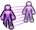
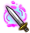
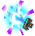

# マジックブレードスキル (`MagicBladeSkill`) — skill details

15 entries.

### เมจิกวอริเออร์มาสเตอรี่ (KnowledgeOfMagicWarriorMastary) · uid 865

 
**Tree:** マジックブレードスキル (`MagicBladeSkill`, tier 1) · **Type:** Mastery · **Max Lv:** 1 · **Weapons:** SubMagictool · **Flags:** NoMarketSearch · **Client class:** `KnowledgeOfMagicWarriorMastary` (passive mastery)

> ลดการลดลงของ ATK เมื่อติดตั้งอุปกรณ์เวทมนตร์
> MATK และ CSPD เพิ่มขึ้นเล็กน้อย

**How it works**

- Mastery skill of the マジックブレードスキル tree (tier 1, max Lv 1); usable with SubMagictool.
- It is a passive: while learned it returns stat bonuses from `GetMasteryParam`, no cast is needed.
- Passive modifiers (negative = penalty): Cspd (cast speed) 10 at Lv1 to 100 at Lv10, AtkRate (ATK %) 1 at Lv1 to 10 at Lv10.
- Other client code reads this skill (1 lookup; see the last section).

**Passive modifiers by level** (`GetMasteryParam(MasteryId)`; negative = penalty)

| | Lv1 | Lv2 | Lv3 | Lv4 | Lv5 | Lv6 | Lv7 | Lv8 | Lv9 | Lv10 |
|---|---|---|---|---|---|---|---|---|---|---|
| Cspd | 10 | 20 | 30 | 40 | 50 | 60 | 70 | 80 | 90 | 100 |
| AtkRate | 1 | 2 | 3 | 4 | 5 | 6 | 7 | 8 | 9 | 10 |

- `CspdRate` = `(System.Math.Max((Lv - 5), 0, 0, ?x3) + Lv)`
- `Matk` = `(System.Math.Max((Lv - 5), 0, 0, ?x3) + (Lv << 1))`

Bonus meanings (inferred from the names):

- `CspdRate`: cast speed %
- `Cspd`: cast speed
- `Matk`: MATK
- `AtkRate`: ATK %

**In-game level notes**

- Lv10: *ลดการลดลงของ ATK ลงอีก 5%

**Where else this skill takes effect**

- Code that reads this skill's level / buff by constant id: `UIExSkillManager$$ExSkillList (GetSkillLv)`

_Raw recovered data (every method item): [trees/MagicBladeSkill.md](../trees/MagicBladeSkill.md) — uid 865_

---

### อีเทอร์แฟลร์ (EtherFlare) · uid 866

 
**Tree:** マジックブレードスキル (`MagicBladeSkill`, tier 1) · **Type:** Attack · **Max Lv:** 1 · **Weapons:** SubMagictool · **Flags:** NoMarketSearch, MercenaryCanUseSkill · **Client class:** `EtherFlareAction`

> เวทมนตร์โจมตีแบบง่ายที่นักรบก็สามารถใช้ได้
> มีโอกาสติด'ไหม้ไฟ'หากสำเร็จจะฟื้นฟู MP โจมตี
> ได้ชั่วขณะ ถ้าตัวเองมีธาตุที่เป็นจุดอ่อน
> พลังของสกิลจะเพิ่มขึ้น

**How it works**

- Attack skill of the マジックブレードスキル tree (tier 1, max Lv 1); usable with SubMagictool.
- It deals damage: the action builds a damage template and the shared damage engine finishes the calculation.
- It installs a buff on the caster.
- It can inflict a status ailment (chance and type below).
- Damage (`calcPlayerToMobDamage` x1; each template is a full damage roll with its own crit):
  - `calcPlayerToMobDamage`: skill multiplier depends on live values (formula below)
  - `calcPlayerToMobDamage` [EtherFlareAction.get_AttackType() eq 2 AND SkillUtil.CheckWeakElemet(SkillUtil.GetWeakElement(target.Element), target.Element) OR EtherFlareAction.get_AttackType() ne 2 AND SkillUtil.CheckWeakElemet(SkillUtil.GetWeakElement(target.Element), target.Element) OR EtherFlareAction.get_AttackType() eq 2 AND PlayerAttackBase.checkAbnormalPercent(this, 8, percent, playerAction) AND SkillUtil.CheckWeakElemet(SkillUtil.GetWeakElement(target.Element), target.Element)]: flat damage depends on live values (formula below)
  - `calcPlayerToMobDamage` [!SkillUtil.CheckWeakElemet(SkillUtil.GetWeakElement(target.Element), target.Element) AND EtherFlareAction.get_AttackType() eq 2 OR !SkillUtil.CheckWeakElemet(SkillUtil.GetWeakElement(target.Element), target.Element) AND EtherFlareAction.get_AttackType() ne 2 OR !SkillUtil.CheckWeakElemet(SkillUtil.GetWeakElement(target.Element), target.Element) AND EtherFlareAction.get_AttackType() eq 2 AND PlayerAttackBase.checkAbnormalPercent(this, 8, percent, playerAction)]: flat damage depends on live values (formula below)
- Proration: slot chosen at runtime (physical or magic by a per-cast flag), mode `first_hit_per_target`.
- Can inflict on the target: Ignition (8).
- Buffs:
  - `EtherFlareBuf`: lasts `20` s / `10` s; Lv1 → Lv10: AttackMprecoveryUp (MP recovered per attack (flat)) 5 → 20
  - `SkillBufferDataBase`: marker buff (no parameters; other code tests whether it is present)

**Cost, timing and range**

- **Cast time** (`CastTime`): `PlayerAttackBase.CalcCastTime(this, 0, PlayerActionManagerBase.get_PlayerStatus())`
- **ActionRange** (`ActionRange`): `MathUtil.DisplayMeterToDistance(6)`

**When each part runs**

- `OnInitialize` — skill setup (fields the action starts with): 6 set
- `CheckAbnormalSubEffect` — skill-specific method: 2 call
- `InitializeOthers` — setup used when another player's client replays the action: 2 set
- `calcPlayerToMobDamage` — damage calculation against a monster: 2 set, 3 tpl, 2 call, 1 info

**Damage terms that depend on live stats (not tabulated)**

- SkillRate × `((((baseINT gt baseSTR ? baseINT : baseSTR) + 250)) / 100)`
- Flat dmg + `(fixAddDamage << 1)` — EtherFlareAction.get_AttackType() eq 2 AND SkillUtil.CheckWeakElemet(SkillUtil.GetWeakElement(target.Element), target.Element) OR EtherFlareAction.get_AttackType() ne 2 AND SkillUtil.CheckWeakElemet(SkillUtil.GetWeakElement(target.Element), target.Element) OR EtherFlareAction.get_AttackType() eq 2 AND PlayerAttackBase.checkAbnormalPercent(this, 8, percent, playerAction) AND SkillUtil.CheckWeakElemet(SkillUtil.GetWeakElement(target.Element), target.Element)
- Flat dmg + `fixAddDamage` — !SkillUtil.CheckWeakElemet(SkillUtil.GetWeakElement(target.Element), target.Element) AND EtherFlareAction.get_AttackType() eq 2 OR !SkillUtil.CheckWeakElemet(SkillUtil.GetWeakElement(target.Element), target.Element) AND EtherFlareAction.get_AttackType() ne 2 OR !SkillUtil.CheckWeakElemet(SkillUtil.GetWeakElement(target.Element), target.Element) AND EtherFlareAction.get_AttackType() eq 2 AND PlayerAttackBase.checkAbnormalPercent(this, 8, percent, playerAction)

**Every damage-template term, per method** (`int()` after each multiplier; engine terms are added by `TemplateAssignment`)

- `calcPlayerToMobDamage` (damage calculation against a monster): `AddRate[SkillRate]` = `((((baseINT gt baseSTR ? baseINT : baseSTR) + 250)) / 100)`
- `calcPlayerToMobDamage` (damage calculation against a monster): `AddConstant[SkillConstantDamage]` = `(fixAddDamage << 1)`
  - when `EtherFlareAction.get_AttackType() eq 2 AND SkillUtil.CheckWeakElemet(SkillUtil.GetWeakElement(target.Element), target.Element) OR EtherFlareAction.get_AttackType() ne 2 AND SkillUtil.CheckWeakElemet(SkillUtil.GetWeakElement(target.Element), target.Element) OR EtherFlareAction.get_AttackType() eq 2 AND PlayerAttackBase.checkAbnormalPercent(this, 8, percent, playerAction) AND SkillUtil.CheckWeakElemet(SkillUtil.GetWeakElement(target.Element), target.Element)`
- `calcPlayerToMobDamage` (damage calculation against a monster): `AddConstant[SkillConstantDamage]` = `fixAddDamage`
  - when `!SkillUtil.CheckWeakElemet(SkillUtil.GetWeakElement(target.Element), target.Element) AND EtherFlareAction.get_AttackType() eq 2 OR !SkillUtil.CheckWeakElemet(SkillUtil.GetWeakElement(target.Element), target.Element) AND EtherFlareAction.get_AttackType() ne 2 OR !SkillUtil.CheckWeakElemet(SkillUtil.GetWeakElement(target.Element), target.Element) AND EtherFlareAction.get_AttackType() eq 2 AND PlayerAttackBase.checkAbnormalPercent(this, 8, percent, playerAction)`

Engine terms (always present): `BaseDamage`, target `Def` (after pierce), element bonus, stability, `ExpRate = p[slot]/100` (proration), type / last-damage / gem multipliers.

**Proration:** slot `dynamic`, mode `first_hit_per_target`, attack type `dynamic`, action id 866
- Uses the slot chosen at runtime (physical or magic by a per-cast flag); Proration changes on the FIRST damaging hit of one cast on each target only; later hits of the same cast read the updated value but do not change it.

**Status ailments**

- Rolls `percent`% to inflict **Ignition (8)** (`calcPlayerToMobDamage`)
  - when `EtherFlareAction.get_AttackType() eq 2 AND PlayerAttackBase.checkAbnormalPercent(this, 8, percent, playerAction) AND SkillUtil.CheckWeakElemet(SkillUtil.GetWeakElement(target.Element), target.Element) OR !PlayerAttackBase.checkAbnormalPercent(this, 8, percent, playerAction) AND EtherFlareAction.get_AttackType() eq 2 AND SkillUtil.CheckWeakElemet(SkillUtil.GetWeakElement(target.Element), target.Element) OR EtherFlareAction.get_AttackType() ne 2 AND PlayerAttackBase.checkAbnormalPercent(this, 8, percent, playerAction) AND SkillUtil.CheckWeakElemet(SkillUtil.GetWeakElement(target.Element), target.Element)`
- Marks the hit with ailment **Ignition (8)** (`calcPlayerToMobDamage`)
  - when `EtherFlareAction.get_AttackType() eq 2 AND PlayerAttackBase.checkAbnormalPercent(this, 8, percent, playerAction) AND SkillUtil.CheckWeakElemet(SkillUtil.GetWeakElement(target.Element), target.Element) OR EtherFlareAction.get_AttackType() ne 2 AND PlayerAttackBase.checkAbnormalPercent(this, 8, percent, playerAction) AND SkillUtil.CheckWeakElemet(SkillUtil.GetWeakElement(target.Element), target.Element) OR !SkillUtil.CheckWeakElemet(SkillUtil.GetWeakElement(target.Element), target.Element) AND EtherFlareAction.get_AttackType() eq 2 AND PlayerAttackBase.checkAbnormalPercent(this, 8, percent, playerAction)`

**Buffs and effects it installs or removes**

- `CheckAbnormalSubEffect` (method): constructs `EtherFlareBuf` — `.ctor(Lv, isGemCartBuf)`
  - when `UnityEngine.Object.op_Inequality(UnityEngine.GameObject.GetComponent<CharacterActionManagerBase>(actor, actor), 0)`
- `CheckAbnormalSubEffect` (method): adds the caster's buff of `new EtherFlareBuf` — `AddSelfBuffer(new EtherFlareBuf, Id)`
  - when `UnityEngine.Object.op_Inequality(UnityEngine.GameObject.GetComponent<CharacterActionManagerBase>(actor, actor), 0)`

**Other recovered parameters**

- **Cast time modifier** (`CastTime`): `PlayerAttackBase.CalcCastTime(this, 0, PlayerActionManagerBase.get_PlayerStatus())`

**Buff values** (every recovered field; durations in seconds)

**Buff `EtherFlareBuf`**
- Duration: `20` s [(isGemCart & 1) ne 0]; `10` s [(isGemCart & 1) eq 0]
- `AttackMprecoveryUp` = `0` _(when BuffEffectActive eq 0)_

| | Lv1 | Lv2 | Lv3 | Lv4 | Lv5 | Lv6 | Lv7 | Lv8 | Lv9 | Lv10 |
|---|---|---|---|---|---|---|---|---|---|---|
| AttackMprecoveryUp | 5 | 10 | 10 | 10 | 10 | 15 | 15 | 15 | 15 | 20 |

- Buff parameters that depend on the weapon/gem (constructor overloads):
  - `attackMpRecovery` = `(((int(((Lv + 2) * 0.25)) + (int(((Lv + 2) * 0.25)) << 2)) + 15) - 10)` = 5 when (isGemCart & 1) ne 0
  - `attackMpRecovery` = `((int(((Lv + 2) * 0.25)) + (int(((Lv + 2) * 0.25)) << 2)) + 15)` = 15 when (isGemCart & 1) eq 0
- Hook `Updata`: `LeftTime`=(LeftTime - UnityEngine.Time.get_deltaTime()); `LeftTime`=0
**Buff `SkillBufferDataBase`**
- Attached to this skill via `caller2:EtherFlareBuf$$.ctor<-EtherFlareAction$$CheckAbnormalSubEffect` (no direct constructor call in the skill's own code).
- Buff hook methods: `get_BufEffectTakeId`, `get_IsAbnormalDamageCancel`, `get_IsDamageCancel`, `get_IsEnd`, `get_IsRange`, `get_IsSelfAction`, `get_LeftTime`, `get_Level`, `set_IsDamageCancel`, `set_IsEnd`, `set_IsSelfAction`, `set_LeftTime`, `set_Level`
- Hook `set_Level`: `Level`=value
- Hook `set_IsSelfAction`: `IsSelfAction`=(value & 1)
- Hook `set_IsDamageCancel`: `IsDamageCancel`=(value & 1)
- Hook `set_LeftTime`: `LeftTime`=value

Parameter meanings (inferred from the `SkillBufferId` names):

- `AttackMprecoveryUp`: MP recovered per attack (flat)

_Raw recovered data (every method item): [trees/MagicBladeSkill.md](../trees/MagicBladeSkill.md) — uid 866_

---

### เดรนบาเรีย (DrainBarrier) · uid 875

 
**Tree:** マジックブレードスキル (`MagicBladeSkill`, tier 1) · **Type:** Buffer · **Max Lv:** 1 · **Weapons:** Magictool · **Flags:** NoMarketSearch · **Client class:** `DrainBarrierAction`

> เทคนิคการป้องกันที่แปลงพลังเวทมนตร์ผ่านบาเรีย
> 
> ลดความเสียหายทางกายภาพ/เวทมนตร์
> ที่ได้รับระหว่างเปิดใช้และฟื้นฟู MP เล็กน้อย
> เมื่อความเสียหายทางเวทลดลงจะเพิ่มปริมาณการฟื้นฟู

**How it works**

- Buffer skill of the マジックブレードスキル tree (tier 1, max Lv 1); usable with Magictool.
- It installs a buff on the caster.
- It installs a buff on other players / the party.
- Buffs:
  - `DrainBarrierBuf`; Lv1 → Lv10: PowerDmgCut (physical damage taken reduction) 9 → 90, MagicDmgCut (magic damage taken reduction) 9 → 90
  - `EnchantedBurstBuf`
  - `DrainRecallBuf`: lasts `(Lv << 1)` s
  - `SkillBufferDataBase`: marker buff (no parameters; other code tests whether it is present)

**When each part runs**

- `ActionStart` — when the cast starts: 2 call
- `InitializeOthers` — setup used when another player's client replays the action: 1 set
- `DamageFunction` — when damage passes through the buff: 3 call
- `.<>c__DisplayClass21_0::<ActionStart>b__0` — skill-specific method: 1 call
- `.<>c__DisplayClass21_0::<ActionStart>b__1` — skill-specific method: 1 call

**Proration:** slot `none`, mode `never (ExpType None: no proration slot)`, attack type `None`, action id 875
- No proration slot: ExpType None: no proration slot.

**Buffs and effects it installs or removes**

- `ActionStart` (when the cast starts): constructs `DrainBarrierBuf` — `.ctor(Lv, PlayerActionManagerBase.get_PlayerStatus(), Id)`
  - when `!PlayerAttackBase.IsBlank(this) AND UnityEngine.Object.op_Inequality(actarAction)`
- `ActionStart` (when the cast starts): adds the caster's buff of `new DrainBarrierBuf` — `AddSelfBuffer(new DrainBarrierBuf, Id)`
  - when `!PlayerAttackBase.IsBlank(this) AND UnityEngine.Object.op_Inequality(actarAction)`
- `DamageFunction` (when damage passes through the buff): constructs `EnchantedBurstBuf` — `.ctor(SkillManager.GetSkillLv(PlayerStatusBase.get_SkillManager(), 872, 1))`
  - when `!Toram.Common.Actions.ActionAppendData.Contains(responseData.AppendData, 875) AND DrainBarrierBuf.GetMpHeal(TryGetBuf<object>.out2(PlayerStatusBase.get_SkillBufferManager(), 875), (responseData.AttackType eq 2 ? 1 : 0)) ge 1 AND SkillManager.GetSkillLv(PlayerStatusBase.get_SkillManager(), 872, 1) ge 1 AND TryGetBuf<object>.out2(PlayerStatusBase.get_SkillBufferManager(), 875) ne 0 AND responseData.AttackType ne 3 OR DrainBarrierBuf.GetMpHeal(TryGetBuf<object>.out2(PlayerStatusBase.get_SkillBufferManager(), 875), (responseData.AttackType eq 2 ? 1 : 0)) ge 1 AND SkillManager.GetSkillLv(PlayerStatusBase.get_SkillManager(), 872, 1) ge 1 AND Toram.Common.Actions.ActionAppendData.Contains(responseData.AppendData, 875) AND Toram.Common.Actions.ActionAppendData.Get(responseData.AppendData, 875) ge 1 AND TryGetBuf<object>.out2(PlayerStatusBase.get_SkillBufferManager(), 875) ne 0 AND responseData.AttackType ne 3 OR DrainBarrierBuf.GetMpHeal(TryGetBuf<object>.out2(PlayerStatusBase.get_SkillBufferManager(), 875), (responseData.AttackType eq 2 ? 1 : 0)) ge 1 AND SkillManager.GetSkillLv(PlayerStatusBase.get_SkillManager(), 872, 1) ge 1 AND Toram.Common.Actions.ActionAppendData.Contains(responseData.AppendData, 875) AND Toram.Common.Actions.ActionAppendData.Get(responseData.AppendData, 875) lt 1 AND TryGetBuf<object>.out2(PlayerStatusBase.get_SkillBufferManager(), 875) ne 0 AND responseData.AttackType ne 3`
- `DamageFunction` (when damage passes through the buff): adds a target's buff of `new EnchantedBurstBuf` — `AddBuffer(new EnchantedBurstBuf, 0)`
  - when `!Toram.Common.Actions.ActionAppendData.Contains(responseData.AppendData, 875) AND DrainBarrierBuf.GetMpHeal(TryGetBuf<object>.out2(PlayerStatusBase.get_SkillBufferManager(), 875), (responseData.AttackType eq 2 ? 1 : 0)) ge 1 AND SkillManager.GetSkillLv(PlayerStatusBase.get_SkillManager(), 872, 1) ge 1 AND TryGetBuf<object>.out2(PlayerStatusBase.get_SkillBufferManager(), 875) ne 0 AND responseData.AttackType ne 3 OR DrainBarrierBuf.GetMpHeal(TryGetBuf<object>.out2(PlayerStatusBase.get_SkillBufferManager(), 875), (responseData.AttackType eq 2 ? 1 : 0)) ge 1 AND SkillManager.GetSkillLv(PlayerStatusBase.get_SkillManager(), 872, 1) ge 1 AND Toram.Common.Actions.ActionAppendData.Contains(responseData.AppendData, 875) AND Toram.Common.Actions.ActionAppendData.Get(responseData.AppendData, 875) ge 1 AND TryGetBuf<object>.out2(PlayerStatusBase.get_SkillBufferManager(), 875) ne 0 AND responseData.AttackType ne 3 OR DrainBarrierBuf.GetMpHeal(TryGetBuf<object>.out2(PlayerStatusBase.get_SkillBufferManager(), 875), (responseData.AttackType eq 2 ? 1 : 0)) ge 1 AND SkillManager.GetSkillLv(PlayerStatusBase.get_SkillManager(), 872, 1) ge 1 AND Toram.Common.Actions.ActionAppendData.Contains(responseData.AppendData, 875) AND Toram.Common.Actions.ActionAppendData.Get(responseData.AppendData, 875) lt 1 AND TryGetBuf<object>.out2(PlayerStatusBase.get_SkillBufferManager(), 875) ne 0 AND responseData.AttackType ne 3`
- `.<>c__DisplayClass21_0::<ActionStart>b__0` (method): removes a target's buff of skill 875 (DrainBarrier) — `RemoveBuffer(875)`
- `.<>c__DisplayClass21_0::<ActionStart>b__1` (method): removes a target's buff of skill 875 (DrainBarrier) — `RemoveBuffer(875)`
  - when `(cancel & 1) ne 0`

**Buff values** (every recovered field; durations in seconds)

**Buff `DrainBarrierBuf`**
- Buff hook methods: `CheckDamageCutMobAttack`, `GetMpHeal`, `GetTotalMpHealValue`, `Stack`, `SuccessDamageCut`, `get_SkillLocalId`

| | Lv1 | Lv2 | Lv3 | Lv4 | Lv5 | Lv6 | Lv7 | Lv8 | Lv9 | Lv10 |
|---|---|---|---|---|---|---|---|---|---|---|
| PowerDmgCut | 9 | 18 | 27 | 36 | 45 | 54 | 63 | 72 | 81 | 90 |
| MagicDmgCut | 9 | 18 | 27 | 36 | 45 | 54 | 63 | 72 | 81 | 90 |

- Buff fields set in the constructor (all recovered):
  - `damageCutAttackList` = `new System.Collections.Generic.List<MobAttackBase>`
  - `skillLocalId` = `localId`
  - `damageCut` = `((Lv << 3) + lv)` = 9
  - `maxStackMpHeal` = `(int(((Lv + 1) * 0.5)) * 100)` = 100
- Buff parameters that depend on the weapon/gem (constructor overloads):
  - `mpHeal` = `20` = 20 when EquipItemData.WeaponTypeCalculatorBase.get_WeaponType(PlayerStatusBase.get_EquipItemData().mainWeaponCalculator) eq 10
  - `mpHeal` = `10` = 10 when EquipItemData.WeaponTypeCalculatorBase.get_WeaponType(PlayerStatusBase.get_EquipItemData().mainWeaponCalculator) ne 10
  - `bonusMpHeal` = `80` = 80 when EquipItemData.WeaponTypeCalculatorBase.get_WeaponType(PlayerStatusBase.get_EquipItemData().mainWeaponCalculator) eq 10
  - `bonusMpHeal` = `40` = 40 when EquipItemData.WeaponTypeCalculatorBase.get_WeaponType(PlayerStatusBase.get_EquipItemData().mainWeaponCalculator) ne 10
- Hook `Stack`: `stackMpHeal`=(maxStackMpHeal lt (stackMpHeal + mpHealValue) ? maxStackMpHeal : (stackMpHeal + mpHealValue))
**Buff `EnchantedBurstBuf`**
- Buff hook methods: `AddStack`, `GetPayStack`, `LocalNext`, `Next`, `PayStack`
- `Count` = `(0)` _(when BuffEffectActive ne 0)_
- `Count` = `0` _(when BuffEffectActive eq 0)_
- Buff fields set in the constructor (all recovered):
  - `flag` = `2050` = 2050
  - `addStackSkillIdDataList` = `new System.Collections.Generic.List<SkillIdData>`
  - `Count` = `0`
  - `Max` = `9` = 9
  - `localCount` = `0`
- Hook `Next`: `flag`=(flag & 0xfffff7ff)
- Hook `PayStack`: `Count`=(Count lt 3 ? 0 : (Count - 3))
- Hook `LocalNext`: `localCount`=(Max lt (localCount + 1) ? Max : (localCount + 1))
**Buff `DrainRecallBuf`**
- Attached to this skill via `caller2:DrainRecall$$AddBuf<-DrainBarrierAction.<>c__DisplayClass21_0$$<ActionStart>b__0` (no direct constructor call in the skill's own code).
- Duration: `(Lv << 1)` s
- `Value` = `((mainWeapon eq 14 ? ((((Lv + (Lv << 2)) + ((totalMpHealValue lt 0 ? (totalMpHealValue + 1) : totalMpHealValue) >> 1)) lt 0 ? (((Lv + (Lv << 2)) + ((totalMpHealValue lt 0 ? (totalMpHealValue + 1) : totalMpHealValue) >> 1)) + 1) : ((Lv + (Lv << 2)) + ((totalMpHealValue lt 0 ? (totalMpHealValue + 1) : totalMpHealValue) >> 1))) >> 1) : ((Lv + (Lv << 2)) + ((totalMpHealValue lt 0 ? (totalMpHealValue + 1) : totalMpHealValue) >> 1))))` _(when BuffEffectActive ne 0)_
- `Value` = `0` _(when BuffEffectActive eq 0)_
- Buff fields set in the constructor (all recovered):
  - `mpHeal` = `(mainWeapon eq 14 ? ((((Lv + (Lv << 2)) + ((totalMpHealValue lt 0 ? (totalMpHealValue + 1) : totalMpHealValue) >> 1)) lt 0 ? (((Lv + (Lv << 2)) + ((totalMpHealValue lt 0 ? (totalMpHealValue + 1) : totalMpHealValue) >> 1)) + 1) : ((Lv + (Lv << 2)) + ((totalMpHealValue lt 0 ? (totalMpHealValue + 1) : totalMpHealValue) >> 1))) >> 1) : ((Lv + (Lv << 2)) + ((totalMpHealValue lt 0 ? (totalMpHealValue + 1) : totalMpHealValue) >> 1)))`
- Hook `Updata`: `LeftTime`=(LeftTime - UnityEngine.Time.get_deltaTime())
**Buff `SkillBufferDataBase`**
- Attached to this skill via `caller2:EnchantedBurstBuf$$.ctor<-DrainBarrierAction$$DamageFunction` (no direct constructor call in the skill's own code).
- Buff hook methods: `get_BufEffectTakeId`, `get_IsAbnormalDamageCancel`, `get_IsDamageCancel`, `get_IsEnd`, `get_IsRange`, `get_IsSelfAction`, `get_LeftTime`, `get_Level`, `set_IsDamageCancel`, `set_IsEnd`, `set_IsSelfAction`, `set_LeftTime`, `set_Level`
- Hook `set_Level`: `Level`=value
- Hook `set_IsSelfAction`: `IsSelfAction`=(value & 1)
- Hook `set_IsDamageCancel`: `IsDamageCancel`=(value & 1)
- Hook `set_LeftTime`: `LeftTime`=value

Parameter meanings (inferred from the `SkillBufferId` names):

- `Count`: stack / hit counter
- `MagicDmgCut`: magic damage taken reduction
- `PowerDmgCut`: physical damage taken reduction
- `Value`: generic value (meaning set by the code that reads the buff)

_Raw recovered data (every method item): [trees/MagicBladeSkill.md](../trees/MagicBladeSkill.md) — uid 875_

---

### คอนเวอร์ชั่น (Conversion) · uid 867

 
**Tree:** マジックブレードスキル (`MagicBladeSkill`, tier 2) · **Type:** Mastery · **Max Lv:** 60 · **Weapons:** OneHandSword, TwoHandSword, Bowgun, Knuckle · **Requires:** เมจิกวอริเออร์มาสเตอรี่ · **Flags:** NoMarketSearch · **Client class:** `ConversionAction`

> เมื่อติดตั้งดาบมือเดียว, ดาบสองมือ, โบว์กัน, สนับมือ
> ATK ของอาวุธจะเพิ่มไปที่ MATK
> เหมือนไม้เท้าและอุปกรณ์เวทมนตร์

**How it works**

- Mastery skill of the マジックブレードスキル tree (tier 2, max Lv 60); usable with OneHandSword, TwoHandSword, Bowgun, Knuckle.
- It installs a buff on the caster.
- Marked as a passive in the skill table (no decoded `GetMasteryParam` class).
- Buffs:
  - `ConversionBuf`: marker buff (no parameters; other code tests whether it is present)
  - `SkillBufferDataBase`: marker buff (no parameters; other code tests whether it is present)
- Other client code reads this skill (7 lookups; see the last section).

**When each part runs**

- `OnInitialize` — skill setup (fields the action starts with): 1 set
- `ActionHit` — when the attack connects: 3 call
- `InitializeOthers` — setup used when another player's client replays the action: 1 set

**Proration:** slot `none`, mode `never (ExpType None: no proration slot)`, attack type `None`, action id 867
- No proration slot: ExpType None: no proration slot.

**Buffs and effects it installs or removes**

- `ActionHit` (when the attack connects): removes a target's buff of skill 867 (Conversion) — `RemoveBuffer(867)`
  - when `UnityEngine.Object.op_Inequality(actarAction) AND hasBuff(867)`
- `ActionHit` (when the attack connects): constructs `ConversionBuf` — `.ctor(Lv)`
  - when `!hasBuff(867) AND UnityEngine.Object.op_Inequality(actarAction)`
- `ActionHit` (when the attack connects): adds the caster's buff of `new ConversionBuf` — `AddSelfBuffer(new ConversionBuf, Id)`
  - when `!hasBuff(867) AND UnityEngine.Object.op_Inequality(actarAction)`

**Buff values** (every recovered field; durations in seconds)

**Buff `ConversionBuf`**
**Buff `SkillBufferDataBase`**
- Attached to this skill via `caller2:ConversionBuf$$.ctor<-ConversionAction$$ActionHit` (no direct constructor call in the skill's own code).
- Buff hook methods: `get_BufEffectTakeId`, `get_IsAbnormalDamageCancel`, `get_IsDamageCancel`, `get_IsEnd`, `get_IsRange`, `get_IsSelfAction`, `get_LeftTime`, `get_Level`, `set_IsDamageCancel`, `set_IsEnd`, `set_IsSelfAction`, `set_LeftTime`, `set_Level`
- Hook `set_Level`: `Level`=value
- Hook `set_IsSelfAction`: `IsSelfAction`=(value & 1)
- Hook `set_IsDamageCancel`: `IsDamageCancel`=(value & 1)
- Hook `set_LeftTime`: `LeftTime`=value

**In-game level notes**

- Lv15: [ผลนี้ใช้ได้เฉพาะกับดาบมือเดียว/โบว์กัน/สนับมือเท่านั้น]  สามารถเพิ่มสกิลไปที่ช็อตคัทเพื่อใช้งานได้ ระหว่างผลของคอนเวอชันธาตุอาวุธกับธาตุเวทมนตร์ เฉพาะสกิลเมจิกเบลดจะสลับกัน สามารถยกเลิกได้เมื่อใช้คอนเวอชันอีกครั้ง
- Lv16: *ปริมาณการสะท้อน ATK อาวุธที่มีต่อ MATK จะลดลงครึ่งหนึ่ง

**Where else this skill takes effect**

- Effect applied in `ConversionAction$$ActionHit` (2 guarded paths):
  - always
    - calls `SkillActionBase$$ActionHit`, `SkillBufferManager$$RemoveBuffer`
  - always
    - calls `SkillActionBase$$ActionHit`, `0x165db78`, `ConversionBuf$$.ctor`, `SkillBufferManager$$AddSelfBuffer`
- Effect applied in `EquipItemData.WeaponTypeCalculatorBase$$CalcMatk` (298 guarded paths, truncated):
  - when `TryGetValue.out2() ne 0` AND `SkillLv(867) ge 1`
    - returns `EquipItemData.WeaponTypeCalculatorBase.calcMatkParam()`
    - calls `virtual PlayerStatusBase.get_EquipItemData`, `EquipItemData$$get_Weapon`, `virtual PlayerStatusBase.get_EquipItemData`, `EquipItemData$$get_SubWeapon`, `virtual PlayerStatusBase.get_BonusManager`, `BonusManager$$GetBonusConstant_AvatarConstan_Rate`, `virtual PlayerStatusBase.get_BonusManager`, `virtual PlayerStatusBase.get_PrimaryStatus`
  - when `TryGetValue.out2() ne 0` AND `SkillLv(867) ge 1`
    - returns `EquipItemData.WeaponTypeCalculatorBase.calcMatkParam()`
    - calls `virtual PlayerStatusBase.get_EquipItemData`, `EquipItemData$$get_Weapon`, `virtual PlayerStatusBase.get_EquipItemData`, `EquipItemData$$get_SubWeapon`, `virtual PlayerStatusBase.get_BonusManager`, `BonusManager$$GetBonusConstant_AvatarConstan_Rate`, `virtual PlayerStatusBase.get_BonusManager`, `virtual PlayerStatusBase.get_PrimaryStatus`
  - when `TryGetValue.out2() ne 0` AND `SkillLv(867) ge 1`
    - returns `EquipItemData.WeaponTypeCalculatorBase.calcMatkParam()`
    - calls `virtual PlayerStatusBase.get_EquipItemData`, `EquipItemData$$get_Weapon`, `virtual PlayerStatusBase.get_EquipItemData`, `EquipItemData$$get_SubWeapon`, `virtual PlayerStatusBase.get_BonusManager`, `BonusManager$$GetBonusConstant_AvatarConstan_Rate`, `virtual PlayerStatusBase.get_BonusManager`, `virtual PlayerStatusBase.get_PrimaryStatus`
  - when `TryGetValue.out2() ne 0` AND `SkillLv(867) ge 1`
    - returns `EquipItemData.WeaponTypeCalculatorBase.calcMatkParam()`
    - calls `virtual PlayerStatusBase.get_EquipItemData`, `EquipItemData$$get_Weapon`, `virtual PlayerStatusBase.get_EquipItemData`, `EquipItemData$$get_SubWeapon`, `virtual PlayerStatusBase.get_BonusManager`, `BonusManager$$GetBonusConstant_AvatarConstan_Rate`, `virtual PlayerStatusBase.get_BonusManager`, `virtual PlayerStatusBase.get_PrimaryStatus`
  - when `TryGetValue.out2() ne 0` AND `SkillLv(867) ge 1`
    - returns `EquipItemData.WeaponTypeCalculatorBase.calcMatkParam()`
    - calls `virtual PlayerStatusBase.get_EquipItemData`, `EquipItemData$$get_Weapon`, `virtual PlayerStatusBase.get_EquipItemData`, `EquipItemData$$get_SubWeapon`, `virtual PlayerStatusBase.get_BonusManager`, `BonusManager$$GetBonusConstant_AvatarConstan_Rate`, `virtual PlayerStatusBase.get_BonusManager`, `virtual PlayerStatusBase.get_PrimaryStatus`
  - when `TryGetValue.out2() ne 0` AND `SkillLv(867) ge 1`
    - returns `EquipItemData.WeaponTypeCalculatorBase.calcMatkParam()`
    - calls `virtual PlayerStatusBase.get_EquipItemData`, `EquipItemData$$get_Weapon`, `virtual PlayerStatusBase.get_EquipItemData`, `EquipItemData$$get_SubWeapon`, `virtual PlayerStatusBase.get_BonusManager`, `BonusManager$$GetBonusConstant_AvatarConstan_Rate`, `virtual PlayerStatusBase.get_BonusManager`, `virtual PlayerStatusBase.get_PrimaryStatus`
  - when `TryGetValue.out2() ne 0` AND `SkillLv(867) ge 1`
    - returns `EquipItemData.WeaponTypeCalculatorBase.calcMatkParam()`
    - calls `virtual PlayerStatusBase.get_EquipItemData`, `EquipItemData$$get_Weapon`, `virtual PlayerStatusBase.get_EquipItemData`, `EquipItemData$$get_SubWeapon`, `virtual PlayerStatusBase.get_BonusManager`, `BonusManager$$GetBonusConstant_AvatarConstan_Rate`, `virtual PlayerStatusBase.get_BonusManager`, `virtual PlayerStatusBase.get_PrimaryStatus`
  - when `TryGetValue.out2() ne 0` AND `SkillLv(867) ge 1`
    - returns `EquipItemData.WeaponTypeCalculatorBase.calcMatkParam()`
    - calls `virtual PlayerStatusBase.get_EquipItemData`, `EquipItemData$$get_Weapon`, `virtual PlayerStatusBase.get_EquipItemData`, `EquipItemData$$get_SubWeapon`, `virtual PlayerStatusBase.get_BonusManager`, `BonusManager$$GetBonusConstant_AvatarConstan_Rate`, `virtual PlayerStatusBase.get_BonusManager`, `virtual PlayerStatusBase.get_PrimaryStatus`
- Code that reads this skill's level / buff by constant id: `ConversionAction$$ActionHit (ContainsBuffer)`, `ElementSlashAction$$OnInitialize (ContainsBuffer)`, `EnchantedBurstAction$$OnInitialize (ContainsBuffer)`, `EnchantedSwordAction$$OnInitialize (ContainsBuffer)`, `EquipItemData.WeaponTypeCalculatorBase$$CalcMatk (GetSkillLv)`, `EtherFlareAction$$OnInitialize (ContainsBuffer)`, `UnionSwordAction$$OnInitialize (ContainsBuffer)`

_Raw recovered data (every method item): [trees/MagicBladeSkill.md](../trees/MagicBladeSkill.md) — uid 867_

---

### เอเลเม้นต์สแลช (ElementSlash) · uid 868

 
**Tree:** マジックブレードスキル (`MagicBladeSkill`, tier 2) · **Type:** Attack · **Max Lv:** 60 · **Weapons:** SubMagictool · **Requires:** อีเทอร์แฟลร์ · **Flags:** NoMarketSearch, MercenaryCanUseSkill · **Client class:** `ElementSlashAction`

> ฟันศัตรูด้วยดาบเวทมนตร์
> มีโอกาสทำให้เป้าหมายติด[อ่อนแอ]
> 
> ระยะการโจมตีของสกิลนี้ขึ้นอยู่กับ
> อุปกรณ์เวทเสริมที่สวมใส่อยู่

**How it works**

- Attack skill of the マジックブレードスキル tree (tier 2, max Lv 60); usable with SubMagictool.
- It deals damage: the action builds a damage template and the shared damage engine finishes the calculation.
- It can inflict a status ailment (chance and type below).
- Damage (`calcPlayerToMobDamage` x1; each template is a full damage roll with its own crit):
  - `calcPlayerToMobDamage`: skill multiplier depends on live values (formula below); flat damage +65 at Lv1 to 200 at Lv10
- Proration: slot chosen at runtime (physical or magic by a per-cast flag), mode `first_hit_per_target`.
- Can inflict on the target: Collapse (16).

**Cost, timing and range**

- **ActionRange** (`ActionRange`): `PlayerAttackBase.GetWeaponRange(EquipItemData.get_SubWeapon(PlayerStatusBase.get_EquipItemData()))`

**When each part runs**

- `OnInitialize` — skill setup (fields the action starts with): 5 set
- `InitializeOthers` — setup used when another player's client replays the action: 2 set
- `calcPlayerToMobDamage` — damage calculation against a monster: 1 set, 2 tpl, 2 call, 1 info

**Damage numbers by level** (gem bonuses assumed 0)

| | Lv1 | Lv2 | Lv3 | Lv4 | Lv5 | Lv6 | Lv7 | Lv8 | Lv9 | Lv10 |
|---|---|---|---|---|---|---|---|---|---|---|
| Flat dmg + | 65 | 80 | 95 | 110 | 125 | 140 | 155 | 170 | 185 | 200 |

**Damage terms that depend on live stats (not tabulated)**

- SkillRate × `(((((Lv * 50) + 100) + (((baseSTR gt baseINT ? baseSTR : baseINT) / 12.5) * Lv))) / 100)`

**Every damage-template term, per method** (`int()` after each multiplier; engine terms are added by `TemplateAssignment`)

- `calcPlayerToMobDamage` (damage calculation against a monster): `AddConstant[SkillConstantDamage]` = `((((Lv << 4) - Lv) + 50))`
- `calcPlayerToMobDamage` (damage calculation against a monster): `AddRate[SkillRate]` = `(((((Lv * 50) + 100) + (((baseSTR gt baseINT ? baseSTR : baseINT) / 12.5) * Lv))) / 100)`

Engine terms (always present): `BaseDamage`, target `Def` (after pierce), element bonus, stability, `ExpRate = p[slot]/100` (proration), type / last-damage / gem multipliers.

**Proration:** slot `dynamic`, mode `first_hit_per_target`, attack type `dynamic`, action id 868
- Uses the slot chosen at runtime (physical or magic by a per-cast flag); Proration changes on the FIRST damaging hit of one cast on each target only; later hits of the same cast read the updated value but do not change it.

**Status ailments**

- Rolls `percent`% to inflict **Collapse (16)** (`calcPlayerToMobDamage`)
  - when `ElementSlashAction.get_AttackType() eq 2 AND PlayerAttackBase.checkAbnormalPercent(this, 16, percent, playerAction) OR !PlayerAttackBase.checkAbnormalPercent(this, 16, percent, playerAction) AND ElementSlashAction.get_AttackType() eq 2 OR ElementSlashAction.get_AttackType() ne 2 AND PlayerAttackBase.checkAbnormalPercent(this, 16, percent, playerAction)`
- Marks the hit with ailment **Collapse (16)** (`calcPlayerToMobDamage`)
  - when `ElementSlashAction.get_AttackType() eq 2 AND PlayerAttackBase.checkAbnormalPercent(this, 16, percent, playerAction) OR ElementSlashAction.get_AttackType() ne 2 AND PlayerAttackBase.checkAbnormalPercent(this, 16, percent, playerAction)`

**Other recovered parameters**

- **Effect percent** (`percent`): `((Lv + (Lv << 2)) << 1)` → Lv1..10 [10, 20, 30, 40, 50, 60, 70, 80, 90, 100]

_Raw recovered data (every method item): [trees/MagicBladeSkill.md](../trees/MagicBladeSkill.md) — uid 868_

---

### เทเลพอร์ต (Teleport) · uid 876

 
**Tree:** マジックブレードスキル (`MagicBladeSkill`, tier 2) · **Type:** Buffer · **Max Lv:** 60 · **Weapons:** Magictool · **Requires:** เดรนบาเรีย · **Flags:** NoMarketSearch · **Client class:** `TeleportAction`

> เทคนิคการหลบหลีกโดยเปลี่ยนตำแหน่งแบบฉับพลัน
> 
> หากกดปุ่มไปในทิศทางใดขณะเทเลพอร์ต
> ก็จะเคลื่อนที่ไปในทิศทางนั้นทันที

**How it works**

- Buffer skill of the マジックブレードスキル tree (tier 2, max Lv 60); usable with Magictool.
- It is a utility / system action (movement, state change) rather than a damage or buff skill.
- MP: `(mp - 100)`.

**Cost, timing and range**

- **MP cost** (`mp` in `OnInitialize`): `(mp - 100)`
  - when `(mainWeapon==OneHandSword & 1) ne 0`
- **Cast time** (`CastTime`): `3` = 3

**When each part runs**

- `OnInitialize` — skill setup (fields the action starts with): 2 set
- `ActionSkillEvent` — on an animation/skill event during the motion: 1 set
- `ActionSkillEventIfMoveIndex` — skill-specific method: 4 set
- `InitializeOthers` — setup used when another player's client replays the action: 1 set
- `OtherPlayerSkillEventReceive` — skill-specific method: 1 set

**Proration:** slot `none`, mode `never (ExpType None: no proration slot)`, attack type `None`, action id 876
- No proration slot: ExpType None: no proration slot.

**Other recovered parameters**

- **Cast time modifier** (`CastTime`): `3` = 3
- **MP cost** (`mp`): `(mp - 100)` _(when (mainWeapon==OneHandSword & 1) ne 0)_

**In-game level notes**

- Lv10: *MP ที่ใช้-100

_Raw recovered data (every method item): [trees/MagicBladeSkill.md](../trees/MagicBladeSkill.md) — uid 876_

---

### เรโซแนนซ์ (Resonance) · uid 869

 
**Tree:** マジックブレードスキル (`MagicBladeSkill`, tier 3) · **Type:** Buffer · **Max Lv:** 120 · **Weapons:** SubMagictool · **Requires:** คอนเวอร์ชั่น · **Flags:** NoMarketSearch · **Client class:** `ResonanceAction`

> เสียงสะท้อนของพลังชีวิตและพลังเวทมนตร์
> เพิ่มสเตตัสด้วยการแรนดอมเป็นเวลา 30 วินาที
> และทำให้ค่า HPและ MP ในปัจจุบันมีความสมดุลกัน
> ไม่สามารถใช้ซ้อนทับกันได้
> จะใช้ไม่ได้ถ้า HP สูงสุดน้อยกว่า MP สูงสุด

**How it works**

- Buffer skill of the マジックブレードスキル tree (tier 3, max Lv 120); usable with SubMagictool.
- It installs a buff on the caster.
- Buffs:
  - `ResonanceBuf`: lasts `30` s

**When each part runs**

- `OnInitialize` — skill setup (fields the action starts with): 1 set
- `InitializeOthers` — setup used when another player's client replays the action: 1 set
- `SupportStartReceive` — skill-specific method: 1 set
- `ActionHit` — when the attack connects: 2 call

**Proration:** slot `none`, mode `never (ExpType None: no proration slot)`, attack type `None`, action id 869
- No proration slot: ExpType None: no proration slot.

**Buffs and effects it installs or removes**

- `ActionHit` (when the attack connects): constructs `ResonanceBuf` — `.ctor(Lv, SkillIndividualFlag, refine)`
  - when `UnityEngine.Object.op_Inequality(actarAction)`
- `ActionHit` (when the attack connects): adds the caster's buff of `new ResonanceBuf` — `AddSelfBuffer(new ResonanceBuf, Id)`
  - when `UnityEngine.Object.op_Inequality(actarAction)`

**Buff values** (every recovered field; durations in seconds)

**Buff `ResonanceBuf`**
- Duration: `30` s [type eq 2 OR type eq 1 AND type ne 2 OR type eq 0 AND type ne 1 AND type ne 2]
- `AtkUp` = `(int((((refine + lv) << 1) * resist)))` _(when BuffEffectActive ne 0)_
- `MatkUp` = `(int((((refine + lv) << 1) * resist)))` _(when BuffEffectActive ne 0)_
- `HitUp` = `hit` _(when BuffEffectActive ne 0)_
- `Aspd` = `(int((((refine * 50) + (Lv * 25)) * resist)))` _(when BuffEffectActive ne 0)_
- `CspdUp` = `(int((((refine * 50) + (Lv * 25)) * resist)))` _(when BuffEffectActive ne 0)_
- `CrtUp` = `critical` _(when BuffEffectActive ne 0)_
- Buff parameters that depend on the weapon/gem (constructor overloads):
  - `Level` = `lv` → Lv1..10 [1, 2, 3, 4, 5, 6, 7, 8, 9, 10] when type eq 2 OR type eq 1 AND type ne 2 OR type eq 0 AND type ne 1 AND type ne 2
  - `IsSelfAction` = `1` = 1 when type eq 2 OR type eq 1 AND type ne 2 OR type eq 0 AND type ne 1 AND type ne 2
  - `BuffEffectActive` = `1` = 1 when type eq 2 OR type eq 1 AND type ne 2 OR type eq 0 AND type ne 1 AND type ne 2
  - `atk` = `int((((refine + lv) << 1) * resist))` when type eq 0 AND type ne 1 AND type ne 2
  - `matk` = `int((((refine + lv) << 1) * resist))` when type eq 0 AND type ne 1 AND type ne 2
  - `aspd` = `int((((refine * 50) + (Lv * 25)) * resist))` when type eq 1 AND type ne 2
  - `cspd` = `int((((refine * 50) + (Lv * 25)) * resist))` when type eq 1 AND type ne 2
- Hook `Updata`: `LeftTime`=0; `LeftTime`=(LeftTime - UnityEngine.Time.get_deltaTime())

Parameter meanings (inferred from the `SkillBufferId` names):

- `Aspd`: attack speed +
- `AtkUp`: ATK +
- `CrtUp`: critical rate +
- `CspdUp`: cast speed +
- `HitUp`: accuracy +
- `MatkUp`: MATK +

_Raw recovered data (every method item): [trees/MagicBladeSkill.md](../trees/MagicBladeSkill.md) — uid 869_

---

### เอนชานท์ซอร์ด / เอนชานท์บลาสซอร์ด (EnchantedSword) · uid 870

 
**Tree:** マジックブレードスキル (`MagicBladeSkill`, tier 3) · **Type:** Attack · **Max Lv:** 120 · **Weapons:** OneHandSword, TwoHandSword, Bowgun, Knuckle · **Requires:** เอเลเม้นต์สแลช · **Flags:** NoMarketSearch, MercenaryCanUseSkill · **Client class:** `EnchantedSwordAction`

> พลังธาตุกลายเป็นดาบแทงศัตรูโดยไม่เกี่ยวกับธาตุของตัวเอง
> โจมตีด้วยธาตุที่เป็นจุดอ่อนของศัตรูด้วยดาบมือเดียวหรือดาบสองมือ
> อัตราคริติคอลเวลาปกติ (กายภาพ) จะขึ้นอยู่กับ
> ประสิทธิภาพของอุปกรณ์เวทมนตร์
> และเวทเจาะเข้าจะเพิ่มขึ้นตอนใช้เวทมนตร์

**How it works**

- Attack skill of the マジックブレードスキル tree (tier 3, max Lv 120); usable with OneHandSword, TwoHandSword, Bowgun, Knuckle.
- It deals damage: the action builds a damage template and the shared damage engine finishes the calculation.
- It installs a buff on the caster.
- Damage (`calcPlayerToMobDamage` x3, `CalcDamage` x1; each template is a full damage roll with its own crit):
  - `calcPlayerToMobDamage` [1 ge attackCount AND EnchantedSwordAction.get_AttackType() eq 2 AND PlayerAttackBase.CheckSkillIndividualFlag(this, 1) AND WeaponType eq 10 AND attackCount ge 1 OR 1 lt attackCount AND 2 ge attackCount AND EnchantedSwordAction.get_AttackType() eq 2 AND PlayerAttackBase.CheckSkillIndividualFlag(this, 1) AND WeaponType eq 10 AND attackCount ge 1 OR 1 ge attackCount AND EnchantedSwordAction.get_AttackType() ne 2 AND IsInstanceOf(PlayerStatusBase.get_BattleStatus(), PlayerSecondaryStatus) ne 1 AND PlayerAttackBase.CheckSkillIndividualFlag(this, 1) AND WeaponType eq 10 AND attackCount ge 1]: skill multiplier ×4.6 at Lv1 to 10 at Lv10; flat damage +300
- Proration: slot chosen at runtime (physical or magic by a per-cast flag), mode `first_hit_per_target`.
- Buffs:
  - `EnchantedSwordBuf`: lasts `Lv` s

**Cost, timing and range**

- **Cast time** (`CastTime`): `PlayerAttackBase.CalcCastTime(this, 0, PlayerActionManagerBase.get_PlayerStatus())`
- **ActionRange** (`ActionRange`): `(PlayerAttackBase.GetWeaponRange(GetWeaponType.item(actarAction)) mi MathUtil.DisplayMeterToDistance(6) ? PlayerAttackBase.GetWeaponRange(GetWeaponType.item(actarAction)) : MathUtil.DisplayMeterToDistance(6))`

**When each part runs**

- `OnInitialize` — skill setup (fields the action starts with): 7 set
- `ActionPreparation` — before the cast starts: 2 set
- `InitializeOthers` — setup used when another player's client replays the action: 2 set
- `calcPlayerToMobDamage` — damage calculation against a monster: 1 set, 2 tpl, 3 info
- `CalcDamage` — skill-specific method: 2 tpl, 1 info
- `ActionHit` — when the attack connects: 1 set, 1 call

**Damage numbers by level** (gem bonuses assumed 0)

| | Lv1 | Lv2 | Lv3 | Lv4 | Lv5 | Lv6 | Lv7 | Lv8 | Lv9 | Lv10 |
|---|---|---|---|---|---|---|---|---|---|---|
| SkillRate × | 4.6 | 5.2 | 5.8 | 6.4 | 7 | 7.6 | 8.2 | 8.8 | 9.4 | 10 |
| Flat dmg + | 300 | 300 | 300 | 300 | 300 | 300 | 300 | 300 | 300 | 300 |

**Every damage-template term, per method** (`int()` after each multiplier; engine terms are added by `TemplateAssignment`)

- `calcPlayerToMobDamage` (damage calculation against a monster): `AddConstant[SkillConstantDamage]` = `(300)`
  - when `1 ge attackCount AND EnchantedSwordAction.get_AttackType() eq 2 AND PlayerAttackBase.CheckSkillIndividualFlag(this, 1) AND WeaponType eq 10 AND attackCount ge 1 OR 1 lt attackCount AND 2 ge attackCount AND EnchantedSwordAction.get_AttackType() eq 2 AND PlayerAttackBase.CheckSkillIndividualFlag(this, 1) AND WeaponType eq 10 AND attackCount ge 1 OR 1 ge attackCount AND EnchantedSwordAction.get_AttackType() ne 2 AND IsInstanceOf(PlayerStatusBase.get_BattleStatus(), PlayerSecondaryStatus) ne 1 AND PlayerAttackBase.CheckSkillIndividualFlag(this, 1) AND WeaponType eq 10 AND attackCount ge 1`
- `calcPlayerToMobDamage` (damage calculation against a monster): `AddRate[SkillRate]` = `((((Lv * 60) + 400)) / 100)`
  - when `1 ge attackCount AND EnchantedSwordAction.get_AttackType() eq 2 AND PlayerAttackBase.CheckSkillIndividualFlag(this, 1) AND WeaponType eq 10 AND attackCount ge 1 OR 1 lt attackCount AND 2 ge attackCount AND EnchantedSwordAction.get_AttackType() eq 2 AND PlayerAttackBase.CheckSkillIndividualFlag(this, 1) AND WeaponType eq 10 AND attackCount ge 1 OR 1 ge attackCount AND EnchantedSwordAction.get_AttackType() ne 2 AND IsInstanceOf(PlayerStatusBase.get_BattleStatus(), PlayerSecondaryStatus) ne 1 AND PlayerAttackBase.CheckSkillIndividualFlag(this, 1) AND WeaponType eq 10 AND attackCount ge 1`
- `CalcDamage` (method): `AddConstant[SkillConstantDamage]` = `(300)`
- `CalcDamage` (method): `AddRate[SkillRate]` = `((((Lv * 60) + 400)) / 100)`

Engine terms (always present): `BaseDamage`, target `Def` (after pierce), element bonus, stability, `ExpRate = p[slot]/100` (proration), type / last-damage / gem multipliers.

**Proration:** slot `dynamic`, mode `first_hit_per_target`, attack type `dynamic`, action id 870
- Uses the slot chosen at runtime (physical or magic by a per-cast flag); Proration changes on the FIRST damaging hit of one cast on each target only; later hits of the same cast read the updated value but do not change it.

**Buffs and effects it installs or removes**

- `ActionHit` (when the attack connects): adds the caster's buff of skill 872 (EnchantedBurst) — `AddSelfBuffer(872, SkillManager.GetSkillLv(PlayerStatusBase.get_SkillManager(), 872, 1), 0)`
  - when `SkillManager.GetSkillLv(PlayerStatusBase.get_SkillManager(), 872, 1) ge 1 AND UnityEngine.Object.op_Inequality(actarAction) AND enchantedBurstStack eq 0`

**Other recovered parameters**

- **Magic pierce %** (`magicResistBreaker`): `Lv` → Lv1..10 [1, 2, 3, 4, 5, 6, 7, 8, 9, 10]
- **Cast time modifier** (`CastTime`): `PlayerAttackBase.CalcCastTime(this, 0, PlayerActionManagerBase.get_PlayerStatus())`

**Buff values** (every recovered field; durations in seconds)

**Buff `EnchantedSwordBuf`**
- Attached to this skill via `name` (no direct constructor call in the skill's own code).
- Duration: `Lv` s
- Hook `Updata`: `LeftTime`=(LeftTime - UnityEngine.Time.get_deltaTime()); `LeftTime`=0

_Raw recovered data (every method item): [trees/MagicBladeSkill.md](../trees/MagicBladeSkill.md) — uid 870_

---

### เดรนรีคอล (DrainRecall) · uid 877

 
**Tree:** マジックブレードスキル (`MagicBladeSkill`, tier 3) · **Type:** Mastery · **Max Lv:** 120 · **Weapons:** SubMagictool · **Requires:** เทเลพอร์ต · **Flags:** NoMarketSearch · **Client class:** `DrainRecall` (passive mastery)

> เมื่อลดความเสียหายด้วยเดรนบาเรียสำเร็จ
> จะได้รับการฟื้นฟู MP อย่างต่อเนื่องเพิ่มเติม
> ปริมาณการฟื้นฟูจะเปลี่ยนตามค่าที่ได้รับจากเดรนบาเรีย

**How it works**

- Mastery skill of the マジックブレードスキル tree (tier 3, max Lv 120); usable with SubMagictool.
- It installs a buff on the caster.
- It is a passive: while learned it returns stat bonuses from `GetMasteryParam`, no cast is needed.
- Buffs:
  - `DrainRecallBuf`: lasts `(Lv << 1)` s
  - `SkillBufferDataBase`: marker buff (no parameters; other code tests whether it is present)
- Its effect is applied by client code: `DrainRecall$$AddBuf` (formulas in the last section).
- Other client code reads this skill (1 lookup; see the last section).

**Buff values** (every recovered field; durations in seconds)

**Buff `DrainRecallBuf`**
- Attached to this skill via `name` (no direct constructor call in the skill's own code).
- Duration: `(Lv << 1)` s
- `Value` = `((mainWeapon eq 14 ? ((((Lv + (Lv << 2)) + ((totalMpHealValue lt 0 ? (totalMpHealValue + 1) : totalMpHealValue) >> 1)) lt 0 ? (((Lv + (Lv << 2)) + ((totalMpHealValue lt 0 ? (totalMpHealValue + 1) : totalMpHealValue) >> 1)) + 1) : ((Lv + (Lv << 2)) + ((totalMpHealValue lt 0 ? (totalMpHealValue + 1) : totalMpHealValue) >> 1))) >> 1) : ((Lv + (Lv << 2)) + ((totalMpHealValue lt 0 ? (totalMpHealValue + 1) : totalMpHealValue) >> 1))))` _(when BuffEffectActive ne 0)_
- `Value` = `0` _(when BuffEffectActive eq 0)_
- Buff fields set in the constructor (all recovered):
  - `mpHeal` = `(mainWeapon eq 14 ? ((((Lv + (Lv << 2)) + ((totalMpHealValue lt 0 ? (totalMpHealValue + 1) : totalMpHealValue) >> 1)) lt 0 ? (((Lv + (Lv << 2)) + ((totalMpHealValue lt 0 ? (totalMpHealValue + 1) : totalMpHealValue) >> 1)) + 1) : ((Lv + (Lv << 2)) + ((totalMpHealValue lt 0 ? (totalMpHealValue + 1) : totalMpHealValue) >> 1))) >> 1) : ((Lv + (Lv << 2)) + ((totalMpHealValue lt 0 ? (totalMpHealValue + 1) : totalMpHealValue) >> 1)))`
- Hook `Updata`: `LeftTime`=(LeftTime - UnityEngine.Time.get_deltaTime())
**Buff `SkillBufferDataBase`**
- Attached to this skill via `caller2:DrainRecallBuf$$.ctor<-DrainRecall$$AddBuf` (no direct constructor call in the skill's own code).
- Buff hook methods: `get_BufEffectTakeId`, `get_IsAbnormalDamageCancel`, `get_IsDamageCancel`, `get_IsEnd`, `get_IsRange`, `get_IsSelfAction`, `get_LeftTime`, `get_Level`, `set_IsDamageCancel`, `set_IsEnd`, `set_IsSelfAction`, `set_LeftTime`, `set_Level`
- Hook `set_Level`: `Level`=value
- Hook `set_IsSelfAction`: `IsSelfAction`=(value & 1)
- Hook `set_IsDamageCancel`: `IsDamageCancel`=(value & 1)
- Hook `set_LeftTime`: `LeftTime`=value

Parameter meanings (inferred from the `SkillBufferId` names):

- `Value`: generic value (meaning set by the code that reads the buff)

**In-game level notes**

- Lv14: *ปริมาณการฟื้นฟู MP-50%

**Where else this skill takes effect**

- Effect applied in `DrainRecall$$AddBuf` (6 guarded paths):
  - when `SkillLv(877) ge 1` AND `(SkillBufferManager.TryGetBuf<object>(PlayerStatusBase.get_SkillBufferManager(), 875, stkp(-56), meta(0x399cfe8, Method$SkillBufferManager.TryGetBuf<DrainBarrierBuf>())) & 1) ne 0` AND `TryGetBuf<object>.out2() ne 0`
    - returns `SkillBufferManager.AddSelfBuffer(PlayerStatusBase.get_SkillBufferManager(), 0x165db78(meta(0x39aa3d0, DrainRecallBuf_TypeInfo), ?x1, ?x2, ?x3), 0, 0)`
    - calls `virtual PlayerStatusBase.get_SkillManager`, `virtual PlayerStatusBase.get_EquipItemData`, `EquipItemData$$get_SubWeaponItemType`, `virtual PlayerStatusBase.get_SkillBufferManager`, `virtual PlayerStatusBase.get_EquipItemData`, `EquipItemData$$get_WeaponItemType`, `virtual PlayerStatusBase.get_EquipItemData`, `EquipItemData$$get_SubWeaponItemType`
  - when `SkillLv(877) ge 1` AND `(SkillBufferManager.TryGetBuf<object>(PlayerStatusBase.get_SkillBufferManager(), 875, stkp(-56), meta(0x399cfe8, Method$SkillBufferManager.TryGetBuf<DrainBarrierBuf>())) & 1) ne 0` AND `TryGetBuf<object>.out2() ne 0`
    - returns `SkillBufferManager.TryGetBuf<object>(PlayerStatusBase.get_SkillBufferManager(), 875, stkp(-56), meta(0x399cfe8, Method$SkillBufferManager.TryGetBuf<DrainBarrierBuf>()))`
    - calls `virtual PlayerStatusBase.get_SkillManager`, `virtual PlayerStatusBase.get_EquipItemData`, `EquipItemData$$get_SubWeaponItemType`, `virtual PlayerStatusBase.get_SkillBufferManager`
  - when `SkillLv(877) ge 1` AND `(SkillBufferManager.TryGetBuf<object>(PlayerStatusBase.get_SkillBufferManager(), 875, stkp(-56), meta(0x399cfe8, Method$SkillBufferManager.TryGetBuf<DrainBarrierBuf>())) & 1) ne 0` AND `TryGetBuf<object>.out2() eq 0`
    - calls `virtual PlayerStatusBase.get_SkillManager`, `virtual PlayerStatusBase.get_EquipItemData`, `EquipItemData$$get_SubWeaponItemType`, `virtual PlayerStatusBase.get_SkillBufferManager`, `0x165db84`
  - when `SkillLv(877) ge 1` AND `(SkillBufferManager.TryGetBuf<object>(PlayerStatusBase.get_SkillBufferManager(), 875, stkp(-56), meta(0x399cfe8, Method$SkillBufferManager.TryGetBuf<DrainBarrierBuf>())) & 1) eq 0`
    - returns `SkillBufferManager.TryGetBuf<object>(PlayerStatusBase.get_SkillBufferManager(), 875, stkp(-56), meta(0x399cfe8, Method$SkillBufferManager.TryGetBuf<DrainBarrierBuf>()))`
    - calls `virtual PlayerStatusBase.get_SkillManager`, `virtual PlayerStatusBase.get_EquipItemData`, `EquipItemData$$get_SubWeaponItemType`, `virtual PlayerStatusBase.get_SkillBufferManager`
  - when `SkillLv(877) ge 1`
    - returns `EquipItemData.get_SubWeaponItemType(PlayerStatusBase.get_EquipItemData(), 0, ?x2, ?x3)`
    - calls `virtual PlayerStatusBase.get_SkillManager`, `virtual PlayerStatusBase.get_EquipItemData`, `EquipItemData$$get_SubWeaponItemType`
  - when `SkillLv(877) lt 1`
    - returns `SkillLv(877)`
    - calls `virtual PlayerStatusBase.get_SkillManager`
- Code that reads this skill's level / buff by constant id: `DrainRecall$$AddBuf (GetSkillLv)`

_Raw recovered data (every method item): [trees/MagicBladeSkill.md](../trees/MagicBladeSkill.md) — uid 877_

---

### เอนชานท์สเปล (EnchantedSpell) · uid 871

 
**Tree:** マジックブレードスキル (`MagicBladeSkill`, tier 4) · **Type:** Extra · **Max Lv:** 180 · **Weapons:** SubMagictool · **Requires:** เรโซแนนซ์ · **Flags:** NoMarketSearch · **Client class:** `EnchantedSpell` (passive mastery)

> เวทมนตร์พิเศษที่ติดคาถาไว้กับอาวุธล่วงหน้า
> มีเวทมนตร์บางส่วนที่สามารถเปิดใช้งาน
> ร่วมกับการกระทำบางอย่างได้
> ระยะเวลาในการเปิดใช้งานจะขึ้นอยู่กับสกิลที่ใช้

**How it works**

- Extra skill of the マジックブレードスキル tree (tier 4, max Lv 180); usable with SubMagictool.
- It installs a buff on the caster.
- It is a passive: while learned it returns stat bonuses from `GetMasteryParam`, no cast is needed.
- Buffs:
  - `EnchantedSpellBuf`: lasts `time` s
- Its effect is applied by client code: `PlayerAttackBase$$CheckEnchantedSpellMpLessInvoke`, `ReceiveSupportResult$$OnEventPlayerSupport` (formulas in the last section).
- Other client code reads this skill (3 lookups; see the last section).

**Buff values** (every recovered field; durations in seconds)

**Buff `EnchantedSpellBuf`**
- Attached to this skill via `name` (no direct constructor call in the skill's own code).
- Duration: `time` s
- Hook `Updata`: `LeftTime`=(LeftTime - UnityEngine.Time.get_deltaTime()); `LeftTime`=0

**In-game level notes**

- Lv15: [สกิลเวทมนตร์ที่อาจเปิดใช้งานอีกครั้ง]เวทมนตร์:แอร์โรว์ *เวทมนตร์:แอร์โรว์ *เวทมนตร์:แจฟลิน *เวทมนตร์:กำแพง *เวทมนตร์:แลนซ์ *เวทมนตร์:บลาส *ธาตุตอนใช้งานจะขึ้นอยู่กับอุปกรณ์เวทมนตร์ที่ติดตั้งอยู่

**Where else this skill takes effect**

- Effect applied in `ReceiveSupportResult$$OnEventPlayerSupport` (10 guarded paths, truncated):
  - when `(skillId & 0xffff) le 993` AND `(skillId & 0xffff) ne 231` AND `(skillId & 0xffff) ne 265` AND `skillId gt 833`
    - returns `SacredTeachings.ReceiveHpHeal(skillId, supportData, PlayerDataManager.get_PlayerStatus(PlayerDataManager.GetPlayerDataManager(0, skillLv, targetArchetypeType, targetArchetypeId), 0, ?x2, ?x3), 0)`
    - calls `PlayerDataManager$$GetPlayerDataManager`, `Singleton<object>$$get_Instance`, `GameManager$$UpdatePlayerStatus`, `PlayerDataManager$$get_PlayerStatus`, `virtual CharacterActionManagerBase.get_DefaultMoveSpeed`, `AbnormalStateManager$$RemoveAbnormalState`, `SkillUtil$$CheckDanceSkill`, `PlayerDataManager$$get_SkillBufferManager`
  - when `(skillId & 0xffff) le 993` AND `(skillId & 0xffff) ne 231` AND `(skillId & 0xffff) ne 265` AND `skillId gt 833`
    - returns `SacredTeachings.ReceiveOtherHpHeal(skillId, supportData, PlayerDataManager.get_PlayerStatus(PlayerDataManager.GetPlayerDataManager(0, skillLv, targetArchetypeType, targetArchetypeId), 0, ?x2, ?x3), 0)`
    - calls `PlayerDataManager$$GetPlayerDataManager`, `Singleton<object>$$get_Instance`, `GameManager$$UpdatePlayerStatus`, `PlayerDataManager$$get_PlayerStatus`, `virtual CharacterActionManagerBase.get_DefaultMoveSpeed`, `AbnormalStateManager$$RemoveAbnormalState`, `SkillUtil$$CheckDanceSkill`, `PlayerDataManager$$get_SkillBufferManager`
  - when `(skillId & 0xffff) le 993` AND `(skillId & 0xffff) ne 231` AND `(skillId & 0xffff) ne 265` AND `skillId gt 833`
    - returns `SacredTeachings.ReceiveHpHeal(skillId, supportData, PlayerDataManager.get_PlayerStatus(PlayerDataManager.GetPlayerDataManager(0, skillLv, targetArchetypeType, targetArchetypeId), 0, ?x2, ?x3), 0)`
    - calls `PlayerDataManager$$GetPlayerDataManager`, `Singleton<object>$$get_Instance`, `GameManager$$UpdatePlayerStatus`, `PlayerDataManager$$get_PlayerStatus`, `virtual CharacterActionManagerBase.get_DefaultMoveSpeed`, `AbnormalStateManager$$RemoveAbnormalState`, `SkillUtil$$CheckDanceSkill`, `PlayerDataManager$$get_SkillBufferManager`
  - when `(skillId & 0xffff) le 993` AND `(skillId & 0xffff) ne 231` AND `(skillId & 0xffff) ne 265` AND `skillId gt 833`
    - returns `SacredTeachings.ReceiveOtherHpHeal(skillId, supportData, PlayerDataManager.get_PlayerStatus(PlayerDataManager.GetPlayerDataManager(0, skillLv, targetArchetypeType, targetArchetypeId), 0, ?x2, ?x3), 0)`
    - calls `PlayerDataManager$$GetPlayerDataManager`, `Singleton<object>$$get_Instance`, `GameManager$$UpdatePlayerStatus`, `PlayerDataManager$$get_PlayerStatus`, `virtual CharacterActionManagerBase.get_DefaultMoveSpeed`, `AbnormalStateManager$$RemoveAbnormalState`, `SkillUtil$$CheckDanceSkill`, `PlayerDataManager$$get_SkillBufferManager`
  - when `(skillId & 0xffff) le 993` AND `(skillId & 0xffff) ne 231` AND `(skillId & 0xffff) ne 265` AND `skillId gt 833`
    - returns `SacredTeachings.ReceiveHpHeal(skillId, supportData, PlayerDataManager.get_PlayerStatus(PlayerDataManager.GetPlayerDataManager(0, skillLv, targetArchetypeType, targetArchetypeId), 0, ?x2, ?x3), 0)`
    - calls `PlayerDataManager$$GetPlayerDataManager`, `Singleton<object>$$get_Instance`, `GameManager$$UpdatePlayerStatus`, `PlayerDataManager$$get_PlayerStatus`, `virtual CharacterActionManagerBase.get_DefaultMoveSpeed`, `AbnormalStateManager$$RemoveAbnormalState`, `SkillUtil$$CheckDanceSkill`, `PlayerDataManager$$get_SkillBufferManager`
  - when `(skillId & 0xffff) le 993` AND `(skillId & 0xffff) ne 231` AND `(skillId & 0xffff) ne 265` AND `skillId gt 833`
    - returns `SacredTeachings.ReceiveOtherHpHeal(skillId, supportData, PlayerDataManager.get_PlayerStatus(PlayerDataManager.GetPlayerDataManager(0, skillLv, targetArchetypeType, targetArchetypeId), 0, ?x2, ?x3), 0)`
    - calls `PlayerDataManager$$GetPlayerDataManager`, `Singleton<object>$$get_Instance`, `GameManager$$UpdatePlayerStatus`, `PlayerDataManager$$get_PlayerStatus`, `virtual CharacterActionManagerBase.get_DefaultMoveSpeed`, `AbnormalStateManager$$RemoveAbnormalState`, `SkillUtil$$CheckDanceSkill`, `PlayerDataManager$$get_SkillBufferManager`
  - when `(skillId & 0xffff) le 993` AND `(skillId & 0xffff) ne 231` AND `(skillId & 0xffff) ne 265` AND `skillId gt 833`
    - returns `SacredTeachings.ReceiveHpHeal(skillId, supportData, PlayerDataManager.get_PlayerStatus(PlayerDataManager.GetPlayerDataManager(0, skillLv, targetArchetypeType, targetArchetypeId), 0, ?x2, ?x3), 0)`
    - calls `PlayerDataManager$$GetPlayerDataManager`, `Singleton<object>$$get_Instance`, `GameManager$$UpdatePlayerStatus`, `PlayerDataManager$$get_PlayerStatus`, `virtual CharacterActionManagerBase.get_DefaultMoveSpeed`, `AbnormalStateManager$$RemoveAbnormalState`, `SkillUtil$$CheckDanceSkill`, `PlayerDataManager$$get_SkillBufferManager`
  - when `(skillId & 0xffff) le 993` AND `(skillId & 0xffff) ne 231` AND `(skillId & 0xffff) ne 265` AND `skillId gt 833`
    - returns `SacredTeachings.ReceiveOtherHpHeal(skillId, supportData, PlayerDataManager.get_PlayerStatus(PlayerDataManager.GetPlayerDataManager(0, skillLv, targetArchetypeType, targetArchetypeId), 0, ?x2, ?x3), 0)`
    - calls `PlayerDataManager$$GetPlayerDataManager`, `Singleton<object>$$get_Instance`, `GameManager$$UpdatePlayerStatus`, `PlayerDataManager$$get_PlayerStatus`, `virtual CharacterActionManagerBase.get_DefaultMoveSpeed`, `AbnormalStateManager$$RemoveAbnormalState`, `SkillUtil$$CheckDanceSkill`, `PlayerDataManager$$get_SkillBufferManager`
- Effect applied in `PlayerAttackBase$$CheckEnchantedSpellMpLessInvoke` (2 guarded paths):
  - when `SkillLv(871) ge 1`
    - returns `0`
    - calls `virtual PlayerStatusBase.get_SkillManager`, `virtual PlayerStatusBase.get_SecondaryStatus`, `interface IPlayerStatusCalculator.get_MaxMp`
  - when `SkillLv(871) lt 1`
    - returns `0`
    - calls `virtual PlayerStatusBase.get_SkillManager`
- Code that reads this skill's level / buff by constant id: `PlayerAttackBase$$CheckEnchantedSpellMpLessInvoke (GetSkillLv)`, `ReceiveSupportResult$$OnEventPlayerSupport (GetSkillLv)`, `UIMagicBladeExSkillManager.<<Initialized>g__LoadExSkillData|33_0>d$$MoveNext (GetSkillLv)`

_Raw recovered data (every method item): [trees/MagicBladeSkill.md](../trees/MagicBladeSkill.md) — uid 871_

---

### เอนชานท์บลาส / เอนชานท์อกรา (EnchantedBurst) · uid 872

 
**Tree:** マジックブレードスキル (`MagicBladeSkill`, tier 4) · **Type:** Attack · **Max Lv:** 180 · **Weapons:** TwoHandSword, SubMagictool · **Requires:** [N]เอนชานท์ซอร์ด[N2]เอนชานท์บลาสซอร์ด[N] · **Flags:** NoMarketSearch · **Client class:** `EnchantedBurstAction`

> พลังธาตุที่สะสมอยู่จะถูกปลดปล่อยออกมา
> พลังจะเพิ่มขึ้น(สูงสุด 3)และทำให้ติดสถานะ'อ่อนแอ'
> ถ้าเอนชานท์ซอร์ดโจมตีเข้าเป้า
> ยิ่งใช้พลังสะสมมากเท่าไรก็จะยิ่งได้รับ
> ผลของเอนชานท์ซอร์ดนานขึ้นเท่านั้น

**How it works**

- Attack skill of the マジックブレードスキル tree (tier 4, max Lv 180); usable with TwoHandSword, SubMagictool.
- It deals damage: the action builds a damage template and the shared damage engine finishes the calculation.
- It installs a buff on the caster.
- It can inflict a status ailment (chance and type below).
- Damage (`calcPlayerToMobDamage` x1; each template is a full damage roll with its own crit):
  - `calcPlayerToMobDamage`: skill multiplier ×10.5 at Lv1 to 15 at Lv10
  - `calcPlayerToMobDamage` [!PlayerAttackBase.IsBlank(this) AND EnchantedBurstAction.get_AttackType() eq 1 AND GameManager.get_IsConnect(Singleton<GameManager>.get_Instance()) AND UnityEngine.Object.op_Inequality(actarAction) OR !PlayerAttackBase.IsBlank(this) AND ((flag | EnchantedBurstAction.get_AttackType() eq 1 ? 1 : 0)) AND EnchantedBurstAction.get_AttackType() eq 1 AND GameManager.get_IsConnect(Singleton<GameManager>.get_Instance()) AND TryGetBuf<object>.out2(PlayerStatusBase.get_SkillBufferManager(), 872) ne 0 AND UnityEngine.Object.op_Inequality(actarAction) OR !PlayerAttackBase.IsBlank(this) AND EnchantedBurstAction.get_AttackType() ne 1 AND EquipItemData.get_SubWeapon(PlayerStatusBase.get_EquipItemData()).Type ne 15 AND GameManager.get_IsConnect(Singleton<GameManager>.get_Instance()) AND TryGetBuf<object>.out2(PlayerStatusBase.get_SkillBufferManager(), 872) eq 0 AND UnityEngine.Object.op_Inequality(actarAction)]: flat damage +100
  - `calcPlayerToMobDamage` [!PlayerAttackBase.IsBlank(this) AND ((flag | EnchantedBurstAction.get_AttackType() eq 1 ? 1 : 0)) AND EnchantedBurstAction.get_AttackType() ne 1 AND EquipItemData.get_SubWeapon(PlayerStatusBase.get_EquipItemData()).Type eq 15 AND GameManager.get_IsConnect(Singleton<GameManager>.get_Instance()) AND TryGetBuf<object>.out2(PlayerStatusBase.get_SkillBufferManager(), 872) ne 0 AND TryGetBuf<object>.out2(PlayerStatusBase.get_SkillBufferManager(), 872).IsEnd ne 0 AND UnityEngine.Object.op_Inequality(actarAction) OR !PlayerAttackBase.IsBlank(this) AND ((flag | EnchantedBurstAction.get_AttackType() eq 1 ? 1 : 0)) AND EnchantedBurstAction.get_AttackType() ne 1 AND EquipItemData.get_SubWeapon(PlayerStatusBase.get_EquipItemData()).Type eq 15 AND GameManager.get_IsConnect(Singleton<GameManager>.get_Instance()) AND TryGetBuf<object>.out2(PlayerStatusBase.get_SkillBufferManager(), 872) ne 0 AND TryGetBuf<object>.out2(PlayerStatusBase.get_SkillBufferManager(), 872).IsEnd eq 0 AND UnityEngine.Object.op_Inequality(actarAction) OR !PlayerAttackBase.IsBlank(this) AND ((flag | !EnchantedBurstAction.get_AttackType() eq 1 ? 1 : 0)) AND EnchantedBurstAction.get_AttackType() ne 1 AND EquipItemData.get_SubWeapon(PlayerStatusBase.get_EquipItemData()).Type eq 15 AND GameManager.get_IsConnect(Singleton<GameManager>.get_Instance()) AND TryGetBuf<object>.out2(PlayerStatusBase.get_SkillBufferManager(), 872) ne 0 AND TryGetBuf<object>.out2(PlayerStatusBase.get_SkillBufferManager(), 872).IsEnd ne 0 AND UnityEngine.Object.op_Inequality(actarAction) AND WeaponType hi 16]: flat damage depends on live values (formula below)
  - `calcPlayerToMobDamage` [!PlayerAttackBase.IsBlank(this) AND EnchantedBurstAction.get_AttackType() ne 1 AND EquipItemData.get_SubWeapon(PlayerStatusBase.get_EquipItemData()).Type eq 15 AND GameManager.get_IsConnect(Singleton<GameManager>.get_Instance()) AND TryGetBuf<object>.out2(PlayerStatusBase.get_SkillBufferManager(), 872) eq 0 AND UnityEngine.Object.op_Inequality(actarAction) OR !PlayerAttackBase.IsBlank(this) AND EnchantedBurstAction.get_AttackType() ne 1 AND EquipItemData.get_SubWeapon(PlayerStatusBase.get_EquipItemData()).Type eq 15 AND GameManager.get_IsConnect(Singleton<GameManager>.get_Instance()) AND TryGetBuf<object>.out2(PlayerStatusBase.get_SkillBufferManager(), 872) ne 0 AND TryGetBuf<object>.out2(PlayerStatusBase.get_SkillBufferManager(), 872).IsEnd ne 0 AND UnityEngine.Object.op_Inequality(actarAction) OR !PlayerAttackBase.IsBlank(this) AND EnchantedBurstAction.get_AttackType() ne 1 AND EquipItemData.get_SubWeapon(PlayerStatusBase.get_EquipItemData()).Type eq 15 AND GameManager.get_IsConnect(Singleton<GameManager>.get_Instance()) AND TryGetBuf<object>.out2(PlayerStatusBase.get_SkillBufferManager(), 872) ne 0 AND TryGetBuf<object>.out2(PlayerStatusBase.get_SkillBufferManager(), 872).IsEnd eq 0 AND UnityEngine.Object.op_Inequality(actarAction)]: flat damage depends on live values (formula below)
- Proration: slot chosen at runtime (physical or magic by a per-cast flag), mode `first_hit_per_target`.
- Can inflict on the target: Collapse (16).
- Buffs:
  - `EnchantedBurstBuf`
  - `EnchantedBurstSwordBuf`: lasts `(((stack & 255) * (stack & 255)) * (Lv + 4))` s
  - `SkillBufferDataBase`: marker buff (no parameters; other code tests whether it is present)
- Other client code reads this skill (5 lookups; see the last section).

**Cost, timing and range**

- **Cast time** (`CastTime`): `PlayerAttackBase.CalcCastTime(this, 0, PlayerActionManagerBase.get_PlayerStatus())`
- **ActionRange** (`ActionRange`): `MathUtil.DisplayMeterToDistance(100)`

**When each part runs**

- `OnInitialize` — skill setup (fields the action starts with): 4 set
- `InitializeOthers` — setup used when another player's client replays the action: 2 set
- `ActionPreparation` — before the cast starts: 7 set, 4 call
- `ActionHit` — when the attack connects: 2 call
- `calcPlayerToMobDamage` — damage calculation against a monster: 1 set, 2 tpl, 2 call, 1 info
- `AddLocalStack` — skill-specific method: 2 call
- `AddDebuff` — skill-specific method: 1 call

**Damage numbers by level** (gem bonuses assumed 0)

| | Lv1 | Lv2 | Lv3 | Lv4 | Lv5 | Lv6 | Lv7 | Lv8 | Lv9 | Lv10 |
|---|---|---|---|---|---|---|---|---|---|---|
| SkillRate × | 10.5 | 11 | 11.5 | 12 | 12.5 | 13 | 13.5 | 14 | 14.5 | 15 |
| Flat dmg + | 100 | 100 | 100 | 100 | 100 | 100 | 100 | 100 | 100 | 100 |

**Damage terms that depend on live stats (not tabulated)**

- Flat dmg + `(100)` — !PlayerAttackBase.IsBlank(this) AND ((flag | EnchantedBurstAction.get_AttackType() eq 1 ? 1 : 0)) AND EnchantedBurstAction.get_AttackType() ne 1 AND EquipItemData.get_SubWeapon(PlayerStatusBase.get_EquipItemData()).Type eq 15 AND GameManager.get_IsConnect(Singleton<GameManager>.get_Instance()) AND TryGetBuf<object>.out2(PlayerStatusBase.get_SkillBufferManager(), 872) ne 0 AND TryGetBuf<object>.out2(PlayerStatusBase.get_SkillBufferManager(), 872).IsEnd ne 0 AND UnityEngine.Object.op_Inequality(actarAction) OR !PlayerAttackBase.IsBlank(this) AND ((flag | EnchantedBurstAction.get_AttackType() eq 1 ? 1 : 0)) AND EnchantedBurstAction.get_AttackType() ne 1 AND EquipItemData.get_SubWeapon(PlayerStatusBase.get_EquipItemData()).Type eq 15 AND GameManager.get_IsConnect(Singleton<GameManager>.get_Instance()) AND TryGetBuf<object>.out2(PlayerStatusBase.get_SkillBufferManager(), 872) ne 0 AND TryGetBuf<object>.out2(PlayerStatusBase.get_SkillBufferManager(), 872).IsEnd eq 0 AND UnityEngine.Object.op_Inequality(actarAction) OR !PlayerAttackBase.IsBlank(this) AND ((flag | !EnchantedBurstAction.get_AttackType() eq 1 ? 1 : 0)) AND EnchantedBurstAction.get_AttackType() ne 1 AND EquipItemData.get_SubWeapon(PlayerStatusBase.get_EquipItemData()).Type eq 15 AND GameManager.get_IsConnect(Singleton<GameManager>.get_Instance()) AND TryGetBuf<object>.out2(PlayerStatusBase.get_SkillBufferManager(), 872) ne 0 AND TryGetBuf<object>.out2(PlayerStatusBase.get_SkillBufferManager(), 872).IsEnd ne 0 AND UnityEngine.Object.op_Inequality(actarAction) AND WeaponType hi 16
- Flat dmg + `(100)` — !PlayerAttackBase.IsBlank(this) AND EnchantedBurstAction.get_AttackType() ne 1 AND EquipItemData.get_SubWeapon(PlayerStatusBase.get_EquipItemData()).Type eq 15 AND GameManager.get_IsConnect(Singleton<GameManager>.get_Instance()) AND TryGetBuf<object>.out2(PlayerStatusBase.get_SkillBufferManager(), 872) eq 0 AND UnityEngine.Object.op_Inequality(actarAction) OR !PlayerAttackBase.IsBlank(this) AND EnchantedBurstAction.get_AttackType() ne 1 AND EquipItemData.get_SubWeapon(PlayerStatusBase.get_EquipItemData()).Type eq 15 AND GameManager.get_IsConnect(Singleton<GameManager>.get_Instance()) AND TryGetBuf<object>.out2(PlayerStatusBase.get_SkillBufferManager(), 872) ne 0 AND TryGetBuf<object>.out2(PlayerStatusBase.get_SkillBufferManager(), 872).IsEnd ne 0 AND UnityEngine.Object.op_Inequality(actarAction) OR !PlayerAttackBase.IsBlank(this) AND EnchantedBurstAction.get_AttackType() ne 1 AND EquipItemData.get_SubWeapon(PlayerStatusBase.get_EquipItemData()).Type eq 15 AND GameManager.get_IsConnect(Singleton<GameManager>.get_Instance()) AND TryGetBuf<object>.out2(PlayerStatusBase.get_SkillBufferManager(), 872) ne 0 AND TryGetBuf<object>.out2(PlayerStatusBase.get_SkillBufferManager(), 872).IsEnd eq 0 AND UnityEngine.Object.op_Inequality(actarAction)

**Every damage-template term, per method** (`int()` after each multiplier; engine terms are added by `TemplateAssignment`)

- `calcPlayerToMobDamage` (damage calculation against a monster): `AddRate[SkillRate]` = `((((Lv * 50) + 1000)) / 100)`
- `calcPlayerToMobDamage` (damage calculation against a monster): `AddConstant[SkillConstantDamage]` = `(100)`

Engine terms (always present): `BaseDamage`, target `Def` (after pierce), element bonus, stability, `ExpRate = p[slot]/100` (proration), type / last-damage / gem multipliers.

**Proration:** slot `dynamic`, mode `first_hit_per_target`, attack type `dynamic`, action id 872
- Uses the slot chosen at runtime (physical or magic by a per-cast flag); Proration changes on the FIRST damaging hit of one cast on each target only; later hits of the same cast read the updated value but do not change it.

**Status ailments**

- Rolls `100`% to inflict **Collapse (16)** (`calcPlayerToMobDamage`)
  - when `(bufStack * stackCollapseTime) ge 1 AND EnchantedBurstAction.get_AttackType() eq 2 AND PlayerAttackBase.checkAbnormalPercent(this, 16, 100, playerAction) OR !PlayerAttackBase.checkAbnormalPercent(this, 16, 100, playerAction) AND (bufStack * stackCollapseTime) ge 1 AND EnchantedBurstAction.get_AttackType() eq 2 OR (bufStack * stackCollapseTime) ge 1 AND EnchantedBurstAction.get_AttackType() ne 1 AND EnchantedBurstAction.get_AttackType() ne 2 AND PlayerAttackBase.checkAbnormalPercent(this, 16, 100, playerAction)`
- Marks the hit with ailment **Collapse (16)** (`calcPlayerToMobDamage`)
  - when `(bufStack * stackCollapseTime) ge 1 AND EnchantedBurstAction.get_AttackType() eq 2 AND PlayerAttackBase.checkAbnormalPercent(this, 16, 100, playerAction) OR (bufStack * stackCollapseTime) ge 1 AND EnchantedBurstAction.get_AttackType() ne 1 AND EnchantedBurstAction.get_AttackType() ne 2 AND PlayerAttackBase.checkAbnormalPercent(this, 16, 100, playerAction)`

**Buffs and effects it installs or removes**

- `ActionPreparation` (before the cast starts): constructs `EnchantedBurstSwordBuf` — `.ctor(Lv, EnchantedBurstBuf.GetPayStack(TryGetBuf<object>.out2(PlayerStatusBase.get_SkillBufferManager(), 872)), 1)`
  - when `!PlayerAttackBase.IsBlank(this) AND ((1 << WeaponType) & 0x12400) ne 0 AND ((flag | !EnchantedBurstAction.get_AttackType() eq 1 ? 1 : 0)) AND GameManager.get_IsConnect(Singleton<GameManager>.get_Instance()) AND SubWeaponType eq 15 AND TryGetBuf.buf(PlayerStatusBase.get_SkillBufferManager(), 894) eq 0 AND TryGetBuf<object>.out2(PlayerStatusBase.get_SkillBufferManager(), 872) ne 0 AND UnityEngine.Object.op_Inequality(actarAction) AND WeaponType ls 16 OR !PlayerAttackBase.IsBlank(this) AND ((1 << WeaponType) & 0x12400) ne 0 AND ((flag | !EnchantedBurstAction.get_AttackType() eq 1 ? 1 : 0)) AND EnchantedBurstAction.get_AttackType() eq 1 AND GameManager.get_IsConnect(Singleton<GameManager>.get_Instance()) AND SubWeaponType eq 15 AND TryGetBuf<object>.out2(PlayerStatusBase.get_SkillBufferManager(), 872) ne 0 AND UnityEngine.Object.op_Inequality(actarAction) AND WeaponType ls 16 OR !PlayerAttackBase.IsBlank(this) AND ((1 << WeaponType) & 0x12400) ne 0 AND ((flag | !EnchantedBurstAction.get_AttackType() eq 1 ? 1 : 0)) AND EnchantedBurstAction.get_AttackType() ne 1 AND GameManager.get_IsConnect(Singleton<GameManager>.get_Instance()) AND SubWeaponType eq 15 AND TryGetBuf<object>.out2(PlayerStatusBase.get_SkillBufferManager(), 872) ne 0 AND UnityEngine.Object.op_Inequality(actarAction) AND WeaponType ls 16`
- `ActionPreparation` (before the cast starts): removes the caster's buff of skill 894 — `RemoveSelfBuffer(894)`
  - when `!PlayerAttackBase.IsBlank(this) AND ((1 << WeaponType) & 0x12400) ne 0 AND ((flag | !EnchantedBurstAction.get_AttackType() eq 1 ? 1 : 0)) AND EnchantedBurstAction.get_AttackType() eq 1 AND GameManager.get_IsConnect(Singleton<GameManager>.get_Instance()) AND SubWeaponType eq 15 AND TryGetBuf.buf(PlayerStatusBase.get_SkillBufferManager(), 894) ne 0 AND TryGetBuf.buf(PlayerStatusBase.get_SkillBufferManager(), 894).LeftTime mi new EnchantedBurstSwordBuf.LeftTime AND TryGetBuf<object>.out2(PlayerStatusBase.get_SkillBufferManager(), 872) ne 0 AND UnityEngine.Object.op_Inequality(actarAction) AND WeaponType ls 16 OR !PlayerAttackBase.IsBlank(this) AND ((1 << WeaponType) & 0x12400) ne 0 AND ((flag | !EnchantedBurstAction.get_AttackType() eq 1 ? 1 : 0)) AND EnchantedBurstAction.get_AttackType() ne 1 AND GameManager.get_IsConnect(Singleton<GameManager>.get_Instance()) AND SubWeaponType eq 15 AND TryGetBuf.buf(PlayerStatusBase.get_SkillBufferManager(), 894) ne 0 AND TryGetBuf.buf(PlayerStatusBase.get_SkillBufferManager(), 894).LeftTime mi new EnchantedBurstSwordBuf.LeftTime AND TryGetBuf<object>.out2(PlayerStatusBase.get_SkillBufferManager(), 872) ne 0 AND UnityEngine.Object.op_Inequality(actarAction) AND WeaponType ls 16 OR !PlayerAttackBase.IsBlank(this) AND ((1 << WeaponType) & 0x12400) ne 0 AND ((flag | !EnchantedBurstAction.get_AttackType() eq 1 ? 1 : 0)) AND EnchantedBurstAction.get_AttackType() ne 1 AND EquipItemData.get_SubWeapon(PlayerStatusBase.get_EquipItemData()).Type eq 15 AND GameManager.get_IsConnect(Singleton<GameManager>.get_Instance()) AND SubWeaponType eq 15 AND TryGetBuf.buf(PlayerStatusBase.get_SkillBufferManager(), 894) ne 0 AND TryGetBuf.buf(PlayerStatusBase.get_SkillBufferManager(), 894).LeftTime mi new EnchantedBurstSwordBuf.LeftTime AND TryGetBuf<object>.out2(PlayerStatusBase.get_SkillBufferManager(), 872) ne 0 AND TryGetBuf<object>.out2(PlayerStatusBase.get_SkillBufferManager(), 872).IsEnd ne 0 AND UnityEngine.Object.op_Inequality(actarAction) AND WeaponType ls 16`
- `ActionPreparation` (before the cast starts): adds the caster's buff of `new EnchantedBurstSwordBuf` — `AddSelfBuffer(new EnchantedBurstSwordBuf, Id)`
  - when `!PlayerAttackBase.IsBlank(this) AND ((1 << WeaponType) & 0x12400) ne 0 AND ((flag | !EnchantedBurstAction.get_AttackType() eq 1 ? 1 : 0)) AND EnchantedBurstAction.get_AttackType() eq 1 AND GameManager.get_IsConnect(Singleton<GameManager>.get_Instance()) AND SubWeaponType eq 15 AND TryGetBuf<object>.out2(PlayerStatusBase.get_SkillBufferManager(), 872) ne 0 AND UnityEngine.Object.op_Inequality(actarAction) AND WeaponType ls 16 OR !PlayerAttackBase.IsBlank(this) AND ((1 << WeaponType) & 0x12400) ne 0 AND ((flag | !EnchantedBurstAction.get_AttackType() eq 1 ? 1 : 0)) AND EnchantedBurstAction.get_AttackType() ne 1 AND GameManager.get_IsConnect(Singleton<GameManager>.get_Instance()) AND SubWeaponType eq 15 AND TryGetBuf<object>.out2(PlayerStatusBase.get_SkillBufferManager(), 872) ne 0 AND UnityEngine.Object.op_Inequality(actarAction) AND WeaponType ls 16 OR !PlayerAttackBase.IsBlank(this) AND ((1 << WeaponType) & 0x12400) ne 0 AND ((flag | !EnchantedBurstAction.get_AttackType() eq 1 ? 1 : 0)) AND EnchantedBurstAction.get_AttackType() eq 1 AND GameManager.get_IsConnect(Singleton<GameManager>.get_Instance()) AND SubWeaponType eq 15 AND TryGetBuf.buf(PlayerStatusBase.get_SkillBufferManager(), 894) ne 0 AND TryGetBuf.buf(PlayerStatusBase.get_SkillBufferManager(), 894).LeftTime mi new EnchantedBurstSwordBuf.LeftTime AND TryGetBuf<object>.out2(PlayerStatusBase.get_SkillBufferManager(), 872) ne 0 AND UnityEngine.Object.op_Inequality(actarAction) AND WeaponType ls 16`
- `ActionPreparation` (before the cast starts): removes the caster's buff of skill 872 (EnchantedBurst) — `RemoveSelfBuffer(872)`
  - when `!PlayerAttackBase.IsBlank(this) AND EnchantedBurstAction.get_AttackType() ne 1 AND EquipItemData.get_SubWeapon(PlayerStatusBase.get_EquipItemData()).Type eq 15 AND GameManager.get_IsConnect(Singleton<GameManager>.get_Instance()) AND TryGetBuf<object>.out2(PlayerStatusBase.get_SkillBufferManager(), 872) ne 0 AND TryGetBuf<object>.out2(PlayerStatusBase.get_SkillBufferManager(), 872).IsEnd ne 0 AND UnityEngine.Object.op_Inequality(actarAction) OR !PlayerAttackBase.IsBlank(this) AND EnchantedBurstAction.get_AttackType() ne 1 AND EquipItemData.get_SubWeapon(PlayerStatusBase.get_EquipItemData()).Type ne 15 AND GameManager.get_IsConnect(Singleton<GameManager>.get_Instance()) AND TryGetBuf<object>.out2(PlayerStatusBase.get_SkillBufferManager(), 872) ne 0 AND TryGetBuf<object>.out2(PlayerStatusBase.get_SkillBufferManager(), 872).IsEnd ne 0 AND UnityEngine.Object.op_Inequality(actarAction) OR !PlayerAttackBase.IsBlank(this) AND ((flag | EnchantedBurstAction.get_AttackType() eq 1 ? 1 : 0)) AND EnchantedBurstAction.get_AttackType() ne 1 AND EquipItemData.get_SubWeapon(PlayerStatusBase.get_EquipItemData()).Type eq 15 AND GameManager.get_IsConnect(Singleton<GameManager>.get_Instance()) AND TryGetBuf<object>.out2(PlayerStatusBase.get_SkillBufferManager(), 872) ne 0 AND TryGetBuf<object>.out2(PlayerStatusBase.get_SkillBufferManager(), 872).IsEnd ne 0 AND UnityEngine.Object.op_Inequality(actarAction)`
- `ActionHit` (when the attack connects): constructs `EnchantedBurstBuf` — `.ctor(Lv)`
  - when `!hasBuff(1159) AND !hasBuff(147) AND (flag & 1) ne 0 AND UnityEngine.Object.op_Inequality(actarAction)`
- `ActionHit` (when the attack connects): adds the caster's buff of `new EnchantedBurstBuf` — `AddSelfBuffer(new EnchantedBurstBuf, Id)`
  - when `!hasBuff(1159) AND !hasBuff(147) AND (flag & 1) ne 0 AND UnityEngine.Object.op_Inequality(actarAction)`
- `AddLocalStack` (method): constructs `EnchantedBurstBuf` — `.ctor(SkillManager.GetSkillLv(PlayerStatusBase.get_SkillManager(), 872, 1))`
  - when `!hasBuff(1159) AND !hasBuff(147) AND SkillManager.GetSkillLv(PlayerStatusBase.get_SkillManager(), 872, 1) ge 1`
- `AddLocalStack` (method): adds the caster's buff of `new EnchantedBurstBuf` — `AddSelfBuffer(new EnchantedBurstBuf, 0)`
  - when `!hasBuff(1159) AND !hasBuff(147) AND SkillManager.GetSkillLv(PlayerStatusBase.get_SkillManager(), 872, 1) ge 1`
- `AddDebuff` (method): constructs `EnchantAgaralDebuff` — `.ctor(Toram.Common.ArchetypeUid.get_Id(stkp(-40)), skill.Level)`
  - when `!SkillActionBase.op_Equality(skill) AND SkillActionBase.get_AttackType() eq 1 AND damageData.HitType ne 0`

**Other recovered parameters**

- **Cast time modifier** (`CastTime`): `PlayerAttackBase.CalcCastTime(this, 0, PlayerActionManagerBase.get_PlayerStatus())`

**Buff values** (every recovered field; durations in seconds)

**Buff `EnchantedBurstBuf`**
- Buff hook methods: `AddStack`, `GetPayStack`, `LocalNext`, `Next`, `PayStack`
- `Count` = `(0)` _(when BuffEffectActive ne 0)_
- `Count` = `0` _(when BuffEffectActive eq 0)_
- Buff fields set in the constructor (all recovered):
  - `flag` = `2050` = 2050
  - `addStackSkillIdDataList` = `new System.Collections.Generic.List<SkillIdData>`
  - `Count` = `0`
  - `Max` = `9` = 9
  - `localCount` = `0`
- Hook `Next`: `flag`=(flag & 0xfffff7ff)
- Hook `PayStack`: `Count`=(Count lt 3 ? 0 : (Count - 3))
- Hook `LocalNext`: `localCount`=(Max lt (localCount + 1) ? Max : (localCount + 1))
**Buff `EnchantedBurstSwordBuf`**
- Buff hook methods: `UseUnionSword`, `get_BufEffectTakeId`
- Duration: `(((stack & 255) * (stack & 255)) * (Lv + 4))` s
- Buff fields set in the constructor (all recovered):
  - `validBufferTake` = `(validBufferEffectTake & 1)`
- Hook `Updata`: `LeftTime`=(LeftTime - UnityEngine.Time.get_deltaTime())
- Hook `UseUnionSword`: `LeftTime`=(LeftTime + -30)
**Buff `SkillBufferDataBase`**
- Attached to this skill via `caller2:EnchantedBurstSwordBuf$$.ctor<-EnchantedBurstAction$$ActionPreparation` (no direct constructor call in the skill's own code).
- Buff hook methods: `get_BufEffectTakeId`, `get_IsAbnormalDamageCancel`, `get_IsDamageCancel`, `get_IsEnd`, `get_IsRange`, `get_IsSelfAction`, `get_LeftTime`, `get_Level`, `set_IsDamageCancel`, `set_IsEnd`, `set_IsSelfAction`, `set_LeftTime`, `set_Level`
- Hook `set_Level`: `Level`=value
- Hook `set_IsSelfAction`: `IsSelfAction`=(value & 1)
- Hook `set_IsDamageCancel`: `IsDamageCancel`=(value & 1)
- Hook `set_LeftTime`: `LeftTime`=value

Parameter meanings (inferred from the `SkillBufferId` names):

- `Count`: stack / hit counter

**In-game level notes**

- Lv15: [ผลนี้ใช้ได้กับอุปกรณ์เวทย์มนตร์เสริมเท่านั้น]  หากธาตุอาวุธถูกเปลี่ยนด้วยผลของคอนเวอชัน จะเป็นการโจมตีทางกายภาพที่ไม่ใช้พลังสะสมและ จะมอบผลที่ทำให้เกิดการฟื้นฟู MP แก่ผู้เล่นที่โจมตีเป้าหมาย

**Where else this skill takes effect**

- Effect applied in `EnchantedBurstAction$$AddLocalStack` (3 guarded paths):
  - when `(SkillBufferManager.TryGetBuf<object>(PlayerStatusBase.get_SkillBufferManager(), 872, stkp(-56), meta(0x399ee38, Method$SkillBufferManager.TryGetBuf<EnchantedBurstBuf>())) & 1) eq 0` AND `SkillLv(872) ge 1`
    - returns `EnchantedBurstBuf.LocalNext(0x165db78(meta(0x39a8788, EnchantedBurstBuf_TypeInfo), ?x1, ?x2, ?x3), skillId, skillLocalId, 0)`
    - calls `virtual PlayerStatusBase.get_SkillBufferManager`, `virtual PlayerStatusBase.get_SkillBufferManager`, `virtual PlayerStatusBase.get_SkillBufferManager`, `virtual PlayerStatusBase.get_SkillManager`, `0x165db78`, `EnchantedBurstBuf$$.ctor`, `virtual PlayerStatusBase.get_SkillBufferManager`, `SkillBufferManager$$AddSelfBuffer`
  - when `(SkillBufferManager.TryGetBuf<object>(PlayerStatusBase.get_SkillBufferManager(), 872, stkp(-56), meta(0x399ee38, Method$SkillBufferManager.TryGetBuf<EnchantedBurstBuf>())) & 1) eq 0` AND `SkillLv(872) lt 1` AND `TryGetBuf<object>.out2() ne 0`
    - returns `EnchantedBurstBuf.LocalNext(TryGetBuf<object>.out2(), skillId, skillLocalId, 0)`
    - calls `virtual PlayerStatusBase.get_SkillBufferManager`, `virtual PlayerStatusBase.get_SkillBufferManager`, `virtual PlayerStatusBase.get_SkillBufferManager`, `virtual PlayerStatusBase.get_SkillManager`, `EnchantedBurstBuf$$LocalNext`
  - when `(SkillBufferManager.TryGetBuf<object>(PlayerStatusBase.get_SkillBufferManager(), 872, stkp(-56), meta(0x399ee38, Method$SkillBufferManager.TryGetBuf<EnchantedBurstBuf>())) & 1) eq 0` AND `SkillLv(872) lt 1` AND `TryGetBuf<object>.out2() eq 0`
    - returns `TryGetBuf<object>.out2()`
    - calls `virtual PlayerStatusBase.get_SkillBufferManager`, `virtual PlayerStatusBase.get_SkillBufferManager`, `virtual PlayerStatusBase.get_SkillBufferManager`, `virtual PlayerStatusBase.get_SkillManager`
- Effect applied in `PhotonListener$$OnActionMobAttack` (40 guarded paths):
  - when `returnCode eq 0` AND `(archetypeType & 255) ne 9` AND `(archetypeType & 255) eq 0` AND `(SkillBufferManager.TryGetBuf(CharacterActionManagerBase.get_IsValid(), 521, stkp(-72), 0) & 1) ne 0`
    - returns `MobManager.UpdatePlayerEnemyData(TargetableListManagerBase<object>.get_Instance(meta(0x3974240, Method$TargetableListManagerBase<MobManager>.get_Instance()), ?x1, ?x2, ?x3), [response+0x28], 0, ?x3)`
    - calls `Singleton<object>$$get_Instance`, `FieldManager$$get_RoomType`, `Singleton<object>$$get_Instance`, `FieldManager$$get_RoomType`, `GameManager$$UpdatePlayerStatusFromDamage`, `Toram.Common.Actions.ActionAppendData$$Contains`, `PlayerDataManager$$GetPlayerDataManager`, `PlayerDataManager$$get_PlayerStatus`
  - when `returnCode eq 0` AND `(archetypeType & 255) ne 9` AND `(archetypeType & 255) eq 0` AND `(SkillBufferManager.TryGetBuf(CharacterActionManagerBase.get_IsValid(), 521, stkp(-72), 0) & 1) ne 0`
    - returns `MobManager.UpdatePlayerEnemyData(TargetableListManagerBase<object>.get_Instance(meta(0x3974240, Method$TargetableListManagerBase<MobManager>.get_Instance()), ?x1, ?x2, ?x3), [response+0x28], 0, ?x3)`
    - calls `Singleton<object>$$get_Instance`, `FieldManager$$get_RoomType`, `Singleton<object>$$get_Instance`, `FieldManager$$get_RoomType`, `GameManager$$UpdatePlayerStatusFromDamage`, `Toram.Common.Actions.ActionAppendData$$Contains`, `PlayerDataManager$$GetPlayerDataManager`, `PlayerDataManager$$get_PlayerStatus`
  - when `returnCode eq 0` AND `(archetypeType & 255) ne 9` AND `(archetypeType & 255) eq 0` AND `(SkillBufferManager.TryGetBuf(CharacterActionManagerBase.get_IsValid(), 521, stkp(-72), 0) & 1) ne 0`
    - returns `MobManager.UpdatePlayerEnemyData(TargetableListManagerBase<object>.get_Instance(meta(0x3974240, Method$TargetableListManagerBase<MobManager>.get_Instance()), ?x1, ?x2, ?x3), [response+0x28], 0, ?x3)`
    - calls `Singleton<object>$$get_Instance`, `FieldManager$$get_RoomType`, `Singleton<object>$$get_Instance`, `FieldManager$$get_RoomType`, `GameManager$$UpdatePlayerStatusFromDamage`, `Toram.Common.Actions.ActionAppendData$$Contains`, `PlayerDataManager$$GetPlayerDataManager`, `PlayerDataManager$$get_PlayerStatus`
  - when `returnCode eq 0` AND `(archetypeType & 255) ne 9` AND `(archetypeType & 255) eq 0` AND `(SkillBufferManager.TryGetBuf(CharacterActionManagerBase.get_IsValid(), 521, stkp(-72), 0) & 1) ne 0`
    - returns `MobManager.UpdatePlayerEnemyData(TargetableListManagerBase<object>.get_Instance(meta(0x3974240, Method$TargetableListManagerBase<MobManager>.get_Instance()), ?x1, ?x2, ?x3), [response+0x28], 0, ?x3)`
    - calls `Singleton<object>$$get_Instance`, `FieldManager$$get_RoomType`, `Singleton<object>$$get_Instance`, `FieldManager$$get_RoomType`, `GameManager$$UpdatePlayerStatusFromDamage`, `Toram.Common.Actions.ActionAppendData$$Contains`, `PlayerDataManager$$GetPlayerDataManager`, `PlayerDataManager$$get_PlayerStatus`
  - when `returnCode eq 0` AND `(archetypeType & 255) ne 9` AND `(archetypeType & 255) eq 0` AND `(SkillBufferManager.TryGetBuf(CharacterActionManagerBase.get_IsValid(), 521, stkp(-72), 0) & 1) ne 0`
    - returns `MobManager.UpdatePlayerEnemyData(TargetableListManagerBase<object>.get_Instance(meta(0x3974240, Method$TargetableListManagerBase<MobManager>.get_Instance()), ?x1, ?x2, ?x3), [response+0x28], 0, ?x3)`
    - calls `Singleton<object>$$get_Instance`, `FieldManager$$get_RoomType`, `Singleton<object>$$get_Instance`, `FieldManager$$get_RoomType`, `GameManager$$UpdatePlayerStatusFromDamage`, `Toram.Common.Actions.ActionAppendData$$Contains`, `PlayerDataManager$$GetPlayerDataManager`, `PlayerDataManager$$get_PlayerStatus`
  - when `returnCode eq 0` AND `(archetypeType & 255) ne 9` AND `(archetypeType & 255) eq 0` AND `(SkillBufferManager.TryGetBuf(CharacterActionManagerBase.get_IsValid(), 521, stkp(-72), 0) & 1) ne 0`
    - returns `MobManager.UpdatePlayerEnemyData(TargetableListManagerBase<object>.get_Instance(meta(0x3974240, Method$TargetableListManagerBase<MobManager>.get_Instance()), ?x1, ?x2, ?x3), [response+0x28], 0, ?x3)`
    - calls `Singleton<object>$$get_Instance`, `FieldManager$$get_RoomType`, `Singleton<object>$$get_Instance`, `FieldManager$$get_RoomType`, `GameManager$$UpdatePlayerStatusFromDamage`, `Toram.Common.Actions.ActionAppendData$$Contains`, `PlayerDataManager$$GetPlayerDataManager`, `PlayerDataManager$$get_PlayerStatus`
  - when `returnCode eq 0` AND `(archetypeType & 255) ne 9` AND `(archetypeType & 255) eq 0` AND `(SkillBufferManager.TryGetBuf(CharacterActionManagerBase.get_IsValid(), 521, stkp(-72), 0) & 1) eq 0`
    - returns `MobManager.UpdatePlayerEnemyData(TargetableListManagerBase<object>.get_Instance(meta(0x3974240, Method$TargetableListManagerBase<MobManager>.get_Instance()), ?x1, ?x2, ?x3), [response+0x28], 0, ?x3)`
    - calls `Singleton<object>$$get_Instance`, `FieldManager$$get_RoomType`, `Singleton<object>$$get_Instance`, `FieldManager$$get_RoomType`, `GameManager$$UpdatePlayerStatusFromDamage`, `Toram.Common.Actions.ActionAppendData$$Contains`, `PlayerDataManager$$GetPlayerDataManager`, `PlayerDataManager$$get_PlayerStatus`
  - when `returnCode eq 0` AND `(archetypeType & 255) ne 9` AND `(archetypeType & 255) eq 0` AND `(SkillBufferManager.TryGetBuf(CharacterActionManagerBase.get_IsValid(), 521, stkp(-72), 0) & 1) eq 0`
    - returns `MobManager.UpdatePlayerEnemyData(TargetableListManagerBase<object>.get_Instance(meta(0x3974240, Method$TargetableListManagerBase<MobManager>.get_Instance()), ?x1, ?x2, ?x3), [response+0x28], 0, ?x3)`
    - calls `Singleton<object>$$get_Instance`, `FieldManager$$get_RoomType`, `Singleton<object>$$get_Instance`, `FieldManager$$get_RoomType`, `GameManager$$UpdatePlayerStatusFromDamage`, `Toram.Common.Actions.ActionAppendData$$Contains`, `PlayerDataManager$$GetPlayerDataManager`, `PlayerDataManager$$get_PlayerStatus`
- Effect applied in `DrainBarrierAction$$DamageFunction` (2 guarded paths):
  - when `(SkillBufferManager.TryGetBuf<object>(?blr, 875, stkp(-72), meta(0x399cfe8, Method$SkillBufferManager.TryGetBuf<DrainBarrierBuf>())) & 1) ne 0` AND `TryGetBuf<object>.out2() ne 0` AND `SkillLv(872) ge 1`
    - returns `EnchantedBurstAction.AddLocalStack(?blr, 875, [TryGetBuf<object>.out2()+0x1d], 0)`
    - calls `DrainBarrierBuf$$CheckDamageCutMobAttack`, `virtual SkillActionBase.get_AttackType`, `DrainBarrierBuf$$GetMpHeal`, `DrainBarrierBuf$$Stack`, `Singleton<object>$$get_Instance`, `UnityEngine.Component$$get_transform`, `UnityEngine.Transform$$get_position`, `UI3DLabelManager$$RecoveryMp`
  - when `(SkillBufferManager.TryGetBuf<object>(?blr, 875, stkp(-72), meta(0x399cfe8, Method$SkillBufferManager.TryGetBuf<DrainBarrierBuf>())) & 1) ne 0` AND `TryGetBuf<object>.out2() ne 0` AND `SkillLv(872) lt 1`
    - returns `SkillLv(872)`
    - calls `DrainBarrierBuf$$CheckDamageCutMobAttack`, `virtual SkillActionBase.get_AttackType`, `DrainBarrierBuf$$GetMpHeal`, `DrainBarrierBuf$$Stack`, `Singleton<object>$$get_Instance`, `UnityEngine.Component$$get_transform`, `UnityEngine.Transform$$get_position`, `UI3DLabelManager$$RecoveryMp`
- Effect applied in `EnchantedSwordAction$$ActionHit` (5 guarded paths):
  - when `SkillLv(872) ge 1` AND `enchantedBurstStack eq 0` AND `TryGetValue.out2() ne 0`
    - returns `EnchantedBurstBuf.LocalNext(TryGetValue.out2(), PlayerAttackBase.GetSkillIdData(this, 0, ?x2, ?x3), 0, ?x3)`
    - set `enchantedBurstStack` = `1`
    - calls `SkillActionBase$$ActionHit`, `PlayerAttackBase$$GetSkillIdData`, `EnchantedBurstBuf$$LocalNext`
  - when `SkillLv(872) ge 1` AND `enchantedBurstStack eq 0` AND `TryGetValue.out2() eq 0`
    - set `enchantedBurstStack` = `1`
    - calls `SkillActionBase$$ActionHit`, `PlayerAttackBase$$GetSkillIdData`, `0x165db84`, `0x165df00`
  - when `SkillLv(872) ge 1` AND `enchantedBurstStack eq 0`
    - returns `EnchantedBurstBuf.LocalNext(SkillBufferManager.AddSelfBuffer(?blr, 872, SkillLv(872), 0), PlayerAttackBase.GetSkillIdData(this, 0, ?x2, ?x3), 0, ?x3)`
    - set `enchantedBurstStack` = `1`
    - calls `SkillActionBase$$ActionHit`, `SkillBufferManager$$AddSelfBuffer`, `PlayerAttackBase$$GetSkillIdData`, `EnchantedBurstBuf$$LocalNext`
  - when `SkillLv(872) ge 1` AND `enchantedBurstStack ne 0`
    - returns `SkillLv(872)`
    - calls `SkillActionBase$$ActionHit`
  - when `SkillLv(872) lt 1`
    - returns `SkillLv(872)`
    - calls `SkillActionBase$$ActionHit`
- Effect applied in `EnchantedSwordAction$$ReceiveAttackResult` (5 guarded paths):
  - when `TryGetValue.out2() ne 0`
    - returns `EnchantedBurstBuf.AddStack(TryGetValue.out2(), 870, skillLocalId, 0)`
    - calls `PlayerDataManager$$GetPlayerDataManager`, `PlayerDataManager$$get_SkillManager`, `PlayerDataManager$$get_PlayerStatus`, `EnchantedSwordAction$$CheckEnchantedBurst`, `PlayerDataManager$$get_PlayerStatus`, `virtual CharacterActionManagerBase.get_IsValid`, `EnchantedBurstBuf$$AddStack`
  - when `TryGetValue.out2() eq 0`
    - calls `PlayerDataManager$$GetPlayerDataManager`, `PlayerDataManager$$get_SkillManager`, `PlayerDataManager$$get_PlayerStatus`, `EnchantedSwordAction$$CheckEnchantedBurst`, `PlayerDataManager$$get_PlayerStatus`, `virtual CharacterActionManagerBase.get_IsValid`, `0x165db84`, `0x165df00`
  - always
    - returns `System.Collections.Generic.Dictionary<Int32Enum, object>.TryGetValue([CharacterActionManagerBase.get_IsValid()+0x50], 872, stkp(-24), meta(0x3974650, Method$System.Collections.Generic.Dictionary<SkillId, SkillBufferDataBase>.TryGetValue()))`
    - calls `PlayerDataManager$$GetPlayerDataManager`, `PlayerDataManager$$get_SkillManager`, `PlayerDataManager$$get_PlayerStatus`, `EnchantedSwordAction$$CheckEnchantedBurst`, `PlayerDataManager$$get_PlayerStatus`, `virtual CharacterActionManagerBase.get_IsValid`
  - always
    - returns `EnchantedSwordAction.CheckEnchantedBurst(PlayerDataManager.get_PlayerStatus(PlayerDataManager.GetPlayerDataManager(0, ?x1, ?x2, ?x3), 0, ?x2, ?x3), ?x1, ?x2, ?x3)`
    - calls `PlayerDataManager$$GetPlayerDataManager`, `PlayerDataManager$$get_SkillManager`, `PlayerDataManager$$get_PlayerStatus`, `EnchantedSwordAction$$CheckEnchantedBurst`
  - always
    - returns `SkillLv(872)`
    - calls `PlayerDataManager$$GetPlayerDataManager`, `PlayerDataManager$$get_SkillManager`
- Code that reads this skill's level / buff by constant id: `DrainBarrierAction$$DamageFunction (GetSkillLv)`, `EnchantedBurstAction$$AddLocalStack (GetSkillLv)`, `EnchantedSwordAction$$ActionHit (GetSkillLv)`, `EnchantedSwordAction$$ReceiveAttackResult (GetSkillLv)`, `PhotonListener$$OnActionMobAttack (TryGetBuf)`

_Raw recovered data (every method item): [trees/MagicBladeSkill.md](../trees/MagicBladeSkill.md) — uid 872_

---

### โฟรทแดช (FloatDash) · uid 878

 
**Tree:** マジックブレードスキル (`MagicBladeSkill`, tier 4) · **Type:** Buffer · **Max Lv:** 180 · **Weapons:** SubMagictool · **Requires:** เดรนรีคอล · **Flags:** NoMarketSearch · **Client class:** `FloatDashAction`

> ใช้อุปกรณ์เวทมนตร์ฉุกเฉินเพื่อบินด้วยความเร็วสูง 10 วินาที
> ความเร็วในการเคลื่อนที่จะเพิ่มขึ้นเป็นอย่างมาก
> แต่ไม่สามารถทำการโจมตีปกติได้อีก
> เมื่อเปิดใช้บางสกิลจะทำให้ผลสิ้นสุดลง
> และการใช้ MP ของสกิลที่เปิดใช้จะลดลงครึ่งหนึ่ง

**How it works**

- Buffer skill of the マジックブレードスキル tree (tier 4, max Lv 180); usable with SubMagictool.
- It installs a buff on the caster.
- Buffs:
  - `FloatDashBuf`
  - `SkillBufferDataBase`: marker buff (no parameters; other code tests whether it is present)
- Other client code reads this skill (10 lookups; see the last section).

**When each part runs**

- `ActionStart` — when the cast starts: 2 call
- `ActionHit` — when the attack connects: 2 call

**Proration:** slot `none`, mode `never (ExpType None: no proration slot)`, attack type `None`, action id 878
- No proration slot: ExpType None: no proration slot.

**Status ailments**

- Removes ailment **Slow (11)** (`ActionStart`)
  - when `!PlayerAttackBase.IsBlank(this) AND UnityEngine.Object.op_Inequality(actarAction) AND WeaponType eq 10`
- Removes ailment **Stop (12)** (`ActionStart`)
  - when `!PlayerAttackBase.IsBlank(this) AND UnityEngine.Object.op_Inequality(actarAction) AND WeaponType eq 10`

**Buffs and effects it installs or removes**

- `ActionHit` (when the attack connects): constructs `FloatDashBuf` — `.ctor(Lv, actarAction)`
  - when `!SkillActionBase.op_Inequality(actarAction.battleManager.nextAction) AND UnityEngine.Object.op_Inequality(actarAction) OR SkillActionBase.get_ActionID() eq 0 AND SkillActionBase.op_Inequality(actarAction.battleManager.nextAction) AND UnityEngine.Object.op_Inequality(actarAction) OR SkillActionBase.get_ActionID() ne 0 AND SkillActionBase.op_Inequality(actarAction.battleManager.nextAction) AND UnityEngine.Object.op_Inequality(actarAction)`
- `ActionHit` (when the attack connects): adds the caster's buff of `new FloatDashBuf` — `AddSelfBuffer(new FloatDashBuf, Id)`
  - when `!SkillActionBase.op_Inequality(actarAction.battleManager.nextAction) AND UnityEngine.Object.op_Inequality(actarAction) OR SkillActionBase.get_ActionID() eq 0 AND SkillActionBase.op_Inequality(actarAction.battleManager.nextAction) AND UnityEngine.Object.op_Inequality(actarAction) OR SkillActionBase.get_ActionID() ne 0 AND SkillActionBase.op_Inequality(actarAction.battleManager.nextAction) AND UnityEngine.Object.op_Inequality(actarAction)`

**Buff values** (every recovered field; durations in seconds)

**Buff `FloatDashBuf`**
- Buff hook methods: `BufferEnd`, `CheckFloatDashTake`
- `MoveSpeed` = `moveSpeed` _(when BuffEffectActive ne 0)_
- `AvoidUp` = `avoid` _(when BuffEffectActive ne 0)_
- `Flee` = `flee` _(when BuffEffectActive ne 0)_
- Buff fields set in the constructor (all recovered):
  - `isBattleActive` = `1` = 1
  - `playerAction` = `playerAction`
  - `takeController` = `playerAction.TakeController`
  - `effectManager` = `PlayerActionManagerBase.get_BufferEffectManager()`
- Hook `Updata`: `LeftTime`=(LeftTime - UnityEngine.Time.get_deltaTime()); `updateFloatDash`=0; `isBattleActive`=1; `isBattleActive`=(PlayerActionManagerBase.get_IsBattleActive(playerAction) & 1)
- Hook `BufferEnd`: `LeftTime`=0
**Buff `SkillBufferDataBase`**
- Attached to this skill via `caller2:FloatDashBuf$$.ctor<-FloatDashAction$$ActionHit` (no direct constructor call in the skill's own code).
- Buff hook methods: `get_BufEffectTakeId`, `get_IsAbnormalDamageCancel`, `get_IsDamageCancel`, `get_IsEnd`, `get_IsRange`, `get_IsSelfAction`, `get_LeftTime`, `get_Level`, `set_IsDamageCancel`, `set_IsEnd`, `set_IsSelfAction`, `set_LeftTime`, `set_Level`
- Hook `set_Level`: `Level`=value
- Hook `set_IsSelfAction`: `IsSelfAction`=(value & 1)
- Hook `set_IsDamageCancel`: `IsDamageCancel`=(value & 1)
- Hook `set_LeftTime`: `LeftTime`=value

Parameter meanings (inferred from the `SkillBufferId` names):

- `AvoidUp`: dodge +
- `Flee`: dodge +
- `MoveSpeed`: movement speed

**In-game level notes**

- LvNone: 10$0$*ลบภาวะผิดปกติ 'เชื่องช้า' 'หยุดนิ่ง' เมื่อเปิดใช้งาน

**Where else this skill takes effect**

- Effect applied in `PlayerAttackBase$$CalcCostMp` (300 guarded paths, truncated):
  - when `(SkillBufferManager.TryGetBuf<object>(?blr, 105, stkp(-56), meta(0x399f9d8, Method$SkillBufferManager.TryGetBuf<MagicImpactBuf>())) & 1) ne 0` AND `TryGetBuf<object>.out2() ne 0` AND `(SkillBufferManager.TryGetBuf(?blr, 627, stkp(-40), 0) & 1) ne 0` AND `TryGetBuf.out2() ne 0`
    - returns `300`
    - set `CostMpType` = `6`
    - calls `InflexibilityBuf$$CheckMpHalving`, `EquipItemData.WeaponTypeCalculatorBase$$get_WeaponType`, `MultipleHuntBuf$$CheckMode`, `virtual PlayerAttackBase.get_ActionID`, `AbnormalStateManager$$Contains`, `AshuraAuraBuf$$CheckMpIncrease`
  - when `(SkillBufferManager.TryGetBuf<object>(?blr, 105, stkp(-56), meta(0x399f9d8, Method$SkillBufferManager.TryGetBuf<MagicImpactBuf>())) & 1) ne 0` AND `TryGetBuf<object>.out2() ne 0` AND `(SkillBufferManager.TryGetBuf(?blr, 627, stkp(-40), 0) & 1) ne 0` AND `TryGetBuf.out2() ne 0`
    - returns `200`
    - set `CostMpType` = `2`
    - calls `InflexibilityBuf$$CheckMpHalving`, `EquipItemData.WeaponTypeCalculatorBase$$get_WeaponType`, `MultipleHuntBuf$$CheckMode`, `virtual PlayerAttackBase.get_ActionID`, `AbnormalStateManager$$Contains`, `AshuraAuraBuf$$CheckMpIncrease`
  - when `(SkillBufferManager.TryGetBuf<object>(?blr, 105, stkp(-56), meta(0x399f9d8, Method$SkillBufferManager.TryGetBuf<MagicImpactBuf>())) & 1) ne 0` AND `TryGetBuf<object>.out2() ne 0` AND `(SkillBufferManager.TryGetBuf(?blr, 627, stkp(-40), 0) & 1) ne 0` AND `TryGetBuf.out2() ne 0`
    - returns `200`
    - set `CostMpType` = `2`
    - calls `InflexibilityBuf$$CheckMpHalving`, `EquipItemData.WeaponTypeCalculatorBase$$get_WeaponType`, `MultipleHuntBuf$$CheckMode`, `virtual PlayerAttackBase.get_ActionID`, `AbnormalStateManager$$Contains`, `AshuraAuraBuf$$CheckMpIncrease`
  - when `(SkillBufferManager.TryGetBuf<object>(?blr, 105, stkp(-56), meta(0x399f9d8, Method$SkillBufferManager.TryGetBuf<MagicImpactBuf>())) & 1) ne 0` AND `TryGetBuf<object>.out2() ne 0` AND `(SkillBufferManager.TryGetBuf(?blr, 627, stkp(-40), 0) & 1) ne 0` AND `TryGetBuf.out2() ne 0`
    - returns `200`
    - set `CostMpType` = `2`
    - calls `InflexibilityBuf$$CheckMpHalving`, `EquipItemData.WeaponTypeCalculatorBase$$get_WeaponType`, `MultipleHuntBuf$$CheckMode`, `virtual PlayerAttackBase.get_ActionID`, `AbnormalStateManager$$Contains`
  - when `(SkillBufferManager.TryGetBuf<object>(?blr, 105, stkp(-56), meta(0x399f9d8, Method$SkillBufferManager.TryGetBuf<MagicImpactBuf>())) & 1) ne 0` AND `TryGetBuf<object>.out2() ne 0` AND `(SkillBufferManager.TryGetBuf(?blr, 627, stkp(-40), 0) & 1) ne 0` AND `TryGetBuf.out2() ne 0`
    - returns `200`
    - set `CostMpType` = `4`
    - calls `InflexibilityBuf$$CheckMpHalving`, `EquipItemData.WeaponTypeCalculatorBase$$get_WeaponType`, `MultipleHuntBuf$$CheckMode`, `virtual PlayerAttackBase.get_ActionID`, `AbnormalStateManager$$Contains`, `AshuraAuraBuf$$CheckMpIncrease`
  - when `(SkillBufferManager.TryGetBuf<object>(?blr, 105, stkp(-56), meta(0x399f9d8, Method$SkillBufferManager.TryGetBuf<MagicImpactBuf>())) & 1) ne 0` AND `TryGetBuf<object>.out2() ne 0` AND `(SkillBufferManager.TryGetBuf(?blr, 627, stkp(-40), 0) & 1) ne 0` AND `TryGetBuf.out2() ne 0`
    - returns `100`
    - set `CostMpType` = `0`
    - calls `InflexibilityBuf$$CheckMpHalving`, `EquipItemData.WeaponTypeCalculatorBase$$get_WeaponType`, `MultipleHuntBuf$$CheckMode`, `virtual PlayerAttackBase.get_ActionID`, `AbnormalStateManager$$Contains`, `AshuraAuraBuf$$CheckMpIncrease`
  - when `(SkillBufferManager.TryGetBuf<object>(?blr, 105, stkp(-56), meta(0x399f9d8, Method$SkillBufferManager.TryGetBuf<MagicImpactBuf>())) & 1) ne 0` AND `TryGetBuf<object>.out2() ne 0` AND `(SkillBufferManager.TryGetBuf(?blr, 627, stkp(-40), 0) & 1) ne 0` AND `TryGetBuf.out2() ne 0`
    - returns `100`
    - set `CostMpType` = `0`
    - calls `InflexibilityBuf$$CheckMpHalving`, `EquipItemData.WeaponTypeCalculatorBase$$get_WeaponType`, `MultipleHuntBuf$$CheckMode`, `virtual PlayerAttackBase.get_ActionID`, `AbnormalStateManager$$Contains`, `AshuraAuraBuf$$CheckMpIncrease`
  - when `(SkillBufferManager.TryGetBuf<object>(?blr, 105, stkp(-56), meta(0x399f9d8, Method$SkillBufferManager.TryGetBuf<MagicImpactBuf>())) & 1) ne 0` AND `TryGetBuf<object>.out2() ne 0` AND `(SkillBufferManager.TryGetBuf(?blr, 627, stkp(-40), 0) & 1) ne 0` AND `TryGetBuf.out2() ne 0`
    - returns `100`
    - set `CostMpType` = `0`
    - calls `InflexibilityBuf$$CheckMpHalving`, `EquipItemData.WeaponTypeCalculatorBase$$get_WeaponType`, `MultipleHuntBuf$$CheckMode`, `virtual PlayerAttackBase.get_ActionID`, `AbnormalStateManager$$Contains`
- Effect applied in `MobaPlayerActionManager$$get_MoveSpeed` (26 guarded paths):
  - when `(SkillBufferManager.TryGetBuf(?blr, 82, stkp(-24), 0) & 1) ne 0` AND `TryGetBuf.out2() ne 0`
    - returns `SkillBufferManager.ContainsBuffer(?blr, 1223, 0, ?x3)`
    - calls `AbnormalStateManager$$Contains`, `MobaPlayerActionManager$$get_mobaRoomData`, `MobaPlayerActionManager$$get_mobaRoomData`, `MobaRoomData$$get_NowGamePhase`, `PlayerActionManagerBase$$get_IsBattleActive`, `virtual CharacterActionManagerBase.set_DefaultMoveSpeed`, `AbnormalStateManager$$Contains`, `GemCartBufferManager$$GetGemCartBuffer`
  - when `(SkillBufferManager.TryGetBuf(?blr, 82, stkp(-24), 0) & 1) ne 0` AND `TryGetBuf.out2() ne 0`
    - returns `AbnormalStateManager.Contains(?blr, 11, 0, ?x3)`
    - calls `AbnormalStateManager$$Contains`, `MobaPlayerActionManager$$get_mobaRoomData`, `MobaPlayerActionManager$$get_mobaRoomData`, `MobaRoomData$$get_NowGamePhase`, `PlayerActionManagerBase$$get_IsBattleActive`, `virtual CharacterActionManagerBase.set_DefaultMoveSpeed`, `AbnormalStateManager$$Contains`
  - when `(SkillBufferManager.TryGetBuf(?blr, 82, stkp(-24), 0) & 1) ne 0` AND `TryGetBuf.out2() ne 0`
    - returns `SkillBufferManager.ContainsBuffer(?blr, 1223, 0, ?x3)`
    - calls `AbnormalStateManager$$Contains`, `MobaPlayerActionManager$$get_mobaRoomData`, `MobaPlayerActionManager$$get_mobaRoomData`, `MobaRoomData$$get_NowGamePhase`, `PlayerActionManagerBase$$get_IsBattleActive`, `SkillBufferManager$$GetSkillBuffer`, `virtual CharacterActionManagerBase.set_DefaultMoveSpeed`, `AbnormalStateManager$$Contains`
  - when `(SkillBufferManager.TryGetBuf(?blr, 82, stkp(-24), 0) & 1) ne 0` AND `TryGetBuf.out2() ne 0`
    - returns `AbnormalStateManager.Contains(?blr, 11, 0, ?x3)`
    - calls `AbnormalStateManager$$Contains`, `MobaPlayerActionManager$$get_mobaRoomData`, `MobaPlayerActionManager$$get_mobaRoomData`, `MobaRoomData$$get_NowGamePhase`, `PlayerActionManagerBase$$get_IsBattleActive`, `SkillBufferManager$$GetSkillBuffer`, `virtual CharacterActionManagerBase.set_DefaultMoveSpeed`, `AbnormalStateManager$$Contains`
  - when `(SkillBufferManager.TryGetBuf(?blr, 82, stkp(-24), 0) & 1) ne 0` AND `TryGetBuf.out2() ne 0`
    - returns `SkillBufferManager.ContainsBuffer(?blr, 1223, 0, ?x3)`
    - calls `AbnormalStateManager$$Contains`, `MobaPlayerActionManager$$get_mobaRoomData`, `MobaPlayerActionManager$$get_mobaRoomData`, `MobaRoomData$$get_NowGamePhase`, `PlayerActionManagerBase$$get_IsBattleActive`, `AbnormalStateManager$$Contains`, `GemCartBufferManager$$GetGemCartBuffer`, `GemCartBufferBase$$GetValue`
  - when `(SkillBufferManager.TryGetBuf(?blr, 82, stkp(-24), 0) & 1) ne 0` AND `TryGetBuf.out2() ne 0`
    - returns `AbnormalStateManager.Contains(?blr, 11, 0, ?x3)`
    - calls `AbnormalStateManager$$Contains`, `MobaPlayerActionManager$$get_mobaRoomData`, `MobaPlayerActionManager$$get_mobaRoomData`, `MobaRoomData$$get_NowGamePhase`, `PlayerActionManagerBase$$get_IsBattleActive`, `AbnormalStateManager$$Contains`
  - when `(SkillBufferManager.TryGetBuf(?blr, 82, stkp(-24), 0) & 1) eq 0` AND `(SkillBufferManager.TryGetBuf(?blr, 878, stkp(-24), 0) & 1) ne 0` AND `TryGetBuf.out2() ne 0`
    - returns `SkillBufferManager.ContainsBuffer(?blr, 1223, 0, ?x3)`
    - calls `AbnormalStateManager$$Contains`, `MobaPlayerActionManager$$get_mobaRoomData`, `MobaPlayerActionManager$$get_mobaRoomData`, `MobaRoomData$$get_NowGamePhase`, `PlayerActionManagerBase$$get_IsBattleActive`, `virtual CharacterActionManagerBase.set_DefaultMoveSpeed`, `AbnormalStateManager$$Contains`, `GemCartBufferManager$$GetGemCartBuffer`
  - when `(SkillBufferManager.TryGetBuf(?blr, 82, stkp(-24), 0) & 1) eq 0` AND `(SkillBufferManager.TryGetBuf(?blr, 878, stkp(-24), 0) & 1) ne 0` AND `TryGetBuf.out2() ne 0`
    - returns `AbnormalStateManager.Contains(?blr, 11, 0, ?x3)`
    - calls `AbnormalStateManager$$Contains`, `MobaPlayerActionManager$$get_mobaRoomData`, `MobaPlayerActionManager$$get_mobaRoomData`, `MobaRoomData$$get_NowGamePhase`, `PlayerActionManagerBase$$get_IsBattleActive`, `virtual CharacterActionManagerBase.set_DefaultMoveSpeed`, `AbnormalStateManager$$Contains`
- Effect applied in `PlayerActionManager$$get_MoveSpeed` (43 guarded paths):
  - always
    - returns `SkillBufferManager.ContainsBuffer(?blr, 706, 0, ?x3)`
    - calls `AbnormalStateManager$$Contains`, `Singleton<object>$$get_Instance`, `FieldManager$$get_RoomType`, `Singleton<object>$$get_Instance`, `FieldManager$$get_RoomType`, `Singleton<object>$$get_Instance`, `FieldManager$$get_RoomType`, `PlayerActionManagerBase$$get_IsBattleActive`
  - always
    - returns `AbnormalStateManager.Contains(?blr, 11, 0, ?x3)`
    - calls `AbnormalStateManager$$Contains`, `Singleton<object>$$get_Instance`, `FieldManager$$get_RoomType`, `Singleton<object>$$get_Instance`, `FieldManager$$get_RoomType`, `Singleton<object>$$get_Instance`, `FieldManager$$get_RoomType`, `PlayerActionManagerBase$$get_IsBattleActive`
  - always
    - returns `SkillBufferManager.ContainsBuffer(?blr, 706, 0, ?x3)`
    - calls `AbnormalStateManager$$Contains`, `Singleton<object>$$get_Instance`, `FieldManager$$get_RoomType`, `Singleton<object>$$get_Instance`, `FieldManager$$get_RoomType`, `Singleton<object>$$get_Instance`, `FieldManager$$get_RoomType`, `PlayerActionManagerBase$$get_IsBattleActive`
  - always
    - returns `AbnormalStateManager.Contains(?blr, 11, 0, ?x3)`
    - calls `AbnormalStateManager$$Contains`, `Singleton<object>$$get_Instance`, `FieldManager$$get_RoomType`, `Singleton<object>$$get_Instance`, `FieldManager$$get_RoomType`, `Singleton<object>$$get_Instance`, `FieldManager$$get_RoomType`, `PlayerActionManagerBase$$get_IsBattleActive`
  - always
    - returns `SkillBufferManager.ContainsBuffer(?blr, 706, 0, ?x3)`
    - calls `AbnormalStateManager$$Contains`, `Singleton<object>$$get_Instance`, `FieldManager$$get_RoomType`, `Singleton<object>$$get_Instance`, `FieldManager$$get_RoomType`, `Singleton<object>$$get_Instance`, `FieldManager$$get_RoomType`, `PlayerActionManagerBase$$get_IsBattleActive`
  - always
    - returns `AbnormalStateManager.Contains(?blr, 11, 0, ?x3)`
    - calls `AbnormalStateManager$$Contains`, `Singleton<object>$$get_Instance`, `FieldManager$$get_RoomType`, `Singleton<object>$$get_Instance`, `FieldManager$$get_RoomType`, `Singleton<object>$$get_Instance`, `FieldManager$$get_RoomType`, `PlayerActionManagerBase$$get_IsBattleActive`
  - always
    - calls `AbnormalStateManager$$Contains`, `Singleton<object>$$get_Instance`, `FieldManager$$get_RoomType`, `Singleton<object>$$get_Instance`, `FieldManager$$get_RoomType`, `Singleton<object>$$get_Instance`, `FieldManager$$get_RoomType`, `PlayerActionManagerBase$$get_IsBattleActive`
  - always
    - returns `SkillBufferManager.ContainsBuffer(?blr, 706, 0, ?x3)`
    - calls `AbnormalStateManager$$Contains`, `Singleton<object>$$get_Instance`, `FieldManager$$get_RoomType`, `Singleton<object>$$get_Instance`, `FieldManager$$get_RoomType`, `Singleton<object>$$get_Instance`, `FieldManager$$get_RoomType`, `PlayerActionManagerBase$$get_IsBattleActive`
- Effect applied in `ShukuchiAction$$CanActivated` (12 guarded paths):
  - when `TryGetValue.out2() ne 0` AND `SkillLv(619) ge 1`
    - returns `((0 | (SkillActionBase.get_ActionID() eq 0 ? 1 : 0)) ne 0 ? 1 : 0)`
    - calls `virtual PlayerStatusBase.get_AbnormalStatusManager`, `AbnormalStateManager$$Contains`, `virtual PlayerStatusBase.get_AbnormalStatusManager`, `AbnormalStateManager$$Contains`, `virtual PlayerStatusBase.get_SkillBufferManager`, `virtual PlayerStatusBase.get_SkillBufferManager`, `virtual PlayerStatusBase.get_SkillManager`, `UnityEngine.Component$$get_gameObject`
  - when `TryGetValue.out2() ne 0` AND `SkillLv(619) ge 1`
    - returns `(((SkillActionBase.get_ActionID() lt 639 ? 1 : 0) | (SkillActionBase.get_ActionID() eq 0 ? 1 : 0)) ne 0 ? 1 : 0)`
    - calls `virtual PlayerStatusBase.get_AbnormalStatusManager`, `AbnormalStateManager$$Contains`, `virtual PlayerStatusBase.get_AbnormalStatusManager`, `AbnormalStateManager$$Contains`, `virtual PlayerStatusBase.get_SkillBufferManager`, `virtual PlayerStatusBase.get_SkillBufferManager`, `virtual PlayerStatusBase.get_SkillManager`, `UnityEngine.Component$$get_gameObject`
  - when `TryGetValue.out2() ne 0` AND `SkillLv(619) ge 1`
    - returns `0`
    - calls `virtual PlayerStatusBase.get_AbnormalStatusManager`, `AbnormalStateManager$$Contains`, `virtual PlayerStatusBase.get_AbnormalStatusManager`, `AbnormalStateManager$$Contains`, `virtual PlayerStatusBase.get_SkillBufferManager`, `virtual PlayerStatusBase.get_SkillBufferManager`, `virtual PlayerStatusBase.get_SkillManager`, `UnityEngine.Component$$get_gameObject`
  - when `TryGetValue.out2() ne 0` AND `SkillLv(619) ge 1`
    - returns `0`
    - calls `virtual PlayerStatusBase.get_AbnormalStatusManager`, `AbnormalStateManager$$Contains`, `virtual PlayerStatusBase.get_AbnormalStatusManager`, `AbnormalStateManager$$Contains`, `virtual PlayerStatusBase.get_SkillBufferManager`, `virtual PlayerStatusBase.get_SkillBufferManager`, `virtual PlayerStatusBase.get_SkillManager`, `UnityEngine.Component$$get_gameObject`
  - when `TryGetValue.out2() ne 0` AND `SkillLv(619) lt 1`
    - returns `0`
    - calls `virtual PlayerStatusBase.get_AbnormalStatusManager`, `AbnormalStateManager$$Contains`, `virtual PlayerStatusBase.get_AbnormalStatusManager`, `AbnormalStateManager$$Contains`, `virtual PlayerStatusBase.get_SkillBufferManager`, `virtual PlayerStatusBase.get_SkillBufferManager`, `virtual PlayerStatusBase.get_SkillManager`
  - when `TryGetValue.out2() ne 0`
    - returns `0`
    - calls `virtual PlayerStatusBase.get_AbnormalStatusManager`, `AbnormalStateManager$$Contains`, `virtual PlayerStatusBase.get_AbnormalStatusManager`, `AbnormalStateManager$$Contains`, `virtual PlayerStatusBase.get_SkillBufferManager`, `virtual PlayerStatusBase.get_SkillBufferManager`
  - when `SkillLv(619) ge 1` AND `SkillActionBase.get_ActionID() lt 609`
    - returns `((0 | (SkillActionBase.get_ActionID() eq 0 ? 1 : 0)) ne 0 ? 1 : 0)`
    - calls `virtual PlayerStatusBase.get_AbnormalStatusManager`, `AbnormalStateManager$$Contains`, `virtual PlayerStatusBase.get_AbnormalStatusManager`, `AbnormalStateManager$$Contains`, `virtual PlayerStatusBase.get_SkillBufferManager`, `virtual PlayerStatusBase.get_SkillBufferManager`, `virtual PlayerStatusBase.get_SkillManager`, `UnityEngine.Component$$get_gameObject`
  - when `SkillLv(619) ge 1` AND `SkillActionBase.get_ActionID() ge 609`
    - returns `(((SkillActionBase.get_ActionID() lt 639 ? 1 : 0) | (SkillActionBase.get_ActionID() eq 0 ? 1 : 0)) ne 0 ? 1 : 0)`
    - calls `virtual PlayerStatusBase.get_AbnormalStatusManager`, `AbnormalStateManager$$Contains`, `virtual PlayerStatusBase.get_AbnormalStatusManager`, `AbnormalStateManager$$Contains`, `virtual PlayerStatusBase.get_SkillBufferManager`, `virtual PlayerStatusBase.get_SkillBufferManager`, `virtual PlayerStatusBase.get_SkillManager`, `UnityEngine.Component$$get_gameObject`
- Effect applied in `PlayerActionManager$$Update` (99 guarded paths, truncated):
  - always
    - returns `PlayerActionManager.SnowballColCheck(this, ?x1, ?x2, ?x3)`
    - set `battleEndDashWait` = `0`
    - set `moveDashTimer` = `(moveDashTimer - (3 - UnityEngine.Time.get_deltaTime(0, ?x1, ?x2, ?x3)))`
    - set `nextTargetType` = `4`
    - set `nextSkill` = `0`
    - calls `virtual CharacterActionManagerBase.get_IsDeadOrLocalDead`, `PlayerActionManagerBase$$Update`, `Singleton<object>$$get_Instance`, `FunctionLimitManager$$IsLimited`, `PlayerActionManagerBase$$get_IsBattleActive`, `Singleton<object>$$get_Instance`, `FieldManager$$get_RoomType`, `Singleton<object>$$get_Instance`
  - always
    - returns `PlayerActionManager.SnowballColCheck(this, meta(0), ?x2, ?x3)`
    - set `battleEndDashWait` = `0`
    - set `moveDashTimer` = `(moveDashTimer - (3 - UnityEngine.Time.get_deltaTime(0, ?x1, ?x2, ?x3)))`
    - set `nextTargetType` = `4`
    - set `nextSkill` = `0`
    - calls `virtual CharacterActionManagerBase.get_IsDeadOrLocalDead`, `PlayerActionManagerBase$$Update`, `Singleton<object>$$get_Instance`, `FunctionLimitManager$$IsLimited`, `PlayerActionManagerBase$$get_IsBattleActive`, `Singleton<object>$$get_Instance`, `FieldManager$$get_RoomType`, `Singleton<object>$$get_Instance`
  - always
    - returns `PlayerActionManager.SnowballColCheck(this, ?x1, ?x2, ?x3)`
    - set `battleEndDashWait` = `0`
    - set `moveDashTimer` = `(moveDashTimer - (3 - UnityEngine.Time.get_deltaTime(0, ?x1, ?x2, ?x3)))`
    - set `nextTargetType` = `4`
    - set `nextSkill` = `0`
    - calls `virtual CharacterActionManagerBase.get_IsDeadOrLocalDead`, `PlayerActionManagerBase$$Update`, `Singleton<object>$$get_Instance`, `FunctionLimitManager$$IsLimited`, `PlayerActionManagerBase$$get_IsBattleActive`, `Singleton<object>$$get_Instance`, `FieldManager$$get_RoomType`, `Singleton<object>$$get_Instance`
  - always
    - returns `PlayerActionManager.SnowballColCheck(this, meta(0), ?x2, ?x3)`
    - set `battleEndDashWait` = `0`
    - set `moveDashTimer` = `(moveDashTimer - (3 - UnityEngine.Time.get_deltaTime(0, ?x1, ?x2, ?x3)))`
    - set `nextTargetType` = `4`
    - set `nextSkill` = `0`
    - calls `virtual CharacterActionManagerBase.get_IsDeadOrLocalDead`, `PlayerActionManagerBase$$Update`, `Singleton<object>$$get_Instance`, `FunctionLimitManager$$IsLimited`, `PlayerActionManagerBase$$get_IsBattleActive`, `Singleton<object>$$get_Instance`, `FieldManager$$get_RoomType`, `Singleton<object>$$get_Instance`
  - always
    - returns `PlayerActionManager.SnowballColCheck(this, ?x1, ?x2, ?x3)`
    - set `battleEndDashWait` = `0`
    - set `moveDashTimer` = `(moveDashTimer - (3 - UnityEngine.Time.get_deltaTime(0, ?x1, ?x2, ?x3)))`
    - set `nextTargetType` = `4`
    - set `nextSkill` = `0`
    - calls `virtual CharacterActionManagerBase.get_IsDeadOrLocalDead`, `PlayerActionManagerBase$$Update`, `Singleton<object>$$get_Instance`, `FunctionLimitManager$$IsLimited`, `PlayerActionManagerBase$$get_IsBattleActive`, `Singleton<object>$$get_Instance`, `FieldManager$$get_RoomType`, `Singleton<object>$$get_Instance`
  - always
    - returns `PlayerActionManager.SnowballColCheck(this, meta(0), ?x2, ?x3)`
    - set `battleEndDashWait` = `0`
    - set `moveDashTimer` = `(moveDashTimer - (3 - UnityEngine.Time.get_deltaTime(0, ?x1, ?x2, ?x3)))`
    - set `nextTargetType` = `4`
    - set `nextSkill` = `0`
    - calls `virtual CharacterActionManagerBase.get_IsDeadOrLocalDead`, `PlayerActionManagerBase$$Update`, `Singleton<object>$$get_Instance`, `FunctionLimitManager$$IsLimited`, `PlayerActionManagerBase$$get_IsBattleActive`, `Singleton<object>$$get_Instance`, `FieldManager$$get_RoomType`, `Singleton<object>$$get_Instance`
  - always
    - returns `PlayerActionManager.SnowballColCheck(this, ?x1, ?x2, ?x3)`
    - set `battleEndDashWait` = `0`
    - set `moveDashTimer` = `(moveDashTimer - (3 - UnityEngine.Time.get_deltaTime(0, ?x1, ?x2, ?x3)))`
    - set `nextTargetType` = `4`
    - set `nextSkill` = `0`
    - calls `virtual CharacterActionManagerBase.get_IsDeadOrLocalDead`, `PlayerActionManagerBase$$Update`, `Singleton<object>$$get_Instance`, `FunctionLimitManager$$IsLimited`, `PlayerActionManagerBase$$get_IsBattleActive`, `Singleton<object>$$get_Instance`, `FieldManager$$get_RoomType`, `Singleton<object>$$get_Instance`
  - always
    - returns `PlayerActionManager.SnowballColCheck(this, meta(0), ?x2, ?x3)`
    - set `battleEndDashWait` = `0`
    - set `moveDashTimer` = `(moveDashTimer - (3 - UnityEngine.Time.get_deltaTime(0, ?x1, ?x2, ?x3)))`
    - set `nextTargetType` = `4`
    - set `nextSkill` = `0`
    - calls `virtual CharacterActionManagerBase.get_IsDeadOrLocalDead`, `PlayerActionManagerBase$$Update`, `Singleton<object>$$get_Instance`, `FunctionLimitManager$$IsLimited`, `PlayerActionManagerBase$$get_IsBattleActive`, `Singleton<object>$$get_Instance`, `FieldManager$$get_RoomType`, `Singleton<object>$$get_Instance`
- Effect applied in `MobaPlayerActionManager$$NextSkillReserve` (6 guarded paths):
  - when `(nextSkill & 0x80000000) eq 0` AND `nextSkill eq 0`
    - returns `BattleManagerBase.ClearTarget(battleManager, 0, ?x2, ?x3)`
    - set `nextSkill` = `0`
    - set `nextTargetType` = `4`
    - calls `CharacterMove$$get_IsMove`, `BattleManagerBase$$get_IsReservedAction`, `BattleManagerBase$$get_IsRegisteredAction`, `BattleManagerBase.TargetData$$get_HasTarget`, `UnityEngine.GameObject$$GetComponent<object>`, `interface MobActionManagerBase.get_IsTargetable`, `interface MobActionManagerBase.get_IsDeadOrLocalDead`, `UnityEngine.GameObject$$get_transform`
  - when `(nextSkill & 0x80000000) eq 0` AND `nextSkill eq 0`
    - returns `BattleManagerBase.ClearTarget(battleManager, 0, ?x2, ?x3)`
    - set `nextSkill` = `0`
    - set `nextTargetType` = `4`
    - calls `CharacterMove$$get_IsMove`, `BattleManagerBase$$get_IsReservedAction`, `BattleManagerBase$$get_IsRegisteredAction`, `BattleManagerBase.TargetData$$get_HasTarget`, `UnityEngine.GameObject$$GetComponent<object>`, `interface MobActionManagerBase.get_IsTargetable`, `interface MobActionManagerBase.get_IsDeadOrLocalDead`, `UnityEngine.GameObject$$get_transform`
  - when `(nextSkill & 0x80000000) eq 0` AND `nextSkill eq 0`
    - returns `MobaPlayerActionManager.BattleReserve(this, [[battleManager+0x48]+0x18], nextSkill, 0)`
    - set `nextSkill` = `0`
    - set `nextTargetType` = `4`
    - calls `CharacterMove$$get_IsMove`, `BattleManagerBase$$get_IsReservedAction`, `BattleManagerBase$$get_IsRegisteredAction`, `BattleManagerBase.TargetData$$get_HasTarget`, `UnityEngine.GameObject$$GetComponent<object>`, `interface MobActionManagerBase.get_IsTargetable`, `interface MobActionManagerBase.get_IsDeadOrLocalDead`, `MobaPlayerActionManager$$BattleReserve`
  - when `(nextSkill & 0x80000000) eq 0` AND `nextSkill eq 0`
    - returns `MobaPlayerActionManager.BattleReserve(this, [[battleManager+0x48]+0x18], nextSkill, 0)`
    - set `nextSkill` = `0`
    - set `nextTargetType` = `4`
    - calls `CharacterMove$$get_IsMove`, `BattleManagerBase$$get_IsReservedAction`, `BattleManagerBase$$get_IsRegisteredAction`, `BattleManagerBase.TargetData$$get_HasTarget`, `UnityEngine.GameObject$$GetComponent<object>`, `interface MobActionManagerBase.get_IsTargetable`, `MobaPlayerActionManager$$BattleReserve`
  - when `(nextSkill & 0x80000000) eq 0` AND `nextSkill eq 0`
    - returns `BattleManagerBase.TargetData.get_HasTarget([battleManager+0x48], 0, ?x2, ?x3)`
    - set `nextSkill` = `0`
    - set `nextTargetType` = `4`
    - calls `CharacterMove$$get_IsMove`, `BattleManagerBase$$get_IsReservedAction`, `BattleManagerBase$$get_IsRegisteredAction`, `BattleManagerBase.TargetData$$get_HasTarget`
  - when `(nextSkill & 0x80000000) eq 0` AND `nextSkill eq 0`
    - returns `SkillBufferManager.ContainsBuffer(?blr, 878, 0, ?x3)`
    - set `nextSkill` = `0`
    - set `nextTargetType` = `4`
    - calls `CharacterMove$$get_IsMove`, `BattleManagerBase$$get_IsReservedAction`, `BattleManagerBase$$get_IsRegisteredAction`
- Code that reads this skill's level / buff by constant id: `MobaPlayerActionManager$$NextSkillReserve (ContainsBuffer)`, `MobaPlayerActionManager$$TargetMobBattleReserve (ContainsBuffer)`, `MobaPlayerActionManager$$get_MoveSpeed (TryGetBuf)`, `MobaPlayerBattleManager$$OnSkillActionEnd (ContainsBuffer)`, `PlayerActionManager$$Update (ContainsBuffer)`, `PlayerActionManager$$get_MoveSpeed (TryGetBuf)`, `PlayerActionManager$$targetMobBattleReserve (ContainsBuffer)`, `PlayerAttackBase$$CalcCostMp (ContainsBuffer)`, `PlayerBattleManager$$OnSkillActionEnd (ContainsBuffer)`, `ShukuchiAction$$CanActivated (ContainsBuffer)`

_Raw recovered data (every method item): [trees/MagicBladeSkill.md](../trees/MagicBladeSkill.md) — uid 878_

---

### ดูอัลบริงเกอร์ (DualBringer) · uid 873

 
**Tree:** マジックブレードスキル (`MagicBladeSkill`, tier 5) · **Type:** Buffer · **Max Lv:** 260 · **Weapons:** SubMagictool · **Requires:** เอนชานท์สเปล · **Flags:** NoMarketSearch · **Client class:** `DualBringerAction`

> ระยะเวลาของผลที่ได้ขึ้นอยู่กับ
> ประสิทธิภาพของอุปกรณ์เวทมนตร์
> ทำให้ ATK และ MATK อยู่ในสภาวะที่สูงขึ้น
> และเมื่อโจมตีเป้าหมายที่อ่อนแอจะได้รับโบนัสที่คริติคอลฮิต
> ผลของสกิลนี้มีไว้สำหรับสกิลเมจิกเบลดเท่านั้น

**How it works**

- Buffer skill of the マジックブレードスキル tree (tier 5, max Lv 260); usable with SubMagictool.
- It installs a buff on the caster.
- Buffs:
  - `DualBringerBuf`: lasts `max((EquipItemData.get_SubWeapon(PlayerStatusBase.get_EquipItemData()).Function // 5), 10)` s / `max(LeftTime, 10)` s; Lv1 → Lv10: MagicCrtDamage (magic critical damage) 2 → 25
  - `SkillBufferDataBase`: marker buff (no parameters; other code tests whether it is present)
- Other client code reads this skill (5 lookups; see the last section).

**Cost, timing and range**

- **Cast time** (`CastTime`): `PlayerAttackBase.CalcCastTime(this, 0, PlayerActionManagerBase.get_PlayerStatus())`

**When each part runs**

- `OnInitialize` — skill setup (fields the action starts with): 1 set
- `ActionHit` — when the attack connects: 2 call
- `InitializeOthers` — setup used when another player's client replays the action: 1 set

**Proration:** slot `none`, mode `never (ExpType None: no proration slot)`, attack type `None`, action id 873
- No proration slot: ExpType None: no proration slot.

**Buffs and effects it installs or removes**

- `ActionHit` (when the attack connects): constructs `DualBringerBuf` — `.ctor(Lv, PlayerActionManagerBase.get_PlayerStatus())`
  - when `UnityEngine.Object.op_Inequality(actarAction)`
- `ActionHit` (when the attack connects): adds the caster's buff of `new DualBringerBuf` — `AddSelfBuffer(new DualBringerBuf, Id)`
  - when `UnityEngine.Object.op_Inequality(actarAction)`

**Other recovered parameters**

- **Cast time modifier** (`CastTime`): `PlayerAttackBase.CalcCastTime(this, 0, PlayerActionManagerBase.get_PlayerStatus())`

**Buff values** (every recovered field; durations in seconds)

**Buff `DualBringerBuf`**
- Buff hook methods: `CalcBaseAtk`, `CheckActive`, `CheckBonus`, `GetAmplificationFactor`, `GetCriticalDamage`, `GetCriticalPercent`, `InvalidIntBonus`, `ValidIntBonus`
- Duration: `max((EquipItemData.get_SubWeapon(PlayerStatusBase.get_EquipItemData()).Function // 5), 10)` s [EquipItemData.get_SubWeapon(PlayerStatusBase.get_EquipItemData()).Type eq 15]; `max(LeftTime, 10)` s [EquipItemData.get_SubWeapon(PlayerStatusBase.get_EquipItemData()).Type ne 15]
- `MagicCrtDamage` = `0` _(when BuffEffectActive ne 0; isIntBonus eq 0)_

| | Lv1 | Lv2 | Lv3 | Lv4 | Lv5 | Lv6 | Lv7 | Lv8 | Lv9 | Lv10 |
|---|---|---|---|---|---|---|---|---|---|---|
| MagicCrtDamage | 2 | 5 | 7 | 10 | 12 | 15 | 17 | 20 | 22 | 25 |

- Buff fields set in the constructor (all recovered):
  - `status` = `status`
  - `amplificationFactor` = `(SkillManager.GetSkillNumInTree(PlayerStatusBase.get_SkillManager(), 27, 1) * Lv)`
  - `criticalPercent` = `int((Lv * 2.5))` → Lv1..10 [2, 5, 7, 10, 12, 15, 17, 20, 22, 25]
  - `criticalDamage` = `int((Lv * 2.5))` → Lv1..10 [2, 5, 7, 10, 12, 15, 17, 20, 22, 25]
- Hook `Updata`: `LeftTime`=(LeftTime - UnityEngine.Time.get_deltaTime()); `LeftTime`=0
- Hook `ValidIntBonus`: `isIntBonus`=1
- Hook `InvalidIntBonus`: `isIntBonus`=0
**Buff `SkillBufferDataBase`**
- Attached to this skill via `caller2:DualBringerBuf$$.ctor<-DualBringerAction$$ActionHit` (no direct constructor call in the skill's own code).
- Buff hook methods: `get_BufEffectTakeId`, `get_IsAbnormalDamageCancel`, `get_IsDamageCancel`, `get_IsEnd`, `get_IsRange`, `get_IsSelfAction`, `get_LeftTime`, `get_Level`, `set_IsDamageCancel`, `set_IsEnd`, `set_IsSelfAction`, `set_LeftTime`, `set_Level`
- Hook `set_Level`: `Level`=value
- Hook `set_IsSelfAction`: `IsSelfAction`=(value & 1)
- Hook `set_IsDamageCancel`: `IsDamageCancel`=(value & 1)
- Hook `set_LeftTime`: `LeftTime`=value

Parameter meanings (inferred from the `SkillBufferId` names):

- `MagicCrtDamage`: magic critical damage

**In-game level notes**

- Lv10: *มีผลต่อสกิลเวทด้วยเช่นกัน *สกิลเวทที่จะมีธาตุตามอุปกรณ์เวทมนตร์ *เอนชานท์บลาสจะสะสมได้ด้วยสกิลเวทที่กำหนด
- Lv15: [ผลนี้ใช้ได้กับอุปกรณ์เวทย์มนตร์เสริมเท่านั้น]  ยิ่งเรียนรู้สกิลเมจิกเบลดมากเท่าไหร่ การขยายผลของสกิลนี้ก็จะยิ่งสูงขึ้น *สูงสุดไม่เกิน 10 สกิล

**Where else this skill takes effect**

- Effect applied in `DualBringerAction$$TryGetElemntType` (4 guarded paths):
  - always
    - returns `1`
    - calls `virtual PlayerStatusBase.get_SkillBufferManager`, `virtual PlayerStatusBase.get_EquipItemData`, `EquipItemData$$get_WeaponItemType`, `virtual PlayerStatusBase.get_EquipItemData`, `EquipItemData$$get_SubWeaponItemType`, `PlayerStatusBase$$GetEquipSubWeaponElement`
  - always
    - returns `0`
    - calls `virtual PlayerStatusBase.get_SkillBufferManager`, `virtual PlayerStatusBase.get_EquipItemData`, `EquipItemData$$get_WeaponItemType`, `virtual PlayerStatusBase.get_EquipItemData`, `EquipItemData$$get_SubWeaponItemType`
  - always
    - returns `0`
    - calls `virtual PlayerStatusBase.get_SkillBufferManager`, `virtual PlayerStatusBase.get_EquipItemData`, `EquipItemData$$get_WeaponItemType`
  - always
    - returns `0`
    - calls `virtual PlayerStatusBase.get_SkillBufferManager`
- Effect applied in `MagicBurstAction$$ActionHit` (3 guarded paths):
  - when `enchantedBurstStack eq 0`
    - set `enchantedBurstStack` = `1`
    - calls `SkillActionBase$$ActionHit`, `EquipItemData.WeaponTypeCalculatorBase$$get_WeaponType`, `virtual PlayerAttackBase.get_ActionID`, `EnchantedBurstAction$$AddLocalStack`
  - when `enchantedBurstStack eq 0`
    - returns `EquipItemData.WeaponTypeCalculatorBase.get_WeaponType([?blr+0x18], 0, ?x2, ?x3)`
    - set `enchantedBurstStack` = `1`
    - calls `SkillActionBase$$ActionHit`, `EquipItemData.WeaponTypeCalculatorBase$$get_WeaponType`
  - when `enchantedBurstStack eq 0`
    - returns `SkillBufferManager.ContainsBuffer(?blr, 873, 0, ?x3)`
    - set `enchantedBurstStack` = `1`
    - calls `SkillActionBase$$ActionHit`
- Effect applied in `MagicCannonAction$$ActionHit` (3 guarded paths):
  - when `enchantedBurstStack eq 0`
    - set `enchantedBurstStack` = `1`
    - calls `SkillActionBase$$ActionHit`, `EquipItemData.WeaponTypeCalculatorBase$$get_WeaponType`, `virtual PlayerAttackBase.get_ActionID`, `EnchantedBurstAction$$AddLocalStack`
  - when `enchantedBurstStack eq 0`
    - returns `EquipItemData.WeaponTypeCalculatorBase.get_WeaponType([?blr+0x18], 0, ?x2, ?x3)`
    - set `enchantedBurstStack` = `1`
    - calls `SkillActionBase$$ActionHit`, `EquipItemData.WeaponTypeCalculatorBase$$get_WeaponType`
  - when `enchantedBurstStack eq 0`
    - returns `SkillBufferManager.ContainsBuffer(?blr, 873, 0, ?x3)`
    - set `enchantedBurstStack` = `1`
    - calls `SkillActionBase$$ActionHit`
- Effect applied in `MagicFallAction$$ActionHit` (3 guarded paths):
  - when `enchantedBurstStack eq 0`
    - set `enchantedBurstStack` = `1`
    - calls `SkillActionBase$$ActionHit`, `EquipItemData.WeaponTypeCalculatorBase$$get_WeaponType`, `virtual PlayerAttackBase.get_ActionID`, `EnchantedBurstAction$$AddLocalStack`
  - when `enchantedBurstStack eq 0`
    - returns `EquipItemData.WeaponTypeCalculatorBase.get_WeaponType([?blr+0x18], 0, ?x2, ?x3)`
    - set `enchantedBurstStack` = `1`
    - calls `SkillActionBase$$ActionHit`, `EquipItemData.WeaponTypeCalculatorBase$$get_WeaponType`
  - when `enchantedBurstStack eq 0`
    - returns `SkillBufferManager.ContainsBuffer(?blr, 873, 0, ?x3)`
    - set `enchantedBurstStack` = `1`
    - calls `SkillActionBase$$ActionHit`
- Effect applied in `MagicFinawAction$$ActionHit` (3 guarded paths):
  - when `addHate eq 0` AND `enchantedBurstStack eq 0`
    - set `enchantedBurstStack` = `1`
    - calls `SkillActionBase$$ActionHit`, `EquipItemData.WeaponTypeCalculatorBase$$get_WeaponType`, `virtual PlayerAttackBase.get_ActionID`, `EnchantedBurstAction$$AddLocalStack`
  - when `addHate eq 0` AND `enchantedBurstStack eq 0`
    - returns `EquipItemData.WeaponTypeCalculatorBase.get_WeaponType([?blr+0x18], 0, ?x2, ?x3)`
    - set `enchantedBurstStack` = `1`
    - calls `SkillActionBase$$ActionHit`, `EquipItemData.WeaponTypeCalculatorBase$$get_WeaponType`
  - when `addHate eq 0` AND `enchantedBurstStack eq 0`
    - returns `SkillBufferManager.ContainsBuffer(?blr, 873, 0, ?x3)`
    - set `enchantedBurstStack` = `1`
    - calls `SkillActionBase$$ActionHit`
- Code that reads this skill's level / buff by constant id: `DualBringerAction$$TryGetElemntType (ContainsBuffer)`, `MagicBurstAction$$ActionHit (ContainsBuffer)`, `MagicCannonAction$$ActionHit (ContainsBuffer)`, `MagicFallAction$$ActionHit (ContainsBuffer)`, `MagicFinawAction$$ActionHit (ContainsBuffer)`

_Raw recovered data (every method item): [trees/MagicBladeSkill.md](../trees/MagicBladeSkill.md) — uid 873_

---

### ยูเนียนซอร์ด / รียูเนียนซอร์ด (UnionSword) · uid 874

 
**Tree:** マジックブレードスキル (`MagicBladeSkill`, tier 5) · **Type:** Attack · **Max Lv:** 260 · **Weapons:** TwoHandSword, SubMagictool · **Requires:** [N]เอนชานท์บลาส[N2]เอนชานท์อกรา[N] · **Flags:** NoMarketSearch · **Client class:** `UnionSwordAction`

> กวัดแกว่งดาบยักษ์ที่สร้างขึ้นจากพลังเวทมนตร์
> โจมตีเป็นวงกว้างด้วยเทคนิคลับเป็นเส้นตรง
> ถ้าได้รับผลจากการเสริมความแข็งแกร่ง
> ด้วยเอนชานท์บลาสเวลาของเอฟเฟกต์นั้น
> จะถูกเผาผลาญไปเพื่อเปิดใช้งานอย่างรวดเร็ว

**How it works**

- Attack skill of the マジックブレードスキル tree (tier 5, max Lv 260); usable with TwoHandSword, SubMagictool.
- It deals damage: the action builds a damage template and the shared damage engine finishes the calculation.
- It installs a buff on the caster.
- It can inflict a status ailment (chance and type below).
- Damage (`calcPlayerToMobDamage` x1; each template is a full damage roll with its own crit):
  - `calcPlayerToMobDamage` [UnionSwordAction.get_AttackType() eq 2 AND isReUnionSword ne 0 OR UnionSwordAction.get_AttackType() ne 2 AND isReUnionSword ne 0]: skill multiplier ×21 at Lv1 to 30 at Lv10; flat damage +500
  - `calcPlayerToMobDamage` [isReUnionSword eq 0]: skill multiplier ×10.5 at Lv1 to 15 at Lv10; flat damage +500
- Proration: slot chosen at runtime (physical or magic by a per-cast flag), mode `first_hit_per_target`.
- Can inflict on the target: None (0).
- Buffs:
  - `UnionSwordBuf`: marker buff (no parameters; other code tests whether it is present)
- Other client code reads this skill (1 lookup; see the last section).

**Cost, timing and range**

- **ActionRange** (`ActionRange`): `MathUtil.DisplayMeterToDistance(12)`

**When each part runs**

- `OnInitialize` — skill setup (fields the action starts with): 10 set
- `ActionStart` — when the cast starts: 11 set, 1 call
- `ActionSkillEvent` — on an animation/skill event during the motion: 3 set, 4 call
- `calcPlayerToMobDamage` — damage calculation against a monster: 1 set, 4 tpl, 1 info
- `Damaged` — when the caster takes damage while the action / buff is active: 1 call
- `InitializeOthers` — setup used when another player's client replays the action: 2 set
- `ActionStartOthers` — skill-specific method: 10 set
- `OtherPlayerAttackStartReceive` — skill-specific method: 1 set
- `OtherPlayerSkillEventReceive` — skill-specific method: 2 set
- `.<>c__DisplayClass34_0::<ActionSkillEvent>b__0` — skill-specific method: 1 call
- `via PlayerAttackBase$$HitReactionAssign` — skill-specific method: 1 call, 2 tpl

**Damage numbers by level** (gem bonuses assumed 0)

| | Lv1 | Lv2 | Lv3 | Lv4 | Lv5 | Lv6 | Lv7 | Lv8 | Lv9 | Lv10 |
|---|---|---|---|---|---|---|---|---|---|---|
| SkillRate × [UnionSwordAction.get_AttackType() eq 2 AND isReUnionSword ne 0 OR UnionSwordAction.get_AttackType() ne 2 AND isReUnionSword ne 0] | 21 | 22 | 23 | 24 | 25 | 26 | 27 | 28 | 29 | 30 |
| SkillRate × [isReUnionSword eq 0] | 10.5 | 11 | 11.5 | 12 | 12.5 | 13 | 13.5 | 14 | 14.5 | 15 |
| Flat dmg + [UnionSwordAction.get_AttackType() eq 2 AND isReUnionSword ne 0 OR UnionSwordAction.get_AttackType() ne 2 AND isReUnionSword ne 0] | 500 | 500 | 500 | 500 | 500 | 500 | 500 | 500 | 500 | 500 |
| Flat dmg + [isReUnionSword eq 0] | 500 | 500 | 500 | 500 | 500 | 500 | 500 | 500 | 500 | 500 |

**Every damage-template term, per method** (`int()` after each multiplier; engine terms are added by `TemplateAssignment`)

- `calcPlayerToMobDamage` (damage calculation against a monster): `AddRate[SkillRate]` = `((((Lv * 100) + 2000)) / 100)`
  - when `UnionSwordAction.get_AttackType() eq 2 AND isReUnionSword ne 0 OR UnionSwordAction.get_AttackType() ne 2 AND isReUnionSword ne 0`
- `calcPlayerToMobDamage` (damage calculation against a monster): `AddConstant[SkillConstantDamage]` = `(500)`
  - when `UnionSwordAction.get_AttackType() eq 2 AND isReUnionSword ne 0 OR UnionSwordAction.get_AttackType() ne 2 AND isReUnionSword ne 0`
- `calcPlayerToMobDamage` (damage calculation against a monster): `AddRate[SkillRate]` = `((((Lv * 50) + 1000)) / 100)`
  - when `isReUnionSword eq 0`
- `calcPlayerToMobDamage` (damage calculation against a monster): `AddConstant[SkillConstantDamage]` = `(500)`
  - when `isReUnionSword eq 0`
- `via PlayerAttackBase$$HitReactionAssign` (method): `SetCalcValue[GuardPower]` = `System.Math.Max(0, (25 - MobBuffer.GuardUpBuff.get_GuardUpval(TryGetBuff.buff(MobActionManagerBase.get_BuffManager(mobAction), 4))))`
  - when `!MobActionManagerBase.get_SystemInvincible(mobAction) AND ((1 | isCritical) & 1) ne 0 AND (False & 1) eq 0 AND MobaMode eq 0 AND PlayerAttackBase.CalcHitReaction(this, attackType, playerAction, mobAction) eq 2 AND PlayerAttackBase.CalcHitReaction(this, attackType, playerAction, mobAction) ne 0 AND TryGetBuff.buff(MobActionManagerBase.get_BuffManager(mobAction), 4) ne 0 AND attackType eq 2 AND comboType ne 3 OR !MobActionManagerBase.get_SystemInvincible(mobAction) AND ((1 | isCritical) & 1) eq 0 AND (False & 1) eq 0 AND MobaMode eq 0 AND PlayerAttackBase.CalcHitReaction(this, attackType, playerAction, mobAction) eq 2 AND PlayerAttackBase.CalcHitReaction(this, attackType, playerAction, mobAction) ne 0 AND TryGetBuff.buff(MobActionManagerBase.get_BuffManager(mobAction), 4) ne 0 AND attackType eq 2 AND comboType ne 3 OR !MobActionManagerBase.get_SystemInvincible(mobAction) AND (False & 1) eq 0 AND AbnormalStateManager.Contains(PlayerStatusBase.get_AbnormalStatusManager(), 33) AND MobaMode eq 0 AND PlayerAttackBase.CalcHitReaction(this, attackType, playerAction, mobAction) eq 2 AND PlayerAttackBase.CalcHitReaction(this, attackType, playerAction, mobAction) ne 0 AND TryGetBuff.buff(MobActionManagerBase.get_BuffManager(mobAction), 4) ne 0 AND attackType ne 2 AND comboType ne 3`
- `via PlayerAttackBase$$HitReactionAssign` (method): `SetCalcValue[GuardPower]` = `25`
  - when `!MobActionManagerBase.get_SystemInvincible(mobAction) AND ((1 | isCritical) & 1) ne 0 AND (False & 1) eq 0 AND MobaMode eq 0 AND PlayerAttackBase.CalcHitReaction(this, attackType, playerAction, mobAction) eq 2 AND PlayerAttackBase.CalcHitReaction(this, attackType, playerAction, mobAction) ne 0 AND attackType eq 2 AND comboType ne 3 OR !MobActionManagerBase.get_SystemInvincible(mobAction) AND ((1 | isCritical) & 1) eq 0 AND (False & 1) eq 0 AND MobaMode eq 0 AND PlayerAttackBase.CalcHitReaction(this, attackType, playerAction, mobAction) eq 2 AND PlayerAttackBase.CalcHitReaction(this, attackType, playerAction, mobAction) ne 0 AND attackType eq 2 AND comboType ne 3 OR !MobActionManagerBase.get_SystemInvincible(mobAction) AND (False & 1) eq 0 AND AbnormalStateManager.Contains(PlayerStatusBase.get_AbnormalStatusManager(), 33) AND MobaMode eq 0 AND PlayerAttackBase.CalcHitReaction(this, attackType, playerAction, mobAction) eq 2 AND PlayerAttackBase.CalcHitReaction(this, attackType, playerAction, mobAction) ne 0 AND attackType ne 2 AND comboType ne 3`

Engine terms (always present): `BaseDamage`, target `Def` (after pierce), element bonus, stability, `ExpRate = p[slot]/100` (proration), type / last-damage / gem multipliers.

**Proration:** slot `dynamic`, mode `first_hit_per_target`, attack type `dynamic`, action id 874
- Uses the slot chosen at runtime (physical or magic by a per-cast flag); Proration changes on the FIRST damaging hit of one cast on each target only; later hits of the same cast read the updated value but do not change it.

**Status ailments**

- Marks the hit with ailment **None (0)** (`Damaged`)
  - when `AbnormalTypeEx.IsActionStop(damageData.AbnormalType) AND TryGetBuf<object>.out2(PlayerStatusBase.get_SkillBufferManager(), 874) ne 0 AND TryGetBuf<object>.out2(PlayerStatusBase.get_SkillBufferManager(), 874).isReUnionSword ne 0 AND damageData.AbnormalType ne 20 AND damageData.AbnormalType ne 43`
- Extra percent roll `CheckPercent` (`via PlayerAttackBase$$HitReactionAssign`)
  - when `!MobActionManagerBase.get_SystemInvincible(mobAction) AND !SkillActionBase.op_Inequality(this) AND ((1 | isCritical) & 1) ne 0 AND MathUtil.CheckPercent(SkillComboState.GetThirdEyeValue(_currentSkillCombo)) AND MobaMode eq 0 AND PlayerAttackBase.CalcHitReaction(this, attackType, playerAction, mobAction) eq 0 AND attackType eq 2 AND comboType eq 3 OR !MathUtil.CheckPercent(SkillComboState.GetThirdEyeValue(_currentSkillCombo)) AND !MobActionManagerBase.get_SystemInvincible(mobAction) AND !SkillActionBase.op_Inequality(this) AND ((1 | isCritical) & 1) ne 0 AND MobaMode eq 0 AND PlayerAttackBase.CalcHitReaction(this, attackType, playerAction, mobAction) eq 0 AND attackType eq 2 AND comboType eq 3 OR !MobActionManagerBase.get_SystemInvincible(mobAction) AND !SkillActionBase.op_Inequality(this) AND ((1 | isCritical) & 1) eq 0 AND MathUtil.CheckPercent(SkillComboState.GetThirdEyeValue(_currentSkillCombo)) AND MobaMode eq 0 AND PlayerAttackBase.CalcHitReaction(this, attackType, playerAction, mobAction) eq 0 AND attackType eq 2 AND comboType eq 3`

**Buffs and effects it installs or removes**

- `ActionStart` (when the cast starts): removes a target's buff of skill 894 — `RemoveBuffer(894)`
  - when `!PlayerAttackBase.IsBlank(this) AND TryGetBuf<object>.out2(PlayerStatusBase.get_SkillBufferManager(), 894) ne 0 AND TryGetBuf<object>.out2(PlayerStatusBase.get_SkillBufferManager(), 894).IsEnd ne 0 AND UnityEngine.Object.op_Inequality(UnityEngine.GameObject.GetComponent<EnemyMobActionManagerBase>(target), 0) AND UnityEngine.Object.op_Inequality(actarAction) AND fsqrt((((UnityEngine.Transform.get_position(UnityEngine.GameObject.get_transform(target)).z - UnityEngine.Transform.get_position(UnityEngine.Component.get_transform(actarAction)).z) * (UnityEngine.Transform.get_position(UnityEngine.GameObject.get_transform(target)).z - UnityEngine.Transform.get_position(UnityEngine.Component.get_transform(actarAction)).z)) + ((UnityEngine.Transform.get_position(UnityEngine.GameObject.get_transform(target)).x - UnityEngine.Transform.get_position(UnityEngine.Component.get_transform(actarAction)).x) * (UnityEngine.Transform.get_position(UnityEngine.GameObject.get_transform(target)).x - UnityEngine.Transform.get_position(UnityEngine.Component.get_transform(actarAction)).x)))) gt 1e-05 OR !PlayerAttackBase.IsBlank(this) AND !UnityEngine.Object.op_Inequality(UnityEngine.GameObject.GetComponent<EnemyMobActionManagerBase>(target), 0) AND TryGetBuf<object>.out2(PlayerStatusBase.get_SkillBufferManager(), 894) ne 0 AND TryGetBuf<object>.out2(PlayerStatusBase.get_SkillBufferManager(), 894).IsEnd ne 0 AND UnityEngine.Object.op_Inequality(actarAction) AND fsqrt((((UnityEngine.Transform.get_position(UnityEngine.GameObject.get_transform(target)).z - UnityEngine.Transform.get_position(UnityEngine.Component.get_transform(actarAction)).z) * (UnityEngine.Transform.get_position(UnityEngine.GameObject.get_transform(target)).z - UnityEngine.Transform.get_position(UnityEngine.Component.get_transform(actarAction)).z)) + ((UnityEngine.Transform.get_position(UnityEngine.GameObject.get_transform(target)).x - UnityEngine.Transform.get_position(UnityEngine.Component.get_transform(actarAction)).x) * (UnityEngine.Transform.get_position(UnityEngine.GameObject.get_transform(target)).x - UnityEngine.Transform.get_position(UnityEngine.Component.get_transform(actarAction)).x)))) gt 1e-05 OR !PlayerAttackBase.IsBlank(this) AND TryGetBuf<object>.out2(PlayerStatusBase.get_SkillBufferManager(), 894) ne 0 AND TryGetBuf<object>.out2(PlayerStatusBase.get_SkillBufferManager(), 894).IsEnd ne 0 AND UnityEngine.Object.op_Inequality(UnityEngine.GameObject.GetComponent<EnemyMobActionManagerBase>(target), 0) AND UnityEngine.Object.op_Inequality(actarAction) AND fsqrt((((UnityEngine.Transform.get_position(UnityEngine.GameObject.get_transform(target)).z - UnityEngine.Transform.get_position(UnityEngine.Component.get_transform(actarAction)).z) * (UnityEngine.Transform.get_position(UnityEngine.GameObject.get_transform(target)).z - UnityEngine.Transform.get_position(UnityEngine.Component.get_transform(actarAction)).z)) + ((UnityEngine.Transform.get_position(UnityEngine.GameObject.get_transform(target)).x - UnityEngine.Transform.get_position(UnityEngine.Component.get_transform(actarAction)).x) * (UnityEngine.Transform.get_position(UnityEngine.GameObject.get_transform(target)).x - UnityEngine.Transform.get_position(UnityEngine.Component.get_transform(actarAction)).x)))) le 1e-05`
- `ActionSkillEvent` (on an animation/skill event during the motion): constructs `UnionSwordBuf` — `.ctor(Lv)`
  - when `!UnityEngine.Object.op_Equality(actarAction) AND IsOtherPlayer eq 0 AND UnityEngine.Object.op_Inequality(actarAction) AND param eq 100 OR IsOtherPlayer eq 0 AND MobaMode ne 0 AND UnityEngine.Object.op_Equality(actarAction) AND UnityEngine.Object.op_Inequality(actarAction) AND param eq 100 OR IsOtherPlayer eq 0 AND MobaMode eq 0 AND UnityEngine.Object.op_Equality(actarAction) AND UnityEngine.Object.op_Inequality(actarAction) AND param eq 100`
- `ActionSkillEvent` (on an animation/skill event during the motion): adds the caster's buff of `new UnionSwordBuf` — `AddSelfBuffer(new UnionSwordBuf, Id)`
  - when `!UnityEngine.Object.op_Equality(actarAction) AND IsOtherPlayer eq 0 AND UnityEngine.Object.op_Inequality(actarAction) AND param eq 100 OR IsOtherPlayer eq 0 AND MobaMode ne 0 AND UnityEngine.Object.op_Equality(actarAction) AND UnityEngine.Object.op_Inequality(actarAction) AND param eq 100 OR IsOtherPlayer eq 0 AND MobaMode eq 0 AND UnityEngine.Object.op_Equality(actarAction) AND UnityEngine.Object.op_Inequality(actarAction) AND param eq 100`
- `ActionSkillEvent` (on an animation/skill event during the motion): removes the caster's buff of skill 874 (UnionSword) — `RemoveSelfBuffer(874)`
  - when `!InputManager.get_LeftInputKey(Singleton<InputManager>.get_Instance()) AND !UnityEngine.Object.op_Equality(actarAction) AND IsOtherPlayer eq 0 AND UnityEngine.Object.op_Inequality(actarAction) AND param eq 101 AND param ne 100 AND param ne 200 OR !InputManager.get_LeftInputKey(Singleton<InputManager>.get_Instance()) AND IsOtherPlayer eq 0 AND MobaMode ne 0 AND UnityEngine.Object.op_Equality(actarAction) AND UnityEngine.Object.op_Inequality(actarAction) AND param eq 101 AND param ne 100 AND param ne 200 OR !InputManager.get_LeftInputKey(Singleton<InputManager>.get_Instance()) AND IsOtherPlayer eq 0 AND MobaMode eq 0 AND UnityEngine.Object.op_Equality(actarAction) AND UnityEngine.Object.op_Inequality(actarAction) AND param eq 101 AND param ne 100 AND param ne 200`
- `ActionSkillEvent` (on an animation/skill event during the motion): removes the caster's buff of skill 894 — `RemoveSelfBuffer(894)`
  - when `!UnityEngine.Object.op_Equality(actarAction) AND IsOtherPlayer eq 0 AND UnityEngine.Object.op_Inequality(actarAction) AND param eq 200 AND param ne 100 OR IsOtherPlayer eq 0 AND MobaMode ne 0 AND UnityEngine.Object.op_Equality(actarAction) AND UnityEngine.Object.op_Inequality(actarAction) AND param eq 200 AND param ne 100 OR IsOtherPlayer eq 0 AND MobaMode eq 0 AND UnityEngine.Object.op_Equality(actarAction) AND UnityEngine.Object.op_Inequality(actarAction) AND param eq 200 AND param ne 100`
- `.<>c__DisplayClass34_0::<ActionSkillEvent>b__0` (method): removes the caster's buff of skill 874 (UnionSword) — `RemoveSelfBuffer(874)`

**Other recovered parameters**

- **First-part skill multiplier (%)** (`firstSkillRate`): `((Lv * 50) + 1000)` → Lv1..10 [1050, 1100, 1150, 1200, 1250, 1300, 1350, 1400, 1450, 1500]
- **Second-part multiplier** (`secondSkillRate`): `((Lv * 100) + 2000)` → Lv1..10 [2100, 2200, 2300, 2400, 2500, 2600, 2700, 2800, 2900, 3000]

**Buff values** (every recovered field; durations in seconds)

**Buff `UnionSwordBuf`**
- Buff hook methods: `CheckReUnionSword`, `ValidReUnionSword`
- Buff fields set in the constructor (all recovered):
  - `Level` = `lv` → Lv1..10 [1, 2, 3, 4, 5, 6, 7, 8, 9, 10]
  - `IsSelfAction` = `1` = 1
  - `BuffEffectActive` = `1` = 1
  - `BufEffectTakeUid` = `-1` = -1
- Hook `ValidReUnionSword`: `isReUnionSword`=1

**Where else this skill takes effect**

- Effect applied in `MobAttackBase$$CalcLastDamage` (300 guarded paths, truncated):
  - when `TryGetValue.out2() ne 0` AND `0 mi CharacterActionManagerBase.set_DefaultMoveSpeed()`
    - returns `0`
    - set `earthStyleDamageCut` = `1`
    - set `geoImpactUseBarrier` = `(CharacterActionManagerBase.set_DefaultMoveSpeed() - CharacterActionManagerBase.set_DefaultMoveSpeed())`
    - set `stoneSkinCutValue` = `(CharacterActionManagerBase.set_DefaultMoveSpeed() - CharacterActionManagerBase.set_DefaultMoveSpeed())`
    - set `arkSaberMpDamage` = `((mul64((SkillBufferDataBase.GetParam(TryGetBuf.out2(), 50, 0, ?x3) * StoneSkinBuf.DamageCut(TryGetValue.out2(), GeoImpactBuf.DamageCut(TryGetValue.out2(), max((int((int((((BonusManager.GetBonusValue(?blr, 192, 0, ?x3) + 100) * MobAttackBas`
    - calls `interface MobActionManagerBase.get_AbnormalStateManager`, `AbnormalStateManager$$Contains`, `interface MobActionManagerBase.get_AbnormalStateManager`, `AbnormalStateManager$$Contains`, `interface MobActionManagerBase.get_AbnormalStateManager`, `AbnormalStateManager$$GetAbnormalData`, `UnityEngine.Component$$GetComponent<object>`, `interface IUserArchetype.get_ArchetypeUid`
  - when `TryGetValue.out2() ne 0` AND `0 mi CharacterActionManagerBase.set_DefaultMoveSpeed()`
    - returns `StoneSkinBuf.DamageCut(TryGetValue.out2(), GeoImpactBuf.DamageCut(TryGetValue.out2(), max((int((int((((BonusManager.GetBonusValue(?blr, 192, 0, ?x3) + 100) * MobAttackBase.calcResistDamage(meta(0x39734d8, System.Math_TypeInfo), MobAttackBase.calcResistDamage(meta(0x39734d8, System.Math_TypeInfo), int((((100 - CharacterActionManagerBase.set_DefaultMoveSpeed()) * 0.01) * int((((Toram.Common.ArchetypeUid.IsArchetype(stkp(-160), [AbnormalStateManager.GetAbnormalData(MobActionManagerBase.get_AbnormalStateManager(mobAction), 30, 0, ?x3)+0x28], [AbnormalStateManager.GetAbnormalData(MobActionManagerBase.get_AbnormalStateManager(mobAction), 30, 0, ?x3)+0x2c], 0) & 1) ne 0 ? ((AbnormalStateManager.Contains(MobActionManagerBase.get_AbnormalStateManager(mobAction), 15, 0, damage) & 1) ne 0 ? 0.7 : 1) : (((AbnormalStateManager.Contains(MobActionManagerBase.get_AbnormalStateManager(mobAction), 15, 0, damage) & 1) ne 0 ? 0.7 : 1) + -0.1)) * damage)))), ?x2, ?x3), ?x2, ?x3)) / 100)) * (GemCartBufferManager.GetRecieveDamageRate(?blr, ?blr, MobActionManagerBase.get_transform(mobAction), this) + 1))) - int(((SkillBufferDataBase.GetParam(TryGetValue.out2(), 50, 0, ?x3) * IPlayerStatusCalculator.get_MaxHp(?blr)) * 0.01))), 0), 0, ?x3), 0, ?x3)`
    - set `earthStyleDamageCut` = `1`
    - set `geoImpactUseBarrier` = `(CharacterActionManagerBase.set_DefaultMoveSpeed() - CharacterActionManagerBase.set_DefaultMoveSpeed())`
    - set `stoneSkinCutValue` = `(CharacterActionManagerBase.set_DefaultMoveSpeed() - CharacterActionManagerBase.set_DefaultMoveSpeed())`
    - calls `interface MobActionManagerBase.get_AbnormalStateManager`, `AbnormalStateManager$$Contains`, `interface MobActionManagerBase.get_AbnormalStateManager`, `AbnormalStateManager$$Contains`, `interface MobActionManagerBase.get_AbnormalStateManager`, `AbnormalStateManager$$GetAbnormalData`, `UnityEngine.Component$$GetComponent<object>`, `interface IUserArchetype.get_ArchetypeUid`
  - when `TryGetValue.out2() ne 0` AND `0 mi CharacterActionManagerBase.set_DefaultMoveSpeed()`
    - returns `0`
    - set `earthStyleDamageCut` = `1`
    - set `geoImpactUseBarrier` = `(CharacterActionManagerBase.set_DefaultMoveSpeed() - CharacterActionManagerBase.set_DefaultMoveSpeed())`
    - set `arkSaberMpDamage` = `((mul64((SkillBufferDataBase.GetParam(TryGetBuf.out2(), 50, 0, ?x3) * GeoImpactBuf.DamageCut(TryGetValue.out2(), max((int((int((((BonusManager.GetBonusValue(?blr, 192, 0, ?x3) + 100) * MobAttackBase.calcResistDamage(meta(0x39734d8, System.M`
    - calls `interface MobActionManagerBase.get_AbnormalStateManager`, `AbnormalStateManager$$Contains`, `interface MobActionManagerBase.get_AbnormalStateManager`, `AbnormalStateManager$$Contains`, `interface MobActionManagerBase.get_AbnormalStateManager`, `AbnormalStateManager$$GetAbnormalData`, `UnityEngine.Component$$GetComponent<object>`, `interface IUserArchetype.get_ArchetypeUid`
  - when `TryGetValue.out2() ne 0` AND `0 mi CharacterActionManagerBase.set_DefaultMoveSpeed()`
    - returns `GeoImpactBuf.DamageCut(TryGetValue.out2(), max((int((int((((BonusManager.GetBonusValue(?blr, 192, 0, ?x3) + 100) * MobAttackBase.calcResistDamage(meta(0x39734d8, System.Math_TypeInfo), MobAttackBase.calcResistDamage(meta(0x39734d8, System.Math_TypeInfo), int((((100 - CharacterActionManagerBase.set_DefaultMoveSpeed()) * 0.01) * int((((Toram.Common.ArchetypeUid.IsArchetype(stkp(-160), [AbnormalStateManager.GetAbnormalData(MobActionManagerBase.get_AbnormalStateManager(mobAction), 30, 0, ?x3)+0x28], [AbnormalStateManager.GetAbnormalData(MobActionManagerBase.get_AbnormalStateManager(mobAction), 30, 0, ?x3)+0x2c], 0) & 1) ne 0 ? ((AbnormalStateManager.Contains(MobActionManagerBase.get_AbnormalStateManager(mobAction), 15, 0, damage) & 1) ne 0 ? 0.7 : 1) : (((AbnormalStateManager.Contains(MobActionManagerBase.get_AbnormalStateManager(mobAction), 15, 0, damage) & 1) ne 0 ? 0.7 : 1) + -0.1)) * damage)))), ?x2, ?x3), ?x2, ?x3)) / 100)) * (GemCartBufferManager.GetRecieveDamageRate(?blr, ?blr, MobActionManagerBase.get_transform(mobAction), this) + 1))) - int(((SkillBufferDataBase.GetParam(TryGetValue.out2(), 50, 0, ?x3) * IPlayerStatusCalculator.get_MaxHp(?blr)) * 0.01))), 0), 0, ?x3)`
    - set `earthStyleDamageCut` = `1`
    - set `geoImpactUseBarrier` = `(CharacterActionManagerBase.set_DefaultMoveSpeed() - CharacterActionManagerBase.set_DefaultMoveSpeed())`
    - calls `interface MobActionManagerBase.get_AbnormalStateManager`, `AbnormalStateManager$$Contains`, `interface MobActionManagerBase.get_AbnormalStateManager`, `AbnormalStateManager$$Contains`, `interface MobActionManagerBase.get_AbnormalStateManager`, `AbnormalStateManager$$GetAbnormalData`, `UnityEngine.Component$$GetComponent<object>`, `interface IUserArchetype.get_ArchetypeUid`
  - when `TryGetValue.out2() ne 0` AND `0 mi CharacterActionManagerBase.set_DefaultMoveSpeed()`
    - returns `0`
    - set `earthStyleDamageCut` = `1`
    - set `stoneSkinCutValue` = `(CharacterActionManagerBase.set_DefaultMoveSpeed() - CharacterActionManagerBase.set_DefaultMoveSpeed())`
    - set `arkSaberMpDamage` = `((mul64((SkillBufferDataBase.GetParam(TryGetBuf.out2(), 50, 0, ?x3) * StoneSkinBuf.DamageCut(TryGetValue.out2(), max((int((int((((BonusManager.GetBonusValue(?blr, 192, 0, ?x3) + 100) * MobAttackBase.calcResistDamage(meta(0x39734d8, System.M`
    - calls `interface MobActionManagerBase.get_AbnormalStateManager`, `AbnormalStateManager$$Contains`, `interface MobActionManagerBase.get_AbnormalStateManager`, `AbnormalStateManager$$Contains`, `interface MobActionManagerBase.get_AbnormalStateManager`, `AbnormalStateManager$$GetAbnormalData`, `UnityEngine.Component$$GetComponent<object>`, `interface IUserArchetype.get_ArchetypeUid`
  - when `TryGetValue.out2() ne 0` AND `0 mi CharacterActionManagerBase.set_DefaultMoveSpeed()`
    - returns `StoneSkinBuf.DamageCut(TryGetValue.out2(), max((int((int((((BonusManager.GetBonusValue(?blr, 192, 0, ?x3) + 100) * MobAttackBase.calcResistDamage(meta(0x39734d8, System.Math_TypeInfo), MobAttackBase.calcResistDamage(meta(0x39734d8, System.Math_TypeInfo), int((((100 - CharacterActionManagerBase.set_DefaultMoveSpeed()) * 0.01) * int((((Toram.Common.ArchetypeUid.IsArchetype(stkp(-160), [AbnormalStateManager.GetAbnormalData(MobActionManagerBase.get_AbnormalStateManager(mobAction), 30, 0, ?x3)+0x28], [AbnormalStateManager.GetAbnormalData(MobActionManagerBase.get_AbnormalStateManager(mobAction), 30, 0, ?x3)+0x2c], 0) & 1) ne 0 ? ((AbnormalStateManager.Contains(MobActionManagerBase.get_AbnormalStateManager(mobAction), 15, 0, damage) & 1) ne 0 ? 0.7 : 1) : (((AbnormalStateManager.Contains(MobActionManagerBase.get_AbnormalStateManager(mobAction), 15, 0, damage) & 1) ne 0 ? 0.7 : 1) + -0.1)) * damage)))), ?x2, ?x3), ?x2, ?x3)) / 100)) * (GemCartBufferManager.GetRecieveDamageRate(?blr, ?blr, MobActionManagerBase.get_transform(mobAction), this) + 1))) - int(((SkillBufferDataBase.GetParam(TryGetValue.out2(), 50, 0, ?x3) * IPlayerStatusCalculator.get_MaxHp(?blr)) * 0.01))), 0), 0, ?x3)`
    - set `earthStyleDamageCut` = `1`
    - set `stoneSkinCutValue` = `(CharacterActionManagerBase.set_DefaultMoveSpeed() - CharacterActionManagerBase.set_DefaultMoveSpeed())`
    - calls `interface MobActionManagerBase.get_AbnormalStateManager`, `AbnormalStateManager$$Contains`, `interface MobActionManagerBase.get_AbnormalStateManager`, `AbnormalStateManager$$Contains`, `interface MobActionManagerBase.get_AbnormalStateManager`, `AbnormalStateManager$$GetAbnormalData`, `UnityEngine.Component$$GetComponent<object>`, `interface IUserArchetype.get_ArchetypeUid`
  - when `TryGetValue.out2() ne 0` AND `0 mi CharacterActionManagerBase.set_DefaultMoveSpeed()`
    - returns `0`
    - set `earthStyleDamageCut` = `1`
    - set `arkSaberMpDamage` = `((mul64((SkillBufferDataBase.GetParam(TryGetBuf.out2(), 50, 0, ?x3) * max((int((int((((BonusManager.GetBonusValue(?blr, 192, 0, ?x3) + 100) * MobAttackBase.calcResistDamage(meta(0x39734d8, System.Math_TypeInfo), MobAttackBase.calcResistDama`
    - calls `interface MobActionManagerBase.get_AbnormalStateManager`, `AbnormalStateManager$$Contains`, `interface MobActionManagerBase.get_AbnormalStateManager`, `AbnormalStateManager$$Contains`, `interface MobActionManagerBase.get_AbnormalStateManager`, `AbnormalStateManager$$GetAbnormalData`, `UnityEngine.Component$$GetComponent<object>`, `interface IUserArchetype.get_ArchetypeUid`
  - when `TryGetValue.out2() ne 0` AND `0 mi CharacterActionManagerBase.set_DefaultMoveSpeed()`
    - returns `max((int((int((((BonusManager.GetBonusValue(?blr, 192, 0, ?x3) + 100) * MobAttackBase.calcResistDamage(meta(0x39734d8, System.Math_TypeInfo), MobAttackBase.calcResistDamage(meta(0x39734d8, System.Math_TypeInfo), int((((100 - CharacterActionManagerBase.set_DefaultMoveSpeed()) * 0.01) * int((((Toram.Common.ArchetypeUid.IsArchetype(stkp(-160), [AbnormalStateManager.GetAbnormalData(MobActionManagerBase.get_AbnormalStateManager(mobAction), 30, 0, ?x3)+0x28], [AbnormalStateManager.GetAbnormalData(MobActionManagerBase.get_AbnormalStateManager(mobAction), 30, 0, ?x3)+0x2c], 0) & 1) ne 0 ? ((AbnormalStateManager.Contains(MobActionManagerBase.get_AbnormalStateManager(mobAction), 15, 0, damage) & 1) ne 0 ? 0.7 : 1) : (((AbnormalStateManager.Contains(MobActionManagerBase.get_AbnormalStateManager(mobAction), 15, 0, damage) & 1) ne 0 ? 0.7 : 1) + -0.1)) * damage)))), ?x2, ?x3), ?x2, ?x3)) / 100)) * (GemCartBufferManager.GetRecieveDamageRate(?blr, ?blr, MobActionManagerBase.get_transform(mobAction), this) + 1))) - int(((SkillBufferDataBase.GetParam(TryGetValue.out2(), 50, 0, ?x3) * IPlayerStatusCalculator.get_MaxHp(?blr)) * 0.01))), 0)`
    - set `earthStyleDamageCut` = `1`
    - calls `interface MobActionManagerBase.get_AbnormalStateManager`, `AbnormalStateManager$$Contains`, `interface MobActionManagerBase.get_AbnormalStateManager`, `AbnormalStateManager$$Contains`, `interface MobActionManagerBase.get_AbnormalStateManager`, `AbnormalStateManager$$GetAbnormalData`, `UnityEngine.Component$$GetComponent<object>`, `interface IUserArchetype.get_ArchetypeUid`
- Code that reads this skill's level / buff by constant id: `MobAttackBase$$CalcLastDamage (TryGetBuf)`

_Raw recovered data (every method item): [trees/MagicBladeSkill.md](../trees/MagicBladeSkill.md) — uid 874_

---

### เมจิกสกิน (MagicSkin) · uid 879

 
**Tree:** マジックブレードスキル (`MagicBladeSkill`, tier 5) · **Type:** Mastery · **Max Lv:** 260 · **Weapons:** SubMagictool · **Requires:** โฟรทแดช · **Flags:** NoMarketSearch · **Client class:** `MagicSkin` (passive mastery)

> ค่าถลุงของอุปกรณ์เวทมนตร์มีผลต่อ
> การลดความเสียหายเช่นเดียวกับค่าถลุงของโล่
> และยิ่งเหลือค่า MP มากเท่าไหร่ก็จะยิ่ง
> ลดความเสียหายทางกายภาพ/เวทมนตร์ได้มากขึ้นเท่านั้น

**How it works**

- Mastery skill of the マジックブレードスキル tree (tier 5, max Lv 260); usable with SubMagictool.
- It installs a buff on the caster.
- It is a passive: while learned it returns stat bonuses from `GetMasteryParam`, no cast is needed.
- Buffs:
  - `MagicSkinBuf`: lasts `120` s
  - `SkillBufferDataBase`: marker buff (no parameters; other code tests whether it is present)
- Passive modifiers (negative = penalty): MobAttackLastDamageRate (final damage taken from monster attacks) 25 at Lv1 to 250 at Lv10, Percent (generic percent) 1 at Lv1 to 100 at Lv10.
- Its effect is applied by client code: `EquipItemData$$CalcEqDef`, `MagicSkin$$DamageAdjustment`, `MagicSkin$$GetMobAttackLastDamageRate` (formulas in the last section).
- Other client code reads this skill (3 lookups; see the last section).

**Buff values** (every recovered field; durations in seconds)

**Buff `MagicSkinBuf`**
- Attached to this skill via `name` (no direct constructor call in the skill's own code).
- Duration: `120` s
- Hook `Updata`: `LeftTime`=(LeftTime - UnityEngine.Time.get_deltaTime()); `LeftTime`=0
**Buff `SkillBufferDataBase`**
- Attached to this skill via `caller2:MagicSkinBuf$$.ctor<-MagicSkin$$DamageAdjustment` (no direct constructor call in the skill's own code).
- Buff hook methods: `get_BufEffectTakeId`, `get_IsAbnormalDamageCancel`, `get_IsDamageCancel`, `get_IsEnd`, `get_IsRange`, `get_IsSelfAction`, `get_LeftTime`, `get_Level`, `set_IsDamageCancel`, `set_IsEnd`, `set_IsSelfAction`, `set_LeftTime`, `set_Level`
- Hook `set_Level`: `Level`=value
- Hook `set_IsSelfAction`: `IsSelfAction`=(value & 1)
- Hook `set_IsDamageCancel`: `IsDamageCancel`=(value & 1)
- Hook `set_LeftTime`: `LeftTime`=value

**Passive modifiers by level** (`GetMasteryParam(MasteryId)`; negative = penalty)

| | Lv1 | Lv2 | Lv3 | Lv4 | Lv5 | Lv6 | Lv7 | Lv8 | Lv9 | Lv10 |
|---|---|---|---|---|---|---|---|---|---|---|
| MobAttackLastDamageRate | 25 | 50 | 75 | 100 | 125 | 150 | 175 | 200 | 225 | 250 |
| Percent | 1 | 4 | 9 | 16 | 25 | 36 | 49 | 64 | 81 | 100 |

Bonus meanings (inferred from the names):

- `MobAttackLastDamageRate`: final damage taken from monster attacks
- `Percent`: generic percent

**In-game level notes**

- Lv15: [ผลนี้ใช้ได้กับอุปกรณ์เวทย์มนตร์เสริมเท่านั้น]  หากได้รับความเสียหายถึงชีวิตซึ่งเกิน HP สูงสุด มีโอกาสที่จะเหลือ 1HP แต่เมื่อเปิดใช้ไปครั้งหนึ่งแล้วจะไม่สามารถ ใช้งานได้อีกชั่วระยะเวลาหนึ่ง ผลการลดความเสียหายจาก MP ที่เหลือ ก็จะหายไปชั่วขณะเช่นกัน

**Where else this skill takes effect**

- Effect applied in `EquipItemData$$CalcEqDef` (6 guarded paths):
  - when `SkillLv(879) ge 1`
    - returns `((((ItemData.get_Refine(EquipItemData.get_SubWeapon(this, ?x1, ?x2, ?x3), 0, ?x2, ?x3) & 255) + ItemData.get_Refine(EquipItemData.get_Weapon(this, ?x1, ?x2, ?x3), 0, ?x2, ?x3)) + ItemData.get_Refine(EquipItemData.get_Option(this, ?x1, ?x2, ?x3), 0, ?x2, ?x3)) + ItemData.get_Refine(EquipItemData.get_Body(this, ?x1, ?x2, ?x3), 0, ?x2, ?x3))`
    - calls `EquipItemData$$get_SubWeapon`, `EquipItemData$$get_SubWeapon`, `EquipItemData$$get_SubWeapon`, `virtual PlayerStatusBase.get_SkillManager`, `EquipItemData$$get_SubWeapon`, `ItemData$$get_Refine`, `virtual PlayerStatusBase.get_SkillBufferManager`, `EquipItemData$$get_Weapon`
  - when `SkillLv(879) ge 1`
    - returns `(((ItemData.get_Refine(EquipItemData.get_SubWeapon(this, ?x1, ?x2, ?x3), 0, ?x2, ?x3) & 255) + ItemData.get_Refine(EquipItemData.get_Option(this, ?x1, ?x2, ?x3), 0, ?x2, ?x3)) + ItemData.get_Refine(EquipItemData.get_Body(this, ?x1, ?x2, ?x3), 0, ?x2, ?x3))`
    - calls `EquipItemData$$get_SubWeapon`, `EquipItemData$$get_SubWeapon`, `EquipItemData$$get_SubWeapon`, `virtual PlayerStatusBase.get_SkillManager`, `EquipItemData$$get_SubWeapon`, `ItemData$$get_Refine`, `virtual PlayerStatusBase.get_SkillBufferManager`, `EquipItemData$$get_Weapon`
  - when `SkillLv(879) ge 1`
    - returns `(((ItemData.get_Refine(EquipItemData.get_SubWeapon(this, ?x1, ?x2, ?x3), 0, ?x2, ?x3) & 255) + ItemData.get_Refine(EquipItemData.get_Option(this, ?x1, ?x2, ?x3), 0, ?x2, ?x3)) + ItemData.get_Refine(EquipItemData.get_Body(this, ?x1, ?x2, ?x3), 0, ?x2, ?x3))`
    - calls `EquipItemData$$get_SubWeapon`, `EquipItemData$$get_SubWeapon`, `EquipItemData$$get_SubWeapon`, `virtual PlayerStatusBase.get_SkillManager`, `EquipItemData$$get_SubWeapon`, `ItemData$$get_Refine`, `virtual PlayerStatusBase.get_SkillBufferManager`, `EquipItemData$$get_Option`
  - when `SkillLv(879) lt 1`
    - returns `((ItemData.get_Refine(EquipItemData.get_Weapon(this, ?x1, ?x2, ?x3), 0, ?x2, ?x3) + ItemData.get_Refine(EquipItemData.get_Option(this, ?x1, ?x2, ?x3), 0, ?x2, ?x3)) + ItemData.get_Refine(EquipItemData.get_Body(this, ?x1, ?x2, ?x3), 0, ?x2, ?x3))`
    - calls `EquipItemData$$get_SubWeapon`, `EquipItemData$$get_SubWeapon`, `EquipItemData$$get_SubWeapon`, `virtual PlayerStatusBase.get_SkillManager`, `virtual PlayerStatusBase.get_SkillBufferManager`, `EquipItemData$$get_Weapon`, `EquipItemData$$get_Weapon`, `EquipItemData$$get_Weapon`
  - when `SkillLv(879) lt 1`
    - returns `(ItemData.get_Refine(EquipItemData.get_Option(this, ?x1, ?x2, ?x3), 0, ?x2, ?x3) + ItemData.get_Refine(EquipItemData.get_Body(this, ?x1, ?x2, ?x3), 0, ?x2, ?x3))`
    - calls `EquipItemData$$get_SubWeapon`, `EquipItemData$$get_SubWeapon`, `EquipItemData$$get_SubWeapon`, `virtual PlayerStatusBase.get_SkillManager`, `virtual PlayerStatusBase.get_SkillBufferManager`, `EquipItemData$$get_Weapon`, `EquipItemData$$get_Weapon`, `EquipItemData$$get_Option`
  - when `SkillLv(879) lt 1`
    - returns `(ItemData.get_Refine(EquipItemData.get_Option(this, ?x1, ?x2, ?x3), 0, ?x2, ?x3) + ItemData.get_Refine(EquipItemData.get_Body(this, ?x1, ?x2, ?x3), 0, ?x2, ?x3))`
    - calls `EquipItemData$$get_SubWeapon`, `EquipItemData$$get_SubWeapon`, `EquipItemData$$get_SubWeapon`, `virtual PlayerStatusBase.get_SkillManager`, `virtual PlayerStatusBase.get_SkillBufferManager`, `EquipItemData$$get_Option`, `EquipItemData$$get_Option`, `ItemData$$get_Refine`
- Effect applied in `MagicSkin$$DamageAdjustment` (14 guarded paths):
  - when `(SkillBufferManager.TryGetBuf<object>(?blr, 846, stkp(-56), meta(0x399cfd0, Method$SkillBufferManager.TryGetBuf<SacredTeachingsBuf>())) & 1) ne 0` AND `TryGetBuf<object>.out2() ne 0` AND `TryGetValue.out2() ne 0`
    - returns `((CharacterActionManagerBase.set_DefaultMoveSpeed() - 1) + [?blr+0x14])`
    - calls `interface IPlayerStatusCalculator.get_MaxHp`, `virtual CharacterActionManagerBase.set_DefaultMoveSpeed`, `SkillUtil$$CheckSkillEquipLimit`, `virtual CharacterActionManagerBase.get_Size`, `MathUtil$$CheckPercent`, `0x165db78`, `MagicSkinBuf$$.ctor`, `SkillBufferManager$$AddSelfBuffer`
  - when `(SkillBufferManager.TryGetBuf<object>(?blr, 846, stkp(-56), meta(0x399cfd0, Method$SkillBufferManager.TryGetBuf<SacredTeachingsBuf>())) & 1) ne 0` AND `TryGetBuf<object>.out2() ne 0` AND `TryGetValue.out2() ne 0`
    - returns `validDamage`
    - calls `interface IPlayerStatusCalculator.get_MaxHp`, `virtual CharacterActionManagerBase.set_DefaultMoveSpeed`, `SkillUtil$$CheckSkillEquipLimit`, `virtual CharacterActionManagerBase.get_Size`, `MathUtil$$CheckPercent`
  - when `(SkillBufferManager.TryGetBuf<object>(?blr, 846, stkp(-56), meta(0x399cfd0, Method$SkillBufferManager.TryGetBuf<SacredTeachingsBuf>())) & 1) ne 0` AND `TryGetBuf<object>.out2() ne 0` AND `TryGetValue.out2() ne 0`
    - returns `validDamage`
    - calls `interface IPlayerStatusCalculator.get_MaxHp`, `virtual CharacterActionManagerBase.set_DefaultMoveSpeed`, `SkillUtil$$CheckSkillEquipLimit`
  - when `(SkillBufferManager.TryGetBuf<object>(?blr, 846, stkp(-56), meta(0x399cfd0, Method$SkillBufferManager.TryGetBuf<SacredTeachingsBuf>())) & 1) ne 0` AND `TryGetBuf<object>.out2() ne 0` AND `TryGetValue.out2() eq 0`
    - calls `interface IPlayerStatusCalculator.get_MaxHp`, `virtual CharacterActionManagerBase.set_DefaultMoveSpeed`, `0x165db84`
  - when `(SkillBufferManager.TryGetBuf<object>(?blr, 846, stkp(-56), meta(0x399cfd0, Method$SkillBufferManager.TryGetBuf<SacredTeachingsBuf>())) & 1) ne 0` AND `TryGetBuf<object>.out2() ne 0`
    - returns `validDamage`
    - calls `interface IPlayerStatusCalculator.get_MaxHp`, `virtual CharacterActionManagerBase.set_DefaultMoveSpeed`
  - when `(SkillBufferManager.TryGetBuf<object>(?blr, 846, stkp(-56), meta(0x399cfd0, Method$SkillBufferManager.TryGetBuf<SacredTeachingsBuf>())) & 1) ne 0` AND `TryGetBuf<object>.out2() ne 0`
    - returns `validDamage`
    - calls `interface IPlayerStatusCalculator.get_MaxHp`, `virtual CharacterActionManagerBase.set_DefaultMoveSpeed`
  - when `(SkillBufferManager.TryGetBuf<object>(?blr, 846, stkp(-56), meta(0x399cfd0, Method$SkillBufferManager.TryGetBuf<SacredTeachingsBuf>())) & 1) ne 0` AND `TryGetBuf<object>.out2() eq 0`
    - calls `interface IPlayerStatusCalculator.get_MaxHp`, `0x165db84`
  - when `(SkillBufferManager.TryGetBuf<object>(?blr, 846, stkp(-56), meta(0x399cfd0, Method$SkillBufferManager.TryGetBuf<SacredTeachingsBuf>())) & 1) eq 0` AND `TryGetValue.out2() ne 0`
    - returns `(0xffffffff + [?blr+0x14])`
    - calls `interface IPlayerStatusCalculator.get_MaxHp`, `SkillUtil$$CheckSkillEquipLimit`, `virtual CharacterActionManagerBase.get_Size`, `MathUtil$$CheckPercent`, `0x165db78`, `MagicSkinBuf$$.ctor`, `SkillBufferManager$$AddSelfBuffer`
- Effect applied in `MagicSkin$$GetMobAttackLastDamageRate` (4 guarded paths):
  - when `TryGetValue.out2() ne 0`
    - returns `CharacterActionManagerBase.get_Size()`
    - calls `virtual PlayerStatusBase.get_SkillManager`, `virtual PlayerStatusBase.get_EquipItemData`, `EquipItemData.WeaponTypeCalculatorBase$$get_WeaponType`, `virtual PlayerStatusBase.get_SkillBufferManager`, `ExtensionMethod.ExMobData.MobAttackExtentionMethod$$IsPercentageDamage`, `virtual PlayerStatusBase.get_GameStatus`, `virtual PlayerStatusBase.get_GameStatus`, `virtual CharacterActionManagerBase.get_Size`
  - when `TryGetValue.out2() eq 0`
    - calls `virtual PlayerStatusBase.get_SkillManager`, `virtual PlayerStatusBase.get_EquipItemData`, `EquipItemData.WeaponTypeCalculatorBase$$get_WeaponType`, `virtual PlayerStatusBase.get_SkillBufferManager`, `ExtensionMethod.ExMobData.MobAttackExtentionMethod$$IsPercentageDamage`, `virtual PlayerStatusBase.get_GameStatus`, `virtual PlayerStatusBase.get_GameStatus`, `0x165db84`
  - always
    - returns `ExtensionMethod.ExMobData.MobAttackExtentionMethod.IsPercentageDamage([[mobAttack+0xa0]+0x3c], 0, ?x2, ?x3)`
    - calls `virtual PlayerStatusBase.get_SkillManager`, `virtual PlayerStatusBase.get_EquipItemData`, `EquipItemData.WeaponTypeCalculatorBase$$get_WeaponType`, `virtual PlayerStatusBase.get_SkillBufferManager`, `ExtensionMethod.ExMobData.MobAttackExtentionMethod$$IsPercentageDamage`
  - always
    - returns `SkillBufferManager.ContainsBuffer(PlayerStatusBase.get_SkillBufferManager(), 879, 0, ?x3)`
    - calls `virtual PlayerStatusBase.get_SkillManager`, `virtual PlayerStatusBase.get_EquipItemData`, `EquipItemData.WeaponTypeCalculatorBase$$get_WeaponType`, `virtual PlayerStatusBase.get_SkillBufferManager`
- Code that reads this skill's level / buff by constant id: `EquipItemData$$CalcEqDef (GetSkillLv)`, `MagicSkin$$DamageAdjustment (ContainsBuffer)`, `MagicSkin$$GetMobAttackLastDamageRate (ContainsBuffer)`

_Raw recovered data (every method item): [trees/MagicBladeSkill.md](../trees/MagicBladeSkill.md) — uid 879_

---
