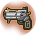

# สกิลอีเวนต์ (`EventSkill`) — คำอธิบายทีละสกิล (ภาษาไทย)

สร้างอัตโนมัติด้วย `scripts/render_explained_th.py` จาก `skill_reference.json` (ข้อมูลโค้ด client ชุดล่าสุด) ไม่มีข้อความเขียนมือ แก้ไฟล์นี้ตรง ๆ จะถูกเขียนทับ ตัวเลขทั้งหมดคำนวณจากโค้ด (Code) ความหมายของชื่อ field/บทบาทแปลจากชื่อในโค้ด (Inferred) ยังไม่ได้เทียบกับตัวเลขในเกม ข้อมูลดิบทุกเส้นทางอยู่ใน `../details/EventSkill.md`

---

<!-- calc:preface -->
> **วิธีอ่านหัวข้อ "การคำนวณแบบตัวเลข"** (สร้างอัตโนมัติด้วย `scripts/render_calc_th.py` จาก `skill_reference.json` แก้มือจะถูกเขียนทับ)
> ดาเมจต่อฮิตเดินตามขั้น `SkillCalcTemplate/CalcStep` 0→40 ตามลำดับ (Code: `SkillCalcTemplate.GetDamage`) ขั้น `+` บวกเข้าดาเมจ ขั้น `×` คูณแล้วปัดเศษทิ้ง (int) ทันทีทุกขั้น
> ลำดับหลัก: ดาเมจฐาน(7) + คงที่สกิล(8) + คงที่บัพ(9) − ป้องกันเป้า(10) + ตีแรก(11) → ×คริ(13) → ×ธาตุ(15) → ×ตัวคูณสกิล(18) → ×ตีแรก(19) → ×เสถียร(21) → +คงที่ออโต้(22) → ×Proration(23) → ×ประเภท(24) → ×ดาเมจสุดท้าย(25) → … → เพดาน/ขั้นต่ำ(35–37)
> "ฮิต N" = template ดาเมจแต่ละก้อน (ทอยคริแยกกัน) แยกตามเมธอดและตัวแปรฮิตในโค้ด (`type`, `isFirst`, `attackCount` …) ชื่อฮิต/ส่วนมาจากชื่อในโค้ด (Inferred) ตัวเลขคำนวณจากโค้ด (Code) โดยตั้งเจม/บัพเสริม = 0
> ค่าหลายก้อนในขั้นเดียวกันแบบ "บวกเข้าช่อง" จะบวกกันก่อนคูณ ส่วน "ตั้งค่าทับ" แทนที่ค่าเดิม ค่าที่ขึ้นกับสเตตัสแสดงเป็นตัวอย่างที่ 100 / 255 (และ Lv สกิลอื่น 1 / 10) ใช้สูตรที่แนบไว้คำนวณค่าอื่นเอง
<!-- calc:preface-end -->

### ท่อเหล็ก (IronPipe) · uid 1249

- ทรี: สกิลอีเวนต์ (ขั้น 1) · เลเวลสูงสุด: 1 · อาวุธ: มือเปล่า, ดาบมือเดียว, ดาบสองมือ, ธนู, โบว์กัน, ไม้เท้า, อุปกรณ์เวท, สนับมือ, ทวน, คาตานะ
- คลาสในโค้ด: `IronPipeAction` · สถานะการแกะ: แกะครบจากโค้ด

> เอาไว้ใช้ฆ่าซอมบี้ได้
> 
> อัตราคริติคอลสำหรับการโจมตีในบริเวณแคบจะลดลง
> แต่ถ้าติดคริติคอลจะทำให้หวาดกลัว

**ทำงานยังไง (จากโค้ด):**
- บทบาท: โจมตี (สร้างดาเมจ), ทำให้ติดสถานะผิดปกติ
- ดาเมจ: สร้าง template ดาเมจ 1 ก้อน (แต่ละก้อนทอยคริแยก) ตัวเลขทุกฮิตอยู่ในหัวข้อ "การคำนวณแบบตัวเลข" ด้านล่าง
- ประเภทดาเมจ: กายภาพ (ใช้ ATK)
- Proration: ช่องสกิลกายภาพ · เปลี่ยนค่าเฉพาะฮิตแรกต่อเป้าต่อการร่าย
- สถานะที่ทำให้ติด: ผงะ (Flinch)

<!-- calc:begin uid=1249 -->
#### การคำนวณแบบตัวเลข — IronPipe (uid 1249)
Proration: ช่อง `Skill` โหมด `first_hit_per_target`

**ฮิต 1: `calcPlayerToMobDamage` (ดาเมจหลัก)**
- ตัวคูณสกิล (`SkillRate`, ×, บวกเข้าช่อง): `skillRate / 100` — โดยที่ `skillRate` = `int(baseSTR / 2.5) + 5 × Lv + 50` (ขึ้นกับค่าในสถานการณ์จริง ทำตารางไม่ได้)
<!-- calc:end -->

### เรโทรโบว์กัน (RetroBowgun) · uid 1250

- ทรี: สกิลอีเวนต์ (ขั้น 1) · เลเวลสูงสุด: 1 · อาวุธ: มือเปล่า, ดาบมือเดียว, ดาบสองมือ, ธนู, โบว์กัน, ไม้เท้า, อุปกรณ์เวท, สนับมือ, ทวน, คาตานะ
- คลาสในโค้ด: `RetroBowgunAction` · สถานะการแกะ: แกะครบจากโค้ด

> โบว์กันประดับที่ดูไม่น่ามีอานุภาพ
> 
> ยิ่งโจมตีเป้าหมายไกลออกไปจะทำให้เป็นปรปักษ์
> และผลที่ได้จะยิ่งสูงขึ้น (6mขึ้นไป/9mขึ้นไป)

**ทำงานยังไง (จากโค้ด):**
- บทบาท: โจมตี (สร้างดาเมจ)
- ดาเมจ: สร้าง template ดาเมจ 1 ก้อน (แต่ละก้อนทอยคริแยก) ตัวเลขทุกฮิตอยู่ในหัวข้อ "การคำนวณแบบตัวเลข" ด้านล่าง
- ประเภทดาเมจ: กายภาพ (ใช้ ATK)
- Proration: ช่องสกิลกายภาพ · เปลี่ยนค่าเฉพาะฮิตแรกต่อเป้าต่อการร่าย

<!-- calc:begin uid=1250 -->
#### การคำนวณแบบตัวเลข — RetroBowgun (uid 1250)
Proration: ช่อง `Skill` โหมด `first_hit_per_target`

**ฮิต 1: `calcPlayerToMobDamage` (ดาเมจหลัก)**
- ดาเมจคงที่ของสกิล (`SkillConstantDamage`, +): **100** → 100, 100, 100, 100, 100, 100, 100, 100, 100, 100 (Lv1…10)
- ตัวคูณสกิล (`SkillRate`, ×, บวกเข้าช่อง): `skillRate / 100` — โดยที่ `skillRate` = `int(baseDEX / 2.5) + 5 × Lv + 50` (ขึ้นกับค่าในสถานการณ์จริง ทำตารางไม่ได้)
<!-- calc:end -->

### แม็กนั่ม (Magnum) · uid 1251

- ทรี: สกิลอีเวนต์ (ขั้น 1) · เลเวลสูงสุด: 1 · อาวุธ: มือเปล่า, ดาบมือเดียว, ดาบสองมือ, ธนู, โบว์กัน, ไม้เท้า, อุปกรณ์เวท, สนับมือ, ทวน, คาตานะ
- คลาสในโค้ด: `MagnumAction` · สถานะการแกะ: แกะครบจากโค้ด

> อาวุธจากต่างโลกที่ได้รับการดัดแปลง
> 
> โจมตีเป้าหมายด้วยการันตีคริติคอล
> แต่มีแรงสะท้อนสูงทำให้แม่นยำได้ยาก
> จำนวนครั้งที่ใช้จะเพิ่มขึ้นเมื่อเวลาต่อสู้ผ่านไป

**ทำงานยังไง (จากโค้ด):**
- บทบาท: โจมตี (สร้างดาเมจ), บัพตัวเอง
- ดาเมจ: สร้าง template ดาเมจ 1 ก้อน (แต่ละก้อนทอยคริแยก) ตัวเลขทุกฮิตอยู่ในหัวข้อ "การคำนวณแบบตัวเลข" ด้านล่าง
- ประเภทดาเมจ: กายภาพ (ใช้ ATK)
- Proration: ช่องเวท · เปลี่ยนค่าเฉพาะฮิตแรกต่อเป้าต่อการร่าย
- บัพ `MagnumBuf`: ตัวนับ/stack (`Count`) = `count` · ความแม่น % (`HitRate`) = `-hitRate` (ตัวนับที่เปลี่ยนตามเหตุการณ์); ค่าตั้งต้น `count`
- ตัวอ่านสกิลนี้ `MagnumAction.IsFailure` — เงื่อนไข is failure (MagnumAction): คืนค่า `0` (2 กรณี) (นิยามเต็มในแท็บ Variables)
- ตัวอ่านสกิลนี้ `MagnumAction.calcPlayerToMobDamage` — MagnumAction: สูตรดาเมจผู้เล่น→มอนสเตอร์ (ใส่ค่าลง template): [call] `MagnumBuf$$SetSkillParam` = `TryGetBuf.buf(PlayerStatusBase.get_SkillBufferManager(), SkillId.Magnum), Lv, PlayerActio…` เมื่อ (SkillBufferManager.TryGetBuf(PlayerStatusBase.get_SkillBufferManager(), SkillId.Magnum, out) & 1) ne 0 AND TryGetBuf.b… (นิยามเต็มในแท็บ Variables)
- ตัวอ่านสกิลนี้ `ReceiveSupportResult.OnEventPlayerSupport` — ReceiveSupportResult.OnEventPlayerSupport: [call] `SkillBufferManager$$AddSelfBuffer` = `PlayerStatusBase.get_SkillBufferManager(), new MagnumBuf, 0` เมื่อ (SkillUtil.CheckDanceSkill(skillId) & 1) eq 0 AND (skillId & 0xffff) gt 708 AND (skillId & 0xffff) gt 899 AND (skillId … (นิยามเต็มในแท็บ Variables)

<!-- calc:begin uid=1251 -->
#### การคำนวณแบบตัวเลข — Magnum (uid 1251)
Proration: ช่อง `Magic` โหมด `first_hit_per_target`

**ฮิต 1: `calcPlayerToMobDamage` (ดาเมจหลัก)**
- ดาเมจคงที่ของสกิล (`SkillConstantDamage`, +): **40×Lv** → 40, 80, 120, 160, 200, 240, 280, 320, 360, 400 (Lv1…10)
- ตัวคูณสกิล (`SkillRate`, ×, บวกเข้าช่อง): `skillRate / 100` — โดยที่ `skillRate` = `Lvรวม + 100 × Lv` (ขึ้นกับค่าในสถานการณ์จริง ทำตารางไม่ได้)
- Proration (`ExpRate`, ×, ตั้งค่าทับ): `target.ExpDefMagic / 100` (ขึ้นกับค่าในสถานการณ์จริง ทำตารางไม่ได้) — ตัวแปร: `target.ExpDefMagic` = proration ช่อง Magic ของมอน (ค่าปัจจุบัน %) (ดูแท็บ Variables)
<!-- calc:end -->

