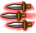

# สกิลมีดสั้น (`KnifeSkill`) — คำอธิบายทีละสกิล (ภาษาไทย)

สร้างอัตโนมัติด้วย `scripts/render_explained_th.py` จาก `skill_reference.json` (ข้อมูลโค้ด client ชุดล่าสุด) ไม่มีข้อความเขียนมือ แก้ไฟล์นี้ตรง ๆ จะถูกเขียนทับ ตัวเลขทั้งหมดคำนวณจากโค้ด (Code) ความหมายของชื่อ field/บทบาทแปลจากชื่อในโค้ด (Inferred) ยังไม่ได้เทียบกับตัวเลขในเกม ข้อมูลดิบทุกเส้นทางอยู่ใน `../details/KnifeSkill.md`

---

<!-- calc:preface -->
> **วิธีอ่านหัวข้อ "การคำนวณแบบตัวเลข"** (สร้างอัตโนมัติด้วย `scripts/render_calc_th.py` จาก `skill_reference.json` แก้มือจะถูกเขียนทับ)
> ดาเมจต่อฮิตเดินตามขั้น `SkillCalcTemplate/CalcStep` 0→40 ตามลำดับ (Code: `SkillCalcTemplate.GetDamage`) ขั้น `+` บวกเข้าดาเมจ ขั้น `×` คูณแล้วปัดเศษทิ้ง (int) ทันทีทุกขั้น
> ลำดับหลัก: ดาเมจฐาน(7) + คงที่สกิล(8) + คงที่บัพ(9) − ป้องกันเป้า(10) + ตีแรก(11) → ×คริ(13) → ×ธาตุ(15) → ×ตัวคูณสกิล(18) → ×ตีแรก(19) → ×เสถียร(21) → +คงที่ออโต้(22) → ×Proration(23) → ×ประเภท(24) → ×ดาเมจสุดท้าย(25) → … → เพดาน/ขั้นต่ำ(35–37)
> "ฮิต N" = template ดาเมจแต่ละก้อน (ทอยคริแยกกัน) แยกตามเมธอดและตัวแปรฮิตในโค้ด (`type`, `isFirst`, `attackCount` …) ชื่อฮิต/ส่วนมาจากชื่อในโค้ด (Inferred) ตัวเลขคำนวณจากโค้ด (Code) โดยตั้งเจม/บัพเสริม = 0
> ค่าหลายก้อนในขั้นเดียวกันแบบ "บวกเข้าช่อง" จะบวกกันก่อนคูณ ส่วน "ตั้งค่าทับ" แทนที่ค่าเดิม ค่าที่ขึ้นกับสเตตัสแสดงเป็นตัวอย่างที่ 100 / 255 (และ Lv สกิลอื่น 1 / 10) ใช้สูตรที่แนบไว้คำนวณค่าอื่นเอง
<!-- calc:preface-end -->

### โธร์วไนฟ์ (Throwing) · uid 295

- ทรี: สกิลมีดสั้น (ขั้น 1) · เลเวลสูงสุด: 5 · อาวุธ: มีด · ธง: StarGem, MercenaryCanUseSkill
- คลาสในโค้ด: `ThrowingAction` · สถานะการแกะ: แกะครบจากโค้ด

> โจมตีด้วยการขว้างดาบสั้น
> 
> ถ้าถึง Lv10 แล้ว MP ที่ใช้จะเป็น 0
> กลายเป็นความเคยชินตามปกติ

**ทำงานยังไง (จากโค้ด):**
- บทบาท: โจมตี (สร้างดาเมจ)
- MP ที่ใช้ [`Lv = 10`]: 0
- ดาเมจ: สร้าง template ดาเมจ 1 ก้อน (แต่ละก้อนทอยคริแยก) ตัวเลขทุกฮิตอยู่ในหัวข้อ "การคำนวณแบบตัวเลข" ด้านล่าง
- ประเภทดาเมจ: กายภาพ; เลเวล 10 เป็นธรรมดา — เงื่อนไข: Physics: default (ctor); Normal: OnInitialize: Lv == 10
- Proration: ช่องที่เลือกตอนร่าย (กายภาพ/เวท) · เปลี่ยนค่าเฉพาะฮิตแรกต่อเป้าต่อการร่าย

<!-- calc:begin uid=295 -->
#### การคำนวณแบบตัวเลข — Throwing (uid 295)
Proration: ช่อง `dynamic` โหมด `first_hit_per_target`

**ฮิต 1: `calcPlayerToMobDamage` (ดาเมจหลัก)**
- ตัวคูณสกิล (`SkillRate`, ×, บวกเข้าช่อง): **(10 + 4×Lv)%** → 14%, 18%, 22%, 26%, 30%, 34%, 38%, 42%, 46%, 50% (Lv1…10)
- ตัวคูณดาเมจสุดท้าย (`LastDamageRate`, ×, ตั้งค่าทับ) [`(SkillParam & 32) ≠ 0` และ `SkillActionBase.checkPercent(this, 100, SkillMasteryBase.GetMasteryParam(MasteryId.Trigger))`]: `PlayerAttackBase.CalcLastDamageRate(this, PlayerActionManagerBase.get_PlayerStatus(), ThrowingAction.get_AttackType())` (ขึ้นกับค่าในสถานการณ์จริง ทำตารางไม่ได้) — ตัวแปร: `PlayerAttackBase.CalcLastDamageRate` = ตัวคูณดาเมจสุดท้ายรวม (บัพ + มาสเตอรี + เจม + Double Throw ...); `PlayerActionManagerBase.get_PlayerStatus` = ค่า Player Status ของ PlayerActionManagerBase; `ThrowingAction.get_AttackType` = ค่า Attack Type ของ ThrowingAction (ดูแท็บ Variables)
- ตัวคูณดาเมจสุดท้าย (`LastDamageRate`, ×, บวกเข้าช่อง) [`(SkillParam & 32) ≠ 0` และ `SkillActionBase.checkPercent(this, 100, SkillMasteryBase.GetMasteryParam(MasteryId.Trigger))` และ `TryGetProperties<object>.out2(mobAction, 90) ≠ 0`]: `-MobPropertyLifeReduceDamage.CalcReduceLastDamageRate(TryGetProperties<object>.out2(mobAction, 90))` (ขึ้นกับค่าในสถานการณ์จริง ทำตารางไม่ได้) — ตัวแปร: `MobPropertyLifeReduceDamage.CalcReduceLastDamageRate` = คำนวณ reduce last damage rate (MobPropertyLifeReduceDamage) (ดูแท็บ Variables)
- ดาเมจคงที่สุดท้าย (`LastConstantDamage`, +): `SubEqAtkรวม` (ขึ้นกับค่าในสถานการณ์จริง ทำตารางไม่ได้) — ตัวแปร: `status.SubEqAtk` = ATK จากอาวุธรอง (ดูแท็บ Variables)
<!-- calc:end -->

### แซคเคิลอาร์ม (SecondArm) · uid 296

- ทรี: สกิลมีดสั้น (ขั้น 1) · เลเวลสูงสุด: 5 · อาวุธ: มีด · ธง: StarGem
- คลาสในโค้ด: `SecondArm` · สถานะการแกะ: แกะครบจากโค้ด

> มีโอกาสเพิ่มค่าความเสียหายเล็กน้อย
> ในการโจมตีปกติถ้าติดตั้งมีดอยู่

**ทำงานยังไง (จากโค้ด):**
- บทบาท: พาสซีฟ
- พาสซีฟ โอกาสทำงาน % (`Trigger`): 5, 10, 15, 20, 25, 30, 35, 40, 45, 50 (Lv1…10)
- พาสซีฟ ตัวคูณสกิล (`SkillRate`): 25, 25, 25, 25, 25, 25, 25, 25, 25, 25 (Lv1…10)

### สไปก์ดาร์ต (SpikeDart) · uid 290

- ทรี: สกิลมีดสั้น (ขั้น 2) · เลเวลสูงสุด: 20 · อาวุธ: มีด · ต้องเรียนก่อน: โธร์วไนฟ์ · ธง: MercenaryCanUseSkill
- คลาสในโค้ด: `SpikeDartAction` · สถานะการแกะ: แกะครบจากโค้ด

> รบกวนการเคลื่อนไหวด้วยการขว้างมีดสั้นใส่เท้าของเป้าหมาย
> มีโอกาสทำให้เป้าหมาย[เชื่องช้า]

**ทำงานยังไง (จากโค้ด):**
- บทบาท: โจมตี (สร้างดาเมจ), ทำให้ติดสถานะผิดปกติ
- ดาเมจ: สร้าง template ดาเมจ 1 ก้อน (แต่ละก้อนทอยคริแยก) ตัวเลขทุกฮิตอยู่ในหัวข้อ "การคำนวณแบบตัวเลข" ด้านล่าง
- ประเภทดาเมจ: กายภาพ (ใช้ ATK)
- Proration: ช่องสกิลกายภาพ · เปลี่ยนค่าเฉพาะฮิตแรกต่อเป้าต่อการร่าย
- โอกาสติดสถานะ `slowPercent` [`Lv = 0` หรือ `1 ≥ Lv` และ `Lv ≠ 0` หรือ `1 < Lv` และ `2 ≥ Lv` และ `Lv ≠ 0`]: **50 + 5×Lv** → 55, 60, 65, 70, 75, 80, 85, 90, 95, 100 (Lv1…10) %
- สถานะที่ทำให้ติด: ช้า (Slow)

<!-- calc:begin uid=290 -->
#### การคำนวณแบบตัวเลข — SpikeDart (uid 290)
Proration: ช่อง `Skill` โหมด `first_hit_per_target`

**ฮิต 1: `calcPlayerToMobDamage` (ดาเมจหลัก) · ส่วน โบนัส (`bonus…`)**
- ดาเมจคงที่ของสกิล (`SkillConstantDamage`, +): `bonusFixAddDamage` — โดยที่ `bonusFixAddDamage` = `SubEqAtkรวม // 5` [`Lv = 0` หรือ `1 ≥ Lv` และ `Lv ≠ 0` หรือ `1 < Lv` และ `2 ≥ Lv` และ `Lv ≠ 0`] (ขึ้นกับค่าในสถานการณ์จริง ทำตารางไม่ได้)
- ดาเมจคงที่ของสกิล (`SkillConstantDamage`, +): **10 + Lv** → 11, 12, 13, 14, 15, 16, 17, 18, 19, 20 (Lv1…10)
- ตัวคูณสกิล (`SkillRate`, ×, บวกเข้าช่อง): `bonusSkillRate` — โดยที่ `bonusSkillRate` = `baseDEX // (20 - Lv) / 100` [`Lv = 0` หรือ `1 ≥ Lv` และ `Lv ≠ 0` หรือ `1 < Lv` และ `2 ≥ Lv` และ `Lv ≠ 0`] (ขึ้นกับค่าในสถานการณ์จริง ทำตารางไม่ได้)
- ตัวคูณสกิล (`SkillRate`, ×, บวกเข้าช่อง) [`1 ≥ Lv` และ `Lv ≠ 0`]: **75%** → 75%, 75%, 75%, 75%, 75%, 75%, 75%, 75%, 75%, 75% (Lv1…10)
- ตัวคูณสกิล (`SkillRate`, ×, บวกเข้าช่อง) [`1 < Lv` และ `2 ≥ Lv` และ `Lv ≠ 0`]: **42%** → 42%, 42%, 42%, 42%, 42%, 42%, 42%, 42%, 42%, 42% (Lv1…10)
- ตัวคูณสกิล (`SkillRate`, ×, บวกเข้าช่อง) [`1 < Lv` และ `2 < Lv` และ `3 ≥ Lv` และ `Lv ≠ 0`]: **47%** → 47%, 47%, 47%, 47%, 47%, 47%, 47%, 47%, 47%, 47% (Lv1…10)
- ตัวคูณสกิล (`SkillRate`, ×, บวกเข้าช่อง) [`1 < Lv` และ `2 < Lv` และ `3 < Lv` และ `Lv ≠ 0`]: **4700%** → 4700%, 4700%, 4700%, 4700%, 4700%, 4700%, 4700%, 4700%, 4700%, 4700% (Lv1…10)

**ใช้ร่วมทุกฮิตของ ดาเมจหลัก**
- ตัวคูณดาเมจสุดท้าย (`LastDamageRate`, ×, ตั้งค่าทับ) [`(SkillParam & 32) ≠ 0` และ `SkillActionBase.checkPercent(this, 100, SkillMasteryBase.GetMasteryParam(MasteryId.Trigger))`]: `PlayerAttackBase.CalcLastDamageRate(this, PlayerActionManagerBase.get_PlayerStatus(), SpikeDartAction.get_AttackType())` (ขึ้นกับค่าในสถานการณ์จริง ทำตารางไม่ได้) — ตัวแปร: `PlayerAttackBase.CalcLastDamageRate` = ตัวคูณดาเมจสุดท้ายรวม (บัพ + มาสเตอรี + เจม + Double Throw ...); `PlayerActionManagerBase.get_PlayerStatus` = ค่า Player Status ของ PlayerActionManagerBase; `SpikeDartAction.get_AttackType` = ค่า Attack Type ของ SpikeDartAction (ดูแท็บ Variables)
- ตัวคูณดาเมจสุดท้าย (`LastDamageRate`, ×, บวกเข้าช่อง) [`(SkillParam & 32) ≠ 0` และ `SkillActionBase.checkPercent(this, 100, SkillMasteryBase.GetMasteryParam(MasteryId.Trigger))` และ `TryGetProperties<object>.out2(mobAction, 90) ≠ 0`]: `-MobPropertyLifeReduceDamage.CalcReduceLastDamageRate(TryGetProperties<object>.out2(mobAction, 90))` (ขึ้นกับค่าในสถานการณ์จริง ทำตารางไม่ได้) — ตัวแปร: `MobPropertyLifeReduceDamage.CalcReduceLastDamageRate` = คำนวณ reduce last damage rate (MobPropertyLifeReduceDamage) (ดูแท็บ Variables)

**จำนวนฮิต / ตัวนับ**
- `damageCount` (ตั้งใน `OnInitialize`) [`1 ≥ Lv` และ `Lv ≠ 0`]: 1, 1, 1, 1, 1, 1, 1, 1, 1, 1 (Lv1…10)
- `damageCount` (ตั้งใน `OnInitialize`) [`1 < Lv` และ `2 ≥ Lv` และ `Lv ≠ 0` หรือ `1 < Lv` และ `2 < Lv` และ `3 ≥ Lv` และ `Lv ≠ 0` หรือ `1 < Lv` และ `2 < Lv` และ `3 < Lv` และ `Lv ≠ 0`]: 2, 2, 2, 2, 2, 2, 2, 2, 2, 2 (Lv1…10)
<!-- calc:end -->

### พอยซั่นแดกเกอร์ (PoisonDagger) · uid 291

- ทรี: สกิลมีดสั้น (ขั้น 2) · เลเวลสูงสุด: 20 · อาวุธ: มีด · ต้องเรียนก่อน: โธร์วไนฟ์ · ธง: MercenaryCanUseSkill
- คลาสในโค้ด: `PoisonDaggerAction` · สถานะการแกะ: แกะครบจากโค้ด

> โจมตีด้วยมีดสั้นอาบยาพิษ
> มีโอกาสทำให้เป้าหมายติด[พิษ]

**ทำงานยังไง (จากโค้ด):**
- บทบาท: โจมตี (สร้างดาเมจ), ทำให้ติดสถานะผิดปกติ
- ดาเมจ: สร้าง template ดาเมจ 1 ก้อน (แต่ละก้อนทอยคริแยก) ตัวเลขทุกฮิตอยู่ในหัวข้อ "การคำนวณแบบตัวเลข" ด้านล่าง
- ประเภทดาเมจ: กายภาพ (ใช้ ATK)
- Proration: ช่องสกิลกายภาพ · เปลี่ยนค่าเฉพาะฮิตแรกต่อเป้าต่อการร่าย
- โอกาสติดสถานะ `poisonPercent`: 77, 80, 82, 85, 87, 90, 92, 95, 97, 100 (Lv1…10) %
- สถานะที่ทำให้ติด: พิษ (Poison)

<!-- calc:begin uid=291 -->
#### การคำนวณแบบตัวเลข — PoisonDagger (uid 291)
Proration: ช่อง `Skill` โหมด `first_hit_per_target`

**ฮิต 1: `calcPlayerToMobDamage` (ดาเมจหลัก) · ส่วน โบนัส (`bonus…`)**
- ดาเมจคงที่ของสกิล (`SkillConstantDamage`, +): `bonusFixAddDamage` — โดยที่ `bonusFixAddDamage` = `SubAtkรวม` (ขึ้นกับค่าในสถานการณ์จริง ทำตารางไม่ได้)
- ดาเมจคงที่ของสกิล (`SkillConstantDamage`, +): **100 + 10×Lv** → 110, 120, 130, 140, 150, 160, 170, 180, 190, 200 (Lv1…10)
- ตัวคูณสกิล (`SkillRate`, ×, บวกเข้าช่อง): `bonusSkillRate` — โดยที่ `bonusSkillRate` = `baseINT // (11 - Lv) / 100` (ขึ้นกับค่าในสถานการณ์จริง ทำตารางไม่ได้)
- ตัวคูณสกิล (`SkillRate`, ×, บวกเข้าช่อง): 52%, 55%, 57%, 60%, 62%, 65%, 67%, 70%, 72%, 75% (Lv1…10)
  - สูตร: `skillRate` — โดยที่ `skillRate` = `(int(2.5 × Lv) + 50) / 100`
- ตัวคูณดาเมจสุดท้าย (`LastDamageRate`, ×, ตั้งค่าทับ) [`(SkillParam & 32) ≠ 0` และ `SkillActionBase.checkPercent(this, 100, SkillMasteryBase.GetMasteryParam(MasteryId.Trigger))`]: `PlayerAttackBase.CalcLastDamageRate(this, PlayerActionManagerBase.get_PlayerStatus(), PoisonDaggerAction.get_AttackType())` (ขึ้นกับค่าในสถานการณ์จริง ทำตารางไม่ได้) — ตัวแปร: `PlayerAttackBase.CalcLastDamageRate` = ตัวคูณดาเมจสุดท้ายรวม (บัพ + มาสเตอรี + เจม + Double Throw ...); `PlayerActionManagerBase.get_PlayerStatus` = ค่า Player Status ของ PlayerActionManagerBase; `PoisonDaggerAction.get_AttackType` = ค่า Attack Type ของ PoisonDaggerAction (ดูแท็บ Variables)
- ตัวคูณดาเมจสุดท้าย (`LastDamageRate`, ×, บวกเข้าช่อง) [`(SkillParam & 32) ≠ 0` และ `SkillActionBase.checkPercent(this, 100, SkillMasteryBase.GetMasteryParam(MasteryId.Trigger))` และ `TryGetProperties<object>.out2(mobAction, 90) ≠ 0`]: `-MobPropertyLifeReduceDamage.CalcReduceLastDamageRate(TryGetProperties<object>.out2(mobAction, 90))` (ขึ้นกับค่าในสถานการณ์จริง ทำตารางไม่ได้) — ตัวแปร: `MobPropertyLifeReduceDamage.CalcReduceLastDamageRate` = คำนวณ reduce last damage rate (MobPropertyLifeReduceDamage) (ดูแท็บ Variables)
<!-- calc:end -->

### อินเทนซีฟไนฟ์ (IntenseKnife) · uid 297

- ทรี: สกิลมีดสั้น (ขั้น 2) · เลเวลสูงสุด: 20 · อาวุธ: มีด · ต้องเรียนก่อน: แซคเคิลอาร์ม
- คลาสในโค้ด: `IntenseKnife` · สถานะการแกะ: แกะครบจากโค้ด

> เพิ่มพลังโจมตีและอัตราการเกิด
> ให้แซคเคิลอาร์มมีประสิทธิภาพมากขึ้น

**ทำงานยังไง (จากโค้ด):**
- บทบาท: พาสซีฟ
- พาสซีฟ โอกาสทำงาน % (`Trigger`): 5, 10, 15, 20, 25, 30, 35, 40, 45, 50 (Lv1…10)
- พาสซีฟ ตัวคูณสกิล (`SkillRate`): 25, 25, 25, 25, 25, 25, 25, 25, 25, 25 (Lv1…10)

### แกตติ้งไนฟ์ (GatlingKnife) · uid 292

- ทรี: สกิลมีดสั้น (ขั้น 3) · เลเวลสูงสุด: 50 · อาวุธ: มีด · ต้องเรียนก่อน: สไปก์ดาร์ต · ธง: MercenaryCanUseSkill
- คลาสในโค้ด: `GatlingKnifeAction` · สถานะการแกะ: แกะครบจากโค้ด

> ขวางมีดสั้นออกไปเป็นจำนวนมากอย่างต่อเนื่อง

**ทำงานยังไง (จากโค้ด):**
- บทบาท: โจมตี (สร้างดาเมจ)
- ดาเมจ: สร้าง template ดาเมจ 1 ก้อน (แต่ละก้อนทอยคริแยก) ตัวเลขทุกฮิตอยู่ในหัวข้อ "การคำนวณแบบตัวเลข" ด้านล่าง
- ประเภทดาเมจ: กายภาพ (ใช้ ATK)
- Proration: ช่องสกิลกายภาพ · เปลี่ยนค่าเฉพาะฮิตแรกต่อเป้าต่อการร่าย

<!-- calc:begin uid=292 -->
#### การคำนวณแบบตัวเลข — GatlingKnife (uid 292)
Proration: ช่อง `Skill` โหมด `first_hit_per_target`

**ฮิต 1: `calcPlayerToMobDamage` (ดาเมจหลัก) · ส่วน โบนัส (`bonus…`)**
- ดาเมจคงที่ของสกิล (`SkillConstantDamage`, +): `bonusFixAddDamage` — โดยที่ `bonusFixAddDamage` = `SubEqAtkรวม` (ขึ้นกับค่าในสถานการณ์จริง ทำตารางไม่ได้)
- ดาเมจคงที่ของสกิล (`SkillConstantDamage`, +): **20 + 2×Lv** → 22, 24, 26, 28, 30, 32, 34, 36, 38, 40 (Lv1…10)
- ตัวคูณสกิล (`SkillRate`, ×, บวกเข้าช่อง): `bonusSkillRate` — โดยที่ `bonusSkillRate` = `(baseAGI + baseSTR + baseDEX) // 30 / 100` (ขึ้นกับค่าในสถานการณ์จริง ทำตารางไม่ได้)
- ตัวคูณสกิล (`SkillRate`, ×, บวกเข้าช่อง): 40%, 40%, 50%, 60%, 70%, 70%, 80%, 90%, 100%, 100% (Lv1…10)
  - สูตร: `skillRate` — โดยที่ `skillRate` = `(10 × int(0.75 × Lv - 0.75) + 40) / 100`

**ใช้ร่วมทุกฮิตของ ดาเมจหลัก**
- ตัวคูณดาเมจสุดท้าย (`LastDamageRate`, ×, ตั้งค่าทับ) [`(SkillParam & 32) ≠ 0` และ `SkillActionBase.checkPercent(this, 100, SkillMasteryBase.GetMasteryParam(MasteryId.Trigger))`]: `PlayerAttackBase.CalcLastDamageRate(this, PlayerActionManagerBase.get_PlayerStatus(), GatlingKnifeAction.get_AttackType())` (ขึ้นกับค่าในสถานการณ์จริง ทำตารางไม่ได้) — ตัวแปร: `PlayerAttackBase.CalcLastDamageRate` = ตัวคูณดาเมจสุดท้ายรวม (บัพ + มาสเตอรี + เจม + Double Throw ...); `PlayerActionManagerBase.get_PlayerStatus` = ค่า Player Status ของ PlayerActionManagerBase; `GatlingKnifeAction.get_AttackType` = ค่า Attack Type ของ GatlingKnifeAction (ดูแท็บ Variables)
- ตัวคูณดาเมจสุดท้าย (`LastDamageRate`, ×, บวกเข้าช่อง) [`(SkillParam & 32) ≠ 0` และ `SkillActionBase.checkPercent(this, 100, SkillMasteryBase.GetMasteryParam(MasteryId.Trigger))` และ `TryGetProperties<object>.out2(mobAction, 90) ≠ 0`]: `-MobPropertyLifeReduceDamage.CalcReduceLastDamageRate(TryGetProperties<object>.out2(mobAction, 90))` (ขึ้นกับค่าในสถานการณ์จริง ทำตารางไม่ได้) — ตัวแปร: `MobPropertyLifeReduceDamage.CalcReduceLastDamageRate` = คำนวณ reduce last damage rate (MobPropertyLifeReduceDamage) (ดูแท็บ Variables)

**จำนวนฮิต / ตัวนับ**
- `damageCount` (ตั้งใน `OnInitialize`): 5, 6, 6, 6, 6, 7, 7, 7, 7, 8 (Lv1…10)
<!-- calc:end -->

### ดับเบิ้ลสแทบ (DoubleThrow) · uid 293

- ทรี: สกิลมีดสั้น (ขั้น 3) · เลเวลสูงสุด: 50 · อาวุธ: มีด · ต้องเรียนก่อน: พอยซั่นแดกเกอร์
- คลาสในโค้ด: `DoubleThrow` · สถานะการแกะ: แกะครบจากโค้ด

> เมื่อใช้ Avoid พลังของสกิลมีดที่ใช้ถัดไปจะเพิ่มขึ้น
> ถ้าใช้ไปครั้งหนึ่งแล้วจะต้องรอเวลาเพื่อใช้ครั้งถัดไป
> จะสามารถใช้ครั้งต่อไปได้เร็วขึ้นเมื่อเลเวลเพิ่มขึ้น
> ไม่มีผลกับสกิลที่ไม่ได้ใช้ MP

**ทำงานยังไง (จากโค้ด):**
- บทบาท: พาสซีฟ
- พาสซีฟ โอกาสทำงาน % (`Trigger`): `?addv`
- ตัวอ่านสกิลนี้ `AvoidActionManager.DoubleThrowAvoid` — AvoidActionManager.DoubleThrowAvoid: [call] `SkillBufferManager$$AddSelfBuffer` = `PlayerDataManager.get_SkillBufferManager(playerManager), new DoubleThrowBuf, 0` เมื่อ SkillManager.GetSkillLv(PlayerDataManager.get_SkillManager(playerManager), SkillId.DoubleThrow, 1) ge 1 AND EquipItemDa… (นิยามเต็มในแท็บ Variables)
- ตัวอ่านสกิลนี้ `PlayerBattleManager.OnSkillActionDamaged` — PlayerBattleManager.OnSkillActionDamaged (นิยามเต็มในแท็บ Variables)

### ไนฟ์คอมแบท (KnifeCombat) · uid 299

- ทรี: สกิลมีดสั้น (ขั้น 3) · เลเวลสูงสุด: 50 · อาวุธ: มีด · ต้องเรียนก่อน: อินเทนซีฟไนฟ์
- คลาสในโค้ด: `KnifeCombatAction` · สถานะการแกะ: แกะครบจากโค้ด

> เปลี่ยนการโจมตีปกติเป็นการโจมตีด้วยดาบสั้น
> เพิ่มอัตราคริติคอลและฟื้นฟู MP การโจมตี
> ลดการใช้ Avoid ระหว่างการโจมตีปกติ
> ความเคยชินทั่วไปจะหายไป
> เอฟเฟกต์จะสิ้นสุดลงเมื่อใช้สกิลอื่น

**ทำงานยังไง (จากโค้ด):**
- บทบาท: โจมตี (สร้างดาเมจ), บัพตัวเอง, เปลี่ยนรูปแบบการโจมตี (อนุมานจาก hook ของบัพ), เพิ่มดาเมจตีปกติ
- ดาเมจ: สร้าง template ดาเมจ 1 ก้อน (แต่ละก้อนทอยคริแยก) ตัวเลขทุกฮิตอยู่ในหัวข้อ "การคำนวณแบบตัวเลข" ด้านล่าง
- ประเภทดาเมจ: กายภาพ (ใช้ ATK)
- Proration: ช่องสกิลกายภาพ · เปลี่ยนค่าเฉพาะฮิตแรกต่อเป้าต่อการร่าย
- บัพ `KnifeCombatBuf`: ตัวคูณตีปกติ % (`NormalAttackRate`) = `normalAtkRate` · ค่าทั่วไป (ความหมายขึ้นกับโค้ดที่อ่าน) (`Value`) = `100 - avoidStackRegist` · MP ฟื้นต่อการโจมตี (`AttackMprecoveryUp`) = `atkMpRecovery` · อัตราคริ + (`CrtUp`) = `crtUp`
- บัพ `SkillBufferDataBase`: บัพแบบมี/ไม่มี (marker) ไม่มีค่าตัวเลข โค้ดอื่นเช็กแค่ว่ามีบัพนี้อยู่
- ตัวอ่านสกิลนี้ `AvoidActionManager.AvoidMove` — AvoidActionManager.AvoidMove: [call] `AvoidActionManager$$CheckMindimageSenju` = `this` เมื่อ (SkillActionBase.op_Inequality(SkillActionManagerBase.get_CurrentSkill(), 0) & 1) ne 0 AND SkillActionBase.get_ActionID…; [call] `AvoidActionManager$$CheckActivateMirageStep` = `this` เมื่อ (SkillActionBase.op_Inequality(SkillActionManagerBase.get_CurrentSkill(), 0) & 1) ne 0 AND SkillActionBase.get_ActionID…; [call] `SkillBufferManager$$AddSelfBuffer` = `PlayerStatusBase.get_SkillBufferManager(), new MirageStepBuf, 0` เมื่อ (SkillActionBase.op_Inequality(SkillActionManagerBase.get_CurrentSkill(), 0) & 1) ne 0 AND SkillActionBase.get_ActionID… (นิยามเต็มในแท็บ Variables)
- ตัวอ่านสกิลนี้ `FlinchKnifeAction.ActionStart` — FlinchKnifeAction: ตอนเริ่มทำงานของสกิล: [call] `SkillBufferManager$$AddSelfBuffer` = `PlayerStatusBase.get_SkillBufferManager(), new KnifeCombatBuf, 0` เมื่อ (PlayerAttackBase.IsBlank(this) & 1) eq 0 AND (SkillManager.GetSkillLv(PlayerStatusBase.get_SkillManager(), SkillId.Kni…; [call] `TwinStormBuf$$ChangeTwinStorm` = `TryGetBuf<object>.out2(PlayerStatusBase.get_SkillBufferManager(), 82), 0` เมื่อ (PlayerAttackBase.IsBlank(this) & 1) eq 0 AND (SkillManager.GetSkillLv(PlayerStatusBase.get_SkillManager(), SkillId.Kni… (นิยามเต็มในแท็บ Variables)
- ตัวอ่านสกิลนี้ `MobaPlayerBattleManager.OnSkillActionEnd` — MobaPlayerBattleManager.OnSkillActionEnd: [set] `attackDelay` = `0` เมื่อ (SkillActionBase.get_IsChatLog() & 1) eq 0 AND (SkillActionBase.get_IsSupport() & 1) eq 0 AND (SkillBufferManager.Conta…; [set] `<IsDelay>k__BackingField` = `0` เมื่อ (SkillActionBase.get_IsChatLog() & 1) eq 0 AND (SkillActionBase.get_IsSupport() & 1) eq 0 AND (SkillBufferManager.Conta…; [set] `<IsDelay>k__BackingField` = `1` เมื่อ (SkillActionBase.get_IsChatLog() & 1) eq 0 AND (SkillActionBase.get_IsSupport() & 1) eq 0 AND GemCartBufferBase.GetValu… (นิยามเต็มในแท็บ Variables)
- ตัวอ่านสกิลนี้ `MobaPlayerSecondaryStatus.GetCrtConstant` — MobaPlayerSecondaryStatus.GetCrtConstant: คืนค่า `_t1164` (นิยามเต็มในแท็บ Variables)
- ตัวอ่านสกิลนี้ `NormalAttackAction.OnInitialize` — NormalAttackAction: ตั้งค่าเริ่มต้นของสกิล (ตัวคูณ ดาเมจคงที่ ระยะ ...): [set] `<SkillIndividualFlag>k__BackingField` = `(_t1208 | 1024)` เมื่อ (SkillBufferManager.ContainsBuffer(PlayerStatusBase.get_SkillBufferManager(), SkillId.KnifeCombat) & 1) ne 0; [set] `<ActionRange>k__BackingField` = `MathUtil.DisplayMeterToDistance(4)` เมื่อ (SkillBufferManager.ContainsBuffer(PlayerStatusBase.get_SkillBufferManager(), SkillId.KnifeCombat) & 1) ne 0; [set] `<SkillIndividualFlag>k__BackingField` = `(((SkillBufferManager.ContainsBuffer(PlayerStatusBase.get_SkillBufferManager(), SkillId.K…` เมื่อ (SkillBufferManager.TryGetBuf(PlayerStatusBase.get_SkillBufferManager(), SkillId.PairOfShields, out) & 1) ne 0 AND Equi… (นิยามเต็มในแท็บ Variables)
- ตัวอ่านสกิลนี้ `PlayerAttackBase.RemoveAfterSkillBuf` — PlayerAttackBase.RemoveAfterSkillBuf: [call] `SkillBufferManager$$RemoveBuffer` = `PlayerStatusBase.get_SkillBufferManager(), SkillId.KnifeCombat` เมื่อ (PlayerAttackBase.ContainsNotApplicableSkill(PlayerAttackBase.get_ActionID()) & 1) eq 0 AND (SkillBufferManager.Contain… (นิยามเต็มในแท็บ Variables)
- ตัวอ่านสกิลนี้ `PlayerBattleManager.CheckZeroActionDelay` — ตรวจ zero action delay (PlayerBattleManager): คืนค่า `1` (2 กรณี) (นิยามเต็มในแท็บ Variables)
- ตัวอ่านสกิลนี้ `PlayerSecondaryStatus.GetCrtConstant` — PlayerSecondaryStatus.GetCrtConstant: คืนค่า `_t1629` (นิยามเต็มในแท็บ Variables)
- ตัวอ่านสกิลนี้ `WheelBiteAction.<>c__DisplayClass31_0.<ActionStart>b__0` — <>c__DisplayClass31_0.<ActionStart>b__0: [call] `SkillBufferManager$$AddSelfBuffer` = `PlayerStatusBase.get_SkillBufferManager(), new KnifeCombatBuf, 0` เมื่อ SkillManager.GetSkillLv(PlayerStatusBase.get_SkillManager(), SkillId.KnifeCombat, 1) ge 1; [call] `TwinStormBuf$$ChangeTwinStorm` = `TryGetBuf<object>.out2(PlayerStatusBase.get_SkillBufferManager(), 82), 0` เมื่อ SkillManager.GetSkillLv(PlayerStatusBase.get_SkillManager(), SkillId.KnifeCombat, 1) ge 1 AND (SkillBufferManager.TryGe… (นิยามเต็มในแท็บ Variables)

**โน้ตในเกม (ข้อความจากเกม):**
- Lv18: การโจมตีปกติระหว่างไนฟ์คอมแบทจะแข็งแกร่งขึ้นตาม แซคเคิลอาร์ม, อินเทนซีฟไนฟ์ และเมลเบรคเกอร์ที่ได้เรียนรู้

<!-- calc:begin uid=299 -->
#### การคำนวณแบบตัวเลข — KnifeCombat (uid 299)
Proration: ช่อง `Skill` โหมด `first_hit_per_target`

**ฮิต 1: `calcPlayerToMobDamage` (ดาเมจหลัก)**
- ตัวคูณสกิล (`SkillRate`, ×, บวกเข้าช่อง) [`EquipItemData.get_SubWeapon(PlayerStatusBase.get_EquipItemData()).Type = 18`]: `(((100 + EquipItemData.get_SubWeapon(PlayerStatusBase.get_EquipItemData()).Function)) / 100)` (ขึ้นกับค่าในสถานการณ์จริง ทำตารางไม่ได้) — ตัวแปร: `EquipItemData.get_SubWeapon` = ค่า Sub Weapon ของ EquipItemData; `PlayerStatusBase.get_EquipItemData` = ค่า Equip Item Data ของ PlayerStatusBase (ดูแท็บ Variables)
- ตัวคูณสกิล (`SkillRate`, ×, บวกเข้าช่อง) [`EquipItemData.get_SubWeapon(PlayerStatusBase.get_EquipItemData()).Type ≠ 18`]: **100%** → 100%, 100%, 100%, 100%, 100%, 100%, 100%, 100%, 100%, 100% (Lv1…10)
- ตัวคูณดาเมจสุดท้าย (`LastDamageRate`, ×, ตั้งค่าทับ) [`(SkillParam & 32) ≠ 0` และ `SkillActionBase.checkPercent(this, 100, SkillMasteryBase.GetMasteryParam(MasteryId.Trigger))`]: `PlayerAttackBase.CalcLastDamageRate(this, PlayerActionManagerBase.get_PlayerStatus(), KnifeCombatAction.get_AttackType())` (ขึ้นกับค่าในสถานการณ์จริง ทำตารางไม่ได้) — ตัวแปร: `PlayerAttackBase.CalcLastDamageRate` = ตัวคูณดาเมจสุดท้ายรวม (บัพ + มาสเตอรี + เจม + Double Throw ...); `PlayerActionManagerBase.get_PlayerStatus` = ค่า Player Status ของ PlayerActionManagerBase; `KnifeCombatAction.get_AttackType` = ค่า Attack Type ของ KnifeCombatAction (ดูแท็บ Variables)
- ตัวคูณดาเมจสุดท้าย (`LastDamageRate`, ×, บวกเข้าช่อง) [`(SkillParam & 32) ≠ 0` และ `SkillActionBase.checkPercent(this, 100, SkillMasteryBase.GetMasteryParam(MasteryId.Trigger))` และ `TryGetProperties<object>.out2(mobAction, 90) ≠ 0`]: `-MobPropertyLifeReduceDamage.CalcReduceLastDamageRate(TryGetProperties<object>.out2(mobAction, 90))` (ขึ้นกับค่าในสถานการณ์จริง ทำตารางไม่ได้) — ตัวแปร: `MobPropertyLifeReduceDamage.CalcReduceLastDamageRate` = คำนวณ reduce last damage rate (MobPropertyLifeReduceDamage) (ดูแท็บ Variables)
<!-- calc:end -->

### อเมซซิ่งโธร์ว (ThreateningThorwArts) · uid 294

- ทรี: สกิลมีดสั้น (ขั้น 4) · เลเวลสูงสุด: 110 · อาวุธ: มีด · ต้องเรียนก่อน: แกตติ้งไนฟ์
- คลาสในโค้ด: `ThreateningThorwArts` · สถานะการแกะ: แกะครบจากโค้ด

> ใช้เทคนิคการขว้างอันยอดเยี่ยม
> มีโอกาสเพิ่มจำนวนฮิตให้กับสกิลมีดทั้งหมด

**ทำงานยังไง (จากโค้ด):**
- บทบาท: พาสซีฟ
- พาสซีฟ โอกาสทำงาน % (`Trigger`): `id ≠ 26 ? 3 × Lv : 1`

### เมลเบรคเกอร์ (MailBreaker) · uid 298

- ทรี: สกิลมีดสั้น (ขั้น 4) · เลเวลสูงสุด: 110 · อาวุธ: มีด · ต้องเรียนก่อน: อินเทนซีฟไนฟ์
- คลาสในโค้ด: `MailBreaker` · สถานะการแกะ: แกะครบจากโค้ด

> เพิกเฉยต่อค่า DEP บางส่วนเมื่อใช้แซคเคิลอาร์ม
> การโจมตีปกติในครั้งต่อไปมีโอกาสเล็กน้อยที่จะติดอัตราคริติคอล +75
> ฟื้นฟู MP การโจมตี +100% 

**ทำงานยังไง (จากโค้ด):**
- บทบาท: บัพตัวเอง, พาสซีฟ
- บัพ `MailBreakerBuf`: อัตราคริ + (`CrtUp`) = 75 · MP ฟื้นต่อการโจมตี % (`AttackMprecoveryUpRate`) = 100
- พาสซีฟ โอกาสทำงาน % (`Trigger`): 14, 18, 22, 26, 30, 34, 38, 42, 46, 50 (Lv1…10)
- พาสซีฟ ค่าเปอร์เซ็นต์ (`Percent`): 1, 2, 3, 4, 5, 6, 7, 8, 9, 10 (Lv1…10)

### ฟินเชอร์ไนฟ์ / ไนฟ์สไตล์ (FlinchKnife) · uid 300

- ทรี: สกิลมีดสั้น (ขั้น 4) · เลเวลสูงสุด: 110 · อาวุธ: มีด · ต้องเรียนก่อน: ไนฟ์คอมแบท
- คลาสในโค้ด: `FlinchKnifeAction` · สถานะการแกะ: แกะครบจากโค้ด

> เมื่อตกเป็นเป้าหมายมีโอกาสติด "ผงะ"
> และเข้าสู่สถานะไนฟ์คอมแบท
> ถ้าไม่ตกเป็นเป้าหมายจะไม่ติดผงะ
> แต่พลังกับอาวุธเจาะเข้าจะเพิ่มขึ้นแทน

**ทำงานยังไง (จากโค้ด):**
- บทบาท: โจมตี (สร้างดาเมจ), บัพตัวเอง, ทำให้ติดสถานะผิดปกติ, เปลี่ยนรูปแบบการโจมตี (อนุมานจาก hook ของบัพ), เพิ่มดาเมจตีปกติ
- ดาเมจ: สร้าง template ดาเมจ 1 ก้อน (แต่ละก้อนทอยคริแยก) ตัวเลขทุกฮิตอยู่ในหัวข้อ "การคำนวณแบบตัวเลข" ด้านล่าง
- ประเภทดาเมจ: กายภาพ (ใช้ ATK)
- Proration: ช่องสกิลกายภาพ · เปลี่ยนค่าเฉพาะฮิตแรกต่อเป้าต่อการร่าย
- โอกาสติดสถานะ `flinchPercent` [ไม่ `isFightingKnife`]: 20, 40, 60, 80, 100, 100, 100, 100, 100, 100 (Lv1…10) %
- สถานะที่ทำให้ติด: ผงะ (Flinch)
- บัพ `KnifeCombatBuf`: ตัวคูณตีปกติ % (`NormalAttackRate`) = `normalAtkRate` · ค่าทั่วไป (ความหมายขึ้นกับโค้ดที่อ่าน) (`Value`) = `100 - avoidStackRegist` · MP ฟื้นต่อการโจมตี (`AttackMprecoveryUp`) = `atkMpRecovery` · อัตราคริ + (`CrtUp`) = `crtUp`
- บัพ `SkillBufferDataBase`: บัพแบบมี/ไม่มี (marker) ไม่มีค่าตัวเลข โค้ดอื่นเช็กแค่ว่ามีบัพนี้อยู่

**โน้ตในเกม (ข้อความจากเกม):**
- Lv18: เมื่อใช้สกิลนี้ได้อย่างแม่นยำ การเปิดใช้ "ดับเบิ้ลสแทบ" ในครั้งถัดไปจะเร็วขึ้นเป็นอย่างมาก  และเนื่องจากสกิลนี้ไม่ได้ใช้ทักษะในการขว้าง ดังนั้นจึงไม่เข้าข่ายของ "ดับเบิ้ลสแทบ" และ "อเมซซิ่งโธร์ว"

<!-- calc:begin uid=300 -->
#### การคำนวณแบบตัวเลข — FlinchKnife (uid 300)
Proration: ช่อง `Skill` โหมด `first_hit_per_target`

**ฮิต 1: `calcPlayerToMobDamage` (ดาเมจหลัก)**
- ดาเมจคงที่ของสกิล (`SkillConstantDamage`, +): **30×Lv** → 30, 60, 90, 120, 150, 180, 210, 240, 270, 300 (Lv1…10)
- ตัวคูณสกิล (`SkillRate`, ×, บวกเข้าช่อง) [`EquipItemData.get_SubWeapon(PlayerStatusBase.get_EquipItemData()).Type = 18`]: `(((((Lv * 20) + 200) + ((EquipItemData.get_SubWeapon(PlayerStatusBase.get_EquipItemData()).Function + (EquipItemData.get_SubWeapon(PlayerStatusBase.get_EquipItemData()).Function >> 15)) >> 1))) / 100)` (ขึ้นกับค่าในสถานการณ์จริง ทำตารางไม่ได้) — ตัวแปร: `EquipItemData.get_SubWeapon` = ค่า Sub Weapon ของ EquipItemData; `PlayerStatusBase.get_EquipItemData` = ค่า Equip Item Data ของ PlayerStatusBase (ดูแท็บ Variables)
- ตัวคูณสกิล (`SkillRate`, ×, บวกเข้าช่อง): `skillRate / 100` — โดยที่ `skillRate` = `(((Lv * 20) + 200) + ((EquipItemData.get_SubWeapon(PlayerStatusBase.get_EquipItemData()).Function + (EquipItemData.get_SubWeapon(PlayerStatusBase.get_EquipItemData()).Function >> 15)) >> 1))` [`EquipItemData.get_SubWeapon(PlayerStatusBase.get_EquipItemData()).Type = 18`] หรือ `20 × Lv + 200` [`EquipItemData.get_SubWeapon(PlayerStatusBase.get_EquipItemData()).Type ≠ 18`] หรือ `2 × skillRate` (ขึ้นกับค่าในสถานการณ์จริง ทำตารางไม่ได้)
- ตัวคูณสกิล (`SkillRate`, ×, บวกเข้าช่อง) [`EquipItemData.get_SubWeapon(PlayerStatusBase.get_EquipItemData()).Type ≠ 18`]: **(200 + 20×Lv)%** → 220%, 240%, 260%, 280%, 300%, 320%, 340%, 360%, 380%, 400% (Lv1…10)
<!-- calc:end -->

### เครซี่แดกเกอร์ (CrazyDagger) · uid 301

- ทรี: สกิลมีดสั้น (ขั้น 5) · เลเวลสูงสุด: 225 · อาวุธ: มีด · ต้องเรียนก่อน: อเมซซิ่งโธร์ว
- คลาสในโค้ด: `CrazyDaggerAction` · สถานะการแกะ: แกะครบจากโค้ด

> เรียกใช้มีดสั้นบินวนรอบตัวเพื่อจู่โจมศัตรู
> ปามีดสั้นเข้าใส่เป้าหมายเดิมหรือเป้าหมายอื่น
> ที่กำลังต่อสู้เพื่อสร้างความเสียหาย
> หลังการใช้สกิลโจมตีมีดสั้นจะลอยติดตามตัว
> และช่วยโจมตีสนับสนุนตามจังหวะการโจมตีปกติ

**ทำงานยังไง (จากโค้ด):**
- บทบาท: โจมตี (สร้างดาเมจ), บัพตัวเอง, วางวัตถุ/กับดัก/อัญเชิญ, เปลี่ยนการทำงานของตีปกติ
- ดาเมจ: สร้าง template ดาเมจ 1 ก้อน (แต่ละก้อนทอยคริแยก) ตัวเลขทุกฮิตอยู่ในหัวข้อ "การคำนวณแบบตัวเลข" ด้านล่าง
- ประเภทดาเมจ: กายภาพ (ใช้ ATK)
- Proration: ช่องสกิลกายภาพ · ฮิตแรกและต้องมีธง
- บัพ `CrazyDaggerBuf`: ตัวนับ/stack (`Count`) = `Count` (ตัวนับที่เปลี่ยนตามเหตุการณ์); ค่าตั้งต้น `1`
- บัพ `SkillBufferDataBase`: บัพแบบมี/ไม่มี (marker) ไม่มีค่าตัวเลข โค้ดอื่นเช็กแค่ว่ามีบัพนี้อยู่
- ตัวอ่านสกิลนี้ `CrazyDaggerAction.OnInitialize` — CrazyDaggerAction: ตั้งค่าเริ่มต้นของสกิล (ตัวคูณ ดาเมจคงที่ ระยะ ...): [set] `knifeNum` = `SkillBufferDataBase.GetParam(TryGetBuf.buf(PlayerStatusBase.get_SkillBufferManager(), Ski…` เมื่อ (SkillBufferManager.TryGetBuf(PlayerStatusBase.get_SkillBufferManager(), SkillId.CrazyDagger, out) & 1) ne 0 AND TryGet…; [set] `skillRate` = `(((Lv << 4) - Lv) + 50)` เมื่อ (SkillBufferManager.TryGetBuf(PlayerStatusBase.get_SkillBufferManager(), SkillId.CrazyDagger, out) & 1) ne 0 AND TryGet…; [set] `constantDamage` = `200` เมื่อ (SkillBufferManager.TryGetBuf(PlayerStatusBase.get_SkillBufferManager(), SkillId.CrazyDagger, out) & 1) ne 0 AND TryGet… (นิยามเต็มในแท็บ Variables)
- ตัวอ่านสกิลนี้ `CrazyDaggerPursuitAction.OnInitialize` — CrazyDaggerPursuitAction: ตั้งค่าเริ่มต้นของสกิล (ตัวคูณ ดาเมจคงที่ ระยะ ...): [set] `damageCount` = `SkillBufferDataBase.GetParam(TryGetBuf.buf(PlayerStatusBase.get_SkillBufferManager(), Ski…` เมื่อ (SkillBufferManager.TryGetBuf(PlayerStatusBase.get_SkillBufferManager(), SkillId.CrazyDagger, out) & 1) ne 0 AND TryGet…; [set] `<SkillIndividualFlag>k__BackingField` = `SkillBufferDataBase.GetParam(TryGetBuf.buf(PlayerStatusBase.get_SkillBufferManager(), Ski…` เมื่อ (SkillBufferManager.TryGetBuf(PlayerStatusBase.get_SkillBufferManager(), SkillId.CrazyDagger, out) & 1) ne 0 AND TryGet…; [set] `skillRate` = `_t183` เมื่อ (SkillBufferManager.TryGetBuf(PlayerStatusBase.get_SkillBufferManager(), SkillId.CrazyDagger, out) & 1) ne 0 AND TryGet… (นิยามเต็มในแท็บ Variables)
- ตัวอ่านสกิลนี้ `NormalAttackAction.ActionPreparation` — NormalAttackAction: ขั้นเตรียมก่อนปล่อยสกิล (นิยามเต็มในแท็บ Variables)
- ตัวอ่านสกิลนี้ `NormalAttackAction.Damaged` — NormalAttackAction: เมื่อผู้เล่นถูกโจมตีขณะสกิลทำงาน (นิยามเต็มในแท็บ Variables)
- ตัวอ่านสกิลนี้ `PlayerAttackBase.ActionStart` — PlayerAttackBase: ตอนเริ่มทำงานของสกิล (นิยามเต็มในแท็บ Variables)
- ตัวอ่านสกิลนี้ `SkillBufferManager.UpdateIndividualBuf` — SkillBufferManager.UpdateIndividualBuf: [call] `SkillBufferManager$$RemoveBuffer` = `this, SkillId.CrazyDagger` เมื่อ (SkillBufferManager.TryGetBuf(this, SkillId.CrazyDagger, out) & 1) ne 0 AND TryGetBuf.buf(this, SkillId.CrazyDagger) ne… (นิยามเต็มในแท็บ Variables)

**โน้ตในเกม (ข้อความจากเกม):**
- Lv18: หลังจากเปิดใช้งานเครซี่แดกเกอร์ การใช้สกิลมีดจะช่วยเพิ่มจำนวนมีดสั้นที่ลอยอยู่รอบตัว ยกเว้นสกิลพาสซีฟบางสกิล (สูงสุด 5 เล่ม) จำนวนมีดจะลดลงหากติดภาวะผิดปกติที่ทำให้ขยับไม่ได้ เช่น ผงะและล้มคว่ำ หรือมีดที่ปล่อยออกมาถูก Guard

<!-- calc:begin uid=301 -->
#### การคำนวณแบบตัวเลข — CrazyDagger (uid 301)
Proration: ช่อง `Skill` โหมด `first_hit_and_flag`

**ฮิต 1: `calcPlayerToMobDamage` (ดาเมจหลัก)**
- ดาเมจคงที่ของสกิล (`SkillConstantDamage`, +) [`System.Linq.Enumerable.FirstOrDefault<SkillActionBase.DamageData>(damageDataList, new System.Func<SkillActionBase.DamageData, bool>) = 0`]: **200** → 200, 200, 200, 200, 200, 200, 200, 200, 200, 200 (Lv1…10)
- ตัวคูณสกิล (`SkillRate`, ×, บวกเข้าช่อง) [อาวุธรอง มีด และ อาวุธหลักเป็น มือเปล่า/ดาบมือเดียว/สนับมือ และ `System.Linq.Enumerable.FirstOrDefault<SkillActionBase.DamageData>(damageDataList, new System.Func<SkillActionBase.DamageData, bool>) = 0`]: `(((((((GetSubWeaponType.item(actarAction).Function // 10) lt 50 ? (GetSubWeaponType.item(actarAction).Function // 10) : 50) + (((Lv << 4) - Lv) + 50)) + 50)) * จำนวนเป้าในลิสต์ที่ตรงเงื่อนไข) / 100)` (ขึ้นกับค่าในสถานการณ์จริง ทำตารางไม่ได้) — ตัวแปร: `GetSubWeaponType.item` = GetSubWeaponType.item (ดูแท็บ Variables)
- ตัวคูณสกิล (`SkillRate`, ×, บวกเข้าช่อง) [อาวุธรอง มีด และ `System.Linq.Enumerable.FirstOrDefault<SkillActionBase.DamageData>(damageDataList, new System.Func<SkillActionBase.DamageData, bool>) = 0`]: `((((((GetSubWeaponType.item(actarAction).Function // 10) lt 50 ? (GetSubWeaponType.item(actarAction).Function // 10) : 50) + (((Lv << 4) - Lv) + 50))) * จำนวนเป้าในลิสต์ที่ตรงเงื่อนไข) / 100)` (ขึ้นกับค่าในสถานการณ์จริง ทำตารางไม่ได้) — ตัวแปร: `GetSubWeaponType.item` = GetSubWeaponType.item (ดูแท็บ Variables)
- ตัวคูณสกิล (`SkillRate`, ×, บวกเข้าช่อง) [อาวุธรองอื่น (ไม่ใช่ มีด) และ อาวุธหลักเป็น มือเปล่า/ดาบมือเดียว/สนับมือ และ `System.Linq.Enumerable.FirstOrDefault<SkillActionBase.DamageData>(damageDataList, new System.Func<SkillActionBase.DamageData, bool>) = 0`]: `(15 × Lv + 100) × จำนวนเป้าในลิสต์ที่ตรงเงื่อนไข / 100` (ขึ้นกับค่าในสถานการณ์จริง ทำตารางไม่ได้)
- ตัวคูณสกิล (`SkillRate`, ×, บวกเข้าช่อง) [อาวุธรองอื่น (ไม่ใช่ มีด) และ `System.Linq.Enumerable.FirstOrDefault<SkillActionBase.DamageData>(damageDataList, new System.Func<SkillActionBase.DamageData, bool>) = 0`]: `(15 × Lv + 50) × จำนวนเป้าในลิสต์ที่ตรงเงื่อนไข / 100` (ขึ้นกับค่าในสถานการณ์จริง ทำตารางไม่ได้)
- Proration (`ExpRate`, ×, ตั้งค่าทับ) [`System.Linq.Enumerable.FirstOrDefault<SkillActionBase.DamageData>(damageDataList, new System.Func<SkillActionBase.DamageData, bool>) = 0`]: `target.ExpDefSkill / 100` (ขึ้นกับค่าในสถานการณ์จริง ทำตารางไม่ได้) — ตัวแปร: `target.ExpDefSkill` = proration ช่อง Skill ของมอน (ค่าปัจจุบัน %) (ดูแท็บ Variables)
- Proration (`ExpRate`, ×, ตั้งค่าทับ) [`System.Linq.Enumerable.FirstOrDefault<SkillActionBase.DamageData>(damageDataList, new System.Func<SkillActionBase.DamageData, bool>) = 0`]: `(targetExpRegister[MobActionManagerBase.get_CharacterActionManagerBase(mobAction)] / 100)` (ขึ้นกับค่าในสถานการณ์จริง ทำตารางไม่ได้) — ตัวแปร: `MobActionManagerBase.get_CharacterActionManagerBase` = ค่า Character Action Manager Base ของ MobActionManagerBase (ดูแท็บ Variables)
- ตัวคูณดาเมจสุดท้าย (`LastDamageRate`, ×, ตั้งค่าทับ) [`(SkillParam & 32) ≠ 0` และ `(SkillParam & 8) ≠ 0` และ `System.Linq.Enumerable.FirstOrDefault<SkillActionBase.DamageData>(damageDataList, new System.Func<SkillActionBase.DamageData, bool>) = 0`]: `PlayerAttackBase.CalcLastDamageRate(this, PlayerActionManagerBase.get_PlayerStatus(), CrazyDaggerAction.get_AttackType())` (ขึ้นกับค่าในสถานการณ์จริง ทำตารางไม่ได้) — ตัวแปร: `PlayerAttackBase.CalcLastDamageRate` = ตัวคูณดาเมจสุดท้ายรวม (บัพ + มาสเตอรี + เจม + Double Throw ...); `PlayerActionManagerBase.get_PlayerStatus` = ค่า Player Status ของ PlayerActionManagerBase; `CrazyDaggerAction.get_AttackType` = ค่า Attack Type ของ CrazyDaggerAction (ดูแท็บ Variables)
- ตัวคูณดาเมจสุดท้าย (`LastDamageRate`, ×, บวกเข้าช่อง) [`(SkillParam & 32) ≠ 0` และ `(SkillParam & 8) ≠ 0` และ `System.Linq.Enumerable.FirstOrDefault<SkillActionBase.DamageData>(damageDataList, new System.Func<SkillActionBase.DamageData, bool>) = 0` และ `TryGetProperties<object>.out2(mobAction, 90) ≠ 0`]: `-MobPropertyLifeReduceDamage.CalcReduceLastDamageRate(TryGetProperties<object>.out2(mobAction, 90))` (ขึ้นกับค่าในสถานการณ์จริง ทำตารางไม่ได้) — ตัวแปร: `MobPropertyLifeReduceDamage.CalcReduceLastDamageRate` = คำนวณ reduce last damage rate (MobPropertyLifeReduceDamage) (ดูแท็บ Variables)

**จำนวนฮิต / ตัวนับ**
- `LoopParam` (ตั้งใน `OnInitialize`) [อาวุธรอง มีด และ `TryGetBuf.buf(PlayerStatusBase.get_SkillBufferManager(), 301) ≠ 0` หรือ อาวุธรองอื่น (ไม่ใช่ มีด) และ `TryGetBuf.buf(PlayerStatusBase.get_SkillBufferManager(), 301) ≠ 0`]: `SkillBufferDataBase.GetParam(TryGetBuf.buf(PlayerStatusBase.get_SkillBufferManager(), 301), 20)`
- `LoopParam` (ตั้งใน `OnInitialize`) [อาวุธรอง มีด หรือ อาวุธรองอื่น (ไม่ใช่ มีด)]: 1, 1, 1, 1, 1, 1, 1, 1, 1, 1 (Lv1…10)
<!-- calc:end -->

### วีลไบต์ (WheelBite) · uid 302

- ทรี: สกิลมีดสั้น (ขั้น 5) · เลเวลสูงสุด: 225 · อาวุธ: มีด · ต้องเรียนก่อน: [N]ฟินเชอร์ไนฟ์[F]ไนฟ์สไตล์[N]
- คลาสในโค้ด: `WheelBiteAction` · สถานะการแกะ: แกะครบจากโค้ด

> เทคนิคการใช้ดาบสั้นที่ผสานการหลบหลีกและการลอบจู่โจม
> ลดความเสียหายที่ได้รับขณะเคลื่อนที่พร้อมพุ่งเข้าประชิด
> เพื่อสร้างความเสียหายและเข้าสู่สถานะไนฟ์คอมแบท
> หากกดปุ่มทิศทางตรงข้ามกับด้านที่หันหน้าอยู่
> จะเป็นการยกเลิกการโจมตี

**ทำงานยังไง (จากโค้ด):**
- บทบาท: โจมตี (สร้างดาเมจ), บัพตัวเอง, เปลี่ยนรูปแบบการโจมตี (อนุมานจาก hook ของบัพ), เพิ่มดาเมจตีปกติ
- ดาเมจ: สร้าง template ดาเมจ 1 ก้อน (แต่ละก้อนทอยคริแยก) ตัวเลขทุกฮิตอยู่ในหัวข้อ "การคำนวณแบบตัวเลข" ด้านล่าง
- ประเภทดาเมจ: กายภาพ (ใช้ ATK)
- Proration: ช่องสกิลกายภาพ · เปลี่ยนค่าเฉพาะฮิตแรกต่อเป้าต่อการร่าย
- บัพ `KnifeCombatBuf`: ตัวคูณตีปกติ % (`NormalAttackRate`) = `normalAtkRate` · ค่าทั่วไป (ความหมายขึ้นกับโค้ดที่อ่าน) (`Value`) = `100 - avoidStackRegist` · MP ฟื้นต่อการโจมตี (`AttackMprecoveryUp`) = `atkMpRecovery` · อัตราคริ + (`CrtUp`) = `crtUp`
- บัพ `WheelBiteBuf`: ตัวคูณดาเมจที่ได้รับจากมอน (หมวดเฉพาะ) (`MobLastDamageRateUnique`) = 10×Lv → 10, 20, 30, 40, 50, 60, 70, 80, 90, 100 (Lv1…10)
- บัพ `SkillBufferDataBase`: บัพแบบมี/ไม่มี (marker) ไม่มีค่าตัวเลข โค้ดอื่นเช็กแค่ว่ามีบัพนี้อยู่
- ตัวอ่านสกิลนี้ `MobAttackBase.CalcLastDamage` — คำนวณ last damage (MobAttackBase): คืนค่า `((SkillBufferManager.TryGetBuf(PlayerStatusBase.get_SkillBufferManager(), SkillId.ArkSaber, out) & 1) eq 0 ? ((_t983 & 1) eq 0 ? ((_t982 & 1) eq 0 ? _t997 : _t…` (นิยามเต็มในแท็บ Variables)
- ตัวอ่านสกิลนี้ `MobAttackBase.InvalidDamage` — MobAttackBase.InvalidDamage: [call] `WheelBiteBuf$$CheckDamageInvalid` = `TryGetBuf.buf(PlayerStatusBase.get_SkillBufferManager(), SkillId.WheelBite)` เมื่อ (SkillBufferManager.ContainsBuffer(PlayerStatusBase.get_SkillBufferManager(), SkillId.P_Deffence) & 1) eq 0 AND (SkillB… (นิยามเต็มในแท็บ Variables)

**โน้ตในเกม (ข้อความจากเกม):**
- Lv9: *เมื่อลดความเสียหายสำเร็จจะไม่ติดคงกระพัน (แต่ผลของการเพิ่มความเสียหายจะยังคงทำงานอยู่)

<!-- calc:begin uid=302 -->
#### การคำนวณแบบตัวเลข — WheelBite (uid 302)
Proration: ช่อง `Skill` โหมด `first_hit_per_target`

**ฮิต 1: `calcPlayerToMobDamage` (ดาเมจหลัก)**
- ดาเมจคงที่ของสกิล (`SkillConstantDamage`, +): **400** → 400, 400, 400, 400, 400, 400, 400, 400, 400, 400 (Lv1…10)
- ตัวคูณสกิล (`SkillRate`, ×, บวกเข้าช่อง): **(750 + 25×Lv)%** → 775%, 800%, 825%, 850%, 875%, 900%, 925%, 950%, 975%, 1000% (Lv1…10)

**ฮิต 2: `RecalcAvoidDamage` (คำนวณใหม่เมื่อเป้าหลบ)**
- หักป้องกันเป้า (`Def`, +, ตั้งค่าทับ) [`!SkillCalcTemplate.CheckStepResult(damageTemplate, 1)` และ `EquipItemData.get_SubWeaponItemType(PlayerStatusBase.get_EquipItemData()) = 18` หรือ `!SkillCalcTemplate.CheckStepResult(damageTemplate, 1)` และ `EquipItemData.get_SubWeaponItemType(PlayerStatusBase.get_EquipItemData()) ≠ 18`]: **0** → 0, 0, 0, 0, 0, 0, 0, 0, 0, 0 (Lv1…10)
- ตัวคูณสกิล (`SkillRate`, ×, บวกเข้าช่อง) [`!SkillCalcTemplate.CheckStepResult(damageTemplate, 1)` และ `EquipItemData.get_SubWeaponItemType(PlayerStatusBase.get_EquipItemData()) = 18`]: `(((EquipItemData.get_SubWeapon(PlayerStatusBase.get_EquipItemData()).Function << 1) lt 1000 ? (EquipItemData.get_SubWeapon(PlayerStatusBase.get_EquipItemData()).Function << 1) : 1000) / 100)` (ขึ้นกับค่าในสถานการณ์จริง ทำตารางไม่ได้) — ตัวแปร: `EquipItemData.get_SubWeapon` = ค่า Sub Weapon ของ EquipItemData; `PlayerStatusBase.get_EquipItemData` = ค่า Equip Item Data ของ PlayerStatusBase (ดูแท็บ Variables)
<!-- calc:end -->

