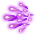

# สกิลสไปรท์ (`SpriteSkill`) — คำอธิบายทีละสกิล (ภาษาไทย)

สร้างอัตโนมัติด้วย `scripts/render_explained_th.py` จาก `skill_reference.json` (ข้อมูลโค้ด client ชุดล่าสุด) ไม่มีข้อความเขียนมือ แก้ไฟล์นี้ตรง ๆ จะถูกเขียนทับ ตัวเลขทั้งหมดคำนวณจากโค้ด (Code) ความหมายของชื่อ field/บทบาทแปลจากชื่อในโค้ด (Inferred) ยังไม่ได้เทียบกับตัวเลขในเกม ข้อมูลดิบทุกเส้นทางอยู่ใน `../details/SpriteSkill.md`

---

<!-- calc:preface -->
> **วิธีอ่านหัวข้อ "การคำนวณแบบตัวเลข"** (สร้างอัตโนมัติด้วย `scripts/render_calc_th.py` จาก `skill_reference.json` แก้มือจะถูกเขียนทับ)
> ดาเมจต่อฮิตเดินตามขั้น `SkillCalcTemplate/CalcStep` 0→40 ตามลำดับ (Code: `SkillCalcTemplate.GetDamage`) ขั้น `+` บวกเข้าดาเมจ ขั้น `×` คูณแล้วปัดเศษทิ้ง (int) ทันทีทุกขั้น
> ลำดับหลัก: ดาเมจฐาน(7) + คงที่สกิล(8) + คงที่บัพ(9) − ป้องกันเป้า(10) + ตีแรก(11) → ×คริ(13) → ×ธาตุ(15) → ×ตัวคูณสกิล(18) → ×ตีแรก(19) → ×เสถียร(21) → +คงที่ออโต้(22) → ×Proration(23) → ×ประเภท(24) → ×ดาเมจสุดท้าย(25) → … → เพดาน/ขั้นต่ำ(35–37)
> "ฮิต N" = template ดาเมจแต่ละก้อน (ทอยคริแยกกัน) แยกตามเมธอดและตัวแปรฮิตในโค้ด (`type`, `isFirst`, `attackCount` …) ชื่อฮิต/ส่วนมาจากชื่อในโค้ด (Inferred) ตัวเลขคำนวณจากโค้ด (Code) โดยตั้งเจม/บัพเสริม = 0
> ค่าหลายก้อนในขั้นเดียวกันแบบ "บวกเข้าช่อง" จะบวกกันก่อนคูณ ส่วน "ตั้งค่าทับ" แทนที่ค่าเดิม ค่าที่ขึ้นกับสเตตัสแสดงเป็นตัวอย่างที่ 100 / 255 (และ Lv สกิลอื่น 1 / 10) ใช้สูตรที่แนบไว้คำนวณค่าอื่นเอง
<!-- calc:preface-end -->

### ออโต้ดีไวซ์ (AutoDevice) · uid 705

- ทรี: สกิลสไปรท์ (ขั้น 1) · เลเวลสูงสุด: 50 · อาวุธ: MainMagictool · ธง: StarGem
- คลาสในโค้ด: `AutoDeviceAction` · สถานะการแกะ: แกะครบจากโค้ด

> ทักษะที่ยอมให้อุปกรณ์เวทมนตร์ช่วยโจมตี
> การโจมตีปกติใส่เป้าหมายหลังจาก
> ไม่ได้ทำอะไรเป็นเวลา 60 วินาที
> ประสิทธิภาพลดลงถ้าอยู่ห่างออกไป (8 เมตรหรือมากกว่า)

**ทำงานยังไง (จากโค้ด):**
- บทบาท: บัพตัวเอง
- Proration: ไม่มีช่อง · ไม่เปลี่ยนค่า proration
- บัพ `AutoDeviceBuf` ระยะเวลา 60 วินาที: ค่าเปอร์เซ็นต์ทั่วไป (`Percent`) = 5×Lv → 5, 10, 15, 20, 25, 30, 35, 40, 45, 50 (Lv1…10) · ค่าทั่วไป (ความหมายขึ้นกับโค้ดที่อ่าน) (`Value`) = 15 − 1×Lv → 14, 13, 12, 11, 10, 9, 8, 7, 6, 5 (Lv1…10)
- บัพ `SkillBufferDataBase`: บัพแบบมี/ไม่มี (marker) ไม่มีค่าตัวเลข โค้ดอื่นเช็กแค่ว่ามีบัพนี้อยู่
- ตัวอ่านสกิลนี้ `MobaPlayerActionManager.Update` — MobaPlayerActionManager.Update: [call] `MobaPlayerBattleManager$$StartAutoDeviceAttack` = `battleManager, TryGetBuf.buf(PlayerStatusBase.get_SkillBufferManager(), SkillId.AutoDevic…` เมื่อ [Singleton<GameManager>.get_Instance()+0x22] ne 0 AND (MobaPlayerActionManager.get_IsInputLock(this) & 1) eq 0 AND [bat… (นิยามเต็มในแท็บ Variables)
- ตัวอ่านสกิลนี้ `PlayerActionManager.Update` — PlayerActionManager.Update: [call] `PlayerBattleManager$$StartAutoDeviceAttack` = `battleManager, TryGetBuf.buf(PlayerStatusBase.get_SkillBufferManager(), SkillId.AutoDevic…` เมื่อ [Singleton<GameManager>.get_Instance()+0x22] ne 0 AND (PlayerActionManager.get_IsInputLock(this) & 1) eq 0 AND [battleM…; [call] `PlayerBattleManager$$StartAutoDeviceAttack` = `battleManager, TryGetBuf.buf(PlayerStatusBase.get_SkillBufferManager(), SkillId.AutoDevic…` เมื่อ [Singleton<GameManager>.get_Instance()+0x22] ne 0 AND (PlayerActionManager.get_IsInputLock(this) & 1) eq 0 AND [battleM… (นิยามเต็มในแท็บ Variables)

### อิกนิชั่น (Ignition) · uid 715

- ทรี: สกิลสไปรท์ (ขั้น 1) · เลเวลสูงสุด: 50 · อาวุธ: MainMagictool
- คลาสในโค้ด: `IgnitionAction` · สถานะการแกะ: แกะครบจากโค้ด

> เผาผลาญพลังเวทของศัตรูเพื่อโจมตี
> สร้างความเสียหายเวทมนตร์ที่ไม่เสถียร
> มีโอกาสต่ำที่จะทำให้ศัตรูติด[อ่อนแอ]
> DEX และเลเวลของสไปรท์ทรีของคุณยิ่งสูงเท่าไหร่
> จะยิ่งมีโอกาสติดมากขึ้น

**ทำงานยังไง (จากโค้ด):**
- บทบาท: โจมตี (สร้างดาเมจ), ทำให้ติดสถานะผิดปกติ
- ดาเมจ: สร้าง template ดาเมจ 1 ก้อน (แต่ละก้อนทอยคริแยก) ตัวเลขทุกฮิตอยู่ในหัวข้อ "การคำนวณแบบตัวเลข" ด้านล่าง
- ประเภทดาเมจ: เวท (ใช้ MATK)
- Proration: ช่องเวท · เปลี่ยนค่าเฉพาะฮิตแรกต่อเป้าต่อการร่าย
- โอกาสติดสถานะ `abnomalParcent`: `5 × SkillManager.GetSkillTreeLv(PlayerStatusBase.get_SkillManager(), 22, 0) + baseDEX // 10 + 2 × Lv + Lv ÷ 2` %
- สถานะที่ทำให้ติด: ล่มสลาย (Collapse)

<!-- calc:begin uid=715 -->
#### การคำนวณแบบตัวเลข — Ignition (uid 715)
Proration: ช่อง `Magic` โหมด `first_hit_per_target`

**ฮิต 1: `calcPlayerToMobDamage` (ดาเมจหลัก)**
- ดาเมจคงที่ของสกิล (`SkillConstantDamage`, +): **100** → 100, 100, 100, 100, 100, 100, 100, 100, 100, 100 (Lv1…10)
- ตัวคูณสกิล (`SkillRate`, ×, บวกเข้าช่อง): `skillRate / 100` — โดยที่ `skillRate` = `System.Math.Min(60 × Lv + EqAtkรวม, 1200)` (ขึ้นกับค่าในสถานการณ์จริง ทำตารางไม่ได้)
- ความเสถียร (`StableRate`, ×, ตั้งค่าทับ): `PlayerAttackBase.CalcStable(IgnitionAction.get_AttackType(), int(0.4 × Stableรวม), SkillCalcTemplate.CheckStepResult(PlayerAttackBase.TemplateAssignment(this, new, SkillCalcTemplate, playerAction, mobAction), 4) & 1, PlayerActionManagerBase.get_PlayerStatus())` (ขึ้นกับค่าในสถานการณ์จริง ทำตารางไม่ได้) — ตัวแปร: `status.Stable` = ความเสถียร (Stability) %; `status.Stable` = ความเสถียร (Stability) %; `IgnitionAction.get_AttackType` = ค่า Attack Type ของ IgnitionAction; `SkillCalcTemplate.CheckStepResult` = ตรวจ step result (SkillCalcTemplate); `PlayerActionManagerBase.get_PlayerStatus` = ค่า Player Status ของ PlayerActionManagerBase (ดูแท็บ Variables)
<!-- calc:end -->

### เอ็กเพรสเอด (RushAid) · uid 706

- ทรี: สกิลสไปรท์ (ขั้น 2) · เลเวลสูงสุด: 90 · อาวุธ: MainMagictool · ต้องเรียนก่อน: ออโต้ดีไวซ์
- คลาสในโค้ด: `RushAidMastery` · สถานะการแกะ: แกะครบจากโค้ด

> เร่งแรงส่งอุปกรณ์เวทมนตร์ให้เร็วขึ้น
> 
> เพิ่มความเร็วในการเคลื่อนที่ไปยังผู้เล่น
> ที่เป็นเป้าหมายเมื่อใช้"ปฐมพยาบาล"
> และลดความเสียหายที่ได้รับตามจำนวนครั้งที่กำหนด

**ทำงานยังไง (จากโค้ด):**
- บทบาท: บัพตัวเอง, พาสซีฟ
- บัพ `RushAidBuf`: ตัวคูณดาเมจที่ได้รับจากมอน (หมวดบัพ) (`MobLastDamageRateBuf`) = 10×Lv → 10, 20, 30, 40, 50, 60, 70, 80, 90, 100 (Lv1…10)
- พาสซีฟ ลดดาเมจที่ได้รับ % (`CutDmgRate`): 10, 20, 30, 40, 50, 60, 70, 80, 90, 100 (Lv1…10)
- พาสซีฟ ค่าทั่วไป (`Value`): 0, 0, 0, 1, 1, 1, 1, 2, 2, 2 (Lv1…10)
- ตัวอ่านสกิลนี้ `MobAttackBase.CalcLastDamage` — คำนวณ last damage (MobAttackBase): คืนค่า `((SkillBufferManager.TryGetBuf(PlayerStatusBase.get_SkillBufferManager(), SkillId.ArkSaber, out) & 1) eq 0 ? ((_t983 & 1) eq 0 ? ((_t982 & 1) eq 0 ? _t997 : _t…` (นิยามเต็มในแท็บ Variables)
- ตัวอ่านสกิลนี้ `PlayerActionManager.Damaged` — PlayerActionManager: เมื่อผู้เล่นถูกโจมตีขณะสกิลทำงาน (นิยามเต็มในแท็บ Variables)
- ตัวอ่านสกิลนี้ `PlayerActionManager.get_MoveSpeed` — ค่า Move Speed ของ PlayerActionManager: คืนค่า `_t1348` (3 กรณี) (นิยามเต็มในแท็บ Variables)
- ตัวอ่านสกิลนี้ `PlayerBattleManager.<>c__DisplayClass53_0.<checkAssistMove>b__0` — <>c__DisplayClass53_0.<checkAssistMove>b__0 (นิยามเต็มในแท็บ Variables)

### เคาน์เตอร์ฟอร์ส (CounterForce) · uid 707

- ทรี: สกิลสไปรท์ (ขั้น 2) · เลเวลสูงสุด: 90 · อาวุธ: MainMagictool · ต้องเรียนก่อน: ออโต้ดีไวซ์
- คลาสในโค้ด: `CounterForceAction` · สถานะการแกะ: แกะครบจากโค้ด

> ทักษะเสริมของอุปกรณ์เวทมนตร์
> สร้างวงเวทเป็นเวลา 30 วินาที
> เพื่อโจมตีเป้าหมายหากสมาชิกในปาร์ตี้
> อยู่ในสายตาระยะ(ไม่เกิน 24m) (สูงสุด 3 ครั้ง)

**ทำงานยังไง (จากโค้ด):**
- บทบาท: บัพตัวเอง, วางวัตถุ/กับดัก/อัญเชิญ
- Proration: ไม่มีช่อง · ไม่เปลี่ยนค่า proration
- บัพ `CounterForceBuf` ระยะเวลา `(30 + EnhanceSprite.GetEnhanceParam(PlayerStatusBase.get_SkillManager().SkillMasteryList[719], CounterForceBuf.get_SkillId()))` วินาที / 30 วินาที
- บัพ `SkillBufferDataBase`: บัพแบบมี/ไม่มี (marker) ไม่มีค่าตัวเลข โค้ดอื่นเช็กแค่ว่ามีบัพนี้อยู่
- ตัวอ่านสกิลนี้ `AutoMemberActionManager.Damaged` — AutoMemberActionManager: เมื่อผู้เล่นถูกโจมตีขณะสกิลทำงาน (นิยามเต็มในแท็บ Variables)
- ตัวอ่านสกิลนี้ `CounterForceAttackAction.OnEnd` — CounterForceAttackAction.OnEnd (นิยามเต็มในแท็บ Variables)
- ตัวอ่านสกิลนี้ `FamiliaActionManager.Damaged` — FamiliaActionManager: เมื่อผู้เล่นถูกโจมตีขณะสกิลทำงาน (นิยามเต็มในแท็บ Variables)
- ตัวอ่านสกิลนี้ `MercenaryActionManager.Damaged` — MercenaryActionManager: เมื่อผู้เล่นถูกโจมตีขณะสกิลทำงาน (นิยามเต็มในแท็บ Variables)
- ตัวอ่านสกิลนี้ `MobaPlayerActionManager.Damaged` — MobaPlayerActionManager: เมื่อผู้เล่นถูกโจมตีขณะสกิลทำงาน (นิยามเต็มในแท็บ Variables)
- ตัวอ่านสกิลนี้ `MobaPlayerActionManager.ReceiveDamaged` — MobaPlayerActionManager.ReceiveDamaged (นิยามเต็มในแท็บ Variables)
- ตัวอ่านสกิลนี้ `MobaPlayerBattleManager.StartCounterForceAttack` — MobaPlayerBattleManager.StartCounterForceAttack: [call] `SkillFactory$$CreateSkill` = `SkillId.CounterForceAttack` (นิยามเต็มในแท็บ Variables)
- ตัวอ่านสกิลนี้ `OtherPlayer.OnActionMobAttack` — OtherPlayer.OnActionMobAttack (นิยามเต็มในแท็บ Variables)
- ตัวอ่านสกิลนี้ `PetMemberActionManager.Damaged` — PetMemberActionManager: เมื่อผู้เล่นถูกโจมตีขณะสกิลทำงาน (นิยามเต็มในแท็บ Variables)
- ตัวอ่านสกิลนี้ `PlayerActionManager.Damaged` — PlayerActionManager: เมื่อผู้เล่นถูกโจมตีขณะสกิลทำงาน (นิยามเต็มในแท็บ Variables)
- ตัวอ่านสกิลนี้ `PlayerBattleManager.StartCounterForceAttack` — PlayerBattleManager.StartCounterForceAttack: [call] `SkillFactory$$CreateSkill` = `SkillId.CounterForceAttack` (นิยามเต็มในแท็บ Variables)

### อาร์เดดราค (Aldedrak) · uid 716

- ทรี: สกิลสไปรท์ (ขั้น 2) · เลเวลสูงสุด: 90 · อาวุธ: MainMagictool · ต้องเรียนก่อน: อิกนิชั่น
- คลาสในโค้ด: `AldedrakAction` · สถานะการแกะ: แกะครบจากโค้ด

> ปล่อยกระสุนเวทมนตร์โจมตีจากใต้ดิน
> ยิงกระสุนเวทมนตร์เลียดพื้นดินไปที่เป้าหมาย
> เมื่อเข้าเป้าจะเกิดการโจมตีในวงแคบ
> หากมีเป้าหมายอื่นอยู่บนทางผ่านจะติดหยุดนิ่งและพุ่งผ่านไป

**ทำงานยังไง (จากโค้ด):**
- บทบาท: โจมตี (สร้างดาเมจ), ทำให้ติดสถานะผิดปกติ, วางวัตถุ/กับดัก/อัญเชิญ
- ดาเมจ: สร้าง template ดาเมจ 1 ก้อน (แต่ละก้อนทอยคริแยก) ตัวเลขทุกฮิตอยู่ในหัวข้อ "การคำนวณแบบตัวเลข" ด้านล่าง
- ประเภทดาเมจ: เวท (ใช้ MATK)
- Proration: ช่องเวท · เปลี่ยนค่าเฉพาะฮิตแรกต่อเป้าต่อการร่าย
- สถานะที่ทำให้ติด: หยุดนิ่ง (Stop)

<!-- calc:begin uid=716 -->
#### การคำนวณแบบตัวเลข — Aldedrak (uid 716)
Proration: ช่อง `Magic` โหมด `first_hit_per_target`

**ฮิต 1: `calcPlayerToMobDamage` (ดาเมจหลัก) — `state ≠ 0`**
- ดาเมจคงที่ของสกิล (`SkillConstantDamage`, +): **300** → 300, 300, 300, 300, 300, 300, 300, 300, 300, 300 (Lv1…10)
- ตัวคูณสกิล (`SkillRate`, ×, บวกเข้าช่อง): `skillRate / 100` — โดยที่ `skillRate` = `35 × Lv + (baseDEX + baseINT) ÷ 2 + 350` (ขึ้นกับค่าในสถานการณ์จริง ทำตารางไม่ได้)
<!-- calc:end -->

### ไมโครฮีล (ClineHeal) · uid 708

- ทรี: สกิลสไปรท์ (ขั้น 3) · เลเวลสูงสุด: 170 · อาวุธ: MainMagictool · ต้องเรียนก่อน: เอ็กเพรสเอด
- คลาสในโค้ด: `ClineHealAction` · สถานะการแกะ: แกะครบจากโค้ด

> แบ่งเบาทำให้สบายขึ้นเล็กน้อย
> 
> ฟื้นฟู HP ของตัวเองและ HP ของสมาชิกปาร์ตี้
> ที่สูญเสีย HP มากที่สุดเล็กน้อย

**ทำงานยังไง (จากโค้ด):**
- บทบาท: ฟื้นฟู
- Proration: ไม่มีช่อง · ไม่เปลี่ยนค่า proration

### เอนฮานซ์ (Enhance) · uid 709

- ทรี: สกิลสไปรท์ (ขั้น 3) · เลเวลสูงสุด: 170 · อาวุธ: MainMagictool · ต้องเรียนก่อน: เอ็กเพรสเอด
- คลาสในโค้ด: `EnhanceAction` · สถานะการแกะ: แกะครบจากโค้ด

> ทักษะที่ช่วยเพิ่มความสามารถให้โดดเด่นยิ่งขึ้นไปอีก
> เพิ่มพลังโจมตีของสมาชิกในปาร์ตี้ที่มี ATK และ MATK สูงสุด(แต่ละคน)ความแรงที่เพิ่มจะเปลี่ยนไปตามมอนสเตอร์ที่เผชิญหน้า

**ทำงานยังไง (จากโค้ด):**
- บทบาท: บัพตัวเอง, บัพปาร์ตี้/ผู้อื่น, เปลี่ยนรูปแบบการโจมตี (อนุมานจาก hook ของบัพ)
- Proration: ไม่มีช่อง · ไม่เปลี่ยนค่า proration
- บัพ `EnhanceBuf` ระยะเวลา 20 + 10×Lv → 30, 40, 50, 60, 70, 80, 90, 100, 110, 120 (Lv1…10) วินาที: ATK + (`AtkUp`) = `atkUp` (ตัวนับที่เปลี่ยนตามเหตุการณ์) · MATK + (`MatkUp`) = `matkUp` (ตัวนับที่เปลี่ยนตามเหตุการณ์) · ดาเมจสุดท้ายที่ทำ % (`LastDmgUpRate`) = Lv → 1, 2, 3, 4, 5, 6, 7, 8, 9, 10 (Lv1…10)
- บัพ `SkillBufferDataBase`: บัพแบบมี/ไม่มี (marker) ไม่มีค่าตัวเลข โค้ดอื่นเช็กแค่ว่ามีบัพนี้อยู่

### แอสเทิลแลนซ์ (AstralLance) · uid 710

- ทรี: สกิลสไปรท์ (ขั้น 3) · เลเวลสูงสุด: 170 · อาวุธ: MainMagictool · ต้องเรียนก่อน: เคาน์เตอร์ฟอร์ส
- คลาสในโค้ด: `AstralLanceAction` · สถานะการแกะ: แกะครบจากโค้ด

> ทักษะการนำพลังเวทย์กลับมาใช้ใหม่อย่างมีประสิทธิภาพ
> 
> โจมตีโดยปล่อยหอกเวทมนตร์อันทรงพลังต่อทุก 500 MP ที่ใช้ไป
> เป็นเวลา 90 วินาที(สูงสุด 1 หอก)

**ทำงานยังไง (จากโค้ด):**
- บทบาท: บัพตัวเอง
- Proration: ไม่มีช่อง · ไม่เปลี่ยนค่า proration
- บัพ `AstralLanceBuf` ระยะเวลา `(90 + EnhanceSprite.GetEnhanceParam(PlayerStatusBase.get_SkillManager().SkillMasteryList[719], AstralLanceBuf.get_SkillId()))` วินาที / 90 วินาที: ตัวนับ/stack (`Count`) = `Count` (ตัวนับที่เปลี่ยนตามเหตุการณ์); ค่าตั้งต้น `0`
- บัพ `CountBufferBase`: ตัวนับ/stack (`Count`) = `Count` (ตัวนับที่เปลี่ยนตามเหตุการณ์); ค่าตั้งต้น `0`; Next(): `Count` = `System.Math.Min((Count + 1), Max)`; NextSkip(): `Count` = `System.Math.Min((Count + count), Max)`; Prev(): `Count` = `System.Math.Max((Count - 1), 0)`; PrevSkip(): `Count` = `System.Math.Max((Count - count), 0)`; สแตกสูงสุด (`Max`) = 5 ตามที่ `AstralLanceBuf` ส่งให้ตัวสร้างของ `บัพฐาน`
- ตัวอ่านสกิลนี้ `AstralLanceAttackAction.ActionStart` — AstralLanceAttackAction: ตอนเริ่มทำงานของสกิล: [call] `AstralLanceBuf$$StartAstralLanceAttack` = `TryGetBuf.buf(PlayerStatusBase.get_SkillBufferManager(), SkillId.AstralLance)` เมื่อ (SkillBufferManager.TryGetBuf(PlayerStatusBase.get_SkillBufferManager(), SkillId.AstralLance, out) & 1) ne 0 AND TryGet… (นิยามเต็มในแท็บ Variables)
- ตัวอ่านสกิลนี้ `AstralLanceAttackAction.OnEnd` — AstralLanceAttackAction.OnEnd (นิยามเต็มในแท็บ Variables)
- ตัวอ่านสกิลนี้ `MagicBalkanAction.ActionSkillEvent` — MagicBalkanAction.ActionSkillEvent (นิยามเต็มในแท็บ Variables)
- ตัวอ่านสกิลนี้ `MobaPlayerBattleManager.OnSkillActionStart` — MobaPlayerBattleManager.OnSkillActionStart: [call] `AstralLanceBuf$$StartSkill` = `TryGetBuf.buf(PlayerStatusBase.get_SkillBufferManager(), SkillId.AstralLance), action` เมื่อ (UnityEngine.Object.op_Implicit(target) & 1) ne 0 AND SkillActionBase.get_ActionID() ne 1218 AND SkillActionBase.get_Ac…; [call] `AstralLanceBuf$$StartSkill` = `TryGetBuf.buf(PlayerStatusBase.get_SkillBufferManager(), SkillId.AstralLance), action` เมื่อ (UnityEngine.Object.op_Implicit(target) & 1) ne 0 AND SkillActionBase.get_ActionID() ne 1218 AND SkillActionBase.get_Ac…; [call] `AstralLanceBuf$$StartSkill` = `TryGetBuf.buf(PlayerStatusBase.get_SkillBufferManager(), SkillId.AstralLance), action` เมื่อ (UnityEngine.Object.op_Implicit(target) & 1) ne 0 AND SkillActionBase.get_ActionID() ne 1218 AND SkillActionBase.get_Ac… (นิยามเต็มในแท็บ Variables)
- ตัวอ่านสกิลนี้ `MobaPlayerBattleManager.OnSkillActionStartSummonSkeleton` — MobaPlayerBattleManager.OnSkillActionStartSummonSkeleton: [call] `AstralLanceBuf$$StartSkill` = `TryGetBuf.buf(PlayerStatusBase.get_SkillBufferManager(), SkillId.AstralLance), action` เมื่อ (PlayerStatusBase.PaySkillMp(MobaPlayerActionManager.get_PlayerStatus(), SkillActionBase.get_Mp()) & 1) ne 0 AND (Skill…; [call] `AstralLanceBuf$$StartSkill` = `TryGetBuf.buf(PlayerStatusBase.get_SkillBufferManager(), SkillId.AstralLance), action` เมื่อ (PlayerStatusBase.PaySkillMp(MobaPlayerActionManager.get_PlayerStatus(), SkillActionBase.get_Mp()) & 1) eq 0 AND (Skill… (นิยามเต็มในแท็บ Variables)
- ตัวอ่านสกิลนี้ `MobaPlayerBattleManager.StartAstralLanceAttack` — MobaPlayerBattleManager.StartAstralLanceAttack: [call] `SkillFactory$$CreateSkill` = `SkillId.AstralLanceAttack` เมื่อ (SkillActionManager.IsPlaySkillData(skillActManager, SkillId.AstralLanceAttack) & 1) eq 0 (นิยามเต็มในแท็บ Variables)
- ตัวอ่านสกิลนี้ `PlayerBattleManager.OnSkillActionStart` — PlayerBattleManager.OnSkillActionStart: [call] `AstralLanceBuf$$StartSkill` = `TryGetBuf.buf(PlayerStatusBase.get_SkillBufferManager(), SkillId.AstralLance), action` เมื่อ (UnityEngine.Object.op_Implicit(target) & 1) ne 0 AND SkillActionBase.get_ActionID() ne 1218 AND SkillActionBase.get_Ac… (นิยามเต็มในแท็บ Variables)
- ตัวอ่านสกิลนี้ `PlayerBattleManager.OnSkillActionStartSummonSkeleton` — PlayerBattleManager.OnSkillActionStartSummonSkeleton: [call] `AstralLanceBuf$$StartSkill` = `TryGetBuf.buf(PlayerStatusBase.get_SkillBufferManager(), SkillId.AstralLance), action` เมื่อ (PlayerBattleManager.ActionStartSkillMpLess(this, action, out) & 1) eq 0 AND (SkillBufferManager.TryGetBuf(PlayerStatus… (นิยามเต็มในแท็บ Variables)
- ตัวอ่านสกิลนี้ `PlayerBattleManager.StartAstralLanceAttack` — PlayerBattleManager.StartAstralLanceAttack: [call] `SkillFactory$$CreateSkill` = `SkillId.AstralLanceAttack` เมื่อ (SkillActionManager.IsPlaySkillData(skillActManager, SkillId.AstralLanceAttack) & 1) eq 0 (นิยามเต็มในแท็บ Variables)

### แฟกทิสอาร์ม (FacticeArme) · uid 717

- ทรี: สกิลสไปรท์ (ขั้น 3) · เลเวลสูงสุด: 170 · อาวุธ: MainMagictool · ต้องเรียนก่อน: อาร์เดดราค
- คลาสในโค้ด: `FacticeArmeAction` · สถานะการแกะ: แกะครบจากโค้ด

> ใช้อาวุธที่สร้างจากพลังเวท
> 
> โจมตีเป้าหมายเดี่ยว
> พลังเพิ่มตาม AGI และ DEX ที่สูงขึ้น

**ทำงานยังไง (จากโค้ด):**
- บทบาท: โจมตี (สร้างดาเมจ), บัพตัวเอง
- ดาเมจ: สร้าง template ดาเมจ 3 ก้อน (แต่ละก้อนทอยคริแยก) ตัวเลขทุกฮิตอยู่ในหัวข้อ "การคำนวณแบบตัวเลข" ด้านล่าง
- ประเภทดาเมจ: เวท (ใช้ MATK)
- Proration: ช่องเวท · เปลี่ยนค่าเฉพาะฮิตแรกต่อเป้าต่อการร่าย
- บัพ `SkillBufferDataBase`: บัพแบบมี/ไม่มี (marker) ไม่มีค่าตัวเลข โค้ดอื่นเช็กแค่ว่ามีบัพนี้อยู่

<!-- calc:begin uid=717 -->
#### การคำนวณแบบตัวเลข — FacticeArme (uid 717)
Proration: ช่อง `Magic` โหมด `first_hit_per_target`

**ฮิต 1: `calcPlayerToMobDamage` (ดาเมจหลัก) — `type ≠ 0`, `type ≠ 3`, `type ≠ 4`**
- ดาเมจคงที่ของสกิล (`SkillConstantDamage`, +): 6, 24, 54, 96, 150, 216, 294, 384, 486, 600 (Lv1…10)
  - สูตร: `constantDamage` — โดยที่ `constantDamage` = `6 × Lv × Lv`
- ตัวคูณสกิล (`SkillRate`, ×, บวกเข้าช่อง) [AGI รวม=100, DEX รวม=100]: **950%** → 950%, 950%, 950%, 950%, 950%, 950%, 950%, 950%, 950%, 950% (Lv1…10)
- ตัวคูณสกิล (`SkillRate`, ×, บวกเข้าช่อง) [AGI รวม=100, DEX รวม=255 หรือ AGI รวม=255, DEX รวม=100]: **1105%** → 1105%, 1105%, 1105%, 1105%, 1105%, 1105%, 1105%, 1105%, 1105%, 1105% (Lv1…10)
- ตัวคูณสกิล (`SkillRate`, ×, บวกเข้าช่อง) [AGI รวม=255, DEX รวม=255]: **1260%** → 1260%, 1260%, 1260%, 1260%, 1260%, 1260%, 1260%, 1260%, 1260%, 1260% (Lv1…10)

**ใช้ร่วมทุกฮิตของ ดาเมจหลัก**
- ดาเมจคงที่ของสกิล (`SkillConstantDamage`, +): 4.5, 18, 40.5, 72, 112.5, 162, 220.5, 288, 364.5, 450 (Lv1…10)
  - สูตร: `0.75 × constantDamage` — โดยที่ `constantDamage` = `6 × Lv × Lv`
- ดาเมจคงที่ของสกิล (`SkillConstantDamage`, +): 1.5, 6, 13.5, 24, 37.5, 54, 73.5, 96, 121.5, 150 (Lv1…10)
  - สูตร: `0.25 × constantDamage` — โดยที่ `constantDamage` = `6 × Lv × Lv`
- ตัวคูณสกิล (`SkillRate`, ×, บวกเข้าช่อง) [AGI รวม=100, DEX รวม=100]: **712.5%** → 712.5%, 712.5%, 712.5%, 712.5%, 712.5%, 712.5%, 712.5%, 712.5%, 712.5%, 712.5% (Lv1…10)
- ตัวคูณสกิล (`SkillRate`, ×, บวกเข้าช่อง) [AGI รวม=100, DEX รวม=255 หรือ AGI รวม=255, DEX รวม=100]: **828.75%** → 828.75%, 828.75%, 828.75%, 828.75%, 828.75%, 828.75%, 828.75%, 828.75%, 828.75%, 828.75% (Lv1…10)
- ตัวคูณสกิล (`SkillRate`, ×, บวกเข้าช่อง) [AGI รวม=255, DEX รวม=255]: **945%** → 945%, 945%, 945%, 945%, 945%, 945%, 945%, 945%, 945%, 945% (Lv1…10)
- ตัวคูณสกิล (`SkillRate`, ×, บวกเข้าช่อง) [AGI รวม=100, DEX รวม=100]: **237.5%** → 237.5%, 237.5%, 237.5%, 237.5%, 237.5%, 237.5%, 237.5%, 237.5%, 237.5%, 237.5% (Lv1…10)
- ตัวคูณสกิล (`SkillRate`, ×, บวกเข้าช่อง) [AGI รวม=100, DEX รวม=255 หรือ AGI รวม=255, DEX รวม=100]: **276.25%** → 276.25%, 276.25%, 276.25%, 276.25%, 276.25%, 276.25%, 276.25%, 276.25%, 276.25%, 276.25% (Lv1…10)
- ตัวคูณสกิล (`SkillRate`, ×, บวกเข้าช่อง) [AGI รวม=255, DEX รวม=255]: **315%** → 315%, 315%, 315%, 315%, 315%, 315%, 315%, 315%, 315%, 315% (Lv1…10)
<!-- calc:end -->

### เรเซอร์เรคชั่น (Resurrection) · uid 711

- ทรี: สกิลสไปรท์ (ขั้น 4) · เลเวลสูงสุด: 250 · อาวุธ: MainMagictool · ต้องเรียนก่อน: ไมโครฮีล
- คลาสในโค้ด: `ResurrectionAction` · สถานะการแกะ: แกะครบจากโค้ด

> ทักษะการชุบชีวิตผู้ที่ไม่สามารถต่อสู้ได้อีกต่อไป
> เวลารอคืนชีพของคนรอบข้าง(ภายใน 16m)จะเป็น 0 วินาที
> 
> *ใช้ไม่ได้ถ้าไม่มีปฐมพยาบาล
> *ใช้กับคอมโบไม่ได้

**ทำงานยังไง (จากโค้ด):**
- บทบาท: แอ็กชันระบบ/อรรถประโยชน์
- Proration: ไม่มีช่อง · ไม่เปลี่ยนค่า proration

### สเตบิไลซ์ (Stabilis) · uid 712

- ทรี: สกิลสไปรท์ (ขั้น 4) · เลเวลสูงสุด: 250 · อาวุธ: MainMagictool · ต้องเรียนก่อน: เอนฮานซ์
- คลาสในโค้ด: `StabilisAction` · สถานะการแกะ: แกะครบจากโค้ด

> ทักษะที่ช่วยเพิ่มความแม่นยำ
> เพิ่มอัตราคริติคอลและความเสถียรของความเสียหายจากเวท
> และลดความเสถียรตอน Graze เป็นเวลา 45 วินาที
> ลบ "เหนื่อยล้า" เมื่อใช้งาน

**ทำงานยังไง (จากโค้ด):**
- บทบาท: บัพตัวเอง
- Proration: ไม่มีช่อง · ไม่เปลี่ยนค่า proration
- บัพ `StabilisBuf` ระยะเวลา 45 วินาที: ค่าทั่วไป (ความหมายขึ้นกับโค้ดที่อ่าน) (`Value`) = 5×Lv → 5, 10, 15, 20, 25, 30, 35, 40, 45, 50 (Lv1…10) · อัตราคริ % (`CrtUpRate`) = 4×Lv → 4, 8, 12, 16, 20, 24, 28, 32, 36, 40 (Lv1…10) · ตัวนับ/stack (`Count`) = Lv → 1, 2, 3, 4, 5, 6, 7, 8, 9, 10 (Lv1…10) · อัตราคริ + (`CrtUp`) = 5 + Lv → 6, 7, 8, 9, 10, 11, 12, 13, 14, 15 (Lv1…10)
- ตัวอ่านสกิลนี้ `MobaPlayerSecondaryStatus.GetCrtConstant` — MobaPlayerSecondaryStatus.GetCrtConstant: คืนค่า `_t1164` (นิยามเต็มในแท็บ Variables)
- ตัวอ่านสกิลนี้ `MobaPlayerSecondaryStatus.GetCrtRate` — MobaPlayerSecondaryStatus.GetCrtRate: คืนค่า `((SkillBufferManager.TryGetBuf(MobaPlayerStatus.get_SkillBufferManager(), SkillId.ArrowSharpening, out) & 1) eq 0 ? _t1173 : (_t1173 + (SkillBufferDataBase.Get…` (นิยามเต็มในแท็บ Variables)
- ตัวอ่านสกิลนี้ `PetSkillActionBase.CalcStable` — คำนวณ stable (PetSkillActionBase): [call] `SkillActionBase$$CalcMagicStablePercent` = `_t1281, ((EquipItemData.get_WeaponItemType(PlayerStatusBase.get_EquipItemData()) & 0xffff…` เมื่อ type hs 2 AND type eq 2 AND (SkillBufferManager.TryGetBuf(PlayerStatusBase.get_SkillBufferManager(), SkillId.Stabilis, …; [call] `SkillActionBase$$CalcMagicStablePercent` = `_t1284, 110` เมื่อ type hs 2 AND type eq 2 AND (SkillBufferManager.TryGetBuf(PlayerStatusBase.get_SkillBufferManager(), SkillId.Stabilis, … (นิยามเต็มในแท็บ Variables)
- ตัวอ่านสกิลนี้ `PetStatus.get_Critical` — ค่า Critical ของ PetStatus: คืนค่า `(int((_t597 * (int((PetStatus.get_Crt(this) / 3.4)) + 25))) + _t601)` (นิยามเต็มในแท็บ Variables)
- ตัวอ่านสกิลนี้ `PlayerAttackBase.CalcStable` — ตัวคูณความเสถียรของดาเมจ (กายภาพ/เวท): คืนค่า `(type hs 2 && type ne 3 && type ne 2 ? 0 : SkillActionBase.CalcMagicStablePercent(_t1472, _t1473))` (นิยามเต็มในแท็บ Variables)
- ตัวอ่านสกิลนี้ `PlayerSecondaryStatus.GetCrtConstant` — PlayerSecondaryStatus.GetCrtConstant: คืนค่า `_t1629` (นิยามเต็มในแท็บ Variables)
- ตัวอ่านสกิลนี้ `PlayerSecondaryStatus.GetCrtRate` — PlayerSecondaryStatus.GetCrtRate: คืนค่า `((SkillBufferManager.TryGetBuf(PlayerStatusBase.get_SkillBufferManager(), SkillId.ArrowSharpening, out) & 1) eq 0 ? _t1638 : (_t1638 + (SkillBufferDataBase.Get…` (นิยามเต็มในแท็บ Variables)

### สไปรท์ชีลด์ (SpriteShield) · uid 713

- ทรี: สกิลสไปรท์ (ขั้น 4) · เลเวลสูงสุด: 250 · อาวุธ: MainMagictool · ต้องเรียนก่อน: เอนฮานซ์
- คลาสในโค้ด: `SpriteShieldAction` · สถานะการแกะ: แกะครบจากโค้ด

> ทักษะการเปลี่ยนพลังงานเป็นพลังเวท
> ใช้ HP เพื่อฟื้นฟู 100 MP ทันที
> ลดความเสียหายและโอกาสในการติด
> ภาวะผิดปกติที่โดนในครั้งต่อไป

**ทำงานยังไง (จากโค้ด):**
- บทบาท: บัพตัวเอง
- Proration: ไม่มีช่อง · ไม่เปลี่ยนค่า proration
- บัพ `SoulHuntBuf`: บัพนับสแตก (สืบจาก `CountBufferBase`): ตัวนับ `Count` เริ่ม 0 เพิ่มทีละ 1 ด้วย `Next()` และสูงสุด 10; โค้ดอื่นอ่านจำนวนสแตกผ่านพารามิเตอร์ `Count` (ดูค่าที่ใช้จริงในสูตรของสกิลที่อ้างถึง)
- บัพ `SpriteShieldBuf`: ค่าทั่วไป (ความหมายขึ้นกับโค้ดที่อ่าน) (`Value`) = 1, 4, 9, 16, 25, 36, 49, 64, 81, 100 (Lv1…10) · ตัวคูณดาเมจที่ได้รับจากมอน (หมวดซัพพอร์ต) (`MobLastDamageRateSupport`) = 50
- บัพ `CountBufferBase`: ตัวนับ/stack (`Count`) = `Count` (ตัวนับที่เปลี่ยนตามเหตุการณ์); ค่าตั้งต้น `0`; Next(): `Count` = `System.Math.Min((Count + 1), Max)`; NextSkip(): `Count` = `System.Math.Min((Count + count), Max)`; Prev(): `Count` = `System.Math.Max((Count - 1), 0)`; PrevSkip(): `Count` = `System.Math.Max((Count - count), 0)`; สแตกสูงสุด (`Max`) = 10 ตามที่ `SoulHuntBuf` ส่งให้ตัวสร้างของ `บัพฐาน`
- ตัวอ่านสกิลนี้ `MobaPlayerActionManager.Damaged` — MobaPlayerActionManager: เมื่อผู้เล่นถูกโจมตีขณะสกิลทำงาน (นิยามเต็มในแท็บ Variables)
- ตัวอ่านสกิลนี้ `MobaPlayerActionManager.ReceiveDamaged` — MobaPlayerActionManager.ReceiveDamaged (นิยามเต็มในแท็บ Variables)
- ตัวอ่านสกิลนี้ `MobaPlayerSecondaryStatus.get_AntiVirus` — ค่า Anti Virus ของ MobaPlayerSecondaryStatus: คืนค่า `(_t526 lt 100 ? _t526 : 100)` (นิยามเต็มในแท็บ Variables)
- ตัวอ่านสกิลนี้ `PlayerActionManager.AddEventAbnormal` — PlayerActionManager.AddEventAbnormal: [call] `SkillBufferManager$$RemoveSelfBuffer` = `PlayerStatusBase.get_SkillBufferManager(), SkillId.SpriteShield` เมื่อ (PlayerActionManager.get_IsDead() & 1) eq 0 AND ((abnormalState & 255) - 24) hs 4 AND (abnormalState & 255) ne 252 AND … (นิยามเต็มในแท็บ Variables)
- ตัวอ่านสกิลนี้ `PlayerActionManager.Damaged` — PlayerActionManager: เมื่อผู้เล่นถูกโจมตีขณะสกิลทำงาน (นิยามเต็มในแท็บ Variables)
- ตัวอ่านสกิลนี้ `PlayerSecondaryStatus.CalcAntiVirus` — คำนวณ anti virus (PlayerSecondaryStatus): คืนค่า `_t1560` (นิยามเต็มในแท็บ Variables)

### เมจิกวัลแคน (MagicBalkan) · uid 714

- ทรี: สกิลสไปรท์ (ขั้น 4) · เลเวลสูงสุด: 250 · อาวุธ: MainMagictool · ต้องเรียนก่อน: แอสเทิลแลนซ์
- คลาสในโค้ด: `MagicBalkanAction` · สถานะการแกะ: แกะครบจากโค้ด

> ทักษะปืนเวทมนตร์แบบหมุน
> สร้างความเสียหายเวทย์อย่างต่อเนื่องกับเป้าหมาย
> สามารถเพิ่มการใช้ MP เพื่อโจมตีต่อเนื่องแต่พลังจะค่อยๆ ลดลง
> การโจมตีนี้ไม่ทำให้เกิดความเคยชิน

**ทำงานยังไง (จากโค้ด):**
- บทบาท: โจมตี (สร้างดาเมจ), บัพตัวเอง, วางวัตถุ/กับดัก/อัญเชิญ
- ดาเมจ: สร้าง template ดาเมจ 1 ก้อน (แต่ละก้อนทอยคริแยก) ตัวเลขทุกฮิตอยู่ในหัวข้อ "การคำนวณแบบตัวเลข" ด้านล่าง
- ประเภทดาเมจ: เวท (ใช้ MATK)
- Proration: ช่องเวท · ไม่เปลี่ยนค่า proration
- บัพ `MagicBalkanBuf`: บัพแบบมี/ไม่มี (marker) ไม่มีค่าตัวเลข โค้ดอื่นเช็กแค่ว่ามีบัพนี้อยู่
- บัพ `SkillBufferDataBase`: บัพแบบมี/ไม่มี (marker) ไม่มีค่าตัวเลข โค้ดอื่นเช็กแค่ว่ามีบัพนี้อยู่

<!-- calc:begin uid=714 -->
#### การคำนวณแบบตัวเลข — MagicBalkan (uid 714)
Proration: ช่อง `Magic` โหมด `never (IsExpDefFluctuate=false)`

**ฮิต 1: `calcPlayerToMobDamage` (ดาเมจหลัก)**
- ดาเมจคงที่ของสกิล (`SkillConstantDamage`, +, ตั้งค่าทับ) [กิ่งที่ 1 ของ `fixAddDamage`]: **0** → 0, 0, 0, 0, 0, 0, 0, 0, 0, 0 (Lv1…10)
- ดาเมจคงที่ของสกิล (`SkillConstantDamage`, +, ตั้งค่าทับ) [`(damageCount + 1) > 4`]: **100** → 100, 100, 100, 100, 100, 100, 100, 100, 100, 100 (Lv1…10)
- ตัวคูณสกิล (`SkillRate`, ×, บวกเข้าช่อง) [`(damageCount + 1) > 4`]: `System.Math.Max(0xffffffec × (damageCount + 1) // 5 + 10 × Lv + 200, 10) / 100` (ขึ้นกับค่าในสถานการณ์จริง ทำตารางไม่ได้)
- ตัวคูณสกิล (`SkillRate`, ×, บวกเข้าช่อง) [`(damageCount + 1) ≤ 4`]: `((5 × damageCount + 10) × Lv + 50) / 100` (ขึ้นกับค่าในสถานการณ์จริง ทำตารางไม่ได้)
- ตัวคูณสกิล (`SkillRate`, ×, บวกเข้าช่อง) [กิ่งที่ 1 ของ `skillRate`]: **(50 + 5×Lv)%** → 55%, 60%, 65%, 70%, 75%, 80%, 85%, 90%, 95%, 100% (Lv1…10)
- ดาเมจต่ำสุด (`MinDamage`, +, ตั้งค่าทับ): **1** → 1, 1, 1, 1, 1, 1, 1, 1, 1, 1 (Lv1…10)

**ใช้ร่วมทุกฮิตของ ฮิตรีแอ็กชัน (`HitReactionAssign`)**
- พลังการ์ด (`GuardPower`, ตั้งค่า) [`!MobActionManagerBase.get_SystemInvincible(mobAction)` และ `((1 | isCritical) & 1) ≠ 0` และ `(False & 1) = 0` และ `PlayerAttackBase.CalcHitReaction(this, attackType, playerAction, mobAction) = 2` และ … หรือ `!MobActionManagerBase.get_SystemInvincible(mobAction)` และ `((1 | isCritical)` และ `(False & 1) = 0` และ `PlayerAttackBase.CalcHitReaction(this, attackType, playerAction, mobAction) = 2` และ … หรือ `!MobActionManagerBase.get_SystemInvincible(mobAction)` และ `(False & 1) = 0` และ `AbnormalStateManager.Contains(PlayerStatusBase.get_AbnormalStatusManager(), 33)` และ `PlayerAttackBase.CalcHitReaction(this, attackType, playerAction, mobAction) = 2` และ …]: `System.Math.Max(0, 25 - MobBuffer.GuardUpBuff.get_GuardUpval(TryGetBuff.buff(MobActionManagerBase.get_BuffManager(mobAction), 4)))` (ขึ้นกับค่าในสถานการณ์จริง ทำตารางไม่ได้) — ตัวแปร: `MobBuffer.GuardUpBuff.get_GuardUpval` = ค่า Guard Upval ของ GuardUpBuff; `TryGetBuff.buff` = TryGetBuff.buff; `MobActionManagerBase.get_BuffManager` = ค่า Buff Manager ของ MobActionManagerBase (ดูแท็บ Variables)
- พลังการ์ด (`GuardPower`, ตั้งค่า) [`!MobActionManagerBase.get_SystemInvincible(mobAction)` และ `((1 | isCritical) & 1) ≠ 0` และ `(False & 1) = 0` และ `PlayerAttackBase.CalcHitReaction(this, attackType, playerAction, mobAction) = 2` และ … หรือ `!MobActionManagerBase.get_SystemInvincible(mobAction)` และ `((1 | isCritical) & 1) = 0` และ `(False & 1) = 0` และ `PlayerAttackBase.CalcHitReaction(this, attackType, playerAction, mobAction) = 2` และ … หรือ `!MobActionManagerBase.get_SystemInvincible(mobAction)` และ `(False & 1) = 0` และ `AbnormalStateManager.Contains(PlayerStatusBase.get_AbnormalStatusManager(), 33)` และ `PlayerAttackBase.CalcHitReaction(this, attackType, playerAction, mobAction) = 2` และ …]: **25** → 25, 25, 25, 25, 25, 25, 25, 25, 25, 25 (Lv1…10)

**จำนวนฮิต / ตัวนับ**
- `LoopParam` (ตั้งใน `ActionStart`) [`PlayerStatusBase.CheckBodyAbility(PlayerActionManagerBase.get_PlayerStatus(), 2)` หรือ `!PlayerStatusBase.CheckBodyAbility(PlayerActionManagerBase.get_PlayerStatus(), 2)`]: `int(MobActionManagerBase.get_Size(UnityEngine.GameObject.GetComponent<MobActionManagerBase>(target)))`
- `damageCount` (ตั้งใน `NextRangeHit`): `damageCount + 1`
<!-- calc:end -->

### สแลชรีปเปอร์ (SlashReaper) · uid 718

- ทรี: สกิลสไปรท์ (ขั้น 4) · เลเวลสูงสุด: 250 · อาวุธ: MainMagictool · ต้องเรียนก่อน: แฟกทิสอาร์ม
- คลาสในโค้ด: `SlashReaperAction` · สถานะการแกะ: แกะครบจากโค้ด

> ใช้ดาบเวทป้องกันตัวเองจากภัยคุกคามที่เข้ามาใกล้
> 
> หากตรงตามเงื่อนไขดาบเวทจะเพิ่มขึ้น(สูงสุด 99 ขีดจำกัดการใช้ 5)
> เมื่อใช้สกิลซ้ำอีกครั้งจะปล่อยดาบเวทที่ปรากฏ
> พุ่งเข้าโจมตีเป้าหมาย

**ทำงานยังไง (จากโค้ด):**
- บทบาท: โจมตี (สร้างดาเมจ), วางวัตถุ/กับดัก/อัญเชิญ
- MP ที่ใช้ [`TryGetBuf<object>.out2(PlayerStatusBase.get_SkillBufferManager(), 718) ≠ 0` และ `TryGetBuf<object>.out2(PlayerStatusBase.get_SkillBufferManager(), 718).BuffEffectActive ≠ 0` และ `constDamage.Length > 1` และ `constDamage.Length > 2` และ …]: 100
- ดาเมจ: สร้าง template ดาเมจ 1 ก้อน (แต่ละก้อนทอยคริแยก) ตัวเลขทุกฮิตอยู่ในหัวข้อ "การคำนวณแบบตัวเลข" ด้านล่าง
- ประเภทดาเมจ: เวท (ใช้ MATK)
- Proration: ช่องเวท · สกิลเช็กเองว่าจะเปลี่ยนค่าหรือไม่
- ตัวอ่านสกิลนี้ `PlayerActionManager.GetSkillTargetType` — PlayerActionManager.GetSkillTargetType: คืนค่า `MasterSkillDataManager.GetSkillMaster(Singleton<MasterSkillDataManager>.get_Instance(), SkillId.CloningTechnique).TargetType` (11 กรณี) (นิยามเต็มในแท็บ Variables)

<!-- calc:begin uid=718 -->
#### การคำนวณแบบตัวเลข — SlashReaper (uid 718)
Proration: ช่อง `Magic` โหมด `custom_check + class check`

**ใช้ร่วมทุกฮิตของ ดาเมจหลัก**
- ดาเมจคงที่ของสกิล (`SkillConstantDamage`, +) [`IsInstanceOf(actarAction, PlayerActionManager) ≠ 1` และ `IsOtherPlayer ≠ 0` และ `param = 2` และ `state lo constDamage.Length` และ … หรือ `IsInstanceOf(actarAction, PlayerActionManager) = 1` และ `param = 2` และ `param ≠ 10` และ `state lo constDamage.Length` และ …]: `constDamage[(2)]` (ขึ้นกับค่าในสถานการณ์จริง ทำตารางไม่ได้)
- ดาเมจคงที่ของสกิล (`SkillConstantDamage`, +) [`(state - 1) ≥ 2` และ `state lo constDamage.Length` และ `state lo skillRate.Length`]: `constDamage[(1)]` (ขึ้นกับค่าในสถานการณ์จริง ทำตารางไม่ได้)
- ตัวคูณสกิล (`SkillRate`, ×, บวกเข้าช่อง) [`IsInstanceOf(actarAction, PlayerActionManager) ≠ 1` และ `IsOtherPlayer ≠ 0` และ `param = 2` และ `state lo constDamage.Length` และ … หรือ `IsInstanceOf(actarAction, PlayerActionManager) ≠ 1` และ `IsOtherPlayer ≠ 0` และ `param = 2` และ `state hs constDamage.Length` และ … หรือ `IsInstanceOf(actarAction, PlayerActionManager) = 1` และ `param = 2` และ `param ≠ 10` และ `state lo constDamage.Length` และ … หรือ `IsInstanceOf(actarAction, PlayerActionManager) = 1` และ `param = 2` และ `param ≠ 10` และ `state hs constDamage.Length` และ …]: `(skillRate[(2)] / 100)` (ขึ้นกับค่าในสถานการณ์จริง ทำตารางไม่ได้)
- ตัวคูณสกิล (`SkillRate`, ×, บวกเข้าช่อง) [`(state - 1) ≥ 2` และ `state lo constDamage.Length` และ `state lo skillRate.Length` หรือ `(state - 1) ≥ 2` และ `state hs constDamage.Length` และ `state lo skillRate.Length`]: `(skillRate[(1)] / 100)` (ขึ้นกับค่าในสถานการณ์จริง ทำตารางไม่ได้)
<!-- calc:end -->

### สไปรท์อัพเกรด (EnhanceSprite) · uid 719

- ทรี: สกิลสไปรท์ (ขั้น 5) · เลเวลสูงสุด: 300 · อาวุธ: MainMagictool · ต้องเรียนก่อน: สเตบิไลซ์
- คลาสในโค้ด: `EnhanceSprite` · สถานะการแกะ: แกะครบจากโค้ด

> เพิ่มระยะเวลาต่อเนื่องของเคาน์เตอร์ฟอร์ส
> แอสเทิลแลนซ์ และสเตบิไลซ์

**ทำงานยังไง (จากโค้ด):**
- บทบาท: พาสซีฟ

### รีเทค (Retake) · uid 720

- ทรี: สกิลสไปรท์ (ขั้น 5) · เลเวลสูงสุด: 300 · อาวุธ: MainMagictool · ต้องเรียนก่อน: สไปรท์ชีลด์ · ธง: NoMarketSearch, CanNotUse
- คลาสในโค้ด: `Retake` · สถานะการแกะ: แกะครบจากโค้ด

> ได้รับสถานะรีเทคเมื่อเปลี่ยนแผนที่
> และจะแสดงผลเมื่อเริ่มต่อสู้กับศัตรูที่แข็งแกร่ง
> 
> ในระหว่างที่ผลของสกิลยังอยู่สามารถฟื้นคืนชีพ
> ได้ทันที 1 ครั้งและฟื้นฟู HP และ MP จนเต็ม

**ทำงานยังไง (จากโค้ด):**
- บทบาท: บัพตัวเอง, พาสซีฟ
- บัพ `RetakeBuf` ระยะเวลา 3, 8, 15, 24, 35, 48, 63, 80, 99, 120 (Lv1…10) วินาที
- ตัวอ่านสกิลนี้ `PlayerActionManager.Damaged` — PlayerActionManager: เมื่อผู้เล่นถูกโจมตีขณะสกิลทำงาน: [call] `PlayerGameStatus$$SetLocalHp` = `PlayerStatusBase.get_GameStatus(), int((IPlayerStatusCalculator.get_MaxHp(PlayerStatusBas…` เมื่อ damageData.HitType ne 0 AND (PlayerStatusBase.get_IsInvincibility() & 1) eq 0 AND (SkillBufferManager.TryGetBuf(PlayerS… (นิยามเต็มในแท็บ Variables)

### คาตาลาโบมัส (Catarabomos) · uid 721

- ทรี: สกิลสไปรท์ (ขั้น 5) · เลเวลสูงสุด: 300 · อาวุธ: MainMagictool · ต้องเรียนก่อน: เมจิกวัลแคน
- คลาสในโค้ด: `CatarabomosAction` · สถานะการแกะ: แกะครบจากโค้ด

> เวทมนตร์ที่กัดกินวิญญาณด้วยคำสาป
> 
> ทำให้เป้าหมายติด [คำสาป] ถ้าสำเร็จ
> จะเพิ่มผลพิเศษที่สร้างความเสียหายอย่างต่อเนื่อง
> ((พลังโจมตีจะลดลงเมื่อใช้กับบอส)

**ทำงานยังไง (จากโค้ด):**
- บทบาท: แอ็กชันระบบ/อรรถประโยชน์
- Proration: ไม่มีช่อง · ไม่เปลี่ยนค่า proration
- สถานะที่ทำให้ติด: คำสาป (Curse)

### เลเบนส์กลานซ์ (LebenGlanz) · uid 722

- ทรี: สกิลสไปรท์ (ขั้น 5) · เลเวลสูงสุด: 300 · อาวุธ: MainMagictool · ต้องเรียนก่อน: สแลชรีปเปอร์
- คลาสในโค้ด: `LebenGlanzAction` · สถานะการแกะ: แกะครบจากโค้ด

> วิชาต้องห้ามที่จะย้อนกลับเวลาแห่งชีวิต
> ที่สูญหายไปให้กลายเป็นพลังระเบิด
> 
> ติด[ระเบิดพลีชีพ]ให้แก่เป้าหมาย
> เมื่อระยะเวลาแสดงผลสิ้นสุดลงจะระเบิดสร้างความเสียหาย

**ทำงานยังไง (จากโค้ด):**
- บทบาท: บัพตัวเอง
- Proration: ไม่มีช่อง · ไม่เปลี่ยนค่า proration
- บัพ `LebenGlanzBuf`: MP ฟื้นต่อการโจมตี (`AttackMprecoveryUp`) = `atkMpRecovery`
- บัพ `SkillBufferDataBase`: บัพแบบมี/ไม่มี (marker) ไม่มีค่าตัวเลข โค้ดอื่นเช็กแค่ว่ามีบัพนี้อยู่

**โน้ตในเกม (ข้อความจากเกม):**
- Lv15: ดีบัฟ[ระเบิดพลีชีพ]  เมื่อโจมตีเป้าหมายที่ติดดีบัฟนี้สมาชิกในปาร์ตี้จะฟื้นฟู MP การโจมตี และจะสะสม MP ส่วนหนึ่งที่ใช้ระหว่างการโจมตี  เมื่อระเบิดจะสร้างความเสียหายตาม MP ที่สะสม และฟื้นฟู HP ให้กับสมาชิกปาร์ตี้ที่อยู่ใกล้เคียง

