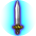

# สกิลดาบ (`BladeSkill`)

24 entries. See ../README.md for how to read these blocks.

### ฮาร์ดฮิต (HardHit) · uid 33

 
**Tree:** สกิลดาบ (`BladeSkill`, tier 1) · **Type:** Attack · **Max Lv:** 10 · **Weapons:** OneHandSword, TwoHandSword · **Flags:** StarGem, MercenaryCanUseSkill · **Client class:** `HardHitAction`

> โจมตีศัตรูด้วยอาวุธอย่างรุนแรง
> มีโอกาสทำให้เป้าหมาย[ผงะ]ได้

In-game level notes

- Lv10: [ได้รับผลแบบเดียวกันเมื่อใช้กับดาบคู่]  *อัตราติดผงะ+50%
- Lv11: *พลัง+50

**Damage numbers by level** (gem bonuses assumed 0)

| | Lv1 | Lv2 | Lv3 | Lv4 | Lv5 | Lv6 | Lv7 | Lv8 | Lv9 | Lv10 |
|---|---|---|---|---|---|---|---|---|---|---|
| SkillRate × [mainWeapon == TwoHandSword] | 1.55 | 1.6 | 1.65 | 1.7 | 1.75 | 1.8 | 1.85 | 1.9 | 1.95 | 2 |
| SkillRate × [mainWeapon != TwoHandSword AND mainWeapon == OneHandSword OR mainWeapon != OneHandSword AND mainWeapon != TwoHandSword] | 1.05 | 1.1 | 1.15 | 1.2 | 1.25 | 1.3 | 1.35 | 1.4 | 1.45 | 1.5 |
| Flat dmg + | 55 | 60 | 65 | 70 | 75 | 80 | 85 | 90 | 95 | 100 |

**Role:** attack (deals damage) · applies status ailment

The skill builds one damage template (one hit). For each template the shared engine (`TemplateAssignment`) fills base damage, defence, element, stability and proration; this skill then adds its own terms listed below and `GetDamage()` multiplies them in `CalcStep` order.

Proration uses the **physical-skill proration slot**; Proration changes on the FIRST damaging hit of one cast on each target only; later hits of the same cast read the updated value but do not change it.

**Damage formula for this skill** (per template; `int()` after every multiplier)

- Engine terms (always present): `BaseDamage`, target `Def` (after pierce), element bonus, stability, `ExpRate = p[slot]/100` (proration), type / last-damage / gem multipliers.
- `SkillConstantDamage` adds: `(((Lv + (Lv << 2)) + 50))`
- `SkillRate` multiplies by (adds into): `((((((Lv * 5) + 100) + 50) + gemCart(101[4])) / 100))`

**Mechanics recovered from code**

- **Flinch chance (%)** (`flinchPercent`): `(int(floor((((Lv * 4.5)) + 0.5))) + 5)` → Lv1..10 [10, 14, 19, 23, 28, 32, 37, 41, 46, 50] _(when mainWeapon == TwoHandSword OR mainWeapon != OneHandSword AND mainWeapon != TwoHandSword)_; `((int(floor((((Lv * 4.5)) + 0.5))) + 5) + 50)` → Lv1..10 [60, 64, 69, 73, 78, 82, 87, 91, 96, 100] _(when mainWeapon != TwoHandSword AND mainWeapon == OneHandSword)_

**Proration:** slot `Skill`, mode `first_hit_per_target`, attack type `Physics`, action id 33

Recovered formulas (per method)

**`OnInitialize`** (3 paths)

- set `ActionRange` = `PlayerAttackBase.GetWeaponRange(GetWeaponType.item(actarAction))`
- set `skillRate` = `(((((Lv * 5) + 100) + 50) + gemCart(101[4])) / 100)` — when mainWeapon == TwoHandSword
- set `fixAddDamage` = `((Lv + (Lv << 2)) + 50)` → Lv1..10: [55, 60, 65, 70, 75, 80, 85, 90, 95, 100]
- set `flinchPercent` = `(int(floor((((Lv * 4.5)) + 0.5))) + 5)` → Lv1..10: [10, 14, 19, 23, 28, 32, 37, 41, 46, 50] — when mainWeapon == TwoHandSword OR mainWeapon != OneHandSword AND mainWeapon != TwoHandSword
- set `skillRate` = `((((Lv * 5) + 100) + gemCart(101[4])) / 100)` — when mainWeapon != TwoHandSword AND mainWeapon == OneHandSword OR mainWeapon != OneHandSword AND mainWeapon != TwoHandSword
- set `flinchPercent` = `((int(floor((((Lv * 4.5)) + 0.5))) + 5) + 50)` → Lv1..10: [60, 64, 69, 73, 78, 82, 87, 91, 96, 100] — when mainWeapon != TwoHandSword AND mainWeapon == OneHandSword

**`InitializeOthers`** (1 path)

- set `ActionRange` = `-1` = -1
- set `Element` = `loopCount`

**`calcPlayerToMobDamage`** (8 paths)

- set `Element` = `PlayerAttackBase.GetWeaponElementType(this, playerAction, mobAction)`
- template `AddRate[SkillRate]` = `skillRate`
- template `AddConstant[SkillConstantDamage]` = `fixAddDamage`
- calls `PlayerAttackBase.checkAbnormalPercent` = `checkAbnormalPercent(1, flinchPercent, playerAction)`
- calls `AbnormalStateManager.GetDefaultAnbormalStateTime` = `GetDefaultAnbormalStateTime()` — when PlayerAttackBase.checkAbnormalPercent(this, 1, flinchPercent, playerAction)
- info `templates` = `1`

---

### แอสทิวท์ (Astute) · uid 34

 
**Tree:** สกิลดาบ (`BladeSkill`, tier 1) · **Type:** Attack · **Max Lv:** 10 · **Weapons:** OneHandSword, TwoHandSword · **Requires:** ฮาร์ดฮิต · **Flags:** StarGem, MercenaryCanUseSkill · **Client class:** `AstuteAction`

> โจมตีศัตรูอย่างรุนแรงด้วยท่วงท่าอันรวดเร็ว
> อัตราคริติคอล+25% เมื่อใช้สกิลสำเร็จ

In-game level notes

- Lv10: [ได้รับผลแบบเดียวกันเมื่อใช้กับดาบคู่]  *MP ที่ใช้-100
- Lv11: *พลัง+50 *เพิ่มค่าความเสียหายคริติคอลที่ได้จากบัฟ

**Damage numbers by level** (gem bonuses assumed 0)

| | Lv1 | Lv2 | Lv3 | Lv4 | Lv5 | Lv6 | Lv7 | Lv8 | Lv9 | Lv10 |
|---|---|---|---|---|---|---|---|---|---|---|
| SkillRate × [MobaMode ne 0 AND mainWeapon != TwoHandSword AND mainWeapon == OneHandSword OR MobaMode ne 0 AND mainWeapon != OneHandSword AND mainWeapon != TwoHandSword OR MobaMode eq 0 AND mainWeapon != TwoHandSword AND mainWeapon == OneHandSword] | 1.6 | 1.7 | 1.8 | 1.9 | 2 | 2.1 | 2.2 | 2.3 | 2.4 | 2.5 |
| SkillRate × [MobaMode ne 0 AND mainWeapon == TwoHandSword OR MobaMode eq 0 AND mainWeapon == TwoHandSword] | 2.1 | 2.2 | 2.3 | 2.4 | 2.5 | 2.6 | 2.7 | 2.8 | 2.9 | 3 |
| Flat dmg + | 155 | 160 | 165 | 170 | 175 | 180 | 185 | 190 | 195 | 200 |

**Role:** attack (deals damage) · buff (self)

The skill builds one damage template (one hit). For each template the shared engine (`TemplateAssignment`) fills base damage, defence, element, stability and proration; this skill then adds its own terms listed below and `GetDamage()` multiplies them in `CalcStep` order.

Proration uses the **physical-skill proration slot**; Proration changes on the FIRST damaging hit of one cast on each target only; later hits of the same cast read the updated value but do not change it.

It applies the buff(s) listed under **Buffs**; the buff object keeps its own timer and returns bonus values through `GetParam(SkillBufferId)`.

**Damage formula for this skill** (per template; `int()` after every multiplier)

- Engine terms (always present): `BaseDamage`, target `Def` (after pierce), element bonus, stability, `ExpRate = p[slot]/100` (proration), type / last-damage / gem multipliers.
- `SkillConstantDamage` adds: `(((Lv + (Lv << 2)) + 150))`
- `SkillRate` multiplies by (adds into): `((((Lv * 10) + 150)) / 100)`

**Mechanics recovered from code**

- **Cost** (`cost`): `100` = 100 _(when MobaMode ne 0 AND mainWeapon != TwoHandSword AND mainWeapon == OneHandSword OR MobaMode eq 0 AND mainWeapon != TwoHandSword AND mainWeapon == OneHandSword)_; `200` = 200 _(when MobaMode ne 0 AND mainWeapon == TwoHandSword OR MobaMode eq 0 AND mainWeapon == TwoHandSword OR MobaMode ne 0 AND mainWeapon != OneHandSword AND mainWeapon != TwoHandSword)_

**Proration:** slot `Skill`, mode `first_hit_per_target`, attack type `Physics`, action id 34

Recovered formulas (per method)

**`OnInitialize`** (6 paths)

- set `ActionRange` = `PlayerAttackBase.GetWeaponRange(GetWeaponType.item(actarAction))`
- set `skillRate` = `((Lv * 10) + 150)` → Lv1..10: [160, 170, 180, 190, 200, 210, 220, 230, 240, 250] — when MobaMode ne 0 AND mainWeapon != TwoHandSword AND mainWeapon == OneHandSword OR MobaMode ne 0 AND mainWeapon != OneHandSword AND mainWeapon != TwoHandSword OR MobaMode eq 0 AND mainWeapon != TwoHandSword AND mainWeapon == OneHandSword
- set `fixAddDamage` = `((Lv + (Lv << 2)) + 150)` → Lv1..10: [155, 160, 165, 170, 175, 180, 185, 190, 195, 200]
- set `cost` = `100` = 100 — when MobaMode ne 0 AND mainWeapon != TwoHandSword AND mainWeapon == OneHandSword OR MobaMode eq 0 AND mainWeapon != TwoHandSword AND mainWeapon == OneHandSword
- set `cost` = `200` = 200 — when MobaMode ne 0 AND mainWeapon == TwoHandSword OR MobaMode eq 0 AND mainWeapon == TwoHandSword OR MobaMode ne 0 AND mainWeapon != OneHandSword AND mainWeapon != TwoHandSword
- set `skillRate` = `(((Lv * 10) + 150) + 50)` → Lv1..10: [210, 220, 230, 240, 250, 260, 270, 280, 290, 300] — when MobaMode ne 0 AND mainWeapon == TwoHandSword OR MobaMode eq 0 AND mainWeapon == TwoHandSword

**`InitializeOthers`** (1 path)

- set `ActionRange` = `-1` = -1
- set `Element` = `loopCount`

**`calcPlayerToMobDamage`** (2 paths)

- set `Element` = `PlayerAttackBase.GetWeaponElementType(this, playerAction, mobAction)`
- template `AddRate[SkillRate]` = `(skillRate / 100)`
- template `AddConstant[SkillConstantDamage]` = `fixAddDamage`
- info `templates` = `1`

**`ActionHit`** (3 paths)

- calls `SkillBufferManager.AddSelfBuffer` = `AddSelfBuffer(34, Lv, Id)` — when IsInstanceOf(actarAction, MobaPlayerActionManager) ne 1 AND UnityEngine.Object.op_Inequality(actarAction)

**Buffs**

**Buff `AstuteBuf`**
- Attached to this skill via `factory:CreateSkillBuffer` (no direct constructor call in the skill's own code).
- Duration: `(((Lv // 6) + ((Lv // 6) << 2)) + 5)` s

| | Lv1 | Lv2 | Lv3 | Lv4 | Lv5 | Lv6 | Lv7 | Lv8 | Lv9 | Lv10 |
|---|---|---|---|---|---|---|---|---|---|---|
| CrtUp | 25 | 25 | 25 | 25 | 25 | 25 | 25 | 25 | 25 | 25 |

- Hook `Updata`: `LeftTime`=(LeftTime - UnityEngine.Time.get_deltaTime()); `LeftTime`=0

Effect applied in `PetStatus$$get_Critical` (66 guarded paths)

- when `TryGetValue.out2() ne 0` AND `(SkillBufferManager.TryGetBuf(CharacterActionManagerBase.get_IsValid(), 712, stkp(-64), 0) & 1) ne 0` AND `TryGetBuf.out2() ne 0`
  - returns `(int(((GetBonusConstant_Rate.out4() + (SkillBufferDataBase.GetParam(TryGetBuf.out2(), 43, 0, ?x3) / 100)) * (int((PetStatus.get_Crt(this, ?x1, ?x2, ?x3) / 3.4)) + 25))) + (SkillBufferDataBase.GetParam(TryGetBuf.out2(), 19, 0, ?x3) + ((CharacterActionManagerBase.get_Size() + GetBonusConstant_Rate.out3()) + (SkillBufferManager.GetSkillBufferParam(CharacterActionManagerBase.get_IsValid(), 19, 0, ?x3) << 1))))`
  - calls `virtual CharacterActionManagerBase.get_MoveSpeed`, `BonusManager$$GetBonusConstant_Rate`, `virtual CharacterActionManagerBase.get_IsDeadOrLocalDead`, `virtual CharacterActionManagerBase.get_Size`, `virtual CharacterActionManagerBase.get_IsValid`, `virtual CharacterActionManagerBase.set_DefaultMoveSpeed`, `EquipItemData$$get_Weapon`, `virtual CharacterActionManagerBase.set_DefaultMoveSpeed`
- when `TryGetValue.out2() ne 0` AND `(SkillBufferManager.TryGetBuf(CharacterActionManagerBase.get_IsValid(), 712, stkp(-64), 0) & 1) ne 0` AND `TryGetBuf.out2() eq 0`
  - calls `virtual CharacterActionManagerBase.get_MoveSpeed`, `BonusManager$$GetBonusConstant_Rate`, `virtual CharacterActionManagerBase.get_IsDeadOrLocalDead`, `virtual CharacterActionManagerBase.get_Size`, `virtual CharacterActionManagerBase.get_IsValid`, `virtual CharacterActionManagerBase.set_DefaultMoveSpeed`, `EquipItemData$$get_Weapon`, `virtual CharacterActionManagerBase.set_DefaultMoveSpeed`
- when `TryGetValue.out2() ne 0` AND `(SkillBufferManager.TryGetBuf(CharacterActionManagerBase.get_IsValid(), 712, stkp(-64), 0) & 1) eq 0`
  - returns `(int((GetBonusConstant_Rate.out4() * (int((PetStatus.get_Crt(this, ?x1, ?x2, ?x3) / 3.4)) + 25))) + ((CharacterActionManagerBase.get_Size() + GetBonusConstant_Rate.out3()) + (SkillBufferManager.GetSkillBufferParam(CharacterActionManagerBase.get_IsValid(), 19, 0, ?x3) << 1)))`
  - calls `virtual CharacterActionManagerBase.get_MoveSpeed`, `BonusManager$$GetBonusConstant_Rate`, `virtual CharacterActionManagerBase.get_IsDeadOrLocalDead`, `virtual CharacterActionManagerBase.get_Size`, `virtual CharacterActionManagerBase.get_IsValid`, `virtual CharacterActionManagerBase.set_DefaultMoveSpeed`, `EquipItemData$$get_Weapon`, `virtual CharacterActionManagerBase.set_DefaultMoveSpeed`
- when `TryGetValue.out2() ne 0` AND `(SkillBufferManager.TryGetBuf(CharacterActionManagerBase.get_IsValid(), 712, stkp(-64), 0) & 1) ne 0` AND `TryGetBuf.out2() ne 0`
  - returns `(int(((((GetBonusConstant_Rate.out4() + (SkillBufferDataBase.GetParam(TryGetBuf.out2(), 43, 0, ?x3) / 100)) + (CharacterActionManagerBase.get_Size() / 100)) + (CharacterActionManagerBase.get_Size() / 100)) * (int((PetStatus.get_Crt(this, 23, ?mi, ?x3) / 3.4)) + 25))) + (SkillBufferDataBase.GetParam(TryGetBuf.out2(), 19, 0, ?x3) + (SkillBufferManager.GetSkillBufferParam(CharacterActionManagerBase.get_IsValid(), 19, 0, ?x3) + (CharacterActionManagerBase.get_Size() + GetBonusConstant_Rate.out3()))))`
  - calls `virtual CharacterActionManagerBase.get_MoveSpeed`, `BonusManager$$GetBonusConstant_Rate`, `virtual CharacterActionManagerBase.get_IsDeadOrLocalDead`, `virtual CharacterActionManagerBase.get_Size`, `virtual CharacterActionManagerBase.get_IsValid`, `virtual CharacterActionManagerBase.set_DefaultMoveSpeed`, `EquipItemData$$get_Weapon`, `virtual CharacterActionManagerBase.set_DefaultMoveSpeed`
- when `TryGetValue.out2() ne 0` AND `(SkillBufferManager.TryGetBuf(CharacterActionManagerBase.get_IsValid(), 712, stkp(-64), 0) & 1) ne 0` AND `TryGetBuf.out2() ne 0`
  - returns `(int((((GetBonusConstant_Rate.out4() + (SkillBufferDataBase.GetParam(TryGetBuf.out2(), 43, 0, ?x3) / 100)) + (CharacterActionManagerBase.get_Size() / 100)) * (int((PetStatus.get_Crt(this, ?x1, ?x2, ?x3) / 3.4)) + 25))) + (SkillBufferDataBase.GetParam(TryGetBuf.out2(), 19, 0, ?x3) + (SkillBufferManager.GetSkillBufferParam(CharacterActionManagerBase.get_IsValid(), 19, 0, ?x3) + (CharacterActionManagerBase.get_Size() + GetBonusConstant_Rate.out3()))))`
  - calls `virtual CharacterActionManagerBase.get_MoveSpeed`, `BonusManager$$GetBonusConstant_Rate`, `virtual CharacterActionManagerBase.get_IsDeadOrLocalDead`, `virtual CharacterActionManagerBase.get_Size`, `virtual CharacterActionManagerBase.get_IsValid`, `virtual CharacterActionManagerBase.set_DefaultMoveSpeed`, `EquipItemData$$get_Weapon`, `virtual CharacterActionManagerBase.set_DefaultMoveSpeed`
- when `TryGetValue.out2() ne 0` AND `(SkillBufferManager.TryGetBuf(CharacterActionManagerBase.get_IsValid(), 712, stkp(-64), 0) & 1) ne 0` AND `TryGetBuf.out2() ne 0`
  - returns `(int((((GetBonusConstant_Rate.out4() + (SkillBufferDataBase.GetParam(TryGetBuf.out2(), 43, 0, ?x3) / 100)) + (CharacterActionManagerBase.get_Size() / 100)) * (int((PetStatus.get_Crt(this, 23, ?mi, ?x3) / 3.4)) + 25))) + (SkillBufferDataBase.GetParam(TryGetBuf.out2(), 19, 0, ?x3) + (SkillBufferManager.GetSkillBufferParam(CharacterActionManagerBase.get_IsValid(), 19, 0, ?x3) + (CharacterActionManagerBase.get_Size() + GetBonusConstant_Rate.out3()))))`
  - calls `virtual CharacterActionManagerBase.get_MoveSpeed`, `BonusManager$$GetBonusConstant_Rate`, `virtual CharacterActionManagerBase.get_IsDeadOrLocalDead`, `virtual CharacterActionManagerBase.get_Size`, `virtual CharacterActionManagerBase.get_IsValid`, `virtual CharacterActionManagerBase.set_DefaultMoveSpeed`, `EquipItemData$$get_Weapon`, `virtual CharacterActionManagerBase.set_DefaultMoveSpeed`
- when `TryGetValue.out2() ne 0` AND `(SkillBufferManager.TryGetBuf(CharacterActionManagerBase.get_IsValid(), 712, stkp(-64), 0) & 1) ne 0` AND `TryGetBuf.out2() ne 0`
  - returns `(int(((GetBonusConstant_Rate.out4() + (SkillBufferDataBase.GetParam(TryGetBuf.out2(), 43, 0, ?x3) / 100)) * (int((PetStatus.get_Crt(this, ?x1, ?x2, ?x3) / 3.4)) + 25))) + (SkillBufferDataBase.GetParam(TryGetBuf.out2(), 19, 0, ?x3) + (SkillBufferManager.GetSkillBufferParam(CharacterActionManagerBase.get_IsValid(), 19, 0, ?x3) + (CharacterActionManagerBase.get_Size() + GetBonusConstant_Rate.out3()))))`
  - calls `virtual CharacterActionManagerBase.get_MoveSpeed`, `BonusManager$$GetBonusConstant_Rate`, `virtual CharacterActionManagerBase.get_IsDeadOrLocalDead`, `virtual CharacterActionManagerBase.get_Size`, `virtual CharacterActionManagerBase.get_IsValid`, `virtual CharacterActionManagerBase.set_DefaultMoveSpeed`, `EquipItemData$$get_Weapon`, `virtual CharacterActionManagerBase.set_DefaultMoveSpeed`
- when `TryGetValue.out2() ne 0` AND `(SkillBufferManager.TryGetBuf(CharacterActionManagerBase.get_IsValid(), 712, stkp(-64), 0) & 1) ne 0` AND `TryGetBuf.out2() ne 0`
  - returns `(int(((GetBonusConstant_Rate.out4() + (SkillBufferDataBase.GetParam(TryGetBuf.out2(), 43, 0, ?x3) / 100)) * (int((PetStatus.get_Crt(this, ?x1, ?x2, ?x3) / 3.4)) + 25))) + (SkillBufferDataBase.GetParam(TryGetBuf.out2(), 19, 0, ?x3) + (SkillBufferManager.GetSkillBufferParam(CharacterActionManagerBase.get_IsValid(), 19, 0, ?x3) + (CharacterActionManagerBase.get_Size() + GetBonusConstant_Rate.out3()))))`
  - calls `virtual CharacterActionManagerBase.get_MoveSpeed`, `BonusManager$$GetBonusConstant_Rate`, `virtual CharacterActionManagerBase.get_IsDeadOrLocalDead`, `virtual CharacterActionManagerBase.get_Size`, `virtual CharacterActionManagerBase.get_IsValid`, `virtual CharacterActionManagerBase.set_DefaultMoveSpeed`, `EquipItemData$$get_Weapon`, `virtual CharacterActionManagerBase.set_DefaultMoveSpeed`

**Code that reads this skill** (level / buff lookups with a constant skill id; where its effect is applied)

- `MobaPlayerActionManager$$ReceiveAttack (GetSkillLv)`
- `PetStatus$$get_Critical (ContainsBuffer)`

---

### โซนิคเบรด (AccelBlade) · uid 35

 
**Tree:** สกิลดาบ (`BladeSkill`, tier 1) · **Type:** Attack · **Max Lv:** 10 · **Weapons:** OneHandSword, TwoHandSword · **Requires:** ฮาร์ดฮิต · **Flags:** StarGem, MercenaryCanUseSkill · **Client class:** `AccelBladeAction`

> เข้าประชิดศัตรูแล้วใช้อาวุธแทง
> ระยะโจมตีและอัตราคริติคอลจะเพิ่มขึ้นเมื่อเลเวลสูงขึ้น

In-game level notes

- Lv10: [ได้รับผลแบบเดียวกันเมื่อใช้กับดาบคู่]  *ระยะห่างที่สามารถใช้ได้+4m *เพิ่มปริมาณการเพิ่มอัตราคริติคอล
- Lv11: *พลัง+50 *ระยะโจมตี (แนวนอน)+2m

**Damage numbers by level** (gem bonuses assumed 0)

| | Lv1 | Lv2 | Lv3 | Lv4 | Lv5 | Lv6 | Lv7 | Lv8 | Lv9 | Lv10 |
|---|---|---|---|---|---|---|---|---|---|---|
| SkillRate × [hasBuff(Aspd) AND mainWeapon != TwoHandSword AND mainWeapon == OneHandSword OR !hasBuff(Aspd) AND mainWeapon != TwoHandSword AND mainWeapon == OneHandSword OR hasBuff(Aspd) AND mainWeapon != OneHandSword AND mainWeapon != TwoHandSword] | 1.05 | 1.1 | 1.15 | 1.2 | 1.25 | 1.3 | 1.35 | 1.4 | 1.45 | 1.5 |
| SkillRate × [hasBuff(Aspd) AND mainWeapon == TwoHandSword OR !hasBuff(Aspd) AND mainWeapon == TwoHandSword] | 1.55 | 1.6 | 1.65 | 1.7 | 1.75 | 1.8 | 1.85 | 1.9 | 1.95 | 2 |
| Flat dmg + | 105 | 110 | 115 | 120 | 125 | 130 | 135 | 140 | 145 | 150 |

**Formulas that depend on live stats (not tabulated)**

- SkillRate × `((((Lv + (Lv << 2)) + 100)) / 100)` — ActionRange eq inf AND PlayerAttackBase.IsBlank(this) AND fsqrt((((UnityEngine.Transform.get_position(UnityEngine.GameObject.get_transform(target)).x - UnityEngine.Transform.get_position(UnityEngine.Component.get_transform(actarAction)).x) * (UnityEngine.Transform.get_position(UnityEngine.GameObject.get_transform(target)).x - UnityEngine.Transform.get_position(UnityEngine.Component.get_transform(actarAction)).x)) + ((UnityEngine.Transform.get_position(UnityEngine.GameObject.get_transform(target)).z - UnityEngine.Transform.get_position(UnityEngine.Component.get_transform(actarAction)).z) * (UnityEngine.Transform.get_position(UnityEngine.GameObject.get_transform(target)).z - UnityEngine.Transform.get_position(UnityEngine.Component.get_transform(actarAction)).z)))) gt 1e-05 AND rank ne 0 OR !PlayerAttackBase.IsBlank(this) AND ActionRange eq inf AND fsqrt((((UnityEngine.Transform.get_position(UnityEngine.GameObject.get_transform(target)).x - UnityEngine.Transform.get_position(UnityEngine.Component.get_transform(actarAction)).x) * (UnityEngine.Transform.get_position(UnityEngine.GameObject.get_transform(target)).x - UnityEngine.Transform.get_position(UnityEngine.Component.get_transform(actarAction)).x)) + ((UnityEngine.Transform.get_position(UnityEngine.GameObject.get_transform(target)).z - UnityEngine.Transform.get_position(UnityEngine.Component.get_transform(actarAction)).z) * (UnityEngine.Transform.get_position(UnityEngine.GameObject.get_transform(target)).z - UnityEngine.Transform.get_position(UnityEngine.Component.get_transform(actarAction)).z)))) gt 1e-05 AND rank ne 0 OR ActionRange eq inf AND PlayerAttackBase.IsBlank(this) AND fsqrt((((UnityEngine.Transform.get_position(UnityEngine.GameObject.get_transform(target)).x - UnityEngine.Transform.get_position(UnityEngine.Component.get_transform(actarAction)).x) * (UnityEngine.Transform.get_position(UnityEngine.GameObject.get_transform(target)).x - UnityEngine.Transform.get_position(UnityEngine.Component.get_transform(actarAction)).x)) + ((UnityEngine.Transform.get_position(UnityEngine.GameObject.get_transform(target)).z - UnityEngine.Transform.get_position(UnityEngine.Component.get_transform(actarAction)).z) * (UnityEngine.Transform.get_position(UnityEngine.GameObject.get_transform(target)).z - UnityEngine.Transform.get_position(UnityEngine.Component.get_transform(actarAction)).z)))) le 1e-05 AND rank ne 0

**Role:** attack (deals damage) · buff (self)

The skill builds one damage template (one hit). For each template the shared engine (`TemplateAssignment`) fills base damage, defence, element, stability and proration; this skill then adds its own terms listed below and `GetDamage()` multiplies them in `CalcStep` order.

Proration uses the **physical-skill proration slot**; Proration changes on the FIRST damaging hit of one cast on each target only; later hits of the same cast read the updated value but do not change it.

It applies the buff(s) listed under **Buffs**; the buff object keeps its own timer and returns bonus values through `GetParam(SkillBufferId)`.

**Damage formula for this skill** (per template; `int()` after every multiplier)

- Engine terms (always present): `BaseDamage`, target `Def` (after pierce), element bonus, stability, `ExpRate = p[slot]/100` (proration), type / last-damage / gem multipliers.
- `SkillConstantDamage` adds: `(((Lv + (Lv << 2)) + 100))`
- `SkillRate` multiplies by (adds into): `((((Lv + (Lv << 2)) + 100)) / 100)`

**Proration:** slot `Skill`, mode `first_hit_per_target`, attack type `Physics`, action id 35

Recovered formulas (per method)

**`OnInitialize`** (6 paths)

- set `rank` = `1` = 1 — when hasBuff(Aspd) AND mainWeapon == TwoHandSword OR hasBuff(Aspd) AND mainWeapon != TwoHandSword AND mainWeapon == OneHandSword OR hasBuff(Aspd) AND mainWeapon != OneHandSword AND mainWeapon != TwoHandSword
- set `Element` = `PlayerStatusBase.GetEquipElement(PlayerActionManagerBase.get_PlayerStatus())`
- set `fixAddDamage` = `((Lv + (Lv << 2)) + 100)` → Lv1..10: [105, 110, 115, 120, 125, 130, 135, 140, 145, 150]
- set `critical` = `((Lv + (Lv << 2)) << 1)` → Lv1..10: [10, 20, 30, 40, 50, 60, 70, 80, 90, 100] — when hasBuff(Aspd) AND mainWeapon != TwoHandSword AND mainWeapon == OneHandSword OR !hasBuff(Aspd) AND mainWeapon != TwoHandSword AND mainWeapon == OneHandSword OR hasBuff(Aspd) AND mainWeapon != OneHandSword AND mainWeapon != TwoHandSword
- set `skillRate` = `((Lv + (Lv << 2)) + 100)` → Lv1..10: [105, 110, 115, 120, 125, 130, 135, 140, 145, 150] — when hasBuff(Aspd) AND mainWeapon != TwoHandSword AND mainWeapon == OneHandSword OR !hasBuff(Aspd) AND mainWeapon != TwoHandSword AND mainWeapon == OneHandSword OR hasBuff(Aspd) AND mainWeapon != OneHandSword AND mainWeapon != TwoHandSword
- set `ActionRange` = `MathUtil.DisplayMeterToDistance((((frintp((Lv / 3)) * 4) + 4) + 4))` — when hasBuff(Aspd) AND mainWeapon != TwoHandSword AND mainWeapon == OneHandSword OR !hasBuff(Aspd) AND mainWeapon != TwoHandSword AND mainWeapon == OneHandSword
- set `rangeRad` = `MathUtil.DisplayMeterToDistance(2)` — when hasBuff(Aspd) AND mainWeapon != TwoHandSword AND mainWeapon == OneHandSword OR hasBuff(Aspd) AND mainWeapon != OneHandSword AND mainWeapon != TwoHandSword
- set `rankUpReceptionTime` = `(5 + gemCart(102[2]))`
- set `rank` = `0` = 0 — when !hasBuff(Aspd) AND mainWeapon == TwoHandSword OR !hasBuff(Aspd) AND mainWeapon != TwoHandSword AND mainWeapon == OneHandSword OR !hasBuff(Aspd) AND mainWeapon != OneHandSword AND mainWeapon != TwoHandSword
- set `rangeRad` = `MathUtil.DisplayMeterToDistance(1)` — when !hasBuff(Aspd) AND mainWeapon != TwoHandSword AND mainWeapon == OneHandSword OR !hasBuff(Aspd) AND mainWeapon != OneHandSword AND mainWeapon != TwoHandSword
- set `ActionRange` = `MathUtil.DisplayMeterToDistance(((frintp((Lv / 3)) * 4) + 4))` — when hasBuff(Aspd) AND mainWeapon == TwoHandSword OR !hasBuff(Aspd) AND mainWeapon == TwoHandSword OR hasBuff(Aspd) AND mainWeapon != OneHandSword AND mainWeapon != TwoHandSword
- set `critical` = `(((Lv + (Lv << 2)) << 1) // 10)` → Lv1..10: [1, 2, 3, 4, 5, 6, 7, 8, 9, 10] — when hasBuff(Aspd) AND mainWeapon == TwoHandSword OR !hasBuff(Aspd) AND mainWeapon == TwoHandSword
- set `skillRate` = `(((Lv + (Lv << 2)) + 100) + 50)` → Lv1..10: [155, 160, 165, 170, 175, 180, 185, 190, 195, 200] — when hasBuff(Aspd) AND mainWeapon == TwoHandSword OR !hasBuff(Aspd) AND mainWeapon == TwoHandSword
- set `rangeRad` = `MathUtil.DisplayMeterToDistance(4)` — when hasBuff(Aspd) AND mainWeapon == TwoHandSword
- set `rangeRad` = `MathUtil.DisplayMeterToDistance(3)` — when !hasBuff(Aspd) AND mainWeapon == TwoHandSword

**`InitializeOthers`** (1 path)

- set `ActionRange` = `-1` = -1
- set `Element` = `loopCount`

**`ActionStart`** (1024 paths)

- set `startPos.y` = `UnityEngine.Transform.get_position(UnityEngine.Component.get_transform(actarAction)).y`
- set `startPos.z` = `UnityEngine.Transform.get_position(UnityEngine.Component.get_transform(actarAction)).z`
- set `skillRate` = `(skillRate + min(((((MathUtil.DistanceToDisplayMeter(ActionRange) mi MathUtil.DisplayDistance(0, ?mi, UnityEngine.Transform.get_position(UnityEngine.Component.get_transform(actarAction)).x) ? MathUtil.DistanceToDisplayMeter(ActionRange) : MathUtil.DisplayDistance(0, ?mi, UnityEngine.Transform.get_position(UnityEngine.Component.get_transform(actarAction)).x)) + -8) + 1) * 10), 170))` — when ActionRange eq inf AND PlayerAttackBase.IsBlank(this) AND fsqrt((((UnityEngine.Transform.get_position(UnityEngine.GameObject.get_transform(target)).x - UnityEngine.Transform.get_position(UnityEngine.Component.get_transform(actarAction)).x) * (UnityEngine.Transform.get_position(UnityEngine.GameObject.get_transform(target)).x - UnityEngine.Transform.get_position(UnityEngine.Component.get_transform(actarAction)).x)) + ((UnityEngine.Transform.get_position(UnityEngine.GameObject.get_transform(target)).z - UnityEngine.Transform.get_position(UnityEngine.Component.get_transform(actarAction)).z) * (UnityEngine.Transform.get_position(UnityEngine.GameObject.get_transform(target)).z - UnityEngine.Transform.get_position(UnityEngine.Component.get_transform(actarAction)).z)))) gt 1e-05 AND rank ne 0 OR !PlayerAttackBase.IsBlank(this) AND ActionRange eq inf AND fsqrt((((UnityEngine.Transform.get_position(UnityEngine.GameObject.get_transform(target)).x - UnityEngine.Transform.get_position(UnityEngine.Component.get_transform(actarAction)).x) * (UnityEngine.Transform.get_position(UnityEngine.GameObject.get_transform(target)).x - UnityEngine.Transform.get_position(UnityEngine.Component.get_transform(actarAction)).x)) + ((UnityEngine.Transform.get_position(UnityEngine.GameObject.get_transform(target)).z - UnityEngine.Transform.get_position(UnityEngine.Component.get_transform(actarAction)).z) * (UnityEngine.Transform.get_position(UnityEngine.GameObject.get_transform(target)).z - UnityEngine.Transform.get_position(UnityEngine.Component.get_transform(actarAction)).z)))) gt 1e-05 AND rank ne 0 OR ActionRange eq inf AND PlayerAttackBase.IsBlank(this) AND fsqrt((((UnityEngine.Transform.get_position(UnityEngine.GameObject.get_transform(target)).x - UnityEngine.Transform.get_position(UnityEngine.Component.get_transform(actarAction)).x) * (UnityEngine.Transform.get_position(UnityEngine.GameObject.get_transform(target)).x - UnityEngine.Transform.get_position(UnityEngine.Component.get_transform(actarAction)).x)) + ((UnityEngine.Transform.get_position(UnityEngine.GameObject.get_transform(target)).z - UnityEngine.Transform.get_position(UnityEngine.Component.get_transform(actarAction)).z) * (UnityEngine.Transform.get_position(UnityEngine.GameObject.get_transform(target)).z - UnityEngine.Transform.get_position(UnityEngine.Component.get_transform(actarAction)).z)))) le 1e-05 AND rank ne 0
- calls `SkillBufferManager.AddSelfBuffer` = `AddSelfBuffer(35, Lv, rankUpReceptionTime)` — when !PlayerAttackBase.IsBlank(this) AND ActionRange eq inf AND fsqrt((((UnityEngine.Transform.get_position(UnityEngine.GameObject.get_transform(target)).x - UnityEngine.Transform.get_position(UnityEngine.Component.get_transform(actarAction)).x) * (UnityEngine.Transform.get_position(UnityEngine.GameObject.get_transform(target)).x - UnityEngine.Transform.get_position(UnityEngine.Component.get_transform(actarAction)).x)) + ((UnityEngine.Transform.get_position(UnityEngine.GameObject.get_transform(target)).z - UnityEngine.Transform.get_position(UnityEngine.Component.get_transform(actarAction)).z) * (UnityEngine.Transform.get_position(UnityEngine.GameObject.get_transform(target)).z - UnityEngine.Transform.get_position(UnityEngine.Component.get_transform(actarAction)).z)))) gt 1e-05 AND rank ne 0 OR !PlayerAttackBase.IsBlank(this) AND ActionRange eq inf AND fsqrt((((UnityEngine.Transform.get_position(UnityEngine.GameObject.get_transform(target)).x - UnityEngine.Transform.get_position(UnityEngine.Component.get_transform(actarAction)).x) * (UnityEngine.Transform.get_position(UnityEngine.GameObject.get_transform(target)).x - UnityEngine.Transform.get_position(UnityEngine.Component.get_transform(actarAction)).x)) + ((UnityEngine.Transform.get_position(UnityEngine.GameObject.get_transform(target)).z - UnityEngine.Transform.get_position(UnityEngine.Component.get_transform(actarAction)).z) * (UnityEngine.Transform.get_position(UnityEngine.GameObject.get_transform(target)).z - UnityEngine.Transform.get_position(UnityEngine.Component.get_transform(actarAction)).z)))) le 1e-05 AND rank ne 0 OR !PlayerAttackBase.IsBlank(this) AND ActionRange eq inf AND fsqrt((((UnityEngine.Transform.get_position(UnityEngine.GameObject.get_transform(target)).x - UnityEngine.Transform.get_position(UnityEngine.Component.get_transform(actarAction)).x) * (UnityEngine.Transform.get_position(UnityEngine.GameObject.get_transform(target)).x - UnityEngine.Transform.get_position(UnityEngine.Component.get_transform(actarAction)).x)) + ((UnityEngine.Transform.get_position(UnityEngine.GameObject.get_transform(target)).z - UnityEngine.Transform.get_position(UnityEngine.Component.get_transform(actarAction)).z) * (UnityEngine.Transform.get_position(UnityEngine.GameObject.get_transform(target)).z - UnityEngine.Transform.get_position(UnityEngine.Component.get_transform(actarAction)).z)))) gt 1e-05 AND rank eq 0

**`calcPlayerToMobDamage`** (4 paths)

- set `Element` = `PlayerAttackBase.GetWeaponElementType(this, playerAction, mobAction)`
- template `AddRate[SkillRate]` = `(skillRate / 100)`
- template `AddConstant[SkillConstantDamage]` = `fixAddDamage`
- info `templates` = `1`

**`GetLocalizeKey`** (1 path)

- set `rank` = `rank`

**Buffs**

**Buff `AccelBladeBuf`**
- Attached to this skill via `factory:CreateSkillBuffer` (no direct constructor call in the skill's own code).
- Duration: `time` s
- Hook `Updata`: `LeftTime`=(LeftTime - UnityEngine.Time.get_deltaTime()); `LeftTime`=0

Effect applied in `AccelBladeAction$$OnInitialize` (6 guarded paths)

- always
  - set `rank` = `1`
  - set `Element` = `PlayerStatusBase.GetEquipElement(?blr, 0, ?x2, ?x3)`
  - set `fixAddDamage` = `((Lv + (Lv << 2)) + 100)`
  - set `WeaponType` = `PlayerAttackBase.GetWeaponType(actarAction, 0, ?x2, ?x3)`
  - set `critical` = `((Lv + (Lv << 2)) << 1)`
  - set `skillRate` = `((Lv + (Lv << 2)) + 100)`
  - set `ActionRange` = `MathUtil.DisplayMeterToDistance(0, ?x1, ?x2, ?x3)`
  - set `rangeRad` = `MathUtil.DisplayMeterToDistance(0, ?x1, ?x2, ?x3)`
  - set `rankUpReceptionTime` = `(5 + GemCartBufferBase.GetValue(GemCartBufferManager.GetGemCartBuffer(?blr, 102, 0, ?x3), 2, 0, ?x3))`
  - set `_motionSpeed` = `PlayerAttackBase.CalcMotionSpeed(?blr, 0, ?x2, ?x3)`
  - set `CurrentTake` = `0x165db78(meta(0x399a650, SkillLinkedTake_TypeInfo), ?x1, ?x2, ?x3)`
  - calls `PlayerStatusBase$$GetEquipElement`, `PlayerAttackBase$$GetWeaponType`, `GemCartBufferManager$$GetGemCartBuffer`, `GemCartBufferBase$$GetValue`, `MathUtil$$DisplayMeterToDistance`, `MathUtil$$DisplayMeterToDistance`, `PlayerAttackBase$$CalcMotionSpeed`, `PlayerAttackBase$$CalcMp`
- always
  - set `rank` = `0`
  - set `Element` = `PlayerStatusBase.GetEquipElement(?blr, 0, ?x2, ?x3)`
  - set `fixAddDamage` = `((Lv + (Lv << 2)) + 100)`
  - set `WeaponType` = `PlayerAttackBase.GetWeaponType(actarAction, 0, ?x2, ?x3)`
  - set `critical` = `((Lv + (Lv << 2)) << 1)`
  - set `skillRate` = `((Lv + (Lv << 2)) + 100)`
  - set `ActionRange` = `MathUtil.DisplayMeterToDistance(0, ?x1, ?x2, ?x3)`
  - set `rangeRad` = `MathUtil.DisplayMeterToDistance(0, ?x1, ?x2, ?x3)`
  - set `rankUpReceptionTime` = `(5 + GemCartBufferBase.GetValue(GemCartBufferManager.GetGemCartBuffer(?blr, 102, 0, ?x3), 2, 0, ?x3))`
  - set `_motionSpeed` = `PlayerAttackBase.CalcMotionSpeed(?blr, 0, ?x2, ?x3)`
  - set `CurrentTake` = `0x165db78(meta(0x399a650, SkillLinkedTake_TypeInfo), ?x1, ?x2, ?x3)`
  - calls `PlayerStatusBase$$GetEquipElement`, `PlayerAttackBase$$GetWeaponType`, `GemCartBufferManager$$GetGemCartBuffer`, `GemCartBufferBase$$GetValue`, `MathUtil$$DisplayMeterToDistance`, `MathUtil$$DisplayMeterToDistance`, `PlayerAttackBase$$CalcMotionSpeed`, `PlayerAttackBase$$CalcMp`
- always
  - set `rank` = `1`
  - set `Element` = `PlayerStatusBase.GetEquipElement(?blr, 0, ?x2, ?x3)`
  - set `fixAddDamage` = `((Lv + (Lv << 2)) + 100)`
  - set `WeaponType` = `PlayerAttackBase.GetWeaponType(actarAction, 0, ?x2, ?x3)`
  - set `critical` = `((Lv + (Lv << 2)) << 1)`
  - set `skillRate` = `((Lv + (Lv << 2)) + 100)`
  - set `ActionRange` = `MathUtil.DisplayMeterToDistance(0, ?x1, ?x2, ?x3)`
  - set `rangeRad` = `MathUtil.DisplayMeterToDistance(0, ?x1, ?x2, ?x3)`
  - set `rankUpReceptionTime` = `(5 + GemCartBufferBase.GetValue(GemCartBufferManager.GetGemCartBuffer(?blr, 102, 0, ?x3), 2, 0, ?x3))`
  - set `_motionSpeed` = `PlayerAttackBase.CalcMotionSpeed(?blr, 0, ?x2, ?x3)`
  - set `CurrentTake` = `0x165db78(meta(0x399a650, SkillLinkedTake_TypeInfo), ?x1, ?x2, ?x3)`
  - calls `PlayerStatusBase$$GetEquipElement`, `PlayerAttackBase$$GetWeaponType`, `GemCartBufferManager$$GetGemCartBuffer`, `GemCartBufferBase$$GetValue`, `MathUtil$$DisplayMeterToDistance`, `MathUtil$$DisplayMeterToDistance`, `PlayerAttackBase$$CalcMotionSpeed`, `PlayerAttackBase$$CalcMp`
- always
  - set `rank` = `0`
  - set `Element` = `PlayerStatusBase.GetEquipElement(?blr, 0, ?x2, ?x3)`
  - set `fixAddDamage` = `((Lv + (Lv << 2)) + 100)`
  - set `WeaponType` = `PlayerAttackBase.GetWeaponType(actarAction, 0, ?x2, ?x3)`
  - set `critical` = `((Lv + (Lv << 2)) << 1)`
  - set `skillRate` = `((Lv + (Lv << 2)) + 100)`
  - set `ActionRange` = `MathUtil.DisplayMeterToDistance(0, ?x1, ?x2, ?x3)`
  - set `rangeRad` = `MathUtil.DisplayMeterToDistance(0, ?x1, ?x2, ?x3)`
  - set `rankUpReceptionTime` = `(5 + GemCartBufferBase.GetValue(GemCartBufferManager.GetGemCartBuffer(?blr, 102, 0, ?x3), 2, 0, ?x3))`
  - set `_motionSpeed` = `PlayerAttackBase.CalcMotionSpeed(?blr, 0, ?x2, ?x3)`
  - set `CurrentTake` = `0x165db78(meta(0x399a650, SkillLinkedTake_TypeInfo), ?x1, ?x2, ?x3)`
  - calls `PlayerStatusBase$$GetEquipElement`, `PlayerAttackBase$$GetWeaponType`, `GemCartBufferManager$$GetGemCartBuffer`, `GemCartBufferBase$$GetValue`, `MathUtil$$DisplayMeterToDistance`, `MathUtil$$DisplayMeterToDistance`, `PlayerAttackBase$$CalcMotionSpeed`, `PlayerAttackBase$$CalcMp`
- always
  - set `rank` = `1`
  - set `Element` = `PlayerStatusBase.GetEquipElement(?blr, 0, ?x2, ?x3)`
  - set `fixAddDamage` = `((Lv + (Lv << 2)) + 100)`
  - set `WeaponType` = `PlayerAttackBase.GetWeaponType(actarAction, 0, ?x2, ?x3)`
  - set `critical` = `(((Lv + (Lv << 2)) << 1) // 10)`
  - set `skillRate` = `(((Lv + (Lv << 2)) + 100) + 50)`
  - set `ActionRange` = `MathUtil.DisplayMeterToDistance(0, ?x1, ?x2, ?x3)`
  - set `rangeRad` = `MathUtil.DisplayMeterToDistance(0, ?x1, ?x2, ?x3)`
  - set `rankUpReceptionTime` = `(5 + GemCartBufferBase.GetValue(GemCartBufferManager.GetGemCartBuffer(?blr, 102, 0, ?x3), 2, 0, ?x3))`
  - set `_motionSpeed` = `PlayerAttackBase.CalcMotionSpeed(?blr, 0, ?x2, ?x3)`
  - set `CurrentTake` = `0x165db78(meta(0x399a650, SkillLinkedTake_TypeInfo), ?x1, ?x2, ?x3)`
  - calls `PlayerStatusBase$$GetEquipElement`, `PlayerAttackBase$$GetWeaponType`, `GemCartBufferManager$$GetGemCartBuffer`, `GemCartBufferBase$$GetValue`, `MathUtil$$DisplayMeterToDistance`, `MathUtil$$DisplayMeterToDistance`, `PlayerAttackBase$$CalcMotionSpeed`, `PlayerAttackBase$$CalcMp`
- always
  - set `rank` = `0`
  - set `Element` = `PlayerStatusBase.GetEquipElement(?blr, 0, ?x2, ?x3)`
  - set `fixAddDamage` = `((Lv + (Lv << 2)) + 100)`
  - set `WeaponType` = `PlayerAttackBase.GetWeaponType(actarAction, 0, ?x2, ?x3)`
  - set `critical` = `(((Lv + (Lv << 2)) << 1) // 10)`
  - set `skillRate` = `(((Lv + (Lv << 2)) + 100) + 50)`
  - set `ActionRange` = `MathUtil.DisplayMeterToDistance(0, ?x1, ?x2, ?x3)`
  - set `rangeRad` = `MathUtil.DisplayMeterToDistance(0, ?x1, ?x2, ?x3)`
  - set `rankUpReceptionTime` = `(5 + GemCartBufferBase.GetValue(GemCartBufferManager.GetGemCartBuffer(?blr, 102, 0, ?x3), 2, 0, ?x3))`
  - set `_motionSpeed` = `PlayerAttackBase.CalcMotionSpeed(?blr, 0, ?x2, ?x3)`
  - set `CurrentTake` = `0x165db78(meta(0x399a650, SkillLinkedTake_TypeInfo), ?x1, ?x2, ?x3)`
  - calls `PlayerStatusBase$$GetEquipElement`, `PlayerAttackBase$$GetWeaponType`, `GemCartBufferManager$$GetGemCartBuffer`, `GemCartBufferBase$$GetValue`, `MathUtil$$DisplayMeterToDistance`, `MathUtil$$DisplayMeterToDistance`, `PlayerAttackBase$$CalcMotionSpeed`, `PlayerAttackBase$$CalcMp`

**Code that reads this skill** (level / buff lookups with a constant skill id; where its effect is applied)

- `AccelBladeAction$$OnInitialize (ContainsBuffer)`

---

### ซอร์ดมาสเตอรี่ (BladeMastery) · uid 36

 
**Tree:** สกิลดาบ (`BladeSkill`, tier 1) · **Type:** Mastery · **Max Lv:** 10 · **Weapons:** OneHandSword, TwoHandSword · **Flags:** StarGem · **Client class:** `BladeMastery` (passive mastery)

> ใช้ดาบได้ชำนาญมากขึ้น
> พลังโจมตีจะมากขึ้นเมื่อโจมตีด้วยดาบมือเดียวหรือดาบสองมือ

**Role:** passive mastery

**Passive bonuses by level** (`GetMasteryParam(MasteryId)`)

| | Lv1 | Lv2 | Lv3 | Lv4 | Lv5 | Lv6 | Lv7 | Lv8 | Lv9 | Lv10 |
|---|---|---|---|---|---|---|---|---|---|---|
| EqAtkRate | 3 | 6 | 9 | 12 | 15 | 18 | 21 | 24 | 27 | 30 |
| AtkRate | 1 | 1 | 1 | 1 | 1 | 1 | 2 | 2 | 2 | 2 |

---

### ควิกสแลช (SpeedyBladeMastery) · uid 37

 
**Tree:** สกิลดาบ (`BladeSkill`, tier 1) · **Type:** Mastery · **Max Lv:** 10 · **Weapons:** OneHandSword, TwoHandSword · **Requires:** ซอร์ดมาสเตอรี่ · **Flags:** StarGem · **Client class:** `SpeedyBladeMastery` (passive mastery)

> ลดการเคลื่อนไหวที่ไร้ประโยชน์
> ทำให้โจมตีได้อย่างรวดเร็ว
> เมื่อใช้ดาบมือเดียวหรือดาบสองมือ 

**Role:** passive mastery

**Passive bonuses by level** (`GetMasteryParam(MasteryId)`)

| | Lv1 | Lv2 | Lv3 | Lv4 | Lv5 | Lv6 | Lv7 | Lv8 | Lv9 | Lv10 |
|---|---|---|---|---|---|---|---|---|---|---|
| Aspd | 10 | 20 | 30 | 40 | 50 | 60 | 70 | 80 | 90 | 100 |
| AspdRate | 1 | 2 | 3 | 4 | 5 | 6 | 7 | 8 | 9 | 10 |

---

### แฮมเมอร์สแลม (HammerDown) · uid 52

 
**Tree:** สกิลดาบ (`BladeSkill`, tier 1) · **Type:** Attack · **Max Lv:** 10 · **Weapons:** TwoHandSword · **Flags:** StarGem · **Client class:** `HammerDownAction`

> โจมตีแบบกระแทกลงในระยะแคบ
> โดยมีศูนย์กลางอยู่ที่เป้าหมาย
> การันตีคริติคอลกับเป้าหมาย
> ที่ติดสถานะผิดปกติเช่นผงะ
> หากใช้ต่อเนื่อง MP ที่ใช้จะกลายเป็น 0

**Damage numbers by level** (gem bonuses assumed 0)

| | Lv1 | Lv2 | Lv3 | Lv4 | Lv5 | Lv6 | Lv7 | Lv8 | Lv9 | Lv10 |
|---|---|---|---|---|---|---|---|---|---|---|
| Flat dmg + | 100 | 100 | 100 | 100 | 100 | 100 | 100 | 100 | 100 | 100 |

**Formulas that depend on live stats (not tabulated)**

- SkillRate × `(((((Lv + (Lv << 2)) + 100) + (status.Vit + (baseSTR // 5)))) / 100)`

**Role:** attack (deals damage) · buff (self)

The skill builds one damage template (one hit). For each template the shared engine (`TemplateAssignment`) fills base damage, defence, element, stability and proration; this skill then adds its own terms listed below and `GetDamage()` multiplies them in `CalcStep` order.

Proration uses the **slot chosen at runtime (physical or magic by a per-cast flag)**; Proration changes on the FIRST damaging hit of one cast on each target only; later hits of the same cast read the updated value but do not change it.

It applies the buff(s) listed under **Buffs**; the buff object keeps its own timer and returns bonus values through `GetParam(SkillBufferId)`.

**Damage formula for this skill** (per template; `int()` after every multiplier)

- Engine terms (always present): `BaseDamage`, target `Def` (after pierce), element bonus, stability, `ExpRate = p[slot]/100` (proration), type / last-damage / gem multipliers.
- `SkillConstantDamage` adds: `(100)`
- `SkillRate` multiplies by (adds into): `(((((Lv + (Lv << 2)) + 100) + (status.Vit + (baseSTR // 5)))) / 100)`
- `ExpRate` sets: `1`

**Mechanics recovered from code**

- **Base MP cost** (`baseMp`): `0` = 0 _(when hasBuff(Percent))_
- **Attack range** (`attackRange`): `MathUtil.DisplayMeterToDistance(1.5)`

**Proration:** slot `dynamic`, mode `first_hit_per_target`, attack type `dynamic`, action id 52

Recovered formulas (per method)

**`OnInitialize`** (2 paths)

- set `ActionRange` = `PlayerAttackBase.GetWeaponRange(GetWeaponType.item(actarAction))`
- set `Element` = `PlayerStatusBase.GetEquipElement(PlayerActionManagerBase.get_PlayerStatus())`
- set `baseMp` = `0` = 0 — when hasBuff(Percent)
- set `skillRate` = `(((Lv + (Lv << 2)) + 100) + (status.Vit + (baseSTR // 5)))`
- set `constantDamage` = `100` = 100
- set `attackRange` = `MathUtil.DisplayMeterToDistance(1.5)`

**`ActionPreparation`** (4 paths)

- set `attackPos.y` = `UnityEngine.Transform.get_position(UnityEngine.GameObject.get_transform(target)).y`
- set `attackPos.z` = `UnityEngine.Transform.get_position(UnityEngine.GameObject.get_transform(target)).z`
- set `continuousUse` = `1` = 1 — when !PlayerAttackBase.IsBlank(this) AND UnityEngine.Object.op_Inequality(actarAction) AND hasBuff(Percent)
- set `attackType` = `3` = 3 — when !PlayerAttackBase.IsBlank(this) AND UnityEngine.Object.op_Inequality(actarAction) AND hasBuff(Percent)

**`ActionStart`** (3 paths)

- calls `HammerDownBuf..ctor` = `.ctor(Lv)` — when !PlayerAttackBase.IsBlank(this) AND UnityEngine.Object.op_Inequality(actarAction)
- calls `SkillBufferManager.AddSelfBuffer` = `AddSelfBuffer(new HammerDownBuf, Id)` — when !PlayerAttackBase.IsBlank(this) AND UnityEngine.Object.op_Inequality(actarAction)

**`calcPlayerToMobDamage`** (4 paths)

- template `AddRate[SkillRate]` = `(skillRate / 100)`
- template `AddConstant[SkillConstantDamage]` = `constantDamage`
- template `SetRate[ExpRate]` = `1` — when continuousUse ne 0
- info `templates` = `1`

**`InitializeOthers`** (1 path)

- set `Element` = `loopCount`
- set `ActionRange` = `-1` = -1

**Buffs**

**Buff `HammerDownBuf`**
**Buff `SkillBufferDataBase`**
- Attached to this skill via `caller2:HammerDownBuf$$.ctor<-HammerDownAction$$ActionStart` (no direct constructor call in the skill's own code).
- Buff hook methods: `get_BufEffectTakeId`, `get_IsAbnormalDamageCancel`, `get_IsDamageCancel`, `get_IsEnd`, `get_IsRange`, `get_IsSelfAction`, `get_LeftTime`, `get_Level`, `set_IsDamageCancel`, `set_IsEnd`, `set_IsSelfAction`, `set_LeftTime`, `set_Level`
- Hook `set_Level`: `Level`=value
- Hook `set_IsSelfAction`: `IsSelfAction`=(value & 1)
- Hook `set_IsDamageCancel`: `IsDamageCancel`=(value & 1)
- Hook `set_LeftTime`: `LeftTime`=value

Effect applied in `HammerDownAction$$ActionPreparation` (2 guarded paths)

- always
  - returns `SkillBufferManager.ContainsBuffer(?blr, 52, 0, ?x3)`
  - set `attackPos` = `UnityEngine.Transform.get_position(UnityEngine.GameObject.get_transform(target, 0, ?x2, ?x3), 0, ?x2, ?x3)`
  - set `+0x13c` = `?v1`
  - set `+0x140` = `?v2`
  - set `continuousUse` = `1`
  - set `attackType` = `3`
  - calls `PlayerAttackBase$$ActionPreparation`, `UnityEngine.GameObject$$get_transform`, `UnityEngine.Transform$$get_position`, `PlayerAttackBase$$IsBlank`
- always
  - returns `SkillBufferManager.ContainsBuffer(?blr, 52, 0, ?x3)`
  - set `attackPos` = `UnityEngine.Transform.get_position(UnityEngine.GameObject.get_transform(target, 0, ?x2, ?x3), 0, ?x2, ?x3)`
  - set `+0x13c` = `?v1`
  - set `+0x140` = `?v2`
  - calls `PlayerAttackBase$$ActionPreparation`, `UnityEngine.GameObject$$get_transform`, `UnityEngine.Transform$$get_position`, `PlayerAttackBase$$IsBlank`

Effect applied in `HammerDownAction$$OnInitialize` (2 guarded paths)

- always
  - returns `System.Collections.Generic.Dictionary<Int16Enum, int>.Add(meta(0), 7, PlayerStatusBase.GetEquipElement(?blr, 0, ?x2, ?x3), meta(0x397a3a0, Method$System.Collections.Generic.Dictionary<TakeParameterType, int>.Add()))`
  - set `WeaponType` = `PlayerAttackBase.GetWeaponType(actarAction, stkp(-56), 0, ?x3)`
  - set `ActionRange` = `PlayerAttackBase.GetWeaponRange(GetWeaponType.out1(), 0, ?x2, ?x3)`
  - set `Element` = `PlayerStatusBase.GetEquipElement(?blr, 0, ?x2, ?x3)`
  - set `baseMp` = `0`
  - set `skillRate` = `(((Lv + (Lv << 2)) + 100) + (IPlayerStatusCalculator.get_Vit(?blr) + ([?blr+0x14] // 5)))`
  - set `constantDamage` = `100`
  - set `attackRange` = `MathUtil.DisplayMeterToDistance(0, ?mi, ?x2, ?x3)`
  - set `_motionSpeed` = `PlayerAttackBase.CalcMotionSpeed(?blr, 0, ?x2, ?x3)`
  - set `CurrentTake` = `0x165db78(meta(0x399a650, SkillLinkedTake_TypeInfo), ?x1, ?x2, ?x3)`
  - calls `PlayerAttackBase$$GetWeaponType`, `PlayerAttackBase$$GetWeaponRange`, `PlayerStatusBase$$GetEquipElement`, `interface IPlayerStatusCalculator.get_Vit`, `MathUtil$$DisplayMeterToDistance`, `PlayerAttackBase$$CalcMotionSpeed`, `PlayerAttackBase$$CalcMp`, `0x165db78`
- always
  - returns `System.Collections.Generic.Dictionary<Int16Enum, int>.Add(meta(0), 7, PlayerStatusBase.GetEquipElement(?blr, 0, ?x2, ?x3), meta(0x397a3a0, Method$System.Collections.Generic.Dictionary<TakeParameterType, int>.Add()))`
  - set `WeaponType` = `PlayerAttackBase.GetWeaponType(actarAction, stkp(-56), 0, ?x3)`
  - set `ActionRange` = `PlayerAttackBase.GetWeaponRange(GetWeaponType.out1(), 0, ?x2, ?x3)`
  - set `Element` = `PlayerStatusBase.GetEquipElement(?blr, 0, ?x2, ?x3)`
  - set `skillRate` = `(((Lv + (Lv << 2)) + 100) + (IPlayerStatusCalculator.get_Vit(?blr) + ([?blr+0x14] // 5)))`
  - set `constantDamage` = `100`
  - set `attackRange` = `MathUtil.DisplayMeterToDistance(0, ?mi, ?x2, ?x3)`
  - set `_motionSpeed` = `PlayerAttackBase.CalcMotionSpeed(?blr, 0, ?x2, ?x3)`
  - set `CurrentTake` = `0x165db78(meta(0x399a650, SkillLinkedTake_TypeInfo), ?x1, ?x2, ?x3)`
  - calls `PlayerAttackBase$$GetWeaponType`, `PlayerAttackBase$$GetWeaponRange`, `PlayerStatusBase$$GetEquipElement`, `interface IPlayerStatusCalculator.get_Vit`, `MathUtil$$DisplayMeterToDistance`, `PlayerAttackBase$$CalcMotionSpeed`, `PlayerAttackBase$$CalcMp`, `0x165db78`

Effect applied in `PlayerAttackBase$$RemoveAfterSkillBuf` (300 guarded paths, truncated)

- when `TryGetValue.out2() ne 0` AND `PlayerAttackBase.get_ActionID() ne 517`
  - returns `SkillBufferManager.RemoveSelfBuffer(?blr, 1129, 0, ?x3)`
  - set `_motionSpeed` = `CharacterActionManagerBase.set_DefaultMoveSpeed()`
  - set `appliedQuicklyMotionSpeedValue` = `255`
  - set `appliedQuicklyType` = `(((appliedQuicklyType | 2) | 16) | 8)`
  - calls `virtual PlayerAttackBase.get_ActionID`, `PlayerAttackBase$$ContainsNotApplicableSkill`, `virtual CharacterActionManagerBase.set_DefaultMoveSpeed`, `SkillBufferManager$$RemoveSelfBuffer`, `SkillBufferManager$$RemoveBuffer`, `SkillBufferManager$$RemoveBuffer`, `SkillBufferManager$$RemoveBuffer`, `virtual PlayerAttackBase.get_ActionID`
- when `TryGetValue.out2() ne 0` AND `PlayerAttackBase.get_ActionID() ne 517`
  - returns `SkillBufferManager.TryGetBuf(?blr, 1129, stkp(-88), 0)`
  - set `_motionSpeed` = `((SkillActionBase.get_MotionSpeed(this, 0, ?mi, ?x3) - CharacterActionManagerBase.set_DefaultMoveSpeed()) gt 50 ? (SkillActionBase.get_MotionSpeed(this, 0, ?mi, ?x3) - CharacterActionManagerBase.set_DefaultMoveSpeed()) : 50)`
  - set `appliedQuicklyMotionSpeedValue` = `CharacterActionManagerBase.set_DefaultMoveSpeed()`
  - set `appliedQuicklyType` = `((appliedQuicklyType | 2) | 16)`
  - calls `virtual PlayerAttackBase.get_ActionID`, `PlayerAttackBase$$ContainsNotApplicableSkill`, `virtual CharacterActionManagerBase.set_DefaultMoveSpeed`, `SkillBufferManager$$RemoveSelfBuffer`, `SkillBufferManager$$RemoveBuffer`, `SkillBufferManager$$RemoveBuffer`, `SkillBufferManager$$RemoveBuffer`, `virtual PlayerAttackBase.get_ActionID`
- when `TryGetValue.out2() ne 0` AND `PlayerAttackBase.get_ActionID() ne 517`
  - returns `SkillBufferManager.RemoveSelfBuffer(?blr, 1129, 0, ?x3)`
  - set `_motionSpeed` = `CharacterActionManagerBase.set_DefaultMoveSpeed()`
  - set `appliedQuicklyMotionSpeedValue` = `255`
  - set `appliedQuicklyType` = `(((appliedQuicklyType | 2) | 16) | 8)`
  - calls `virtual PlayerAttackBase.get_ActionID`, `PlayerAttackBase$$ContainsNotApplicableSkill`, `virtual CharacterActionManagerBase.set_DefaultMoveSpeed`, `SkillBufferManager$$RemoveSelfBuffer`, `SkillBufferManager$$RemoveBuffer`, `SkillBufferManager$$RemoveBuffer`, `SkillBufferManager$$RemoveBuffer`, `virtual PlayerAttackBase.get_ActionID`
- when `TryGetValue.out2() ne 0` AND `PlayerAttackBase.get_ActionID() ne 517`
  - returns `SkillBufferManager.TryGetBuf(?blr, 1129, stkp(-88), 0)`
  - set `_motionSpeed` = `((SkillActionBase.get_MotionSpeed(this, 0, ?mi, ?x3) - CharacterActionManagerBase.set_DefaultMoveSpeed()) gt 50 ? (SkillActionBase.get_MotionSpeed(this, 0, ?mi, ?x3) - CharacterActionManagerBase.set_DefaultMoveSpeed()) : 50)`
  - set `appliedQuicklyMotionSpeedValue` = `CharacterActionManagerBase.set_DefaultMoveSpeed()`
  - set `appliedQuicklyType` = `((appliedQuicklyType | 2) | 16)`
  - calls `virtual PlayerAttackBase.get_ActionID`, `PlayerAttackBase$$ContainsNotApplicableSkill`, `virtual CharacterActionManagerBase.set_DefaultMoveSpeed`, `SkillBufferManager$$RemoveSelfBuffer`, `SkillBufferManager$$RemoveBuffer`, `SkillBufferManager$$RemoveBuffer`, `SkillBufferManager$$RemoveBuffer`, `virtual PlayerAttackBase.get_ActionID`
- when `TryGetValue.out2() ne 0` AND `PlayerAttackBase.get_ActionID() ne 517`
  - returns `SkillBufferManager.RemoveSelfBuffer(?blr, 1129, 0, ?x3)`
  - set `_motionSpeed` = `CharacterActionManagerBase.set_DefaultMoveSpeed()`
  - set `appliedQuicklyMotionSpeedValue` = `255`
  - set `appliedQuicklyType` = `(((appliedQuicklyType | 2) | 16) | 8)`
  - calls `virtual PlayerAttackBase.get_ActionID`, `PlayerAttackBase$$ContainsNotApplicableSkill`, `virtual CharacterActionManagerBase.set_DefaultMoveSpeed`, `SkillBufferManager$$RemoveSelfBuffer`, `SkillBufferManager$$RemoveBuffer`, `SkillBufferManager$$RemoveBuffer`, `SkillBufferManager$$RemoveBuffer`, `virtual PlayerAttackBase.get_ActionID`
- when `TryGetValue.out2() ne 0` AND `PlayerAttackBase.get_ActionID() ne 517`
  - returns `SkillBufferManager.TryGetBuf(?blr, 1129, stkp(-88), 0)`
  - set `_motionSpeed` = `((SkillActionBase.get_MotionSpeed(this, 0, ?mi, ?x3) - CharacterActionManagerBase.set_DefaultMoveSpeed()) gt 50 ? (SkillActionBase.get_MotionSpeed(this, 0, ?mi, ?x3) - CharacterActionManagerBase.set_DefaultMoveSpeed()) : 50)`
  - set `appliedQuicklyMotionSpeedValue` = `CharacterActionManagerBase.set_DefaultMoveSpeed()`
  - set `appliedQuicklyType` = `((appliedQuicklyType | 2) | 16)`
  - calls `virtual PlayerAttackBase.get_ActionID`, `PlayerAttackBase$$ContainsNotApplicableSkill`, `virtual CharacterActionManagerBase.set_DefaultMoveSpeed`, `SkillBufferManager$$RemoveSelfBuffer`, `SkillBufferManager$$RemoveBuffer`, `SkillBufferManager$$RemoveBuffer`, `SkillBufferManager$$RemoveBuffer`, `virtual PlayerAttackBase.get_ActionID`
- when `TryGetValue.out2() ne 0` AND `PlayerAttackBase.get_ActionID() ne 517`
  - returns `SkillBufferManager.RemoveSelfBuffer(?blr, 1129, 0, ?x3)`
  - set `_motionSpeed` = `CharacterActionManagerBase.set_DefaultMoveSpeed()`
  - set `appliedQuicklyMotionSpeedValue` = `255`
  - set `appliedQuicklyType` = `(((appliedQuicklyType | 2) | 16) | 8)`
  - calls `virtual PlayerAttackBase.get_ActionID`, `PlayerAttackBase$$ContainsNotApplicableSkill`, `virtual CharacterActionManagerBase.set_DefaultMoveSpeed`, `SkillBufferManager$$RemoveSelfBuffer`, `SkillBufferManager$$RemoveBuffer`, `SkillBufferManager$$RemoveBuffer`, `SkillBufferManager$$RemoveBuffer`, `virtual PlayerAttackBase.get_ActionID`
- when `TryGetValue.out2() ne 0` AND `PlayerAttackBase.get_ActionID() ne 517`
  - returns `SkillBufferManager.TryGetBuf(?blr, 1129, stkp(-88), 0)`
  - set `_motionSpeed` = `((SkillActionBase.get_MotionSpeed(this, 0, ?mi, ?x3) - CharacterActionManagerBase.set_DefaultMoveSpeed()) gt 50 ? (SkillActionBase.get_MotionSpeed(this, 0, ?mi, ?x3) - CharacterActionManagerBase.set_DefaultMoveSpeed()) : 50)`
  - set `appliedQuicklyMotionSpeedValue` = `CharacterActionManagerBase.set_DefaultMoveSpeed()`
  - set `appliedQuicklyType` = `((appliedQuicklyType | 2) | 16)`
  - calls `virtual PlayerAttackBase.get_ActionID`, `PlayerAttackBase$$ContainsNotApplicableSkill`, `virtual CharacterActionManagerBase.set_DefaultMoveSpeed`, `SkillBufferManager$$RemoveSelfBuffer`, `SkillBufferManager$$RemoveBuffer`, `SkillBufferManager$$RemoveBuffer`, `SkillBufferManager$$RemoveBuffer`, `virtual PlayerAttackBase.get_ActionID`

**Code that reads this skill** (level / buff lookups with a constant skill id; where its effect is applied)

- `HammerDownAction$$ActionPreparation (ContainsBuffer)`
- `HammerDownAction$$OnInitialize (ContainsBuffer)`
- `PlayerAttackBase$$RemoveAfterSkillBuf (ContainsBuffer)`

---

### ทริกเกอร์สแลช (TriggerSlash) · uid 38

 
**Tree:** สกิลดาบ (`BladeSkill`, tier 2) · **Type:** Attack · **Max Lv:** 30 · **Weapons:** OneHandSword, TwoHandSword · **Requires:** แอสทิวท์ · **Flags:** MercenaryCanUseSkill · **Client class:** `TriggerSlashAction`

> ใส่พลังลงไปที่ดาบอย่างเต็มที่เมื่อฟันศัตรู
> เพิ่มอัตราการฟื้นฟู MP จนกว่าจะใช้สกิลต่อไป
> และเคลื่อนไหวได้เร็วขึ้น 1 ครั้งเมื่อใช้สกิล

In-game level notes

- Lv10: [ได้รับผลแบบเดียวกันเมื่อใช้กับดาบคู่]  *เล็งตรงเป้า
- Lv11: *พลัง+100

**Damage numbers by level** (gem bonuses assumed 0)

| | Lv1 | Lv2 | Lv3 | Lv4 | Lv5 | Lv6 | Lv7 | Lv8 | Lv9 | Lv10 |
|---|---|---|---|---|---|---|---|---|---|---|
| Flat dmg + | 210 | 220 | 230 | 240 | 250 | 260 | 270 | 280 | 290 | 300 |

**Formulas that depend on live stats (not tabulated)**

- SkillRate × `(((mainWeapon == TwoHandSword ? (((Lv + (Lv << 2)) + 150) + 100) : ((Lv + (Lv << 2)) + 150)) / 100))`

**Role:** attack (deals damage) · buff (self)

The skill builds one damage template (one hit). For each template the shared engine (`TemplateAssignment`) fills base damage, defence, element, stability and proration; this skill then adds its own terms listed below and `GetDamage()` multiplies them in `CalcStep` order.

Proration uses the **physical-skill proration slot**; Proration changes on the FIRST damaging hit of one cast on each target only; later hits of the same cast read the updated value but do not change it.

It applies the buff(s) listed under **Buffs**; the buff object keeps its own timer and returns bonus values through `GetParam(SkillBufferId)`.

**Damage formula for this skill** (per template; `int()` after every multiplier)

- Engine terms (always present): `BaseDamage`, target `Def` (after pierce), element bonus, stability, `ExpRate = p[slot]/100` (proration), type / last-damage / gem multipliers.
- `SkillConstantDamage` adds: `(((Lv * 10) + 200))`
- `SkillRate` multiplies by (adds into): `(((mainWeapon == TwoHandSword ? (((Lv + (Lv << 2)) + 150) + 100) : ((Lv + (Lv << 2)) + 150)) / 100))`

**Mechanics recovered from code**

- **MP cost** (`mp`): `((int((Lv / 5)) * 0xffffff9c) + 400)` → Lv1..10 [400, 400, 400, 400, 300, 300, 300, 300, 300, 200]

**Proration:** slot `Skill`, mode `first_hit_per_target`, attack type `Physics`, action id 38

Recovered formulas (per method)

**`OnInitialize`** (2 paths)

- set `Element` = `PlayerStatusBase.GetEquipElement(PlayerActionManagerBase.get_PlayerStatus())`
- set `ActionRange` = `PlayerAttackBase.GetWeaponRange(GetWeaponType.item(actarAction))`
- set `oneHandSwordHit` = `1` = 1 — when mainWeapon == OneHandSword
- set `fixAddDamage` = `((Lv * 10) + 200)` → Lv1..10: [210, 220, 230, 240, 250, 260, 270, 280, 290, 300]
- set `skillRate` = `((mainWeapon == TwoHandSword ? (((Lv + (Lv << 2)) + 150) + 100) : ((Lv + (Lv << 2)) + 150)) / 100)`
- set `mp` = `((int((Lv / 5)) * 0xffffff9c) + 400)` → Lv1..10: [400, 400, 400, 400, 300, 300, 300, 300, 300, 200]

**`ActionStart`** (3 paths)

- calls `SkillBufferManager.AddSelfBuffer` = `AddSelfBuffer(38, Lv, Id)` — when !PlayerAttackBase.IsBlank(this) AND UnityEngine.Object.op_Inequality(actarAction)

**`InitializeOthers`** (1 path)

- set `ActionRange` = `-1` = -1
- set `Element` = `loopCount`

**`calcPlayerToMobDamage`** (2 paths)

- template `AddRate[SkillRate]` = `skillRate`
- template `AddConstant[SkillConstantDamage]` = `fixAddDamage`
- info `templates` = `1`

**Buffs**

**Buff `TriggerSlashBuf`**
- Attached to this skill via `factory:CreateSkillBuffer` (no direct constructor call in the skill's own code).

| | Lv1 | Lv2 | Lv3 | Lv4 | Lv5 | Lv6 | Lv7 | Lv8 | Lv9 | Lv10 |
|---|---|---|---|---|---|---|---|---|---|---|
| AttackMprecoveryUp | 2 | 4 | 6 | 8 | 10 | 12 | 14 | 16 | 18 | 20 |
| MotionSpeed | 50 | 50 | 50 | 50 | 50 | 50 | 50 | 50 | 50 | 50 |

- Buff fields set in the constructor (all recovered):
  - `Level` = `257` = 257
  - `BuffEffectActive` = `1` = 1
  - `BufEffectTakeUid` = `-1` = -1

---

### สไปรัลแอร์ (SpiralAir) · uid 39

 
**Tree:** สกิลดาบ (`BladeSkill`, tier 2) · **Type:** Attack · **Max Lv:** 30 · **Weapons:** OneHandSword, TwoHandSword · **Requires:** โซนิคเบรด · **Flags:** MercenaryCanUseSkill · **Client class:** `SpiralAirAction`

> แทงอย่างเฉียบคมพร้อมสร้างมีดสูญญากาศ
> ถ้าสไปรัลแอร์โจมตีเข้าเป้า
> ค่าความเสียหายคริติคอลจะเพิ่มขึ้นชั่วขณะ

In-game level notes

- Lv10: *เพิ่มค่าความเสียหายคริติคอลที่ได้จากบัฟ(ยกเว้นดาบคู่)
- Lv11: *พลัง+50

**Damage numbers by level** (gem bonuses assumed 0)

| | Lv1 | Lv2 | Lv3 | Lv4 | Lv5 | Lv6 | Lv7 | Lv8 | Lv9 | Lv10 |
|---|---|---|---|---|---|---|---|---|---|---|
| SkillRate × [mainWeapon == TwoHandSword & 1 ge hitCount AND hitCount ge 1 OR 0 lt (hitCount - 1) AND 1 ge hitCount AND hitCount ge 1 OR 0 ge (hitCount - 1) AND 1 ge hitCount AND hitCount ge 1] | 0.31 | 0.37 | 0.43 | 0.49 | 0.55 | 0.61 | 0.67 | 0.73 | 0.79 | 0.85 |
| SkillRate × [mainWeapon != TwoHandSword & 1 ge hitCount AND hitCount ge 1 OR 0 lt (hitCount - 1) AND 1 ge hitCount AND hitCount ge 1 OR 0 ge (hitCount - 1) AND 1 ge hitCount AND hitCount ge 1] | 0.26 | 0.32 | 0.38 | 0.44 | 0.5 | 0.56 | 0.62 | 0.68 | 0.74 | 0.8 |

**Formulas that depend on live stats (not tabulated)**

- Flat dmg + `fixAddDamage` — 1 ge hitCount AND hitCount ge 1 OR 0 lt (hitCount - 1) AND 1 ge hitCount AND hitCount ge 1 OR 0 ge (hitCount - 1) AND 1 ge hitCount AND hitCount ge 1

**Role:** attack (deals damage) · buff (self)

The skill builds 3 separate damage templates (each is a full hit with its own crit roll). For each template the shared engine (`TemplateAssignment`) fills base damage, defence, element, stability and proration; this skill then adds its own terms listed below and `GetDamage()` multiplies them in `CalcStep` order.

Proration uses the **physical-skill proration slot**; Proration changes on the FIRST damaging hit of one cast on each target only; later hits of the same cast read the updated value but do not change it.

It applies the buff(s) listed under **Buffs**; the buff object keeps its own timer and returns bonus values through `GetParam(SkillBufferId)`.

**Damage formula for this skill** (per template; `int()` after every multiplier)

- Engine terms (always present): `BaseDamage`, target `Def` (after pierce), element bonus, stability, `ExpRate = p[slot]/100` (proration), type / last-damage / gem multipliers.
- `SkillConstantDamage` adds: `fixAddDamage`
- `SkillRate` multiplies by (adds into): `((((((Lv * 6) + 20) + 5) + gemCart(202[4])) / 100))`
- `StableRate` sets: `PlayerAttackBase.CalcStable(SpiralAirAction.get_AttackType(), status.Stable, (SkillCalcTemplate.CheckStepResult(PlayerAttackBase.HitReactionAssign(this, new SkillCalcTemplate, playerAction, mobAction), 4) & 1), PlayerActionManagerBase.get_PlayerStatus())`
- `LastDamageRate` sets: `PlayerAttackBase.CalcLastDamageRate(this, PlayerActionManagerBase.get_PlayerStatus(), SpiralAirAction.get_AttackType())`

**Mechanics recovered from code**

- **Loop / hit-repeat count** (`LoopParam`): `10` = 10

**Proration:** slot `Skill`, mode `first_hit_per_target`, attack type `Physics`, action id 39

Recovered formulas (per method)

**`OnInitialize`** (2 paths)

- set `ActionRange` = `PlayerAttackBase.GetWeaponRange(GetWeaponType.item(actarAction))`
- set `skillRate` = `(((((Lv * 6) + 20) + 5) + gemCart(202[4])) / 100)` — when mainWeapon == TwoHandSword
- set `LoopParam` = `10` = 10
- set `skillRate` = `((((Lv * 6) + 20) + gemCart(202[4])) / 100)` — when mainWeapon != TwoHandSword

**`ActionHit`** (10 paths)

- calls `SpiralAirBuf..ctor` = `.ctor(Lv, (((((status.Dex // (60 - Lv)) + (Lv >> 1)) lt 0 ? (((status.Dex // (60 - Lv)) + (Lv >> 1)) + 1) : ((status.Dex // (60 - Lv)) + (Lv >> 1))) >> 1) lt 5 ? ((((status.Dex // (60 - Lv)) + (Lv >> 1)) lt 0 ? (((status.Dex // (60 - Lv)) + (Lv >> 1)) + 1) : ((status.Dex // (60 - Lv)) + (Lv >> 1))) >> 1) : 5))` — when ((status.Dex // (60 - Lv)) + (Lv >> 1)) ge 2 AND EquipItemData.WeaponTypeCalculatorBase.get_WeaponType(PlayerStatusBase.get_EquipItemData().mainWeaponCalculator) eq 11 AND IsInstanceOf(actarAction, MobaPlayerActionManager) ne 1 AND UnityEngine.Object.op_Inequality(actarAction) OR ((status.Dex // (60 - Lv)) + (Lv >> 1)) ge 2 AND EquipItemData.WeaponTypeCalculatorBase.get_WeaponType(PlayerStatusBase.get_EquipItemData().mainWeaponCalculator) eq 10 AND EquipItemData.WeaponTypeCalculatorBase.get_WeaponType(PlayerStatusBase.get_EquipItemData().mainWeaponCalculator) ne 11 AND EquipItemData.WeaponTypeCalculatorBase.get_WeaponType(PlayerStatusBase.get_EquipItemData().subWeaponCalculator) eq 10 AND IsInstanceOf(actarAction, MobaPlayerActionManager) ne 1 AND UnityEngine.Object.op_Inequality(actarAction)
- calls `SkillBufferManager.AddSelfBuffer` = `AddSelfBuffer(new SpiralAirBuf, Id)` — when ((status.Dex // (60 - Lv)) + (Lv >> 1)) ge 2 AND EquipItemData.WeaponTypeCalculatorBase.get_WeaponType(PlayerStatusBase.get_EquipItemData().mainWeaponCalculator) eq 11 AND IsInstanceOf(actarAction, MobaPlayerActionManager) ne 1 AND UnityEngine.Object.op_Inequality(actarAction) OR ((status.Dex // (60 - Lv)) + (Lv >> 1)) lt 2 AND EquipItemData.WeaponTypeCalculatorBase.get_WeaponType(PlayerStatusBase.get_EquipItemData().mainWeaponCalculator) eq 11 AND IsInstanceOf(actarAction, MobaPlayerActionManager) ne 1 AND UnityEngine.Object.op_Inequality(actarAction) OR ((status.Dex // (60 - Lv)) + (Lv >> 1)) ge 1 AND EquipItemData.WeaponTypeCalculatorBase.get_WeaponType(PlayerStatusBase.get_EquipItemData().mainWeaponCalculator) ne 10 AND EquipItemData.WeaponTypeCalculatorBase.get_WeaponType(PlayerStatusBase.get_EquipItemData().mainWeaponCalculator) ne 11 AND IsInstanceOf(actarAction, MobaPlayerActionManager) ne 1 AND UnityEngine.Object.op_Inequality(actarAction)
- calls `SpiralAirBuf..ctor` = `.ctor(Lv, 1)` — when ((status.Dex // (60 - Lv)) + (Lv >> 1)) lt 2 AND EquipItemData.WeaponTypeCalculatorBase.get_WeaponType(PlayerStatusBase.get_EquipItemData().mainWeaponCalculator) eq 11 AND IsInstanceOf(actarAction, MobaPlayerActionManager) ne 1 AND UnityEngine.Object.op_Inequality(actarAction) OR ((status.Dex // (60 - Lv)) + (Lv >> 1)) lt 1 AND EquipItemData.WeaponTypeCalculatorBase.get_WeaponType(PlayerStatusBase.get_EquipItemData().mainWeaponCalculator) ne 10 AND EquipItemData.WeaponTypeCalculatorBase.get_WeaponType(PlayerStatusBase.get_EquipItemData().mainWeaponCalculator) ne 11 AND IsInstanceOf(actarAction, MobaPlayerActionManager) ne 1 AND UnityEngine.Object.op_Inequality(actarAction) OR ((status.Dex // (60 - Lv)) + (Lv >> 1)) lt 2 AND EquipItemData.WeaponTypeCalculatorBase.get_WeaponType(PlayerStatusBase.get_EquipItemData().mainWeaponCalculator) eq 10 AND EquipItemData.WeaponTypeCalculatorBase.get_WeaponType(PlayerStatusBase.get_EquipItemData().mainWeaponCalculator) ne 11 AND EquipItemData.WeaponTypeCalculatorBase.get_WeaponType(PlayerStatusBase.get_EquipItemData().subWeaponCalculator) eq 10 AND IsInstanceOf(actarAction, MobaPlayerActionManager) ne 1 AND UnityEngine.Object.op_Inequality(actarAction)
- calls `SpiralAirBuf..ctor` = `.ctor(Lv, (((status.Dex // (60 - Lv)) + (Lv >> 1)) lt 10 ? ((status.Dex // (60 - Lv)) + (Lv >> 1)) : 10))` — when ((status.Dex // (60 - Lv)) + (Lv >> 1)) ge 1 AND EquipItemData.WeaponTypeCalculatorBase.get_WeaponType(PlayerStatusBase.get_EquipItemData().mainWeaponCalculator) ne 10 AND EquipItemData.WeaponTypeCalculatorBase.get_WeaponType(PlayerStatusBase.get_EquipItemData().mainWeaponCalculator) ne 11 AND IsInstanceOf(actarAction, MobaPlayerActionManager) ne 1 AND UnityEngine.Object.op_Inequality(actarAction) OR ((status.Dex // (60 - Lv)) + (Lv >> 1)) ge 1 AND EquipItemData.WeaponTypeCalculatorBase.get_WeaponType(PlayerStatusBase.get_EquipItemData().mainWeaponCalculator) eq 10 AND EquipItemData.WeaponTypeCalculatorBase.get_WeaponType(PlayerStatusBase.get_EquipItemData().mainWeaponCalculator) ne 11 AND EquipItemData.WeaponTypeCalculatorBase.get_WeaponType(PlayerStatusBase.get_EquipItemData().subWeaponCalculator) ne 10 AND IsInstanceOf(actarAction, MobaPlayerActionManager) ne 1 AND UnityEngine.Object.op_Inequality(actarAction)

**`InitializeOthers`** (1 path)

- set `ActionRange` = `-1` = -1
- set `Element` = `loopCount`

**`calcPlayerToMobDamage`** (608 paths)

- set `Element` = `PlayerAttackBase.GetWeaponElementType(this, playerAction, mobAction)`
- template `AddRate[SkillRate]` = `skillRate` — when 1 ge hitCount AND hitCount ge 1 OR 0 lt (hitCount - 1) AND 1 ge hitCount AND hitCount ge 1 OR 0 ge (hitCount - 1) AND 1 ge hitCount AND hitCount ge 1
- template `AddConstant[SkillConstantDamage]` = `fixAddDamage` — when 1 ge hitCount AND hitCount ge 1 OR 0 lt (hitCount - 1) AND 1 ge hitCount AND hitCount ge 1 OR 0 ge (hitCount - 1) AND 1 ge hitCount AND hitCount ge 1
- template `SetRate[StableRate]` = `PlayerAttackBase.CalcStable(SpiralAirAction.get_AttackType(), status.Stable, (SkillCalcTemplate.CheckStepResult(PlayerAttackBase.HitReactionAssign(this, new SkillCalcTemplate, playerAction, mobAction), 4) & 1), PlayerActionManagerBase.get_PlayerStatus())` — when 1 ge hitCount AND hitCount ge 1 OR 0 lt (hitCount - 1) AND 1 ge hitCount AND hitCount ge 1 OR 0 ge (hitCount - 1) AND 1 ge hitCount AND hitCount ge 1
- template `SetRate[LastDamageRate]` = `PlayerAttackBase.CalcLastDamageRate(this, PlayerActionManagerBase.get_PlayerStatus(), SpiralAirAction.get_AttackType())` — when 1 ge hitCount AND hitCount ge 1 OR 0 lt (hitCount - 1) AND 1 ge hitCount AND hitCount ge 1 OR 0 ge (hitCount - 1) AND 1 ge hitCount AND hitCount ge 1
- calls `SkillDamageData.CreateNextDamage` = `CreateNextDamage()` — when 0 lt (hitCount - 1) AND 1 ge hitCount AND hitCount ge 1 OR 0 lt (hitCount - 1) AND 1 ge hitCount AND hitCount ge 1 AND hitCount lt 1 OR 0 lt (hitCount - 1) AND 1 ge hitCount AND 1 lt hitCount AND 2 ge hitCount AND hitCount ge 1
- info `templates` = `1` — when 1 ge hitCount AND hitCount ge 1 OR 0 lt (hitCount - 1) AND 1 ge hitCount AND hitCount ge 1 OR 0 ge (hitCount - 1) AND 1 ge hitCount AND hitCount ge 1
- info `templates` = `2` — when 1 lt hitCount AND 2 ge hitCount AND hitCount ge 1 OR 1 lt hitCount AND 2 ge hitCount AND hitCount ge 1 AND hitCount lt 1 OR 0 lt (hitCount - 1) AND 1 ge hitCount AND 1 lt hitCount AND 2 ge hitCount AND hitCount ge 1
- info `templates` = `3` — when 1 lt hitCount AND 2 lt hitCount AND 3 ge hitCount AND hitCount ge 1 OR 1 lt hitCount AND 2 lt hitCount AND 3 lt hitCount AND hitCount ge 1 OR 1 lt hitCount AND 2 lt hitCount AND 3 ge hitCount AND hitCount ge 1 AND hitCount lt 1

**`ReceiveMobaAttack`** (9 paths)

- calls `SpiralAirBuf..ctor` = `.ctor(SkillManager.GetSkillLv(PlayerStatusBase.get_SkillManager(), 39, 1), (((((status.Dex // (60 - SkillManager.GetSkillLv(PlayerStatusBase.get_SkillManager(), 39, 1))) + ((SkillManager.GetSkillLv(PlayerStatusBase.get_SkillManager(), 39, 1) lt 0 ? (SkillManager.GetSkillLv(PlayerStatusBase.get_SkillManager(), 39, 1) + 1) : SkillManager.GetSkillLv(PlayerStatusBase.get_SkillManager(), 39, 1)) >> 1)) lt 0 ? (((status.Dex // (60 - SkillManager.GetSkillLv(PlayerStatusBase.get_SkillManager(), 39, 1))) + ((SkillManager.GetSkillLv(PlayerStatusBase.get_SkillManager(), 39, 1) lt 0 ? (SkillManager.GetSkillLv(PlayerStatusBase.get_SkillManager(), 39, 1) + 1) : SkillManager.GetSkillLv(PlayerStatusBase.get_SkillManager(), 39, 1)) >> 1)) + 1) : ((status.Dex // (60 - SkillManager.GetSkillLv(PlayerStatusBase.get_SkillManager(), 39, 1))) + ((SkillManager.GetSkillLv(PlayerStatusBase.get_SkillManager(), 39, 1) lt 0 ? (SkillManager.GetSkillLv(PlayerStatusBase.get_SkillManager(), 39, 1) + 1) : SkillManager.GetSkillLv(PlayerStatusBase.get_SkillManager(), 39, 1)) >> 1))) >> 1) lt 5 ? ((((status.Dex // (60 - SkillManager.GetSkillLv(PlayerStatusBase.get_SkillManager(), 39, 1))) + ((SkillManager.GetSkillLv(PlayerStatusBase.get_SkillManager(), 39, 1) lt 0 ? (SkillManager.GetSkillLv(PlayerStatusBase.get_SkillManager(), 39, 1) + 1) : SkillManager.GetSkillLv(PlayerStatusBase.get_SkillManager(), 39, 1)) >> 1)) lt 0 ? (((status.Dex // (60 - SkillManager.GetSkillLv(PlayerStatusBase.get_SkillManager(), 39, 1))) + ((SkillManager.GetSkillLv(PlayerStatusBase.get_SkillManager(), 39, 1) lt 0 ? (SkillManager.GetSkillLv(PlayerStatusBase.get_SkillManager(), 39, 1) + 1) : SkillManager.GetSkillLv(PlayerStatusBase.get_SkillManager(), 39, 1)) >> 1)) + 1) : ((status.Dex // (60 - SkillManager.GetSkillLv(PlayerStatusBase.get_SkillManager(), 39, 1))) + ((SkillManager.GetSkillLv(PlayerStatusBase.get_SkillManager(), 39, 1) lt 0 ? (SkillManager.GetSkillLv(PlayerStatusBase.get_SkillManager(), 39, 1) + 1) : SkillManager.GetSkillLv(PlayerStatusBase.get_SkillManager(), 39, 1)) >> 1))) >> 1) : 5))` — when ((status.Dex // (60 - SkillManager.GetSkillLv(PlayerStatusBase.get_SkillManager(), 39, 1))) + ((SkillManager.GetSkillLv(PlayerStatusBase.get_SkillManager(), 39, 1) lt 0 ? (SkillManager.GetSkillLv(PlayerStatusBase.get_SkillManager(), 39, 1) + 1) : SkillManager.GetSkillLv(PlayerStatusBase.get_SkillManager(), 39, 1)) >> 1)) ge 2 AND EquipItemData.WeaponTypeCalculatorBase.get_WeaponType(PlayerStatusBase.get_EquipItemData().mainWeaponCalculator) eq 11 AND attackResponseData.SkillId eq 39 OR ((status.Dex // (60 - SkillManager.GetSkillLv(PlayerStatusBase.get_SkillManager(), 39, 1))) + ((SkillManager.GetSkillLv(PlayerStatusBase.get_SkillManager(), 39, 1) lt 0 ? (SkillManager.GetSkillLv(PlayerStatusBase.get_SkillManager(), 39, 1) + 1) : SkillManager.GetSkillLv(PlayerStatusBase.get_SkillManager(), 39, 1)) >> 1)) ge 2 AND EquipItemData.WeaponTypeCalculatorBase.get_WeaponType(PlayerStatusBase.get_EquipItemData().mainWeaponCalculator) eq 10 AND EquipItemData.WeaponTypeCalculatorBase.get_WeaponType(PlayerStatusBase.get_EquipItemData().mainWeaponCalculator) ne 11 AND EquipItemData.WeaponTypeCalculatorBase.get_WeaponType(PlayerStatusBase.get_EquipItemData().subWeaponCalculator) eq 10 AND attackResponseData.SkillId eq 39
- calls `SkillBufferManager.AddSelfBuffer` = `AddSelfBuffer(new SpiralAirBuf, attackResponseData.LocalId)` — when ((status.Dex // (60 - SkillManager.GetSkillLv(PlayerStatusBase.get_SkillManager(), 39, 1))) + ((SkillManager.GetSkillLv(PlayerStatusBase.get_SkillManager(), 39, 1) lt 0 ? (SkillManager.GetSkillLv(PlayerStatusBase.get_SkillManager(), 39, 1) + 1) : SkillManager.GetSkillLv(PlayerStatusBase.get_SkillManager(), 39, 1)) >> 1)) ge 2 AND EquipItemData.WeaponTypeCalculatorBase.get_WeaponType(PlayerStatusBase.get_EquipItemData().mainWeaponCalculator) eq 11 AND attackResponseData.SkillId eq 39 OR ((status.Dex // (60 - SkillManager.GetSkillLv(PlayerStatusBase.get_SkillManager(), 39, 1))) + ((SkillManager.GetSkillLv(PlayerStatusBase.get_SkillManager(), 39, 1) lt 0 ? (SkillManager.GetSkillLv(PlayerStatusBase.get_SkillManager(), 39, 1) + 1) : SkillManager.GetSkillLv(PlayerStatusBase.get_SkillManager(), 39, 1)) >> 1)) lt 2 AND EquipItemData.WeaponTypeCalculatorBase.get_WeaponType(PlayerStatusBase.get_EquipItemData().mainWeaponCalculator) eq 11 AND attackResponseData.SkillId eq 39 OR ((status.Dex // (60 - SkillManager.GetSkillLv(PlayerStatusBase.get_SkillManager(), 39, 1))) + ((SkillManager.GetSkillLv(PlayerStatusBase.get_SkillManager(), 39, 1) lt 0 ? (SkillManager.GetSkillLv(PlayerStatusBase.get_SkillManager(), 39, 1) + 1) : SkillManager.GetSkillLv(PlayerStatusBase.get_SkillManager(), 39, 1)) >> 1)) ge 1 AND EquipItemData.WeaponTypeCalculatorBase.get_WeaponType(PlayerStatusBase.get_EquipItemData().mainWeaponCalculator) ne 10 AND EquipItemData.WeaponTypeCalculatorBase.get_WeaponType(PlayerStatusBase.get_EquipItemData().mainWeaponCalculator) ne 11 AND attackResponseData.SkillId eq 39
- calls `SpiralAirBuf..ctor` = `.ctor(SkillManager.GetSkillLv(PlayerStatusBase.get_SkillManager(), 39, 1), 1)` — when ((status.Dex // (60 - SkillManager.GetSkillLv(PlayerStatusBase.get_SkillManager(), 39, 1))) + ((SkillManager.GetSkillLv(PlayerStatusBase.get_SkillManager(), 39, 1) lt 0 ? (SkillManager.GetSkillLv(PlayerStatusBase.get_SkillManager(), 39, 1) + 1) : SkillManager.GetSkillLv(PlayerStatusBase.get_SkillManager(), 39, 1)) >> 1)) lt 2 AND EquipItemData.WeaponTypeCalculatorBase.get_WeaponType(PlayerStatusBase.get_EquipItemData().mainWeaponCalculator) eq 11 AND attackResponseData.SkillId eq 39 OR ((status.Dex // (60 - SkillManager.GetSkillLv(PlayerStatusBase.get_SkillManager(), 39, 1))) + ((SkillManager.GetSkillLv(PlayerStatusBase.get_SkillManager(), 39, 1) lt 0 ? (SkillManager.GetSkillLv(PlayerStatusBase.get_SkillManager(), 39, 1) + 1) : SkillManager.GetSkillLv(PlayerStatusBase.get_SkillManager(), 39, 1)) >> 1)) lt 1 AND EquipItemData.WeaponTypeCalculatorBase.get_WeaponType(PlayerStatusBase.get_EquipItemData().mainWeaponCalculator) ne 10 AND EquipItemData.WeaponTypeCalculatorBase.get_WeaponType(PlayerStatusBase.get_EquipItemData().mainWeaponCalculator) ne 11 AND attackResponseData.SkillId eq 39 OR ((status.Dex // (60 - SkillManager.GetSkillLv(PlayerStatusBase.get_SkillManager(), 39, 1))) + ((SkillManager.GetSkillLv(PlayerStatusBase.get_SkillManager(), 39, 1) lt 0 ? (SkillManager.GetSkillLv(PlayerStatusBase.get_SkillManager(), 39, 1) + 1) : SkillManager.GetSkillLv(PlayerStatusBase.get_SkillManager(), 39, 1)) >> 1)) lt 2 AND EquipItemData.WeaponTypeCalculatorBase.get_WeaponType(PlayerStatusBase.get_EquipItemData().mainWeaponCalculator) eq 10 AND EquipItemData.WeaponTypeCalculatorBase.get_WeaponType(PlayerStatusBase.get_EquipItemData().mainWeaponCalculator) ne 11 AND EquipItemData.WeaponTypeCalculatorBase.get_WeaponType(PlayerStatusBase.get_EquipItemData().subWeaponCalculator) eq 10 AND attackResponseData.SkillId eq 39
- calls `SpiralAirBuf..ctor` = `.ctor(SkillManager.GetSkillLv(PlayerStatusBase.get_SkillManager(), 39, 1), (((status.Dex // (60 - SkillManager.GetSkillLv(PlayerStatusBase.get_SkillManager(), 39, 1))) + ((SkillManager.GetSkillLv(PlayerStatusBase.get_SkillManager(), 39, 1) lt 0 ? (SkillManager.GetSkillLv(PlayerStatusBase.get_SkillManager(), 39, 1) + 1) : SkillManager.GetSkillLv(PlayerStatusBase.get_SkillManager(), 39, 1)) >> 1)) lt 10 ? ((status.Dex // (60 - SkillManager.GetSkillLv(PlayerStatusBase.get_SkillManager(), 39, 1))) + ((SkillManager.GetSkillLv(PlayerStatusBase.get_SkillManager(), 39, 1) lt 0 ? (SkillManager.GetSkillLv(PlayerStatusBase.get_SkillManager(), 39, 1) + 1) : SkillManager.GetSkillLv(PlayerStatusBase.get_SkillManager(), 39, 1)) >> 1)) : 10))` — when ((status.Dex // (60 - SkillManager.GetSkillLv(PlayerStatusBase.get_SkillManager(), 39, 1))) + ((SkillManager.GetSkillLv(PlayerStatusBase.get_SkillManager(), 39, 1) lt 0 ? (SkillManager.GetSkillLv(PlayerStatusBase.get_SkillManager(), 39, 1) + 1) : SkillManager.GetSkillLv(PlayerStatusBase.get_SkillManager(), 39, 1)) >> 1)) ge 1 AND EquipItemData.WeaponTypeCalculatorBase.get_WeaponType(PlayerStatusBase.get_EquipItemData().mainWeaponCalculator) ne 10 AND EquipItemData.WeaponTypeCalculatorBase.get_WeaponType(PlayerStatusBase.get_EquipItemData().mainWeaponCalculator) ne 11 AND attackResponseData.SkillId eq 39 OR ((status.Dex // (60 - SkillManager.GetSkillLv(PlayerStatusBase.get_SkillManager(), 39, 1))) + ((SkillManager.GetSkillLv(PlayerStatusBase.get_SkillManager(), 39, 1) lt 0 ? (SkillManager.GetSkillLv(PlayerStatusBase.get_SkillManager(), 39, 1) + 1) : SkillManager.GetSkillLv(PlayerStatusBase.get_SkillManager(), 39, 1)) >> 1)) ge 1 AND EquipItemData.WeaponTypeCalculatorBase.get_WeaponType(PlayerStatusBase.get_EquipItemData().mainWeaponCalculator) eq 10 AND EquipItemData.WeaponTypeCalculatorBase.get_WeaponType(PlayerStatusBase.get_EquipItemData().mainWeaponCalculator) ne 11 AND EquipItemData.WeaponTypeCalculatorBase.get_WeaponType(PlayerStatusBase.get_EquipItemData().subWeaponCalculator) ne 10 AND attackResponseData.SkillId eq 39

**`via PlayerAttackBase$$HitReactionAssign`** (3467 paths)

- calls `MathUtil.CheckPercent` = `CheckPercent()` — when !MobActionManagerBase.get_SystemInvincible(mobAction) AND !SkillActionBase.op_Inequality(this) AND ((1 | isCritical) & 1) ne 0 AND MathUtil.CheckPercent(SkillComboState.GetThirdEyeValue(_currentSkillCombo)) AND MobaMode eq 0 AND PlayerAttackBase.CalcHitReaction(this, attackType, playerAction, mobAction) eq 0 AND attackType eq 2 AND comboType eq 3 OR !MathUtil.CheckPercent(SkillComboState.GetThirdEyeValue(_currentSkillCombo)) AND !MobActionManagerBase.get_SystemInvincible(mobAction) AND !SkillActionBase.op_Inequality(this) AND ((1 | isCritical) & 1) ne 0 AND MobaMode eq 0 AND PlayerAttackBase.CalcHitReaction(this, attackType, playerAction, mobAction) eq 0 AND attackType eq 2 AND comboType eq 3 OR !MobActionManagerBase.get_SystemInvincible(mobAction) AND !SkillActionBase.op_Inequality(this) AND ((1 | isCritical) & 1) eq 0 AND MathUtil.CheckPercent(SkillComboState.GetThirdEyeValue(_currentSkillCombo)) AND MobaMode eq 0 AND PlayerAttackBase.CalcHitReaction(this, attackType, playerAction, mobAction) eq 0 AND attackType eq 2 AND comboType eq 3
- template `SetCalcValue[GuardPower]` = `System.Math.Max(0, (25 - MobBuffer.GuardUpBuff.get_GuardUpval(TryGetBuff.buff(MobActionManagerBase.get_BuffManager(mobAction), 4))))` — when !MobActionManagerBase.get_SystemInvincible(mobAction) AND ((1 | isCritical) & 1) ne 0 AND (False & 1) eq 0 AND MobaMode eq 0 AND PlayerAttackBase.CalcHitReaction(this, attackType, playerAction, mobAction) eq 2 AND PlayerAttackBase.CalcHitReaction(this, attackType, playerAction, mobAction) ne 0 AND TryGetBuff.buff(MobActionManagerBase.get_BuffManager(mobAction), 4) ne 0 AND attackType eq 2 AND comboType ne 3 OR !MobActionManagerBase.get_SystemInvincible(mobAction) AND ((1 | isCritical) & 1) eq 0 AND (False & 1) eq 0 AND MobaMode eq 0 AND PlayerAttackBase.CalcHitReaction(this, attackType, playerAction, mobAction) eq 2 AND PlayerAttackBase.CalcHitReaction(this, attackType, playerAction, mobAction) ne 0 AND TryGetBuff.buff(MobActionManagerBase.get_BuffManager(mobAction), 4) ne 0 AND attackType eq 2 AND comboType ne 3 OR !MobActionManagerBase.get_SystemInvincible(mobAction) AND (False & 1) eq 0 AND AbnormalStateManager.Contains(PlayerStatusBase.get_AbnormalStatusManager(), 33) AND MobaMode eq 0 AND PlayerAttackBase.CalcHitReaction(this, attackType, playerAction, mobAction) eq 2 AND PlayerAttackBase.CalcHitReaction(this, attackType, playerAction, mobAction) ne 0 AND TryGetBuff.buff(MobActionManagerBase.get_BuffManager(mobAction), 4) ne 0 AND attackType ne 2 AND comboType ne 3
- template `SetCalcValue[GuardPower]` = `25` — when !MobActionManagerBase.get_SystemInvincible(mobAction) AND ((1 | isCritical) & 1) ne 0 AND (False & 1) eq 0 AND MobaMode eq 0 AND PlayerAttackBase.CalcHitReaction(this, attackType, playerAction, mobAction) eq 2 AND PlayerAttackBase.CalcHitReaction(this, attackType, playerAction, mobAction) ne 0 AND attackType eq 2 AND comboType ne 3 OR !MobActionManagerBase.get_SystemInvincible(mobAction) AND ((1 | isCritical) & 1) eq 0 AND (False & 1) eq 0 AND MobaMode eq 0 AND PlayerAttackBase.CalcHitReaction(this, attackType, playerAction, mobAction) eq 2 AND PlayerAttackBase.CalcHitReaction(this, attackType, playerAction, mobAction) ne 0 AND attackType eq 2 AND comboType ne 3 OR !MobActionManagerBase.get_SystemInvincible(mobAction) AND (False & 1) eq 0 AND AbnormalStateManager.Contains(PlayerStatusBase.get_AbnormalStatusManager(), 33) AND MobaMode eq 0 AND PlayerAttackBase.CalcHitReaction(this, attackType, playerAction, mobAction) eq 2 AND PlayerAttackBase.CalcHitReaction(this, attackType, playerAction, mobAction) ne 0 AND attackType ne 2 AND comboType ne 3

**Buffs**

**Buff `SpiralAirBuf`**
- Duration: `Lv` s
- `CrtDamageUp` = `(criticalDamage)` _(when BuffEffectActive ne 0)_
- `CrtDamageUp` = `0` _(when BuffEffectActive eq 0)_
- Buff fields set in the constructor (all recovered):
  - `Level` = `lv` → Lv1..10 [1, 2, 3, 4, 5, 6, 7, 8, 9, 10]
  - `IsSelfAction` = `1` = 1
  - `BuffEffectActive` = `1` = 1
  - `BufEffectTakeUid` = `-1` = -1
  - `criticalDamage` = `criticalDamage`
- Hook `Updata`: `LeftTime`=0; `LeftTime`=(LeftTime - UnityEngine.Time.get_deltaTime())

Effect applied in `MobaPlayerSecondaryStatus$$get_CriticalDmg` (40 guarded paths)

- when `TryGetValue.out2() ne 0` AND `(SkillBufferManager.TryGetBuf(CharacterActionManagerBase.get_IsValid(), 39, stkp(-56), 0) & 1) ne 0` AND `TryGetBuf.out2() ne 0` AND `(SkillBufferManager.TryGetBuf(CharacterActionManagerBase.get_IsValid(), 979, stkp(-56), 0) & 1) ne 0`
  - returns `(((int(((((GetBonusConstant_Rate.out4() + (CharacterActionManagerBase.get_Size() / 100)) + (CharacterActionManagerBase.set_DefaultMoveSpeed() / 100)) + (CharacterActionManagerBase.set_DefaultMoveSpeed() / 100)) * (((MobaPlayerSecondaryStatus.get_Str(this, ?x1, ?x2, ?x3) * 0.2) + max(((MobaPlayerSecondaryStatus.get_Agi(this, 47, ?mi, ?x3) - MobaPlayerSecondaryStatus.get_Str(this, ?x1, ?x2, ?x3)) * 0.1), 0)) + 150))) + (CharacterActionManagerBase.set_DefaultMoveSpeed() + (CharacterActionManagerBase.set_DefaultMoveSpeed() + (SkillBufferManager.GetSkillBufferParam(CharacterActionManagerBase.get_IsValid(), 53, 0, ?x3) + GetBonusConstant_Rate.out3())))) - 300) gt 0 ? ((((int(((((GetBonusConstant_Rate.out4() + (CharacterActionManagerBase.get_Size() / 100)) + (CharacterActionManagerBase.set_DefaultMoveSpeed() / 100)) + (CharacterActionManagerBase.set_DefaultMoveSpeed() / 100)) * (((MobaPlayerSecondaryStatus.get_Str(this, ?x1, ?x2, ?x3) * 0.2) + max(((MobaPlayerSecondaryStatus.get_Agi(this, 47, ?mi, ?x3) - MobaPlayerSecondaryStatus.get_Str(this, ?x1, ?x2, ?x3)) * 0.1), 0)) + 150))) + (CharacterActionManagerBase.set_DefaultMoveSpeed() + (CharacterActionManagerBase.set_DefaultMoveSpeed() + (SkillBufferManager.GetSkillBufferParam(CharacterActionManagerBase.get_IsValid(), 53, 0, ?x3) + GetBonusConstant_Rate.out3())))) - 300) >> 1) + 300) : (int(((((GetBonusConstant_Rate.out4() + (CharacterActionManagerBase.get_Size() / 100)) + (CharacterActionManagerBase.set_DefaultMoveSpeed() / 100)) + (`
  - calls `virtual CharacterActionManagerBase.get_MoveSpeed`, `BonusManager$$GetBonusConstant_Rate`, `virtual CharacterActionManagerBase.get_IsValid`, `SkillBufferManager$$GetSkillBufferParam`, `virtual CharacterActionManagerBase.get_IsDeadOrLocalDead`, `virtual CharacterActionManagerBase.get_Size`, `virtual CharacterActionManagerBase.get_IsValid`, `virtual CharacterActionManagerBase.set_DefaultMoveSpeed`
- when `TryGetValue.out2() ne 0` AND `(SkillBufferManager.TryGetBuf(CharacterActionManagerBase.get_IsValid(), 39, stkp(-56), 0) & 1) ne 0` AND `TryGetBuf.out2() ne 0` AND `(SkillBufferManager.TryGetBuf(CharacterActionManagerBase.get_IsValid(), 979, stkp(-56), 0) & 1) ne 0`
  - returns `(((int((((GetBonusConstant_Rate.out4() + (CharacterActionManagerBase.get_Size() / 100)) + (CharacterActionManagerBase.set_DefaultMoveSpeed() / 100)) * (((MobaPlayerSecondaryStatus.get_Str(this, ?x1, ?x2, ?x3) * 0.2) + max(((MobaPlayerSecondaryStatus.get_Agi(this, ?x1, ?x2, ?x3) - MobaPlayerSecondaryStatus.get_Str(this, ?x1, ?x2, ?x3)) * 0.1), 0)) + 150))) + (CharacterActionManagerBase.set_DefaultMoveSpeed() + (CharacterActionManagerBase.set_DefaultMoveSpeed() + (SkillBufferManager.GetSkillBufferParam(CharacterActionManagerBase.get_IsValid(), 53, 0, ?x3) + GetBonusConstant_Rate.out3())))) - 300) gt 0 ? ((((int((((GetBonusConstant_Rate.out4() + (CharacterActionManagerBase.get_Size() / 100)) + (CharacterActionManagerBase.set_DefaultMoveSpeed() / 100)) * (((MobaPlayerSecondaryStatus.get_Str(this, ?x1, ?x2, ?x3) * 0.2) + max(((MobaPlayerSecondaryStatus.get_Agi(this, ?x1, ?x2, ?x3) - MobaPlayerSecondaryStatus.get_Str(this, ?x1, ?x2, ?x3)) * 0.1), 0)) + 150))) + (CharacterActionManagerBase.set_DefaultMoveSpeed() + (CharacterActionManagerBase.set_DefaultMoveSpeed() + (SkillBufferManager.GetSkillBufferParam(CharacterActionManagerBase.get_IsValid(), 53, 0, ?x3) + GetBonusConstant_Rate.out3())))) - 300) >> 1) + 300) : (int((((GetBonusConstant_Rate.out4() + (CharacterActionManagerBase.get_Size() / 100)) + (CharacterActionManagerBase.set_DefaultMoveSpeed() / 100)) * (((MobaPlayerSecondaryStatus.get_Str(this, ?x1, ?x2, ?x3) * 0.2) + max(((MobaPlayerSecondaryStatus.get_Agi(this, ?x1, ?x2, ?`
  - calls `virtual CharacterActionManagerBase.get_MoveSpeed`, `BonusManager$$GetBonusConstant_Rate`, `virtual CharacterActionManagerBase.get_IsValid`, `SkillBufferManager$$GetSkillBufferParam`, `virtual CharacterActionManagerBase.get_IsDeadOrLocalDead`, `virtual CharacterActionManagerBase.get_Size`, `virtual CharacterActionManagerBase.get_IsValid`, `virtual CharacterActionManagerBase.set_DefaultMoveSpeed`
- when `TryGetValue.out2() ne 0` AND `(SkillBufferManager.TryGetBuf(CharacterActionManagerBase.get_IsValid(), 39, stkp(-56), 0) & 1) ne 0` AND `TryGetBuf.out2() ne 0` AND `(SkillBufferManager.TryGetBuf(CharacterActionManagerBase.get_IsValid(), 979, stkp(-56), 0) & 1) ne 0`
  - returns `(((int((((GetBonusConstant_Rate.out4() + (CharacterActionManagerBase.get_Size() / 100)) + (CharacterActionManagerBase.set_DefaultMoveSpeed() / 100)) * (((MobaPlayerSecondaryStatus.get_Str(this, ?x1, ?x2, ?x3) * 0.2) + max(((MobaPlayerSecondaryStatus.get_Agi(this, 47, ?mi, ?x3) - MobaPlayerSecondaryStatus.get_Str(this, ?x1, ?x2, ?x3)) * 0.1), 0)) + 150))) + (CharacterActionManagerBase.set_DefaultMoveSpeed() + (CharacterActionManagerBase.set_DefaultMoveSpeed() + (SkillBufferManager.GetSkillBufferParam(CharacterActionManagerBase.get_IsValid(), 53, 0, ?x3) + GetBonusConstant_Rate.out3())))) - 300) gt 0 ? ((((int((((GetBonusConstant_Rate.out4() + (CharacterActionManagerBase.get_Size() / 100)) + (CharacterActionManagerBase.set_DefaultMoveSpeed() / 100)) * (((MobaPlayerSecondaryStatus.get_Str(this, ?x1, ?x2, ?x3) * 0.2) + max(((MobaPlayerSecondaryStatus.get_Agi(this, 47, ?mi, ?x3) - MobaPlayerSecondaryStatus.get_Str(this, ?x1, ?x2, ?x3)) * 0.1), 0)) + 150))) + (CharacterActionManagerBase.set_DefaultMoveSpeed() + (CharacterActionManagerBase.set_DefaultMoveSpeed() + (SkillBufferManager.GetSkillBufferParam(CharacterActionManagerBase.get_IsValid(), 53, 0, ?x3) + GetBonusConstant_Rate.out3())))) - 300) >> 1) + 300) : (int((((GetBonusConstant_Rate.out4() + (CharacterActionManagerBase.get_Size() / 100)) + (CharacterActionManagerBase.set_DefaultMoveSpeed() / 100)) * (((MobaPlayerSecondaryStatus.get_Str(this, ?x1, ?x2, ?x3) * 0.2) + max(((MobaPlayerSecondaryStatus.get_Agi(this, 47, ?mi, ?x3)`
  - calls `virtual CharacterActionManagerBase.get_MoveSpeed`, `BonusManager$$GetBonusConstant_Rate`, `virtual CharacterActionManagerBase.get_IsValid`, `SkillBufferManager$$GetSkillBufferParam`, `virtual CharacterActionManagerBase.get_IsDeadOrLocalDead`, `virtual CharacterActionManagerBase.get_Size`, `virtual CharacterActionManagerBase.get_IsValid`, `virtual CharacterActionManagerBase.set_DefaultMoveSpeed`
- when `TryGetValue.out2() ne 0` AND `(SkillBufferManager.TryGetBuf(CharacterActionManagerBase.get_IsValid(), 39, stkp(-56), 0) & 1) ne 0` AND `TryGetBuf.out2() ne 0` AND `(SkillBufferManager.TryGetBuf(CharacterActionManagerBase.get_IsValid(), 979, stkp(-56), 0) & 1) ne 0`
  - returns `(((int(((GetBonusConstant_Rate.out4() + (CharacterActionManagerBase.get_Size() / 100)) * (((MobaPlayerSecondaryStatus.get_Str(this, ?x1, ?x2, ?x3) * 0.2) + max(((MobaPlayerSecondaryStatus.get_Agi(this, ?x1, ?x2, ?x3) - MobaPlayerSecondaryStatus.get_Str(this, ?x1, ?x2, ?x3)) * 0.1), 0)) + 150))) + (CharacterActionManagerBase.set_DefaultMoveSpeed() + (CharacterActionManagerBase.set_DefaultMoveSpeed() + (SkillBufferManager.GetSkillBufferParam(CharacterActionManagerBase.get_IsValid(), 53, 0, ?x3) + GetBonusConstant_Rate.out3())))) - 300) gt 0 ? ((((int(((GetBonusConstant_Rate.out4() + (CharacterActionManagerBase.get_Size() / 100)) * (((MobaPlayerSecondaryStatus.get_Str(this, ?x1, ?x2, ?x3) * 0.2) + max(((MobaPlayerSecondaryStatus.get_Agi(this, ?x1, ?x2, ?x3) - MobaPlayerSecondaryStatus.get_Str(this, ?x1, ?x2, ?x3)) * 0.1), 0)) + 150))) + (CharacterActionManagerBase.set_DefaultMoveSpeed() + (CharacterActionManagerBase.set_DefaultMoveSpeed() + (SkillBufferManager.GetSkillBufferParam(CharacterActionManagerBase.get_IsValid(), 53, 0, ?x3) + GetBonusConstant_Rate.out3())))) - 300) >> 1) + 300) : (int(((GetBonusConstant_Rate.out4() + (CharacterActionManagerBase.get_Size() / 100)) * (((MobaPlayerSecondaryStatus.get_Str(this, ?x1, ?x2, ?x3) * 0.2) + max(((MobaPlayerSecondaryStatus.get_Agi(this, ?x1, ?x2, ?x3) - MobaPlayerSecondaryStatus.get_Str(this, ?x1, ?x2, ?x3)) * 0.1), 0)) + 150))) + (CharacterActionManagerBase.set_DefaultMoveSpeed() + (CharacterActionManagerBase.set_DefaultMoveSpeed`
  - calls `virtual CharacterActionManagerBase.get_MoveSpeed`, `BonusManager$$GetBonusConstant_Rate`, `virtual CharacterActionManagerBase.get_IsValid`, `SkillBufferManager$$GetSkillBufferParam`, `virtual CharacterActionManagerBase.get_IsDeadOrLocalDead`, `virtual CharacterActionManagerBase.get_Size`, `virtual CharacterActionManagerBase.get_IsValid`, `virtual CharacterActionManagerBase.set_DefaultMoveSpeed`
- when `TryGetValue.out2() ne 0` AND `(SkillBufferManager.TryGetBuf(CharacterActionManagerBase.get_IsValid(), 39, stkp(-56), 0) & 1) ne 0` AND `TryGetBuf.out2() ne 0` AND `(SkillBufferManager.TryGetBuf(CharacterActionManagerBase.get_IsValid(), 979, stkp(-56), 0) & 1) eq 0`
  - returns `(((int(((((GetBonusConstant_Rate.out4() + (CharacterActionManagerBase.get_Size() / 100)) + (CharacterActionManagerBase.set_DefaultMoveSpeed() / 100)) + (CharacterActionManagerBase.set_DefaultMoveSpeed() / 100)) * (((MobaPlayerSecondaryStatus.get_Str(this, ?x1, ?x2, ?x3) * 0.2) + max(((MobaPlayerSecondaryStatus.get_Agi(this, 47, ?mi, ?x3) - MobaPlayerSecondaryStatus.get_Str(this, ?x1, ?x2, ?x3)) * 0.1), 0)) + 150))) + (CharacterActionManagerBase.set_DefaultMoveSpeed() + (SkillBufferManager.GetSkillBufferParam(CharacterActionManagerBase.get_IsValid(), 53, 0, ?x3) + GetBonusConstant_Rate.out3()))) - 300) gt 0 ? ((((int(((((GetBonusConstant_Rate.out4() + (CharacterActionManagerBase.get_Size() / 100)) + (CharacterActionManagerBase.set_DefaultMoveSpeed() / 100)) + (CharacterActionManagerBase.set_DefaultMoveSpeed() / 100)) * (((MobaPlayerSecondaryStatus.get_Str(this, ?x1, ?x2, ?x3) * 0.2) + max(((MobaPlayerSecondaryStatus.get_Agi(this, 47, ?mi, ?x3) - MobaPlayerSecondaryStatus.get_Str(this, ?x1, ?x2, ?x3)) * 0.1), 0)) + 150))) + (CharacterActionManagerBase.set_DefaultMoveSpeed() + (SkillBufferManager.GetSkillBufferParam(CharacterActionManagerBase.get_IsValid(), 53, 0, ?x3) + GetBonusConstant_Rate.out3()))) - 300) >> 1) + 300) : (int(((((GetBonusConstant_Rate.out4() + (CharacterActionManagerBase.get_Size() / 100)) + (CharacterActionManagerBase.set_DefaultMoveSpeed() / 100)) + (CharacterActionManagerBase.set_DefaultMoveSpeed() / 100)) * (((MobaPlayerSecondaryStatus.get_Str(this, ?x1, `
  - calls `virtual CharacterActionManagerBase.get_MoveSpeed`, `BonusManager$$GetBonusConstant_Rate`, `virtual CharacterActionManagerBase.get_IsValid`, `SkillBufferManager$$GetSkillBufferParam`, `virtual CharacterActionManagerBase.get_IsDeadOrLocalDead`, `virtual CharacterActionManagerBase.get_Size`, `virtual CharacterActionManagerBase.get_IsValid`, `virtual CharacterActionManagerBase.set_DefaultMoveSpeed`
- when `TryGetValue.out2() ne 0` AND `(SkillBufferManager.TryGetBuf(CharacterActionManagerBase.get_IsValid(), 39, stkp(-56), 0) & 1) ne 0` AND `TryGetBuf.out2() ne 0` AND `(SkillBufferManager.TryGetBuf(CharacterActionManagerBase.get_IsValid(), 979, stkp(-56), 0) & 1) eq 0`
  - returns `(((int((((GetBonusConstant_Rate.out4() + (CharacterActionManagerBase.get_Size() / 100)) + (CharacterActionManagerBase.set_DefaultMoveSpeed() / 100)) * (((MobaPlayerSecondaryStatus.get_Str(this, ?x1, ?x2, ?x3) * 0.2) + max(((MobaPlayerSecondaryStatus.get_Agi(this, ?x1, ?x2, ?x3) - MobaPlayerSecondaryStatus.get_Str(this, ?x1, ?x2, ?x3)) * 0.1), 0)) + 150))) + (CharacterActionManagerBase.set_DefaultMoveSpeed() + (SkillBufferManager.GetSkillBufferParam(CharacterActionManagerBase.get_IsValid(), 53, 0, ?x3) + GetBonusConstant_Rate.out3()))) - 300) gt 0 ? ((((int((((GetBonusConstant_Rate.out4() + (CharacterActionManagerBase.get_Size() / 100)) + (CharacterActionManagerBase.set_DefaultMoveSpeed() / 100)) * (((MobaPlayerSecondaryStatus.get_Str(this, ?x1, ?x2, ?x3) * 0.2) + max(((MobaPlayerSecondaryStatus.get_Agi(this, ?x1, ?x2, ?x3) - MobaPlayerSecondaryStatus.get_Str(this, ?x1, ?x2, ?x3)) * 0.1), 0)) + 150))) + (CharacterActionManagerBase.set_DefaultMoveSpeed() + (SkillBufferManager.GetSkillBufferParam(CharacterActionManagerBase.get_IsValid(), 53, 0, ?x3) + GetBonusConstant_Rate.out3()))) - 300) >> 1) + 300) : (int((((GetBonusConstant_Rate.out4() + (CharacterActionManagerBase.get_Size() / 100)) + (CharacterActionManagerBase.set_DefaultMoveSpeed() / 100)) * (((MobaPlayerSecondaryStatus.get_Str(this, ?x1, ?x2, ?x3) * 0.2) + max(((MobaPlayerSecondaryStatus.get_Agi(this, ?x1, ?x2, ?x3) - MobaPlayerSecondaryStatus.get_Str(this, ?x1, ?x2, ?x3)) * 0.1), 0)) + 150))) + (CharacterActionManager`
  - calls `virtual CharacterActionManagerBase.get_MoveSpeed`, `BonusManager$$GetBonusConstant_Rate`, `virtual CharacterActionManagerBase.get_IsValid`, `SkillBufferManager$$GetSkillBufferParam`, `virtual CharacterActionManagerBase.get_IsDeadOrLocalDead`, `virtual CharacterActionManagerBase.get_Size`, `virtual CharacterActionManagerBase.get_IsValid`, `virtual CharacterActionManagerBase.set_DefaultMoveSpeed`
- when `TryGetValue.out2() ne 0` AND `(SkillBufferManager.TryGetBuf(CharacterActionManagerBase.get_IsValid(), 39, stkp(-56), 0) & 1) ne 0` AND `TryGetBuf.out2() ne 0` AND `(SkillBufferManager.TryGetBuf(CharacterActionManagerBase.get_IsValid(), 979, stkp(-56), 0) & 1) eq 0`
  - returns `(((int((((GetBonusConstant_Rate.out4() + (CharacterActionManagerBase.get_Size() / 100)) + (CharacterActionManagerBase.set_DefaultMoveSpeed() / 100)) * (((MobaPlayerSecondaryStatus.get_Str(this, ?x1, ?x2, ?x3) * 0.2) + max(((MobaPlayerSecondaryStatus.get_Agi(this, 47, ?mi, ?x3) - MobaPlayerSecondaryStatus.get_Str(this, ?x1, ?x2, ?x3)) * 0.1), 0)) + 150))) + (CharacterActionManagerBase.set_DefaultMoveSpeed() + (SkillBufferManager.GetSkillBufferParam(CharacterActionManagerBase.get_IsValid(), 53, 0, ?x3) + GetBonusConstant_Rate.out3()))) - 300) gt 0 ? ((((int((((GetBonusConstant_Rate.out4() + (CharacterActionManagerBase.get_Size() / 100)) + (CharacterActionManagerBase.set_DefaultMoveSpeed() / 100)) * (((MobaPlayerSecondaryStatus.get_Str(this, ?x1, ?x2, ?x3) * 0.2) + max(((MobaPlayerSecondaryStatus.get_Agi(this, 47, ?mi, ?x3) - MobaPlayerSecondaryStatus.get_Str(this, ?x1, ?x2, ?x3)) * 0.1), 0)) + 150))) + (CharacterActionManagerBase.set_DefaultMoveSpeed() + (SkillBufferManager.GetSkillBufferParam(CharacterActionManagerBase.get_IsValid(), 53, 0, ?x3) + GetBonusConstant_Rate.out3()))) - 300) >> 1) + 300) : (int((((GetBonusConstant_Rate.out4() + (CharacterActionManagerBase.get_Size() / 100)) + (CharacterActionManagerBase.set_DefaultMoveSpeed() / 100)) * (((MobaPlayerSecondaryStatus.get_Str(this, ?x1, ?x2, ?x3) * 0.2) + max(((MobaPlayerSecondaryStatus.get_Agi(this, 47, ?mi, ?x3) - MobaPlayerSecondaryStatus.get_Str(this, ?x1, ?x2, ?x3)) * 0.1), 0)) + 150))) + (CharacterActionManagerBas`
  - calls `virtual CharacterActionManagerBase.get_MoveSpeed`, `BonusManager$$GetBonusConstant_Rate`, `virtual CharacterActionManagerBase.get_IsValid`, `SkillBufferManager$$GetSkillBufferParam`, `virtual CharacterActionManagerBase.get_IsDeadOrLocalDead`, `virtual CharacterActionManagerBase.get_Size`, `virtual CharacterActionManagerBase.get_IsValid`, `virtual CharacterActionManagerBase.set_DefaultMoveSpeed`
- when `TryGetValue.out2() ne 0` AND `(SkillBufferManager.TryGetBuf(CharacterActionManagerBase.get_IsValid(), 39, stkp(-56), 0) & 1) ne 0` AND `TryGetBuf.out2() ne 0` AND `(SkillBufferManager.TryGetBuf(CharacterActionManagerBase.get_IsValid(), 979, stkp(-56), 0) & 1) eq 0`
  - returns `(((int(((GetBonusConstant_Rate.out4() + (CharacterActionManagerBase.get_Size() / 100)) * (((MobaPlayerSecondaryStatus.get_Str(this, ?x1, ?x2, ?x3) * 0.2) + max(((MobaPlayerSecondaryStatus.get_Agi(this, ?x1, ?x2, ?x3) - MobaPlayerSecondaryStatus.get_Str(this, ?x1, ?x2, ?x3)) * 0.1), 0)) + 150))) + (CharacterActionManagerBase.set_DefaultMoveSpeed() + (SkillBufferManager.GetSkillBufferParam(CharacterActionManagerBase.get_IsValid(), 53, 0, ?x3) + GetBonusConstant_Rate.out3()))) - 300) gt 0 ? ((((int(((GetBonusConstant_Rate.out4() + (CharacterActionManagerBase.get_Size() / 100)) * (((MobaPlayerSecondaryStatus.get_Str(this, ?x1, ?x2, ?x3) * 0.2) + max(((MobaPlayerSecondaryStatus.get_Agi(this, ?x1, ?x2, ?x3) - MobaPlayerSecondaryStatus.get_Str(this, ?x1, ?x2, ?x3)) * 0.1), 0)) + 150))) + (CharacterActionManagerBase.set_DefaultMoveSpeed() + (SkillBufferManager.GetSkillBufferParam(CharacterActionManagerBase.get_IsValid(), 53, 0, ?x3) + GetBonusConstant_Rate.out3()))) - 300) >> 1) + 300) : (int(((GetBonusConstant_Rate.out4() + (CharacterActionManagerBase.get_Size() / 100)) * (((MobaPlayerSecondaryStatus.get_Str(this, ?x1, ?x2, ?x3) * 0.2) + max(((MobaPlayerSecondaryStatus.get_Agi(this, ?x1, ?x2, ?x3) - MobaPlayerSecondaryStatus.get_Str(this, ?x1, ?x2, ?x3)) * 0.1), 0)) + 150))) + (CharacterActionManagerBase.set_DefaultMoveSpeed() + (SkillBufferManager.GetSkillBufferParam(CharacterActionManagerBase.get_IsValid(), 53, 0, ?x3) + GetBonusConstant_Rate.out3()))))`
  - calls `virtual CharacterActionManagerBase.get_MoveSpeed`, `BonusManager$$GetBonusConstant_Rate`, `virtual CharacterActionManagerBase.get_IsValid`, `SkillBufferManager$$GetSkillBufferParam`, `virtual CharacterActionManagerBase.get_IsDeadOrLocalDead`, `virtual CharacterActionManagerBase.get_Size`, `virtual CharacterActionManagerBase.get_IsValid`, `virtual CharacterActionManagerBase.set_DefaultMoveSpeed`

Effect applied in `SpiralAirAction$$ReceiveMobaAttack` (8 guarded paths)

- when `((IPlayerStatusCalculator.get_Dex(?blr) // (60 - SkillLv(39))) + ((SkillLv(39) lt 0 ? (SkillLv(39) + 1) : SkillLv(39)) >> 1)) ge 2`
  - calls `interface IPlayerStatusCalculator.get_Dex`, `EquipItemData.WeaponTypeCalculatorBase$$get_WeaponType`, `EquipItemData.WeaponTypeCalculatorBase$$get_WeaponType`, `0x165db78`, `SpiralAirBuf$$.ctor`, `SkillBufferManager$$AddSelfBuffer`
- when `((IPlayerStatusCalculator.get_Dex(?blr) // (60 - SkillLv(39))) + ((SkillLv(39) lt 0 ? (SkillLv(39) + 1) : SkillLv(39)) >> 1)) lt 2`
  - calls `interface IPlayerStatusCalculator.get_Dex`, `EquipItemData.WeaponTypeCalculatorBase$$get_WeaponType`, `EquipItemData.WeaponTypeCalculatorBase$$get_WeaponType`, `0x165db78`, `SpiralAirBuf$$.ctor`, `SkillBufferManager$$AddSelfBuffer`
- when `((IPlayerStatusCalculator.get_Dex(?blr) // (60 - SkillLv(39))) + ((SkillLv(39) lt 0 ? (SkillLv(39) + 1) : SkillLv(39)) >> 1)) ge 1`
  - calls `interface IPlayerStatusCalculator.get_Dex`, `EquipItemData.WeaponTypeCalculatorBase$$get_WeaponType`, `EquipItemData.WeaponTypeCalculatorBase$$get_WeaponType`, `0x165db78`, `SpiralAirBuf$$.ctor`, `SkillBufferManager$$AddSelfBuffer`
- when `((IPlayerStatusCalculator.get_Dex(?blr) // (60 - SkillLv(39))) + ((SkillLv(39) lt 0 ? (SkillLv(39) + 1) : SkillLv(39)) >> 1)) lt 1`
  - calls `interface IPlayerStatusCalculator.get_Dex`, `EquipItemData.WeaponTypeCalculatorBase$$get_WeaponType`, `EquipItemData.WeaponTypeCalculatorBase$$get_WeaponType`, `0x165db78`, `SpiralAirBuf$$.ctor`, `SkillBufferManager$$AddSelfBuffer`
- when `((IPlayerStatusCalculator.get_Dex(?blr) // (60 - SkillLv(39))) + ((SkillLv(39) lt 0 ? (SkillLv(39) + 1) : SkillLv(39)) >> 1)) ge 1`
  - calls `interface IPlayerStatusCalculator.get_Dex`, `EquipItemData.WeaponTypeCalculatorBase$$get_WeaponType`, `EquipItemData.WeaponTypeCalculatorBase$$get_WeaponType`, `0x165db78`, `SpiralAirBuf$$.ctor`, `SkillBufferManager$$AddSelfBuffer`
- when `((IPlayerStatusCalculator.get_Dex(?blr) // (60 - SkillLv(39))) + ((SkillLv(39) lt 0 ? (SkillLv(39) + 1) : SkillLv(39)) >> 1)) lt 1`
  - calls `interface IPlayerStatusCalculator.get_Dex`, `EquipItemData.WeaponTypeCalculatorBase$$get_WeaponType`, `EquipItemData.WeaponTypeCalculatorBase$$get_WeaponType`, `0x165db78`, `SpiralAirBuf$$.ctor`, `SkillBufferManager$$AddSelfBuffer`
- when `((IPlayerStatusCalculator.get_Dex(?blr) // (60 - SkillLv(39))) + ((SkillLv(39) lt 0 ? (SkillLv(39) + 1) : SkillLv(39)) >> 1)) ge 2`
  - calls `interface IPlayerStatusCalculator.get_Dex`, `EquipItemData.WeaponTypeCalculatorBase$$get_WeaponType`, `EquipItemData.WeaponTypeCalculatorBase$$get_WeaponType`, `0x165db78`, `SpiralAirBuf$$.ctor`, `SkillBufferManager$$AddSelfBuffer`
- when `((IPlayerStatusCalculator.get_Dex(?blr) // (60 - SkillLv(39))) + ((SkillLv(39) lt 0 ? (SkillLv(39) + 1) : SkillLv(39)) >> 1)) lt 2`
  - calls `interface IPlayerStatusCalculator.get_Dex`, `EquipItemData.WeaponTypeCalculatorBase$$get_WeaponType`, `EquipItemData.WeaponTypeCalculatorBase$$get_WeaponType`, `0x165db78`, `SpiralAirBuf$$.ctor`, `SkillBufferManager$$AddSelfBuffer`

Effect applied in `PlayerSecondaryStatus$$CalcCriticalDmg` (40 guarded paths)

- when `TryGetValue.out2() ne 0` AND `(SkillBufferManager.TryGetBuf(CharacterActionManagerBase.get_IsValid(), 39, stkp(-56), 0) & 1) ne 0` AND `TryGetBuf.out2() ne 0` AND `(SkillBufferManager.TryGetBuf(CharacterActionManagerBase.get_IsValid(), 979, stkp(-56), 0) & 1) ne 0`
  - returns `(int(((((GetBonusConstant_Rate.out4() + (CharacterActionManagerBase.get_Size() / 100)) + (CharacterActionManagerBase.set_DefaultMoveSpeed() / 100)) + (CharacterActionManagerBase.set_DefaultMoveSpeed() / 100)) * (((PlayerSecondaryStatus.get_Str(this, ?x1, ?x2, ?x3) * 0.2) + max(((PlayerSecondaryStatus.get_Agi(this, 47, ?mi, ?x3) - PlayerSecondaryStatus.get_Str(this, ?x1, ?x2, ?x3)) * 0.1), 0)) + 150))) + (CharacterActionManagerBase.set_DefaultMoveSpeed() + (CharacterActionManagerBase.set_DefaultMoveSpeed() + (SkillBufferManager.GetSkillBufferParam(CharacterActionManagerBase.get_IsValid(), 53, 0, ?x3) + GetBonusConstant_Rate.out3()))))`
  - calls `virtual CharacterActionManagerBase.get_MoveSpeed`, `BonusManager$$GetBonusConstant_Rate`, `virtual CharacterActionManagerBase.get_IsValid`, `SkillBufferManager$$GetSkillBufferParam`, `virtual CharacterActionManagerBase.get_IsDeadOrLocalDead`, `virtual CharacterActionManagerBase.get_Size`, `virtual CharacterActionManagerBase.get_IsValid`, `virtual CharacterActionManagerBase.set_DefaultMoveSpeed`
- when `TryGetValue.out2() ne 0` AND `(SkillBufferManager.TryGetBuf(CharacterActionManagerBase.get_IsValid(), 39, stkp(-56), 0) & 1) ne 0` AND `TryGetBuf.out2() ne 0` AND `(SkillBufferManager.TryGetBuf(CharacterActionManagerBase.get_IsValid(), 979, stkp(-56), 0) & 1) ne 0`
  - returns `(int((((GetBonusConstant_Rate.out4() + (CharacterActionManagerBase.get_Size() / 100)) + (CharacterActionManagerBase.set_DefaultMoveSpeed() / 100)) * (((PlayerSecondaryStatus.get_Str(this, ?x1, ?x2, ?x3) * 0.2) + max(((PlayerSecondaryStatus.get_Agi(this, ?x1, ?x2, ?x3) - PlayerSecondaryStatus.get_Str(this, ?x1, ?x2, ?x3)) * 0.1), 0)) + 150))) + (CharacterActionManagerBase.set_DefaultMoveSpeed() + (CharacterActionManagerBase.set_DefaultMoveSpeed() + (SkillBufferManager.GetSkillBufferParam(CharacterActionManagerBase.get_IsValid(), 53, 0, ?x3) + GetBonusConstant_Rate.out3()))))`
  - calls `virtual CharacterActionManagerBase.get_MoveSpeed`, `BonusManager$$GetBonusConstant_Rate`, `virtual CharacterActionManagerBase.get_IsValid`, `SkillBufferManager$$GetSkillBufferParam`, `virtual CharacterActionManagerBase.get_IsDeadOrLocalDead`, `virtual CharacterActionManagerBase.get_Size`, `virtual CharacterActionManagerBase.get_IsValid`, `virtual CharacterActionManagerBase.set_DefaultMoveSpeed`
- when `TryGetValue.out2() ne 0` AND `(SkillBufferManager.TryGetBuf(CharacterActionManagerBase.get_IsValid(), 39, stkp(-56), 0) & 1) ne 0` AND `TryGetBuf.out2() ne 0` AND `(SkillBufferManager.TryGetBuf(CharacterActionManagerBase.get_IsValid(), 979, stkp(-56), 0) & 1) ne 0`
  - returns `(int((((GetBonusConstant_Rate.out4() + (CharacterActionManagerBase.get_Size() / 100)) + (CharacterActionManagerBase.set_DefaultMoveSpeed() / 100)) * (((PlayerSecondaryStatus.get_Str(this, ?x1, ?x2, ?x3) * 0.2) + max(((PlayerSecondaryStatus.get_Agi(this, 47, ?mi, ?x3) - PlayerSecondaryStatus.get_Str(this, ?x1, ?x2, ?x3)) * 0.1), 0)) + 150))) + (CharacterActionManagerBase.set_DefaultMoveSpeed() + (CharacterActionManagerBase.set_DefaultMoveSpeed() + (SkillBufferManager.GetSkillBufferParam(CharacterActionManagerBase.get_IsValid(), 53, 0, ?x3) + GetBonusConstant_Rate.out3()))))`
  - calls `virtual CharacterActionManagerBase.get_MoveSpeed`, `BonusManager$$GetBonusConstant_Rate`, `virtual CharacterActionManagerBase.get_IsValid`, `SkillBufferManager$$GetSkillBufferParam`, `virtual CharacterActionManagerBase.get_IsDeadOrLocalDead`, `virtual CharacterActionManagerBase.get_Size`, `virtual CharacterActionManagerBase.get_IsValid`, `virtual CharacterActionManagerBase.set_DefaultMoveSpeed`
- when `TryGetValue.out2() ne 0` AND `(SkillBufferManager.TryGetBuf(CharacterActionManagerBase.get_IsValid(), 39, stkp(-56), 0) & 1) ne 0` AND `TryGetBuf.out2() ne 0` AND `(SkillBufferManager.TryGetBuf(CharacterActionManagerBase.get_IsValid(), 979, stkp(-56), 0) & 1) ne 0`
  - returns `(int(((GetBonusConstant_Rate.out4() + (CharacterActionManagerBase.get_Size() / 100)) * (((PlayerSecondaryStatus.get_Str(this, ?x1, ?x2, ?x3) * 0.2) + max(((PlayerSecondaryStatus.get_Agi(this, ?x1, ?x2, ?x3) - PlayerSecondaryStatus.get_Str(this, ?x1, ?x2, ?x3)) * 0.1), 0)) + 150))) + (CharacterActionManagerBase.set_DefaultMoveSpeed() + (CharacterActionManagerBase.set_DefaultMoveSpeed() + (SkillBufferManager.GetSkillBufferParam(CharacterActionManagerBase.get_IsValid(), 53, 0, ?x3) + GetBonusConstant_Rate.out3()))))`
  - calls `virtual CharacterActionManagerBase.get_MoveSpeed`, `BonusManager$$GetBonusConstant_Rate`, `virtual CharacterActionManagerBase.get_IsValid`, `SkillBufferManager$$GetSkillBufferParam`, `virtual CharacterActionManagerBase.get_IsDeadOrLocalDead`, `virtual CharacterActionManagerBase.get_Size`, `virtual CharacterActionManagerBase.get_IsValid`, `virtual CharacterActionManagerBase.set_DefaultMoveSpeed`
- when `TryGetValue.out2() ne 0` AND `(SkillBufferManager.TryGetBuf(CharacterActionManagerBase.get_IsValid(), 39, stkp(-56), 0) & 1) ne 0` AND `TryGetBuf.out2() ne 0` AND `(SkillBufferManager.TryGetBuf(CharacterActionManagerBase.get_IsValid(), 979, stkp(-56), 0) & 1) eq 0`
  - returns `(int(((((GetBonusConstant_Rate.out4() + (CharacterActionManagerBase.get_Size() / 100)) + (CharacterActionManagerBase.set_DefaultMoveSpeed() / 100)) + (CharacterActionManagerBase.set_DefaultMoveSpeed() / 100)) * (((PlayerSecondaryStatus.get_Str(this, ?x1, ?x2, ?x3) * 0.2) + max(((PlayerSecondaryStatus.get_Agi(this, 47, ?mi, ?x3) - PlayerSecondaryStatus.get_Str(this, ?x1, ?x2, ?x3)) * 0.1), 0)) + 150))) + (CharacterActionManagerBase.set_DefaultMoveSpeed() + (SkillBufferManager.GetSkillBufferParam(CharacterActionManagerBase.get_IsValid(), 53, 0, ?x3) + GetBonusConstant_Rate.out3())))`
  - calls `virtual CharacterActionManagerBase.get_MoveSpeed`, `BonusManager$$GetBonusConstant_Rate`, `virtual CharacterActionManagerBase.get_IsValid`, `SkillBufferManager$$GetSkillBufferParam`, `virtual CharacterActionManagerBase.get_IsDeadOrLocalDead`, `virtual CharacterActionManagerBase.get_Size`, `virtual CharacterActionManagerBase.get_IsValid`, `virtual CharacterActionManagerBase.set_DefaultMoveSpeed`
- when `TryGetValue.out2() ne 0` AND `(SkillBufferManager.TryGetBuf(CharacterActionManagerBase.get_IsValid(), 39, stkp(-56), 0) & 1) ne 0` AND `TryGetBuf.out2() ne 0` AND `(SkillBufferManager.TryGetBuf(CharacterActionManagerBase.get_IsValid(), 979, stkp(-56), 0) & 1) eq 0`
  - returns `(int((((GetBonusConstant_Rate.out4() + (CharacterActionManagerBase.get_Size() / 100)) + (CharacterActionManagerBase.set_DefaultMoveSpeed() / 100)) * (((PlayerSecondaryStatus.get_Str(this, ?x1, ?x2, ?x3) * 0.2) + max(((PlayerSecondaryStatus.get_Agi(this, ?x1, ?x2, ?x3) - PlayerSecondaryStatus.get_Str(this, ?x1, ?x2, ?x3)) * 0.1), 0)) + 150))) + (CharacterActionManagerBase.set_DefaultMoveSpeed() + (SkillBufferManager.GetSkillBufferParam(CharacterActionManagerBase.get_IsValid(), 53, 0, ?x3) + GetBonusConstant_Rate.out3())))`
  - calls `virtual CharacterActionManagerBase.get_MoveSpeed`, `BonusManager$$GetBonusConstant_Rate`, `virtual CharacterActionManagerBase.get_IsValid`, `SkillBufferManager$$GetSkillBufferParam`, `virtual CharacterActionManagerBase.get_IsDeadOrLocalDead`, `virtual CharacterActionManagerBase.get_Size`, `virtual CharacterActionManagerBase.get_IsValid`, `virtual CharacterActionManagerBase.set_DefaultMoveSpeed`
- when `TryGetValue.out2() ne 0` AND `(SkillBufferManager.TryGetBuf(CharacterActionManagerBase.get_IsValid(), 39, stkp(-56), 0) & 1) ne 0` AND `TryGetBuf.out2() ne 0` AND `(SkillBufferManager.TryGetBuf(CharacterActionManagerBase.get_IsValid(), 979, stkp(-56), 0) & 1) eq 0`
  - returns `(int((((GetBonusConstant_Rate.out4() + (CharacterActionManagerBase.get_Size() / 100)) + (CharacterActionManagerBase.set_DefaultMoveSpeed() / 100)) * (((PlayerSecondaryStatus.get_Str(this, ?x1, ?x2, ?x3) * 0.2) + max(((PlayerSecondaryStatus.get_Agi(this, 47, ?mi, ?x3) - PlayerSecondaryStatus.get_Str(this, ?x1, ?x2, ?x3)) * 0.1), 0)) + 150))) + (CharacterActionManagerBase.set_DefaultMoveSpeed() + (SkillBufferManager.GetSkillBufferParam(CharacterActionManagerBase.get_IsValid(), 53, 0, ?x3) + GetBonusConstant_Rate.out3())))`
  - calls `virtual CharacterActionManagerBase.get_MoveSpeed`, `BonusManager$$GetBonusConstant_Rate`, `virtual CharacterActionManagerBase.get_IsValid`, `SkillBufferManager$$GetSkillBufferParam`, `virtual CharacterActionManagerBase.get_IsDeadOrLocalDead`, `virtual CharacterActionManagerBase.get_Size`, `virtual CharacterActionManagerBase.get_IsValid`, `virtual CharacterActionManagerBase.set_DefaultMoveSpeed`
- when `TryGetValue.out2() ne 0` AND `(SkillBufferManager.TryGetBuf(CharacterActionManagerBase.get_IsValid(), 39, stkp(-56), 0) & 1) ne 0` AND `TryGetBuf.out2() ne 0` AND `(SkillBufferManager.TryGetBuf(CharacterActionManagerBase.get_IsValid(), 979, stkp(-56), 0) & 1) eq 0`
  - returns `(int(((GetBonusConstant_Rate.out4() + (CharacterActionManagerBase.get_Size() / 100)) * (((PlayerSecondaryStatus.get_Str(this, ?x1, ?x2, ?x3) * 0.2) + max(((PlayerSecondaryStatus.get_Agi(this, ?x1, ?x2, ?x3) - PlayerSecondaryStatus.get_Str(this, ?x1, ?x2, ?x3)) * 0.1), 0)) + 150))) + (CharacterActionManagerBase.set_DefaultMoveSpeed() + (SkillBufferManager.GetSkillBufferParam(CharacterActionManagerBase.get_IsValid(), 53, 0, ?x3) + GetBonusConstant_Rate.out3())))`
  - calls `virtual CharacterActionManagerBase.get_MoveSpeed`, `BonusManager$$GetBonusConstant_Rate`, `virtual CharacterActionManagerBase.get_IsValid`, `SkillBufferManager$$GetSkillBufferParam`, `virtual CharacterActionManagerBase.get_IsDeadOrLocalDead`, `virtual CharacterActionManagerBase.get_Size`, `virtual CharacterActionManagerBase.get_IsValid`, `virtual CharacterActionManagerBase.set_DefaultMoveSpeed`

**Code that reads this skill** (level / buff lookups with a constant skill id; where its effect is applied)

- `MobaPlayerSecondaryStatus$$get_CriticalDmg (TryGetBuf)`
- `PlayerSecondaryStatus$$CalcCriticalDmg (TryGetBuf)`
- `SpiralAirAction$$ReceiveMobaAttack (GetSkillLv)`

---

### ซอร์ดเทคนิก (BladeMasterMastery) · uid 40

 
**Tree:** สกิลดาบ (`BladeSkill`, tier 2) · **Type:** Mastery · **Max Lv:** 30 · **Weapons:** OneHandSword, TwoHandSword · **Requires:** ควิกสแลช · **Client class:** `BladeMasterMastery` (passive mastery)

> เรียนแก่นแท้แห่งดาบ
> เพิ่มพลังโจมตีให้สกิลดาบ

**Role:** passive mastery

**Passive bonuses by level** (`GetMasteryParam(MasteryId)`)

| | Lv1 | Lv2 | Lv3 | Lv4 | Lv5 | Lv6 | Lv7 | Lv8 | Lv9 | Lv10 |
|---|---|---|---|---|---|---|---|---|---|---|
| LastDmgRate | 2 | 4 | 6 | 8 | 10 | 12 | 14 | 16 | 18 | 20 |

---

### คลีฟวิงแอคแทค (CleaveAttack) · uid 53

 
**Tree:** สกิลดาบ (`BladeSkill`, tier 2) · **Type:** Attack · **Max Lv:** 30 · **Weapons:** TwoHandSword · **Requires:** แฮมเมอร์สแลม · **Client class:** `CleaveAttackAction`

> กวัดแกว่งดาบในแนวนอนเพื่อจัดการคู่ต่อสู้หลายคน
> ถ้ามีตั้งแต่ 2 เป้าหมายขึ้นไป
> พลังจะเพิ่มขึ้นตามสัดส่วน
> และจะฟื้นฟู MP ที่ใช้ไป

**Formulas that depend on live stats (not tabulated)**

- SkillRate × `(min(((((Lv * 10) + 150)) + (((status.Str lt 0 ? (status.Str + 1) : status.Str) >> 1))), 1000) / 100)`
- SkillRate × `(min(((((Lv * 10) + 150)) + (((status.Str lt 0 ? (status.Str + 1) : status.Str) >> 1))), 1000) / 100)` — IsOtherPlayer eq 0 AND param eq 100 AND targetNum le 0 OR IsOtherPlayer eq 0 AND PlayerAttackBase.get_Mp() le (targetNum * 100) AND param eq 100 AND targetNum gt 0 OR IsOtherPlayer eq 0 AND PlayerAttackBase.get_Mp() gt (targetNum * 100) AND param eq 100 AND targetNum gt 0
- Flat dmg + `((status.Vit + (((Lv << 4) - Lv) + 150)))`

**Role:** attack (deals damage)

The skill builds one damage template (one hit). For each template the shared engine (`TemplateAssignment`) fills base damage, defence, element, stability and proration; this skill then adds its own terms listed below and `GetDamage()` multiplies them in `CalcStep` order.

Proration uses the **physical-skill proration slot**; Proration changes on the FIRST damaging hit of one cast on each target only; later hits of the same cast read the updated value but do not change it.

**Damage formula for this skill** (per template; `int()` after every multiplier)

- Engine terms (always present): `BaseDamage`, target `Def` (after pierce), element bonus, stability, `ExpRate = p[slot]/100` (proration), type / last-damage / gem multipliers.
- `SkillConstantDamage` adds: `((status.Vit + (((Lv << 4) - Lv) + 150)))`
- `SkillRate` multiplies by (adds into): `(min(((((Lv * 10) + 150)) + (((status.Str lt 0 ? (status.Str + 1) : status.Str) >> 1))), 1000) / 100)`

**Mechanics recovered from code**

- **Alternate skill multiplier (%)** (`bonusSkillRate`): `((status.Str lt 0 ? (status.Str + 1) : status.Str) >> 1)`; `(bonusSkillRate * targetNum)` _(when IsOtherPlayer eq 0 AND param eq 100 AND targetNum le 0 OR IsOtherPlayer eq 0 AND PlayerAttackBase.get_Mp() le (targetNum * 100) AND param eq 100 AND targetNum gt 0 OR IsOtherPlayer eq 0 AND PlayerAttackBase.get_Mp() gt (targetNum * 100) AND param eq 100 AND targetNum gt 0)_
- **Effect radius (Unity units)** (`Radius`): `(PlayerAttackBase.GetWeaponRange(GetWeaponType.item(actarAction)) + 0.5)`

**Proration:** slot `Skill`, mode `first_hit_per_target`, attack type `Physics`, action id 53

Recovered formulas (per method)

**`OnInitialize`** (1 path)

- set `ActionRange` = `PlayerAttackBase.GetWeaponRange(GetWeaponType.item(actarAction))`
- set `Element` = `PlayerStatusBase.GetEquipElement(PlayerActionManagerBase.get_PlayerStatus())`
- set `skillRate` = `((Lv * 10) + 150)` → Lv1..10: [160, 170, 180, 190, 200, 210, 220, 230, 240, 250]
- set `bonusSkillRate` = `((status.Str lt 0 ? (status.Str + 1) : status.Str) >> 1)`
- set `constantDamage` = `(status.Vit + (((Lv << 4) - Lv) + 150))`
- set `Radius` = `(PlayerAttackBase.GetWeaponRange(GetWeaponType.item(actarAction)) + 0.5)`

**`ActionPreparation`** (3 paths)

- set `mainTarget` = `UnityEngine.GameObject.get_transform(target)` — when !PlayerAttackBase.IsBlank(this) AND fsqrt((((UnityEngine.Transform.get_position(UnityEngine.GameObject.get_transform(target)).z - UnityEngine.Transform.get_position(UnityEngine.Component.get_transform(actarAction)).z) * (UnityEngine.Transform.get_position(UnityEngine.GameObject.get_transform(target)).z - UnityEngine.Transform.get_position(UnityEngine.Component.get_transform(actarAction)).z)) + ((UnityEngine.Transform.get_position(UnityEngine.GameObject.get_transform(target)).x - UnityEngine.Transform.get_position(UnityEngine.Component.get_transform(actarAction)).x) * (UnityEngine.Transform.get_position(UnityEngine.GameObject.get_transform(target)).x - UnityEngine.Transform.get_position(UnityEngine.Component.get_transform(actarAction)).x)))) gt 1e-05 OR !PlayerAttackBase.IsBlank(this) AND fsqrt((((UnityEngine.Transform.get_position(UnityEngine.GameObject.get_transform(target)).z - UnityEngine.Transform.get_position(UnityEngine.Component.get_transform(actarAction)).z) * (UnityEngine.Transform.get_position(UnityEngine.GameObject.get_transform(target)).z - UnityEngine.Transform.get_position(UnityEngine.Component.get_transform(actarAction)).z)) + ((UnityEngine.Transform.get_position(UnityEngine.GameObject.get_transform(target)).x - UnityEngine.Transform.get_position(UnityEngine.Component.get_transform(actarAction)).x) * (UnityEngine.Transform.get_position(UnityEngine.GameObject.get_transform(target)).x - UnityEngine.Transform.get_position(UnityEngine.Component.get_transform(actarAction)).x)))) le 1e-05
- set `attackPos.y` = `(UnityEngine.Transform.get_position(UnityEngine.Component.get_transform(actarAction)).y + (UnityEngine.Transform.get_forward(UnityEngine.Component.get_transform(actarAction)).y * MathUtil.DisplayMeterToDistance(1)))` — when !PlayerAttackBase.IsBlank(this) AND fsqrt((((UnityEngine.Transform.get_position(UnityEngine.GameObject.get_transform(target)).z - UnityEngine.Transform.get_position(UnityEngine.Component.get_transform(actarAction)).z) * (UnityEngine.Transform.get_position(UnityEngine.GameObject.get_transform(target)).z - UnityEngine.Transform.get_position(UnityEngine.Component.get_transform(actarAction)).z)) + ((UnityEngine.Transform.get_position(UnityEngine.GameObject.get_transform(target)).x - UnityEngine.Transform.get_position(UnityEngine.Component.get_transform(actarAction)).x) * (UnityEngine.Transform.get_position(UnityEngine.GameObject.get_transform(target)).x - UnityEngine.Transform.get_position(UnityEngine.Component.get_transform(actarAction)).x)))) gt 1e-05 OR !PlayerAttackBase.IsBlank(this) AND fsqrt((((UnityEngine.Transform.get_position(UnityEngine.GameObject.get_transform(target)).z - UnityEngine.Transform.get_position(UnityEngine.Component.get_transform(actarAction)).z) * (UnityEngine.Transform.get_position(UnityEngine.GameObject.get_transform(target)).z - UnityEngine.Transform.get_position(UnityEngine.Component.get_transform(actarAction)).z)) + ((UnityEngine.Transform.get_position(UnityEngine.GameObject.get_transform(target)).x - UnityEngine.Transform.get_position(UnityEngine.Component.get_transform(actarAction)).x) * (UnityEngine.Transform.get_position(UnityEngine.GameObject.get_transform(target)).x - UnityEngine.Transform.get_position(UnityEngine.Component.get_transform(actarAction)).x)))) le 1e-05
- set `attackPos.z` = `(UnityEngine.Transform.get_position(UnityEngine.Component.get_transform(actarAction)).z + (UnityEngine.Transform.get_forward(UnityEngine.Component.get_transform(actarAction)).z * MathUtil.DisplayMeterToDistance(1)))` — when !PlayerAttackBase.IsBlank(this) AND fsqrt((((UnityEngine.Transform.get_position(UnityEngine.GameObject.get_transform(target)).z - UnityEngine.Transform.get_position(UnityEngine.Component.get_transform(actarAction)).z) * (UnityEngine.Transform.get_position(UnityEngine.GameObject.get_transform(target)).z - UnityEngine.Transform.get_position(UnityEngine.Component.get_transform(actarAction)).z)) + ((UnityEngine.Transform.get_position(UnityEngine.GameObject.get_transform(target)).x - UnityEngine.Transform.get_position(UnityEngine.Component.get_transform(actarAction)).x) * (UnityEngine.Transform.get_position(UnityEngine.GameObject.get_transform(target)).x - UnityEngine.Transform.get_position(UnityEngine.Component.get_transform(actarAction)).x)))) gt 1e-05 OR !PlayerAttackBase.IsBlank(this) AND fsqrt((((UnityEngine.Transform.get_position(UnityEngine.GameObject.get_transform(target)).z - UnityEngine.Transform.get_position(UnityEngine.Component.get_transform(actarAction)).z) * (UnityEngine.Transform.get_position(UnityEngine.GameObject.get_transform(target)).z - UnityEngine.Transform.get_position(UnityEngine.Component.get_transform(actarAction)).z)) + ((UnityEngine.Transform.get_position(UnityEngine.GameObject.get_transform(target)).x - UnityEngine.Transform.get_position(UnityEngine.Component.get_transform(actarAction)).x) * (UnityEngine.Transform.get_position(UnityEngine.GameObject.get_transform(target)).x - UnityEngine.Transform.get_position(UnityEngine.Component.get_transform(actarAction)).x)))) le 1e-05

**`ActionSkillEvent`** (21 paths)

- set `targetNum` = `(((targetNum + 1) + 1) + 1)` — when !MobActionManagerBase.get_IsDeadOrLocalDead(?stack) AND !UnityEngine.Object.op_Equality(mainTarget, MobActionManagerBase.get_transform(?stack)) AND !UnityEngine.Object.op_Inequality(?stack) AND CleaveAttackAction.CheckRangeHit(UnityEngine.Component.get_transform(actarAction), MobActionManagerBase.get_transform(?stack), MobActionManagerBase.get_Size(?stack)) AND IsOtherPlayer eq 0 AND MobPopAreaGaugeManager.get_Instance().IsBonus eq 0 AND param eq 100 OR !MobActionManagerBase.get_IsDeadOrLocalDead(?stack) AND !UnityEngine.Object.op_Equality(mainTarget, MobActionManagerBase.get_transform(?stack)) AND CleaveAttackAction.CheckRangeHit(UnityEngine.Component.get_transform(actarAction), MobActionManagerBase.get_transform(?stack), MobActionManagerBase.get_Size(?stack)) AND IsOtherPlayer eq 0 AND MobPopAreaGaugeManager.get_Instance().IsBonus eq 0 AND SkillActionBase.CheckMainTarget(this, MobActionManagerBase.get_CharacterActionManagerBase(?stack)) AND UnityEngine.Object.op_Inequality(?stack) AND param eq 100 OR !MobActionManagerBase.get_IsDeadOrLocalDead(?stack) AND !UnityEngine.Object.op_Equality(mainTarget, MobActionManagerBase.get_transform(?stack)) AND !UnityEngine.Object.op_Inequality(?stack) AND CleaveAttackAction.CheckRangeHit(UnityEngine.Component.get_transform(actarAction), MobActionManagerBase.get_transform(?stack), MobActionManagerBase.get_Size(?stack)) AND IsOtherPlayer eq 0 AND MobPopAreaGaugeManager.get_Instance().IsBonus ne 0 AND MobPopAreaGaugeManager.get_Instance().IsCoolTime ne 0 AND param eq 100
- set `bonusSkillRate` = `(bonusSkillRate * targetNum)` — when IsOtherPlayer eq 0 AND param eq 100 AND targetNum le 0 OR IsOtherPlayer eq 0 AND PlayerAttackBase.get_Mp() le (targetNum * 100) AND param eq 100 AND targetNum gt 0 OR IsOtherPlayer eq 0 AND PlayerAttackBase.get_Mp() gt (targetNum * 100) AND param eq 100 AND targetNum gt 0

**`calcPlayerToMobDamage`** (2 paths)

- template `AddRate[SkillRate]` = `(min((skillRate + bonusSkillRate), 1000) / 100)`
- template `AddConstant[SkillConstantDamage]` = `constantDamage`
- info `templates` = `1`

**`InitializeOthers`** (1 path)

- set `Element` = `loopCount`
- set `ActionRange` = `-1` = -1

---

### รัมเพจ (Rampage) · uid 41

 
**Tree:** สกิลดาบ (`BladeSkill`, tier 3) · **Type:** Buffer · **Max Lv:** 70 · **Weapons:** OneHandSword, TwoHandSword · **Requires:** ทริกเกอร์สแลช · **Client class:** `RampageAction`

> โจมตีต่อเนื่องด้วยพลังอันดุเดือด
> เพิ่มพลังการโจมตีธรรมดา 10 ครั้ง
> เมื่อโจมตีครบ 10 ครั้งแล้วจะทำการโจมตีอย่างรุนแรง
> ไม่สามารถใช้ซ้อนกันได้

In-game level notes

- Lv10: [ได้รับผลแบบเดียวกันเมื่อใช้กับดาบคู่]  *พลังโจมตีปกติ+5 - +50
- Lv11: *พลังโจมตีครั้งสุดท้าย+400

**Role:** buff (self)

This action never changes monster proration: ExpType None: no proration slot.

It applies the buff(s) listed under **Buffs**; the buff object keeps its own timer and returns bonus values through `GetParam(SkillBufferId)`.

**Mechanics recovered from code**

- **Cast time modifier** (`CastTime`): `PlayerAttackBase.CalcCastTime(this, 0, PlayerActionManagerBase.get_PlayerStatus())`

**Proration:** slot `none`, mode `never (ExpType None: no proration slot)`, attack type `None`, action id 41

Recovered formulas (per method)

**`OnInitialize`** (1 path)

- set `ActionRange` = `-1` = -1
- set `CastTime` = `PlayerAttackBase.CalcCastTime(this, 0, PlayerActionManagerBase.get_PlayerStatus())`

**`InitializeOthers`** (1 path)

- set `ActionRange` = `-1` = -1

**`ActionHit`** (1 path)

- calls `RampageBuf..ctor` = `.ctor(Lv, PlayerActionManagerBase.get_PlayerStatus())`
- calls `SkillBufferManager.AddSelfBuffer` = `AddSelfBuffer(new RampageBuf, Id)`

**`ReceivedAbnormal`** (4 paths)

- calls `SkillBufferManager.RemoveSelfBuffer` = `RemoveSelfBuffer(41)` — when !Toram.Common.Actions.ActionAppendData.Contains(appendData, 46) AND !hasBuff(CrtDamageUp)

**Buffs**

**Buff `RampageBuf`**
- Buff hook methods: `Next`, `get_IsAbnormalDamageCancel`
- Duration: `600` s
- `Value` = `isFinish` _(when BuffEffectActive ne 0)_

| | Lv1 | Lv2 | Lv3 | Lv4 | Lv5 | Lv6 | Lv7 | Lv8 | Lv9 | Lv10 |
|---|---|---|---|---|---|---|---|---|---|---|
| Value2 | 3 | 5 | 7 | 9 | 11 | 13 | 16 | 19 | 22 | 25 |

- Buff fields set in the constructor (all recovered):
  - `Count` = `0`
  - `status` = `playerStatus`
- Hook `Updata`: `LeftTime`=0; `LeftTime`=(LeftTime - UnityEngine.Time.get_deltaTime())
- Hook `Next`: `isFinish`=1; `isFinish`=0; `LeftTime`=0
**Buff `CountBufferBase`**
- Attached to this skill via `caller2:RampageBuf$$.ctor<-RampageAction$$ActionHit` (no direct constructor call in the skill's own code).
- Buff hook methods: `Next`, `NextSkip`, `Prev`, `PrevSkip`, `get_Count`, `get_Max`, `get_Peak`, `set_Count`, `set_Max`
- `Count` = `(0)`
- Buff fields set in the constructor (all recovered):
  - `Count` = `0`
  - `Max` = `max`
- Hook `set_Count`: `Count`=value
- Hook `set_Max`: `Max`=value
- Hook `Next`: `Count`=System.Math.Min((Count + 1), Max)
- Hook `NextSkip`: `Count`=System.Math.Min((Count + count), Max)
- Hook `Prev`: `Count`=System.Math.Max((Count - 1), 0)
- Hook `PrevSkip`: `Count`=System.Math.Max((Count - count), 0)

Effect applied in `GemCartBuffer.BerserkSuppressionBuff$$Exemption` (4 guarded paths)

- when `SkillLv(46) ge 1`
  - calls `virtual PlayerStatusBase.get_SkillBufferManager`, `virtual PlayerStatusBase.get_SkillBufferManager`, `virtual PlayerStatusBase.get_SkillManager`, `MathUtil$$CheckPercent`
- when `SkillLv(46) lt 1`
  - returns `0`
  - calls `virtual PlayerStatusBase.get_SkillBufferManager`, `virtual PlayerStatusBase.get_SkillBufferManager`, `virtual PlayerStatusBase.get_SkillManager`
- always
  - returns `0`
  - calls `virtual PlayerStatusBase.get_SkillBufferManager`, `virtual PlayerStatusBase.get_SkillBufferManager`
- always
  - returns `0`
  - calls `virtual PlayerStatusBase.get_SkillBufferManager`

Effect applied in `RampageAction$$ReceivedAbnormal` (4 guarded paths)

- when `(SkillBufferManager.TryGetBuf(?blr, 41, stkp(-24), 0) & 1) ne 0`
  - returns `SkillBufferManager.RemoveSelfBuffer(?blr, 41, 0, ?x3)`
  - calls `Toram.Common.Actions.ActionAppendData$$Contains`, `SkillBufferManager$$RemoveSelfBuffer`
- when `(SkillBufferManager.TryGetBuf(?blr, 41, stkp(-24), 0) & 1) ne 0`
  - returns `Toram.Common.Actions.ActionAppendData.Contains(appendData, 46, 0, ?x3)`
  - calls `Toram.Common.Actions.ActionAppendData$$Contains`
- when `(SkillBufferManager.TryGetBuf(?blr, 41, stkp(-24), 0) & 1) ne 0`
  - returns `SkillBufferManager.ContainsBuffer(?blr, 46, 0, ?x3)`
- when `(SkillBufferManager.TryGetBuf(?blr, 41, stkp(-24), 0) & 1) eq 0`
  - returns `SkillBufferManager.TryGetBuf(?blr, 41, stkp(-24), 0)`

Effect applied in `PlayerSecondaryStatus$$get_AtkMpRecovery` (205 guarded paths, truncated)

- when `(SkillBufferManager.TryGetBuf(CharacterActionManagerBase.get_IsValid(), 577, stkp(-72), 0) & 1) ne 0` AND `TryGetBuf.out2() ne 0` AND `TryGetValue.out2() ne 0` AND `(SkillBufferManager.TryGetBuf(CharacterActionManagerBase.get_IsValid(), 41, stkp(-72), 0) & 1) ne 0`
  - returns `int((((SkillBufferDataBase.GetParam(TryGetBuf.out2(), 52, 0, ?x3) / 100) + 1) * ((((GetBonusConstant_Rate.out4() + (SkillBufferManager.GetSkillBufferParam(CharacterActionManagerBase.get_IsValid(), 34, 0, ?x3) / 100)) + (GemCartBufferManager.GetBufferValue(?blr, 7, 0, ?x3) / 100)) * ((SkillBufferManager.TryGetBuf(CharacterActionManagerBase.get_IsValid(), 1090, stkp(-72), 0) & 1) ne 0 ? (EquipItemData.WeaponTypeCalculatorBase.get_WeaponType([CharacterActionManagerBase.set_DefaultMoveSpeed()+0x18], 0, ?x2, ?x3) eq 16 ? 0 : ((System.Collections.Generic.Dictionary<Int32Enum, object>.TryGetValue([CharacterActionManagerBase.get_IsDeadOrLocalDead()+0x68], 133, stkp(-88), meta(0x3974490, Method$System.Collections.Generic.Dictionary<SkillId, SkillMasteryBase>.TryGetValue())) & 1) ne 0 ? ((max((PlayerSecondaryStatus.CalcBaseMaxMp(this, ?x1, ?x2, ?x3) lt 2000 ? PlayerSecondaryStatus.CalcBaseMaxMp(this, ?x1, ?x2, ?x3) : 2000), 0) // 100) + 10) : 0)) : 0)) + TryGetBuf.out2())))`
  - calls `virtual CharacterActionManagerBase.get_IsValid`, `PlayerSecondaryStatus$$CalcBaseMaxMp`, `virtual CharacterActionManagerBase.get_MoveSpeed`, `BonusManager$$GetBonusConstant_Rate`, `virtual CharacterActionManagerBase.get_IsValid`, `SkillBufferManager$$GetSkillBufferParam`, `virtual CharacterActionManagerBase.get_IsValid`, `SkillBufferManager$$GetSkillBufferParam`
- when `(SkillBufferManager.TryGetBuf(CharacterActionManagerBase.get_IsValid(), 577, stkp(-72), 0) & 1) ne 0` AND `TryGetBuf.out2() ne 0` AND `TryGetValue.out2() ne 0` AND `(SkillBufferManager.TryGetBuf(CharacterActionManagerBase.get_IsValid(), 41, stkp(-72), 0) & 1) ne 0`
  - returns `int(((((GetBonusConstant_Rate.out4() + (SkillBufferManager.GetSkillBufferParam(CharacterActionManagerBase.get_IsValid(), 34, 0, ?x3) / 100)) + (GemCartBufferManager.GetBufferValue(?blr, 7, 0, ?x3) / 100)) * ((SkillBufferManager.TryGetBuf(CharacterActionManagerBase.get_IsValid(), 1090, stkp(-72), 0) & 1) ne 0 ? (EquipItemData.WeaponTypeCalculatorBase.get_WeaponType([CharacterActionManagerBase.set_DefaultMoveSpeed()+0x18], 0, ?x2, ?x3) eq 16 ? 0 : ((System.Collections.Generic.Dictionary<Int32Enum, object>.TryGetValue([CharacterActionManagerBase.get_IsDeadOrLocalDead()+0x68], 133, stkp(-88), meta(0x3974490, Method$System.Collections.Generic.Dictionary<SkillId, SkillMasteryBase>.TryGetValue())) & 1) ne 0 ? ((max((PlayerSecondaryStatus.CalcBaseMaxMp(this, ?x1, ?x2, ?x3) lt 2000 ? PlayerSecondaryStatus.CalcBaseMaxMp(this, ?x1, ?x2, ?x3) : 2000), 0) // 100) + 10) : 0)) : 0)) + TryGetBuf.out2()))`
  - calls `virtual CharacterActionManagerBase.get_IsValid`, `PlayerSecondaryStatus$$CalcBaseMaxMp`, `virtual CharacterActionManagerBase.get_MoveSpeed`, `BonusManager$$GetBonusConstant_Rate`, `virtual CharacterActionManagerBase.get_IsValid`, `SkillBufferManager$$GetSkillBufferParam`, `virtual CharacterActionManagerBase.get_IsValid`, `SkillBufferManager$$GetSkillBufferParam`
- when `(SkillBufferManager.TryGetBuf(CharacterActionManagerBase.get_IsValid(), 577, stkp(-72), 0) & 1) ne 0` AND `TryGetBuf.out2() ne 0` AND `TryGetValue.out2() ne 0` AND `(SkillBufferManager.TryGetBuf(CharacterActionManagerBase.get_IsValid(), 41, stkp(-72), 0) & 1) ne 0`
  - returns `int((((SkillBufferDataBase.GetParam(TryGetBuf.out2(), 52, 0, ?x3) / 100) + 1) * ((((GetBonusConstant_Rate.out4() + (SkillBufferManager.GetSkillBufferParam(CharacterActionManagerBase.get_IsValid(), 34, 0, ?x3) / 100)) + (GemCartBufferManager.GetBufferValue(?blr, 7, 0, ?x3) / 100)) * ((SkillBufferManager.TryGetBuf(CharacterActionManagerBase.get_IsValid(), 1090, stkp(-72), 0) & 1) ne 0 ? (EquipItemData.WeaponTypeCalculatorBase.get_WeaponType([CharacterActionManagerBase.set_DefaultMoveSpeed()+0x18], 0, ?x2, ?x3) eq 16 ? 0 : ((System.Collections.Generic.Dictionary<Int32Enum, object>.TryGetValue([CharacterActionManagerBase.get_IsDeadOrLocalDead()+0x68], 133, stkp(-88), meta(0x3974490, Method$System.Collections.Generic.Dictionary<SkillId, SkillMasteryBase>.TryGetValue())) & 1) ne 0 ? ((max((PlayerSecondaryStatus.CalcBaseMaxMp(this, ?x1, ?x2, ?x3) lt 2000 ? PlayerSecondaryStatus.CalcBaseMaxMp(this, ?x1, ?x2, ?x3) : 2000), 0) // 100) + 10) : 0)) : 0)) + TryGetBuf.out2())))`
  - calls `virtual CharacterActionManagerBase.get_IsValid`, `PlayerSecondaryStatus$$CalcBaseMaxMp`, `virtual CharacterActionManagerBase.get_MoveSpeed`, `BonusManager$$GetBonusConstant_Rate`, `virtual CharacterActionManagerBase.get_IsValid`, `SkillBufferManager$$GetSkillBufferParam`, `virtual CharacterActionManagerBase.get_IsValid`, `SkillBufferManager$$GetSkillBufferParam`
- when `(SkillBufferManager.TryGetBuf(CharacterActionManagerBase.get_IsValid(), 577, stkp(-72), 0) & 1) ne 0` AND `TryGetBuf.out2() ne 0` AND `TryGetValue.out2() ne 0` AND `(SkillBufferManager.TryGetBuf(CharacterActionManagerBase.get_IsValid(), 41, stkp(-72), 0) & 1) ne 0`
  - returns `int(((((GetBonusConstant_Rate.out4() + (SkillBufferManager.GetSkillBufferParam(CharacterActionManagerBase.get_IsValid(), 34, 0, ?x3) / 100)) + (GemCartBufferManager.GetBufferValue(?blr, 7, 0, ?x3) / 100)) * ((SkillBufferManager.TryGetBuf(CharacterActionManagerBase.get_IsValid(), 1090, stkp(-72), 0) & 1) ne 0 ? (EquipItemData.WeaponTypeCalculatorBase.get_WeaponType([CharacterActionManagerBase.set_DefaultMoveSpeed()+0x18], 0, ?x2, ?x3) eq 16 ? 0 : ((System.Collections.Generic.Dictionary<Int32Enum, object>.TryGetValue([CharacterActionManagerBase.get_IsDeadOrLocalDead()+0x68], 133, stkp(-88), meta(0x3974490, Method$System.Collections.Generic.Dictionary<SkillId, SkillMasteryBase>.TryGetValue())) & 1) ne 0 ? ((max((PlayerSecondaryStatus.CalcBaseMaxMp(this, ?x1, ?x2, ?x3) lt 2000 ? PlayerSecondaryStatus.CalcBaseMaxMp(this, ?x1, ?x2, ?x3) : 2000), 0) // 100) + 10) : 0)) : 0)) + TryGetBuf.out2()))`
  - calls `virtual CharacterActionManagerBase.get_IsValid`, `PlayerSecondaryStatus$$CalcBaseMaxMp`, `virtual CharacterActionManagerBase.get_MoveSpeed`, `BonusManager$$GetBonusConstant_Rate`, `virtual CharacterActionManagerBase.get_IsValid`, `SkillBufferManager$$GetSkillBufferParam`, `virtual CharacterActionManagerBase.get_IsValid`, `SkillBufferManager$$GetSkillBufferParam`
- when `(SkillBufferManager.TryGetBuf(CharacterActionManagerBase.get_IsValid(), 577, stkp(-72), 0) & 1) ne 0` AND `TryGetBuf.out2() ne 0` AND `TryGetValue.out2() ne 0` AND `(SkillBufferManager.TryGetBuf(CharacterActionManagerBase.get_IsValid(), 41, stkp(-72), 0) & 1) ne 0`
  - returns `int((((SkillBufferDataBase.GetParam(TryGetBuf.out2(), 52, 0, ?x3) / 100) + 1) * ((((GetBonusConstant_Rate.out4() + (SkillBufferManager.GetSkillBufferParam(CharacterActionManagerBase.get_IsValid(), 34, 0, ?x3) / 100)) + (GemCartBufferManager.GetBufferValue(?blr, 7, 0, ?x3) / 100)) * (EquipItemData.WeaponTypeCalculatorBase.get_WeaponType([CharacterActionManagerBase.set_DefaultMoveSpeed()+0x18], 0, ?x2, ?x3) eq 16 ? 0 : ((System.Collections.Generic.Dictionary<Int32Enum, object>.TryGetValue([CharacterActionManagerBase.get_IsDeadOrLocalDead()+0x68], 133, stkp(-88), meta(0x3974490, Method$System.Collections.Generic.Dictionary<SkillId, SkillMasteryBase>.TryGetValue())) & 1) ne 0 ? ((max((PlayerSecondaryStatus.CalcBaseMaxMp(this, ?x1, ?x2, ?x3) lt 2000 ? PlayerSecondaryStatus.CalcBaseMaxMp(this, ?x1, ?x2, ?x3) : 2000), 0) // 100) + 10) : 0))) + TryGetBuf.out2())))`
  - calls `virtual CharacterActionManagerBase.get_IsValid`, `PlayerSecondaryStatus$$CalcBaseMaxMp`, `virtual CharacterActionManagerBase.get_MoveSpeed`, `BonusManager$$GetBonusConstant_Rate`, `virtual CharacterActionManagerBase.get_IsValid`, `SkillBufferManager$$GetSkillBufferParam`, `virtual CharacterActionManagerBase.get_IsValid`, `SkillBufferManager$$GetSkillBufferParam`
- when `(SkillBufferManager.TryGetBuf(CharacterActionManagerBase.get_IsValid(), 577, stkp(-72), 0) & 1) ne 0` AND `TryGetBuf.out2() ne 0` AND `TryGetValue.out2() ne 0` AND `(SkillBufferManager.TryGetBuf(CharacterActionManagerBase.get_IsValid(), 41, stkp(-72), 0) & 1) ne 0`
  - returns `int(((((GetBonusConstant_Rate.out4() + (SkillBufferManager.GetSkillBufferParam(CharacterActionManagerBase.get_IsValid(), 34, 0, ?x3) / 100)) + (GemCartBufferManager.GetBufferValue(?blr, 7, 0, ?x3) / 100)) * (EquipItemData.WeaponTypeCalculatorBase.get_WeaponType([CharacterActionManagerBase.set_DefaultMoveSpeed()+0x18], 0, ?x2, ?x3) eq 16 ? 0 : ((System.Collections.Generic.Dictionary<Int32Enum, object>.TryGetValue([CharacterActionManagerBase.get_IsDeadOrLocalDead()+0x68], 133, stkp(-88), meta(0x3974490, Method$System.Collections.Generic.Dictionary<SkillId, SkillMasteryBase>.TryGetValue())) & 1) ne 0 ? ((max((PlayerSecondaryStatus.CalcBaseMaxMp(this, ?x1, ?x2, ?x3) lt 2000 ? PlayerSecondaryStatus.CalcBaseMaxMp(this, ?x1, ?x2, ?x3) : 2000), 0) // 100) + 10) : 0))) + TryGetBuf.out2()))`
  - calls `virtual CharacterActionManagerBase.get_IsValid`, `PlayerSecondaryStatus$$CalcBaseMaxMp`, `virtual CharacterActionManagerBase.get_MoveSpeed`, `BonusManager$$GetBonusConstant_Rate`, `virtual CharacterActionManagerBase.get_IsValid`, `SkillBufferManager$$GetSkillBufferParam`, `virtual CharacterActionManagerBase.get_IsValid`, `SkillBufferManager$$GetSkillBufferParam`
- when `(SkillBufferManager.TryGetBuf(CharacterActionManagerBase.get_IsValid(), 577, stkp(-72), 0) & 1) ne 0` AND `TryGetBuf.out2() ne 0` AND `TryGetValue.out2() ne 0` AND `(SkillBufferManager.TryGetBuf(CharacterActionManagerBase.get_IsValid(), 41, stkp(-72), 0) & 1) ne 0`
  - returns `int((((SkillBufferDataBase.GetParam(TryGetBuf.out2(), 52, 0, ?x3) / 100) + 1) * ((((GetBonusConstant_Rate.out4() + (SkillBufferManager.GetSkillBufferParam(CharacterActionManagerBase.get_IsValid(), 34, 0, ?x3) / 100)) + (GemCartBufferManager.GetBufferValue(?blr, 7, 0, ?x3) / 100)) * (EquipItemData.WeaponTypeCalculatorBase.get_WeaponType([CharacterActionManagerBase.set_DefaultMoveSpeed()+0x18], 0, ?x2, ?x3) eq 16 ? 0 : ((System.Collections.Generic.Dictionary<Int32Enum, object>.TryGetValue([CharacterActionManagerBase.get_IsDeadOrLocalDead()+0x68], 133, stkp(-88), meta(0x3974490, Method$System.Collections.Generic.Dictionary<SkillId, SkillMasteryBase>.TryGetValue())) & 1) ne 0 ? ((max((PlayerSecondaryStatus.CalcBaseMaxMp(this, ?x1, ?x2, ?x3) lt 2000 ? PlayerSecondaryStatus.CalcBaseMaxMp(this, ?x1, ?x2, ?x3) : 2000), 0) // 100) + 10) : 0))) + TryGetBuf.out2())))`
  - calls `virtual CharacterActionManagerBase.get_IsValid`, `PlayerSecondaryStatus$$CalcBaseMaxMp`, `virtual CharacterActionManagerBase.get_MoveSpeed`, `BonusManager$$GetBonusConstant_Rate`, `virtual CharacterActionManagerBase.get_IsValid`, `SkillBufferManager$$GetSkillBufferParam`, `virtual CharacterActionManagerBase.get_IsValid`, `SkillBufferManager$$GetSkillBufferParam`
- when `(SkillBufferManager.TryGetBuf(CharacterActionManagerBase.get_IsValid(), 577, stkp(-72), 0) & 1) ne 0` AND `TryGetBuf.out2() ne 0` AND `TryGetValue.out2() ne 0` AND `(SkillBufferManager.TryGetBuf(CharacterActionManagerBase.get_IsValid(), 41, stkp(-72), 0) & 1) ne 0`
  - returns `int(((((GetBonusConstant_Rate.out4() + (SkillBufferManager.GetSkillBufferParam(CharacterActionManagerBase.get_IsValid(), 34, 0, ?x3) / 100)) + (GemCartBufferManager.GetBufferValue(?blr, 7, 0, ?x3) / 100)) * (EquipItemData.WeaponTypeCalculatorBase.get_WeaponType([CharacterActionManagerBase.set_DefaultMoveSpeed()+0x18], 0, ?x2, ?x3) eq 16 ? 0 : ((System.Collections.Generic.Dictionary<Int32Enum, object>.TryGetValue([CharacterActionManagerBase.get_IsDeadOrLocalDead()+0x68], 133, stkp(-88), meta(0x3974490, Method$System.Collections.Generic.Dictionary<SkillId, SkillMasteryBase>.TryGetValue())) & 1) ne 0 ? ((max((PlayerSecondaryStatus.CalcBaseMaxMp(this, ?x1, ?x2, ?x3) lt 2000 ? PlayerSecondaryStatus.CalcBaseMaxMp(this, ?x1, ?x2, ?x3) : 2000), 0) // 100) + 10) : 0))) + TryGetBuf.out2()))`
  - calls `virtual CharacterActionManagerBase.get_IsValid`, `PlayerSecondaryStatus$$CalcBaseMaxMp`, `virtual CharacterActionManagerBase.get_MoveSpeed`, `BonusManager$$GetBonusConstant_Rate`, `virtual CharacterActionManagerBase.get_IsValid`, `SkillBufferManager$$GetSkillBufferParam`, `virtual CharacterActionManagerBase.get_IsValid`, `SkillBufferManager$$GetSkillBufferParam`

Effect applied in `NormalAttackAction$$OnInitialize` (300 guarded paths, truncated)

- when `(SkillBufferManager.TryGetBuf(?blr, 41, stkp(-72), 0) & 1) ne 0` AND `TryGetBuf.out2() ne 0` AND `CharacterActionManagerBase.set_DefaultMoveSpeed() eq 1` AND `(SkillBufferManager.TryGetBuf(?blr, 82, stkp(-72), 0) & 1) ne 0`
  - returns `SkillBufferManager.SetBufferEffectActive(?blr, 678, 0, 0)`
  - set `Element` = `PlayerStatusBase.GetEquipElement(?blr, meta(0), ?x2, ?x3)`
  - set `WeaponType` = `PlayerAttackBase.GetWeaponType(actarAction, stkp(-56), 0, ?x3)`
  - set `subWeaponType` = `PlayerAttackBase.GetSubWeaponType(actarAction, 0, ?x2, ?x3)`
  - set `ActionRange` = `PlayerAttackBase.GetWeaponRange(GetWeaponType.out1(), 0, ?x2, ?x3)`
  - set `SkillIndividualFlag` = `(((((SkillIndividualFlag | 2) | 16) | 1024) | 0x2000) & 0xfffffe7f)`
  - set `defaultRange` = `0`
  - set `powerWaveRate` = `0`
  - set `damageCount` = `3`
  - set `sheatheMove` = `0x165db78(meta(0x399f8f8, SheatheMove_TypeInfo), ?x1, ?x2, ?x3)`
  - set `ChangeCriticalHitTake` = `0`
  - set `powerWaveMastery` = `0`
  - set `+0x13c` = `0`
  - calls `PlayerStatusBase$$GetEquipElement`, `PlayerAttackBase$$GetWeaponType`, `PlayerAttackBase$$GetSubWeaponType`, `PlayerAttackBase$$GetWeaponRange`, `virtual CharacterActionManagerBase.set_DefaultMoveSpeed`, `MathUtil$$DisplayMeterToDistance`, `EquipItemData$$get_SubWeaponItemType`, `MathUtil$$DisplayMeterToDistance`
- when `(SkillBufferManager.TryGetBuf(?blr, 41, stkp(-72), 0) & 1) ne 0` AND `TryGetBuf.out2() ne 0` AND `CharacterActionManagerBase.set_DefaultMoveSpeed() eq 1` AND `(SkillBufferManager.TryGetBuf(?blr, 82, stkp(-72), 0) & 1) ne 0`
  - returns `SkillBufferManager.SetBufferEffectActive(?blr, 678, 0, 0)`
  - set `Element` = `PlayerStatusBase.GetEquipElement(?blr, meta(0), ?x2, ?x3)`
  - set `WeaponType` = `PlayerAttackBase.GetWeaponType(actarAction, stkp(-56), 0, ?x3)`
  - set `subWeaponType` = `PlayerAttackBase.GetSubWeaponType(actarAction, 0, ?x2, ?x3)`
  - set `ActionRange` = `PlayerAttackBase.GetWeaponRange(GetWeaponType.out1(), 0, ?x2, ?x3)`
  - set `SkillIndividualFlag` = `(((((SkillIndividualFlag | 2) | 16) | 1024) | 0x2000) & 0xfffffe7f)`
  - set `defaultRange` = `0`
  - set `powerWaveRate` = `0`
  - set `damageCount` = `3`
  - set `sheatheMove` = `0x165db78(meta(0x399f8f8, SheatheMove_TypeInfo), ?x1, ?x2, ?x3)`
  - set `ChangeCriticalHitTake` = `0`
  - set `powerWaveMastery` = `0`
  - set `+0x13c` = `0`
  - calls `PlayerStatusBase$$GetEquipElement`, `PlayerAttackBase$$GetWeaponType`, `PlayerAttackBase$$GetSubWeaponType`, `PlayerAttackBase$$GetWeaponRange`, `virtual CharacterActionManagerBase.set_DefaultMoveSpeed`, `MathUtil$$DisplayMeterToDistance`, `EquipItemData$$get_SubWeaponItemType`, `MathUtil$$DisplayMeterToDistance`
- when `(SkillBufferManager.TryGetBuf(?blr, 41, stkp(-72), 0) & 1) ne 0` AND `TryGetBuf.out2() ne 0` AND `CharacterActionManagerBase.set_DefaultMoveSpeed() eq 1` AND `(SkillBufferManager.TryGetBuf(?blr, 82, stkp(-72), 0) & 1) ne 0`
  - returns `SkillBufferManager.SetBufferEffectActive(?blr, 678, 0, 0)`
  - set `Element` = `PlayerStatusBase.GetEquipElement(?blr, meta(0), ?x2, ?x3)`
  - set `WeaponType` = `PlayerAttackBase.GetWeaponType(actarAction, stkp(-56), 0, ?x3)`
  - set `subWeaponType` = `PlayerAttackBase.GetSubWeaponType(actarAction, 0, ?x2, ?x3)`
  - set `ActionRange` = `PlayerAttackBase.GetWeaponRange(GetWeaponType.out1(), 0, ?x2, ?x3)`
  - set `SkillIndividualFlag` = `(((((SkillIndividualFlag | 2) | 16) | 1024) | 0x2000) & 0xfffffe7f)`
  - set `defaultRange` = `0`
  - set `powerWaveRate` = `0`
  - set `damageCount` = `3`
  - set `sheatheMove` = `0x165db78(meta(0x399f8f8, SheatheMove_TypeInfo), ?x1, ?x2, ?x3)`
  - set `ChangeCriticalHitTake` = `0`
  - set `powerWaveMastery` = `0`
  - set `+0x13c` = `0`
  - calls `PlayerStatusBase$$GetEquipElement`, `PlayerAttackBase$$GetWeaponType`, `PlayerAttackBase$$GetSubWeaponType`, `PlayerAttackBase$$GetWeaponRange`, `virtual CharacterActionManagerBase.set_DefaultMoveSpeed`, `MathUtil$$DisplayMeterToDistance`, `EquipItemData$$get_SubWeaponItemType`, `MathUtil$$DisplayMeterToDistance`
- when `(SkillBufferManager.TryGetBuf(?blr, 41, stkp(-72), 0) & 1) ne 0` AND `TryGetBuf.out2() ne 0` AND `CharacterActionManagerBase.set_DefaultMoveSpeed() eq 1` AND `(SkillBufferManager.TryGetBuf(?blr, 82, stkp(-72), 0) & 1) ne 0`
  - returns `SkillBufferManager.SetBufferEffectActive(?blr, 678, 0, 0)`
  - set `Element` = `PlayerStatusBase.GetEquipElement(?blr, meta(0), ?x2, ?x3)`
  - set `WeaponType` = `PlayerAttackBase.GetWeaponType(actarAction, stkp(-56), 0, ?x3)`
  - set `subWeaponType` = `PlayerAttackBase.GetSubWeaponType(actarAction, 0, ?x2, ?x3)`
  - set `ActionRange` = `PlayerAttackBase.GetWeaponRange(GetWeaponType.out1(), 0, ?x2, ?x3)`
  - set `SkillIndividualFlag` = `(((((SkillIndividualFlag | 2) | 16) | 1024) | 0x2000) & 0xfffffe7f)`
  - set `defaultRange` = `0`
  - set `powerWaveRate` = `0`
  - set `damageCount` = `3`
  - set `sheatheMove` = `0x165db78(meta(0x399f8f8, SheatheMove_TypeInfo), ?x1, ?x2, ?x3)`
  - set `ChangeCriticalHitTake` = `0`
  - set `powerWaveMastery` = `0`
  - set `+0x13c` = `0`
  - calls `PlayerStatusBase$$GetEquipElement`, `PlayerAttackBase$$GetWeaponType`, `PlayerAttackBase$$GetSubWeaponType`, `PlayerAttackBase$$GetWeaponRange`, `virtual CharacterActionManagerBase.set_DefaultMoveSpeed`, `MathUtil$$DisplayMeterToDistance`, `EquipItemData$$get_SubWeaponItemType`, `MathUtil$$DisplayMeterToDistance`
- when `(SkillBufferManager.TryGetBuf(?blr, 41, stkp(-72), 0) & 1) ne 0` AND `TryGetBuf.out2() ne 0` AND `CharacterActionManagerBase.set_DefaultMoveSpeed() eq 1` AND `(SkillBufferManager.TryGetBuf(?blr, 82, stkp(-72), 0) & 1) ne 0`
  - returns `SkillBufferManager.SetBufferEffectActive(?blr, 678, 0, 0)`
  - set `Element` = `PlayerStatusBase.GetEquipElement(?blr, meta(0), ?x2, ?x3)`
  - set `WeaponType` = `PlayerAttackBase.GetWeaponType(actarAction, stkp(-56), 0, ?x3)`
  - set `subWeaponType` = `PlayerAttackBase.GetSubWeaponType(actarAction, 0, ?x2, ?x3)`
  - set `ActionRange` = `PlayerAttackBase.GetWeaponRange(GetWeaponType.out1(), 0, ?x2, ?x3)`
  - set `SkillIndividualFlag` = `(((((SkillIndividualFlag | 2) | 16) | 1024) | 0x2000) & 0xfffffe7f)`
  - set `defaultRange` = `0`
  - set `powerWaveRate` = `0`
  - set `damageCount` = `3`
  - set `sheatheMove` = `0x165db78(meta(0x399f8f8, SheatheMove_TypeInfo), ?x1, ?x2, ?x3)`
  - set `ChangeCriticalHitTake` = `0`
  - set `powerWaveMastery` = `0`
  - set `+0x13c` = `0`
  - calls `PlayerStatusBase$$GetEquipElement`, `PlayerAttackBase$$GetWeaponType`, `PlayerAttackBase$$GetSubWeaponType`, `PlayerAttackBase$$GetWeaponRange`, `virtual CharacterActionManagerBase.set_DefaultMoveSpeed`, `MathUtil$$DisplayMeterToDistance`, `EquipItemData$$get_SubWeaponItemType`, `MathUtil$$DisplayMeterToDistance`
- when `(SkillBufferManager.TryGetBuf(?blr, 41, stkp(-72), 0) & 1) ne 0` AND `TryGetBuf.out2() ne 0` AND `CharacterActionManagerBase.set_DefaultMoveSpeed() eq 1` AND `(SkillBufferManager.TryGetBuf(?blr, 82, stkp(-72), 0) & 1) ne 0`
  - returns `SkillBufferManager.SetBufferEffectActive(?blr, 678, 0, 0)`
  - set `Element` = `PlayerStatusBase.GetEquipElement(?blr, meta(0), ?x2, ?x3)`
  - set `WeaponType` = `PlayerAttackBase.GetWeaponType(actarAction, stkp(-56), 0, ?x3)`
  - set `subWeaponType` = `PlayerAttackBase.GetSubWeaponType(actarAction, 0, ?x2, ?x3)`
  - set `ActionRange` = `PlayerAttackBase.GetWeaponRange(GetWeaponType.out1(), 0, ?x2, ?x3)`
  - set `SkillIndividualFlag` = `(((((SkillIndividualFlag | 2) | 16) | 1024) | 0x2000) & 0xfffffe7f)`
  - set `defaultRange` = `0`
  - set `powerWaveRate` = `0`
  - set `damageCount` = `3`
  - set `sheatheMove` = `0x165db78(meta(0x399f8f8, SheatheMove_TypeInfo), ?x1, ?x2, ?x3)`
  - set `ChangeCriticalHitTake` = `0`
  - set `powerWaveMastery` = `0`
  - set `+0x13c` = `0`
  - calls `PlayerStatusBase$$GetEquipElement`, `PlayerAttackBase$$GetWeaponType`, `PlayerAttackBase$$GetSubWeaponType`, `PlayerAttackBase$$GetWeaponRange`, `virtual CharacterActionManagerBase.set_DefaultMoveSpeed`, `MathUtil$$DisplayMeterToDistance`, `EquipItemData$$get_SubWeaponItemType`, `MathUtil$$DisplayMeterToDistance`
- when `(SkillBufferManager.TryGetBuf(?blr, 41, stkp(-72), 0) & 1) ne 0` AND `TryGetBuf.out2() ne 0` AND `CharacterActionManagerBase.set_DefaultMoveSpeed() eq 1` AND `(SkillBufferManager.TryGetBuf(?blr, 82, stkp(-72), 0) & 1) ne 0`
  - returns `SkillBufferManager.SetBufferEffectActive(?blr, 678, 0, 0)`
  - set `Element` = `PlayerStatusBase.GetEquipElement(?blr, meta(0), ?x2, ?x3)`
  - set `WeaponType` = `PlayerAttackBase.GetWeaponType(actarAction, stkp(-56), 0, ?x3)`
  - set `subWeaponType` = `PlayerAttackBase.GetSubWeaponType(actarAction, 0, ?x2, ?x3)`
  - set `ActionRange` = `PlayerAttackBase.GetWeaponRange(GetWeaponType.out1(), 0, ?x2, ?x3)`
  - set `SkillIndividualFlag` = `(((((SkillIndividualFlag | 2) | 16) | 1024) | 0x2000) & 0xfffffe7f)`
  - set `defaultRange` = `0`
  - set `powerWaveRate` = `0`
  - set `damageCount` = `3`
  - set `sheatheMove` = `0x165db78(meta(0x399f8f8, SheatheMove_TypeInfo), ?x1, ?x2, ?x3)`
  - set `ChangeCriticalHitTake` = `0`
  - set `powerWaveMastery` = `0`
  - set `+0x13c` = `0`
  - calls `PlayerStatusBase$$GetEquipElement`, `PlayerAttackBase$$GetWeaponType`, `PlayerAttackBase$$GetSubWeaponType`, `PlayerAttackBase$$GetWeaponRange`, `virtual CharacterActionManagerBase.set_DefaultMoveSpeed`, `MathUtil$$DisplayMeterToDistance`, `EquipItemData$$get_SubWeaponItemType`, `MathUtil$$DisplayMeterToDistance`
- when `(SkillBufferManager.TryGetBuf(?blr, 41, stkp(-72), 0) & 1) ne 0` AND `TryGetBuf.out2() ne 0` AND `CharacterActionManagerBase.set_DefaultMoveSpeed() eq 1` AND `(SkillBufferManager.TryGetBuf(?blr, 82, stkp(-72), 0) & 1) ne 0`
  - returns `SkillBufferManager.SetBufferEffectActive(?blr, 678, 0, 0)`
  - set `Element` = `PlayerStatusBase.GetEquipElement(?blr, meta(0), ?x2, ?x3)`
  - set `WeaponType` = `PlayerAttackBase.GetWeaponType(actarAction, stkp(-56), 0, ?x3)`
  - set `subWeaponType` = `PlayerAttackBase.GetSubWeaponType(actarAction, 0, ?x2, ?x3)`
  - set `ActionRange` = `PlayerAttackBase.GetWeaponRange(GetWeaponType.out1(), 0, ?x2, ?x3)`
  - set `SkillIndividualFlag` = `(((((SkillIndividualFlag | 2) | 16) | 1024) | 0x2000) & 0xfffffe7f)`
  - set `defaultRange` = `0`
  - set `powerWaveRate` = `0`
  - set `damageCount` = `3`
  - set `sheatheMove` = `0x165db78(meta(0x399f8f8, SheatheMove_TypeInfo), ?x1, ?x2, ?x3)`
  - set `ChangeCriticalHitTake` = `0`
  - set `powerWaveMastery` = `0`
  - set `+0x13c` = `0`
  - calls `PlayerStatusBase$$GetEquipElement`, `PlayerAttackBase$$GetWeaponType`, `PlayerAttackBase$$GetSubWeaponType`, `PlayerAttackBase$$GetWeaponRange`, `virtual CharacterActionManagerBase.set_DefaultMoveSpeed`, `MathUtil$$DisplayMeterToDistance`, `EquipItemData$$get_SubWeaponItemType`, `MathUtil$$DisplayMeterToDistance`

**Code that reads this skill** (level / buff lookups with a constant skill id; where its effect is applied)

- `GemCartBuffer.BerserkSuppressionBuff$$Exemption (ContainsBuffer)`
- `NormalAttackAction$$OnInitialize (TryGetBuf)`
- `PlayerSecondaryStatus$$get_AtkMpRecovery (TryGetBuf)`
- `RampageAction$$ReceivedAbnormal (TryGetBuf)`

---

### ซอร์ดเทมเพสต์ (SwordTempest) · uid 42

 
**Tree:** สกิลดาบ (`BladeSkill`, tier 3) · **Type:** Attack · **Max Lv:** 70 · **Weapons:** OneHandSword, TwoHandSword · **Requires:** สไปรัลแอร์ · **Flags:** MercenaryCanUseSkill · **Client class:** `SwordTempestAction`

> ฟันอย่างรุนแรงจนทำให้เกิดลมพายุ
> พายุหมุนจะสร้างความเสียหายอย่างต่อเนื่อง
> ศัตรูจะถูกดูดเข้ามาหนึ่งครั้ง

In-game level notes

- Lv10: [ได้รับผลแบบเดียวกันเมื่อใช้กับดาบคู่]  *พลังพายุหมุนเพิ่มขึ้นตามค่า DEX
- Lv11: *พลังกระสุน+100 *พลังกระสุนเพิ่มขึ้นตามค่า STR

**Damage numbers by level** (gem bonuses assumed 0)

| | Lv1 | Lv2 | Lv3 | Lv4 | Lv5 | Lv6 | Lv7 | Lv8 | Lv9 | Lv10 |
|---|---|---|---|---|---|---|---|---|---|---|
| SkillRate × [calcFirstDamage PlayerStatusBase.GetEquip(PlayerActionManagerBase.get_PlayerStatus(), 1).Type eq 10 AND PlayerStatusBase.GetEquip(PlayerActionManagerBase.get_PlayerStatus(), 1).Type ne 11 AND hasGemCart(301) OR !hasGemCart(301) AND PlayerStatusBase.GetEquip(PlayerActionManagerBase.get_PlayerStatus(), 1).Type eq 10 AND PlayerStatusBase.GetEquip(PlayerActionManagerBase.get_PlayerStatus(), 1).Type ne 11 OR PlayerStatusBase.GetEquip(PlayerActionManagerBase.get_PlayerStatus(), 1).Type ne 10 AND PlayerStatusBase.GetEquip(PlayerActionManagerBase.get_PlayerStatus(), 1).Type ne 11 AND hasGemCart(301)] | 1.6 | 1.7 | 1.8 | 1.9 | 2 | 2.1 | 2.2 | 2.3 | 2.4 | 2.5 |
| SkillRate × [calcAnyDamage PlayerStatusBase.GetEquip(PlayerActionManagerBase.get_PlayerStatus(), 1).Type eq 11 AND hasGemCart(301) OR !hasGemCart(301) AND PlayerStatusBase.GetEquip(PlayerActionManagerBase.get_PlayerStatus(), 1).Type eq 11 OR PlayerStatusBase.GetEquip(PlayerActionManagerBase.get_PlayerStatus(), 1).Type ne 10 AND PlayerStatusBase.GetEquip(PlayerActionManagerBase.get_PlayerStatus(), 1).Type ne 11 AND hasGemCart(301)] | 0.55 | 0.6 | 0.65 | 0.7 | 0.75 | 0.8 | 0.85 | 0.9 | 0.95 | 1 |
| Flat dmg + | 80 | 80 | 80 | 80 | 80 | 80 | 80 | 80 | 80 | 80 |

**Formulas that depend on live stats (not tabulated)**

- SkillRate × `(((((Lv * 10) + 150) + ((baseSTR // 5) + 100)) / 100))` — calcFirstDamage PlayerStatusBase.GetEquip(PlayerActionManagerBase.get_PlayerStatus(), 1).Type eq 11 AND hasGemCart(301) OR !hasGemCart(301) AND PlayerStatusBase.GetEquip(PlayerActionManagerBase.get_PlayerStatus(), 1).Type eq 11
- SkillRate × `((((Lv * 5) + 50) / 100))` — calcAnyDamage PlayerStatusBase.GetEquip(PlayerActionManagerBase.get_PlayerStatus(), 1).Type eq 10 AND PlayerStatusBase.GetEquip(PlayerActionManagerBase.get_PlayerStatus(), 1).Type ne 11 AND hasGemCart(301) OR !hasGemCart(301) AND PlayerStatusBase.GetEquip(PlayerActionManagerBase.get_PlayerStatus(), 1).Type eq 10 AND PlayerStatusBase.GetEquip(PlayerActionManagerBase.get_PlayerStatus(), 1).Type ne 11

**Role:** attack (deals damage)

The skill builds one damage template (one hit). For each template the shared engine (`TemplateAssignment`) fills base damage, defence, element, stability and proration; this skill then adds its own terms listed below and `GetDamage()` multiplies them in `CalcStep` order.

Proration uses the **physical-skill proration slot**; Proration changes on the FIRST damaging hit of one cast on each target only; later hits of the same cast read the updated value but do not change it.

**Damage formula for this skill** (per template; `int()` after every multiplier)

- Engine terms (always present): `BaseDamage`, target `Def` (after pierce), element bonus, stability, `ExpRate = p[slot]/100` (proration), type / last-damage / gem multipliers.
- `SkillConstantDamage` adds: `(80)`
- `SkillRate` multiplies by (adds into): `(((((Lv * 10) + 150) + ((baseSTR // 5) + 100)) / 100))` | `((((Lv * 5) + 50) / 100))`
- `ExpRate` sets: `(target.ExpDefSkill / 100)` | `(targetExpRegister[MobActionManagerBase.get_CharacterActionManagerBase(mobAction)] / 100)`

**Mechanics recovered from code**

- **First-hit multiplier** (`skillRateFirst`): `((((Lv * 10) + 150) + ((baseSTR // 5) + 100)) / 100)` _(when PlayerStatusBase.GetEquip(PlayerActionManagerBase.get_PlayerStatus(), 1).Type eq 11 AND hasGemCart(301) OR !hasGemCart(301) AND PlayerStatusBase.GetEquip(PlayerActionManagerBase.get_PlayerStatus(), 1).Type eq 11)_; `(((Lv * 10) + 150) / 100)` → Lv1..10 [1.6, 1.7, 1.8, 1.9, 2.0, 2.1, 2.2, 2.3, 2.4, 2.5] _(when PlayerStatusBase.GetEquip(PlayerActionManagerBase.get_PlayerStatus(), 1).Type eq 10 AND PlayerStatusBase.GetEquip(PlayerActionManagerBase.get_PlayerStatus(), 1).Type ne 11 AND hasGemCart(301) OR !hasGemCart(301) AND PlayerStatusBase.GetEquip(PlayerActionManagerBase.get_PlayerStatus(), 1).Type eq 10 AND PlayerStatusBase.GetEquip(PlayerActionManagerBase.get_PlayerStatus(), 1).Type ne 11 OR PlayerStatusBase.GetEquip(PlayerActionManagerBase.get_PlayerStatus(), 1).Type ne 10 AND PlayerStatusBase.GetEquip(PlayerActionManagerBase.get_PlayerStatus(), 1).Type ne 11 AND hasGemCart(301))_
- **Number of damage events** (`damageCount`): `((int(((Lv * 0.5) + 0.5)) + 1) + 1)` → Lv1..10 [3, 3, 4, 4, 5, 5, 6, 6, 7, 7] _(when PlayerStatusBase.GetEquip(PlayerActionManagerBase.get_PlayerStatus(), 1).Type eq 11 AND hasGemCart(301) OR PlayerStatusBase.GetEquip(PlayerActionManagerBase.get_PlayerStatus(), 1).Type eq 10 AND PlayerStatusBase.GetEquip(PlayerActionManagerBase.get_PlayerStatus(), 1).Type ne 11 AND hasGemCart(301) OR PlayerStatusBase.GetEquip(PlayerActionManagerBase.get_PlayerStatus(), 1).Type ne 10 AND PlayerStatusBase.GetEquip(PlayerActionManagerBase.get_PlayerStatus(), 1).Type ne 11 AND hasGemCart(301))_; `(int(((Lv * 0.5) + 0.5)) + 1)` → Lv1..10 [2, 2, 3, 3, 4, 4, 5, 5, 6, 6] _(when !hasGemCart(301) AND PlayerStatusBase.GetEquip(PlayerActionManagerBase.get_PlayerStatus(), 1).Type eq 11 OR !hasGemCart(301) AND PlayerStatusBase.GetEquip(PlayerActionManagerBase.get_PlayerStatus(), 1).Type eq 10 AND PlayerStatusBase.GetEquip(PlayerActionManagerBase.get_PlayerStatus(), 1).Type ne 11 OR !hasGemCart(301) AND PlayerStatusBase.GetEquip(PlayerActionManagerBase.get_PlayerStatus(), 1).Type ne 10 AND PlayerStatusBase.GetEquip(PlayerActionManagerBase.get_PlayerStatus(), 1).Type ne 11)_; `(int(((motionSpeed * 0.5) + 0.5)) + 1)`
- **Loop / hit-repeat count** (`LoopParam`): `Lv` → Lv1..10 [1, 2, 3, 4, 5, 6, 7, 8, 9, 10]

**Proration:** slot `Skill`, mode `first_hit_per_target`, attack type `Physics`, action id 42

Recovered formulas (per method)

**`OnInitialize`** (6 paths)

- set `ActionRange` = `MathUtil.DisplayMeterToDistance(12)`
- set `Element` = `PlayerStatusBase.GetEquipElement(PlayerActionManagerBase.get_PlayerStatus())`
- set `skillRateFirst` = `((((Lv * 10) + 150) + ((baseSTR // 5) + 100)) / 100)` — when PlayerStatusBase.GetEquip(PlayerActionManagerBase.get_PlayerStatus(), 1).Type eq 11 AND hasGemCart(301) OR !hasGemCart(301) AND PlayerStatusBase.GetEquip(PlayerActionManagerBase.get_PlayerStatus(), 1).Type eq 11
- set `skillRate` = `(((Lv * 5) + 50) / 100)` → Lv1..10: [0.55, 0.6, 0.65, 0.7, 0.75, 0.8, 0.85, 0.9, 0.95, 1.0] — when PlayerStatusBase.GetEquip(PlayerActionManagerBase.get_PlayerStatus(), 1).Type eq 11 AND hasGemCart(301) OR !hasGemCart(301) AND PlayerStatusBase.GetEquip(PlayerActionManagerBase.get_PlayerStatus(), 1).Type eq 11 OR PlayerStatusBase.GetEquip(PlayerActionManagerBase.get_PlayerStatus(), 1).Type ne 10 AND PlayerStatusBase.GetEquip(PlayerActionManagerBase.get_PlayerStatus(), 1).Type ne 11 AND hasGemCart(301)
- set `fixAddDamage` = `80` = 80
- set `damageCount` = `((int(((Lv * 0.5) + 0.5)) + 1) + 1)` → Lv1..10: [3, 3, 4, 4, 5, 5, 6, 6, 7, 7] — when PlayerStatusBase.GetEquip(PlayerActionManagerBase.get_PlayerStatus(), 1).Type eq 11 AND hasGemCart(301) OR PlayerStatusBase.GetEquip(PlayerActionManagerBase.get_PlayerStatus(), 1).Type eq 10 AND PlayerStatusBase.GetEquip(PlayerActionManagerBase.get_PlayerStatus(), 1).Type ne 11 AND hasGemCart(301) OR PlayerStatusBase.GetEquip(PlayerActionManagerBase.get_PlayerStatus(), 1).Type ne 10 AND PlayerStatusBase.GetEquip(PlayerActionManagerBase.get_PlayerStatus(), 1).Type ne 11 AND hasGemCart(301)
- set `LoopParam` = `Lv` → Lv1..10: [1, 2, 3, 4, 5, 6, 7, 8, 9, 10]
- set `damageCount` = `(int(((Lv * 0.5) + 0.5)) + 1)` → Lv1..10: [2, 2, 3, 3, 4, 4, 5, 5, 6, 6] — when !hasGemCart(301) AND PlayerStatusBase.GetEquip(PlayerActionManagerBase.get_PlayerStatus(), 1).Type eq 11 OR !hasGemCart(301) AND PlayerStatusBase.GetEquip(PlayerActionManagerBase.get_PlayerStatus(), 1).Type eq 10 AND PlayerStatusBase.GetEquip(PlayerActionManagerBase.get_PlayerStatus(), 1).Type ne 11 OR !hasGemCart(301) AND PlayerStatusBase.GetEquip(PlayerActionManagerBase.get_PlayerStatus(), 1).Type ne 10 AND PlayerStatusBase.GetEquip(PlayerActionManagerBase.get_PlayerStatus(), 1).Type ne 11
- set `skillRateFirst` = `(((Lv * 10) + 150) / 100)` → Lv1..10: [1.6, 1.7, 1.8, 1.9, 2.0, 2.1, 2.2, 2.3, 2.4, 2.5] — when PlayerStatusBase.GetEquip(PlayerActionManagerBase.get_PlayerStatus(), 1).Type eq 10 AND PlayerStatusBase.GetEquip(PlayerActionManagerBase.get_PlayerStatus(), 1).Type ne 11 AND hasGemCart(301) OR !hasGemCart(301) AND PlayerStatusBase.GetEquip(PlayerActionManagerBase.get_PlayerStatus(), 1).Type eq 10 AND PlayerStatusBase.GetEquip(PlayerActionManagerBase.get_PlayerStatus(), 1).Type ne 11 OR PlayerStatusBase.GetEquip(PlayerActionManagerBase.get_PlayerStatus(), 1).Type ne 10 AND PlayerStatusBase.GetEquip(PlayerActionManagerBase.get_PlayerStatus(), 1).Type ne 11 AND hasGemCart(301)
- set `skillRate` = `((((Lv * 5) + 50) + (baseDEX // 5)) / 100)` — when PlayerStatusBase.GetEquip(PlayerActionManagerBase.get_PlayerStatus(), 1).Type eq 10 AND PlayerStatusBase.GetEquip(PlayerActionManagerBase.get_PlayerStatus(), 1).Type ne 11 AND hasGemCart(301) OR !hasGemCart(301) AND PlayerStatusBase.GetEquip(PlayerActionManagerBase.get_PlayerStatus(), 1).Type eq 10 AND PlayerStatusBase.GetEquip(PlayerActionManagerBase.get_PlayerStatus(), 1).Type ne 11

**`InitializeOthers`** (1 path)

- set `Element` = `loopCount`
- set `ActionRange` = `-1` = -1
- set `damageCount` = `(int(((motionSpeed * 0.5) + 0.5)) + 1)`

**`ActionStart`** (1 path)

- set `targetTransform` = `UnityEngine.GameObject.get_transform(target)`

**`calcPlayerToMobDamage`** (2 paths)

- set `Element` = `PlayerAttackBase.GetWeaponElementType(this, playerAction, mobAction)`

**`calcFirstDamage`** (20 paths)

- set `isRangeBonus` = `0` = 0
- template `SetRate[ExpRate]` = `(target.ExpDefSkill / 100)`
- template `AddRate[SkillRate]` = `skillRateFirst`
- calls `PlayerAttackBase.SetBufferConstantDamage` = `SetBufferConstantDamage(PlayerAttackBase.TemplateAssignment(this, new SkillCalcTemplate, playerAction, mobAction), (damageCount + 1))`
- calls `PlayerAttackBase.checkAbnormalPercent` = `checkAbnormalPercent(28, (MobActionManagerBase.get_IsBoss(mobAction) ? 50 : 100), playerAction)` — when MobActionManagerBase.get_IsPlayerManaged(mobAction) AND PlayerAttackBase.checkAbnormalPercent(this, 28, ((MobActionManagerBase.get_IsBoss(mobAction) ? 50 : 100), playerAction) & 1) ne 0 OR MobActionManagerBase.get_IsPlayerManaged(mobAction) AND PlayerAttackBase.checkAbnormalPercent(this, 28, (!MobActionManagerBase.get_IsBoss(mobAction) ? 50 : 100), playerAction)
- info `templates` = `1`
- template `SetRate[ExpRate]` = `(targetExpRegister[MobActionManagerBase.get_CharacterActionManagerBase(mobAction)] / 100)`

**`calcAnyDamage`** (4 paths)

- template `SetRate[ExpRate]` = `(target.ExpDefSkill / 100)`
- template `AddRate[SkillRate]` = `skillRate`
- template `AddConstant[SkillConstantDamage]` = `fixAddDamage`
- calls `PlayerAttackBase.SetBufferConstantDamage` = `SetBufferConstantDamage(PlayerAttackBase.TemplateAssignment(this, new SkillCalcTemplate, playerAction, mobAction), (damageCount + 1))`
- info `templates` = `1`
- template `SetRate[ExpRate]` = `(targetExpRegister[MobActionManagerBase.get_CharacterActionManagerBase(mobAction)] / 100)`

**`NextRangeHit`** (2 paths)

- set `actionCount` = `(actionCount + 1)`

**`ActionSkillEvent`** (2 paths)

- set `targetTransform` = `0` = 0 — when UnityEngine.Object.op_Inequality(targetTransform)
- set `+0x144` = `0` = 0 — when UnityEngine.Object.op_Inequality(targetTransform)

---

### วอร์คราย (WarCry) · uid 43

 
**Tree:** สกิลดาบ (`BladeSkill`, tier 3) · **Type:** Support · **Max Lv:** 70 · **Weapons:** Hand, OneHandSword, TwoHandSword, Bow, Bowgun, Rod, Magictool, Knuckle, Halberd, Katana · **Requires:** ควิกสแลช · **Flags:** MercenaryCanUseSkill · **Client class:** `WarCryAction`

> คำรามเพื่อเพิ่มความมุ่งมั่น
> เพิ่ม ATK ชั่วขณะ
> และช่วยถอนสภาวะ[หวาดกลัว]ระหว่างสกิลแสดงผล

In-game level notes

- Lv10: [ได้รับผลแบบเดียวกันเมื่อใช้กับดาบคู่]  *ระยะแสดงผล+50 วิ
- Lv11: *เพิ่มปริมาณการเพิ่ม ATK

**Role:** buff (self) · buff (party / others)

This action never changes monster proration: ExpType None: no proration slot.

It applies the buff(s) listed under **Buffs**; the buff object keeps its own timer and returns bonus values through `GetParam(SkillBufferId)`.

**Mechanics recovered from code**

- **Cast time modifier** (`CastTime`): `PlayerAttackBase.CalcCastTime(this, 0, PlayerActionManagerBase.get_PlayerStatus())`

**Proration:** slot `none`, mode `never (ExpType None: no proration slot)`, attack type `None`, action id 43

Recovered formulas (per method)

**`OnInitialize`** (1 path)

- set `CastTime` = `PlayerAttackBase.CalcCastTime(this, 0, PlayerActionManagerBase.get_PlayerStatus())`

**`InitializeOthers`** (1 path)

- set `ActionRange` = `-1` = -1

**`ActionHit`** (1 path)

- calls `WarCryBuf..ctor` = `.ctor(Lv, WeaponType)`
- calls `SkillBufferManager.AddBuffer` = `AddBuffer(new WarCryBuf, 0)`

**`ActionPreparation`** (80 paths)

- set `SkillParam` = `((SkillParam | 16) | 512)` — when !hasGemCart(1017) AND AbnormalStateManager.Contains(PlayerStatusBase.get_AbnormalStatusManager(), 13) AND MobManager.HasPlayerHateManager(TargetableListManagerBase<MobManager>.get_Instance()) AND PlayerAttackBase.IsBlank(this) AND SkillActionBase.checkPercent(this, 100, 30) AND SkillManager.GetSkillLv(PlayerStatusBase.get_SkillManager(), 520, 1) ge 1 AND UnityEngine.Object.op_Inequality(PlayerStatusBase.get_SkillManager(), 0) OR !PlayerAttackBase.IsBlank(this) AND !hasGemCart(1017) AND AbnormalStateManager.Contains(PlayerStatusBase.get_AbnormalStatusManager(), 13) AND MobManager.HasPlayerHateManager(TargetableListManagerBase<MobManager>.get_Instance()) AND PlayerAttackBase.get_ActionID() eq 0 AND SkillActionBase.checkPercent(this, 100, 30) AND SkillManager.GetSkillLv(PlayerStatusBase.get_SkillManager(), 520, 1) ge 1 AND UnityEngine.Object.op_Inequality(PlayerStatusBase.get_SkillManager(), 0) OR !PlayerAttackBase.IsBlank(this) AND !hasGemCart(1017) AND AbnormalStateManager.Contains(PlayerStatusBase.get_AbnormalStatusManager(), 13) AND MobManager.HasPlayerHateManager(TargetableListManagerBase<MobManager>.get_Instance()) AND PlayerAttackBase.CheckSkillParamFlag(this, 1024) AND PlayerAttackBase.get_ActionID() ne 0 AND SkillActionBase.checkPercent(this, 100, 30) AND SkillManager.GetSkillLv(PlayerStatusBase.get_SkillManager(), 520, 1) ge 1 AND UnityEngine.Object.op_Inequality(PlayerStatusBase.get_SkillManager(), 0)
- set `SkillParam` = `(SkillParam | 16)` — when !UnityEngine.Object.op_Inequality(PlayerStatusBase.get_SkillManager(), 0) AND !hasGemCart(1017) AND AbnormalStateManager.Contains(PlayerStatusBase.get_AbnormalStatusManager(), 13) AND PlayerAttackBase.IsBlank(this) AND SkillActionBase.checkPercent(this, 100, 30) OR !hasGemCart(1017) AND AbnormalStateManager.Contains(PlayerStatusBase.get_AbnormalStatusManager(), 13) AND PlayerAttackBase.IsBlank(this) AND SkillActionBase.checkPercent(this, 100, 30) AND SkillManager.GetSkillLv(PlayerStatusBase.get_SkillManager(), 520, 1) lt 1 AND UnityEngine.Object.op_Inequality(PlayerStatusBase.get_SkillManager(), 0) OR !PlayerAttackBase.IsBlank(this) AND !UnityEngine.Object.op_Inequality(PlayerStatusBase.get_SkillManager(), 0) AND !hasGemCart(1017) AND AbnormalStateManager.Contains(PlayerStatusBase.get_AbnormalStatusManager(), 13) AND PlayerAttackBase.get_ActionID() eq 0 AND SkillActionBase.checkPercent(this, 100, 30)
- set `SkillParam` = `(SkillParam | 512)` — when !AbnormalStateManager.Contains(PlayerStatusBase.get_AbnormalStatusManager(), 13) AND MobManager.HasPlayerHateManager(TargetableListManagerBase<MobManager>.get_Instance()) AND PlayerAttackBase.IsBlank(this) AND SkillManager.GetSkillLv(PlayerStatusBase.get_SkillManager(), 520, 1) ge 1 AND UnityEngine.Object.op_Inequality(PlayerStatusBase.get_SkillManager(), 0) OR AbnormalStateManager.Contains(PlayerStatusBase.get_AbnormalStatusManager(), 13) AND MobManager.HasPlayerHateManager(TargetableListManagerBase<MobManager>.get_Instance()) AND PlayerAttackBase.IsBlank(this) AND SkillManager.GetSkillLv(PlayerStatusBase.get_SkillManager(), 520, 1) ge 1 AND UnityEngine.Object.op_Inequality(PlayerStatusBase.get_SkillManager(), 0) AND hasGemCart(1017) OR !AbnormalStateManager.Contains(PlayerStatusBase.get_AbnormalStatusManager(), 13) AND !PlayerAttackBase.IsBlank(this) AND MobManager.HasPlayerHateManager(TargetableListManagerBase<MobManager>.get_Instance()) AND PlayerAttackBase.get_ActionID() eq 0 AND SkillManager.GetSkillLv(PlayerStatusBase.get_SkillManager(), 520, 1) ge 1 AND UnityEngine.Object.op_Inequality(PlayerStatusBase.get_SkillManager(), 0)

**`OnInheritance`** (1 path)

- set `IsInheritance` = `1` = 1

**Buffs**

**Buff `WarCryBuf`**
- Duration: `((val & 255) eq 10 ? ((Lv + 15) + 50) : (Lv + 15))` s
- `AtkUpRate` = `(((val) eq 11 ? 5 : 0) + Lv)` _(when BuffEffectActive ne 0)_
- `AtkUpRate` = `0` _(when BuffEffectActive eq 0)_
- Buff fields set in the constructor (all recovered):
  - `isViewSelfIcon` = `1` = 1
  - `BufEffectTakeUid` = `-1` = -1
  - `Level` = `lv` → Lv1..10 [1, 2, 3, 4, 5, 6, 7, 8, 9, 10]
  - `IsSelfAction` = `1` = 1
  - `BuffEffectActive` = `1` = 1
  - `equip` = `val`
- Hook `Updata`: `LeftTime`=0; `LeftTime`=(LeftTime - UnityEngine.Time.get_deltaTime())
- Hook `SetViewSelfIcon`: `isViewSelfIcon`=(flag & 1)

Effect applied in `KnightStanceBuf$$GetFearResistValue` (2 guarded paths)

- when `type eq 13`
  - returns `((Lv + (Lv << 2)) << 1)`
  - calls `virtual PlayerStatusBase.get_EquipItemData`, `EquipItemData.WeaponTypeCalculatorBase$$get_WeaponType`, `virtual PlayerStatusBase.get_SkillBufferManager`
- when `type eq 13`
  - returns `0`
  - calls `virtual PlayerStatusBase.get_EquipItemData`, `EquipItemData.WeaponTypeCalculatorBase$$get_WeaponType`, `virtual PlayerStatusBase.get_SkillBufferManager`

**Code that reads this skill** (level / buff lookups with a constant skill id; where its effect is applied)

- `KnightStanceBuf$$GetFearResistValue (ContainsBuffer)`

---

### ฟาสต์แอคแทค (FastAttack) · uid 47

 
**Tree:** สกิลดาบ (`BladeSkill`, tier 3) · **Type:** Attack · **Max Lv:** 70 · **Weapons:** OneHandSword, TwoHandSword · **Flags:** NoMarketSearch, MercenaryCanUseSkill · **Client class:** `FastAttackAction`

> ลูกเตะที่ทำท่าน่าจะเจ็บแสบ
> สกิลนี้โจมตีด้วย[ความเคยชินตามปกติ]
> ถ้าสกิลเลเวลเต็มเมื่อไหร่จะเพิ่มผลลัพธ์ให้
> MP ที่ใช้ของสกิลถัดไปลดลง

In-game level notes

- Lv10: *MP ที่ใช้-100 *มีโอกาสทำให้เป้าหมายล้มคว่ำ

**Formulas that depend on live stats (not tabulated)**

- SkillRate × `(((System.Math.Min(50, ((Lv + (Lv << 2)) + 5)) + (status.Agi // 5))) / 100)` — mainWeapon != TwoHandSword AND mainWeapon == OneHandSword AND subWeapon == OneHandSword
- SkillRate × `(((System.Math.Min(50, ((Lv + (Lv << 2)) + 5)) + (status.Agi // 5))) / 100)` — mainWeapon != TwoHandSword AND mainWeapon == OneHandSword AND subWeapon != OneHandSword
- SkillRate × `(((System.Math.Min(50, ((Lv + (Lv << 2)) + 5)) + (status.Agi // 5))) / 100)` — mainWeapon != OneHandSword AND mainWeapon != TwoHandSword
- SkillRate × `(((System.Math.Min(50, ((Lv + (Lv << 2)) + 5)) + (status.Agi // 5))) / 100)` — mainWeapon == TwoHandSword
- Flat dmg + `(System.Math.Min(300, (((Lv + 1) * (Lv + 1)) + (((Lv + 1) * (Lv + 1)) << 1))))`

**Role:** attack (deals damage) · buff (self) · applies status ailment

The skill builds one damage template (one hit). For each template the shared engine (`TemplateAssignment`) fills base damage, defence, element, stability and proration; this skill then adds its own terms listed below and `GetDamage()` multiplies them in `CalcStep` order.

Proration uses the **normal-attack proration slot**; Proration changes on the FIRST damaging hit of one cast on each target only; later hits of the same cast read the updated value but do not change it.

It applies the buff(s) listed under **Buffs**; the buff object keeps its own timer and returns bonus values through `GetParam(SkillBufferId)`.

**Damage formula for this skill** (per template; `int()` after every multiplier)

- Engine terms (always present): `BaseDamage`, target `Def` (after pierce), element bonus, stability, `ExpRate = p[slot]/100` (proration), type / last-damage / gem multipliers.
- `SkillConstantDamage` adds: `(System.Math.Min(300, (((Lv + 1) * (Lv + 1)) + (((Lv + 1) * (Lv + 1)) << 1))))`
- `SkillRate` multiplies by (adds into): `(((System.Math.Min(50, ((Lv + (Lv << 2)) + 5)) + (status.Agi // 5))) / 100)`

**Mechanics recovered from code**

- **MP cost** (`costMp`): `200` = 200 _(when mainWeapon != TwoHandSword AND mainWeapon == OneHandSword AND subWeapon == OneHandSword)_; `300` = 300 _(when mainWeapon == TwoHandSword OR mainWeapon != OneHandSword AND mainWeapon != TwoHandSword OR mainWeapon != TwoHandSword AND mainWeapon == OneHandSword AND subWeapon != OneHandSword)_
- **Effect percent** (`percent`): `((Lv + (Lv << 2)) + 50)` → Lv1..10 [55, 60, 65, 70, 75, 80, 85, 90, 95, 100] _(when mainWeapon != TwoHandSword AND mainWeapon == OneHandSword AND subWeapon == OneHandSword)_

**Proration:** slot `Normal`, mode `first_hit_per_target`, attack type `SkillNormal`, action id 47

Recovered formulas (per method)

**`OnInitialize`** (4 paths)

- set `ActionRange` = `PlayerAttackBase.GetWeaponRange(GetWeaponType.item(actarAction))`
- set `skillRate` = `(System.Math.Min(50, ((Lv + (Lv << 2)) + 5)) + (status.Agi // 5))` — when mainWeapon != TwoHandSword AND mainWeapon == OneHandSword AND subWeapon == OneHandSword
- set `fixAddDamage` = `System.Math.Min(300, (((Lv + 1) * (Lv + 1)) + (((Lv + 1) * (Lv + 1)) << 1)))`
- set `costMp` = `200` = 200 — when mainWeapon != TwoHandSword AND mainWeapon == OneHandSword AND subWeapon == OneHandSword
- set `isDualSword` = `1` = 1 — when mainWeapon != TwoHandSword AND mainWeapon == OneHandSword AND subWeapon == OneHandSword
- set `percent` = `((Lv + (Lv << 2)) + 50)` → Lv1..10: [55, 60, 65, 70, 75, 80, 85, 90, 95, 100] — when mainWeapon != TwoHandSword AND mainWeapon == OneHandSword AND subWeapon == OneHandSword
- set `skillRate` = `(System.Math.Min(50, ((Lv + (Lv << 2)) + 5)) + (status.Dex // 5))` — when mainWeapon != TwoHandSword AND mainWeapon == OneHandSword AND subWeapon != OneHandSword
- set `costMp` = `300` = 300 — when mainWeapon == TwoHandSword OR mainWeapon != OneHandSword AND mainWeapon != TwoHandSword OR mainWeapon != TwoHandSword AND mainWeapon == OneHandSword AND subWeapon != OneHandSword
- set `skillRate` = `System.Math.Min(50, ((Lv + (Lv << 2)) + 5))` — when mainWeapon != OneHandSword AND mainWeapon != TwoHandSword
- set `skillRate` = `(System.Math.Min(50, ((Lv + (Lv << 2)) + 5)) + (status.Str // 5))` — when mainWeapon == TwoHandSword

**`InitializeOthers`** (1 path)

- set `Element` = `loopCount`
- set `ActionRange` = `-1` = -1

**`ActionStart`** (4 paths)

- calls `SkillBufferManager.AddSelfBuffer` = `AddSelfBuffer(47, Lv, Id)` — when !PlayerAttackBase.IsBlank(this) AND Lv eq 10 AND UnityEngine.Object.op_Inequality(actarAction)

**`calcPlayerToMobDamage`** (10 paths)

- set `Element` = `PlayerAttackBase.GetWeaponElementType(this, playerAction, mobAction)`
- template `AddRate[SkillRate]` = `(skillRate / 100)`
- template `AddConstant[SkillConstantDamage]` = `fixAddDamage`
- calls `PlayerAttackBase.checkAbnormalPercent` = `checkAbnormalPercent(2, percent, playerAction)` — when PlayerAttackBase.checkAbnormalPercent(this, 2, percent, playerAction) AND isDualSword ne 0 OR !PlayerAttackBase.checkAbnormalPercent(this, 2, percent, playerAction) AND isDualSword ne 0
- calls `SkillDamageData.SetAbnormalType` = `SetAbnormalType(2, 0)` — when PlayerAttackBase.checkAbnormalPercent(this, 2, percent, playerAction) AND isDualSword ne 0
- info `templates` = `1`

**Buffs**

**Buff `FastAttackBuf`**
- Attached to this skill via `factory:CreateSkillBuffer` (no direct constructor call in the skill's own code).

Effect applied in `PlayerAttackBase$$CalcCostMp` (300 guarded paths, truncated)

- when `(SkillBufferManager.TryGetBuf<object>(?blr, 105, stkp(-56), meta(0x399f9d8, Method$SkillBufferManager.TryGetBuf<MagicImpactBuf>())) & 1) ne 0` AND `TryGetBuf<object>.out2() ne 0` AND `(SkillBufferManager.TryGetBuf(?blr, 627, stkp(-40), 0) & 1) ne 0` AND `TryGetBuf.out2() ne 0`
  - returns `300`
  - set `CostMpType` = `6`
  - calls `InflexibilityBuf$$CheckMpHalving`, `EquipItemData.WeaponTypeCalculatorBase$$get_WeaponType`, `MultipleHuntBuf$$CheckMode`, `virtual PlayerAttackBase.get_ActionID`, `AbnormalStateManager$$Contains`, `AshuraAuraBuf$$CheckMpIncrease`
- when `(SkillBufferManager.TryGetBuf<object>(?blr, 105, stkp(-56), meta(0x399f9d8, Method$SkillBufferManager.TryGetBuf<MagicImpactBuf>())) & 1) ne 0` AND `TryGetBuf<object>.out2() ne 0` AND `(SkillBufferManager.TryGetBuf(?blr, 627, stkp(-40), 0) & 1) ne 0` AND `TryGetBuf.out2() ne 0`
  - returns `200`
  - set `CostMpType` = `2`
  - calls `InflexibilityBuf$$CheckMpHalving`, `EquipItemData.WeaponTypeCalculatorBase$$get_WeaponType`, `MultipleHuntBuf$$CheckMode`, `virtual PlayerAttackBase.get_ActionID`, `AbnormalStateManager$$Contains`, `AshuraAuraBuf$$CheckMpIncrease`
- when `(SkillBufferManager.TryGetBuf<object>(?blr, 105, stkp(-56), meta(0x399f9d8, Method$SkillBufferManager.TryGetBuf<MagicImpactBuf>())) & 1) ne 0` AND `TryGetBuf<object>.out2() ne 0` AND `(SkillBufferManager.TryGetBuf(?blr, 627, stkp(-40), 0) & 1) ne 0` AND `TryGetBuf.out2() ne 0`
  - returns `200`
  - set `CostMpType` = `2`
  - calls `InflexibilityBuf$$CheckMpHalving`, `EquipItemData.WeaponTypeCalculatorBase$$get_WeaponType`, `MultipleHuntBuf$$CheckMode`, `virtual PlayerAttackBase.get_ActionID`, `AbnormalStateManager$$Contains`, `AshuraAuraBuf$$CheckMpIncrease`
- when `(SkillBufferManager.TryGetBuf<object>(?blr, 105, stkp(-56), meta(0x399f9d8, Method$SkillBufferManager.TryGetBuf<MagicImpactBuf>())) & 1) ne 0` AND `TryGetBuf<object>.out2() ne 0` AND `(SkillBufferManager.TryGetBuf(?blr, 627, stkp(-40), 0) & 1) ne 0` AND `TryGetBuf.out2() ne 0`
  - returns `200`
  - set `CostMpType` = `2`
  - calls `InflexibilityBuf$$CheckMpHalving`, `EquipItemData.WeaponTypeCalculatorBase$$get_WeaponType`, `MultipleHuntBuf$$CheckMode`, `virtual PlayerAttackBase.get_ActionID`, `AbnormalStateManager$$Contains`
- when `(SkillBufferManager.TryGetBuf<object>(?blr, 105, stkp(-56), meta(0x399f9d8, Method$SkillBufferManager.TryGetBuf<MagicImpactBuf>())) & 1) ne 0` AND `TryGetBuf<object>.out2() ne 0` AND `(SkillBufferManager.TryGetBuf(?blr, 627, stkp(-40), 0) & 1) ne 0` AND `TryGetBuf.out2() ne 0`
  - returns `200`
  - set `CostMpType` = `4`
  - calls `InflexibilityBuf$$CheckMpHalving`, `EquipItemData.WeaponTypeCalculatorBase$$get_WeaponType`, `MultipleHuntBuf$$CheckMode`, `virtual PlayerAttackBase.get_ActionID`, `AbnormalStateManager$$Contains`, `AshuraAuraBuf$$CheckMpIncrease`
- when `(SkillBufferManager.TryGetBuf<object>(?blr, 105, stkp(-56), meta(0x399f9d8, Method$SkillBufferManager.TryGetBuf<MagicImpactBuf>())) & 1) ne 0` AND `TryGetBuf<object>.out2() ne 0` AND `(SkillBufferManager.TryGetBuf(?blr, 627, stkp(-40), 0) & 1) ne 0` AND `TryGetBuf.out2() ne 0`
  - returns `100`
  - set `CostMpType` = `0`
  - calls `InflexibilityBuf$$CheckMpHalving`, `EquipItemData.WeaponTypeCalculatorBase$$get_WeaponType`, `MultipleHuntBuf$$CheckMode`, `virtual PlayerAttackBase.get_ActionID`, `AbnormalStateManager$$Contains`, `AshuraAuraBuf$$CheckMpIncrease`
- when `(SkillBufferManager.TryGetBuf<object>(?blr, 105, stkp(-56), meta(0x399f9d8, Method$SkillBufferManager.TryGetBuf<MagicImpactBuf>())) & 1) ne 0` AND `TryGetBuf<object>.out2() ne 0` AND `(SkillBufferManager.TryGetBuf(?blr, 627, stkp(-40), 0) & 1) ne 0` AND `TryGetBuf.out2() ne 0`
  - returns `100`
  - set `CostMpType` = `0`
  - calls `InflexibilityBuf$$CheckMpHalving`, `EquipItemData.WeaponTypeCalculatorBase$$get_WeaponType`, `MultipleHuntBuf$$CheckMode`, `virtual PlayerAttackBase.get_ActionID`, `AbnormalStateManager$$Contains`, `AshuraAuraBuf$$CheckMpIncrease`
- when `(SkillBufferManager.TryGetBuf<object>(?blr, 105, stkp(-56), meta(0x399f9d8, Method$SkillBufferManager.TryGetBuf<MagicImpactBuf>())) & 1) ne 0` AND `TryGetBuf<object>.out2() ne 0` AND `(SkillBufferManager.TryGetBuf(?blr, 627, stkp(-40), 0) & 1) ne 0` AND `TryGetBuf.out2() ne 0`
  - returns `100`
  - set `CostMpType` = `0`
  - calls `InflexibilityBuf$$CheckMpHalving`, `EquipItemData.WeaponTypeCalculatorBase$$get_WeaponType`, `MultipleHuntBuf$$CheckMode`, `virtual PlayerAttackBase.get_ActionID`, `AbnormalStateManager$$Contains`

Effect applied in `PlayerAttackBase$$RemoveAfterSkillBuf` (300 guarded paths, truncated)

- when `TryGetValue.out2() ne 0` AND `PlayerAttackBase.get_ActionID() ne 517`
  - returns `SkillBufferManager.RemoveSelfBuffer(?blr, 1129, 0, ?x3)`
  - set `_motionSpeed` = `CharacterActionManagerBase.set_DefaultMoveSpeed()`
  - set `appliedQuicklyMotionSpeedValue` = `255`
  - set `appliedQuicklyType` = `(((appliedQuicklyType | 2) | 16) | 8)`
  - calls `virtual PlayerAttackBase.get_ActionID`, `PlayerAttackBase$$ContainsNotApplicableSkill`, `virtual CharacterActionManagerBase.set_DefaultMoveSpeed`, `SkillBufferManager$$RemoveSelfBuffer`, `SkillBufferManager$$RemoveBuffer`, `SkillBufferManager$$RemoveBuffer`, `SkillBufferManager$$RemoveBuffer`, `virtual PlayerAttackBase.get_ActionID`
- when `TryGetValue.out2() ne 0` AND `PlayerAttackBase.get_ActionID() ne 517`
  - returns `SkillBufferManager.TryGetBuf(?blr, 1129, stkp(-88), 0)`
  - set `_motionSpeed` = `((SkillActionBase.get_MotionSpeed(this, 0, ?mi, ?x3) - CharacterActionManagerBase.set_DefaultMoveSpeed()) gt 50 ? (SkillActionBase.get_MotionSpeed(this, 0, ?mi, ?x3) - CharacterActionManagerBase.set_DefaultMoveSpeed()) : 50)`
  - set `appliedQuicklyMotionSpeedValue` = `CharacterActionManagerBase.set_DefaultMoveSpeed()`
  - set `appliedQuicklyType` = `((appliedQuicklyType | 2) | 16)`
  - calls `virtual PlayerAttackBase.get_ActionID`, `PlayerAttackBase$$ContainsNotApplicableSkill`, `virtual CharacterActionManagerBase.set_DefaultMoveSpeed`, `SkillBufferManager$$RemoveSelfBuffer`, `SkillBufferManager$$RemoveBuffer`, `SkillBufferManager$$RemoveBuffer`, `SkillBufferManager$$RemoveBuffer`, `virtual PlayerAttackBase.get_ActionID`
- when `TryGetValue.out2() ne 0` AND `PlayerAttackBase.get_ActionID() ne 517`
  - returns `SkillBufferManager.RemoveSelfBuffer(?blr, 1129, 0, ?x3)`
  - set `_motionSpeed` = `CharacterActionManagerBase.set_DefaultMoveSpeed()`
  - set `appliedQuicklyMotionSpeedValue` = `255`
  - set `appliedQuicklyType` = `(((appliedQuicklyType | 2) | 16) | 8)`
  - calls `virtual PlayerAttackBase.get_ActionID`, `PlayerAttackBase$$ContainsNotApplicableSkill`, `virtual CharacterActionManagerBase.set_DefaultMoveSpeed`, `SkillBufferManager$$RemoveSelfBuffer`, `SkillBufferManager$$RemoveBuffer`, `SkillBufferManager$$RemoveBuffer`, `SkillBufferManager$$RemoveBuffer`, `virtual PlayerAttackBase.get_ActionID`
- when `TryGetValue.out2() ne 0` AND `PlayerAttackBase.get_ActionID() ne 517`
  - returns `SkillBufferManager.TryGetBuf(?blr, 1129, stkp(-88), 0)`
  - set `_motionSpeed` = `((SkillActionBase.get_MotionSpeed(this, 0, ?mi, ?x3) - CharacterActionManagerBase.set_DefaultMoveSpeed()) gt 50 ? (SkillActionBase.get_MotionSpeed(this, 0, ?mi, ?x3) - CharacterActionManagerBase.set_DefaultMoveSpeed()) : 50)`
  - set `appliedQuicklyMotionSpeedValue` = `CharacterActionManagerBase.set_DefaultMoveSpeed()`
  - set `appliedQuicklyType` = `((appliedQuicklyType | 2) | 16)`
  - calls `virtual PlayerAttackBase.get_ActionID`, `PlayerAttackBase$$ContainsNotApplicableSkill`, `virtual CharacterActionManagerBase.set_DefaultMoveSpeed`, `SkillBufferManager$$RemoveSelfBuffer`, `SkillBufferManager$$RemoveBuffer`, `SkillBufferManager$$RemoveBuffer`, `SkillBufferManager$$RemoveBuffer`, `virtual PlayerAttackBase.get_ActionID`
- when `TryGetValue.out2() ne 0` AND `PlayerAttackBase.get_ActionID() ne 517`
  - returns `SkillBufferManager.RemoveSelfBuffer(?blr, 1129, 0, ?x3)`
  - set `_motionSpeed` = `CharacterActionManagerBase.set_DefaultMoveSpeed()`
  - set `appliedQuicklyMotionSpeedValue` = `255`
  - set `appliedQuicklyType` = `(((appliedQuicklyType | 2) | 16) | 8)`
  - calls `virtual PlayerAttackBase.get_ActionID`, `PlayerAttackBase$$ContainsNotApplicableSkill`, `virtual CharacterActionManagerBase.set_DefaultMoveSpeed`, `SkillBufferManager$$RemoveSelfBuffer`, `SkillBufferManager$$RemoveBuffer`, `SkillBufferManager$$RemoveBuffer`, `SkillBufferManager$$RemoveBuffer`, `virtual PlayerAttackBase.get_ActionID`
- when `TryGetValue.out2() ne 0` AND `PlayerAttackBase.get_ActionID() ne 517`
  - returns `SkillBufferManager.TryGetBuf(?blr, 1129, stkp(-88), 0)`
  - set `_motionSpeed` = `((SkillActionBase.get_MotionSpeed(this, 0, ?mi, ?x3) - CharacterActionManagerBase.set_DefaultMoveSpeed()) gt 50 ? (SkillActionBase.get_MotionSpeed(this, 0, ?mi, ?x3) - CharacterActionManagerBase.set_DefaultMoveSpeed()) : 50)`
  - set `appliedQuicklyMotionSpeedValue` = `CharacterActionManagerBase.set_DefaultMoveSpeed()`
  - set `appliedQuicklyType` = `((appliedQuicklyType | 2) | 16)`
  - calls `virtual PlayerAttackBase.get_ActionID`, `PlayerAttackBase$$ContainsNotApplicableSkill`, `virtual CharacterActionManagerBase.set_DefaultMoveSpeed`, `SkillBufferManager$$RemoveSelfBuffer`, `SkillBufferManager$$RemoveBuffer`, `SkillBufferManager$$RemoveBuffer`, `SkillBufferManager$$RemoveBuffer`, `virtual PlayerAttackBase.get_ActionID`
- when `TryGetValue.out2() ne 0` AND `PlayerAttackBase.get_ActionID() ne 517`
  - returns `SkillBufferManager.RemoveSelfBuffer(?blr, 1129, 0, ?x3)`
  - set `_motionSpeed` = `CharacterActionManagerBase.set_DefaultMoveSpeed()`
  - set `appliedQuicklyMotionSpeedValue` = `255`
  - set `appliedQuicklyType` = `(((appliedQuicklyType | 2) | 16) | 8)`
  - calls `virtual PlayerAttackBase.get_ActionID`, `PlayerAttackBase$$ContainsNotApplicableSkill`, `virtual CharacterActionManagerBase.set_DefaultMoveSpeed`, `SkillBufferManager$$RemoveSelfBuffer`, `SkillBufferManager$$RemoveBuffer`, `SkillBufferManager$$RemoveBuffer`, `SkillBufferManager$$RemoveBuffer`, `virtual PlayerAttackBase.get_ActionID`
- when `TryGetValue.out2() ne 0` AND `PlayerAttackBase.get_ActionID() ne 517`
  - returns `SkillBufferManager.TryGetBuf(?blr, 1129, stkp(-88), 0)`
  - set `_motionSpeed` = `((SkillActionBase.get_MotionSpeed(this, 0, ?mi, ?x3) - CharacterActionManagerBase.set_DefaultMoveSpeed()) gt 50 ? (SkillActionBase.get_MotionSpeed(this, 0, ?mi, ?x3) - CharacterActionManagerBase.set_DefaultMoveSpeed()) : 50)`
  - set `appliedQuicklyMotionSpeedValue` = `CharacterActionManagerBase.set_DefaultMoveSpeed()`
  - set `appliedQuicklyType` = `((appliedQuicklyType | 2) | 16)`
  - calls `virtual PlayerAttackBase.get_ActionID`, `PlayerAttackBase$$ContainsNotApplicableSkill`, `virtual CharacterActionManagerBase.set_DefaultMoveSpeed`, `SkillBufferManager$$RemoveSelfBuffer`, `SkillBufferManager$$RemoveBuffer`, `SkillBufferManager$$RemoveBuffer`, `SkillBufferManager$$RemoveBuffer`, `virtual PlayerAttackBase.get_ActionID`

**Code that reads this skill** (level / buff lookups with a constant skill id; where its effect is applied)

- `PlayerAttackBase$$CalcCostMp (ContainsBuffer)`
- `PlayerAttackBase$$RemoveAfterSkillBuf (ContainsBuffer)`

---

### สตรอมเบลซ (StormBlazer) · uid 54

 
**Tree:** สกิลดาบ (`BladeSkill`, tier 3) · **Type:** Attack · **Max Lv:** 70 · **Weapons:** TwoHandSword · **Requires:** คลีฟวิงแอคแทค · **Client class:** `StormBlazerAction`

> โจมตีศัตรูเป็นเส้นตรงด้วยใบมีดสุญญากาศ
> พลังลมจะสะสมเมื่อโจมตีปกติ
> 
> พลังลมจะถูกใช้เมื่อเปิดใช้งานสกิล
> พลัง/ระยะการโจมตี/การฟื้นฟู MP
> จะเพิ่มขึ้นตามจำนวนที่ใช้

**Damage numbers by level** (gem bonuses assumed 0)

| | Lv1 | Lv2 | Lv3 | Lv4 | Lv5 | Lv6 | Lv7 | Lv8 | Lv9 | Lv10 |
|---|---|---|---|---|---|---|---|---|---|---|
| SkillRate × | 0.55 | 0.6 | 0.65 | 0.7 | 0.75 | 0.8 | 0.85 | 0.9 | 0.95 | 1 |

**Formulas that depend on live stats (not tabulated)**

- SkillRate × `((((Lv + (Lv << 2)) + 50)) / 100)` — !PlayerAttackBase.IsBlank(this) AND StormBlazerBuf.Pay(TryGetBuf<object>.out2(PlayerStatusBase.get_SkillBufferManager(), 54)) ge 1 AND TryGetBuf<object>.out2(PlayerStatusBase.get_SkillBufferManager(), 54) ne 0 AND TryGetBuf<object>.out2(PlayerStatusBase.get_SkillBufferManager(), 54).IsEnd ne 0 AND UnityEngine.Object.op_Inequality(actarAction) AND hasGemCart(309) OR !PlayerAttackBase.IsBlank(this) AND !hasGemCart(309) AND StormBlazerBuf.Pay(TryGetBuf<object>.out2(PlayerStatusBase.get_SkillBufferManager(), 54)) ge 1 AND TryGetBuf<object>.out2(PlayerStatusBase.get_SkillBufferManager(), 54) ne 0 AND TryGetBuf<object>.out2(PlayerStatusBase.get_SkillBufferManager(), 54).IsEnd ne 0 AND UnityEngine.Object.op_Inequality(actarAction) OR !PlayerAttackBase.IsBlank(this) AND StormBlazerBuf.Pay(TryGetBuf<object>.out2(PlayerStatusBase.get_SkillBufferManager(), 54)) ge 1 AND TryGetBuf<object>.out2(PlayerStatusBase.get_SkillBufferManager(), 54) ne 0 AND TryGetBuf<object>.out2(PlayerStatusBase.get_SkillBufferManager(), 54).IsEnd eq 0 AND UnityEngine.Object.op_Inequality(actarAction) AND hasGemCart(309)
- Flat dmg + `((status.Vit + ((Lv * 10) + 100)))`

**Role:** attack (deals damage) · buff (self)

The skill builds one damage template (one hit). For each template the shared engine (`TemplateAssignment`) fills base damage, defence, element, stability and proration; this skill then adds its own terms listed below and `GetDamage()` multiplies them in `CalcStep` order.

Proration uses the **physical-skill proration slot**; Proration changes on the FIRST damaging hit of one cast on each target only; later hits of the same cast read the updated value but do not change it.

It applies the buff(s) listed under **Buffs**; the buff object keeps its own timer and returns bonus values through `GetParam(SkillBufferId)`.

**Damage formula for this skill** (per template; `int()` after every multiplier)

- Engine terms (always present): `BaseDamage`, target `Def` (after pierce), element bonus, stability, `ExpRate = p[slot]/100` (proration), type / last-damage / gem multipliers.
- `SkillConstantDamage` adds: `((status.Vit + ((Lv * 10) + 100)))`
- `SkillRate` multiplies by (adds into): `((((Lv + (Lv << 2)) + 50)) / 100)`

**Mechanics recovered from code**

- **Effect radius (Unity units)** (`Radius`): `MathUtil.DisplayMeterToDistance(((StormBlazerBuf.Pay(TryGetBuf<object>.out2(PlayerStatusBase.get_SkillBufferManager(), 54)) * 0.5) + 1))` _(when !PlayerAttackBase.IsBlank(this) AND StormBlazerBuf.Pay(TryGetBuf<object>.out2(PlayerStatusBase.get_SkillBufferManager(), 54)) ge 1 AND TryGetBuf<object>.out2(PlayerStatusBase.get_SkillBufferManager(), 54) ne 0 AND TryGetBuf<object>.out2(PlayerStatusBase.get_SkillBufferManager(), 54).IsEnd ne 0 AND UnityEngine.Object.op_Inequality(actarAction) AND hasGemCart(309) OR !PlayerAttackBase.IsBlank(this) AND !hasGemCart(309) AND StormBlazerBuf.Pay(TryGetBuf<object>.out2(PlayerStatusBase.get_SkillBufferManager(), 54)) ge 1 AND TryGetBuf<object>.out2(PlayerStatusBase.get_SkillBufferManager(), 54) ne 0 AND TryGetBuf<object>.out2(PlayerStatusBase.get_SkillBufferManager(), 54).IsEnd ne 0 AND UnityEngine.Object.op_Inequality(actarAction) OR !PlayerAttackBase.IsBlank(this) AND StormBlazerBuf.Pay(TryGetBuf<object>.out2(PlayerStatusBase.get_SkillBufferManager(), 54)) ge 1 AND TryGetBuf<object>.out2(PlayerStatusBase.get_SkillBufferManager(), 54) ne 0 AND TryGetBuf<object>.out2(PlayerStatusBase.get_SkillBufferManager(), 54).IsEnd eq 0 AND UnityEngine.Object.op_Inequality(actarAction) AND hasGemCart(309))_
- **MP recovered** (`mpRecovery`): `((StormBlazerBuf.Pay(TryGetBuf<object>.out2(PlayerStatusBase.get_SkillBufferManager(), 54)) * StormBlazerBuf.Pay(TryGetBuf<object>.out2(PlayerStatusBase.get_SkillBufferManager(), 54))) << 2)` _(when !PlayerAttackBase.IsBlank(this) AND StormBlazerBuf.Pay(TryGetBuf<object>.out2(PlayerStatusBase.get_SkillBufferManager(), 54)) ge 1 AND TryGetBuf<object>.out2(PlayerStatusBase.get_SkillBufferManager(), 54) ne 0 AND TryGetBuf<object>.out2(PlayerStatusBase.get_SkillBufferManager(), 54).IsEnd ne 0 AND UnityEngine.Object.op_Inequality(actarAction) AND hasGemCart(309) OR !PlayerAttackBase.IsBlank(this) AND !hasGemCart(309) AND StormBlazerBuf.Pay(TryGetBuf<object>.out2(PlayerStatusBase.get_SkillBufferManager(), 54)) ge 1 AND TryGetBuf<object>.out2(PlayerStatusBase.get_SkillBufferManager(), 54) ne 0 AND TryGetBuf<object>.out2(PlayerStatusBase.get_SkillBufferManager(), 54).IsEnd ne 0 AND UnityEngine.Object.op_Inequality(actarAction) OR !PlayerAttackBase.IsBlank(this) AND StormBlazerBuf.Pay(TryGetBuf<object>.out2(PlayerStatusBase.get_SkillBufferManager(), 54)) ge 1 AND TryGetBuf<object>.out2(PlayerStatusBase.get_SkillBufferManager(), 54) ne 0 AND TryGetBuf<object>.out2(PlayerStatusBase.get_SkillBufferManager(), 54).IsEnd eq 0 AND UnityEngine.Object.op_Inequality(actarAction) AND hasGemCart(309))_; `(mpRecovery << 1)`

**Proration:** slot `Skill`, mode `first_hit_per_target`, attack type `Physics`, action id 54

Recovered formulas (per method)

**`OnInitialize`** (1 path)

- set `Element` = `3` = 3
- set `ActionRange` = `MathUtil.DisplayMeterToDistance(16)`
- set `skillRate` = `((Lv + (Lv << 2)) + 50)` → Lv1..10: [55, 60, 65, 70, 75, 80, 85, 90, 95, 100]
- set `constantDamage` = `(status.Vit + ((Lv * 10) + 100))`

**`ActionPreparation`** (13 paths)

- set `effectPos` = `UnityEngine.Transform.get_position(UnityEngine.Component.get_transform(actarAction)).x` — when !PlayerAttackBase.IsBlank(this) AND TryGetBuf<object>.out2(PlayerStatusBase.get_SkillBufferManager(), 54) eq 0 AND UnityEngine.Object.op_Inequality(actarAction) OR !PlayerAttackBase.IsBlank(this) AND UnityEngine.Object.op_Inequality(actarAction) AND hasGemCart(309) OR !PlayerAttackBase.IsBlank(this) AND !hasGemCart(309) AND UnityEngine.Object.op_Inequality(actarAction)
- set `effectPos.y` = `UnityEngine.Transform.get_position(UnityEngine.Component.get_transform(actarAction)).y` — when !PlayerAttackBase.IsBlank(this) AND TryGetBuf<object>.out2(PlayerStatusBase.get_SkillBufferManager(), 54) eq 0 AND UnityEngine.Object.op_Inequality(actarAction) OR !PlayerAttackBase.IsBlank(this) AND UnityEngine.Object.op_Inequality(actarAction) AND hasGemCart(309) OR !PlayerAttackBase.IsBlank(this) AND !hasGemCart(309) AND UnityEngine.Object.op_Inequality(actarAction)
- set `effectPos.z` = `UnityEngine.Transform.get_position(UnityEngine.Component.get_transform(actarAction)).z` — when !PlayerAttackBase.IsBlank(this) AND TryGetBuf<object>.out2(PlayerStatusBase.get_SkillBufferManager(), 54) eq 0 AND UnityEngine.Object.op_Inequality(actarAction) OR !PlayerAttackBase.IsBlank(this) AND UnityEngine.Object.op_Inequality(actarAction) AND hasGemCart(309) OR !PlayerAttackBase.IsBlank(this) AND !hasGemCart(309) AND UnityEngine.Object.op_Inequality(actarAction)
- set `SkillIndividualFlag` = `StormBlazerBuf.Pay(TryGetBuf<object>.out2(PlayerStatusBase.get_SkillBufferManager(), 54))` — when !PlayerAttackBase.IsBlank(this) AND StormBlazerBuf.Pay(TryGetBuf<object>.out2(PlayerStatusBase.get_SkillBufferManager(), 54)) ge 1 AND TryGetBuf<object>.out2(PlayerStatusBase.get_SkillBufferManager(), 54) ne 0 AND TryGetBuf<object>.out2(PlayerStatusBase.get_SkillBufferManager(), 54).IsEnd ne 0 AND UnityEngine.Object.op_Inequality(actarAction) AND hasGemCart(309) OR !PlayerAttackBase.IsBlank(this) AND !hasGemCart(309) AND StormBlazerBuf.Pay(TryGetBuf<object>.out2(PlayerStatusBase.get_SkillBufferManager(), 54)) ge 1 AND TryGetBuf<object>.out2(PlayerStatusBase.get_SkillBufferManager(), 54) ne 0 AND TryGetBuf<object>.out2(PlayerStatusBase.get_SkillBufferManager(), 54).IsEnd ne 0 AND UnityEngine.Object.op_Inequality(actarAction) OR !PlayerAttackBase.IsBlank(this) AND StormBlazerBuf.Pay(TryGetBuf<object>.out2(PlayerStatusBase.get_SkillBufferManager(), 54)) lt 1 AND TryGetBuf<object>.out2(PlayerStatusBase.get_SkillBufferManager(), 54) ne 0 AND TryGetBuf<object>.out2(PlayerStatusBase.get_SkillBufferManager(), 54).IsEnd ne 0 AND UnityEngine.Object.op_Inequality(actarAction) AND hasGemCart(309)
- set `skillRate` = `(skillRate * StormBlazerBuf.Pay(TryGetBuf<object>.out2(PlayerStatusBase.get_SkillBufferManager(), 54)))` — when !PlayerAttackBase.IsBlank(this) AND StormBlazerBuf.Pay(TryGetBuf<object>.out2(PlayerStatusBase.get_SkillBufferManager(), 54)) ge 1 AND TryGetBuf<object>.out2(PlayerStatusBase.get_SkillBufferManager(), 54) ne 0 AND TryGetBuf<object>.out2(PlayerStatusBase.get_SkillBufferManager(), 54).IsEnd ne 0 AND UnityEngine.Object.op_Inequality(actarAction) AND hasGemCart(309) OR !PlayerAttackBase.IsBlank(this) AND !hasGemCart(309) AND StormBlazerBuf.Pay(TryGetBuf<object>.out2(PlayerStatusBase.get_SkillBufferManager(), 54)) ge 1 AND TryGetBuf<object>.out2(PlayerStatusBase.get_SkillBufferManager(), 54) ne 0 AND TryGetBuf<object>.out2(PlayerStatusBase.get_SkillBufferManager(), 54).IsEnd ne 0 AND UnityEngine.Object.op_Inequality(actarAction) OR !PlayerAttackBase.IsBlank(this) AND StormBlazerBuf.Pay(TryGetBuf<object>.out2(PlayerStatusBase.get_SkillBufferManager(), 54)) ge 1 AND TryGetBuf<object>.out2(PlayerStatusBase.get_SkillBufferManager(), 54) ne 0 AND TryGetBuf<object>.out2(PlayerStatusBase.get_SkillBufferManager(), 54).IsEnd eq 0 AND UnityEngine.Object.op_Inequality(actarAction) AND hasGemCart(309)
- set `Radius` = `MathUtil.DisplayMeterToDistance(((StormBlazerBuf.Pay(TryGetBuf<object>.out2(PlayerStatusBase.get_SkillBufferManager(), 54)) * 0.5) + 1))` — when !PlayerAttackBase.IsBlank(this) AND StormBlazerBuf.Pay(TryGetBuf<object>.out2(PlayerStatusBase.get_SkillBufferManager(), 54)) ge 1 AND TryGetBuf<object>.out2(PlayerStatusBase.get_SkillBufferManager(), 54) ne 0 AND TryGetBuf<object>.out2(PlayerStatusBase.get_SkillBufferManager(), 54).IsEnd ne 0 AND UnityEngine.Object.op_Inequality(actarAction) AND hasGemCart(309) OR !PlayerAttackBase.IsBlank(this) AND !hasGemCart(309) AND StormBlazerBuf.Pay(TryGetBuf<object>.out2(PlayerStatusBase.get_SkillBufferManager(), 54)) ge 1 AND TryGetBuf<object>.out2(PlayerStatusBase.get_SkillBufferManager(), 54) ne 0 AND TryGetBuf<object>.out2(PlayerStatusBase.get_SkillBufferManager(), 54).IsEnd ne 0 AND UnityEngine.Object.op_Inequality(actarAction) OR !PlayerAttackBase.IsBlank(this) AND StormBlazerBuf.Pay(TryGetBuf<object>.out2(PlayerStatusBase.get_SkillBufferManager(), 54)) ge 1 AND TryGetBuf<object>.out2(PlayerStatusBase.get_SkillBufferManager(), 54) ne 0 AND TryGetBuf<object>.out2(PlayerStatusBase.get_SkillBufferManager(), 54).IsEnd eq 0 AND UnityEngine.Object.op_Inequality(actarAction) AND hasGemCart(309)
- set `mpRecovery` = `((StormBlazerBuf.Pay(TryGetBuf<object>.out2(PlayerStatusBase.get_SkillBufferManager(), 54)) * StormBlazerBuf.Pay(TryGetBuf<object>.out2(PlayerStatusBase.get_SkillBufferManager(), 54))) << 2)` — when !PlayerAttackBase.IsBlank(this) AND StormBlazerBuf.Pay(TryGetBuf<object>.out2(PlayerStatusBase.get_SkillBufferManager(), 54)) ge 1 AND TryGetBuf<object>.out2(PlayerStatusBase.get_SkillBufferManager(), 54) ne 0 AND TryGetBuf<object>.out2(PlayerStatusBase.get_SkillBufferManager(), 54).IsEnd ne 0 AND UnityEngine.Object.op_Inequality(actarAction) AND hasGemCart(309) OR !PlayerAttackBase.IsBlank(this) AND !hasGemCart(309) AND StormBlazerBuf.Pay(TryGetBuf<object>.out2(PlayerStatusBase.get_SkillBufferManager(), 54)) ge 1 AND TryGetBuf<object>.out2(PlayerStatusBase.get_SkillBufferManager(), 54) ne 0 AND TryGetBuf<object>.out2(PlayerStatusBase.get_SkillBufferManager(), 54).IsEnd ne 0 AND UnityEngine.Object.op_Inequality(actarAction) OR !PlayerAttackBase.IsBlank(this) AND StormBlazerBuf.Pay(TryGetBuf<object>.out2(PlayerStatusBase.get_SkillBufferManager(), 54)) ge 1 AND TryGetBuf<object>.out2(PlayerStatusBase.get_SkillBufferManager(), 54) ne 0 AND TryGetBuf<object>.out2(PlayerStatusBase.get_SkillBufferManager(), 54).IsEnd eq 0 AND UnityEngine.Object.op_Inequality(actarAction) AND hasGemCart(309)
- set `isGuard` = `1` = 1 — when !PlayerAttackBase.IsBlank(this) AND UnityEngine.Object.op_Inequality(actarAction) AND hasGemCart(309) OR !PlayerAttackBase.IsBlank(this) AND StormBlazerBuf.Pay(TryGetBuf<object>.out2(PlayerStatusBase.get_SkillBufferManager(), 54)) ge 1 AND TryGetBuf<object>.out2(PlayerStatusBase.get_SkillBufferManager(), 54) ne 0 AND TryGetBuf<object>.out2(PlayerStatusBase.get_SkillBufferManager(), 54).IsEnd ne 0 AND UnityEngine.Object.op_Inequality(actarAction) AND hasGemCart(309) OR !PlayerAttackBase.IsBlank(this) AND StormBlazerBuf.Pay(TryGetBuf<object>.out2(PlayerStatusBase.get_SkillBufferManager(), 54)) lt 1 AND TryGetBuf<object>.out2(PlayerStatusBase.get_SkillBufferManager(), 54) ne 0 AND TryGetBuf<object>.out2(PlayerStatusBase.get_SkillBufferManager(), 54).IsEnd ne 0 AND UnityEngine.Object.op_Inequality(actarAction) AND hasGemCart(309)
- calls `SkillBufferManager.RemoveSelfBuffer` = `RemoveSelfBuffer(54)` — when !PlayerAttackBase.IsBlank(this) AND StormBlazerBuf.Pay(TryGetBuf<object>.out2(PlayerStatusBase.get_SkillBufferManager(), 54)) ge 1 AND TryGetBuf<object>.out2(PlayerStatusBase.get_SkillBufferManager(), 54) ne 0 AND TryGetBuf<object>.out2(PlayerStatusBase.get_SkillBufferManager(), 54).IsEnd ne 0 AND UnityEngine.Object.op_Inequality(actarAction) AND hasGemCart(309) OR !PlayerAttackBase.IsBlank(this) AND !hasGemCart(309) AND StormBlazerBuf.Pay(TryGetBuf<object>.out2(PlayerStatusBase.get_SkillBufferManager(), 54)) ge 1 AND TryGetBuf<object>.out2(PlayerStatusBase.get_SkillBufferManager(), 54) ne 0 AND TryGetBuf<object>.out2(PlayerStatusBase.get_SkillBufferManager(), 54).IsEnd ne 0 AND UnityEngine.Object.op_Inequality(actarAction) OR !PlayerAttackBase.IsBlank(this) AND StormBlazerBuf.Pay(TryGetBuf<object>.out2(PlayerStatusBase.get_SkillBufferManager(), 54)) lt 1 AND TryGetBuf<object>.out2(PlayerStatusBase.get_SkillBufferManager(), 54) ne 0 AND TryGetBuf<object>.out2(PlayerStatusBase.get_SkillBufferManager(), 54).IsEnd ne 0 AND UnityEngine.Object.op_Inequality(actarAction) AND hasGemCart(309)
- set `SkillIndividualFlag` = `0` = 0 — when !PlayerAttackBase.IsBlank(this) AND UnityEngine.Object.op_Inequality(actarAction) AND hasGemCart(309) OR !PlayerAttackBase.IsBlank(this) AND !hasGemCart(309) AND UnityEngine.Object.op_Inequality(actarAction)

**`calcPlayerToMobDamage`** (2 paths)

- template `AddRate[SkillRate]` = `(skillRate / 100)`
- template `AddConstant[SkillConstantDamage]` = `constantDamage`
- info `templates` = `1`

**`ActionHit`** (1 path)

- set `isGuard` = `0` = 0

**`OnGuard`** (1 path)

- set `isGuard` = `0` = 0
- set `mpRecovery` = `(mpRecovery << 1)`

**`StackStormBlazer`** (5 paths)

- calls `StormBlazerBuf..ctor` = `.ctor(SkillManager.GetSkillLv(PlayerStatusBase.get_SkillManager(), 54, 1), baseDEX)` — when SkillManager.GetSkillLv(PlayerStatusBase.get_SkillManager(), 54, 1) ge 1 AND SkillUtil.CheckSkillEquipLimit(PlayerStatusBase.get_EquipItemData(), MasterSkillDataManager.GetSkillMaster(Singleton<MasterSkillDataManager>.get_Instance(), 54))
- calls `SkillBufferManager.AddSelfBuffer` = `AddSelfBuffer(new StormBlazerBuf, 0)` — when SkillManager.GetSkillLv(PlayerStatusBase.get_SkillManager(), 54, 1) ge 1 AND SkillUtil.CheckSkillEquipLimit(PlayerStatusBase.get_EquipItemData(), MasterSkillDataManager.GetSkillMaster(Singleton<MasterSkillDataManager>.get_Instance(), 54))

**`InitializeOthers`** (1 path)

- set `Element` = `loopCount`
- set `ActionRange` = `-1` = -1

**Buffs**

**Buff `StormBlazerBuf`**
- Buff hook methods: `Pay`
- Hook `Pay`: `Count`=0; `Count`=(Count - 10)
**Buff `CountBufferBase`**
- Attached to this skill via `caller2:StormBlazerBuf$$.ctor<-StormBlazerAction$$StackStormBlazer` (no direct constructor call in the skill's own code).
- Buff hook methods: `Next`, `NextSkip`, `Prev`, `PrevSkip`, `get_Count`, `get_Max`, `get_Peak`, `set_Count`, `set_Max`
- `Count` = `(0)`
- Buff fields set in the constructor (all recovered):
  - `Count` = `0`
  - `Max` = `max`
- Hook `set_Count`: `Count`=value
- Hook `set_Max`: `Max`=value
- Hook `Next`: `Count`=System.Math.Min((Count + 1), Max)
- Hook `NextSkip`: `Count`=System.Math.Min((Count + count), Max)
- Hook `Prev`: `Count`=System.Math.Max((Count - 1), 0)
- Hook `PrevSkip`: `Count`=System.Math.Max((Count - count), 0)

Effect applied in `StormBlazerAction$$StackStormBlazer` (5 guarded paths)

- when `SkillLv(54) ge 1` AND `(SkillBufferManager.TryGetBuf<object>(?blr, 54, stkp(-56), meta(0x39a8048, Method$SkillBufferManager.TryGetBuf<StormBlazerBuf>())) & 1) eq 0`
  - returns `?blr`
  - calls `Singleton<object>$$get_Instance`, `MasterSkillDataManager$$GetSkillMaster`, `SkillUtil$$CheckSkillEquipLimit`, `0x165db78`, `StormBlazerBuf$$.ctor`, `SkillBufferManager$$AddSelfBuffer`
- when `SkillLv(54) ge 1` AND `(SkillBufferManager.TryGetBuf<object>(?blr, 54, stkp(-56), meta(0x39a8048, Method$SkillBufferManager.TryGetBuf<StormBlazerBuf>())) & 1) ne 0` AND `TryGetBuf<object>.out2() ne 0`
  - returns `?blr`
  - calls `Singleton<object>$$get_Instance`, `MasterSkillDataManager$$GetSkillMaster`, `SkillUtil$$CheckSkillEquipLimit`
- when `SkillLv(54) ge 1` AND `(SkillBufferManager.TryGetBuf<object>(?blr, 54, stkp(-56), meta(0x39a8048, Method$SkillBufferManager.TryGetBuf<StormBlazerBuf>())) & 1) ne 0` AND `TryGetBuf<object>.out2() eq 0`
  - calls `Singleton<object>$$get_Instance`, `MasterSkillDataManager$$GetSkillMaster`, `SkillUtil$$CheckSkillEquipLimit`, `0x165db84`
- when `SkillLv(54) ge 1`
  - returns `SkillUtil.CheckSkillEquipLimit(?blr, MasterSkillDataManager.GetSkillMaster(Singleton<object>.get_Instance(meta(0x397a328, Method$Singleton<MasterSkillDataManager>.get_Instance()), ?x1, ?x2, ?x3), 54, 0, ?x3), 0, ?x3)`
  - calls `Singleton<object>$$get_Instance`, `MasterSkillDataManager$$GetSkillMaster`, `SkillUtil$$CheckSkillEquipLimit`
- when `SkillLv(54) lt 1`
  - returns `SkillLv(54)`

**Code that reads this skill** (level / buff lookups with a constant skill id; where its effect is applied)

- `StormBlazerAction$$StackStormBlazer (GetSkillLv)`

---

### เมเทโอเบรคเกอร์ (MeteorBreaker) · uid 44

 
**Tree:** สกิลดาบ (`BladeSkill`, tier 4) · **Type:** Attack · **Max Lv:** 150 · **Weapons:** OneHandSword, TwoHandSword · **Requires:** ทริกเกอร์สแลช · **Flags:** MercenaryCanUseSkill · **Client class:** `MeteoBreakerAction`

> การโจมตีอันแข็งแกร่งราวกับดาวตก
> เป้าหมายมีโอกาสโดน "ตาลาย" และ
> เพิ่มการโจมตีบริเวณโดยรอบเมื่อถึงพื้น
> มีสถานะคงกระพันระหว่างใช้สกิล

In-game level notes

- Lv10: *พลังโจมตีขั้นที่ 2 เพิ่มขึ้นตามค่า DEX *อัตราติดตาลาย+75%
- Lv10: *อัตราติดตาลาย+75%
- Lv11: *พลังโจมตีขั้นที่ 1+200 *พลังโจมตีขั้นที่ 1 เพิ่มขึ้นตามค่า STR

**Damage numbers by level** (gem bonuses assumed 0)

| | Lv1 | Lv2 | Lv3 | Lv4 | Lv5 | Lv6 | Lv7 | Lv8 | Lv9 | Lv10 |
|---|---|---|---|---|---|---|---|---|---|---|
| SkillRate × [mainWeapon != OneHandSword AND mainWeapon != TwoHandSword OR mainWeapon != TwoHandSword AND mainWeapon == OneHandSword AND subWeapon != OneHandSword OR mainWeapon != TwoHandSword AND mainWeapon == OneHandSword AND subWeapon == OneHandSword & UnityEngine.Object.op_Equality(MobActionManagerBase.get_gameObject(mobAction), UnityEngine.Component.get_gameObject(targetAction)) AND isFirstAttack ne 0 OR !UnityEngine.Object.op_Equality(MobActionManagerBase.get_gameObject(mobAction), UnityEngine.Component.get_gameObject(targetAction)) AND isFirstAttack ne 0 OR PlayerAttackBase.checkAbnormalPercent(this, 14, abnormalPercent, playerAction) AND UnityEngine.Object.op_Equality(MobActionManagerBase.get_gameObject(mobAction), UnityEngine.Component.get_gameObject(targetAction)) AND isFirstAttack ne 0] | 4.2 | 4.4 | 4.6 | 4.8 | 5 | 5.2 | 5.4 | 5.6 | 5.8 | 6 |
| SkillRate × [mainWeapon == TwoHandSword OR mainWeapon != OneHandSword AND mainWeapon != TwoHandSword OR mainWeapon != TwoHandSword AND mainWeapon == OneHandSword AND subWeapon == OneHandSword & UnityEngine.Object.op_Equality(MobActionManagerBase.get_gameObject(mobAction), UnityEngine.Component.get_gameObject(targetAction)) AND isFirstAttack eq 0 OR !UnityEngine.Object.op_Equality(MobActionManagerBase.get_gameObject(mobAction), UnityEngine.Component.get_gameObject(targetAction)) AND isFirstAttack eq 0] | 1.5 | 2 | 2.5 | 3 | 3.5 | 4 | 4.5 | 5 | 5.5 | 6 |
| Flat dmg + [UnityEngine.Object.op_Equality(MobActionManagerBase.get_gameObject(mobAction), UnityEngine.Component.get_gameObject(targetAction)) AND isFirstAttack ne 0 OR !UnityEngine.Object.op_Equality(MobActionManagerBase.get_gameObject(mobAction), UnityEngine.Component.get_gameObject(targetAction)) AND isFirstAttack ne 0 OR PlayerAttackBase.checkAbnormalPercent(this, 14, abnormalPercent, playerAction) AND UnityEngine.Object.op_Equality(MobActionManagerBase.get_gameObject(mobAction), UnityEngine.Component.get_gameObject(targetAction)) AND isFirstAttack ne 0] | 420 | 440 | 460 | 480 | 500 | 520 | 540 | 560 | 580 | 600 |
| Flat dmg + [UnityEngine.Object.op_Equality(MobActionManagerBase.get_gameObject(mobAction), UnityEngine.Component.get_gameObject(targetAction)) AND isFirstAttack eq 0 OR !UnityEngine.Object.op_Equality(MobActionManagerBase.get_gameObject(mobAction), UnityEngine.Component.get_gameObject(targetAction)) AND isFirstAttack eq 0] | 0 | 0 | 0 | 0 | 0 | 0 | 0 | 0 | 0 | 0 |

**Formulas that depend on live stats (not tabulated)**

- SkillRate × `((((Lv * 20) + 400)) / 100)` — mainWeapon == TwoHandSword & UnityEngine.Object.op_Equality(MobActionManagerBase.get_gameObject(mobAction), UnityEngine.Component.get_gameObject(targetAction)) AND isFirstAttack ne 0 OR !UnityEngine.Object.op_Equality(MobActionManagerBase.get_gameObject(mobAction), UnityEngine.Component.get_gameObject(targetAction)) AND isFirstAttack ne 0 OR PlayerAttackBase.checkAbnormalPercent(this, 14, abnormalPercent, playerAction) AND UnityEngine.Object.op_Equality(MobActionManagerBase.get_gameObject(mobAction), UnityEngine.Component.get_gameObject(targetAction)) AND isFirstAttack ne 0
- SkillRate × `(((((Lv * 50) + 100) + ((baseDEX lt 0 ? (baseDEX + 1) : baseDEX) >> 1))) / 100)` — mainWeapon != TwoHandSword AND mainWeapon == OneHandSword AND subWeapon != OneHandSword & UnityEngine.Object.op_Equality(MobActionManagerBase.get_gameObject(mobAction), UnityEngine.Component.get_gameObject(targetAction)) AND isFirstAttack eq 0 OR !UnityEngine.Object.op_Equality(MobActionManagerBase.get_gameObject(mobAction), UnityEngine.Component.get_gameObject(targetAction)) AND isFirstAttack eq 0

**Role:** attack (deals damage) · applies status ailment

The skill builds one damage template (one hit). For each template the shared engine (`TemplateAssignment`) fills base damage, defence, element, stability and proration; this skill then adds its own terms listed below and `GetDamage()` multiplies them in `CalcStep` order.

Proration uses the **physical-skill proration slot**; Proration changes on the FIRST damaging hit of one cast on each target only; later hits of the same cast read the updated value but do not change it.

**Damage formula for this skill** (per template; `int()` after every multiplier)

- Engine terms (always present): `BaseDamage`, target `Def` (after pierce), element bonus, stability, `ExpRate = p[slot]/100` (proration), type / last-damage / gem multipliers.
- `SkillConstantDamage` adds: `(((Lv * 20) + 400))` | `0`
- `SkillRate` multiplies by (adds into): `((((Lv * 20) + 400)) / 100)` | `(((((Lv * 50) + 100) + ((baseDEX lt 0 ? (baseDEX + 1) : baseDEX) >> 1))) / 100)`
- `ExpRate` sets: `(target.ExpDefSkill / 100)` | `((target.ExpDefSkill) / 100)`

**Mechanics recovered from code**

- **Per-target multiplier (%)** (`targetSkillRate`): `((Lv * 20) + 400)` → Lv1..10 [420, 440, 460, 480, 500, 520, 540, 560, 580, 600] _(when mainWeapon != OneHandSword AND mainWeapon != TwoHandSword OR mainWeapon != TwoHandSword AND mainWeapon == OneHandSword AND subWeapon != OneHandSword OR mainWeapon != TwoHandSword AND mainWeapon == OneHandSword AND subWeapon == OneHandSword)_; `(((Lv * 20) + 400) + ((baseSTR // 10) + 200))` _(when mainWeapon == TwoHandSword)_
- **Range-dependent multiplier (%)** (`rangeSkillRate`): `(((Lv * 50) + 100) + ((baseDEX lt 0 ? (baseDEX + 1) : baseDEX) >> 1))` _(when mainWeapon != TwoHandSword AND mainWeapon == OneHandSword AND subWeapon != OneHandSword)_; `((Lv * 50) + 100)` → Lv1..10 [150, 200, 250, 300, 350, 400, 450, 500, 550, 600] _(when mainWeapon == TwoHandSword OR mainWeapon != OneHandSword AND mainWeapon != TwoHandSword OR mainWeapon != TwoHandSword AND mainWeapon == OneHandSword AND subWeapon == OneHandSword)_
- **Range** (`range`): `MathUtil.DisplayMeterToDistance(((int((Lv * 0.3)) * 0.5) + 2))`
- **Chance to inflict the skill's status ailment (%)** (`abnormalPercent`): `((int((Lv * 0.5)) + (Lv << 1)) + 75)` → Lv1..10 [77, 80, 82, 85, 87, 90, 92, 95, 97, 100] _(when mainWeapon != TwoHandSword AND mainWeapon == OneHandSword AND subWeapon != OneHandSword OR mainWeapon != TwoHandSword AND mainWeapon == OneHandSword AND subWeapon == OneHandSword)_; `(int((Lv * 0.5)) + (Lv << 1))` → Lv1..10 [2, 5, 7, 10, 12, 15, 17, 20, 22, 25] _(when mainWeapon == TwoHandSword OR mainWeapon != OneHandSword AND mainWeapon != TwoHandSword)_

**Proration:** slot `Skill`, mode `first_hit_per_target`, attack type `Physics`, action id 44

Recovered formulas (per method)

**`OnInitialize`** (4 paths)

- set `Element` = `PlayerStatusBase.GetEquipElement(PlayerActionManagerBase.get_PlayerStatus())`
- set `targetFixAddDamage` = `((Lv * 20) + 400)` → Lv1..10: [420, 440, 460, 480, 500, 520, 540, 560, 580, 600]
- set `targetSkillRate` = `((Lv * 20) + 400)` → Lv1..10: [420, 440, 460, 480, 500, 520, 540, 560, 580, 600] — when mainWeapon != OneHandSword AND mainWeapon != TwoHandSword OR mainWeapon != TwoHandSword AND mainWeapon == OneHandSword AND subWeapon != OneHandSword OR mainWeapon != TwoHandSword AND mainWeapon == OneHandSword AND subWeapon == OneHandSword
- set `rangeSkillRate` = `(((Lv * 50) + 100) + ((baseDEX lt 0 ? (baseDEX + 1) : baseDEX) >> 1))` — when mainWeapon != TwoHandSword AND mainWeapon == OneHandSword AND subWeapon != OneHandSword
- set `range` = `MathUtil.DisplayMeterToDistance(((int((Lv * 0.3)) * 0.5) + 2))`
- set `ActionRange` = `PlayerAttackBase.GetWeaponRange(GetWeaponType.item(actarAction))`
- set `abnormalPercent` = `((int((Lv * 0.5)) + (Lv << 1)) + 75)` → Lv1..10: [77, 80, 82, 85, 87, 90, 92, 95, 97, 100] — when mainWeapon != TwoHandSword AND mainWeapon == OneHandSword AND subWeapon != OneHandSword OR mainWeapon != TwoHandSword AND mainWeapon == OneHandSword AND subWeapon == OneHandSword
- set `rangeSkillRate` = `((Lv * 50) + 100)` → Lv1..10: [150, 200, 250, 300, 350, 400, 450, 500, 550, 600] — when mainWeapon == TwoHandSword OR mainWeapon != OneHandSword AND mainWeapon != TwoHandSword OR mainWeapon != TwoHandSword AND mainWeapon == OneHandSword AND subWeapon == OneHandSword
- set `abnormalPercent` = `(int((Lv * 0.5)) + (Lv << 1))` → Lv1..10: [2, 5, 7, 10, 12, 15, 17, 20, 22, 25] — when mainWeapon == TwoHandSword OR mainWeapon != OneHandSword AND mainWeapon != TwoHandSword
- set `targetSkillRate` = `(((Lv * 20) + 400) + ((baseSTR // 10) + 200))` — when mainWeapon == TwoHandSword

**`ActionStart`** (5 paths)

- set `targetAction` = `UnityEngine.GameObject.GetComponent<CharacterActionManagerBase>(target)` — when !PlayerAttackBase.IsBlank(this) AND UnityEngine.Object.op_Inequality(actarAction) AND UnityEngine.Object.op_Inequality(target) OR !PlayerAttackBase.IsBlank(this) AND !UnityEngine.Object.op_Inequality(actarAction) AND UnityEngine.Object.op_Inequality(target)
- set `placePos` = `UnityEngine.Transform.get_position(UnityEngine.GameObject.get_transform(target)).x` — when !PlayerAttackBase.IsBlank(this) AND UnityEngine.Object.op_Inequality(actarAction) AND UnityEngine.Object.op_Inequality(target) OR !PlayerAttackBase.IsBlank(this) AND !UnityEngine.Object.op_Inequality(actarAction) AND UnityEngine.Object.op_Inequality(target)
- set `placePos.y` = `UnityEngine.Transform.get_position(UnityEngine.GameObject.get_transform(target)).y` — when !PlayerAttackBase.IsBlank(this) AND UnityEngine.Object.op_Inequality(actarAction) AND UnityEngine.Object.op_Inequality(target) OR !PlayerAttackBase.IsBlank(this) AND !UnityEngine.Object.op_Inequality(actarAction) AND UnityEngine.Object.op_Inequality(target)
- set `placePos.z` = `UnityEngine.Transform.get_position(UnityEngine.GameObject.get_transform(target)).z` — when !PlayerAttackBase.IsBlank(this) AND UnityEngine.Object.op_Inequality(actarAction) AND UnityEngine.Object.op_Inequality(target) OR !PlayerAttackBase.IsBlank(this) AND !UnityEngine.Object.op_Inequality(actarAction) AND UnityEngine.Object.op_Inequality(target)

**`NextRangeHit`** (2 paths)

- set `isFirstAttack` = `0` = 0

**`InitializeOthers`** (1 path)

- set `Element` = `7` = 7
- set `ActionRange` = `-1` = -1

**`calcPlayerToMobDamage`** (20 paths)

- set `Element` = `PlayerAttackBase.GetWeaponElementType(this, playerAction, mobAction)`
- set `targetExpRegister` = `target.ExpDefSkill` — when UnityEngine.Object.op_Equality(MobActionManagerBase.get_gameObject(mobAction), UnityEngine.Component.get_gameObject(targetAction)) AND isFirstAttack ne 0 OR PlayerAttackBase.checkAbnormalPercent(this, 14, abnormalPercent, playerAction) AND UnityEngine.Object.op_Equality(MobActionManagerBase.get_gameObject(mobAction), UnityEngine.Component.get_gameObject(targetAction)) AND isFirstAttack ne 0 OR !PlayerAttackBase.checkAbnormalPercent(this, 14, abnormalPercent, playerAction) AND UnityEngine.Object.op_Equality(MobActionManagerBase.get_gameObject(mobAction), UnityEngine.Component.get_gameObject(targetAction)) AND isFirstAttack ne 0
- template `AddRate[SkillRate]` = `(targetSkillRate / 100)` — when UnityEngine.Object.op_Equality(MobActionManagerBase.get_gameObject(mobAction), UnityEngine.Component.get_gameObject(targetAction)) AND isFirstAttack ne 0 OR !UnityEngine.Object.op_Equality(MobActionManagerBase.get_gameObject(mobAction), UnityEngine.Component.get_gameObject(targetAction)) AND isFirstAttack ne 0 OR PlayerAttackBase.checkAbnormalPercent(this, 14, abnormalPercent, playerAction) AND UnityEngine.Object.op_Equality(MobActionManagerBase.get_gameObject(mobAction), UnityEngine.Component.get_gameObject(targetAction)) AND isFirstAttack ne 0
- template `AddConstant[SkillConstantDamage]` = `targetFixAddDamage` — when UnityEngine.Object.op_Equality(MobActionManagerBase.get_gameObject(mobAction), UnityEngine.Component.get_gameObject(targetAction)) AND isFirstAttack ne 0 OR !UnityEngine.Object.op_Equality(MobActionManagerBase.get_gameObject(mobAction), UnityEngine.Component.get_gameObject(targetAction)) AND isFirstAttack ne 0 OR PlayerAttackBase.checkAbnormalPercent(this, 14, abnormalPercent, playerAction) AND UnityEngine.Object.op_Equality(MobActionManagerBase.get_gameObject(mobAction), UnityEngine.Component.get_gameObject(targetAction)) AND isFirstAttack ne 0
- template `SetRate[ExpRate]` = `(target.ExpDefSkill / 100)` — when UnityEngine.Object.op_Equality(MobActionManagerBase.get_gameObject(mobAction), UnityEngine.Component.get_gameObject(targetAction)) AND isFirstAttack ne 0 OR !UnityEngine.Object.op_Equality(MobActionManagerBase.get_gameObject(mobAction), UnityEngine.Component.get_gameObject(targetAction)) AND isFirstAttack ne 0 OR !UnityEngine.Object.op_Equality(MobActionManagerBase.get_gameObject(mobAction), UnityEngine.Component.get_gameObject(targetAction)) AND isFirstAttack eq 0
- calls `PlayerAttackBase.SetBufferConstantDamage` = `SetBufferConstantDamage(PlayerAttackBase.TemplateAssignment(this, new SkillCalcTemplate, playerAction, mobAction), 2)` — when UnityEngine.Object.op_Equality(MobActionManagerBase.get_gameObject(mobAction), UnityEngine.Component.get_gameObject(targetAction)) AND isFirstAttack ne 0 OR !UnityEngine.Object.op_Equality(MobActionManagerBase.get_gameObject(mobAction), UnityEngine.Component.get_gameObject(targetAction)) AND isFirstAttack ne 0 OR UnityEngine.Object.op_Equality(MobActionManagerBase.get_gameObject(mobAction), UnityEngine.Component.get_gameObject(targetAction)) AND isFirstAttack eq 0
- calls `PlayerAttackBase.checkAbnormalPercent` = `checkAbnormalPercent(14, abnormalPercent, playerAction)` — when PlayerAttackBase.checkAbnormalPercent(this, 14, abnormalPercent, playerAction) AND UnityEngine.Object.op_Equality(MobActionManagerBase.get_gameObject(mobAction), UnityEngine.Component.get_gameObject(targetAction)) AND isFirstAttack ne 0 OR !PlayerAttackBase.checkAbnormalPercent(this, 14, abnormalPercent, playerAction) AND UnityEngine.Object.op_Equality(MobActionManagerBase.get_gameObject(mobAction), UnityEngine.Component.get_gameObject(targetAction)) AND isFirstAttack ne 0 OR !UnityEngine.Object.op_Equality(MobActionManagerBase.get_gameObject(mobAction), UnityEngine.Component.get_gameObject(targetAction)) AND PlayerAttackBase.checkAbnormalPercent(this, 14, abnormalPercent, playerAction) AND isFirstAttack ne 0
- calls `SkillDamageData.SetAbnormalType` = `SetAbnormalType(14, 0)` — when PlayerAttackBase.checkAbnormalPercent(this, 14, abnormalPercent, playerAction) AND UnityEngine.Object.op_Equality(MobActionManagerBase.get_gameObject(mobAction), UnityEngine.Component.get_gameObject(targetAction)) AND isFirstAttack ne 0 OR !UnityEngine.Object.op_Equality(MobActionManagerBase.get_gameObject(mobAction), UnityEngine.Component.get_gameObject(targetAction)) AND PlayerAttackBase.checkAbnormalPercent(this, 14, abnormalPercent, playerAction) AND isFirstAttack ne 0
- info `templates` = `1`
- template `AddRate[SkillRate]` = `(rangeSkillRate / 100)` — when UnityEngine.Object.op_Equality(MobActionManagerBase.get_gameObject(mobAction), UnityEngine.Component.get_gameObject(targetAction)) AND isFirstAttack eq 0 OR !UnityEngine.Object.op_Equality(MobActionManagerBase.get_gameObject(mobAction), UnityEngine.Component.get_gameObject(targetAction)) AND isFirstAttack eq 0
- template `AddConstant[SkillConstantDamage]` = `0` — when UnityEngine.Object.op_Equality(MobActionManagerBase.get_gameObject(mobAction), UnityEngine.Component.get_gameObject(targetAction)) AND isFirstAttack eq 0 OR !UnityEngine.Object.op_Equality(MobActionManagerBase.get_gameObject(mobAction), UnityEngine.Component.get_gameObject(targetAction)) AND isFirstAttack eq 0
- template `SetRate[ExpRate]` = `(targetExpRegister / 100)` — when UnityEngine.Object.op_Equality(MobActionManagerBase.get_gameObject(mobAction), UnityEngine.Component.get_gameObject(targetAction)) AND isFirstAttack eq 0

---

### บัสตาร์ดเบลด (BusterBlade) · uid 45

 
**Tree:** สกิลดาบ (`BladeSkill`, tier 4) · **Type:** Attack · **Max Lv:** 150 · **Weapons:** OneHandSword, TwoHandSword · **Requires:** สไปรัลแอร์ · **Flags:** MercenaryCanUseSkill · **Client class:** `BusterBladeAction`

> รวบรวมออร่าและฟันอย่างต่อเนื่อง
> เพิ่ม ATK อาวุธไม่กี่วินาทีเมื่อใช้บัสตาร์ดเบลดสำเร็จ
> ฟื้นฟู HP จำนวนเล็กน้อยเมื่อติดบัฟ
> บัฟนี้จะไม่มีการทับซ้อนกัน

In-game level notes

- Lv10: *พลังเพิ่มขึ้นตามค่า DEX *ปริมาณการฟื้นฟู HP เพิ่มขึ้นตาม VIT
- Lv10: *ปริมาณการฟื้นฟู HP เพิ่มขึ้นตาม VIT
- Lv11: *พลังเพิ่มขึ้นตามค่า STR
- Lv17: *อาวุธATKและปริมาณการฟื้นฟู HP เพิ่มขึ้นตามประสิทธิภาพของโล่

**Damage numbers by level** (gem bonuses assumed 0)

| | Lv1 | Lv2 | Lv3 | Lv4 | Lv5 | Lv6 | Lv7 | Lv8 | Lv9 | Lv10 |
|---|---|---|---|---|---|---|---|---|---|---|
| SkillRate × | 0.75 | 1.5 | 2.25 | 3 | 3.75 | 4.5 | 5.25 | 6 | 6.75 | 7.5 |
| Flat dmg + | 30 | 60 | 90 | 120 | 150 | 180 | 210 | 240 | 270 | 300 |

**Formulas that depend on live stats (not tabulated)**

- SkillRate × `(((((Lv * 75) + ((baseDEX lt 0 ? (baseDEX + 1) : baseDEX) >> 1)) + (((SkillManager.GetSkillLv(PlayerStatusBase.get_SkillManager(), 50, 1) + (SkillManager.GetSkillLv(PlayerStatusBase.get_SkillManager(), 50, 1) << 2)) << 2) + ((baseDEX lt 0 ? (baseDEX + 1) : baseDEX) >> 1)))) / 100)` — SkillManager.GetSkillLv(PlayerStatusBase.get_SkillManager(), 50, 1) ge 1 AND mainWeapon != TwoHandSword AND mainWeapon == OneHandSword AND subWeapon != OneHandSword AND subWeapon == Shield OR SkillManager.GetSkillLv(PlayerStatusBase.get_SkillManager(), 50, 1) ge 1 AND mainWeapon != TwoHandSword AND mainWeapon == OneHandSword AND subWeapon != OneHandSword AND subWeapon != Shield
- SkillRate × `(((((Lv * 75) + ((baseDEX lt 0 ? (baseDEX + 1) : baseDEX) >> 1)) + (((SkillManager.GetSkillLv(PlayerStatusBase.get_SkillManager(), 50, 1) + (SkillManager.GetSkillLv(PlayerStatusBase.get_SkillManager(), 50, 1) << 2)) << 2) + ((baseDEX lt 0 ? (baseDEX + 1) : baseDEX) >> 1)))) / 100)` — SkillManager.GetSkillLv(PlayerStatusBase.get_SkillManager(), 50, 1) lt 1 AND mainWeapon != TwoHandSword AND mainWeapon == OneHandSword AND subWeapon != OneHandSword AND subWeapon == Shield OR SkillManager.GetSkillLv(PlayerStatusBase.get_SkillManager(), 50, 1) lt 1 AND mainWeapon != TwoHandSword AND mainWeapon == OneHandSword AND subWeapon != OneHandSword AND subWeapon != Shield
- SkillRate × `(((((Lv * 75) + ((baseDEX lt 0 ? (baseDEX + 1) : baseDEX) >> 1)) + (((SkillManager.GetSkillLv(PlayerStatusBase.get_SkillManager(), 50, 1) + (SkillManager.GetSkillLv(PlayerStatusBase.get_SkillManager(), 50, 1) << 2)) << 2) + ((baseDEX lt 0 ? (baseDEX + 1) : baseDEX) >> 1)))) / 100)` — SkillManager.GetSkillLv(PlayerStatusBase.get_SkillManager(), 50, 1) ge 1 AND mainWeapon != TwoHandSword AND mainWeapon == OneHandSword AND subWeapon == OneHandSword

**Role:** attack (deals damage) · buff (self)

The skill builds one damage template (one hit). For each template the shared engine (`TemplateAssignment`) fills base damage, defence, element, stability and proration; this skill then adds its own terms listed below and `GetDamage()` multiplies them in `CalcStep` order.

Proration uses the **physical-skill proration slot**; Proration changes on the FIRST damaging hit of one cast on each target only; later hits of the same cast read the updated value but do not change it.

It applies the buff(s) listed under **Buffs**; the buff object keeps its own timer and returns bonus values through `GetParam(SkillBufferId)`.

**Damage formula for this skill** (per template; `int()` after every multiplier)

- Engine terms (always present): `BaseDamage`, target `Def` (after pierce), element bonus, stability, `ExpRate = p[slot]/100` (proration), type / last-damage / gem multipliers.
- `SkillConstantDamage` adds: `((Lv * 30))`
- `SkillRate` multiplies by (adds into): `(((((Lv * 75) + ((baseDEX lt 0 ? (baseDEX + 1) : baseDEX) >> 1)) + (((SkillManager.GetSkillLv(PlayerStatusBase.get_SkillManager(), 50, 1) + (SkillManager.GetSkillLv(PlayerStatusBase.get_SkillManager(), 50, 1) << 2)) << 2) + ((baseDEX lt 0 ? (baseDEX + 1) : baseDEX) >> 1)))) / 100)`

**Proration:** slot `Skill`, mode `first_hit_per_target`, attack type `Physics`, action id 45

Recovered formulas (per method)

**`OnInitialize`** (10 paths)

- set `ActionRange` = `MathUtil.DisplayMeterToDistance(7)`
- set `fixAddDamage` = `(Lv * 30)` → Lv1..10: [30, 60, 90, 120, 150, 180, 210, 240, 270, 300]
- set `skillRate` = `(((Lv * 75) + ((baseDEX lt 0 ? (baseDEX + 1) : baseDEX) >> 1)) + (((SkillManager.GetSkillLv(PlayerStatusBase.get_SkillManager(), 50, 1) + (SkillManager.GetSkillLv(PlayerStatusBase.get_SkillManager(), 50, 1) << 2)) << 2) + ((baseDEX lt 0 ? (baseDEX + 1) : baseDEX) >> 1)))` — when SkillManager.GetSkillLv(PlayerStatusBase.get_SkillManager(), 50, 1) ge 1 AND mainWeapon != TwoHandSword AND mainWeapon == OneHandSword AND subWeapon != OneHandSword AND subWeapon == Shield OR SkillManager.GetSkillLv(PlayerStatusBase.get_SkillManager(), 50, 1) ge 1 AND mainWeapon != TwoHandSword AND mainWeapon == OneHandSword AND subWeapon != OneHandSword AND subWeapon != Shield
- set `healHp` = `(((baseVIT << 1) + 1000) + GetSubWeaponType.item(actarAction).Function)` — when SkillManager.GetSkillLv(PlayerStatusBase.get_SkillManager(), 50, 1) ge 1 AND mainWeapon != TwoHandSword AND mainWeapon == OneHandSword AND subWeapon != OneHandSword AND subWeapon == Shield OR SkillManager.GetSkillLv(PlayerStatusBase.get_SkillManager(), 50, 1) lt 1 AND mainWeapon != TwoHandSword AND mainWeapon == OneHandSword AND subWeapon != OneHandSword AND subWeapon == Shield
- set `shildRefine` = `(ItemData.get_Refine(GetSubWeaponType.item(actarAction)) & 255)` — when mainWeapon == TwoHandSword AND subWeapon == Shield OR mainWeapon != OneHandSword AND mainWeapon != TwoHandSword AND subWeapon == Shield OR SkillManager.GetSkillLv(PlayerStatusBase.get_SkillManager(), 50, 1) ge 1 AND mainWeapon != TwoHandSword AND mainWeapon == OneHandSword AND subWeapon != OneHandSword AND subWeapon == Shield
- set `skillRate` = `((Lv * 75) + ((baseDEX lt 0 ? (baseDEX + 1) : baseDEX) >> 1))` — when SkillManager.GetSkillLv(PlayerStatusBase.get_SkillManager(), 50, 1) lt 1 AND mainWeapon != TwoHandSword AND mainWeapon == OneHandSword AND subWeapon != OneHandSword AND subWeapon == Shield OR SkillManager.GetSkillLv(PlayerStatusBase.get_SkillManager(), 50, 1) lt 1 AND mainWeapon != TwoHandSword AND mainWeapon == OneHandSword AND subWeapon != OneHandSword AND subWeapon != Shield
- set `healHp` = `((baseVIT << 1) + 1000)` — when SkillManager.GetSkillLv(PlayerStatusBase.get_SkillManager(), 50, 1) ge 1 AND mainWeapon != TwoHandSword AND mainWeapon == OneHandSword AND subWeapon == OneHandSword OR SkillManager.GetSkillLv(PlayerStatusBase.get_SkillManager(), 50, 1) lt 1 AND mainWeapon != TwoHandSword AND mainWeapon == OneHandSword AND subWeapon == OneHandSword OR SkillManager.GetSkillLv(PlayerStatusBase.get_SkillManager(), 50, 1) ge 1 AND mainWeapon != TwoHandSword AND mainWeapon == OneHandSword AND subWeapon != OneHandSword AND subWeapon != Shield
- set `skillRate` = `((Lv * 75) + ((SkillManager.GetSkillLv(PlayerStatusBase.get_SkillManager(), 50, 1) + (SkillManager.GetSkillLv(PlayerStatusBase.get_SkillManager(), 50, 1) << 2)) << 2))` — when SkillManager.GetSkillLv(PlayerStatusBase.get_SkillManager(), 50, 1) ge 1 AND mainWeapon != TwoHandSword AND mainWeapon == OneHandSword AND subWeapon == OneHandSword
- set `skillRate` = `(Lv * 75)` → Lv1..10: [75, 150, 225, 300, 375, 450, 525, 600, 675, 750] — when mainWeapon != OneHandSword AND mainWeapon != TwoHandSword AND subWeapon == Shield OR mainWeapon != OneHandSword AND mainWeapon != TwoHandSword AND subWeapon != Shield OR SkillManager.GetSkillLv(PlayerStatusBase.get_SkillManager(), 50, 1) lt 1 AND mainWeapon != TwoHandSword AND mainWeapon == OneHandSword AND subWeapon == OneHandSword
- set `healHp` = `(1000 + GetSubWeaponType.item(actarAction).Function)` — when mainWeapon == TwoHandSword AND subWeapon == Shield OR mainWeapon != OneHandSword AND mainWeapon != TwoHandSword AND subWeapon == Shield
- set `healHp` = `1000` = 1000 — when mainWeapon == TwoHandSword AND subWeapon != Shield OR mainWeapon != OneHandSword AND mainWeapon != TwoHandSword AND subWeapon != Shield
- set `skillRate` = `((Lv * 75) + baseSTR)` — when mainWeapon == TwoHandSword AND subWeapon == Shield OR mainWeapon == TwoHandSword AND subWeapon != Shield

**`InitializeOthers`** (1 path)

- set `Element` = `loopCount`
- set `ActionRange` = `-1` = -1

**`calcPlayerToMobDamage`** (4 paths)

- set `Element` = `PlayerAttackBase.GetWeaponElementType(this, playerAction, mobAction)`
- template `AddRate[SkillRate]` = `(skillRate / 100)`
- template `AddConstant[SkillConstantDamage]` = `fixAddDamage`
- info `templates` = `1`

**`.<>c__DisplayClass22_0::<ActionStart>b__0`** (5 paths)

- calls `SkillBufferManager.AddSelfBuffer` = `AddSelfBuffer(45, [<>c__DisplayClass22_0.<>4__this+0x14], 0)` — when !hasBuff(FirstAttackRate) AND (cancel & 1) eq 0 OR !hasBuff(FirstAttackRate) AND (cancel & 1) eq 0 AND TryGetBuf.buf(PlayerStatusBase.get_SkillBufferManager(), 50) ne 0 OR !hasBuff(FirstAttackRate) AND (cancel & 1) eq 0 AND TryGetBuf.buf(PlayerStatusBase.get_SkillBufferManager(), 50) eq 0

**Buffs**

**Buff `BusterBladeBuf`**
- Attached to this skill via `factory:CreateSkillBuffer` (no direct constructor call in the skill's own code).
- Duration: `10` s
- `EqAtkUpRate` = `(((Lv + shildRefine) lt 25 ? (Lv + shildRefine) : 25))` _(when BuffEffectActive ne 0)_
- `EqAtkUpRate` = `0` _(when BuffEffectActive eq 0)_
- Buff fields set in the constructor (all recovered):
  - `eqAtkRate` = `((Lv + shildRefine) lt 25 ? (Lv + shildRefine) : 25)`
- Hook `Updata`: `LeftTime`=(LeftTime - UnityEngine.Time.get_deltaTime()); `LeftTime`=0

Effect applied in `BusterBladeAction$$ActionStart` (2 guarded paths)

- always
  - returns `SkillBufferManager.ContainsBuffer(?blr, 45, 0, ?x3)`
  - calls `0x165db78`, `System.Object$$.ctor`, `0x165d8dc`, `PlayerAttackBase$$ActionStart`, `0x165d8dc`
- always
  - calls `0x165db78`, `System.Object$$.ctor`, `0x165d8dc`, `PlayerAttackBase$$ActionStart`, `0x165d8dc`, `0x165db78`, `SkillLinkedTake$$.ctor`, `0x165d8dc`

Effect applied in `BusterBladeAction.<>c__DisplayClass22_0$$<ActionStart>b__0` (4 guarded paths)

- when `(cancel & 1) eq 0` AND `(SkillBufferManager.TryGetBuf(?blr, 50, stkp(-40), 0) & 1) ne 0` AND `TryGetBuf.out2() ne 0`
  - returns `AuraBladeBuf.ExtensionTime(TryGetBuf.out2(), 0, ?x2, ?x3)`
  - calls `SkillBufferManager$$AddSelfBuffer`, `AuraBladeBuf$$ExtensionTime`
- when `(cancel & 1) eq 0` AND `(SkillBufferManager.TryGetBuf(?blr, 50, stkp(-40), 0) & 1) ne 0` AND `TryGetBuf.out2() eq 0`
  - calls `SkillBufferManager$$AddSelfBuffer`, `0x165db84`, `0x165df00`
- when `(cancel & 1) eq 0` AND `(SkillBufferManager.TryGetBuf(?blr, 50, stkp(-40), 0) & 1) eq 0`
  - returns `SkillBufferManager.TryGetBuf(?blr, 50, stkp(-40), 0)`
  - calls `SkillBufferManager$$AddSelfBuffer`
- when `(cancel & 1) eq 0`
  - returns `SkillBufferManager.ContainsBuffer(?blr, 45, 0, ?x3)`

Effect applied in `TwinBusterBladeAction.<>c__DisplayClass39_0$$<ActionStart>b__0` (3 guarded paths)

- when `(cancel & 1) eq 0`
  - calls `SkillBufferManager$$AddSelfBuffer`, `UnityEngine.Component$$GetComponent<object>`, `0x165db78`, `0x165db78`, `System.Action<int, Int32Enum, int>$$.ctor`, `UnityEngine.Component$$get_gameObject`, `UnityEngine.Component$$get_gameObject`, `TakeController$$TakePlay`
- when `(cancel & 1) eq 0`
  - returns `UnityEngine.Object.op_Inequality(UnityEngine.Component.GetComponent<object>(<>c__DisplayClass39_0.playerAction, meta(0x3974278, Method$UnityEngine.Component.GetComponent<TakeController>()), ?x2, ?x3), 0, 0, ?x3)`
  - calls `SkillBufferManager$$AddSelfBuffer`, `UnityEngine.Component$$GetComponent<object>`
- when `(cancel & 1) eq 0`
  - returns `SkillBufferManager.ContainsBuffer(?blr, 45, 0, ?x3)`

Effect applied in `TwinBusterBladeAction$$ActionStart` (18 guarded paths)

- when `MobaMode ne 0` AND `SkillLv(45) ge 1`
  - returns `MobBuffManager.GetDebuffCount(EnemyMobActionManagerBase.get_BuffManager(UnityEngine.GameObject.GetComponent<object>(target, meta(0x397f3d0, Method$UnityEngine.GameObject.GetComponent<EnemyMobActionManagerBase>()), ?x2, ?x3), 0, ?x2, ?x3), 0, ?x2, ?x3)`
  - set `targetTransform` = `UnityEngine.GameObject.get_transform(target, 0, ?x2, ?x3)`
  - set `attackStartPos` = `UnityEngine.Transform.get_position(UnityEngine.Component.get_transform(actarAction, 0, ?x2, ?x3), 0, ?x2, ?x3)`
  - set `+0x134` = `[meta(0)+0x8]`
  - set `+0x138` = `meta(0)`
  - set `attackStartDir` = `UnityEngine.Transform.get_forward(UnityEngine.Component.get_transform(actarAction, 0, ?x2, ?x3), 0, ?x2, ?x3)`
  - set `+0x140` = `[meta(0)+0x8]`
  - set `+0x144` = `meta(0)`
  - set `CurrentTake` = `0x165db78(meta(0x399a650, SkillLinkedTake_TypeInfo), ?x1, ?x2, ?x3)`
  - set `isExorcism` = `1`
  - set `maxDebufCount` = `GemCartBufferBase.GetValue(GemCartBufferManager.GetGemCartBuffer(?blr, 1048, 0, ?x3), 2, 0, ?x3)`
  - set `debufCount` = `(GemCartBufferBase.GetValue(GemCartBufferManager.GetGemCartBuffer(?blr, 1048, 0, ?x3), 2, 0, ?x3) lt MobBuffManager.GetDebuffCount(EnemyMobActionManagerBase.get_BuffManager(UnityEngine.GameObject.GetComponent<object>(target, meta(0x397f3d0,`
  - calls `0x165db78`, `TwinBusterBladeAction.<>c__DisplayClass39_0$$.ctor`, `0x165d8dc`, `PlayerAttackBase$$ActionStart`, `PlayerAttackBase$$IsBlank`, `UnityEngine.GameObject$$get_transform`, `UnityEngine.Transform$$get_position`, `UnityEngine.Component$$get_transform`
- when `MobaMode ne 0` AND `SkillLv(45) ge 1`
  - returns `UnityEngine.Object.op_Inequality(UnityEngine.GameObject.GetComponent<object>(target, meta(0x397f3d0, Method$UnityEngine.GameObject.GetComponent<EnemyMobActionManagerBase>()), ?x2, ?x3), 0, 0, ?x3)`
  - set `targetTransform` = `UnityEngine.GameObject.get_transform(target, 0, ?x2, ?x3)`
  - set `attackStartPos` = `UnityEngine.Transform.get_position(UnityEngine.Component.get_transform(actarAction, 0, ?x2, ?x3), 0, ?x2, ?x3)`
  - set `+0x134` = `[meta(0)+0x8]`
  - set `+0x138` = `meta(0)`
  - set `attackStartDir` = `UnityEngine.Transform.get_forward(UnityEngine.Component.get_transform(actarAction, 0, ?x2, ?x3), 0, ?x2, ?x3)`
  - set `+0x140` = `[meta(0)+0x8]`
  - set `+0x144` = `meta(0)`
  - set `CurrentTake` = `0x165db78(meta(0x399a650, SkillLinkedTake_TypeInfo), ?x1, ?x2, ?x3)`
  - set `isExorcism` = `1`
  - set `maxDebufCount` = `GemCartBufferBase.GetValue(GemCartBufferManager.GetGemCartBuffer(?blr, 1048, 0, ?x3), 2, 0, ?x3)`
  - calls `0x165db78`, `TwinBusterBladeAction.<>c__DisplayClass39_0$$.ctor`, `0x165d8dc`, `PlayerAttackBase$$ActionStart`, `PlayerAttackBase$$IsBlank`, `UnityEngine.GameObject$$get_transform`, `UnityEngine.Transform$$get_position`, `UnityEngine.Component$$get_transform`
- when `MobaMode ne 0` AND `SkillLv(45) ge 1`
  - returns `MobBuffManager.GetDebuffCount(EnemyMobActionManagerBase.get_BuffManager(UnityEngine.GameObject.GetComponent<object>(target, meta(0x397f3d0, Method$UnityEngine.GameObject.GetComponent<EnemyMobActionManagerBase>()), ?x2, ?x3), 0, ?x2, ?x3), 0, ?x2, ?x3)`
  - set `targetTransform` = `UnityEngine.GameObject.get_transform(target, 0, ?x2, ?x3)`
  - set `attackStartPos` = `UnityEngine.Transform.get_position(UnityEngine.Component.get_transform(actarAction, 0, ?x2, ?x3), 0, ?x2, ?x3)`
  - set `+0x134` = `[meta(0)+0x8]`
  - set `+0x138` = `meta(0)`
  - set `attackStartDir` = `UnityEngine.Transform.get_forward(UnityEngine.Component.get_transform(actarAction, 0, ?x2, ?x3), 0, ?x2, ?x3)`
  - set `+0x140` = `[meta(0)+0x8]`
  - set `+0x144` = `meta(0)`
  - set `CurrentTake` = `0x165db78(meta(0x399a650, SkillLinkedTake_TypeInfo), ?x1, ?x2, ?x3)`
  - set `isExorcism` = `1`
  - set `maxDebufCount` = `GemCartBufferBase.GetValue(GemCartBufferManager.GetGemCartBuffer(?blr, 1048, 0, ?x3), 2, 0, ?x3)`
  - set `debufCount` = `(GemCartBufferBase.GetValue(GemCartBufferManager.GetGemCartBuffer(?blr, 1048, 0, ?x3), 2, 0, ?x3) lt MobBuffManager.GetDebuffCount(EnemyMobActionManagerBase.get_BuffManager(UnityEngine.GameObject.GetComponent<object>(target, meta(0x397f3d0,`
  - calls `0x165db78`, `TwinBusterBladeAction.<>c__DisplayClass39_0$$.ctor`, `0x165d8dc`, `PlayerAttackBase$$ActionStart`, `PlayerAttackBase$$IsBlank`, `UnityEngine.GameObject$$get_transform`, `UnityEngine.Transform$$get_position`, `UnityEngine.Component$$get_transform`
- when `MobaMode ne 0` AND `SkillLv(45) ge 1`
  - returns `UnityEngine.Object.op_Inequality(UnityEngine.GameObject.GetComponent<object>(target, meta(0x397f3d0, Method$UnityEngine.GameObject.GetComponent<EnemyMobActionManagerBase>()), ?x2, ?x3), 0, 0, ?x3)`
  - set `targetTransform` = `UnityEngine.GameObject.get_transform(target, 0, ?x2, ?x3)`
  - set `attackStartPos` = `UnityEngine.Transform.get_position(UnityEngine.Component.get_transform(actarAction, 0, ?x2, ?x3), 0, ?x2, ?x3)`
  - set `+0x134` = `[meta(0)+0x8]`
  - set `+0x138` = `meta(0)`
  - set `attackStartDir` = `UnityEngine.Transform.get_forward(UnityEngine.Component.get_transform(actarAction, 0, ?x2, ?x3), 0, ?x2, ?x3)`
  - set `+0x140` = `[meta(0)+0x8]`
  - set `+0x144` = `meta(0)`
  - set `CurrentTake` = `0x165db78(meta(0x399a650, SkillLinkedTake_TypeInfo), ?x1, ?x2, ?x3)`
  - set `isExorcism` = `1`
  - set `maxDebufCount` = `GemCartBufferBase.GetValue(GemCartBufferManager.GetGemCartBuffer(?blr, 1048, 0, ?x3), 2, 0, ?x3)`
  - calls `0x165db78`, `TwinBusterBladeAction.<>c__DisplayClass39_0$$.ctor`, `0x165d8dc`, `PlayerAttackBase$$ActionStart`, `PlayerAttackBase$$IsBlank`, `UnityEngine.GameObject$$get_transform`, `UnityEngine.Transform$$get_position`, `UnityEngine.Component$$get_transform`
- when `MobaMode ne 0` AND `SkillLv(45) lt 1`
  - returns `MobBuffManager.GetDebuffCount(EnemyMobActionManagerBase.get_BuffManager(UnityEngine.GameObject.GetComponent<object>(target, meta(0x397f3d0, Method$UnityEngine.GameObject.GetComponent<EnemyMobActionManagerBase>()), ?x2, ?x3), 0, ?x2, ?x3), 0, ?x2, ?x3)`
  - set `targetTransform` = `UnityEngine.GameObject.get_transform(target, 0, ?x2, ?x3)`
  - set `attackStartPos` = `UnityEngine.Transform.get_position(UnityEngine.Component.get_transform(actarAction, 0, ?x2, ?x3), 0, ?x2, ?x3)`
  - set `+0x134` = `[meta(0)+0x8]`
  - set `+0x138` = `meta(0)`
  - set `attackStartDir` = `UnityEngine.Transform.get_forward(UnityEngine.Component.get_transform(actarAction, 0, ?x2, ?x3), 0, ?x2, ?x3)`
  - set `+0x140` = `[meta(0)+0x8]`
  - set `+0x144` = `meta(0)`
  - set `CurrentTake` = `0x165db78(meta(0x399a650, SkillLinkedTake_TypeInfo), ?x1, ?x2, ?x3)`
  - set `isExorcism` = `1`
  - set `maxDebufCount` = `GemCartBufferBase.GetValue(GemCartBufferManager.GetGemCartBuffer(?blr, 1048, 0, ?x3), 2, 0, ?x3)`
  - set `debufCount` = `(GemCartBufferBase.GetValue(GemCartBufferManager.GetGemCartBuffer(?blr, 1048, 0, ?x3), 2, 0, ?x3) lt MobBuffManager.GetDebuffCount(EnemyMobActionManagerBase.get_BuffManager(UnityEngine.GameObject.GetComponent<object>(target, meta(0x397f3d0,`
  - calls `0x165db78`, `TwinBusterBladeAction.<>c__DisplayClass39_0$$.ctor`, `0x165d8dc`, `PlayerAttackBase$$ActionStart`, `PlayerAttackBase$$IsBlank`, `UnityEngine.GameObject$$get_transform`, `UnityEngine.Transform$$get_position`, `UnityEngine.Component$$get_transform`
- when `MobaMode ne 0` AND `SkillLv(45) lt 1`
  - returns `UnityEngine.Object.op_Inequality(UnityEngine.GameObject.GetComponent<object>(target, meta(0x397f3d0, Method$UnityEngine.GameObject.GetComponent<EnemyMobActionManagerBase>()), ?x2, ?x3), 0, 0, ?x3)`
  - set `targetTransform` = `UnityEngine.GameObject.get_transform(target, 0, ?x2, ?x3)`
  - set `attackStartPos` = `UnityEngine.Transform.get_position(UnityEngine.Component.get_transform(actarAction, 0, ?x2, ?x3), 0, ?x2, ?x3)`
  - set `+0x134` = `[meta(0)+0x8]`
  - set `+0x138` = `meta(0)`
  - set `attackStartDir` = `UnityEngine.Transform.get_forward(UnityEngine.Component.get_transform(actarAction, 0, ?x2, ?x3), 0, ?x2, ?x3)`
  - set `+0x140` = `[meta(0)+0x8]`
  - set `+0x144` = `meta(0)`
  - set `CurrentTake` = `0x165db78(meta(0x399a650, SkillLinkedTake_TypeInfo), ?x1, ?x2, ?x3)`
  - set `isExorcism` = `1`
  - set `maxDebufCount` = `GemCartBufferBase.GetValue(GemCartBufferManager.GetGemCartBuffer(?blr, 1048, 0, ?x3), 2, 0, ?x3)`
  - calls `0x165db78`, `TwinBusterBladeAction.<>c__DisplayClass39_0$$.ctor`, `0x165d8dc`, `PlayerAttackBase$$ActionStart`, `PlayerAttackBase$$IsBlank`, `UnityEngine.GameObject$$get_transform`, `UnityEngine.Transform$$get_position`, `UnityEngine.Component$$get_transform`
- when `MobaMode eq 0` AND `SkillLv(45) ge 1`
  - returns `MobBuffManager.GetDebuffCount(EnemyMobActionManagerBase.get_BuffManager(UnityEngine.GameObject.GetComponent<object>(target, meta(0x397f3d0, Method$UnityEngine.GameObject.GetComponent<EnemyMobActionManagerBase>()), ?x2, ?x3), 0, ?x2, ?x3), 0, ?x2, ?x3)`
  - set `targetTransform` = `UnityEngine.GameObject.get_transform(target, 0, ?x2, ?x3)`
  - set `attackStartPos` = `UnityEngine.Transform.get_position(UnityEngine.Component.get_transform(actarAction, 0, ?x2, ?x3), 0, ?x2, ?x3)`
  - set `+0x134` = `[meta(0)+0x8]`
  - set `+0x138` = `meta(0)`
  - set `attackStartDir` = `UnityEngine.Transform.get_forward(UnityEngine.Component.get_transform(actarAction, 0, ?x2, ?x3), 0, ?x2, ?x3)`
  - set `+0x140` = `[meta(0)+0x8]`
  - set `+0x144` = `meta(0)`
  - set `CurrentTake` = `0x165db78(meta(0x399a650, SkillLinkedTake_TypeInfo), ?x1, ?x2, ?x3)`
  - set `isExorcism` = `1`
  - set `maxDebufCount` = `GemCartBufferBase.GetValue(GemCartBufferManager.GetGemCartBuffer(?blr, 1048, 0, ?x3), 2, 0, ?x3)`
  - set `debufCount` = `(GemCartBufferBase.GetValue(GemCartBufferManager.GetGemCartBuffer(?blr, 1048, 0, ?x3), 2, 0, ?x3) lt MobBuffManager.GetDebuffCount(EnemyMobActionManagerBase.get_BuffManager(UnityEngine.GameObject.GetComponent<object>(target, meta(0x397f3d0,`
  - calls `0x165db78`, `TwinBusterBladeAction.<>c__DisplayClass39_0$$.ctor`, `0x165d8dc`, `PlayerAttackBase$$ActionStart`, `PlayerAttackBase$$IsBlank`, `UnityEngine.GameObject$$get_transform`, `UnityEngine.Transform$$get_position`, `UnityEngine.Component$$get_transform`
- when `MobaMode eq 0` AND `SkillLv(45) ge 1`
  - returns `UnityEngine.Object.op_Inequality(UnityEngine.GameObject.GetComponent<object>(target, meta(0x397f3d0, Method$UnityEngine.GameObject.GetComponent<EnemyMobActionManagerBase>()), ?x2, ?x3), 0, 0, ?x3)`
  - set `targetTransform` = `UnityEngine.GameObject.get_transform(target, 0, ?x2, ?x3)`
  - set `attackStartPos` = `UnityEngine.Transform.get_position(UnityEngine.Component.get_transform(actarAction, 0, ?x2, ?x3), 0, ?x2, ?x3)`
  - set `+0x134` = `[meta(0)+0x8]`
  - set `+0x138` = `meta(0)`
  - set `attackStartDir` = `UnityEngine.Transform.get_forward(UnityEngine.Component.get_transform(actarAction, 0, ?x2, ?x3), 0, ?x2, ?x3)`
  - set `+0x140` = `[meta(0)+0x8]`
  - set `+0x144` = `meta(0)`
  - set `CurrentTake` = `0x165db78(meta(0x399a650, SkillLinkedTake_TypeInfo), ?x1, ?x2, ?x3)`
  - set `isExorcism` = `1`
  - set `maxDebufCount` = `GemCartBufferBase.GetValue(GemCartBufferManager.GetGemCartBuffer(?blr, 1048, 0, ?x3), 2, 0, ?x3)`
  - calls `0x165db78`, `TwinBusterBladeAction.<>c__DisplayClass39_0$$.ctor`, `0x165d8dc`, `PlayerAttackBase$$ActionStart`, `PlayerAttackBase$$IsBlank`, `UnityEngine.GameObject$$get_transform`, `UnityEngine.Transform$$get_position`, `UnityEngine.Component$$get_transform`

**Code that reads this skill** (level / buff lookups with a constant skill id; where its effect is applied)

- `BusterBladeAction$$ActionStart (ContainsBuffer)`
- `BusterBladeAction.<>c__DisplayClass22_0$$<ActionStart>b__0 (ContainsBuffer)`
- `TwinBusterBladeAction$$ActionStart (ContainsBuffer)`
- `TwinBusterBladeAction$$ActionStart (GetSkillLv)`
- `TwinBusterBladeAction.<>c__DisplayClass39_0$$<ActionStart>b__0 (ContainsBuffer)`

---

### เบอร์เซิร์ก (Berserk) · uid 46

 
**Tree:** สกิลดาบ (`BladeSkill`, tier 4) · **Type:** Buffer · **Max Lv:** 150 · **Weapons:** Hand, OneHandSword, TwoHandSword, Bow, Bowgun, Rod, Magictool, Knuckle, Halberd, Katana · **Requires:** วอร์คราย · **Client class:** `BerserkAction`

> ละทิ้งการขบคิดและกวัดแกว่งอาวุธดังนักรบคลั่ง
> เพิ่มการโจมตีปกติ/ความเร็วการโจมตี/อัตราคริติคอลชั่วขณะ
> และลดความเสถียร/DEF/MDEF ลงเป็นจำนวนมาก
> ระหว่างแสดงผลรัมเพจจะไม่ถูกลบออกจากสภาวะผิดปกติ

In-game level notes

- Lv10: *ลดการลดลงของความเสถียร *ลดการลดลงของ DEF(ยกเว้นดาบคู่) *ลดการลดลงของ MDEF(ยกเว้นดาบคู่) *ระยะเวลา +20 วินาที
- Lv11: *เพิ่มปริมาณการเพิ่มอัตราคริติคอล *ลดการลดลงของความเสถียร *ระยะเวลาแสดงผล +20 วินาที

**Role:** buff (self) · boosts normal-attack damage

This action never changes monster proration: ExpType None: no proration slot.

It applies the buff(s) listed under **Buffs**; the buff object keeps its own timer and returns bonus values through `GetParam(SkillBufferId)`.

**Proration:** slot `none`, mode `never (ExpType None: no proration slot)`, attack type `None`, action id 46

Recovered formulas (per method)

**`OnInitialize`** (1 path)

- set `ActionRange` = `-1` = -1

**`ActionHit`** (1 path)

- calls `BerserkBuf..ctor` = `.ctor(Lv, gemCart(408[2]), mainWeaponType)`
- calls `SkillBufferManager.AddSelfBuffer` = `AddSelfBuffer(new BerserkBuf, Id)`

**`InitializeOthers`** (1 path)

- set `ActionRange` = `-1` = -1

**Buffs**

**Buff `BerserkBuf`**
- **Boosts normal-attack damage** through the `NormalAttackRate` / `NormalAttackConstantDamage` parameters.
- Buff hook methods: `OnDamage`
- Duration: `10` s; `((10) + 20)` s [mainWeapon eq 11 OR mainWeapon eq 10 AND mainWeapon ne 11 AND subWeapon eq 10 OR mainWeapon eq 10 AND mainWeapon ne 11 AND subWeapon ne 10]
- `Stable` = `-max((((100 - (Lv + (Lv << 2)))) - (damageCount * (gemCartValue))), 0)` _(when BuffEffectActive ne 0)_
- `MdefRate` = `-max((((100 - Lv)) - (damageCount * (gemCartValue))), 0)` _(when BuffEffectActive ne 0)_
- `DefRate` = `-max((((100 - Lv)) - (damageCount * (gemCartValue))), 0)` _(when BuffEffectActive ne 0)_

| | Lv1 | Lv2 | Lv3 | Lv4 | Lv5 | Lv6 | Lv7 | Lv8 | Lv9 | Lv10 |
|---|---|---|---|---|---|---|---|---|---|---|
| NormalAttackRate | 10 | 20 | 30 | 40 | 50 | 60 | 70 | 80 | 90 | 100 |
| AspdRate | 10 | 20 | 30 | 40 | 50 | 60 | 70 | 80 | 90 | 100 |
| Aspd | 100 | 200 | 300 | 400 | 500 | 600 | 700 | 800 | 900 | 1000 |
| CrtUp | 2 | 5 | 7 | 10 | 12 | 15 | 17 | 20 | 22 | 25 |

- Buff fields set in the constructor (all recovered):
  - `normalAttackRate` = `(Lv * 10)` → Lv1..10 [10, 20, 30, 40, 50, 60, 70, 80, 90, 100]
  - `aspd` = `(Lv * 100)` → Lv1..10 [100, 200, 300, 400, 500, 600, 700, 800, 900, 1000]
  - `aspdRate` = `(Lv * 10)` → Lv1..10 [10, 20, 30, 40, 50, 60, 70, 80, 90, 100]
  - `critical` = `int((Lv * 2.5))` → Lv1..10 [2, 5, 7, 10, 12, 15, 17, 20, 22, 25]
  - `stable` = `(100 - (Lv + (Lv << 2)))` → Lv1..10 [95, 90, 85, 80, 75, 70, 65, 60, 55, 50]
  - `defRate` = `(100 - Lv)` → Lv1..10 [99, 98, 97, 96, 95, 94, 93, 92, 91, 90]
- Buff parameters that depend on the weapon/gem (constructor overloads):
  - `reduceValue` = `gemCartValue` when mainWeapon eq 11 OR mainWeapon ne 10 AND mainWeapon ne 11 OR mainWeapon eq 10 AND mainWeapon ne 11 AND subWeapon eq 10
- Hook `Updata`: `LeftTime`=(LeftTime - UnityEngine.Time.get_deltaTime()); `LeftTime`=0
- Hook `OnDamage`: `damageCount`=(damageCount + 1)

Effect applied in `GemCartBuffer.BerserkSuppressionBuff$$Exemption` (3 guarded paths)

- when `SkillLv(46) ge 1`
  - calls `virtual PlayerStatusBase.get_SkillBufferManager`, `virtual PlayerStatusBase.get_SkillBufferManager`, `virtual PlayerStatusBase.get_SkillManager`, `MathUtil$$CheckPercent`
- when `SkillLv(46) lt 1`
  - returns `0`
  - calls `virtual PlayerStatusBase.get_SkillBufferManager`, `virtual PlayerStatusBase.get_SkillBufferManager`, `virtual PlayerStatusBase.get_SkillManager`
- always
  - returns `0`
  - calls `virtual PlayerStatusBase.get_SkillBufferManager`, `virtual PlayerStatusBase.get_SkillBufferManager`

Effect applied in `RampageAction$$ReceivedAbnormal` (3 guarded paths)

- when `(SkillBufferManager.TryGetBuf(?blr, 41, stkp(-24), 0) & 1) ne 0`
  - returns `SkillBufferManager.RemoveSelfBuffer(?blr, 41, 0, ?x3)`
  - calls `Toram.Common.Actions.ActionAppendData$$Contains`, `SkillBufferManager$$RemoveSelfBuffer`
- when `(SkillBufferManager.TryGetBuf(?blr, 41, stkp(-24), 0) & 1) ne 0`
  - returns `Toram.Common.Actions.ActionAppendData.Contains(appendData, 46, 0, ?x3)`
  - calls `Toram.Common.Actions.ActionAppendData$$Contains`
- when `(SkillBufferManager.TryGetBuf(?blr, 41, stkp(-24), 0) & 1) ne 0`
  - returns `SkillBufferManager.ContainsBuffer(?blr, 46, 0, ?x3)`

Effect applied in `SacrificeAction$$ActionStart` (3 guarded paths)

- when `SkillLv(46) ge 1`
  - returns `MathUtil.CheckPercent(((SkillLv(46) + (SkillLv(46) << 2)) << 1), 0, ?x2, ?x3)`
  - set `SkillIndividualFlag` = `1`
  - calls `PlayerAttackBase$$ActionStart`, `MathUtil$$CheckPercent`
- when `SkillLv(46) ge 1`
  - returns `MathUtil.CheckPercent(((SkillLv(46) + (SkillLv(46) << 2)) << 1), 0, ?x2, ?x3)`
  - calls `PlayerAttackBase$$ActionStart`, `MathUtil$$CheckPercent`
- when `SkillLv(46) lt 1`
  - returns `SkillLv(46)`
  - calls `PlayerAttackBase$$ActionStart`

Effect applied in `SacrificeAction$$StrengthPayHp` (3 guarded paths)

- when `SkillIndividualFlag eq 1`
  - returns `SkillBufferManager.ContainsBuffer(?blr, 46, 0, ?x3)`
  - calls `UnityEngine.Component$$get_gameObject`, `BufferEffectManager$$AbnormalEffectPlay`, `SkillBufferManager$$OnAbnormalDamaged`
- when `SkillIndividualFlag ne 1`
  - calls `UnityEngine.Component$$get_gameObject`, `BufferEffectManager$$AbnormalEffectPlay`, `SkillBufferManager$$OnAbnormalDamaged`, `SkillBufferManager$$RemoveSelfBuffer`
- always
  - returns `SkillBufferManager.ContainsBuffer(?blr, 46, 0, ?x3)`
  - calls `UnityEngine.Component$$get_gameObject`, `BufferEffectManager$$AbnormalEffectPlay`, `SkillBufferManager$$OnAbnormalDamaged`

Effect applied in `WeirdnessOfGodAction$$ActionStart` (6 guarded paths)

- when `SkillLv(46) ge 1`
  - returns `PlayerActionManager.TryGetAbnormalLocalId(actarAction, stkp(-36), 0, ?x3)`
  - set `flag` = `(flag | 1)`
  - set `abnormalLocalId` = `TryGetAbnormalLocalId.out1()`
  - set `SkillIndividualFlag` = `?bfi`
  - calls `PlayerAttackBase$$ActionStart`, `MathUtil$$CheckPercent`, `PlayerActionManager$$TryGetAbnormalLocalId`
- when `SkillLv(46) ge 1`
  - returns `PlayerActionManager.TryGetAbnormalLocalId(actarAction, stkp(-36), 0, ?x3)`
  - set `flag` = `(flag | 1)`
  - set `abnormalLocalId` = `0`
  - set `SkillIndividualFlag` = `?bfi`
  - calls `PlayerAttackBase$$ActionStart`, `MathUtil$$CheckPercent`, `PlayerActionManager$$TryGetAbnormalLocalId`
- when `SkillLv(46) ge 1`
  - returns `PlayerActionManager.TryGetAbnormalLocalId(actarAction, stkp(-36), 0, ?x3)`
  - set `abnormalLocalId` = `TryGetAbnormalLocalId.out1()`
  - set `SkillIndividualFlag` = `?bfi`
  - calls `PlayerAttackBase$$ActionStart`, `MathUtil$$CheckPercent`, `PlayerActionManager$$TryGetAbnormalLocalId`
- when `SkillLv(46) ge 1`
  - returns `PlayerActionManager.TryGetAbnormalLocalId(actarAction, stkp(-36), 0, ?x3)`
  - set `abnormalLocalId` = `0`
  - set `SkillIndividualFlag` = `?bfi`
  - calls `PlayerAttackBase$$ActionStart`, `MathUtil$$CheckPercent`, `PlayerActionManager$$TryGetAbnormalLocalId`
- when `SkillLv(46) lt 1`
  - returns `PlayerActionManager.TryGetAbnormalLocalId(actarAction, stkp(-36), 0, ?x3)`
  - set `abnormalLocalId` = `TryGetAbnormalLocalId.out1()`
  - set `SkillIndividualFlag` = `?bfi`
  - calls `PlayerAttackBase$$ActionStart`, `PlayerActionManager$$TryGetAbnormalLocalId`
- when `SkillLv(46) lt 1`
  - returns `PlayerActionManager.TryGetAbnormalLocalId(actarAction, stkp(-36), 0, ?x3)`
  - set `abnormalLocalId` = `0`
  - set `SkillIndividualFlag` = `?bfi`
  - calls `PlayerAttackBase$$ActionStart`, `PlayerActionManager$$TryGetAbnormalLocalId`

Effect applied in `WeirdnessOfGodAction$$EffectiveAbnormalIgnition` (2 guarded paths)

- when `PlayerAttackBase.get_ActionID() eq 622`
  - calls `virtual PlayerAttackBase.get_ActionID`, `PlayerAttackBase$$ExistWeaponType`, `0x165db78`, `WeirdnessOfGodBuf$$.ctor`, `SkillBufferManager$$AddSelfBuffer`, `UnityEngine.Component$$get_gameObject`, `SkillBufferManager$$OnAbnormalDamaged`, `BufferEffectManager$$AbnormalEffectPlay`
- when `PlayerAttackBase.get_ActionID() eq 622`
  - returns `SkillBufferManager.ContainsBuffer(?blr, 46, 0, ?x3)`
  - calls `virtual PlayerAttackBase.get_ActionID`, `PlayerAttackBase$$ExistWeaponType`, `0x165db78`, `WeirdnessOfGodBuf$$.ctor`, `SkillBufferManager$$AddSelfBuffer`, `UnityEngine.Component$$get_gameObject`, `SkillBufferManager$$OnAbnormalDamaged`, `BufferEffectManager$$AbnormalEffectPlay`

Effect applied in `HorizontalCutAction$$Damaged` (12 guarded paths)

- when `(SkillActionBase.op_Equality(CharacterActionManagerBase.get_IsLocalDead(), 0, 0, damageData) & 1) eq 0` AND `CharacterActionManagerBase.get_IsLocalDead() eq 660` AND `SkillLv(46) ge 1`
  - calls `virtual CharacterActionManagerBase.get_IsLocalDead`, `virtual CharacterActionManagerBase.get_IsLocalDead`, `AbnormalStateManager$$GetDefaultAnbormalStateTime`, `BufferEffectManager$$AbnormalEffectPlay`, `SkillBufferManager$$OnAbnormalDamaged`, `MathUtil$$CheckPercent`, `SkillBufferManager$$RemoveSelfBuffer`, `0x165db78`
- when `(SkillActionBase.op_Equality(CharacterActionManagerBase.get_IsLocalDead(), 0, 0, damageData) & 1) eq 0` AND `CharacterActionManagerBase.get_IsLocalDead() eq 660` AND `SkillLv(46) ge 1`
  - calls `virtual CharacterActionManagerBase.get_IsLocalDead`, `virtual CharacterActionManagerBase.get_IsLocalDead`, `AbnormalStateManager$$GetDefaultAnbormalStateTime`, `BufferEffectManager$$AbnormalEffectPlay`, `SkillBufferManager$$OnAbnormalDamaged`, `MathUtil$$CheckPercent`, `0x165db78`, `Singleton<object>$$get_Instance`
- when `(SkillActionBase.op_Equality(CharacterActionManagerBase.get_IsLocalDead(), 0, 0, damageData) & 1) eq 0` AND `CharacterActionManagerBase.get_IsLocalDead() eq 660` AND `SkillLv(46) lt 1`
  - calls `virtual CharacterActionManagerBase.get_IsLocalDead`, `virtual CharacterActionManagerBase.get_IsLocalDead`, `AbnormalStateManager$$GetDefaultAnbormalStateTime`, `BufferEffectManager$$AbnormalEffectPlay`, `SkillBufferManager$$OnAbnormalDamaged`, `SkillBufferManager$$RemoveSelfBuffer`, `0x165db78`, `Singleton<object>$$get_Instance`
- when `(SkillActionBase.op_Equality(CharacterActionManagerBase.get_IsLocalDead(), 0, 0, damageData) & 1) eq 0` AND `CharacterActionManagerBase.get_IsLocalDead() eq 660` AND `SkillLv(46) lt 1`
  - calls `virtual CharacterActionManagerBase.get_IsLocalDead`, `virtual CharacterActionManagerBase.get_IsLocalDead`, `AbnormalStateManager$$GetDefaultAnbormalStateTime`, `BufferEffectManager$$AbnormalEffectPlay`, `SkillBufferManager$$OnAbnormalDamaged`, `0x165db78`, `Singleton<object>$$get_Instance`, `0x165db78`
- when `(SkillActionBase.op_Equality(CharacterActionManagerBase.get_IsLocalDead(), 0, 0, damageData) & 1) eq 0` AND `CharacterActionManagerBase.get_IsLocalDead() eq 660`
  - calls `virtual CharacterActionManagerBase.get_IsLocalDead`, `virtual CharacterActionManagerBase.get_IsLocalDead`, `AbnormalStateManager$$GetDefaultAnbormalStateTime`, `BufferEffectManager$$AbnormalEffectPlay`, `SkillBufferManager$$OnAbnormalDamaged`, `SkillBufferManager$$RemoveSelfBuffer`, `0x165db78`, `Singleton<object>$$get_Instance`
- when `(SkillActionBase.op_Equality(CharacterActionManagerBase.get_IsLocalDead(), 0, 0, damageData) & 1) eq 0` AND `CharacterActionManagerBase.get_IsLocalDead() eq 660`
  - calls `virtual CharacterActionManagerBase.get_IsLocalDead`, `virtual CharacterActionManagerBase.get_IsLocalDead`, `AbnormalStateManager$$GetDefaultAnbormalStateTime`, `BufferEffectManager$$AbnormalEffectPlay`, `SkillBufferManager$$OnAbnormalDamaged`, `0x165db78`, `Singleton<object>$$get_Instance`, `0x165db78`
- when `(SkillActionBase.op_Equality(CharacterActionManagerBase.get_IsLocalDead(), 0, 0, damageData) & 1) eq 0` AND `CharacterActionManagerBase.get_IsLocalDead() eq 660` AND `SkillLv(46) ge 1`
  - calls `virtual CharacterActionManagerBase.get_IsLocalDead`, `virtual CharacterActionManagerBase.get_IsLocalDead`, `AbnormalStateManager$$GetDefaultAnbormalStateTime`, `BufferEffectManager$$AbnormalEffectPlay`, `SkillBufferManager$$OnAbnormalDamaged`, `MathUtil$$CheckPercent`, `SkillBufferManager$$RemoveSelfBuffer`, `0x165db78`
- when `(SkillActionBase.op_Equality(CharacterActionManagerBase.get_IsLocalDead(), 0, 0, damageData) & 1) eq 0` AND `CharacterActionManagerBase.get_IsLocalDead() eq 660` AND `SkillLv(46) ge 1`
  - calls `virtual CharacterActionManagerBase.get_IsLocalDead`, `virtual CharacterActionManagerBase.get_IsLocalDead`, `AbnormalStateManager$$GetDefaultAnbormalStateTime`, `BufferEffectManager$$AbnormalEffectPlay`, `SkillBufferManager$$OnAbnormalDamaged`, `MathUtil$$CheckPercent`, `0x165db78`, `Singleton<object>$$get_Instance`

**Code that reads this skill** (level / buff lookups with a constant skill id; where its effect is applied)

- `AutoMemberActionManager$$Damaged (ContainsBuffer)`
- `GemCartBuffer.BerserkSuppressionBuff$$Exemption (ContainsBuffer)`
- `GemCartBuffer.BerserkSuppressionBuff$$Exemption (GetSkillLv)`
- `HorizontalCutAction$$Damaged (ContainsBuffer)`
- `HorizontalCutAction$$Damaged (GetSkillLv)`
- `MercenaryActionManager$$Damaged (ContainsBuffer)`
- `RampageAction$$ReceivedAbnormal (ContainsBuffer)`
- `SacrificeAction$$ActionStart (GetSkillLv)`
- `SacrificeAction$$StrengthPayHp (ContainsBuffer)`
- `WeirdnessOfGodAction$$ActionStart (GetSkillLv)`
- `WeirdnessOfGodAction$$EffectiveAbnormalIgnition (ContainsBuffer)`

---

### การ์ดเบลด (GuardyBlade) · uid 55

 
**Tree:** สกิลดาบ (`BladeSkill`, tier 4) · **Type:** Buffer · **Max Lv:** 150 · **Weapons:** TwoHandSword · **Requires:** สตรอมเบลซ · **Client class:** `GuardyBladeAction`

> เทคนิคการป้องกันโดยใช้ดาบสองมือ
> เป็นเวลา 70 วินาที ความต้านทานกายภาพ/เวท
> และประสิทธิภาพ Guard จะเพิ่มขึ้น
> 
> ฟื้นฟูพลัง Guard เล็กน้อยเมื่อใช้บัฟ
> การฟื้นฟูนี้จะไม่ถูกใช้งานโดยการบันทึกทับ

In-game level notes

- Lv11: *ระหว่างแสดงผลค่าถลุงอาวุธจะใช้เป็นค่าถลุงโล่ *การฟื้นฟูพลัง Guard จะได้รับอิทธิพลจากค่า VIT และไม่สามารถฟื้นฟูได้มากกว่า 100% *เมื่อจัสการ์ดสำเร็จภาวะผิดปกติประเภทเคลื่อนไหวไม่ได้จะไม่มีผล *ถ้าอยู่ในสภาวะการ์ดแครชผลของบัฟจะสิ้นสุดทันที และไม่สามารถใช้งานได้อีกจนกว่าจะฟื้นฟูจากสภาวะแครชได้

**Role:** buff (self)

This action never changes monster proration: ExpType None: no proration slot.

It applies the buff(s) listed under **Buffs**; the buff object keeps its own timer and returns bonus values through `GetParam(SkillBufferId)`.

**Proration:** slot `none`, mode `never (ExpType None: no proration slot)`, attack type `None`, action id 55

Recovered formulas (per method)

**`OnInitialize`** (1 path)

- set `ActionRange` = `-1` = -1

**`ActionHit`** (2 paths)

- calls `GuardyBladeBuf..ctor` = `.ctor(Lv)` — when UnityEngine.Object.op_Inequality(actarAction)
- calls `SkillBufferManager.AddSelfBuffer` = `AddSelfBuffer(new GuardyBladeBuf, Id)` — when UnityEngine.Object.op_Inequality(actarAction)

**`InitializeOthers`** (1 path)

- set `ActionRange` = `-1` = -1

**Buffs**

**Buff `GuardyBladeBuf`**
- Duration: `70` s

| | Lv1 | Lv2 | Lv3 | Lv4 | Lv5 | Lv6 | Lv7 | Lv8 | Lv9 | Lv10 |
|---|---|---|---|---|---|---|---|---|---|---|
| PowerDmgCut | 2 | 4 | 6 | 8 | 10 | 12 | 14 | 16 | 18 | 20 |
| MagicDmgCut | 1 | 2 | 3 | 4 | 5 | 6 | 7 | 8 | 9 | 10 |

- Buff fields set in the constructor (all recovered):
  - `physicsResist` = `(Lv << 1)` → Lv1..10 [2, 4, 6, 8, 10, 12, 14, 16, 18, 20]
  - `magicResist` = `Lv` → Lv1..10 [1, 2, 3, 4, 5, 6, 7, 8, 9, 10]
- Hook `Updata`: `LeftTime`=(LeftTime - UnityEngine.Time.get_deltaTime()); `LeftTime`=0
**Buff `SkillBufferDataBase`**
- Attached to this skill via `caller2:GuardyBladeBuf$$.ctor<-GuardyBladeAction$$ActionHit` (no direct constructor call in the skill's own code).
- Buff hook methods: `get_BufEffectTakeId`, `get_IsAbnormalDamageCancel`, `get_IsDamageCancel`, `get_IsEnd`, `get_IsRange`, `get_IsSelfAction`, `get_LeftTime`, `get_Level`, `set_IsDamageCancel`, `set_IsEnd`, `set_IsSelfAction`, `set_LeftTime`, `set_Level`
- Hook `set_Level`: `Level`=value
- Hook `set_IsSelfAction`: `IsSelfAction`=(value & 1)
- Hook `set_IsDamageCancel`: `IsDamageCancel`=(value & 1)
- Hook `set_LeftTime`: `LeftTime`=value

Effect applied in `EquipItemData$$CalcEqDef` (12 guarded paths)

- always
  - returns `((((ItemData.get_Refine(EquipItemData.get_SubWeapon(this, ?x1, ?x2, ?x3), 0, ?x2, ?x3) & 255) + ItemData.get_Refine(EquipItemData.get_Weapon(this, ?x1, ?x2, ?x3), 0, ?x2, ?x3)) + ItemData.get_Refine(EquipItemData.get_Option(this, ?x1, ?x2, ?x3), 0, ?x2, ?x3)) + ItemData.get_Refine(EquipItemData.get_Body(this, ?x1, ?x2, ?x3), 0, ?x2, ?x3))`
  - calls `EquipItemData$$get_SubWeapon`, `EquipItemData$$get_SubWeapon`, `EquipItemData$$get_SubWeapon`, `ItemData$$get_Refine`, `virtual PlayerStatusBase.get_SkillBufferManager`, `EquipItemData$$get_Weapon`, `EquipItemData$$get_Weapon`, `EquipItemData$$get_Weapon`
- always
  - returns `(((ItemData.get_Refine(EquipItemData.get_SubWeapon(this, ?x1, ?x2, ?x3), 0, ?x2, ?x3) & 255) + ItemData.get_Refine(EquipItemData.get_Option(this, ?x1, ?x2, ?x3), 0, ?x2, ?x3)) + ItemData.get_Refine(EquipItemData.get_Body(this, ?x1, ?x2, ?x3), 0, ?x2, ?x3))`
  - calls `EquipItemData$$get_SubWeapon`, `EquipItemData$$get_SubWeapon`, `EquipItemData$$get_SubWeapon`, `ItemData$$get_Refine`, `virtual PlayerStatusBase.get_SkillBufferManager`, `EquipItemData$$get_Weapon`, `EquipItemData$$get_Weapon`, `EquipItemData$$get_Option`
- always
  - returns `(((ItemData.get_Refine(EquipItemData.get_SubWeapon(this, ?x1, ?x2, ?x3), 0, ?x2, ?x3) & 255) + ItemData.get_Refine(EquipItemData.get_Option(this, ?x1, ?x2, ?x3), 0, ?x2, ?x3)) + ItemData.get_Refine(EquipItemData.get_Body(this, ?x1, ?x2, ?x3), 0, ?x2, ?x3))`
  - calls `EquipItemData$$get_SubWeapon`, `EquipItemData$$get_SubWeapon`, `EquipItemData$$get_SubWeapon`, `ItemData$$get_Refine`, `virtual PlayerStatusBase.get_SkillBufferManager`, `EquipItemData$$get_Option`, `EquipItemData$$get_Option`, `ItemData$$get_Refine`
- when `SkillLv(879) ge 1`
  - returns `((((ItemData.get_Refine(EquipItemData.get_SubWeapon(this, ?x1, ?x2, ?x3), 0, ?x2, ?x3) & 255) + ItemData.get_Refine(EquipItemData.get_Weapon(this, ?x1, ?x2, ?x3), 0, ?x2, ?x3)) + ItemData.get_Refine(EquipItemData.get_Option(this, ?x1, ?x2, ?x3), 0, ?x2, ?x3)) + ItemData.get_Refine(EquipItemData.get_Body(this, ?x1, ?x2, ?x3), 0, ?x2, ?x3))`
  - calls `EquipItemData$$get_SubWeapon`, `EquipItemData$$get_SubWeapon`, `EquipItemData$$get_SubWeapon`, `virtual PlayerStatusBase.get_SkillManager`, `EquipItemData$$get_SubWeapon`, `ItemData$$get_Refine`, `virtual PlayerStatusBase.get_SkillBufferManager`, `EquipItemData$$get_Weapon`
- when `SkillLv(879) ge 1`
  - returns `(((ItemData.get_Refine(EquipItemData.get_SubWeapon(this, ?x1, ?x2, ?x3), 0, ?x2, ?x3) & 255) + ItemData.get_Refine(EquipItemData.get_Option(this, ?x1, ?x2, ?x3), 0, ?x2, ?x3)) + ItemData.get_Refine(EquipItemData.get_Body(this, ?x1, ?x2, ?x3), 0, ?x2, ?x3))`
  - calls `EquipItemData$$get_SubWeapon`, `EquipItemData$$get_SubWeapon`, `EquipItemData$$get_SubWeapon`, `virtual PlayerStatusBase.get_SkillManager`, `EquipItemData$$get_SubWeapon`, `ItemData$$get_Refine`, `virtual PlayerStatusBase.get_SkillBufferManager`, `EquipItemData$$get_Weapon`
- when `SkillLv(879) ge 1`
  - returns `(((ItemData.get_Refine(EquipItemData.get_SubWeapon(this, ?x1, ?x2, ?x3), 0, ?x2, ?x3) & 255) + ItemData.get_Refine(EquipItemData.get_Option(this, ?x1, ?x2, ?x3), 0, ?x2, ?x3)) + ItemData.get_Refine(EquipItemData.get_Body(this, ?x1, ?x2, ?x3), 0, ?x2, ?x3))`
  - calls `EquipItemData$$get_SubWeapon`, `EquipItemData$$get_SubWeapon`, `EquipItemData$$get_SubWeapon`, `virtual PlayerStatusBase.get_SkillManager`, `EquipItemData$$get_SubWeapon`, `ItemData$$get_Refine`, `virtual PlayerStatusBase.get_SkillBufferManager`, `EquipItemData$$get_Option`
- when `SkillLv(879) lt 1`
  - returns `((ItemData.get_Refine(EquipItemData.get_Weapon(this, ?x1, ?x2, ?x3), 0, ?x2, ?x3) + ItemData.get_Refine(EquipItemData.get_Option(this, ?x1, ?x2, ?x3), 0, ?x2, ?x3)) + ItemData.get_Refine(EquipItemData.get_Body(this, ?x1, ?x2, ?x3), 0, ?x2, ?x3))`
  - calls `EquipItemData$$get_SubWeapon`, `EquipItemData$$get_SubWeapon`, `EquipItemData$$get_SubWeapon`, `virtual PlayerStatusBase.get_SkillManager`, `virtual PlayerStatusBase.get_SkillBufferManager`, `EquipItemData$$get_Weapon`, `EquipItemData$$get_Weapon`, `EquipItemData$$get_Weapon`
- when `SkillLv(879) lt 1`
  - returns `(ItemData.get_Refine(EquipItemData.get_Option(this, ?x1, ?x2, ?x3), 0, ?x2, ?x3) + ItemData.get_Refine(EquipItemData.get_Body(this, ?x1, ?x2, ?x3), 0, ?x2, ?x3))`
  - calls `EquipItemData$$get_SubWeapon`, `EquipItemData$$get_SubWeapon`, `EquipItemData$$get_SubWeapon`, `virtual PlayerStatusBase.get_SkillManager`, `virtual PlayerStatusBase.get_SkillBufferManager`, `EquipItemData$$get_Weapon`, `EquipItemData$$get_Weapon`, `EquipItemData$$get_Option`

**Code that reads this skill** (level / buff lookups with a constant skill id; where its effect is applied)

- `EquipItemData$$CalcEqDef (ContainsBuffer)`
- `MobAttackBase$$SetAbnormalEffect (ContainsBuffer)`

---

### ชัทเอาท์ (ShutOut) · uid 48

 
**Tree:** สกิลดาบ (`BladeSkill`, tier 5) · **Type:** Attack · **Max Lv:** 240 · **Weapons:** OneHandSword, TwoHandSword · **Requires:** รัมเพจ · **Client class:** `ShutOutAction`

> โจมตีอย่างไร้ปราณี
> ถ้าเป้าหมายไม่อยู่ในสภาวะผงะ/ล้มคว่ำ/หมดสติหรือเลือดออก
> จะเพิ่มความเสียหายและติด[เลือดออก]ให้เป้าหมาย

In-game level notes

- Lv10: *พลังเพิ่มขึ้นอีกตามค่า DEX ของตัวเอง
- Lv10: *พลังเพิ่มขึ้นอีกตามค่า AGI ของตัวเอง
- Lv11: *พลังพื้นฐานจะเพิ่มขึ้นตามสกิลเลเวล แต่พลังจะเพิ่มขึ้นน้อยมากเมื่อตรงตามเงื่อนไข

**Damage numbers by level** (gem bonuses assumed 0)

| | Lv1 | Lv2 | Lv3 | Lv4 | Lv5 | Lv6 | Lv7 | Lv8 | Lv9 | Lv10 |
|---|---|---|---|---|---|---|---|---|---|---|
| SkillRate × [mainWeapon != OneHandSword AND mainWeapon != TwoHandSword] | 5 | 5 | 5 | 5 | 5 | 5 | 5 | 5 | 5 | 5 |
| SkillRate × [mainWeapon == TwoHandSword] | 6 | 7 | 8 | 9 | 10 | 11 | 12 | 13 | 14 | 15 |
| SkillRate × [mainWeapon != OneHandSword AND mainWeapon != TwoHandSword & MobActionManagerBase.get_AbnormalStateManager(mobAction).IsActionLock ne 0 AND bleed ne 0 OR (MobActionManagerBase.get_AbnormalStateManager(mobAction).IsActionLock & 1) ne 0 AND MobActionManagerBase.get_AbnormalStateManager(mobAction).IsActionLock eq 0] | 6.5 | 8 | 9.5 | 11 | 12.5 | 14 | 15.5 | 17 | 18.5 | 20 |
| SkillRate × [mainWeapon == TwoHandSword & MobActionManagerBase.get_AbnormalStateManager(mobAction).IsActionLock ne 0 AND bleed ne 0 OR (MobActionManagerBase.get_AbnormalStateManager(mobAction).IsActionLock & 1) ne 0 AND MobActionManagerBase.get_AbnormalStateManager(mobAction).IsActionLock eq 0] | 5 | 5 | 5 | 5 | 5 | 5 | 5 | 5 | 5 | 5 |
| Flat dmg + [mainWeapon != TwoHandSword AND mainWeapon == OneHandSword AND subWeapon == OneHandSword] | 200 | 200 | 200 | 200 | 200 | 200 | 200 | 200 | 200 | 200 |
| Flat dmg + [mainWeapon == TwoHandSword OR mainWeapon != OneHandSword AND mainWeapon != TwoHandSword OR mainWeapon != TwoHandSword AND mainWeapon == OneHandSword AND subWeapon != OneHandSword] | 100 | 100 | 100 | 100 | 100 | 100 | 100 | 100 | 100 | 100 |

**Formulas that depend on live stats (not tabulated)**

- SkillRate × `(((((baseAGI lt 0 ? (baseAGI + 3) : baseAGI) >> 2) + 500)) / 100)` — mainWeapon != TwoHandSword AND mainWeapon == OneHandSword AND subWeapon == OneHandSword
- SkillRate × `(((((baseAGI lt 0 ? (baseAGI + 3) : baseAGI) >> 2) + 500)) / 100)` — mainWeapon != TwoHandSword AND mainWeapon == OneHandSword AND subWeapon != OneHandSword
- SkillRate × `(((((Lv * 150) + 500) + ((baseAGI lt 0 ? (baseAGI + 3) : baseAGI) >> 2))) / 100)` — mainWeapon != TwoHandSword AND mainWeapon == OneHandSword AND subWeapon == OneHandSword & MobActionManagerBase.get_AbnormalStateManager(mobAction).IsActionLock ne 0 AND bleed ne 0 OR (MobActionManagerBase.get_AbnormalStateManager(mobAction).IsActionLock & 1) ne 0 AND MobActionManagerBase.get_AbnormalStateManager(mobAction).IsActionLock eq 0
- SkillRate × `(((((Lv * 150) + 500) + ((baseAGI lt 0 ? (baseAGI + 3) : baseAGI) >> 2))) / 100)` — mainWeapon != TwoHandSword AND mainWeapon == OneHandSword AND subWeapon != OneHandSword & MobActionManagerBase.get_AbnormalStateManager(mobAction).IsActionLock ne 0 AND bleed ne 0 OR (MobActionManagerBase.get_AbnormalStateManager(mobAction).IsActionLock & 1) ne 0 AND MobActionManagerBase.get_AbnormalStateManager(mobAction).IsActionLock eq 0

**Role:** attack (deals damage) · applies status ailment

The skill builds one damage template (one hit). For each template the shared engine (`TemplateAssignment`) fills base damage, defence, element, stability and proration; this skill then adds its own terms listed below and `GetDamage()` multiplies them in `CalcStep` order.

Proration uses the **physical-skill proration slot**; Proration changes on the FIRST damaging hit of one cast on each target only; later hits of the same cast read the updated value but do not change it.

**Damage formula for this skill** (per template; `int()` after every multiplier)

- Engine terms (always present): `BaseDamage`, target `Def` (after pierce), element bonus, stability, `ExpRate = p[slot]/100` (proration), type / last-damage / gem multipliers.
- `SkillConstantDamage` adds: `(200)`
- `Def` sets: `-ShutOutAction.CalcBonusResistDamage(this, PlayerActionManagerBase.get_PlayerStatus(), MobActionManagerBase.get_MobBattleStatus(mobAction))`
- `SkillRate` multiplies by (adds into): `(((((baseAGI lt 0 ? (baseAGI + 3) : baseAGI) >> 2) + 500)) / 100)` | `(((((Lv * 150) + 500) + ((baseAGI lt 0 ? (baseAGI + 3) : baseAGI) >> 2))) / 100)`

**Mechanics recovered from code**

- **Alternate skill multiplier (%)** (`bonusSkillRate`): `(((Lv * 150) + 500) + ((baseAGI lt 0 ? (baseAGI + 3) : baseAGI) >> 2))` _(when mainWeapon != TwoHandSword AND mainWeapon == OneHandSword AND subWeapon == OneHandSword)_; `(((Lv * 150) + 500) + ((baseDEX lt 0 ? (baseDEX + 1) : baseDEX) >> 1))` _(when mainWeapon != TwoHandSword AND mainWeapon == OneHandSword AND subWeapon != OneHandSword)_; `((Lv * 150) + 500)` → Lv1..10 [650, 800, 950, 1100, 1250, 1400, 1550, 1700, 1850, 2000] _(when mainWeapon != OneHandSword AND mainWeapon != TwoHandSword)_

**Proration:** slot `Skill`, mode `first_hit_per_target`, attack type `Physics`, action id 48

Recovered formulas (per method)

**`OnInitialize`** (4 paths)

- set `ActionRange` = `PlayerAttackBase.GetWeaponRange(EquipItemData.get_Weapon(PlayerStatusBase.get_EquipItemData()))`
- set `skillRate` = `(((baseAGI lt 0 ? (baseAGI + 3) : baseAGI) >> 2) + 500)` — when mainWeapon != TwoHandSword AND mainWeapon == OneHandSword AND subWeapon == OneHandSword
- set `fixAddDamage` = `200` = 200 — when mainWeapon != TwoHandSword AND mainWeapon == OneHandSword AND subWeapon == OneHandSword
- set `bonusSkillRate` = `(((Lv * 150) + 500) + ((baseAGI lt 0 ? (baseAGI + 3) : baseAGI) >> 2))` — when mainWeapon != TwoHandSword AND mainWeapon == OneHandSword AND subWeapon == OneHandSword
- set `physicsResistBreakerBonus` = `2` = 2 — when mainWeapon != TwoHandSword AND mainWeapon == OneHandSword AND subWeapon == OneHandSword
- set `skillRate` = `(((baseDEX lt 0 ? (baseDEX + 1) : baseDEX) >> 1) + 500)` — when mainWeapon != TwoHandSword AND mainWeapon == OneHandSword AND subWeapon != OneHandSword
- set `fixAddDamage` = `100` = 100 — when mainWeapon == TwoHandSword OR mainWeapon != OneHandSword AND mainWeapon != TwoHandSword OR mainWeapon != TwoHandSword AND mainWeapon == OneHandSword AND subWeapon != OneHandSword
- set `bonusSkillRate` = `(((Lv * 150) + 500) + ((baseDEX lt 0 ? (baseDEX + 1) : baseDEX) >> 1))` — when mainWeapon != TwoHandSword AND mainWeapon == OneHandSword AND subWeapon != OneHandSword
- set `physicsResistBreakerBonus` = `4` = 4 — when mainWeapon != TwoHandSword AND mainWeapon == OneHandSword AND subWeapon != OneHandSword
- set `skillRate` = `500` = 500 — when mainWeapon != OneHandSword AND mainWeapon != TwoHandSword
- set `bonusSkillRate` = `((Lv * 150) + 500)` → Lv1..10: [650, 800, 950, 1100, 1250, 1400, 1550, 1700, 1850, 2000] — when mainWeapon != OneHandSword AND mainWeapon != TwoHandSword
- set `physicsResistBreakerBonus` = `1` = 1 — when mainWeapon == TwoHandSword OR mainWeapon != OneHandSword AND mainWeapon != TwoHandSword
- set `skillRate` = `((Lv * 100) + 500)` → Lv1..10: [600, 700, 800, 900, 1000, 1100, 1200, 1300, 1400, 1500] — when mainWeapon == TwoHandSword
- set `bonusSkillRate` = `(((Lv * 150) + 500) - (Lv * 150))` = 500 — when mainWeapon == TwoHandSword

**`ActionStart`** (4 paths)

- set `SkillIndividualFlag` = `bleed` — when !PlayerAttackBase.IsBlank(this) AND WeaponType eq 11 OR !PlayerAttackBase.IsBlank(this) AND WeaponType ne 11

**`InitializeOthers`** (1 path)

- set `Element` = `loopCount`
- set `ActionRange` = `-1` = -1

**`calcPlayerToMobDamage`** (16 paths)

- set `Element` = `PlayerAttackBase.GetWeaponElementType(this, playerAction, mobAction)`
- template `AddRate[SkillRate]` = `(skillRate / 100)`
- template `AddConstant[SkillConstantDamage]` = `fixAddDamage`
- template `AddRate[SkillRate]` = `(bonusSkillRate / 100)` — when MobActionManagerBase.get_AbnormalStateManager(mobAction).IsActionLock ne 0 AND bleed ne 0 OR (MobActionManagerBase.get_AbnormalStateManager(mobAction).IsActionLock & 1) ne 0 AND MobActionManagerBase.get_AbnormalStateManager(mobAction).IsActionLock eq 0
- template `SetConstant[Def]` = `-ShutOutAction.CalcBonusResistDamage(this, PlayerActionManagerBase.get_PlayerStatus(), MobActionManagerBase.get_MobBattleStatus(mobAction))` — when MobActionManagerBase.get_AbnormalStateManager(mobAction).IsActionLock ne 0 AND bleed ne 0 OR (MobActionManagerBase.get_AbnormalStateManager(mobAction).IsActionLock & 1) ne 0 AND MobActionManagerBase.get_AbnormalStateManager(mobAction).IsActionLock eq 0
- calls `PlayerAttackBase.checkAbnormalPercent` = `checkAbnormalPercent(19, 100, playerAction)` — when MobActionManagerBase.get_AbnormalStateManager(mobAction).IsActionLock ne 0 AND bleed ne 0 OR (MobActionManagerBase.get_AbnormalStateManager(mobAction).IsActionLock & 1) ne 0 AND MobActionManagerBase.get_AbnormalStateManager(mobAction).IsActionLock eq 0
- calls `SkillDamageData.SetAbnormalType` = `SetAbnormalType(19, 0)` — when MobActionManagerBase.get_AbnormalStateManager(mobAction).IsActionLock ne 0 AND bleed ne 0 OR (MobActionManagerBase.get_AbnormalStateManager(mobAction).IsActionLock & 1) ne 0 AND MobActionManagerBase.get_AbnormalStateManager(mobAction).IsActionLock eq 0
- info `templates` = `1`
- set `bleed` = `(MobActionManagerBase.get_AbnormalStateManager(mobAction).IsActionLock & 1)` — when (MobActionManagerBase.get_AbnormalStateManager(mobAction).IsActionLock & 1) ne 0 AND MobActionManagerBase.get_AbnormalStateManager(mobAction).IsActionLock eq 0 OR (MobActionManagerBase.get_AbnormalStateManager(mobAction).IsActionLock & 1) eq 0 AND MobActionManagerBase.get_AbnormalStateManager(mobAction).IsActionLock eq 0

---

### ลูนาร์สแลช (MoonSlash) · uid 49

 
**Tree:** สกิลดาบ (`BladeSkill`, tier 5) · **Type:** Attack · **Max Lv:** 240 · **Weapons:** OneHandSword, TwoHandSword · **Requires:** เมเทโอเบรคเกอร์ · **Client class:** `MoonSlashAction`

> ฟาดฟันเป้าหมายและดาบเวทมนตร์
> จะสร้างความเสียหายเพิ่มหลังจากนั้นเล็กน้อย
> 
> ดาบเวทมนตร์อาจทำให้ติดสภาวะ[เหนื่อยล้า]

In-game level notes

- Lv11: จะเกิดการโจมตีเพิ่มเมื่อใช้สกิลโจมตีอื่น การโจมตีเพิ่มนี้ไม่สามารถทำให้ติดสภาวะเหนื่อยล้า แต่อัตราคริติคอลจะสูงขึ้นตามสกิลเลเวล

**Damage numbers by level** (gem bonuses assumed 0)

| | Lv1 | Lv2 | Lv3 | Lv4 | Lv5 | Lv6 | Lv7 | Lv8 | Lv9 | Lv10 |
|---|---|---|---|---|---|---|---|---|---|---|
| SkillRate × | 10 | 10 | 10 | 10 | 10 | 10 | 10 | 10 | 10 | 10 |
| Flat dmg + | 400 | 400 | 400 | 400 | 400 | 400 | 400 | 400 | 400 | 400 |

**Formulas that depend on live stats (not tabulated)**

- SkillRate × `((((((status.Str * Lv) + ((status.Str * Lv) << 2)) << 1) * 0.01)) / 100)` — CalcSecondDamageData
- Flat dmg + `(((baseINT lt 0 ? (baseINT + 1) : baseINT) >> 1))` — CalcSecondDamageData

**Role:** attack (deals damage) · buff (self) · applies status ailment

The skill builds one damage template (one hit). For each template the shared engine (`TemplateAssignment`) fills base damage, defence, element, stability and proration; this skill then adds its own terms listed below and `GetDamage()` multiplies them in `CalcStep` order.

Proration uses the **physical-skill proration slot**; Proration changes on the FIRST damaging hit of one cast on each target only; later hits of the same cast read the updated value but do not change it.

It applies the buff(s) listed under **Buffs**; the buff object keeps its own timer and returns bonus values through `GetParam(SkillBufferId)`.

**Damage formula for this skill** (per template; `int()` after every multiplier)

- Engine terms (always present): `BaseDamage`, target `Def` (after pierce), element bonus, stability, `ExpRate = p[slot]/100` (proration), type / last-damage / gem multipliers.
- `SkillConstantDamage` adds: `(400)` | `(((baseINT lt 0 ? (baseINT + 1) : baseINT) >> 1))`
- `SkillRate` multiplies by (adds into): `((1000) / 100)` | `((((((status.Str * Lv) + ((status.Str * Lv) << 2)) << 1) * 0.01)) / 100)`

**Mechanics recovered from code**

- **First-part skill multiplier (%)** (`firstSkillRate`): `1000` = 1000
- **First-part flat damage** (`firstFixAddDamage`): `400` = 400
- **Second-part multiplier** (`secondSkillRate`): `((((status.Str * Lv) + ((status.Str * Lv) << 2)) << 1) * 0.01)`
- **Second-part flat damage** (`secondFixAddDamage`): `((baseINT lt 0 ? (baseINT + 1) : baseINT) >> 1)`
- **Effect percent** (`percent`): `(((((Lv + (Lv << 2)) + (baseDEX // 10)) - 1) lt 0 ? ((((Lv + (Lv << 2)) + (baseDEX // 10)) - 1) + 1) : (((Lv + (Lv << 2)) + (baseDEX // 10)) - 1)) >> 1)` _(when mainWeapon == OneHandSword AND subWeapon == OneHandSword)_; `(((Lv + (Lv << 2)) + (baseDEX // 10)) - 1)` _(when mainWeapon != OneHandSword OR mainWeapon == OneHandSword AND subWeapon != OneHandSword)_

**Proration:** slot `Skill`, mode `first_hit_per_target`, attack type `Physics`, action id 49

Recovered formulas (per method)

**`OnInitialize`** (3 paths)

- set `ActionRange` = `PlayerAttackBase.GetWeaponRange(GetWeaponType.item(actarAction))`
- set `firstSkillRate` = `1000` = 1000
- set `firstFixAddDamage` = `400` = 400
- set `secondSkillRate` = `((((status.Str * Lv) + ((status.Str * Lv) << 2)) << 1) * 0.01)`
- set `secondFixAddDamage` = `((baseINT lt 0 ? (baseINT + 1) : baseINT) >> 1)`
- set `percent` = `(((((Lv + (Lv << 2)) + (baseDEX // 10)) - 1) lt 0 ? ((((Lv + (Lv << 2)) + (baseDEX // 10)) - 1) + 1) : (((Lv + (Lv << 2)) + (baseDEX // 10)) - 1)) >> 1)` — when mainWeapon == OneHandSword AND subWeapon == OneHandSword
- set `percent` = `(((Lv + (Lv << 2)) + (baseDEX // 10)) - 1)` — when mainWeapon != OneHandSword OR mainWeapon == OneHandSword AND subWeapon != OneHandSword

**`InitializeOthers`** (1 path)

- set `Element` = `loopCount`
- set `ActionRange` = `-1` = -1

**`ActionStart`** (4 paths)

- calls `SkillBufferManager.RemoveSelfBuffer` = `RemoveSelfBuffer(49)` — when !PlayerAttackBase.IsBlank(this) AND UnityEngine.Object.op_Inequality(actarAction)

**`SetCurrentSkillCombo`** (1 path)

- set `_currentSkillCombo` = `combo`
- set `conboIndex` = `combo.index`

**`ActionHit`** (26 paths)

- set `addBuf` = `1` = 1 — when (conboIndex + 1) lt 1 AND MobaMode eq 0 AND UnityEngine.Object.op_Inequality(actarAction) AND WeaponType eq 11 AND addBuf eq 0 OR (conboIndex + 1) lt 1 AND IsInstanceOf(actarAction, MobaPlayerActionManager) ne 1 AND MobaMode ne 0 AND UnityEngine.Object.op_Inequality(actarAction) AND WeaponType eq 11 AND addBuf eq 0 OR (conboIndex + 1) ge 1 AND 1 ge (conboIndex + 1) AND MobaMode eq 0 AND UnityEngine.Object.op_Inequality(actarAction) AND WeaponType eq 11 AND addBuf eq 0
- calls `MoonSlashBuf..ctor` = `.ctor(Lv)` — when (conboIndex + 1) lt 1 AND MobaMode eq 0 AND UnityEngine.Object.op_Inequality(actarAction) AND WeaponType eq 11 AND addBuf eq 0 OR (conboIndex + 1) lt 1 AND IsInstanceOf(actarAction, MobaPlayerActionManager) ne 1 AND MobaMode ne 0 AND UnityEngine.Object.op_Inequality(actarAction) AND WeaponType eq 11 AND addBuf eq 0 OR (conboIndex + 1) ge 1 AND 1 ge (conboIndex + 1) AND MobaMode eq 0 AND UnityEngine.Object.op_Inequality(actarAction) AND WeaponType eq 11 AND addBuf eq 0
- calls `SkillBufferManager.AddSelfBuffer` = `AddSelfBuffer(new MoonSlashBuf, Id)` — when (conboIndex + 1) lt 1 AND MobaMode eq 0 AND UnityEngine.Object.op_Inequality(actarAction) AND WeaponType eq 11 AND addBuf eq 0 OR (conboIndex + 1) lt 1 AND IsInstanceOf(actarAction, MobaPlayerActionManager) ne 1 AND MobaMode ne 0 AND UnityEngine.Object.op_Inequality(actarAction) AND WeaponType eq 11 AND addBuf eq 0 OR (conboIndex + 1) ge 1 AND 1 ge (conboIndex + 1) AND MobaMode eq 0 AND UnityEngine.Object.op_Inequality(actarAction) AND WeaponType eq 11 AND addBuf eq 0

**`calcPlayerToMobDamage`** (32 paths)

- set `Element` = `PlayerAttackBase.GetWeaponElementType(this, playerAction, mobAction)`
- calls `PlayerAttackBase.checkAbnormalPercent` = `checkAbnormalPercent(23, percent, playerAction)`
- calls `SkillDamageData.SetAbnormalType` = `SetAbnormalType(23, 0)` — when PlayerAttackBase.checkAbnormalPercent(this, 23, percent, playerAction)

**`CalcFirstDamageData`** (1 path)

- template `AddRate[SkillRate]` = `(firstSkillRate / 100)`
- template `AddConstant[SkillConstantDamage]` = `firstFixAddDamage`
- info `templates` = `1`

**`CalcSecondDamageData`** (1 path)

- template `AddRate[SkillRate]` = `(secondSkillRate / 100)`
- template `AddConstant[SkillConstantDamage]` = `secondFixAddDamage`
- info `templates` = `1`

**`ReceiveMobaAttack`** (5 paths)

- calls `MoonSlashBuf..ctor` = `.ctor(SkillManager.GetSkillLv(PlayerStatusBase.get_SkillManager(), 49, 1))` — when SkillManager.GetSkillLv(PlayerStatusBase.get_SkillManager(), 49, 1) ge 1 AND Toram.Common.Actions.ActionAppendData.Contains(response.AppendData, 49)
- calls `SkillBufferManager.AddSelfBuffer` = `AddSelfBuffer(new MoonSlashBuf, 0)` — when SkillManager.GetSkillLv(PlayerStatusBase.get_SkillManager(), 49, 1) ge 1 AND Toram.Common.Actions.ActionAppendData.Contains(response.AppendData, 49)

**Buffs**

**Buff `MoonSlashBuf`**
- Buff hook methods: `Expend`
- Hook `Expend`: `Count`=max((Count - 1), 0)
**Buff `CountBufferBase`**
- Attached to this skill via `caller2:MoonSlashBuf$$.ctor<-MoonSlashAction$$ActionHit` (no direct constructor call in the skill's own code).
- Buff hook methods: `Next`, `NextSkip`, `Prev`, `PrevSkip`, `get_Count`, `get_Max`, `get_Peak`, `set_Count`, `set_Max`
- `Count` = `(0)`
- Buff fields set in the constructor (all recovered):
  - `Count` = `0`
  - `Max` = `max`
- Hook `set_Count`: `Count`=value
- Hook `set_Max`: `Max`=value
- Hook `Next`: `Count`=System.Math.Min((Count + 1), Max)
- Hook `NextSkip`: `Count`=System.Math.Min((Count + count), Max)
- Hook `Prev`: `Count`=System.Math.Max((Count - 1), 0)
- Hook `PrevSkip`: `Count`=System.Math.Max((Count - count), 0)

Effect applied in `MoonSlashAction$$ReceiveMobaAttack` (4 guarded paths)

- when `(SkillBufferManager.TryGetBuf(?blr, 49, stkp(-56), 0) & 1) ne 0` AND `TryGetBuf.out2() ne 0`
  - returns `?blr`
  - calls `Toram.Common.Actions.ActionAppendData$$Contains`, `Toram.Common.Actions.ActionAppendData$$Get`, `virtual CharacterActionManagerBase.set_DefaultMoveSpeed`
- when `(SkillBufferManager.TryGetBuf(?blr, 49, stkp(-56), 0) & 1) ne 0` AND `TryGetBuf.out2() eq 0`
  - calls `Toram.Common.Actions.ActionAppendData$$Contains`, `Toram.Common.Actions.ActionAppendData$$Get`, `0x165db84`, `0x165df00`, `0x165df00`
- when `(SkillBufferManager.TryGetBuf(?blr, 49, stkp(-56), 0) & 1) eq 0` AND `SkillLv(49) ge 1`
  - returns `SkillBufferManager.AddSelfBuffer(?blr, 0x165db78(meta(0x399f038, MoonSlashBuf_TypeInfo), ?x1, ?x2, ?x3), 0, 0)`
  - calls `Toram.Common.Actions.ActionAppendData$$Contains`, `Toram.Common.Actions.ActionAppendData$$Get`, `0x165db78`, `MoonSlashBuf$$.ctor`, `SkillBufferManager$$AddSelfBuffer`
- when `(SkillBufferManager.TryGetBuf(?blr, 49, stkp(-56), 0) & 1) eq 0` AND `SkillLv(49) lt 1`
  - returns `SkillLv(49)`
  - calls `Toram.Common.Actions.ActionAppendData$$Contains`, `Toram.Common.Actions.ActionAppendData$$Get`

**Code that reads this skill** (level / buff lookups with a constant skill id; where its effect is applied)

- `MoonSlashAction$$ReceiveMobaAttack (GetSkillLv)`
- `MoonSlashAction$$ReceiveMobaAttack (TryGetBuf)`

---

### ออร่าเบลด (AuraBlade) · uid 50

 
**Tree:** สกิลดาบ (`BladeSkill`, tier 5) · **Type:** Attack · **Max Lv:** 240 · **Weapons:** OneHandSword, TwoHandSword · **Requires:** บัสตาร์ดเบลด · **Client class:** `AuraBladeAction`

> ฟาดฟันด้วยดาบที่มีออร่าล้อมรอบ
> พลังของสกิลถัดไปที่ใช้จะเพิ่ม 1.2 เท่า
> โจมตีระยะประชิดเพิ่ม 100% ระหว่างที่ใช้งาน

In-game level notes

- Lv10: *บัฟจะไม่ถูกใช้ *บัฟของออร่าเบลดจะเพิ่มขึ้น 10 วินาที เมื่อได้รับบัฟของสกิล[บัสตาร์ดเบลด] *พลังของบัสตาร์ดเบลดเพิ่มขึ้นตาม Lv ที่เรียนรู้
- Lv10: *พลังของสกิลถัดไปที่ใช้จะแข็งแกร่งขึ้นอีก 1.1 เท่า
- Lv11: *โจมตีระยะประชิดเพิ่มที่ได้รับจะลดลงเหลือ 50% *พลังของสกิลถัดไปที่ใช้จะแข็งแกร่งขึ้นอีก 1.3 เท่า

**Damage numbers by level** (gem bonuses assumed 0)

| | Lv1 | Lv2 | Lv3 | Lv4 | Lv5 | Lv6 | Lv7 | Lv8 | Lv9 | Lv10 |
|---|---|---|---|---|---|---|---|---|---|---|
| SkillRate × | 6 | 7 | 8 | 9 | 10 | 11 | 12 | 13 | 14 | 15 |
| Flat dmg + | 200 | 200 | 200 | 200 | 200 | 200 | 200 | 200 | 200 | 200 |

**Role:** attack (deals damage) · buff (self)

The skill builds one damage template (one hit). For each template the shared engine (`TemplateAssignment`) fills base damage, defence, element, stability and proration; this skill then adds its own terms listed below and `GetDamage()` multiplies them in `CalcStep` order.

Proration uses the **physical-skill proration slot**; Proration changes on the FIRST damaging hit of one cast on each target only; later hits of the same cast read the updated value but do not change it.

It applies the buff(s) listed under **Buffs**; the buff object keeps its own timer and returns bonus values through `GetParam(SkillBufferId)`.

**Damage formula for this skill** (per template; `int()` after every multiplier)

- Engine terms (always present): `BaseDamage`, target `Def` (after pierce), element bonus, stability, `ExpRate = p[slot]/100` (proration), type / last-damage / gem multipliers.
- `SkillConstantDamage` adds: `(200)`
- `SkillRate` multiplies by (adds into): `((((Lv * 100) + 500)) / 100)`

**Mechanics recovered from code**

- **Effect radius (Unity units)** (`Radius`): `MathUtil.DisplayMeterToDistance(3.5)` _(when mainWeapon != TwoHandSword AND mainWeapon == OneHandSword OR mainWeapon != OneHandSword AND mainWeapon != TwoHandSword)_; `(MathUtil.DisplayMeterToDistance(3.5) + MathUtil.DisplayMeterToDistance(0.5))` _(when mainWeapon == TwoHandSword)_
- **Max attacks** (`maxAttackCount`): `2` = 2 _(when mainWeapon != TwoHandSword AND mainWeapon == OneHandSword)_; `2` = 2 _(when !AuraBladeAction.CheckRangeHit(UnityEngine.Component.get_transform(actarAction), UnityEngine.GameObject.get_transform(target), MobActionManagerBase.get_Size(UnityEngine.GameObject.GetComponent<MobActionManagerBase>(target))) AND UnityEngine.Object.op_Inequality(actarAction) AND UnityEngine.Object.op_Inequality(target) AND WeaponType eq 10 AND hasGemCart(1041) OR !AuraBladeAction.CheckRangeHit(UnityEngine.Component.get_transform(actarAction), UnityEngine.GameObject.get_transform(target), MobActionManagerBase.get_Size(0)) AND !UnityEngine.Object.op_Inequality(target) AND UnityEngine.Object.op_Inequality(actarAction) AND WeaponType eq 10 AND hasGemCart(1041))_
- **Number of damage events** (`damageCount`): `(damageCount + 1)`

**Proration:** slot `Skill`, mode `first_hit_per_target`, attack type `Physics`, action id 50

Recovered formulas (per method)

**`OnInitialize`** (3 paths)

- set `ActionRange` = `MathUtil.DisplayMeterToDistance(100)`
- set `Element` = `PlayerStatusBase.GetEquipElement(PlayerActionManagerBase.get_PlayerStatus())`
- set `Radius` = `MathUtil.DisplayMeterToDistance(3.5)` — when mainWeapon != TwoHandSword AND mainWeapon == OneHandSword OR mainWeapon != OneHandSword AND mainWeapon != TwoHandSword
- set `skillRate` = `((Lv * 100) + 500)` → Lv1..10: [600, 700, 800, 900, 1000, 1100, 1200, 1300, 1400, 1500]
- set `fixAddDamage` = `200` = 200
- set `maxAttackCount` = `2` = 2 — when mainWeapon != TwoHandSword AND mainWeapon == OneHandSword
- set `Radius` = `(MathUtil.DisplayMeterToDistance(3.5) + MathUtil.DisplayMeterToDistance(0.5))` — when mainWeapon == TwoHandSword

**`InitializeOthers`** (4 paths)

- set `Element` = `loopCount`
- set `ActionRange` = `-1` = -1

**`ActionPreparation`** (10 paths)

- set `gemCartTarget` = `UnityEngine.GameObject.GetComponent<MobActionManagerBase>(target)` — when !AuraBladeAction.CheckRangeHit(UnityEngine.Component.get_transform(actarAction), UnityEngine.GameObject.get_transform(target), MobActionManagerBase.get_Size(UnityEngine.GameObject.GetComponent<MobActionManagerBase>(target))) AND UnityEngine.Object.op_Inequality(actarAction) AND UnityEngine.Object.op_Inequality(target) AND WeaponType eq 10 AND hasGemCart(1041) OR !AuraBladeAction.CheckRangeHit(UnityEngine.Component.get_transform(actarAction), UnityEngine.GameObject.get_transform(target), MobActionManagerBase.get_Size(UnityEngine.GameObject.GetComponent<MobActionManagerBase>(target))) AND UnityEngine.Object.op_Inequality(actarAction) AND UnityEngine.Object.op_Inequality(target) AND WeaponType ne 10 AND hasGemCart(1041)
- set `maxAttackCount` = `2` = 2 — when !AuraBladeAction.CheckRangeHit(UnityEngine.Component.get_transform(actarAction), UnityEngine.GameObject.get_transform(target), MobActionManagerBase.get_Size(UnityEngine.GameObject.GetComponent<MobActionManagerBase>(target))) AND UnityEngine.Object.op_Inequality(actarAction) AND UnityEngine.Object.op_Inequality(target) AND WeaponType eq 10 AND hasGemCart(1041) OR !AuraBladeAction.CheckRangeHit(UnityEngine.Component.get_transform(actarAction), UnityEngine.GameObject.get_transform(target), MobActionManagerBase.get_Size(0)) AND !UnityEngine.Object.op_Inequality(target) AND UnityEngine.Object.op_Inequality(actarAction) AND WeaponType eq 10 AND hasGemCart(1041)
- set `SkillIndividualFlag` = `1` = 1 — when !AuraBladeAction.CheckRangeHit(UnityEngine.Component.get_transform(actarAction), UnityEngine.GameObject.get_transform(target), MobActionManagerBase.get_Size(UnityEngine.GameObject.GetComponent<MobActionManagerBase>(target))) AND UnityEngine.Object.op_Inequality(actarAction) AND UnityEngine.Object.op_Inequality(target) AND WeaponType eq 10 AND hasGemCart(1041) OR !AuraBladeAction.CheckRangeHit(UnityEngine.Component.get_transform(actarAction), UnityEngine.GameObject.get_transform(target), MobActionManagerBase.get_Size(UnityEngine.GameObject.GetComponent<MobActionManagerBase>(target))) AND UnityEngine.Object.op_Inequality(actarAction) AND UnityEngine.Object.op_Inequality(target) AND WeaponType ne 10 AND hasGemCart(1041) OR !AuraBladeAction.CheckRangeHit(UnityEngine.Component.get_transform(actarAction), UnityEngine.GameObject.get_transform(target), MobActionManagerBase.get_Size(0)) AND !UnityEngine.Object.op_Inequality(target) AND UnityEngine.Object.op_Inequality(actarAction) AND WeaponType eq 10 AND hasGemCart(1041)
- set `gemCartTarget` = `0` = 0 — when !AuraBladeAction.CheckRangeHit(UnityEngine.Component.get_transform(actarAction), UnityEngine.GameObject.get_transform(target), MobActionManagerBase.get_Size(0)) AND !UnityEngine.Object.op_Inequality(target) AND UnityEngine.Object.op_Inequality(actarAction) AND WeaponType eq 10 AND hasGemCart(1041) OR !AuraBladeAction.CheckRangeHit(UnityEngine.Component.get_transform(actarAction), UnityEngine.GameObject.get_transform(target), MobActionManagerBase.get_Size(0)) AND !UnityEngine.Object.op_Inequality(target) AND UnityEngine.Object.op_Inequality(actarAction) AND WeaponType ne 10 AND hasGemCart(1041)
- set `+0x13c` = `0` = 0 — when !AuraBladeAction.CheckRangeHit(UnityEngine.Component.get_transform(actarAction), UnityEngine.GameObject.get_transform(target), MobActionManagerBase.get_Size(0)) AND !UnityEngine.Object.op_Inequality(target) AND UnityEngine.Object.op_Inequality(actarAction) AND WeaponType eq 10 AND hasGemCart(1041) OR !AuraBladeAction.CheckRangeHit(UnityEngine.Component.get_transform(actarAction), UnityEngine.GameObject.get_transform(target), MobActionManagerBase.get_Size(0)) AND !UnityEngine.Object.op_Inequality(target) AND UnityEngine.Object.op_Inequality(actarAction) AND WeaponType ne 10 AND hasGemCart(1041)

**`ActionHit`** (2 paths)

- set `isSwordPressureHit` = `1` = 1 — when damageCount ge maxAttackCount
- set `swordPressureEffect` = `0` = 0 — when damageCount ge maxAttackCount
- set `+0x154` = `0` = 0 — when damageCount ge maxAttackCount

**`NextRangeHit`** (2 paths)

- set `damageCount` = `(damageCount + 1)`

**`calcPlayerToMobDamage`** (18 paths)

- set `Element` = `PlayerAttackBase.GetWeaponElementType(this, playerAction, mobAction)` — when maxAttackCount ge 2 OR maxAttackCount lt 2 OR MobActionManagerBase.get_SystemInvincible(mobAction) AND maxAttackCount ge 2
- template `AddRate[SkillRate]` = `(skillRate / 100)` — when maxAttackCount ge 2 OR maxAttackCount lt 2 OR MobActionManagerBase.get_SystemInvincible(mobAction) AND maxAttackCount ge 2
- template `AddConstant[SkillConstantDamage]` = `fixAddDamage` — when maxAttackCount ge 2 OR maxAttackCount lt 2 OR MobActionManagerBase.get_SystemInvincible(mobAction) AND maxAttackCount ge 2
- calls `SkillDamageData.CreateNextDamage` = `CreateNextDamage()` — when maxAttackCount ge 2 OR MobActionManagerBase.get_SystemInvincible(mobAction) AND maxAttackCount ge 2
- info `templates` = `1` — when maxAttackCount ge 2 OR maxAttackCount lt 2 OR MobActionManagerBase.get_SystemInvincible(mobAction) AND maxAttackCount ge 2

**`ActionSkillReceiveEffect`** (2 paths)

- set `swordPressureEffect` = `effect` — when UnityEngine.Object.op_Equality(swordPressureEffect)

**`.<>c__DisplayClass28_0::<ActionStart>b__0`** (1 path)

- calls `AuraBladeBuf..ctor` = `.ctor([<>c__DisplayClass28_0.<>4__this+0x14], PlayerActionManagerBase.get_PlayerStatus())`
- calls `SkillBufferManager.AddSelfBuffer` = `AddSelfBuffer(new AuraBladeBuf, [<>c__DisplayClass28_0.<>4__this+0x10])`

**Buffs**

**Buff `AuraBladeBuf`**
- Buff hook methods: `CalcBufferValue`, `CheckPersistent`, `ExtensionTime`
- Duration: `40` s
- `Value` = `lastDamageRate` _(when BuffEffectActive ne 0)_
- `PhysicalPursuitSkillRate` = `percent` _(when BuffEffectActive ne 0)_
- Buff fields set in the constructor (all recovered):
  - `status` = `status`
- Hook `Updata`: `LeftTime`=(LeftTime - UnityEngine.Time.get_deltaTime()); `LeftTime`=0
- Hook `ExtensionTime`: `LeftTime`=(LeftTime + 10)
- Hook `CalcBufferValue`: `lastDamageRate`=10; `percent`=((Lv + (Lv << 2)) << 1); `lastDamageRate`=20; `lastDamageRate`=30
**Buff `SkillBufferDataBase`**
- Attached to this skill via `caller2:AuraBladeBuf$$.ctor<-AuraBladeAction.<>c__DisplayClass28_0$$<ActionStart>b__0` (no direct constructor call in the skill's own code).
- Buff hook methods: `get_BufEffectTakeId`, `get_IsAbnormalDamageCancel`, `get_IsDamageCancel`, `get_IsEnd`, `get_IsRange`, `get_IsSelfAction`, `get_LeftTime`, `get_Level`, `set_IsDamageCancel`, `set_IsEnd`, `set_IsSelfAction`, `set_LeftTime`, `set_Level`
- Hook `set_Level`: `Level`=value
- Hook `set_IsSelfAction`: `IsSelfAction`=(value & 1)
- Hook `set_IsDamageCancel`: `IsDamageCancel`=(value & 1)
- Hook `set_LeftTime`: `LeftTime`=value

Effect applied in `BusterBladeAction.<>c__DisplayClass22_0$$<ActionStart>b__0` (3 guarded paths)

- when `(cancel & 1) eq 0` AND `(SkillBufferManager.TryGetBuf(?blr, 50, stkp(-40), 0) & 1) ne 0` AND `TryGetBuf.out2() ne 0`
  - returns `AuraBladeBuf.ExtensionTime(TryGetBuf.out2(), 0, ?x2, ?x3)`
  - calls `SkillBufferManager$$AddSelfBuffer`, `AuraBladeBuf$$ExtensionTime`
- when `(cancel & 1) eq 0` AND `(SkillBufferManager.TryGetBuf(?blr, 50, stkp(-40), 0) & 1) ne 0` AND `TryGetBuf.out2() eq 0`
  - calls `SkillBufferManager$$AddSelfBuffer`, `0x165db84`, `0x165df00`
- when `(cancel & 1) eq 0` AND `(SkillBufferManager.TryGetBuf(?blr, 50, stkp(-40), 0) & 1) eq 0`
  - returns `SkillBufferManager.TryGetBuf(?blr, 50, stkp(-40), 0)`
  - calls `SkillBufferManager$$AddSelfBuffer`

Effect applied in `PlayerAttackBase$$ApplyAuraBlade` (7 guarded paths)

- when `(SkillParam & 1296) eq 0` AND `(SkillBufferManager.TryGetBuf(?blr, 50, stkp(-40), 0) & 1) ne 0` AND `PlayerAttackBase.get_ActionID() ne 50` AND `TryGetBuf.out2() ne 0`
  - returns `SkillBufferManager.RemoveSelfBuffer(?blr, 50, 0, ?x3)`
  - set `auraBladeLastDamageRate` = `SkillBufferDataBase.GetParam(TryGetBuf.out2(), 50, 0, ?x3)`
  - calls `virtual PlayerAttackBase.get_ActionID`, `SkillBufferDataBase$$GetParam`, `AuraBladeBuf$$CheckPersistent`, `SkillBufferManager$$RemoveSelfBuffer`
- when `(SkillParam & 1296) eq 0` AND `(SkillBufferManager.TryGetBuf(?blr, 50, stkp(-40), 0) & 1) ne 0` AND `PlayerAttackBase.get_ActionID() ne 50` AND `TryGetBuf.out2() ne 0`
  - returns `AuraBladeBuf.CheckPersistent(TryGetBuf.out2(), 0, ?x2, ?x3)`
  - set `auraBladeLastDamageRate` = `SkillBufferDataBase.GetParam(TryGetBuf.out2(), 50, 0, ?x3)`
  - calls `virtual PlayerAttackBase.get_ActionID`, `SkillBufferDataBase$$GetParam`, `AuraBladeBuf$$CheckPersistent`
- when `(SkillParam & 1296) eq 0` AND `(SkillBufferManager.TryGetBuf(?blr, 50, stkp(-40), 0) & 1) ne 0` AND `PlayerAttackBase.get_ActionID() ne 50` AND `TryGetBuf.out2() eq 0`
  - calls `virtual PlayerAttackBase.get_ActionID`, `0x165db84`, `0x165df00`
- when `(SkillParam & 1296) eq 0` AND `(SkillBufferManager.TryGetBuf(?blr, 50, stkp(-40), 0) & 1) ne 0` AND `PlayerAttackBase.get_ActionID() eq 50` AND `TryGetBuf.out2() ne 0`
  - returns `SkillBufferManager.RemoveSelfBuffer(?blr, 50, 0, ?x3)`
  - calls `virtual PlayerAttackBase.get_ActionID`, `AuraBladeBuf$$CheckPersistent`, `SkillBufferManager$$RemoveSelfBuffer`
- when `(SkillParam & 1296) eq 0` AND `(SkillBufferManager.TryGetBuf(?blr, 50, stkp(-40), 0) & 1) ne 0` AND `PlayerAttackBase.get_ActionID() eq 50` AND `TryGetBuf.out2() ne 0`
  - returns `AuraBladeBuf.CheckPersistent(TryGetBuf.out2(), 0, ?x2, ?x3)`
  - calls `virtual PlayerAttackBase.get_ActionID`, `AuraBladeBuf$$CheckPersistent`
- when `(SkillParam & 1296) eq 0` AND `(SkillBufferManager.TryGetBuf(?blr, 50, stkp(-40), 0) & 1) ne 0` AND `PlayerAttackBase.get_ActionID() eq 50` AND `TryGetBuf.out2() eq 0`
  - calls `virtual PlayerAttackBase.get_ActionID`, `0x165db84`, `0x165df00`
- when `(SkillParam & 1296) eq 0` AND `(SkillBufferManager.TryGetBuf(?blr, 50, stkp(-40), 0) & 1) eq 0`
  - returns `SkillBufferManager.TryGetBuf(?blr, 50, stkp(-40), 0)`

Effect applied in `BusterBladeAction$$OnInitialize` (6 guarded paths)

- when `SkillLv(50) ge 1`
  - returns `0x165d8dc(this, 0x165db78(meta(0x399a650, SkillLinkedTake_TypeInfo), ?x1, ?x2, ?x3), ?x2, ?x3)`
  - set `WeaponType` = `PlayerAttackBase.GetWeaponType(actarAction, stkp(-40), 0, ?x3)`
  - set `ActionRange` = `MathUtil.DisplayMeterToDistance(0, ?x1, ?x2, ?x3)`
  - set `fixAddDamage` = `(Lv * 30)`
  - set `skillRate` = `(((Lv * 75) + (([?blr+0x24] lt 0 ? ([?blr+0x24] + 1) : [?blr+0x24]) >> 1)) + (((SkillLv(50) + (SkillLv(50) << 2)) << 2) + (([?blr+0x24] lt 0 ? ([?blr+0x24] + 1) : [?blr+0x24]) >> 1)))`
  - set `healHp` = `((([?blr+0x1c] << 1) + 1000) + [GetSubWeaponType.out1()+0x42])`
  - set `shildRefine` = `(ItemData.get_Refine(GetSubWeaponType.out1(), 0, ?x2, ?x3) & 255)`
  - set `_motionSpeed` = `PlayerAttackBase.CalcMotionSpeed(?blr, 0, ?x2, ?x3)`
  - set `CurrentTake` = `0x165db78(meta(0x399a650, SkillLinkedTake_TypeInfo), ?x1, ?x2, ?x3)`
  - calls `PlayerAttackBase$$GetWeaponType`, `PlayerAttackBase$$GetSubWeaponType`, `MathUtil$$DisplayMeterToDistance`, `ItemData$$get_Refine`, `PlayerAttackBase$$CalcMp`, `PlayerAttackBase$$CalcMotionSpeed`, `0x165db78`, `SkillLinkedTake$$.ctor`
- when `SkillLv(50) lt 1`
  - returns `0x165d8dc(this, 0x165db78(meta(0x399a650, SkillLinkedTake_TypeInfo), ?x1, ?x2, ?x3), ?x2, ?x3)`
  - set `WeaponType` = `PlayerAttackBase.GetWeaponType(actarAction, stkp(-40), 0, ?x3)`
  - set `ActionRange` = `MathUtil.DisplayMeterToDistance(0, ?x1, ?x2, ?x3)`
  - set `fixAddDamage` = `(Lv * 30)`
  - set `skillRate` = `((Lv * 75) + (([?blr+0x24] lt 0 ? ([?blr+0x24] + 1) : [?blr+0x24]) >> 1))`
  - set `healHp` = `((([?blr+0x1c] << 1) + 1000) + [GetSubWeaponType.out1()+0x42])`
  - set `shildRefine` = `(ItemData.get_Refine(GetSubWeaponType.out1(), 0, ?x2, ?x3) & 255)`
  - set `_motionSpeed` = `PlayerAttackBase.CalcMotionSpeed(?blr, 0, ?x2, ?x3)`
  - set `CurrentTake` = `0x165db78(meta(0x399a650, SkillLinkedTake_TypeInfo), ?x1, ?x2, ?x3)`
  - calls `PlayerAttackBase$$GetWeaponType`, `PlayerAttackBase$$GetSubWeaponType`, `MathUtil$$DisplayMeterToDistance`, `ItemData$$get_Refine`, `PlayerAttackBase$$CalcMp`, `PlayerAttackBase$$CalcMotionSpeed`, `0x165db78`, `SkillLinkedTake$$.ctor`
- when `SkillLv(50) ge 1`
  - returns `0x165d8dc(this, 0x165db78(meta(0x399a650, SkillLinkedTake_TypeInfo), ?x1, ?x2, ?x3), ?x2, ?x3)`
  - set `WeaponType` = `PlayerAttackBase.GetWeaponType(actarAction, stkp(-40), 0, ?x3)`
  - set `ActionRange` = `MathUtil.DisplayMeterToDistance(0, ?x1, ?x2, ?x3)`
  - set `fixAddDamage` = `(Lv * 30)`
  - set `skillRate` = `(((Lv * 75) + (([?blr+0x24] lt 0 ? ([?blr+0x24] + 1) : [?blr+0x24]) >> 1)) + (((SkillLv(50) + (SkillLv(50) << 2)) << 2) + (([?blr+0x24] lt 0 ? ([?blr+0x24] + 1) : [?blr+0x24]) >> 1)))`
  - set `healHp` = `(([?blr+0x1c] << 1) + 1000)`
  - set `_motionSpeed` = `PlayerAttackBase.CalcMotionSpeed(?blr, 0, ?x2, ?x3)`
  - set `CurrentTake` = `0x165db78(meta(0x399a650, SkillLinkedTake_TypeInfo), ?x1, ?x2, ?x3)`
  - calls `PlayerAttackBase$$GetWeaponType`, `PlayerAttackBase$$GetSubWeaponType`, `MathUtil$$DisplayMeterToDistance`, `PlayerAttackBase$$CalcMp`, `PlayerAttackBase$$CalcMotionSpeed`, `0x165db78`, `SkillLinkedTake$$.ctor`, `0x165d8dc`
- when `SkillLv(50) lt 1`
  - returns `0x165d8dc(this, 0x165db78(meta(0x399a650, SkillLinkedTake_TypeInfo), ?x1, ?x2, ?x3), ?x2, ?x3)`
  - set `WeaponType` = `PlayerAttackBase.GetWeaponType(actarAction, stkp(-40), 0, ?x3)`
  - set `ActionRange` = `MathUtil.DisplayMeterToDistance(0, ?x1, ?x2, ?x3)`
  - set `fixAddDamage` = `(Lv * 30)`
  - set `skillRate` = `((Lv * 75) + (([?blr+0x24] lt 0 ? ([?blr+0x24] + 1) : [?blr+0x24]) >> 1))`
  - set `healHp` = `(([?blr+0x1c] << 1) + 1000)`
  - set `_motionSpeed` = `PlayerAttackBase.CalcMotionSpeed(?blr, 0, ?x2, ?x3)`
  - set `CurrentTake` = `0x165db78(meta(0x399a650, SkillLinkedTake_TypeInfo), ?x1, ?x2, ?x3)`
  - calls `PlayerAttackBase$$GetWeaponType`, `PlayerAttackBase$$GetSubWeaponType`, `MathUtil$$DisplayMeterToDistance`, `PlayerAttackBase$$CalcMp`, `PlayerAttackBase$$CalcMotionSpeed`, `0x165db78`, `SkillLinkedTake$$.ctor`, `0x165d8dc`
- when `SkillLv(50) ge 1`
  - returns `0x165d8dc(this, 0x165db78(meta(0x399a650, SkillLinkedTake_TypeInfo), ?x1, ?x2, ?x3), ?x2, ?x3)`
  - set `WeaponType` = `PlayerAttackBase.GetWeaponType(actarAction, stkp(-40), 0, ?x3)`
  - set `ActionRange` = `MathUtil.DisplayMeterToDistance(0, ?x1, ?x2, ?x3)`
  - set `fixAddDamage` = `(Lv * 30)`
  - set `skillRate` = `((Lv * 75) + ((SkillLv(50) + (SkillLv(50) << 2)) << 2))`
  - set `healHp` = `(([?blr+0x1c] << 1) + 1000)`
  - set `_motionSpeed` = `PlayerAttackBase.CalcMotionSpeed(?blr, 0, ?x2, ?x3)`
  - set `CurrentTake` = `0x165db78(meta(0x399a650, SkillLinkedTake_TypeInfo), ?x1, ?x2, ?x3)`
  - calls `PlayerAttackBase$$GetWeaponType`, `PlayerAttackBase$$GetSubWeaponType`, `MathUtil$$DisplayMeterToDistance`, `PlayerAttackBase$$CalcMp`, `PlayerAttackBase$$CalcMotionSpeed`, `0x165db78`, `SkillLinkedTake$$.ctor`, `0x165d8dc`
- when `SkillLv(50) lt 1`
  - returns `0x165d8dc(this, 0x165db78(meta(0x399a650, SkillLinkedTake_TypeInfo), ?x1, ?x2, ?x3), ?x2, ?x3)`
  - set `WeaponType` = `PlayerAttackBase.GetWeaponType(actarAction, stkp(-40), 0, ?x3)`
  - set `ActionRange` = `MathUtil.DisplayMeterToDistance(0, ?x1, ?x2, ?x3)`
  - set `fixAddDamage` = `(Lv * 30)`
  - set `skillRate` = `(Lv * 75)`
  - set `healHp` = `(([?blr+0x1c] << 1) + 1000)`
  - set `_motionSpeed` = `PlayerAttackBase.CalcMotionSpeed(?blr, 0, ?x2, ?x3)`
  - set `CurrentTake` = `0x165db78(meta(0x399a650, SkillLinkedTake_TypeInfo), ?x1, ?x2, ?x3)`
  - calls `PlayerAttackBase$$GetWeaponType`, `PlayerAttackBase$$GetSubWeaponType`, `MathUtil$$DisplayMeterToDistance`, `PlayerAttackBase$$CalcMp`, `PlayerAttackBase$$CalcMotionSpeed`, `0x165db78`, `SkillLinkedTake$$.ctor`, `0x165d8dc`

Effect applied in `PhysicalPursuitAction$$calcPlayerToMobDamage` (27 guarded paths)

- when `(SkillBufferManager.TryGetBuf(?blr, 50, stkp(-72), 0) & 1) ne 0` AND `TryGetBuf.out2() ne 0` AND `PlayerAttackBase.checkMobReaction(this, IMobStatusCalculator.get_GuardProbability(MobActionManagerBase.get_MobBattleStatus(mobAction)), 0, 0) eq 2` AND `(MobBuffManager.TryGetBuff(MobActionManagerBase.get_BuffManager(mobAction), 4, stkp(-80), 0) & 1) ne 0`
  - returns `0x165d8dc(([targetDamageData+0x10] + ([targetDamageData+0x18] << 3)), 0x165db78(meta(0x398c078, SkillActionBase.DamageData_TypeInfo), 18, 0, ?x3), ?x2, ?x3)`
  - set `SkillIndividualFlag` = `(CharacterActionManagerBase.set_DefaultMoveSpeed() + EquipBuffManager.GetParam(?blr, 153, 0, ?x3))`
  - template `SetCheck[HitCheck]` = `SkillCalcTemplate..ctor(0x165db78(meta(0x399f088, SkillCalcTemplate_TypeInfo), 85, ?mi, ?x3), 0, ?x2, ?x3)`
  - template `SetCheck[CorrectHitCheck]` = `SkillCalcTemplate..ctor(0x165db78(meta(0x399f088, SkillCalcTemplate_TypeInfo), 85, ?mi, ?x3), 0, ?x2, ?x3)`
  - template `SetCheck[CriticalCheck]` = `SkillCalcTemplate..ctor(0x165db78(meta(0x399f088, SkillCalcTemplate_TypeInfo), 85, ?mi, ?x3), 0, ?x2, ?x3)`
  - template `SetCheck[GuardCheck]` = `PlayerAttackBase.checkMobReaction(this, IMobStatusCalculator.get_GuardProbability(MobActionManagerBase.get_MobBattleStatus(mobAction)), 0, 0)`
  - template `SetCalcValue[GuardPower]` = `System.Math.Max(0, ?x1, ?x2, ?x3)`
  - template `AddRate[SkillRate]` = `((CharacterActionManagerBase.set_DefaultMoveSpeed() + EquipBuffManager.GetParam(?blr, 153, 0, ?x3)) / 100)`
  - calls `EquipBuffManager$$GetParam`, `virtual CharacterActionManagerBase.set_DefaultMoveSpeed`, `0x165db78`, `SkillCalcTemplate$$.ctor`, `interface MobActionManagerBase.get_MobBattleStatus`, `interface IMobStatusCalculator.get_GuardProbability`, `PlayerAttackBase$$checkMobReaction`, `interface MobActionManagerBase.get_BuffManager`
- when `(SkillBufferManager.TryGetBuf(?blr, 50, stkp(-72), 0) & 1) ne 0` AND `TryGetBuf.out2() ne 0` AND `PlayerAttackBase.checkMobReaction(this, IMobStatusCalculator.get_GuardProbability(MobActionManagerBase.get_MobBattleStatus(mobAction)), 0, 0) eq 2` AND `(MobBuffManager.TryGetBuff(MobActionManagerBase.get_BuffManager(mobAction), 4, stkp(-80), 0) & 1) ne 0`
  - returns `System.Collections.Generic.List<object>.AddWithResize(targetDamageData, 0x165db78(meta(0x398c078, SkillActionBase.DamageData_TypeInfo), 18, 0, ?x3), meta(0), ?x3)`
  - set `SkillIndividualFlag` = `(CharacterActionManagerBase.set_DefaultMoveSpeed() + EquipBuffManager.GetParam(?blr, 153, 0, ?x3))`
  - template `SetCheck[HitCheck]` = `SkillCalcTemplate..ctor(0x165db78(meta(0x399f088, SkillCalcTemplate_TypeInfo), 85, ?mi, ?x3), 0, ?x2, ?x3)`
  - template `SetCheck[CorrectHitCheck]` = `SkillCalcTemplate..ctor(0x165db78(meta(0x399f088, SkillCalcTemplate_TypeInfo), 85, ?mi, ?x3), 0, ?x2, ?x3)`
  - template `SetCheck[CriticalCheck]` = `SkillCalcTemplate..ctor(0x165db78(meta(0x399f088, SkillCalcTemplate_TypeInfo), 85, ?mi, ?x3), 0, ?x2, ?x3)`
  - template `SetCheck[GuardCheck]` = `PlayerAttackBase.checkMobReaction(this, IMobStatusCalculator.get_GuardProbability(MobActionManagerBase.get_MobBattleStatus(mobAction)), 0, 0)`
  - template `SetCalcValue[GuardPower]` = `System.Math.Max(0, ?x1, ?x2, ?x3)`
  - template `AddRate[SkillRate]` = `((CharacterActionManagerBase.set_DefaultMoveSpeed() + EquipBuffManager.GetParam(?blr, 153, 0, ?x3)) / 100)`
  - calls `EquipBuffManager$$GetParam`, `virtual CharacterActionManagerBase.set_DefaultMoveSpeed`, `0x165db78`, `SkillCalcTemplate$$.ctor`, `interface MobActionManagerBase.get_MobBattleStatus`, `interface IMobStatusCalculator.get_GuardProbability`, `PlayerAttackBase$$checkMobReaction`, `interface MobActionManagerBase.get_BuffManager`
- when `(SkillBufferManager.TryGetBuf(?blr, 50, stkp(-72), 0) & 1) ne 0` AND `TryGetBuf.out2() ne 0` AND `PlayerAttackBase.checkMobReaction(this, IMobStatusCalculator.get_GuardProbability(MobActionManagerBase.get_MobBattleStatus(mobAction)), 0, 0) eq 2` AND `(MobBuffManager.TryGetBuff(MobActionManagerBase.get_BuffManager(mobAction), 4, stkp(-80), 0) & 1) ne 0`
  - returns `0x165d8dc(([targetDamageData+0x10] + ([targetDamageData+0x18] << 3)), 0x165db78(meta(0x398c078, SkillActionBase.DamageData_TypeInfo), 18, 0, ?x3), ?x2, ?x3)`
  - set `SkillIndividualFlag` = `(CharacterActionManagerBase.set_DefaultMoveSpeed() + EquipBuffManager.GetParam(?blr, 153, 0, ?x3))`
  - template `SetCheck[HitCheck]` = `SkillCalcTemplate..ctor(0x165db78(meta(0x399f088, SkillCalcTemplate_TypeInfo), 85, ?mi, ?x3), 0, ?x2, ?x3)`
  - template `SetCheck[CorrectHitCheck]` = `SkillCalcTemplate..ctor(0x165db78(meta(0x399f088, SkillCalcTemplate_TypeInfo), 85, ?mi, ?x3), 0, ?x2, ?x3)`
  - template `SetCheck[CriticalCheck]` = `SkillCalcTemplate..ctor(0x165db78(meta(0x399f088, SkillCalcTemplate_TypeInfo), 85, ?mi, ?x3), 0, ?x2, ?x3)`
  - template `SetCheck[GuardCheck]` = `PlayerAttackBase.checkMobReaction(this, IMobStatusCalculator.get_GuardProbability(MobActionManagerBase.get_MobBattleStatus(mobAction)), 0, 0)`
  - template `SetCalcValue[GuardPower]` = `System.Math.Max(0, ?x1, ?x2, ?x3)`
  - template `AddRate[SkillRate]` = `((CharacterActionManagerBase.set_DefaultMoveSpeed() + EquipBuffManager.GetParam(?blr, 153, 0, ?x3)) / 100)`
  - calls `EquipBuffManager$$GetParam`, `virtual CharacterActionManagerBase.set_DefaultMoveSpeed`, `0x165db78`, `SkillCalcTemplate$$.ctor`, `interface MobActionManagerBase.get_MobBattleStatus`, `interface IMobStatusCalculator.get_GuardProbability`, `PlayerAttackBase$$checkMobReaction`, `interface MobActionManagerBase.get_BuffManager`
- when `(SkillBufferManager.TryGetBuf(?blr, 50, stkp(-72), 0) & 1) ne 0` AND `TryGetBuf.out2() ne 0` AND `PlayerAttackBase.checkMobReaction(this, IMobStatusCalculator.get_GuardProbability(MobActionManagerBase.get_MobBattleStatus(mobAction)), 0, 0) eq 2` AND `(MobBuffManager.TryGetBuff(MobActionManagerBase.get_BuffManager(mobAction), 4, stkp(-80), 0) & 1) ne 0`
  - returns `System.Collections.Generic.List<object>.AddWithResize(targetDamageData, 0x165db78(meta(0x398c078, SkillActionBase.DamageData_TypeInfo), 18, 0, ?x3), meta(0), ?x3)`
  - set `SkillIndividualFlag` = `(CharacterActionManagerBase.set_DefaultMoveSpeed() + EquipBuffManager.GetParam(?blr, 153, 0, ?x3))`
  - template `SetCheck[HitCheck]` = `SkillCalcTemplate..ctor(0x165db78(meta(0x399f088, SkillCalcTemplate_TypeInfo), 85, ?mi, ?x3), 0, ?x2, ?x3)`
  - template `SetCheck[CorrectHitCheck]` = `SkillCalcTemplate..ctor(0x165db78(meta(0x399f088, SkillCalcTemplate_TypeInfo), 85, ?mi, ?x3), 0, ?x2, ?x3)`
  - template `SetCheck[CriticalCheck]` = `SkillCalcTemplate..ctor(0x165db78(meta(0x399f088, SkillCalcTemplate_TypeInfo), 85, ?mi, ?x3), 0, ?x2, ?x3)`
  - template `SetCheck[GuardCheck]` = `PlayerAttackBase.checkMobReaction(this, IMobStatusCalculator.get_GuardProbability(MobActionManagerBase.get_MobBattleStatus(mobAction)), 0, 0)`
  - template `SetCalcValue[GuardPower]` = `System.Math.Max(0, ?x1, ?x2, ?x3)`
  - template `AddRate[SkillRate]` = `((CharacterActionManagerBase.set_DefaultMoveSpeed() + EquipBuffManager.GetParam(?blr, 153, 0, ?x3)) / 100)`
  - calls `EquipBuffManager$$GetParam`, `virtual CharacterActionManagerBase.set_DefaultMoveSpeed`, `0x165db78`, `SkillCalcTemplate$$.ctor`, `interface MobActionManagerBase.get_MobBattleStatus`, `interface IMobStatusCalculator.get_GuardProbability`, `PlayerAttackBase$$checkMobReaction`, `interface MobActionManagerBase.get_BuffManager`
- when `(SkillBufferManager.TryGetBuf(?blr, 50, stkp(-72), 0) & 1) ne 0` AND `TryGetBuf.out2() ne 0` AND `PlayerAttackBase.checkMobReaction(this, IMobStatusCalculator.get_GuardProbability(MobActionManagerBase.get_MobBattleStatus(mobAction)), 0, 0) eq 2` AND `(MobBuffManager.TryGetBuff(MobActionManagerBase.get_BuffManager(mobAction), 4, stkp(-80), 0) & 1) ne 0`
  - template `SetCheck[HitCheck]` = `SkillCalcTemplate..ctor(0x165db78(meta(0x399f088, SkillCalcTemplate_TypeInfo), 85, ?mi, ?x3), 0, ?x2, ?x3)`
  - template `SetCheck[CorrectHitCheck]` = `SkillCalcTemplate..ctor(0x165db78(meta(0x399f088, SkillCalcTemplate_TypeInfo), 85, ?mi, ?x3), 0, ?x2, ?x3)`
  - template `SetCheck[CriticalCheck]` = `SkillCalcTemplate..ctor(0x165db78(meta(0x399f088, SkillCalcTemplate_TypeInfo), 85, ?mi, ?x3), 0, ?x2, ?x3)`
  - template `SetCheck[GuardCheck]` = `PlayerAttackBase.checkMobReaction(this, IMobStatusCalculator.get_GuardProbability(MobActionManagerBase.get_MobBattleStatus(mobAction)), 0, 0)`
  - calls `EquipBuffManager$$GetParam`, `virtual CharacterActionManagerBase.set_DefaultMoveSpeed`, `0x165db78`, `SkillCalcTemplate$$.ctor`, `interface MobActionManagerBase.get_MobBattleStatus`, `interface IMobStatusCalculator.get_GuardProbability`, `PlayerAttackBase$$checkMobReaction`, `interface MobActionManagerBase.get_BuffManager`
- when `(SkillBufferManager.TryGetBuf(?blr, 50, stkp(-72), 0) & 1) ne 0` AND `TryGetBuf.out2() ne 0` AND `PlayerAttackBase.checkMobReaction(this, IMobStatusCalculator.get_GuardProbability(MobActionManagerBase.get_MobBattleStatus(mobAction)), 0, 0) eq 2` AND `(MobBuffManager.TryGetBuff(MobActionManagerBase.get_BuffManager(mobAction), 4, stkp(-80), 0) & 1) eq 0`
  - returns `0x165d8dc(([targetDamageData+0x10] + ([targetDamageData+0x18] << 3)), 0x165db78(meta(0x398c078, SkillActionBase.DamageData_TypeInfo), 18, 0, ?x3), ?x2, ?x3)`
  - set `SkillIndividualFlag` = `(CharacterActionManagerBase.set_DefaultMoveSpeed() + EquipBuffManager.GetParam(?blr, 153, 0, ?x3))`
  - template `SetCheck[HitCheck]` = `SkillCalcTemplate..ctor(0x165db78(meta(0x399f088, SkillCalcTemplate_TypeInfo), 85, ?mi, ?x3), 0, ?x2, ?x3)`
  - template `SetCheck[CorrectHitCheck]` = `SkillCalcTemplate..ctor(0x165db78(meta(0x399f088, SkillCalcTemplate_TypeInfo), 85, ?mi, ?x3), 0, ?x2, ?x3)`
  - template `SetCheck[CriticalCheck]` = `SkillCalcTemplate..ctor(0x165db78(meta(0x399f088, SkillCalcTemplate_TypeInfo), 85, ?mi, ?x3), 0, ?x2, ?x3)`
  - template `SetCheck[GuardCheck]` = `PlayerAttackBase.checkMobReaction(this, IMobStatusCalculator.get_GuardProbability(MobActionManagerBase.get_MobBattleStatus(mobAction)), 0, 0)`
  - template `SetCalcValue[GuardPower]` = `25`
  - template `AddRate[SkillRate]` = `((CharacterActionManagerBase.set_DefaultMoveSpeed() + EquipBuffManager.GetParam(?blr, 153, 0, ?x3)) / 100)`
  - calls `EquipBuffManager$$GetParam`, `virtual CharacterActionManagerBase.set_DefaultMoveSpeed`, `0x165db78`, `SkillCalcTemplate$$.ctor`, `interface MobActionManagerBase.get_MobBattleStatus`, `interface IMobStatusCalculator.get_GuardProbability`, `PlayerAttackBase$$checkMobReaction`, `interface MobActionManagerBase.get_BuffManager`
- when `(SkillBufferManager.TryGetBuf(?blr, 50, stkp(-72), 0) & 1) ne 0` AND `TryGetBuf.out2() ne 0` AND `PlayerAttackBase.checkMobReaction(this, IMobStatusCalculator.get_GuardProbability(MobActionManagerBase.get_MobBattleStatus(mobAction)), 0, 0) eq 2` AND `(MobBuffManager.TryGetBuff(MobActionManagerBase.get_BuffManager(mobAction), 4, stkp(-80), 0) & 1) eq 0`
  - returns `System.Collections.Generic.List<object>.AddWithResize(targetDamageData, 0x165db78(meta(0x398c078, SkillActionBase.DamageData_TypeInfo), 18, 0, ?x3), meta(0), ?x3)`
  - set `SkillIndividualFlag` = `(CharacterActionManagerBase.set_DefaultMoveSpeed() + EquipBuffManager.GetParam(?blr, 153, 0, ?x3))`
  - template `SetCheck[HitCheck]` = `SkillCalcTemplate..ctor(0x165db78(meta(0x399f088, SkillCalcTemplate_TypeInfo), 85, ?mi, ?x3), 0, ?x2, ?x3)`
  - template `SetCheck[CorrectHitCheck]` = `SkillCalcTemplate..ctor(0x165db78(meta(0x399f088, SkillCalcTemplate_TypeInfo), 85, ?mi, ?x3), 0, ?x2, ?x3)`
  - template `SetCheck[CriticalCheck]` = `SkillCalcTemplate..ctor(0x165db78(meta(0x399f088, SkillCalcTemplate_TypeInfo), 85, ?mi, ?x3), 0, ?x2, ?x3)`
  - template `SetCheck[GuardCheck]` = `PlayerAttackBase.checkMobReaction(this, IMobStatusCalculator.get_GuardProbability(MobActionManagerBase.get_MobBattleStatus(mobAction)), 0, 0)`
  - template `SetCalcValue[GuardPower]` = `25`
  - template `AddRate[SkillRate]` = `((CharacterActionManagerBase.set_DefaultMoveSpeed() + EquipBuffManager.GetParam(?blr, 153, 0, ?x3)) / 100)`
  - calls `EquipBuffManager$$GetParam`, `virtual CharacterActionManagerBase.set_DefaultMoveSpeed`, `0x165db78`, `SkillCalcTemplate$$.ctor`, `interface MobActionManagerBase.get_MobBattleStatus`, `interface IMobStatusCalculator.get_GuardProbability`, `PlayerAttackBase$$checkMobReaction`, `interface MobActionManagerBase.get_BuffManager`
- when `(SkillBufferManager.TryGetBuf(?blr, 50, stkp(-72), 0) & 1) ne 0` AND `TryGetBuf.out2() ne 0` AND `PlayerAttackBase.checkMobReaction(this, IMobStatusCalculator.get_GuardProbability(MobActionManagerBase.get_MobBattleStatus(mobAction)), 0, 0) eq 2` AND `(MobBuffManager.TryGetBuff(MobActionManagerBase.get_BuffManager(mobAction), 4, stkp(-80), 0) & 1) eq 0`
  - returns `0x165d8dc(([targetDamageData+0x10] + ([targetDamageData+0x18] << 3)), 0x165db78(meta(0x398c078, SkillActionBase.DamageData_TypeInfo), 18, 0, ?x3), ?x2, ?x3)`
  - set `SkillIndividualFlag` = `(CharacterActionManagerBase.set_DefaultMoveSpeed() + EquipBuffManager.GetParam(?blr, 153, 0, ?x3))`
  - template `SetCheck[HitCheck]` = `SkillCalcTemplate..ctor(0x165db78(meta(0x399f088, SkillCalcTemplate_TypeInfo), 85, ?mi, ?x3), 0, ?x2, ?x3)`
  - template `SetCheck[CorrectHitCheck]` = `SkillCalcTemplate..ctor(0x165db78(meta(0x399f088, SkillCalcTemplate_TypeInfo), 85, ?mi, ?x3), 0, ?x2, ?x3)`
  - template `SetCheck[CriticalCheck]` = `SkillCalcTemplate..ctor(0x165db78(meta(0x399f088, SkillCalcTemplate_TypeInfo), 85, ?mi, ?x3), 0, ?x2, ?x3)`
  - template `SetCheck[GuardCheck]` = `PlayerAttackBase.checkMobReaction(this, IMobStatusCalculator.get_GuardProbability(MobActionManagerBase.get_MobBattleStatus(mobAction)), 0, 0)`
  - template `SetCalcValue[GuardPower]` = `25`
  - template `AddRate[SkillRate]` = `((CharacterActionManagerBase.set_DefaultMoveSpeed() + EquipBuffManager.GetParam(?blr, 153, 0, ?x3)) / 100)`
  - calls `EquipBuffManager$$GetParam`, `virtual CharacterActionManagerBase.set_DefaultMoveSpeed`, `0x165db78`, `SkillCalcTemplate$$.ctor`, `interface MobActionManagerBase.get_MobBattleStatus`, `interface IMobStatusCalculator.get_GuardProbability`, `PlayerAttackBase$$checkMobReaction`, `interface MobActionManagerBase.get_BuffManager`

Effect applied in `PlayerBattleManager$$PursuitAttack` (168 guarded paths)

- when `TryGetValue.out2() ne 0`
  - returns `EquipBuffManager.CalcBuff(?blr, 154, 0, actionManager)`
  - calls `System.Linq.Enumerable$$Any<object>`, `0x165da68`, `interface MobActionManagerBase.get_SystemInvincible`, `virtual SkillActionBase.get_ActionID`, `NormalAttackAction$$IsNormalAttack`, `EquipBuffManager$$IsEquipBuff`, `virtual CharacterActionManagerBase.get_Size`, `MathUtil$$CheckPercent`
- when `TryGetValue.out2() ne 0`
  - returns `PlayerBattleManager.EquipBuffAttack(this, 154, 0x165da68(targetActManager, meta(0x3973fb8, MobActionManagerBase_TypeInfo), ?x2, ?x3), ?x3)`
  - calls `System.Linq.Enumerable$$Any<object>`, `0x165da68`, `interface MobActionManagerBase.get_SystemInvincible`, `virtual SkillActionBase.get_ActionID`, `NormalAttackAction$$IsNormalAttack`, `EquipBuffManager$$IsEquipBuff`, `virtual CharacterActionManagerBase.get_Size`, `MathUtil$$CheckPercent`
- when `TryGetValue.out2() ne 0`
  - returns `MathUtil.CheckPercent(((CharacterActionManagerBase.get_Size() + 25) + [[TryGetValue.out2()+0x10]+0x18]), 0, ?x2, ?x3)`
  - calls `System.Linq.Enumerable$$Any<object>`, `0x165da68`, `interface MobActionManagerBase.get_SystemInvincible`, `virtual SkillActionBase.get_ActionID`, `NormalAttackAction$$IsNormalAttack`, `EquipBuffManager$$IsEquipBuff`, `virtual CharacterActionManagerBase.get_Size`, `MathUtil$$CheckPercent`
- when `TryGetValue.out2() ne 0`
  - returns `PlayerBattleManager.EquipBuffAttack(this, 154, 0x165da68(targetActManager, meta(0x3973fb8, MobActionManagerBase_TypeInfo), ?x2, ?x3), ?x3)`
  - calls `System.Linq.Enumerable$$Any<object>`, `0x165da68`, `interface MobActionManagerBase.get_SystemInvincible`, `virtual SkillActionBase.get_ActionID`, `NormalAttackAction$$IsNormalAttack`, `EquipBuffManager$$IsEquipBuff`, `virtual CharacterActionManagerBase.get_Size`, `MathUtil$$CheckPercent`
- when `TryGetValue.out2() ne 0`
  - returns `MathUtil.CheckPercent((CharacterActionManagerBase.get_Size() + 25), 0, ?x2, ?x3)`
  - calls `System.Linq.Enumerable$$Any<object>`, `0x165da68`, `interface MobActionManagerBase.get_SystemInvincible`, `virtual SkillActionBase.get_ActionID`, `NormalAttackAction$$IsNormalAttack`, `EquipBuffManager$$IsEquipBuff`, `virtual CharacterActionManagerBase.get_Size`, `MathUtil$$CheckPercent`
- when `TryGetValue.out2() ne 0`
  - returns `PlayerBattleManager.EquipBuffAttack(this, 154, 0x165da68(targetActManager, meta(0x3973fb8, MobActionManagerBase_TypeInfo), ?x2, ?x3), ?x3)`
  - calls `System.Linq.Enumerable$$Any<object>`, `0x165da68`, `interface MobActionManagerBase.get_SystemInvincible`, `virtual SkillActionBase.get_ActionID`, `NormalAttackAction$$IsNormalAttack`, `EquipBuffManager$$IsEquipBuff`, `virtual CharacterActionManagerBase.get_Size`, `MathUtil$$CheckPercent`
- when `TryGetValue.out2() ne 0`
  - returns `MathUtil.CheckPercent(25, 0, ?x2, ?x3)`
  - calls `System.Linq.Enumerable$$Any<object>`, `0x165da68`, `interface MobActionManagerBase.get_SystemInvincible`, `virtual SkillActionBase.get_ActionID`, `NormalAttackAction$$IsNormalAttack`, `EquipBuffManager$$IsEquipBuff`, `virtual CharacterActionManagerBase.get_Size`, `MathUtil$$CheckPercent`
- when `TryGetValue.out2() ne 0`
  - returns `SkillBufferManager.ContainsBuffer(?blr, 982, 0, ?x3)`
  - calls `System.Linq.Enumerable$$Any<object>`, `0x165da68`, `interface MobActionManagerBase.get_SystemInvincible`, `virtual SkillActionBase.get_ActionID`, `NormalAttackAction$$IsNormalAttack`, `EquipBuffManager$$IsEquipBuff`, `virtual CharacterActionManagerBase.get_Size`, `MathUtil$$CheckPercent`

**Code that reads this skill** (level / buff lookups with a constant skill id; where its effect is applied)

- `BusterBladeAction$$OnInitialize (GetSkillLv)`
- `BusterBladeAction.<>c__DisplayClass22_0$$<ActionStart>b__0 (TryGetBuf)`
- `PhysicalPursuitAction$$calcPlayerToMobDamage (TryGetBuf)`
- `PlayerAttackBase$$ApplyAuraBlade (TryGetBuf)`
- `PlayerBattleManager$$PursuitAttack (ContainsBuffer)`
- `UIPlayerStatusDetailPanel$$CalcPhysicalPursuitValue (TryGetBuf)`

---

### แกลดดีเอท (Gladiate) · uid 51

 
**Tree:** สกิลดาบ (`BladeSkill`, tier 5) · **Type:** Buffer · **Max Lv:** 240 · **Weapons:** OneHandSword, TwoHandSword · **Requires:** เบอร์เซิร์ก · **Client class:** `GladiateAction`

> ลดความเสียหายที่ได้รับตามจำนวนครั้งที่กำหนด
> เป็นเวลา 10 วินาที MP จะฟื้นฟูเล็กน้อยเมื่อลดความเสียหาย
> 
> จะฟื้นฟู 10 MP ต่อจำนวนครั้งที่เหลือเมื่อเวลาหมดลง

In-game level notes

- Lv10: *ปริมาณการฟื้นฟู MP จะเพิ่มขึ้นเมื่อความเสียหายลดลง
- Lv10: *ปริมาณการฟื้นฟู MP จะลดลงครึ่งหนึ่งเมื่อความเสียหายลดลง *การลดความเสียหายเพิ่มเป็น 2 เท่า
- Lv11: *ปริมาณการฟื้นฟู MP จะเพิ่มขึ้นเล็กน้อยเมื่อความเสียหายลดลง *การลดความเสียหายเพิ่มเป็น 2 เท่า
- Lv17: *การลดความเสียหายเพิ่มเป็น 2 เท่า

**Role:** buff (self)

This action never changes monster proration: ExpType None: no proration slot.

It applies the buff(s) listed under **Buffs**; the buff object keeps its own timer and returns bonus values through `GetParam(SkillBufferId)`.

**Mechanics recovered from code**

- **Cast time modifier** (`CastTime`): `PlayerAttackBase.CalcCastTime(this, 0, PlayerActionManagerBase.get_PlayerStatus())`

**Proration:** slot `none`, mode `never (ExpType None: no proration slot)`, attack type `None`, action id 51

Recovered formulas (per method)

**`OnInitialize`** (1 path)

- set `CastTime` = `PlayerAttackBase.CalcCastTime(this, 0, PlayerActionManagerBase.get_PlayerStatus())`

**`InitializeOthers`** (1 path)

- set `ActionRange` = `-1` = -1

**`ActionHit`** (2 paths)

- calls `GladiateBuf..ctor` = `.ctor(Lv, actarAction)` — when UnityEngine.Object.op_Inequality(actarAction)
- calls `SkillBufferManager.AddSelfBuffer` = `AddSelfBuffer(new GladiateBuf, Id)` — when UnityEngine.Object.op_Inequality(actarAction)

**Buffs**

**Buff `GladiateBuf`**
- Buff hook methods: `OnDamage`
- `MobLastDamageRateBuf` = `((damageReduction << 1))` _(when BuffEffectActive ne 0)_
- Buff parameters that depend on the weapon/gem (constructor overloads):
  - `playerAction` = `playerAction` when EquipItemData.WeaponTypeCalculatorBase.get_WeaponType(PlayerStatusBase.get_EquipItemData().mainWeaponCalculator) eq 11 AND EquipItemData.WeaponTypeCalculatorBase.get_WeaponType(PlayerStatusBase.get_EquipItemData().subWeaponCalculator) eq 17 OR EquipItemData.WeaponTypeCalculatorBase.get_WeaponType(PlayerStatusBase.get_EquipItemData().mainWeaponCalculator) eq 11 AND EquipItemData.WeaponTypeCalculatorBase.get_WeaponType(PlayerStatusBase.get_EquipItemData().subWeaponCalculator) ne 17 OR EquipItemData.WeaponTypeCalculatorBase.get_WeaponType(PlayerStatusBase.get_EquipItemData().mainWeaponCalculator) eq 10 AND EquipItemData.WeaponTypeCalculatorBase.get_WeaponType(PlayerStatusBase.get_EquipItemData().mainWeaponCalculator) ne 11 AND EquipItemData.WeaponTypeCalculatorBase.get_WeaponType(PlayerStatusBase.get_EquipItemData().subWeaponCalculator) eq 17
  - `damageReduction` = `(damageReduction << 1)` when EquipItemData.WeaponTypeCalculatorBase.get_WeaponType(PlayerStatusBase.get_EquipItemData().mainWeaponCalculator) eq 11 AND EquipItemData.WeaponTypeCalculatorBase.get_WeaponType(PlayerStatusBase.get_EquipItemData().subWeaponCalculator) ne 17 OR EquipItemData.WeaponTypeCalculatorBase.get_WeaponType(PlayerStatusBase.get_EquipItemData().mainWeaponCalculator) eq 10 AND EquipItemData.WeaponTypeCalculatorBase.get_WeaponType(PlayerStatusBase.get_EquipItemData().mainWeaponCalculator) ne 11 AND EquipItemData.WeaponTypeCalculatorBase.get_WeaponType(PlayerStatusBase.get_EquipItemData().subWeaponCalculator) eq 17 OR EquipItemData.WeaponTypeCalculatorBase.get_WeaponType(PlayerStatusBase.get_EquipItemData().mainWeaponCalculator) ne 10 AND EquipItemData.WeaponTypeCalculatorBase.get_WeaponType(PlayerStatusBase.get_EquipItemData().mainWeaponCalculator) ne 11 AND EquipItemData.WeaponTypeCalculatorBase.get_WeaponType(PlayerStatusBase.get_EquipItemData().subWeaponCalculator) eq 17
  - `damageReduction` = `((damageReduction << 1) << 1)` when EquipItemData.WeaponTypeCalculatorBase.get_WeaponType(PlayerStatusBase.get_EquipItemData().mainWeaponCalculator) eq 11 AND EquipItemData.WeaponTypeCalculatorBase.get_WeaponType(PlayerStatusBase.get_EquipItemData().subWeaponCalculator) eq 17
- Hook `Updata`: `LeftTime`=(LeftTime - UnityEngine.Time.get_deltaTime())
**Buff `CountBufferBase`**
- Attached to this skill via `caller2:GladiateBuf$$.ctor<-GladiateAction$$ActionHit` (no direct constructor call in the skill's own code).
- Buff hook methods: `Next`, `NextSkip`, `Prev`, `PrevSkip`, `get_Count`, `get_Max`, `get_Peak`, `set_Count`, `set_Max`
- `Count` = `(0)`
- Buff fields set in the constructor (all recovered):
  - `Count` = `0`
  - `Max` = `max`
- Hook `set_Count`: `Count`=value
- Hook `set_Max`: `Max`=value
- Hook `Next`: `Count`=System.Math.Min((Count + 1), Max)
- Hook `NextSkip`: `Count`=System.Math.Min((Count + count), Max)
- Hook `Prev`: `Count`=System.Math.Max((Count - 1), 0)
- Hook `PrevSkip`: `Count`=System.Math.Max((Count - count), 0)

Effect applied in `MobAttackBase$$CalcLastDamage` (300 guarded paths, truncated)

- when `TryGetValue.out2() ne 0` AND `0 mi CharacterActionManagerBase.set_DefaultMoveSpeed()`
  - returns `0`
  - set `earthStyleDamageCut` = `1`
  - set `geoImpactUseBarrier` = `(CharacterActionManagerBase.set_DefaultMoveSpeed() - CharacterActionManagerBase.set_DefaultMoveSpeed())`
  - set `stoneSkinCutValue` = `(CharacterActionManagerBase.set_DefaultMoveSpeed() - CharacterActionManagerBase.set_DefaultMoveSpeed())`
  - set `arkSaberMpDamage` = `((mul64((SkillBufferDataBase.GetParam(TryGetBuf.out2(), 50, 0, ?x3) * StoneSkinBuf.DamageCut(TryGetValue.out2(), GeoImpactBuf.DamageCut(TryGetValue.out2(), max((int((int((((BonusManager.GetBonusValue(?blr, 192, 0, ?x3) + 100) * MobAttackBas`
  - calls `interface MobActionManagerBase.get_AbnormalStateManager`, `AbnormalStateManager$$Contains`, `interface MobActionManagerBase.get_AbnormalStateManager`, `AbnormalStateManager$$Contains`, `interface MobActionManagerBase.get_AbnormalStateManager`, `AbnormalStateManager$$GetAbnormalData`, `UnityEngine.Component$$GetComponent<object>`, `interface IUserArchetype.get_ArchetypeUid`
- when `TryGetValue.out2() ne 0` AND `0 mi CharacterActionManagerBase.set_DefaultMoveSpeed()`
  - returns `StoneSkinBuf.DamageCut(TryGetValue.out2(), GeoImpactBuf.DamageCut(TryGetValue.out2(), max((int((int((((BonusManager.GetBonusValue(?blr, 192, 0, ?x3) + 100) * MobAttackBase.calcResistDamage(meta(0x39734d8, System.Math_TypeInfo), MobAttackBase.calcResistDamage(meta(0x39734d8, System.Math_TypeInfo), int((((100 - CharacterActionManagerBase.set_DefaultMoveSpeed()) * 0.01) * int((((Toram.Common.ArchetypeUid.IsArchetype(stkp(-160), [AbnormalStateManager.GetAbnormalData(MobActionManagerBase.get_AbnormalStateManager(mobAction), 30, 0, ?x3)+0x28], [AbnormalStateManager.GetAbnormalData(MobActionManagerBase.get_AbnormalStateManager(mobAction), 30, 0, ?x3)+0x2c], 0) & 1) ne 0 ? ((AbnormalStateManager.Contains(MobActionManagerBase.get_AbnormalStateManager(mobAction), 15, 0, damage) & 1) ne 0 ? 0.7 : 1) : (((AbnormalStateManager.Contains(MobActionManagerBase.get_AbnormalStateManager(mobAction), 15, 0, damage) & 1) ne 0 ? 0.7 : 1) + -0.1)) * damage)))), ?x2, ?x3), ?x2, ?x3)) / 100)) * (GemCartBufferManager.GetRecieveDamageRate(?blr, ?blr, MobActionManagerBase.get_transform(mobAction), this) + 1))) - int(((SkillBufferDataBase.GetParam(TryGetValue.out2(), 50, 0, ?x3) * IPlayerStatusCalculator.get_MaxHp(?blr)) * 0.01))), 0), 0, ?x3), 0, ?x3)`
  - set `earthStyleDamageCut` = `1`
  - set `geoImpactUseBarrier` = `(CharacterActionManagerBase.set_DefaultMoveSpeed() - CharacterActionManagerBase.set_DefaultMoveSpeed())`
  - set `stoneSkinCutValue` = `(CharacterActionManagerBase.set_DefaultMoveSpeed() - CharacterActionManagerBase.set_DefaultMoveSpeed())`
  - calls `interface MobActionManagerBase.get_AbnormalStateManager`, `AbnormalStateManager$$Contains`, `interface MobActionManagerBase.get_AbnormalStateManager`, `AbnormalStateManager$$Contains`, `interface MobActionManagerBase.get_AbnormalStateManager`, `AbnormalStateManager$$GetAbnormalData`, `UnityEngine.Component$$GetComponent<object>`, `interface IUserArchetype.get_ArchetypeUid`
- when `TryGetValue.out2() ne 0` AND `0 mi CharacterActionManagerBase.set_DefaultMoveSpeed()`
  - returns `0`
  - set `earthStyleDamageCut` = `1`
  - set `geoImpactUseBarrier` = `(CharacterActionManagerBase.set_DefaultMoveSpeed() - CharacterActionManagerBase.set_DefaultMoveSpeed())`
  - set `arkSaberMpDamage` = `((mul64((SkillBufferDataBase.GetParam(TryGetBuf.out2(), 50, 0, ?x3) * GeoImpactBuf.DamageCut(TryGetValue.out2(), max((int((int((((BonusManager.GetBonusValue(?blr, 192, 0, ?x3) + 100) * MobAttackBase.calcResistDamage(meta(0x39734d8, System.M`
  - calls `interface MobActionManagerBase.get_AbnormalStateManager`, `AbnormalStateManager$$Contains`, `interface MobActionManagerBase.get_AbnormalStateManager`, `AbnormalStateManager$$Contains`, `interface MobActionManagerBase.get_AbnormalStateManager`, `AbnormalStateManager$$GetAbnormalData`, `UnityEngine.Component$$GetComponent<object>`, `interface IUserArchetype.get_ArchetypeUid`
- when `TryGetValue.out2() ne 0` AND `0 mi CharacterActionManagerBase.set_DefaultMoveSpeed()`
  - returns `GeoImpactBuf.DamageCut(TryGetValue.out2(), max((int((int((((BonusManager.GetBonusValue(?blr, 192, 0, ?x3) + 100) * MobAttackBase.calcResistDamage(meta(0x39734d8, System.Math_TypeInfo), MobAttackBase.calcResistDamage(meta(0x39734d8, System.Math_TypeInfo), int((((100 - CharacterActionManagerBase.set_DefaultMoveSpeed()) * 0.01) * int((((Toram.Common.ArchetypeUid.IsArchetype(stkp(-160), [AbnormalStateManager.GetAbnormalData(MobActionManagerBase.get_AbnormalStateManager(mobAction), 30, 0, ?x3)+0x28], [AbnormalStateManager.GetAbnormalData(MobActionManagerBase.get_AbnormalStateManager(mobAction), 30, 0, ?x3)+0x2c], 0) & 1) ne 0 ? ((AbnormalStateManager.Contains(MobActionManagerBase.get_AbnormalStateManager(mobAction), 15, 0, damage) & 1) ne 0 ? 0.7 : 1) : (((AbnormalStateManager.Contains(MobActionManagerBase.get_AbnormalStateManager(mobAction), 15, 0, damage) & 1) ne 0 ? 0.7 : 1) + -0.1)) * damage)))), ?x2, ?x3), ?x2, ?x3)) / 100)) * (GemCartBufferManager.GetRecieveDamageRate(?blr, ?blr, MobActionManagerBase.get_transform(mobAction), this) + 1))) - int(((SkillBufferDataBase.GetParam(TryGetValue.out2(), 50, 0, ?x3) * IPlayerStatusCalculator.get_MaxHp(?blr)) * 0.01))), 0), 0, ?x3)`
  - set `earthStyleDamageCut` = `1`
  - set `geoImpactUseBarrier` = `(CharacterActionManagerBase.set_DefaultMoveSpeed() - CharacterActionManagerBase.set_DefaultMoveSpeed())`
  - calls `interface MobActionManagerBase.get_AbnormalStateManager`, `AbnormalStateManager$$Contains`, `interface MobActionManagerBase.get_AbnormalStateManager`, `AbnormalStateManager$$Contains`, `interface MobActionManagerBase.get_AbnormalStateManager`, `AbnormalStateManager$$GetAbnormalData`, `UnityEngine.Component$$GetComponent<object>`, `interface IUserArchetype.get_ArchetypeUid`
- when `TryGetValue.out2() ne 0` AND `0 mi CharacterActionManagerBase.set_DefaultMoveSpeed()`
  - returns `0`
  - set `earthStyleDamageCut` = `1`
  - set `stoneSkinCutValue` = `(CharacterActionManagerBase.set_DefaultMoveSpeed() - CharacterActionManagerBase.set_DefaultMoveSpeed())`
  - set `arkSaberMpDamage` = `((mul64((SkillBufferDataBase.GetParam(TryGetBuf.out2(), 50, 0, ?x3) * StoneSkinBuf.DamageCut(TryGetValue.out2(), max((int((int((((BonusManager.GetBonusValue(?blr, 192, 0, ?x3) + 100) * MobAttackBase.calcResistDamage(meta(0x39734d8, System.M`
  - calls `interface MobActionManagerBase.get_AbnormalStateManager`, `AbnormalStateManager$$Contains`, `interface MobActionManagerBase.get_AbnormalStateManager`, `AbnormalStateManager$$Contains`, `interface MobActionManagerBase.get_AbnormalStateManager`, `AbnormalStateManager$$GetAbnormalData`, `UnityEngine.Component$$GetComponent<object>`, `interface IUserArchetype.get_ArchetypeUid`
- when `TryGetValue.out2() ne 0` AND `0 mi CharacterActionManagerBase.set_DefaultMoveSpeed()`
  - returns `StoneSkinBuf.DamageCut(TryGetValue.out2(), max((int((int((((BonusManager.GetBonusValue(?blr, 192, 0, ?x3) + 100) * MobAttackBase.calcResistDamage(meta(0x39734d8, System.Math_TypeInfo), MobAttackBase.calcResistDamage(meta(0x39734d8, System.Math_TypeInfo), int((((100 - CharacterActionManagerBase.set_DefaultMoveSpeed()) * 0.01) * int((((Toram.Common.ArchetypeUid.IsArchetype(stkp(-160), [AbnormalStateManager.GetAbnormalData(MobActionManagerBase.get_AbnormalStateManager(mobAction), 30, 0, ?x3)+0x28], [AbnormalStateManager.GetAbnormalData(MobActionManagerBase.get_AbnormalStateManager(mobAction), 30, 0, ?x3)+0x2c], 0) & 1) ne 0 ? ((AbnormalStateManager.Contains(MobActionManagerBase.get_AbnormalStateManager(mobAction), 15, 0, damage) & 1) ne 0 ? 0.7 : 1) : (((AbnormalStateManager.Contains(MobActionManagerBase.get_AbnormalStateManager(mobAction), 15, 0, damage) & 1) ne 0 ? 0.7 : 1) + -0.1)) * damage)))), ?x2, ?x3), ?x2, ?x3)) / 100)) * (GemCartBufferManager.GetRecieveDamageRate(?blr, ?blr, MobActionManagerBase.get_transform(mobAction), this) + 1))) - int(((SkillBufferDataBase.GetParam(TryGetValue.out2(), 50, 0, ?x3) * IPlayerStatusCalculator.get_MaxHp(?blr)) * 0.01))), 0), 0, ?x3)`
  - set `earthStyleDamageCut` = `1`
  - set `stoneSkinCutValue` = `(CharacterActionManagerBase.set_DefaultMoveSpeed() - CharacterActionManagerBase.set_DefaultMoveSpeed())`
  - calls `interface MobActionManagerBase.get_AbnormalStateManager`, `AbnormalStateManager$$Contains`, `interface MobActionManagerBase.get_AbnormalStateManager`, `AbnormalStateManager$$Contains`, `interface MobActionManagerBase.get_AbnormalStateManager`, `AbnormalStateManager$$GetAbnormalData`, `UnityEngine.Component$$GetComponent<object>`, `interface IUserArchetype.get_ArchetypeUid`
- when `TryGetValue.out2() ne 0` AND `0 mi CharacterActionManagerBase.set_DefaultMoveSpeed()`
  - returns `0`
  - set `earthStyleDamageCut` = `1`
  - set `arkSaberMpDamage` = `((mul64((SkillBufferDataBase.GetParam(TryGetBuf.out2(), 50, 0, ?x3) * max((int((int((((BonusManager.GetBonusValue(?blr, 192, 0, ?x3) + 100) * MobAttackBase.calcResistDamage(meta(0x39734d8, System.Math_TypeInfo), MobAttackBase.calcResistDama`
  - calls `interface MobActionManagerBase.get_AbnormalStateManager`, `AbnormalStateManager$$Contains`, `interface MobActionManagerBase.get_AbnormalStateManager`, `AbnormalStateManager$$Contains`, `interface MobActionManagerBase.get_AbnormalStateManager`, `AbnormalStateManager$$GetAbnormalData`, `UnityEngine.Component$$GetComponent<object>`, `interface IUserArchetype.get_ArchetypeUid`
- when `TryGetValue.out2() ne 0` AND `0 mi CharacterActionManagerBase.set_DefaultMoveSpeed()`
  - returns `max((int((int((((BonusManager.GetBonusValue(?blr, 192, 0, ?x3) + 100) * MobAttackBase.calcResistDamage(meta(0x39734d8, System.Math_TypeInfo), MobAttackBase.calcResistDamage(meta(0x39734d8, System.Math_TypeInfo), int((((100 - CharacterActionManagerBase.set_DefaultMoveSpeed()) * 0.01) * int((((Toram.Common.ArchetypeUid.IsArchetype(stkp(-160), [AbnormalStateManager.GetAbnormalData(MobActionManagerBase.get_AbnormalStateManager(mobAction), 30, 0, ?x3)+0x28], [AbnormalStateManager.GetAbnormalData(MobActionManagerBase.get_AbnormalStateManager(mobAction), 30, 0, ?x3)+0x2c], 0) & 1) ne 0 ? ((AbnormalStateManager.Contains(MobActionManagerBase.get_AbnormalStateManager(mobAction), 15, 0, damage) & 1) ne 0 ? 0.7 : 1) : (((AbnormalStateManager.Contains(MobActionManagerBase.get_AbnormalStateManager(mobAction), 15, 0, damage) & 1) ne 0 ? 0.7 : 1) + -0.1)) * damage)))), ?x2, ?x3), ?x2, ?x3)) / 100)) * (GemCartBufferManager.GetRecieveDamageRate(?blr, ?blr, MobActionManagerBase.get_transform(mobAction), this) + 1))) - int(((SkillBufferDataBase.GetParam(TryGetValue.out2(), 50, 0, ?x3) * IPlayerStatusCalculator.get_MaxHp(?blr)) * 0.01))), 0)`
  - set `earthStyleDamageCut` = `1`
  - calls `interface MobActionManagerBase.get_AbnormalStateManager`, `AbnormalStateManager$$Contains`, `interface MobActionManagerBase.get_AbnormalStateManager`, `AbnormalStateManager$$Contains`, `interface MobActionManagerBase.get_AbnormalStateManager`, `AbnormalStateManager$$GetAbnormalData`, `UnityEngine.Component$$GetComponent<object>`, `interface IUserArchetype.get_ArchetypeUid`

**Code that reads this skill** (level / buff lookups with a constant skill id; where its effect is applied)

- `MobAttackBase$$CalcLastDamage (TryGetBuf)`

---

### ออร์คสแลช (Orgaslash) · uid 56

 
**Tree:** สกิลดาบ (`BladeSkill`, tier 5) · **Type:** Attack · **Max Lv:** 240 · **Weapons:** TwoHandSword · **Requires:** การ์ดเบลด · **Client class:** `OrgaslashAction`

> สร้างความเสียหายให้กับเป้าหมาย
> และหลังจากนั้นครู่หนึ่งจะเกิดการระเบิดที่
> เท้าของเป้าหมายสร้างความเสียหายเพิ่มเติม
> เมื่อเข้าเงื่อนไขจะสะสมพลังปีศาจ
> และจะใช้พลังปีศาจเปิดใช้งานสกิล
> เพื่อเพิ่มพลังและผลของบัฟ

In-game level notes

- Lv11: *พลังปีศาจสะสมเมื่อการต่อสู้เริ่มต้น/ เหยียบพื้นเตือน/จัสการ์ดสำเร็จ(สูงสุด20)  *ประสิทธิภาพของรัมเพจเพิ่มขึ้นระหว่างบัฟแสดงผล *ฟื้นฟู HP เล็กน้อยขึ้นอยู่กับ MP ที่ใช้ระหว่างบัฟแสดงผล

**Formulas that depend on live stats (not tabulated)**

- SkillRate × `(((baseVIT + baseSTR)) / 100)` — singleAttack ne 0
- SkillRate × `(((baseVIT + baseSTR)) / 100)` — !PlayerAttackBase.IsBlank(this) AND ((buffParam(PowerResistBreaker) + BonusManager.GetBonusValue(PlayerStatusBase.get_BonusManager(), 51)) + ((((OrgaslashBuf.Pay(new OrgaslashBuf) & 255) << 2) + OrgaslashBuf.Pay(new OrgaslashBuf)) << 1)) ge 101 AND UnityEngine.Object.op_Inequality(actarAction) & singleAttack ne 0
- SkillRate × `(((baseVIT + baseSTR)) / 100)` — !PlayerAttackBase.IsBlank(this) AND ((buffParam(PowerResistBreaker) + BonusManager.GetBonusValue(PlayerStatusBase.get_BonusManager(), 51)) + ((((OrgaslashBuf.Pay(TryGetBuf<object>.out2(PlayerStatusBase.get_SkillBufferManager(), 56)) & 255) << 2) + OrgaslashBuf.Pay(TryGetBuf<object>.out2(PlayerStatusBase.get_SkillBufferManager(), 56))) << 1)) ge 101 AND TryGetBuf<object>.out2(PlayerStatusBase.get_SkillBufferManager(), 56) ne 0 AND UnityEngine.Object.op_Inequality(actarAction) & singleAttack ne 0
- SkillRate × `(((baseVIT + baseSTR)) / 100)` — !PlayerAttackBase.IsBlank(this) AND !UnityEngine.Object.op_Inequality(actarAction) AND (buffParam(PowerResistBreaker) + BonusManager.GetBonusValue(PlayerStatusBase.get_BonusManager(), 51)) ge 101 & singleAttack ne 0
- SkillRate × `(explosionSkillRate / 100)` — !PlayerAttackBase.IsBlank(this) AND ((buffParam(PowerResistBreaker) + BonusManager.GetBonusValue(PlayerStatusBase.get_BonusManager(), 51)) + ((((OrgaslashBuf.Pay(new OrgaslashBuf) & 255) << 2) + OrgaslashBuf.Pay(new OrgaslashBuf)) << 1)) ge 101 AND UnityEngine.Object.op_Inequality(actarAction) OR !PlayerAttackBase.IsBlank(this) AND ((buffParam(PowerResistBreaker) + BonusManager.GetBonusValue(PlayerStatusBase.get_BonusManager(), 51)) + ((((OrgaslashBuf.Pay(new OrgaslashBuf) & 255) << 2) + OrgaslashBuf.Pay(new OrgaslashBuf)) << 1)) lt 101 AND UnityEngine.Object.op_Inequality(actarAction) & singleAttack eq 0
- SkillRate × `(explosionSkillRate / 100)` — !PlayerAttackBase.IsBlank(this) AND ((buffParam(PowerResistBreaker) + BonusManager.GetBonusValue(PlayerStatusBase.get_BonusManager(), 51)) + ((((OrgaslashBuf.Pay(TryGetBuf<object>.out2(PlayerStatusBase.get_SkillBufferManager(), 56)) & 255) << 2) + OrgaslashBuf.Pay(TryGetBuf<object>.out2(PlayerStatusBase.get_SkillBufferManager(), 56))) << 1)) ge 101 AND TryGetBuf<object>.out2(PlayerStatusBase.get_SkillBufferManager(), 56) ne 0 AND UnityEngine.Object.op_Inequality(actarAction) OR !PlayerAttackBase.IsBlank(this) AND ((buffParam(PowerResistBreaker) + BonusManager.GetBonusValue(PlayerStatusBase.get_BonusManager(), 51)) + ((((OrgaslashBuf.Pay(TryGetBuf<object>.out2(PlayerStatusBase.get_SkillBufferManager(), 56)) & 255) << 2) + OrgaslashBuf.Pay(TryGetBuf<object>.out2(PlayerStatusBase.get_SkillBufferManager(), 56))) << 1)) lt 101 AND TryGetBuf<object>.out2(PlayerStatusBase.get_SkillBufferManager(), 56) ne 0 AND UnityEngine.Object.op_Inequality(actarAction) & singleAttack eq 0
- SkillRate × `(explosionSkillRate / 100)` — !PlayerAttackBase.IsBlank(this) AND !UnityEngine.Object.op_Inequality(actarAction) AND (buffParam(PowerResistBreaker) + BonusManager.GetBonusValue(PlayerStatusBase.get_BonusManager(), 51)) ge 101 OR !PlayerAttackBase.IsBlank(this) AND !UnityEngine.Object.op_Inequality(actarAction) AND (buffParam(PowerResistBreaker) + BonusManager.GetBonusValue(PlayerStatusBase.get_BonusManager(), 51)) lt 101 & singleAttack eq 0
- Flat dmg + `(status.Dex)` — singleAttack ne 0
- Flat dmg + `explosionConstantDamage` — singleAttack eq 0

**Role:** attack (deals damage) · buff (self) · applies status ailment · modifies normal-attack behaviour

The skill builds one damage template (one hit). For each template the shared engine (`TemplateAssignment`) fills base damage, defence, element, stability and proration; this skill then adds its own terms listed below and `GetDamage()` multiplies them in `CalcStep` order.

Proration uses the **physical-skill proration slot**; Proration changes on the FIRST damaging hit of one cast on each target only; later hits of the same cast read the updated value but do not change it.

It applies the buff(s) listed under **Buffs**; the buff object keeps its own timer and returns bonus values through `GetParam(SkillBufferId)`.

**Damage formula for this skill** (per template; `int()` after every multiplier)

- Engine terms (always present): `BaseDamage`, target `Def` (after pierce), element bonus, stability, `ExpRate = p[slot]/100` (proration), type / last-damage / gem multipliers.
- `SkillConstantDamage` adds: `(status.Dex)` | `explosionConstantDamage`
- `SkillRate` multiplies by (adds into): `(((baseVIT + baseSTR)) / 100)` | `(explosionSkillRate / 100)`
- `ExpRate` sets: `(target.ExpDefSkill / 100)` | `(targetExpList[mobAction] / 100)`

**Mechanics recovered from code**

- **Effect radius (Unity units)** (`Radius`): `MathUtil.DisplayMeterToDistance(1.5)`
- **Physical pierce %** (`physicsResistBreaker`): `((((OrgaslashBuf.Pay(new OrgaslashBuf) & 255) << 2) + OrgaslashBuf.Pay(new OrgaslashBuf)) << 1)` _(when !PlayerAttackBase.IsBlank(this) AND ((buffParam(PowerResistBreaker) + BonusManager.GetBonusValue(PlayerStatusBase.get_BonusManager(), 51)) + ((((OrgaslashBuf.Pay(new OrgaslashBuf) & 255) << 2) + OrgaslashBuf.Pay(new OrgaslashBuf)) << 1)) ge 101 AND UnityEngine.Object.op_Inequality(actarAction) OR !PlayerAttackBase.IsBlank(this) AND ((buffParam(PowerResistBreaker) + BonusManager.GetBonusValue(PlayerStatusBase.get_BonusManager(), 51)) + ((((OrgaslashBuf.Pay(new OrgaslashBuf) & 255) << 2) + OrgaslashBuf.Pay(new OrgaslashBuf)) << 1)) lt 101 AND UnityEngine.Object.op_Inequality(actarAction))_; `((((OrgaslashBuf.Pay(TryGetBuf<object>.out2(PlayerStatusBase.get_SkillBufferManager(), 56)) & 255) << 2) + OrgaslashBuf.Pay(TryGetBuf<object>.out2(PlayerStatusBase.get_SkillBufferManager(), 56))) << 1)` _(when !PlayerAttackBase.IsBlank(this) AND ((buffParam(PowerResistBreaker) + BonusManager.GetBonusValue(PlayerStatusBase.get_BonusManager(), 51)) + ((((OrgaslashBuf.Pay(TryGetBuf<object>.out2(PlayerStatusBase.get_SkillBufferManager(), 56)) & 255) << 2) + OrgaslashBuf.Pay(TryGetBuf<object>.out2(PlayerStatusBase.get_SkillBufferManager(), 56))) << 1)) ge 101 AND TryGetBuf<object>.out2(PlayerStatusBase.get_SkillBufferManager(), 56) ne 0 AND UnityEngine.Object.op_Inequality(actarAction) OR !PlayerAttackBase.IsBlank(this) AND ((buffParam(PowerResistBreaker) + BonusManager.GetBonusValue(PlayerStatusBase.get_BonusManager(), 51)) + ((((OrgaslashBuf.Pay(TryGetBuf<object>.out2(PlayerStatusBase.get_SkillBufferManager(), 56)) & 255) << 2) + OrgaslashBuf.Pay(TryGetBuf<object>.out2(PlayerStatusBase.get_SkillBufferManager(), 56))) << 1)) lt 101 AND TryGetBuf<object>.out2(PlayerStatusBase.get_SkillBufferManager(), 56) ne 0 AND UnityEngine.Object.op_Inequality(actarAction))_; `0` = 0 _(when !PlayerAttackBase.IsBlank(this) AND !UnityEngine.Object.op_Inequality(actarAction) AND (buffParam(PowerResistBreaker) + BonusManager.GetBonusValue(PlayerStatusBase.get_BonusManager(), 51)) ge 101 OR !PlayerAttackBase.IsBlank(this) AND !UnityEngine.Object.op_Inequality(actarAction) AND (buffParam(PowerResistBreaker) + BonusManager.GetBonusValue(PlayerStatusBase.get_BonusManager(), 51)) lt 101)_

**Proration:** slot `Skill`, mode `first_hit_per_target`, attack type `Physics`, action id 56

Recovered formulas (per method)

**`OnInitialize`** (1 path)

- set `ActionRange` = `PlayerAttackBase.GetWeaponRange(GetWeaponType.item(actarAction))`
- set `Element` = `PlayerStatusBase.GetEquipElement(PlayerActionManagerBase.get_PlayerStatus())`
- set `singleAttackSkillRate` = `(baseVIT + baseSTR)`
- set `singleAttackConstantDamage` = `status.Dex`
- set `Radius` = `MathUtil.DisplayMeterToDistance(1.5)`

**`ActionPreparation`** (8 paths)

- set `mainTarget` = `UnityEngine.GameObject.get_transform(target)`
- set `attackStartTargetDist` = `max((fsqrt((((UnityEngine.Transform.get_position(UnityEngine.GameObject.get_transform(target)).z - UnityEngine.Transform.get_position(UnityEngine.Component.get_transform(actarAction)).z) * (UnityEngine.Transform.get_position(UnityEngine.GameObject.get_transform(target)).z - UnityEngine.Transform.get_position(UnityEngine.Component.get_transform(actarAction)).z)) + (((UnityEngine.Transform.get_position(UnityEngine.GameObject.get_transform(target)).x - UnityEngine.Transform.get_position(UnityEngine.Component.get_transform(actarAction)).x) * (UnityEngine.Transform.get_position(UnityEngine.GameObject.get_transform(target)).x - UnityEngine.Transform.get_position(UnityEngine.Component.get_transform(actarAction)).x)) + ((UnityEngine.Transform.get_position(UnityEngine.GameObject.get_transform(target)).y - UnityEngine.Transform.get_position(UnityEngine.Component.get_transform(actarAction)).y) * (UnityEngine.Transform.get_position(UnityEngine.GameObject.get_transform(target)).y - UnityEngine.Transform.get_position(UnityEngine.Component.get_transform(actarAction)).y))))) - MobActionManagerBase.get_Size(UnityEngine.GameObject.GetComponent<MobActionManagerBase>(target))), 0)` — when !PlayerAttackBase.IsBlank(this) AND ((buffParam(PowerResistBreaker) + BonusManager.GetBonusValue(PlayerStatusBase.get_BonusManager(), 51)) + ((((OrgaslashBuf.Pay(new OrgaslashBuf) & 255) << 2) + OrgaslashBuf.Pay(new OrgaslashBuf)) << 1)) ge 101 AND UnityEngine.Object.op_Inequality(actarAction) OR !PlayerAttackBase.IsBlank(this) AND ((buffParam(PowerResistBreaker) + BonusManager.GetBonusValue(PlayerStatusBase.get_BonusManager(), 51)) + ((((OrgaslashBuf.Pay(new OrgaslashBuf) & 255) << 2) + OrgaslashBuf.Pay(new OrgaslashBuf)) << 1)) lt 101 AND UnityEngine.Object.op_Inequality(actarAction) OR !PlayerAttackBase.IsBlank(this) AND TryGetBuf<object>.out2(PlayerStatusBase.get_SkillBufferManager(), 56) eq 0 AND UnityEngine.Object.op_Inequality(actarAction)
- set `physicsResistBreaker` = `((((OrgaslashBuf.Pay(new OrgaslashBuf) & 255) << 2) + OrgaslashBuf.Pay(new OrgaslashBuf)) << 1)` — when !PlayerAttackBase.IsBlank(this) AND ((buffParam(PowerResistBreaker) + BonusManager.GetBonusValue(PlayerStatusBase.get_BonusManager(), 51)) + ((((OrgaslashBuf.Pay(new OrgaslashBuf) & 255) << 2) + OrgaslashBuf.Pay(new OrgaslashBuf)) << 1)) ge 101 AND UnityEngine.Object.op_Inequality(actarAction) OR !PlayerAttackBase.IsBlank(this) AND ((buffParam(PowerResistBreaker) + BonusManager.GetBonusValue(PlayerStatusBase.get_BonusManager(), 51)) + ((((OrgaslashBuf.Pay(new OrgaslashBuf) & 255) << 2) + OrgaslashBuf.Pay(new OrgaslashBuf)) << 1)) lt 101 AND UnityEngine.Object.op_Inequality(actarAction)
- set `explosionSkillRate` = `(explosionSkillRate * (OrgaslashBuf.Pay(new OrgaslashBuf) & 255))` — when !PlayerAttackBase.IsBlank(this) AND ((buffParam(PowerResistBreaker) + BonusManager.GetBonusValue(PlayerStatusBase.get_BonusManager(), 51)) + ((((OrgaslashBuf.Pay(new OrgaslashBuf) & 255) << 2) + OrgaslashBuf.Pay(new OrgaslashBuf)) << 1)) ge 101 AND UnityEngine.Object.op_Inequality(actarAction) OR !PlayerAttackBase.IsBlank(this) AND ((buffParam(PowerResistBreaker) + BonusManager.GetBonusValue(PlayerStatusBase.get_BonusManager(), 51)) + ((((OrgaslashBuf.Pay(new OrgaslashBuf) & 255) << 2) + OrgaslashBuf.Pay(new OrgaslashBuf)) << 1)) lt 101 AND UnityEngine.Object.op_Inequality(actarAction)
- set `singleAttackSkillRate` = `(singleAttackSkillRate + (((buffParam(PowerResistBreaker) + BonusManager.GetBonusValue(PlayerStatusBase.get_BonusManager(), 51)) + ((((OrgaslashBuf.Pay(new OrgaslashBuf) & 255) << 2) + OrgaslashBuf.Pay(new OrgaslashBuf)) << 1)) - 100))` — when !PlayerAttackBase.IsBlank(this) AND ((buffParam(PowerResistBreaker) + BonusManager.GetBonusValue(PlayerStatusBase.get_BonusManager(), 51)) + ((((OrgaslashBuf.Pay(new OrgaslashBuf) & 255) << 2) + OrgaslashBuf.Pay(new OrgaslashBuf)) << 1)) ge 101 AND UnityEngine.Object.op_Inequality(actarAction)
- calls `OrgaslashBuf..ctor` = `.ctor(Lv)` — when !PlayerAttackBase.IsBlank(this) AND ((buffParam(PowerResistBreaker) + BonusManager.GetBonusValue(PlayerStatusBase.get_BonusManager(), 51)) + ((((OrgaslashBuf.Pay(new OrgaslashBuf) & 255) << 2) + OrgaslashBuf.Pay(new OrgaslashBuf)) << 1)) ge 101 AND UnityEngine.Object.op_Inequality(actarAction) OR !PlayerAttackBase.IsBlank(this) AND ((buffParam(PowerResistBreaker) + BonusManager.GetBonusValue(PlayerStatusBase.get_BonusManager(), 51)) + ((((OrgaslashBuf.Pay(new OrgaslashBuf) & 255) << 2) + OrgaslashBuf.Pay(new OrgaslashBuf)) << 1)) lt 101 AND UnityEngine.Object.op_Inequality(actarAction)
- calls `SkillBufferManager.AddSelfBuffer` = `AddSelfBuffer(new OrgaslashBuf, 0)` — when !PlayerAttackBase.IsBlank(this) AND ((buffParam(PowerResistBreaker) + BonusManager.GetBonusValue(PlayerStatusBase.get_BonusManager(), 51)) + ((((OrgaslashBuf.Pay(new OrgaslashBuf) & 255) << 2) + OrgaslashBuf.Pay(new OrgaslashBuf)) << 1)) ge 101 AND UnityEngine.Object.op_Inequality(actarAction) OR !PlayerAttackBase.IsBlank(this) AND ((buffParam(PowerResistBreaker) + BonusManager.GetBonusValue(PlayerStatusBase.get_BonusManager(), 51)) + ((((OrgaslashBuf.Pay(new OrgaslashBuf) & 255) << 2) + OrgaslashBuf.Pay(new OrgaslashBuf)) << 1)) lt 101 AND UnityEngine.Object.op_Inequality(actarAction)
- set `physicsResistBreaker` = `((((OrgaslashBuf.Pay(TryGetBuf<object>.out2(PlayerStatusBase.get_SkillBufferManager(), 56)) & 255) << 2) + OrgaslashBuf.Pay(TryGetBuf<object>.out2(PlayerStatusBase.get_SkillBufferManager(), 56))) << 1)` — when !PlayerAttackBase.IsBlank(this) AND ((buffParam(PowerResistBreaker) + BonusManager.GetBonusValue(PlayerStatusBase.get_BonusManager(), 51)) + ((((OrgaslashBuf.Pay(TryGetBuf<object>.out2(PlayerStatusBase.get_SkillBufferManager(), 56)) & 255) << 2) + OrgaslashBuf.Pay(TryGetBuf<object>.out2(PlayerStatusBase.get_SkillBufferManager(), 56))) << 1)) ge 101 AND TryGetBuf<object>.out2(PlayerStatusBase.get_SkillBufferManager(), 56) ne 0 AND UnityEngine.Object.op_Inequality(actarAction) OR !PlayerAttackBase.IsBlank(this) AND ((buffParam(PowerResistBreaker) + BonusManager.GetBonusValue(PlayerStatusBase.get_BonusManager(), 51)) + ((((OrgaslashBuf.Pay(TryGetBuf<object>.out2(PlayerStatusBase.get_SkillBufferManager(), 56)) & 255) << 2) + OrgaslashBuf.Pay(TryGetBuf<object>.out2(PlayerStatusBase.get_SkillBufferManager(), 56))) << 1)) lt 101 AND TryGetBuf<object>.out2(PlayerStatusBase.get_SkillBufferManager(), 56) ne 0 AND UnityEngine.Object.op_Inequality(actarAction)
- set `explosionSkillRate` = `(explosionSkillRate * (OrgaslashBuf.Pay(TryGetBuf<object>.out2(PlayerStatusBase.get_SkillBufferManager(), 56)) & 255))` — when !PlayerAttackBase.IsBlank(this) AND ((buffParam(PowerResistBreaker) + BonusManager.GetBonusValue(PlayerStatusBase.get_BonusManager(), 51)) + ((((OrgaslashBuf.Pay(TryGetBuf<object>.out2(PlayerStatusBase.get_SkillBufferManager(), 56)) & 255) << 2) + OrgaslashBuf.Pay(TryGetBuf<object>.out2(PlayerStatusBase.get_SkillBufferManager(), 56))) << 1)) ge 101 AND TryGetBuf<object>.out2(PlayerStatusBase.get_SkillBufferManager(), 56) ne 0 AND UnityEngine.Object.op_Inequality(actarAction) OR !PlayerAttackBase.IsBlank(this) AND ((buffParam(PowerResistBreaker) + BonusManager.GetBonusValue(PlayerStatusBase.get_BonusManager(), 51)) + ((((OrgaslashBuf.Pay(TryGetBuf<object>.out2(PlayerStatusBase.get_SkillBufferManager(), 56)) & 255) << 2) + OrgaslashBuf.Pay(TryGetBuf<object>.out2(PlayerStatusBase.get_SkillBufferManager(), 56))) << 1)) lt 101 AND TryGetBuf<object>.out2(PlayerStatusBase.get_SkillBufferManager(), 56) ne 0 AND UnityEngine.Object.op_Inequality(actarAction)
- set `singleAttackSkillRate` = `(singleAttackSkillRate + (((buffParam(PowerResistBreaker) + BonusManager.GetBonusValue(PlayerStatusBase.get_BonusManager(), 51)) + ((((OrgaslashBuf.Pay(TryGetBuf<object>.out2(PlayerStatusBase.get_SkillBufferManager(), 56)) & 255) << 2) + OrgaslashBuf.Pay(TryGetBuf<object>.out2(PlayerStatusBase.get_SkillBufferManager(), 56))) << 1)) - 100))` — when !PlayerAttackBase.IsBlank(this) AND ((buffParam(PowerResistBreaker) + BonusManager.GetBonusValue(PlayerStatusBase.get_BonusManager(), 51)) + ((((OrgaslashBuf.Pay(TryGetBuf<object>.out2(PlayerStatusBase.get_SkillBufferManager(), 56)) & 255) << 2) + OrgaslashBuf.Pay(TryGetBuf<object>.out2(PlayerStatusBase.get_SkillBufferManager(), 56))) << 1)) ge 101 AND TryGetBuf<object>.out2(PlayerStatusBase.get_SkillBufferManager(), 56) ne 0 AND UnityEngine.Object.op_Inequality(actarAction)
- set `physicsResistBreaker` = `0` = 0 — when !PlayerAttackBase.IsBlank(this) AND !UnityEngine.Object.op_Inequality(actarAction) AND (buffParam(PowerResistBreaker) + BonusManager.GetBonusValue(PlayerStatusBase.get_BonusManager(), 51)) ge 101 OR !PlayerAttackBase.IsBlank(this) AND !UnityEngine.Object.op_Inequality(actarAction) AND (buffParam(PowerResistBreaker) + BonusManager.GetBonusValue(PlayerStatusBase.get_BonusManager(), 51)) lt 101
- set `explosionSkillRate` = `(explosionSkillRate * 0)` — when !PlayerAttackBase.IsBlank(this) AND !UnityEngine.Object.op_Inequality(actarAction) AND (buffParam(PowerResistBreaker) + BonusManager.GetBonusValue(PlayerStatusBase.get_BonusManager(), 51)) ge 101 OR !PlayerAttackBase.IsBlank(this) AND !UnityEngine.Object.op_Inequality(actarAction) AND (buffParam(PowerResistBreaker) + BonusManager.GetBonusValue(PlayerStatusBase.get_BonusManager(), 51)) lt 101
- set `singleAttackSkillRate` = `(singleAttackSkillRate + ((buffParam(PowerResistBreaker) + BonusManager.GetBonusValue(PlayerStatusBase.get_BonusManager(), 51)) - 100))` — when !PlayerAttackBase.IsBlank(this) AND !UnityEngine.Object.op_Inequality(actarAction) AND (buffParam(PowerResistBreaker) + BonusManager.GetBonusValue(PlayerStatusBase.get_BonusManager(), 51)) ge 101

**`ActionSkillEventPreparation`** (3 paths)

- set `singleAttack` = `0` = 0 — when IsOtherPlayer ne 0 AND param eq 200 OR IsOtherPlayer eq 0 AND param eq 200

**`ActionSkillEventIfMoveIndex`** (1 path)

- set `eventTime` = `(eventTime - UnityEngine.Time.get_deltaTime())`

**`calcPlayerToMobDamage`** (8 paths)

- template `AddRate[SkillRate]` = `(singleAttackSkillRate / 100)` — when singleAttack ne 0
- template `AddConstant[SkillConstantDamage]` = `singleAttackConstantDamage` — when singleAttack ne 0
- template `SetRate[ExpRate]` = `(target.ExpDefSkill / 100)`
- info `templates` = `1`
- template `AddRate[SkillRate]` = `(explosionSkillRate / 100)` — when singleAttack eq 0
- template `AddConstant[SkillConstantDamage]` = `explosionConstantDamage` — when singleAttack eq 0
- template `SetRate[ExpRate]` = `(targetExpList[mobAction] / 100)`

**`StackAttackArea`** (11 paths)

- calls `OrgaslashBuf..ctor` = `.ctor(CheckStack.skillLevel(playerAction))` — when !OrgaslashBuf.CheckStackAttackArea(new OrgaslashBuf) AND !UnityEngine.Object.op_Equality(playerAction) OR !UnityEngine.Object.op_Equality(playerAction) AND IsInstanceOf(playerAction, PlayerActionManager) eq 1 AND OrgaslashBuf.CheckStackAttackArea(new OrgaslashBuf) OR !UnityEngine.Object.op_Equality(playerAction) AND IsInstanceOf(playerAction, MobaPlayerActionManager) eq 1 AND IsInstanceOf(playerAction, PlayerActionManager) ne 1 AND OrgaslashBuf.CheckStackAttackArea(new OrgaslashBuf)
- calls `SkillBufferManager.AddSelfBuffer` = `AddSelfBuffer(new OrgaslashBuf, 0)` — when !OrgaslashBuf.CheckStackAttackArea(new OrgaslashBuf) AND !UnityEngine.Object.op_Equality(playerAction) OR !UnityEngine.Object.op_Equality(playerAction) AND IsInstanceOf(playerAction, PlayerActionManager) eq 1 AND OrgaslashBuf.CheckStackAttackArea(new OrgaslashBuf) OR !UnityEngine.Object.op_Equality(playerAction) AND IsInstanceOf(playerAction, MobaPlayerActionManager) eq 1 AND IsInstanceOf(playerAction, PlayerActionManager) ne 1 AND OrgaslashBuf.CheckStackAttackArea(new OrgaslashBuf)

**`StackDamage`** (11 paths)

- calls `OrgaslashBuf..ctor` = `.ctor(CheckStack.skillLevel(playerAction))` — when !UnityEngine.Object.op_Equality(playerAction) AND damageData.HitReactionType hi 5 OR !UnityEngine.Object.op_Equality(playerAction) AND ((1 << damageData.HitReactionType) & 52) ne 0 AND damageData.HitReactionType ls 5 OR !UnityEngine.Object.op_Equality(playerAction) AND ((1 << damageData.HitReactionType) & 52) eq 0 AND damageData.HitReactionType ls 5
- calls `SkillBufferManager.AddSelfBuffer` = `AddSelfBuffer(new OrgaslashBuf, 0)` — when !UnityEngine.Object.op_Equality(playerAction) AND damageData.HitReactionType hi 5 OR !UnityEngine.Object.op_Equality(playerAction) AND ((1 << damageData.HitReactionType) & 52) ne 0 AND damageData.HitReactionType ls 5 OR !UnityEngine.Object.op_Equality(playerAction) AND ((1 << damageData.HitReactionType) & 52) eq 0 AND damageData.HitReactionType ls 5

**`Damaged`** (5 paths)

- calls `SkillDamageData.SetAbnormalType` = `SetAbnormalType(0, 0)` — when !SkillActionBase.op_Equality(SkillActionManagerBase.get_CurrentSkill(), 0) AND AbnormalTypeEx.IsActionStop(damageData.AbnormalType) AND damageData.AbnormalType ne 20 AND damageData.AbnormalType ne 43

**`InitializeOthers`** (1 path)

- set `ActionRange` = `-1` = -1
- set `Element` = `loopCount`

**`via PlayerAttackBase$$HitReactionAssign`** (3467 paths)

- calls `MathUtil.CheckPercent` = `CheckPercent()` — when !MobActionManagerBase.get_SystemInvincible(mobAction) AND !SkillActionBase.op_Inequality(this) AND ((1 | isCritical) & 1) ne 0 AND MathUtil.CheckPercent(SkillComboState.GetThirdEyeValue(_currentSkillCombo)) AND MobaMode eq 0 AND PlayerAttackBase.CalcHitReaction(this, attackType, playerAction, mobAction) eq 0 AND attackType eq 2 AND comboType eq 3 OR !MathUtil.CheckPercent(SkillComboState.GetThirdEyeValue(_currentSkillCombo)) AND !MobActionManagerBase.get_SystemInvincible(mobAction) AND !SkillActionBase.op_Inequality(this) AND ((1 | isCritical) & 1) ne 0 AND MobaMode eq 0 AND PlayerAttackBase.CalcHitReaction(this, attackType, playerAction, mobAction) eq 0 AND attackType eq 2 AND comboType eq 3 OR !MobActionManagerBase.get_SystemInvincible(mobAction) AND !SkillActionBase.op_Inequality(this) AND ((1 | isCritical) & 1) eq 0 AND MathUtil.CheckPercent(SkillComboState.GetThirdEyeValue(_currentSkillCombo)) AND MobaMode eq 0 AND PlayerAttackBase.CalcHitReaction(this, attackType, playerAction, mobAction) eq 0 AND attackType eq 2 AND comboType eq 3
- template `SetCalcValue[GuardPower]` = `System.Math.Max(0, (25 - MobBuffer.GuardUpBuff.get_GuardUpval(TryGetBuff.buff(MobActionManagerBase.get_BuffManager(mobAction), 4))))` — when !MobActionManagerBase.get_SystemInvincible(mobAction) AND ((1 | isCritical) & 1) ne 0 AND (False & 1) eq 0 AND MobaMode eq 0 AND PlayerAttackBase.CalcHitReaction(this, attackType, playerAction, mobAction) eq 2 AND PlayerAttackBase.CalcHitReaction(this, attackType, playerAction, mobAction) ne 0 AND TryGetBuff.buff(MobActionManagerBase.get_BuffManager(mobAction), 4) ne 0 AND attackType eq 2 AND comboType ne 3 OR !MobActionManagerBase.get_SystemInvincible(mobAction) AND ((1 | isCritical) & 1) eq 0 AND (False & 1) eq 0 AND MobaMode eq 0 AND PlayerAttackBase.CalcHitReaction(this, attackType, playerAction, mobAction) eq 2 AND PlayerAttackBase.CalcHitReaction(this, attackType, playerAction, mobAction) ne 0 AND TryGetBuff.buff(MobActionManagerBase.get_BuffManager(mobAction), 4) ne 0 AND attackType eq 2 AND comboType ne 3 OR !MobActionManagerBase.get_SystemInvincible(mobAction) AND (False & 1) eq 0 AND AbnormalStateManager.Contains(PlayerStatusBase.get_AbnormalStatusManager(), 33) AND MobaMode eq 0 AND PlayerAttackBase.CalcHitReaction(this, attackType, playerAction, mobAction) eq 2 AND PlayerAttackBase.CalcHitReaction(this, attackType, playerAction, mobAction) ne 0 AND TryGetBuff.buff(MobActionManagerBase.get_BuffManager(mobAction), 4) ne 0 AND attackType ne 2 AND comboType ne 3
- template `SetCalcValue[GuardPower]` = `25` — when !MobActionManagerBase.get_SystemInvincible(mobAction) AND ((1 | isCritical) & 1) ne 0 AND (False & 1) eq 0 AND MobaMode eq 0 AND PlayerAttackBase.CalcHitReaction(this, attackType, playerAction, mobAction) eq 2 AND PlayerAttackBase.CalcHitReaction(this, attackType, playerAction, mobAction) ne 0 AND attackType eq 2 AND comboType ne 3 OR !MobActionManagerBase.get_SystemInvincible(mobAction) AND ((1 | isCritical) & 1) eq 0 AND (False & 1) eq 0 AND MobaMode eq 0 AND PlayerAttackBase.CalcHitReaction(this, attackType, playerAction, mobAction) eq 2 AND PlayerAttackBase.CalcHitReaction(this, attackType, playerAction, mobAction) ne 0 AND attackType eq 2 AND comboType ne 3 OR !MobActionManagerBase.get_SystemInvincible(mobAction) AND (False & 1) eq 0 AND AbnormalStateManager.Contains(PlayerStatusBase.get_AbnormalStatusManager(), 33) AND MobaMode eq 0 AND PlayerAttackBase.CalcHitReaction(this, attackType, playerAction, mobAction) eq 2 AND PlayerAttackBase.CalcHitReaction(this, attackType, playerAction, mobAction) ne 0 AND attackType ne 2 AND comboType ne 3

**Buffs**

**Buff `OrgaslashBuf`**
- **Modifies normal attacks**: `NormalAttackAction` looks this buff up while it builds the normal-attack damage / hit logic.
- Buff hook methods: `CheckStackAttackArea`, `CheckValidEffect`, `InvalidEffect`, `Pay`, `StackAttackArea`, `StackDamage`, `ValidEffect`
- Buff fields set in the constructor (all recovered):
  - `countViewType` = `3` = 3
- Hook `Updata`: `attackAreaCoolTime`=0; `damageCoolTime`=0; `LeftTime`=0; `isActive`=0
- Hook `StackAttackArea`: `attackAreaCoolTime`=(chargeLeftTime + 1)
- Hook `StackDamage`: `damageCoolTime`=1
- Hook `Pay`: `Count`=max((Count - 10), 0)
- Hook `ValidEffect`: `isActive`=1; `payStackNum`=payStackNum; `LeftTime`=((Lv + (Lv << 2)) + 10); `countViewType`=6
- Hook `InvalidEffect`: `isActive`=0; `LeftTime`=0; `countViewType`=3
**Buff `CountBufferBase`**
- Attached to this skill via `caller2:OrgaslashBuf$$.ctor<-OrgaslashAction$$ActionPreparation` (no direct constructor call in the skill's own code).
- Buff hook methods: `Next`, `NextSkip`, `Prev`, `PrevSkip`, `get_Count`, `get_Max`, `get_Peak`, `set_Count`, `set_Max`
- `Count` = `(0)`
- Buff fields set in the constructor (all recovered):
  - `Count` = `0`
  - `Max` = `max`
- Hook `set_Count`: `Count`=value
- Hook `set_Max`: `Max`=value
- Hook `Next`: `Count`=System.Math.Min((Count + 1), Max)
- Hook `NextSkip`: `Count`=System.Math.Min((Count + count), Max)
- Hook `Prev`: `Count`=System.Math.Max((Count - 1), 0)
- Hook `PrevSkip`: `Count`=System.Math.Max((Count - count), 0)

Effect applied in `GameManager$$ReceivesSupportDelay` (12 guarded paths)

- when `(skillId & 0xffff) le 721` AND `(skillId & 0xffff) le 230` AND `(skillId & 0xffff) eq 56`
  - returns `?blr`
  - calls `GameManager$$UpdatePlayerStatus`, `PlayerDataManager$$get_PlayerStatus`, `virtual CharacterActionManagerBase.get_DefaultMoveSpeed`, `AbnormalStateManager$$RemoveAbnormalState`, `PlayerDataManager$$get_SkillBufferManager`, `PlayerDataManager$$get_SkillManager`, `0x165db78`, `OrgaslashBuf$$.ctor`
- when `(skillId & 0xffff) le 721` AND `(skillId & 0xffff) le 230` AND `(skillId & 0xffff) eq 56` AND `TryGetBuf<object>.out2() ne 0`
  - returns `?blr`
  - calls `GameManager$$UpdatePlayerStatus`, `PlayerDataManager$$get_PlayerStatus`, `virtual CharacterActionManagerBase.get_DefaultMoveSpeed`, `AbnormalStateManager$$RemoveAbnormalState`, `PlayerDataManager$$get_SkillBufferManager`, `PlayerDataManager$$get_SkillManager`
- when `(skillId & 0xffff) le 721` AND `(skillId & 0xffff) le 230` AND `(skillId & 0xffff) eq 56` AND `TryGetBuf<object>.out2() eq 0`
  - returns `TryGetBuf<object>.out2()`
  - calls `GameManager$$UpdatePlayerStatus`, `PlayerDataManager$$get_PlayerStatus`, `virtual CharacterActionManagerBase.get_DefaultMoveSpeed`, `AbnormalStateManager$$RemoveAbnormalState`, `PlayerDataManager$$get_SkillBufferManager`, `PlayerDataManager$$get_SkillManager`
- when `(skillId & 0xffff) le 721` AND `(skillId & 0xffff) le 230` AND `(skillId & 0xffff) eq 56`
  - returns `?blr`
  - calls `GameManager$$UpdatePlayerStatus`, `PlayerDataManager$$get_PlayerStatus`, `virtual CharacterActionManagerBase.get_DefaultMoveSpeed`, `AbnormalStateManager$$RemoveAbnormalState`, `PlayerDataManager$$get_PlayerStatus`, `virtual CharacterActionManagerBase.get_DefaultMoveSpeed`, `AbnormalStateManager$$RemoveAbnormalState`, `PlayerDataManager$$get_SkillBufferManager`
- when `(skillId & 0xffff) le 721` AND `(skillId & 0xffff) le 230` AND `(skillId & 0xffff) eq 56`
  - returns `?blr`
  - calls `GameManager$$UpdatePlayerStatus`, `PlayerDataManager$$get_PlayerStatus`, `virtual CharacterActionManagerBase.get_DefaultMoveSpeed`, `AbnormalStateManager$$RemoveAbnormalState`, `PlayerDataManager$$get_PlayerStatus`, `virtual CharacterActionManagerBase.get_DefaultMoveSpeed`, `AbnormalStateManager$$RemoveAbnormalState`, `PlayerDataManager$$get_SkillBufferManager`
- when `(skillId & 0xffff) le 721` AND `(skillId & 0xffff) le 230` AND `(skillId & 0xffff) eq 56`
  - returns `TryGetBuf<object>.out2()`
  - calls `GameManager$$UpdatePlayerStatus`, `PlayerDataManager$$get_PlayerStatus`, `virtual CharacterActionManagerBase.get_DefaultMoveSpeed`, `AbnormalStateManager$$RemoveAbnormalState`, `PlayerDataManager$$get_PlayerStatus`, `virtual CharacterActionManagerBase.get_DefaultMoveSpeed`, `AbnormalStateManager$$RemoveAbnormalState`, `PlayerDataManager$$get_SkillBufferManager`
- when `(skillId & 0xffff) le 721` AND `(skillId & 0xffff) le 230` AND `(skillId & 0xffff) eq 56`
  - returns `?blr`
  - calls `GameManager$$UpdatePlayerStatus`, `PlayerDataManager$$get_PlayerStatus`, `virtual CharacterActionManagerBase.get_DefaultMoveSpeed`, `AbnormalStateManager$$RemoveAbnormalState`, `PlayerDataManager$$get_PlayerStatus`, `virtual CharacterActionManagerBase.get_DefaultMoveSpeed`, `AbnormalStateManager$$RemoveAbnormalState`, `PlayerDataManager$$get_PlayerStatus`
- when `(skillId & 0xffff) le 721` AND `(skillId & 0xffff) le 230` AND `(skillId & 0xffff) eq 56`
  - returns `?blr`
  - calls `GameManager$$UpdatePlayerStatus`, `PlayerDataManager$$get_PlayerStatus`, `virtual CharacterActionManagerBase.get_DefaultMoveSpeed`, `AbnormalStateManager$$RemoveAbnormalState`, `PlayerDataManager$$get_PlayerStatus`, `virtual CharacterActionManagerBase.get_DefaultMoveSpeed`, `AbnormalStateManager$$RemoveAbnormalState`, `PlayerDataManager$$get_PlayerStatus`

Effect applied in `MobAttackBase$$CalcLastDamage` (300 guarded paths, truncated)

- when `TryGetValue.out2() ne 0` AND `0 mi CharacterActionManagerBase.set_DefaultMoveSpeed()`
  - returns `0`
  - set `earthStyleDamageCut` = `1`
  - set `geoImpactUseBarrier` = `(CharacterActionManagerBase.set_DefaultMoveSpeed() - CharacterActionManagerBase.set_DefaultMoveSpeed())`
  - set `stoneSkinCutValue` = `(CharacterActionManagerBase.set_DefaultMoveSpeed() - CharacterActionManagerBase.set_DefaultMoveSpeed())`
  - set `arkSaberMpDamage` = `((mul64((SkillBufferDataBase.GetParam(TryGetBuf.out2(), 50, 0, ?x3) * StoneSkinBuf.DamageCut(TryGetValue.out2(), GeoImpactBuf.DamageCut(TryGetValue.out2(), max((int((int((((BonusManager.GetBonusValue(?blr, 192, 0, ?x3) + 100) * MobAttackBas`
  - calls `interface MobActionManagerBase.get_AbnormalStateManager`, `AbnormalStateManager$$Contains`, `interface MobActionManagerBase.get_AbnormalStateManager`, `AbnormalStateManager$$Contains`, `interface MobActionManagerBase.get_AbnormalStateManager`, `AbnormalStateManager$$GetAbnormalData`, `UnityEngine.Component$$GetComponent<object>`, `interface IUserArchetype.get_ArchetypeUid`
- when `TryGetValue.out2() ne 0` AND `0 mi CharacterActionManagerBase.set_DefaultMoveSpeed()`
  - returns `StoneSkinBuf.DamageCut(TryGetValue.out2(), GeoImpactBuf.DamageCut(TryGetValue.out2(), max((int((int((((BonusManager.GetBonusValue(?blr, 192, 0, ?x3) + 100) * MobAttackBase.calcResistDamage(meta(0x39734d8, System.Math_TypeInfo), MobAttackBase.calcResistDamage(meta(0x39734d8, System.Math_TypeInfo), int((((100 - CharacterActionManagerBase.set_DefaultMoveSpeed()) * 0.01) * int((((Toram.Common.ArchetypeUid.IsArchetype(stkp(-160), [AbnormalStateManager.GetAbnormalData(MobActionManagerBase.get_AbnormalStateManager(mobAction), 30, 0, ?x3)+0x28], [AbnormalStateManager.GetAbnormalData(MobActionManagerBase.get_AbnormalStateManager(mobAction), 30, 0, ?x3)+0x2c], 0) & 1) ne 0 ? ((AbnormalStateManager.Contains(MobActionManagerBase.get_AbnormalStateManager(mobAction), 15, 0, damage) & 1) ne 0 ? 0.7 : 1) : (((AbnormalStateManager.Contains(MobActionManagerBase.get_AbnormalStateManager(mobAction), 15, 0, damage) & 1) ne 0 ? 0.7 : 1) + -0.1)) * damage)))), ?x2, ?x3), ?x2, ?x3)) / 100)) * (GemCartBufferManager.GetRecieveDamageRate(?blr, ?blr, MobActionManagerBase.get_transform(mobAction), this) + 1))) - int(((SkillBufferDataBase.GetParam(TryGetValue.out2(), 50, 0, ?x3) * IPlayerStatusCalculator.get_MaxHp(?blr)) * 0.01))), 0), 0, ?x3), 0, ?x3)`
  - set `earthStyleDamageCut` = `1`
  - set `geoImpactUseBarrier` = `(CharacterActionManagerBase.set_DefaultMoveSpeed() - CharacterActionManagerBase.set_DefaultMoveSpeed())`
  - set `stoneSkinCutValue` = `(CharacterActionManagerBase.set_DefaultMoveSpeed() - CharacterActionManagerBase.set_DefaultMoveSpeed())`
  - calls `interface MobActionManagerBase.get_AbnormalStateManager`, `AbnormalStateManager$$Contains`, `interface MobActionManagerBase.get_AbnormalStateManager`, `AbnormalStateManager$$Contains`, `interface MobActionManagerBase.get_AbnormalStateManager`, `AbnormalStateManager$$GetAbnormalData`, `UnityEngine.Component$$GetComponent<object>`, `interface IUserArchetype.get_ArchetypeUid`
- when `TryGetValue.out2() ne 0` AND `0 mi CharacterActionManagerBase.set_DefaultMoveSpeed()`
  - returns `0`
  - set `earthStyleDamageCut` = `1`
  - set `geoImpactUseBarrier` = `(CharacterActionManagerBase.set_DefaultMoveSpeed() - CharacterActionManagerBase.set_DefaultMoveSpeed())`
  - set `arkSaberMpDamage` = `((mul64((SkillBufferDataBase.GetParam(TryGetBuf.out2(), 50, 0, ?x3) * GeoImpactBuf.DamageCut(TryGetValue.out2(), max((int((int((((BonusManager.GetBonusValue(?blr, 192, 0, ?x3) + 100) * MobAttackBase.calcResistDamage(meta(0x39734d8, System.M`
  - calls `interface MobActionManagerBase.get_AbnormalStateManager`, `AbnormalStateManager$$Contains`, `interface MobActionManagerBase.get_AbnormalStateManager`, `AbnormalStateManager$$Contains`, `interface MobActionManagerBase.get_AbnormalStateManager`, `AbnormalStateManager$$GetAbnormalData`, `UnityEngine.Component$$GetComponent<object>`, `interface IUserArchetype.get_ArchetypeUid`
- when `TryGetValue.out2() ne 0` AND `0 mi CharacterActionManagerBase.set_DefaultMoveSpeed()`
  - returns `GeoImpactBuf.DamageCut(TryGetValue.out2(), max((int((int((((BonusManager.GetBonusValue(?blr, 192, 0, ?x3) + 100) * MobAttackBase.calcResistDamage(meta(0x39734d8, System.Math_TypeInfo), MobAttackBase.calcResistDamage(meta(0x39734d8, System.Math_TypeInfo), int((((100 - CharacterActionManagerBase.set_DefaultMoveSpeed()) * 0.01) * int((((Toram.Common.ArchetypeUid.IsArchetype(stkp(-160), [AbnormalStateManager.GetAbnormalData(MobActionManagerBase.get_AbnormalStateManager(mobAction), 30, 0, ?x3)+0x28], [AbnormalStateManager.GetAbnormalData(MobActionManagerBase.get_AbnormalStateManager(mobAction), 30, 0, ?x3)+0x2c], 0) & 1) ne 0 ? ((AbnormalStateManager.Contains(MobActionManagerBase.get_AbnormalStateManager(mobAction), 15, 0, damage) & 1) ne 0 ? 0.7 : 1) : (((AbnormalStateManager.Contains(MobActionManagerBase.get_AbnormalStateManager(mobAction), 15, 0, damage) & 1) ne 0 ? 0.7 : 1) + -0.1)) * damage)))), ?x2, ?x3), ?x2, ?x3)) / 100)) * (GemCartBufferManager.GetRecieveDamageRate(?blr, ?blr, MobActionManagerBase.get_transform(mobAction), this) + 1))) - int(((SkillBufferDataBase.GetParam(TryGetValue.out2(), 50, 0, ?x3) * IPlayerStatusCalculator.get_MaxHp(?blr)) * 0.01))), 0), 0, ?x3)`
  - set `earthStyleDamageCut` = `1`
  - set `geoImpactUseBarrier` = `(CharacterActionManagerBase.set_DefaultMoveSpeed() - CharacterActionManagerBase.set_DefaultMoveSpeed())`
  - calls `interface MobActionManagerBase.get_AbnormalStateManager`, `AbnormalStateManager$$Contains`, `interface MobActionManagerBase.get_AbnormalStateManager`, `AbnormalStateManager$$Contains`, `interface MobActionManagerBase.get_AbnormalStateManager`, `AbnormalStateManager$$GetAbnormalData`, `UnityEngine.Component$$GetComponent<object>`, `interface IUserArchetype.get_ArchetypeUid`
- when `TryGetValue.out2() ne 0` AND `0 mi CharacterActionManagerBase.set_DefaultMoveSpeed()`
  - returns `0`
  - set `earthStyleDamageCut` = `1`
  - set `stoneSkinCutValue` = `(CharacterActionManagerBase.set_DefaultMoveSpeed() - CharacterActionManagerBase.set_DefaultMoveSpeed())`
  - set `arkSaberMpDamage` = `((mul64((SkillBufferDataBase.GetParam(TryGetBuf.out2(), 50, 0, ?x3) * StoneSkinBuf.DamageCut(TryGetValue.out2(), max((int((int((((BonusManager.GetBonusValue(?blr, 192, 0, ?x3) + 100) * MobAttackBase.calcResistDamage(meta(0x39734d8, System.M`
  - calls `interface MobActionManagerBase.get_AbnormalStateManager`, `AbnormalStateManager$$Contains`, `interface MobActionManagerBase.get_AbnormalStateManager`, `AbnormalStateManager$$Contains`, `interface MobActionManagerBase.get_AbnormalStateManager`, `AbnormalStateManager$$GetAbnormalData`, `UnityEngine.Component$$GetComponent<object>`, `interface IUserArchetype.get_ArchetypeUid`
- when `TryGetValue.out2() ne 0` AND `0 mi CharacterActionManagerBase.set_DefaultMoveSpeed()`
  - returns `StoneSkinBuf.DamageCut(TryGetValue.out2(), max((int((int((((BonusManager.GetBonusValue(?blr, 192, 0, ?x3) + 100) * MobAttackBase.calcResistDamage(meta(0x39734d8, System.Math_TypeInfo), MobAttackBase.calcResistDamage(meta(0x39734d8, System.Math_TypeInfo), int((((100 - CharacterActionManagerBase.set_DefaultMoveSpeed()) * 0.01) * int((((Toram.Common.ArchetypeUid.IsArchetype(stkp(-160), [AbnormalStateManager.GetAbnormalData(MobActionManagerBase.get_AbnormalStateManager(mobAction), 30, 0, ?x3)+0x28], [AbnormalStateManager.GetAbnormalData(MobActionManagerBase.get_AbnormalStateManager(mobAction), 30, 0, ?x3)+0x2c], 0) & 1) ne 0 ? ((AbnormalStateManager.Contains(MobActionManagerBase.get_AbnormalStateManager(mobAction), 15, 0, damage) & 1) ne 0 ? 0.7 : 1) : (((AbnormalStateManager.Contains(MobActionManagerBase.get_AbnormalStateManager(mobAction), 15, 0, damage) & 1) ne 0 ? 0.7 : 1) + -0.1)) * damage)))), ?x2, ?x3), ?x2, ?x3)) / 100)) * (GemCartBufferManager.GetRecieveDamageRate(?blr, ?blr, MobActionManagerBase.get_transform(mobAction), this) + 1))) - int(((SkillBufferDataBase.GetParam(TryGetValue.out2(), 50, 0, ?x3) * IPlayerStatusCalculator.get_MaxHp(?blr)) * 0.01))), 0), 0, ?x3)`
  - set `earthStyleDamageCut` = `1`
  - set `stoneSkinCutValue` = `(CharacterActionManagerBase.set_DefaultMoveSpeed() - CharacterActionManagerBase.set_DefaultMoveSpeed())`
  - calls `interface MobActionManagerBase.get_AbnormalStateManager`, `AbnormalStateManager$$Contains`, `interface MobActionManagerBase.get_AbnormalStateManager`, `AbnormalStateManager$$Contains`, `interface MobActionManagerBase.get_AbnormalStateManager`, `AbnormalStateManager$$GetAbnormalData`, `UnityEngine.Component$$GetComponent<object>`, `interface IUserArchetype.get_ArchetypeUid`
- when `TryGetValue.out2() ne 0` AND `0 mi CharacterActionManagerBase.set_DefaultMoveSpeed()`
  - returns `0`
  - set `earthStyleDamageCut` = `1`
  - set `arkSaberMpDamage` = `((mul64((SkillBufferDataBase.GetParam(TryGetBuf.out2(), 50, 0, ?x3) * max((int((int((((BonusManager.GetBonusValue(?blr, 192, 0, ?x3) + 100) * MobAttackBase.calcResistDamage(meta(0x39734d8, System.Math_TypeInfo), MobAttackBase.calcResistDama`
  - calls `interface MobActionManagerBase.get_AbnormalStateManager`, `AbnormalStateManager$$Contains`, `interface MobActionManagerBase.get_AbnormalStateManager`, `AbnormalStateManager$$Contains`, `interface MobActionManagerBase.get_AbnormalStateManager`, `AbnormalStateManager$$GetAbnormalData`, `UnityEngine.Component$$GetComponent<object>`, `interface IUserArchetype.get_ArchetypeUid`
- when `TryGetValue.out2() ne 0` AND `0 mi CharacterActionManagerBase.set_DefaultMoveSpeed()`
  - returns `max((int((int((((BonusManager.GetBonusValue(?blr, 192, 0, ?x3) + 100) * MobAttackBase.calcResistDamage(meta(0x39734d8, System.Math_TypeInfo), MobAttackBase.calcResistDamage(meta(0x39734d8, System.Math_TypeInfo), int((((100 - CharacterActionManagerBase.set_DefaultMoveSpeed()) * 0.01) * int((((Toram.Common.ArchetypeUid.IsArchetype(stkp(-160), [AbnormalStateManager.GetAbnormalData(MobActionManagerBase.get_AbnormalStateManager(mobAction), 30, 0, ?x3)+0x28], [AbnormalStateManager.GetAbnormalData(MobActionManagerBase.get_AbnormalStateManager(mobAction), 30, 0, ?x3)+0x2c], 0) & 1) ne 0 ? ((AbnormalStateManager.Contains(MobActionManagerBase.get_AbnormalStateManager(mobAction), 15, 0, damage) & 1) ne 0 ? 0.7 : 1) : (((AbnormalStateManager.Contains(MobActionManagerBase.get_AbnormalStateManager(mobAction), 15, 0, damage) & 1) ne 0 ? 0.7 : 1) + -0.1)) * damage)))), ?x2, ?x3), ?x2, ?x3)) / 100)) * (GemCartBufferManager.GetRecieveDamageRate(?blr, ?blr, MobActionManagerBase.get_transform(mobAction), this) + 1))) - int(((SkillBufferDataBase.GetParam(TryGetValue.out2(), 50, 0, ?x3) * IPlayerStatusCalculator.get_MaxHp(?blr)) * 0.01))), 0)`
  - set `earthStyleDamageCut` = `1`
  - calls `interface MobActionManagerBase.get_AbnormalStateManager`, `AbnormalStateManager$$Contains`, `interface MobActionManagerBase.get_AbnormalStateManager`, `AbnormalStateManager$$Contains`, `interface MobActionManagerBase.get_AbnormalStateManager`, `AbnormalStateManager$$GetAbnormalData`, `UnityEngine.Component$$GetComponent<object>`, `interface IUserArchetype.get_ArchetypeUid`

**Code that reads this skill** (level / buff lookups with a constant skill id; where its effect is applied)

- `GameManager$$ReceivesSupportDelay (GetSkillLv)`
- `MobAttackBase$$CalcLastDamage (TryGetBuf)`
- `OrgaslashAction$$CheckStack (GetSkillLv)`

---
