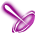

# ダークパワースキル (`DarkPowerSkill`)

12 entries. See ../README.md for how to read these blocks.

### บลัดดี้ไบท์ (BloodBite) · uid 1057

 
**Tree:** ダークパワースキル (`DarkPowerSkill`, tier 1) · **Type:** Attack · **Max Lv:** 1 · **Weapons:** Hand, OneHandSword, TwoHandSword, Bow, Bowgun, Rod, Magictool, Knuckle, Halberd, Katana · **Flags:** NoMarketSearch · **Client class:** `BloodBiteAction`

> ศาสตร์มืดที่ดูดเลือดของศัตรูมาหล่อเลี้ยง
> สร้างความเสียหายให้กับเป้าหมาย
> และดูดซับค่าความเสียหายบางส่วนมาเป็น HP ของตัวเอง
> ปริมาณการฟื้นฟูจะขึ้นอยู่กับเลเวลของตัวเอง

**Damage numbers by level** (gem bonuses assumed 0)

| | Lv1 | Lv2 | Lv3 | Lv4 | Lv5 | Lv6 | Lv7 | Lv8 | Lv9 | Lv10 |
|---|---|---|---|---|---|---|---|---|---|---|
| SkillRate × | 1.1 | 1.2 | 1.3 | 1.4 | 1.5 | 1.6 | 1.7 | 1.8 | 1.9 | 2 |
| Flat dmg + | 100 | 100 | 100 | 100 | 100 | 100 | 100 | 100 | 100 | 100 |

**Role:** attack (deals damage) · heal / recovery

The skill builds one damage template (one hit). For each template the shared engine (`TemplateAssignment`) fills base damage, defence, element, stability and proration; this skill then adds its own terms listed below and `GetDamage()` multiplies them in `CalcStep` order.

Proration uses the **physical-skill proration slot**; Proration changes on the FIRST damaging hit of one cast on each target only; later hits of the same cast read the updated value but do not change it.

**Damage formula for this skill** (per template; `int()` after every multiplier)

- Engine terms (always present): `BaseDamage`, target `Def` (after pierce), element bonus, stability, `ExpRate = p[slot]/100` (proration), type / last-damage / gem multipliers.
- `SkillConstantDamage` adds: `(100)`
- `SkillRate` multiplies by (adds into): `(((((Lv * 10) + 100) + gemCart(1015[4]))) / 100)`

**Mechanics recovered from code**

- **HP recovery cap** (`maxHpRecovery`): `int(((EternalNightmareBuf.GetParam(PlayerStatusBase.get_SkillBufferManager().selfSkillBufList[1064], 0) * ((status.Lv + (status.Lv << 2)) << 1)) * 0.01))`; `((status.Lv + (status.Lv << 2)) << 1)`
- **HP recovered** (`hpRecovery`): `(int((((DarkStingerBuf.GetParam(50) * DarkStingerBuf.GetParam(50)) * status.MaxHp) * 0.01)) + hpRecovery)` _(when IsInstanceOf(actarAction, MobaPlayerActionManager) ne 1 AND UnityEngine.Object.op_Inequality(actarAction))_; `int((((recoveryRate * [PlayerAttackBase.templateToDamageData(this, new SkillActionBase.DamageData, PlayerAttackBase.TemplateAssignment(this, new SkillCalcTemplate, playerAction, mobAction), 1)+0x18]) * 0.01) mi maxHpRecovery ? ((recoveryRate * [PlayerAttackBase.templateToDamageData(this, new SkillActionBase.DamageData, PlayerAttackBase.TemplateAssignment(this, new SkillCalcTemplate, playerAction, mobAction), 1)+0x18]) * 0.01) : maxHpRecovery))`

**Proration:** slot `Skill`, mode `first_hit_per_target`, attack type `Physics`, action id 1057

Recovered formulas (per method)

**`OnInitialize`** (2 paths)

- set `ActionRange` = `MathUtil.DisplayMeterToDistance(4)`
- set `skillRate` = `(((Lv * 10) + 100) + gemCart(1015[4]))`
- set `fixAddDamage` = `100` = 100
- set `recoveryRate` = `((Lv + (Lv << 2)) << 1)` = 10
- set `maxHpRecovery` = `int(((EternalNightmareBuf.GetParam(PlayerStatusBase.get_SkillBufferManager().selfSkillBufList[1064], 0) * ((status.Lv + (status.Lv << 2)) << 1)) * 0.01))`
- set `maxHpRecovery` = `((status.Lv + (status.Lv << 2)) << 1)`

**`InitializeOthers`** (1 path)

- set `Element` = `loopCount`
- set `ActionRange` = `-1` = -1

**`ActionHit`** (5 paths)

- set `hpRecovery` = `(int((((DarkStingerBuf.GetParam(50) * DarkStingerBuf.GetParam(50)) * status.MaxHp) * 0.01)) + hpRecovery)` — when IsInstanceOf(actarAction, MobaPlayerActionManager) ne 1 AND UnityEngine.Object.op_Inequality(actarAction)
- calls `SkillBufferManager.RemoveSelfBuffer` = `RemoveSelfBuffer(1059)` — when IsInstanceOf(actarAction, MobaPlayerActionManager) ne 1 AND UnityEngine.Object.op_Inequality(actarAction)

**`calcPlayerToMobDamage`** (2 paths)

- set `Element` = `PlayerAttackBase.GetWeaponElementType(this, playerAction, mobAction)`
- set `hpRecovery` = `int((((recoveryRate * [PlayerAttackBase.templateToDamageData(this, new SkillActionBase.DamageData, PlayerAttackBase.TemplateAssignment(this, new SkillCalcTemplate, playerAction, mobAction), 1)+0x18]) * 0.01) mi maxHpRecovery ? ((recoveryRate * [PlayerAttackBase.templateToDamageData(this, new SkillActionBase.DamageData, PlayerAttackBase.TemplateAssignment(this, new SkillCalcTemplate, playerAction, mobAction), 1)+0x18]) * 0.01) : maxHpRecovery))`
- template `AddRate[SkillRate]` = `(skillRate / 100)`
- template `AddConstant[SkillConstantDamage]` = `fixAddDamage`
- info `templates` = `1`

---

### แซครีไฟซ์ (Sacrifice) · uid 1058

 
**Tree:** ダークパワースキル (`DarkPowerSkill`, tier 1) · **Type:** Special · **Max Lv:** 1 · **Weapons:** Hand, OneHandSword, TwoHandSword, Bow, Bowgun, Rod, Magictool, Knuckle, Halberd, Katana · **Flags:** NoMarketSearch · **Client class:** `SacrificeAction`

> สาปศัตรูด้วยการเสียสละพลังชีวิตตัวเอง
> ใช้ 10% ของค่า HP สูงสุดเพื่อสร้างความเสียหายพิเศษ
> จะหมดสติในกรณีที่ HP มีไม่เพียงพอ

**Damage numbers by level** (gem bonuses assumed 0)

| | Lv1 | Lv2 | Lv3 | Lv4 | Lv5 | Lv6 | Lv7 | Lv8 | Lv9 | Lv10 |
|---|---|---|---|---|---|---|---|---|---|---|
| SkillRate × | 6 | 7 | 8 | 9 | 10 | 10 | 10 | 10 | 10 | 10 |

**Role:** attack (deals damage) · buff (self)

The skill builds one damage template (one hit). For each template the shared engine (`TemplateAssignment`) fills base damage, defence, element, stability and proration; this skill then adds its own terms listed below and `GetDamage()` multiplies them in `CalcStep` order.

Proration uses the **physical-skill proration slot**; never (IsExpSkill excludes ActionID)

It applies the buff(s) listed under **Buffs**; the buff object keeps its own timer and returns bonus values through `GetParam(SkillBufferId)`.

**Damage formula for this skill** (per template; `int()` after every multiplier)

- Engine terms (always present): `BaseDamage`, target `Def` (after pierce), element bonus, stability, `ExpRate = p[slot]/100` (proration), type / last-damage / gem multipliers.
- `BaseDamage` adds: `int((((10) * status.MaxHp) * 89129))`
- `SkillRate` multiplies by (adds into): `(((((Lv * 100) lo 500 ? (Lv * 100) : 500) + 500)) / 100)`
- `StableRate` multiplies by (adds into): `PlayerAttackBase.CalcStable(SacrificeAction.get_AttackType(), ((EternalNightmareBuf.GetParam(PlayerStatusBase.get_SkillBufferManager().selfSkillBufList[1064], 1) + ((Lv eq 10 ? 45 : 35) + ((Lv hi 5 ? Lv : 5) + ((Lv hi 5 ? Lv : 5) << 2))))), (SkillCalcTemplate.CheckStepResult(PlayerAttackBase.HitReactionAssign(this, new SkillCalcTemplate, playerAction, mobAction), 4) & 1), PlayerActionManagerBase.get_PlayerStatus())`
- `ExpRate` multiplies by (adds into): `((100 - max(target.CutAttack)) / 100)`
- `LastDamageRate` sets: `(1 - MobPropertyLifeReduceDamage.CalcReduceLastDamageRate(TryGetProperties<object>.out2(mobAction, 90, PlayerActionManagerBase.get_PlayerStatus())))`

**Mechanics recovered from code**

- **HP consumed** (`consumptionHp`): `int(((consumptionHpRate * status.MaxHp) * 89129))`

**Proration:** slot `Skill`, mode `never (IsExpSkill excludes ActionID)`, attack type `Physics`, action id 1058

Recovered formulas (per method)

**`OnInitialize`** (2 paths)

- set `ActionRange` = `MathUtil.DisplayMeterToDistance(4)`
- set `skillRate` = `(((Lv * 100) lo 500 ? (Lv * 100) : 500) + 500)` = 600
- set `stable` = `(EternalNightmareBuf.GetParam(PlayerStatusBase.get_SkillBufferManager().selfSkillBufList[1064], 1) + ((Lv eq 10 ? 45 : 35) + ((Lv hi 5 ? Lv : 5) + ((Lv hi 5 ? Lv : 5) << 2))))`
- set `consumptionHpRate` = `10` = 10
- set `stable` = `((Lv eq 10 ? 45 : 35) + ((Lv hi 5 ? Lv : 5) + ((Lv hi 5 ? Lv : 5) << 2)))` = 60

**`ActionStart`** (5 paths)

- set `SkillIndividualFlag` = `1` = 1 — when !UnityEngine.Object.op_Equality(actarAction) AND MathUtil.CheckPercent(((SkillManager.GetSkillLv(PlayerStatusBase.get_SkillManager(), 46, 1) + (SkillManager.GetSkillLv(PlayerStatusBase.get_SkillManager(), 46, 1) << 2)) << 1)) AND SkillManager.GetSkillLv(PlayerStatusBase.get_SkillManager(), 46, 1) ge 1 AND hasGemCart(401)
- calls `MathUtil.CheckPercent` = `CheckPercent()` — when !UnityEngine.Object.op_Equality(actarAction) AND MathUtil.CheckPercent(((SkillManager.GetSkillLv(PlayerStatusBase.get_SkillManager(), 46, 1) + (SkillManager.GetSkillLv(PlayerStatusBase.get_SkillManager(), 46, 1) << 2)) << 1)) AND SkillManager.GetSkillLv(PlayerStatusBase.get_SkillManager(), 46, 1) ge 1 AND hasGemCart(401) OR !MathUtil.CheckPercent(((SkillManager.GetSkillLv(PlayerStatusBase.get_SkillManager(), 46, 1) + (SkillManager.GetSkillLv(PlayerStatusBase.get_SkillManager(), 46, 1) << 2)) << 1)) AND !UnityEngine.Object.op_Equality(actarAction) AND SkillManager.GetSkillLv(PlayerStatusBase.get_SkillManager(), 46, 1) ge 1 AND hasGemCart(401)

**`CheckPayHp`** (11 paths)

- calls `SoulHuntBuf..ctor` = `.ctor(SkillManager.GetSkillLv(PlayerStatusBase.get_SkillManager(), 1063, 1))` — when SkillManager.GetSkillLv(PlayerStatusBase.get_SkillManager(), 1063, 1) ge 1 AND UnityEngine.Object.op_Inequality(actarAction) AND consumptionHp ge 1 AND consumptionHp lt (PlayerStatusBase.get_GameStatus().serverExHp + PlayerStatusBase.get_GameStatus().serverHp) AND hasBuff(1061) OR !hasBuff(1061) AND SkillManager.GetSkillLv(PlayerStatusBase.get_SkillManager(), 1063, 1) ge 1 AND UnityEngine.Object.op_Inequality(actarAction) AND consumptionHp ge 1 AND consumptionHp lt (PlayerStatusBase.get_GameStatus().serverExHp + PlayerStatusBase.get_GameStatus().serverHp)
- calls `SkillBufferManager.AddSelfBuffer` = `AddSelfBuffer(new SoulHuntBuf, 0)` — when SkillManager.GetSkillLv(PlayerStatusBase.get_SkillManager(), 1063, 1) ge 1 AND UnityEngine.Object.op_Inequality(actarAction) AND consumptionHp ge 1 AND consumptionHp lt (PlayerStatusBase.get_GameStatus().serverExHp + PlayerStatusBase.get_GameStatus().serverHp) AND hasBuff(1061) OR !hasBuff(1061) AND SkillManager.GetSkillLv(PlayerStatusBase.get_SkillManager(), 1063, 1) ge 1 AND UnityEngine.Object.op_Inequality(actarAction) AND consumptionHp ge 1 AND consumptionHp lt (PlayerStatusBase.get_GameStatus().serverExHp + PlayerStatusBase.get_GameStatus().serverHp)

**`StrengthPayHp`** (5 paths)

- calls `SkillBufferManager.RemoveSelfBuffer` = `RemoveSelfBuffer(41)` — when !hasBuff(CrtDamageUp) AND CharacterActionManagerBase.AddAbnormalState(UnityEngine.Component.get_gameObject(actarAction), 3, 3, 0, 0, 0, 1) AND SkillIndividualFlag ne 1 AND UnityEngine.Object.op_Inequality(actarAction)

**`InitializeOthers`** (1 path)

- set `Element` = `loopCount`
- set `ActionRange` = `-1` = -1

**`calcPlayerToMobDamage`** (61 paths)

- set `consumptionHp` = `int(((consumptionHpRate * status.MaxHp) * 89129))`
- template `AddConstant[BaseDamage]` = `int(((consumptionHpRate * status.MaxHp) * 89129))`
- template `AddRate[SkillRate]` = `(skillRate / 100)`
- template `AddRate[StableRate]` = `PlayerAttackBase.CalcStable(SacrificeAction.get_AttackType(), stable, (SkillCalcTemplate.CheckStepResult(PlayerAttackBase.HitReactionAssign(this, new SkillCalcTemplate, playerAction, mobAction), 4) & 1), PlayerActionManagerBase.get_PlayerStatus())`
- template `AddRate[ExpRate]` = `((100 - max(target.CutAttack)) / 100)`
- template `SetRate[LastDamageRate]` = `(1 - MobPropertyLifeReduceDamage.CalcReduceLastDamageRate(TryGetProperties<object>.out2(mobAction, 90, PlayerActionManagerBase.get_PlayerStatus())))` — when IsInstanceOf(mobAction, GuildRaidBossMobActionManager) eq 1 AND TryGetProperties<object>.out2(mobAction, 90, PlayerActionManagerBase.get_PlayerStatus()) ne 0 OR CheckDamageLimit.max(this, mobAction) ne -1 AND CheckDamageLimit.min(this, mobAction) ne -1 AND IsInstanceOf(mobAction, GuildRaidBossMobActionManager) eq 1 AND TryGetProperties<object>.out2(mobAction, 90, PlayerActionManagerBase.get_PlayerStatus()) ne 0 OR CheckDamageLimit.max(this, mobAction) eq -1 AND CheckDamageLimit.min(this, mobAction) ne -1 AND IsInstanceOf(mobAction, GuildRaidBossMobActionManager) eq 1 AND TryGetProperties<object>.out2(mobAction, 90, PlayerActionManagerBase.get_PlayerStatus()) ne 0
- template `SetConstant[DamageLimit]` = `CheckPlayerDamageUpLimit.limitDamage(this, playerAction, mobAction)`
- template `AddConstant[MinDamage]` = `CheckDamageLimit.min(this, mobAction)` — when CheckDamageLimit.max(this, mobAction) ne -1 AND CheckDamageLimit.min(this, mobAction) ne -1 AND IsInstanceOf(mobAction, GuildRaidBossMobActionManager) eq 1 OR CheckDamageLimit.max(this, mobAction) eq -1 AND CheckDamageLimit.min(this, mobAction) ne -1 AND IsInstanceOf(mobAction, GuildRaidBossMobActionManager) eq 1 OR CheckDamageLimit.max(this, mobAction) ne -1 AND CheckDamageLimit.min(this, mobAction) ne -1 AND IsInstanceOf(mobAction, GuildRaidBossMobActionManager) ne 1
- template `AddConstant[MaxDamage]` = `CheckDamageLimit.max(this, mobAction)` — when CheckDamageLimit.max(this, mobAction) ne -1 AND CheckDamageLimit.min(this, mobAction) ne -1 AND IsInstanceOf(mobAction, GuildRaidBossMobActionManager) eq 1 OR CheckDamageLimit.max(this, mobAction) ne -1 AND CheckDamageLimit.min(this, mobAction) eq -1 AND IsInstanceOf(mobAction, GuildRaidBossMobActionManager) eq 1 OR CheckDamageLimit.max(this, mobAction) ne -1 AND CheckDamageLimit.min(this, mobAction) ne -1 AND IsInstanceOf(mobAction, GuildRaidBossMobActionManager) ne 1

**`via PlayerAttackBase$$HitReactionAssign`** (3467 paths)

- calls `MathUtil.CheckPercent` = `CheckPercent()` — when !MobActionManagerBase.get_SystemInvincible(mobAction) AND !SkillActionBase.op_Inequality(this) AND ((1 | isCritical) & 1) ne 0 AND MathUtil.CheckPercent(SkillComboState.GetThirdEyeValue(_currentSkillCombo)) AND MobaMode eq 0 AND PlayerAttackBase.CalcHitReaction(this, attackType, playerAction, mobAction) eq 0 AND attackType eq 2 AND comboType eq 3 OR !MathUtil.CheckPercent(SkillComboState.GetThirdEyeValue(_currentSkillCombo)) AND !MobActionManagerBase.get_SystemInvincible(mobAction) AND !SkillActionBase.op_Inequality(this) AND ((1 | isCritical) & 1) ne 0 AND MobaMode eq 0 AND PlayerAttackBase.CalcHitReaction(this, attackType, playerAction, mobAction) eq 0 AND attackType eq 2 AND comboType eq 3 OR !MobActionManagerBase.get_SystemInvincible(mobAction) AND !SkillActionBase.op_Inequality(this) AND ((1 | isCritical) & 1) eq 0 AND MathUtil.CheckPercent(SkillComboState.GetThirdEyeValue(_currentSkillCombo)) AND MobaMode eq 0 AND PlayerAttackBase.CalcHitReaction(this, attackType, playerAction, mobAction) eq 0 AND attackType eq 2 AND comboType eq 3
- template `SetCalcValue[GuardPower]` = `System.Math.Max(0, (25 - MobBuffer.GuardUpBuff.get_GuardUpval(TryGetBuff.buff(MobActionManagerBase.get_BuffManager(mobAction), 4))))` — when !MobActionManagerBase.get_SystemInvincible(mobAction) AND ((1 | isCritical) & 1) ne 0 AND (False & 1) eq 0 AND MobaMode eq 0 AND PlayerAttackBase.CalcHitReaction(this, attackType, playerAction, mobAction) eq 2 AND PlayerAttackBase.CalcHitReaction(this, attackType, playerAction, mobAction) ne 0 AND TryGetBuff.buff(MobActionManagerBase.get_BuffManager(mobAction), 4) ne 0 AND attackType eq 2 AND comboType ne 3 OR !MobActionManagerBase.get_SystemInvincible(mobAction) AND ((1 | isCritical) & 1) eq 0 AND (False & 1) eq 0 AND MobaMode eq 0 AND PlayerAttackBase.CalcHitReaction(this, attackType, playerAction, mobAction) eq 2 AND PlayerAttackBase.CalcHitReaction(this, attackType, playerAction, mobAction) ne 0 AND TryGetBuff.buff(MobActionManagerBase.get_BuffManager(mobAction), 4) ne 0 AND attackType eq 2 AND comboType ne 3 OR !MobActionManagerBase.get_SystemInvincible(mobAction) AND (False & 1) eq 0 AND AbnormalStateManager.Contains(PlayerStatusBase.get_AbnormalStatusManager(), 33) AND MobaMode eq 0 AND PlayerAttackBase.CalcHitReaction(this, attackType, playerAction, mobAction) eq 2 AND PlayerAttackBase.CalcHitReaction(this, attackType, playerAction, mobAction) ne 0 AND TryGetBuff.buff(MobActionManagerBase.get_BuffManager(mobAction), 4) ne 0 AND attackType ne 2 AND comboType ne 3
- template `SetCalcValue[GuardPower]` = `25` — when !MobActionManagerBase.get_SystemInvincible(mobAction) AND ((1 | isCritical) & 1) ne 0 AND (False & 1) eq 0 AND MobaMode eq 0 AND PlayerAttackBase.CalcHitReaction(this, attackType, playerAction, mobAction) eq 2 AND PlayerAttackBase.CalcHitReaction(this, attackType, playerAction, mobAction) ne 0 AND attackType eq 2 AND comboType ne 3 OR !MobActionManagerBase.get_SystemInvincible(mobAction) AND ((1 | isCritical) & 1) eq 0 AND (False & 1) eq 0 AND MobaMode eq 0 AND PlayerAttackBase.CalcHitReaction(this, attackType, playerAction, mobAction) eq 2 AND PlayerAttackBase.CalcHitReaction(this, attackType, playerAction, mobAction) ne 0 AND attackType eq 2 AND comboType ne 3 OR !MobActionManagerBase.get_SystemInvincible(mobAction) AND (False & 1) eq 0 AND AbnormalStateManager.Contains(PlayerStatusBase.get_AbnormalStatusManager(), 33) AND MobaMode eq 0 AND PlayerAttackBase.CalcHitReaction(this, attackType, playerAction, mobAction) eq 2 AND PlayerAttackBase.CalcHitReaction(this, attackType, playerAction, mobAction) ne 0 AND attackType ne 2 AND comboType ne 3

**Buffs**

**Buff `SoulHuntBuf`**
**Buff `CountBufferBase`**
- Attached to this skill via `caller2:SoulHuntBuf$$.ctor<-SacrificeAction$$CheckPayHp` (no direct constructor call in the skill's own code).
- Buff hook methods: `Next`, `NextSkip`, `Prev`, `PrevSkip`, `get_Count`, `get_Max`, `get_Peak`, `set_Count`, `set_Max`
- `Count` = `(0)`
- Buff fields set in the constructor (all recovered):
  - `Count` = `0`
  - `Max` = `max`
- Hook `set_Count`: `Count`=value
- Hook `set_Max`: `Max`=value
- Hook `Next`: `Count`=System.Math.Min((Count + 1), Max)
- Hook `NextSkip`: `Count`=System.Math.Min((Count + count), Max)
- Hook `Prev`: `Count`=System.Math.Max((Count - 1), 0)
- Hook `PrevSkip`: `Count`=System.Math.Max((Count - count), 0)

---

### เนตรมารข่มขวัญ (IntimidatingEvilEye) · uid 1065

 
**Tree:** ダークパワースキル (`DarkPowerSkill`, tier 1) · **Type:** Attack · **Max Lv:** 1 · **Weapons:** Hand, OneHandSword, TwoHandSword, Bow, Bowgun, Rod, Magictool, Knuckle, Halberd, Katana · **Flags:** NoMarketSearch · **Client class:** `IntimidatingEvilEyeAction`

> จ้องมองด้วยสายตาอันเฉียบคมเพื่อข่มขวัญศัตรูให้หวาดกลัว
> ยิ่งเลเวลของเป้าหมายต่ำกว่ายิ่งมีโอกาสมากขึ้นที่จะทำให้ติดผงะ
> ถ้าข่มขวัญไม่สำเร็จจะติดเชื่องช้าแทน
> ไม่สามารถคาดหวังความเสียหายจากการโจมตีนี้ได้

In-game level notes

- Lv255: *นำเลเวลการเรียนรู้ของสกิลอีเทอนอลไนท์แมร์ มาบวกเพิ่มในอัตราติดผงะ

**Damage numbers by level** (gem bonuses assumed 0)

| | Lv1 | Lv2 | Lv3 | Lv4 | Lv5 | Lv6 | Lv7 | Lv8 | Lv9 | Lv10 |
|---|---|---|---|---|---|---|---|---|---|---|
| SkillRate × | 0.01 | 0.02 | 0.03 | 0.04 | 0.05 | 0.06 | 0.07 | 0.08 | 0.09 | 0.1 |
| Flat dmg + | 20 | 40 | 60 | 80 | 100 | 120 | 140 | 160 | 180 | 200 |

**Role:** attack (deals damage) · applies status ailment

The skill builds one damage template (one hit). For each template the shared engine (`TemplateAssignment`) fills base damage, defence, element, stability and proration; this skill then adds its own terms listed below and `GetDamage()` multiplies them in `CalcStep` order.

Proration uses the **magic proration slot**; Proration changes on the FIRST damaging hit of one cast on each target only; later hits of the same cast read the updated value but do not change it.

**Damage formula for this skill** (per template; `int()` after every multiplier)

- Engine terms (always present): `BaseDamage`, target `Def` (after pierce), element bonus, stability, `ExpRate = p[slot]/100` (proration), type / last-damage / gem multipliers.
- `SkillConstantDamage` adds: `(((Lv + (Lv << 2)) << 2))`
- `SkillRate` multiplies by (adds into): `((Lv) / 100)`

**Mechanics recovered from code**

- **Slow chance (%)** (`slowPercent`): `100` = 100
- **Flinch chance (%)** (`flinchPercent`): `(max(((max(SkillManager.GetSkillLv(PlayerStatusBase.get_SkillManager(), 1064, 1), 0) + status.Lv) - target.Level), 0) * Lv)` _(when UnityEngine.Object.op_Inequality(actarAction))_

**Proration:** slot `Magic`, mode `first_hit_per_target`, attack type `Magic`, action id 1065

Recovered formulas (per method)

**`OnInitialize`** (1 path)

- set `ActionRange` = `MathUtil.DisplayMeterToDistance(12)`
- set `Element` = `6` = 6
- set `slowPercent` = `100` = 100
- set `skillRate` = `Lv` = 1
- set `constantDamage` = `((Lv + (Lv << 2)) << 2)` = 20

**`ActionPreparation`** (2 paths)

- set `flinchPercent` = `(max(((max(SkillManager.GetSkillLv(PlayerStatusBase.get_SkillManager(), 1064, 1), 0) + status.Lv) - target.Level), 0) * Lv)` — when UnityEngine.Object.op_Inequality(actarAction)

**`calcPlayerToMobDamage`** (14 paths)

- template `AddRate[SkillRate]` = `(skillRate / 100)`
- template `AddConstant[SkillConstantDamage]` = `constantDamage`
- calls `PlayerAttackBase.checkAbnormalPercent` = `checkAbnormalPercent(1, flinchPercent, playerAction)` — when !AbnormalStateManager.ContainsAbnormal(MobActionManagerBase.get_AbnormalStateManager(mobAction), 1) AND PlayerAttackBase.checkAbnormalPercent(this, 1, flinchPercent, playerAction) OR !AbnormalStateManager.ContainsAbnormal(MobActionManagerBase.get_AbnormalStateManager(mobAction), 1) AND !PlayerAttackBase.checkAbnormalPercent(this, 1, flinchPercent, playerAction) AND PlayerAttackBase.checkAbnormalPercent(this, 11, slowPercent, playerAction) OR !AbnormalStateManager.ContainsAbnormal(MobActionManagerBase.get_AbnormalStateManager(mobAction), 1) AND !PlayerAttackBase.checkAbnormalPercent(this, 1, flinchPercent, playerAction) AND !PlayerAttackBase.checkAbnormalPercent(this, 11, slowPercent, playerAction)
- calls `SkillDamageData.SetAbnormalType` = `SetAbnormalType(1, 0)` — when !AbnormalStateManager.ContainsAbnormal(MobActionManagerBase.get_AbnormalStateManager(mobAction), 1) AND PlayerAttackBase.checkAbnormalPercent(this, 1, flinchPercent, playerAction)
- info `templates` = `1`
- calls `PlayerAttackBase.checkAbnormalPercent` = `checkAbnormalPercent(11, slowPercent, playerAction)` — when AbnormalStateManager.ContainsAbnormal(MobActionManagerBase.get_AbnormalStateManager(mobAction), 1) AND PlayerAttackBase.checkAbnormalPercent(this, 11, slowPercent, playerAction) OR !PlayerAttackBase.checkAbnormalPercent(this, 11, slowPercent, playerAction) AND AbnormalStateManager.ContainsAbnormal(MobActionManagerBase.get_AbnormalStateManager(mobAction), 1) OR !AbnormalStateManager.ContainsAbnormal(MobActionManagerBase.get_AbnormalStateManager(mobAction), 1) AND !PlayerAttackBase.checkAbnormalPercent(this, 1, flinchPercent, playerAction) AND PlayerAttackBase.checkAbnormalPercent(this, 11, slowPercent, playerAction)
- calls `SkillDamageData.SetAbnormalType` = `SetAbnormalType(11, 0)` — when AbnormalStateManager.ContainsAbnormal(MobActionManagerBase.get_AbnormalStateManager(mobAction), 1) AND PlayerAttackBase.checkAbnormalPercent(this, 11, slowPercent, playerAction) OR !AbnormalStateManager.ContainsAbnormal(MobActionManagerBase.get_AbnormalStateManager(mobAction), 1) AND !PlayerAttackBase.checkAbnormalPercent(this, 1, flinchPercent, playerAction) AND PlayerAttackBase.checkAbnormalPercent(this, 11, slowPercent, playerAction)

**`InitializeOthers`** (1 path)

- set `ActionRange` = `-1` = -1
- set `Element` = `loopCount`

---

### ดาร์คสตริงเกอร์ (DarkStinger) · uid 1059

 
**Tree:** ダークパワースキル (`DarkPowerSkill`, tier 2) · **Type:** Attack · **Max Lv:** 60 · **Weapons:** Hand, OneHandSword, TwoHandSword, Bow, Bowgun, Rod, Magictool, Knuckle, Halberd, Katana · **Requires:** บลัดดี้ไบท์ · **Flags:** NoMarketSearch · **Client class:** `DarkStingerAction`

> ระเบิดพลังศาสตร์มืดที่อยู่ในแขนขวา
> ใช้ 10% ของ HP ปัจจุบันเพื่อสร้างความเสียหาย
> ค่า HP สูงสุดของตัวเองจะลดต่ำลง
> เป็นเวลา 10 วินาที (ไม่เกิน 5 ครั้ง)
> ถ้าใช้บลัดดี้ไบท์ระหว่างแสดงผล
> ผลเสียจะถูกลบออกไปและเพิ่มการฟื้นฟู HP

**Formulas that depend on live stats (not tabulated)**

- SkillRate × `(((((Lv * 30) + 100) + (baseVIT + baseSTR))) / 100)`
- SkillRate × `(((((Lv * 30) + 100) + (baseVIT + baseSTR))) / 100)` — !PlayerAttackBase.IsBlank(this) AND SkillManager.GetSkillLv(PlayerStatusBase.get_SkillManager(), 1063, 1) ge 1 AND UnityEngine.Object.op_Inequality(actarAction) AND fsqrt((((UnityEngine.Transform.get_position(UnityEngine.GameObject.get_transform(target)).z - UnityEngine.Transform.get_position(UnityEngine.GameObject.get_transform(UnityEngine.Component.get_gameObject(actarAction))).z) * (UnityEngine.Transform.get_position(UnityEngine.GameObject.get_transform(target)).z - UnityEngine.Transform.get_position(UnityEngine.GameObject.get_transform(UnityEngine.Component.get_gameObject(actarAction))).z)) + (((UnityEngine.Transform.get_position(UnityEngine.GameObject.get_transform(target)).x - UnityEngine.Transform.get_position(UnityEngine.GameObject.get_transform(UnityEngine.Component.get_gameObject(actarAction))).x) * (UnityEngine.Transform.get_position(UnityEngine.GameObject.get_transform(target)).x - UnityEngine.Transform.get_position(UnityEngine.GameObject.get_transform(UnityEngine.Component.get_gameObject(actarAction))).x)) + ((UnityEngine.Transform.get_position(UnityEngine.GameObject.get_transform(target)).y - UnityEngine.Transform.get_position(UnityEngine.GameObject.get_transform(UnityEngine.Component.get_gameObject(actarAction))).y) * (UnityEngine.Transform.get_position(UnityEngine.GameObject.get_transform(target)).y - UnityEngine.Transform.get_position(UnityEngine.GameObject.get_transform(UnityEngine.Component.get_gameObject(actarAction))).y))))) gt 1e-05 AND int(((consumptionHpRate * PlayerStatusBase.get_GameStatus().serverHp) / 100)) ge 1001 OR !PlayerAttackBase.IsBlank(this) AND SkillManager.GetSkillLv(PlayerStatusBase.get_SkillManager(), 1063, 1) lt 1 AND UnityEngine.Object.op_Inequality(actarAction) AND fsqrt((((UnityEngine.Transform.get_position(UnityEngine.GameObject.get_transform(target)).z - UnityEngine.Transform.get_position(UnityEngine.GameObject.get_transform(UnityEngine.Component.get_gameObject(actarAction))).z) * (UnityEngine.Transform.get_position(UnityEngine.GameObject.get_transform(target)).z - UnityEngine.Transform.get_position(UnityEngine.GameObject.get_transform(UnityEngine.Component.get_gameObject(actarAction))).z)) + (((UnityEngine.Transform.get_position(UnityEngine.GameObject.get_transform(target)).x - UnityEngine.Transform.get_position(UnityEngine.GameObject.get_transform(UnityEngine.Component.get_gameObject(actarAction))).x) * (UnityEngine.Transform.get_position(UnityEngine.GameObject.get_transform(target)).x - UnityEngine.Transform.get_position(UnityEngine.GameObject.get_transform(UnityEngine.Component.get_gameObject(actarAction))).x)) + ((UnityEngine.Transform.get_position(UnityEngine.GameObject.get_transform(target)).y - UnityEngine.Transform.get_position(UnityEngine.GameObject.get_transform(UnityEngine.Component.get_gameObject(actarAction))).y) * (UnityEngine.Transform.get_position(UnityEngine.GameObject.get_transform(target)).y - UnityEngine.Transform.get_position(UnityEngine.GameObject.get_transform(UnityEngine.Component.get_gameObject(actarAction))).y))))) gt 1e-05 AND int(((consumptionHpRate * PlayerStatusBase.get_GameStatus().serverHp) / 100)) ge 1001 OR !PlayerAttackBase.IsBlank(this) AND SkillManager.GetSkillLv(PlayerStatusBase.get_SkillManager(), 1063, 1) ge 1 AND UnityEngine.Object.op_Inequality(actarAction) AND fsqrt((((UnityEngine.Transform.get_position(UnityEngine.GameObject.get_transform(target)).z - UnityEngine.Transform.get_position(UnityEngine.GameObject.get_transform(UnityEngine.Component.get_gameObject(actarAction))).z) * (UnityEngine.Transform.get_position(UnityEngine.GameObject.get_transform(target)).z - UnityEngine.Transform.get_position(UnityEngine.GameObject.get_transform(UnityEngine.Component.get_gameObject(actarAction))).z)) + (((UnityEngine.Transform.get_position(UnityEngine.GameObject.get_transform(target)).x - UnityEngine.Transform.get_position(UnityEngine.GameObject.get_transform(UnityEngine.Component.get_gameObject(actarAction))).x) * (UnityEngine.Transform.get_position(UnityEngine.GameObject.get_transform(target)).x - UnityEngine.Transform.get_position(UnityEngine.GameObject.get_transform(UnityEngine.Component.get_gameObject(actarAction))).x)) + ((UnityEngine.Transform.get_position(UnityEngine.GameObject.get_transform(target)).y - UnityEngine.Transform.get_position(UnityEngine.GameObject.get_transform(UnityEngine.Component.get_gameObject(actarAction))).y) * (UnityEngine.Transform.get_position(UnityEngine.GameObject.get_transform(target)).y - UnityEngine.Transform.get_position(UnityEngine.GameObject.get_transform(UnityEngine.Component.get_gameObject(actarAction))).y))))) le 1e-05 AND int(((consumptionHpRate * PlayerStatusBase.get_GameStatus().serverHp) / 100)) ge 1001
- SkillRate × `(((((Lv * 30) + 100) + (baseVIT + baseSTR))) / 100)` — !PlayerAttackBase.IsBlank(this) AND SkillManager.GetSkillLv(PlayerStatusBase.get_SkillManager(), 1063, 1) ge 1 AND UnityEngine.Object.op_Inequality(actarAction) AND fsqrt((((UnityEngine.Transform.get_position(UnityEngine.GameObject.get_transform(target)).z - UnityEngine.Transform.get_position(UnityEngine.GameObject.get_transform(UnityEngine.Component.get_gameObject(actarAction))).z) * (UnityEngine.Transform.get_position(UnityEngine.GameObject.get_transform(target)).z - UnityEngine.Transform.get_position(UnityEngine.GameObject.get_transform(UnityEngine.Component.get_gameObject(actarAction))).z)) + (((UnityEngine.Transform.get_position(UnityEngine.GameObject.get_transform(target)).x - UnityEngine.Transform.get_position(UnityEngine.GameObject.get_transform(UnityEngine.Component.get_gameObject(actarAction))).x) * (UnityEngine.Transform.get_position(UnityEngine.GameObject.get_transform(target)).x - UnityEngine.Transform.get_position(UnityEngine.GameObject.get_transform(UnityEngine.Component.get_gameObject(actarAction))).x)) + ((UnityEngine.Transform.get_position(UnityEngine.GameObject.get_transform(target)).y - UnityEngine.Transform.get_position(UnityEngine.GameObject.get_transform(UnityEngine.Component.get_gameObject(actarAction))).y) * (UnityEngine.Transform.get_position(UnityEngine.GameObject.get_transform(target)).y - UnityEngine.Transform.get_position(UnityEngine.GameObject.get_transform(UnityEngine.Component.get_gameObject(actarAction))).y))))) gt 1e-05 AND int(((consumptionHpRate * PlayerStatusBase.get_GameStatus().serverHp) / 100)) ge 1001 OR !PlayerAttackBase.IsBlank(this) AND SkillManager.GetSkillLv(PlayerStatusBase.get_SkillManager(), 1063, 1) lt 1 AND UnityEngine.Object.op_Inequality(actarAction) AND fsqrt((((UnityEngine.Transform.get_position(UnityEngine.GameObject.get_transform(target)).z - UnityEngine.Transform.get_position(UnityEngine.GameObject.get_transform(UnityEngine.Component.get_gameObject(actarAction))).z) * (UnityEngine.Transform.get_position(UnityEngine.GameObject.get_transform(target)).z - UnityEngine.Transform.get_position(UnityEngine.GameObject.get_transform(UnityEngine.Component.get_gameObject(actarAction))).z)) + (((UnityEngine.Transform.get_position(UnityEngine.GameObject.get_transform(target)).x - UnityEngine.Transform.get_position(UnityEngine.GameObject.get_transform(UnityEngine.Component.get_gameObject(actarAction))).x) * (UnityEngine.Transform.get_position(UnityEngine.GameObject.get_transform(target)).x - UnityEngine.Transform.get_position(UnityEngine.GameObject.get_transform(UnityEngine.Component.get_gameObject(actarAction))).x)) + ((UnityEngine.Transform.get_position(UnityEngine.GameObject.get_transform(target)).y - UnityEngine.Transform.get_position(UnityEngine.GameObject.get_transform(UnityEngine.Component.get_gameObject(actarAction))).y) * (UnityEngine.Transform.get_position(UnityEngine.GameObject.get_transform(target)).y - UnityEngine.Transform.get_position(UnityEngine.GameObject.get_transform(UnityEngine.Component.get_gameObject(actarAction))).y))))) gt 1e-05 AND int(((consumptionHpRate * PlayerStatusBase.get_GameStatus().serverHp) / 100)) ge 1001 OR !PlayerAttackBase.IsBlank(this) AND SkillManager.GetSkillLv(PlayerStatusBase.get_SkillManager(), 1063, 1) ge 1 AND UnityEngine.Object.op_Inequality(actarAction) AND fsqrt((((UnityEngine.Transform.get_position(UnityEngine.GameObject.get_transform(target)).z - UnityEngine.Transform.get_position(UnityEngine.GameObject.get_transform(UnityEngine.Component.get_gameObject(actarAction))).z) * (UnityEngine.Transform.get_position(UnityEngine.GameObject.get_transform(target)).z - UnityEngine.Transform.get_position(UnityEngine.GameObject.get_transform(UnityEngine.Component.get_gameObject(actarAction))).z)) + (((UnityEngine.Transform.get_position(UnityEngine.GameObject.get_transform(target)).x - UnityEngine.Transform.get_position(UnityEngine.GameObject.get_transform(UnityEngine.Component.get_gameObject(actarAction))).x) * (UnityEngine.Transform.get_position(UnityEngine.GameObject.get_transform(target)).x - UnityEngine.Transform.get_position(UnityEngine.GameObject.get_transform(UnityEngine.Component.get_gameObject(actarAction))).x)) + ((UnityEngine.Transform.get_position(UnityEngine.GameObject.get_transform(target)).y - UnityEngine.Transform.get_position(UnityEngine.GameObject.get_transform(UnityEngine.Component.get_gameObject(actarAction))).y) * (UnityEngine.Transform.get_position(UnityEngine.GameObject.get_transform(target)).y - UnityEngine.Transform.get_position(UnityEngine.GameObject.get_transform(UnityEngine.Component.get_gameObject(actarAction))).y))))) le 1e-05 AND int(((consumptionHpRate * PlayerStatusBase.get_GameStatus().serverHp) / 100)) ge 1001
- Flat dmg + `((int((((10) * PlayerStatusBase.get_GameStatus().serverHp) / 100)) lt 1000 ? int((((10) * PlayerStatusBase.get_GameStatus().serverHp) / 100)) : 1000))`

**Role:** attack (deals damage) · buff (self)

The skill builds one damage template (one hit). For each template the shared engine (`TemplateAssignment`) fills base damage, defence, element, stability and proration; this skill then adds its own terms listed below and `GetDamage()` multiplies them in `CalcStep` order.

Proration uses the **physical-skill proration slot**; Proration changes on the FIRST damaging hit of one cast on each target only; later hits of the same cast read the updated value but do not change it.

It applies the buff(s) listed under **Buffs**; the buff object keeps its own timer and returns bonus values through `GetParam(SkillBufferId)`.

**Damage formula for this skill** (per template; `int()` after every multiplier)

- Engine terms (always present): `BaseDamage`, target `Def` (after pierce), element bonus, stability, `ExpRate = p[slot]/100` (proration), type / last-damage / gem multipliers.
- `SkillConstantDamage` adds: `((int((((10) * PlayerStatusBase.get_GameStatus().serverHp) / 100)) lt 1000 ? int((((10) * PlayerStatusBase.get_GameStatus().serverHp) / 100)) : 1000))`
- `SkillRate` multiplies by (adds into): `(((((Lv * 30) + 100) + (baseVIT + baseSTR))) / 100)`

**Proration:** slot `Skill`, mode `first_hit_per_target`, attack type `Physics`, action id 1059

Recovered formulas (per method)

**`OnInitialize`** (1 path)

- set `Element` = `6` = 6
- set `ActionRange` = `MathUtil.DisplayMeterToDistance(8)`
- set `skillRate` = `(((Lv * 30) + 100) + (baseVIT + baseSTR))`
- set `consumptionHpRate` = `10` = 10

**`ActionStart`** (42 paths)

- set `attackPos.y` = `UnityEngine.Transform.get_position(UnityEngine.GameObject.get_transform(UnityEngine.Component.get_gameObject(actarAction))).y` — when !PlayerAttackBase.IsBlank(this) AND UnityEngine.Object.op_Inequality(actarAction) AND fsqrt((((UnityEngine.Transform.get_position(UnityEngine.GameObject.get_transform(target)).z - UnityEngine.Transform.get_position(UnityEngine.GameObject.get_transform(UnityEngine.Component.get_gameObject(actarAction))).z) * (UnityEngine.Transform.get_position(UnityEngine.GameObject.get_transform(target)).z - UnityEngine.Transform.get_position(UnityEngine.GameObject.get_transform(UnityEngine.Component.get_gameObject(actarAction))).z)) + (((UnityEngine.Transform.get_position(UnityEngine.GameObject.get_transform(target)).x - UnityEngine.Transform.get_position(UnityEngine.GameObject.get_transform(UnityEngine.Component.get_gameObject(actarAction))).x) * (UnityEngine.Transform.get_position(UnityEngine.GameObject.get_transform(target)).x - UnityEngine.Transform.get_position(UnityEngine.GameObject.get_transform(UnityEngine.Component.get_gameObject(actarAction))).x)) + ((UnityEngine.Transform.get_position(UnityEngine.GameObject.get_transform(target)).y - UnityEngine.Transform.get_position(UnityEngine.GameObject.get_transform(UnityEngine.Component.get_gameObject(actarAction))).y) * (UnityEngine.Transform.get_position(UnityEngine.GameObject.get_transform(target)).y - UnityEngine.Transform.get_position(UnityEngine.GameObject.get_transform(UnityEngine.Component.get_gameObject(actarAction))).y))))) gt 1e-05 AND int(((consumptionHpRate * PlayerStatusBase.get_GameStatus().serverHp) / 100)) lt 1 AND int(((consumptionHpRate * PlayerStatusBase.get_GameStatus().serverHp) / 100)) lt 1001 OR !PlayerAttackBase.IsBlank(this) AND SkillManager.GetSkillLv(PlayerStatusBase.get_SkillManager(), 1063, 1) ge 1 AND UnityEngine.Object.op_Inequality(actarAction) AND fsqrt((((UnityEngine.Transform.get_position(UnityEngine.GameObject.get_transform(target)).z - UnityEngine.Transform.get_position(UnityEngine.GameObject.get_transform(UnityEngine.Component.get_gameObject(actarAction))).z) * (UnityEngine.Transform.get_position(UnityEngine.GameObject.get_transform(target)).z - UnityEngine.Transform.get_position(UnityEngine.GameObject.get_transform(UnityEngine.Component.get_gameObject(actarAction))).z)) + (((UnityEngine.Transform.get_position(UnityEngine.GameObject.get_transform(target)).x - UnityEngine.Transform.get_position(UnityEngine.GameObject.get_transform(UnityEngine.Component.get_gameObject(actarAction))).x) * (UnityEngine.Transform.get_position(UnityEngine.GameObject.get_transform(target)).x - UnityEngine.Transform.get_position(UnityEngine.GameObject.get_transform(UnityEngine.Component.get_gameObject(actarAction))).x)) + ((UnityEngine.Transform.get_position(UnityEngine.GameObject.get_transform(target)).y - UnityEngine.Transform.get_position(UnityEngine.GameObject.get_transform(UnityEngine.Component.get_gameObject(actarAction))).y) * (UnityEngine.Transform.get_position(UnityEngine.GameObject.get_transform(target)).y - UnityEngine.Transform.get_position(UnityEngine.GameObject.get_transform(UnityEngine.Component.get_gameObject(actarAction))).y))))) gt 1e-05 AND int(((consumptionHpRate * PlayerStatusBase.get_GameStatus().serverHp) / 100)) ge 1001 OR !PlayerAttackBase.IsBlank(this) AND SkillManager.GetSkillLv(PlayerStatusBase.get_SkillManager(), 1063, 1) lt 1 AND UnityEngine.Object.op_Inequality(actarAction) AND fsqrt((((UnityEngine.Transform.get_position(UnityEngine.GameObject.get_transform(target)).z - UnityEngine.Transform.get_position(UnityEngine.GameObject.get_transform(UnityEngine.Component.get_gameObject(actarAction))).z) * (UnityEngine.Transform.get_position(UnityEngine.GameObject.get_transform(target)).z - UnityEngine.Transform.get_position(UnityEngine.GameObject.get_transform(UnityEngine.Component.get_gameObject(actarAction))).z)) + (((UnityEngine.Transform.get_position(UnityEngine.GameObject.get_transform(target)).x - UnityEngine.Transform.get_position(UnityEngine.GameObject.get_transform(UnityEngine.Component.get_gameObject(actarAction))).x) * (UnityEngine.Transform.get_position(UnityEngine.GameObject.get_transform(target)).x - UnityEngine.Transform.get_position(UnityEngine.GameObject.get_transform(UnityEngine.Component.get_gameObject(actarAction))).x)) + ((UnityEngine.Transform.get_position(UnityEngine.GameObject.get_transform(target)).y - UnityEngine.Transform.get_position(UnityEngine.GameObject.get_transform(UnityEngine.Component.get_gameObject(actarAction))).y) * (UnityEngine.Transform.get_position(UnityEngine.GameObject.get_transform(target)).y - UnityEngine.Transform.get_position(UnityEngine.GameObject.get_transform(UnityEngine.Component.get_gameObject(actarAction))).y))))) gt 1e-05 AND int(((consumptionHpRate * PlayerStatusBase.get_GameStatus().serverHp) / 100)) ge 1001
- set `attackPos.z` = `UnityEngine.Transform.get_position(UnityEngine.GameObject.get_transform(UnityEngine.Component.get_gameObject(actarAction))).z` — when !PlayerAttackBase.IsBlank(this) AND UnityEngine.Object.op_Inequality(actarAction) AND fsqrt((((UnityEngine.Transform.get_position(UnityEngine.GameObject.get_transform(target)).z - UnityEngine.Transform.get_position(UnityEngine.GameObject.get_transform(UnityEngine.Component.get_gameObject(actarAction))).z) * (UnityEngine.Transform.get_position(UnityEngine.GameObject.get_transform(target)).z - UnityEngine.Transform.get_position(UnityEngine.GameObject.get_transform(UnityEngine.Component.get_gameObject(actarAction))).z)) + (((UnityEngine.Transform.get_position(UnityEngine.GameObject.get_transform(target)).x - UnityEngine.Transform.get_position(UnityEngine.GameObject.get_transform(UnityEngine.Component.get_gameObject(actarAction))).x) * (UnityEngine.Transform.get_position(UnityEngine.GameObject.get_transform(target)).x - UnityEngine.Transform.get_position(UnityEngine.GameObject.get_transform(UnityEngine.Component.get_gameObject(actarAction))).x)) + ((UnityEngine.Transform.get_position(UnityEngine.GameObject.get_transform(target)).y - UnityEngine.Transform.get_position(UnityEngine.GameObject.get_transform(UnityEngine.Component.get_gameObject(actarAction))).y) * (UnityEngine.Transform.get_position(UnityEngine.GameObject.get_transform(target)).y - UnityEngine.Transform.get_position(UnityEngine.GameObject.get_transform(UnityEngine.Component.get_gameObject(actarAction))).y))))) gt 1e-05 AND int(((consumptionHpRate * PlayerStatusBase.get_GameStatus().serverHp) / 100)) lt 1 AND int(((consumptionHpRate * PlayerStatusBase.get_GameStatus().serverHp) / 100)) lt 1001 OR !PlayerAttackBase.IsBlank(this) AND SkillManager.GetSkillLv(PlayerStatusBase.get_SkillManager(), 1063, 1) ge 1 AND UnityEngine.Object.op_Inequality(actarAction) AND fsqrt((((UnityEngine.Transform.get_position(UnityEngine.GameObject.get_transform(target)).z - UnityEngine.Transform.get_position(UnityEngine.GameObject.get_transform(UnityEngine.Component.get_gameObject(actarAction))).z) * (UnityEngine.Transform.get_position(UnityEngine.GameObject.get_transform(target)).z - UnityEngine.Transform.get_position(UnityEngine.GameObject.get_transform(UnityEngine.Component.get_gameObject(actarAction))).z)) + (((UnityEngine.Transform.get_position(UnityEngine.GameObject.get_transform(target)).x - UnityEngine.Transform.get_position(UnityEngine.GameObject.get_transform(UnityEngine.Component.get_gameObject(actarAction))).x) * (UnityEngine.Transform.get_position(UnityEngine.GameObject.get_transform(target)).x - UnityEngine.Transform.get_position(UnityEngine.GameObject.get_transform(UnityEngine.Component.get_gameObject(actarAction))).x)) + ((UnityEngine.Transform.get_position(UnityEngine.GameObject.get_transform(target)).y - UnityEngine.Transform.get_position(UnityEngine.GameObject.get_transform(UnityEngine.Component.get_gameObject(actarAction))).y) * (UnityEngine.Transform.get_position(UnityEngine.GameObject.get_transform(target)).y - UnityEngine.Transform.get_position(UnityEngine.GameObject.get_transform(UnityEngine.Component.get_gameObject(actarAction))).y))))) gt 1e-05 AND int(((consumptionHpRate * PlayerStatusBase.get_GameStatus().serverHp) / 100)) ge 1001 OR !PlayerAttackBase.IsBlank(this) AND SkillManager.GetSkillLv(PlayerStatusBase.get_SkillManager(), 1063, 1) lt 1 AND UnityEngine.Object.op_Inequality(actarAction) AND fsqrt((((UnityEngine.Transform.get_position(UnityEngine.GameObject.get_transform(target)).z - UnityEngine.Transform.get_position(UnityEngine.GameObject.get_transform(UnityEngine.Component.get_gameObject(actarAction))).z) * (UnityEngine.Transform.get_position(UnityEngine.GameObject.get_transform(target)).z - UnityEngine.Transform.get_position(UnityEngine.GameObject.get_transform(UnityEngine.Component.get_gameObject(actarAction))).z)) + (((UnityEngine.Transform.get_position(UnityEngine.GameObject.get_transform(target)).x - UnityEngine.Transform.get_position(UnityEngine.GameObject.get_transform(UnityEngine.Component.get_gameObject(actarAction))).x) * (UnityEngine.Transform.get_position(UnityEngine.GameObject.get_transform(target)).x - UnityEngine.Transform.get_position(UnityEngine.GameObject.get_transform(UnityEngine.Component.get_gameObject(actarAction))).x)) + ((UnityEngine.Transform.get_position(UnityEngine.GameObject.get_transform(target)).y - UnityEngine.Transform.get_position(UnityEngine.GameObject.get_transform(UnityEngine.Component.get_gameObject(actarAction))).y) * (UnityEngine.Transform.get_position(UnityEngine.GameObject.get_transform(target)).y - UnityEngine.Transform.get_position(UnityEngine.GameObject.get_transform(UnityEngine.Component.get_gameObject(actarAction))).y))))) gt 1e-05 AND int(((consumptionHpRate * PlayerStatusBase.get_GameStatus().serverHp) / 100)) ge 1001
- set `attackDir` = `((UnityEngine.Transform.get_position(UnityEngine.GameObject.get_transform(target)).x - UnityEngine.Transform.get_position(UnityEngine.GameObject.get_transform(UnityEngine.Component.get_gameObject(actarAction))).x) / fsqrt((((UnityEngine.Transform.get_position(UnityEngine.GameObject.get_transform(target)).z - UnityEngine.Transform.get_position(UnityEngine.GameObject.get_transform(UnityEngine.Component.get_gameObject(actarAction))).z) * (UnityEngine.Transform.get_position(UnityEngine.GameObject.get_transform(target)).z - UnityEngine.Transform.get_position(UnityEngine.GameObject.get_transform(UnityEngine.Component.get_gameObject(actarAction))).z)) + (((UnityEngine.Transform.get_position(UnityEngine.GameObject.get_transform(target)).x - UnityEngine.Transform.get_position(UnityEngine.GameObject.get_transform(UnityEngine.Component.get_gameObject(actarAction))).x) * (UnityEngine.Transform.get_position(UnityEngine.GameObject.get_transform(target)).x - UnityEngine.Transform.get_position(UnityEngine.GameObject.get_transform(UnityEngine.Component.get_gameObject(actarAction))).x)) + ((UnityEngine.Transform.get_position(UnityEngine.GameObject.get_transform(target)).y - UnityEngine.Transform.get_position(UnityEngine.GameObject.get_transform(UnityEngine.Component.get_gameObject(actarAction))).y) * (UnityEngine.Transform.get_position(UnityEngine.GameObject.get_transform(target)).y - UnityEngine.Transform.get_position(UnityEngine.GameObject.get_transform(UnityEngine.Component.get_gameObject(actarAction))).y))))))` — when !PlayerAttackBase.IsBlank(this) AND UnityEngine.Object.op_Inequality(actarAction) AND fsqrt((((UnityEngine.Transform.get_position(UnityEngine.GameObject.get_transform(target)).z - UnityEngine.Transform.get_position(UnityEngine.GameObject.get_transform(UnityEngine.Component.get_gameObject(actarAction))).z) * (UnityEngine.Transform.get_position(UnityEngine.GameObject.get_transform(target)).z - UnityEngine.Transform.get_position(UnityEngine.GameObject.get_transform(UnityEngine.Component.get_gameObject(actarAction))).z)) + (((UnityEngine.Transform.get_position(UnityEngine.GameObject.get_transform(target)).x - UnityEngine.Transform.get_position(UnityEngine.GameObject.get_transform(UnityEngine.Component.get_gameObject(actarAction))).x) * (UnityEngine.Transform.get_position(UnityEngine.GameObject.get_transform(target)).x - UnityEngine.Transform.get_position(UnityEngine.GameObject.get_transform(UnityEngine.Component.get_gameObject(actarAction))).x)) + ((UnityEngine.Transform.get_position(UnityEngine.GameObject.get_transform(target)).y - UnityEngine.Transform.get_position(UnityEngine.GameObject.get_transform(UnityEngine.Component.get_gameObject(actarAction))).y) * (UnityEngine.Transform.get_position(UnityEngine.GameObject.get_transform(target)).y - UnityEngine.Transform.get_position(UnityEngine.GameObject.get_transform(UnityEngine.Component.get_gameObject(actarAction))).y))))) gt 1e-05 AND int(((consumptionHpRate * PlayerStatusBase.get_GameStatus().serverHp) / 100)) lt 1 AND int(((consumptionHpRate * PlayerStatusBase.get_GameStatus().serverHp) / 100)) lt 1001 OR !PlayerAttackBase.IsBlank(this) AND SkillManager.GetSkillLv(PlayerStatusBase.get_SkillManager(), 1063, 1) ge 1 AND UnityEngine.Object.op_Inequality(actarAction) AND fsqrt((((UnityEngine.Transform.get_position(UnityEngine.GameObject.get_transform(target)).z - UnityEngine.Transform.get_position(UnityEngine.GameObject.get_transform(UnityEngine.Component.get_gameObject(actarAction))).z) * (UnityEngine.Transform.get_position(UnityEngine.GameObject.get_transform(target)).z - UnityEngine.Transform.get_position(UnityEngine.GameObject.get_transform(UnityEngine.Component.get_gameObject(actarAction))).z)) + (((UnityEngine.Transform.get_position(UnityEngine.GameObject.get_transform(target)).x - UnityEngine.Transform.get_position(UnityEngine.GameObject.get_transform(UnityEngine.Component.get_gameObject(actarAction))).x) * (UnityEngine.Transform.get_position(UnityEngine.GameObject.get_transform(target)).x - UnityEngine.Transform.get_position(UnityEngine.GameObject.get_transform(UnityEngine.Component.get_gameObject(actarAction))).x)) + ((UnityEngine.Transform.get_position(UnityEngine.GameObject.get_transform(target)).y - UnityEngine.Transform.get_position(UnityEngine.GameObject.get_transform(UnityEngine.Component.get_gameObject(actarAction))).y) * (UnityEngine.Transform.get_position(UnityEngine.GameObject.get_transform(target)).y - UnityEngine.Transform.get_position(UnityEngine.GameObject.get_transform(UnityEngine.Component.get_gameObject(actarAction))).y))))) gt 1e-05 AND int(((consumptionHpRate * PlayerStatusBase.get_GameStatus().serverHp) / 100)) ge 1001 OR !PlayerAttackBase.IsBlank(this) AND SkillManager.GetSkillLv(PlayerStatusBase.get_SkillManager(), 1063, 1) lt 1 AND UnityEngine.Object.op_Inequality(actarAction) AND fsqrt((((UnityEngine.Transform.get_position(UnityEngine.GameObject.get_transform(target)).z - UnityEngine.Transform.get_position(UnityEngine.GameObject.get_transform(UnityEngine.Component.get_gameObject(actarAction))).z) * (UnityEngine.Transform.get_position(UnityEngine.GameObject.get_transform(target)).z - UnityEngine.Transform.get_position(UnityEngine.GameObject.get_transform(UnityEngine.Component.get_gameObject(actarAction))).z)) + (((UnityEngine.Transform.get_position(UnityEngine.GameObject.get_transform(target)).x - UnityEngine.Transform.get_position(UnityEngine.GameObject.get_transform(UnityEngine.Component.get_gameObject(actarAction))).x) * (UnityEngine.Transform.get_position(UnityEngine.GameObject.get_transform(target)).x - UnityEngine.Transform.get_position(UnityEngine.GameObject.get_transform(UnityEngine.Component.get_gameObject(actarAction))).x)) + ((UnityEngine.Transform.get_position(UnityEngine.GameObject.get_transform(target)).y - UnityEngine.Transform.get_position(UnityEngine.GameObject.get_transform(UnityEngine.Component.get_gameObject(actarAction))).y) * (UnityEngine.Transform.get_position(UnityEngine.GameObject.get_transform(target)).y - UnityEngine.Transform.get_position(UnityEngine.GameObject.get_transform(UnityEngine.Component.get_gameObject(actarAction))).y))))) gt 1e-05 AND int(((consumptionHpRate * PlayerStatusBase.get_GameStatus().serverHp) / 100)) ge 1001
- set `attackDir.y` = `((UnityEngine.Transform.get_position(UnityEngine.GameObject.get_transform(target)).y - UnityEngine.Transform.get_position(UnityEngine.GameObject.get_transform(UnityEngine.Component.get_gameObject(actarAction))).y) / fsqrt((((UnityEngine.Transform.get_position(UnityEngine.GameObject.get_transform(target)).z - UnityEngine.Transform.get_position(UnityEngine.GameObject.get_transform(UnityEngine.Component.get_gameObject(actarAction))).z) * (UnityEngine.Transform.get_position(UnityEngine.GameObject.get_transform(target)).z - UnityEngine.Transform.get_position(UnityEngine.GameObject.get_transform(UnityEngine.Component.get_gameObject(actarAction))).z)) + (((UnityEngine.Transform.get_position(UnityEngine.GameObject.get_transform(target)).x - UnityEngine.Transform.get_position(UnityEngine.GameObject.get_transform(UnityEngine.Component.get_gameObject(actarAction))).x) * (UnityEngine.Transform.get_position(UnityEngine.GameObject.get_transform(target)).x - UnityEngine.Transform.get_position(UnityEngine.GameObject.get_transform(UnityEngine.Component.get_gameObject(actarAction))).x)) + ((UnityEngine.Transform.get_position(UnityEngine.GameObject.get_transform(target)).y - UnityEngine.Transform.get_position(UnityEngine.GameObject.get_transform(UnityEngine.Component.get_gameObject(actarAction))).y) * (UnityEngine.Transform.get_position(UnityEngine.GameObject.get_transform(target)).y - UnityEngine.Transform.get_position(UnityEngine.GameObject.get_transform(UnityEngine.Component.get_gameObject(actarAction))).y))))))` — when !PlayerAttackBase.IsBlank(this) AND UnityEngine.Object.op_Inequality(actarAction) AND fsqrt((((UnityEngine.Transform.get_position(UnityEngine.GameObject.get_transform(target)).z - UnityEngine.Transform.get_position(UnityEngine.GameObject.get_transform(UnityEngine.Component.get_gameObject(actarAction))).z) * (UnityEngine.Transform.get_position(UnityEngine.GameObject.get_transform(target)).z - UnityEngine.Transform.get_position(UnityEngine.GameObject.get_transform(UnityEngine.Component.get_gameObject(actarAction))).z)) + (((UnityEngine.Transform.get_position(UnityEngine.GameObject.get_transform(target)).x - UnityEngine.Transform.get_position(UnityEngine.GameObject.get_transform(UnityEngine.Component.get_gameObject(actarAction))).x) * (UnityEngine.Transform.get_position(UnityEngine.GameObject.get_transform(target)).x - UnityEngine.Transform.get_position(UnityEngine.GameObject.get_transform(UnityEngine.Component.get_gameObject(actarAction))).x)) + ((UnityEngine.Transform.get_position(UnityEngine.GameObject.get_transform(target)).y - UnityEngine.Transform.get_position(UnityEngine.GameObject.get_transform(UnityEngine.Component.get_gameObject(actarAction))).y) * (UnityEngine.Transform.get_position(UnityEngine.GameObject.get_transform(target)).y - UnityEngine.Transform.get_position(UnityEngine.GameObject.get_transform(UnityEngine.Component.get_gameObject(actarAction))).y))))) gt 1e-05 AND int(((consumptionHpRate * PlayerStatusBase.get_GameStatus().serverHp) / 100)) lt 1 AND int(((consumptionHpRate * PlayerStatusBase.get_GameStatus().serverHp) / 100)) lt 1001 OR !PlayerAttackBase.IsBlank(this) AND SkillManager.GetSkillLv(PlayerStatusBase.get_SkillManager(), 1063, 1) ge 1 AND UnityEngine.Object.op_Inequality(actarAction) AND fsqrt((((UnityEngine.Transform.get_position(UnityEngine.GameObject.get_transform(target)).z - UnityEngine.Transform.get_position(UnityEngine.GameObject.get_transform(UnityEngine.Component.get_gameObject(actarAction))).z) * (UnityEngine.Transform.get_position(UnityEngine.GameObject.get_transform(target)).z - UnityEngine.Transform.get_position(UnityEngine.GameObject.get_transform(UnityEngine.Component.get_gameObject(actarAction))).z)) + (((UnityEngine.Transform.get_position(UnityEngine.GameObject.get_transform(target)).x - UnityEngine.Transform.get_position(UnityEngine.GameObject.get_transform(UnityEngine.Component.get_gameObject(actarAction))).x) * (UnityEngine.Transform.get_position(UnityEngine.GameObject.get_transform(target)).x - UnityEngine.Transform.get_position(UnityEngine.GameObject.get_transform(UnityEngine.Component.get_gameObject(actarAction))).x)) + ((UnityEngine.Transform.get_position(UnityEngine.GameObject.get_transform(target)).y - UnityEngine.Transform.get_position(UnityEngine.GameObject.get_transform(UnityEngine.Component.get_gameObject(actarAction))).y) * (UnityEngine.Transform.get_position(UnityEngine.GameObject.get_transform(target)).y - UnityEngine.Transform.get_position(UnityEngine.GameObject.get_transform(UnityEngine.Component.get_gameObject(actarAction))).y))))) gt 1e-05 AND int(((consumptionHpRate * PlayerStatusBase.get_GameStatus().serverHp) / 100)) ge 1001 OR !PlayerAttackBase.IsBlank(this) AND SkillManager.GetSkillLv(PlayerStatusBase.get_SkillManager(), 1063, 1) lt 1 AND UnityEngine.Object.op_Inequality(actarAction) AND fsqrt((((UnityEngine.Transform.get_position(UnityEngine.GameObject.get_transform(target)).z - UnityEngine.Transform.get_position(UnityEngine.GameObject.get_transform(UnityEngine.Component.get_gameObject(actarAction))).z) * (UnityEngine.Transform.get_position(UnityEngine.GameObject.get_transform(target)).z - UnityEngine.Transform.get_position(UnityEngine.GameObject.get_transform(UnityEngine.Component.get_gameObject(actarAction))).z)) + (((UnityEngine.Transform.get_position(UnityEngine.GameObject.get_transform(target)).x - UnityEngine.Transform.get_position(UnityEngine.GameObject.get_transform(UnityEngine.Component.get_gameObject(actarAction))).x) * (UnityEngine.Transform.get_position(UnityEngine.GameObject.get_transform(target)).x - UnityEngine.Transform.get_position(UnityEngine.GameObject.get_transform(UnityEngine.Component.get_gameObject(actarAction))).x)) + ((UnityEngine.Transform.get_position(UnityEngine.GameObject.get_transform(target)).y - UnityEngine.Transform.get_position(UnityEngine.GameObject.get_transform(UnityEngine.Component.get_gameObject(actarAction))).y) * (UnityEngine.Transform.get_position(UnityEngine.GameObject.get_transform(target)).y - UnityEngine.Transform.get_position(UnityEngine.GameObject.get_transform(UnityEngine.Component.get_gameObject(actarAction))).y))))) gt 1e-05 AND int(((consumptionHpRate * PlayerStatusBase.get_GameStatus().serverHp) / 100)) ge 1001
- set `attackDir.z` = `((UnityEngine.Transform.get_position(UnityEngine.GameObject.get_transform(target)).z - UnityEngine.Transform.get_position(UnityEngine.GameObject.get_transform(UnityEngine.Component.get_gameObject(actarAction))).z) / fsqrt((((UnityEngine.Transform.get_position(UnityEngine.GameObject.get_transform(target)).z - UnityEngine.Transform.get_position(UnityEngine.GameObject.get_transform(UnityEngine.Component.get_gameObject(actarAction))).z) * (UnityEngine.Transform.get_position(UnityEngine.GameObject.get_transform(target)).z - UnityEngine.Transform.get_position(UnityEngine.GameObject.get_transform(UnityEngine.Component.get_gameObject(actarAction))).z)) + (((UnityEngine.Transform.get_position(UnityEngine.GameObject.get_transform(target)).x - UnityEngine.Transform.get_position(UnityEngine.GameObject.get_transform(UnityEngine.Component.get_gameObject(actarAction))).x) * (UnityEngine.Transform.get_position(UnityEngine.GameObject.get_transform(target)).x - UnityEngine.Transform.get_position(UnityEngine.GameObject.get_transform(UnityEngine.Component.get_gameObject(actarAction))).x)) + ((UnityEngine.Transform.get_position(UnityEngine.GameObject.get_transform(target)).y - UnityEngine.Transform.get_position(UnityEngine.GameObject.get_transform(UnityEngine.Component.get_gameObject(actarAction))).y) * (UnityEngine.Transform.get_position(UnityEngine.GameObject.get_transform(target)).y - UnityEngine.Transform.get_position(UnityEngine.GameObject.get_transform(UnityEngine.Component.get_gameObject(actarAction))).y))))))` — when !PlayerAttackBase.IsBlank(this) AND UnityEngine.Object.op_Inequality(actarAction) AND fsqrt((((UnityEngine.Transform.get_position(UnityEngine.GameObject.get_transform(target)).z - UnityEngine.Transform.get_position(UnityEngine.GameObject.get_transform(UnityEngine.Component.get_gameObject(actarAction))).z) * (UnityEngine.Transform.get_position(UnityEngine.GameObject.get_transform(target)).z - UnityEngine.Transform.get_position(UnityEngine.GameObject.get_transform(UnityEngine.Component.get_gameObject(actarAction))).z)) + (((UnityEngine.Transform.get_position(UnityEngine.GameObject.get_transform(target)).x - UnityEngine.Transform.get_position(UnityEngine.GameObject.get_transform(UnityEngine.Component.get_gameObject(actarAction))).x) * (UnityEngine.Transform.get_position(UnityEngine.GameObject.get_transform(target)).x - UnityEngine.Transform.get_position(UnityEngine.GameObject.get_transform(UnityEngine.Component.get_gameObject(actarAction))).x)) + ((UnityEngine.Transform.get_position(UnityEngine.GameObject.get_transform(target)).y - UnityEngine.Transform.get_position(UnityEngine.GameObject.get_transform(UnityEngine.Component.get_gameObject(actarAction))).y) * (UnityEngine.Transform.get_position(UnityEngine.GameObject.get_transform(target)).y - UnityEngine.Transform.get_position(UnityEngine.GameObject.get_transform(UnityEngine.Component.get_gameObject(actarAction))).y))))) gt 1e-05 AND int(((consumptionHpRate * PlayerStatusBase.get_GameStatus().serverHp) / 100)) lt 1 AND int(((consumptionHpRate * PlayerStatusBase.get_GameStatus().serverHp) / 100)) lt 1001 OR !PlayerAttackBase.IsBlank(this) AND SkillManager.GetSkillLv(PlayerStatusBase.get_SkillManager(), 1063, 1) ge 1 AND UnityEngine.Object.op_Inequality(actarAction) AND fsqrt((((UnityEngine.Transform.get_position(UnityEngine.GameObject.get_transform(target)).z - UnityEngine.Transform.get_position(UnityEngine.GameObject.get_transform(UnityEngine.Component.get_gameObject(actarAction))).z) * (UnityEngine.Transform.get_position(UnityEngine.GameObject.get_transform(target)).z - UnityEngine.Transform.get_position(UnityEngine.GameObject.get_transform(UnityEngine.Component.get_gameObject(actarAction))).z)) + (((UnityEngine.Transform.get_position(UnityEngine.GameObject.get_transform(target)).x - UnityEngine.Transform.get_position(UnityEngine.GameObject.get_transform(UnityEngine.Component.get_gameObject(actarAction))).x) * (UnityEngine.Transform.get_position(UnityEngine.GameObject.get_transform(target)).x - UnityEngine.Transform.get_position(UnityEngine.GameObject.get_transform(UnityEngine.Component.get_gameObject(actarAction))).x)) + ((UnityEngine.Transform.get_position(UnityEngine.GameObject.get_transform(target)).y - UnityEngine.Transform.get_position(UnityEngine.GameObject.get_transform(UnityEngine.Component.get_gameObject(actarAction))).y) * (UnityEngine.Transform.get_position(UnityEngine.GameObject.get_transform(target)).y - UnityEngine.Transform.get_position(UnityEngine.GameObject.get_transform(UnityEngine.Component.get_gameObject(actarAction))).y))))) gt 1e-05 AND int(((consumptionHpRate * PlayerStatusBase.get_GameStatus().serverHp) / 100)) ge 1001 OR !PlayerAttackBase.IsBlank(this) AND SkillManager.GetSkillLv(PlayerStatusBase.get_SkillManager(), 1063, 1) lt 1 AND UnityEngine.Object.op_Inequality(actarAction) AND fsqrt((((UnityEngine.Transform.get_position(UnityEngine.GameObject.get_transform(target)).z - UnityEngine.Transform.get_position(UnityEngine.GameObject.get_transform(UnityEngine.Component.get_gameObject(actarAction))).z) * (UnityEngine.Transform.get_position(UnityEngine.GameObject.get_transform(target)).z - UnityEngine.Transform.get_position(UnityEngine.GameObject.get_transform(UnityEngine.Component.get_gameObject(actarAction))).z)) + (((UnityEngine.Transform.get_position(UnityEngine.GameObject.get_transform(target)).x - UnityEngine.Transform.get_position(UnityEngine.GameObject.get_transform(UnityEngine.Component.get_gameObject(actarAction))).x) * (UnityEngine.Transform.get_position(UnityEngine.GameObject.get_transform(target)).x - UnityEngine.Transform.get_position(UnityEngine.GameObject.get_transform(UnityEngine.Component.get_gameObject(actarAction))).x)) + ((UnityEngine.Transform.get_position(UnityEngine.GameObject.get_transform(target)).y - UnityEngine.Transform.get_position(UnityEngine.GameObject.get_transform(UnityEngine.Component.get_gameObject(actarAction))).y) * (UnityEngine.Transform.get_position(UnityEngine.GameObject.get_transform(target)).y - UnityEngine.Transform.get_position(UnityEngine.GameObject.get_transform(UnityEngine.Component.get_gameObject(actarAction))).y))))) gt 1e-05 AND int(((consumptionHpRate * PlayerStatusBase.get_GameStatus().serverHp) / 100)) ge 1001
- set `fixAddDamage` = `(int(((consumptionHpRate * PlayerStatusBase.get_GameStatus().serverHp) / 100)) lt 1000 ? int(((consumptionHpRate * PlayerStatusBase.get_GameStatus().serverHp) / 100)) : 1000)` — when !PlayerAttackBase.IsBlank(this) AND UnityEngine.Object.op_Inequality(actarAction) AND fsqrt((((UnityEngine.Transform.get_position(UnityEngine.GameObject.get_transform(target)).z - UnityEngine.Transform.get_position(UnityEngine.GameObject.get_transform(UnityEngine.Component.get_gameObject(actarAction))).z) * (UnityEngine.Transform.get_position(UnityEngine.GameObject.get_transform(target)).z - UnityEngine.Transform.get_position(UnityEngine.GameObject.get_transform(UnityEngine.Component.get_gameObject(actarAction))).z)) + (((UnityEngine.Transform.get_position(UnityEngine.GameObject.get_transform(target)).x - UnityEngine.Transform.get_position(UnityEngine.GameObject.get_transform(UnityEngine.Component.get_gameObject(actarAction))).x) * (UnityEngine.Transform.get_position(UnityEngine.GameObject.get_transform(target)).x - UnityEngine.Transform.get_position(UnityEngine.GameObject.get_transform(UnityEngine.Component.get_gameObject(actarAction))).x)) + ((UnityEngine.Transform.get_position(UnityEngine.GameObject.get_transform(target)).y - UnityEngine.Transform.get_position(UnityEngine.GameObject.get_transform(UnityEngine.Component.get_gameObject(actarAction))).y) * (UnityEngine.Transform.get_position(UnityEngine.GameObject.get_transform(target)).y - UnityEngine.Transform.get_position(UnityEngine.GameObject.get_transform(UnityEngine.Component.get_gameObject(actarAction))).y))))) gt 1e-05 AND int(((consumptionHpRate * PlayerStatusBase.get_GameStatus().serverHp) / 100)) lt 1 AND int(((consumptionHpRate * PlayerStatusBase.get_GameStatus().serverHp) / 100)) lt 1001 OR !PlayerAttackBase.IsBlank(this) AND SkillManager.GetSkillLv(PlayerStatusBase.get_SkillManager(), 1063, 1) ge 1 AND UnityEngine.Object.op_Inequality(actarAction) AND fsqrt((((UnityEngine.Transform.get_position(UnityEngine.GameObject.get_transform(target)).z - UnityEngine.Transform.get_position(UnityEngine.GameObject.get_transform(UnityEngine.Component.get_gameObject(actarAction))).z) * (UnityEngine.Transform.get_position(UnityEngine.GameObject.get_transform(target)).z - UnityEngine.Transform.get_position(UnityEngine.GameObject.get_transform(UnityEngine.Component.get_gameObject(actarAction))).z)) + (((UnityEngine.Transform.get_position(UnityEngine.GameObject.get_transform(target)).x - UnityEngine.Transform.get_position(UnityEngine.GameObject.get_transform(UnityEngine.Component.get_gameObject(actarAction))).x) * (UnityEngine.Transform.get_position(UnityEngine.GameObject.get_transform(target)).x - UnityEngine.Transform.get_position(UnityEngine.GameObject.get_transform(UnityEngine.Component.get_gameObject(actarAction))).x)) + ((UnityEngine.Transform.get_position(UnityEngine.GameObject.get_transform(target)).y - UnityEngine.Transform.get_position(UnityEngine.GameObject.get_transform(UnityEngine.Component.get_gameObject(actarAction))).y) * (UnityEngine.Transform.get_position(UnityEngine.GameObject.get_transform(target)).y - UnityEngine.Transform.get_position(UnityEngine.GameObject.get_transform(UnityEngine.Component.get_gameObject(actarAction))).y))))) gt 1e-05 AND int(((consumptionHpRate * PlayerStatusBase.get_GameStatus().serverHp) / 100)) ge 1001 OR !PlayerAttackBase.IsBlank(this) AND SkillManager.GetSkillLv(PlayerStatusBase.get_SkillManager(), 1063, 1) lt 1 AND UnityEngine.Object.op_Inequality(actarAction) AND fsqrt((((UnityEngine.Transform.get_position(UnityEngine.GameObject.get_transform(target)).z - UnityEngine.Transform.get_position(UnityEngine.GameObject.get_transform(UnityEngine.Component.get_gameObject(actarAction))).z) * (UnityEngine.Transform.get_position(UnityEngine.GameObject.get_transform(target)).z - UnityEngine.Transform.get_position(UnityEngine.GameObject.get_transform(UnityEngine.Component.get_gameObject(actarAction))).z)) + (((UnityEngine.Transform.get_position(UnityEngine.GameObject.get_transform(target)).x - UnityEngine.Transform.get_position(UnityEngine.GameObject.get_transform(UnityEngine.Component.get_gameObject(actarAction))).x) * (UnityEngine.Transform.get_position(UnityEngine.GameObject.get_transform(target)).x - UnityEngine.Transform.get_position(UnityEngine.GameObject.get_transform(UnityEngine.Component.get_gameObject(actarAction))).x)) + ((UnityEngine.Transform.get_position(UnityEngine.GameObject.get_transform(target)).y - UnityEngine.Transform.get_position(UnityEngine.GameObject.get_transform(UnityEngine.Component.get_gameObject(actarAction))).y) * (UnityEngine.Transform.get_position(UnityEngine.GameObject.get_transform(target)).y - UnityEngine.Transform.get_position(UnityEngine.GameObject.get_transform(UnityEngine.Component.get_gameObject(actarAction))).y))))) gt 1e-05 AND int(((consumptionHpRate * PlayerStatusBase.get_GameStatus().serverHp) / 100)) ge 1001
- calls `SkillBufferManager.AddSelfBuffer` = `AddSelfBuffer(1059, Lv, Id)` — when !PlayerAttackBase.IsBlank(this) AND UnityEngine.Object.op_Inequality(actarAction) AND fsqrt((((UnityEngine.Transform.get_position(UnityEngine.GameObject.get_transform(target)).z - UnityEngine.Transform.get_position(UnityEngine.GameObject.get_transform(UnityEngine.Component.get_gameObject(actarAction))).z) * (UnityEngine.Transform.get_position(UnityEngine.GameObject.get_transform(target)).z - UnityEngine.Transform.get_position(UnityEngine.GameObject.get_transform(UnityEngine.Component.get_gameObject(actarAction))).z)) + (((UnityEngine.Transform.get_position(UnityEngine.GameObject.get_transform(target)).x - UnityEngine.Transform.get_position(UnityEngine.GameObject.get_transform(UnityEngine.Component.get_gameObject(actarAction))).x) * (UnityEngine.Transform.get_position(UnityEngine.GameObject.get_transform(target)).x - UnityEngine.Transform.get_position(UnityEngine.GameObject.get_transform(UnityEngine.Component.get_gameObject(actarAction))).x)) + ((UnityEngine.Transform.get_position(UnityEngine.GameObject.get_transform(target)).y - UnityEngine.Transform.get_position(UnityEngine.GameObject.get_transform(UnityEngine.Component.get_gameObject(actarAction))).y) * (UnityEngine.Transform.get_position(UnityEngine.GameObject.get_transform(target)).y - UnityEngine.Transform.get_position(UnityEngine.GameObject.get_transform(UnityEngine.Component.get_gameObject(actarAction))).y))))) gt 1e-05 AND int(((consumptionHpRate * PlayerStatusBase.get_GameStatus().serverHp) / 100)) lt 1 AND int(((consumptionHpRate * PlayerStatusBase.get_GameStatus().serverHp) / 100)) lt 1001 OR !PlayerAttackBase.IsBlank(this) AND SkillManager.GetSkillLv(PlayerStatusBase.get_SkillManager(), 1063, 1) ge 1 AND UnityEngine.Object.op_Inequality(actarAction) AND fsqrt((((UnityEngine.Transform.get_position(UnityEngine.GameObject.get_transform(target)).z - UnityEngine.Transform.get_position(UnityEngine.GameObject.get_transform(UnityEngine.Component.get_gameObject(actarAction))).z) * (UnityEngine.Transform.get_position(UnityEngine.GameObject.get_transform(target)).z - UnityEngine.Transform.get_position(UnityEngine.GameObject.get_transform(UnityEngine.Component.get_gameObject(actarAction))).z)) + (((UnityEngine.Transform.get_position(UnityEngine.GameObject.get_transform(target)).x - UnityEngine.Transform.get_position(UnityEngine.GameObject.get_transform(UnityEngine.Component.get_gameObject(actarAction))).x) * (UnityEngine.Transform.get_position(UnityEngine.GameObject.get_transform(target)).x - UnityEngine.Transform.get_position(UnityEngine.GameObject.get_transform(UnityEngine.Component.get_gameObject(actarAction))).x)) + ((UnityEngine.Transform.get_position(UnityEngine.GameObject.get_transform(target)).y - UnityEngine.Transform.get_position(UnityEngine.GameObject.get_transform(UnityEngine.Component.get_gameObject(actarAction))).y) * (UnityEngine.Transform.get_position(UnityEngine.GameObject.get_transform(target)).y - UnityEngine.Transform.get_position(UnityEngine.GameObject.get_transform(UnityEngine.Component.get_gameObject(actarAction))).y))))) gt 1e-05 AND int(((consumptionHpRate * PlayerStatusBase.get_GameStatus().serverHp) / 100)) ge 1001 OR !PlayerAttackBase.IsBlank(this) AND SkillManager.GetSkillLv(PlayerStatusBase.get_SkillManager(), 1063, 1) lt 1 AND UnityEngine.Object.op_Inequality(actarAction) AND fsqrt((((UnityEngine.Transform.get_position(UnityEngine.GameObject.get_transform(target)).z - UnityEngine.Transform.get_position(UnityEngine.GameObject.get_transform(UnityEngine.Component.get_gameObject(actarAction))).z) * (UnityEngine.Transform.get_position(UnityEngine.GameObject.get_transform(target)).z - UnityEngine.Transform.get_position(UnityEngine.GameObject.get_transform(UnityEngine.Component.get_gameObject(actarAction))).z)) + (((UnityEngine.Transform.get_position(UnityEngine.GameObject.get_transform(target)).x - UnityEngine.Transform.get_position(UnityEngine.GameObject.get_transform(UnityEngine.Component.get_gameObject(actarAction))).x) * (UnityEngine.Transform.get_position(UnityEngine.GameObject.get_transform(target)).x - UnityEngine.Transform.get_position(UnityEngine.GameObject.get_transform(UnityEngine.Component.get_gameObject(actarAction))).x)) + ((UnityEngine.Transform.get_position(UnityEngine.GameObject.get_transform(target)).y - UnityEngine.Transform.get_position(UnityEngine.GameObject.get_transform(UnityEngine.Component.get_gameObject(actarAction))).y) * (UnityEngine.Transform.get_position(UnityEngine.GameObject.get_transform(target)).y - UnityEngine.Transform.get_position(UnityEngine.GameObject.get_transform(UnityEngine.Component.get_gameObject(actarAction))).y))))) gt 1e-05 AND int(((consumptionHpRate * PlayerStatusBase.get_GameStatus().serverHp) / 100)) ge 1001
- calls `SoulHuntBuf..ctor` = `.ctor(SkillManager.GetSkillLv(PlayerStatusBase.get_SkillManager(), 1063, 1))` — when !PlayerAttackBase.IsBlank(this) AND SkillManager.GetSkillLv(PlayerStatusBase.get_SkillManager(), 1063, 1) ge 1 AND UnityEngine.Object.op_Inequality(actarAction) AND fsqrt((((UnityEngine.Transform.get_position(UnityEngine.GameObject.get_transform(target)).z - UnityEngine.Transform.get_position(UnityEngine.GameObject.get_transform(UnityEngine.Component.get_gameObject(actarAction))).z) * (UnityEngine.Transform.get_position(UnityEngine.GameObject.get_transform(target)).z - UnityEngine.Transform.get_position(UnityEngine.GameObject.get_transform(UnityEngine.Component.get_gameObject(actarAction))).z)) + (((UnityEngine.Transform.get_position(UnityEngine.GameObject.get_transform(target)).x - UnityEngine.Transform.get_position(UnityEngine.GameObject.get_transform(UnityEngine.Component.get_gameObject(actarAction))).x) * (UnityEngine.Transform.get_position(UnityEngine.GameObject.get_transform(target)).x - UnityEngine.Transform.get_position(UnityEngine.GameObject.get_transform(UnityEngine.Component.get_gameObject(actarAction))).x)) + ((UnityEngine.Transform.get_position(UnityEngine.GameObject.get_transform(target)).y - UnityEngine.Transform.get_position(UnityEngine.GameObject.get_transform(UnityEngine.Component.get_gameObject(actarAction))).y) * (UnityEngine.Transform.get_position(UnityEngine.GameObject.get_transform(target)).y - UnityEngine.Transform.get_position(UnityEngine.GameObject.get_transform(UnityEngine.Component.get_gameObject(actarAction))).y))))) gt 1e-05 AND int(((consumptionHpRate * PlayerStatusBase.get_GameStatus().serverHp) / 100)) ge 1001 OR !PlayerAttackBase.IsBlank(this) AND SkillManager.GetSkillLv(PlayerStatusBase.get_SkillManager(), 1063, 1) ge 1 AND UnityEngine.Object.op_Inequality(actarAction) AND fsqrt((((UnityEngine.Transform.get_position(UnityEngine.GameObject.get_transform(target)).z - UnityEngine.Transform.get_position(UnityEngine.GameObject.get_transform(UnityEngine.Component.get_gameObject(actarAction))).z) * (UnityEngine.Transform.get_position(UnityEngine.GameObject.get_transform(target)).z - UnityEngine.Transform.get_position(UnityEngine.GameObject.get_transform(UnityEngine.Component.get_gameObject(actarAction))).z)) + (((UnityEngine.Transform.get_position(UnityEngine.GameObject.get_transform(target)).x - UnityEngine.Transform.get_position(UnityEngine.GameObject.get_transform(UnityEngine.Component.get_gameObject(actarAction))).x) * (UnityEngine.Transform.get_position(UnityEngine.GameObject.get_transform(target)).x - UnityEngine.Transform.get_position(UnityEngine.GameObject.get_transform(UnityEngine.Component.get_gameObject(actarAction))).x)) + ((UnityEngine.Transform.get_position(UnityEngine.GameObject.get_transform(target)).y - UnityEngine.Transform.get_position(UnityEngine.GameObject.get_transform(UnityEngine.Component.get_gameObject(actarAction))).y) * (UnityEngine.Transform.get_position(UnityEngine.GameObject.get_transform(target)).y - UnityEngine.Transform.get_position(UnityEngine.GameObject.get_transform(UnityEngine.Component.get_gameObject(actarAction))).y))))) le 1e-05 AND int(((consumptionHpRate * PlayerStatusBase.get_GameStatus().serverHp) / 100)) ge 1001 OR !PlayerAttackBase.IsBlank(this) AND SkillManager.GetSkillLv(PlayerStatusBase.get_SkillManager(), 1063, 1) ge 1 AND UnityEngine.Object.op_Inequality(actarAction) AND fsqrt((((UnityEngine.Transform.get_position(UnityEngine.GameObject.get_transform(target)).z - UnityEngine.Transform.get_position(UnityEngine.GameObject.get_transform(UnityEngine.Component.get_gameObject(actarAction))).z) * (UnityEngine.Transform.get_position(UnityEngine.GameObject.get_transform(target)).z - UnityEngine.Transform.get_position(UnityEngine.GameObject.get_transform(UnityEngine.Component.get_gameObject(actarAction))).z)) + (((UnityEngine.Transform.get_position(UnityEngine.GameObject.get_transform(target)).x - UnityEngine.Transform.get_position(UnityEngine.GameObject.get_transform(UnityEngine.Component.get_gameObject(actarAction))).x) * (UnityEngine.Transform.get_position(UnityEngine.GameObject.get_transform(target)).x - UnityEngine.Transform.get_position(UnityEngine.GameObject.get_transform(UnityEngine.Component.get_gameObject(actarAction))).x)) + ((UnityEngine.Transform.get_position(UnityEngine.GameObject.get_transform(target)).y - UnityEngine.Transform.get_position(UnityEngine.GameObject.get_transform(UnityEngine.Component.get_gameObject(actarAction))).y) * (UnityEngine.Transform.get_position(UnityEngine.GameObject.get_transform(target)).y - UnityEngine.Transform.get_position(UnityEngine.GameObject.get_transform(UnityEngine.Component.get_gameObject(actarAction))).y))))) gt 1e-05 AND int(((consumptionHpRate * PlayerStatusBase.get_GameStatus().serverHp) / 100)) ge 1 AND int(((consumptionHpRate * PlayerStatusBase.get_GameStatus().serverHp) / 100)) lt 1001
- calls `SkillBufferManager.AddSelfBuffer` = `AddSelfBuffer(new SoulHuntBuf, 0)` — when !PlayerAttackBase.IsBlank(this) AND SkillManager.GetSkillLv(PlayerStatusBase.get_SkillManager(), 1063, 1) ge 1 AND UnityEngine.Object.op_Inequality(actarAction) AND fsqrt((((UnityEngine.Transform.get_position(UnityEngine.GameObject.get_transform(target)).z - UnityEngine.Transform.get_position(UnityEngine.GameObject.get_transform(UnityEngine.Component.get_gameObject(actarAction))).z) * (UnityEngine.Transform.get_position(UnityEngine.GameObject.get_transform(target)).z - UnityEngine.Transform.get_position(UnityEngine.GameObject.get_transform(UnityEngine.Component.get_gameObject(actarAction))).z)) + (((UnityEngine.Transform.get_position(UnityEngine.GameObject.get_transform(target)).x - UnityEngine.Transform.get_position(UnityEngine.GameObject.get_transform(UnityEngine.Component.get_gameObject(actarAction))).x) * (UnityEngine.Transform.get_position(UnityEngine.GameObject.get_transform(target)).x - UnityEngine.Transform.get_position(UnityEngine.GameObject.get_transform(UnityEngine.Component.get_gameObject(actarAction))).x)) + ((UnityEngine.Transform.get_position(UnityEngine.GameObject.get_transform(target)).y - UnityEngine.Transform.get_position(UnityEngine.GameObject.get_transform(UnityEngine.Component.get_gameObject(actarAction))).y) * (UnityEngine.Transform.get_position(UnityEngine.GameObject.get_transform(target)).y - UnityEngine.Transform.get_position(UnityEngine.GameObject.get_transform(UnityEngine.Component.get_gameObject(actarAction))).y))))) gt 1e-05 AND int(((consumptionHpRate * PlayerStatusBase.get_GameStatus().serverHp) / 100)) ge 1001 OR !PlayerAttackBase.IsBlank(this) AND SkillManager.GetSkillLv(PlayerStatusBase.get_SkillManager(), 1063, 1) ge 1 AND UnityEngine.Object.op_Inequality(actarAction) AND fsqrt((((UnityEngine.Transform.get_position(UnityEngine.GameObject.get_transform(target)).z - UnityEngine.Transform.get_position(UnityEngine.GameObject.get_transform(UnityEngine.Component.get_gameObject(actarAction))).z) * (UnityEngine.Transform.get_position(UnityEngine.GameObject.get_transform(target)).z - UnityEngine.Transform.get_position(UnityEngine.GameObject.get_transform(UnityEngine.Component.get_gameObject(actarAction))).z)) + (((UnityEngine.Transform.get_position(UnityEngine.GameObject.get_transform(target)).x - UnityEngine.Transform.get_position(UnityEngine.GameObject.get_transform(UnityEngine.Component.get_gameObject(actarAction))).x) * (UnityEngine.Transform.get_position(UnityEngine.GameObject.get_transform(target)).x - UnityEngine.Transform.get_position(UnityEngine.GameObject.get_transform(UnityEngine.Component.get_gameObject(actarAction))).x)) + ((UnityEngine.Transform.get_position(UnityEngine.GameObject.get_transform(target)).y - UnityEngine.Transform.get_position(UnityEngine.GameObject.get_transform(UnityEngine.Component.get_gameObject(actarAction))).y) * (UnityEngine.Transform.get_position(UnityEngine.GameObject.get_transform(target)).y - UnityEngine.Transform.get_position(UnityEngine.GameObject.get_transform(UnityEngine.Component.get_gameObject(actarAction))).y))))) le 1e-05 AND int(((consumptionHpRate * PlayerStatusBase.get_GameStatus().serverHp) / 100)) ge 1001 OR !PlayerAttackBase.IsBlank(this) AND SkillManager.GetSkillLv(PlayerStatusBase.get_SkillManager(), 1063, 1) ge 1 AND UnityEngine.Object.op_Inequality(actarAction) AND fsqrt((((UnityEngine.Transform.get_position(UnityEngine.GameObject.get_transform(target)).z - UnityEngine.Transform.get_position(UnityEngine.GameObject.get_transform(UnityEngine.Component.get_gameObject(actarAction))).z) * (UnityEngine.Transform.get_position(UnityEngine.GameObject.get_transform(target)).z - UnityEngine.Transform.get_position(UnityEngine.GameObject.get_transform(UnityEngine.Component.get_gameObject(actarAction))).z)) + (((UnityEngine.Transform.get_position(UnityEngine.GameObject.get_transform(target)).x - UnityEngine.Transform.get_position(UnityEngine.GameObject.get_transform(UnityEngine.Component.get_gameObject(actarAction))).x) * (UnityEngine.Transform.get_position(UnityEngine.GameObject.get_transform(target)).x - UnityEngine.Transform.get_position(UnityEngine.GameObject.get_transform(UnityEngine.Component.get_gameObject(actarAction))).x)) + ((UnityEngine.Transform.get_position(UnityEngine.GameObject.get_transform(target)).y - UnityEngine.Transform.get_position(UnityEngine.GameObject.get_transform(UnityEngine.Component.get_gameObject(actarAction))).y) * (UnityEngine.Transform.get_position(UnityEngine.GameObject.get_transform(target)).y - UnityEngine.Transform.get_position(UnityEngine.GameObject.get_transform(UnityEngine.Component.get_gameObject(actarAction))).y))))) gt 1e-05 AND int(((consumptionHpRate * PlayerStatusBase.get_GameStatus().serverHp) / 100)) ge 1 AND int(((consumptionHpRate * PlayerStatusBase.get_GameStatus().serverHp) / 100)) lt 1001
- set `skillRate` = `(skillRate + ((int(((consumptionHpRate * PlayerStatusBase.get_GameStatus().serverHp) / 100)) - 1000) // (30 - EternalNightmareBuf.GetParam(PlayerStatusBase.get_SkillBufferManager().selfSkillBufList[1064], 2))))` — when !PlayerAttackBase.IsBlank(this) AND SkillManager.GetSkillLv(PlayerStatusBase.get_SkillManager(), 1063, 1) ge 1 AND UnityEngine.Object.op_Inequality(actarAction) AND fsqrt((((UnityEngine.Transform.get_position(UnityEngine.GameObject.get_transform(target)).z - UnityEngine.Transform.get_position(UnityEngine.GameObject.get_transform(UnityEngine.Component.get_gameObject(actarAction))).z) * (UnityEngine.Transform.get_position(UnityEngine.GameObject.get_transform(target)).z - UnityEngine.Transform.get_position(UnityEngine.GameObject.get_transform(UnityEngine.Component.get_gameObject(actarAction))).z)) + (((UnityEngine.Transform.get_position(UnityEngine.GameObject.get_transform(target)).x - UnityEngine.Transform.get_position(UnityEngine.GameObject.get_transform(UnityEngine.Component.get_gameObject(actarAction))).x) * (UnityEngine.Transform.get_position(UnityEngine.GameObject.get_transform(target)).x - UnityEngine.Transform.get_position(UnityEngine.GameObject.get_transform(UnityEngine.Component.get_gameObject(actarAction))).x)) + ((UnityEngine.Transform.get_position(UnityEngine.GameObject.get_transform(target)).y - UnityEngine.Transform.get_position(UnityEngine.GameObject.get_transform(UnityEngine.Component.get_gameObject(actarAction))).y) * (UnityEngine.Transform.get_position(UnityEngine.GameObject.get_transform(target)).y - UnityEngine.Transform.get_position(UnityEngine.GameObject.get_transform(UnityEngine.Component.get_gameObject(actarAction))).y))))) gt 1e-05 AND int(((consumptionHpRate * PlayerStatusBase.get_GameStatus().serverHp) / 100)) ge 1001 OR !PlayerAttackBase.IsBlank(this) AND SkillManager.GetSkillLv(PlayerStatusBase.get_SkillManager(), 1063, 1) lt 1 AND UnityEngine.Object.op_Inequality(actarAction) AND fsqrt((((UnityEngine.Transform.get_position(UnityEngine.GameObject.get_transform(target)).z - UnityEngine.Transform.get_position(UnityEngine.GameObject.get_transform(UnityEngine.Component.get_gameObject(actarAction))).z) * (UnityEngine.Transform.get_position(UnityEngine.GameObject.get_transform(target)).z - UnityEngine.Transform.get_position(UnityEngine.GameObject.get_transform(UnityEngine.Component.get_gameObject(actarAction))).z)) + (((UnityEngine.Transform.get_position(UnityEngine.GameObject.get_transform(target)).x - UnityEngine.Transform.get_position(UnityEngine.GameObject.get_transform(UnityEngine.Component.get_gameObject(actarAction))).x) * (UnityEngine.Transform.get_position(UnityEngine.GameObject.get_transform(target)).x - UnityEngine.Transform.get_position(UnityEngine.GameObject.get_transform(UnityEngine.Component.get_gameObject(actarAction))).x)) + ((UnityEngine.Transform.get_position(UnityEngine.GameObject.get_transform(target)).y - UnityEngine.Transform.get_position(UnityEngine.GameObject.get_transform(UnityEngine.Component.get_gameObject(actarAction))).y) * (UnityEngine.Transform.get_position(UnityEngine.GameObject.get_transform(target)).y - UnityEngine.Transform.get_position(UnityEngine.GameObject.get_transform(UnityEngine.Component.get_gameObject(actarAction))).y))))) gt 1e-05 AND int(((consumptionHpRate * PlayerStatusBase.get_GameStatus().serverHp) / 100)) ge 1001 OR !PlayerAttackBase.IsBlank(this) AND SkillManager.GetSkillLv(PlayerStatusBase.get_SkillManager(), 1063, 1) ge 1 AND UnityEngine.Object.op_Inequality(actarAction) AND fsqrt((((UnityEngine.Transform.get_position(UnityEngine.GameObject.get_transform(target)).z - UnityEngine.Transform.get_position(UnityEngine.GameObject.get_transform(UnityEngine.Component.get_gameObject(actarAction))).z) * (UnityEngine.Transform.get_position(UnityEngine.GameObject.get_transform(target)).z - UnityEngine.Transform.get_position(UnityEngine.GameObject.get_transform(UnityEngine.Component.get_gameObject(actarAction))).z)) + (((UnityEngine.Transform.get_position(UnityEngine.GameObject.get_transform(target)).x - UnityEngine.Transform.get_position(UnityEngine.GameObject.get_transform(UnityEngine.Component.get_gameObject(actarAction))).x) * (UnityEngine.Transform.get_position(UnityEngine.GameObject.get_transform(target)).x - UnityEngine.Transform.get_position(UnityEngine.GameObject.get_transform(UnityEngine.Component.get_gameObject(actarAction))).x)) + ((UnityEngine.Transform.get_position(UnityEngine.GameObject.get_transform(target)).y - UnityEngine.Transform.get_position(UnityEngine.GameObject.get_transform(UnityEngine.Component.get_gameObject(actarAction))).y) * (UnityEngine.Transform.get_position(UnityEngine.GameObject.get_transform(target)).y - UnityEngine.Transform.get_position(UnityEngine.GameObject.get_transform(UnityEngine.Component.get_gameObject(actarAction))).y))))) le 1e-05 AND int(((consumptionHpRate * PlayerStatusBase.get_GameStatus().serverHp) / 100)) ge 1001
- set `skillRate` = `(skillRate + ((int(((consumptionHpRate * PlayerStatusBase.get_GameStatus().serverHp) / 100)) - 1000) // 30))` — when !PlayerAttackBase.IsBlank(this) AND SkillManager.GetSkillLv(PlayerStatusBase.get_SkillManager(), 1063, 1) ge 1 AND UnityEngine.Object.op_Inequality(actarAction) AND fsqrt((((UnityEngine.Transform.get_position(UnityEngine.GameObject.get_transform(target)).z - UnityEngine.Transform.get_position(UnityEngine.GameObject.get_transform(UnityEngine.Component.get_gameObject(actarAction))).z) * (UnityEngine.Transform.get_position(UnityEngine.GameObject.get_transform(target)).z - UnityEngine.Transform.get_position(UnityEngine.GameObject.get_transform(UnityEngine.Component.get_gameObject(actarAction))).z)) + (((UnityEngine.Transform.get_position(UnityEngine.GameObject.get_transform(target)).x - UnityEngine.Transform.get_position(UnityEngine.GameObject.get_transform(UnityEngine.Component.get_gameObject(actarAction))).x) * (UnityEngine.Transform.get_position(UnityEngine.GameObject.get_transform(target)).x - UnityEngine.Transform.get_position(UnityEngine.GameObject.get_transform(UnityEngine.Component.get_gameObject(actarAction))).x)) + ((UnityEngine.Transform.get_position(UnityEngine.GameObject.get_transform(target)).y - UnityEngine.Transform.get_position(UnityEngine.GameObject.get_transform(UnityEngine.Component.get_gameObject(actarAction))).y) * (UnityEngine.Transform.get_position(UnityEngine.GameObject.get_transform(target)).y - UnityEngine.Transform.get_position(UnityEngine.GameObject.get_transform(UnityEngine.Component.get_gameObject(actarAction))).y))))) gt 1e-05 AND int(((consumptionHpRate * PlayerStatusBase.get_GameStatus().serverHp) / 100)) ge 1001 OR !PlayerAttackBase.IsBlank(this) AND SkillManager.GetSkillLv(PlayerStatusBase.get_SkillManager(), 1063, 1) lt 1 AND UnityEngine.Object.op_Inequality(actarAction) AND fsqrt((((UnityEngine.Transform.get_position(UnityEngine.GameObject.get_transform(target)).z - UnityEngine.Transform.get_position(UnityEngine.GameObject.get_transform(UnityEngine.Component.get_gameObject(actarAction))).z) * (UnityEngine.Transform.get_position(UnityEngine.GameObject.get_transform(target)).z - UnityEngine.Transform.get_position(UnityEngine.GameObject.get_transform(UnityEngine.Component.get_gameObject(actarAction))).z)) + (((UnityEngine.Transform.get_position(UnityEngine.GameObject.get_transform(target)).x - UnityEngine.Transform.get_position(UnityEngine.GameObject.get_transform(UnityEngine.Component.get_gameObject(actarAction))).x) * (UnityEngine.Transform.get_position(UnityEngine.GameObject.get_transform(target)).x - UnityEngine.Transform.get_position(UnityEngine.GameObject.get_transform(UnityEngine.Component.get_gameObject(actarAction))).x)) + ((UnityEngine.Transform.get_position(UnityEngine.GameObject.get_transform(target)).y - UnityEngine.Transform.get_position(UnityEngine.GameObject.get_transform(UnityEngine.Component.get_gameObject(actarAction))).y) * (UnityEngine.Transform.get_position(UnityEngine.GameObject.get_transform(target)).y - UnityEngine.Transform.get_position(UnityEngine.GameObject.get_transform(UnityEngine.Component.get_gameObject(actarAction))).y))))) gt 1e-05 AND int(((consumptionHpRate * PlayerStatusBase.get_GameStatus().serverHp) / 100)) ge 1001 OR !PlayerAttackBase.IsBlank(this) AND SkillManager.GetSkillLv(PlayerStatusBase.get_SkillManager(), 1063, 1) ge 1 AND UnityEngine.Object.op_Inequality(actarAction) AND fsqrt((((UnityEngine.Transform.get_position(UnityEngine.GameObject.get_transform(target)).z - UnityEngine.Transform.get_position(UnityEngine.GameObject.get_transform(UnityEngine.Component.get_gameObject(actarAction))).z) * (UnityEngine.Transform.get_position(UnityEngine.GameObject.get_transform(target)).z - UnityEngine.Transform.get_position(UnityEngine.GameObject.get_transform(UnityEngine.Component.get_gameObject(actarAction))).z)) + (((UnityEngine.Transform.get_position(UnityEngine.GameObject.get_transform(target)).x - UnityEngine.Transform.get_position(UnityEngine.GameObject.get_transform(UnityEngine.Component.get_gameObject(actarAction))).x) * (UnityEngine.Transform.get_position(UnityEngine.GameObject.get_transform(target)).x - UnityEngine.Transform.get_position(UnityEngine.GameObject.get_transform(UnityEngine.Component.get_gameObject(actarAction))).x)) + ((UnityEngine.Transform.get_position(UnityEngine.GameObject.get_transform(target)).y - UnityEngine.Transform.get_position(UnityEngine.GameObject.get_transform(UnityEngine.Component.get_gameObject(actarAction))).y) * (UnityEngine.Transform.get_position(UnityEngine.GameObject.get_transform(target)).y - UnityEngine.Transform.get_position(UnityEngine.GameObject.get_transform(UnityEngine.Component.get_gameObject(actarAction))).y))))) le 1e-05 AND int(((consumptionHpRate * PlayerStatusBase.get_GameStatus().serverHp) / 100)) ge 1001
- set `attackDir` = `UnityEngine.Vector3.static+0x0` — when !PlayerAttackBase.IsBlank(this) AND UnityEngine.Object.op_Inequality(actarAction) AND fsqrt((((UnityEngine.Transform.get_position(UnityEngine.GameObject.get_transform(target)).z - UnityEngine.Transform.get_position(UnityEngine.GameObject.get_transform(UnityEngine.Component.get_gameObject(actarAction))).z) * (UnityEngine.Transform.get_position(UnityEngine.GameObject.get_transform(target)).z - UnityEngine.Transform.get_position(UnityEngine.GameObject.get_transform(UnityEngine.Component.get_gameObject(actarAction))).z)) + (((UnityEngine.Transform.get_position(UnityEngine.GameObject.get_transform(target)).x - UnityEngine.Transform.get_position(UnityEngine.GameObject.get_transform(UnityEngine.Component.get_gameObject(actarAction))).x) * (UnityEngine.Transform.get_position(UnityEngine.GameObject.get_transform(target)).x - UnityEngine.Transform.get_position(UnityEngine.GameObject.get_transform(UnityEngine.Component.get_gameObject(actarAction))).x)) + ((UnityEngine.Transform.get_position(UnityEngine.GameObject.get_transform(target)).y - UnityEngine.Transform.get_position(UnityEngine.GameObject.get_transform(UnityEngine.Component.get_gameObject(actarAction))).y) * (UnityEngine.Transform.get_position(UnityEngine.GameObject.get_transform(target)).y - UnityEngine.Transform.get_position(UnityEngine.GameObject.get_transform(UnityEngine.Component.get_gameObject(actarAction))).y))))) le 1e-05 AND int(((consumptionHpRate * PlayerStatusBase.get_GameStatus().serverHp) / 100)) lt 1 AND int(((consumptionHpRate * PlayerStatusBase.get_GameStatus().serverHp) / 100)) lt 1001 OR !PlayerAttackBase.IsBlank(this) AND SkillManager.GetSkillLv(PlayerStatusBase.get_SkillManager(), 1063, 1) ge 1 AND UnityEngine.Object.op_Inequality(actarAction) AND fsqrt((((UnityEngine.Transform.get_position(UnityEngine.GameObject.get_transform(target)).z - UnityEngine.Transform.get_position(UnityEngine.GameObject.get_transform(UnityEngine.Component.get_gameObject(actarAction))).z) * (UnityEngine.Transform.get_position(UnityEngine.GameObject.get_transform(target)).z - UnityEngine.Transform.get_position(UnityEngine.GameObject.get_transform(UnityEngine.Component.get_gameObject(actarAction))).z)) + (((UnityEngine.Transform.get_position(UnityEngine.GameObject.get_transform(target)).x - UnityEngine.Transform.get_position(UnityEngine.GameObject.get_transform(UnityEngine.Component.get_gameObject(actarAction))).x) * (UnityEngine.Transform.get_position(UnityEngine.GameObject.get_transform(target)).x - UnityEngine.Transform.get_position(UnityEngine.GameObject.get_transform(UnityEngine.Component.get_gameObject(actarAction))).x)) + ((UnityEngine.Transform.get_position(UnityEngine.GameObject.get_transform(target)).y - UnityEngine.Transform.get_position(UnityEngine.GameObject.get_transform(UnityEngine.Component.get_gameObject(actarAction))).y) * (UnityEngine.Transform.get_position(UnityEngine.GameObject.get_transform(target)).y - UnityEngine.Transform.get_position(UnityEngine.GameObject.get_transform(UnityEngine.Component.get_gameObject(actarAction))).y))))) le 1e-05 AND int(((consumptionHpRate * PlayerStatusBase.get_GameStatus().serverHp) / 100)) ge 1001 OR !PlayerAttackBase.IsBlank(this) AND SkillManager.GetSkillLv(PlayerStatusBase.get_SkillManager(), 1063, 1) lt 1 AND UnityEngine.Object.op_Inequality(actarAction) AND fsqrt((((UnityEngine.Transform.get_position(UnityEngine.GameObject.get_transform(target)).z - UnityEngine.Transform.get_position(UnityEngine.GameObject.get_transform(UnityEngine.Component.get_gameObject(actarAction))).z) * (UnityEngine.Transform.get_position(UnityEngine.GameObject.get_transform(target)).z - UnityEngine.Transform.get_position(UnityEngine.GameObject.get_transform(UnityEngine.Component.get_gameObject(actarAction))).z)) + (((UnityEngine.Transform.get_position(UnityEngine.GameObject.get_transform(target)).x - UnityEngine.Transform.get_position(UnityEngine.GameObject.get_transform(UnityEngine.Component.get_gameObject(actarAction))).x) * (UnityEngine.Transform.get_position(UnityEngine.GameObject.get_transform(target)).x - UnityEngine.Transform.get_position(UnityEngine.GameObject.get_transform(UnityEngine.Component.get_gameObject(actarAction))).x)) + ((UnityEngine.Transform.get_position(UnityEngine.GameObject.get_transform(target)).y - UnityEngine.Transform.get_position(UnityEngine.GameObject.get_transform(UnityEngine.Component.get_gameObject(actarAction))).y) * (UnityEngine.Transform.get_position(UnityEngine.GameObject.get_transform(target)).y - UnityEngine.Transform.get_position(UnityEngine.GameObject.get_transform(UnityEngine.Component.get_gameObject(actarAction))).y))))) le 1e-05 AND int(((consumptionHpRate * PlayerStatusBase.get_GameStatus().serverHp) / 100)) ge 1001
- set `attackDir.y` = `UnityEngine.Vector3.static+0x4` — when !PlayerAttackBase.IsBlank(this) AND UnityEngine.Object.op_Inequality(actarAction) AND fsqrt((((UnityEngine.Transform.get_position(UnityEngine.GameObject.get_transform(target)).z - UnityEngine.Transform.get_position(UnityEngine.GameObject.get_transform(UnityEngine.Component.get_gameObject(actarAction))).z) * (UnityEngine.Transform.get_position(UnityEngine.GameObject.get_transform(target)).z - UnityEngine.Transform.get_position(UnityEngine.GameObject.get_transform(UnityEngine.Component.get_gameObject(actarAction))).z)) + (((UnityEngine.Transform.get_position(UnityEngine.GameObject.get_transform(target)).x - UnityEngine.Transform.get_position(UnityEngine.GameObject.get_transform(UnityEngine.Component.get_gameObject(actarAction))).x) * (UnityEngine.Transform.get_position(UnityEngine.GameObject.get_transform(target)).x - UnityEngine.Transform.get_position(UnityEngine.GameObject.get_transform(UnityEngine.Component.get_gameObject(actarAction))).x)) + ((UnityEngine.Transform.get_position(UnityEngine.GameObject.get_transform(target)).y - UnityEngine.Transform.get_position(UnityEngine.GameObject.get_transform(UnityEngine.Component.get_gameObject(actarAction))).y) * (UnityEngine.Transform.get_position(UnityEngine.GameObject.get_transform(target)).y - UnityEngine.Transform.get_position(UnityEngine.GameObject.get_transform(UnityEngine.Component.get_gameObject(actarAction))).y))))) le 1e-05 AND int(((consumptionHpRate * PlayerStatusBase.get_GameStatus().serverHp) / 100)) lt 1 AND int(((consumptionHpRate * PlayerStatusBase.get_GameStatus().serverHp) / 100)) lt 1001 OR !PlayerAttackBase.IsBlank(this) AND SkillManager.GetSkillLv(PlayerStatusBase.get_SkillManager(), 1063, 1) ge 1 AND UnityEngine.Object.op_Inequality(actarAction) AND fsqrt((((UnityEngine.Transform.get_position(UnityEngine.GameObject.get_transform(target)).z - UnityEngine.Transform.get_position(UnityEngine.GameObject.get_transform(UnityEngine.Component.get_gameObject(actarAction))).z) * (UnityEngine.Transform.get_position(UnityEngine.GameObject.get_transform(target)).z - UnityEngine.Transform.get_position(UnityEngine.GameObject.get_transform(UnityEngine.Component.get_gameObject(actarAction))).z)) + (((UnityEngine.Transform.get_position(UnityEngine.GameObject.get_transform(target)).x - UnityEngine.Transform.get_position(UnityEngine.GameObject.get_transform(UnityEngine.Component.get_gameObject(actarAction))).x) * (UnityEngine.Transform.get_position(UnityEngine.GameObject.get_transform(target)).x - UnityEngine.Transform.get_position(UnityEngine.GameObject.get_transform(UnityEngine.Component.get_gameObject(actarAction))).x)) + ((UnityEngine.Transform.get_position(UnityEngine.GameObject.get_transform(target)).y - UnityEngine.Transform.get_position(UnityEngine.GameObject.get_transform(UnityEngine.Component.get_gameObject(actarAction))).y) * (UnityEngine.Transform.get_position(UnityEngine.GameObject.get_transform(target)).y - UnityEngine.Transform.get_position(UnityEngine.GameObject.get_transform(UnityEngine.Component.get_gameObject(actarAction))).y))))) le 1e-05 AND int(((consumptionHpRate * PlayerStatusBase.get_GameStatus().serverHp) / 100)) ge 1001 OR !PlayerAttackBase.IsBlank(this) AND SkillManager.GetSkillLv(PlayerStatusBase.get_SkillManager(), 1063, 1) lt 1 AND UnityEngine.Object.op_Inequality(actarAction) AND fsqrt((((UnityEngine.Transform.get_position(UnityEngine.GameObject.get_transform(target)).z - UnityEngine.Transform.get_position(UnityEngine.GameObject.get_transform(UnityEngine.Component.get_gameObject(actarAction))).z) * (UnityEngine.Transform.get_position(UnityEngine.GameObject.get_transform(target)).z - UnityEngine.Transform.get_position(UnityEngine.GameObject.get_transform(UnityEngine.Component.get_gameObject(actarAction))).z)) + (((UnityEngine.Transform.get_position(UnityEngine.GameObject.get_transform(target)).x - UnityEngine.Transform.get_position(UnityEngine.GameObject.get_transform(UnityEngine.Component.get_gameObject(actarAction))).x) * (UnityEngine.Transform.get_position(UnityEngine.GameObject.get_transform(target)).x - UnityEngine.Transform.get_position(UnityEngine.GameObject.get_transform(UnityEngine.Component.get_gameObject(actarAction))).x)) + ((UnityEngine.Transform.get_position(UnityEngine.GameObject.get_transform(target)).y - UnityEngine.Transform.get_position(UnityEngine.GameObject.get_transform(UnityEngine.Component.get_gameObject(actarAction))).y) * (UnityEngine.Transform.get_position(UnityEngine.GameObject.get_transform(target)).y - UnityEngine.Transform.get_position(UnityEngine.GameObject.get_transform(UnityEngine.Component.get_gameObject(actarAction))).y))))) le 1e-05 AND int(((consumptionHpRate * PlayerStatusBase.get_GameStatus().serverHp) / 100)) ge 1001
- set `attackDir.z` = `UnityEngine.Vector3.static+0x8` — when !PlayerAttackBase.IsBlank(this) AND UnityEngine.Object.op_Inequality(actarAction) AND fsqrt((((UnityEngine.Transform.get_position(UnityEngine.GameObject.get_transform(target)).z - UnityEngine.Transform.get_position(UnityEngine.GameObject.get_transform(UnityEngine.Component.get_gameObject(actarAction))).z) * (UnityEngine.Transform.get_position(UnityEngine.GameObject.get_transform(target)).z - UnityEngine.Transform.get_position(UnityEngine.GameObject.get_transform(UnityEngine.Component.get_gameObject(actarAction))).z)) + (((UnityEngine.Transform.get_position(UnityEngine.GameObject.get_transform(target)).x - UnityEngine.Transform.get_position(UnityEngine.GameObject.get_transform(UnityEngine.Component.get_gameObject(actarAction))).x) * (UnityEngine.Transform.get_position(UnityEngine.GameObject.get_transform(target)).x - UnityEngine.Transform.get_position(UnityEngine.GameObject.get_transform(UnityEngine.Component.get_gameObject(actarAction))).x)) + ((UnityEngine.Transform.get_position(UnityEngine.GameObject.get_transform(target)).y - UnityEngine.Transform.get_position(UnityEngine.GameObject.get_transform(UnityEngine.Component.get_gameObject(actarAction))).y) * (UnityEngine.Transform.get_position(UnityEngine.GameObject.get_transform(target)).y - UnityEngine.Transform.get_position(UnityEngine.GameObject.get_transform(UnityEngine.Component.get_gameObject(actarAction))).y))))) le 1e-05 AND int(((consumptionHpRate * PlayerStatusBase.get_GameStatus().serverHp) / 100)) lt 1 AND int(((consumptionHpRate * PlayerStatusBase.get_GameStatus().serverHp) / 100)) lt 1001 OR !PlayerAttackBase.IsBlank(this) AND SkillManager.GetSkillLv(PlayerStatusBase.get_SkillManager(), 1063, 1) ge 1 AND UnityEngine.Object.op_Inequality(actarAction) AND fsqrt((((UnityEngine.Transform.get_position(UnityEngine.GameObject.get_transform(target)).z - UnityEngine.Transform.get_position(UnityEngine.GameObject.get_transform(UnityEngine.Component.get_gameObject(actarAction))).z) * (UnityEngine.Transform.get_position(UnityEngine.GameObject.get_transform(target)).z - UnityEngine.Transform.get_position(UnityEngine.GameObject.get_transform(UnityEngine.Component.get_gameObject(actarAction))).z)) + (((UnityEngine.Transform.get_position(UnityEngine.GameObject.get_transform(target)).x - UnityEngine.Transform.get_position(UnityEngine.GameObject.get_transform(UnityEngine.Component.get_gameObject(actarAction))).x) * (UnityEngine.Transform.get_position(UnityEngine.GameObject.get_transform(target)).x - UnityEngine.Transform.get_position(UnityEngine.GameObject.get_transform(UnityEngine.Component.get_gameObject(actarAction))).x)) + ((UnityEngine.Transform.get_position(UnityEngine.GameObject.get_transform(target)).y - UnityEngine.Transform.get_position(UnityEngine.GameObject.get_transform(UnityEngine.Component.get_gameObject(actarAction))).y) * (UnityEngine.Transform.get_position(UnityEngine.GameObject.get_transform(target)).y - UnityEngine.Transform.get_position(UnityEngine.GameObject.get_transform(UnityEngine.Component.get_gameObject(actarAction))).y))))) le 1e-05 AND int(((consumptionHpRate * PlayerStatusBase.get_GameStatus().serverHp) / 100)) ge 1001 OR !PlayerAttackBase.IsBlank(this) AND SkillManager.GetSkillLv(PlayerStatusBase.get_SkillManager(), 1063, 1) lt 1 AND UnityEngine.Object.op_Inequality(actarAction) AND fsqrt((((UnityEngine.Transform.get_position(UnityEngine.GameObject.get_transform(target)).z - UnityEngine.Transform.get_position(UnityEngine.GameObject.get_transform(UnityEngine.Component.get_gameObject(actarAction))).z) * (UnityEngine.Transform.get_position(UnityEngine.GameObject.get_transform(target)).z - UnityEngine.Transform.get_position(UnityEngine.GameObject.get_transform(UnityEngine.Component.get_gameObject(actarAction))).z)) + (((UnityEngine.Transform.get_position(UnityEngine.GameObject.get_transform(target)).x - UnityEngine.Transform.get_position(UnityEngine.GameObject.get_transform(UnityEngine.Component.get_gameObject(actarAction))).x) * (UnityEngine.Transform.get_position(UnityEngine.GameObject.get_transform(target)).x - UnityEngine.Transform.get_position(UnityEngine.GameObject.get_transform(UnityEngine.Component.get_gameObject(actarAction))).x)) + ((UnityEngine.Transform.get_position(UnityEngine.GameObject.get_transform(target)).y - UnityEngine.Transform.get_position(UnityEngine.GameObject.get_transform(UnityEngine.Component.get_gameObject(actarAction))).y) * (UnityEngine.Transform.get_position(UnityEngine.GameObject.get_transform(target)).y - UnityEngine.Transform.get_position(UnityEngine.GameObject.get_transform(UnityEngine.Component.get_gameObject(actarAction))).y))))) le 1e-05 AND int(((consumptionHpRate * PlayerStatusBase.get_GameStatus().serverHp) / 100)) ge 1001

**`InitializeOthers`** (1 path)

- set `Element` = `6` = 6
- set `ActionRange` = `-1` = -1

**`calcPlayerToMobDamage`** (2 paths)

- template `AddRate[SkillRate]` = `(skillRate / 100)`
- template `AddConstant[SkillConstantDamage]` = `fixAddDamage`
- info `templates` = `1`

**Buffs**

**Buff `SoulHuntBuf`**
**Buff `DarkStingerBuf`**
- Attached to this skill via `factory:CreateSkillBuffer` (no direct constructor call in the skill's own code).
- Buff hook methods: `Stack`
- Duration: `30` s

| | Lv1 | Lv2 | Lv3 | Lv4 | Lv5 | Lv6 | Lv7 | Lv8 | Lv9 | Lv10 |
|---|---|---|---|---|---|---|---|---|---|---|
| MaxHpUpRate | -5 | -5 | -5 | -5 | -5 | -5 | -5 | -5 | -5 | -5 |
| Value | 1 | 1 | 1 | 1 | 1 | 1 | 1 | 1 | 1 | 1 |

- Buff fields set in the constructor (all recovered):
  - `maxHp` = `5` = 5
  - `stack` = `1` = 1
- Hook `Updata`: `LeftTime`=(LeftTime - UnityEngine.Time.get_deltaTime()); `LeftTime`=0
- Hook `Stack`: `LeftTime`=30; `stack`=((stack + 1) ge 5 ? 5 : (stack + 1))
**Buff `CountBufferBase`**
- Attached to this skill via `caller2:SoulHuntBuf$$.ctor<-DarkStingerAction$$ActionStart` (no direct constructor call in the skill's own code).
- Buff hook methods: `Next`, `NextSkip`, `Prev`, `PrevSkip`, `get_Count`, `get_Max`, `get_Peak`, `set_Count`, `set_Max`
- `Count` = `(0)`
- Buff fields set in the constructor (all recovered):
  - `Count` = `0`
  - `Max` = `max`
- Hook `set_Count`: `Count`=value
- Hook `set_Max`: `Max`=value
- Hook `Next`: `Count`=System.Math.Min((Count + 1), Max)
- Hook `NextSkip`: `Count`=System.Math.Min((Count + count), Max)
- Hook `Prev`: `Count`=System.Math.Max((Count - 1), 0)
- Hook `PrevSkip`: `Count`=System.Math.Max((Count - count), 0)

---

### เดมอนคลอว์ (DemonCrowe) · uid 1060

 
**Tree:** ダークパワースキル (`DarkPowerSkill`, tier 2) · **Type:** Attack · **Max Lv:** 60 · **Weapons:** Hand, OneHandSword, TwoHandSword, Bow, Bowgun, Rod, Magictool, Knuckle, Halberd, Katana · **Requires:** แซครีไฟซ์ · **Flags:** NoMarketSearch · **Client class:** `DemonCroweAction`

> ปีศาจร้ายที่อยู่ภายในอาละวาดดเพราะกระหายลือด
> เข้าโจมตีศัตรูที่เป็นเป้าหมาย
> โจมตีได้สูงสุดถึง 10 ตัวแต่ความเสียหายจะลดลงไป
> พลังจะเพิ่มมากขึ้นตาม HP ที่ลดลงเมื่อใช้งาน
> และจะไม่เกิดเฮท

**Damage numbers by level** (gem bonuses assumed 0)

| | Lv1 | Lv2 | Lv3 | Lv4 | Lv5 | Lv6 | Lv7 | Lv8 | Lv9 | Lv10 |
|---|---|---|---|---|---|---|---|---|---|---|
| SkillRate × | 1.1 | 1.2 | 1.3 | 1.4 | 1.5 | 1.6 | 1.7 | 1.8 | 1.9 | 2 |
| Flat dmg + | 40 | 80 | 120 | 160 | 200 | 240 | 280 | 320 | 360 | 400 |

**Formulas that depend on live stats (not tabulated)**

- SkillRate × `((((Lv * 10) + 100)) / 100)` — !PlayerAttackBase.IsBlank(this) AND UnityEngine.Object.op_Inequality(actarAction) AND hasGemCart(1016)
- SkillRate × `((((Lv * 10) + 100)) / 100)` — !PlayerAttackBase.IsBlank(this) AND UnityEngine.Object.op_Inequality(actarAction) AND hasGemCart(1016)
- SkillRate × `((((Lv * 10) + 100)) / 100)` — !PlayerAttackBase.IsBlank(this) AND !hasGemCart(1016) AND UnityEngine.Object.op_Inequality(actarAction)

**Role:** attack (deals damage) · applies status ailment

The skill builds one damage template (one hit). For each template the shared engine (`TemplateAssignment`) fills base damage, defence, element, stability and proration; this skill then adds its own terms listed below and `GetDamage()` multiplies them in `CalcStep` order.

Proration uses the **physical-skill proration slot**; Proration changes on the FIRST damaging hit of one cast on each target only; later hits of the same cast read the updated value but do not change it.

**Damage formula for this skill** (per template; `int()` after every multiplier)

- Engine terms (always present): `BaseDamage`, target `Def` (after pierce), element bonus, stability, `ExpRate = p[slot]/100` (proration), type / last-damage / gem multipliers.
- `SkillConstantDamage` adds: `(((Lv + (Lv << 2)) << 3))`
- `SkillRate` multiplies by (adds into): `((((Lv * 10) + 100)) / 100)`

**Mechanics recovered from code**

- **Effect percent** (`percent`): `((((((100 - (int(PlayerStatusBase.GetHpPercent(PlayerActionManagerBase.get_PlayerStatus())) - EternalNightmareBuf.GetParam(PlayerStatusBase.get_SkillBufferManager().selfSkillBufList[1064], 3))) lt 90 ? (100 - (int(PlayerStatusBase.GetHpPercent(PlayerActionManagerBase.get_PlayerStatus())) - EternalNightmareBuf.GetParam(PlayerStatusBase.get_SkillBufferManager().selfSkillBufList[1064], 3))) : 90) // 10) + ((((100 - (int(PlayerStatusBase.GetHpPercent(PlayerActionManagerBase.get_PlayerStatus())) - EternalNightmareBuf.GetParam(PlayerStatusBase.get_SkillBufferManager().selfSkillBufList[1064], 3))) lt 90 ? (100 - (int(PlayerStatusBase.GetHpPercent(PlayerActionManagerBase.get_PlayerStatus())) - EternalNightmareBuf.GetParam(PlayerStatusBase.get_SkillBufferManager().selfSkillBufList[1064], 3))) : 90) // 10) << 2)) << 1) // (11 - Lv))` _(when !PlayerAttackBase.IsBlank(this) AND UnityEngine.Object.op_Inequality(actarAction) AND hasGemCart(1016) OR !PlayerAttackBase.IsBlank(this) AND !hasGemCart(1016) AND UnityEngine.Object.op_Inequality(actarAction))_; `((((((100 - int(PlayerStatusBase.GetHpPercent(PlayerActionManagerBase.get_PlayerStatus()))) lt 90 ? (100 - int(PlayerStatusBase.GetHpPercent(PlayerActionManagerBase.get_PlayerStatus()))) : 90) // 10) + ((((100 - int(PlayerStatusBase.GetHpPercent(PlayerActionManagerBase.get_PlayerStatus()))) lt 90 ? (100 - int(PlayerStatusBase.GetHpPercent(PlayerActionManagerBase.get_PlayerStatus()))) : 90) // 10) << 2)) << 1) // (11 - Lv))` _(when !PlayerAttackBase.IsBlank(this) AND UnityEngine.Object.op_Inequality(actarAction) AND hasGemCart(1016) OR !PlayerAttackBase.IsBlank(this) AND !hasGemCart(1016) AND UnityEngine.Object.op_Inequality(actarAction))_

**Proration:** slot `Skill`, mode `first_hit_per_target`, attack type `Physics`, action id 1060

Recovered formulas (per method)

**`OnInitialize`** (1 path)

- set `Element` = `6` = 6
- set `ActionRange` = `MathUtil.DisplayMeterToDistance(8)`
- set `skillRate` = `((Lv * 10) + 100)` → Lv1..10: [110, 120, 130, 140, 150, 160, 170, 180, 190, 200]
- set `fixAddDamage` = `((Lv + (Lv << 2)) << 3)` → Lv1..10: [40, 80, 120, 160, 200, 240, 280, 320, 360, 400]

**`ActionPreparation`** (6 paths)

- set `attackPos.y` = `UnityEngine.Transform.get_position(UnityEngine.Component.get_transform(actarAction)).y` — when !PlayerAttackBase.IsBlank(this) AND !UnityEngine.Object.op_Inequality(actarAction) OR !PlayerAttackBase.IsBlank(this) AND UnityEngine.Object.op_Inequality(actarAction) AND hasGemCart(1016) OR !PlayerAttackBase.IsBlank(this) AND !hasGemCart(1016) AND UnityEngine.Object.op_Inequality(actarAction)
- set `attackPos.z` = `UnityEngine.Transform.get_position(UnityEngine.Component.get_transform(actarAction)).z` — when !PlayerAttackBase.IsBlank(this) AND !UnityEngine.Object.op_Inequality(actarAction) OR !PlayerAttackBase.IsBlank(this) AND UnityEngine.Object.op_Inequality(actarAction) AND hasGemCart(1016) OR !PlayerAttackBase.IsBlank(this) AND !hasGemCart(1016) AND UnityEngine.Object.op_Inequality(actarAction)
- set `target` = `UnityEngine.GameObject.get_transform(target)` — when !PlayerAttackBase.IsBlank(this) AND !UnityEngine.Object.op_Inequality(actarAction) OR !PlayerAttackBase.IsBlank(this) AND UnityEngine.Object.op_Inequality(actarAction) AND hasGemCart(1016) OR !PlayerAttackBase.IsBlank(this) AND !hasGemCart(1016) AND UnityEngine.Object.op_Inequality(actarAction)
- set `isGemCartBuf` = `(hasGemCart(1016) & 1)` — when !PlayerAttackBase.IsBlank(this) AND UnityEngine.Object.op_Inequality(actarAction) AND hasGemCart(1016) OR !PlayerAttackBase.IsBlank(this) AND !hasGemCart(1016) AND UnityEngine.Object.op_Inequality(actarAction)
- set `SkillIndividualFlag` = `1` = 1 — when !PlayerAttackBase.IsBlank(this) AND UnityEngine.Object.op_Inequality(actarAction) AND hasGemCart(1016)
- set `skillRate` = `(max((skillRate + -100), 0) * ((((((100 - (int(PlayerStatusBase.GetHpPercent(PlayerActionManagerBase.get_PlayerStatus())) - EternalNightmareBuf.GetParam(PlayerStatusBase.get_SkillBufferManager().selfSkillBufList[1064], 3))) lt 90 ? (100 - (int(PlayerStatusBase.GetHpPercent(PlayerActionManagerBase.get_PlayerStatus())) - EternalNightmareBuf.GetParam(PlayerStatusBase.get_SkillBufferManager().selfSkillBufList[1064], 3))) : 90) // 10) + ((((100 - (int(PlayerStatusBase.GetHpPercent(PlayerActionManagerBase.get_PlayerStatus())) - EternalNightmareBuf.GetParam(PlayerStatusBase.get_SkillBufferManager().selfSkillBufList[1064], 3))) lt 90 ? (100 - (int(PlayerStatusBase.GetHpPercent(PlayerActionManagerBase.get_PlayerStatus())) - EternalNightmareBuf.GetParam(PlayerStatusBase.get_SkillBufferManager().selfSkillBufList[1064], 3))) : 90) // 10) << 2)) << 1) / 12))` — when !PlayerAttackBase.IsBlank(this) AND UnityEngine.Object.op_Inequality(actarAction) AND hasGemCart(1016)
- set `percent` = `((((((100 - (int(PlayerStatusBase.GetHpPercent(PlayerActionManagerBase.get_PlayerStatus())) - EternalNightmareBuf.GetParam(PlayerStatusBase.get_SkillBufferManager().selfSkillBufList[1064], 3))) lt 90 ? (100 - (int(PlayerStatusBase.GetHpPercent(PlayerActionManagerBase.get_PlayerStatus())) - EternalNightmareBuf.GetParam(PlayerStatusBase.get_SkillBufferManager().selfSkillBufList[1064], 3))) : 90) // 10) + ((((100 - (int(PlayerStatusBase.GetHpPercent(PlayerActionManagerBase.get_PlayerStatus())) - EternalNightmareBuf.GetParam(PlayerStatusBase.get_SkillBufferManager().selfSkillBufList[1064], 3))) lt 90 ? (100 - (int(PlayerStatusBase.GetHpPercent(PlayerActionManagerBase.get_PlayerStatus())) - EternalNightmareBuf.GetParam(PlayerStatusBase.get_SkillBufferManager().selfSkillBufList[1064], 3))) : 90) // 10) << 2)) << 1) // (11 - Lv))` — when !PlayerAttackBase.IsBlank(this) AND UnityEngine.Object.op_Inequality(actarAction) AND hasGemCart(1016) OR !PlayerAttackBase.IsBlank(this) AND !hasGemCart(1016) AND UnityEngine.Object.op_Inequality(actarAction)
- calls `DemonCroweAction.<>c__DisplayClass23_0..ctor` = `.ctor()` — when PlayerAttackBase.IsBlank(this) OR !PlayerAttackBase.IsBlank(this) AND !UnityEngine.Object.op_Inequality(actarAction) OR !PlayerAttackBase.IsBlank(this) AND UnityEngine.Object.op_Inequality(actarAction) AND hasGemCart(1016)
- set `skillRate` = `(max((skillRate + -100), 0) * ((((((100 - int(PlayerStatusBase.GetHpPercent(PlayerActionManagerBase.get_PlayerStatus()))) lt 90 ? (100 - int(PlayerStatusBase.GetHpPercent(PlayerActionManagerBase.get_PlayerStatus()))) : 90) // 10) + ((((100 - int(PlayerStatusBase.GetHpPercent(PlayerActionManagerBase.get_PlayerStatus()))) lt 90 ? (100 - int(PlayerStatusBase.GetHpPercent(PlayerActionManagerBase.get_PlayerStatus()))) : 90) // 10) << 2)) << 1) / 12))` — when !PlayerAttackBase.IsBlank(this) AND UnityEngine.Object.op_Inequality(actarAction) AND hasGemCart(1016)
- set `percent` = `((((((100 - int(PlayerStatusBase.GetHpPercent(PlayerActionManagerBase.get_PlayerStatus()))) lt 90 ? (100 - int(PlayerStatusBase.GetHpPercent(PlayerActionManagerBase.get_PlayerStatus()))) : 90) // 10) + ((((100 - int(PlayerStatusBase.GetHpPercent(PlayerActionManagerBase.get_PlayerStatus()))) lt 90 ? (100 - int(PlayerStatusBase.GetHpPercent(PlayerActionManagerBase.get_PlayerStatus()))) : 90) // 10) << 2)) << 1) // (11 - Lv))` — when !PlayerAttackBase.IsBlank(this) AND UnityEngine.Object.op_Inequality(actarAction) AND hasGemCart(1016) OR !PlayerAttackBase.IsBlank(this) AND !hasGemCart(1016) AND UnityEngine.Object.op_Inequality(actarAction)
- set `SkillIndividualFlag` = `((System.Linq.Enumerable.Count<MobActionManagerBase>(MobManager.get_TargetableMobList(TargetableListManagerBase<MobManager>.get_Instance()), new System.Func<MobActionManagerBase, bool>) lt 10 ? System.Linq.Enumerable.Count<MobActionManagerBase>(MobManager.get_TargetableMobList(TargetableListManagerBase<MobManager>.get_Instance()), new System.Func<MobActionManagerBase, bool>) : 10) gt 1 ? (System.Linq.Enumerable.Count<MobActionManagerBase>(MobManager.get_TargetableMobList(TargetableListManagerBase<MobManager>.get_Instance()), new System.Func<MobActionManagerBase, bool>) lt 10 ? System.Linq.Enumerable.Count<MobActionManagerBase>(MobManager.get_TargetableMobList(TargetableListManagerBase<MobManager>.get_Instance()), new System.Func<MobActionManagerBase, bool>) : 10) : 1)` — when !PlayerAttackBase.IsBlank(this) AND !hasGemCart(1016) AND UnityEngine.Object.op_Inequality(actarAction)
- set `skillRate` = `(skillRate * ((((((100 - (int(PlayerStatusBase.GetHpPercent(PlayerActionManagerBase.get_PlayerStatus())) - EternalNightmareBuf.GetParam(PlayerStatusBase.get_SkillBufferManager().selfSkillBufList[1064], 3))) lt 90 ? (100 - (int(PlayerStatusBase.GetHpPercent(PlayerActionManagerBase.get_PlayerStatus())) - EternalNightmareBuf.GetParam(PlayerStatusBase.get_SkillBufferManager().selfSkillBufList[1064], 3))) : 90) // 10) + ((((100 - (int(PlayerStatusBase.GetHpPercent(PlayerActionManagerBase.get_PlayerStatus())) - EternalNightmareBuf.GetParam(PlayerStatusBase.get_SkillBufferManager().selfSkillBufList[1064], 3))) lt 90 ? (100 - (int(PlayerStatusBase.GetHpPercent(PlayerActionManagerBase.get_PlayerStatus())) - EternalNightmareBuf.GetParam(PlayerStatusBase.get_SkillBufferManager().selfSkillBufList[1064], 3))) : 90) // 10) << 2)) << 1) / 12))` — when !PlayerAttackBase.IsBlank(this) AND !hasGemCart(1016) AND UnityEngine.Object.op_Inequality(actarAction)
- set `skillRate` = `(skillRate * ((((((100 - int(PlayerStatusBase.GetHpPercent(PlayerActionManagerBase.get_PlayerStatus()))) lt 90 ? (100 - int(PlayerStatusBase.GetHpPercent(PlayerActionManagerBase.get_PlayerStatus()))) : 90) // 10) + ((((100 - int(PlayerStatusBase.GetHpPercent(PlayerActionManagerBase.get_PlayerStatus()))) lt 90 ? (100 - int(PlayerStatusBase.GetHpPercent(PlayerActionManagerBase.get_PlayerStatus()))) : 90) // 10) << 2)) << 1) / 12))` — when !PlayerAttackBase.IsBlank(this) AND !hasGemCart(1016) AND UnityEngine.Object.op_Inequality(actarAction)

**`InitializeOthers`** (1 path)

- set `Element` = `6` = 6
- set `ActionRange` = `-1` = -1

**`ActionSkillEvent`** (2 paths)

- set `SkillIndividualFlag` = `((System.Linq.Enumerable.Count<MobActionManagerBase>(MobManager.get_TargetableMobList(TargetableListManagerBase<MobManager>.get_Instance()), new System.Func<MobActionManagerBase, bool>) lt 10 ? System.Linq.Enumerable.Count<MobActionManagerBase>(MobManager.get_TargetableMobList(TargetableListManagerBase<MobManager>.get_Instance()), new System.Func<MobActionManagerBase, bool>) : 10) gt 1 ? (System.Linq.Enumerable.Count<MobActionManagerBase>(MobManager.get_TargetableMobList(TargetableListManagerBase<MobManager>.get_Instance()), new System.Func<MobActionManagerBase, bool>) lt 10 ? System.Linq.Enumerable.Count<MobActionManagerBase>(MobManager.get_TargetableMobList(TargetableListManagerBase<MobManager>.get_Instance()), new System.Func<MobActionManagerBase, bool>) : 10) : 1)` — when UnityEngine.Object.op_Inequality(actarAction)
- calls `DemonCroweAction.<>c__DisplayClass26_0..ctor` = `.ctor()`

**`calcPlayerToMobDamage`** (8 paths)

- template `AddConstant[SkillConstantDamage]` = `fixAddDamage`
- template `AddRate[SkillRate]` = `(skillRate / 100)`
- calls `PlayerAttackBase.checkAbnormalPercent` = `checkAbnormalPercent(23, percent, playerAction)`
- calls `SkillDamageData.SetAbnormalType` = `SetAbnormalType(23, 0)` — when PlayerAttackBase.checkAbnormalPercent(this, 23, percent, playerAction)
- info `templates` = `1`

---

### เนตรมารเสน่หา (EnchantingEvilEye) · uid 1066

 
**Tree:** ダークパワースキル (`DarkPowerSkill`, tier 2) · **Type:** Attack · **Max Lv:** 60 · **Weapons:** Hand, OneHandSword, TwoHandSword, Bow, Bowgun, Rod, Magictool, Knuckle, Halberd, Katana · **Requires:** เนตรมารข่มขวัญ · **Flags:** NoMarketSearch · **Client class:** `EnchantingEvilEyeAction`

> ตรึงเป้าหมายไว้ด้วยอำนาจแห่งความชั่วร้าย
> มีโอกาสทำให้เป้าหมายติดหลงใหล
> หากเป้าหมายติดหลงใหลอยู่แล้วจะเพิ่มความเสียหาย

In-game level notes

- Lv255: *ขยายระยะเวลาผลของหลงใหลตามเลเวลการเรียนรู้ของสกิลอีเทอนอลไนท์แมร์ *ระยะเวลาความต้านทานไม่เปลี่ยนแปลง

**Damage numbers by level** (gem bonuses assumed 0)

| | Lv1 | Lv2 | Lv3 | Lv4 | Lv5 | Lv6 | Lv7 | Lv8 | Lv9 | Lv10 |
|---|---|---|---|---|---|---|---|---|---|---|
| SkillRate × [AbnormalStateManager.Contains(MobActionManagerBase.get_AbnormalStateManager(mobAction), 30) AND UnityEngine.Object.op_Equality(MobActionManagerBase.get_Target(mobAction), UnityEngine.Component.get_gameObject(playerAction)) OR !UnityEngine.Object.op_Equality(MobActionManagerBase.get_Target(mobAction), UnityEngine.Component.get_gameObject(playerAction)) AND AbnormalStateManager.Contains(MobActionManagerBase.get_AbnormalStateManager(mobAction), 30) OR AbnormalStateManager.Contains(MobActionManagerBase.get_AbnormalStateManager(mobAction), 30) AND PlayerAttackBase.checkAbnormalPercent(this, 30, percent, playerAction) AND UnityEngine.Object.op_Equality(MobActionManagerBase.get_Target(mobAction), UnityEngine.Component.get_gameObject(playerAction))] | 1 | 2 | 3 | 4 | 5 | 6 | 7 | 8 | 9 | 10 |
| SkillRate × [!AbnormalStateManager.Contains(MobActionManagerBase.get_AbnormalStateManager(mobAction), 30) OR !AbnormalStateManager.Contains(MobActionManagerBase.get_AbnormalStateManager(mobAction), 30) AND PlayerAttackBase.checkAbnormalPercent(this, 30, percent, playerAction) OR !AbnormalStateManager.Contains(MobActionManagerBase.get_AbnormalStateManager(mobAction), 30) AND !PlayerAttackBase.checkAbnormalPercent(this, 30, percent, playerAction)] | 0.01 | 0.02 | 0.03 | 0.04 | 0.05 | 0.06 | 0.07 | 0.08 | 0.09 | 0.1 |
| Flat dmg + [!UnityEngine.Object.op_Equality(MobActionManagerBase.get_Target(mobAction), UnityEngine.Component.get_gameObject(playerAction)) AND AbnormalStateManager.Contains(MobActionManagerBase.get_AbnormalStateManager(mobAction), 30) OR !UnityEngine.Object.op_Equality(MobActionManagerBase.get_Target(mobAction), UnityEngine.Component.get_gameObject(playerAction)) AND AbnormalStateManager.Contains(MobActionManagerBase.get_AbnormalStateManager(mobAction), 30) AND PlayerAttackBase.checkAbnormalPercent(this, 30, percent, playerAction) OR !PlayerAttackBase.checkAbnormalPercent(this, 30, percent, playerAction) AND !UnityEngine.Object.op_Equality(MobActionManagerBase.get_Target(mobAction), UnityEngine.Component.get_gameObject(playerAction)) AND AbnormalStateManager.Contains(MobActionManagerBase.get_AbnormalStateManager(mobAction), 30)] | 0 | 0 | 0 | 0 | 0 | 0 | 0 | 0 | 0 | 0 |
| Flat dmg + [!AbnormalStateManager.Contains(MobActionManagerBase.get_AbnormalStateManager(mobAction), 30) OR !AbnormalStateManager.Contains(MobActionManagerBase.get_AbnormalStateManager(mobAction), 30) AND PlayerAttackBase.checkAbnormalPercent(this, 30, percent, playerAction) OR !AbnormalStateManager.Contains(MobActionManagerBase.get_AbnormalStateManager(mobAction), 30) AND !PlayerAttackBase.checkAbnormalPercent(this, 30, percent, playerAction)] | 0 | 0 | 0 | 0 | 0 | 0 | 0 | 0 | 0 | 0 |

**Formulas that depend on live stats (not tabulated)**

- Flat dmg + `((target.Level * Lv) lt 0x2710 ? (target.Level * Lv) : 0x2710)` — AbnormalStateManager.Contains(MobActionManagerBase.get_AbnormalStateManager(mobAction), 30) AND UnityEngine.Object.op_Equality(MobActionManagerBase.get_Target(mobAction), UnityEngine.Component.get_gameObject(playerAction)) OR AbnormalStateManager.Contains(MobActionManagerBase.get_AbnormalStateManager(mobAction), 30) AND PlayerAttackBase.checkAbnormalPercent(this, 30, percent, playerAction) AND UnityEngine.Object.op_Equality(MobActionManagerBase.get_Target(mobAction), UnityEngine.Component.get_gameObject(playerAction)) OR !PlayerAttackBase.checkAbnormalPercent(this, 30, percent, playerAction) AND AbnormalStateManager.Contains(MobActionManagerBase.get_AbnormalStateManager(mobAction), 30) AND UnityEngine.Object.op_Equality(MobActionManagerBase.get_Target(mobAction), UnityEngine.Component.get_gameObject(playerAction))

**Role:** attack (deals damage)

The skill builds one damage template (one hit). For each template the shared engine (`TemplateAssignment`) fills base damage, defence, element, stability and proration; this skill then adds its own terms listed below and `GetDamage()` multiplies them in `CalcStep` order.

Proration uses the **magic proration slot**; Proration changes on the FIRST damaging hit of one cast on each target only; later hits of the same cast read the updated value but do not change it.

**Damage formula for this skill** (per template; `int()` after every multiplier)

- Engine terms (always present): `BaseDamage`, target `Def` (after pierce), element bonus, stability, `ExpRate = p[slot]/100` (proration), type / last-damage / gem multipliers.
- `SkillConstantDamage` adds: `((target.Level * Lv) lt 0x2710 ? (target.Level * Lv) : 0x2710)` | `0` | `(0)`
- `SkillRate` multiplies by (adds into): `((Lv * 100) / 100)` | `((Lv) / 100)`

**Mechanics recovered from code**

- **Effect percent** (`percent`): `(Lv * Lv)` → Lv1..10 [1, 4, 9, 16, 25, 36, 49, 64, 81, 100]

**Proration:** slot `Magic`, mode `first_hit_per_target`, attack type `Magic`, action id 1066

Recovered formulas (per method)

**`OnInitialize`** (1 path)

- set `Element` = `6` = 6
- set `ActionRange` = `MathUtil.DisplayMeterToDistance(14)`
- set `constantDamage` = `0` = 0
- set `skillRate` = `Lv` → Lv1..10: [1, 2, 3, 4, 5, 6, 7, 8, 9, 10]
- set `percent` = `(Lv * Lv)` → Lv1..10: [1, 4, 9, 16, 25, 36, 49, 64, 81, 100]

**`calcPlayerToMobDamage`** (24 paths)

- template `AddRate[SkillRate]` = `((Lv * 100) / 100)` — when AbnormalStateManager.Contains(MobActionManagerBase.get_AbnormalStateManager(mobAction), 30) AND UnityEngine.Object.op_Equality(MobActionManagerBase.get_Target(mobAction), UnityEngine.Component.get_gameObject(playerAction)) OR !UnityEngine.Object.op_Equality(MobActionManagerBase.get_Target(mobAction), UnityEngine.Component.get_gameObject(playerAction)) AND AbnormalStateManager.Contains(MobActionManagerBase.get_AbnormalStateManager(mobAction), 30) OR AbnormalStateManager.Contains(MobActionManagerBase.get_AbnormalStateManager(mobAction), 30) AND PlayerAttackBase.checkAbnormalPercent(this, 30, percent, playerAction) AND UnityEngine.Object.op_Equality(MobActionManagerBase.get_Target(mobAction), UnityEngine.Component.get_gameObject(playerAction))
- template `AddConstant[SkillConstantDamage]` = `((target.Level * Lv) lt 0x2710 ? (target.Level * Lv) : 0x2710)` — when AbnormalStateManager.Contains(MobActionManagerBase.get_AbnormalStateManager(mobAction), 30) AND UnityEngine.Object.op_Equality(MobActionManagerBase.get_Target(mobAction), UnityEngine.Component.get_gameObject(playerAction)) OR AbnormalStateManager.Contains(MobActionManagerBase.get_AbnormalStateManager(mobAction), 30) AND PlayerAttackBase.checkAbnormalPercent(this, 30, percent, playerAction) AND UnityEngine.Object.op_Equality(MobActionManagerBase.get_Target(mobAction), UnityEngine.Component.get_gameObject(playerAction)) OR !PlayerAttackBase.checkAbnormalPercent(this, 30, percent, playerAction) AND AbnormalStateManager.Contains(MobActionManagerBase.get_AbnormalStateManager(mobAction), 30) AND UnityEngine.Object.op_Equality(MobActionManagerBase.get_Target(mobAction), UnityEngine.Component.get_gameObject(playerAction))
- calls `PlayerAttackBase.checkAbnormalPercent` = `checkAbnormalPercent(30, percent, playerAction)` — when !AbnormalStateManager.Contains(MobActionManagerBase.get_AbnormalStateManager(mobAction), 30) AND PlayerAttackBase.checkAbnormalPercent(this, 30, percent, playerAction) OR !AbnormalStateManager.Contains(MobActionManagerBase.get_AbnormalStateManager(mobAction), 30) AND !PlayerAttackBase.checkAbnormalPercent(this, 30, percent, playerAction) OR AbnormalStateManager.Contains(MobActionManagerBase.get_AbnormalStateManager(mobAction), 30) AND PlayerAttackBase.checkAbnormalPercent(this, 30, percent, playerAction) AND UnityEngine.Object.op_Equality(MobActionManagerBase.get_Target(mobAction), UnityEngine.Component.get_gameObject(playerAction))
- info `templates` = `1`
- template `AddConstant[SkillConstantDamage]` = `0` — when !UnityEngine.Object.op_Equality(MobActionManagerBase.get_Target(mobAction), UnityEngine.Component.get_gameObject(playerAction)) AND AbnormalStateManager.Contains(MobActionManagerBase.get_AbnormalStateManager(mobAction), 30) OR !UnityEngine.Object.op_Equality(MobActionManagerBase.get_Target(mobAction), UnityEngine.Component.get_gameObject(playerAction)) AND AbnormalStateManager.Contains(MobActionManagerBase.get_AbnormalStateManager(mobAction), 30) AND PlayerAttackBase.checkAbnormalPercent(this, 30, percent, playerAction) OR !PlayerAttackBase.checkAbnormalPercent(this, 30, percent, playerAction) AND !UnityEngine.Object.op_Equality(MobActionManagerBase.get_Target(mobAction), UnityEngine.Component.get_gameObject(playerAction)) AND AbnormalStateManager.Contains(MobActionManagerBase.get_AbnormalStateManager(mobAction), 30)
- template `AddRate[SkillRate]` = `(skillRate / 100)` — when !AbnormalStateManager.Contains(MobActionManagerBase.get_AbnormalStateManager(mobAction), 30) OR !AbnormalStateManager.Contains(MobActionManagerBase.get_AbnormalStateManager(mobAction), 30) AND PlayerAttackBase.checkAbnormalPercent(this, 30, percent, playerAction) OR !AbnormalStateManager.Contains(MobActionManagerBase.get_AbnormalStateManager(mobAction), 30) AND !PlayerAttackBase.checkAbnormalPercent(this, 30, percent, playerAction)
- template `AddConstant[SkillConstantDamage]` = `constantDamage` — when !AbnormalStateManager.Contains(MobActionManagerBase.get_AbnormalStateManager(mobAction), 30) OR !AbnormalStateManager.Contains(MobActionManagerBase.get_AbnormalStateManager(mobAction), 30) AND PlayerAttackBase.checkAbnormalPercent(this, 30, percent, playerAction) OR !AbnormalStateManager.Contains(MobActionManagerBase.get_AbnormalStateManager(mobAction), 30) AND !PlayerAttackBase.checkAbnormalPercent(this, 30, percent, playerAction)

**`InitializeOthers`** (1 path)

- set `ActionRange` = `-1` = -1
- set `Element` = `loopCount`

---

### เรดเทีย (RedTear) · uid 1061

 
**Tree:** ダークパワースキル (`DarkPowerSkill`, tier 3) · **Type:** Object · **Max Lv:** 120 · **Weapons:** Hand, OneHandSword, TwoHandSword, Bow, Bowgun, Rod, Magictool, Knuckle, Halberd, Katana · **Requires:** ดาร์คสตริงเกอร์ · **Flags:** NoMarketSearch · **Client class:** `RedTearAction`

> ความเกลียดชังจะถูกแปรเปลี่ยนเป็นน้ำตาแห่งสายเลือดและโจมตีศัตรู
> ถ้าถูกเล็งเป้าโดยศัตรูจะตกอยู่ในสภาวะเลือดออก
> ถ้าไม่ค่าเฮทจะลดง และจะยกเว้นการใช้ HP
> ของพลังแห่งความมืดระหว่างใช้สกิล

**Damage numbers by level** (gem bonuses assumed 0)

| | Lv1 | Lv2 | Lv3 | Lv4 | Lv5 | Lv6 | Lv7 | Lv8 | Lv9 | Lv10 |
|---|---|---|---|---|---|---|---|---|---|---|
| SkillRate × | 1.82 | 1.84 | 1.86 | 1.88 | 1.9 | 1.92 | 1.94 | 1.96 | 1.98 | 2 |

**Role:** attack (deals damage) · buff (self) · placed object / trap / summon

The skill builds one damage template (one hit). For each template the shared engine (`TemplateAssignment`) fills base damage, defence, element, stability and proration; this skill then adds its own terms listed below and `GetDamage()` multiplies them in `CalcStep` order.

Proration uses the **physical-skill proration slot**; Proration changes on the FIRST damaging hit of one cast on each target only; later hits of the same cast read the updated value but do not change it.

It applies the buff(s) listed under **Buffs**; the buff object keeps its own timer and returns bonus values through `GetParam(SkillBufferId)`.

**Damage formula for this skill** (per template; `int()` after every multiplier)

- Engine terms (always present): `BaseDamage`, target `Def` (after pierce), element bonus, stability, `ExpRate = p[slot]/100` (proration), type / last-damage / gem multipliers.
- `SkillRate` multiplies by (adds into): `((((Lv << 1) + 180)) / 100)`
- `ExpRate` sets: `(target.ExpDefMagic / 100)` | `(targetExpRegister[MobActionManagerBase.get_CharacterActionManagerBase(mobAction)] / 100)`

**Mechanics recovered from code**

- **Resistance value** (`resist`): `((Lv + (Lv << 2)) << 1)` → Lv1..10 [10, 20, 30, 40, 50, 60, 70, 80, 90, 100]
- **Number of damage events** (`damageCount`): `int(((EternalNightmareBuf.GetParam(PlayerStatusBase.get_SkillBufferManager().selfSkillBufList[1064], 4) * (int((Lv * 0.5)) gt 1 ? int((Lv * 0.5)) : 1)) * 0.01))`; `(int((Lv * 0.5)) gt 1 ? int((Lv * 0.5)) : 1)` → Lv1..10 [1, 1, 1, 2, 2, 3, 3, 4, 4, 5]; `motionSpeed`
- **Loop / hit-repeat count** (`LoopParam`): `int(((EternalNightmareBuf.GetParam(PlayerStatusBase.get_SkillBufferManager().selfSkillBufList[1064], 4) * (int((Lv * 0.5)) gt 1 ? int((Lv * 0.5)) : 1)) * 0.01))`; `(int((Lv * 0.5)) gt 1 ? int((Lv * 0.5)) : 1)` → Lv1..10 [1, 1, 1, 2, 2, 3, 3, 4, 4, 5]
- **Cast time modifier** (`CastTime`): `PlayerAttackBase.CalcCastTime(this, 0.5, PlayerActionManagerBase.get_PlayerStatus())`

**Proration:** slot `Skill`, mode `first_hit_per_target`, attack type `Physics`, action id 1061

Recovered formulas (per method)

**`OnInitialize`** (2 paths)

- set `Element` = `6` = 6
- set `ActionRange` = `MathUtil.DisplayMeterToDistance(4)`
- set `resist` = `((Lv + (Lv << 2)) << 1)` → Lv1..10: [10, 20, 30, 40, 50, 60, 70, 80, 90, 100]
- set `skillRate` = `((Lv << 1) + 180)` → Lv1..10: [182, 184, 186, 188, 190, 192, 194, 196, 198, 200]
- set `SkillIndividualFlag` = `int(MathUtil.DisplayMeterToDistance(int(((Lv + 3) * 0.25))))`
- set `damageCount` = `int(((EternalNightmareBuf.GetParam(PlayerStatusBase.get_SkillBufferManager().selfSkillBufList[1064], 4) * (int((Lv * 0.5)) gt 1 ? int((Lv * 0.5)) : 1)) * 0.01))`
- set `LoopParam` = `int(((EternalNightmareBuf.GetParam(PlayerStatusBase.get_SkillBufferManager().selfSkillBufList[1064], 4) * (int((Lv * 0.5)) gt 1 ? int((Lv * 0.5)) : 1)) * 0.01))`
- set `CastTime` = `PlayerAttackBase.CalcCastTime(this, 0.5, PlayerActionManagerBase.get_PlayerStatus())`
- set `damageCount` = `(int((Lv * 0.5)) gt 1 ? int((Lv * 0.5)) : 1)` → Lv1..10: [1, 1, 1, 2, 2, 3, 3, 4, 4, 5]
- set `LoopParam` = `(int((Lv * 0.5)) gt 1 ? int((Lv * 0.5)) : 1)` → Lv1..10: [1, 1, 1, 2, 2, 3, 3, 4, 4, 5]

**`InitializeOthers`** (1 path)

- set `ActionRange` = `-1` = -1
- set `Element` = `6` = 6
- set `damageCount` = `motionSpeed`

**`ActionStart`** (6 paths)

- set `attackPos.y` = `UnityEngine.Transform.get_position(UnityEngine.GameObject.get_transform(target)).y`
- set `attackPos.z` = `UnityEngine.Transform.get_position(UnityEngine.GameObject.get_transform(target)).z`

**`calcPlayerToMobDamage`** (4 paths)

- template `SetRate[ExpRate]` = `(target.ExpDefMagic / 100)`
- template `AddRate[SkillRate]` = `(skillRate / 100)`
- info `templates` = `1`
- template `SetRate[ExpRate]` = `(targetExpRegister[MobActionManagerBase.get_CharacterActionManagerBase(mobAction)] / 100)`

**`.<>c__DisplayClass35_0::<ActionStart>b__0`** (1 path)

- calls `RedTearBuf..ctor` = `.ctor([<>c__DisplayClass35_0.<>4__this+0x14])`
- calls `SkillBufferManager.AddSelfBuffer` = `AddSelfBuffer(new RedTearBuf, [<>c__DisplayClass35_0.<>4__this+0x10])`

**Buffs**

**Buff `RedTearBuf`**
- Duration: `((int((Lv * 0.5)) gt 1 ? int((Lv * 0.5)) : 1) + 1)` s
- Buff fields set in the constructor (all recovered):
  - `Level` = `lv` → Lv1..10 [1, 2, 3, 4, 5, 6, 7, 8, 9, 10]
  - `IsSelfAction` = `1` = 1
  - `BuffEffectActive` = `1` = 1
  - `BufEffectTakeUid` = `-1` = -1
- Hook `Updata`: `LeftTime`=0; `LeftTime`=(LeftTime - UnityEngine.Time.get_deltaTime())

Effect applied in `SacrificeAction$$CheckPayHp` (2 guarded paths)

- always
  - returns `1`
- always
  - returns `((consumptionHp lt ([?blr+0x20] + [?blr+0x10]) ? 1 : 0) & 1)`

**Code that reads this skill** (level / buff lookups with a constant skill id; where its effect is applied)

- `SacrificeAction$$CheckPayHp (ContainsBuffer)`

---

### รีเกรทเลส (Regret) · uid 1062

 
**Tree:** ダークパワースキル (`DarkPowerSkill`, tier 3) · **Type:** Buffer · **Max Lv:** 120 · **Weapons:** Hand, OneHandSword, TwoHandSword, Bow, Bowgun, Rod, Magictool, Knuckle, Halberd, Katana · **Requires:** เดมอนคลอว์ · **Flags:** NoMarketSearch · **Client class:** `RegretAction`

> ถึงตายก็ไม่เสียดายชีวิต
> ฟื้นฟู HP ทั้งหมด เพิ่มสเตตัส และลด HP สูงสุดชั่วขณะ (ใช้ซ้อนกันได้)
> จะตายเมื่อผลสิ้นสุดลง
> *ไม่สามารถใช้ปฐมพยาบาล, พยายามเข้านะ!! และหยาดแห่งชีวิตได้

**Role:** buff (self)

This action never changes monster proration: ExpType None: no proration slot.

It applies the buff(s) listed under **Buffs**; the buff object keeps its own timer and returns bonus values through `GetParam(SkillBufferId)`.

**Mechanics recovered from code**

- **Cast time modifier** (`CastTime`): `PlayerAttackBase.CalcCastTime(this, 0, PlayerActionManagerBase.get_PlayerStatus())`

**Proration:** slot `none`, mode `never (ExpType None: no proration slot)`, attack type `None`, action id 1062

Recovered formulas (per method)

**`OnInitialize`** (1 path)

- set `CastTime` = `PlayerAttackBase.CalcCastTime(this, 0, PlayerActionManagerBase.get_PlayerStatus())`

**`InitializeOthers`** (1 path)

- set `ActionRange` = `-1` = -1

**`ActionHit`** (5 paths)

- calls `SkillBufferManager.RemoveSelfBuffer` = `RemoveSelfBuffer(1062)` — when UnityEngine.Object.op_Inequality(actarAction) AND status.MaxHp le 0
- calls `SkillBufferManager.AddSelfBuffer` = `AddSelfBuffer(1062, Lv, Id)` — when UnityEngine.Object.op_Inequality(actarAction) AND status.MaxHp le 0 OR UnityEngine.Object.op_Inequality(actarAction) AND status.MaxHp gt 0

**Buffs**

**Buff `RegretBuf`**
- Attached to this skill via `factory:CreateSkillBuffer` (no direct constructor call in the skill's own code).
- Buff hook methods: `Stack`, `calc`
- Duration: `30` s
- `MaxMpUp` = `(((1) lt 10 ? (1) : 10) * maxMp)` _(when BuffEffectActive ne 0)_
- `MaxHpUpRate` = `-(maxHp * (1))` _(when BuffEffectActive ne 0)_
- `MatkUp` = `(((1) lt 10 ? (1) : 10) * matk)` _(when BuffEffectActive ne 0)_
- `AtkUp` = `(((1) lt 10 ? (1) : 10) * atk)` _(when BuffEffectActive ne 0)_
- `AttackMprecoveryUp` = `(((1) lt 10 ? (1) : 10) * atkMpHeal)` _(when BuffEffectActive ne 0)_
- `MagicDmgCut` = `(((1) lt 10 ? (1) : 10) * magic)` _(when BuffEffectActive ne 0)_
- `PowerDmgCut` = `(((1) lt 10 ? (1) : 10) * physics)` _(when BuffEffectActive ne 0)_

| | Lv1 | Lv2 | Lv3 | Lv4 | Lv5 | Lv6 | Lv7 | Lv8 | Lv9 | Lv10 |
|---|---|---|---|---|---|---|---|---|---|---|
| Value | 1 | 1 | 1 | 1 | 1 | 1 | 1 | 1 | 1 | 1 |

- Buff fields set in the constructor (all recovered):
  - `Level` = `lv` → Lv1..10 [1, 2, 3, 4, 5, 6, 7, 8, 9, 10]
  - `IsSelfAction` = `1` = 1
  - `BuffEffectActive` = `1` = 1
  - `stack` = `1` = 1
- Hook `Updata`: `LeftTime`=0; `LeftTime`=(LeftTime - UnityEngine.Time.get_deltaTime())
- Hook `Stack`: `Level`=lv; `LeftTime`=max((30 - (stack << 1)), 0); `stack`=(stack + 1)
- Hook `calc`: `atk`=(int(((Lv - 1) * 0.5)) + 1); `matk`=(int(((Lv - 1) * 0.5)) + 1); `physics`=Lv; `magic`=Lv

Effect applied in `SuppressionBonusGameManager.<>c__DisplayClass18_0$$<Start>b__0` (2 guarded paths)

- always
  - returns `BonusProgressLabel.Play([<>c__DisplayClass18_0.<>4__this+0x38], System.String.Format(SystemTextManager.Get(<>c__DisplayClass18_0.systemTextManager, meta(0x399cba8, 'AreaPopBonusProgressLabel'), 0, ?x3), 0x165da6c(meta(0x39720c8, byte_TypeInfo), stkp(-36), ?x2, ?x3), 0, ?x3), 0, ?x3)`
  - calls `SystemTextManager$$Get`, `0x165da6c`, `System.String$$Format`, `BonusProgressLabel$$Play`
- always
  - returns `SkillBufferManager.ContainsBuffer(?blr, 1062, 0, ?x3)`

**Code that reads this skill** (level / buff lookups with a constant skill id; where its effect is applied)

- `MobaPlayerActionManager$$Damaged (ContainsBuffer)`
- `MobaPlayerActionManager$$ReceiveDamaged (ContainsBuffer)`
- `PlayerActionManager$$Damaged (ContainsBuffer)`
- `PlayerActionManager$$EventDamaged (ContainsBuffer)`
- `PlayerActionManager$$abnormalActionLockCheck (ContainsBuffer)`
- `SuppressionBonusGameManager.<>c__DisplayClass18_0$$<Start>b__0 (ContainsBuffer)`
- `SuppressionBonusGameManager.<MenuLoadWait>d__21$$MoveNext (ContainsBuffer)`
- `UIRezeroFieldPopWindowManager$$Start (ContainsBuffer)`

---

### เนตรมารเพลิงทมิฬ (BlackFlameEvilEye) · uid 1067

 
**Tree:** ダークパワースキル (`DarkPowerSkill`, tier 3) · **Type:** Attack · **Max Lv:** 120 · **Weapons:** Hand, OneHandSword, TwoHandSword, Bow, Bowgun, Rod, Magictool, Knuckle, Halberd, Katana · **Requires:** เนตรมารเสน่หา · **Flags:** NoMarketSearch · **Client class:** `BlackFlameEvilEyeAction`

> แผดเผาเป้าหมายที่จ้องมองด้วยเพลิงทมิฬ
> สร้างความเสียหายด้วยเวทมนตร์
> โดยอิงจากค่า ATK MATK ที่สูงกว่า
> หากเป้าหมายกำลังตั้งเป้าโจมตีมาที่ตัวคุณจะการันตีคริติคอล
> หากใช้เพลิงทมิฬมากเกินไปอาจส่งผลกระทบต่อร่างกายของผู้ใช้

In-game level notes

- Lv255: *เพิ่มความรุนแรงของสกิลตามระดับเลเวลของอีเทอนอลไนท์แมร์

**Damage numbers by level** (gem bonuses assumed 0)

| | Lv1 | Lv2 | Lv3 | Lv4 | Lv5 | Lv6 | Lv7 | Lv8 | Lv9 | Lv10 |
|---|---|---|---|---|---|---|---|---|---|---|
| SkillRate × | 11 | 12 | 13 | 14 | 15 | 16 | 17 | 18 | 19 | 20 |
| Flat dmg + | 100 | 100 | 100 | 100 | 100 | 100 | 100 | 100 | 100 | 100 |

**Formulas that depend on live stats (not tabulated)**

- SkillRate × `((((Lv * 100) + 1000)) / 100)` — !PlayerAttackBase.IsBlank(this) AND (PlayerStatusBase.get_GameStatus().serverExHp + PlayerStatusBase.get_GameStatus().serverHp) le (int((status.MaxHp * 0.3)) gt 1000 ? int((status.MaxHp * 0.3)) : 1000) AND CharacterActionManagerBase.get_UnTargetDist() lt new BlackFlameEvilEyeBuf.Count AND SkillManager.GetSkillLv(PlayerStatusBase.get_SkillManager(), 1064, 1) ge 1 AND UnityEngine.Object.op_Equality(UnityEngine.Component.get_gameObject(actarAction), MobActionManagerBase.get_Target(UnityEngine.GameObject.GetComponent<MobActionManagerBase>(target))) AND UnityEngine.Object.op_Inequality(actarAction) OR !PlayerAttackBase.IsBlank(this) AND (PlayerStatusBase.get_GameStatus().serverExHp + PlayerStatusBase.get_GameStatus().serverHp) gt (int((status.MaxHp * 0.3)) gt 1000 ? int((status.MaxHp * 0.3)) : 1000) AND CharacterActionManagerBase.get_UnTargetDist() lt new BlackFlameEvilEyeBuf.Count AND SkillManager.GetSkillLv(PlayerStatusBase.get_SkillManager(), 1064, 1) ge 1 AND UnityEngine.Object.op_Equality(UnityEngine.Component.get_gameObject(actarAction), MobActionManagerBase.get_Target(UnityEngine.GameObject.GetComponent<MobActionManagerBase>(target))) AND UnityEngine.Object.op_Inequality(actarAction) OR !PlayerAttackBase.IsBlank(this) AND !UnityEngine.Object.op_Equality(UnityEngine.Component.get_gameObject(actarAction), MobActionManagerBase.get_Target(UnityEngine.GameObject.GetComponent<MobActionManagerBase>(target))) AND (PlayerStatusBase.get_GameStatus().serverExHp + PlayerStatusBase.get_GameStatus().serverHp) le (int((status.MaxHp * 0.3)) gt 1000 ? int((status.MaxHp * 0.3)) : 1000) AND CharacterActionManagerBase.get_UnTargetDist() lt new BlackFlameEvilEyeBuf.Count AND SkillManager.GetSkillLv(PlayerStatusBase.get_SkillManager(), 1064, 1) ge 1 AND UnityEngine.Object.op_Inequality(actarAction)
- SkillRate × `((((Lv * 100) + 1000)) / 100)` — !PlayerAttackBase.IsBlank(this) AND CharacterActionManagerBase.get_UnTargetDist() ge new BlackFlameEvilEyeBuf.Count AND SkillManager.GetSkillLv(PlayerStatusBase.get_SkillManager(), 1064, 1) ge 1 AND UnityEngine.Object.op_Equality(UnityEngine.Component.get_gameObject(actarAction), MobActionManagerBase.get_Target(UnityEngine.GameObject.GetComponent<MobActionManagerBase>(target))) AND UnityEngine.Object.op_Inequality(actarAction) OR !PlayerAttackBase.IsBlank(this) AND SkillManager.GetSkillLv(PlayerStatusBase.get_SkillManager(), 1064, 1) ge 1 AND TryGetBuf<object>.out2(PlayerStatusBase.get_SkillBufferManager(), 1067) eq 0 AND UnityEngine.Object.op_Equality(UnityEngine.Component.get_gameObject(actarAction), MobActionManagerBase.get_Target(UnityEngine.GameObject.GetComponent<MobActionManagerBase>(target))) AND UnityEngine.Object.op_Inequality(actarAction) OR !PlayerAttackBase.IsBlank(this) AND !UnityEngine.Object.op_Equality(UnityEngine.Component.get_gameObject(actarAction), MobActionManagerBase.get_Target(UnityEngine.GameObject.GetComponent<MobActionManagerBase>(target))) AND CharacterActionManagerBase.get_UnTargetDist() ge new BlackFlameEvilEyeBuf.Count AND SkillManager.GetSkillLv(PlayerStatusBase.get_SkillManager(), 1064, 1) ge 1 AND UnityEngine.Object.op_Inequality(actarAction)
- SkillRate × `((((Lv * 100) + 1000)) / 100)` — !PlayerAttackBase.IsBlank(this) AND (PlayerStatusBase.get_GameStatus().serverExHp + PlayerStatusBase.get_GameStatus().serverHp) le (int((status.MaxHp * 0.3)) gt 1000 ? int((status.MaxHp * 0.3)) : 1000) AND CharacterActionManagerBase.get_UnTargetDist() lt new BlackFlameEvilEyeBuf.Count AND SkillManager.GetSkillLv(PlayerStatusBase.get_SkillManager(), 1064, 1) lt 1 AND UnityEngine.Object.op_Equality(UnityEngine.Component.get_gameObject(actarAction), MobActionManagerBase.get_Target(UnityEngine.GameObject.GetComponent<MobActionManagerBase>(target))) AND UnityEngine.Object.op_Inequality(actarAction) OR !PlayerAttackBase.IsBlank(this) AND (PlayerStatusBase.get_GameStatus().serverExHp + PlayerStatusBase.get_GameStatus().serverHp) gt (int((status.MaxHp * 0.3)) gt 1000 ? int((status.MaxHp * 0.3)) : 1000) AND CharacterActionManagerBase.get_UnTargetDist() lt new BlackFlameEvilEyeBuf.Count AND SkillManager.GetSkillLv(PlayerStatusBase.get_SkillManager(), 1064, 1) lt 1 AND UnityEngine.Object.op_Equality(UnityEngine.Component.get_gameObject(actarAction), MobActionManagerBase.get_Target(UnityEngine.GameObject.GetComponent<MobActionManagerBase>(target))) AND UnityEngine.Object.op_Inequality(actarAction) OR !PlayerAttackBase.IsBlank(this) AND !UnityEngine.Object.op_Equality(UnityEngine.Component.get_gameObject(actarAction), MobActionManagerBase.get_Target(UnityEngine.GameObject.GetComponent<MobActionManagerBase>(target))) AND (PlayerStatusBase.get_GameStatus().serverExHp + PlayerStatusBase.get_GameStatus().serverHp) le (int((status.MaxHp * 0.3)) gt 1000 ? int((status.MaxHp * 0.3)) : 1000) AND CharacterActionManagerBase.get_UnTargetDist() lt new BlackFlameEvilEyeBuf.Count AND SkillManager.GetSkillLv(PlayerStatusBase.get_SkillManager(), 1064, 1) lt 1 AND UnityEngine.Object.op_Inequality(actarAction)

**Role:** attack (deals damage) · buff (self)

The skill builds one damage template (one hit). For each template the shared engine (`TemplateAssignment`) fills base damage, defence, element, stability and proration; this skill then adds its own terms listed below and `GetDamage()` multiplies them in `CalcStep` order.

Proration uses the **magic proration slot**; Proration changes on the FIRST damaging hit of one cast on each target only; later hits of the same cast read the updated value but do not change it.

It applies the buff(s) listed under **Buffs**; the buff object keeps its own timer and returns bonus values through `GetParam(SkillBufferId)`.

**Damage formula for this skill** (per template; `int()` after every multiplier)

- Engine terms (always present): `BaseDamage`, target `Def` (after pierce), element bonus, stability, `ExpRate = p[slot]/100` (proration), type / last-damage / gem multipliers.
- `SkillConstantDamage` adds: `(100)`
- `SkillRate` multiplies by (adds into): `((((Lv * 100) + 1000)) / 100)`

**Proration:** slot `Magic`, mode `first_hit_per_target`, attack type `Magic`, action id 1067

Recovered formulas (per method)

**`OnInitialize`** (1 path)

- set `ActionRange` = `MathUtil.DisplayMeterToDistance(16)`
- set `Element` = `6` = 6
- set `constantDamage` = `100` = 100
- set `skillRate` = `((Lv * 100) + 1000)` → Lv1..10: [1100, 1200, 1300, 1400, 1500, 1600, 1700, 1800, 1900, 2000]

**`ActionPreparation`** (30 paths)

- set `skillRate` = `((skillRate + (SkillManager.GetSkillLv(PlayerStatusBase.get_SkillManager(), 1064, 1) * 50)) + (skillRate + (SkillManager.GetSkillLv(PlayerStatusBase.get_SkillManager(), 1064, 1) * 50)))` — when !PlayerAttackBase.IsBlank(this) AND (PlayerStatusBase.get_GameStatus().serverExHp + PlayerStatusBase.get_GameStatus().serverHp) le (int((status.MaxHp * 0.3)) gt 1000 ? int((status.MaxHp * 0.3)) : 1000) AND CharacterActionManagerBase.get_UnTargetDist() lt new BlackFlameEvilEyeBuf.Count AND SkillManager.GetSkillLv(PlayerStatusBase.get_SkillManager(), 1064, 1) ge 1 AND UnityEngine.Object.op_Equality(UnityEngine.Component.get_gameObject(actarAction), MobActionManagerBase.get_Target(UnityEngine.GameObject.GetComponent<MobActionManagerBase>(target))) AND UnityEngine.Object.op_Inequality(actarAction) OR !PlayerAttackBase.IsBlank(this) AND (PlayerStatusBase.get_GameStatus().serverExHp + PlayerStatusBase.get_GameStatus().serverHp) gt (int((status.MaxHp * 0.3)) gt 1000 ? int((status.MaxHp * 0.3)) : 1000) AND CharacterActionManagerBase.get_UnTargetDist() lt new BlackFlameEvilEyeBuf.Count AND SkillManager.GetSkillLv(PlayerStatusBase.get_SkillManager(), 1064, 1) ge 1 AND UnityEngine.Object.op_Equality(UnityEngine.Component.get_gameObject(actarAction), MobActionManagerBase.get_Target(UnityEngine.GameObject.GetComponent<MobActionManagerBase>(target))) AND UnityEngine.Object.op_Inequality(actarAction) OR !PlayerAttackBase.IsBlank(this) AND !UnityEngine.Object.op_Equality(UnityEngine.Component.get_gameObject(actarAction), MobActionManagerBase.get_Target(UnityEngine.GameObject.GetComponent<MobActionManagerBase>(target))) AND (PlayerStatusBase.get_GameStatus().serverExHp + PlayerStatusBase.get_GameStatus().serverHp) le (int((status.MaxHp * 0.3)) gt 1000 ? int((status.MaxHp * 0.3)) : 1000) AND CharacterActionManagerBase.get_UnTargetDist() lt new BlackFlameEvilEyeBuf.Count AND SkillManager.GetSkillLv(PlayerStatusBase.get_SkillManager(), 1064, 1) ge 1 AND UnityEngine.Object.op_Inequality(actarAction)
- set `confirmedCritical` = `1` = 1 — when !PlayerAttackBase.IsBlank(this) AND CharacterActionManagerBase.get_UnTargetDist() ge new BlackFlameEvilEyeBuf.Count AND SkillManager.GetSkillLv(PlayerStatusBase.get_SkillManager(), 1064, 1) ge 1 AND UnityEngine.Object.op_Equality(UnityEngine.Component.get_gameObject(actarAction), MobActionManagerBase.get_Target(UnityEngine.GameObject.GetComponent<MobActionManagerBase>(target))) AND UnityEngine.Object.op_Inequality(actarAction) OR !PlayerAttackBase.IsBlank(this) AND SkillManager.GetSkillLv(PlayerStatusBase.get_SkillManager(), 1064, 1) ge 1 AND TryGetBuf<object>.out2(PlayerStatusBase.get_SkillBufferManager(), 1067) eq 0 AND UnityEngine.Object.op_Equality(UnityEngine.Component.get_gameObject(actarAction), MobActionManagerBase.get_Target(UnityEngine.GameObject.GetComponent<MobActionManagerBase>(target))) AND UnityEngine.Object.op_Inequality(actarAction) OR !PlayerAttackBase.IsBlank(this) AND CharacterActionManagerBase.get_UnTargetDist() ge new BlackFlameEvilEyeBuf.Count AND SkillManager.GetSkillLv(PlayerStatusBase.get_SkillManager(), 1064, 1) lt 1 AND UnityEngine.Object.op_Equality(UnityEngine.Component.get_gameObject(actarAction), MobActionManagerBase.get_Target(UnityEngine.GameObject.GetComponent<MobActionManagerBase>(target))) AND UnityEngine.Object.op_Inequality(actarAction)
- set `explosion` = `1` = 1 — when !PlayerAttackBase.IsBlank(this) AND (PlayerStatusBase.get_GameStatus().serverExHp + PlayerStatusBase.get_GameStatus().serverHp) le (int((status.MaxHp * 0.3)) gt 1000 ? int((status.MaxHp * 0.3)) : 1000) AND CharacterActionManagerBase.get_UnTargetDist() lt new BlackFlameEvilEyeBuf.Count AND SkillManager.GetSkillLv(PlayerStatusBase.get_SkillManager(), 1064, 1) ge 1 AND UnityEngine.Object.op_Equality(UnityEngine.Component.get_gameObject(actarAction), MobActionManagerBase.get_Target(UnityEngine.GameObject.GetComponent<MobActionManagerBase>(target))) AND UnityEngine.Object.op_Inequality(actarAction) OR !PlayerAttackBase.IsBlank(this) AND (PlayerStatusBase.get_GameStatus().serverExHp + PlayerStatusBase.get_GameStatus().serverHp) gt (int((status.MaxHp * 0.3)) gt 1000 ? int((status.MaxHp * 0.3)) : 1000) AND CharacterActionManagerBase.get_UnTargetDist() lt new BlackFlameEvilEyeBuf.Count AND SkillManager.GetSkillLv(PlayerStatusBase.get_SkillManager(), 1064, 1) ge 1 AND UnityEngine.Object.op_Equality(UnityEngine.Component.get_gameObject(actarAction), MobActionManagerBase.get_Target(UnityEngine.GameObject.GetComponent<MobActionManagerBase>(target))) AND UnityEngine.Object.op_Inequality(actarAction) OR !PlayerAttackBase.IsBlank(this) AND !UnityEngine.Object.op_Equality(UnityEngine.Component.get_gameObject(actarAction), MobActionManagerBase.get_Target(UnityEngine.GameObject.GetComponent<MobActionManagerBase>(target))) AND (PlayerStatusBase.get_GameStatus().serverExHp + PlayerStatusBase.get_GameStatus().serverHp) le (int((status.MaxHp * 0.3)) gt 1000 ? int((status.MaxHp * 0.3)) : 1000) AND CharacterActionManagerBase.get_UnTargetDist() lt new BlackFlameEvilEyeBuf.Count AND SkillManager.GetSkillLv(PlayerStatusBase.get_SkillManager(), 1064, 1) ge 1 AND UnityEngine.Object.op_Inequality(actarAction)
- set `stun` = `1` = 1 — when !PlayerAttackBase.IsBlank(this) AND (PlayerStatusBase.get_GameStatus().serverExHp + PlayerStatusBase.get_GameStatus().serverHp) le (int((status.MaxHp * 0.3)) gt 1000 ? int((status.MaxHp * 0.3)) : 1000) AND CharacterActionManagerBase.get_UnTargetDist() lt new BlackFlameEvilEyeBuf.Count AND SkillManager.GetSkillLv(PlayerStatusBase.get_SkillManager(), 1064, 1) ge 1 AND UnityEngine.Object.op_Equality(UnityEngine.Component.get_gameObject(actarAction), MobActionManagerBase.get_Target(UnityEngine.GameObject.GetComponent<MobActionManagerBase>(target))) AND UnityEngine.Object.op_Inequality(actarAction) OR !PlayerAttackBase.IsBlank(this) AND !UnityEngine.Object.op_Equality(UnityEngine.Component.get_gameObject(actarAction), MobActionManagerBase.get_Target(UnityEngine.GameObject.GetComponent<MobActionManagerBase>(target))) AND (PlayerStatusBase.get_GameStatus().serverExHp + PlayerStatusBase.get_GameStatus().serverHp) le (int((status.MaxHp * 0.3)) gt 1000 ? int((status.MaxHp * 0.3)) : 1000) AND CharacterActionManagerBase.get_UnTargetDist() lt new BlackFlameEvilEyeBuf.Count AND SkillManager.GetSkillLv(PlayerStatusBase.get_SkillManager(), 1064, 1) ge 1 AND UnityEngine.Object.op_Inequality(actarAction) OR !PlayerAttackBase.IsBlank(this) AND (PlayerStatusBase.get_GameStatus().serverExHp + PlayerStatusBase.get_GameStatus().serverHp) le (int((status.MaxHp * 0.3)) gt 1000 ? int((status.MaxHp * 0.3)) : 1000) AND CharacterActionManagerBase.get_UnTargetDist() lt new BlackFlameEvilEyeBuf.Count AND SkillManager.GetSkillLv(PlayerStatusBase.get_SkillManager(), 1064, 1) lt 1 AND UnityEngine.Object.op_Equality(UnityEngine.Component.get_gameObject(actarAction), MobActionManagerBase.get_Target(UnityEngine.GameObject.GetComponent<MobActionManagerBase>(target))) AND UnityEngine.Object.op_Inequality(actarAction)
- calls `BlackFlameEvilEyeBuf..ctor` = `.ctor(Lv)` — when !PlayerAttackBase.IsBlank(this) AND CharacterActionManagerBase.get_UnTargetDist() ge new BlackFlameEvilEyeBuf.Count AND SkillManager.GetSkillLv(PlayerStatusBase.get_SkillManager(), 1064, 1) ge 1 AND UnityEngine.Object.op_Equality(UnityEngine.Component.get_gameObject(actarAction), MobActionManagerBase.get_Target(UnityEngine.GameObject.GetComponent<MobActionManagerBase>(target))) AND UnityEngine.Object.op_Inequality(actarAction) OR !PlayerAttackBase.IsBlank(this) AND !UnityEngine.Object.op_Equality(UnityEngine.Component.get_gameObject(actarAction), MobActionManagerBase.get_Target(UnityEngine.GameObject.GetComponent<MobActionManagerBase>(target))) AND CharacterActionManagerBase.get_UnTargetDist() ge new BlackFlameEvilEyeBuf.Count AND SkillManager.GetSkillLv(PlayerStatusBase.get_SkillManager(), 1064, 1) ge 1 AND UnityEngine.Object.op_Inequality(actarAction) OR !PlayerAttackBase.IsBlank(this) AND CharacterActionManagerBase.get_UnTargetDist() ge new BlackFlameEvilEyeBuf.Count AND SkillManager.GetSkillLv(PlayerStatusBase.get_SkillManager(), 1064, 1) lt 1 AND UnityEngine.Object.op_Equality(UnityEngine.Component.get_gameObject(actarAction), MobActionManagerBase.get_Target(UnityEngine.GameObject.GetComponent<MobActionManagerBase>(target))) AND UnityEngine.Object.op_Inequality(actarAction)
- calls `SkillBufferManager.AddSelfBuffer` = `AddSelfBuffer(new BlackFlameEvilEyeBuf, 0)` — when !PlayerAttackBase.IsBlank(this) AND CharacterActionManagerBase.get_UnTargetDist() ge new BlackFlameEvilEyeBuf.Count AND SkillManager.GetSkillLv(PlayerStatusBase.get_SkillManager(), 1064, 1) ge 1 AND UnityEngine.Object.op_Equality(UnityEngine.Component.get_gameObject(actarAction), MobActionManagerBase.get_Target(UnityEngine.GameObject.GetComponent<MobActionManagerBase>(target))) AND UnityEngine.Object.op_Inequality(actarAction) OR !PlayerAttackBase.IsBlank(this) AND !UnityEngine.Object.op_Equality(UnityEngine.Component.get_gameObject(actarAction), MobActionManagerBase.get_Target(UnityEngine.GameObject.GetComponent<MobActionManagerBase>(target))) AND CharacterActionManagerBase.get_UnTargetDist() ge new BlackFlameEvilEyeBuf.Count AND SkillManager.GetSkillLv(PlayerStatusBase.get_SkillManager(), 1064, 1) ge 1 AND UnityEngine.Object.op_Inequality(actarAction) OR !PlayerAttackBase.IsBlank(this) AND CharacterActionManagerBase.get_UnTargetDist() ge new BlackFlameEvilEyeBuf.Count AND SkillManager.GetSkillLv(PlayerStatusBase.get_SkillManager(), 1064, 1) lt 1 AND UnityEngine.Object.op_Equality(UnityEngine.Component.get_gameObject(actarAction), MobActionManagerBase.get_Target(UnityEngine.GameObject.GetComponent<MobActionManagerBase>(target))) AND UnityEngine.Object.op_Inequality(actarAction)
- set `skillRate` = `(skillRate + (SkillManager.GetSkillLv(PlayerStatusBase.get_SkillManager(), 1064, 1) * 50))` — when !PlayerAttackBase.IsBlank(this) AND CharacterActionManagerBase.get_UnTargetDist() ge new BlackFlameEvilEyeBuf.Count AND SkillManager.GetSkillLv(PlayerStatusBase.get_SkillManager(), 1064, 1) ge 1 AND UnityEngine.Object.op_Equality(UnityEngine.Component.get_gameObject(actarAction), MobActionManagerBase.get_Target(UnityEngine.GameObject.GetComponent<MobActionManagerBase>(target))) AND UnityEngine.Object.op_Inequality(actarAction) OR !PlayerAttackBase.IsBlank(this) AND SkillManager.GetSkillLv(PlayerStatusBase.get_SkillManager(), 1064, 1) ge 1 AND TryGetBuf<object>.out2(PlayerStatusBase.get_SkillBufferManager(), 1067) eq 0 AND UnityEngine.Object.op_Equality(UnityEngine.Component.get_gameObject(actarAction), MobActionManagerBase.get_Target(UnityEngine.GameObject.GetComponent<MobActionManagerBase>(target))) AND UnityEngine.Object.op_Inequality(actarAction) OR !PlayerAttackBase.IsBlank(this) AND !UnityEngine.Object.op_Equality(UnityEngine.Component.get_gameObject(actarAction), MobActionManagerBase.get_Target(UnityEngine.GameObject.GetComponent<MobActionManagerBase>(target))) AND CharacterActionManagerBase.get_UnTargetDist() ge new BlackFlameEvilEyeBuf.Count AND SkillManager.GetSkillLv(PlayerStatusBase.get_SkillManager(), 1064, 1) ge 1 AND UnityEngine.Object.op_Inequality(actarAction)
- set `skillRate` = `(skillRate + skillRate)` — when !PlayerAttackBase.IsBlank(this) AND (PlayerStatusBase.get_GameStatus().serverExHp + PlayerStatusBase.get_GameStatus().serverHp) le (int((status.MaxHp * 0.3)) gt 1000 ? int((status.MaxHp * 0.3)) : 1000) AND CharacterActionManagerBase.get_UnTargetDist() lt new BlackFlameEvilEyeBuf.Count AND SkillManager.GetSkillLv(PlayerStatusBase.get_SkillManager(), 1064, 1) lt 1 AND UnityEngine.Object.op_Equality(UnityEngine.Component.get_gameObject(actarAction), MobActionManagerBase.get_Target(UnityEngine.GameObject.GetComponent<MobActionManagerBase>(target))) AND UnityEngine.Object.op_Inequality(actarAction) OR !PlayerAttackBase.IsBlank(this) AND (PlayerStatusBase.get_GameStatus().serverExHp + PlayerStatusBase.get_GameStatus().serverHp) gt (int((status.MaxHp * 0.3)) gt 1000 ? int((status.MaxHp * 0.3)) : 1000) AND CharacterActionManagerBase.get_UnTargetDist() lt new BlackFlameEvilEyeBuf.Count AND SkillManager.GetSkillLv(PlayerStatusBase.get_SkillManager(), 1064, 1) lt 1 AND UnityEngine.Object.op_Equality(UnityEngine.Component.get_gameObject(actarAction), MobActionManagerBase.get_Target(UnityEngine.GameObject.GetComponent<MobActionManagerBase>(target))) AND UnityEngine.Object.op_Inequality(actarAction) OR !PlayerAttackBase.IsBlank(this) AND !UnityEngine.Object.op_Equality(UnityEngine.Component.get_gameObject(actarAction), MobActionManagerBase.get_Target(UnityEngine.GameObject.GetComponent<MobActionManagerBase>(target))) AND (PlayerStatusBase.get_GameStatus().serverExHp + PlayerStatusBase.get_GameStatus().serverHp) le (int((status.MaxHp * 0.3)) gt 1000 ? int((status.MaxHp * 0.3)) : 1000) AND CharacterActionManagerBase.get_UnTargetDist() lt new BlackFlameEvilEyeBuf.Count AND SkillManager.GetSkillLv(PlayerStatusBase.get_SkillManager(), 1064, 1) lt 1 AND UnityEngine.Object.op_Inequality(actarAction)

**`ActionStart`** (3 paths)

- set `AtkParam` = `status.Atk` — when UnityEngine.Object.op_Inequality(actarAction) AND status.Matk lt status.Atk
- set `AtkParam` = `status.Matk` — when UnityEngine.Object.op_Inequality(actarAction) AND status.Matk ge status.Atk

**`ActionSkillEvent`** (17 paths)

- calls `Toram.Common.Actions.ActionAppendData..ctor` = `.ctor()` — when GemCartBuffer.BerserkSuppressionBuff.Exemption(PlayerActionManagerBase.get_PlayerStatus()) AND IsOtherPlayer eq 0 AND UnityEngine.Object.op_Inequality(actarAction) AND explosion ne 0 AND param eq 100 OR !GemCartBuffer.BerserkSuppressionBuff.Exemption(PlayerActionManagerBase.get_PlayerStatus()) AND IsOtherPlayer eq 0 AND UnityEngine.Object.op_Inequality(actarAction) AND explosion ne 0 AND param eq 100 OR GemCartBuffer.BerserkSuppressionBuff.Exemption(PlayerActionManagerBase.get_PlayerStatus()) AND IsOtherPlayer eq 0 AND TryGetBuf<object>.out2(PlayerStatusBase.get_SkillBufferManager(), 1067) ne 0 AND UnityEngine.Object.op_Inequality(actarAction) AND explosion ne 0 AND param eq 100

**`calcPlayerToMobDamage`** (2 paths)

- template `AddRate[SkillRate]` = `(skillRate / 100)`
- template `AddConstant[SkillConstantDamage]` = `constantDamage`
- info `templates` = `1`

**`InitializeOthers`** (1 path)

- set `ActionRange` = `-1` = -1
- set `Element` = `loopCount`

**Buffs**

**Buff `BlackFlameEvilEyeBuf`**
- Buff hook methods: `Explosion`
- Buff fields set in the constructor (all recovered):
  - `Count` = `0`
  - `Max` = `100` = 100
- Hook `Explosion`: `Count`=((Count lt 0 ? (Count + 1) : Count) >> 1)
**Buff `SkillBufferDataBase`**
- Attached to this skill via `caller2:BlackFlameEvilEyeBuf$$.ctor<-BlackFlameEvilEyeAction$$ActionPreparation` (no direct constructor call in the skill's own code).
- Buff hook methods: `get_BufEffectTakeId`, `get_IsAbnormalDamageCancel`, `get_IsDamageCancel`, `get_IsEnd`, `get_IsRange`, `get_IsSelfAction`, `get_LeftTime`, `get_Level`, `set_IsDamageCancel`, `set_IsEnd`, `set_IsSelfAction`, `set_LeftTime`, `set_Level`
- Hook `set_Level`: `Level`=value
- Hook `set_IsSelfAction`: `IsSelfAction`=(value & 1)
- Hook `set_IsDamageCancel`: `IsDamageCancel`=(value & 1)
- Hook `set_LeftTime`: `LeftTime`=value

---

### โซลฮันเตอร์ / เดธรีปเปอร์ (SoulHunt_Deathscythe) · uid 1063

 
**Tree:** ダークパワースキル (`DarkPowerSkill`, tier 4) · **Type:** Attack · **Max Lv:** 180 · **Weapons:** Hand, OneHandSword, TwoHandSword, Bow, Bowgun, Rod, Magictool, Knuckle, Halberd, Katana · **Requires:** เรดเทีย · **Flags:** NoMarketSearch · **Client class:** `SoulHuntAction`

> การเผชิญหน้าอย่างมุ่งมั่นจะทำให้เราได้พบสิ่งที่ดีที่สุด
> ผลลัพธ์จะมากขึ้นด้วยการใช้ HP(สูงสุด 10 เลเวล)
> จะทำให้เป้าหมายมีโอกาสติด[หวาดกลัว]
> และถ้าได้ผลลัพธ์มากขึ้นจะเพิ่มการฟื้นฟู MP
> และจะกวัดแกว่งวิญญาณที่ถูกล่ามาแทนเคียวเพื่อโจมตีสิ่งโดยรอบ

In-game level notes

- Lv8: *พลังเพิ่มตามค่า DEX ของตัวเอง *โอกาสที่จะติดหวาดกลัวลดลงมาก
- Lv10: *พลังเพิ่มขึ้นตามค่า STR ของตัวเอง
- Lv11: [จะได้รับผลแบบเดียวกันเมื่อใช้หอกวายุ] *ระยะโจมตี(รัศมี)+2 *โอกาสที่จะติดหวาดกลัวลดลงมาก
- Lv12: [จะได้รับผลแบบเดียวกันเมื่อใช้โบว์กัน] *พลังจะลดลงอย่างมาก แต่จะใช้ตรงใจกลางของเป้าหมาย *โอกาสที่จะติดหวาดกลัวลดลงเล็กน้อย
- Lv14: [จะได้รับผลแบบเดียวกันเมื่อใช้อุปกรณ์เวท] *โอกาสที่จะติดหวาดกลัวลดลง *เพิ่มปริมาณการฟื้นฟู MP
- Lv16: *พลังเพิ่มตามค่า AGI ของตัวเอง

**Damage numbers by level** (gem bonuses assumed 0)

| | Lv1 | Lv2 | Lv3 | Lv4 | Lv5 | Lv6 | Lv7 | Lv8 | Lv9 | Lv10 |
|---|---|---|---|---|---|---|---|---|---|---|
| SkillRate × [attackCount ne 1 AND attackCount ne 2] | 5 | 5 | 5 | 5 | 5 | 5 | 5 | 5 | 5 | 5 |
| SkillRate × [attackCount eq 2] | 5.5 | 6 | 6.5 | 7 | 7.5 | 8 | 8.5 | 9 | 9.5 | 10 |
| Flat dmg + | 130 | 160 | 190 | 220 | 250 | 280 | 310 | 340 | 370 | 400 |

**Formulas that depend on live stats (not tabulated)**

- SkillRate × `((500) / 100)` — UnityEngine.Object.op_Inequality(actarAction) & attackCount ne 1 AND attackCount ne 2

**Role:** attack (deals damage) · buff (self) · applies status ailment

The skill builds one damage template (one hit). For each template the shared engine (`TemplateAssignment`) fills base damage, defence, element, stability and proration; this skill then adds its own terms listed below and `GetDamage()` multiplies them in `CalcStep` order.

Proration uses the **magic proration slot**; Proration changes on the FIRST damaging hit of one cast on each target only; later hits of the same cast read the updated value but do not change it.

It applies the buff(s) listed under **Buffs**; the buff object keeps its own timer and returns bonus values through `GetParam(SkillBufferId)`.

**Damage formula for this skill** (per template; `int()` after every multiplier)

- Engine terms (always present): `BaseDamage`, target `Def` (after pierce), element bonus, stability, `ExpRate = p[slot]/100` (proration), type / last-damage / gem multipliers.
- `SkillConstantDamage` adds: `(((Lv * 30) + 100))`
- `SkillRate` multiplies by (adds into): `((500) / 100)` | `((((Lv * 50) + 500)) / 100)`
- `ExpRate` sets: `(MobActionManagerBase.get_MobStatus(mobAction).localExpDefMagic / 100)` | `(targetExpList[MobActionManagerBase.get_MobStatus(mobAction).UniqueId] / 100)`

**Mechanics recovered from code**

- **First-part skill multiplier (%)** (`firstSkillRate`): `((Lv * 50) + 500)` → Lv1..10 [550, 600, 650, 700, 750, 800, 850, 900, 950, 1000]
- **Second-part multiplier** (`secondSkillRate`): `500` = 500; `(secondSkillRate + (((baseVIT // 10) + 100) * PlayerStatusBase.get_SkillBufferManager().skillBufList[1063].Count))` _(when UnityEngine.Object.op_Inequality(actarAction))_
- **Attack range** (`attackRange`): `MathUtil.DisplayMeterToDistance(4)`; `(motionSpeed * 0.1)`
- **Effect percent** (`percent`): `(Lv * Lv)` → Lv1..10 [1, 4, 9, 16, 25, 36, 49, 64, 81, 100]
- **Loop / hit-repeat count** (`LoopParam`): `int((MathUtil.DisplayMeterToDistance(4) * 10))` _(when (mainWeaponType - 8) hi 8)_

**Proration:** slot `Magic`, mode `first_hit_per_target`, attack type `Physics`, action id 1063

Recovered formulas (per method)

**`OnInitialize`** (2 paths)

- set `ActionRange` = `PlayerAttackBase.GetWeaponRange(GetWeaponType.item(actarAction))`
- set `Element` = `PlayerStatusBase.GetEquipElement(PlayerActionManagerBase.get_PlayerStatus())`
- set `firstSkillRate` = `((Lv * 50) + 500)` → Lv1..10: [550, 600, 650, 700, 750, 800, 850, 900, 950, 1000]
- set `secondSkillRate` = `500` = 500
- set `fixAddDamage` = `((Lv * 30) + 100)` → Lv1..10: [130, 160, 190, 220, 250, 280, 310, 340, 370, 400]
- set `attackRange` = `MathUtil.DisplayMeterToDistance(4)`
- set `percent` = `(Lv * Lv)` → Lv1..10: [1, 4, 9, 16, 25, 36, 49, 64, 81, 100]
- set `baseMpHeal` = `(Lv + (Lv << 2))` → Lv1..10: [5, 10, 15, 20, 25, 30, 35, 40, 45, 50]
- set `LoopParam` = `int((MathUtil.DisplayMeterToDistance(4) * 10))` — when (mainWeaponType - 8) hi 8
- set `SkillIndividualFlag` = `int((MathUtil.DisplayMeterToDistance(4) * 10))` — when (mainWeaponType - 8) hi 8

**`InitializeOthers`** (3 paths)

- set `ActionRange` = `-1` = -1
- set `attackRange` = `(motionSpeed * 0.1)`

**`ActionStart`** (3 paths)

- set `mainTarget` = `target`
- set `attackPos.y` = `UnityEngine.Transform.get_position(UnityEngine.GameObject.get_transform(target)).y`
- set `attackPos.z` = `UnityEngine.Transform.get_position(UnityEngine.GameObject.get_transform(target)).z`
- set `secondSkillRate` = `(secondSkillRate + (((baseVIT // 10) + 100) * PlayerStatusBase.get_SkillBufferManager().skillBufList[1063].Count))` — when UnityEngine.Object.op_Inequality(actarAction)
- calls `SkillBufferManager.RemoveSelfBuffer` = `RemoveSelfBuffer(1063)` — when UnityEngine.Object.op_Inequality(actarAction)

**`ActionSkillEvent`** (6 paths)

- set `activeInvincibility` = `1` = 1 — when ActionRange pl 0 AND UnityEngine.Object.op_Inequality(actarAction) AND param eq 101

**`calcPlayerToMobDamage`** (24 paths)

- calls `PlayerAttackBase.checkAbnormalPercent` = `checkAbnormalPercent(13, percent, playerAction)` — when PlayerAttackBase.checkAbnormalPercent(this, 13, percent, playerAction) AND attackCount eq 1 AND attackCount ne 2 OR !PlayerAttackBase.checkAbnormalPercent(this, 13, percent, playerAction) AND attackCount eq 1 AND attackCount ne 2
- calls `SkillDamageData.SetAbnormalType` = `SetAbnormalType(13, 0)` — when PlayerAttackBase.checkAbnormalPercent(this, 13, percent, playerAction) AND attackCount eq 1 AND attackCount ne 2
- set `Element` = `PlayerAttackBase.GetWeaponElementType(this, playerAction, mobAction)` — when attackCount ne 1 AND attackCount ne 2
- template `AddRate[SkillRate]` = `(secondSkillRate / 100)` — when attackCount ne 1 AND attackCount ne 2
- template `AddConstant[SkillConstantDamage]` = `fixAddDamage` — when attackCount eq 2 OR attackCount ne 1 AND attackCount ne 2
- template `SetRate[ExpRate]` = `(MobActionManagerBase.get_MobStatus(mobAction).localExpDefMagic / 100)` — when attackCount eq 2 OR attackCount ne 1 AND attackCount ne 2
- info `templates` = `1` — when attackCount eq 2 OR attackCount ne 1 AND attackCount ne 2
- set `Element` = `6` = 6 — when attackCount eq 2
- template `AddRate[SkillRate]` = `(firstSkillRate / 100)` — when attackCount eq 2
- template `SetRate[ExpRate]` = `(targetExpList[MobActionManagerBase.get_MobStatus(mobAction).UniqueId] / 100)` — when attackCount eq 2 OR attackCount ne 1 AND attackCount ne 2

**`PayHp`** (4 paths)

- calls `SoulHuntBuf..ctor` = `.ctor(SkillManager.GetSkillLv(PlayerStatusBase.get_SkillManager(), 1063, 1))` — when SkillManager.GetSkillLv(PlayerStatusBase.get_SkillManager(), 1063, 1) ge 1
- calls `SkillBufferManager.AddSelfBuffer` = `AddSelfBuffer(new SoulHuntBuf, 0)` — when SkillManager.GetSkillLv(PlayerStatusBase.get_SkillManager(), 1063, 1) ge 1

**Buffs**

**Buff `SoulHuntBuf`**
**Buff `CountBufferBase`**
- Attached to this skill via `caller2:SoulHuntBuf$$.ctor<-SoulHuntAction$$PayHp` (no direct constructor call in the skill's own code).
- Buff hook methods: `Next`, `NextSkip`, `Prev`, `PrevSkip`, `get_Count`, `get_Max`, `get_Peak`, `set_Count`, `set_Max`
- `Count` = `(0)`
- Buff fields set in the constructor (all recovered):
  - `Count` = `0`
  - `Max` = `max`
- Hook `set_Count`: `Count`=value
- Hook `set_Max`: `Max`=value
- Hook `Next`: `Count`=System.Math.Min((Count + 1), Max)
- Hook `NextSkip`: `Count`=System.Math.Min((Count + count), Max)
- Hook `Prev`: `Count`=System.Math.Max((Count - 1), 0)
- Hook `PrevSkip`: `Count`=System.Math.Max((Count - count), 0)

Effect applied in `ReceiveSupportResult$$OnActionPlayerSupport` (12 guarded paths)

- when `skillId gt 709` AND `skillId le 1025` AND `skillId gt 869` AND `skillId le 968`
  - returns `SacredTeachings.ReceiveHpHeal(skillId, supportData, PlayerDataManager.get_PlayerStatus(PlayerDataManager.GetPlayerDataManager(0, skillId, skillLv, supportData), 0, ?x2, ?x3), 0)`
  - calls `PlayerDataManager$$GetPlayerDataManager`, `Singleton<object>$$get_Instance`, `GameManager$$UpdatePlayerStatus`, `PlayerDataManager$$get_AbnormalStateManager`, `AbnormalStateManager$$Recovery`, `PlayerDataManager$$get_SkillManager`, `PlayerDataManager$$get_SkillBufferManager`, `0x165db78`
- when `skillId gt 709` AND `skillId le 1025` AND `skillId gt 869` AND `skillId le 968`
  - returns `SacredTeachings.ReceiveHpHeal(skillId, supportData, PlayerDataManager.get_PlayerStatus(PlayerDataManager.GetPlayerDataManager(0, skillId, skillLv, supportData), 0, ?x2, ?x3), 0)`
  - calls `PlayerDataManager$$GetPlayerDataManager`, `Singleton<object>$$get_Instance`, `GameManager$$UpdatePlayerStatus`, `PlayerDataManager$$get_AbnormalStateManager`, `AbnormalStateManager$$Recovery`, `PlayerDataManager$$get_SkillManager`, `PlayerDataManager$$get_SkillBufferManager`, `PlayerDataManager$$get_PlayerStatus`
- when `skillId gt 709` AND `skillId le 1025` AND `skillId gt 869` AND `skillId le 968`
  - calls `PlayerDataManager$$GetPlayerDataManager`, `Singleton<object>$$get_Instance`, `GameManager$$UpdatePlayerStatus`, `PlayerDataManager$$get_AbnormalStateManager`, `AbnormalStateManager$$Recovery`, `PlayerDataManager$$get_SkillManager`, `PlayerDataManager$$get_SkillBufferManager`, `0x165db84`
- when `skillId gt 709` AND `skillId le 1025` AND `skillId gt 869` AND `skillId le 968`
  - returns `SacredTeachings.ReceiveHpHeal(skillId, supportData, PlayerDataManager.get_PlayerStatus(PlayerDataManager.GetPlayerDataManager(0, skillId, skillLv, supportData), 0, ?x2, ?x3), 0)`
  - calls `PlayerDataManager$$GetPlayerDataManager`, `Singleton<object>$$get_Instance`, `GameManager$$UpdatePlayerStatus`, `PlayerDataManager$$get_AbnormalStateManager`, `AbnormalStateManager$$Recovery`, `PlayerDataManager$$get_SkillManager`, `PlayerDataManager$$get_PlayerStatus`, `SacredTeachings$$ReceiveHpHeal`
- when `skillId gt 709` AND `skillId le 1025` AND `skillId le 869` AND `skillId gt 773`
  - returns `SacredTeachings.ReceiveHpHeal(skillId, supportData, PlayerDataManager.get_PlayerStatus(PlayerDataManager.GetPlayerDataManager(0, skillId, skillLv, supportData), 0, ?x2, ?x3), 0)`
  - calls `PlayerDataManager$$GetPlayerDataManager`, `Singleton<object>$$get_Instance`, `GameManager$$UpdatePlayerStatus`, `PlayerDataManager$$get_AbnormalStateManager`, `AbnormalStateManager$$Recovery`, `PlayerDataManager$$get_SkillManager`, `PlayerDataManager$$get_SkillBufferManager`, `0x165db78`
- when `skillId gt 709` AND `skillId le 1025` AND `skillId le 869` AND `skillId gt 773`
  - calls `PlayerDataManager$$GetPlayerDataManager`, `Singleton<object>$$get_Instance`, `GameManager$$UpdatePlayerStatus`, `PlayerDataManager$$get_AbnormalStateManager`, `AbnormalStateManager$$Recovery`, `PlayerDataManager$$get_SkillManager`, `PlayerDataManager$$get_SkillBufferManager`, `0x165db84`
- when `skillId gt 709` AND `skillId le 1025` AND `skillId le 869` AND `skillId gt 773`
  - returns `SacredTeachings.ReceiveHpHeal(skillId, supportData, PlayerDataManager.get_PlayerStatus(PlayerDataManager.GetPlayerDataManager(0, skillId, skillLv, supportData), 0, ?x2, ?x3), 0)`
  - calls `PlayerDataManager$$GetPlayerDataManager`, `Singleton<object>$$get_Instance`, `GameManager$$UpdatePlayerStatus`, `PlayerDataManager$$get_AbnormalStateManager`, `AbnormalStateManager$$Recovery`, `PlayerDataManager$$get_SkillManager`, `PlayerDataManager$$get_SkillBufferManager`, `PlayerDataManager$$get_PlayerStatus`
- when `skillId gt 709` AND `skillId le 1025` AND `skillId le 869` AND `skillId gt 773`
  - returns `SacredTeachings.ReceiveHpHeal(skillId, supportData, PlayerDataManager.get_PlayerStatus(PlayerDataManager.GetPlayerDataManager(0, skillId, skillLv, supportData), 0, ?x2, ?x3), 0)`
  - calls `PlayerDataManager$$GetPlayerDataManager`, `Singleton<object>$$get_Instance`, `GameManager$$UpdatePlayerStatus`, `PlayerDataManager$$get_AbnormalStateManager`, `AbnormalStateManager$$Recovery`, `PlayerDataManager$$get_SkillManager`, `PlayerDataManager$$get_PlayerStatus`, `SacredTeachings$$ReceiveHpHeal`

Effect applied in `SkillComboState$$CheckTenacityCost` (20 guarded paths)

- when `(SkillBufferManager.TryGetBuf<object>(PlayerStatusBase.get_SkillBufferManager(), 846, stkp(-56), meta(0x399cfd0, Method$SkillBufferManager.TryGetBuf<SacredTeachingsBuf>())) & 1) ne 0` AND `TryGetBuf<object>.out2() ne 0` AND `CharacterActionManagerBase.set_DefaultMoveSpeed() ge 1`
  - returns `(SkillComboState.EnoughTenacityCost(this, playerStatus, ?x2, ?x3) & 1)`
  - set `+0x2c` = `0`
  - calls `SkillComboState$$EnoughTenacityCost`, `virtual PlayerStatusBase.get_SkillBufferManager`, `virtual CharacterActionManagerBase.set_DefaultMoveSpeed`, `virtual PlayerStatusBase.get_GameStatus`, `virtual PlayerStatusBase.get_GameStatus`, `PlayerGameStatus$$SetLocalHp`, `PlayerStatusBase$$DamageHp`, `SacredTeachingsBuf$$Damage`
- when `(SkillBufferManager.TryGetBuf<object>(PlayerStatusBase.get_SkillBufferManager(), 846, stkp(-56), meta(0x399cfd0, Method$SkillBufferManager.TryGetBuf<SacredTeachingsBuf>())) & 1) ne 0` AND `TryGetBuf<object>.out2() ne 0` AND `CharacterActionManagerBase.set_DefaultMoveSpeed() ge 1` AND `TryGetValue.out2() ne 0`
  - returns `(SkillComboState.EnoughTenacityCost(this, playerStatus, ?x2, ?x3) & 1)`
  - set `+0x2c` = `0`
  - calls `SkillComboState$$EnoughTenacityCost`, `virtual PlayerStatusBase.get_SkillBufferManager`, `virtual CharacterActionManagerBase.set_DefaultMoveSpeed`, `virtual PlayerStatusBase.get_GameStatus`, `virtual PlayerStatusBase.get_GameStatus`, `PlayerGameStatus$$SetLocalHp`, `PlayerStatusBase$$DamageHp`, `SacredTeachingsBuf$$Damage`
- when `(SkillBufferManager.TryGetBuf<object>(PlayerStatusBase.get_SkillBufferManager(), 846, stkp(-56), meta(0x399cfd0, Method$SkillBufferManager.TryGetBuf<SacredTeachingsBuf>())) & 1) ne 0` AND `TryGetBuf<object>.out2() ne 0` AND `CharacterActionManagerBase.set_DefaultMoveSpeed() ge 1` AND `TryGetValue.out2() eq 0`
  - calls `SkillComboState$$EnoughTenacityCost`, `virtual PlayerStatusBase.get_SkillBufferManager`, `virtual CharacterActionManagerBase.set_DefaultMoveSpeed`, `virtual PlayerStatusBase.get_GameStatus`, `virtual PlayerStatusBase.get_GameStatus`, `PlayerGameStatus$$SetLocalHp`, `PlayerStatusBase$$DamageHp`, `SacredTeachingsBuf$$Damage`
- when `(SkillBufferManager.TryGetBuf<object>(PlayerStatusBase.get_SkillBufferManager(), 846, stkp(-56), meta(0x399cfd0, Method$SkillBufferManager.TryGetBuf<SacredTeachingsBuf>())) & 1) ne 0` AND `TryGetBuf<object>.out2() ne 0` AND `CharacterActionManagerBase.set_DefaultMoveSpeed() ge 1`
  - returns `(SkillComboState.EnoughTenacityCost(this, playerStatus, ?x2, ?x3) & 1)`
  - set `+0x2c` = `0`
  - calls `SkillComboState$$EnoughTenacityCost`, `virtual PlayerStatusBase.get_SkillBufferManager`, `virtual CharacterActionManagerBase.set_DefaultMoveSpeed`, `virtual PlayerStatusBase.get_GameStatus`, `virtual PlayerStatusBase.get_GameStatus`, `PlayerGameStatus$$SetLocalHp`, `PlayerStatusBase$$DamageHp`, `SacredTeachingsBuf$$Damage`
- when `(SkillBufferManager.TryGetBuf<object>(PlayerStatusBase.get_SkillBufferManager(), 846, stkp(-56), meta(0x399cfd0, Method$SkillBufferManager.TryGetBuf<SacredTeachingsBuf>())) & 1) ne 0` AND `TryGetBuf<object>.out2() ne 0` AND `CharacterActionManagerBase.set_DefaultMoveSpeed() lt 1`
  - returns `(SkillComboState.EnoughTenacityCost(this, playerStatus, ?x2, ?x3) & 1)`
  - set `+0x2c` = `0`
  - calls `SkillComboState$$EnoughTenacityCost`, `virtual PlayerStatusBase.get_SkillBufferManager`, `virtual CharacterActionManagerBase.set_DefaultMoveSpeed`, `virtual PlayerStatusBase.get_GameStatus`, `virtual PlayerStatusBase.get_GameStatus`, `PlayerGameStatus$$SetLocalHp`, `PlayerStatusBase$$DamageHp`, `SacredTeachingsBuf$$Damage`
- when `(SkillBufferManager.TryGetBuf<object>(PlayerStatusBase.get_SkillBufferManager(), 846, stkp(-56), meta(0x399cfd0, Method$SkillBufferManager.TryGetBuf<SacredTeachingsBuf>())) & 1) ne 0` AND `TryGetBuf<object>.out2() ne 0` AND `CharacterActionManagerBase.set_DefaultMoveSpeed() lt 1` AND `TryGetValue.out2() ne 0`
  - returns `(SkillComboState.EnoughTenacityCost(this, playerStatus, ?x2, ?x3) & 1)`
  - set `+0x2c` = `0`
  - calls `SkillComboState$$EnoughTenacityCost`, `virtual PlayerStatusBase.get_SkillBufferManager`, `virtual CharacterActionManagerBase.set_DefaultMoveSpeed`, `virtual PlayerStatusBase.get_GameStatus`, `virtual PlayerStatusBase.get_GameStatus`, `PlayerGameStatus$$SetLocalHp`, `PlayerStatusBase$$DamageHp`, `SacredTeachingsBuf$$Damage`
- when `(SkillBufferManager.TryGetBuf<object>(PlayerStatusBase.get_SkillBufferManager(), 846, stkp(-56), meta(0x399cfd0, Method$SkillBufferManager.TryGetBuf<SacredTeachingsBuf>())) & 1) ne 0` AND `TryGetBuf<object>.out2() ne 0` AND `CharacterActionManagerBase.set_DefaultMoveSpeed() lt 1` AND `TryGetValue.out2() eq 0`
  - calls `SkillComboState$$EnoughTenacityCost`, `virtual PlayerStatusBase.get_SkillBufferManager`, `virtual CharacterActionManagerBase.set_DefaultMoveSpeed`, `virtual PlayerStatusBase.get_GameStatus`, `virtual PlayerStatusBase.get_GameStatus`, `PlayerGameStatus$$SetLocalHp`, `PlayerStatusBase$$DamageHp`, `SacredTeachingsBuf$$Damage`
- when `(SkillBufferManager.TryGetBuf<object>(PlayerStatusBase.get_SkillBufferManager(), 846, stkp(-56), meta(0x399cfd0, Method$SkillBufferManager.TryGetBuf<SacredTeachingsBuf>())) & 1) ne 0` AND `TryGetBuf<object>.out2() ne 0` AND `CharacterActionManagerBase.set_DefaultMoveSpeed() lt 1`
  - returns `(SkillComboState.EnoughTenacityCost(this, playerStatus, ?x2, ?x3) & 1)`
  - set `+0x2c` = `0`
  - calls `SkillComboState$$EnoughTenacityCost`, `virtual PlayerStatusBase.get_SkillBufferManager`, `virtual CharacterActionManagerBase.set_DefaultMoveSpeed`, `virtual PlayerStatusBase.get_GameStatus`, `virtual PlayerStatusBase.get_GameStatus`, `PlayerGameStatus$$SetLocalHp`, `PlayerStatusBase$$DamageHp`, `SacredTeachingsBuf$$Damage`

Effect applied in `SkillComboState$$CheckBloody` (20 guarded paths)

- when `(SkillBufferManager.TryGetBuf<object>(PlayerStatusBase.get_SkillBufferManager(), 846, stkp(-40), meta(0x399cfd0, Method$SkillBufferManager.TryGetBuf<SacredTeachingsBuf>())) & 1) ne 0` AND `TryGetBuf<object>.out2() ne 0` AND `CharacterActionManagerBase.set_DefaultMoveSpeed() ge 1`
  - returns `1`
  - calls `virtual PlayerStatusBase.get_GameStatus`, `virtual PlayerStatusBase.get_GameStatus`, `virtual PlayerStatusBase.get_SkillBufferManager`, `virtual CharacterActionManagerBase.set_DefaultMoveSpeed`, `virtual PlayerStatusBase.get_GameStatus`, `virtual PlayerStatusBase.get_GameStatus`, `PlayerGameStatus$$SetLocalHp`, `PlayerStatusBase$$DamageHp`
- when `(SkillBufferManager.TryGetBuf<object>(PlayerStatusBase.get_SkillBufferManager(), 846, stkp(-40), meta(0x399cfd0, Method$SkillBufferManager.TryGetBuf<SacredTeachingsBuf>())) & 1) ne 0` AND `TryGetBuf<object>.out2() ne 0` AND `CharacterActionManagerBase.set_DefaultMoveSpeed() ge 1` AND `TryGetValue.out2() ne 0`
  - returns `1`
  - calls `virtual PlayerStatusBase.get_GameStatus`, `virtual PlayerStatusBase.get_GameStatus`, `virtual PlayerStatusBase.get_SkillBufferManager`, `virtual CharacterActionManagerBase.set_DefaultMoveSpeed`, `virtual PlayerStatusBase.get_GameStatus`, `virtual PlayerStatusBase.get_GameStatus`, `PlayerGameStatus$$SetLocalHp`, `PlayerStatusBase$$DamageHp`
- when `(SkillBufferManager.TryGetBuf<object>(PlayerStatusBase.get_SkillBufferManager(), 846, stkp(-40), meta(0x399cfd0, Method$SkillBufferManager.TryGetBuf<SacredTeachingsBuf>())) & 1) ne 0` AND `TryGetBuf<object>.out2() ne 0` AND `CharacterActionManagerBase.set_DefaultMoveSpeed() ge 1` AND `TryGetValue.out2() eq 0`
  - calls `virtual PlayerStatusBase.get_GameStatus`, `virtual PlayerStatusBase.get_GameStatus`, `virtual PlayerStatusBase.get_SkillBufferManager`, `virtual CharacterActionManagerBase.set_DefaultMoveSpeed`, `virtual PlayerStatusBase.get_GameStatus`, `virtual PlayerStatusBase.get_GameStatus`, `PlayerGameStatus$$SetLocalHp`, `PlayerStatusBase$$DamageHp`
- when `(SkillBufferManager.TryGetBuf<object>(PlayerStatusBase.get_SkillBufferManager(), 846, stkp(-40), meta(0x399cfd0, Method$SkillBufferManager.TryGetBuf<SacredTeachingsBuf>())) & 1) ne 0` AND `TryGetBuf<object>.out2() ne 0` AND `CharacterActionManagerBase.set_DefaultMoveSpeed() ge 1`
  - returns `1`
  - calls `virtual PlayerStatusBase.get_GameStatus`, `virtual PlayerStatusBase.get_GameStatus`, `virtual PlayerStatusBase.get_SkillBufferManager`, `virtual CharacterActionManagerBase.set_DefaultMoveSpeed`, `virtual PlayerStatusBase.get_GameStatus`, `virtual PlayerStatusBase.get_GameStatus`, `PlayerGameStatus$$SetLocalHp`, `PlayerStatusBase$$DamageHp`
- when `(SkillBufferManager.TryGetBuf<object>(PlayerStatusBase.get_SkillBufferManager(), 846, stkp(-40), meta(0x399cfd0, Method$SkillBufferManager.TryGetBuf<SacredTeachingsBuf>())) & 1) ne 0` AND `TryGetBuf<object>.out2() ne 0` AND `CharacterActionManagerBase.set_DefaultMoveSpeed() lt 1`
  - returns `1`
  - calls `virtual PlayerStatusBase.get_GameStatus`, `virtual PlayerStatusBase.get_GameStatus`, `virtual PlayerStatusBase.get_SkillBufferManager`, `virtual CharacterActionManagerBase.set_DefaultMoveSpeed`, `virtual PlayerStatusBase.get_GameStatus`, `virtual PlayerStatusBase.get_GameStatus`, `PlayerGameStatus$$SetLocalHp`, `PlayerStatusBase$$DamageHp`
- when `(SkillBufferManager.TryGetBuf<object>(PlayerStatusBase.get_SkillBufferManager(), 846, stkp(-40), meta(0x399cfd0, Method$SkillBufferManager.TryGetBuf<SacredTeachingsBuf>())) & 1) ne 0` AND `TryGetBuf<object>.out2() ne 0` AND `CharacterActionManagerBase.set_DefaultMoveSpeed() lt 1` AND `TryGetValue.out2() ne 0`
  - returns `1`
  - calls `virtual PlayerStatusBase.get_GameStatus`, `virtual PlayerStatusBase.get_GameStatus`, `virtual PlayerStatusBase.get_SkillBufferManager`, `virtual CharacterActionManagerBase.set_DefaultMoveSpeed`, `virtual PlayerStatusBase.get_GameStatus`, `virtual PlayerStatusBase.get_GameStatus`, `PlayerGameStatus$$SetLocalHp`, `PlayerStatusBase$$DamageHp`
- when `(SkillBufferManager.TryGetBuf<object>(PlayerStatusBase.get_SkillBufferManager(), 846, stkp(-40), meta(0x399cfd0, Method$SkillBufferManager.TryGetBuf<SacredTeachingsBuf>())) & 1) ne 0` AND `TryGetBuf<object>.out2() ne 0` AND `CharacterActionManagerBase.set_DefaultMoveSpeed() lt 1` AND `TryGetValue.out2() eq 0`
  - calls `virtual PlayerStatusBase.get_GameStatus`, `virtual PlayerStatusBase.get_GameStatus`, `virtual PlayerStatusBase.get_SkillBufferManager`, `virtual CharacterActionManagerBase.set_DefaultMoveSpeed`, `virtual PlayerStatusBase.get_GameStatus`, `virtual PlayerStatusBase.get_GameStatus`, `PlayerGameStatus$$SetLocalHp`, `PlayerStatusBase$$DamageHp`
- when `(SkillBufferManager.TryGetBuf<object>(PlayerStatusBase.get_SkillBufferManager(), 846, stkp(-40), meta(0x399cfd0, Method$SkillBufferManager.TryGetBuf<SacredTeachingsBuf>())) & 1) ne 0` AND `TryGetBuf<object>.out2() ne 0` AND `CharacterActionManagerBase.set_DefaultMoveSpeed() lt 1`
  - returns `1`
  - calls `virtual PlayerStatusBase.get_GameStatus`, `virtual PlayerStatusBase.get_GameStatus`, `virtual PlayerStatusBase.get_SkillBufferManager`, `virtual CharacterActionManagerBase.set_DefaultMoveSpeed`, `virtual PlayerStatusBase.get_GameStatus`, `virtual PlayerStatusBase.get_GameStatus`, `PlayerGameStatus$$SetLocalHp`, `PlayerStatusBase$$DamageHp`

Effect applied in `SoulHuntAction$$PayHp` (4 guarded paths)

- when `SkillLv(1063) ge 1` AND `(SkillBufferManager.TryGetBuf<object>(PlayerStatusBase.get_SkillBufferManager(), 1063, stkp(-40), meta(0x39a8218, Method$SkillBufferManager.TryGetBuf<SoulHuntBuf>())) & 1) eq 0`
  - returns `?blr`
  - calls `virtual PlayerStatusBase.get_SkillManager`, `virtual PlayerStatusBase.get_SkillBufferManager`, `0x165db78`, `SoulHuntBuf$$.ctor`, `virtual PlayerStatusBase.get_SkillBufferManager`, `SkillBufferManager$$AddSelfBuffer`
- when `SkillLv(1063) ge 1` AND `(SkillBufferManager.TryGetBuf<object>(PlayerStatusBase.get_SkillBufferManager(), 1063, stkp(-40), meta(0x39a8218, Method$SkillBufferManager.TryGetBuf<SoulHuntBuf>())) & 1) ne 0` AND `TryGetBuf<object>.out2() ne 0`
  - returns `?blr`
  - calls `virtual PlayerStatusBase.get_SkillManager`, `virtual PlayerStatusBase.get_SkillBufferManager`
- when `SkillLv(1063) ge 1` AND `(SkillBufferManager.TryGetBuf<object>(PlayerStatusBase.get_SkillBufferManager(), 1063, stkp(-40), meta(0x39a8218, Method$SkillBufferManager.TryGetBuf<SoulHuntBuf>())) & 1) ne 0` AND `TryGetBuf<object>.out2() eq 0`
  - calls `virtual PlayerStatusBase.get_SkillManager`, `virtual PlayerStatusBase.get_SkillBufferManager`, `0x165db84`
- when `SkillLv(1063) lt 1`
  - returns `SkillLv(1063)`
  - calls `virtual PlayerStatusBase.get_SkillManager`

Effect applied in `DarkStingerAction$$ActionStart` (24 guarded paths)

- when `SkillLv(1063) ge 1` AND `TryGetValue.out2() ne 0`
  - returns `DarkStingerBuf.Stack(TryGetValue.out2(), 0, ?x2, ?x3)`
  - set `attackPos` = `UnityEngine.Transform.get_position(UnityEngine.GameObject.get_transform(UnityEngine.Component.get_gameObject(actarAction, 0, ?x2, ?x3), 0, ?x2, ?x3), 0, ?x2, ?x3)`
  - set `+0x134` = `?v1`
  - set `+0x138` = `?v2`
  - set `attackDir` = `meta(0)`
  - set `+0x140` = `[meta(0)+0x8]`
  - set `+0x144` = `meta(0)`
  - set `fixAddDamage` = `(int(((consumptionHpRate * [?blr+0x10]) / 100)) lt 1000 ? int(((consumptionHpRate * [?blr+0x10]) / 100)) : 1000)`
  - calls `PlayerAttackBase$$ActionStart`, `PlayerAttackBase$$IsBlank`, `UnityEngine.Component$$get_gameObject`, `UnityEngine.GameObject$$get_transform`, `UnityEngine.Transform$$get_position`, `UnityEngine.GameObject$$get_transform`, `UnityEngine.Transform$$get_position`, `0x165db78`
- when `SkillLv(1063) ge 1` AND `TryGetValue.out2() eq 0`
  - set `attackPos` = `UnityEngine.Transform.get_position(UnityEngine.GameObject.get_transform(UnityEngine.Component.get_gameObject(actarAction, 0, ?x2, ?x3), 0, ?x2, ?x3), 0, ?x2, ?x3)`
  - set `+0x134` = `?v1`
  - set `+0x138` = `?v2`
  - set `attackDir` = `meta(0)`
  - set `+0x140` = `[meta(0)+0x8]`
  - set `+0x144` = `meta(0)`
  - set `fixAddDamage` = `(int(((consumptionHpRate * [?blr+0x10]) / 100)) lt 1000 ? int(((consumptionHpRate * [?blr+0x10]) / 100)) : 1000)`
  - calls `PlayerAttackBase$$ActionStart`, `PlayerAttackBase$$IsBlank`, `UnityEngine.Component$$get_gameObject`, `UnityEngine.GameObject$$get_transform`, `UnityEngine.Transform$$get_position`, `UnityEngine.GameObject$$get_transform`, `UnityEngine.Transform$$get_position`, `0x165db78`
- when `SkillLv(1063) ge 1`
  - returns `SkillBufferManager.AddSelfBuffer(?blr, 1059, Lv, Id)`
  - set `attackPos` = `UnityEngine.Transform.get_position(UnityEngine.GameObject.get_transform(UnityEngine.Component.get_gameObject(actarAction, 0, ?x2, ?x3), 0, ?x2, ?x3), 0, ?x2, ?x3)`
  - set `+0x134` = `?v1`
  - set `+0x138` = `?v2`
  - set `attackDir` = `meta(0)`
  - set `+0x140` = `[meta(0)+0x8]`
  - set `+0x144` = `meta(0)`
  - set `fixAddDamage` = `(int(((consumptionHpRate * [?blr+0x10]) / 100)) lt 1000 ? int(((consumptionHpRate * [?blr+0x10]) / 100)) : 1000)`
  - calls `PlayerAttackBase$$ActionStart`, `PlayerAttackBase$$IsBlank`, `UnityEngine.Component$$get_gameObject`, `UnityEngine.GameObject$$get_transform`, `UnityEngine.Transform$$get_position`, `UnityEngine.GameObject$$get_transform`, `UnityEngine.Transform$$get_position`, `0x165db78`
- when `SkillLv(1063) ge 1` AND `TryGetValue.out2() ne 0`
  - returns `DarkStingerBuf.Stack(TryGetValue.out2(), 0, ?x2, ?x3)`
  - set `attackPos` = `UnityEngine.Transform.get_position(UnityEngine.GameObject.get_transform(UnityEngine.Component.get_gameObject(actarAction, 0, ?x2, ?x3), 0, ?x2, ?x3), 0, ?x2, ?x3)`
  - set `+0x134` = `?v1`
  - set `+0x138` = `?v2`
  - set `attackDir` = `meta(0)`
  - set `+0x140` = `[meta(0)+0x8]`
  - set `+0x144` = `meta(0)`
  - set `fixAddDamage` = `(int(((consumptionHpRate * [?blr+0x10]) / 100)) lt 1000 ? int(((consumptionHpRate * [?blr+0x10]) / 100)) : 1000)`
  - calls `PlayerAttackBase$$ActionStart`, `PlayerAttackBase$$IsBlank`, `UnityEngine.Component$$get_gameObject`, `UnityEngine.GameObject$$get_transform`, `UnityEngine.Transform$$get_position`, `UnityEngine.GameObject$$get_transform`, `UnityEngine.Transform$$get_position`, `DarkStingerBuf$$Stack`
- when `SkillLv(1063) ge 1` AND `TryGetValue.out2() ne 0`
  - returns `SkillBufferManager.AddSelfBuffer(?blr, 1059, Lv, Id)`
  - set `attackPos` = `UnityEngine.Transform.get_position(UnityEngine.GameObject.get_transform(UnityEngine.Component.get_gameObject(actarAction, 0, ?x2, ?x3), 0, ?x2, ?x3), 0, ?x2, ?x3)`
  - set `+0x134` = `?v1`
  - set `+0x138` = `?v2`
  - set `attackDir` = `meta(0)`
  - set `+0x140` = `[meta(0)+0x8]`
  - set `+0x144` = `meta(0)`
  - set `fixAddDamage` = `(int(((consumptionHpRate * [?blr+0x10]) / 100)) lt 1000 ? int(((consumptionHpRate * [?blr+0x10]) / 100)) : 1000)`
  - calls `PlayerAttackBase$$ActionStart`, `PlayerAttackBase$$IsBlank`, `UnityEngine.Component$$get_gameObject`, `UnityEngine.GameObject$$get_transform`, `UnityEngine.Transform$$get_position`, `UnityEngine.GameObject$$get_transform`, `UnityEngine.Transform$$get_position`, `SkillBufferManager$$AddSelfBuffer`
- when `SkillLv(1063) ge 1` AND `TryGetValue.out2() eq 0`
  - set `attackPos` = `UnityEngine.Transform.get_position(UnityEngine.GameObject.get_transform(UnityEngine.Component.get_gameObject(actarAction, 0, ?x2, ?x3), 0, ?x2, ?x3), 0, ?x2, ?x3)`
  - set `+0x134` = `?v1`
  - set `+0x138` = `?v2`
  - set `attackDir` = `meta(0)`
  - set `+0x140` = `[meta(0)+0x8]`
  - set `+0x144` = `meta(0)`
  - set `fixAddDamage` = `(int(((consumptionHpRate * [?blr+0x10]) / 100)) lt 1000 ? int(((consumptionHpRate * [?blr+0x10]) / 100)) : 1000)`
  - calls `PlayerAttackBase$$ActionStart`, `PlayerAttackBase$$IsBlank`, `UnityEngine.Component$$get_gameObject`, `UnityEngine.GameObject$$get_transform`, `UnityEngine.Transform$$get_position`, `UnityEngine.GameObject$$get_transform`, `UnityEngine.Transform$$get_position`, `0x165db84`
- when `SkillLv(1063) lt 1` AND `TryGetValue.out2() ne 0`
  - returns `DarkStingerBuf.Stack(TryGetValue.out2(), 0, ?x2, ?x3)`
  - set `attackPos` = `UnityEngine.Transform.get_position(UnityEngine.GameObject.get_transform(UnityEngine.Component.get_gameObject(actarAction, 0, ?x2, ?x3), 0, ?x2, ?x3), 0, ?x2, ?x3)`
  - set `+0x134` = `?v1`
  - set `+0x138` = `?v2`
  - set `attackDir` = `meta(0)`
  - set `+0x140` = `[meta(0)+0x8]`
  - set `+0x144` = `meta(0)`
  - set `fixAddDamage` = `(int(((consumptionHpRate * [?blr+0x10]) / 100)) lt 1000 ? int(((consumptionHpRate * [?blr+0x10]) / 100)) : 1000)`
  - calls `PlayerAttackBase$$ActionStart`, `PlayerAttackBase$$IsBlank`, `UnityEngine.Component$$get_gameObject`, `UnityEngine.GameObject$$get_transform`, `UnityEngine.Transform$$get_position`, `UnityEngine.GameObject$$get_transform`, `UnityEngine.Transform$$get_position`, `DarkStingerBuf$$Stack`
- when `SkillLv(1063) lt 1` AND `TryGetValue.out2() eq 0`
  - set `attackPos` = `UnityEngine.Transform.get_position(UnityEngine.GameObject.get_transform(UnityEngine.Component.get_gameObject(actarAction, 0, ?x2, ?x3), 0, ?x2, ?x3), 0, ?x2, ?x3)`
  - set `+0x134` = `?v1`
  - set `+0x138` = `?v2`
  - set `attackDir` = `meta(0)`
  - set `+0x140` = `[meta(0)+0x8]`
  - set `+0x144` = `meta(0)`
  - set `fixAddDamage` = `(int(((consumptionHpRate * [?blr+0x10]) / 100)) lt 1000 ? int(((consumptionHpRate * [?blr+0x10]) / 100)) : 1000)`
  - calls `PlayerAttackBase$$ActionStart`, `PlayerAttackBase$$IsBlank`, `UnityEngine.Component$$get_gameObject`, `UnityEngine.GameObject$$get_transform`, `UnityEngine.Transform$$get_position`, `UnityEngine.GameObject$$get_transform`, `UnityEngine.Transform$$get_position`, `0x165db84`

**Code that reads this skill** (level / buff lookups with a constant skill id; where its effect is applied)

- `DarkStingerAction$$ActionStart (GetSkillLv)`
- `GameManager$$ReceiveActionSupportDelay (GetSkillLv)`
- `HealingShotAction$$CheckPayHp (GetSkillLv)`
- `ReceiveSupportResult$$OnActionPlayerSupport (GetSkillLv)`
- `ReceiveSupportResult$$OnEventPlayerSupport (GetSkillLv)`
- `SacrificeAction$$CheckPayHp (GetSkillLv)`
- `SkillComboState$$CheckBloody (GetSkillLv)`
- `SkillComboState$$CheckTenacityCost (GetSkillLv)`
- `SoulHuntAction$$PayHp (GetSkillLv)`
- `SpriteShieldAction$$CheckPayHp (GetSkillLv)`

---

### อีเทอนอลไนท์แมร์ (EternalNightmare) · uid 1064

 
**Tree:** ダークパワースキル (`DarkPowerSkill`, tier 4) · **Type:** Object · **Max Lv:** 180 · **Weapons:** Hand, OneHandSword, TwoHandSword, Bow, Bowgun, Rod, Magictool, Knuckle, Halberd, Katana · **Requires:** รีเกรทเลส · **Flags:** NoMarketSearch · **Client class:** `EternalNightmareAction`

> เราอยู่ในห้วงฝันหรือว่าฝันร้าย?
> ใช้ HP อย่างต่อเนื่องเพื่อลดพลังป้องกันของมอนสเตอร์
> และอัพเกรดดาร์คพาวเวอร์สกิลได้ถึงเลเวล 3
> เพิ่มความต้านทานธาตุมืดในระหว่างการใช้งาน แต่ความต้านทานธาตุแสงลงจะลดลง

In-game level notes

- Lv255: *ปริมาณการป้องกันที่ลดลงขึ้นอยู่กับเลเวลรวมของดาร์คพาวเวอร์ *เพิ่มลิมิตการฟื้นฟูของบลัดดี้ไบท์ *เพิ่มอัตราความเสถียรของแซคคริไฟส์ *เพิ่มพลังของดาร์คสตริงเกอร์ตามสัดส่วนการใช้ HP *ลดเกณฑ์ HP ในการเพิ่มพลังของเดมอนคลอว์ *เพิ่มจำนวนการโจมตีของเรดเทีย *เพิ่มโอกาสในการหลีกเลี่ยงความเสียใจด้วยรีเกรทเลส

**Role:** buff (self) · placed object / trap / summon

This action never changes monster proration: ExpType None: no proration slot.

It applies the buff(s) listed under **Buffs**; the buff object keeps its own timer and returns bonus values through `GetParam(SkillBufferId)`.

**Mechanics recovered from code**

- **Range** (`range`): `MathUtil.DisplayMeterToDistance(100)`
- **Loop / hit-repeat count** (`LoopParam`): `300` = 300

**Proration:** slot `none`, mode `never (ExpType None: no proration slot)`, attack type `None`, action id 1064

Recovered formulas (per method)

**`OnInitialize`** (1 path)

- set `ActionRange` = `-1` = -1
- set `range` = `MathUtil.DisplayMeterToDistance(100)`
- set `LoopParam` = `300` = 300

**`InitializeOthers`** (1 path)

- set `ActionRange` = `-1` = -1

**Buffs**

**Buff `EternalNightmareBuf`**
- Attached to this skill via `name` (no direct constructor call in the skill's own code).
- Buff hook methods: `ActiveDefDown`, `PlayEffect`, `get_SkillLocalId`, `set_SkillLocalId`
- Duration: `(IsSelfAction eq 0 ? 3 : 300)` s
- `TargetDefDown` = `(((((val) * Lv) lt 0 ? (((val) * Lv) + 1) : ((val) * Lv)) >> 1) lt 400 ? ((((val) * Lv) lt 0 ? (((val) * Lv) + 1) : ((val) * Lv)) >> 1) : 400)` _(when BuffEffectActive ne 0; IsSelfAction ne 0; activeDefDown ne 0)_
- `TargetMdefDown` = `(((((val) * Lv) lt 0 ? (((val) * Lv) + 1) : ((val) * Lv)) >> 1) lt 400 ? ((((val) * Lv) lt 0 ? (((val) * Lv) + 1) : ((val) * Lv)) >> 1) : 400)` _(when BuffEffectActive ne 0; IsSelfAction ne 0; activeDefDown ne 0)_

| | Lv1 | Lv2 | Lv3 | Lv4 | Lv5 | Lv6 | Lv7 | Lv8 | Lv9 | Lv10 |
|---|---|---|---|---|---|---|---|---|---|---|
| MaxHpUpRate | 2 | 4 | 6 | 8 | 10 | 12 | 14 | 16 | 18 | 20 |
| ReceiveLightElementDmgRate | -5 | -5 | -5 | -5 | -5 | -5 | -5 | -5 | -5 | -5 |
| ReceiveDarkElementDmgRate | 1 | 2 | 3 | 4 | 5 | 6 | 7 | 8 | 9 | 10 |

- Buff fields set in the constructor (all recovered):
  - `SkillLocalId` = `localId`
  - `activeDefDown` = `1` = 1
  - `mobList` = `new System.Collections.Generic.List<CharacterActionManagerBase>`
  - `allDarkPowerSkillLevel` = `val`
- Hook `set_SkillLocalId`: `SkillLocalId`=value
- Hook `Updata`: `LeftTime`=(LeftTime - UnityEngine.Time.get_deltaTime()); `LeftTime`=0
- Hook `ActiveDefDown`: `activeDefDown`=(active & 1)

Effect applied in `BlackFlameEvilEyeAction$$ActionPreparation` (20 guarded paths)

- when `SkillLv(1064) ge 1` AND `(SkillBufferManager.TryGetBuf<object>(?blr, 1067, stkp(-72), meta(0x39a81a0, Method$SkillBufferManager.TryGetBuf<BlackFlameEvilEyeBuf>())) & 1) eq 0`
  - returns `Toram.Common.ProgramUtil.ShiftLeftBitByShort((System.DateTime.get_Ticks(stkp(-56), 0, ?x2, ?x3) & 0xffff), 0, ?x2, ?x3)`
  - set `skillRate` = `((skillRate + (SkillLv(1064) * 50)) + (skillRate + (SkillLv(1064) * 50)))`
  - set `confirmedCritical` = `1`
  - set `explosion` = `1`
  - set `SkillIndividualFlag` = `(Toram.Common.ProgramUtil.ShiftLeftBitByShort((System.DateTime.get_Ticks(stkp(-56), 0, ?x2, ?x3) & 0xffff), 0, ?x2, ?x3) | 3)`
  - calls `PlayerAttackBase$$ActionPreparation`, `System.DateTime$$get_Now`, `System.DateTime$$get_Ticks`, `PlayerAttackBase$$IsBlank`, `UnityEngine.GameObject$$GetComponent<object>`, `UnityEngine.Component$$get_gameObject`, `interface MobActionManagerBase.get_Target`, `0x165db78`
- when `SkillLv(1064) ge 1` AND `(SkillBufferManager.TryGetBuf<object>(?blr, 1067, stkp(-72), meta(0x39a81a0, Method$SkillBufferManager.TryGetBuf<BlackFlameEvilEyeBuf>())) & 1) eq 0`
  - returns `Toram.Common.ProgramUtil.ShiftLeftBitByShort((System.DateTime.get_Ticks(stkp(-56), 0, ?x2, ?x3) & 0xffff), 0, 100, ?mi)`
  - set `skillRate` = `(skillRate + (SkillLv(1064) * 50))`
  - set `confirmedCritical` = `1`
  - set `SkillIndividualFlag` = `(Toram.Common.ProgramUtil.ShiftLeftBitByShort((System.DateTime.get_Ticks(stkp(-56), 0, ?x2, ?x3) & 0xffff), 0, 100, ?mi) | 1)`
  - calls `PlayerAttackBase$$ActionPreparation`, `System.DateTime$$get_Now`, `System.DateTime$$get_Ticks`, `PlayerAttackBase$$IsBlank`, `UnityEngine.GameObject$$GetComponent<object>`, `UnityEngine.Component$$get_gameObject`, `interface MobActionManagerBase.get_Target`, `0x165db78`
- when `SkillLv(1064) ge 1` AND `(SkillBufferManager.TryGetBuf<object>(?blr, 1067, stkp(-72), meta(0x39a81a0, Method$SkillBufferManager.TryGetBuf<BlackFlameEvilEyeBuf>())) & 1) ne 0` AND `TryGetBuf<object>.out2() ne 0`
  - returns `Toram.Common.ProgramUtil.ShiftLeftBitByShort((System.DateTime.get_Ticks(stkp(-56), 0, ?x2, ?x3) & 0xffff), 0, ?x2, ?x3)`
  - set `skillRate` = `((skillRate + (SkillLv(1064) * 50)) + (skillRate + (SkillLv(1064) * 50)))`
  - set `confirmedCritical` = `1`
  - set `explosion` = `1`
  - set `SkillIndividualFlag` = `(Toram.Common.ProgramUtil.ShiftLeftBitByShort((System.DateTime.get_Ticks(stkp(-56), 0, ?x2, ?x3) & 0xffff), 0, ?x2, ?x3) | 3)`
  - calls `PlayerAttackBase$$ActionPreparation`, `System.DateTime$$get_Now`, `System.DateTime$$get_Ticks`, `PlayerAttackBase$$IsBlank`, `UnityEngine.GameObject$$GetComponent<object>`, `UnityEngine.Component$$get_gameObject`, `interface MobActionManagerBase.get_Target`, `0x165db78`
- when `SkillLv(1064) ge 1` AND `(SkillBufferManager.TryGetBuf<object>(?blr, 1067, stkp(-72), meta(0x39a81a0, Method$SkillBufferManager.TryGetBuf<BlackFlameEvilEyeBuf>())) & 1) ne 0` AND `TryGetBuf<object>.out2() ne 0`
  - returns `Toram.Common.ProgramUtil.ShiftLeftBitByShort((System.DateTime.get_Ticks(stkp(-56), 0, ?x2, ?x3) & 0xffff), 0, 100, ?mi)`
  - set `skillRate` = `(skillRate + (SkillLv(1064) * 50))`
  - set `confirmedCritical` = `1`
  - set `SkillIndividualFlag` = `(Toram.Common.ProgramUtil.ShiftLeftBitByShort((System.DateTime.get_Ticks(stkp(-56), 0, ?x2, ?x3) & 0xffff), 0, 100, ?mi) | 1)`
  - calls `PlayerAttackBase$$ActionPreparation`, `System.DateTime$$get_Now`, `System.DateTime$$get_Ticks`, `PlayerAttackBase$$IsBlank`, `UnityEngine.GameObject$$GetComponent<object>`, `UnityEngine.Component$$get_gameObject`, `interface MobActionManagerBase.get_Target`, `0x165db78`
- when `SkillLv(1064) ge 1` AND `(SkillBufferManager.TryGetBuf<object>(?blr, 1067, stkp(-72), meta(0x39a81a0, Method$SkillBufferManager.TryGetBuf<BlackFlameEvilEyeBuf>())) & 1) ne 0` AND `TryGetBuf<object>.out2() eq 0`
  - set `skillRate` = `(skillRate + (SkillLv(1064) * 50))`
  - set `confirmedCritical` = `1`
  - calls `PlayerAttackBase$$ActionPreparation`, `System.DateTime$$get_Now`, `System.DateTime$$get_Ticks`, `PlayerAttackBase$$IsBlank`, `UnityEngine.GameObject$$GetComponent<object>`, `UnityEngine.Component$$get_gameObject`, `interface MobActionManagerBase.get_Target`, `0x165db78`
- when `SkillLv(1064) ge 1` AND `(SkillBufferManager.TryGetBuf<object>(?blr, 1067, stkp(-72), meta(0x39a81a0, Method$SkillBufferManager.TryGetBuf<BlackFlameEvilEyeBuf>())) & 1) eq 0`
  - returns `Toram.Common.ProgramUtil.ShiftLeftBitByShort((System.DateTime.get_Ticks(stkp(-56), 0, ?x2, ?x3) & 0xffff), 0, ?x2, ?x3)`
  - set `skillRate` = `((skillRate + (SkillLv(1064) * 50)) + (skillRate + (SkillLv(1064) * 50)))`
  - set `explosion` = `1`
  - set `SkillIndividualFlag` = `(Toram.Common.ProgramUtil.ShiftLeftBitByShort((System.DateTime.get_Ticks(stkp(-56), 0, ?x2, ?x3) & 0xffff), 0, ?x2, ?x3) | 2)`
  - calls `PlayerAttackBase$$ActionPreparation`, `System.DateTime$$get_Now`, `System.DateTime$$get_Ticks`, `PlayerAttackBase$$IsBlank`, `UnityEngine.GameObject$$GetComponent<object>`, `UnityEngine.Component$$get_gameObject`, `interface MobActionManagerBase.get_Target`, `0x165db78`
- when `SkillLv(1064) ge 1` AND `(SkillBufferManager.TryGetBuf<object>(?blr, 1067, stkp(-72), meta(0x39a81a0, Method$SkillBufferManager.TryGetBuf<BlackFlameEvilEyeBuf>())) & 1) eq 0`
  - returns `Toram.Common.ProgramUtil.ShiftLeftBitByShort((System.DateTime.get_Ticks(stkp(-56), 0, ?x2, ?x3) & 0xffff), 0, 100, ?mi)`
  - set `skillRate` = `(skillRate + (SkillLv(1064) * 50))`
  - set `SkillIndividualFlag` = `(Toram.Common.ProgramUtil.ShiftLeftBitByShort((System.DateTime.get_Ticks(stkp(-56), 0, ?x2, ?x3) & 0xffff), 0, 100, ?mi) | 0)`
  - calls `PlayerAttackBase$$ActionPreparation`, `System.DateTime$$get_Now`, `System.DateTime$$get_Ticks`, `PlayerAttackBase$$IsBlank`, `UnityEngine.GameObject$$GetComponent<object>`, `UnityEngine.Component$$get_gameObject`, `interface MobActionManagerBase.get_Target`, `0x165db78`
- when `SkillLv(1064) ge 1` AND `(SkillBufferManager.TryGetBuf<object>(?blr, 1067, stkp(-72), meta(0x39a81a0, Method$SkillBufferManager.TryGetBuf<BlackFlameEvilEyeBuf>())) & 1) ne 0` AND `TryGetBuf<object>.out2() ne 0`
  - returns `Toram.Common.ProgramUtil.ShiftLeftBitByShort((System.DateTime.get_Ticks(stkp(-56), 0, ?x2, ?x3) & 0xffff), 0, ?x2, ?x3)`
  - set `skillRate` = `((skillRate + (SkillLv(1064) * 50)) + (skillRate + (SkillLv(1064) * 50)))`
  - set `explosion` = `1`
  - set `SkillIndividualFlag` = `(Toram.Common.ProgramUtil.ShiftLeftBitByShort((System.DateTime.get_Ticks(stkp(-56), 0, ?x2, ?x3) & 0xffff), 0, ?x2, ?x3) | 2)`
  - calls `PlayerAttackBase$$ActionPreparation`, `System.DateTime$$get_Now`, `System.DateTime$$get_Ticks`, `PlayerAttackBase$$IsBlank`, `UnityEngine.GameObject$$GetComponent<object>`, `UnityEngine.Component$$get_gameObject`, `interface MobActionManagerBase.get_Target`, `0x165db78`

**Code that reads this skill** (level / buff lookups with a constant skill id; where its effect is applied)

- `BlackFlameEvilEyeAction$$ActionPreparation (GetSkillLv)`
- `EnchantingEvilEyeAction$$calcPlayerToMobDamage (GetSkillLv)`
- `IntimidatingEvilEyeAction$$ActionPreparation (GetSkillLv)`
- `ReceiveSupportResult$$OnActionPlayerSupport (GetSkillLv)`

---

### เนตรมารโกลาหล (ChaosEvilEye) · uid 1068

 
**Tree:** ダークパワースキル (`DarkPowerSkill`, tier 4) · **Type:** Attack · **Max Lv:** 180 · **Weapons:** Hand, OneHandSword, TwoHandSword, Bow, Bowgun, Rod, Magictool, Knuckle, Halberd, Katana · **Requires:** เนตรมารเพลิงทมิฬ · **Flags:** NoMarketSearch · **Client class:** `ChaosEvilEyeAction`

> ใช้กระแสแห่งความโกลาหลมอบความทรมานให้แก่ศัตรู
> สร้างความเสียหายด้วยเวทมนตร์ตามจุดอ่อนของเป้าหมาย
> มอบภาวะผิดปกติ(โดยการสุ่มมาหนึ่งจากสิบประเภท)
> หากมอบสำเร็จความเสียหายจะเพิ่มขึ้นเป็นอย่างมาก
> ถ้าเป้าหมายกำลังเล็งโจมตีคุณอยู่จะเจาะ Guard ได้

**Damage numbers by level** (gem bonuses assumed 0)

| | Lv1 | Lv2 | Lv3 | Lv4 | Lv5 | Lv6 | Lv7 | Lv8 | Lv9 | Lv10 |
|---|---|---|---|---|---|---|---|---|---|---|
| SkillRate × | 6 | 7 | 8 | 9 | 10 | 11 | 12 | 13 | 14 | 15 |
| SkillRate × [!SkillCalcTemplate.CheckStepResult(PlayerAttackBase.TemplateAssignment(this, new SkillCalcTemplate, playerAction, mobAction), 3) AND !UnityEngine.Object.op_Equality(MobActionManagerBase.get_Target(mobAction), UnityEngine.Component.get_gameObject(playerAction)) AND PlayerAttackBase.checkAbnormalPercent(this, abnormalType, 100, playerAction) AND SkillCalcTemplate.CheckStepResult(PlayerAttackBase.TemplateAssignment(this, new SkillCalcTemplate, playerAction, mobAction), 0) AND target.ExpDefMagic gt target.ExpDefNormal AND target.ExpDefMagic lt target.ExpDefNormal AND target.ExpDefNormal gt target.ExpDefSkill AND target.ExpDefNormal lt target.ExpDefSkill OR !SkillCalcTemplate.CheckStepResult(PlayerAttackBase.TemplateAssignment(this, new SkillCalcTemplate, playerAction, mobAction), 3) AND !UnityEngine.Object.op_Equality(MobActionManagerBase.get_Target(mobAction), UnityEngine.Component.get_gameObject(playerAction)) AND PlayerAttackBase.checkAbnormalPercent(this, abnormalType, 100, playerAction) AND SkillCalcTemplate.CheckStepResult(PlayerAttackBase.TemplateAssignment(this, new SkillCalcTemplate, playerAction, mobAction), 0) AND target.ExpDefMagic gt target.ExpDefNormal AND target.ExpDefMagic lt target.ExpDefNormal AND target.ExpDefNormal le target.ExpDefSkill AND target.ExpDefNormal lt target.ExpDefSkill OR !SkillCalcTemplate.CheckStepResult(PlayerAttackBase.TemplateAssignment(this, new SkillCalcTemplate, playerAction, mobAction), 3) AND !UnityEngine.Object.op_Equality(MobActionManagerBase.get_Target(mobAction), UnityEngine.Component.get_gameObject(playerAction)) AND PlayerAttackBase.checkAbnormalPercent(this, abnormalType, 100, playerAction) AND SkillCalcTemplate.CheckStepResult(PlayerAttackBase.TemplateAssignment(this, new SkillCalcTemplate, playerAction, mobAction), 0) AND target.ExpDefMagic gt target.ExpDefSkill AND target.ExpDefMagic le target.ExpDefNormal AND target.ExpDefMagic lt target.ExpDefNormal AND target.ExpDefNormal lt target.ExpDefSkill] | 9 | 10.5 | 12 | 13.5 | 15 | 16.5 | 18 | 19.5 | 21 | 22.5 |
| Flat dmg + | 50 | 100 | 150 | 200 | 250 | 300 | 350 | 400 | 450 | 500 |

**Role:** attack (deals damage) · applies status ailment

The skill builds one damage template (one hit). For each template the shared engine (`TemplateAssignment`) fills base damage, defence, element, stability and proration; this skill then adds its own terms listed below and `GetDamage()` multiplies them in `CalcStep` order.

Proration uses the **slot chosen at runtime (physical or magic by a per-cast flag)**; Proration changes on the FIRST damaging hit of one cast on each target only; later hits of the same cast read the updated value but do not change it.

**Damage formula for this skill** (per template; `int()` after every multiplier)

- Engine terms (always present): `BaseDamage`, target `Def` (after pierce), element bonus, stability, `ExpRate = p[slot]/100` (proration), type / last-damage / gem multipliers.
- `SkillConstantDamage` adds: `((Lv * 50))`
- `SkillRate` multiplies by (adds into): `((((Lv * 100) + 500)) / 100)` | `(((((Lv * 100) + 500)) * 1.5) / 100)`
- `ExpRate` sets: `(target.ExpDefSkill / 100)` | `(target.ExpDefNormal / 100)` | `(target.ExpDefMagic / 100)`

**Proration:** slot `dynamic`, mode `first_hit_per_target`, attack type `Magic`, action id 1068

Recovered formulas (per method)

**`OnInitialize`** (1 path)

- set `ActionRange` = `MathUtil.DisplayMeterToDistance(12)`
- set `skillRate` = `((Lv * 100) + 500)` → Lv1..10: [600, 700, 800, 900, 1000, 1100, 1200, 1300, 1400, 1500]
- set `constantDamage` = `(Lv * 50)` → Lv1..10: [50, 100, 150, 200, 250, 300, 350, 400, 450, 500]

**`ActionStart`** (1 path)

- set `SkillIndividualFlag` = `(Toram.Common.ProgramUtil.ShiftLeftBitByByte(abnormalType) | isEffectiveAbnormal)`

**`calcPlayerToMobDamage`** (672 paths)

- set `Element` = `SkillUtil.GetWeakElement(target.Element)`
- set `isEffectiveAbnormal` = `1` = 1 — when !SkillCalcTemplate.CheckStepResult(PlayerAttackBase.TemplateAssignment(this, new SkillCalcTemplate, playerAction, mobAction), 3) AND !UnityEngine.Object.op_Equality(MobActionManagerBase.get_Target(mobAction), UnityEngine.Component.get_gameObject(playerAction)) AND PlayerAttackBase.checkAbnormalPercent(this, abnormalType, 100, playerAction) AND SkillCalcTemplate.CheckStepResult(PlayerAttackBase.TemplateAssignment(this, new SkillCalcTemplate, playerAction, mobAction), 0) AND target.ExpDefMagic gt target.ExpDefNormal AND target.ExpDefMagic lt target.ExpDefNormal AND target.ExpDefNormal gt target.ExpDefSkill AND target.ExpDefNormal lt target.ExpDefSkill OR !SkillCalcTemplate.CheckStepResult(PlayerAttackBase.TemplateAssignment(this, new SkillCalcTemplate, playerAction, mobAction), 3) AND !UnityEngine.Object.op_Equality(MobActionManagerBase.get_Target(mobAction), UnityEngine.Component.get_gameObject(playerAction)) AND PlayerAttackBase.checkAbnormalPercent(this, abnormalType, 100, playerAction) AND SkillCalcTemplate.CheckStepResult(PlayerAttackBase.TemplateAssignment(this, new SkillCalcTemplate, playerAction, mobAction), 0) AND target.ExpDefMagic gt target.ExpDefNormal AND target.ExpDefMagic lt target.ExpDefNormal AND target.ExpDefNormal le target.ExpDefSkill AND target.ExpDefNormal lt target.ExpDefSkill OR !SkillCalcTemplate.CheckStepResult(PlayerAttackBase.TemplateAssignment(this, new SkillCalcTemplate, playerAction, mobAction), 3) AND !UnityEngine.Object.op_Equality(MobActionManagerBase.get_Target(mobAction), UnityEngine.Component.get_gameObject(playerAction)) AND PlayerAttackBase.checkAbnormalPercent(this, abnormalType, 100, playerAction) AND SkillCalcTemplate.CheckStepResult(PlayerAttackBase.TemplateAssignment(this, new SkillCalcTemplate, playerAction, mobAction), 0) AND target.ExpDefMagic gt target.ExpDefSkill AND target.ExpDefMagic le target.ExpDefNormal AND target.ExpDefMagic lt target.ExpDefNormal AND target.ExpDefNormal lt target.ExpDefSkill
- set `faulireEffectiveAbnormalDamage` = `PlayerAttackBase.templateToDamageData(this, new SkillActionBase.DamageData, PlayerAttackBase.TemplateAssignment(this, new SkillCalcTemplate, playerAction, mobAction), 1)` — when !SkillCalcTemplate.CheckStepResult(PlayerAttackBase.TemplateAssignment(this, new SkillCalcTemplate, playerAction, mobAction), 3) AND !UnityEngine.Object.op_Equality(MobActionManagerBase.get_Target(mobAction), UnityEngine.Component.get_gameObject(playerAction)) AND PlayerAttackBase.checkAbnormalPercent(this, abnormalType, 100, playerAction) AND SkillCalcTemplate.CheckStepResult(PlayerAttackBase.TemplateAssignment(this, new SkillCalcTemplate, playerAction, mobAction), 0) AND target.ExpDefMagic gt target.ExpDefNormal AND target.ExpDefMagic lt target.ExpDefNormal AND target.ExpDefNormal gt target.ExpDefSkill AND target.ExpDefNormal lt target.ExpDefSkill OR !SkillCalcTemplate.CheckStepResult(PlayerAttackBase.TemplateAssignment(this, new SkillCalcTemplate, playerAction, mobAction), 3) AND !UnityEngine.Object.op_Equality(MobActionManagerBase.get_Target(mobAction), UnityEngine.Component.get_gameObject(playerAction)) AND PlayerAttackBase.checkAbnormalPercent(this, abnormalType, 100, playerAction) AND SkillCalcTemplate.CheckStepResult(PlayerAttackBase.TemplateAssignment(this, new SkillCalcTemplate, playerAction, mobAction), 0) AND target.ExpDefMagic gt target.ExpDefNormal AND target.ExpDefMagic lt target.ExpDefNormal AND target.ExpDefNormal le target.ExpDefSkill AND target.ExpDefNormal lt target.ExpDefSkill OR !SkillCalcTemplate.CheckStepResult(PlayerAttackBase.TemplateAssignment(this, new SkillCalcTemplate, playerAction, mobAction), 3) AND !UnityEngine.Object.op_Equality(MobActionManagerBase.get_Target(mobAction), UnityEngine.Component.get_gameObject(playerAction)) AND PlayerAttackBase.checkAbnormalPercent(this, abnormalType, 100, playerAction) AND SkillCalcTemplate.CheckStepResult(PlayerAttackBase.TemplateAssignment(this, new SkillCalcTemplate, playerAction, mobAction), 0) AND target.ExpDefMagic gt target.ExpDefSkill AND target.ExpDefMagic le target.ExpDefNormal AND target.ExpDefMagic lt target.ExpDefNormal AND target.ExpDefNormal lt target.ExpDefSkill
- template `AddRate[SkillRate]` = `(skillRate / 100)`
- template `AddConstant[SkillConstantDamage]` = `constantDamage`
- template `SetRate[ExpRate]` = `(target.ExpDefSkill / 100)` — when !SkillCalcTemplate.CheckStepResult(PlayerAttackBase.TemplateAssignment(this, new SkillCalcTemplate, playerAction, mobAction), 0) AND !UnityEngine.Object.op_Equality(MobActionManagerBase.get_Target(mobAction), UnityEngine.Component.get_gameObject(playerAction)) AND isEffectiveAbnormal ne 0 AND target.ExpDefMagic gt target.ExpDefNormal AND target.ExpDefMagic lt target.ExpDefNormal AND target.ExpDefNormal gt target.ExpDefSkill AND target.ExpDefNormal lt target.ExpDefSkill OR !SkillCalcTemplate.CheckStepResult(PlayerAttackBase.TemplateAssignment(this, new SkillCalcTemplate, playerAction, mobAction), 0) AND !UnityEngine.Object.op_Equality(MobActionManagerBase.get_Target(mobAction), UnityEngine.Component.get_gameObject(playerAction)) AND isEffectiveAbnormal eq 0 AND target.ExpDefMagic gt target.ExpDefNormal AND target.ExpDefMagic lt target.ExpDefNormal AND target.ExpDefNormal gt target.ExpDefSkill AND target.ExpDefNormal lt target.ExpDefSkill OR !SkillCalcTemplate.CheckStepResult(PlayerAttackBase.TemplateAssignment(this, new SkillCalcTemplate, playerAction, mobAction), 0) AND !UnityEngine.Object.op_Equality(MobActionManagerBase.get_Target(mobAction), UnityEngine.Component.get_gameObject(playerAction)) AND isEffectiveAbnormal ne 0 AND target.ExpDefMagic gt target.ExpDefNormal AND target.ExpDefMagic lt target.ExpDefNormal AND target.ExpDefNormal le target.ExpDefSkill AND target.ExpDefNormal lt target.ExpDefSkill
- template `AddRate[SkillRate]` = `((skillRate * 1.5) / 100)` — when !SkillCalcTemplate.CheckStepResult(PlayerAttackBase.TemplateAssignment(this, new SkillCalcTemplate, playerAction, mobAction), 3) AND !UnityEngine.Object.op_Equality(MobActionManagerBase.get_Target(mobAction), UnityEngine.Component.get_gameObject(playerAction)) AND PlayerAttackBase.checkAbnormalPercent(this, abnormalType, 100, playerAction) AND SkillCalcTemplate.CheckStepResult(PlayerAttackBase.TemplateAssignment(this, new SkillCalcTemplate, playerAction, mobAction), 0) AND target.ExpDefMagic gt target.ExpDefNormal AND target.ExpDefMagic lt target.ExpDefNormal AND target.ExpDefNormal gt target.ExpDefSkill AND target.ExpDefNormal lt target.ExpDefSkill OR !SkillCalcTemplate.CheckStepResult(PlayerAttackBase.TemplateAssignment(this, new SkillCalcTemplate, playerAction, mobAction), 3) AND !UnityEngine.Object.op_Equality(MobActionManagerBase.get_Target(mobAction), UnityEngine.Component.get_gameObject(playerAction)) AND PlayerAttackBase.checkAbnormalPercent(this, abnormalType, 100, playerAction) AND SkillCalcTemplate.CheckStepResult(PlayerAttackBase.TemplateAssignment(this, new SkillCalcTemplate, playerAction, mobAction), 0) AND target.ExpDefMagic gt target.ExpDefNormal AND target.ExpDefMagic lt target.ExpDefNormal AND target.ExpDefNormal le target.ExpDefSkill AND target.ExpDefNormal lt target.ExpDefSkill OR !SkillCalcTemplate.CheckStepResult(PlayerAttackBase.TemplateAssignment(this, new SkillCalcTemplate, playerAction, mobAction), 3) AND !UnityEngine.Object.op_Equality(MobActionManagerBase.get_Target(mobAction), UnityEngine.Component.get_gameObject(playerAction)) AND PlayerAttackBase.checkAbnormalPercent(this, abnormalType, 100, playerAction) AND SkillCalcTemplate.CheckStepResult(PlayerAttackBase.TemplateAssignment(this, new SkillCalcTemplate, playerAction, mobAction), 0) AND target.ExpDefMagic gt target.ExpDefSkill AND target.ExpDefMagic le target.ExpDefNormal AND target.ExpDefMagic lt target.ExpDefNormal AND target.ExpDefNormal lt target.ExpDefSkill
- calls `PlayerAttackBase.checkAbnormalPercent` = `checkAbnormalPercent(abnormalType, 100, playerAction)` — when !SkillCalcTemplate.CheckStepResult(PlayerAttackBase.TemplateAssignment(this, new SkillCalcTemplate, playerAction, mobAction), 3) AND !UnityEngine.Object.op_Equality(MobActionManagerBase.get_Target(mobAction), UnityEngine.Component.get_gameObject(playerAction)) AND PlayerAttackBase.checkAbnormalPercent(this, abnormalType, 100, playerAction) AND SkillCalcTemplate.CheckStepResult(PlayerAttackBase.TemplateAssignment(this, new SkillCalcTemplate, playerAction, mobAction), 0) AND target.ExpDefMagic gt target.ExpDefNormal AND target.ExpDefMagic lt target.ExpDefNormal AND target.ExpDefNormal gt target.ExpDefSkill AND target.ExpDefNormal lt target.ExpDefSkill OR !SkillCalcTemplate.CheckStepResult(PlayerAttackBase.TemplateAssignment(this, new SkillCalcTemplate, playerAction, mobAction), 3) AND !UnityEngine.Object.op_Equality(MobActionManagerBase.get_Target(mobAction), UnityEngine.Component.get_gameObject(playerAction)) AND PlayerAttackBase.checkAbnormalPercent(this, abnormalType, 100, playerAction) AND SkillCalcTemplate.CheckStepResult(PlayerAttackBase.TemplateAssignment(this, new SkillCalcTemplate, playerAction, mobAction), 0) AND target.ExpDefMagic gt target.ExpDefNormal AND target.ExpDefMagic lt target.ExpDefNormal AND target.ExpDefNormal le target.ExpDefSkill AND target.ExpDefNormal lt target.ExpDefSkill OR !SkillCalcTemplate.CheckStepResult(PlayerAttackBase.TemplateAssignment(this, new SkillCalcTemplate, playerAction, mobAction), 3) AND !UnityEngine.Object.op_Equality(MobActionManagerBase.get_Target(mobAction), UnityEngine.Component.get_gameObject(playerAction)) AND PlayerAttackBase.checkAbnormalPercent(this, abnormalType, 100, playerAction) AND SkillCalcTemplate.CheckStepResult(PlayerAttackBase.TemplateAssignment(this, new SkillCalcTemplate, playerAction, mobAction), 0) AND target.ExpDefMagic gt target.ExpDefSkill AND target.ExpDefMagic le target.ExpDefNormal AND target.ExpDefMagic lt target.ExpDefNormal AND target.ExpDefNormal lt target.ExpDefSkill
- calls `SkillDamageData.SetAbnormalType` = `SetAbnormalType(abnormalType, 0)` — when !SkillCalcTemplate.CheckStepResult(PlayerAttackBase.TemplateAssignment(this, new SkillCalcTemplate, playerAction, mobAction), 0) AND !UnityEngine.Object.op_Equality(MobActionManagerBase.get_Target(mobAction), UnityEngine.Component.get_gameObject(playerAction)) AND isEffectiveAbnormal ne 0 AND target.ExpDefMagic gt target.ExpDefNormal AND target.ExpDefMagic lt target.ExpDefNormal AND target.ExpDefNormal gt target.ExpDefSkill AND target.ExpDefNormal lt target.ExpDefSkill OR !SkillCalcTemplate.CheckStepResult(PlayerAttackBase.TemplateAssignment(this, new SkillCalcTemplate, playerAction, mobAction), 0) AND !UnityEngine.Object.op_Equality(MobActionManagerBase.get_Target(mobAction), UnityEngine.Component.get_gameObject(playerAction)) AND isEffectiveAbnormal ne 0 AND target.ExpDefMagic gt target.ExpDefNormal AND target.ExpDefMagic lt target.ExpDefNormal AND target.ExpDefNormal le target.ExpDefSkill AND target.ExpDefNormal lt target.ExpDefSkill OR !SkillCalcTemplate.CheckStepResult(PlayerAttackBase.TemplateAssignment(this, new SkillCalcTemplate, playerAction, mobAction), 0) AND !UnityEngine.Object.op_Equality(MobActionManagerBase.get_Target(mobAction), UnityEngine.Component.get_gameObject(playerAction)) AND isEffectiveAbnormal ne 0 AND target.ExpDefMagic gt target.ExpDefSkill AND target.ExpDefMagic le target.ExpDefNormal AND target.ExpDefMagic lt target.ExpDefNormal AND target.ExpDefNormal lt target.ExpDefSkill
- info `templates` = `1`
- template `SetRate[ExpRate]` = `(target.ExpDefNormal / 100)` — when !SkillCalcTemplate.CheckStepResult(PlayerAttackBase.TemplateAssignment(this, new SkillCalcTemplate, playerAction, mobAction), 0) AND !UnityEngine.Object.op_Equality(MobActionManagerBase.get_Target(mobAction), UnityEngine.Component.get_gameObject(playerAction)) AND isEffectiveAbnormal ne 0 AND target.ExpDefMagic gt target.ExpDefNormal AND target.ExpDefMagic lt target.ExpDefNormal AND target.ExpDefNormal ge target.ExpDefSkill AND target.ExpDefNormal gt target.ExpDefSkill OR !SkillCalcTemplate.CheckStepResult(PlayerAttackBase.TemplateAssignment(this, new SkillCalcTemplate, playerAction, mobAction), 0) AND !UnityEngine.Object.op_Equality(MobActionManagerBase.get_Target(mobAction), UnityEngine.Component.get_gameObject(playerAction)) AND isEffectiveAbnormal eq 0 AND target.ExpDefMagic gt target.ExpDefNormal AND target.ExpDefMagic lt target.ExpDefNormal AND target.ExpDefNormal ge target.ExpDefSkill AND target.ExpDefNormal gt target.ExpDefSkill OR !SkillCalcTemplate.CheckStepResult(PlayerAttackBase.TemplateAssignment(this, new SkillCalcTemplate, playerAction, mobAction), 0) AND !UnityEngine.Object.op_Equality(MobActionManagerBase.get_Target(mobAction), UnityEngine.Component.get_gameObject(playerAction)) AND isEffectiveAbnormal ne 0 AND target.ExpDefMagic gt target.ExpDefNormal AND target.ExpDefMagic lt target.ExpDefNormal AND target.ExpDefNormal ge target.ExpDefSkill AND target.ExpDefNormal le target.ExpDefSkill
- template `SetRate[ExpRate]` = `(target.ExpDefMagic / 100)` — when !SkillCalcTemplate.CheckStepResult(PlayerAttackBase.TemplateAssignment(this, new SkillCalcTemplate, playerAction, mobAction), 0) AND !UnityEngine.Object.op_Equality(MobActionManagerBase.get_Target(mobAction), UnityEngine.Component.get_gameObject(playerAction)) AND isEffectiveAbnormal ne 0 AND target.ExpDefMagic ge target.ExpDefNormal AND target.ExpDefMagic ge target.ExpDefSkill AND target.ExpDefMagic gt target.ExpDefNormal AND target.ExpDefNormal gt target.ExpDefSkill OR !SkillCalcTemplate.CheckStepResult(PlayerAttackBase.TemplateAssignment(this, new SkillCalcTemplate, playerAction, mobAction), 0) AND !UnityEngine.Object.op_Equality(MobActionManagerBase.get_Target(mobAction), UnityEngine.Component.get_gameObject(playerAction)) AND isEffectiveAbnormal eq 0 AND target.ExpDefMagic ge target.ExpDefNormal AND target.ExpDefMagic ge target.ExpDefSkill AND target.ExpDefMagic gt target.ExpDefNormal AND target.ExpDefNormal gt target.ExpDefSkill OR !SkillCalcTemplate.CheckStepResult(PlayerAttackBase.TemplateAssignment(this, new SkillCalcTemplate, playerAction, mobAction), 0) AND !UnityEngine.Object.op_Equality(MobActionManagerBase.get_Target(mobAction), UnityEngine.Component.get_gameObject(playerAction)) AND isEffectiveAbnormal ne 0 AND target.ExpDefMagic ge target.ExpDefNormal AND target.ExpDefMagic ge target.ExpDefSkill AND target.ExpDefMagic gt target.ExpDefNormal AND target.ExpDefNormal le target.ExpDefSkill

**`InitializeOthers`** (1 path)

- set `Element` = `loopCount`
- set `ActionRange` = `-1` = -1

---
