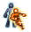

# マーシャルスキル (`MarshallSkill`)

22 entries. See ../README.md for how to read these blocks.

### สแมช (Smash) · uid 129

 
**Tree:** マーシャルスキル (`MarshallSkill`, tier 1) · **Type:** Attack · **Max Lv:** 10 · **Weapons:** Hand, OneHandSword, TwoHandSword, Bow, Bowgun, Rod, Magictool, Knuckle, Halberd, Katana · **Flags:** StarGem, MercenaryCanUseSkill · **Client class:** `SmashAction`

> โจมตีศัตรูอย่างเต็มแรง
> มีโอกาสทำให้เป้าหมาย[ผงะ]

In-game level notes

- Lv16: *พลัง+50 *พลังสกิล+25 *อัตราติดผงะ+25%

**Damage numbers by level** (gem bonuses assumed 0)

| | Lv1 | Lv2 | Lv3 | Lv4 | Lv5 | Lv6 | Lv7 | Lv8 | Lv9 | Lv10 |
|---|---|---|---|---|---|---|---|---|---|---|
| SkillRate × | 1.05 | 1.1 | 1.15 | 1.2 | 1.25 | 1.3 | 1.35 | 1.4 | 1.45 | 1.5 |
| SkillRate × | 0.52 | 0.54 | 0.56 | 0.58 | 0.6 | 0.62 | 0.64 | 0.66 | 0.68 | 0.7 |
| Flat dmg + | 5 | 10 | 15 | 20 | 25 | 30 | 35 | 40 | 45 | 50 |

**Formulas that depend on live stats (not tabulated)**

- Flat dmg + `((((Lv + (Lv << 2)) + (status.Agi // 10)) + 25))`

**Role:** attack (deals damage) · applies status ailment

The skill builds one damage template (one hit). For each template the shared engine (`TemplateAssignment`) fills base damage, defence, element, stability and proration; this skill then adds its own terms listed below and `GetDamage()` multiplies them in `CalcStep` order.

Proration uses the **physical-skill proration slot**; Proration changes on the FIRST damaging hit of one cast on each target only; later hits of the same cast read the updated value but do not change it.

**Damage formula for this skill** (per template; `int()` after every multiplier)

- Engine terms (always present): `BaseDamage`, target `Def` (after pierce), element bonus, stability, `ExpRate = p[slot]/100` (proration), type / last-damage / gem multipliers.
- `SkillConstantDamage` adds: `((((Lv + (Lv << 2)) + (status.Agi // 10)) + 25))`
- `SkillRate` multiplies by (adds into): `((((((Lv + Lv) + 50) + ((Lv + (Lv << 1)) + 50)) + gemCart(107[4]))) / 100)`

**Mechanics recovered from code**

- **Flinch chance (%)** (`flinchPercent`): `((Lv hi 5 ? 75 : 50) + 25)` → Lv1..10 [75, 75, 75, 75, 75, 100, 100, 100, 100, 100]; `(Lv hi 5 ? 75 : 50)` → Lv1..10 [50, 50, 50, 50, 50, 75, 75, 75, 75, 75]

**Proration:** slot `Skill`, mode `first_hit_per_target`, attack type `Physics`, action id 129

Recovered formulas (per method)

**`OnInitialize`** (2 paths)

- set `Element` = `PlayerStatusBase.GetEquipElement(PlayerActionManagerBase.get_PlayerStatus())`
- set `fixAddDamage` = `(((Lv + (Lv << 2)) + (status.Agi // 10)) + 25)`
- set `ActionRange` = `PlayerAttackBase.GetWeaponRange(ExistWeaponType.item(actarAction, 16))`
- set `skillRate` = `((((Lv + Lv) + 50) + ((Lv + (Lv << 1)) + 50)) + gemCart(107[4]))`
- set `flinchPercent` = `((Lv hi 5 ? 75 : 50) + 25)` → Lv1..10: [75, 75, 75, 75, 75, 100, 100, 100, 100, 100]
- set `fixAddDamage` = `(Lv + (Lv << 2))` → Lv1..10: [5, 10, 15, 20, 25, 30, 35, 40, 45, 50]
- set `skillRate` = `((Lv + Lv) + 50)` → Lv1..10: [52, 54, 56, 58, 60, 62, 64, 66, 68, 70]
- set `flinchPercent` = `(Lv hi 5 ? 75 : 50)` → Lv1..10: [50, 50, 50, 50, 50, 75, 75, 75, 75, 75]

**`InitializeOthers`** (1 path)

- set `ActionRange` = `-1` = -1
- set `Element` = `loopCount`

**`calcPlayerToMobDamage`** (8 paths)

- template `AddRate[SkillRate]` = `(skillRate / 100)`
- template `AddConstant[SkillConstantDamage]` = `fixAddDamage`
- calls `PlayerAttackBase.checkAbnormalPercent` = `checkAbnormalPercent(1, flinchPercent, playerAction)`
- calls `AbnormalStateManager.GetDefaultAnbormalStateTime` = `GetDefaultAnbormalStateTime()` — when PlayerAttackBase.checkAbnormalPercent(this, 1, flinchPercent, playerAction)
- info `templates` = `1`

**`OnInheritance`** (1 path)

- set `IsInheritance` = `1` = 1

---

### บาช (Bash) · uid 130

 
**Tree:** マーシャルスキル (`MarshallSkill`, tier 1) · **Type:** Attack · **Max Lv:** 10 · **Weapons:** Hand, OneHandSword, TwoHandSword, Bow, Bowgun, Rod, Magictool, Knuckle, Halberd, Katana · **Requires:** สแมช · **Flags:** StarGem, MercenaryCanUseSkill · **Client class:** `BashAction`

> ยิงเข้าที่ศรีษะอย่างรุนแรง
> มีโอกาสทำให้เป้าหมาย[หมดสติ]

In-game level notes

- Lv16: *พลัง+50 *พลังสกิล+50 *อัตราติดหมดสติ+25%

**Damage numbers by level** (gem bonuses assumed 0)

| | Lv1 | Lv2 | Lv3 | Lv4 | Lv5 | Lv6 | Lv7 | Lv8 | Lv9 | Lv10 |
|---|---|---|---|---|---|---|---|---|---|---|
| SkillRate × | 1.05 | 1.1 | 1.15 | 1.2 | 1.25 | 1.3 | 1.35 | 1.4 | 1.45 | 1.5 |
| Flat dmg + | 10 | 20 | 30 | 40 | 50 | 60 | 70 | 80 | 90 | 100 |

**Formulas that depend on live stats (not tabulated)**

- SkillRate × `(((((Lv + (Lv << 2)) + 100) + ((status.Agi // 5) + 100))) / 100)`
- Flat dmg + `(((((Lv + (Lv << 2)) << 1) + (status.Agi // 5)) + 50))`

**Role:** attack (deals damage) · applies status ailment

The skill builds one damage template (one hit). For each template the shared engine (`TemplateAssignment`) fills base damage, defence, element, stability and proration; this skill then adds its own terms listed below and `GetDamage()` multiplies them in `CalcStep` order.

Proration uses the **physical-skill proration slot**; Proration changes on the FIRST damaging hit of one cast on each target only; later hits of the same cast read the updated value but do not change it.

**Damage formula for this skill** (per template; `int()` after every multiplier)

- Engine terms (always present): `BaseDamage`, target `Def` (after pierce), element bonus, stability, `ExpRate = p[slot]/100` (proration), type / last-damage / gem multipliers.
- `SkillConstantDamage` adds: `(((((Lv + (Lv << 2)) << 1) + (status.Agi // 5)) + 50))`
- `SkillRate` multiplies by (adds into): `(((((Lv + (Lv << 2)) + 100) + ((status.Agi // 5) + 100))) / 100)`

**Mechanics recovered from code**

- **Stun chance (%)** (`stunPercent`): `(((Lv hi 5 ? 50 : 25) + (status.Agi // 10)) + 25)`; `(Lv hi 5 ? 50 : 25)` → Lv1..10 [25, 25, 25, 25, 25, 50, 50, 50, 50, 50]

**Proration:** slot `Skill`, mode `first_hit_per_target`, attack type `Physics`, action id 130

Recovered formulas (per method)

**`OnInitialize`** (2 paths)

- set `Element` = `PlayerStatusBase.GetEquipElement(PlayerActionManagerBase.get_PlayerStatus())`
- set `ActionRange` = `PlayerAttackBase.GetWeaponRange(ExistWeaponType.item(actarAction, 16))`
- set `fixAddDamage` = `((((Lv + (Lv << 2)) << 1) + (status.Agi // 5)) + 50)`
- set `skillRate` = `(((Lv + (Lv << 2)) + 100) + ((status.Agi // 5) + 100))`
- set `stunPercent` = `(((Lv hi 5 ? 50 : 25) + (status.Agi // 10)) + 25)`
- set `fixAddDamage` = `((Lv + (Lv << 2)) << 1)` → Lv1..10: [10, 20, 30, 40, 50, 60, 70, 80, 90, 100]
- set `skillRate` = `((Lv + (Lv << 2)) + 100)` → Lv1..10: [105, 110, 115, 120, 125, 130, 135, 140, 145, 150]
- set `stunPercent` = `(Lv hi 5 ? 50 : 25)` → Lv1..10: [25, 25, 25, 25, 25, 50, 50, 50, 50, 50]

**`InitializeOthers`** (1 path)

- set `Element` = `loopCount`
- set `ActionRange` = `-1` = -1

**`calcPlayerToMobDamage`** (8 paths)

- template `AddRate[SkillRate]` = `(skillRate / 100)`
- template `AddConstant[SkillConstantDamage]` = `fixAddDamage`
- calls `PlayerAttackBase.checkAbnormalPercent` = `checkAbnormalPercent(3, stunPercent, playerAction)`
- calls `SkillDamageData.SetAbnormalType` = `SetAbnormalType(3, 0)` — when PlayerAttackBase.checkAbnormalPercent(this, 3, stunPercent, playerAction)
- info `templates` = `1`

**`OnInheritance`** (1 path)

- set `IsInheritance` = `1` = 1

---

### โซนิคเวฟ (SonicWave) · uid 131

 
**Tree:** マーシャルスキル (`MarshallSkill`, tier 1) · **Type:** Attack · **Max Lv:** 10 · **Weapons:** Hand, OneHandSword, TwoHandSword, Bow, Bowgun, Rod, Magictool, Knuckle, Halberd, Katana · **Requires:** สแมช · **Flags:** StarGem, MercenaryCanUseSkill · **Client class:** `SonicWaveAction`

> ปล่อยคลื่นพลังโจมตี
> มีโอกาสทำให้เป้าหมาย[ล้มคว่ำ]
> จะโจมตีได้ไกลขึ้นตามเลเวลที่เพิ่มขึ้น

In-game level notes

- Lv16: *พลัง+25 *พลังสกิล+25 *ระยะห่างที่สามารถใช้ได้+4m *อัตราติดล้มคว่ำ+50%

**Damage numbers by level** (gem bonuses assumed 0)

| | Lv1 | Lv2 | Lv3 | Lv4 | Lv5 | Lv6 | Lv7 | Lv8 | Lv9 | Lv10 |
|---|---|---|---|---|---|---|---|---|---|---|
| SkillRate × | 1.025 | 1.05 | 1.075 | 1.1 | 1.125 | 1.15 | 1.175 | 1.2 | 1.225 | 1.25 |
| SkillRate × | 0.775 | 0.8 | 0.825 | 0.85 | 0.875 | 0.9 | 0.925 | 0.95 | 0.975 | 1 |
| Flat dmg + | 30 | 35 | 40 | 45 | 50 | 55 | 60 | 65 | 70 | 75 |
| Flat dmg + | 5 | 10 | 15 | 20 | 25 | 30 | 35 | 40 | 45 | 50 |

**Role:** attack (deals damage) · applies status ailment

The skill builds one damage template (one hit). For each template the shared engine (`TemplateAssignment`) fills base damage, defence, element, stability and proration; this skill then adds its own terms listed below and `GetDamage()` multiplies them in `CalcStep` order.

Proration uses the **physical-skill proration slot**; Proration changes on the FIRST damaging hit of one cast on each target only; later hits of the same cast read the updated value but do not change it.

**Damage formula for this skill** (per template; `int()` after every multiplier)

- Engine terms (always present): `BaseDamage`, target `Def` (after pierce), element bonus, stability, `ExpRate = p[slot]/100` (proration), type / last-damage / gem multipliers.
- `SkillConstantDamage` adds: `(((Lv + (Lv << 2)) + 25))`
- `SkillRate` multiplies by (adds into): `((((((Lv * 0.5) + ((Lv + Lv) + 75)) + 25) + gemCart(108[4]))) / 100)`

**Mechanics recovered from code**

- **Tumble chance (%)** (`tumblePercent`): `((Lv + (Lv << 2)) + 50)` → Lv1..10 [55, 60, 65, 70, 75, 80, 85, 90, 95, 100]; `(Lv + (Lv << 2))` → Lv1..10 [5, 10, 15, 20, 25, 30, 35, 40, 45, 50]

**Proration:** slot `Skill`, mode `first_hit_per_target`, attack type `Physics`, action id 131

Recovered formulas (per method)

**`OnInitialize`** (2 paths)

- set `Element` = `PlayerStatusBase.GetEquipElement(PlayerActionManagerBase.get_PlayerStatus())`
- set `ActionRange` = `MathUtil.DisplayMeterToDistance(((int((Lv / 3)) << 2) + 4))`
- set `fixAddDamage` = `((Lv + (Lv << 2)) + 25)` → Lv1..10: [30, 35, 40, 45, 50, 55, 60, 65, 70, 75]
- set `skillRate` = `((((Lv * 0.5) + ((Lv + Lv) + 75)) + 25) + gemCart(108[4]))`
- set `tumblePercent` = `((Lv + (Lv << 2)) + 50)` → Lv1..10: [55, 60, 65, 70, 75, 80, 85, 90, 95, 100]
- set `ActionRange` = `MathUtil.DisplayMeterToDistance((int((Lv / 3)) << 2))`
- set `fixAddDamage` = `(Lv + (Lv << 2))` → Lv1..10: [5, 10, 15, 20, 25, 30, 35, 40, 45, 50]
- set `skillRate` = `((Lv * 0.5) + ((Lv + Lv) + 75))` → Lv1..10: [77.5, 80.0, 82.5, 85.0, 87.5, 90.0, 92.5, 95.0, 97.5, 100.0]
- set `tumblePercent` = `(Lv + (Lv << 2))` → Lv1..10: [5, 10, 15, 20, 25, 30, 35, 40, 45, 50]

**`InitializeOthers`** (1 path)

- set `ActionRange` = `-1` = -1
- set `Element` = `loopCount`

**`calcPlayerToMobDamage`** (8 paths)

- template `AddRate[SkillRate]` = `(skillRate / 100)`
- template `AddConstant[SkillConstantDamage]` = `fixAddDamage`
- calls `PlayerAttackBase.checkAbnormalPercent` = `checkAbnormalPercent(2, tumblePercent, playerAction)`
- calls `AbnormalStateManager.GetDefaultAnbormalStateTime` = `GetDefaultAnbormalStateTime()` — when PlayerAttackBase.checkAbnormalPercent(this, 2, tumblePercent, playerAction)
- info `templates` = `1`

**`OnInheritance`** (1 path)

- set `IsInheritance` = `1` = 1

---

### มาร์เชียลมาสเตอรี่ (MarshallMastary) · uid 132

 
**Tree:** マーシャルスキル (`MarshallSkill`, tier 1) · **Type:** Mastery · **Max Lv:** 10 · **Weapons:** MainKnuckle · **Flags:** StarGem · **Client class:** `MarshallMastary` (passive mastery)

> ใช้สนับมือได้ชำนาญขึ้น
> เพิ่มพลังโจมตีเมื่อใช้สนับมือ

**Role:** passive mastery

**Passive bonuses by level** (`GetMasteryParam(MasteryId)`)

| | Lv1 | Lv2 | Lv3 | Lv4 | Lv5 | Lv6 | Lv7 | Lv8 | Lv9 | Lv10 |
|---|---|---|---|---|---|---|---|---|---|---|
| EqAtkRate | 3 | 6 | 9 | 12 | 15 | 18 | 21 | 24 | 27 | 30 |
| AtkRate | 1 | 1 | 1 | 1 | 1 | 1 | 2 | 2 | 2 | 2 |

---

### แอกราเวท (OneChance) · uid 133

 
**Tree:** マーシャルスキル (`MarshallSkill`, tier 1) · **Type:** Mastery · **Max Lv:** 10 · **Weapons:** Knuckle, MainHand · **Flags:** StarGem · **Client class:** `OneChance` (passive mastery)

> โจมตีศัตรูซ้ำทันทีภายในพริบตา
> มีโอกาสสร้างความเสียหายให้ศัตรูเพิ่ม
> จากการโจมตีด้วยสนับมือปกติ

**Role:** passive mastery

**Passive bonuses by level** (`GetMasteryParam(MasteryId)`)

| | Lv1 | Lv2 | Lv3 | Lv4 | Lv5 | Lv6 | Lv7 | Lv8 | Lv9 | Lv10 |
|---|---|---|---|---|---|---|---|---|---|---|
| Trigger | 14 | 18 | 22 | 26 | 30 | 34 | 38 | 42 | 46 | 50 |
| SkillRate | 27 | 30 | 32 | 35 | 37 | 40 | 42 | 45 | 47 | 50 |
| Value | 0 | 1 | 1 | 2 | 2 | 3 | 3 | 4 | 4 | 5 |

---

### เชลเบรค (ShellBreak) · uid 134

 
**Tree:** マーシャルスキル (`MarshallSkill`, tier 2) · **Type:** Attack · **Max Lv:** 30 · **Weapons:** Hand, OneHandSword, TwoHandSword, Bow, Bowgun, Rod, Magictool, Knuckle, Halberd, Katana · **Requires:** บาช · **Flags:** MercenaryCanUseSkill · **Client class:** `ShellBreakAction`

> โจมตีผ่านเกราะแข็งได้อย่างง่ายดาย
> เพิ่มความเสียหายตามพลังป้องกันของเป้าหมาย
> มีโอกาสเล็กน้อยที่จะทำให้เป้าหมายติดสภาวะ[ลดการป้องกัน]
> จะฟื้นฟู MP ได้เมื่อทำสำเร็จ

In-game level notes

- Lv16: *พลัง+50 *พลังสกิล+150 *เพิ่มอาวุธเจาะเข้า  [เอฟเฟกต์ต่อไปนี้ใช้กับอุปกรณ์หลักเท่านั้น] *อัตราลดการป้องกัน+25%

**Damage numbers by level** (gem bonuses assumed 0)

| | Lv1 | Lv2 | Lv3 | Lv4 | Lv5 | Lv6 | Lv7 | Lv8 | Lv9 | Lv10 |
|---|---|---|---|---|---|---|---|---|---|---|
| SkillRate × | 1.55 | 1.6 | 1.65 | 1.7 | 1.75 | 1.8 | 1.85 | 1.9 | 1.95 | 2 |
| SkillRate × | 1.05 | 1.1 | 1.15 | 1.2 | 1.25 | 1.3 | 1.35 | 1.4 | 1.45 | 1.5 |
| Flat dmg + | 210 | 220 | 230 | 240 | 250 | 260 | 270 | 280 | 290 | 300 |
| Flat dmg + | 60 | 70 | 80 | 90 | 100 | 110 | 120 | 130 | 140 | 150 |

**Formulas that depend on live stats (not tabulated)**

- SkillRate × `((((IMobStatusCalculator.CalcDef(MobActionManagerBase.get_MobBattleStatus(mobAction)) - target.Level) << 1) gt -101 ? min(((IMobStatusCalculator.CalcDef(MobActionManagerBase.get_MobBattleStatus(mobAction)) - target.Level) << 1), 500) : -100) / 100)`
- Flat dmg + `(((IMobStatusCalculator.CalcDef(MobActionManagerBase.get_MobBattleStatus(mobAction)) - target.Level) << 1) gt -101 ? min(((IMobStatusCalculator.CalcDef(MobActionManagerBase.get_MobBattleStatus(mobAction)) - target.Level) << 1), 500) : -100)`

**Role:** attack (deals damage) · applies status ailment

The skill builds one damage template (one hit). For each template the shared engine (`TemplateAssignment`) fills base damage, defence, element, stability and proration; this skill then adds its own terms listed below and `GetDamage()` multiplies them in `CalcStep` order.

Proration uses the **physical-skill proration slot**; Proration changes on the FIRST damaging hit of one cast on each target only; later hits of the same cast read the updated value but do not change it.

**Damage formula for this skill** (per template; `int()` after every multiplier)

- Engine terms (always present): `BaseDamage`, target `Def` (after pierce), element bonus, stability, `ExpRate = p[slot]/100` (proration), type / last-damage / gem multipliers.
- `SkillConstantDamage` adds: `((((Lv + (Lv << 2)) << 1) + 200))` | `(((IMobStatusCalculator.CalcDef(MobActionManagerBase.get_MobBattleStatus(mobAction)) - target.Level) << 1) gt -101 ? min(((IMobStatusCalculator.CalcDef(MobActionManagerBase.get_MobBattleStatus(mobAction)) - target.Level) << 1), 500) : -100)`
- `SkillRate` multiplies by (adds into): `(((((Lv + (Lv << 2)) + 100) + 50)) / 100)` | `((((IMobStatusCalculator.CalcDef(MobActionManagerBase.get_MobBattleStatus(mobAction)) - target.Level) << 1) gt -101 ? min(((IMobStatusCalculator.CalcDef(MobActionManagerBase.get_MobBattleStatus(mobAction)) - target.Level) << 1), 500) : -100) / 100)`

**Proration:** slot `Skill`, mode `first_hit_per_target`, attack type `Physics`, action id 134

Recovered formulas (per method)

**`OnInitialize`** (12 paths)

- set `Element` = `PlayerStatusBase.GetEquipElement(PlayerActionManagerBase.get_PlayerStatus())`
- set `ActionRange` = `PlayerAttackBase.GetWeaponRange(ExistWeaponType.item(actarAction, 16))`
- set `skillRate` = `(((Lv + (Lv << 2)) + 100) + 50)` → Lv1..10: [155, 160, 165, 170, 175, 180, 185, 190, 195, 200]
- set `fixAddDamage` = `(((Lv + (Lv << 2)) << 1) + 200)` → Lv1..10: [210, 220, 230, 240, 250, 260, 270, 280, 290, 300]
- set `breakPercent` = `(SkillBufferDataBase.GetParam(TryGetBuf.buf(PlayerStatusBase.get_SkillBufferManager(), 1159), 50) + (gemCart(208[2]) + ((int(((Lv * 0.5) + Lv)) + 10) + 25)))` — when EquipItemData.WeaponTypeCalculatorBase.get_WeaponType(PlayerStatusBase.get_EquipItemData().mainWeaponCalculator) eq 16 AND TryGetBuf.buf(PlayerStatusBase.get_SkillBufferManager(), 1159) ne 0
- set `disDefParcent` = `(Lv + (Lv << 2))` → Lv1..10: [5, 10, 15, 20, 25, 30, 35, 40, 45, 50]
- set `breakPercent` = `(gemCart(208[2]) + ((int(((Lv * 0.5) + Lv)) + 10) + 25))` — when EquipItemData.WeaponTypeCalculatorBase.get_WeaponType(PlayerStatusBase.get_EquipItemData().mainWeaponCalculator) eq 16 OR EquipItemData.WeaponTypeCalculatorBase.get_WeaponType(PlayerStatusBase.get_EquipItemData().mainWeaponCalculator) eq 16 AND TryGetBuf.buf(PlayerStatusBase.get_SkillBufferManager(), 1159) eq 0
- set `breakPercent` = `(SkillBufferDataBase.GetParam(TryGetBuf.buf(PlayerStatusBase.get_SkillBufferManager(), 1159), 50) + (gemCart(208[2]) + (int(((Lv * 0.5) + Lv)) + 10)))` — when EquipItemData.WeaponTypeCalculatorBase.get_WeaponType(PlayerStatusBase.get_EquipItemData().mainWeaponCalculator) ne 16 AND TryGetBuf.buf(PlayerStatusBase.get_SkillBufferManager(), 1159) ne 0
- set `breakPercent` = `(gemCart(208[2]) + (int(((Lv * 0.5) + Lv)) + 10))` — when EquipItemData.WeaponTypeCalculatorBase.get_WeaponType(PlayerStatusBase.get_EquipItemData().mainWeaponCalculator) ne 16 OR EquipItemData.WeaponTypeCalculatorBase.get_WeaponType(PlayerStatusBase.get_EquipItemData().mainWeaponCalculator) ne 16 AND TryGetBuf.buf(PlayerStatusBase.get_SkillBufferManager(), 1159) eq 0
- set `skillRate` = `((Lv + (Lv << 2)) + 100)` → Lv1..10: [105, 110, 115, 120, 125, 130, 135, 140, 145, 150]
- set `fixAddDamage` = `(((Lv + (Lv << 2)) << 1) + 50)` → Lv1..10: [60, 70, 80, 90, 100, 110, 120, 130, 140, 150]

**`InitializeOthers`** (1 path)

- set `ActionRange` = `-1` = -1
- set `Element` = `loopCount`

**`calcPlayerToMobDamage`** (16 paths)

- template `AddRate[SkillRate]` = `(skillRate / 100)`
- template `AddConstant[SkillConstantDamage]` = `fixAddDamage`
- template `AddConstant[SkillConstantDamage]` = `(((IMobStatusCalculator.CalcDef(MobActionManagerBase.get_MobBattleStatus(mobAction)) - target.Level) << 1) gt -101 ? min(((IMobStatusCalculator.CalcDef(MobActionManagerBase.get_MobBattleStatus(mobAction)) - target.Level) << 1), 500) : -100)`
- template `AddRate[SkillRate]` = `((((IMobStatusCalculator.CalcDef(MobActionManagerBase.get_MobBattleStatus(mobAction)) - target.Level) << 1) gt -101 ? min(((IMobStatusCalculator.CalcDef(MobActionManagerBase.get_MobBattleStatus(mobAction)) - target.Level) << 1), 500) : -100) / 100)`
- calls `PlayerAttackBase.checkAbnormalPercent` = `checkAbnormalPercent(10, breakPercent, playerAction)`
- calls `SkillDamageData.SetAbnormalType` = `SetAbnormalType(10, 0)` — when PlayerAttackBase.checkAbnormalPercent(this, 10, breakPercent, playerAction)
- info `templates` = `1`

**`OnInheritance`** (1 path)

- set `IsInheritance` = `1` = 1

---

### เอิร์ธไบด์ (EarthBind) · uid 135

 
**Tree:** マーシャルスキル (`MarshallSkill`, tier 2) · **Type:** Attack · **Max Lv:** 30 · **Weapons:** Hand, OneHandSword, TwoHandSword, Bow, Bowgun, Rod, Magictool, Knuckle, Halberd, Katana · **Requires:** โซนิคเวฟ · **Flags:** MercenaryCanUseSkill · **Client class:** `EarthBindAction`

> โจมตีศัตรูโดยรอบด้วยการทำให้แผ่นดินสั่นสะเทือน
> มีโอกาสทำให้เป้าหมาย[หยุดนิ่ง]
> ฟื้นฟู HP เล็กน้อยเมื่อโจมตีโดนเป้าหมาย

In-game level notes

- Lv16: *พลัง+25 *พลังสกิล+25 *ระยะโจมตี (รัศมี)+1.5m *อัตราติดหยุดนิ่ง+50% ฟื้นฟูค่าสูงสุด HP+500 ด้วยเอิร์ธไบด์

**Damage numbers by level** (gem bonuses assumed 0)

| | Lv1 | Lv2 | Lv3 | Lv4 | Lv5 | Lv6 | Lv7 | Lv8 | Lv9 | Lv10 |
|---|---|---|---|---|---|---|---|---|---|---|
| SkillRate × | 1.02 | 1.05 | 1.07 | 1.1 | 1.12 | 1.15 | 1.17 | 1.2 | 1.22 | 1.25 |
| Flat dmg + | 30 | 35 | 40 | 45 | 50 | 55 | 60 | 65 | 70 | 75 |
| Flat dmg + | 5 | 10 | 15 | 20 | 25 | 30 | 35 | 40 | 45 | 50 |

**Formulas that depend on live stats (not tabulated)**

- SkillRate × `(((((int((Lv * 2.5)) + 100) + ((status.Agi // 5) + 25)) + gemCart(209[2]))) / 100)`

**Role:** attack (deals damage) · applies status ailment

The skill builds one damage template (one hit). For each template the shared engine (`TemplateAssignment`) fills base damage, defence, element, stability and proration; this skill then adds its own terms listed below and `GetDamage()` multiplies them in `CalcStep` order.

Proration uses the **physical-skill proration slot**; Proration changes on the FIRST damaging hit of one cast on each target only; later hits of the same cast read the updated value but do not change it.

**Damage formula for this skill** (per template; `int()` after every multiplier)

- Engine terms (always present): `BaseDamage`, target `Def` (after pierce), element bonus, stability, `ExpRate = p[slot]/100` (proration), type / last-damage / gem multipliers.
- `SkillConstantDamage` adds: `(((Lv + (Lv << 2)) + 25))`
- `SkillRate` multiplies by (adds into): `(((((int((Lv * 2.5)) + 100) + ((status.Agi // 5) + 25)) + gemCart(209[2]))) / 100)`

**Mechanics recovered from code**

- **Stop chance (%)** (`stopPercent`): `((Lv + (Lv << 2)) + 50)` → Lv1..10 [55, 60, 65, 70, 75, 80, 85, 90, 95, 100]; `(Lv + (Lv << 2))` → Lv1..10 [5, 10, 15, 20, 25, 30, 35, 40, 45, 50]

**Proration:** slot `Skill`, mode `first_hit_per_target`, attack type `Physics`, action id 135

Recovered formulas (per method)

**`OnInitialize`** (4 paths)

- set `Element` = `PlayerStatusBase.GetEquipElement(PlayerActionManagerBase.get_PlayerStatus())`
- set `ActionRange` = `PlayerAttackBase.GetWeaponRange(ExistWeaponType.item(actarAction, 16))`
- set `skillRate` = `(((int((Lv * 2.5)) + 100) + ((status.Agi // 5) + 25)) + gemCart(209[2]))`
- set `fixAddDamage` = `((Lv + (Lv << 2)) + 25)` → Lv1..10: [30, 35, 40, 45, 50, 55, 60, 65, 70, 75]
- set `stopPercent` = `((Lv + (Lv << 2)) + 50)` → Lv1..10: [55, 60, 65, 70, 75, 80, 85, 90, 95, 100]
- set `maxHpHeal` = `(maxHpHeal + 500)`
- set `skillRate` = `(int((Lv * 2.5)) + 100)` → Lv1..10: [102, 105, 107, 110, 112, 115, 117, 120, 122, 125]
- set `fixAddDamage` = `(Lv + (Lv << 2))` → Lv1..10: [5, 10, 15, 20, 25, 30, 35, 40, 45, 50]
- set `stopPercent` = `(Lv + (Lv << 2))` → Lv1..10: [5, 10, 15, 20, 25, 30, 35, 40, 45, 50]

**`InitializeOthers`** (1 path)

- set `ActionRange` = `-1` = -1
- set `Element` = `loopCount`

**`calcPlayerToMobDamage`** (8 paths)

- template `AddRate[SkillRate]` = `(skillRate / 100)`
- template `AddConstant[SkillConstantDamage]` = `fixAddDamage`
- calls `PlayerAttackBase.checkAbnormalPercent` = `checkAbnormalPercent(12, stopPercent, playerAction)`
- calls `SkillDamageData.SetAbnormalType` = `SetAbnormalType(12, 0)` — when PlayerAttackBase.checkAbnormalPercent(this, 12, stopPercent, playerAction)
- info `templates` = `1`

**`ReceiveAttackResult`** (3 paths)

- calls `EarthBindAction.MpHealEffect` = `MpHealEffect(PlayerDataManager.get_PlayerActionManager(PlayerDataManager.GetPlayerDataManager()))` — when SkillActionBase.op_Inequality(SkillActionManagerBase.get_CurrentSkill(), 0) AND SkillActionManagerBase.get_CurrentSkill().Id eq localId

**`OnInheritance`** (1 path)

- set `IsInheritance` = `1` = 1

---

### อัดกระแทก (StrongChase) · uid 136

 
**Tree:** マーシャルスキル (`MarshallSkill`, tier 2) · **Type:** Mastery · **Max Lv:** 30 · **Weapons:** Knuckle, MainHand · **Requires:** แอกราเวท · **Client class:** `StrongChase` (passive mastery)

> อัพเกรดพลังโจมตีของการโจมตีที่ไม่รุนแรง
> 
> เพิ่มความแม่นของตัวเอง
> และเพิ่มพลังโจมตีของ[แอกราเวท]

In-game level notes

- Lv16: [เอฟเฟกต์ต่อไปนี้ใช้กับอุปกรณ์หลักเท่านั้น] *เพิ่มความแม่นขึ้นไปอีก *ได้รับอาวุธเจาะเข้าตามระดับสกิลเลเวล เพื่อเพิ่มความเสียหายของแอกราเวท

**Role:** passive mastery

**Passive bonuses by level** (`GetMasteryParam(MasteryId)`)

| | Lv1 | Lv2 | Lv3 | Lv4 | Lv5 | Lv6 | Lv7 | Lv8 | Lv9 | Lv10 |
|---|---|---|---|---|---|---|---|---|---|---|
| SkillRate | 5 | 10 | 15 | 20 | 25 | 30 | 35 | 40 | 45 | 50 |
| PowerResistBreaker | 5 | 10 | 15 | 20 | 25 | 30 | 35 | 40 | 45 | 50 |
| HitRate | 1 | 2 | 3 | 4 | 5 | 6 | 7 | 8 | 9 | 10 |

---

### เฮวี่สแมช (HeavySmash) · uid 137

 
**Tree:** マーシャルスキル (`MarshallSkill`, tier 3) · **Type:** Attack · **Max Lv:** 70 · **Weapons:** Hand, OneHandSword, TwoHandSword, Bow, Bowgun, Rod, Magictool, Knuckle, Halberd, Katana · **Requires:** เชลเบรค · **Flags:** MercenaryCanUseSkill · **Client class:** `HeavySmashAction`

> โจมตีศัตรูอย่างเต็มแรง
> มีโอกาสทำให้เป้าหมาย[เฉื่อยชา]
> ถ้าเป้าหมายอยู่ในสภาวะ[ลดการป้องกัน]
> จะได้รับความเสียหายเพิ่มขึ้น

In-game level notes

- Lv16: *พลัง+150 พลังสกิล+100 ค่าความเสียหายเพิ่มเติม+500 *อัตราติดเฉื่อยชา+50%

**Damage numbers by level** (gem bonuses assumed 0)

| | Lv1 | Lv2 | Lv3 | Lv4 | Lv5 | Lv6 | Lv7 | Lv8 | Lv9 | Lv10 |
|---|---|---|---|---|---|---|---|---|---|---|
| SkillRate × | 1.15 | 1.3 | 1.45 | 1.6 | 1.75 | 1.9 | 2.05 | 2.2 | 2.35 | 2.5 |
| SkillRate × | 1.5 | 1.5 | 1.5 | 1.5 | 1.5 | 1.5 | 1.5 | 1.5 | 1.5 | 1.5 |
| SkillRate × | 5 | 5 | 5 | 5 | 5 | 5 | 5 | 5 | 5 | 5 |
| Flat dmg + | 210 | 220 | 230 | 240 | 250 | 260 | 270 | 280 | 290 | 300 |
| Flat dmg + | 110 | 120 | 130 | 140 | 150 | 160 | 170 | 180 | 190 | 200 |

**Role:** attack (deals damage) · applies status ailment

The skill builds 2 separate damage templates (each is a full hit with its own crit roll). For each template the shared engine (`TemplateAssignment`) fills base damage, defence, element, stability and proration; this skill then adds its own terms listed below and `GetDamage()` multiplies them in `CalcStep` order.

Proration uses the **physical-skill proration slot**; Proration changes on the FIRST damaging hit of one cast on each target only; later hits of the same cast read the updated value but do not change it.

**Damage formula for this skill** (per template; `int()` after every multiplier)

- Engine terms (always present): `BaseDamage`, target `Def` (after pierce), element bonus, stability, `ExpRate = p[slot]/100` (proration), type / last-damage / gem multipliers.
- `SkillConstantDamage` adds: `((((Lv + (Lv << 2)) << 1) + 200))`
- `BufferConstantDamage` sets: `0`
- `SkillRate` multiplies by (adds into): `((((Lv * 15) + 100) / 100))` | `1.5` | `5`

**Proration:** slot `Skill`, mode `first_hit_per_target`, attack type `Physics`, action id 137

Recovered formulas (per method)

**`OnInitialize`** (2 paths)

- set `Element` = `PlayerStatusBase.GetEquipElement(PlayerActionManagerBase.get_PlayerStatus())`
- set `ActionRange` = `PlayerAttackBase.GetWeaponRange(ExistWeaponType.item(actarAction, 16))`
- set `baseSkillRate` = `(((Lv * 15) + 100) / 100)` → Lv1..10: [1.15, 1.3, 1.45, 1.6, 1.75, 1.9, 2.05, 2.2, 2.35, 2.5]
- set `fixAddDamage` = `(((Lv + (Lv << 2)) << 1) + 200)` → Lv1..10: [210, 220, 230, 240, 250, 260, 270, 280, 290, 300]
- set `weakPercent` = `((Lv + (Lv << 1)) + 70)` → Lv1..10: [73, 76, 79, 82, 85, 88, 91, 94, 97, 100]
- set `powerRegisterBreaker` = `(gemCart(304[2]) + powerRegisterBreaker)`
- set `fixAddDamage` = `(((Lv + (Lv << 2)) << 1) + 100)` → Lv1..10: [110, 120, 130, 140, 150, 160, 170, 180, 190, 200]
- set `weakPercent` = `((Lv + (Lv << 1)) + 20)` → Lv1..10: [23, 26, 29, 32, 35, 38, 41, 44, 47, 50]

**`InitializeOthers`** (1 path)

- set `ActionRange` = `-1` = -1
- set `Element` = `loopCount`

**`calcPlayerToMobDamage`** (204 paths)

- template `SetConstant[BufferConstantDamage]` = `0` — when AbnormalStateManager.Contains(MobActionManagerBase.get_AbnormalStateManager(mobAction), 10) OR AbnormalStateManager.Contains(MobActionManagerBase.get_AbnormalStateManager(mobAction), 10) AND PlayerAttackBase.checkAbnormalPercent(this, 15, weakPercent, playerAction) OR !PlayerAttackBase.checkAbnormalPercent(this, 15, weakPercent, playerAction) AND AbnormalStateManager.Contains(MobActionManagerBase.get_AbnormalStateManager(mobAction), 10)
- template `AddConstant[SkillConstantDamage]` = `fixAddDamage`
- template `AddRate[SkillRate]` = `baseSkillRate`
- info `templates` = `2` — when AbnormalStateManager.Contains(MobActionManagerBase.get_AbnormalStateManager(mobAction), 10) OR AbnormalStateManager.Contains(MobActionManagerBase.get_AbnormalStateManager(mobAction), 10) AND PlayerAttackBase.checkAbnormalPercent(this, 15, weakPercent, playerAction) OR !PlayerAttackBase.checkAbnormalPercent(this, 15, weakPercent, playerAction) AND AbnormalStateManager.Contains(MobActionManagerBase.get_AbnormalStateManager(mobAction), 10)
- template `AddRate[SkillRate]` = `1.5`
- template `AddRate[SkillRate]` = `5`
- calls `PlayerAttackBase.checkAbnormalPercent` = `checkAbnormalPercent(15, weakPercent, playerAction)` — when AbnormalStateManager.Contains(MobActionManagerBase.get_AbnormalStateManager(mobAction), 10) AND PlayerAttackBase.checkAbnormalPercent(this, 15, weakPercent, playerAction) OR !PlayerAttackBase.checkAbnormalPercent(this, 15, weakPercent, playerAction) AND AbnormalStateManager.Contains(MobActionManagerBase.get_AbnormalStateManager(mobAction), 10) OR !AbnormalStateManager.Contains(MobActionManagerBase.get_AbnormalStateManager(mobAction), 10) AND PlayerAttackBase.checkAbnormalPercent(this, 15, weakPercent, playerAction)
- calls `SkillDamageData.SetAbnormalType` = `SetAbnormalType(15, 0)` — when AbnormalStateManager.Contains(MobActionManagerBase.get_AbnormalStateManager(mobAction), 10) AND PlayerAttackBase.checkAbnormalPercent(this, 15, weakPercent, playerAction) OR !AbnormalStateManager.Contains(MobActionManagerBase.get_AbnormalStateManager(mobAction), 10) AND PlayerAttackBase.checkAbnormalPercent(this, 15, weakPercent, playerAction)
- info `templates` = `1` — when !AbnormalStateManager.Contains(MobActionManagerBase.get_AbnormalStateManager(mobAction), 10) OR !AbnormalStateManager.Contains(MobActionManagerBase.get_AbnormalStateManager(mobAction), 10) AND PlayerAttackBase.checkAbnormalPercent(this, 15, weakPercent, playerAction) OR !AbnormalStateManager.Contains(MobActionManagerBase.get_AbnormalStateManager(mobAction), 10) AND !PlayerAttackBase.checkAbnormalPercent(this, 15, weakPercent, playerAction)

**`OnInheritance`** (1 path)

- set `IsInheritance` = `1` = 1

---

### ทริปเปิ้ลคิก (TryArts) · uid 138

 
**Tree:** マーシャルスキル (`MarshallSkill`, tier 3) · **Type:** Attack · **Max Lv:** 70 · **Weapons:** Hand, OneHandSword, TwoHandSword, Bow, Bowgun, Rod, Magictool, Knuckle, Halberd, Katana · **Requires:** เอิร์ธไบด์ · **Flags:** MercenaryCanUseSkill · **Client class:** `TryArtsAction`

> โจมตีเป้าหมายอย่างรวดเร็วสามครั้งซ้อน
> อัตราคริติคอลเพิ่มสูงกว่าปกติ

In-game level notes

- Lv16: *พลัง+300 *พลังสกิล+75 *เพิ่มอัตราคริติคอล

**Damage numbers by level** (gem bonuses assumed 0)

| | Lv1 | Lv2 | Lv3 | Lv4 | Lv5 | Lv6 | Lv7 | Lv8 | Lv9 | Lv10 |
|---|---|---|---|---|---|---|---|---|---|---|
| SkillRate × [mainWeapon == Knuckle OR mainWeapon != Knuckle AND subWeapon == Knuckle & 0 lo criticalPercent.Length AND 1 hs criticalPercent.Length OR 0 lo criticalPercent.Length AND 1 lo criticalPercent.Length AND 2 lo criticalPercent.Length OR 0 lo criticalPercent.Length AND 1 lo criticalPercent.Length AND 2 hs criticalPercent.Length] | 2.1 | 2.2 | 2.3 | 2.4 | 2.5 | 2.6 | 2.7 | 2.8 | 2.9 | 3 |
| SkillRate × [0 lo criticalPercent.Length AND 1 hs criticalPercent.Length OR 0 lo criticalPercent.Length AND 1 lo criticalPercent.Length AND 2 lo criticalPercent.Length OR 0 lo criticalPercent.Length AND 1 lo criticalPercent.Length AND 2 hs criticalPercent.Length] | 1.1 | 1.2 | 1.3 | 1.4 | 1.5 | 1.6 | 1.7 | 1.8 | 1.9 | 2 |
| Flat dmg + | 27 | 29 | 31 | 33 | 35 | 37 | 39 | 41 | 43 | 45 |

**Role:** attack (deals damage)

The skill builds 3 separate damage templates (each is a full hit with its own crit roll). For each template the shared engine (`TemplateAssignment`) fills base damage, defence, element, stability and proration; this skill then adds its own terms listed below and `GetDamage()` multiplies them in `CalcStep` order.

Proration uses the **physical-skill proration slot**; Proration changes on the FIRST damaging hit of one cast on each target only; later hits of the same cast read the updated value but do not change it.

**Damage formula for this skill** (per template; `int()` after every multiplier)

- Engine terms (always present): `BaseDamage`, target `Def` (after pierce), element bonus, stability, `ExpRate = p[slot]/100` (proration), type / last-damage / gem multipliers.
- `SkillConstantDamage` adds: `(((Lv << 1) + 25))`
- `SkillRate` multiplies by (adds into): `((((Lv * 10) + 100)) / 100)`

**Proration:** slot `Skill`, mode `first_hit_per_target`, attack type `Physics`, action id 138

Recovered formulas (per method)

**`OnInitialize`** (23 paths)

- set `Element` = `PlayerStatusBase.GetEquipElement(PlayerActionManagerBase.get_PlayerStatus())`
- set `ActionRange` = `MathUtil.DisplayMeterToDistance(3)`
- set `skillRate` = `(((Lv * 10) + 100) + 100)` → Lv1..10: [210, 220, 230, 240, 250, 260, 270, 280, 290, 300] — when mainWeapon == Knuckle OR mainWeapon != Knuckle AND subWeapon == Knuckle
- set `fixAddDamage` = `((Lv << 1) + 25)` → Lv1..10: [27, 29, 31, 33, 35, 37, 39, 41, 43, 45]
- set `skillRate` = `((Lv * 10) + 100)` → Lv1..10: [110, 120, 130, 140, 150, 160, 170, 180, 190, 200]

**`InitializeOthers`** (1 path)

- set `ActionRange` = `-1` = -1
- set `Element` = `loopCount`

**`calcPlayerToMobDamage`** (23 paths)

- template `AddRate[SkillRate]` = `(skillRate / 100)` — when 0 lo criticalPercent.Length AND 1 hs criticalPercent.Length OR 0 lo criticalPercent.Length AND 1 lo criticalPercent.Length AND 2 lo criticalPercent.Length OR 0 lo criticalPercent.Length AND 1 lo criticalPercent.Length AND 2 hs criticalPercent.Length
- template `AddConstant[SkillConstantDamage]` = `fixAddDamage` — when 0 lo criticalPercent.Length AND 1 hs criticalPercent.Length OR 0 lo criticalPercent.Length AND 1 lo criticalPercent.Length AND 2 lo criticalPercent.Length OR 0 lo criticalPercent.Length AND 1 lo criticalPercent.Length AND 2 hs criticalPercent.Length
- info `templates` = `3` — when 0 lo criticalPercent.Length AND 1 lo criticalPercent.Length AND 2 lo criticalPercent.Length
- info `templates` = `2` — when 0 lo criticalPercent.Length AND 1 lo criticalPercent.Length AND 2 hs criticalPercent.Length
- info `templates` = `1` — when 0 lo criticalPercent.Length AND 1 hs criticalPercent.Length

**`OnInheritance`** (1 path)

- set `IsInheritance` = `1` = 1

---

### มาร์เชียลดิสซิพลิน (UnarmedTecnique) · uid 139

 
**Tree:** マーシャルスキル (`MarshallSkill`, tier 3) · **Type:** Mastery · **Max Lv:** 70 · **Weapons:** Knuckle · **Requires:** มาร์เชียลมาสเตอรี่ · **Client class:** `UnarmedTecnique` (passive mastery)

> เข้าถึงแก่นวิธีการใช้สนับมืออย่างลึกซึ้ง
> เพิ่มความเร็วการโจมตีเมื่อใช้สนับมือ
> และมีโอกาสเพิ่มพลังโจมตีด้วยสกิลต่อสู้เพิ่มขึ้นเล็กน้อย

**Role:** passive mastery

**Passive bonuses by level** (`GetMasteryParam(MasteryId)`)

| | Lv1 | Lv2 | Lv3 | Lv4 | Lv5 | Lv6 | Lv7 | Lv8 | Lv9 | Lv10 |
|---|---|---|---|---|---|---|---|---|---|---|
| Aspd | 10 | 20 | 30 | 40 | 50 | 60 | 70 | 80 | 90 | 100 |
| AspdRate | 1 | 2 | 3 | 4 | 5 | 6 | 7 | 8 | 9 | 10 |
| LastDmgRate | 1 | 2 | 3 | 4 | 5 | 6 | 7 | 8 | 9 | 10 |

---

### สไลด์ดิ้ง (Sliding) · uid 143

 
**Tree:** マーシャルスキル (`MarshallSkill`, tier 3) · **Type:** Special · **Max Lv:** 70 · **Weapons:** MainKnuckle · **Flags:** NoMarketSearch · **Client class:** `SlidingAction`

> ลดระยะห่างด้วยการสไลด์
> เข้าไปใกล้เป้าหมายด้วยความเร็วสูง
> จะเพิ่มอัตราความแม่นให้สกิลที่ใช้ถัดไป

**Role:** buff (self)

This action never changes monster proration: IsExpDefFluctuate=false.

It applies the buff(s) listed under **Buffs**; the buff object keeps its own timer and returns bonus values through `GetParam(SkillBufferId)`.

**Proration:** slot `none`, mode `never (IsExpDefFluctuate=false)`, attack type `None`, action id 143

Recovered formulas (per method)

**`OnInitialize`** (1 path)

- set `ActionRange` = `MathUtil.DisplayMeterToDistance(8)`

**`ActionStart`** (22 paths)

- set `startTime` = `3` = 3 — when !PlayerAttackBase.IsBlank(this) AND UnityEngine.Object.op_Inequality(UnityEngine.GameObject.GetComponent<CharacterActionManagerBase>(target), 0) AND UnityEngine.Object.op_Inequality(actarAction) AND fsqrt((((UnityEngine.Transform.get_position(UnityEngine.Component.get_transform(actarAction)).z - UnityEngine.Transform.get_position(UnityEngine.GameObject.get_transform(target)).z) * (UnityEngine.Transform.get_position(UnityEngine.Component.get_transform(actarAction)).z - UnityEngine.Transform.get_position(UnityEngine.GameObject.get_transform(target)).z)) + ((UnityEngine.Transform.get_position(UnityEngine.Component.get_transform(actarAction)).x - UnityEngine.Transform.get_position(UnityEngine.GameObject.get_transform(target)).x) * (UnityEngine.Transform.get_position(UnityEngine.Component.get_transform(actarAction)).x - UnityEngine.Transform.get_position(UnityEngine.GameObject.get_transform(target)).x)))) le 1e-05 AND fsqrt((((UnityEngine.Transform.get_position(UnityEngine.GameObject.get_transform(target)).z - UnityEngine.Transform.get_position(UnityEngine.Component.get_transform(actarAction)).z) * (UnityEngine.Transform.get_position(UnityEngine.GameObject.get_transform(target)).z - UnityEngine.Transform.get_position(UnityEngine.Component.get_transform(actarAction)).z)) + ((UnityEngine.Transform.get_position(UnityEngine.GameObject.get_transform(target)).x - UnityEngine.Transform.get_position(UnityEngine.Component.get_transform(actarAction)).x) * (UnityEngine.Transform.get_position(UnityEngine.GameObject.get_transform(target)).x - UnityEngine.Transform.get_position(UnityEngine.Component.get_transform(actarAction)).x)))) le 1e-05 OR !PlayerAttackBase.IsBlank(this) AND !UnityEngine.Object.op_Inequality(UnityEngine.GameObject.GetComponent<CharacterActionManagerBase>(target), 0) AND UnityEngine.Object.op_Inequality(actarAction) AND fsqrt((((UnityEngine.Transform.get_position(UnityEngine.Component.get_transform(actarAction)).z - UnityEngine.Transform.get_position(UnityEngine.GameObject.get_transform(target)).z) * (UnityEngine.Transform.get_position(UnityEngine.Component.get_transform(actarAction)).z - UnityEngine.Transform.get_position(UnityEngine.GameObject.get_transform(target)).z)) + ((UnityEngine.Transform.get_position(UnityEngine.Component.get_transform(actarAction)).x - UnityEngine.Transform.get_position(UnityEngine.GameObject.get_transform(target)).x) * (UnityEngine.Transform.get_position(UnityEngine.Component.get_transform(actarAction)).x - UnityEngine.Transform.get_position(UnityEngine.GameObject.get_transform(target)).x)))) le 1e-05 AND fsqrt((((UnityEngine.Transform.get_position(UnityEngine.GameObject.get_transform(target)).z - UnityEngine.Transform.get_position(UnityEngine.Component.get_transform(actarAction)).z) * (UnityEngine.Transform.get_position(UnityEngine.GameObject.get_transform(target)).z - UnityEngine.Transform.get_position(UnityEngine.Component.get_transform(actarAction)).z)) + ((UnityEngine.Transform.get_position(UnityEngine.GameObject.get_transform(target)).x - UnityEngine.Transform.get_position(UnityEngine.Component.get_transform(actarAction)).x) * (UnityEngine.Transform.get_position(UnityEngine.GameObject.get_transform(target)).x - UnityEngine.Transform.get_position(UnityEngine.Component.get_transform(actarAction)).x)))) le 1e-05 OR !PlayerAttackBase.IsBlank(this) AND UnityEngine.Object.op_Inequality(UnityEngine.GameObject.GetComponent<CharacterActionManagerBase>(target), 0) AND UnityEngine.Object.op_Inequality(actarAction) AND fsqrt((((UnityEngine.Transform.get_position(UnityEngine.Component.get_transform(actarAction)).z - UnityEngine.Transform.get_position(UnityEngine.GameObject.get_transform(target)).z) * (UnityEngine.Transform.get_position(UnityEngine.Component.get_transform(actarAction)).z - UnityEngine.Transform.get_position(UnityEngine.GameObject.get_transform(target)).z)) + ((UnityEngine.Transform.get_position(UnityEngine.Component.get_transform(actarAction)).x - UnityEngine.Transform.get_position(UnityEngine.GameObject.get_transform(target)).x) * (UnityEngine.Transform.get_position(UnityEngine.Component.get_transform(actarAction)).x - UnityEngine.Transform.get_position(UnityEngine.GameObject.get_transform(target)).x)))) le 1e-05 AND fsqrt((((UnityEngine.Transform.get_position(UnityEngine.GameObject.get_transform(target)).z - UnityEngine.Transform.get_position(UnityEngine.Component.get_transform(actarAction)).z) * (UnityEngine.Transform.get_position(UnityEngine.GameObject.get_transform(target)).z - UnityEngine.Transform.get_position(UnityEngine.Component.get_transform(actarAction)).z)) + ((UnityEngine.Transform.get_position(UnityEngine.GameObject.get_transform(target)).x - UnityEngine.Transform.get_position(UnityEngine.Component.get_transform(actarAction)).x) * (UnityEngine.Transform.get_position(UnityEngine.GameObject.get_transform(target)).x - UnityEngine.Transform.get_position(UnityEngine.Component.get_transform(actarAction)).x)))) gt 1e-05
- set `SkillIndividualFlag` = `int((CharacterActionManagerBase.get_Size() * 100))` — when !PlayerAttackBase.IsBlank(this) AND UnityEngine.Object.op_Inequality(UnityEngine.GameObject.GetComponent<CharacterActionManagerBase>(target), 0) AND UnityEngine.Object.op_Inequality(actarAction) AND fsqrt((((UnityEngine.Transform.get_position(UnityEngine.Component.get_transform(actarAction)).z - UnityEngine.Transform.get_position(UnityEngine.GameObject.get_transform(target)).z) * (UnityEngine.Transform.get_position(UnityEngine.Component.get_transform(actarAction)).z - UnityEngine.Transform.get_position(UnityEngine.GameObject.get_transform(target)).z)) + ((UnityEngine.Transform.get_position(UnityEngine.Component.get_transform(actarAction)).x - UnityEngine.Transform.get_position(UnityEngine.GameObject.get_transform(target)).x) * (UnityEngine.Transform.get_position(UnityEngine.Component.get_transform(actarAction)).x - UnityEngine.Transform.get_position(UnityEngine.GameObject.get_transform(target)).x)))) le 1e-05 AND fsqrt((((UnityEngine.Transform.get_position(UnityEngine.GameObject.get_transform(target)).z - UnityEngine.Transform.get_position(UnityEngine.Component.get_transform(actarAction)).z) * (UnityEngine.Transform.get_position(UnityEngine.GameObject.get_transform(target)).z - UnityEngine.Transform.get_position(UnityEngine.Component.get_transform(actarAction)).z)) + ((UnityEngine.Transform.get_position(UnityEngine.GameObject.get_transform(target)).x - UnityEngine.Transform.get_position(UnityEngine.Component.get_transform(actarAction)).x) * (UnityEngine.Transform.get_position(UnityEngine.GameObject.get_transform(target)).x - UnityEngine.Transform.get_position(UnityEngine.Component.get_transform(actarAction)).x)))) le 1e-05 OR !PlayerAttackBase.IsBlank(this) AND UnityEngine.Object.op_Inequality(UnityEngine.GameObject.GetComponent<CharacterActionManagerBase>(target), 0) AND UnityEngine.Object.op_Inequality(actarAction) AND fsqrt((((UnityEngine.Transform.get_position(UnityEngine.Component.get_transform(actarAction)).z - UnityEngine.Transform.get_position(UnityEngine.GameObject.get_transform(target)).z) * (UnityEngine.Transform.get_position(UnityEngine.Component.get_transform(actarAction)).z - UnityEngine.Transform.get_position(UnityEngine.GameObject.get_transform(target)).z)) + ((UnityEngine.Transform.get_position(UnityEngine.Component.get_transform(actarAction)).x - UnityEngine.Transform.get_position(UnityEngine.GameObject.get_transform(target)).x) * (UnityEngine.Transform.get_position(UnityEngine.Component.get_transform(actarAction)).x - UnityEngine.Transform.get_position(UnityEngine.GameObject.get_transform(target)).x)))) le 1e-05 AND fsqrt((((UnityEngine.Transform.get_position(UnityEngine.GameObject.get_transform(target)).z - UnityEngine.Transform.get_position(UnityEngine.Component.get_transform(actarAction)).z) * (UnityEngine.Transform.get_position(UnityEngine.GameObject.get_transform(target)).z - UnityEngine.Transform.get_position(UnityEngine.Component.get_transform(actarAction)).z)) + ((UnityEngine.Transform.get_position(UnityEngine.GameObject.get_transform(target)).x - UnityEngine.Transform.get_position(UnityEngine.Component.get_transform(actarAction)).x) * (UnityEngine.Transform.get_position(UnityEngine.GameObject.get_transform(target)).x - UnityEngine.Transform.get_position(UnityEngine.Component.get_transform(actarAction)).x)))) gt 1e-05 OR !PlayerAttackBase.IsBlank(this) AND UnityEngine.Object.op_Inequality(UnityEngine.GameObject.GetComponent<CharacterActionManagerBase>(target), 0) AND UnityEngine.Object.op_Inequality(actarAction) AND fsqrt(((((UnityEngine.Transform.get_position(UnityEngine.GameObject.get_transform(target)).z + (((UnityEngine.Transform.get_position(UnityEngine.Component.get_transform(actarAction)).z - UnityEngine.Transform.get_position(UnityEngine.GameObject.get_transform(target)).z) / fsqrt((((UnityEngine.Transform.get_position(UnityEngine.Component.get_transform(actarAction)).z - UnityEngine.Transform.get_position(UnityEngine.GameObject.get_transform(target)).z) * (UnityEngine.Transform.get_position(UnityEngine.Component.get_transform(actarAction)).z - UnityEngine.Transform.get_position(UnityEngine.GameObject.get_transform(target)).z)) + ((UnityEngine.Transform.get_position(UnityEngine.Component.get_transform(actarAction)).x - UnityEngine.Transform.get_position(UnityEngine.GameObject.get_transform(target)).x) * (UnityEngine.Transform.get_position(UnityEngine.Component.get_transform(actarAction)).x - UnityEngine.Transform.get_position(UnityEngine.GameObject.get_transform(target)).x))))) * (CharacterActionManagerBase.get_Size() + 1))) - UnityEngine.Transform.get_position(UnityEngine.Component.get_transform(actarAction)).z) * ((UnityEngine.Transform.get_position(UnityEngine.GameObject.get_transform(target)).z + (((UnityEngine.Transform.get_position(UnityEngine.Component.get_transform(actarAction)).z - UnityEngine.Transform.get_position(UnityEngine.GameObject.get_transform(target)).z) / fsqrt((((UnityEngine.Transform.get_position(UnityEngine.Component.get_transform(actarAction)).z - UnityEngine.Transform.get_position(UnityEngine.GameObject.get_transform(target)).z) * (UnityEngine.Transform.get_position(UnityEngine.Component.get_transform(actarAction)).z - UnityEngine.Transform.get_position(UnityEngine.GameObject.get_transform(target)).z)) + ((UnityEngine.Transform.get_position(UnityEngine.Component.get_transform(actarAction)).x - UnityEngine.Transform.get_position(UnityEngine.GameObject.get_transform(target)).x) * (UnityEngine.Transform.get_position(UnityEngine.Component.get_transform(actarAction)).x - UnityEngine.Transform.get_position(UnityEngine.GameObject.get_transform(target)).x))))) * (CharacterActionManagerBase.get_Size() + 1))) - UnityEngine.Transform.get_position(UnityEngine.Component.get_transform(actarAction)).z)) + (((UnityEngine.Transform.get_position(UnityEngine.GameObject.get_transform(target)).x + (((UnityEngine.Transform.get_position(UnityEngine.Component.get_transform(actarAction)).x - UnityEngine.Transform.get_position(UnityEngine.GameObject.get_transform(target)).x) / fsqrt((((UnityEngine.Transform.get_position(UnityEngine.Component.get_transform(actarAction)).z - UnityEngine.Transform.get_position(UnityEngine.GameObject.get_transform(target)).z) * (UnityEngine.Transform.get_position(UnityEngine.Component.get_transform(actarAction)).z - UnityEngine.Transform.get_position(UnityEngine.GameObject.get_transform(target)).z)) + ((UnityEngine.Transform.get_position(UnityEngine.Component.get_transform(actarAction)).x - UnityEngine.Transform.get_position(UnityEngine.GameObject.get_transform(target)).x) * (UnityEngine.Transform.get_position(UnityEngine.Component.get_transform(actarAction)).x - UnityEngine.Transform.get_position(UnityEngine.GameObject.get_transform(target)).x))))) * (CharacterActionManagerBase.get_Size() + 1))) - UnityEngine.Transform.get_position(UnityEngine.Component.get_transform(actarAction)).x) * ((UnityEngine.Transform.get_position(UnityEngine.GameObject.get_transform(target)).x + (((UnityEngine.Transform.get_position(UnityEngine.Component.get_transform(actarAction)).x - UnityEngine.Transform.get_position(UnityEngine.GameObject.get_transform(target)).x) / fsqrt((((UnityEngine.Transform.get_position(UnityEngine.Component.get_transform(actarAction)).z - UnityEngine.Transform.get_position(UnityEngine.GameObject.get_transform(target)).z) * (UnityEngine.Transform.get_position(UnityEngine.Component.get_transform(actarAction)).z - UnityEngine.Transform.get_position(UnityEngine.GameObject.get_transform(target)).z)) + ((UnityEngine.Transform.get_position(UnityEngine.Component.get_transform(actarAction)).x - UnityEngine.Transform.get_position(UnityEngine.GameObject.get_transform(target)).x) * (UnityEngine.Transform.get_position(UnityEngine.Component.get_transform(actarAction)).x - UnityEngine.Transform.get_position(UnityEngine.GameObject.get_transform(target)).x))))) * (CharacterActionManagerBase.get_Size() + 1))) - UnityEngine.Transform.get_position(UnityEngine.Component.get_transform(actarAction)).x)))) gt 1e-05 AND fsqrt(((((int(((UnityEngine.Transform.get_position(UnityEngine.GameObject.get_transform(target)).z + (((UnityEngine.Transform.get_position(UnityEngine.Component.get_transform(actarAction)).z - UnityEngine.Transform.get_position(UnityEngine.GameObject.get_transform(target)).z) / fsqrt((((UnityEngine.Transform.get_position(UnityEngine.Component.get_transform(actarAction)).z - UnityEngine.Transform.get_position(UnityEngine.GameObject.get_transform(target)).z) * (UnityEngine.Transform.get_position(UnityEngine.Component.get_transform(actarAction)).z - UnityEngine.Transform.get_position(UnityEngine.GameObject.get_transform(target)).z)) + ((UnityEngine.Transform.get_position(UnityEngine.Component.get_transform(actarAction)).x - UnityEngine.Transform.get_position(UnityEngine.GameObject.get_transform(target)).x) * (UnityEngine.Transform.get_position(UnityEngine.Component.get_transform(actarAction)).x - UnityEngine.Transform.get_position(UnityEngine.GameObject.get_transform(target)).x))))) * (CharacterActionManagerBase.get_Size() + 1))) - UnityEngine.Transform.get_position(UnityEngine.Component.get_transform(actarAction)).z)) * 100) * 0.01) * ((int(((UnityEngine.Transform.get_position(UnityEngine.GameObject.get_transform(target)).z + (((UnityEngine.Transform.get_position(UnityEngine.Component.get_transform(actarAction)).z - UnityEngine.Transform.get_position(UnityEngine.GameObject.get_transform(target)).z) / fsqrt((((UnityEngine.Transform.get_position(UnityEngine.Component.get_transform(actarAction)).z - UnityEngine.Transform.get_position(UnityEngine.GameObject.get_transform(target)).z) * (UnityEngine.Transform.get_position(UnityEngine.Component.get_transform(actarAction)).z - UnityEngine.Transform.get_position(UnityEngine.GameObject.get_transform(target)).z)) + ((UnityEngine.Transform.get_position(UnityEngine.Component.get_transform(actarAction)).x - UnityEngine.Transform.get_position(UnityEngine.GameObject.get_transform(target)).x) * (UnityEngine.Transform.get_position(UnityEngine.Component.get_transform(actarAction)).x - UnityEngine.Transform.get_position(UnityEngine.GameObject.get_transform(target)).x))))) * (CharacterActionManagerBase.get_Size() + 1))) - UnityEngine.Transform.get_position(UnityEngine.Component.get_transform(actarAction)).z)) * 100) * 0.01)) + (((int(((UnityEngine.Transform.get_position(UnityEngine.GameObject.get_transform(target)).x + (((UnityEngine.Transform.get_position(UnityEngine.Component.get_transform(actarAction)).x - UnityEngine.Transform.get_position(UnityEngine.GameObject.get_transform(target)).x) / fsqrt((((UnityEngine.Transform.get_position(UnityEngine.Component.get_transform(actarAction)).z - UnityEngine.Transform.get_position(UnityEngine.GameObject.get_transform(target)).z) * (UnityEngine.Transform.get_position(UnityEngine.Component.get_transform(actarAction)).z - UnityEngine.Transform.get_position(UnityEngine.GameObject.get_transform(target)).z)) + ((UnityEngine.Transform.get_position(UnityEngine.Component.get_transform(actarAction)).x - UnityEngine.Transform.get_position(UnityEngine.GameObject.get_transform(target)).x) * (UnityEngine.Transform.get_position(UnityEngine.Component.get_transform(actarAction)).x - UnityEngine.Transform.get_position(UnityEngine.GameObject.get_transform(target)).x))))) * (CharacterActionManagerBase.get_Size() + 1))) - UnityEngine.Transform.get_position(UnityEngine.Component.get_transform(actarAction)).x)) * 100) * 0.01) * ((int(((UnityEngine.Transform.get_position(UnityEngine.GameObject.get_transform(target)).x + (((UnityEngine.Transform.get_position(UnityEngine.Component.get_transform(actarAction)).x - UnityEngine.Transform.get_position(UnityEngine.GameObject.get_transform(target)).x) / fsqrt((((UnityEngine.Transform.get_position(UnityEngine.Component.get_transform(actarAction)).z - UnityEngine.Transform.get_position(UnityEngine.GameObject.get_transform(target)).z) * (UnityEngine.Transform.get_position(UnityEngine.Component.get_transform(actarAction)).z - UnityEngine.Transform.get_position(UnityEngine.GameObject.get_transform(target)).z)) + ((UnityEngine.Transform.get_position(UnityEngine.Component.get_transform(actarAction)).x - UnityEngine.Transform.get_position(UnityEngine.GameObject.get_transform(target)).x) * (UnityEngine.Transform.get_position(UnityEngine.Component.get_transform(actarAction)).x - UnityEngine.Transform.get_position(UnityEngine.GameObject.get_transform(target)).x))))) * (CharacterActionManagerBase.get_Size() + 1))) - UnityEngine.Transform.get_position(UnityEngine.Component.get_transform(actarAction)).x)) * 100) * 0.01)))) gt 1e-05 AND fsqrt((((UnityEngine.Transform.get_position(UnityEngine.Component.get_transform(actarAction)).z - UnityEngine.Transform.get_position(UnityEngine.GameObject.get_transform(target)).z) * (UnityEngine.Transform.get_position(UnityEngine.Component.get_transform(actarAction)).z - UnityEngine.Transform.get_position(UnityEngine.GameObject.get_transform(target)).z)) + ((UnityEngine.Transform.get_position(UnityEngine.Component.get_transform(actarAction)).x - UnityEngine.Transform.get_position(UnityEngine.GameObject.get_transform(target)).x) * (UnityEngine.Transform.get_position(UnityEngine.Component.get_transform(actarAction)).x - UnityEngine.Transform.get_position(UnityEngine.GameObject.get_transform(target)).x)))) gt 1e-05 AND fsqrt((((UnityEngine.Transform.get_position(UnityEngine.GameObject.get_transform(target)).z - UnityEngine.Transform.get_position(UnityEngine.Component.get_transform(actarAction)).z) * (UnityEngine.Transform.get_position(UnityEngine.GameObject.get_transform(target)).z - UnityEngine.Transform.get_position(UnityEngine.Component.get_transform(actarAction)).z)) + ((UnityEngine.Transform.get_position(UnityEngine.GameObject.get_transform(target)).x - UnityEngine.Transform.get_position(UnityEngine.Component.get_transform(actarAction)).x) * (UnityEngine.Transform.get_position(UnityEngine.GameObject.get_transform(target)).x - UnityEngine.Transform.get_position(UnityEngine.Component.get_transform(actarAction)).x)))) le 1e-05
- calls `SlidingBuf..ctor` = `.ctor(Lv)` — when !PlayerAttackBase.IsBlank(this) AND UnityEngine.Object.op_Inequality(UnityEngine.GameObject.GetComponent<CharacterActionManagerBase>(target), 0) AND UnityEngine.Object.op_Inequality(actarAction) AND fsqrt((((UnityEngine.Transform.get_position(UnityEngine.Component.get_transform(actarAction)).z - UnityEngine.Transform.get_position(UnityEngine.GameObject.get_transform(target)).z) * (UnityEngine.Transform.get_position(UnityEngine.Component.get_transform(actarAction)).z - UnityEngine.Transform.get_position(UnityEngine.GameObject.get_transform(target)).z)) + ((UnityEngine.Transform.get_position(UnityEngine.Component.get_transform(actarAction)).x - UnityEngine.Transform.get_position(UnityEngine.GameObject.get_transform(target)).x) * (UnityEngine.Transform.get_position(UnityEngine.Component.get_transform(actarAction)).x - UnityEngine.Transform.get_position(UnityEngine.GameObject.get_transform(target)).x)))) le 1e-05 AND fsqrt((((UnityEngine.Transform.get_position(UnityEngine.GameObject.get_transform(target)).z - UnityEngine.Transform.get_position(UnityEngine.Component.get_transform(actarAction)).z) * (UnityEngine.Transform.get_position(UnityEngine.GameObject.get_transform(target)).z - UnityEngine.Transform.get_position(UnityEngine.Component.get_transform(actarAction)).z)) + ((UnityEngine.Transform.get_position(UnityEngine.GameObject.get_transform(target)).x - UnityEngine.Transform.get_position(UnityEngine.Component.get_transform(actarAction)).x) * (UnityEngine.Transform.get_position(UnityEngine.GameObject.get_transform(target)).x - UnityEngine.Transform.get_position(UnityEngine.Component.get_transform(actarAction)).x)))) le 1e-05 OR !PlayerAttackBase.IsBlank(this) AND !UnityEngine.Object.op_Inequality(UnityEngine.GameObject.GetComponent<CharacterActionManagerBase>(target), 0) AND UnityEngine.Object.op_Inequality(actarAction) AND fsqrt((((UnityEngine.Transform.get_position(UnityEngine.Component.get_transform(actarAction)).z - UnityEngine.Transform.get_position(UnityEngine.GameObject.get_transform(target)).z) * (UnityEngine.Transform.get_position(UnityEngine.Component.get_transform(actarAction)).z - UnityEngine.Transform.get_position(UnityEngine.GameObject.get_transform(target)).z)) + ((UnityEngine.Transform.get_position(UnityEngine.Component.get_transform(actarAction)).x - UnityEngine.Transform.get_position(UnityEngine.GameObject.get_transform(target)).x) * (UnityEngine.Transform.get_position(UnityEngine.Component.get_transform(actarAction)).x - UnityEngine.Transform.get_position(UnityEngine.GameObject.get_transform(target)).x)))) le 1e-05 AND fsqrt((((UnityEngine.Transform.get_position(UnityEngine.GameObject.get_transform(target)).z - UnityEngine.Transform.get_position(UnityEngine.Component.get_transform(actarAction)).z) * (UnityEngine.Transform.get_position(UnityEngine.GameObject.get_transform(target)).z - UnityEngine.Transform.get_position(UnityEngine.Component.get_transform(actarAction)).z)) + ((UnityEngine.Transform.get_position(UnityEngine.GameObject.get_transform(target)).x - UnityEngine.Transform.get_position(UnityEngine.Component.get_transform(actarAction)).x) * (UnityEngine.Transform.get_position(UnityEngine.GameObject.get_transform(target)).x - UnityEngine.Transform.get_position(UnityEngine.Component.get_transform(actarAction)).x)))) le 1e-05 OR !PlayerAttackBase.IsBlank(this) AND UnityEngine.Object.op_Inequality(UnityEngine.GameObject.GetComponent<CharacterActionManagerBase>(target), 0) AND UnityEngine.Object.op_Inequality(actarAction) AND fsqrt((((UnityEngine.Transform.get_position(UnityEngine.Component.get_transform(actarAction)).z - UnityEngine.Transform.get_position(UnityEngine.GameObject.get_transform(target)).z) * (UnityEngine.Transform.get_position(UnityEngine.Component.get_transform(actarAction)).z - UnityEngine.Transform.get_position(UnityEngine.GameObject.get_transform(target)).z)) + ((UnityEngine.Transform.get_position(UnityEngine.Component.get_transform(actarAction)).x - UnityEngine.Transform.get_position(UnityEngine.GameObject.get_transform(target)).x) * (UnityEngine.Transform.get_position(UnityEngine.Component.get_transform(actarAction)).x - UnityEngine.Transform.get_position(UnityEngine.GameObject.get_transform(target)).x)))) le 1e-05 AND fsqrt((((UnityEngine.Transform.get_position(UnityEngine.GameObject.get_transform(target)).z - UnityEngine.Transform.get_position(UnityEngine.Component.get_transform(actarAction)).z) * (UnityEngine.Transform.get_position(UnityEngine.GameObject.get_transform(target)).z - UnityEngine.Transform.get_position(UnityEngine.Component.get_transform(actarAction)).z)) + ((UnityEngine.Transform.get_position(UnityEngine.GameObject.get_transform(target)).x - UnityEngine.Transform.get_position(UnityEngine.Component.get_transform(actarAction)).x) * (UnityEngine.Transform.get_position(UnityEngine.GameObject.get_transform(target)).x - UnityEngine.Transform.get_position(UnityEngine.Component.get_transform(actarAction)).x)))) gt 1e-05
- calls `SkillBufferManager.AddSelfBuffer` = `AddSelfBuffer(new SlidingBuf, 0)` — when !PlayerAttackBase.IsBlank(this) AND UnityEngine.Object.op_Inequality(UnityEngine.GameObject.GetComponent<CharacterActionManagerBase>(target), 0) AND UnityEngine.Object.op_Inequality(actarAction) AND fsqrt((((UnityEngine.Transform.get_position(UnityEngine.Component.get_transform(actarAction)).z - UnityEngine.Transform.get_position(UnityEngine.GameObject.get_transform(target)).z) * (UnityEngine.Transform.get_position(UnityEngine.Component.get_transform(actarAction)).z - UnityEngine.Transform.get_position(UnityEngine.GameObject.get_transform(target)).z)) + ((UnityEngine.Transform.get_position(UnityEngine.Component.get_transform(actarAction)).x - UnityEngine.Transform.get_position(UnityEngine.GameObject.get_transform(target)).x) * (UnityEngine.Transform.get_position(UnityEngine.Component.get_transform(actarAction)).x - UnityEngine.Transform.get_position(UnityEngine.GameObject.get_transform(target)).x)))) le 1e-05 AND fsqrt((((UnityEngine.Transform.get_position(UnityEngine.GameObject.get_transform(target)).z - UnityEngine.Transform.get_position(UnityEngine.Component.get_transform(actarAction)).z) * (UnityEngine.Transform.get_position(UnityEngine.GameObject.get_transform(target)).z - UnityEngine.Transform.get_position(UnityEngine.Component.get_transform(actarAction)).z)) + ((UnityEngine.Transform.get_position(UnityEngine.GameObject.get_transform(target)).x - UnityEngine.Transform.get_position(UnityEngine.Component.get_transform(actarAction)).x) * (UnityEngine.Transform.get_position(UnityEngine.GameObject.get_transform(target)).x - UnityEngine.Transform.get_position(UnityEngine.Component.get_transform(actarAction)).x)))) le 1e-05 OR !PlayerAttackBase.IsBlank(this) AND !UnityEngine.Object.op_Inequality(UnityEngine.GameObject.GetComponent<CharacterActionManagerBase>(target), 0) AND UnityEngine.Object.op_Inequality(actarAction) AND fsqrt((((UnityEngine.Transform.get_position(UnityEngine.Component.get_transform(actarAction)).z - UnityEngine.Transform.get_position(UnityEngine.GameObject.get_transform(target)).z) * (UnityEngine.Transform.get_position(UnityEngine.Component.get_transform(actarAction)).z - UnityEngine.Transform.get_position(UnityEngine.GameObject.get_transform(target)).z)) + ((UnityEngine.Transform.get_position(UnityEngine.Component.get_transform(actarAction)).x - UnityEngine.Transform.get_position(UnityEngine.GameObject.get_transform(target)).x) * (UnityEngine.Transform.get_position(UnityEngine.Component.get_transform(actarAction)).x - UnityEngine.Transform.get_position(UnityEngine.GameObject.get_transform(target)).x)))) le 1e-05 AND fsqrt((((UnityEngine.Transform.get_position(UnityEngine.GameObject.get_transform(target)).z - UnityEngine.Transform.get_position(UnityEngine.Component.get_transform(actarAction)).z) * (UnityEngine.Transform.get_position(UnityEngine.GameObject.get_transform(target)).z - UnityEngine.Transform.get_position(UnityEngine.Component.get_transform(actarAction)).z)) + ((UnityEngine.Transform.get_position(UnityEngine.GameObject.get_transform(target)).x - UnityEngine.Transform.get_position(UnityEngine.Component.get_transform(actarAction)).x) * (UnityEngine.Transform.get_position(UnityEngine.GameObject.get_transform(target)).x - UnityEngine.Transform.get_position(UnityEngine.Component.get_transform(actarAction)).x)))) le 1e-05 OR !PlayerAttackBase.IsBlank(this) AND UnityEngine.Object.op_Inequality(UnityEngine.GameObject.GetComponent<CharacterActionManagerBase>(target), 0) AND UnityEngine.Object.op_Inequality(actarAction) AND fsqrt((((UnityEngine.Transform.get_position(UnityEngine.Component.get_transform(actarAction)).z - UnityEngine.Transform.get_position(UnityEngine.GameObject.get_transform(target)).z) * (UnityEngine.Transform.get_position(UnityEngine.Component.get_transform(actarAction)).z - UnityEngine.Transform.get_position(UnityEngine.GameObject.get_transform(target)).z)) + ((UnityEngine.Transform.get_position(UnityEngine.Component.get_transform(actarAction)).x - UnityEngine.Transform.get_position(UnityEngine.GameObject.get_transform(target)).x) * (UnityEngine.Transform.get_position(UnityEngine.Component.get_transform(actarAction)).x - UnityEngine.Transform.get_position(UnityEngine.GameObject.get_transform(target)).x)))) le 1e-05 AND fsqrt((((UnityEngine.Transform.get_position(UnityEngine.GameObject.get_transform(target)).z - UnityEngine.Transform.get_position(UnityEngine.Component.get_transform(actarAction)).z) * (UnityEngine.Transform.get_position(UnityEngine.GameObject.get_transform(target)).z - UnityEngine.Transform.get_position(UnityEngine.Component.get_transform(actarAction)).z)) + ((UnityEngine.Transform.get_position(UnityEngine.GameObject.get_transform(target)).x - UnityEngine.Transform.get_position(UnityEngine.Component.get_transform(actarAction)).x) * (UnityEngine.Transform.get_position(UnityEngine.GameObject.get_transform(target)).x - UnityEngine.Transform.get_position(UnityEngine.Component.get_transform(actarAction)).x)))) gt 1e-05
- set `SkillIndividualFlag` = `0` = 0 — when !PlayerAttackBase.IsBlank(this) AND !UnityEngine.Object.op_Inequality(UnityEngine.GameObject.GetComponent<CharacterActionManagerBase>(target), 0) AND UnityEngine.Object.op_Inequality(actarAction) AND fsqrt((((UnityEngine.Transform.get_position(UnityEngine.Component.get_transform(actarAction)).z - UnityEngine.Transform.get_position(UnityEngine.GameObject.get_transform(target)).z) * (UnityEngine.Transform.get_position(UnityEngine.Component.get_transform(actarAction)).z - UnityEngine.Transform.get_position(UnityEngine.GameObject.get_transform(target)).z)) + ((UnityEngine.Transform.get_position(UnityEngine.Component.get_transform(actarAction)).x - UnityEngine.Transform.get_position(UnityEngine.GameObject.get_transform(target)).x) * (UnityEngine.Transform.get_position(UnityEngine.Component.get_transform(actarAction)).x - UnityEngine.Transform.get_position(UnityEngine.GameObject.get_transform(target)).x)))) le 1e-05 AND fsqrt((((UnityEngine.Transform.get_position(UnityEngine.GameObject.get_transform(target)).z - UnityEngine.Transform.get_position(UnityEngine.Component.get_transform(actarAction)).z) * (UnityEngine.Transform.get_position(UnityEngine.GameObject.get_transform(target)).z - UnityEngine.Transform.get_position(UnityEngine.Component.get_transform(actarAction)).z)) + ((UnityEngine.Transform.get_position(UnityEngine.GameObject.get_transform(target)).x - UnityEngine.Transform.get_position(UnityEngine.Component.get_transform(actarAction)).x) * (UnityEngine.Transform.get_position(UnityEngine.GameObject.get_transform(target)).x - UnityEngine.Transform.get_position(UnityEngine.Component.get_transform(actarAction)).x)))) le 1e-05 OR !PlayerAttackBase.IsBlank(this) AND !UnityEngine.Object.op_Inequality(UnityEngine.GameObject.GetComponent<CharacterActionManagerBase>(target), 0) AND UnityEngine.Object.op_Inequality(actarAction) AND fsqrt((((UnityEngine.Transform.get_position(UnityEngine.Component.get_transform(actarAction)).z - UnityEngine.Transform.get_position(UnityEngine.GameObject.get_transform(target)).z) * (UnityEngine.Transform.get_position(UnityEngine.Component.get_transform(actarAction)).z - UnityEngine.Transform.get_position(UnityEngine.GameObject.get_transform(target)).z)) + ((UnityEngine.Transform.get_position(UnityEngine.Component.get_transform(actarAction)).x - UnityEngine.Transform.get_position(UnityEngine.GameObject.get_transform(target)).x) * (UnityEngine.Transform.get_position(UnityEngine.Component.get_transform(actarAction)).x - UnityEngine.Transform.get_position(UnityEngine.GameObject.get_transform(target)).x)))) le 1e-05 AND fsqrt((((UnityEngine.Transform.get_position(UnityEngine.GameObject.get_transform(target)).z - UnityEngine.Transform.get_position(UnityEngine.Component.get_transform(actarAction)).z) * (UnityEngine.Transform.get_position(UnityEngine.GameObject.get_transform(target)).z - UnityEngine.Transform.get_position(UnityEngine.Component.get_transform(actarAction)).z)) + ((UnityEngine.Transform.get_position(UnityEngine.GameObject.get_transform(target)).x - UnityEngine.Transform.get_position(UnityEngine.Component.get_transform(actarAction)).x) * (UnityEngine.Transform.get_position(UnityEngine.GameObject.get_transform(target)).x - UnityEngine.Transform.get_position(UnityEngine.Component.get_transform(actarAction)).x)))) gt 1e-05 OR !PlayerAttackBase.IsBlank(this) AND !UnityEngine.Object.op_Inequality(UnityEngine.GameObject.GetComponent<CharacterActionManagerBase>(target), 0) AND UnityEngine.Object.op_Inequality(actarAction) AND fsqrt(((((UnityEngine.Transform.get_position(UnityEngine.GameObject.get_transform(target)).z + ((UnityEngine.Transform.get_position(UnityEngine.Component.get_transform(actarAction)).z - UnityEngine.Transform.get_position(UnityEngine.GameObject.get_transform(target)).z) / fsqrt((((UnityEngine.Transform.get_position(UnityEngine.Component.get_transform(actarAction)).z - UnityEngine.Transform.get_position(UnityEngine.GameObject.get_transform(target)).z) * (UnityEngine.Transform.get_position(UnityEngine.Component.get_transform(actarAction)).z - UnityEngine.Transform.get_position(UnityEngine.GameObject.get_transform(target)).z)) + ((UnityEngine.Transform.get_position(UnityEngine.Component.get_transform(actarAction)).x - UnityEngine.Transform.get_position(UnityEngine.GameObject.get_transform(target)).x) * (UnityEngine.Transform.get_position(UnityEngine.Component.get_transform(actarAction)).x - UnityEngine.Transform.get_position(UnityEngine.GameObject.get_transform(target)).x)))))) - UnityEngine.Transform.get_position(UnityEngine.Component.get_transform(actarAction)).z) * ((UnityEngine.Transform.get_position(UnityEngine.GameObject.get_transform(target)).z + ((UnityEngine.Transform.get_position(UnityEngine.Component.get_transform(actarAction)).z - UnityEngine.Transform.get_position(UnityEngine.GameObject.get_transform(target)).z) / fsqrt((((UnityEngine.Transform.get_position(UnityEngine.Component.get_transform(actarAction)).z - UnityEngine.Transform.get_position(UnityEngine.GameObject.get_transform(target)).z) * (UnityEngine.Transform.get_position(UnityEngine.Component.get_transform(actarAction)).z - UnityEngine.Transform.get_position(UnityEngine.GameObject.get_transform(target)).z)) + ((UnityEngine.Transform.get_position(UnityEngine.Component.get_transform(actarAction)).x - UnityEngine.Transform.get_position(UnityEngine.GameObject.get_transform(target)).x) * (UnityEngine.Transform.get_position(UnityEngine.Component.get_transform(actarAction)).x - UnityEngine.Transform.get_position(UnityEngine.GameObject.get_transform(target)).x)))))) - UnityEngine.Transform.get_position(UnityEngine.Component.get_transform(actarAction)).z)) + (((UnityEngine.Transform.get_position(UnityEngine.GameObject.get_transform(target)).x + ((UnityEngine.Transform.get_position(UnityEngine.Component.get_transform(actarAction)).x - UnityEngine.Transform.get_position(UnityEngine.GameObject.get_transform(target)).x) / fsqrt((((UnityEngine.Transform.get_position(UnityEngine.Component.get_transform(actarAction)).z - UnityEngine.Transform.get_position(UnityEngine.GameObject.get_transform(target)).z) * (UnityEngine.Transform.get_position(UnityEngine.Component.get_transform(actarAction)).z - UnityEngine.Transform.get_position(UnityEngine.GameObject.get_transform(target)).z)) + ((UnityEngine.Transform.get_position(UnityEngine.Component.get_transform(actarAction)).x - UnityEngine.Transform.get_position(UnityEngine.GameObject.get_transform(target)).x) * (UnityEngine.Transform.get_position(UnityEngine.Component.get_transform(actarAction)).x - UnityEngine.Transform.get_position(UnityEngine.GameObject.get_transform(target)).x)))))) - UnityEngine.Transform.get_position(UnityEngine.Component.get_transform(actarAction)).x) * ((UnityEngine.Transform.get_position(UnityEngine.GameObject.get_transform(target)).x + ((UnityEngine.Transform.get_position(UnityEngine.Component.get_transform(actarAction)).x - UnityEngine.Transform.get_position(UnityEngine.GameObject.get_transform(target)).x) / fsqrt((((UnityEngine.Transform.get_position(UnityEngine.Component.get_transform(actarAction)).z - UnityEngine.Transform.get_position(UnityEngine.GameObject.get_transform(target)).z) * (UnityEngine.Transform.get_position(UnityEngine.Component.get_transform(actarAction)).z - UnityEngine.Transform.get_position(UnityEngine.GameObject.get_transform(target)).z)) + ((UnityEngine.Transform.get_position(UnityEngine.Component.get_transform(actarAction)).x - UnityEngine.Transform.get_position(UnityEngine.GameObject.get_transform(target)).x) * (UnityEngine.Transform.get_position(UnityEngine.Component.get_transform(actarAction)).x - UnityEngine.Transform.get_position(UnityEngine.GameObject.get_transform(target)).x)))))) - UnityEngine.Transform.get_position(UnityEngine.Component.get_transform(actarAction)).x)))) gt 1e-05 AND fsqrt(((((int(((UnityEngine.Transform.get_position(UnityEngine.GameObject.get_transform(target)).z + ((UnityEngine.Transform.get_position(UnityEngine.Component.get_transform(actarAction)).z - UnityEngine.Transform.get_position(UnityEngine.GameObject.get_transform(target)).z) / fsqrt((((UnityEngine.Transform.get_position(UnityEngine.Component.get_transform(actarAction)).z - UnityEngine.Transform.get_position(UnityEngine.GameObject.get_transform(target)).z) * (UnityEngine.Transform.get_position(UnityEngine.Component.get_transform(actarAction)).z - UnityEngine.Transform.get_position(UnityEngine.GameObject.get_transform(target)).z)) + ((UnityEngine.Transform.get_position(UnityEngine.Component.get_transform(actarAction)).x - UnityEngine.Transform.get_position(UnityEngine.GameObject.get_transform(target)).x) * (UnityEngine.Transform.get_position(UnityEngine.Component.get_transform(actarAction)).x - UnityEngine.Transform.get_position(UnityEngine.GameObject.get_transform(target)).x)))))) - UnityEngine.Transform.get_position(UnityEngine.Component.get_transform(actarAction)).z)) * 100) * 0.01) * ((int(((UnityEngine.Transform.get_position(UnityEngine.GameObject.get_transform(target)).z + ((UnityEngine.Transform.get_position(UnityEngine.Component.get_transform(actarAction)).z - UnityEngine.Transform.get_position(UnityEngine.GameObject.get_transform(target)).z) / fsqrt((((UnityEngine.Transform.get_position(UnityEngine.Component.get_transform(actarAction)).z - UnityEngine.Transform.get_position(UnityEngine.GameObject.get_transform(target)).z) * (UnityEngine.Transform.get_position(UnityEngine.Component.get_transform(actarAction)).z - UnityEngine.Transform.get_position(UnityEngine.GameObject.get_transform(target)).z)) + ((UnityEngine.Transform.get_position(UnityEngine.Component.get_transform(actarAction)).x - UnityEngine.Transform.get_position(UnityEngine.GameObject.get_transform(target)).x) * (UnityEngine.Transform.get_position(UnityEngine.Component.get_transform(actarAction)).x - UnityEngine.Transform.get_position(UnityEngine.GameObject.get_transform(target)).x)))))) - UnityEngine.Transform.get_position(UnityEngine.Component.get_transform(actarAction)).z)) * 100) * 0.01)) + (((int(((UnityEngine.Transform.get_position(UnityEngine.GameObject.get_transform(target)).x + ((UnityEngine.Transform.get_position(UnityEngine.Component.get_transform(actarAction)).x - UnityEngine.Transform.get_position(UnityEngine.GameObject.get_transform(target)).x) / fsqrt((((UnityEngine.Transform.get_position(UnityEngine.Component.get_transform(actarAction)).z - UnityEngine.Transform.get_position(UnityEngine.GameObject.get_transform(target)).z) * (UnityEngine.Transform.get_position(UnityEngine.Component.get_transform(actarAction)).z - UnityEngine.Transform.get_position(UnityEngine.GameObject.get_transform(target)).z)) + ((UnityEngine.Transform.get_position(UnityEngine.Component.get_transform(actarAction)).x - UnityEngine.Transform.get_position(UnityEngine.GameObject.get_transform(target)).x) * (UnityEngine.Transform.get_position(UnityEngine.Component.get_transform(actarAction)).x - UnityEngine.Transform.get_position(UnityEngine.GameObject.get_transform(target)).x)))))) - UnityEngine.Transform.get_position(UnityEngine.Component.get_transform(actarAction)).x)) * 100) * 0.01) * ((int(((UnityEngine.Transform.get_position(UnityEngine.GameObject.get_transform(target)).x + ((UnityEngine.Transform.get_position(UnityEngine.Component.get_transform(actarAction)).x - UnityEngine.Transform.get_position(UnityEngine.GameObject.get_transform(target)).x) / fsqrt((((UnityEngine.Transform.get_position(UnityEngine.Component.get_transform(actarAction)).z - UnityEngine.Transform.get_position(UnityEngine.GameObject.get_transform(target)).z) * (UnityEngine.Transform.get_position(UnityEngine.Component.get_transform(actarAction)).z - UnityEngine.Transform.get_position(UnityEngine.GameObject.get_transform(target)).z)) + ((UnityEngine.Transform.get_position(UnityEngine.Component.get_transform(actarAction)).x - UnityEngine.Transform.get_position(UnityEngine.GameObject.get_transform(target)).x) * (UnityEngine.Transform.get_position(UnityEngine.Component.get_transform(actarAction)).x - UnityEngine.Transform.get_position(UnityEngine.GameObject.get_transform(target)).x)))))) - UnityEngine.Transform.get_position(UnityEngine.Component.get_transform(actarAction)).x)) * 100) * 0.01)))) gt 1e-05 AND fsqrt((((UnityEngine.Transform.get_position(UnityEngine.Component.get_transform(actarAction)).z - UnityEngine.Transform.get_position(UnityEngine.GameObject.get_transform(target)).z) * (UnityEngine.Transform.get_position(UnityEngine.Component.get_transform(actarAction)).z - UnityEngine.Transform.get_position(UnityEngine.GameObject.get_transform(target)).z)) + ((UnityEngine.Transform.get_position(UnityEngine.Component.get_transform(actarAction)).x - UnityEngine.Transform.get_position(UnityEngine.GameObject.get_transform(target)).x) * (UnityEngine.Transform.get_position(UnityEngine.Component.get_transform(actarAction)).x - UnityEngine.Transform.get_position(UnityEngine.GameObject.get_transform(target)).x)))) gt 1e-05 AND fsqrt((((UnityEngine.Transform.get_position(UnityEngine.GameObject.get_transform(target)).z - UnityEngine.Transform.get_position(UnityEngine.Component.get_transform(actarAction)).z) * (UnityEngine.Transform.get_position(UnityEngine.GameObject.get_transform(target)).z - UnityEngine.Transform.get_position(UnityEngine.Component.get_transform(actarAction)).z)) + ((UnityEngine.Transform.get_position(UnityEngine.GameObject.get_transform(target)).x - UnityEngine.Transform.get_position(UnityEngine.Component.get_transform(actarAction)).x) * (UnityEngine.Transform.get_position(UnityEngine.GameObject.get_transform(target)).x - UnityEngine.Transform.get_position(UnityEngine.Component.get_transform(actarAction)).x)))) le 1e-05

**`InitializeOthers`** (1 path)

- set `ActionRange` = `-1` = -1
- set `otherActorPos` = `UnityEngine.Transform.get_position(IOtherPlayerActionManager.get_ActorTransform(actarAction)).x`
- set `otherActorPos.y` = `UnityEngine.Transform.get_position(IOtherPlayerActionManager.get_ActorTransform(actarAction)).y`
- set `otherActorPos.z` = `UnityEngine.Transform.get_position(IOtherPlayerActionManager.get_ActorTransform(actarAction)).z`
- set `otherTargetPos` = `castTime`

**`ActionSkillEvent`** (5 paths)

- set `startTime` = `0` = 0 — when (startTime - UnityEngine.Time.get_deltaTime()) ls 0 AND IsOtherPlayer ne 0 AND param eq 100 AND startTime gt 0 OR (startTime - UnityEngine.Time.get_deltaTime()) ls 0 AND IsOtherPlayer eq 0 AND param eq 100 AND startTime gt 0
- set `startTime` = `(startTime - UnityEngine.Time.get_deltaTime())` — when (startTime - UnityEngine.Time.get_deltaTime()) hi 0 AND param eq 100 AND startTime gt 0

**Buffs**

**Buff `SlidingBuf`**
- `HitUp` = `0` _(when BuffEffectActive eq 0)_

| | Lv1 | Lv2 | Lv3 | Lv4 | Lv5 | Lv6 | Lv7 | Lv8 | Lv9 | Lv10 |
|---|---|---|---|---|---|---|---|---|---|---|
| HitUp | 1 | 4 | 9 | 16 | 25 | 36 | 49 | 64 | 81 | 100 |

- Buff fields set in the constructor (all recovered):
  - `IsSelfAction` = `1` = 1
  - `BuffEffectActive` = `1` = 1
  - `Level` = `lv` → Lv1..10 [1, 2, 3, 4, 5, 6, 7, 8, 9, 10]
  - `BufEffectTakeUid` = `-1` = -1
  - `hit` = `(Lv * Lv)` → Lv1..10 [1, 4, 9, 16, 25, 36, 49, 64, 81, 100]

Effect applied in `PlayerAttackBase$$RemoveAfterSkillBuf` (300 guarded paths, truncated)

- when `TryGetValue.out2() ne 0` AND `PlayerAttackBase.get_ActionID() ne 517`
  - returns `SkillBufferManager.RemoveSelfBuffer(?blr, 1129, 0, ?x3)`
  - set `_motionSpeed` = `CharacterActionManagerBase.set_DefaultMoveSpeed()`
  - set `appliedQuicklyMotionSpeedValue` = `255`
  - set `appliedQuicklyType` = `(((appliedQuicklyType | 2) | 16) | 8)`
  - calls `virtual PlayerAttackBase.get_ActionID`, `PlayerAttackBase$$ContainsNotApplicableSkill`, `virtual CharacterActionManagerBase.set_DefaultMoveSpeed`, `SkillBufferManager$$RemoveSelfBuffer`, `SkillBufferManager$$RemoveBuffer`, `SkillBufferManager$$RemoveBuffer`, `SkillBufferManager$$RemoveBuffer`, `virtual PlayerAttackBase.get_ActionID`
- when `TryGetValue.out2() ne 0` AND `PlayerAttackBase.get_ActionID() ne 517`
  - returns `SkillBufferManager.TryGetBuf(?blr, 1129, stkp(-88), 0)`
  - set `_motionSpeed` = `((SkillActionBase.get_MotionSpeed(this, 0, ?mi, ?x3) - CharacterActionManagerBase.set_DefaultMoveSpeed()) gt 50 ? (SkillActionBase.get_MotionSpeed(this, 0, ?mi, ?x3) - CharacterActionManagerBase.set_DefaultMoveSpeed()) : 50)`
  - set `appliedQuicklyMotionSpeedValue` = `CharacterActionManagerBase.set_DefaultMoveSpeed()`
  - set `appliedQuicklyType` = `((appliedQuicklyType | 2) | 16)`
  - calls `virtual PlayerAttackBase.get_ActionID`, `PlayerAttackBase$$ContainsNotApplicableSkill`, `virtual CharacterActionManagerBase.set_DefaultMoveSpeed`, `SkillBufferManager$$RemoveSelfBuffer`, `SkillBufferManager$$RemoveBuffer`, `SkillBufferManager$$RemoveBuffer`, `SkillBufferManager$$RemoveBuffer`, `virtual PlayerAttackBase.get_ActionID`
- when `TryGetValue.out2() ne 0` AND `PlayerAttackBase.get_ActionID() ne 517`
  - returns `SkillBufferManager.RemoveSelfBuffer(?blr, 1129, 0, ?x3)`
  - set `_motionSpeed` = `CharacterActionManagerBase.set_DefaultMoveSpeed()`
  - set `appliedQuicklyMotionSpeedValue` = `255`
  - set `appliedQuicklyType` = `(((appliedQuicklyType | 2) | 16) | 8)`
  - calls `virtual PlayerAttackBase.get_ActionID`, `PlayerAttackBase$$ContainsNotApplicableSkill`, `virtual CharacterActionManagerBase.set_DefaultMoveSpeed`, `SkillBufferManager$$RemoveSelfBuffer`, `SkillBufferManager$$RemoveBuffer`, `SkillBufferManager$$RemoveBuffer`, `SkillBufferManager$$RemoveBuffer`, `virtual PlayerAttackBase.get_ActionID`
- when `TryGetValue.out2() ne 0` AND `PlayerAttackBase.get_ActionID() ne 517`
  - returns `SkillBufferManager.TryGetBuf(?blr, 1129, stkp(-88), 0)`
  - set `_motionSpeed` = `((SkillActionBase.get_MotionSpeed(this, 0, ?mi, ?x3) - CharacterActionManagerBase.set_DefaultMoveSpeed()) gt 50 ? (SkillActionBase.get_MotionSpeed(this, 0, ?mi, ?x3) - CharacterActionManagerBase.set_DefaultMoveSpeed()) : 50)`
  - set `appliedQuicklyMotionSpeedValue` = `CharacterActionManagerBase.set_DefaultMoveSpeed()`
  - set `appliedQuicklyType` = `((appliedQuicklyType | 2) | 16)`
  - calls `virtual PlayerAttackBase.get_ActionID`, `PlayerAttackBase$$ContainsNotApplicableSkill`, `virtual CharacterActionManagerBase.set_DefaultMoveSpeed`, `SkillBufferManager$$RemoveSelfBuffer`, `SkillBufferManager$$RemoveBuffer`, `SkillBufferManager$$RemoveBuffer`, `SkillBufferManager$$RemoveBuffer`, `virtual PlayerAttackBase.get_ActionID`
- when `TryGetValue.out2() ne 0` AND `PlayerAttackBase.get_ActionID() ne 517`
  - returns `SkillBufferManager.RemoveSelfBuffer(?blr, 1129, 0, ?x3)`
  - set `_motionSpeed` = `CharacterActionManagerBase.set_DefaultMoveSpeed()`
  - set `appliedQuicklyMotionSpeedValue` = `255`
  - set `appliedQuicklyType` = `(((appliedQuicklyType | 2) | 16) | 8)`
  - calls `virtual PlayerAttackBase.get_ActionID`, `PlayerAttackBase$$ContainsNotApplicableSkill`, `virtual CharacterActionManagerBase.set_DefaultMoveSpeed`, `SkillBufferManager$$RemoveSelfBuffer`, `SkillBufferManager$$RemoveBuffer`, `SkillBufferManager$$RemoveBuffer`, `SkillBufferManager$$RemoveBuffer`, `virtual PlayerAttackBase.get_ActionID`
- when `TryGetValue.out2() ne 0` AND `PlayerAttackBase.get_ActionID() ne 517`
  - returns `SkillBufferManager.TryGetBuf(?blr, 1129, stkp(-88), 0)`
  - set `_motionSpeed` = `((SkillActionBase.get_MotionSpeed(this, 0, ?mi, ?x3) - CharacterActionManagerBase.set_DefaultMoveSpeed()) gt 50 ? (SkillActionBase.get_MotionSpeed(this, 0, ?mi, ?x3) - CharacterActionManagerBase.set_DefaultMoveSpeed()) : 50)`
  - set `appliedQuicklyMotionSpeedValue` = `CharacterActionManagerBase.set_DefaultMoveSpeed()`
  - set `appliedQuicklyType` = `((appliedQuicklyType | 2) | 16)`
  - calls `virtual PlayerAttackBase.get_ActionID`, `PlayerAttackBase$$ContainsNotApplicableSkill`, `virtual CharacterActionManagerBase.set_DefaultMoveSpeed`, `SkillBufferManager$$RemoveSelfBuffer`, `SkillBufferManager$$RemoveBuffer`, `SkillBufferManager$$RemoveBuffer`, `SkillBufferManager$$RemoveBuffer`, `virtual PlayerAttackBase.get_ActionID`
- when `TryGetValue.out2() ne 0` AND `PlayerAttackBase.get_ActionID() ne 517`
  - returns `SkillBufferManager.RemoveSelfBuffer(?blr, 1129, 0, ?x3)`
  - set `_motionSpeed` = `CharacterActionManagerBase.set_DefaultMoveSpeed()`
  - set `appliedQuicklyMotionSpeedValue` = `255`
  - set `appliedQuicklyType` = `(((appliedQuicklyType | 2) | 16) | 8)`
  - calls `virtual PlayerAttackBase.get_ActionID`, `PlayerAttackBase$$ContainsNotApplicableSkill`, `virtual CharacterActionManagerBase.set_DefaultMoveSpeed`, `SkillBufferManager$$RemoveSelfBuffer`, `SkillBufferManager$$RemoveBuffer`, `SkillBufferManager$$RemoveBuffer`, `SkillBufferManager$$RemoveBuffer`, `virtual PlayerAttackBase.get_ActionID`
- when `TryGetValue.out2() ne 0` AND `PlayerAttackBase.get_ActionID() ne 517`
  - returns `SkillBufferManager.TryGetBuf(?blr, 1129, stkp(-88), 0)`
  - set `_motionSpeed` = `((SkillActionBase.get_MotionSpeed(this, 0, ?mi, ?x3) - CharacterActionManagerBase.set_DefaultMoveSpeed()) gt 50 ? (SkillActionBase.get_MotionSpeed(this, 0, ?mi, ?x3) - CharacterActionManagerBase.set_DefaultMoveSpeed()) : 50)`
  - set `appliedQuicklyMotionSpeedValue` = `CharacterActionManagerBase.set_DefaultMoveSpeed()`
  - set `appliedQuicklyType` = `((appliedQuicklyType | 2) | 16)`
  - calls `virtual PlayerAttackBase.get_ActionID`, `PlayerAttackBase$$ContainsNotApplicableSkill`, `virtual CharacterActionManagerBase.set_DefaultMoveSpeed`, `SkillBufferManager$$RemoveSelfBuffer`, `SkillBufferManager$$RemoveBuffer`, `SkillBufferManager$$RemoveBuffer`, `SkillBufferManager$$RemoveBuffer`, `virtual PlayerAttackBase.get_ActionID`

**Code that reads this skill** (level / buff lookups with a constant skill id; where its effect is applied)

- `PlayerAttackBase$$RemoveAfterSkillBuf (ContainsBuffer)`

---

### เชอริออต (Chariot) · uid 140

 
**Tree:** マーシャルスキル (`MarshallSkill`, tier 4) · **Type:** Attack · **Max Lv:** 150 · **Weapons:** Hand, OneHandSword, TwoHandSword, Bow, Bowgun, Rod, Magictool, Knuckle, Halberd, Katana · **Requires:** เฮวี่สแมช · **Flags:** MercenaryCanUseSkill · **Client class:** `ChariotAction`

> การยิงพลังที่กักเก็บอยู่ในตัวคาแรคเตอร์
> มีโอกาสทำให้เป้าหมาย[หวาดกลัว]ได้
> ใช้เวลาชาร์จน้อยลงตามสกิลเลเวล

In-game level notes

- Lv16: *พลัง +250 *พลังเพิ่มขึ้นตาม AGI *พลังสกิล +250 เวลาชาร์จ -1 วินาที *อัตราติดหวาดกลัว +50% *เปลี่ยนเป็นพื้นที่โจมตี

**Damage numbers by level** (gem bonuses assumed 0)

| | Lv1 | Lv2 | Lv3 | Lv4 | Lv5 | Lv6 | Lv7 | Lv8 | Lv9 | Lv10 |
|---|---|---|---|---|---|---|---|---|---|---|
| SkillRate × | 9.91 | 9.92 | 9.93 | 9.94 | 9.95 | 9.96 | 9.97 | 9.98 | 9.99 | 10 |
| Flat dmg + [(mainWeapon==Knuckle & 1) ne 0 AND mainWeapon != Knuckle OR (mainWeapon==Knuckle & 1) ne 0 AND mainWeapon == Knuckle OR (mainWeapon==Knuckle & 1) ne 0 AND TryGetBuf.buf(PlayerStatusBase.get_SkillBufferManager(), 145) ne 0 AND mainWeapon != Knuckle & IsInheritance eq 0 OR IsInheritance eq 0 AND PlayerAttackBase.checkAbnormalPercent(this, 13, int(((MobActionManagerBase.get_IsBoss(mobAction) ? (abnormalPercent * 0.5) : abnormalPercent)), playerAction) & 1) ne 0 OR IsInheritance eq 0 AND PlayerAttackBase.checkAbnormalPercent(this, 13, int((!MobActionManagerBase.get_IsBoss(mobAction) ? (abnormalPercent * 0.5) : abnormalPercent)), playerAction)] | 320 | 340 | 360 | 380 | 400 | 420 | 440 | 460 | 480 | 500 |
| Flat dmg + [(mainWeapon==Knuckle & 1) eq 0 AND mainWeapon != Knuckle OR (mainWeapon==Knuckle & 1) eq 0 AND mainWeapon == Knuckle OR (mainWeapon==Knuckle & 1) eq 0 AND TryGetBuf.buf(PlayerStatusBase.get_SkillBufferManager(), 145) ne 0 AND mainWeapon != Knuckle & IsInheritance eq 0 OR IsInheritance eq 0 AND PlayerAttackBase.checkAbnormalPercent(this, 13, int(((MobActionManagerBase.get_IsBoss(mobAction) ? (abnormalPercent * 0.5) : abnormalPercent)), playerAction) & 1) ne 0 OR IsInheritance eq 0 AND PlayerAttackBase.checkAbnormalPercent(this, 13, int((!MobActionManagerBase.get_IsBoss(mobAction) ? (abnormalPercent * 0.5) : abnormalPercent)), playerAction)] | 70 | 90 | 110 | 130 | 150 | 170 | 190 | 210 | 230 | 250 |

**Formulas that depend on live stats (not tabulated)**

- SkillRate × `((min(((Lv + 990) + (baseAGI + 250)), 1760)) / 100)` — (mainWeapon==Knuckle & 1) ne 0 AND mainWeapon != Knuckle OR (mainWeapon==Knuckle & 1) ne 0 AND mainWeapon == Knuckle OR (mainWeapon==Knuckle & 1) ne 0 AND TryGetBuf.buf(PlayerStatusBase.get_SkillBufferManager(), 145) ne 0 AND mainWeapon != Knuckle & IsInheritance eq 0 OR IsInheritance eq 0 AND PlayerAttackBase.checkAbnormalPercent(this, 13, int(((MobActionManagerBase.get_IsBoss(mobAction) ? (abnormalPercent * 0.5) : abnormalPercent)), playerAction) & 1) ne 0 OR IsInheritance eq 0 AND PlayerAttackBase.checkAbnormalPercent(this, 13, int((!MobActionManagerBase.get_IsBoss(mobAction) ? (abnormalPercent * 0.5) : abnormalPercent)), playerAction)

**Role:** attack (deals damage) · applies status ailment

The skill builds one damage template (one hit). For each template the shared engine (`TemplateAssignment`) fills base damage, defence, element, stability and proration; this skill then adds its own terms listed below and `GetDamage()` multiplies them in `CalcStep` order.

Proration uses the **physical-skill proration slot**; Proration changes on the FIRST damaging hit of one cast on each target only; later hits of the same cast read the updated value but do not change it.

**Damage formula for this skill** (per template; `int()` after every multiplier)

- Engine terms (always present): `BaseDamage`, target `Def` (after pierce), element bonus, stability, `ExpRate = p[slot]/100` (proration), type / last-damage / gem multipliers.
- `SkillConstantDamage` adds: `((((Lv * 20) + 50) + 250))`
- `SkillRate` multiplies by (adds into): `((min(((Lv + 990) + (baseAGI + 250)), 1760)) / 100)`

**Mechanics recovered from code**

- **Chance to inflict the skill's status ailment (%)** (`abnormalPercent`): `((Lv + (Lv << 2)) + 50)` → Lv1..10 [55, 60, 65, 70, 75, 80, 85, 90, 95, 100] _(when (mainWeapon==Knuckle & 1) ne 0 AND mainWeapon != Knuckle OR (mainWeapon==Knuckle & 1) ne 0 AND mainWeapon == Knuckle OR (mainWeapon==Knuckle & 1) ne 0 AND TryGetBuf.buf(PlayerStatusBase.get_SkillBufferManager(), 145) ne 0 AND mainWeapon != Knuckle)_; `(Lv + (Lv << 2))` → Lv1..10 [5, 10, 15, 20, 25, 30, 35, 40, 45, 50] _(when (mainWeapon==Knuckle & 1) eq 0 AND mainWeapon != Knuckle OR (mainWeapon==Knuckle & 1) eq 0 AND mainWeapon == Knuckle OR (mainWeapon==Knuckle & 1) eq 0 AND TryGetBuf.buf(PlayerStatusBase.get_SkillBufferManager(), 145) ne 0 AND mainWeapon != Knuckle)_; `int((MobActionManagerBase.get_IsBoss(mobAction) ? (abnormalPercent * 0.5) : abnormalPercent))` _(when IsInheritance eq 0 AND PlayerAttackBase.checkAbnormalPercent(this, 13, int(((MobActionManagerBase.get_IsBoss(mobAction) ? (abnormalPercent * 0.5) : abnormalPercent)), playerAction) & 1) ne 0 OR IsInheritance eq 0 AND PlayerAttackBase.checkAbnormalPercent(this, 13, int((!MobActionManagerBase.get_IsBoss(mobAction) ? (abnormalPercent * 0.5) : abnormalPercent)), playerAction))_
- **Cast time modifier** (`CastTime`): `((11 - (int((Lv * 0.5)) << 1)) + -1)` → Lv1..10 [10, 8, 8, 6, 6, 4, 4, 2, 2, 0] _(when (mainWeapon==Knuckle & 1) ne 0 AND mainWeapon != Knuckle OR (mainWeapon==Knuckle & 1) ne 0 AND mainWeapon == Knuckle OR (mainWeapon==Knuckle & 1) ne 0 AND TryGetBuf.buf(PlayerStatusBase.get_SkillBufferManager(), 145) ne 0 AND mainWeapon != Knuckle)_; `(11 - (int((Lv * 0.5)) << 1))` → Lv1..10 [11, 9, 9, 7, 7, 5, 5, 3, 3, 1] _(when (mainWeapon==Knuckle & 1) eq 0 AND mainWeapon != Knuckle OR (mainWeapon==Knuckle & 1) eq 0 AND mainWeapon == Knuckle OR (mainWeapon==Knuckle & 1) eq 0 AND TryGetBuf.buf(PlayerStatusBase.get_SkillBufferManager(), 145) ne 0 AND mainWeapon != Knuckle)_

**Proration:** slot `Skill`, mode `first_hit_per_target`, attack type `Physics`, action id 140

Recovered formulas (per method)

**`OnInitialize`** (52 paths)

- set `Element` = `PlayerStatusBase.GetEquipElement(PlayerActionManagerBase.get_PlayerStatus())`
- set `ActionRange` = `MathUtil.DisplayMeterToDistance(12)`
- set `skillRate` = `min(((Lv + 990) + (baseAGI + 250)), 1760)` — when (mainWeapon==Knuckle & 1) ne 0 AND mainWeapon != Knuckle OR (mainWeapon==Knuckle & 1) ne 0 AND mainWeapon == Knuckle OR (mainWeapon==Knuckle & 1) ne 0 AND TryGetBuf.buf(PlayerStatusBase.get_SkillBufferManager(), 145) ne 0 AND mainWeapon != Knuckle
- set `abnormalPercent` = `((Lv + (Lv << 2)) + 50)` → Lv1..10: [55, 60, 65, 70, 75, 80, 85, 90, 95, 100] — when (mainWeapon==Knuckle & 1) ne 0 AND mainWeapon != Knuckle OR (mainWeapon==Knuckle & 1) ne 0 AND mainWeapon == Knuckle OR (mainWeapon==Knuckle & 1) ne 0 AND TryGetBuf.buf(PlayerStatusBase.get_SkillBufferManager(), 145) ne 0 AND mainWeapon != Knuckle
- set `fixAddDamage` = `(((Lv * 20) + 50) + 250)` → Lv1..10: [320, 340, 360, 380, 400, 420, 440, 460, 480, 500] — when (mainWeapon==Knuckle & 1) ne 0 AND mainWeapon != Knuckle OR (mainWeapon==Knuckle & 1) ne 0 AND mainWeapon == Knuckle OR (mainWeapon==Knuckle & 1) ne 0 AND TryGetBuf.buf(PlayerStatusBase.get_SkillBufferManager(), 145) ne 0 AND mainWeapon != Knuckle
- set `CastTime` = `((11 - (int((Lv * 0.5)) << 1)) + -1)` → Lv1..10: [10, 8, 8, 6, 6, 4, 4, 2, 2, 0] — when (mainWeapon==Knuckle & 1) ne 0 AND mainWeapon != Knuckle OR (mainWeapon==Knuckle & 1) ne 0 AND mainWeapon == Knuckle OR (mainWeapon==Knuckle & 1) ne 0 AND TryGetBuf.buf(PlayerStatusBase.get_SkillBufferManager(), 145) ne 0 AND mainWeapon != Knuckle
- set `isRange` = `1` = 1 — when (mainWeapon==Knuckle & 1) ne 0 AND mainWeapon != Knuckle OR (mainWeapon==Knuckle & 1) ne 0 AND mainWeapon == Knuckle OR (mainWeapon==Knuckle & 1) ne 0 AND TryGetBuf.buf(PlayerStatusBase.get_SkillBufferManager(), 145) ne 0 AND mainWeapon != Knuckle
- set `SkillIndividualFlag` = `1` = 1 — when (mainWeapon==Knuckle & 1) ne 0 AND TryGetBuf.buf(PlayerStatusBase.get_SkillBufferManager(), 145) ne 0 AND mainWeapon != Knuckle OR (mainWeapon==Knuckle & 1) eq 0 AND TryGetBuf.buf(PlayerStatusBase.get_SkillBufferManager(), 145) ne 0 AND mainWeapon != Knuckle OR (mainWeapon==Knuckle & 1) ne 0 AND TryGetBuf.buf(PlayerStatusBase.get_SkillBufferManager(), 145) ne 0 AND mainWeapon == Knuckle
- set `skillRate` = `min((Lv + 990), 1760)` → Lv1..10: [991, 992, 993, 994, 995, 996, 997, 998, 999, 1000] — when (mainWeapon==Knuckle & 1) eq 0 AND mainWeapon != Knuckle OR (mainWeapon==Knuckle & 1) eq 0 AND mainWeapon == Knuckle OR (mainWeapon==Knuckle & 1) eq 0 AND TryGetBuf.buf(PlayerStatusBase.get_SkillBufferManager(), 145) ne 0 AND mainWeapon != Knuckle
- set `abnormalPercent` = `(Lv + (Lv << 2))` → Lv1..10: [5, 10, 15, 20, 25, 30, 35, 40, 45, 50] — when (mainWeapon==Knuckle & 1) eq 0 AND mainWeapon != Knuckle OR (mainWeapon==Knuckle & 1) eq 0 AND mainWeapon == Knuckle OR (mainWeapon==Knuckle & 1) eq 0 AND TryGetBuf.buf(PlayerStatusBase.get_SkillBufferManager(), 145) ne 0 AND mainWeapon != Knuckle
- set `fixAddDamage` = `((Lv * 20) + 50)` → Lv1..10: [70, 90, 110, 130, 150, 170, 190, 210, 230, 250] — when (mainWeapon==Knuckle & 1) eq 0 AND mainWeapon != Knuckle OR (mainWeapon==Knuckle & 1) eq 0 AND mainWeapon == Knuckle OR (mainWeapon==Knuckle & 1) eq 0 AND TryGetBuf.buf(PlayerStatusBase.get_SkillBufferManager(), 145) ne 0 AND mainWeapon != Knuckle
- set `CastTime` = `(11 - (int((Lv * 0.5)) << 1))` → Lv1..10: [11, 9, 9, 7, 7, 5, 5, 3, 3, 1] — when (mainWeapon==Knuckle & 1) eq 0 AND mainWeapon != Knuckle OR (mainWeapon==Knuckle & 1) eq 0 AND mainWeapon == Knuckle OR (mainWeapon==Knuckle & 1) eq 0 AND TryGetBuf.buf(PlayerStatusBase.get_SkillBufferManager(), 145) ne 0 AND mainWeapon != Knuckle

**`InitializeOthers`** (1 path)

- set `Element` = `loopCount`
- set `ActionRange` = `-1` = -1

**`ActionStart`** (1 path)

- set `attackDirection` = `UnityEngine.Transform.get_forward(UnityEngine.Component.get_transform(actarAction)).x`
- set `attackDirection.y` = `UnityEngine.Transform.get_forward(UnityEngine.Component.get_transform(actarAction)).y`
- set `attackDirection.z` = `UnityEngine.Transform.get_forward(UnityEngine.Component.get_transform(actarAction)).z`

**`NextRangeHit`** (2 paths)

- set `Attacked` = `1` = 1

**`calcPlayerToMobDamage`** (9 paths)

- set `abnormalPercent` = `int((MobActionManagerBase.get_IsBoss(mobAction) ? (abnormalPercent * 0.5) : abnormalPercent))` — when IsInheritance eq 0 AND PlayerAttackBase.checkAbnormalPercent(this, 13, int(((MobActionManagerBase.get_IsBoss(mobAction) ? (abnormalPercent * 0.5) : abnormalPercent)), playerAction) & 1) ne 0 OR IsInheritance eq 0 AND PlayerAttackBase.checkAbnormalPercent(this, 13, int((!MobActionManagerBase.get_IsBoss(mobAction) ? (abnormalPercent * 0.5) : abnormalPercent)), playerAction)
- template `AddRate[SkillRate]` = `(skillRate / 100)` — when IsInheritance eq 0 OR IsInheritance eq 0 AND PlayerAttackBase.checkAbnormalPercent(this, 13, int(((MobActionManagerBase.get_IsBoss(mobAction) ? (abnormalPercent * 0.5) : abnormalPercent)), playerAction) & 1) ne 0 OR IsInheritance eq 0 AND PlayerAttackBase.checkAbnormalPercent(this, 13, int((!MobActionManagerBase.get_IsBoss(mobAction) ? (abnormalPercent * 0.5) : abnormalPercent)), playerAction)
- template `AddConstant[SkillConstantDamage]` = `fixAddDamage` — when IsInheritance eq 0 OR IsInheritance eq 0 AND PlayerAttackBase.checkAbnormalPercent(this, 13, int(((MobActionManagerBase.get_IsBoss(mobAction) ? (abnormalPercent * 0.5) : abnormalPercent)), playerAction) & 1) ne 0 OR IsInheritance eq 0 AND PlayerAttackBase.checkAbnormalPercent(this, 13, int((!MobActionManagerBase.get_IsBoss(mobAction) ? (abnormalPercent * 0.5) : abnormalPercent)), playerAction)
- calls `PlayerAttackBase.checkAbnormalPercent` = `checkAbnormalPercent(13, int((MobActionManagerBase.get_IsBoss(mobAction) ? (abnormalPercent * 0.5) : abnormalPercent)), playerAction)` — when IsInheritance eq 0 AND PlayerAttackBase.checkAbnormalPercent(this, 13, int(((MobActionManagerBase.get_IsBoss(mobAction) ? (abnormalPercent * 0.5) : abnormalPercent)), playerAction) & 1) ne 0 OR IsInheritance eq 0 AND PlayerAttackBase.checkAbnormalPercent(this, 13, int((!MobActionManagerBase.get_IsBoss(mobAction) ? (abnormalPercent * 0.5) : abnormalPercent)), playerAction)
- calls `SkillDamageData.SetAbnormalType` = `SetAbnormalType(13, 0)` — when IsInheritance eq 0 AND PlayerAttackBase.checkAbnormalPercent(this, 13, int(((MobActionManagerBase.get_IsBoss(mobAction) ? (abnormalPercent * 0.5) : abnormalPercent)), playerAction) & 1) ne 0
- info `templates` = `1` — when IsInheritance eq 0 OR IsInheritance eq 0 AND PlayerAttackBase.checkAbnormalPercent(this, 13, int(((MobActionManagerBase.get_IsBoss(mobAction) ? (abnormalPercent * 0.5) : abnormalPercent)), playerAction) & 1) ne 0 OR IsInheritance eq 0 AND PlayerAttackBase.checkAbnormalPercent(this, 13, int((!MobActionManagerBase.get_IsBoss(mobAction) ? (abnormalPercent * 0.5) : abnormalPercent)), playerAction)

**`OnInheritance`** (1 path)

- set `IsInheritance` = `1` = 1

---

### รัช (Rush) · uid 141

 
**Tree:** マーシャルスキル (`MarshallSkill`, tier 4) · **Type:** Attack · **Max Lv:** 150 · **Weapons:** Hand, OneHandSword, TwoHandSword, Bow, Bowgun, Rod, Magictool, Knuckle, Halberd, Katana · **Requires:** ทริปเปิ้ลคิก · **Flags:** MercenaryCanUseSkill · **Client class:** `RushAction`

> โจมตีต่อเนื่องอย่างรวดเร็ว
> ความเร็วการเคลื่อนที่เพิ่มขึ้นชั่วขณะ
> รวมถึงการใช้รัช

In-game level notes

- LvNone: *พลังสกิล  +250 *พลังเพิ่มขึ้นตาม AGI *เพิ่มปริมาณการเพิ่มความเร็วการเคลื่อนที่ของผลบัฟ

**Damage numbers by level** (gem bonuses assumed 0)

| | Lv1 | Lv2 | Lv3 | Lv4 | Lv5 | Lv6 | Lv7 | Lv8 | Lv9 | Lv10 |
|---|---|---|---|---|---|---|---|---|---|---|
| SkillRate × | 3.4 | 3.8 | 4.2 | 4.6 | 5 | 5.4 | 5.8 | 6.2 | 6.6 | 7 |
| Flat dmg + | 220 | 240 | 260 | 280 | 300 | 320 | 340 | 360 | 380 | 400 |
| Flat dmg + [WeaponType ne 16] | 20 | 40 | 60 | 80 | 100 | 120 | 140 | 160 | 180 | 200 |

**Formulas that depend on live stats (not tabulated)**

- SkillRate × `((min((((Lv * 40) + 300) + ((baseAGI << 1) + 200)), 1920)) / 100)`

**Role:** attack (deals damage) · buff (self)

The skill builds one damage template (one hit). For each template the shared engine (`TemplateAssignment`) fills base damage, defence, element, stability and proration; this skill then adds its own terms listed below and `GetDamage()` multiplies them in `CalcStep` order.

Proration uses the **physical-skill proration slot**; Proration changes on the FIRST damaging hit of one cast on each target only; later hits of the same cast read the updated value but do not change it.

It applies the buff(s) listed under **Buffs**; the buff object keeps its own timer and returns bonus values through `GetParam(SkillBufferId)`.

**Damage formula for this skill** (per template; `int()` after every multiplier)

- Engine terms (always present): `BaseDamage`, target `Def` (after pierce), element bonus, stability, `ExpRate = p[slot]/100` (proration), type / last-damage / gem multipliers.
- `SkillConstantDamage` adds: `((((Lv + (Lv << 2)) << 2) + 200))`
- `SkillRate` multiplies by (adds into): `((min((((Lv * 40) + 300) + ((baseAGI << 1) + 200)), 1920)) / 100)`

**Proration:** slot `Skill`, mode `first_hit_per_target`, attack type `Physics`, action id 141

Recovered formulas (per method)

**`OnInitialize`** (3 paths)

- set `Element` = `PlayerStatusBase.GetEquipElement(PlayerActionManagerBase.get_PlayerStatus())`
- set `ActionRange` = `PlayerAttackBase.GetWeaponRange(ExistWeaponType.item(actarAction, 16))`
- set `skillRate` = `min((((Lv * 40) + 300) + ((baseAGI << 1) + 200)), 1920)`
- set `fixAddDamage` = `(((Lv + (Lv << 2)) << 2) + 200)` → Lv1..10: [220, 240, 260, 280, 300, 320, 340, 360, 380, 400]
- set `isKnuckle` = `1` = 1
- set `skillRate` = `min(((Lv * 40) + 300), 1920)` → Lv1..10: [340, 380, 420, 460, 500, 540, 580, 620, 660, 700] — when WeaponType ne 16
- set `fixAddDamage` = `((Lv + (Lv << 2)) << 2)` → Lv1..10: [20, 40, 60, 80, 100, 120, 140, 160, 180, 200] — when WeaponType ne 16

**`InitializeOthers`** (1 path)

- set `Element` = `loopCount`
- set `ActionRange` = `-1` = -1

**`ActionStart`** (2 paths)

- calls `SkillBufferManager.AddSelfBuffer` = `AddSelfBuffer(PlayerAttackBase.get_ActionID(), Lv, 0)` — when UnityEngine.Object.op_Inequality(actarAction)

**`calcPlayerToMobDamage`** (2 paths)

- template `AddRate[SkillRate]` = `(skillRate / 100)`
- template `AddConstant[SkillConstantDamage]` = `fixAddDamage`
- info `templates` = `1`

**`OnInheritance`** (1 path)

- set `IsInheritance` = `1` = 1

**Buffs**

**Buff `RushBuf`**
- Attached to this skill via `name` (no direct constructor call in the skill's own code).
- Duration: `10` s
- `MotionSpeed` = `(((int((Lv * 0.3)) + 2) << (isKnuckle & 1)))` _(when BuffEffectActive ne 0)_
- `MotionSpeed` = `0` _(when BuffEffectActive eq 0)_
- Buff fields set in the constructor (all recovered):
  - `Level` = `lv` → Lv1..10 [1, 2, 3, 4, 5, 6, 7, 8, 9, 10]
  - `IsSelfAction` = `1` = 1
  - `BuffEffectActive` = `1` = 1
  - `motionSpeed` = `((int((Lv * 0.3)) + 2) << (isKnuckle & 1))`
- Hook `Updata`: `LeftTime`=0; `LeftTime`=(LeftTime - UnityEngine.Time.get_deltaTime())

---

### จักรา (Chakra) · uid 142

 
**Tree:** マーシャルスキル (`MarshallSkill`, tier 4) · **Type:** Support · **Max Lv:** 150 · **Weapons:** Hand, OneHandSword, TwoHandSword, Bow, Bowgun, Rod, Magictool, Knuckle, Halberd, Katana · **Requires:** มาร์เชียลดิสซิพลิน · **Flags:** MercenaryCanUseSkill · **Client class:** `ChakraAction`

> เพิ่มบัฟเพื่อลดความเสียหายที่ได้รับครั้งถัดไป
> ฟื้นฟู MP เล็กน้อยชั่วขณะ
> เพิ่มการฟื้นฟู MP โจมตีเล็กน้อยระหว่างแสดงผล
> และมีผลต่อสมาชิกในปาร์ตี้ด้วยเช่นกัน

In-game level notes

- Lv16: *ปริมาณฟื้นฟู MP +50 เพิ่มพลังการลดความเสียหาย *ระยะเวลาแสดงผล +10 วินาที

**Role:** buff (self)

This action never changes monster proration: ExpType None: no proration slot.

**Mechanics recovered from code**

- **Cast time modifier** (`CastTime`): `PlayerAttackBase.CalcCastTime(this, 3, PlayerActionManagerBase.get_PlayerStatus())`

**Proration:** slot `none`, mode `never (ExpType None: no proration slot)`, attack type `None`, action id 142

Recovered formulas (per method)

**`OnInitialize`** (1 path)

- set `ActionRange` = `MathUtil.DisplayMeterToDistance(100)`
- set `CastTime` = `PlayerAttackBase.CalcCastTime(this, 3, PlayerActionManagerBase.get_PlayerStatus())`

**`InitializeOthers`** (1 path)

- set `ActionRange` = `-1` = -1

**`ActionHit`** (2 paths)

- calls `SkillBufferManager.AddSelfBuffer` = `AddSelfBuffer(PlayerAttackBase.get_ActionID(), Lv, 0)` — when UnityEngine.Object.op_Inequality(actarAction)

**`OnInheritance`** (1 path)

- set `IsInheritance` = `1` = 1

Effect applied in `KakeiAction$$Damaged` (2 guarded paths)

- when `(SkillBufferManager.TryGetBuf(?blr, 156, stkp(-56), 0) & 1) ne 0` AND `(SkillBufferManager.TryGetBuf(?blr, 156, stkp(-64), 0) & 1) ne 0` AND `(SkillBufferManager.TryGetBuf(?blr, 156, stkp(-72), 0) & 1) ne 0` AND `TryGetBuf.out2() ne 0`
  - returns `TakeController.TakePlay([playerAction+0x58], 0x11e7cd21, 0, UnityEngine.Component.get_gameObject(playerAction, 0, ?x2, ?x3))`
  - calls `virtual CharacterActionManagerBase.get_IsLocalDead`, `0x165db78`, `KakeiBuf$$.ctor`, `SkillBufferManager$$AddSelfBuffer`, `SkillBufferManager$$RemoveSelfBuffer`, `SkillBufferManager$$RemoveSelfBuffer`, `SkillBufferManager$$RemoveSelfBuffer`, `0x165db78`
- when `(SkillBufferManager.TryGetBuf(?blr, 156, stkp(-56), 0) & 1) ne 0` AND `(SkillBufferManager.TryGetBuf(?blr, 156, stkp(-64), 0) & 1) ne 0` AND `(SkillBufferManager.TryGetBuf(?blr, 156, stkp(-72), 0) & 1) ne 0` AND `TryGetBuf.out2() ne 0`
  - returns `TakeController.TakePlay([playerAction+0x58], 0x11e7cd21, 0, UnityEngine.Component.get_gameObject(playerAction, 0, ?x2, ?x3))`
  - calls `virtual CharacterActionManagerBase.get_IsLocalDead`, `0x165db78`, `KakeiBuf$$.ctor`, `SkillBufferManager$$AddSelfBuffer`, `SkillBufferManager$$RemoveSelfBuffer`, `SkillBufferManager$$RemoveSelfBuffer`, `Singleton<object>$$get_Instance`, `UnityEngine.Component$$get_gameObject`

**Code that reads this skill** (level / buff lookups with a constant skill id; where its effect is applied)

- `KakeiAction$$Damaged (GetSkillLv)`

---

### แอบสแตรกต์อาร์ม (MindimageSenju) · uid 144

 
**Tree:** マーシャルスキル (`MarshallSkill`, tier 5) · **Type:** Mastery · **Max Lv:** 240 · **Weapons:** Knuckle · **Requires:** เชอริออต · **Client class:** `MindimageSenju` (passive mastery)

> สามารถใช้งาน Avoid แบบ(แมนนวลเท่านั้น)
> ในระหว่างใช้สกิลต่อสู้บางอย่าง
> เมื่อใช้งานไปครั้งหนึ่งแล้วต้องรอสักพักจึงจะใช้งานได้อีก
> ไม่สามารถใช้งานได้กับบางสกิลทีมีการเคลื่อนไหวเป็นพิเศษ

**Role:** passive mastery

Effect applied in `AvoidActionManager$$CheckMindimageSenju` (13 guarded paths)

- when `SkillLv(144) ge 1`
  - returns `1`
  - calls `Singleton<object>$$get_Instance`, `MasterSkillDataManager$$GetSkillMaster`, `SkillUtil$$CheckSkillEquipLimit`, `AvoidActionManager$$get_SkillActionManager`, `AvoidActionManager$$get_SkillActionManager`, `virtual CharacterActionManagerBase.get_IsLocalDead`, `AvoidActionManager$$get_SkillActionManager`, `AvoidActionManager$$get_SkillActionManager`
- when `SkillLv(144) ge 1`
  - returns `0`
  - calls `Singleton<object>$$get_Instance`, `MasterSkillDataManager$$GetSkillMaster`, `SkillUtil$$CheckSkillEquipLimit`, `AvoidActionManager$$get_SkillActionManager`, `AvoidActionManager$$get_SkillActionManager`, `virtual CharacterActionManagerBase.get_IsLocalDead`, `AvoidActionManager$$get_SkillActionManager`, `AvoidActionManager$$get_SkillActionManager`
- when `SkillLv(144) ge 1`
  - returns `0`
  - calls `Singleton<object>$$get_Instance`, `MasterSkillDataManager$$GetSkillMaster`, `SkillUtil$$CheckSkillEquipLimit`, `AvoidActionManager$$get_SkillActionManager`, `AvoidActionManager$$get_SkillActionManager`, `virtual CharacterActionManagerBase.get_IsLocalDead`, `AvoidActionManager$$get_SkillActionManager`, `AvoidActionManager$$get_SkillActionManager`
- when `SkillLv(144) ge 1`
  - returns `0`
  - calls `Singleton<object>$$get_Instance`, `MasterSkillDataManager$$GetSkillMaster`, `SkillUtil$$CheckSkillEquipLimit`, `AvoidActionManager$$get_SkillActionManager`, `AvoidActionManager$$get_SkillActionManager`, `virtual CharacterActionManagerBase.get_IsLocalDead`, `AvoidActionManager$$get_SkillActionManager`, `AvoidActionManager$$get_SkillActionManager`
- when `SkillLv(144) ge 1`
  - returns `1`
  - calls `Singleton<object>$$get_Instance`, `MasterSkillDataManager$$GetSkillMaster`, `SkillUtil$$CheckSkillEquipLimit`, `AvoidActionManager$$get_SkillActionManager`, `AvoidActionManager$$get_SkillActionManager`, `virtual CharacterActionManagerBase.get_IsLocalDead`, `AvoidActionManager$$get_SkillActionManager`, `AvoidActionManager$$get_SkillActionManager`
- when `SkillLv(144) ge 1`
  - returns `0`
  - calls `Singleton<object>$$get_Instance`, `MasterSkillDataManager$$GetSkillMaster`, `SkillUtil$$CheckSkillEquipLimit`, `AvoidActionManager$$get_SkillActionManager`, `AvoidActionManager$$get_SkillActionManager`, `virtual CharacterActionManagerBase.get_IsLocalDead`, `AvoidActionManager$$get_SkillActionManager`, `AvoidActionManager$$get_SkillActionManager`
- when `SkillLv(144) ge 1`
  - returns `0`
  - calls `Singleton<object>$$get_Instance`, `MasterSkillDataManager$$GetSkillMaster`, `SkillUtil$$CheckSkillEquipLimit`, `AvoidActionManager$$get_SkillActionManager`, `AvoidActionManager$$get_SkillActionManager`, `virtual CharacterActionManagerBase.get_IsLocalDead`, `AvoidActionManager$$get_SkillActionManager`, `AvoidActionManager$$get_SkillActionManager`
- when `SkillLv(144) ge 1`
  - returns `0`
  - calls `Singleton<object>$$get_Instance`, `MasterSkillDataManager$$GetSkillMaster`, `SkillUtil$$CheckSkillEquipLimit`, `AvoidActionManager$$get_SkillActionManager`, `AvoidActionManager$$get_SkillActionManager`, `virtual CharacterActionManagerBase.get_IsLocalDead`, `AvoidActionManager$$get_SkillActionManager`, `AvoidActionManager$$get_SkillActionManager`

Effect applied in `MindimageSenjuAttackAction.<>c__DisplayClass82_0$$<ActionStart>b__0` (1 guarded path)

- when `(cancel & 1) eq 0`
  - returns `MindimageSenjuBuf..ctor(0x165db78(meta(0x39a89c0, MindimageSenjuBuf_TypeInfo), ?x1, ?x2, ?x3), SkillLv(144), (EquipItemData.WeaponTypeCalculatorBase.get_WeaponType([?blr+0x18], 0, ?x2, ?x3) eq 16 ? 1 : 0), 0)`
  - calls `EquipItemData.WeaponTypeCalculatorBase$$get_WeaponType`, `0x165db78`, `MindimageSenjuBuf$$.ctor`

Effect applied in `MindimageSenjuSkillBase$$CheckInheritance` (10 guarded paths)

- when `SkillLv(144) ge 1`
  - returns `0`
  - calls `0x165da68`, `PlayerAttackBase$$CheckSkillParamFlag`
- when `SkillLv(144) ge 1` AND `CharacterActionManagerBase.get_IsLocalDead() eq 159`
  - returns `1`
  - calls `0x165da68`, `PlayerAttackBase$$CheckSkillParamFlag`, `SkillActionManager$$get_PlaceSkilList`, `System.Linq.Enumerable$$FirstOrDefault<object>`, `virtual CharacterActionManagerBase.get_IsLocalDead`
- when `SkillLv(144) ge 1` AND `CharacterActionManagerBase.get_IsLocalDead() eq 159`
  - returns `0`
  - calls `0x165da68`, `PlayerAttackBase$$CheckSkillParamFlag`, `SkillActionManager$$get_PlaceSkilList`, `System.Linq.Enumerable$$FirstOrDefault<object>`, `virtual CharacterActionManagerBase.get_IsLocalDead`
- when `SkillLv(144) ge 1` AND `CharacterActionManagerBase.get_IsLocalDead() ne 159` AND `CharacterActionManagerBase.get_IsLocalDead() eq 158`
  - returns `1`
  - calls `0x165da68`, `PlayerAttackBase$$CheckSkillParamFlag`, `SkillActionManager$$get_PlaceSkilList`, `System.Linq.Enumerable$$FirstOrDefault<object>`, `virtual CharacterActionManagerBase.get_IsLocalDead`, `virtual CharacterActionManagerBase.get_IsLocalDead`
- when `SkillLv(144) ge 1` AND `CharacterActionManagerBase.get_IsLocalDead() ne 159` AND `CharacterActionManagerBase.get_IsLocalDead() eq 158`
  - returns `0`
  - calls `0x165da68`, `PlayerAttackBase$$CheckSkillParamFlag`, `SkillActionManager$$get_PlaceSkilList`, `System.Linq.Enumerable$$FirstOrDefault<object>`, `virtual CharacterActionManagerBase.get_IsLocalDead`, `virtual CharacterActionManagerBase.get_IsLocalDead`
- when `SkillLv(144) ge 1` AND `CharacterActionManagerBase.get_IsLocalDead() ne 159` AND `CharacterActionManagerBase.get_IsLocalDead() ne 158`
  - returns `1`
  - calls `0x165da68`, `PlayerAttackBase$$CheckSkillParamFlag`, `SkillActionManager$$get_PlaceSkilList`, `System.Linq.Enumerable$$FirstOrDefault<object>`, `virtual CharacterActionManagerBase.get_IsLocalDead`, `virtual CharacterActionManagerBase.get_IsLocalDead`
- when `SkillLv(144) ge 1`
  - calls `0x165da68`, `PlayerAttackBase$$CheckSkillParamFlag`, `SkillActionManager$$get_PlaceSkilList`, `System.Linq.Enumerable$$FirstOrDefault<object>`, `0x165db84`, `0x165df00`
- when `SkillLv(144) ge 1`
  - returns `1`
  - calls `0x165da68`, `PlayerAttackBase$$CheckSkillParamFlag`, `SkillActionManager$$get_PlaceSkilList`, `System.Linq.Enumerable$$FirstOrDefault<object>`

Effect applied in `MindimageSenjuSupportAction.<>c__DisplayClass57_0$$<ActionStart>b__0` (1 guarded path)

- when `(cancel & 1) eq 0`
  - returns `MindimageSenjuBuf..ctor(0x165db78(meta(0x39a89c0, MindimageSenjuBuf_TypeInfo), ?x1, ?x2, ?x3), SkillLv(144), (EquipItemData.WeaponTypeCalculatorBase.get_WeaponType([?blr+0x18], 0, ?x2, ?x3) eq 16 ? 1 : 0), 0)`
  - calls `EquipItemData.WeaponTypeCalculatorBase$$get_WeaponType`, `0x165db78`, `MindimageSenjuBuf$$.ctor`

Effect applied in `MobaPlayerBattleManager$$StartMindimageSenju` (2 guarded paths)

- when `SkillLv(144) ge 1`
  - returns `1`
  - calls `UnityEngine.Component$$get_gameObject`, `SkillFactory$$CreateSkill`, `MindimageSenjuSkillBase$$SetBaseSkill`, `SkillActionBase$$Initialize`, `SkillActionBase$$SetMainTarget`, `CountUpIdManager$$Next`, `SkillActionBase$$SetId`, `Singleton<object>$$get_Instance`
- when `SkillLv(144) lt 1`
  - returns `0`

Effect applied in `PlayerBattleManager$$StartMindimageSenju` (2 guarded paths)

- when `SkillLv(144) ge 1`
  - returns `1`
  - calls `UnityEngine.Component$$get_gameObject`, `SkillFactory$$CreateSkill`, `MindimageSenjuSkillBase$$SetBaseSkill`, `SkillActionBase$$Initialize`, `SkillActionBase$$SetMainTarget`, `CountUpIdManager$$Next`, `SkillActionBase$$SetId`, `Singleton<object>$$get_Instance`
- when `SkillLv(144) lt 1`
  - returns `0`

**Code that reads this skill** (level / buff lookups with a constant skill id; where its effect is applied)

- `AvoidActionManager$$CheckMindimageSenju (ContainsBuffer)`
- `AvoidActionManager$$CheckMindimageSenju (GetSkillLv)`
- `MindimageSenjuAttackAction.<>c__DisplayClass82_0$$<ActionStart>b__0 (GetSkillLv)`
- `MindimageSenjuSkillBase$$CheckInheritance (ContainsBuffer)`
- `MindimageSenjuSkillBase$$CheckInheritance (GetSkillLv)`
- `MindimageSenjuSupportAction.<>c__DisplayClass57_0$$<ActionStart>b__0 (GetSkillLv)`
- `MobaPlayerBattleManager$$StartMindimageSenju (GetSkillLv)`
- `PlayerBattleManager$$StartMindimageSenju (GetSkillLv)`

---

### อาชูร่าออร่า (AshuraAura) · uid 145

 
**Tree:** マーシャルスキル (`MarshallSkill`, tier 5) · **Type:** Buffer · **Max Lv:** 240 · **Weapons:** Knuckle · **Requires:** รัช · **Client class:** `AshuraAuraAction`

> ปลดปล่อยพลังเทพมารที่ซ่อนเร้นอยู่ภายใน
> ขณะใช้งาน ATK จะเพิ่มขึ้นและลดความเสียหายด้วยการใช้ MP
> แต่ในทางกลับกันจะสูญเสียการฟื้นฟู MP การโจมตี
> และ MP ที่ใช้จะเพิ่มขึ้นทั้งหมด
> ยกเว้นมาร์เชียลกับครัชเชอร์

**Role:** buff (self) · changes attack pattern (motion / combo chain; heuristic) · boosts normal-attack damage

This action never changes monster proration: ExpType None: no proration slot.

It applies the buff(s) listed under **Buffs**; the buff object keeps its own timer and returns bonus values through `GetParam(SkillBufferId)`.

**Mechanics recovered from code**

- **Cast time modifier** (`CastTime`): `PlayerAttackBase.CalcCastTime(this, 0, PlayerActionManagerBase.get_PlayerStatus())`

**Proration:** slot `none`, mode `never (ExpType None: no proration slot)`, attack type `None`, action id 145

Recovered formulas (per method)

**`OnInitialize`** (1 path)

- set `ActionRange` = `-1` = -1
- set `CastTime` = `PlayerAttackBase.CalcCastTime(this, 0, PlayerActionManagerBase.get_PlayerStatus())`

**`InitializeOthers`** (1 path)

- set `ActionRange` = `-1` = -1

**`ActionStart`** (5 paths)

- set `SkillIndividualFlag` = `([TryGetBuf.buf(PlayerStatusBase.get_SkillBufferManager(), 145)+0x28] eq 0 ? 2 : 1)` — when !PlayerAttackBase.IsBlank(this) AND TryGetBuf.buf(PlayerStatusBase.get_SkillBufferManager(), 145) ne 0 AND UnityEngine.Object.op_Inequality(actarAction)
- set `SkillIndividualFlag` = `0` = 0 — when !PlayerAttackBase.IsBlank(this) AND UnityEngine.Object.op_Inequality(actarAction)

**`ActionSkillEvent`** (25 paths)

- calls `SkillBufferManager.RemoveBuffer` = `RemoveBuffer(145)` — when IsInstanceOf(actarAction, PlayerActionManager) eq 1 AND UnityEngine.Object.op_Inequality(actarAction) AND param eq 100 OR IsInstanceOf(actarAction, PlayerActionManager) eq 1 AND TryGetBuf.buf(PlayerStatusBase.get_SkillBufferManager(), 145) ne 0 AND UnityEngine.Object.op_Inequality(actarAction) AND param eq 100 OR IsInstanceOf(actarAction, MobaPlayerActionManager) eq 1 AND IsInstanceOf(actarAction, PlayerActionManager) ne 1 AND UnityEngine.Object.op_Inequality(actarAction) AND param eq 100
- set `takeUid` = `TakeController.TakePlay([Singleton<TakeManager>.get_Instance()+0x20], 0x11e68500, new System.Action<int, TakeEventType, int>, UnityEngine.Component.get_gameObject(actarAction))` — when IsInstanceOf(actarAction, PlayerActionManager) eq 1 AND UnityEngine.Object.op_Inequality(actarAction) AND param eq 100 OR IsInstanceOf(actarAction, PlayerActionManager) eq 1 AND TryGetBuf.buf(PlayerStatusBase.get_SkillBufferManager(), 145) ne 0 AND UnityEngine.Object.op_Inequality(actarAction) AND param eq 100 OR IsInstanceOf(actarAction, MobaPlayerActionManager) eq 1 AND IsInstanceOf(actarAction, PlayerActionManager) ne 1 AND UnityEngine.Object.op_Inequality(actarAction) AND param eq 100
- set `addBuf` = `1` = 1 — when IsInstanceOf(actarAction, PlayerActionManager) eq 1 AND UnityEngine.Object.op_Inequality(actarAction) AND param eq 100 OR IsInstanceOf(actarAction, PlayerActionManager) eq 1 AND TryGetBuf.buf(PlayerStatusBase.get_SkillBufferManager(), 145) ne 0 AND UnityEngine.Object.op_Inequality(actarAction) AND param eq 100 OR IsInstanceOf(actarAction, MobaPlayerActionManager) eq 1 AND IsInstanceOf(actarAction, PlayerActionManager) ne 1 AND UnityEngine.Object.op_Inequality(actarAction) AND param eq 100

**`ActionHit`** (3 paths)

- calls `AshuraAuraBuf..ctor` = `.ctor(Lv, takeUid, actarAction)` — when UnityEngine.Object.op_Inequality(actarAction) AND addBuf ne 0
- calls `SkillBufferManager.AddSelfBuffer` = `AddSelfBuffer(new AshuraAuraBuf, Id)` — when UnityEngine.Object.op_Inequality(actarAction) AND addBuf ne 0

**Buffs**

**Buff `AshuraAuraBuf`**
- **Changes the attack pattern**: the buff object drives a motion/combo chain (`Next`, `StartSkill`).
- **Boosts normal-attack damage** through the `NormalAttackRate` / `NormalAttackConstantDamage` parameters.
- Buff hook methods: `CheckRightAttack`, `Next`, `OnLeave`, `StartSkill`, `UpdateAshuraAuraAttack`, `get_IsActive`, `get_IsAttack`, `set_IsActive`, `set_IsAttack`
- `LastDmgUpRate` = `(0)` _(when BuffEffectActive ne 0; IsActive eq 0)_

| | Lv1 | Lv2 | Lv3 | Lv4 | Lv5 | Lv6 | Lv7 | Lv8 | Lv9 | Lv10 |
|---|---|---|---|---|---|---|---|---|---|---|
| SkillConstantDamage | 20 | 40 | 60 | 80 | 100 | 120 | 140 | 160 | 180 | 200 |
| NormalAttackConstantDamage | 20 | 40 | 60 | 80 | 100 | 120 | 140 | 160 | 180 | 200 |
| CrtUp | 6 | 15 | 21 | 30 | 36 | 45 | 51 | 60 | 66 | 75 |
| LastDmgUpRate | 10 | 10 | 10 | 10 | 10 | 10 | 10 | 10 | 10 | 10 |

- Buff parameters that depend on the weapon/gem (constructor overloads):
  - `actionManager` = `playerAction` when EquipItemData.WeaponTypeCalculatorBase.get_WeaponType(PlayerStatusBase.get_EquipItemData().mainWeaponCalculator) eq 16 AND IsInstanceOf(playerAction.battleManager, PlayerBattleManager) eq 1 OR EquipItemData.WeaponTypeCalculatorBase.get_WeaponType(PlayerStatusBase.get_EquipItemData().mainWeaponCalculator) ne 16 AND IsInstanceOf(playerAction.battleManager, PlayerBattleManager) eq 1 OR EquipItemData.WeaponTypeCalculatorBase.get_WeaponType(PlayerStatusBase.get_EquipItemData().mainWeaponCalculator) eq 16 AND IsInstanceOf(playerAction.battleManager, MobaPlayerBattleManager) eq 1 AND IsInstanceOf(playerAction.battleManager, PlayerBattleManager) ne 1
  - `StartAshuraAuraAttack` = `new System.Func<MobActionManagerBase, bool>` when EquipItemData.WeaponTypeCalculatorBase.get_WeaponType(PlayerStatusBase.get_EquipItemData().mainWeaponCalculator) eq 16 AND IsInstanceOf(playerAction.battleManager, PlayerBattleManager) eq 1 OR EquipItemData.WeaponTypeCalculatorBase.get_WeaponType(PlayerStatusBase.get_EquipItemData().mainWeaponCalculator) ne 16 AND IsInstanceOf(playerAction.battleManager, PlayerBattleManager) eq 1 OR EquipItemData.WeaponTypeCalculatorBase.get_WeaponType(PlayerStatusBase.get_EquipItemData().mainWeaponCalculator) eq 16 AND IsInstanceOf(playerAction.battleManager, MobaPlayerBattleManager) eq 1 AND IsInstanceOf(playerAction.battleManager, PlayerBattleManager) ne 1
  - `lastDamageRate` = `10` = 10 when EquipItemData.WeaponTypeCalculatorBase.get_WeaponType(PlayerStatusBase.get_EquipItemData().mainWeaponCalculator) eq 16 AND IsInstanceOf(playerAction.battleManager, PlayerBattleManager) eq 1 OR EquipItemData.WeaponTypeCalculatorBase.get_WeaponType(PlayerStatusBase.get_EquipItemData().mainWeaponCalculator) eq 16 AND IsInstanceOf(playerAction.battleManager, MobaPlayerBattleManager) eq 1 AND IsInstanceOf(playerAction.battleManager, PlayerBattleManager) ne 1 OR EquipItemData.WeaponTypeCalculatorBase.get_WeaponType(PlayerStatusBase.get_EquipItemData().mainWeaponCalculator) eq 16 AND IsInstanceOf(playerAction.battleManager, MobaPlayerBattleManager) ne 1 AND IsInstanceOf(playerAction.battleManager, PlayerBattleManager) ne 1
  - `lastDamageRate` = `0` when EquipItemData.WeaponTypeCalculatorBase.get_WeaponType(PlayerStatusBase.get_EquipItemData().mainWeaponCalculator) ne 16 AND IsInstanceOf(playerAction.battleManager, PlayerBattleManager) eq 1 OR EquipItemData.WeaponTypeCalculatorBase.get_WeaponType(PlayerStatusBase.get_EquipItemData().mainWeaponCalculator) ne 16 AND IsInstanceOf(playerAction.battleManager, MobaPlayerBattleManager) eq 1 AND IsInstanceOf(playerAction.battleManager, PlayerBattleManager) ne 1 OR EquipItemData.WeaponTypeCalculatorBase.get_WeaponType(PlayerStatusBase.get_EquipItemData().mainWeaponCalculator) ne 16 AND IsInstanceOf(playerAction.battleManager, MobaPlayerBattleManager) ne 1 AND IsInstanceOf(playerAction.battleManager, PlayerBattleManager) ne 1
  - `lastDamageRateOffVer` = `0` when EquipItemData.WeaponTypeCalculatorBase.get_WeaponType(PlayerStatusBase.get_EquipItemData().mainWeaponCalculator) eq 16 AND IsInstanceOf(playerAction.battleManager, PlayerBattleManager) eq 1 OR EquipItemData.WeaponTypeCalculatorBase.get_WeaponType(PlayerStatusBase.get_EquipItemData().mainWeaponCalculator) ne 16 AND IsInstanceOf(playerAction.battleManager, PlayerBattleManager) eq 1 OR EquipItemData.WeaponTypeCalculatorBase.get_WeaponType(PlayerStatusBase.get_EquipItemData().mainWeaponCalculator) eq 16 AND IsInstanceOf(playerAction.battleManager, MobaPlayerBattleManager) eq 1 AND IsInstanceOf(playerAction.battleManager, PlayerBattleManager) ne 1
  - `constantDamage` = `((((Lv << 2) + lv) << 1) << 1)` → Lv1..10 [20, 40, 60, 80, 100, 120, 140, 160, 180, 200] when EquipItemData.WeaponTypeCalculatorBase.get_WeaponType(PlayerStatusBase.get_EquipItemData().mainWeaponCalculator) eq 16 AND IsInstanceOf(playerAction.battleManager, PlayerBattleManager) eq 1 OR EquipItemData.WeaponTypeCalculatorBase.get_WeaponType(PlayerStatusBase.get_EquipItemData().mainWeaponCalculator) eq 16 AND IsInstanceOf(playerAction.battleManager, MobaPlayerBattleManager) eq 1 AND IsInstanceOf(playerAction.battleManager, PlayerBattleManager) ne 1 OR EquipItemData.WeaponTypeCalculatorBase.get_WeaponType(PlayerStatusBase.get_EquipItemData().mainWeaponCalculator) eq 16 AND IsInstanceOf(playerAction.battleManager, MobaPlayerBattleManager) ne 1 AND IsInstanceOf(playerAction.battleManager, PlayerBattleManager) ne 1
  - `constantDamage` = `(((Lv << 2) + lv) << 1)` → Lv1..10 [10, 20, 30, 40, 50, 60, 70, 80, 90, 100] when EquipItemData.WeaponTypeCalculatorBase.get_WeaponType(PlayerStatusBase.get_EquipItemData().mainWeaponCalculator) ne 16 AND IsInstanceOf(playerAction.battleManager, PlayerBattleManager) eq 1 OR EquipItemData.WeaponTypeCalculatorBase.get_WeaponType(PlayerStatusBase.get_EquipItemData().mainWeaponCalculator) ne 16 AND IsInstanceOf(playerAction.battleManager, MobaPlayerBattleManager) eq 1 AND IsInstanceOf(playerAction.battleManager, PlayerBattleManager) ne 1 OR EquipItemData.WeaponTypeCalculatorBase.get_WeaponType(PlayerStatusBase.get_EquipItemData().mainWeaponCalculator) ne 16 AND IsInstanceOf(playerAction.battleManager, MobaPlayerBattleManager) ne 1 AND IsInstanceOf(playerAction.battleManager, PlayerBattleManager) ne 1
  - `critical` = `(int((Lv * 2.5)) + (int((Lv * 2.5)) << 1))` → Lv1..10 [6, 15, 21, 30, 36, 45, 51, 60, 66, 75] when EquipItemData.WeaponTypeCalculatorBase.get_WeaponType(PlayerStatusBase.get_EquipItemData().mainWeaponCalculator) eq 16 AND IsInstanceOf(playerAction.battleManager, PlayerBattleManager) eq 1 OR EquipItemData.WeaponTypeCalculatorBase.get_WeaponType(PlayerStatusBase.get_EquipItemData().mainWeaponCalculator) eq 16 AND IsInstanceOf(playerAction.battleManager, MobaPlayerBattleManager) eq 1 AND IsInstanceOf(playerAction.battleManager, PlayerBattleManager) ne 1 OR EquipItemData.WeaponTypeCalculatorBase.get_WeaponType(PlayerStatusBase.get_EquipItemData().mainWeaponCalculator) eq 16 AND IsInstanceOf(playerAction.battleManager, MobaPlayerBattleManager) ne 1 AND IsInstanceOf(playerAction.battleManager, PlayerBattleManager) ne 1
  - `critical` = `int((Lv * 2.5))` → Lv1..10 [2, 5, 7, 10, 12, 15, 17, 20, 22, 25] when EquipItemData.WeaponTypeCalculatorBase.get_WeaponType(PlayerStatusBase.get_EquipItemData().mainWeaponCalculator) ne 16 AND IsInstanceOf(playerAction.battleManager, PlayerBattleManager) eq 1 OR EquipItemData.WeaponTypeCalculatorBase.get_WeaponType(PlayerStatusBase.get_EquipItemData().mainWeaponCalculator) ne 16 AND IsInstanceOf(playerAction.battleManager, MobaPlayerBattleManager) eq 1 AND IsInstanceOf(playerAction.battleManager, PlayerBattleManager) ne 1 OR EquipItemData.WeaponTypeCalculatorBase.get_WeaponType(PlayerStatusBase.get_EquipItemData().mainWeaponCalculator) ne 16 AND IsInstanceOf(playerAction.battleManager, MobaPlayerBattleManager) ne 1 AND IsInstanceOf(playerAction.battleManager, PlayerBattleManager) ne 1
  - `isMainKnucle` = `1` = 1 when EquipItemData.WeaponTypeCalculatorBase.get_WeaponType(PlayerStatusBase.get_EquipItemData().mainWeaponCalculator) eq 16 AND IsInstanceOf(playerAction.battleManager, PlayerBattleManager) eq 1 OR EquipItemData.WeaponTypeCalculatorBase.get_WeaponType(PlayerStatusBase.get_EquipItemData().mainWeaponCalculator) eq 16 AND IsInstanceOf(playerAction.battleManager, MobaPlayerBattleManager) eq 1 AND IsInstanceOf(playerAction.battleManager, PlayerBattleManager) ne 1 OR EquipItemData.WeaponTypeCalculatorBase.get_WeaponType(PlayerStatusBase.get_EquipItemData().mainWeaponCalculator) eq 16 AND IsInstanceOf(playerAction.battleManager, MobaPlayerBattleManager) ne 1 AND IsInstanceOf(playerAction.battleManager, PlayerBattleManager) ne 1
- Hook `set_IsActive`: `IsActive`=(value & 1)
- Hook `set_IsAttack`: `IsAttack`=(value & 1)
- Hook `UpdateAshuraAuraAttack`: `mobAction`=0; `+0x4c`=0; `loopTimer`=((loopTimer - UnityEngine.Time.get_deltaTime()) + 0.25); `Count`=max((attackCount - 1), 0)
**Buff `CountBufferBase`**
- Attached to this skill via `caller2:AshuraAuraBuf$$.ctor<-AshuraAuraAction$$ActionHit` (no direct constructor call in the skill's own code).
- Buff hook methods: `Next`, `NextSkip`, `Prev`, `PrevSkip`, `get_Count`, `get_Max`, `get_Peak`, `set_Count`, `set_Max`
- `Count` = `(0)`
- Buff fields set in the constructor (all recovered):
  - `Count` = `0`
  - `Max` = `max`
- Hook `set_Count`: `Count`=value
- Hook `set_Max`: `Max`=value
- Hook `Next`: `Count`=System.Math.Min((Count + 1), Max)
- Hook `NextSkip`: `Count`=System.Math.Min((Count + count), Max)
- Hook `Prev`: `Count`=System.Math.Max((Count - 1), 0)
- Hook `PrevSkip`: `Count`=System.Math.Max((Count - count), 0)

Effect applied in `PlayerAttackBase$$CalcCostMp` (299 guarded paths, truncated)

- when `(SkillBufferManager.TryGetBuf<object>(?blr, 105, stkp(-56), meta(0x399f9d8, Method$SkillBufferManager.TryGetBuf<MagicImpactBuf>())) & 1) ne 0` AND `TryGetBuf<object>.out2() ne 0` AND `(SkillBufferManager.TryGetBuf(?blr, 627, stkp(-40), 0) & 1) ne 0` AND `TryGetBuf.out2() ne 0`
  - returns `300`
  - set `CostMpType` = `6`
  - calls `InflexibilityBuf$$CheckMpHalving`, `EquipItemData.WeaponTypeCalculatorBase$$get_WeaponType`, `MultipleHuntBuf$$CheckMode`, `virtual PlayerAttackBase.get_ActionID`, `AbnormalStateManager$$Contains`, `AshuraAuraBuf$$CheckMpIncrease`
- when `(SkillBufferManager.TryGetBuf<object>(?blr, 105, stkp(-56), meta(0x399f9d8, Method$SkillBufferManager.TryGetBuf<MagicImpactBuf>())) & 1) ne 0` AND `TryGetBuf<object>.out2() ne 0` AND `(SkillBufferManager.TryGetBuf(?blr, 627, stkp(-40), 0) & 1) ne 0` AND `TryGetBuf.out2() ne 0`
  - returns `200`
  - set `CostMpType` = `2`
  - calls `InflexibilityBuf$$CheckMpHalving`, `EquipItemData.WeaponTypeCalculatorBase$$get_WeaponType`, `MultipleHuntBuf$$CheckMode`, `virtual PlayerAttackBase.get_ActionID`, `AbnormalStateManager$$Contains`, `AshuraAuraBuf$$CheckMpIncrease`
- when `(SkillBufferManager.TryGetBuf<object>(?blr, 105, stkp(-56), meta(0x399f9d8, Method$SkillBufferManager.TryGetBuf<MagicImpactBuf>())) & 1) ne 0` AND `TryGetBuf<object>.out2() ne 0` AND `(SkillBufferManager.TryGetBuf(?blr, 627, stkp(-40), 0) & 1) ne 0` AND `TryGetBuf.out2() ne 0`
  - returns `200`
  - set `CostMpType` = `2`
  - calls `InflexibilityBuf$$CheckMpHalving`, `EquipItemData.WeaponTypeCalculatorBase$$get_WeaponType`, `MultipleHuntBuf$$CheckMode`, `virtual PlayerAttackBase.get_ActionID`, `AbnormalStateManager$$Contains`, `AshuraAuraBuf$$CheckMpIncrease`
- when `(SkillBufferManager.TryGetBuf<object>(?blr, 105, stkp(-56), meta(0x399f9d8, Method$SkillBufferManager.TryGetBuf<MagicImpactBuf>())) & 1) ne 0` AND `TryGetBuf<object>.out2() ne 0` AND `(SkillBufferManager.TryGetBuf(?blr, 627, stkp(-40), 0) & 1) ne 0` AND `TryGetBuf.out2() ne 0`
  - returns `200`
  - set `CostMpType` = `2`
  - calls `InflexibilityBuf$$CheckMpHalving`, `EquipItemData.WeaponTypeCalculatorBase$$get_WeaponType`, `MultipleHuntBuf$$CheckMode`, `virtual PlayerAttackBase.get_ActionID`, `AbnormalStateManager$$Contains`
- when `(SkillBufferManager.TryGetBuf<object>(?blr, 105, stkp(-56), meta(0x399f9d8, Method$SkillBufferManager.TryGetBuf<MagicImpactBuf>())) & 1) ne 0` AND `TryGetBuf<object>.out2() ne 0` AND `(SkillBufferManager.TryGetBuf(?blr, 627, stkp(-40), 0) & 1) ne 0` AND `TryGetBuf.out2() ne 0`
  - returns `200`
  - set `CostMpType` = `4`
  - calls `InflexibilityBuf$$CheckMpHalving`, `EquipItemData.WeaponTypeCalculatorBase$$get_WeaponType`, `MultipleHuntBuf$$CheckMode`, `virtual PlayerAttackBase.get_ActionID`, `AbnormalStateManager$$Contains`, `AshuraAuraBuf$$CheckMpIncrease`
- when `(SkillBufferManager.TryGetBuf<object>(?blr, 105, stkp(-56), meta(0x399f9d8, Method$SkillBufferManager.TryGetBuf<MagicImpactBuf>())) & 1) ne 0` AND `TryGetBuf<object>.out2() ne 0` AND `(SkillBufferManager.TryGetBuf(?blr, 627, stkp(-40), 0) & 1) ne 0` AND `TryGetBuf.out2() ne 0`
  - returns `100`
  - set `CostMpType` = `0`
  - calls `InflexibilityBuf$$CheckMpHalving`, `EquipItemData.WeaponTypeCalculatorBase$$get_WeaponType`, `MultipleHuntBuf$$CheckMode`, `virtual PlayerAttackBase.get_ActionID`, `AbnormalStateManager$$Contains`, `AshuraAuraBuf$$CheckMpIncrease`
- when `(SkillBufferManager.TryGetBuf<object>(?blr, 105, stkp(-56), meta(0x399f9d8, Method$SkillBufferManager.TryGetBuf<MagicImpactBuf>())) & 1) ne 0` AND `TryGetBuf<object>.out2() ne 0` AND `(SkillBufferManager.TryGetBuf(?blr, 627, stkp(-40), 0) & 1) ne 0` AND `TryGetBuf.out2() ne 0`
  - returns `100`
  - set `CostMpType` = `0`
  - calls `InflexibilityBuf$$CheckMpHalving`, `EquipItemData.WeaponTypeCalculatorBase$$get_WeaponType`, `MultipleHuntBuf$$CheckMode`, `virtual PlayerAttackBase.get_ActionID`, `AbnormalStateManager$$Contains`, `AshuraAuraBuf$$CheckMpIncrease`
- when `(SkillBufferManager.TryGetBuf<object>(?blr, 105, stkp(-56), meta(0x399f9d8, Method$SkillBufferManager.TryGetBuf<MagicImpactBuf>())) & 1) ne 0` AND `TryGetBuf<object>.out2() ne 0` AND `(SkillBufferManager.TryGetBuf(?blr, 627, stkp(-40), 0) & 1) ne 0` AND `TryGetBuf.out2() ne 0`
  - returns `100`
  - set `CostMpType` = `0`
  - calls `InflexibilityBuf$$CheckMpHalving`, `EquipItemData.WeaponTypeCalculatorBase$$get_WeaponType`, `MultipleHuntBuf$$CheckMode`, `virtual PlayerAttackBase.get_ActionID`, `AbnormalStateManager$$Contains`

Effect applied in `AshuraAuraAction$$ActionSkillEvent` (11 guarded paths)

- when `param eq 100` AND `(SkillBufferManager.TryGetBuf(?blr, 145, stkp(-72), 0) & 1) ne 0` AND `TryGetBuf.out2() ne 0` AND `addBuf eq 0`
  - returns `AbnormalStateManager.RemoveSkillMotionInvincibility(?blr, 145, 0, ?x3)`
  - calls `SkillActionBase$$ActionSkillEvent`, `AshuraAuraBuf$$SwitchOff`, `SkillBufferDataBase$$GetParam`, `SkillBufferManager$$RemoveBuffer`, `AbnormalStateManager$$RemoveSkillMotionInvincibility`
- when `param eq 100` AND `(SkillBufferManager.TryGetBuf(?blr, 145, stkp(-72), 0) & 1) ne 0` AND `TryGetBuf.out2() ne 0` AND `addBuf ne 0`
  - returns `AbnormalStateManager.AddSkillMotionInvincibility(?blr, 145, UnityEngine.Component.GetComponent<object>(actarAction, meta(0x39744c0, Method$UnityEngine.Component.GetComponent<Animation>()), meta(0), ?x3), ?blr)`
  - set `takeUid` = `TakeController.TakePlay([Singleton<object>.get_Instance(meta(0x397a340, Method$Singleton<TakeManager>.get_Instance()), ?x1, ?x2, ?x3)+0x20], 0x11e68500, 0x165db78(meta(0x397a388, System.Action<int, TakeEventType, int>_TypeInfo), ?x1, ?x2, ?`
  - calls `SkillActionBase$$ActionSkillEvent`, `AshuraAuraBuf$$SwitchOff`, `SkillBufferDataBase$$GetParam`, `SkillBufferManager$$RemoveBuffer`, `AbnormalStateManager$$RemoveSkillMotionInvincibility`, `SkillBufferManager$$RemoveBuffer`, `Singleton<object>$$get_Instance`, `Singleton<object>$$get_Instance`
- when `param eq 100` AND `(SkillBufferManager.TryGetBuf(?blr, 145, stkp(-72), 0) & 1) ne 0` AND `TryGetBuf.out2() ne 0` AND `addBuf ne 0`
  - set `takeUid` = `TakeController.TakePlay([Singleton<object>.get_Instance(meta(0x397a340, Method$Singleton<TakeManager>.get_Instance()), ?x1, ?x2, ?x3)+0x20], 0x11e68500, 0x165db78(meta(0x397a388, System.Action<int, TakeEventType, int>_TypeInfo), ?x1, ?x2, ?`
  - calls `SkillActionBase$$ActionSkillEvent`, `AshuraAuraBuf$$SwitchOff`, `SkillBufferDataBase$$GetParam`, `SkillBufferManager$$RemoveBuffer`, `AbnormalStateManager$$RemoveSkillMotionInvincibility`, `SkillBufferManager$$RemoveBuffer`, `Singleton<object>$$get_Instance`, `Singleton<object>$$get_Instance`
- when `param eq 100` AND `(SkillBufferManager.TryGetBuf(?blr, 145, stkp(-72), 0) & 1) ne 0` AND `TryGetBuf.out2() ne 0` AND `addBuf eq 0`
  - returns `AbnormalStateManager.RemoveSkillMotionInvincibility(?blr, 145, 0, ?x3)`
  - calls `SkillActionBase$$ActionSkillEvent`, `AshuraAuraBuf$$SwitchOff`, `SkillBufferDataBase$$GetParam`, `AbnormalStateManager$$RemoveSkillMotionInvincibility`
- when `param eq 100` AND `(SkillBufferManager.TryGetBuf(?blr, 145, stkp(-72), 0) & 1) ne 0` AND `TryGetBuf.out2() ne 0` AND `addBuf ne 0`
  - returns `AbnormalStateManager.AddSkillMotionInvincibility(?blr, 145, UnityEngine.Component.GetComponent<object>(actarAction, meta(0x39744c0, Method$UnityEngine.Component.GetComponent<Animation>()), meta(0), ?x3), ?blr)`
  - set `takeUid` = `TakeController.TakePlay([Singleton<object>.get_Instance(meta(0x397a340, Method$Singleton<TakeManager>.get_Instance()), ?x1, ?x2, ?x3)+0x20], 0x11e68500, 0x165db78(meta(0x397a388, System.Action<int, TakeEventType, int>_TypeInfo), ?x1, ?x2, ?`
  - calls `SkillActionBase$$ActionSkillEvent`, `AshuraAuraBuf$$SwitchOff`, `SkillBufferDataBase$$GetParam`, `AbnormalStateManager$$RemoveSkillMotionInvincibility`, `SkillBufferManager$$RemoveBuffer`, `Singleton<object>$$get_Instance`, `Singleton<object>$$get_Instance`, `0x165db78`
- when `param eq 100` AND `(SkillBufferManager.TryGetBuf(?blr, 145, stkp(-72), 0) & 1) ne 0` AND `TryGetBuf.out2() ne 0` AND `addBuf ne 0`
  - set `takeUid` = `TakeController.TakePlay([Singleton<object>.get_Instance(meta(0x397a340, Method$Singleton<TakeManager>.get_Instance()), ?x1, ?x2, ?x3)+0x20], 0x11e68500, 0x165db78(meta(0x397a388, System.Action<int, TakeEventType, int>_TypeInfo), ?x1, ?x2, ?`
  - calls `SkillActionBase$$ActionSkillEvent`, `AshuraAuraBuf$$SwitchOff`, `SkillBufferDataBase$$GetParam`, `AbnormalStateManager$$RemoveSkillMotionInvincibility`, `SkillBufferManager$$RemoveBuffer`, `Singleton<object>$$get_Instance`, `Singleton<object>$$get_Instance`, `0x165db78`
- when `param eq 100` AND `(SkillBufferManager.TryGetBuf(?blr, 145, stkp(-72), 0) & 1) ne 0` AND `TryGetBuf.out2() ne 0`
  - returns `AbnormalStateManager.AddSkillMotionInvincibility(?blr, 145, UnityEngine.Component.GetComponent<object>(actarAction, meta(0x39744c0, Method$UnityEngine.Component.GetComponent<Animation>()), meta(0), ?x3), ?blr)`
  - set `addBuf` = `1`
  - set `takeUid` = `TakeController.TakePlay([Singleton<object>.get_Instance(meta(0x397a340, Method$Singleton<TakeManager>.get_Instance()), ?x1, ?x2, ?x3)+0x20], 0x11e68500, 0x165db78(meta(0x397a388, System.Action<int, TakeEventType, int>_TypeInfo), ?x1, ?x2, ?`
  - calls `SkillActionBase$$ActionSkillEvent`, `AshuraAuraBuf$$SwitchOff`, `SkillBufferManager$$RemoveBuffer`, `Singleton<object>$$get_Instance`, `Singleton<object>$$get_Instance`, `0x165db78`, `System.Action<int, Int32Enum, int>$$.ctor`, `UnityEngine.Component$$get_gameObject`
- when `param eq 100` AND `(SkillBufferManager.TryGetBuf(?blr, 145, stkp(-72), 0) & 1) ne 0` AND `TryGetBuf.out2() ne 0`
  - set `addBuf` = `1`
  - set `takeUid` = `TakeController.TakePlay([Singleton<object>.get_Instance(meta(0x397a340, Method$Singleton<TakeManager>.get_Instance()), ?x1, ?x2, ?x3)+0x20], 0x11e68500, 0x165db78(meta(0x397a388, System.Action<int, TakeEventType, int>_TypeInfo), ?x1, ?x2, ?`
  - calls `SkillActionBase$$ActionSkillEvent`, `AshuraAuraBuf$$SwitchOff`, `SkillBufferManager$$RemoveBuffer`, `Singleton<object>$$get_Instance`, `Singleton<object>$$get_Instance`, `0x165db78`, `System.Action<int, Int32Enum, int>$$.ctor`, `UnityEngine.Component$$get_gameObject`

Effect applied in `AshuraAuraAction$$ActionStart` (3 guarded paths)

- when `(SkillBufferManager.TryGetBuf(?blr, 145, stkp(-40), 0) & 1) ne 0` AND `TryGetBuf.out2() ne 0`
  - returns `0x165d8dc(this, 0x165db78(meta(0x399a650, SkillLinkedTake_TypeInfo), meta(0x399cf28, AshuraAuraBuf_TypeInfo), ?x2, ?x3), ?x2, ?x3)`
  - set `SkillIndividualFlag` = `([TryGetBuf.out2()+0x28] eq 0 ? 2 : 1)`
  - set `CurrentTake` = `0x165db78(meta(0x399a650, SkillLinkedTake_TypeInfo), meta(0x399cf28, AshuraAuraBuf_TypeInfo), ?x2, ?x3)`
  - calls `PlayerAttackBase$$ActionStart`, `PlayerAttackBase$$IsBlank`, `0x165db78`, `SkillLinkedTake$$.ctor`, `0x165d8dc`
- when `(SkillBufferManager.TryGetBuf(?blr, 145, stkp(-40), 0) & 1) ne 0` AND `TryGetBuf.out2() eq 0`
  - calls `PlayerAttackBase$$ActionStart`, `PlayerAttackBase$$IsBlank`, `0x165db84`, `0x165df00`
- when `(SkillBufferManager.TryGetBuf(?blr, 145, stkp(-40), 0) & 1) eq 0`
  - returns `0x165d8dc(this, 0x165db78(meta(0x399a650, SkillLinkedTake_TypeInfo), ?x1, ?x2, ?x3), ?x2, ?x3)`
  - set `SkillIndividualFlag` = `0`
  - set `CurrentTake` = `0x165db78(meta(0x399a650, SkillLinkedTake_TypeInfo), ?x1, ?x2, ?x3)`
  - calls `PlayerAttackBase$$ActionStart`, `PlayerAttackBase$$IsBlank`, `0x165db78`, `SkillLinkedTake$$.ctor`, `0x165d8dc`

Effect applied in `AshuraAuraAction$$Damaged` (2 guarded paths)

- when `(SkillBufferManager.TryGetBuf(?blr, 145, stkp(-24), 0) & 1) ne 0`
  - returns `?blr`
- when `(SkillBufferManager.TryGetBuf(?blr, 145, stkp(-24), 0) & 1) eq 0`
  - returns `SkillBufferManager.TryGetBuf(?blr, 145, stkp(-24), 0)`

Effect applied in `AshuraAuraAttackAction$$OnInitialize` (8 guarded paths)

- when `(SkillBufferManager.TryGetBuf(?blr, 145, stkp(-40), 0) & 1) ne 0` AND `TryGetBuf.out2() ne 0`
  - returns `System.Collections.Generic.Dictionary<Int16Enum, int>.Add(meta(0), 7, PlayerStatusBase.GetEquipElement(?blr, 0, ?x2, ?x3), meta(0x397a3a0, Method$System.Collections.Generic.Dictionary<TakeParameterType, int>.Add()))`
  - set `ActionRange` = `-1`
  - set `Element` = `PlayerStatusBase.GetEquipElement(?blr, 0, ?x2, ?x3)`
  - set `skillRate` = `((((([?blr+0x20] // (12 - Lv)) + 100) lt 0 ? (([?blr+0x20] // (12 - Lv)) + 101) : (([?blr+0x20] // (12 - Lv)) + 100)) >> 1) + 45)`
  - set `isSecureHit` = `1`
  - set `CurrentTake` = `0x165db78(meta(0x399a650, SkillLinkedTake_TypeInfo), meta(0x399cf28, AshuraAuraBuf_TypeInfo), ?x2, ?x3)`
  - calls `PlayerStatusBase$$GetEquipElement`, `EquipItemData.WeaponTypeCalculatorBase$$get_WeaponType`, `0x165db78`, `SkillLinkedTake$$.ctor`, `0x165d8dc`
- when `(SkillBufferManager.TryGetBuf(?blr, 145, stkp(-40), 0) & 1) ne 0` AND `TryGetBuf.out2() ne 0`
  - returns `System.Collections.Generic.Dictionary<Int16Enum, int>.Add(meta(0), 7, PlayerStatusBase.GetEquipElement(?blr, 0, ?x2, ?x3), meta(0x397a3a0, Method$System.Collections.Generic.Dictionary<TakeParameterType, int>.Add()))`
  - set `ActionRange` = `-1`
  - set `Element` = `PlayerStatusBase.GetEquipElement(?blr, 0, ?x2, ?x3)`
  - set `skillRate` = `((((([?blr+0x20] // (12 - Lv)) + 100) lt 0 ? (([?blr+0x20] // (12 - Lv)) + 101) : (([?blr+0x20] // (12 - Lv)) + 100)) >> 1) + 45)`
  - set `isSecureHit` = `1`
  - set `CurrentTake` = `0x165db78(meta(0x399a650, SkillLinkedTake_TypeInfo), meta(0x399cf28, AshuraAuraBuf_TypeInfo), ?x2, ?x3)`
  - calls `PlayerStatusBase$$GetEquipElement`, `EquipItemData.WeaponTypeCalculatorBase$$get_WeaponType`, `0x165db78`, `SkillLinkedTake$$.ctor`, `0x165d8dc`
- when `(SkillBufferManager.TryGetBuf(?blr, 145, stkp(-40), 0) & 1) ne 0` AND `TryGetBuf.out2() eq 0`
  - set `ActionRange` = `-1`
  - set `Element` = `PlayerStatusBase.GetEquipElement(?blr, 0, ?x2, ?x3)`
  - set `skillRate` = `((((([?blr+0x20] // (12 - Lv)) + 100) lt 0 ? (([?blr+0x20] // (12 - Lv)) + 101) : (([?blr+0x20] // (12 - Lv)) + 100)) >> 1) + 45)`
  - set `isSecureHit` = `1`
  - calls `PlayerStatusBase$$GetEquipElement`, `EquipItemData.WeaponTypeCalculatorBase$$get_WeaponType`, `0x165db84`, `0x165db84`, `0x165df00`
- when `(SkillBufferManager.TryGetBuf(?blr, 145, stkp(-40), 0) & 1) eq 0`
  - returns `System.Collections.Generic.Dictionary<Int16Enum, int>.Add(meta(0), 7, PlayerStatusBase.GetEquipElement(?blr, 0, ?x2, ?x3), meta(0x397a3a0, Method$System.Collections.Generic.Dictionary<TakeParameterType, int>.Add()))`
  - set `ActionRange` = `-1`
  - set `Element` = `PlayerStatusBase.GetEquipElement(?blr, 0, ?x2, ?x3)`
  - set `skillRate` = `((((([?blr+0x20] // (12 - Lv)) + 100) lt 0 ? (([?blr+0x20] // (12 - Lv)) + 101) : (([?blr+0x20] // (12 - Lv)) + 100)) >> 1) + 45)`
  - set `isSecureHit` = `1`
  - set `CurrentTake` = `0x165db78(meta(0x399a650, SkillLinkedTake_TypeInfo), ?x1, ?x2, ?x3)`
  - calls `PlayerStatusBase$$GetEquipElement`, `EquipItemData.WeaponTypeCalculatorBase$$get_WeaponType`, `0x165db78`, `SkillLinkedTake$$.ctor`, `0x165d8dc`
- when `(SkillBufferManager.TryGetBuf(?blr, 145, stkp(-40), 0) & 1) ne 0` AND `TryGetBuf.out2() ne 0`
  - returns `System.Collections.Generic.Dictionary<Int16Enum, int>.Add(meta(0), 7, PlayerStatusBase.GetEquipElement(?blr, 0, ?x2, ?x3), meta(0x397a3a0, Method$System.Collections.Generic.Dictionary<TakeParameterType, int>.Add()))`
  - set `ActionRange` = `-1`
  - set `Element` = `PlayerStatusBase.GetEquipElement(?blr, 0, ?x2, ?x3)`
  - set `skillRate` = `(((([?blr+0x20] // (12 - Lv)) + 100) lt 0 ? (([?blr+0x20] // (12 - Lv)) + 101) : (([?blr+0x20] // (12 - Lv)) + 100)) >> 1)`
  - set `CurrentTake` = `0x165db78(meta(0x399a650, SkillLinkedTake_TypeInfo), meta(0x399cf28, AshuraAuraBuf_TypeInfo), ?x2, ?x3)`
  - calls `PlayerStatusBase$$GetEquipElement`, `EquipItemData.WeaponTypeCalculatorBase$$get_WeaponType`, `0x165db78`, `SkillLinkedTake$$.ctor`, `0x165d8dc`
- when `(SkillBufferManager.TryGetBuf(?blr, 145, stkp(-40), 0) & 1) ne 0` AND `TryGetBuf.out2() ne 0`
  - returns `System.Collections.Generic.Dictionary<Int16Enum, int>.Add(meta(0), 7, PlayerStatusBase.GetEquipElement(?blr, 0, ?x2, ?x3), meta(0x397a3a0, Method$System.Collections.Generic.Dictionary<TakeParameterType, int>.Add()))`
  - set `ActionRange` = `-1`
  - set `Element` = `PlayerStatusBase.GetEquipElement(?blr, 0, ?x2, ?x3)`
  - set `skillRate` = `(((([?blr+0x20] // (12 - Lv)) + 100) lt 0 ? (([?blr+0x20] // (12 - Lv)) + 101) : (([?blr+0x20] // (12 - Lv)) + 100)) >> 1)`
  - set `CurrentTake` = `0x165db78(meta(0x399a650, SkillLinkedTake_TypeInfo), meta(0x399cf28, AshuraAuraBuf_TypeInfo), ?x2, ?x3)`
  - calls `PlayerStatusBase$$GetEquipElement`, `EquipItemData.WeaponTypeCalculatorBase$$get_WeaponType`, `0x165db78`, `SkillLinkedTake$$.ctor`, `0x165d8dc`
- when `(SkillBufferManager.TryGetBuf(?blr, 145, stkp(-40), 0) & 1) ne 0` AND `TryGetBuf.out2() eq 0`
  - set `ActionRange` = `-1`
  - set `Element` = `PlayerStatusBase.GetEquipElement(?blr, 0, ?x2, ?x3)`
  - set `skillRate` = `(((([?blr+0x20] // (12 - Lv)) + 100) lt 0 ? (([?blr+0x20] // (12 - Lv)) + 101) : (([?blr+0x20] // (12 - Lv)) + 100)) >> 1)`
  - calls `PlayerStatusBase$$GetEquipElement`, `EquipItemData.WeaponTypeCalculatorBase$$get_WeaponType`, `0x165db84`, `0x165db84`, `0x165df00`
- when `(SkillBufferManager.TryGetBuf(?blr, 145, stkp(-40), 0) & 1) eq 0`
  - returns `System.Collections.Generic.Dictionary<Int16Enum, int>.Add(meta(0), 7, PlayerStatusBase.GetEquipElement(?blr, 0, ?x2, ?x3), meta(0x397a3a0, Method$System.Collections.Generic.Dictionary<TakeParameterType, int>.Add()))`
  - set `ActionRange` = `-1`
  - set `Element` = `PlayerStatusBase.GetEquipElement(?blr, 0, ?x2, ?x3)`
  - set `skillRate` = `(((([?blr+0x20] // (12 - Lv)) + 100) lt 0 ? (([?blr+0x20] // (12 - Lv)) + 101) : (([?blr+0x20] // (12 - Lv)) + 100)) >> 1)`
  - set `CurrentTake` = `0x165db78(meta(0x399a650, SkillLinkedTake_TypeInfo), ?x1, ?x2, ?x3)`
  - calls `PlayerStatusBase$$GetEquipElement`, `EquipItemData.WeaponTypeCalculatorBase$$get_WeaponType`, `0x165db78`, `SkillLinkedTake$$.ctor`, `0x165d8dc`

Effect applied in `AvoidActionManager$$InvalidAshuraAuraAttack` (3 guarded paths)

- when `(SkillBufferManager.TryGetBuf(?blr, 145, stkp(-24), 0) & 1) ne 0` AND `TryGetBuf.out2() ne 0`
  - returns `AshuraAuraBuf.AttackStop(TryGetBuf.out2(), 0, ?x2, ?x3)`
  - calls `AshuraAuraBuf$$AttackStop`
- when `(SkillBufferManager.TryGetBuf(?blr, 145, stkp(-24), 0) & 1) ne 0` AND `TryGetBuf.out2() eq 0`
  - calls `0x165db84`, `0x165df00`
- when `(SkillBufferManager.TryGetBuf(?blr, 145, stkp(-24), 0) & 1) eq 0`
  - returns `SkillBufferManager.TryGetBuf(?blr, 145, stkp(-24), 0)`

Effect applied in `ChariotAction$$OnInitialize` (52 guarded paths)

- when `(SkillBufferManager.TryGetBuf(?blr, 145, stkp(-56), 0) & 1) ne 0` AND `TryGetBuf.out2() ne 0`
  - returns `System.Collections.Generic.Dictionary<Int16Enum, int>.Add(meta(0), 10, [ChariotAction.GetElementToColor(PlayerStatusBase.GetEquipElement(?blr, 0, ?x2, ?x3), ?x1, ?x2, ?x3)+0x28], meta(0x397a3a0, Method$System.Collections.Generic.Dictionary<TakeParameterType, int>.Add()))`
  - set `Element` = `PlayerStatusBase.GetEquipElement(?blr, 0, ?x2, ?x3)`
  - set `WeaponType` = `PlayerAttackBase.GetSubWeaponType(actarAction, 0, ?x2, ?x3)`
  - set `ActionRange` = `MathUtil.DisplayMeterToDistance(0, ?x1, ?x2, ?x3)`
  - set `skillRate` = `min(((Lv + 990) + ([?blr+0x20] + 250)), 1760)`
  - set `abnormalPercent` = `((Lv + (Lv << 2)) + 50)`
  - set `fixAddDamage` = `(((Lv * 20) + 50) + 250)`
  - set `CastTime` = `((11 - (int((Lv * 0.5)) << 1)) + -1)`
  - set `_motionSpeed` = `PlayerAttackBase.CalcMotionSpeed(?blr, 0, ?x2, ?x3)`
  - set `isRange` = `1`
  - set `SkillIndividualFlag` = `1`
  - set `CurrentTake` = `0x165db78(meta(0x399a650, SkillLinkedTake_TypeInfo), meta(0x399cf28, AshuraAuraBuf_TypeInfo), ?x2, ?x3)`
  - calls `PlayerStatusBase$$GetEquipElement`, `PlayerAttackBase$$GetWeaponType`, `PlayerAttackBase$$GetSubWeaponType`, `MathUtil$$DisplayMeterToDistance`, `PlayerAttackBase$$CalcMotionSpeed`, `PlayerAttackBase$$ExistWeaponType`, `PlayerAttackBase$$CalcMp`, `0x165db78`
- when `(SkillBufferManager.TryGetBuf(?blr, 145, stkp(-56), 0) & 1) ne 0` AND `TryGetBuf.out2() ne 0`
  - set `Element` = `PlayerStatusBase.GetEquipElement(?blr, 0, ?x2, ?x3)`
  - set `WeaponType` = `PlayerAttackBase.GetSubWeaponType(actarAction, 0, ?x2, ?x3)`
  - set `ActionRange` = `MathUtil.DisplayMeterToDistance(0, ?x1, ?x2, ?x3)`
  - set `skillRate` = `min(((Lv + 990) + ([?blr+0x20] + 250)), 1760)`
  - set `abnormalPercent` = `((Lv + (Lv << 2)) + 50)`
  - set `fixAddDamage` = `(((Lv * 20) + 50) + 250)`
  - set `CastTime` = `((11 - (int((Lv * 0.5)) << 1)) + -1)`
  - set `_motionSpeed` = `PlayerAttackBase.CalcMotionSpeed(?blr, 0, ?x2, ?x3)`
  - set `isRange` = `1`
  - set `SkillIndividualFlag` = `1`
  - set `CurrentTake` = `0x165db78(meta(0x399a650, SkillLinkedTake_TypeInfo), meta(0x399cf28, AshuraAuraBuf_TypeInfo), ?x2, ?x3)`
  - calls `PlayerStatusBase$$GetEquipElement`, `PlayerAttackBase$$GetWeaponType`, `PlayerAttackBase$$GetSubWeaponType`, `MathUtil$$DisplayMeterToDistance`, `PlayerAttackBase$$CalcMotionSpeed`, `PlayerAttackBase$$ExistWeaponType`, `PlayerAttackBase$$CalcMp`, `0x165db78`
- when `(SkillBufferManager.TryGetBuf(?blr, 145, stkp(-56), 0) & 1) ne 0` AND `TryGetBuf.out2() ne 0`
  - set `Element` = `PlayerStatusBase.GetEquipElement(?blr, 0, ?x2, ?x3)`
  - set `WeaponType` = `PlayerAttackBase.GetSubWeaponType(actarAction, 0, ?x2, ?x3)`
  - set `ActionRange` = `MathUtil.DisplayMeterToDistance(0, ?x1, ?x2, ?x3)`
  - set `skillRate` = `min(((Lv + 990) + ([?blr+0x20] + 250)), 1760)`
  - set `abnormalPercent` = `((Lv + (Lv << 2)) + 50)`
  - set `fixAddDamage` = `(((Lv * 20) + 50) + 250)`
  - set `CastTime` = `((11 - (int((Lv * 0.5)) << 1)) + -1)`
  - set `_motionSpeed` = `PlayerAttackBase.CalcMotionSpeed(?blr, 0, ?x2, ?x3)`
  - set `isRange` = `1`
  - set `SkillIndividualFlag` = `1`
  - set `CurrentTake` = `0x165db78(meta(0x399a650, SkillLinkedTake_TypeInfo), meta(0x399cf28, AshuraAuraBuf_TypeInfo), ?x2, ?x3)`
  - calls `PlayerStatusBase$$GetEquipElement`, `PlayerAttackBase$$GetWeaponType`, `PlayerAttackBase$$GetSubWeaponType`, `MathUtil$$DisplayMeterToDistance`, `PlayerAttackBase$$CalcMotionSpeed`, `PlayerAttackBase$$ExistWeaponType`, `PlayerAttackBase$$CalcMp`, `0x165db78`
- when `(SkillBufferManager.TryGetBuf(?blr, 145, stkp(-56), 0) & 1) ne 0` AND `TryGetBuf.out2() ne 0`
  - set `Element` = `PlayerStatusBase.GetEquipElement(?blr, 0, ?x2, ?x3)`
  - set `WeaponType` = `PlayerAttackBase.GetSubWeaponType(actarAction, 0, ?x2, ?x3)`
  - set `ActionRange` = `MathUtil.DisplayMeterToDistance(0, ?x1, ?x2, ?x3)`
  - set `skillRate` = `min(((Lv + 990) + ([?blr+0x20] + 250)), 1760)`
  - set `abnormalPercent` = `((Lv + (Lv << 2)) + 50)`
  - set `fixAddDamage` = `(((Lv * 20) + 50) + 250)`
  - set `CastTime` = `((11 - (int((Lv * 0.5)) << 1)) + -1)`
  - set `_motionSpeed` = `PlayerAttackBase.CalcMotionSpeed(?blr, 0, ?x2, ?x3)`
  - set `isRange` = `1`
  - set `SkillIndividualFlag` = `1`
  - set `CurrentTake` = `0x165db78(meta(0x399a650, SkillLinkedTake_TypeInfo), meta(0x399cf28, AshuraAuraBuf_TypeInfo), ?x2, ?x3)`
  - calls `PlayerStatusBase$$GetEquipElement`, `PlayerAttackBase$$GetWeaponType`, `PlayerAttackBase$$GetSubWeaponType`, `MathUtil$$DisplayMeterToDistance`, `PlayerAttackBase$$CalcMotionSpeed`, `PlayerAttackBase$$ExistWeaponType`, `PlayerAttackBase$$CalcMp`, `0x165db78`
- when `(SkillBufferManager.TryGetBuf(?blr, 145, stkp(-56), 0) & 1) ne 0` AND `TryGetBuf.out2() ne 0`
  - returns `System.Collections.Generic.Dictionary<Int16Enum, int>.Add(meta(0), 10, [ChariotAction.GetElementToColor(PlayerStatusBase.GetEquipElement(?blr, 0, ?x2, ?x3), ?x1, ?x2, ?x3)+0x28], meta(0x397a3a0, Method$System.Collections.Generic.Dictionary<TakeParameterType, int>.Add()))`
  - set `Element` = `PlayerStatusBase.GetEquipElement(?blr, 0, ?x2, ?x3)`
  - set `WeaponType` = `PlayerAttackBase.GetSubWeaponType(actarAction, 0, ?x2, ?x3)`
  - set `ActionRange` = `MathUtil.DisplayMeterToDistance(0, ?x1, ?x2, ?x3)`
  - set `skillRate` = `min(((Lv + 990) + ([?blr+0x20] + 250)), 1760)`
  - set `abnormalPercent` = `((Lv + (Lv << 2)) + 50)`
  - set `fixAddDamage` = `(((Lv * 20) + 50) + 250)`
  - set `CastTime` = `((11 - (int((Lv * 0.5)) << 1)) + -1)`
  - set `_motionSpeed` = `PlayerAttackBase.CalcMotionSpeed(?blr, 0, ?x2, ?x3)`
  - set `isRange` = `1`
  - set `CurrentTake` = `0x165db78(meta(0x399a650, SkillLinkedTake_TypeInfo), meta(0x399cf28, AshuraAuraBuf_TypeInfo), ?x2, ?x3)`
  - calls `PlayerStatusBase$$GetEquipElement`, `PlayerAttackBase$$GetWeaponType`, `PlayerAttackBase$$GetSubWeaponType`, `MathUtil$$DisplayMeterToDistance`, `PlayerAttackBase$$CalcMotionSpeed`, `PlayerAttackBase$$ExistWeaponType`, `PlayerAttackBase$$CalcMp`, `0x165db78`
- when `(SkillBufferManager.TryGetBuf(?blr, 145, stkp(-56), 0) & 1) ne 0` AND `TryGetBuf.out2() ne 0`
  - set `Element` = `PlayerStatusBase.GetEquipElement(?blr, 0, ?x2, ?x3)`
  - set `WeaponType` = `PlayerAttackBase.GetSubWeaponType(actarAction, 0, ?x2, ?x3)`
  - set `ActionRange` = `MathUtil.DisplayMeterToDistance(0, ?x1, ?x2, ?x3)`
  - set `skillRate` = `min(((Lv + 990) + ([?blr+0x20] + 250)), 1760)`
  - set `abnormalPercent` = `((Lv + (Lv << 2)) + 50)`
  - set `fixAddDamage` = `(((Lv * 20) + 50) + 250)`
  - set `CastTime` = `((11 - (int((Lv * 0.5)) << 1)) + -1)`
  - set `_motionSpeed` = `PlayerAttackBase.CalcMotionSpeed(?blr, 0, ?x2, ?x3)`
  - set `isRange` = `1`
  - set `CurrentTake` = `0x165db78(meta(0x399a650, SkillLinkedTake_TypeInfo), meta(0x399cf28, AshuraAuraBuf_TypeInfo), ?x2, ?x3)`
  - calls `PlayerStatusBase$$GetEquipElement`, `PlayerAttackBase$$GetWeaponType`, `PlayerAttackBase$$GetSubWeaponType`, `MathUtil$$DisplayMeterToDistance`, `PlayerAttackBase$$CalcMotionSpeed`, `PlayerAttackBase$$ExistWeaponType`, `PlayerAttackBase$$CalcMp`, `0x165db78`
- when `(SkillBufferManager.TryGetBuf(?blr, 145, stkp(-56), 0) & 1) ne 0` AND `TryGetBuf.out2() ne 0`
  - set `Element` = `PlayerStatusBase.GetEquipElement(?blr, 0, ?x2, ?x3)`
  - set `WeaponType` = `PlayerAttackBase.GetSubWeaponType(actarAction, 0, ?x2, ?x3)`
  - set `ActionRange` = `MathUtil.DisplayMeterToDistance(0, ?x1, ?x2, ?x3)`
  - set `skillRate` = `min(((Lv + 990) + ([?blr+0x20] + 250)), 1760)`
  - set `abnormalPercent` = `((Lv + (Lv << 2)) + 50)`
  - set `fixAddDamage` = `(((Lv * 20) + 50) + 250)`
  - set `CastTime` = `((11 - (int((Lv * 0.5)) << 1)) + -1)`
  - set `_motionSpeed` = `PlayerAttackBase.CalcMotionSpeed(?blr, 0, ?x2, ?x3)`
  - set `isRange` = `1`
  - set `CurrentTake` = `0x165db78(meta(0x399a650, SkillLinkedTake_TypeInfo), meta(0x399cf28, AshuraAuraBuf_TypeInfo), ?x2, ?x3)`
  - calls `PlayerStatusBase$$GetEquipElement`, `PlayerAttackBase$$GetWeaponType`, `PlayerAttackBase$$GetSubWeaponType`, `MathUtil$$DisplayMeterToDistance`, `PlayerAttackBase$$CalcMotionSpeed`, `PlayerAttackBase$$ExistWeaponType`, `PlayerAttackBase$$CalcMp`, `0x165db78`
- when `(SkillBufferManager.TryGetBuf(?blr, 145, stkp(-56), 0) & 1) ne 0` AND `TryGetBuf.out2() ne 0`
  - set `Element` = `PlayerStatusBase.GetEquipElement(?blr, 0, ?x2, ?x3)`
  - set `WeaponType` = `PlayerAttackBase.GetSubWeaponType(actarAction, 0, ?x2, ?x3)`
  - set `ActionRange` = `MathUtil.DisplayMeterToDistance(0, ?x1, ?x2, ?x3)`
  - set `skillRate` = `min(((Lv + 990) + ([?blr+0x20] + 250)), 1760)`
  - set `abnormalPercent` = `((Lv + (Lv << 2)) + 50)`
  - set `fixAddDamage` = `(((Lv * 20) + 50) + 250)`
  - set `CastTime` = `((11 - (int((Lv * 0.5)) << 1)) + -1)`
  - set `_motionSpeed` = `PlayerAttackBase.CalcMotionSpeed(?blr, 0, ?x2, ?x3)`
  - set `isRange` = `1`
  - set `CurrentTake` = `0x165db78(meta(0x399a650, SkillLinkedTake_TypeInfo), meta(0x399cf28, AshuraAuraBuf_TypeInfo), ?x2, ?x3)`
  - calls `PlayerStatusBase$$GetEquipElement`, `PlayerAttackBase$$GetWeaponType`, `PlayerAttackBase$$GetSubWeaponType`, `MathUtil$$DisplayMeterToDistance`, `PlayerAttackBase$$CalcMotionSpeed`, `PlayerAttackBase$$ExistWeaponType`, `PlayerAttackBase$$CalcMp`, `0x165db78`

Effect applied in `GuardActionManager$$CheckGuard` (9 guarded paths)

- when `GuardActionManager.get_GuardType(this, mobAction, action, damage) ne 2` AND `CharacterActionManagerBase.get_IsLocalDead() ne 108` AND `CharacterActionManagerBase.get_IsLocalDead() ne 714` AND `CharacterActionManagerBase.get_IsLocalDead() eq 266`
  - returns `1`
  - set `GuardSkillId` = `0`
  - set `autoGuardTimer` = `1`
  - calls `GuardActionManager$$get_GuardType`, `virtual CharacterActionManagerBase.get_IsLocalDead`, `virtual CharacterActionManagerBase.get_IsLocalDead`, `virtual CharacterActionManagerBase.get_IsLocalDead`, `virtual CharacterActionManagerBase.get_IsLocalDead`, `GuardActionManager$$CheckShieldUpper`, `GuardActionManager$$CheckPairOfShields`, `GuardActionManager$$get_GuardType`
- when `GuardActionManager.get_GuardType(this, mobAction, action, damage) ne 2` AND `CharacterActionManagerBase.get_IsLocalDead() ne 108` AND `CharacterActionManagerBase.get_IsLocalDead() ne 714` AND `CharacterActionManagerBase.get_IsLocalDead() eq 266`
  - set `GuardSkillId` = `0`
  - calls `GuardActionManager$$get_GuardType`, `virtual CharacterActionManagerBase.get_IsLocalDead`, `virtual CharacterActionManagerBase.get_IsLocalDead`, `virtual CharacterActionManagerBase.get_IsLocalDead`, `virtual CharacterActionManagerBase.get_IsLocalDead`, `GuardActionManager$$CheckShieldUpper`, `GuardActionManager$$CheckPairOfShields`, `GuardActionManager$$get_GuardType`
- when `GuardActionManager.get_GuardType(this, mobAction, action, damage) ne 2` AND `CharacterActionManagerBase.get_IsLocalDead() ne 108` AND `CharacterActionManagerBase.get_IsLocalDead() ne 714` AND `CharacterActionManagerBase.get_IsLocalDead() eq 266`
  - returns `1`
  - set `GuardSkillId` = `0`
  - set `autoGuardTimer` = `1`
  - calls `GuardActionManager$$get_GuardType`, `virtual CharacterActionManagerBase.get_IsLocalDead`, `virtual CharacterActionManagerBase.get_IsLocalDead`, `virtual CharacterActionManagerBase.get_IsLocalDead`, `virtual CharacterActionManagerBase.get_IsLocalDead`, `GuardActionManager$$CheckShieldUpper`, `GuardActionManager$$CheckPairOfShields`, `GuardActionManager$$get_GuardType`
- when `GuardActionManager.get_GuardType(this, mobAction, action, damage) ne 2` AND `CharacterActionManagerBase.get_IsLocalDead() ne 108` AND `CharacterActionManagerBase.get_IsLocalDead() ne 714` AND `CharacterActionManagerBase.get_IsLocalDead() ne 266`
  - returns `1`
  - set `GuardSkillId` = `0`
  - set `autoGuardTimer` = `1`
  - calls `GuardActionManager$$get_GuardType`, `virtual CharacterActionManagerBase.get_IsLocalDead`, `virtual CharacterActionManagerBase.get_IsLocalDead`, `virtual CharacterActionManagerBase.get_IsLocalDead`, `virtual CharacterActionManagerBase.get_IsLocalDead`, `virtual CharacterActionManagerBase.get_IsLocalDead`, `GuardActionManager$$CheckStormBlazer`, `GuardActionManager$$CheckPairOfShields`
- when `GuardActionManager.get_GuardType(this, mobAction, action, damage) ne 2` AND `CharacterActionManagerBase.get_IsLocalDead() ne 108` AND `CharacterActionManagerBase.get_IsLocalDead() ne 714` AND `CharacterActionManagerBase.get_IsLocalDead() ne 266`
  - set `GuardSkillId` = `0`
  - calls `GuardActionManager$$get_GuardType`, `virtual CharacterActionManagerBase.get_IsLocalDead`, `virtual CharacterActionManagerBase.get_IsLocalDead`, `virtual CharacterActionManagerBase.get_IsLocalDead`, `virtual CharacterActionManagerBase.get_IsLocalDead`, `virtual CharacterActionManagerBase.get_IsLocalDead`, `GuardActionManager$$CheckStormBlazer`, `GuardActionManager$$CheckPairOfShields`
- when `GuardActionManager.get_GuardType(this, mobAction, action, damage) ne 2` AND `CharacterActionManagerBase.get_IsLocalDead() ne 108` AND `CharacterActionManagerBase.get_IsLocalDead() ne 714` AND `CharacterActionManagerBase.get_IsLocalDead() ne 266`
  - returns `1`
  - set `GuardSkillId` = `0`
  - set `autoGuardTimer` = `1`
  - calls `GuardActionManager$$get_GuardType`, `virtual CharacterActionManagerBase.get_IsLocalDead`, `virtual CharacterActionManagerBase.get_IsLocalDead`, `virtual CharacterActionManagerBase.get_IsLocalDead`, `virtual CharacterActionManagerBase.get_IsLocalDead`, `virtual CharacterActionManagerBase.get_IsLocalDead`, `GuardActionManager$$CheckStormBlazer`, `GuardActionManager$$CheckPairOfShields`
- when `GuardActionManager.get_GuardType(this, mobAction, action, damage) ne 2` AND `CharacterActionManagerBase.get_IsLocalDead() ne 108` AND `CharacterActionManagerBase.get_IsLocalDead() ne 714` AND `CharacterActionManagerBase.get_IsLocalDead() ne 266`
  - returns `1`
  - set `GuardSkillId` = `0`
  - set `autoGuardTimer` = `1`
  - calls `GuardActionManager$$get_GuardType`, `virtual CharacterActionManagerBase.get_IsLocalDead`, `virtual CharacterActionManagerBase.get_IsLocalDead`, `virtual CharacterActionManagerBase.get_IsLocalDead`, `virtual CharacterActionManagerBase.get_IsLocalDead`, `virtual CharacterActionManagerBase.get_IsLocalDead`, `virtual CharacterActionManagerBase.get_IsLocalDead`, `GuardActionManager$$CheckPairOfShields`
- when `GuardActionManager.get_GuardType(this, mobAction, action, damage) ne 2` AND `CharacterActionManagerBase.get_IsLocalDead() ne 108` AND `CharacterActionManagerBase.get_IsLocalDead() ne 714` AND `CharacterActionManagerBase.get_IsLocalDead() ne 266`
  - set `GuardSkillId` = `0`
  - calls `GuardActionManager$$get_GuardType`, `virtual CharacterActionManagerBase.get_IsLocalDead`, `virtual CharacterActionManagerBase.get_IsLocalDead`, `virtual CharacterActionManagerBase.get_IsLocalDead`, `virtual CharacterActionManagerBase.get_IsLocalDead`, `virtual CharacterActionManagerBase.get_IsLocalDead`, `virtual CharacterActionManagerBase.get_IsLocalDead`, `GuardActionManager$$CheckPairOfShields`

Effect applied in `MobaPlayerBattleManager$$CheckAshuraAuraAttackStart` (7 guarded paths)

- when `(SkillBufferManager.TryGetBuf(?blr, 145, stkp(-40), 0) & 1) ne 0` AND `TryGetBuf.out2() ne 0` AND `SkillActionBase.get_ActionID() eq 0`
  - returns `1`
  - calls `virtual SkillActionBase.get_ActionID`, `AshuraAuraBuf$$AttackStart`
- when `(SkillBufferManager.TryGetBuf(?blr, 145, stkp(-40), 0) & 1) ne 0` AND `TryGetBuf.out2() ne 0` AND `SkillActionBase.get_ActionID() eq 0`
  - returns `1`
  - calls `virtual SkillActionBase.get_ActionID`
- when `(SkillBufferManager.TryGetBuf(?blr, 145, stkp(-40), 0) & 1) ne 0` AND `TryGetBuf.out2() ne 0` AND `SkillActionBase.get_ActionID() ne 0`
  - returns `1`
  - calls `virtual SkillActionBase.get_ActionID`
- when `(SkillBufferManager.TryGetBuf(?blr, 145, stkp(-40), 0) & 1) ne 0` AND `TryGetBuf.out2() eq 0` AND `SkillActionBase.get_ActionID() eq 0`
  - calls `virtual SkillActionBase.get_ActionID`, `0x165db84`, `0x165df00`
- when `(SkillBufferManager.TryGetBuf(?blr, 145, stkp(-40), 0) & 1) ne 0` AND `TryGetBuf.out2() eq 0` AND `SkillActionBase.get_ActionID() eq 0`
  - returns `1`
  - calls `virtual SkillActionBase.get_ActionID`
- when `(SkillBufferManager.TryGetBuf(?blr, 145, stkp(-40), 0) & 1) ne 0` AND `TryGetBuf.out2() eq 0` AND `SkillActionBase.get_ActionID() ne 0`
  - returns `1`
  - calls `virtual SkillActionBase.get_ActionID`
- when `(SkillBufferManager.TryGetBuf(?blr, 145, stkp(-40), 0) & 1) eq 0`
  - returns `0`

Effect applied in `MobaPlayerBattleManager$$CheckAshuraAuraAttackStop` (4 guarded paths)

- when `SkillActionBase.get_ActionID() ne 0` AND `SkillActionBase.get_ActionID() ge 32` AND `(SkillBufferManager.TryGetBuf(?blr, 145, stkp(-40), 0) & 1) ne 0` AND `TryGetBuf.out2() ne 0`
  - returns `1`
  - calls `SkillUtil$$CheckPursuitAttack`, `virtual SkillActionBase.get_ActionID`, `virtual SkillActionBase.get_ActionID`, `virtual SkillActionBase.get_ActionID`, `SkillUtil$$CheckExclusionSkill`, `AshuraAuraBuf$$AttackStop`
- when `SkillActionBase.get_ActionID() ne 0` AND `SkillActionBase.get_ActionID() ge 32` AND `(SkillBufferManager.TryGetBuf(?blr, 145, stkp(-40), 0) & 1) ne 0` AND `TryGetBuf.out2() ne 0`
  - returns `0`
  - calls `SkillUtil$$CheckPursuitAttack`, `virtual SkillActionBase.get_ActionID`, `virtual SkillActionBase.get_ActionID`, `virtual SkillActionBase.get_ActionID`, `SkillUtil$$CheckExclusionSkill`
- when `SkillActionBase.get_ActionID() ne 0` AND `SkillActionBase.get_ActionID() ge 32` AND `(SkillBufferManager.TryGetBuf(?blr, 145, stkp(-40), 0) & 1) ne 0` AND `TryGetBuf.out2() eq 0`
  - calls `SkillUtil$$CheckPursuitAttack`, `virtual SkillActionBase.get_ActionID`, `virtual SkillActionBase.get_ActionID`, `virtual SkillActionBase.get_ActionID`, `SkillUtil$$CheckExclusionSkill`, `0x165db84`, `0x165df00`
- when `SkillActionBase.get_ActionID() ne 0` AND `SkillActionBase.get_ActionID() ge 32` AND `(SkillBufferManager.TryGetBuf(?blr, 145, stkp(-40), 0) & 1) eq 0`
  - returns `0`
  - calls `SkillUtil$$CheckPursuitAttack`, `virtual SkillActionBase.get_ActionID`, `virtual SkillActionBase.get_ActionID`, `virtual SkillActionBase.get_ActionID`, `SkillUtil$$CheckExclusionSkill`

Effect applied in `MobaPlayerBattleManager$$OnSkillActionStartSummonSkeleton` (48 guarded paths)

- when `(SkillBufferManager.TryGetBuf(?blr, 145, stkp(-56), 0) & 1) ne 0` AND `TryGetBuf.out2() ne 0` AND `(SkillBufferManager.TryGetBuf(?blr, 710, stkp(-56), 0) & 1) ne 0`
  - returns `0`
  - calls `MobPopAreaGaugeManager$$get_Instance`, `MobPopAreaGaugeManager$$get_Instance`, `PlayerStatusBase$$PaySkillMp`, `SkillComboManager$$get_IsComboRun`, `SkillComboState$$CheckTenacityCost`, `SkillComboState$$CheckBloody`, `SkillComboManager$$CheckStartingComboWorksProperly`, `PlayerAttackBase$$RestoreDefalutlMotionSpeed`
- when `(SkillBufferManager.TryGetBuf(?blr, 145, stkp(-56), 0) & 1) ne 0` AND `TryGetBuf.out2() ne 0` AND `(SkillBufferManager.TryGetBuf(?blr, 710, stkp(-56), 0) & 1) eq 0`
  - returns `0`
  - calls `MobPopAreaGaugeManager$$get_Instance`, `MobPopAreaGaugeManager$$get_Instance`, `PlayerStatusBase$$PaySkillMp`, `SkillComboManager$$get_IsComboRun`, `SkillComboState$$CheckTenacityCost`, `SkillComboState$$CheckBloody`, `SkillComboManager$$CheckStartingComboWorksProperly`, `PlayerAttackBase$$RestoreDefalutlMotionSpeed`
- when `(SkillBufferManager.TryGetBuf(?blr, 145, stkp(-56), 0) & 1) ne 0` AND `TryGetBuf.out2() eq 0`
  - calls `MobPopAreaGaugeManager$$get_Instance`, `MobPopAreaGaugeManager$$get_Instance`, `PlayerStatusBase$$PaySkillMp`, `SkillComboManager$$get_IsComboRun`, `SkillComboState$$CheckTenacityCost`, `SkillComboState$$CheckBloody`, `SkillComboManager$$CheckStartingComboWorksProperly`, `PlayerAttackBase$$RestoreDefalutlMotionSpeed`
- when `(SkillBufferManager.TryGetBuf(?blr, 145, stkp(-56), 0) & 1) eq 0` AND `(SkillBufferManager.TryGetBuf(?blr, 710, stkp(-56), 0) & 1) ne 0` AND `TryGetBuf.out2() ne 0`
  - returns `0`
  - calls `MobPopAreaGaugeManager$$get_Instance`, `MobPopAreaGaugeManager$$get_Instance`, `PlayerStatusBase$$PaySkillMp`, `SkillComboManager$$get_IsComboRun`, `SkillComboState$$CheckTenacityCost`, `SkillComboState$$CheckBloody`, `SkillComboManager$$CheckStartingComboWorksProperly`, `PlayerAttackBase$$RestoreDefalutlMotionSpeed`
- when `(SkillBufferManager.TryGetBuf(?blr, 145, stkp(-56), 0) & 1) eq 0` AND `(SkillBufferManager.TryGetBuf(?blr, 710, stkp(-56), 0) & 1) ne 0` AND `TryGetBuf.out2() eq 0`
  - calls `MobPopAreaGaugeManager$$get_Instance`, `MobPopAreaGaugeManager$$get_Instance`, `PlayerStatusBase$$PaySkillMp`, `SkillComboManager$$get_IsComboRun`, `SkillComboState$$CheckTenacityCost`, `SkillComboState$$CheckBloody`, `SkillComboManager$$CheckStartingComboWorksProperly`, `PlayerAttackBase$$RestoreDefalutlMotionSpeed`
- when `(SkillBufferManager.TryGetBuf(?blr, 145, stkp(-56), 0) & 1) eq 0` AND `(SkillBufferManager.TryGetBuf(?blr, 710, stkp(-56), 0) & 1) eq 0`
  - returns `0`
  - calls `MobPopAreaGaugeManager$$get_Instance`, `MobPopAreaGaugeManager$$get_Instance`, `PlayerStatusBase$$PaySkillMp`, `SkillComboManager$$get_IsComboRun`, `SkillComboState$$CheckTenacityCost`, `SkillComboState$$CheckBloody`, `SkillComboManager$$CheckStartingComboWorksProperly`, `PlayerAttackBase$$RestoreDefalutlMotionSpeed`
- when `(SkillBufferManager.TryGetBuf(?blr, 145, stkp(-56), 0) & 1) ne 0` AND `TryGetBuf.out2() ne 0` AND `(SkillBufferManager.TryGetBuf(?blr, 710, stkp(-56), 0) & 1) ne 0`
  - returns `0`
  - calls `MobPopAreaGaugeManager$$get_Instance`, `MobPopAreaGaugeManager$$get_Instance`, `PlayerStatusBase$$PaySkillMp`, `SkillComboManager$$get_IsComboRun`, `PlayerAttackBase$$RestoreDefalutlMotionSpeed`, `CountUpIdManager$$Next`, `SkillActionBase$$SetId`, `AshuraAuraBuf$$StartSkill`
- when `(SkillBufferManager.TryGetBuf(?blr, 145, stkp(-56), 0) & 1) ne 0` AND `TryGetBuf.out2() ne 0` AND `(SkillBufferManager.TryGetBuf(?blr, 710, stkp(-56), 0) & 1) eq 0`
  - returns `0`
  - calls `MobPopAreaGaugeManager$$get_Instance`, `MobPopAreaGaugeManager$$get_Instance`, `PlayerStatusBase$$PaySkillMp`, `SkillComboManager$$get_IsComboRun`, `PlayerAttackBase$$RestoreDefalutlMotionSpeed`, `CountUpIdManager$$Next`, `SkillActionBase$$SetId`, `AshuraAuraBuf$$StartSkill`

Effect applied in `MobaPlayerBattleManager$$StartAshuraAuraAttack` (9 guarded paths)

- when `SkillLv(145) ge 1`
  - returns `0`
  - calls `MobPopAreaGaugeManager$$get_Instance`, `MobPopAreaGaugeManager$$get_Instance`, `TargetableListManagerBase<object>$$get_Instance`, `interface MobActionManagerBase.get_gameObject`, `MobManager$$ContainsEnemy`, `SkillFactory$$CreateSkill`
- when `SkillLv(145) ge 1`
  - returns `1`
  - calls `MobPopAreaGaugeManager$$get_Instance`, `MobPopAreaGaugeManager$$get_Instance`, `TargetableListManagerBase<object>$$get_Instance`, `interface MobActionManagerBase.get_gameObject`, `MobManager$$ContainsEnemy`, `SkillFactory$$CreateSkill`, `MobaPlayerBattleManager$$startAshuraAuraAttack`, `UnityEngine.MonoBehaviour$$StartCoroutine`
- when `SkillLv(145) lt 1`
  - returns `0`
  - calls `MobPopAreaGaugeManager$$get_Instance`, `MobPopAreaGaugeManager$$get_Instance`, `TargetableListManagerBase<object>$$get_Instance`, `interface MobActionManagerBase.get_gameObject`, `MobManager$$ContainsEnemy`
- when `SkillLv(145) ge 1`
  - returns `0`
  - calls `MobPopAreaGaugeManager$$get_Instance`, `MobPopAreaGaugeManager$$get_Instance`, `SkillFactory$$CreateSkill`
- when `SkillLv(145) ge 1`
  - returns `1`
  - calls `MobPopAreaGaugeManager$$get_Instance`, `MobPopAreaGaugeManager$$get_Instance`, `SkillFactory$$CreateSkill`, `MobaPlayerBattleManager$$startAshuraAuraAttack`, `UnityEngine.MonoBehaviour$$StartCoroutine`
- when `SkillLv(145) lt 1`
  - returns `0`
  - calls `MobPopAreaGaugeManager$$get_Instance`, `MobPopAreaGaugeManager$$get_Instance`
- when `SkillLv(145) ge 1`
  - returns `0`
  - calls `MobPopAreaGaugeManager$$get_Instance`, `SkillFactory$$CreateSkill`
- when `SkillLv(145) ge 1`
  - returns `1`
  - calls `MobPopAreaGaugeManager$$get_Instance`, `SkillFactory$$CreateSkill`, `MobaPlayerBattleManager$$startAshuraAuraAttack`, `UnityEngine.MonoBehaviour$$StartCoroutine`

Effect applied in `GuardActionManager.<StartManualGuard>d__91$$MoveNext` (144 guarded paths)

- when `<StartManualGuard>d__91.<>1__state ne 1` AND `<StartManualGuard>d__91.<>1__state eq 0` AND `<StartManualGuard>d__91.shortcut ne 0` AND `CharacterActionManagerBase.get_IsLocalDead() eq 0`
  - returns `0`
  - set `<>1__state` = `-1`
  - calls `PlayerBattleManager$$AssistMoveResetToEnemy`, `CharacterMove$$MoveStop`, `SkillBufferManager$$SuspendedSong`, `GuardActionManager$$get_SkillActionManager`, `virtual CharacterActionManagerBase.get_IsLocalDead`, `GuardActionManager$$get_SkillActionManager`, `virtual CharacterActionManagerBase.get_IsLocalDead`, `virtual CharacterActionManagerBase.get_IsLocalDead`
- when `<StartManualGuard>d__91.<>1__state ne 1` AND `<StartManualGuard>d__91.<>1__state eq 0` AND `<StartManualGuard>d__91.shortcut ne 0` AND `CharacterActionManagerBase.get_IsLocalDead() eq 0`
  - set `<>1__state` = `-1`
  - calls `PlayerBattleManager$$AssistMoveResetToEnemy`, `CharacterMove$$MoveStop`, `SkillBufferManager$$SuspendedSong`, `GuardActionManager$$get_SkillActionManager`, `virtual CharacterActionManagerBase.get_IsLocalDead`, `GuardActionManager$$get_SkillActionManager`, `virtual CharacterActionManagerBase.get_IsLocalDead`, `virtual CharacterActionManagerBase.get_IsLocalDead`
- when `<StartManualGuard>d__91.<>1__state ne 1` AND `<StartManualGuard>d__91.<>1__state eq 0` AND `<StartManualGuard>d__91.shortcut ne 0` AND `CharacterActionManagerBase.get_IsLocalDead() eq 0`
  - returns `0`
  - set `<>1__state` = `-1`
  - calls `PlayerBattleManager$$AssistMoveResetToEnemy`, `CharacterMove$$MoveStop`, `SkillBufferManager$$SuspendedSong`, `GuardActionManager$$get_SkillActionManager`, `virtual CharacterActionManagerBase.get_IsLocalDead`, `GuardActionManager$$get_SkillActionManager`, `virtual CharacterActionManagerBase.get_IsLocalDead`, `virtual CharacterActionManagerBase.get_IsLocalDead`
- when `<StartManualGuard>d__91.<>1__state ne 1` AND `<StartManualGuard>d__91.<>1__state eq 0` AND `<StartManualGuard>d__91.shortcut ne 0` AND `CharacterActionManagerBase.get_IsLocalDead() eq 0`
  - returns `0`
  - set `<>1__state` = `-1`
  - calls `PlayerBattleManager$$AssistMoveResetToEnemy`, `CharacterMove$$MoveStop`, `SkillBufferManager$$SuspendedSong`, `GuardActionManager$$get_SkillActionManager`, `virtual CharacterActionManagerBase.get_IsLocalDead`, `GuardActionManager$$get_SkillActionManager`, `virtual CharacterActionManagerBase.get_IsLocalDead`, `virtual CharacterActionManagerBase.get_IsLocalDead`
- when `<StartManualGuard>d__91.<>1__state ne 1` AND `<StartManualGuard>d__91.<>1__state eq 0` AND `<StartManualGuard>d__91.shortcut ne 0` AND `CharacterActionManagerBase.get_IsLocalDead() eq 0`
  - set `<>1__state` = `-1`
  - calls `PlayerBattleManager$$AssistMoveResetToEnemy`, `CharacterMove$$MoveStop`, `SkillBufferManager$$SuspendedSong`, `GuardActionManager$$get_SkillActionManager`, `virtual CharacterActionManagerBase.get_IsLocalDead`, `GuardActionManager$$get_SkillActionManager`, `virtual CharacterActionManagerBase.get_IsLocalDead`, `virtual CharacterActionManagerBase.get_IsLocalDead`
- when `<StartManualGuard>d__91.<>1__state ne 1` AND `<StartManualGuard>d__91.<>1__state eq 0` AND `<StartManualGuard>d__91.shortcut ne 0` AND `CharacterActionManagerBase.get_IsLocalDead() eq 0`
  - returns `0`
  - set `<>1__state` = `-1`
  - calls `PlayerBattleManager$$AssistMoveResetToEnemy`, `CharacterMove$$MoveStop`, `SkillBufferManager$$SuspendedSong`, `GuardActionManager$$get_SkillActionManager`, `virtual CharacterActionManagerBase.get_IsLocalDead`, `GuardActionManager$$get_SkillActionManager`, `virtual CharacterActionManagerBase.get_IsLocalDead`, `virtual CharacterActionManagerBase.get_IsLocalDead`
- when `<StartManualGuard>d__91.<>1__state ne 1` AND `<StartManualGuard>d__91.<>1__state eq 0` AND `<StartManualGuard>d__91.shortcut ne 0` AND `CharacterActionManagerBase.get_IsLocalDead() eq 0`
  - returns `0`
  - set `<>1__state` = `-1`
  - calls `PlayerBattleManager$$AssistMoveResetToEnemy`, `CharacterMove$$MoveStop`, `SkillBufferManager$$SuspendedSong`, `GuardActionManager$$get_SkillActionManager`, `virtual CharacterActionManagerBase.get_IsLocalDead`, `GuardActionManager$$get_SkillActionManager`, `virtual CharacterActionManagerBase.get_IsLocalDead`, `virtual CharacterActionManagerBase.get_IsLocalDead`
- when `<StartManualGuard>d__91.<>1__state ne 1` AND `<StartManualGuard>d__91.<>1__state eq 0` AND `<StartManualGuard>d__91.shortcut ne 0` AND `CharacterActionManagerBase.get_IsLocalDead() eq 0`
  - set `<>1__state` = `-1`
  - calls `PlayerBattleManager$$AssistMoveResetToEnemy`, `CharacterMove$$MoveStop`, `SkillBufferManager$$SuspendedSong`, `GuardActionManager$$get_SkillActionManager`, `virtual CharacterActionManagerBase.get_IsLocalDead`, `GuardActionManager$$get_SkillActionManager`, `virtual CharacterActionManagerBase.get_IsLocalDead`, `virtual CharacterActionManagerBase.get_IsLocalDead`

Effect applied in `MobaPlayerSecondaryStatus$$get_AntiVirus` (28 guarded paths)

- when `(SkillBufferManager.TryGetBuf(CharacterActionManagerBase.get_IsValid(), 145, stkp(-40), 0) & 1) ne 0` AND `TryGetBuf.out2() ne 0` AND `(SkillBufferManager.TryGetBuf(CharacterActionManagerBase.get_IsValid(), 1158, stkp(-40), 0) & 1) ne 0` AND `(SkillBufferManager.TryGetBuf(CharacterActionManagerBase.get_IsValid(), 713, stkp(-40), 0) & 1) ne 0`
  - returns `((SkillBufferDataBase.GetParam(TryGetBuf.out2(), 37, 0, ?x3) + (SkillBufferDataBase.GetParam(TryGetBuf.out2(), 50, 0, ?x3) + (SkillBufferDataBase.GetParam(TryGetBuf.out2(), 37, 0, ?x3) + ((((([CharacterActionManagerBase.get_Size()+0x18] // 100) + (([CharacterActionManagerBase.get_Size()+0x18] // 100) << 2)) << 1) lt 100 ? ((([CharacterActionManagerBase.get_Size()+0x18] // 100) + (([CharacterActionManagerBase.get_Size()+0x18] // 100) << 2)) << 1) : 100) + (BonusManager.GetBonusValue(CharacterActionManagerBase.get_MoveSpeed(), 44, 0, ?x3) + (((MobaPlayerSecondaryStatus.get_Men(this, ?x1, ?x2, ?x3) + (MobaPlayerSecondaryStatus.get_Men(this, ?x1, ?x2, ?x3) << 2)) << 1) // 34)))))) lt 100 ? (SkillBufferDataBase.GetParam(TryGetBuf.out2(), 37, 0, ?x3) + (SkillBufferDataBase.GetParam(TryGetBuf.out2(), 50, 0, ?x3) + (SkillBufferDataBase.GetParam(TryGetBuf.out2(), 37, 0, ?x3) + ((((([CharacterActionManagerBase.get_Size()+0x18] // 100) + (([CharacterActionManagerBase.get_Size()+0x18] // 100) << 2)) << 1) lt 100 ? ((([CharacterActionManagerBase.get_Size()+0x18] // 100) + (([CharacterActionManagerBase.get_Size()+0x18] // 100) << 2)) << 1) : 100) + (BonusManager.GetBonusValue(CharacterActionManagerBase.get_MoveSpeed(), 44, 0, ?x3) + (((MobaPlayerSecondaryStatus.get_Men(this, ?x1, ?x2, ?x3) + (MobaPlayerSecondaryStatus.get_Men(this, ?x1, ?x2, ?x3) << 2)) << 1) // 34)))))) : 100)`
  - calls `MobaPlayerSecondaryStatus$$get_Men`, `virtual CharacterActionManagerBase.get_MoveSpeed`, `BonusManager$$GetBonusValue`, `virtual CharacterActionManagerBase.get_IsValid`, `virtual CharacterActionManagerBase.get_Size`, `virtual CharacterActionManagerBase.get_IsValid`, `SkillBufferDataBase$$GetParam`, `virtual CharacterActionManagerBase.get_IsValid`
- when `(SkillBufferManager.TryGetBuf(CharacterActionManagerBase.get_IsValid(), 145, stkp(-40), 0) & 1) ne 0` AND `TryGetBuf.out2() ne 0` AND `(SkillBufferManager.TryGetBuf(CharacterActionManagerBase.get_IsValid(), 1158, stkp(-40), 0) & 1) ne 0` AND `(SkillBufferManager.TryGetBuf(CharacterActionManagerBase.get_IsValid(), 713, stkp(-40), 0) & 1) ne 0`
  - returns `((SkillBufferDataBase.GetParam(TryGetBuf.out2(), 50, 0, ?x3) + (SkillBufferDataBase.GetParam(TryGetBuf.out2(), 37, 0, ?x3) + ((((([CharacterActionManagerBase.get_Size()+0x18] // 100) + (([CharacterActionManagerBase.get_Size()+0x18] // 100) << 2)) << 1) lt 100 ? ((([CharacterActionManagerBase.get_Size()+0x18] // 100) + (([CharacterActionManagerBase.get_Size()+0x18] // 100) << 2)) << 1) : 100) + (BonusManager.GetBonusValue(CharacterActionManagerBase.get_MoveSpeed(), 44, 0, ?x3) + (((MobaPlayerSecondaryStatus.get_Men(this, ?x1, ?x2, ?x3) + (MobaPlayerSecondaryStatus.get_Men(this, ?x1, ?x2, ?x3) << 2)) << 1) // 34))))) lt 100 ? (SkillBufferDataBase.GetParam(TryGetBuf.out2(), 50, 0, ?x3) + (SkillBufferDataBase.GetParam(TryGetBuf.out2(), 37, 0, ?x3) + ((((([CharacterActionManagerBase.get_Size()+0x18] // 100) + (([CharacterActionManagerBase.get_Size()+0x18] // 100) << 2)) << 1) lt 100 ? ((([CharacterActionManagerBase.get_Size()+0x18] // 100) + (([CharacterActionManagerBase.get_Size()+0x18] // 100) << 2)) << 1) : 100) + (BonusManager.GetBonusValue(CharacterActionManagerBase.get_MoveSpeed(), 44, 0, ?x3) + (((MobaPlayerSecondaryStatus.get_Men(this, ?x1, ?x2, ?x3) + (MobaPlayerSecondaryStatus.get_Men(this, ?x1, ?x2, ?x3) << 2)) << 1) // 34))))) : 100)`
  - calls `MobaPlayerSecondaryStatus$$get_Men`, `virtual CharacterActionManagerBase.get_MoveSpeed`, `BonusManager$$GetBonusValue`, `virtual CharacterActionManagerBase.get_IsValid`, `virtual CharacterActionManagerBase.get_Size`, `virtual CharacterActionManagerBase.get_IsValid`, `SkillBufferDataBase$$GetParam`, `virtual CharacterActionManagerBase.get_IsValid`
- when `(SkillBufferManager.TryGetBuf(CharacterActionManagerBase.get_IsValid(), 145, stkp(-40), 0) & 1) ne 0` AND `TryGetBuf.out2() ne 0` AND `(SkillBufferManager.TryGetBuf(CharacterActionManagerBase.get_IsValid(), 1158, stkp(-40), 0) & 1) ne 0` AND `(SkillBufferManager.TryGetBuf(CharacterActionManagerBase.get_IsValid(), 713, stkp(-40), 0) & 1) eq 0`
  - returns `((SkillBufferDataBase.GetParam(TryGetBuf.out2(), 37, 0, ?x3) + (SkillBufferDataBase.GetParam(TryGetBuf.out2(), 37, 0, ?x3) + ((((([CharacterActionManagerBase.get_Size()+0x18] // 100) + (([CharacterActionManagerBase.get_Size()+0x18] // 100) << 2)) << 1) lt 100 ? ((([CharacterActionManagerBase.get_Size()+0x18] // 100) + (([CharacterActionManagerBase.get_Size()+0x18] // 100) << 2)) << 1) : 100) + (BonusManager.GetBonusValue(CharacterActionManagerBase.get_MoveSpeed(), 44, 0, ?x3) + (((MobaPlayerSecondaryStatus.get_Men(this, ?x1, ?x2, ?x3) + (MobaPlayerSecondaryStatus.get_Men(this, ?x1, ?x2, ?x3) << 2)) << 1) // 34))))) lt 100 ? (SkillBufferDataBase.GetParam(TryGetBuf.out2(), 37, 0, ?x3) + (SkillBufferDataBase.GetParam(TryGetBuf.out2(), 37, 0, ?x3) + ((((([CharacterActionManagerBase.get_Size()+0x18] // 100) + (([CharacterActionManagerBase.get_Size()+0x18] // 100) << 2)) << 1) lt 100 ? ((([CharacterActionManagerBase.get_Size()+0x18] // 100) + (([CharacterActionManagerBase.get_Size()+0x18] // 100) << 2)) << 1) : 100) + (BonusManager.GetBonusValue(CharacterActionManagerBase.get_MoveSpeed(), 44, 0, ?x3) + (((MobaPlayerSecondaryStatus.get_Men(this, ?x1, ?x2, ?x3) + (MobaPlayerSecondaryStatus.get_Men(this, ?x1, ?x2, ?x3) << 2)) << 1) // 34))))) : 100)`
  - calls `MobaPlayerSecondaryStatus$$get_Men`, `virtual CharacterActionManagerBase.get_MoveSpeed`, `BonusManager$$GetBonusValue`, `virtual CharacterActionManagerBase.get_IsValid`, `virtual CharacterActionManagerBase.get_Size`, `virtual CharacterActionManagerBase.get_IsValid`, `SkillBufferDataBase$$GetParam`, `virtual CharacterActionManagerBase.get_IsValid`
- when `(SkillBufferManager.TryGetBuf(CharacterActionManagerBase.get_IsValid(), 145, stkp(-40), 0) & 1) ne 0` AND `TryGetBuf.out2() ne 0` AND `(SkillBufferManager.TryGetBuf(CharacterActionManagerBase.get_IsValid(), 1158, stkp(-40), 0) & 1) ne 0` AND `(SkillBufferManager.TryGetBuf(CharacterActionManagerBase.get_IsValid(), 713, stkp(-40), 0) & 1) eq 0`
  - returns `((SkillBufferDataBase.GetParam(TryGetBuf.out2(), 37, 0, ?x3) + ((((([CharacterActionManagerBase.get_Size()+0x18] // 100) + (([CharacterActionManagerBase.get_Size()+0x18] // 100) << 2)) << 1) lt 100 ? ((([CharacterActionManagerBase.get_Size()+0x18] // 100) + (([CharacterActionManagerBase.get_Size()+0x18] // 100) << 2)) << 1) : 100) + (BonusManager.GetBonusValue(CharacterActionManagerBase.get_MoveSpeed(), 44, 0, ?x3) + (((MobaPlayerSecondaryStatus.get_Men(this, ?x1, ?x2, ?x3) + (MobaPlayerSecondaryStatus.get_Men(this, ?x1, ?x2, ?x3) << 2)) << 1) // 34)))) lt 100 ? (SkillBufferDataBase.GetParam(TryGetBuf.out2(), 37, 0, ?x3) + ((((([CharacterActionManagerBase.get_Size()+0x18] // 100) + (([CharacterActionManagerBase.get_Size()+0x18] // 100) << 2)) << 1) lt 100 ? ((([CharacterActionManagerBase.get_Size()+0x18] // 100) + (([CharacterActionManagerBase.get_Size()+0x18] // 100) << 2)) << 1) : 100) + (BonusManager.GetBonusValue(CharacterActionManagerBase.get_MoveSpeed(), 44, 0, ?x3) + (((MobaPlayerSecondaryStatus.get_Men(this, ?x1, ?x2, ?x3) + (MobaPlayerSecondaryStatus.get_Men(this, ?x1, ?x2, ?x3) << 2)) << 1) // 34)))) : 100)`
  - calls `MobaPlayerSecondaryStatus$$get_Men`, `virtual CharacterActionManagerBase.get_MoveSpeed`, `BonusManager$$GetBonusValue`, `virtual CharacterActionManagerBase.get_IsValid`, `virtual CharacterActionManagerBase.get_Size`, `virtual CharacterActionManagerBase.get_IsValid`, `SkillBufferDataBase$$GetParam`, `virtual CharacterActionManagerBase.get_IsValid`
- when `(SkillBufferManager.TryGetBuf(CharacterActionManagerBase.get_IsValid(), 145, stkp(-40), 0) & 1) ne 0` AND `TryGetBuf.out2() ne 0` AND `(SkillBufferManager.TryGetBuf(CharacterActionManagerBase.get_IsValid(), 1158, stkp(-40), 0) & 1) eq 0` AND `(SkillBufferManager.TryGetBuf(CharacterActionManagerBase.get_IsValid(), 713, stkp(-40), 0) & 1) ne 0`
  - returns `((SkillBufferDataBase.GetParam(TryGetBuf.out2(), 37, 0, ?x3) + (SkillBufferDataBase.GetParam(TryGetBuf.out2(), 50, 0, ?x3) + ((((([CharacterActionManagerBase.get_Size()+0x18] // 100) + (([CharacterActionManagerBase.get_Size()+0x18] // 100) << 2)) << 1) lt 100 ? ((([CharacterActionManagerBase.get_Size()+0x18] // 100) + (([CharacterActionManagerBase.get_Size()+0x18] // 100) << 2)) << 1) : 100) + (BonusManager.GetBonusValue(CharacterActionManagerBase.get_MoveSpeed(), 44, 0, ?x3) + (((MobaPlayerSecondaryStatus.get_Men(this, ?x1, ?x2, ?x3) + (MobaPlayerSecondaryStatus.get_Men(this, ?x1, ?x2, ?x3) << 2)) << 1) // 34))))) lt 100 ? (SkillBufferDataBase.GetParam(TryGetBuf.out2(), 37, 0, ?x3) + (SkillBufferDataBase.GetParam(TryGetBuf.out2(), 50, 0, ?x3) + ((((([CharacterActionManagerBase.get_Size()+0x18] // 100) + (([CharacterActionManagerBase.get_Size()+0x18] // 100) << 2)) << 1) lt 100 ? ((([CharacterActionManagerBase.get_Size()+0x18] // 100) + (([CharacterActionManagerBase.get_Size()+0x18] // 100) << 2)) << 1) : 100) + (BonusManager.GetBonusValue(CharacterActionManagerBase.get_MoveSpeed(), 44, 0, ?x3) + (((MobaPlayerSecondaryStatus.get_Men(this, ?x1, ?x2, ?x3) + (MobaPlayerSecondaryStatus.get_Men(this, ?x1, ?x2, ?x3) << 2)) << 1) // 34))))) : 100)`
  - calls `MobaPlayerSecondaryStatus$$get_Men`, `virtual CharacterActionManagerBase.get_MoveSpeed`, `BonusManager$$GetBonusValue`, `virtual CharacterActionManagerBase.get_IsValid`, `virtual CharacterActionManagerBase.get_Size`, `virtual CharacterActionManagerBase.get_IsValid`, `virtual CharacterActionManagerBase.get_IsValid`, `SkillBufferDataBase$$GetParam`
- when `(SkillBufferManager.TryGetBuf(CharacterActionManagerBase.get_IsValid(), 145, stkp(-40), 0) & 1) ne 0` AND `TryGetBuf.out2() ne 0` AND `(SkillBufferManager.TryGetBuf(CharacterActionManagerBase.get_IsValid(), 1158, stkp(-40), 0) & 1) eq 0` AND `(SkillBufferManager.TryGetBuf(CharacterActionManagerBase.get_IsValid(), 713, stkp(-40), 0) & 1) ne 0`
  - returns `((SkillBufferDataBase.GetParam(TryGetBuf.out2(), 50, 0, ?x3) + ((((([CharacterActionManagerBase.get_Size()+0x18] // 100) + (([CharacterActionManagerBase.get_Size()+0x18] // 100) << 2)) << 1) lt 100 ? ((([CharacterActionManagerBase.get_Size()+0x18] // 100) + (([CharacterActionManagerBase.get_Size()+0x18] // 100) << 2)) << 1) : 100) + (BonusManager.GetBonusValue(CharacterActionManagerBase.get_MoveSpeed(), 44, 0, ?x3) + (((MobaPlayerSecondaryStatus.get_Men(this, ?x1, ?x2, ?x3) + (MobaPlayerSecondaryStatus.get_Men(this, ?x1, ?x2, ?x3) << 2)) << 1) // 34)))) lt 100 ? (SkillBufferDataBase.GetParam(TryGetBuf.out2(), 50, 0, ?x3) + ((((([CharacterActionManagerBase.get_Size()+0x18] // 100) + (([CharacterActionManagerBase.get_Size()+0x18] // 100) << 2)) << 1) lt 100 ? ((([CharacterActionManagerBase.get_Size()+0x18] // 100) + (([CharacterActionManagerBase.get_Size()+0x18] // 100) << 2)) << 1) : 100) + (BonusManager.GetBonusValue(CharacterActionManagerBase.get_MoveSpeed(), 44, 0, ?x3) + (((MobaPlayerSecondaryStatus.get_Men(this, ?x1, ?x2, ?x3) + (MobaPlayerSecondaryStatus.get_Men(this, ?x1, ?x2, ?x3) << 2)) << 1) // 34)))) : 100)`
  - calls `MobaPlayerSecondaryStatus$$get_Men`, `virtual CharacterActionManagerBase.get_MoveSpeed`, `BonusManager$$GetBonusValue`, `virtual CharacterActionManagerBase.get_IsValid`, `virtual CharacterActionManagerBase.get_Size`, `virtual CharacterActionManagerBase.get_IsValid`, `virtual CharacterActionManagerBase.get_IsValid`, `SkillBufferDataBase$$GetParam`
- when `(SkillBufferManager.TryGetBuf(CharacterActionManagerBase.get_IsValid(), 145, stkp(-40), 0) & 1) ne 0` AND `TryGetBuf.out2() ne 0` AND `(SkillBufferManager.TryGetBuf(CharacterActionManagerBase.get_IsValid(), 1158, stkp(-40), 0) & 1) eq 0` AND `(SkillBufferManager.TryGetBuf(CharacterActionManagerBase.get_IsValid(), 713, stkp(-40), 0) & 1) eq 0`
  - returns `((SkillBufferDataBase.GetParam(TryGetBuf.out2(), 37, 0, ?x3) + ((((([CharacterActionManagerBase.get_Size()+0x18] // 100) + (([CharacterActionManagerBase.get_Size()+0x18] // 100) << 2)) << 1) lt 100 ? ((([CharacterActionManagerBase.get_Size()+0x18] // 100) + (([CharacterActionManagerBase.get_Size()+0x18] // 100) << 2)) << 1) : 100) + (BonusManager.GetBonusValue(CharacterActionManagerBase.get_MoveSpeed(), 44, 0, ?x3) + (((MobaPlayerSecondaryStatus.get_Men(this, ?x1, ?x2, ?x3) + (MobaPlayerSecondaryStatus.get_Men(this, ?x1, ?x2, ?x3) << 2)) << 1) // 34)))) lt 100 ? (SkillBufferDataBase.GetParam(TryGetBuf.out2(), 37, 0, ?x3) + ((((([CharacterActionManagerBase.get_Size()+0x18] // 100) + (([CharacterActionManagerBase.get_Size()+0x18] // 100) << 2)) << 1) lt 100 ? ((([CharacterActionManagerBase.get_Size()+0x18] // 100) + (([CharacterActionManagerBase.get_Size()+0x18] // 100) << 2)) << 1) : 100) + (BonusManager.GetBonusValue(CharacterActionManagerBase.get_MoveSpeed(), 44, 0, ?x3) + (((MobaPlayerSecondaryStatus.get_Men(this, ?x1, ?x2, ?x3) + (MobaPlayerSecondaryStatus.get_Men(this, ?x1, ?x2, ?x3) << 2)) << 1) // 34)))) : 100)`
  - calls `MobaPlayerSecondaryStatus$$get_Men`, `virtual CharacterActionManagerBase.get_MoveSpeed`, `BonusManager$$GetBonusValue`, `virtual CharacterActionManagerBase.get_IsValid`, `virtual CharacterActionManagerBase.get_Size`, `virtual CharacterActionManagerBase.get_IsValid`, `virtual CharacterActionManagerBase.get_IsValid`, `virtual CharacterActionManagerBase.get_IsValid`
- when `(SkillBufferManager.TryGetBuf(CharacterActionManagerBase.get_IsValid(), 145, stkp(-40), 0) & 1) ne 0` AND `TryGetBuf.out2() ne 0` AND `(SkillBufferManager.TryGetBuf(CharacterActionManagerBase.get_IsValid(), 1158, stkp(-40), 0) & 1) eq 0` AND `(SkillBufferManager.TryGetBuf(CharacterActionManagerBase.get_IsValid(), 713, stkp(-40), 0) & 1) eq 0`
  - returns `(((((([CharacterActionManagerBase.get_Size()+0x18] // 100) + (([CharacterActionManagerBase.get_Size()+0x18] // 100) << 2)) << 1) lt 100 ? ((([CharacterActionManagerBase.get_Size()+0x18] // 100) + (([CharacterActionManagerBase.get_Size()+0x18] // 100) << 2)) << 1) : 100) + (BonusManager.GetBonusValue(CharacterActionManagerBase.get_MoveSpeed(), 44, 0, ?x3) + (((MobaPlayerSecondaryStatus.get_Men(this, ?x1, ?x2, ?x3) + (MobaPlayerSecondaryStatus.get_Men(this, ?x1, ?x2, ?x3) << 2)) << 1) // 34))) lt 100 ? ((((([CharacterActionManagerBase.get_Size()+0x18] // 100) + (([CharacterActionManagerBase.get_Size()+0x18] // 100) << 2)) << 1) lt 100 ? ((([CharacterActionManagerBase.get_Size()+0x18] // 100) + (([CharacterActionManagerBase.get_Size()+0x18] // 100) << 2)) << 1) : 100) + (BonusManager.GetBonusValue(CharacterActionManagerBase.get_MoveSpeed(), 44, 0, ?x3) + (((MobaPlayerSecondaryStatus.get_Men(this, ?x1, ?x2, ?x3) + (MobaPlayerSecondaryStatus.get_Men(this, ?x1, ?x2, ?x3) << 2)) << 1) // 34))) : 100)`
  - calls `MobaPlayerSecondaryStatus$$get_Men`, `virtual CharacterActionManagerBase.get_MoveSpeed`, `BonusManager$$GetBonusValue`, `virtual CharacterActionManagerBase.get_IsValid`, `virtual CharacterActionManagerBase.get_Size`, `virtual CharacterActionManagerBase.get_IsValid`, `virtual CharacterActionManagerBase.get_IsValid`, `virtual CharacterActionManagerBase.get_IsValid`

Effect applied in `PlayerBattleManager$$CheckAshuraAuraAttackStart` (7 guarded paths)

- when `(SkillBufferManager.TryGetBuf(?blr, 145, stkp(-40), 0) & 1) ne 0` AND `TryGetBuf.out2() ne 0` AND `SkillActionBase.get_ActionID() eq 0`
  - returns `1`
  - calls `virtual SkillActionBase.get_ActionID`, `AshuraAuraBuf$$AttackStart`
- when `(SkillBufferManager.TryGetBuf(?blr, 145, stkp(-40), 0) & 1) ne 0` AND `TryGetBuf.out2() ne 0` AND `SkillActionBase.get_ActionID() eq 0`
  - returns `1`
  - calls `virtual SkillActionBase.get_ActionID`
- when `(SkillBufferManager.TryGetBuf(?blr, 145, stkp(-40), 0) & 1) ne 0` AND `TryGetBuf.out2() ne 0` AND `SkillActionBase.get_ActionID() ne 0`
  - returns `1`
  - calls `virtual SkillActionBase.get_ActionID`
- when `(SkillBufferManager.TryGetBuf(?blr, 145, stkp(-40), 0) & 1) ne 0` AND `TryGetBuf.out2() eq 0` AND `SkillActionBase.get_ActionID() eq 0`
  - calls `virtual SkillActionBase.get_ActionID`, `0x165db84`, `0x165df00`
- when `(SkillBufferManager.TryGetBuf(?blr, 145, stkp(-40), 0) & 1) ne 0` AND `TryGetBuf.out2() eq 0` AND `SkillActionBase.get_ActionID() eq 0`
  - returns `1`
  - calls `virtual SkillActionBase.get_ActionID`
- when `(SkillBufferManager.TryGetBuf(?blr, 145, stkp(-40), 0) & 1) ne 0` AND `TryGetBuf.out2() eq 0` AND `SkillActionBase.get_ActionID() ne 0`
  - returns `1`
  - calls `virtual SkillActionBase.get_ActionID`
- when `(SkillBufferManager.TryGetBuf(?blr, 145, stkp(-40), 0) & 1) eq 0`
  - returns `0`

Effect applied in `PlayerBattleManager$$CheckAshuraAuraAttackStop` (4 guarded paths)

- when `SkillActionBase.get_ActionID() ne 0` AND `SkillActionBase.get_ActionID() ge 32` AND `(SkillBufferManager.TryGetBuf(?blr, 145, stkp(-40), 0) & 1) ne 0` AND `TryGetBuf.out2() ne 0`
  - returns `1`
  - calls `PlayerBattleManager$$IsPersuitAction`, `virtual SkillActionBase.get_ActionID`, `virtual SkillActionBase.get_ActionID`, `virtual SkillActionBase.get_ActionID`, `SkillUtil$$CheckExclusionSkill`, `AshuraAuraBuf$$AttackStop`
- when `SkillActionBase.get_ActionID() ne 0` AND `SkillActionBase.get_ActionID() ge 32` AND `(SkillBufferManager.TryGetBuf(?blr, 145, stkp(-40), 0) & 1) ne 0` AND `TryGetBuf.out2() ne 0`
  - returns `0`
  - calls `PlayerBattleManager$$IsPersuitAction`, `virtual SkillActionBase.get_ActionID`, `virtual SkillActionBase.get_ActionID`, `virtual SkillActionBase.get_ActionID`, `SkillUtil$$CheckExclusionSkill`
- when `SkillActionBase.get_ActionID() ne 0` AND `SkillActionBase.get_ActionID() ge 32` AND `(SkillBufferManager.TryGetBuf(?blr, 145, stkp(-40), 0) & 1) ne 0` AND `TryGetBuf.out2() eq 0`
  - calls `PlayerBattleManager$$IsPersuitAction`, `virtual SkillActionBase.get_ActionID`, `virtual SkillActionBase.get_ActionID`, `virtual SkillActionBase.get_ActionID`, `SkillUtil$$CheckExclusionSkill`, `0x165db84`, `0x165df00`
- when `SkillActionBase.get_ActionID() ne 0` AND `SkillActionBase.get_ActionID() ge 32` AND `(SkillBufferManager.TryGetBuf(?blr, 145, stkp(-40), 0) & 1) eq 0`
  - returns `0`
  - calls `PlayerBattleManager$$IsPersuitAction`, `virtual SkillActionBase.get_ActionID`, `virtual SkillActionBase.get_ActionID`, `virtual SkillActionBase.get_ActionID`, `SkillUtil$$CheckExclusionSkill`

Effect applied in `PlayerBattleManager$$OnSkillActionStartSummonSkeleton` (44 guarded paths)

- when `(SkillBufferManager.TryGetBuf(?blr, 145, stkp(-48), 0) & 1) ne 0` AND `TryGetBuf.out2() ne 0` AND `(SkillBufferManager.CheckSong(?blr, 0, 0, meta(0)) & 1) ne 0` AND `(SkillBufferManager.TryGetBuf(?blr, 710, stkp(-48), 0) & 1) ne 0`
  - returns `0`
  - calls `MobPopAreaGaugeManager$$get_Instance`, `MobPopAreaGaugeManager$$get_Instance`, `PlayerBattleManager$$ActionStartSkillMpLess`, `SkillComboManager$$get_IsComboRun`, `SkillComboState$$CheckTenacityCost`, `SkillComboState$$CheckBloody`, `SkillComboManager$$CheckStartingComboWorksProperly`, `CountUpIdManager$$Next`
- when `(SkillBufferManager.TryGetBuf(?blr, 145, stkp(-48), 0) & 1) ne 0` AND `TryGetBuf.out2() ne 0` AND `(SkillBufferManager.CheckSong(?blr, 0, 0, meta(0)) & 1) ne 0` AND `(SkillBufferManager.TryGetBuf(?blr, 710, stkp(-48), 0) & 1) eq 0`
  - returns `0`
  - calls `MobPopAreaGaugeManager$$get_Instance`, `MobPopAreaGaugeManager$$get_Instance`, `PlayerBattleManager$$ActionStartSkillMpLess`, `SkillComboManager$$get_IsComboRun`, `SkillComboState$$CheckTenacityCost`, `SkillComboState$$CheckBloody`, `SkillComboManager$$CheckStartingComboWorksProperly`, `CountUpIdManager$$Next`
- when `(SkillBufferManager.TryGetBuf(?blr, 145, stkp(-48), 0) & 1) ne 0` AND `TryGetBuf.out2() ne 0` AND `(SkillBufferManager.CheckSong(?blr, 0, 0, meta(0)) & 1) eq 0` AND `(SkillBufferManager.TryGetBuf(?blr, 710, stkp(-48), 0) & 1) ne 0`
  - returns `0`
  - calls `MobPopAreaGaugeManager$$get_Instance`, `MobPopAreaGaugeManager$$get_Instance`, `PlayerBattleManager$$ActionStartSkillMpLess`, `SkillComboManager$$get_IsComboRun`, `SkillComboState$$CheckTenacityCost`, `SkillComboState$$CheckBloody`, `SkillComboManager$$CheckStartingComboWorksProperly`, `CountUpIdManager$$Next`
- when `(SkillBufferManager.TryGetBuf(?blr, 145, stkp(-48), 0) & 1) ne 0` AND `TryGetBuf.out2() ne 0` AND `(SkillBufferManager.CheckSong(?blr, 0, 0, meta(0)) & 1) eq 0` AND `(SkillBufferManager.TryGetBuf(?blr, 710, stkp(-48), 0) & 1) eq 0`
  - returns `0`
  - calls `MobPopAreaGaugeManager$$get_Instance`, `MobPopAreaGaugeManager$$get_Instance`, `PlayerBattleManager$$ActionStartSkillMpLess`, `SkillComboManager$$get_IsComboRun`, `SkillComboState$$CheckTenacityCost`, `SkillComboState$$CheckBloody`, `SkillComboManager$$CheckStartingComboWorksProperly`, `CountUpIdManager$$Next`
- when `(SkillBufferManager.TryGetBuf(?blr, 145, stkp(-48), 0) & 1) ne 0` AND `TryGetBuf.out2() eq 0`
  - calls `MobPopAreaGaugeManager$$get_Instance`, `MobPopAreaGaugeManager$$get_Instance`, `PlayerBattleManager$$ActionStartSkillMpLess`, `SkillComboManager$$get_IsComboRun`, `SkillComboState$$CheckTenacityCost`, `SkillComboState$$CheckBloody`, `SkillComboManager$$CheckStartingComboWorksProperly`, `CountUpIdManager$$Next`
- when `(SkillBufferManager.TryGetBuf(?blr, 145, stkp(-48), 0) & 1) eq 0` AND `(SkillBufferManager.CheckSong(?blr, 0, 0, meta(0)) & 1) ne 0` AND `(SkillBufferManager.TryGetBuf(?blr, 710, stkp(-48), 0) & 1) ne 0` AND `TryGetBuf.out2() ne 0`
  - returns `0`
  - calls `MobPopAreaGaugeManager$$get_Instance`, `MobPopAreaGaugeManager$$get_Instance`, `PlayerBattleManager$$ActionStartSkillMpLess`, `SkillComboManager$$get_IsComboRun`, `SkillComboState$$CheckTenacityCost`, `SkillComboState$$CheckBloody`, `SkillComboManager$$CheckStartingComboWorksProperly`, `CountUpIdManager$$Next`
- when `(SkillBufferManager.TryGetBuf(?blr, 145, stkp(-48), 0) & 1) eq 0` AND `(SkillBufferManager.CheckSong(?blr, 0, 0, meta(0)) & 1) ne 0` AND `(SkillBufferManager.TryGetBuf(?blr, 710, stkp(-48), 0) & 1) ne 0` AND `TryGetBuf.out2() eq 0`
  - calls `MobPopAreaGaugeManager$$get_Instance`, `MobPopAreaGaugeManager$$get_Instance`, `PlayerBattleManager$$ActionStartSkillMpLess`, `SkillComboManager$$get_IsComboRun`, `SkillComboState$$CheckTenacityCost`, `SkillComboState$$CheckBloody`, `SkillComboManager$$CheckStartingComboWorksProperly`, `CountUpIdManager$$Next`
- when `(SkillBufferManager.TryGetBuf(?blr, 145, stkp(-48), 0) & 1) eq 0` AND `(SkillBufferManager.CheckSong(?blr, 0, 0, meta(0)) & 1) ne 0` AND `(SkillBufferManager.TryGetBuf(?blr, 710, stkp(-48), 0) & 1) eq 0`
  - returns `0`
  - calls `MobPopAreaGaugeManager$$get_Instance`, `MobPopAreaGaugeManager$$get_Instance`, `PlayerBattleManager$$ActionStartSkillMpLess`, `SkillComboManager$$get_IsComboRun`, `SkillComboState$$CheckTenacityCost`, `SkillComboState$$CheckBloody`, `SkillComboManager$$CheckStartingComboWorksProperly`, `CountUpIdManager$$Next`

Effect applied in `PlayerBattleManager$$StartAshuraAuraAttack` (9 guarded paths)

- when `SkillLv(145) ge 1`
  - returns `0`
  - calls `MobPopAreaGaugeManager$$get_Instance`, `MobPopAreaGaugeManager$$get_Instance`, `TargetableListManagerBase<object>$$get_Instance`, `interface MobActionManagerBase.get_gameObject`, `MobManager$$ContainsEnemy`, `SkillFactory$$CreateSkill`
- when `SkillLv(145) ge 1`
  - returns `1`
  - calls `MobPopAreaGaugeManager$$get_Instance`, `MobPopAreaGaugeManager$$get_Instance`, `TargetableListManagerBase<object>$$get_Instance`, `interface MobActionManagerBase.get_gameObject`, `MobManager$$ContainsEnemy`, `SkillFactory$$CreateSkill`, `PlayerBattleManager$$startAshuraAuraAttack`, `UnityEngine.MonoBehaviour$$StartCoroutine`
- when `SkillLv(145) lt 1`
  - returns `0`
  - calls `MobPopAreaGaugeManager$$get_Instance`, `MobPopAreaGaugeManager$$get_Instance`, `TargetableListManagerBase<object>$$get_Instance`, `interface MobActionManagerBase.get_gameObject`, `MobManager$$ContainsEnemy`
- when `SkillLv(145) ge 1`
  - returns `0`
  - calls `MobPopAreaGaugeManager$$get_Instance`, `MobPopAreaGaugeManager$$get_Instance`, `SkillFactory$$CreateSkill`
- when `SkillLv(145) ge 1`
  - returns `1`
  - calls `MobPopAreaGaugeManager$$get_Instance`, `MobPopAreaGaugeManager$$get_Instance`, `SkillFactory$$CreateSkill`, `PlayerBattleManager$$startAshuraAuraAttack`, `UnityEngine.MonoBehaviour$$StartCoroutine`
- when `SkillLv(145) lt 1`
  - returns `0`
  - calls `MobPopAreaGaugeManager$$get_Instance`, `MobPopAreaGaugeManager$$get_Instance`
- when `SkillLv(145) ge 1`
  - returns `0`
  - calls `MobPopAreaGaugeManager$$get_Instance`, `SkillFactory$$CreateSkill`
- when `SkillLv(145) ge 1`
  - returns `1`
  - calls `MobPopAreaGaugeManager$$get_Instance`, `SkillFactory$$CreateSkill`, `PlayerBattleManager$$startAshuraAuraAttack`, `UnityEngine.MonoBehaviour$$StartCoroutine`

Effect applied in `PlayerSecondaryStatus$$CalcAntiVirus` (28 guarded paths)

- when `(SkillBufferManager.TryGetBuf(CharacterActionManagerBase.get_IsValid(), 145, stkp(-40), 0) & 1) ne 0` AND `TryGetBuf.out2() ne 0` AND `(SkillBufferManager.TryGetBuf(CharacterActionManagerBase.get_IsValid(), 1158, stkp(-40), 0) & 1) ne 0` AND `(SkillBufferManager.TryGetBuf(CharacterActionManagerBase.get_IsValid(), 713, stkp(-40), 0) & 1) ne 0`
  - returns `System.Math.Max((SkillBufferDataBase.GetParam(TryGetBuf.out2(), 50, 0, ?x3) + (SkillBufferDataBase.GetParam(TryGetBuf.out2(), 37, 0, ?x3) + ((((([CharacterActionManagerBase.get_Size()+0x18] // 100) + (([CharacterActionManagerBase.get_Size()+0x18] // 100) << 2)) << 1) lt 100 ? ((([CharacterActionManagerBase.get_Size()+0x18] // 100) + (([CharacterActionManagerBase.get_Size()+0x18] // 100) << 2)) << 1) : 100) + (BonusManager.GetBonusValue(CharacterActionManagerBase.get_MoveSpeed(), 44, 0, ?x3) + (((PlayerSecondaryStatus.get_Men(this, ?x1, ?x2, ?x3) + (PlayerSecondaryStatus.get_Men(this, ?x1, ?x2, ?x3) << 2)) << 1) // 34))))), SkillBufferDataBase.GetParam(TryGetBuf.out2(), 37, 0, ?x3), 0, ?x3)`
  - calls `PlayerSecondaryStatus$$get_Men`, `virtual CharacterActionManagerBase.get_MoveSpeed`, `BonusManager$$GetBonusValue`, `virtual CharacterActionManagerBase.get_IsValid`, `virtual CharacterActionManagerBase.get_Size`, `virtual CharacterActionManagerBase.get_IsValid`, `SkillBufferDataBase$$GetParam`, `virtual CharacterActionManagerBase.get_IsValid`
- when `(SkillBufferManager.TryGetBuf(CharacterActionManagerBase.get_IsValid(), 145, stkp(-40), 0) & 1) ne 0` AND `TryGetBuf.out2() ne 0` AND `(SkillBufferManager.TryGetBuf(CharacterActionManagerBase.get_IsValid(), 1158, stkp(-40), 0) & 1) ne 0` AND `(SkillBufferManager.TryGetBuf(CharacterActionManagerBase.get_IsValid(), 713, stkp(-40), 0) & 1) ne 0`
  - returns `(SkillBufferDataBase.GetParam(TryGetBuf.out2(), 50, 0, ?x3) + (SkillBufferDataBase.GetParam(TryGetBuf.out2(), 37, 0, ?x3) + ((((([CharacterActionManagerBase.get_Size()+0x18] // 100) + (([CharacterActionManagerBase.get_Size()+0x18] // 100) << 2)) << 1) lt 100 ? ((([CharacterActionManagerBase.get_Size()+0x18] // 100) + (([CharacterActionManagerBase.get_Size()+0x18] // 100) << 2)) << 1) : 100) + (BonusManager.GetBonusValue(CharacterActionManagerBase.get_MoveSpeed(), 44, 0, ?x3) + (((PlayerSecondaryStatus.get_Men(this, ?x1, ?x2, ?x3) + (PlayerSecondaryStatus.get_Men(this, ?x1, ?x2, ?x3) << 2)) << 1) // 34)))))`
  - calls `PlayerSecondaryStatus$$get_Men`, `virtual CharacterActionManagerBase.get_MoveSpeed`, `BonusManager$$GetBonusValue`, `virtual CharacterActionManagerBase.get_IsValid`, `virtual CharacterActionManagerBase.get_Size`, `virtual CharacterActionManagerBase.get_IsValid`, `SkillBufferDataBase$$GetParam`, `virtual CharacterActionManagerBase.get_IsValid`
- when `(SkillBufferManager.TryGetBuf(CharacterActionManagerBase.get_IsValid(), 145, stkp(-40), 0) & 1) ne 0` AND `TryGetBuf.out2() ne 0` AND `(SkillBufferManager.TryGetBuf(CharacterActionManagerBase.get_IsValid(), 1158, stkp(-40), 0) & 1) ne 0` AND `(SkillBufferManager.TryGetBuf(CharacterActionManagerBase.get_IsValid(), 713, stkp(-40), 0) & 1) eq 0`
  - returns `System.Math.Max((SkillBufferDataBase.GetParam(TryGetBuf.out2(), 37, 0, ?x3) + ((((([CharacterActionManagerBase.get_Size()+0x18] // 100) + (([CharacterActionManagerBase.get_Size()+0x18] // 100) << 2)) << 1) lt 100 ? ((([CharacterActionManagerBase.get_Size()+0x18] // 100) + (([CharacterActionManagerBase.get_Size()+0x18] // 100) << 2)) << 1) : 100) + (BonusManager.GetBonusValue(CharacterActionManagerBase.get_MoveSpeed(), 44, 0, ?x3) + (((PlayerSecondaryStatus.get_Men(this, ?x1, ?x2, ?x3) + (PlayerSecondaryStatus.get_Men(this, ?x1, ?x2, ?x3) << 2)) << 1) // 34)))), SkillBufferDataBase.GetParam(TryGetBuf.out2(), 37, 0, ?x3), 0, ?x3)`
  - calls `PlayerSecondaryStatus$$get_Men`, `virtual CharacterActionManagerBase.get_MoveSpeed`, `BonusManager$$GetBonusValue`, `virtual CharacterActionManagerBase.get_IsValid`, `virtual CharacterActionManagerBase.get_Size`, `virtual CharacterActionManagerBase.get_IsValid`, `SkillBufferDataBase$$GetParam`, `virtual CharacterActionManagerBase.get_IsValid`
- when `(SkillBufferManager.TryGetBuf(CharacterActionManagerBase.get_IsValid(), 145, stkp(-40), 0) & 1) ne 0` AND `TryGetBuf.out2() ne 0` AND `(SkillBufferManager.TryGetBuf(CharacterActionManagerBase.get_IsValid(), 1158, stkp(-40), 0) & 1) ne 0` AND `(SkillBufferManager.TryGetBuf(CharacterActionManagerBase.get_IsValid(), 713, stkp(-40), 0) & 1) eq 0`
  - returns `(SkillBufferDataBase.GetParam(TryGetBuf.out2(), 37, 0, ?x3) + ((((([CharacterActionManagerBase.get_Size()+0x18] // 100) + (([CharacterActionManagerBase.get_Size()+0x18] // 100) << 2)) << 1) lt 100 ? ((([CharacterActionManagerBase.get_Size()+0x18] // 100) + (([CharacterActionManagerBase.get_Size()+0x18] // 100) << 2)) << 1) : 100) + (BonusManager.GetBonusValue(CharacterActionManagerBase.get_MoveSpeed(), 44, 0, ?x3) + (((PlayerSecondaryStatus.get_Men(this, ?x1, ?x2, ?x3) + (PlayerSecondaryStatus.get_Men(this, ?x1, ?x2, ?x3) << 2)) << 1) // 34))))`
  - calls `PlayerSecondaryStatus$$get_Men`, `virtual CharacterActionManagerBase.get_MoveSpeed`, `BonusManager$$GetBonusValue`, `virtual CharacterActionManagerBase.get_IsValid`, `virtual CharacterActionManagerBase.get_Size`, `virtual CharacterActionManagerBase.get_IsValid`, `SkillBufferDataBase$$GetParam`, `virtual CharacterActionManagerBase.get_IsValid`
- when `(SkillBufferManager.TryGetBuf(CharacterActionManagerBase.get_IsValid(), 145, stkp(-40), 0) & 1) ne 0` AND `TryGetBuf.out2() ne 0` AND `(SkillBufferManager.TryGetBuf(CharacterActionManagerBase.get_IsValid(), 1158, stkp(-40), 0) & 1) eq 0` AND `(SkillBufferManager.TryGetBuf(CharacterActionManagerBase.get_IsValid(), 713, stkp(-40), 0) & 1) ne 0`
  - returns `System.Math.Max((SkillBufferDataBase.GetParam(TryGetBuf.out2(), 50, 0, ?x3) + ((((([CharacterActionManagerBase.get_Size()+0x18] // 100) + (([CharacterActionManagerBase.get_Size()+0x18] // 100) << 2)) << 1) lt 100 ? ((([CharacterActionManagerBase.get_Size()+0x18] // 100) + (([CharacterActionManagerBase.get_Size()+0x18] // 100) << 2)) << 1) : 100) + (BonusManager.GetBonusValue(CharacterActionManagerBase.get_MoveSpeed(), 44, 0, ?x3) + (((PlayerSecondaryStatus.get_Men(this, ?x1, ?x2, ?x3) + (PlayerSecondaryStatus.get_Men(this, ?x1, ?x2, ?x3) << 2)) << 1) // 34)))), SkillBufferDataBase.GetParam(TryGetBuf.out2(), 37, 0, ?x3), 0, ?x3)`
  - calls `PlayerSecondaryStatus$$get_Men`, `virtual CharacterActionManagerBase.get_MoveSpeed`, `BonusManager$$GetBonusValue`, `virtual CharacterActionManagerBase.get_IsValid`, `virtual CharacterActionManagerBase.get_Size`, `virtual CharacterActionManagerBase.get_IsValid`, `virtual CharacterActionManagerBase.get_IsValid`, `SkillBufferDataBase$$GetParam`
- when `(SkillBufferManager.TryGetBuf(CharacterActionManagerBase.get_IsValid(), 145, stkp(-40), 0) & 1) ne 0` AND `TryGetBuf.out2() ne 0` AND `(SkillBufferManager.TryGetBuf(CharacterActionManagerBase.get_IsValid(), 1158, stkp(-40), 0) & 1) eq 0` AND `(SkillBufferManager.TryGetBuf(CharacterActionManagerBase.get_IsValid(), 713, stkp(-40), 0) & 1) ne 0`
  - returns `(SkillBufferDataBase.GetParam(TryGetBuf.out2(), 50, 0, ?x3) + ((((([CharacterActionManagerBase.get_Size()+0x18] // 100) + (([CharacterActionManagerBase.get_Size()+0x18] // 100) << 2)) << 1) lt 100 ? ((([CharacterActionManagerBase.get_Size()+0x18] // 100) + (([CharacterActionManagerBase.get_Size()+0x18] // 100) << 2)) << 1) : 100) + (BonusManager.GetBonusValue(CharacterActionManagerBase.get_MoveSpeed(), 44, 0, ?x3) + (((PlayerSecondaryStatus.get_Men(this, ?x1, ?x2, ?x3) + (PlayerSecondaryStatus.get_Men(this, ?x1, ?x2, ?x3) << 2)) << 1) // 34))))`
  - calls `PlayerSecondaryStatus$$get_Men`, `virtual CharacterActionManagerBase.get_MoveSpeed`, `BonusManager$$GetBonusValue`, `virtual CharacterActionManagerBase.get_IsValid`, `virtual CharacterActionManagerBase.get_Size`, `virtual CharacterActionManagerBase.get_IsValid`, `virtual CharacterActionManagerBase.get_IsValid`, `SkillBufferDataBase$$GetParam`
- when `(SkillBufferManager.TryGetBuf(CharacterActionManagerBase.get_IsValid(), 145, stkp(-40), 0) & 1) ne 0` AND `TryGetBuf.out2() ne 0` AND `(SkillBufferManager.TryGetBuf(CharacterActionManagerBase.get_IsValid(), 1158, stkp(-40), 0) & 1) eq 0` AND `(SkillBufferManager.TryGetBuf(CharacterActionManagerBase.get_IsValid(), 713, stkp(-40), 0) & 1) eq 0`
  - returns `System.Math.Max(((((([CharacterActionManagerBase.get_Size()+0x18] // 100) + (([CharacterActionManagerBase.get_Size()+0x18] // 100) << 2)) << 1) lt 100 ? ((([CharacterActionManagerBase.get_Size()+0x18] // 100) + (([CharacterActionManagerBase.get_Size()+0x18] // 100) << 2)) << 1) : 100) + (BonusManager.GetBonusValue(CharacterActionManagerBase.get_MoveSpeed(), 44, 0, ?x3) + (((PlayerSecondaryStatus.get_Men(this, ?x1, ?x2, ?x3) + (PlayerSecondaryStatus.get_Men(this, ?x1, ?x2, ?x3) << 2)) << 1) // 34))), SkillBufferDataBase.GetParam(TryGetBuf.out2(), 37, 0, ?x3), 0, ?x3)`
  - calls `PlayerSecondaryStatus$$get_Men`, `virtual CharacterActionManagerBase.get_MoveSpeed`, `BonusManager$$GetBonusValue`, `virtual CharacterActionManagerBase.get_IsValid`, `virtual CharacterActionManagerBase.get_Size`, `virtual CharacterActionManagerBase.get_IsValid`, `virtual CharacterActionManagerBase.get_IsValid`, `virtual CharacterActionManagerBase.get_IsValid`
- when `(SkillBufferManager.TryGetBuf(CharacterActionManagerBase.get_IsValid(), 145, stkp(-40), 0) & 1) ne 0` AND `TryGetBuf.out2() ne 0` AND `(SkillBufferManager.TryGetBuf(CharacterActionManagerBase.get_IsValid(), 1158, stkp(-40), 0) & 1) eq 0` AND `(SkillBufferManager.TryGetBuf(CharacterActionManagerBase.get_IsValid(), 713, stkp(-40), 0) & 1) eq 0`
  - returns `((((([CharacterActionManagerBase.get_Size()+0x18] // 100) + (([CharacterActionManagerBase.get_Size()+0x18] // 100) << 2)) << 1) lt 100 ? ((([CharacterActionManagerBase.get_Size()+0x18] // 100) + (([CharacterActionManagerBase.get_Size()+0x18] // 100) << 2)) << 1) : 100) + (BonusManager.GetBonusValue(CharacterActionManagerBase.get_MoveSpeed(), 44, 0, ?x3) + (((PlayerSecondaryStatus.get_Men(this, ?x1, ?x2, ?x3) + (PlayerSecondaryStatus.get_Men(this, ?x1, ?x2, ?x3) << 2)) << 1) // 34)))`
  - calls `PlayerSecondaryStatus$$get_Men`, `virtual CharacterActionManagerBase.get_MoveSpeed`, `BonusManager$$GetBonusValue`, `virtual CharacterActionManagerBase.get_IsValid`, `virtual CharacterActionManagerBase.get_Size`, `virtual CharacterActionManagerBase.get_IsValid`, `virtual CharacterActionManagerBase.get_IsValid`, `virtual CharacterActionManagerBase.get_IsValid`

Effect applied in `MobaPlayerBattleManager$$OnSkillActionStart` (288 guarded paths, truncated)

- when `(UnityEngine.Object.op_Implicit(target, 0, targetActManager, action) & 1) ne 0` AND `SkillActionBase.get_ActionID() ne 1218` AND `SkillActionBase.get_ActionID() eq 1219` AND `SkillActionBase.get_AttackType() eq 1`
  - returns `0`
  - calls `virtual SkillActionBase.get_ActionID`, `virtual SkillActionBase.get_ActionID`, `MobaPlayerBattleManager$$CheckConvertRapidAqueVortex`, `virtual SkillActionBase.get_ActionID`, `virtual SkillActionBase.get_ActionID`, `MobaPlayerBattleManager$$CheckSkillStartAbnormalState`, `virtual SkillActionBase.get_AttackType`, `AbnormalStateManager$$Contains`
- when `(UnityEngine.Object.op_Implicit(target, 0, targetActManager, action) & 1) ne 0` AND `SkillActionBase.get_ActionID() ne 1218` AND `SkillActionBase.get_ActionID() eq 1219` AND `SkillActionBase.get_AttackType() eq 1`
  - returns `0`
  - calls `virtual SkillActionBase.get_ActionID`, `virtual SkillActionBase.get_ActionID`, `MobaPlayerBattleManager$$CheckConvertRapidAqueVortex`, `virtual SkillActionBase.get_ActionID`, `virtual SkillActionBase.get_ActionID`, `MobaPlayerBattleManager$$CheckSkillStartAbnormalState`, `virtual SkillActionBase.get_AttackType`, `AbnormalStateManager$$Contains`
- when `(UnityEngine.Object.op_Implicit(target, 0, targetActManager, action) & 1) ne 0` AND `SkillActionBase.get_ActionID() ne 1218` AND `SkillActionBase.get_ActionID() eq 1219` AND `SkillActionBase.get_AttackType() eq 1`
  - returns `0`
  - calls `virtual SkillActionBase.get_ActionID`, `virtual SkillActionBase.get_ActionID`, `MobaPlayerBattleManager$$CheckConvertRapidAqueVortex`, `virtual SkillActionBase.get_ActionID`, `virtual SkillActionBase.get_ActionID`, `MobaPlayerBattleManager$$CheckSkillStartAbnormalState`, `virtual SkillActionBase.get_AttackType`, `AbnormalStateManager$$Contains`
- when `(UnityEngine.Object.op_Implicit(target, 0, targetActManager, action) & 1) ne 0` AND `SkillActionBase.get_ActionID() ne 1218` AND `SkillActionBase.get_ActionID() eq 1219` AND `SkillActionBase.get_AttackType() eq 1`
  - returns `0`
  - calls `virtual SkillActionBase.get_ActionID`, `virtual SkillActionBase.get_ActionID`, `MobaPlayerBattleManager$$CheckConvertRapidAqueVortex`, `virtual SkillActionBase.get_ActionID`, `virtual SkillActionBase.get_ActionID`, `MobaPlayerBattleManager$$CheckSkillStartAbnormalState`, `virtual SkillActionBase.get_AttackType`, `AbnormalStateManager$$Contains`
- when `(UnityEngine.Object.op_Implicit(target, 0, targetActManager, action) & 1) ne 0` AND `SkillActionBase.get_ActionID() ne 1218` AND `SkillActionBase.get_ActionID() eq 1219` AND `SkillActionBase.get_AttackType() eq 1`
  - returns `0`
  - calls `virtual SkillActionBase.get_ActionID`, `virtual SkillActionBase.get_ActionID`, `MobaPlayerBattleManager$$CheckConvertRapidAqueVortex`, `virtual SkillActionBase.get_ActionID`, `virtual SkillActionBase.get_ActionID`, `MobaPlayerBattleManager$$CheckSkillStartAbnormalState`, `virtual SkillActionBase.get_AttackType`, `AbnormalStateManager$$Contains`
- when `(UnityEngine.Object.op_Implicit(target, 0, targetActManager, action) & 1) ne 0` AND `SkillActionBase.get_ActionID() ne 1218` AND `SkillActionBase.get_ActionID() eq 1219` AND `SkillActionBase.get_AttackType() eq 1`
  - returns `0`
  - calls `virtual SkillActionBase.get_ActionID`, `virtual SkillActionBase.get_ActionID`, `MobaPlayerBattleManager$$CheckConvertRapidAqueVortex`, `virtual SkillActionBase.get_ActionID`, `virtual SkillActionBase.get_ActionID`, `MobaPlayerBattleManager$$CheckSkillStartAbnormalState`, `virtual SkillActionBase.get_AttackType`, `AbnormalStateManager$$Contains`
- when `(UnityEngine.Object.op_Implicit(target, 0, targetActManager, action) & 1) ne 0` AND `SkillActionBase.get_ActionID() ne 1218` AND `SkillActionBase.get_ActionID() eq 1219` AND `SkillActionBase.get_AttackType() eq 1`
  - returns `0`
  - calls `virtual SkillActionBase.get_ActionID`, `virtual SkillActionBase.get_ActionID`, `MobaPlayerBattleManager$$CheckConvertRapidAqueVortex`, `virtual SkillActionBase.get_ActionID`, `virtual SkillActionBase.get_ActionID`, `MobaPlayerBattleManager$$CheckSkillStartAbnormalState`, `virtual SkillActionBase.get_AttackType`, `AbnormalStateManager$$Contains`
- when `(UnityEngine.Object.op_Implicit(target, 0, targetActManager, action) & 1) ne 0` AND `SkillActionBase.get_ActionID() ne 1218` AND `SkillActionBase.get_ActionID() eq 1219` AND `SkillActionBase.get_AttackType() eq 1`
  - returns `0`
  - calls `virtual SkillActionBase.get_ActionID`, `virtual SkillActionBase.get_ActionID`, `MobaPlayerBattleManager$$CheckConvertRapidAqueVortex`, `virtual SkillActionBase.get_ActionID`, `virtual SkillActionBase.get_ActionID`, `MobaPlayerBattleManager$$CheckSkillStartAbnormalState`, `virtual SkillActionBase.get_AttackType`, `AbnormalStateManager$$Contains`

Effect applied in `MobaPlayerSecondaryStatus$$GetCrtConstant` (300 guarded paths, truncated)

- when `TryGetValue.out2() ne 0` AND `(isNormalAttack & 1) ne 0`
  - returns `(CharacterActionManagerBase.get_Size() + (CharacterActionManagerBase.set_DefaultMoveSpeed() + (CharacterActionManagerBase.set_DefaultMoveSpeed() + (CharacterActionManagerBase.set_DefaultMoveSpeed() + (CharacterActionManagerBase.set_DefaultMoveSpeed() + (CharacterActionManagerBase.set_DefaultMoveSpeed() + (CharacterActionManagerBase.set_DefaultMoveSpeed() + (CharacterActionManagerBase.set_DefaultMoveSpeed() + (CharacterActionManagerBase.set_DefaultMoveSpeed() + (CharacterActionManagerBase.set_DefaultMoveSpeed() + (CharacterActionManagerBase.set_DefaultMoveSpeed() + (CharacterActionManagerBase.set_DefaultMoveSpeed() + (CharacterActionManagerBase.set_DefaultMoveSpeed() + (CharacterActionManagerBase.set_DefaultMoveSpeed() + (CharacterActionManagerBase.set_DefaultMoveSpeed() + (CharacterActionManagerBase.set_DefaultMoveSpeed() + ((CharacterActionManagerBase.set_DefaultMoveSpeed() << ([EquipItemData.get_Weapon(?blr, 0, ?x2, ?x3)+0x38] eq 11 ? 1 : 0)) + (CharacterActionManagerBase.get_Size() + (CharacterActionManagerBase.get_Size() + BonusManager.GetBonusValue(CharacterActionManagerBase.get_MoveSpeed(), 40, 0, ?x3))))))))))))))))))))`
  - calls `virtual CharacterActionManagerBase.get_MoveSpeed`, `BonusManager$$GetBonusValue`, `virtual CharacterActionManagerBase.get_Size`, `EquipItemData$$get_Weapon`, `EquipItemData$$get_Weapon`, `virtual CharacterActionManagerBase.get_Size`, `EquipItemData$$get_SubWeapon`, `EquipItemData$$get_Weapon`
- when `TryGetValue.out2() ne 0` AND `(isNormalAttack & 1) ne 0`
  - returns `(CharacterActionManagerBase.set_DefaultMoveSpeed() + (CharacterActionManagerBase.set_DefaultMoveSpeed() + (CharacterActionManagerBase.set_DefaultMoveSpeed() + (CharacterActionManagerBase.set_DefaultMoveSpeed() + (CharacterActionManagerBase.set_DefaultMoveSpeed() + (CharacterActionManagerBase.set_DefaultMoveSpeed() + (CharacterActionManagerBase.set_DefaultMoveSpeed() + (CharacterActionManagerBase.set_DefaultMoveSpeed() + (CharacterActionManagerBase.set_DefaultMoveSpeed() + (CharacterActionManagerBase.set_DefaultMoveSpeed() + (CharacterActionManagerBase.set_DefaultMoveSpeed() + (CharacterActionManagerBase.set_DefaultMoveSpeed() + (CharacterActionManagerBase.set_DefaultMoveSpeed() + (CharacterActionManagerBase.set_DefaultMoveSpeed() + (CharacterActionManagerBase.set_DefaultMoveSpeed() + ((CharacterActionManagerBase.set_DefaultMoveSpeed() << ([EquipItemData.get_Weapon(?blr, 0, ?x2, ?x3)+0x38] eq 11 ? 1 : 0)) + (CharacterActionManagerBase.get_Size() + (CharacterActionManagerBase.get_Size() + BonusManager.GetBonusValue(CharacterActionManagerBase.get_MoveSpeed(), 40, 0, ?x3)))))))))))))))))))`
  - calls `virtual CharacterActionManagerBase.get_MoveSpeed`, `BonusManager$$GetBonusValue`, `virtual CharacterActionManagerBase.get_Size`, `EquipItemData$$get_Weapon`, `EquipItemData$$get_Weapon`, `virtual CharacterActionManagerBase.get_Size`, `EquipItemData$$get_SubWeapon`, `EquipItemData$$get_Weapon`
- when `TryGetValue.out2() ne 0` AND `(isNormalAttack & 1) ne 0`
  - returns `(CharacterActionManagerBase.set_DefaultMoveSpeed() + (CharacterActionManagerBase.set_DefaultMoveSpeed() + (CharacterActionManagerBase.set_DefaultMoveSpeed() + (CharacterActionManagerBase.set_DefaultMoveSpeed() + (CharacterActionManagerBase.set_DefaultMoveSpeed() + (CharacterActionManagerBase.set_DefaultMoveSpeed() + (CharacterActionManagerBase.set_DefaultMoveSpeed() + (CharacterActionManagerBase.set_DefaultMoveSpeed() + (CharacterActionManagerBase.set_DefaultMoveSpeed() + (CharacterActionManagerBase.set_DefaultMoveSpeed() + (CharacterActionManagerBase.set_DefaultMoveSpeed() + (CharacterActionManagerBase.set_DefaultMoveSpeed() + (CharacterActionManagerBase.set_DefaultMoveSpeed() + (CharacterActionManagerBase.set_DefaultMoveSpeed() + (CharacterActionManagerBase.set_DefaultMoveSpeed() + ((CharacterActionManagerBase.set_DefaultMoveSpeed() << ([EquipItemData.get_Weapon(?blr, 0, ?x2, ?x3)+0x38] eq 11 ? 1 : 0)) + (CharacterActionManagerBase.get_Size() + (CharacterActionManagerBase.get_Size() + BonusManager.GetBonusValue(CharacterActionManagerBase.get_MoveSpeed(), 40, 0, ?x3)))))))))))))))))))`
  - calls `virtual CharacterActionManagerBase.get_MoveSpeed`, `BonusManager$$GetBonusValue`, `virtual CharacterActionManagerBase.get_Size`, `EquipItemData$$get_Weapon`, `EquipItemData$$get_Weapon`, `virtual CharacterActionManagerBase.get_Size`, `EquipItemData$$get_SubWeapon`, `EquipItemData$$get_Weapon`
- when `TryGetValue.out2() ne 0` AND `(isNormalAttack & 1) ne 0`
  - returns `(CharacterActionManagerBase.get_Size() + (CharacterActionManagerBase.set_DefaultMoveSpeed() + (CharacterActionManagerBase.set_DefaultMoveSpeed() + (CharacterActionManagerBase.set_DefaultMoveSpeed() + (CharacterActionManagerBase.set_DefaultMoveSpeed() + (CharacterActionManagerBase.set_DefaultMoveSpeed() + (CharacterActionManagerBase.set_DefaultMoveSpeed() + (CharacterActionManagerBase.set_DefaultMoveSpeed() + (CharacterActionManagerBase.set_DefaultMoveSpeed() + (CharacterActionManagerBase.set_DefaultMoveSpeed() + (CharacterActionManagerBase.set_DefaultMoveSpeed() + (CharacterActionManagerBase.set_DefaultMoveSpeed() + (CharacterActionManagerBase.set_DefaultMoveSpeed() + (CharacterActionManagerBase.set_DefaultMoveSpeed() + (CharacterActionManagerBase.set_DefaultMoveSpeed() + ((CharacterActionManagerBase.set_DefaultMoveSpeed() << ([EquipItemData.get_Weapon(?blr, 0, ?x2, ?x3)+0x38] eq 11 ? 1 : 0)) + (CharacterActionManagerBase.get_Size() + (CharacterActionManagerBase.get_Size() + BonusManager.GetBonusValue(CharacterActionManagerBase.get_MoveSpeed(), 40, 0, ?x3)))))))))))))))))))`
  - calls `virtual CharacterActionManagerBase.get_MoveSpeed`, `BonusManager$$GetBonusValue`, `virtual CharacterActionManagerBase.get_Size`, `EquipItemData$$get_Weapon`, `EquipItemData$$get_Weapon`, `virtual CharacterActionManagerBase.get_Size`, `EquipItemData$$get_SubWeapon`, `EquipItemData$$get_Weapon`
- when `TryGetValue.out2() ne 0` AND `(isNormalAttack & 1) ne 0`
  - returns `(CharacterActionManagerBase.set_DefaultMoveSpeed() + (CharacterActionManagerBase.set_DefaultMoveSpeed() + (CharacterActionManagerBase.set_DefaultMoveSpeed() + (CharacterActionManagerBase.set_DefaultMoveSpeed() + (CharacterActionManagerBase.set_DefaultMoveSpeed() + (CharacterActionManagerBase.set_DefaultMoveSpeed() + (CharacterActionManagerBase.set_DefaultMoveSpeed() + (CharacterActionManagerBase.set_DefaultMoveSpeed() + (CharacterActionManagerBase.set_DefaultMoveSpeed() + (CharacterActionManagerBase.set_DefaultMoveSpeed() + (CharacterActionManagerBase.set_DefaultMoveSpeed() + (CharacterActionManagerBase.set_DefaultMoveSpeed() + (CharacterActionManagerBase.set_DefaultMoveSpeed() + (CharacterActionManagerBase.set_DefaultMoveSpeed() + ((CharacterActionManagerBase.set_DefaultMoveSpeed() << ([EquipItemData.get_Weapon(?blr, 0, ?x2, ?x3)+0x38] eq 11 ? 1 : 0)) + (CharacterActionManagerBase.get_Size() + (CharacterActionManagerBase.get_Size() + BonusManager.GetBonusValue(CharacterActionManagerBase.get_MoveSpeed(), 40, 0, ?x3))))))))))))))))))`
  - calls `virtual CharacterActionManagerBase.get_MoveSpeed`, `BonusManager$$GetBonusValue`, `virtual CharacterActionManagerBase.get_Size`, `EquipItemData$$get_Weapon`, `EquipItemData$$get_Weapon`, `virtual CharacterActionManagerBase.get_Size`, `EquipItemData$$get_SubWeapon`, `EquipItemData$$get_Weapon`
- when `TryGetValue.out2() ne 0` AND `(isNormalAttack & 1) ne 0`
  - returns `(CharacterActionManagerBase.set_DefaultMoveSpeed() + (CharacterActionManagerBase.set_DefaultMoveSpeed() + (CharacterActionManagerBase.set_DefaultMoveSpeed() + (CharacterActionManagerBase.set_DefaultMoveSpeed() + (CharacterActionManagerBase.set_DefaultMoveSpeed() + (CharacterActionManagerBase.set_DefaultMoveSpeed() + (CharacterActionManagerBase.set_DefaultMoveSpeed() + (CharacterActionManagerBase.set_DefaultMoveSpeed() + (CharacterActionManagerBase.set_DefaultMoveSpeed() + (CharacterActionManagerBase.set_DefaultMoveSpeed() + (CharacterActionManagerBase.set_DefaultMoveSpeed() + (CharacterActionManagerBase.set_DefaultMoveSpeed() + (CharacterActionManagerBase.set_DefaultMoveSpeed() + (CharacterActionManagerBase.set_DefaultMoveSpeed() + ((CharacterActionManagerBase.set_DefaultMoveSpeed() << ([EquipItemData.get_Weapon(?blr, 0, ?x2, ?x3)+0x38] eq 11 ? 1 : 0)) + (CharacterActionManagerBase.get_Size() + (CharacterActionManagerBase.get_Size() + BonusManager.GetBonusValue(CharacterActionManagerBase.get_MoveSpeed(), 40, 0, ?x3))))))))))))))))))`
  - calls `virtual CharacterActionManagerBase.get_MoveSpeed`, `BonusManager$$GetBonusValue`, `virtual CharacterActionManagerBase.get_Size`, `EquipItemData$$get_Weapon`, `EquipItemData$$get_Weapon`, `virtual CharacterActionManagerBase.get_Size`, `EquipItemData$$get_SubWeapon`, `EquipItemData$$get_Weapon`
- when `TryGetValue.out2() ne 0` AND `(isNormalAttack & 1) ne 0`
  - returns `(CharacterActionManagerBase.get_Size() + (CharacterActionManagerBase.set_DefaultMoveSpeed() + (CharacterActionManagerBase.set_DefaultMoveSpeed() + (CharacterActionManagerBase.set_DefaultMoveSpeed() + (CharacterActionManagerBase.set_DefaultMoveSpeed() + (CharacterActionManagerBase.set_DefaultMoveSpeed() + (CharacterActionManagerBase.set_DefaultMoveSpeed() + (CharacterActionManagerBase.set_DefaultMoveSpeed() + (CharacterActionManagerBase.set_DefaultMoveSpeed() + (CharacterActionManagerBase.set_DefaultMoveSpeed() + (CharacterActionManagerBase.set_DefaultMoveSpeed() + (CharacterActionManagerBase.set_DefaultMoveSpeed() + (CharacterActionManagerBase.set_DefaultMoveSpeed() + (CharacterActionManagerBase.set_DefaultMoveSpeed() + (CharacterActionManagerBase.set_DefaultMoveSpeed() + ((CharacterActionManagerBase.set_DefaultMoveSpeed() << ([EquipItemData.get_Weapon(?blr, 0, ?x2, ?x3)+0x38] eq 11 ? 1 : 0)) + (CharacterActionManagerBase.get_Size() + (CharacterActionManagerBase.get_Size() + BonusManager.GetBonusValue(CharacterActionManagerBase.get_MoveSpeed(), 40, 0, ?x3)))))))))))))))))))`
  - calls `virtual CharacterActionManagerBase.get_MoveSpeed`, `BonusManager$$GetBonusValue`, `virtual CharacterActionManagerBase.get_Size`, `EquipItemData$$get_Weapon`, `EquipItemData$$get_Weapon`, `virtual CharacterActionManagerBase.get_Size`, `EquipItemData$$get_SubWeapon`, `EquipItemData$$get_Weapon`
- when `TryGetValue.out2() ne 0` AND `(isNormalAttack & 1) ne 0`
  - returns `(CharacterActionManagerBase.set_DefaultMoveSpeed() + (CharacterActionManagerBase.set_DefaultMoveSpeed() + (CharacterActionManagerBase.set_DefaultMoveSpeed() + (CharacterActionManagerBase.set_DefaultMoveSpeed() + (CharacterActionManagerBase.set_DefaultMoveSpeed() + (CharacterActionManagerBase.set_DefaultMoveSpeed() + (CharacterActionManagerBase.set_DefaultMoveSpeed() + (CharacterActionManagerBase.set_DefaultMoveSpeed() + (CharacterActionManagerBase.set_DefaultMoveSpeed() + (CharacterActionManagerBase.set_DefaultMoveSpeed() + (CharacterActionManagerBase.set_DefaultMoveSpeed() + (CharacterActionManagerBase.set_DefaultMoveSpeed() + (CharacterActionManagerBase.set_DefaultMoveSpeed() + (CharacterActionManagerBase.set_DefaultMoveSpeed() + ((CharacterActionManagerBase.set_DefaultMoveSpeed() << ([EquipItemData.get_Weapon(?blr, 0, ?x2, ?x3)+0x38] eq 11 ? 1 : 0)) + (CharacterActionManagerBase.get_Size() + (CharacterActionManagerBase.get_Size() + BonusManager.GetBonusValue(CharacterActionManagerBase.get_MoveSpeed(), 40, 0, ?x3))))))))))))))))))`
  - calls `virtual CharacterActionManagerBase.get_MoveSpeed`, `BonusManager$$GetBonusValue`, `virtual CharacterActionManagerBase.get_Size`, `EquipItemData$$get_Weapon`, `EquipItemData$$get_Weapon`, `virtual CharacterActionManagerBase.get_Size`, `EquipItemData$$get_SubWeapon`, `EquipItemData$$get_Weapon`

Effect applied in `PlayerBattleManager$$OnSkillActionStart` (282 guarded paths, truncated)

- when `(UnityEngine.Object.op_Implicit(target, 0, targetActManager, action) & 1) ne 0` AND `SkillActionBase.get_ActionID() ne 1218` AND `SkillActionBase.get_ActionID() eq 1219` AND `SkillActionBase.get_AttackType() eq 1`
  - returns `0`
  - set `assistMoveTime` = `0`
  - set `isAssistMovingCheck` = `0`
  - set `assistTarget` = `0`
  - set `+0xbc` = `0`
  - calls `virtual SkillActionBase.get_ActionID`, `virtual SkillActionBase.get_ActionID`, `PlayerBattleManager$$CheckConvertRapidAqueVortex`, `virtual SkillActionBase.get_ActionID`, `virtual SkillActionBase.get_ActionID`, `virtual SkillActionBase.get_ActionID`, `PlayerAttackBase$$CheckSkillParamFlag`, `PlayerStatusBase$$EnoughMp`
- when `(UnityEngine.Object.op_Implicit(target, 0, targetActManager, action) & 1) ne 0` AND `SkillActionBase.get_ActionID() ne 1218` AND `SkillActionBase.get_ActionID() eq 1219` AND `SkillActionBase.get_AttackType() eq 1`
  - returns `0`
  - set `assistMoveTime` = `0`
  - set `isAssistMovingCheck` = `0`
  - set `assistTarget` = `0`
  - set `+0xbc` = `0`
  - calls `virtual SkillActionBase.get_ActionID`, `virtual SkillActionBase.get_ActionID`, `PlayerBattleManager$$CheckConvertRapidAqueVortex`, `virtual SkillActionBase.get_ActionID`, `virtual SkillActionBase.get_ActionID`, `virtual SkillActionBase.get_ActionID`, `PlayerAttackBase$$CheckSkillParamFlag`, `PlayerStatusBase$$EnoughMp`
- when `(UnityEngine.Object.op_Implicit(target, 0, targetActManager, action) & 1) ne 0` AND `SkillActionBase.get_ActionID() ne 1218` AND `SkillActionBase.get_ActionID() eq 1219` AND `SkillActionBase.get_AttackType() eq 1`
  - returns `0`
  - set `assistMoveTime` = `0`
  - set `isAssistMovingCheck` = `0`
  - set `assistTarget` = `0`
  - set `+0xbc` = `0`
  - calls `virtual SkillActionBase.get_ActionID`, `virtual SkillActionBase.get_ActionID`, `PlayerBattleManager$$CheckConvertRapidAqueVortex`, `virtual SkillActionBase.get_ActionID`, `virtual SkillActionBase.get_ActionID`, `virtual SkillActionBase.get_ActionID`, `PlayerAttackBase$$CheckSkillParamFlag`, `PlayerStatusBase$$EnoughMp`
- when `(UnityEngine.Object.op_Implicit(target, 0, targetActManager, action) & 1) ne 0` AND `SkillActionBase.get_ActionID() ne 1218` AND `SkillActionBase.get_ActionID() eq 1219` AND `SkillActionBase.get_AttackType() eq 1`
  - returns `0`
  - set `assistMoveTime` = `0`
  - set `isAssistMovingCheck` = `0`
  - set `assistTarget` = `0`
  - set `+0xbc` = `0`
  - calls `virtual SkillActionBase.get_ActionID`, `virtual SkillActionBase.get_ActionID`, `PlayerBattleManager$$CheckConvertRapidAqueVortex`, `virtual SkillActionBase.get_ActionID`, `virtual SkillActionBase.get_ActionID`, `virtual SkillActionBase.get_ActionID`, `PlayerAttackBase$$CheckSkillParamFlag`, `PlayerStatusBase$$EnoughMp`
- when `(UnityEngine.Object.op_Implicit(target, 0, targetActManager, action) & 1) ne 0` AND `SkillActionBase.get_ActionID() ne 1218` AND `SkillActionBase.get_ActionID() eq 1219` AND `SkillActionBase.get_AttackType() eq 1`
  - returns `0`
  - set `assistMoveTime` = `0`
  - set `isAssistMovingCheck` = `0`
  - set `assistTarget` = `0`
  - set `+0xbc` = `0`
  - calls `virtual SkillActionBase.get_ActionID`, `virtual SkillActionBase.get_ActionID`, `PlayerBattleManager$$CheckConvertRapidAqueVortex`, `virtual SkillActionBase.get_ActionID`, `virtual SkillActionBase.get_ActionID`, `virtual SkillActionBase.get_ActionID`, `PlayerAttackBase$$CheckSkillParamFlag`, `PlayerStatusBase$$EnoughMp`
- when `(UnityEngine.Object.op_Implicit(target, 0, targetActManager, action) & 1) ne 0` AND `SkillActionBase.get_ActionID() ne 1218` AND `SkillActionBase.get_ActionID() eq 1219` AND `SkillActionBase.get_AttackType() eq 1`
  - returns `0`
  - set `assistMoveTime` = `0`
  - set `isAssistMovingCheck` = `0`
  - set `assistTarget` = `0`
  - set `+0xbc` = `0`
  - calls `virtual SkillActionBase.get_ActionID`, `virtual SkillActionBase.get_ActionID`, `PlayerBattleManager$$CheckConvertRapidAqueVortex`, `virtual SkillActionBase.get_ActionID`, `virtual SkillActionBase.get_ActionID`, `virtual SkillActionBase.get_ActionID`, `PlayerAttackBase$$CheckSkillParamFlag`, `PlayerStatusBase$$EnoughMp`
- when `(UnityEngine.Object.op_Implicit(target, 0, targetActManager, action) & 1) ne 0` AND `SkillActionBase.get_ActionID() ne 1218` AND `SkillActionBase.get_ActionID() eq 1219` AND `SkillActionBase.get_AttackType() eq 1`
  - returns `0`
  - set `assistMoveTime` = `0`
  - set `isAssistMovingCheck` = `0`
  - set `assistTarget` = `0`
  - set `+0xbc` = `0`
  - calls `virtual SkillActionBase.get_ActionID`, `virtual SkillActionBase.get_ActionID`, `PlayerBattleManager$$CheckConvertRapidAqueVortex`, `virtual SkillActionBase.get_ActionID`, `virtual SkillActionBase.get_ActionID`, `virtual SkillActionBase.get_ActionID`, `PlayerAttackBase$$CheckSkillParamFlag`, `PlayerStatusBase$$EnoughMp`
- when `(UnityEngine.Object.op_Implicit(target, 0, targetActManager, action) & 1) ne 0` AND `SkillActionBase.get_ActionID() ne 1218` AND `SkillActionBase.get_ActionID() eq 1219` AND `SkillActionBase.get_AttackType() eq 1`
  - returns `0`
  - set `assistMoveTime` = `0`
  - set `isAssistMovingCheck` = `0`
  - set `assistTarget` = `0`
  - set `+0xbc` = `0`
  - calls `virtual SkillActionBase.get_ActionID`, `virtual SkillActionBase.get_ActionID`, `PlayerBattleManager$$CheckConvertRapidAqueVortex`, `virtual SkillActionBase.get_ActionID`, `virtual SkillActionBase.get_ActionID`, `virtual SkillActionBase.get_ActionID`, `PlayerAttackBase$$CheckSkillParamFlag`, `PlayerStatusBase$$EnoughMp`

Effect applied in `PlayerSecondaryStatus$$GetCrtConstant` (300 guarded paths, truncated)

- when `TryGetValue.out2() ne 0` AND `(isNormalAttack & 1) ne 0`
  - returns `(CharacterActionManagerBase.get_Size() + (CharacterActionManagerBase.set_DefaultMoveSpeed() + (CharacterActionManagerBase.set_DefaultMoveSpeed() + (CharacterActionManagerBase.set_DefaultMoveSpeed() + (CharacterActionManagerBase.set_DefaultMoveSpeed() + (CharacterActionManagerBase.set_DefaultMoveSpeed() + (CharacterActionManagerBase.set_DefaultMoveSpeed() + (CharacterActionManagerBase.set_DefaultMoveSpeed() + (CharacterActionManagerBase.set_DefaultMoveSpeed() + (CharacterActionManagerBase.set_DefaultMoveSpeed() + (CharacterActionManagerBase.set_DefaultMoveSpeed() + (CharacterActionManagerBase.set_DefaultMoveSpeed() + (CharacterActionManagerBase.set_DefaultMoveSpeed() + (CharacterActionManagerBase.set_DefaultMoveSpeed() + (CharacterActionManagerBase.set_DefaultMoveSpeed() + (CharacterActionManagerBase.set_DefaultMoveSpeed() + ((CharacterActionManagerBase.set_DefaultMoveSpeed() << ([EquipItemData.get_Weapon(?blr, 0, ?x2, ?x3)+0x38] eq 11 ? 1 : 0)) + (CharacterActionManagerBase.get_Size() + (CharacterActionManagerBase.get_Size() + BonusManager.GetBonusValue(CharacterActionManagerBase.get_MoveSpeed(), 40, 0, ?x3))))))))))))))))))))`
  - calls `virtual CharacterActionManagerBase.get_MoveSpeed`, `BonusManager$$GetBonusValue`, `virtual CharacterActionManagerBase.get_Size`, `EquipItemData$$get_Weapon`, `EquipItemData$$get_Weapon`, `virtual CharacterActionManagerBase.get_Size`, `EquipItemData$$get_SubWeapon`, `EquipItemData$$get_Weapon`
- when `TryGetValue.out2() ne 0` AND `(isNormalAttack & 1) ne 0`
  - returns `(CharacterActionManagerBase.set_DefaultMoveSpeed() + (CharacterActionManagerBase.set_DefaultMoveSpeed() + (CharacterActionManagerBase.set_DefaultMoveSpeed() + (CharacterActionManagerBase.set_DefaultMoveSpeed() + (CharacterActionManagerBase.set_DefaultMoveSpeed() + (CharacterActionManagerBase.set_DefaultMoveSpeed() + (CharacterActionManagerBase.set_DefaultMoveSpeed() + (CharacterActionManagerBase.set_DefaultMoveSpeed() + (CharacterActionManagerBase.set_DefaultMoveSpeed() + (CharacterActionManagerBase.set_DefaultMoveSpeed() + (CharacterActionManagerBase.set_DefaultMoveSpeed() + (CharacterActionManagerBase.set_DefaultMoveSpeed() + (CharacterActionManagerBase.set_DefaultMoveSpeed() + (CharacterActionManagerBase.set_DefaultMoveSpeed() + (CharacterActionManagerBase.set_DefaultMoveSpeed() + ((CharacterActionManagerBase.set_DefaultMoveSpeed() << ([EquipItemData.get_Weapon(?blr, 0, ?x2, ?x3)+0x38] eq 11 ? 1 : 0)) + (CharacterActionManagerBase.get_Size() + (CharacterActionManagerBase.get_Size() + BonusManager.GetBonusValue(CharacterActionManagerBase.get_MoveSpeed(), 40, 0, ?x3)))))))))))))))))))`
  - calls `virtual CharacterActionManagerBase.get_MoveSpeed`, `BonusManager$$GetBonusValue`, `virtual CharacterActionManagerBase.get_Size`, `EquipItemData$$get_Weapon`, `EquipItemData$$get_Weapon`, `virtual CharacterActionManagerBase.get_Size`, `EquipItemData$$get_SubWeapon`, `EquipItemData$$get_Weapon`
- when `TryGetValue.out2() ne 0` AND `(isNormalAttack & 1) ne 0`
  - returns `(CharacterActionManagerBase.set_DefaultMoveSpeed() + (CharacterActionManagerBase.set_DefaultMoveSpeed() + (CharacterActionManagerBase.set_DefaultMoveSpeed() + (CharacterActionManagerBase.set_DefaultMoveSpeed() + (CharacterActionManagerBase.set_DefaultMoveSpeed() + (CharacterActionManagerBase.set_DefaultMoveSpeed() + (CharacterActionManagerBase.set_DefaultMoveSpeed() + (CharacterActionManagerBase.set_DefaultMoveSpeed() + (CharacterActionManagerBase.set_DefaultMoveSpeed() + (CharacterActionManagerBase.set_DefaultMoveSpeed() + (CharacterActionManagerBase.set_DefaultMoveSpeed() + (CharacterActionManagerBase.set_DefaultMoveSpeed() + (CharacterActionManagerBase.set_DefaultMoveSpeed() + (CharacterActionManagerBase.set_DefaultMoveSpeed() + (CharacterActionManagerBase.set_DefaultMoveSpeed() + ((CharacterActionManagerBase.set_DefaultMoveSpeed() << ([EquipItemData.get_Weapon(?blr, 0, ?x2, ?x3)+0x38] eq 11 ? 1 : 0)) + (CharacterActionManagerBase.get_Size() + (CharacterActionManagerBase.get_Size() + BonusManager.GetBonusValue(CharacterActionManagerBase.get_MoveSpeed(), 40, 0, ?x3)))))))))))))))))))`
  - calls `virtual CharacterActionManagerBase.get_MoveSpeed`, `BonusManager$$GetBonusValue`, `virtual CharacterActionManagerBase.get_Size`, `EquipItemData$$get_Weapon`, `EquipItemData$$get_Weapon`, `virtual CharacterActionManagerBase.get_Size`, `EquipItemData$$get_SubWeapon`, `EquipItemData$$get_Weapon`
- when `TryGetValue.out2() ne 0` AND `(isNormalAttack & 1) ne 0`
  - returns `(CharacterActionManagerBase.get_Size() + (CharacterActionManagerBase.set_DefaultMoveSpeed() + (CharacterActionManagerBase.set_DefaultMoveSpeed() + (CharacterActionManagerBase.set_DefaultMoveSpeed() + (CharacterActionManagerBase.set_DefaultMoveSpeed() + (CharacterActionManagerBase.set_DefaultMoveSpeed() + (CharacterActionManagerBase.set_DefaultMoveSpeed() + (CharacterActionManagerBase.set_DefaultMoveSpeed() + (CharacterActionManagerBase.set_DefaultMoveSpeed() + (CharacterActionManagerBase.set_DefaultMoveSpeed() + (CharacterActionManagerBase.set_DefaultMoveSpeed() + (CharacterActionManagerBase.set_DefaultMoveSpeed() + (CharacterActionManagerBase.set_DefaultMoveSpeed() + (CharacterActionManagerBase.set_DefaultMoveSpeed() + (CharacterActionManagerBase.set_DefaultMoveSpeed() + ((CharacterActionManagerBase.set_DefaultMoveSpeed() << ([EquipItemData.get_Weapon(?blr, 0, ?x2, ?x3)+0x38] eq 11 ? 1 : 0)) + (CharacterActionManagerBase.get_Size() + (CharacterActionManagerBase.get_Size() + BonusManager.GetBonusValue(CharacterActionManagerBase.get_MoveSpeed(), 40, 0, ?x3)))))))))))))))))))`
  - calls `virtual CharacterActionManagerBase.get_MoveSpeed`, `BonusManager$$GetBonusValue`, `virtual CharacterActionManagerBase.get_Size`, `EquipItemData$$get_Weapon`, `EquipItemData$$get_Weapon`, `virtual CharacterActionManagerBase.get_Size`, `EquipItemData$$get_SubWeapon`, `EquipItemData$$get_Weapon`
- when `TryGetValue.out2() ne 0` AND `(isNormalAttack & 1) ne 0`
  - returns `(CharacterActionManagerBase.set_DefaultMoveSpeed() + (CharacterActionManagerBase.set_DefaultMoveSpeed() + (CharacterActionManagerBase.set_DefaultMoveSpeed() + (CharacterActionManagerBase.set_DefaultMoveSpeed() + (CharacterActionManagerBase.set_DefaultMoveSpeed() + (CharacterActionManagerBase.set_DefaultMoveSpeed() + (CharacterActionManagerBase.set_DefaultMoveSpeed() + (CharacterActionManagerBase.set_DefaultMoveSpeed() + (CharacterActionManagerBase.set_DefaultMoveSpeed() + (CharacterActionManagerBase.set_DefaultMoveSpeed() + (CharacterActionManagerBase.set_DefaultMoveSpeed() + (CharacterActionManagerBase.set_DefaultMoveSpeed() + (CharacterActionManagerBase.set_DefaultMoveSpeed() + (CharacterActionManagerBase.set_DefaultMoveSpeed() + ((CharacterActionManagerBase.set_DefaultMoveSpeed() << ([EquipItemData.get_Weapon(?blr, 0, ?x2, ?x3)+0x38] eq 11 ? 1 : 0)) + (CharacterActionManagerBase.get_Size() + (CharacterActionManagerBase.get_Size() + BonusManager.GetBonusValue(CharacterActionManagerBase.get_MoveSpeed(), 40, 0, ?x3))))))))))))))))))`
  - calls `virtual CharacterActionManagerBase.get_MoveSpeed`, `BonusManager$$GetBonusValue`, `virtual CharacterActionManagerBase.get_Size`, `EquipItemData$$get_Weapon`, `EquipItemData$$get_Weapon`, `virtual CharacterActionManagerBase.get_Size`, `EquipItemData$$get_SubWeapon`, `EquipItemData$$get_Weapon`
- when `TryGetValue.out2() ne 0` AND `(isNormalAttack & 1) ne 0`
  - returns `(CharacterActionManagerBase.set_DefaultMoveSpeed() + (CharacterActionManagerBase.set_DefaultMoveSpeed() + (CharacterActionManagerBase.set_DefaultMoveSpeed() + (CharacterActionManagerBase.set_DefaultMoveSpeed() + (CharacterActionManagerBase.set_DefaultMoveSpeed() + (CharacterActionManagerBase.set_DefaultMoveSpeed() + (CharacterActionManagerBase.set_DefaultMoveSpeed() + (CharacterActionManagerBase.set_DefaultMoveSpeed() + (CharacterActionManagerBase.set_DefaultMoveSpeed() + (CharacterActionManagerBase.set_DefaultMoveSpeed() + (CharacterActionManagerBase.set_DefaultMoveSpeed() + (CharacterActionManagerBase.set_DefaultMoveSpeed() + (CharacterActionManagerBase.set_DefaultMoveSpeed() + (CharacterActionManagerBase.set_DefaultMoveSpeed() + ((CharacterActionManagerBase.set_DefaultMoveSpeed() << ([EquipItemData.get_Weapon(?blr, 0, ?x2, ?x3)+0x38] eq 11 ? 1 : 0)) + (CharacterActionManagerBase.get_Size() + (CharacterActionManagerBase.get_Size() + BonusManager.GetBonusValue(CharacterActionManagerBase.get_MoveSpeed(), 40, 0, ?x3))))))))))))))))))`
  - calls `virtual CharacterActionManagerBase.get_MoveSpeed`, `BonusManager$$GetBonusValue`, `virtual CharacterActionManagerBase.get_Size`, `EquipItemData$$get_Weapon`, `EquipItemData$$get_Weapon`, `virtual CharacterActionManagerBase.get_Size`, `EquipItemData$$get_SubWeapon`, `EquipItemData$$get_Weapon`
- when `TryGetValue.out2() ne 0` AND `(isNormalAttack & 1) ne 0`
  - returns `(CharacterActionManagerBase.get_Size() + (CharacterActionManagerBase.set_DefaultMoveSpeed() + (CharacterActionManagerBase.set_DefaultMoveSpeed() + (CharacterActionManagerBase.set_DefaultMoveSpeed() + (CharacterActionManagerBase.set_DefaultMoveSpeed() + (CharacterActionManagerBase.set_DefaultMoveSpeed() + (CharacterActionManagerBase.set_DefaultMoveSpeed() + (CharacterActionManagerBase.set_DefaultMoveSpeed() + (CharacterActionManagerBase.set_DefaultMoveSpeed() + (CharacterActionManagerBase.set_DefaultMoveSpeed() + (CharacterActionManagerBase.set_DefaultMoveSpeed() + (CharacterActionManagerBase.set_DefaultMoveSpeed() + (CharacterActionManagerBase.set_DefaultMoveSpeed() + (CharacterActionManagerBase.set_DefaultMoveSpeed() + (CharacterActionManagerBase.set_DefaultMoveSpeed() + ((CharacterActionManagerBase.set_DefaultMoveSpeed() << ([EquipItemData.get_Weapon(?blr, 0, ?x2, ?x3)+0x38] eq 11 ? 1 : 0)) + (CharacterActionManagerBase.get_Size() + (CharacterActionManagerBase.get_Size() + BonusManager.GetBonusValue(CharacterActionManagerBase.get_MoveSpeed(), 40, 0, ?x3)))))))))))))))))))`
  - calls `virtual CharacterActionManagerBase.get_MoveSpeed`, `BonusManager$$GetBonusValue`, `virtual CharacterActionManagerBase.get_Size`, `EquipItemData$$get_Weapon`, `EquipItemData$$get_Weapon`, `virtual CharacterActionManagerBase.get_Size`, `EquipItemData$$get_SubWeapon`, `EquipItemData$$get_Weapon`
- when `TryGetValue.out2() ne 0` AND `(isNormalAttack & 1) ne 0`
  - returns `(CharacterActionManagerBase.set_DefaultMoveSpeed() + (CharacterActionManagerBase.set_DefaultMoveSpeed() + (CharacterActionManagerBase.set_DefaultMoveSpeed() + (CharacterActionManagerBase.set_DefaultMoveSpeed() + (CharacterActionManagerBase.set_DefaultMoveSpeed() + (CharacterActionManagerBase.set_DefaultMoveSpeed() + (CharacterActionManagerBase.set_DefaultMoveSpeed() + (CharacterActionManagerBase.set_DefaultMoveSpeed() + (CharacterActionManagerBase.set_DefaultMoveSpeed() + (CharacterActionManagerBase.set_DefaultMoveSpeed() + (CharacterActionManagerBase.set_DefaultMoveSpeed() + (CharacterActionManagerBase.set_DefaultMoveSpeed() + (CharacterActionManagerBase.set_DefaultMoveSpeed() + (CharacterActionManagerBase.set_DefaultMoveSpeed() + ((CharacterActionManagerBase.set_DefaultMoveSpeed() << ([EquipItemData.get_Weapon(?blr, 0, ?x2, ?x3)+0x38] eq 11 ? 1 : 0)) + (CharacterActionManagerBase.get_Size() + (CharacterActionManagerBase.get_Size() + BonusManager.GetBonusValue(CharacterActionManagerBase.get_MoveSpeed(), 40, 0, ?x3))))))))))))))))))`
  - calls `virtual CharacterActionManagerBase.get_MoveSpeed`, `BonusManager$$GetBonusValue`, `virtual CharacterActionManagerBase.get_Size`, `EquipItemData$$get_Weapon`, `EquipItemData$$get_Weapon`, `virtual CharacterActionManagerBase.get_Size`, `EquipItemData$$get_SubWeapon`, `EquipItemData$$get_Weapon`

Effect applied in `MobaPlayerActionManager$$ReceiveDamaged` (297 guarded paths, truncated)

- when `(skillId & 0xffff) ne 514` AND `(SkillBufferManager.TryGetBuf(CharacterActionManagerBase.get_IsValid(), 1000, stkp(-160), 0) & 1) ne 0` AND `TryGetBuf.out2() ne 0` AND `GetServerHitTypeV2.out1() ne 0`
  - calls `EmotionPlayer$$MoveEmotionCancel`, `SkillUtil$$GetServerHitTypeV2`, `Toram.Common.Actions.ActionAppendData$$Get`, `0x165da68`, `0x165da68`, `interface #2`, `virtual CharacterActionManagerBase.get_IsValid`, `ShadowWalkBuf$$InvalidDamage`
- when `(skillId & 0xffff) ne 514` AND `(SkillBufferManager.TryGetBuf(CharacterActionManagerBase.get_IsValid(), 1000, stkp(-160), 0) & 1) ne 0` AND `TryGetBuf.out2() ne 0` AND `GetServerHitTypeV2.out1() ne 0`
  - returns `UnityEngine.Object.op_Inequality([[battleManager+0x48]+0x20], 0, 0, ?x3)`
  - calls `EmotionPlayer$$MoveEmotionCancel`, `SkillUtil$$GetServerHitTypeV2`, `Toram.Common.Actions.ActionAppendData$$Get`, `0x165da68`, `0x165da68`, `interface #2`, `virtual CharacterActionManagerBase.get_IsValid`, `ShadowWalkBuf$$InvalidDamage`
- when `(skillId & 0xffff) ne 514` AND `(SkillBufferManager.TryGetBuf(CharacterActionManagerBase.get_IsValid(), 1000, stkp(-160), 0) & 1) ne 0` AND `TryGetBuf.out2() ne 0` AND `GetServerHitTypeV2.out1() ne 0`
  - returns `BattleManagerBase.TargetData.SetTarget([battleManager+0x58], UnityEngine.Component.get_gameObject(otherPlayer, 0, ?x2, ?x3), UnityEngine.Component.GetComponent<object>(otherPlayer, meta(0x3982c60, Method$UnityEngine.Component.GetComponent<CharacterActionManagerBase>()), ?x2, ?x3), 0)`
  - calls `EmotionPlayer$$MoveEmotionCancel`, `SkillUtil$$GetServerHitTypeV2`, `Toram.Common.Actions.ActionAppendData$$Get`, `0x165da68`, `0x165da68`, `interface #2`, `virtual CharacterActionManagerBase.get_IsValid`, `ShadowWalkBuf$$InvalidDamage`
- when `(skillId & 0xffff) ne 514` AND `(SkillBufferManager.TryGetBuf(CharacterActionManagerBase.get_IsValid(), 1000, stkp(-160), 0) & 1) ne 0` AND `TryGetBuf.out2() ne 0` AND `GetServerHitTypeV2.out1() ne 0`
  - returns `MobaDuelAbilityManager.ContaintsAbility([playerStatus+0x90], 27, 0, ?x3)`
  - calls `EmotionPlayer$$MoveEmotionCancel`, `SkillUtil$$GetServerHitTypeV2`, `Toram.Common.Actions.ActionAppendData$$Get`, `0x165da68`, `0x165da68`, `interface #2`, `virtual CharacterActionManagerBase.get_IsValid`, `ShadowWalkBuf$$InvalidDamage`
- when `(skillId & 0xffff) ne 514` AND `(SkillBufferManager.TryGetBuf(CharacterActionManagerBase.get_IsValid(), 1000, stkp(-160), 0) & 1) ne 0` AND `TryGetBuf.out2() ne 0` AND `GetServerHitTypeV2.out1() ne 0`
  - returns `UnityEngine.Object.op_Inequality([[battleManager+0x48]+0x20], 0, 0, ?x3)`
  - calls `EmotionPlayer$$MoveEmotionCancel`, `SkillUtil$$GetServerHitTypeV2`, `Toram.Common.Actions.ActionAppendData$$Get`, `0x165da68`, `0x165da68`, `interface #2`, `virtual CharacterActionManagerBase.get_IsValid`, `ShadowWalkBuf$$InvalidDamage`
- when `(skillId & 0xffff) ne 514` AND `(SkillBufferManager.TryGetBuf(CharacterActionManagerBase.get_IsValid(), 1000, stkp(-160), 0) & 1) ne 0` AND `TryGetBuf.out2() ne 0` AND `GetServerHitTypeV2.out1() ne 0`
  - returns `BattleManagerBase.TargetData.SetTarget([battleManager+0x58], UnityEngine.Component.get_gameObject(otherPlayer, 0, ?x2, ?x3), UnityEngine.Component.GetComponent<object>(otherPlayer, meta(0x3982c60, Method$UnityEngine.Component.GetComponent<CharacterActionManagerBase>()), ?x2, ?x3), 0)`
  - calls `EmotionPlayer$$MoveEmotionCancel`, `SkillUtil$$GetServerHitTypeV2`, `Toram.Common.Actions.ActionAppendData$$Get`, `0x165da68`, `0x165da68`, `interface #2`, `virtual CharacterActionManagerBase.get_IsValid`, `ShadowWalkBuf$$InvalidDamage`
- when `(skillId & 0xffff) ne 514` AND `(SkillBufferManager.TryGetBuf(CharacterActionManagerBase.get_IsValid(), 1000, stkp(-160), 0) & 1) ne 0` AND `TryGetBuf.out2() ne 0` AND `GetServerHitTypeV2.out1() ne 0`
  - returns `MobaDuelAbilityManager.ContaintsAbility([playerStatus+0x90], 27, 0, ?x3)`
  - calls `EmotionPlayer$$MoveEmotionCancel`, `SkillUtil$$GetServerHitTypeV2`, `Toram.Common.Actions.ActionAppendData$$Get`, `0x165da68`, `0x165da68`, `interface #2`, `virtual CharacterActionManagerBase.get_IsValid`, `ShadowWalkBuf$$InvalidDamage`
- when `(skillId & 0xffff) ne 514` AND `(SkillBufferManager.TryGetBuf(CharacterActionManagerBase.get_IsValid(), 1000, stkp(-160), 0) & 1) ne 0` AND `TryGetBuf.out2() ne 0` AND `GetServerHitTypeV2.out1() ne 0`
  - returns `UnityEngine.Object.op_Inequality([[battleManager+0x48]+0x20], 0, 0, ?x3)`
  - calls `EmotionPlayer$$MoveEmotionCancel`, `SkillUtil$$GetServerHitTypeV2`, `Toram.Common.Actions.ActionAppendData$$Get`, `0x165da68`, `0x165da68`, `interface #2`, `virtual CharacterActionManagerBase.get_IsValid`, `ShadowWalkBuf$$InvalidDamage`

**Code that reads this skill** (level / buff lookups with a constant skill id; where its effect is applied)

- `AshuraAuraAction$$ActionSkillEvent (TryGetBuf)`
- `AshuraAuraAction$$ActionStart (TryGetBuf)`
- `AshuraAuraAction$$Damaged (TryGetBuf)`
- `AshuraAuraAttackAction$$OnInitialize (TryGetBuf)`
- `AvoidActionManager$$InvalidAshuraAuraAttack (TryGetBuf)`
- `ChariotAction$$OnInitialize (TryGetBuf)`
- `GuardActionManager$$CheckGuard (TryGetBuf)`
- `GuardActionManager.<StartManualGuard>d__91$$MoveNext (TryGetBuf)`
- `MobaPlayerActionManager$$ReceiveDamaged (TryGetBuf)`
- `MobaPlayerBattleManager$$CheckAshuraAuraAttackStart (TryGetBuf)`
- `MobaPlayerBattleManager$$CheckAshuraAuraAttackStop (TryGetBuf)`
- `MobaPlayerBattleManager$$OnSkillActionStart (TryGetBuf)`
- `MobaPlayerBattleManager$$OnSkillActionStartSummonSkeleton (TryGetBuf)`
- `MobaPlayerBattleManager$$StartAshuraAuraAttack (GetSkillLv)`
- `MobaPlayerSecondaryStatus$$GetCrtConstant (TryGetBuf)`
- `MobaPlayerSecondaryStatus$$get_AntiVirus (TryGetBuf)`
- `PlayerActionManager$$Damaged (TryGetBuf)`
- `PlayerAttackBase$$CalcCostMp (TryGetBuf)`
- `PlayerBattleManager$$CheckAshuraAuraAttackStart (TryGetBuf)`
- `PlayerBattleManager$$CheckAshuraAuraAttackStop (TryGetBuf)`
- `PlayerBattleManager$$OnSkillActionStart (TryGetBuf)`
- `PlayerBattleManager$$OnSkillActionStartSummonSkeleton (TryGetBuf)`
- `PlayerBattleManager$$StartAshuraAuraAttack (GetSkillLv)`
- `PlayerSecondaryStatus$$CalcAntiVirus (TryGetBuf)`
- `PlayerSecondaryStatus$$GetCrtConstant (TryGetBuf)`

---

### เฟลชบลิงค์ (FlashArts) · uid 146

 
**Tree:** マーシャルスキル (`MarshallSkill`, tier 5) · **Type:** Attack · **Max Lv:** 240 · **Weapons:** Knuckle · **Requires:** ทริปเปิ้ลคิก · **Client class:** `FlashArtsAction`

> ส่งจินตภาพออกไปเพื่อโจมตี
> สกิลนี้โจมตีด้วย 'ความเคยชินทั่วไป'
> จำนวน HIT จะเพิ่มตามจำนวน Avoid ที่สะสม
> 
> พลังของการโจมตีระยะใกล้ในครั้งถัดไปจะเพิ่มขึ้น

**Damage numbers by level** (gem bonuses assumed 0)

| | Lv1 | Lv2 | Lv3 | Lv4 | Lv5 | Lv6 | Lv7 | Lv8 | Lv9 | Lv10 |
|---|---|---|---|---|---|---|---|---|---|---|
| SkillRate × [(mainWeapon==Knuckle & 1) ne 0 AND EquipItemData.WeaponTypeCalculatorBase.get_WeaponType(PlayerStatusBase.get_EquipItemData().mainWeaponCalculator) ne 16 AND IsInstanceOf(actarAction, PlayerActionManager) eq 1 OR (mainWeapon==Knuckle & 1) eq 0 AND EquipItemData.WeaponTypeCalculatorBase.get_WeaponType(PlayerStatusBase.get_EquipItemData().mainWeaponCalculator) ne 16 AND IsInstanceOf(actarAction, PlayerActionManager) eq 1 OR (mainWeapon==Knuckle & 1) ne 0 AND EquipItemData.WeaponTypeCalculatorBase.get_WeaponType(PlayerStatusBase.get_EquipItemData().mainWeaponCalculator) ne 16 AND IsInstanceOf(actarAction, MobaPlayerActionManager) eq 1 AND IsInstanceOf(actarAction, PlayerActionManager) ne 1 & 1 ge maxAttackCount AND maxAttackCount ge 1 OR 1 lt maxAttackCount AND 2 ge maxAttackCount AND maxAttackCount ge 1 OR 1 lt maxAttackCount AND 2 lt maxAttackCount AND 3 ge maxAttackCount AND maxAttackCount ge 1] | 3.3 | 3.6 | 3.9 | 4.2 | 4.5 | 4.8 | 5.1 | 5.4 | 5.7 | 6 |
| SkillRate × [(mainWeapon==Knuckle & 1) ne 0 AND EquipItemData.WeaponTypeCalculatorBase.get_WeaponType(PlayerStatusBase.get_EquipItemData().mainWeaponCalculator) ne 16 AND IsInstanceOf(actarAction, PlayerActionManager) eq 1 OR (mainWeapon==Knuckle & 1) eq 0 AND EquipItemData.WeaponTypeCalculatorBase.get_WeaponType(PlayerStatusBase.get_EquipItemData().mainWeaponCalculator) ne 16 AND IsInstanceOf(actarAction, PlayerActionManager) eq 1 OR (mainWeapon==Knuckle & 1) ne 0 AND EquipItemData.WeaponTypeCalculatorBase.get_WeaponType(PlayerStatusBase.get_EquipItemData().mainWeaponCalculator) ne 16 AND IsInstanceOf(actarAction, MobaPlayerActionManager) eq 1 AND IsInstanceOf(actarAction, PlayerActionManager) ne 1 & 1 lt maxAttackCount AND 2 ge maxAttackCount AND maxAttackCount ge 1 OR 1 lt maxAttackCount AND 2 lt maxAttackCount AND 3 ge maxAttackCount AND maxAttackCount ge 1 OR 1 lt maxAttackCount AND 2 lt maxAttackCount AND 3 lt maxAttackCount AND maxAttackCount ge 1] | 1.65 | 1.8 | 1.95 | 2.1 | 2.25 | 2.4 | 2.55 | 2.7 | 2.85 | 3 |
| SkillRate × [(mainWeapon==Knuckle & 1) ne 0 AND EquipItemData.WeaponTypeCalculatorBase.get_WeaponType(PlayerStatusBase.get_EquipItemData().mainWeaponCalculator) ne 16 AND IsInstanceOf(actarAction, PlayerActionManager) eq 1 OR (mainWeapon==Knuckle & 1) eq 0 AND EquipItemData.WeaponTypeCalculatorBase.get_WeaponType(PlayerStatusBase.get_EquipItemData().mainWeaponCalculator) ne 16 AND IsInstanceOf(actarAction, PlayerActionManager) eq 1 OR (mainWeapon==Knuckle & 1) ne 0 AND EquipItemData.WeaponTypeCalculatorBase.get_WeaponType(PlayerStatusBase.get_EquipItemData().mainWeaponCalculator) ne 16 AND IsInstanceOf(actarAction, MobaPlayerActionManager) eq 1 AND IsInstanceOf(actarAction, PlayerActionManager) ne 1 & 1 lt maxAttackCount AND 2 lt maxAttackCount AND 3 ge maxAttackCount AND maxAttackCount ge 1 OR 1 lt maxAttackCount AND 2 lt maxAttackCount AND 3 lt maxAttackCount AND maxAttackCount ge 1] | 0.825 | 0.9 | 0.975 | 1.05 | 1.125 | 1.2 | 1.275 | 1.35 | 1.425 | 1.5 |
| Flat dmg + | 100 | 100 | 100 | 100 | 100 | 100 | 100 | 100 | 100 | 100 |

**Formulas that depend on live stats (not tabulated)**

- SkillRate × `(((((Lv * 30) + 300) + ((baseAGI lt 0 ? (baseAGI + 3) : baseAGI) >> 2))) / 100)` — (mainWeapon==Knuckle & 1) ne 0 AND EquipItemData.WeaponTypeCalculatorBase.get_WeaponType(PlayerStatusBase.get_EquipItemData().mainWeaponCalculator) eq 16 AND IsInstanceOf(actarAction, PlayerActionManager) eq 1 OR (mainWeapon==Knuckle & 1) eq 0 AND EquipItemData.WeaponTypeCalculatorBase.get_WeaponType(PlayerStatusBase.get_EquipItemData().mainWeaponCalculator) eq 16 AND IsInstanceOf(actarAction, PlayerActionManager) eq 1 OR (mainWeapon==Knuckle & 1) ne 0 AND EquipItemData.WeaponTypeCalculatorBase.get_WeaponType(PlayerStatusBase.get_EquipItemData().mainWeaponCalculator) eq 16 AND IsInstanceOf(actarAction, MobaPlayerActionManager) eq 1 AND IsInstanceOf(actarAction, PlayerActionManager) ne 1 & 1 ge maxAttackCount AND maxAttackCount ge 1 OR 1 lt maxAttackCount AND 2 ge maxAttackCount AND maxAttackCount ge 1 OR 1 lt maxAttackCount AND 2 lt maxAttackCount AND 3 ge maxAttackCount AND maxAttackCount ge 1
- SkillRate × `((((((Lv * 30) + 300) + ((baseAGI lt 0 ? (baseAGI + 3) : baseAGI) >> 2))) * 0.5) / 100)` — (mainWeapon==Knuckle & 1) ne 0 AND EquipItemData.WeaponTypeCalculatorBase.get_WeaponType(PlayerStatusBase.get_EquipItemData().mainWeaponCalculator) eq 16 AND IsInstanceOf(actarAction, PlayerActionManager) eq 1 OR (mainWeapon==Knuckle & 1) eq 0 AND EquipItemData.WeaponTypeCalculatorBase.get_WeaponType(PlayerStatusBase.get_EquipItemData().mainWeaponCalculator) eq 16 AND IsInstanceOf(actarAction, PlayerActionManager) eq 1 OR (mainWeapon==Knuckle & 1) ne 0 AND EquipItemData.WeaponTypeCalculatorBase.get_WeaponType(PlayerStatusBase.get_EquipItemData().mainWeaponCalculator) eq 16 AND IsInstanceOf(actarAction, MobaPlayerActionManager) eq 1 AND IsInstanceOf(actarAction, PlayerActionManager) ne 1 & 1 lt maxAttackCount AND 2 ge maxAttackCount AND maxAttackCount ge 1 OR 1 lt maxAttackCount AND 2 lt maxAttackCount AND 3 ge maxAttackCount AND maxAttackCount ge 1 OR 1 lt maxAttackCount AND 2 lt maxAttackCount AND 3 lt maxAttackCount AND maxAttackCount ge 1
- SkillRate × `(((((((Lv * 30) + 300) + ((baseAGI lt 0 ? (baseAGI + 3) : baseAGI) >> 2))) * 0.5) * 0.5) / 100)` — (mainWeapon==Knuckle & 1) ne 0 AND EquipItemData.WeaponTypeCalculatorBase.get_WeaponType(PlayerStatusBase.get_EquipItemData().mainWeaponCalculator) eq 16 AND IsInstanceOf(actarAction, PlayerActionManager) eq 1 OR (mainWeapon==Knuckle & 1) eq 0 AND EquipItemData.WeaponTypeCalculatorBase.get_WeaponType(PlayerStatusBase.get_EquipItemData().mainWeaponCalculator) eq 16 AND IsInstanceOf(actarAction, PlayerActionManager) eq 1 OR (mainWeapon==Knuckle & 1) ne 0 AND EquipItemData.WeaponTypeCalculatorBase.get_WeaponType(PlayerStatusBase.get_EquipItemData().mainWeaponCalculator) eq 16 AND IsInstanceOf(actarAction, MobaPlayerActionManager) eq 1 AND IsInstanceOf(actarAction, PlayerActionManager) ne 1 & 1 lt maxAttackCount AND 2 lt maxAttackCount AND 3 ge maxAttackCount AND maxAttackCount ge 1 OR 1 lt maxAttackCount AND 2 lt maxAttackCount AND 3 lt maxAttackCount AND maxAttackCount ge 1

**Role:** attack (deals damage) · buff (self) · buff (party / others)

The skill builds 3 separate damage templates (each is a full hit with its own crit roll). For each template the shared engine (`TemplateAssignment`) fills base damage, defence, element, stability and proration; this skill then adds its own terms listed below and `GetDamage()` multiplies them in `CalcStep` order.

Proration uses the **normal-attack proration slot**; Proration changes on the FIRST damaging hit of one cast on each target only; later hits of the same cast read the updated value but do not change it.

It applies the buff(s) listed under **Buffs**; the buff object keeps its own timer and returns bonus values through `GetParam(SkillBufferId)`.

**Damage formula for this skill** (per template; `int()` after every multiplier)

- Engine terms (always present): `BaseDamage`, target `Def` (after pierce), element bonus, stability, `ExpRate = p[slot]/100` (proration), type / last-damage / gem multipliers.
- `SkillConstantDamage` adds: `(100)`
- `SkillRate` multiplies by (adds into): `(((((Lv * 30) + 300) + ((baseAGI lt 0 ? (baseAGI + 3) : baseAGI) >> 2))) / 100)` | `((((((Lv * 30) + 300) + ((baseAGI lt 0 ? (baseAGI + 3) : baseAGI) >> 2))) * 0.5) / 100)` | `(((((((Lv * 30) + 300) + ((baseAGI lt 0 ? (baseAGI + 3) : baseAGI) >> 2))) * 0.5) * 0.5) / 100)`

**Mechanics recovered from code**

- **Max attacks** (`maxAttackCount`): `(1 + int((AvoidActionManager.get_AvoidCount([actarAction.battleManager+0xa8]) * 0.5)))` _(when (mainWeapon==Knuckle & 1) ne 0 AND EquipItemData.WeaponTypeCalculatorBase.get_WeaponType(PlayerStatusBase.get_EquipItemData().mainWeaponCalculator) eq 16 AND IsInstanceOf(actarAction, MobaPlayerActionManager) eq 1 AND IsInstanceOf(actarAction, PlayerActionManager) ne 1 OR (mainWeapon==Knuckle & 1) ne 0 AND EquipItemData.WeaponTypeCalculatorBase.get_WeaponType(PlayerStatusBase.get_EquipItemData().mainWeaponCalculator) ne 16 AND IsInstanceOf(actarAction, MobaPlayerActionManager) eq 1 AND IsInstanceOf(actarAction, PlayerActionManager) ne 1 OR (mainWeapon==Knuckle & 1) eq 0 AND EquipItemData.WeaponTypeCalculatorBase.get_WeaponType(PlayerStatusBase.get_EquipItemData().mainWeaponCalculator) eq 16 AND IsInstanceOf(actarAction, MobaPlayerActionManager) eq 1 AND IsInstanceOf(actarAction, PlayerActionManager) ne 1)_; `1` = 1 _(when (mainWeapon==Knuckle & 1) ne 0 AND EquipItemData.WeaponTypeCalculatorBase.get_WeaponType(PlayerStatusBase.get_EquipItemData().mainWeaponCalculator) eq 16 AND IsInstanceOf(actarAction, MobaPlayerActionManager) ne 1 AND IsInstanceOf(actarAction, PlayerActionManager) ne 1 OR (mainWeapon==Knuckle & 1) ne 0 AND EquipItemData.WeaponTypeCalculatorBase.get_WeaponType(PlayerStatusBase.get_EquipItemData().mainWeaponCalculator) ne 16 AND IsInstanceOf(actarAction, MobaPlayerActionManager) ne 1 AND IsInstanceOf(actarAction, PlayerActionManager) ne 1 OR (mainWeapon==Knuckle & 1) eq 0 AND EquipItemData.WeaponTypeCalculatorBase.get_WeaponType(PlayerStatusBase.get_EquipItemData().mainWeaponCalculator) eq 16 AND IsInstanceOf(actarAction, MobaPlayerActionManager) ne 1 AND IsInstanceOf(actarAction, PlayerActionManager) ne 1)_; `(1 + int((AvoidActionManager.get_AvoidCount([actarAction.battleManager+0xa0]) * 0.5)))` _(when (mainWeapon==Knuckle & 1) ne 0 AND EquipItemData.WeaponTypeCalculatorBase.get_WeaponType(PlayerStatusBase.get_EquipItemData().mainWeaponCalculator) eq 16 AND IsInstanceOf(actarAction, PlayerActionManager) eq 1 OR (mainWeapon==Knuckle & 1) ne 0 AND EquipItemData.WeaponTypeCalculatorBase.get_WeaponType(PlayerStatusBase.get_EquipItemData().mainWeaponCalculator) ne 16 AND IsInstanceOf(actarAction, PlayerActionManager) eq 1 OR (mainWeapon==Knuckle & 1) eq 0 AND EquipItemData.WeaponTypeCalculatorBase.get_WeaponType(PlayerStatusBase.get_EquipItemData().mainWeaponCalculator) eq 16 AND IsInstanceOf(actarAction, PlayerActionManager) eq 1)_

**Proration:** slot `Normal`, mode `first_hit_per_target`, attack type `SkillNormal`, action id 146

Recovered formulas (per method)

**`OnInitialize`** (12 paths)

- set `ActionRange` = `MathUtil.DisplayMeterToDistance(6)`
- set `Element` = `PlayerStatusBase.GetEquipElement(PlayerActionManagerBase.get_PlayerStatus())`
- set `fixAddDamage` = `100` = 100
- set `maxAttackCount` = `(1 + int((AvoidActionManager.get_AvoidCount([actarAction.battleManager+0xa8]) * 0.5)))` — when (mainWeapon==Knuckle & 1) ne 0 AND EquipItemData.WeaponTypeCalculatorBase.get_WeaponType(PlayerStatusBase.get_EquipItemData().mainWeaponCalculator) eq 16 AND IsInstanceOf(actarAction, MobaPlayerActionManager) eq 1 AND IsInstanceOf(actarAction, PlayerActionManager) ne 1 OR (mainWeapon==Knuckle & 1) ne 0 AND EquipItemData.WeaponTypeCalculatorBase.get_WeaponType(PlayerStatusBase.get_EquipItemData().mainWeaponCalculator) ne 16 AND IsInstanceOf(actarAction, MobaPlayerActionManager) eq 1 AND IsInstanceOf(actarAction, PlayerActionManager) ne 1 OR (mainWeapon==Knuckle & 1) eq 0 AND EquipItemData.WeaponTypeCalculatorBase.get_WeaponType(PlayerStatusBase.get_EquipItemData().mainWeaponCalculator) eq 16 AND IsInstanceOf(actarAction, MobaPlayerActionManager) eq 1 AND IsInstanceOf(actarAction, PlayerActionManager) ne 1
- set `skillRate` = `(((Lv * 30) + 300) + ((baseAGI lt 0 ? (baseAGI + 3) : baseAGI) >> 2))` — when (mainWeapon==Knuckle & 1) ne 0 AND EquipItemData.WeaponTypeCalculatorBase.get_WeaponType(PlayerStatusBase.get_EquipItemData().mainWeaponCalculator) eq 16 AND IsInstanceOf(actarAction, PlayerActionManager) eq 1 OR (mainWeapon==Knuckle & 1) eq 0 AND EquipItemData.WeaponTypeCalculatorBase.get_WeaponType(PlayerStatusBase.get_EquipItemData().mainWeaponCalculator) eq 16 AND IsInstanceOf(actarAction, PlayerActionManager) eq 1 OR (mainWeapon==Knuckle & 1) ne 0 AND EquipItemData.WeaponTypeCalculatorBase.get_WeaponType(PlayerStatusBase.get_EquipItemData().mainWeaponCalculator) eq 16 AND IsInstanceOf(actarAction, MobaPlayerActionManager) eq 1 AND IsInstanceOf(actarAction, PlayerActionManager) ne 1
- set `skillRate` = `((Lv * 30) + 300)` → Lv1..10: [330, 360, 390, 420, 450, 480, 510, 540, 570, 600] — when (mainWeapon==Knuckle & 1) ne 0 AND EquipItemData.WeaponTypeCalculatorBase.get_WeaponType(PlayerStatusBase.get_EquipItemData().mainWeaponCalculator) ne 16 AND IsInstanceOf(actarAction, PlayerActionManager) eq 1 OR (mainWeapon==Knuckle & 1) eq 0 AND EquipItemData.WeaponTypeCalculatorBase.get_WeaponType(PlayerStatusBase.get_EquipItemData().mainWeaponCalculator) ne 16 AND IsInstanceOf(actarAction, PlayerActionManager) eq 1 OR (mainWeapon==Knuckle & 1) ne 0 AND EquipItemData.WeaponTypeCalculatorBase.get_WeaponType(PlayerStatusBase.get_EquipItemData().mainWeaponCalculator) ne 16 AND IsInstanceOf(actarAction, MobaPlayerActionManager) eq 1 AND IsInstanceOf(actarAction, PlayerActionManager) ne 1
- set `maxAttackCount` = `1` = 1 — when (mainWeapon==Knuckle & 1) ne 0 AND EquipItemData.WeaponTypeCalculatorBase.get_WeaponType(PlayerStatusBase.get_EquipItemData().mainWeaponCalculator) eq 16 AND IsInstanceOf(actarAction, MobaPlayerActionManager) ne 1 AND IsInstanceOf(actarAction, PlayerActionManager) ne 1 OR (mainWeapon==Knuckle & 1) ne 0 AND EquipItemData.WeaponTypeCalculatorBase.get_WeaponType(PlayerStatusBase.get_EquipItemData().mainWeaponCalculator) ne 16 AND IsInstanceOf(actarAction, MobaPlayerActionManager) ne 1 AND IsInstanceOf(actarAction, PlayerActionManager) ne 1 OR (mainWeapon==Knuckle & 1) eq 0 AND EquipItemData.WeaponTypeCalculatorBase.get_WeaponType(PlayerStatusBase.get_EquipItemData().mainWeaponCalculator) eq 16 AND IsInstanceOf(actarAction, MobaPlayerActionManager) ne 1 AND IsInstanceOf(actarAction, PlayerActionManager) ne 1
- set `maxAttackCount` = `(1 + int((AvoidActionManager.get_AvoidCount([actarAction.battleManager+0xa0]) * 0.5)))` — when (mainWeapon==Knuckle & 1) ne 0 AND EquipItemData.WeaponTypeCalculatorBase.get_WeaponType(PlayerStatusBase.get_EquipItemData().mainWeaponCalculator) eq 16 AND IsInstanceOf(actarAction, PlayerActionManager) eq 1 OR (mainWeapon==Knuckle & 1) ne 0 AND EquipItemData.WeaponTypeCalculatorBase.get_WeaponType(PlayerStatusBase.get_EquipItemData().mainWeaponCalculator) ne 16 AND IsInstanceOf(actarAction, PlayerActionManager) eq 1 OR (mainWeapon==Knuckle & 1) eq 0 AND EquipItemData.WeaponTypeCalculatorBase.get_WeaponType(PlayerStatusBase.get_EquipItemData().mainWeaponCalculator) eq 16 AND IsInstanceOf(actarAction, PlayerActionManager) eq 1

**`ActionStart`** (3 paths)

- set `target` = `target`
- calls `FlashArtsBuf..ctor` = `.ctor(Lv)` — when !PlayerAttackBase.IsBlank(this) AND UnityEngine.Object.op_Inequality(actarAction)
- calls `SkillBufferManager.AddBuffer` = `AddBuffer(new FlashArtsBuf, 0)` — when !PlayerAttackBase.IsBlank(this) AND UnityEngine.Object.op_Inequality(actarAction)

**`InitializeOthers`** (1 path)

- set `ActionRange` = `-1` = -1
- set `Element` = `loopCount`
- set `attackDir.y` = `0` = 0
- set `attackDir` = `UnityEngine.Vector3.static+0x0`
- set `attackDir.z` = `UnityEngine.Vector3.static+0x8`

**`calcPlayerToMobDamage`** (38 paths)

- template `AddRate[SkillRate]` = `(skillRate / 100)` — when 1 ge maxAttackCount AND maxAttackCount ge 1 OR 1 lt maxAttackCount AND 2 ge maxAttackCount AND maxAttackCount ge 1 OR 1 lt maxAttackCount AND 2 lt maxAttackCount AND 3 ge maxAttackCount AND maxAttackCount ge 1
- template `AddConstant[SkillConstantDamage]` = `fixAddDamage` — when 1 ge maxAttackCount AND maxAttackCount ge 1 OR 1 lt maxAttackCount AND 2 ge maxAttackCount AND maxAttackCount ge 1 OR 1 lt maxAttackCount AND 2 lt maxAttackCount AND 3 ge maxAttackCount AND maxAttackCount ge 1
- info `templates` = `1` — when 1 ge maxAttackCount AND maxAttackCount ge 1
- template `AddRate[SkillRate]` = `((skillRate * 0.5) / 100)` — when 1 lt maxAttackCount AND 2 ge maxAttackCount AND maxAttackCount ge 1 OR 1 lt maxAttackCount AND 2 lt maxAttackCount AND 3 ge maxAttackCount AND maxAttackCount ge 1 OR 1 lt maxAttackCount AND 2 lt maxAttackCount AND 3 lt maxAttackCount AND maxAttackCount ge 1
- info `templates` = `2` — when 1 lt maxAttackCount AND 2 ge maxAttackCount AND maxAttackCount ge 1
- template `AddRate[SkillRate]` = `(((skillRate * 0.5) * 0.5) / 100)` — when 1 lt maxAttackCount AND 2 lt maxAttackCount AND 3 ge maxAttackCount AND maxAttackCount ge 1 OR 1 lt maxAttackCount AND 2 lt maxAttackCount AND 3 lt maxAttackCount AND maxAttackCount ge 1
- info `templates` = `3` — when 1 lt maxAttackCount AND 2 lt maxAttackCount AND 3 ge maxAttackCount AND maxAttackCount ge 1 OR 1 lt maxAttackCount AND 2 lt maxAttackCount AND 3 lt maxAttackCount AND maxAttackCount ge 1

**`UpdateAttackDirection`** (3 paths)

- set `attackDir.y` = `(0 / fsqrt((((UnityEngine.Transform.get_position(UnityEngine.GameObject.get_transform(target)).z - UnityEngine.Transform.get_position(actar).z) * (UnityEngine.Transform.get_position(UnityEngine.GameObject.get_transform(target)).z - UnityEngine.Transform.get_position(actar).z)) + ((UnityEngine.Transform.get_position(UnityEngine.GameObject.get_transform(target)).x - UnityEngine.Transform.get_position(actar).x) * (UnityEngine.Transform.get_position(UnityEngine.GameObject.get_transform(target)).x - UnityEngine.Transform.get_position(actar).x)))))` — when UnityEngine.Object.op_Inequality(target) AND fsqrt((((UnityEngine.Transform.get_position(UnityEngine.GameObject.get_transform(target)).z - UnityEngine.Transform.get_position(actar).z) * (UnityEngine.Transform.get_position(UnityEngine.GameObject.get_transform(target)).z - UnityEngine.Transform.get_position(actar).z)) + ((UnityEngine.Transform.get_position(UnityEngine.GameObject.get_transform(target)).x - UnityEngine.Transform.get_position(actar).x) * (UnityEngine.Transform.get_position(UnityEngine.GameObject.get_transform(target)).x - UnityEngine.Transform.get_position(actar).x)))) gt 1e-05
- set `attackDir` = `((UnityEngine.Transform.get_position(UnityEngine.GameObject.get_transform(target)).x - UnityEngine.Transform.get_position(actar).x) / fsqrt((((UnityEngine.Transform.get_position(UnityEngine.GameObject.get_transform(target)).z - UnityEngine.Transform.get_position(actar).z) * (UnityEngine.Transform.get_position(UnityEngine.GameObject.get_transform(target)).z - UnityEngine.Transform.get_position(actar).z)) + ((UnityEngine.Transform.get_position(UnityEngine.GameObject.get_transform(target)).x - UnityEngine.Transform.get_position(actar).x) * (UnityEngine.Transform.get_position(UnityEngine.GameObject.get_transform(target)).x - UnityEngine.Transform.get_position(actar).x)))))` — when UnityEngine.Object.op_Inequality(target) AND fsqrt((((UnityEngine.Transform.get_position(UnityEngine.GameObject.get_transform(target)).z - UnityEngine.Transform.get_position(actar).z) * (UnityEngine.Transform.get_position(UnityEngine.GameObject.get_transform(target)).z - UnityEngine.Transform.get_position(actar).z)) + ((UnityEngine.Transform.get_position(UnityEngine.GameObject.get_transform(target)).x - UnityEngine.Transform.get_position(actar).x) * (UnityEngine.Transform.get_position(UnityEngine.GameObject.get_transform(target)).x - UnityEngine.Transform.get_position(actar).x)))) gt 1e-05
- set `attackDir.z` = `((UnityEngine.Transform.get_position(UnityEngine.GameObject.get_transform(target)).z - UnityEngine.Transform.get_position(actar).z) / fsqrt((((UnityEngine.Transform.get_position(UnityEngine.GameObject.get_transform(target)).z - UnityEngine.Transform.get_position(actar).z) * (UnityEngine.Transform.get_position(UnityEngine.GameObject.get_transform(target)).z - UnityEngine.Transform.get_position(actar).z)) + ((UnityEngine.Transform.get_position(UnityEngine.GameObject.get_transform(target)).x - UnityEngine.Transform.get_position(actar).x) * (UnityEngine.Transform.get_position(UnityEngine.GameObject.get_transform(target)).x - UnityEngine.Transform.get_position(actar).x)))))` — when UnityEngine.Object.op_Inequality(target) AND fsqrt((((UnityEngine.Transform.get_position(UnityEngine.GameObject.get_transform(target)).z - UnityEngine.Transform.get_position(actar).z) * (UnityEngine.Transform.get_position(UnityEngine.GameObject.get_transform(target)).z - UnityEngine.Transform.get_position(actar).z)) + ((UnityEngine.Transform.get_position(UnityEngine.GameObject.get_transform(target)).x - UnityEngine.Transform.get_position(actar).x) * (UnityEngine.Transform.get_position(UnityEngine.GameObject.get_transform(target)).x - UnityEngine.Transform.get_position(actar).x)))) gt 1e-05
- set `attackDir.y` = `0` = 0 — when UnityEngine.Object.op_Inequality(target) AND fsqrt((((UnityEngine.Transform.get_position(UnityEngine.GameObject.get_transform(target)).z - UnityEngine.Transform.get_position(actar).z) * (UnityEngine.Transform.get_position(UnityEngine.GameObject.get_transform(target)).z - UnityEngine.Transform.get_position(actar).z)) + ((UnityEngine.Transform.get_position(UnityEngine.GameObject.get_transform(target)).x - UnityEngine.Transform.get_position(actar).x) * (UnityEngine.Transform.get_position(UnityEngine.GameObject.get_transform(target)).x - UnityEngine.Transform.get_position(actar).x)))) le 1e-05
- set `attackDir` = `UnityEngine.Vector3.static+0x0` — when UnityEngine.Object.op_Inequality(target) AND fsqrt((((UnityEngine.Transform.get_position(UnityEngine.GameObject.get_transform(target)).z - UnityEngine.Transform.get_position(actar).z) * (UnityEngine.Transform.get_position(UnityEngine.GameObject.get_transform(target)).z - UnityEngine.Transform.get_position(actar).z)) + ((UnityEngine.Transform.get_position(UnityEngine.GameObject.get_transform(target)).x - UnityEngine.Transform.get_position(actar).x) * (UnityEngine.Transform.get_position(UnityEngine.GameObject.get_transform(target)).x - UnityEngine.Transform.get_position(actar).x)))) le 1e-05
- set `attackDir.z` = `UnityEngine.Vector3.static+0x8` — when UnityEngine.Object.op_Inequality(target) AND fsqrt((((UnityEngine.Transform.get_position(UnityEngine.GameObject.get_transform(target)).z - UnityEngine.Transform.get_position(actar).z) * (UnityEngine.Transform.get_position(UnityEngine.GameObject.get_transform(target)).z - UnityEngine.Transform.get_position(actar).z)) + ((UnityEngine.Transform.get_position(UnityEngine.GameObject.get_transform(target)).x - UnityEngine.Transform.get_position(actar).x) * (UnityEngine.Transform.get_position(UnityEngine.GameObject.get_transform(target)).x - UnityEngine.Transform.get_position(actar).x)))) le 1e-05

**`OnInheritance`** (1 path)

- set `IsInheritance` = `1` = 1

**Buffs**

**Buff `FlashArtsBuf`**
- `Count` = `Count` _(when BuffEffectActive ne 0)_

| | Lv1 | Lv2 | Lv3 | Lv4 | Lv5 | Lv6 | Lv7 | Lv8 | Lv9 | Lv10 |
|---|---|---|---|---|---|---|---|---|---|---|
| ShortRangeRate | 1 | 2 | 3 | 4 | 5 | 6 | 7 | 8 | 9 | 10 |

- Buff fields set in the constructor (all recovered):
  - `shortRangeRate` = `Lv` → Lv1..10 [1, 2, 3, 4, 5, 6, 7, 8, 9, 10]
**Buff `NextAttackBufferBase`**
- Attached to this skill via `caller2:FlashArtsBuf$$.ctor<-FlashArtsAction$$ActionStart` (no direct constructor call in the skill's own code).
- Buff hook methods: `Lock`, `Unlock`
- Buff fields set in the constructor (all recovered):
  - `temporaryCount` = `-1` = -1
- Hook `Lock`: `Count`=count; `temporaryCount`=Count
- Hook `Unlock`: `temporaryCount`=-1; `Count`=temporaryCount

---

### เอเนอร์จี้คอนโทรล (Kakei) · uid 147

 
**Tree:** マーシャルスキル (`MarshallSkill`, tier 5) · **Type:** Buffer · **Max Lv:** 240 · **Weapons:** Knuckle · **Requires:** จักรา · **Client class:** `KakeiAction`

> ควบคุมการไหลเวียนของพลังและนำมาใช้
> ความเสียหายที่ได้รับเป็น 0 ระหว่างใช้สกิล
> และได้รับบัฟของจักรา ยกเว้นการฟื้นฟู MP
> การใช้งานจักราจะไม่เกิน Lv ของเอเนอร์จี้คอนโทรลที่เรียนรู้

In-game level notes

- Lv16: [ผลต่อไปนี้ใช้ได้กับอุปกรณ์หลักเท่านั้น] เมื่อสำเร็จ ATK อาวุธและความเสถียรจะเพิ่มขึ้นชั่วขณะ การเพิ่ม ATK อาวุธเมื่อรวมกับ[ผู้ทำลายล้าง]จะไม่เกิน+50%

**Role:** buff (self)

This action never changes monster proration: ExpType None: no proration slot.

It applies the buff(s) listed under **Buffs**; the buff object keeps its own timer and returns bonus values through `GetParam(SkillBufferId)`.

**Proration:** slot `none`, mode `never (ExpType None: no proration slot)`, attack type `None`, action id 147

Recovered formulas (per method)

**`OnInitialize`** (1 path)

- set `ActionRange` = `-1` = -1

**`ActionStart`** (3 paths)

- calls `KakeiDeffenceBuf..ctor` = `.ctor(Lv)` — when !PlayerAttackBase.IsBlank(this) AND UnityEngine.Object.op_Inequality(actarAction)
- calls `SkillBufferManager.AddSelfBuffer` = `AddSelfBuffer(new KakeiDeffenceBuf, 0)` — when !PlayerAttackBase.IsBlank(this) AND UnityEngine.Object.op_Inequality(actarAction)

**`InitializeOthers`** (1 path)

- set `ActionRange` = `-1` = -1

**`Damaged`** (9 paths)

- calls `KakeiBuf..ctor` = `.ctor(SkillActionManagerBase.get_CurrentSkill().Level, [SkillActionManagerBase.get_CurrentSkill()+0xfc])` — when !SkillActionBase.op_Equality(SkillActionManagerBase.get_CurrentSkill(), 0) AND SkillManager.GetSkillLv(PlayerStatusBase.get_SkillManager(), 142, 1) ge 1 AND TryGetBuf.buf(PlayerStatusBase.get_SkillBufferManager(), 156) ne 0 OR !SkillActionBase.op_Equality(SkillActionManagerBase.get_CurrentSkill(), 0) AND SkillManager.GetSkillLv(PlayerStatusBase.get_SkillManager(), 142, 1) lt 1 AND TryGetBuf.buf(PlayerStatusBase.get_SkillBufferManager(), 156) ne 0
- calls `SkillBufferManager.AddSelfBuffer` = `AddSelfBuffer(new KakeiBuf, 0)` — when !SkillActionBase.op_Equality(SkillActionManagerBase.get_CurrentSkill(), 0) AND SkillManager.GetSkillLv(PlayerStatusBase.get_SkillManager(), 142, 1) ge 1 AND TryGetBuf.buf(PlayerStatusBase.get_SkillBufferManager(), 156) ne 0 OR !SkillActionBase.op_Equality(SkillActionManagerBase.get_CurrentSkill(), 0) AND SkillManager.GetSkillLv(PlayerStatusBase.get_SkillManager(), 142, 1) lt 1 AND TryGetBuf.buf(PlayerStatusBase.get_SkillBufferManager(), 156) ne 0
- calls `SkillBufferManager.RemoveSelfBuffer` = `RemoveSelfBuffer(872)` — when !SkillActionBase.op_Equality(SkillActionManagerBase.get_CurrentSkill(), 0) AND SkillManager.GetSkillLv(PlayerStatusBase.get_SkillManager(), 142, 1) ge 1 AND TryGetBuf.buf(PlayerStatusBase.get_SkillBufferManager(), 156) ne 0 OR !SkillActionBase.op_Equality(SkillActionManagerBase.get_CurrentSkill(), 0) AND SkillManager.GetSkillLv(PlayerStatusBase.get_SkillManager(), 142, 1) lt 1 AND TryGetBuf.buf(PlayerStatusBase.get_SkillBufferManager(), 156) ne 0
- calls `SkillBufferManager.RemoveSelfBuffer` = `RemoveSelfBuffer(894)` — when !SkillActionBase.op_Equality(SkillActionManagerBase.get_CurrentSkill(), 0) AND SkillManager.GetSkillLv(PlayerStatusBase.get_SkillManager(), 142, 1) ge 1 AND TryGetBuf.buf(PlayerStatusBase.get_SkillBufferManager(), 156) ne 0 OR !SkillActionBase.op_Equality(SkillActionManagerBase.get_CurrentSkill(), 0) AND SkillManager.GetSkillLv(PlayerStatusBase.get_SkillManager(), 142, 1) lt 1 AND TryGetBuf.buf(PlayerStatusBase.get_SkillBufferManager(), 156) ne 0
- calls `SkillBufferManager.RemoveSelfBuffer` = `RemoveSelfBuffer(142)` — when !SkillActionBase.op_Equality(SkillActionManagerBase.get_CurrentSkill(), 0) AND SkillManager.GetSkillLv(PlayerStatusBase.get_SkillManager(), 142, 1) ge 1 AND TryGetBuf.buf(PlayerStatusBase.get_SkillBufferManager(), 156) ne 0
- calls `ChakraBuf..ctor` = `.ctor((SkillManager.GetSkillLv(PlayerStatusBase.get_SkillManager(), 142, 1) gt SkillActionManagerBase.get_CurrentSkill().Level ? SkillActionManagerBase.get_CurrentSkill().Level : SkillManager.GetSkillLv(PlayerStatusBase.get_SkillManager(), 142, 1)), 1, ([SkillActionManagerBase.get_CurrentSkill()+0xfc] eq 16 ? 1 : 0))` — when !SkillActionBase.op_Equality(SkillActionManagerBase.get_CurrentSkill(), 0) AND SkillManager.GetSkillLv(PlayerStatusBase.get_SkillManager(), 142, 1) ge 1 AND TryGetBuf.buf(PlayerStatusBase.get_SkillBufferManager(), 156) ne 0
- calls `SkillBufferManager.AddSelfBuffer` = `AddSelfBuffer(new ChakraBuf, 0)` — when !SkillActionBase.op_Equality(SkillActionManagerBase.get_CurrentSkill(), 0) AND SkillManager.GetSkillLv(PlayerStatusBase.get_SkillManager(), 142, 1) ge 1 AND TryGetBuf.buf(PlayerStatusBase.get_SkillBufferManager(), 156) ne 0

**`.<>c__DisplayClass22_0::<ActionStart>b__0`** (1 path)

- calls `SkillBufferManager.RemoveSelfBuffer` = `RemoveSelfBuffer(156)`

**`.<>c__DisplayClass22_0::<ActionStart>b__1`** (1 path)

- calls `SkillBufferManager.RemoveSelfBuffer` = `RemoveSelfBuffer(156)`

**Buffs**

**Buff `ChakraBuf`**
- Duration: `((Lv + 10) + 10)` s [(isKnuckle & 1) ne 0]; `(Lv + 10)` s [(isKnuckle & 1) eq 0]
- `AttackMprecoveryUp` = `((System.Math.Max((Lv - 5), 0) + Lv))` _(when BuffEffectActive ne 0)_
- `BaseDamageCut` = `baseDamageCut` _(when BuffEffectActive ne 0)_

| | Lv1 | Lv2 | Lv3 | Lv4 | Lv5 | Lv6 | Lv7 | Lv8 | Lv9 | Lv10 |
|---|---|---|---|---|---|---|---|---|---|---|
| MobLastDamageRateSupport | 32 | 34 | 36 | 38 | 40 | 42 | 44 | 46 | 48 | 50 |

- Buff fields set in the constructor (all recovered):
  - `IsDamageCancel` = `1` = 1
  - `attckMpRecovery` = `(System.Math.Max((Lv - 5), 0) + Lv)`
- Buff parameters that depend on the weapon/gem (constructor overloads):
  - `baseDamageCutRate` = `((Lv << 1) + 30)` → Lv1..10 [32, 34, 36, 38, 40, 42, 44, 46, 48, 50] when (isKnuckle & 1) ne 0
  - `baseDamageCutRate` = `((Lv << 1) + 10)` → Lv1..10 [12, 14, 16, 18, 20, 22, 24, 26, 28, 30] when (isKnuckle & 1) eq 0
- Hook `Updata`: `LeftTime`=(LeftTime - UnityEngine.Time.get_deltaTime()); `LeftTime`=0
**Buff `KakeiBuf`**
- Duration: `(int((((Lv * Lv) * 60) / 100)) + 30)` s
- `BaseEqAtkUpRate` = `(0)` _(when BuffEffectActive ne 0)_

| | Lv1 | Lv2 | Lv3 | Lv4 | Lv5 | Lv6 | Lv7 | Lv8 | Lv9 | Lv10 |
|---|---|---|---|---|---|---|---|---|---|---|
| Stable | 10 | 10 | 10 | 10 | 10 | 10 | 10 | 10 | 10 | 10 |

- Buff fields set in the constructor (all recovered):
  - `stable` = `10` = 10
- Buff parameters that depend on the weapon/gem (constructor overloads):
  - `directEqAtk` = `0` when mainWeapon ne 16
  - `directEqAtk` = `((Lv << 2) + lv)` → Lv1..10 [5, 10, 15, 20, 25, 30, 35, 40, 45, 50] when mainWeapon eq 16
- Hook `Updata`: `LeftTime`=(LeftTime - UnityEngine.Time.get_deltaTime()); `LeftTime`=0
**Buff `KakeiDeffenceBuf`**
- Buff hook methods: `Guard`, `get_GuardSuccess`, `set_GuardSuccess`
- Buff fields set in the constructor (all recovered):
  - `GuardSuccess` = `0`
- Hook `set_GuardSuccess`: `GuardSuccess`=(value & 1)
- Hook `Guard`: `GuardSuccess`=1
**Buff `SkillBufferDataBase`**
- Attached to this skill via `caller2:KakeiBuf$$.ctor<-KakeiAction$$Damaged` (no direct constructor call in the skill's own code).
- Buff hook methods: `get_BufEffectTakeId`, `get_IsAbnormalDamageCancel`, `get_IsDamageCancel`, `get_IsEnd`, `get_IsRange`, `get_IsSelfAction`, `get_LeftTime`, `get_Level`, `set_IsDamageCancel`, `set_IsEnd`, `set_IsSelfAction`, `set_LeftTime`, `set_Level`
- Hook `set_Level`: `Level`=value
- Hook `set_IsSelfAction`: `IsSelfAction`=(value & 1)
- Hook `set_IsDamageCancel`: `IsDamageCancel`=(value & 1)
- Hook `set_LeftTime`: `LeftTime`=value

Effect applied in `EnchantedBurstAction$$ActionHit` (5 guarded paths)

- when `(flag & 1) ne 0` AND `(SkillBufferManager.TryGetBuf<object>(?blr, 872, stkp(-40), meta(0x399ee38, Method$SkillBufferManager.TryGetBuf<EnchantedBurstBuf>())) & 1) eq 0`
  - returns `EnchantedBurstBuf.LocalNext(0x165db78(meta(0x39a8788, EnchantedBurstBuf_TypeInfo), ?x1, ?x2, ?x3), PlayerAttackBase.GetSkillIdData(this, 0, ?x2, ?x3), 0, ?x3)`
  - calls `SkillActionBase$$ActionHit`, `0x165db78`, `EnchantedBurstBuf$$.ctor`, `SkillBufferManager$$AddSelfBuffer`, `PlayerAttackBase$$GetSkillIdData`, `EnchantedBurstBuf$$LocalNext`
- when `(flag & 1) ne 0` AND `(SkillBufferManager.TryGetBuf<object>(?blr, 872, stkp(-40), meta(0x399ee38, Method$SkillBufferManager.TryGetBuf<EnchantedBurstBuf>())) & 1) ne 0` AND `TryGetBuf<object>.out2() ne 0`
  - returns `EnchantedBurstBuf.LocalNext(TryGetBuf<object>.out2(), PlayerAttackBase.GetSkillIdData(this, 0, ?x2, ?x3), 0, ?x3)`
  - calls `SkillActionBase$$ActionHit`, `PlayerAttackBase$$GetSkillIdData`, `EnchantedBurstBuf$$LocalNext`
- when `(flag & 1) ne 0` AND `(SkillBufferManager.TryGetBuf<object>(?blr, 872, stkp(-40), meta(0x399ee38, Method$SkillBufferManager.TryGetBuf<EnchantedBurstBuf>())) & 1) ne 0` AND `TryGetBuf<object>.out2() eq 0`
  - calls `SkillActionBase$$ActionHit`, `PlayerAttackBase$$GetSkillIdData`, `0x165db84`
- when `(flag & 1) ne 0`
  - returns `SkillBufferManager.ContainsBuffer(?blr, 1159, 0, ?x3)`
  - calls `SkillActionBase$$ActionHit`
- when `(flag & 1) ne 0`
  - returns `SkillBufferManager.ContainsBuffer(?blr, 147, 0, ?x3)`
  - calls `SkillActionBase$$ActionHit`

Effect applied in `EnchantedBurstAction$$AddLocalStack` (7 guarded paths)

- when `(SkillBufferManager.TryGetBuf<object>(PlayerStatusBase.get_SkillBufferManager(), 872, stkp(-56), meta(0x399ee38, Method$SkillBufferManager.TryGetBuf<EnchantedBurstBuf>())) & 1) eq 0` AND `SkillLv(872) ge 1`
  - returns `EnchantedBurstBuf.LocalNext(0x165db78(meta(0x39a8788, EnchantedBurstBuf_TypeInfo), ?x1, ?x2, ?x3), skillId, skillLocalId, 0)`
  - calls `virtual PlayerStatusBase.get_SkillBufferManager`, `virtual PlayerStatusBase.get_SkillBufferManager`, `virtual PlayerStatusBase.get_SkillBufferManager`, `virtual PlayerStatusBase.get_SkillManager`, `0x165db78`, `EnchantedBurstBuf$$.ctor`, `virtual PlayerStatusBase.get_SkillBufferManager`, `SkillBufferManager$$AddSelfBuffer`
- when `(SkillBufferManager.TryGetBuf<object>(PlayerStatusBase.get_SkillBufferManager(), 872, stkp(-56), meta(0x399ee38, Method$SkillBufferManager.TryGetBuf<EnchantedBurstBuf>())) & 1) eq 0` AND `SkillLv(872) lt 1` AND `TryGetBuf<object>.out2() ne 0`
  - returns `EnchantedBurstBuf.LocalNext(TryGetBuf<object>.out2(), skillId, skillLocalId, 0)`
  - calls `virtual PlayerStatusBase.get_SkillBufferManager`, `virtual PlayerStatusBase.get_SkillBufferManager`, `virtual PlayerStatusBase.get_SkillBufferManager`, `virtual PlayerStatusBase.get_SkillManager`, `EnchantedBurstBuf$$LocalNext`
- when `(SkillBufferManager.TryGetBuf<object>(PlayerStatusBase.get_SkillBufferManager(), 872, stkp(-56), meta(0x399ee38, Method$SkillBufferManager.TryGetBuf<EnchantedBurstBuf>())) & 1) eq 0` AND `SkillLv(872) lt 1` AND `TryGetBuf<object>.out2() eq 0`
  - returns `TryGetBuf<object>.out2()`
  - calls `virtual PlayerStatusBase.get_SkillBufferManager`, `virtual PlayerStatusBase.get_SkillBufferManager`, `virtual PlayerStatusBase.get_SkillBufferManager`, `virtual PlayerStatusBase.get_SkillManager`
- when `(SkillBufferManager.TryGetBuf<object>(PlayerStatusBase.get_SkillBufferManager(), 872, stkp(-56), meta(0x399ee38, Method$SkillBufferManager.TryGetBuf<EnchantedBurstBuf>())) & 1) ne 0` AND `TryGetBuf<object>.out2() ne 0`
  - returns `EnchantedBurstBuf.LocalNext(TryGetBuf<object>.out2(), skillId, skillLocalId, 0)`
  - calls `virtual PlayerStatusBase.get_SkillBufferManager`, `virtual PlayerStatusBase.get_SkillBufferManager`, `virtual PlayerStatusBase.get_SkillBufferManager`, `EnchantedBurstBuf$$LocalNext`
- when `(SkillBufferManager.TryGetBuf<object>(PlayerStatusBase.get_SkillBufferManager(), 872, stkp(-56), meta(0x399ee38, Method$SkillBufferManager.TryGetBuf<EnchantedBurstBuf>())) & 1) ne 0` AND `TryGetBuf<object>.out2() eq 0`
  - returns `TryGetBuf<object>.out2()`
  - calls `virtual PlayerStatusBase.get_SkillBufferManager`, `virtual PlayerStatusBase.get_SkillBufferManager`, `virtual PlayerStatusBase.get_SkillBufferManager`
- always
  - returns `SkillBufferManager.ContainsBuffer(PlayerStatusBase.get_SkillBufferManager(), 1159, 0, ?x3)`
  - calls `virtual PlayerStatusBase.get_SkillBufferManager`, `virtual PlayerStatusBase.get_SkillBufferManager`
- always
  - returns `SkillBufferManager.ContainsBuffer(PlayerStatusBase.get_SkillBufferManager(), 147, 0, ?x3)`
  - calls `virtual PlayerStatusBase.get_SkillBufferManager`

Effect applied in `EnchantedSwordAction$$ActionPreparation` (24 guarded paths)

- when `WeaponType eq 11`
  - set `enchantedBurstStack` = `1`
  - set `CurrentTake` = `0x165db78(meta(0x399a650, SkillLinkedTake_TypeInfo), ?x1, ?x2, ?x3)`
  - calls `PlayerAttackBase$$ActionPreparation`, `PlayerAttackBase$$IsBlank`, `PlayerAttackBase$$CheckSkillIndividualFlag`, `0x165db78`, `SkillLinkedTake$$.ctor`, `0x165d8dc`
- when `WeaponType eq 11`
  - returns `0x165d8dc(this, 0x165db78(meta(0x399a650, SkillLinkedTake_TypeInfo), ?x1, ?x2, ?x3), ?x2, ?x3)`
  - set `enchantedBurstStack` = `1`
  - set `CurrentTake` = `0x165db78(meta(0x399a650, SkillLinkedTake_TypeInfo), ?x1, ?x2, ?x3)`
  - calls `PlayerAttackBase$$ActionPreparation`, `PlayerAttackBase$$IsBlank`, `PlayerAttackBase$$CheckSkillIndividualFlag`, `0x165db78`, `SkillLinkedTake$$.ctor`, `0x165d8dc`
- when `WeaponType ne 11` AND `(WeaponType - 10) ls 6`
  - set `enchantedBurstStack` = `1`
  - set `SkillIndividualFlag` = `1`
  - calls `PlayerAttackBase$$ActionPreparation`, `PlayerAttackBase$$IsBlank`, `PlayerAttackBase$$CheckSkillIndividualFlag`
- when `WeaponType ne 11` AND `(WeaponType - 10) hi 6`
  - set `enchantedBurstStack` = `1`
  - set `SkillIndividualFlag` = `1`
  - set `CurrentTake` = `0x165db78(meta(0x399a650, SkillLinkedTake_TypeInfo), ?x1, ?x2, ?x3)`
  - calls `PlayerAttackBase$$ActionPreparation`, `PlayerAttackBase$$IsBlank`, `PlayerAttackBase$$CheckSkillIndividualFlag`, `0x165db78`, `SkillLinkedTake$$.ctor`, `0x165d8dc`
- when `WeaponType ne 11` AND `(WeaponType - 10) hi 6`
  - returns `0x165d8dc(this, 0x165db78(meta(0x399a650, SkillLinkedTake_TypeInfo), ?x1, ?x2, ?x3), ?x2, ?x3)`
  - set `enchantedBurstStack` = `1`
  - set `SkillIndividualFlag` = `1`
  - set `CurrentTake` = `0x165db78(meta(0x399a650, SkillLinkedTake_TypeInfo), ?x1, ?x2, ?x3)`
  - calls `PlayerAttackBase$$ActionPreparation`, `PlayerAttackBase$$IsBlank`, `PlayerAttackBase$$CheckSkillIndividualFlag`, `0x165db78`, `SkillLinkedTake$$.ctor`, `0x165d8dc`
- when `(WeaponType - 10) ls 6`
  - set `enchantedBurstStack` = `1`
  - calls `PlayerAttackBase$$ActionPreparation`, `PlayerAttackBase$$IsBlank`, `PlayerAttackBase$$CheckSkillIndividualFlag`
- when `(WeaponType - 10) hi 6`
  - set `enchantedBurstStack` = `1`
  - set `CurrentTake` = `0x165db78(meta(0x399a650, SkillLinkedTake_TypeInfo), ?x1, ?x2, ?x3)`
  - calls `PlayerAttackBase$$ActionPreparation`, `PlayerAttackBase$$IsBlank`, `PlayerAttackBase$$CheckSkillIndividualFlag`, `0x165db78`, `SkillLinkedTake$$.ctor`, `0x165d8dc`
- when `(WeaponType - 10) hi 6`
  - returns `0x165d8dc(this, 0x165db78(meta(0x399a650, SkillLinkedTake_TypeInfo), ?x1, ?x2, ?x3), ?x2, ?x3)`
  - set `enchantedBurstStack` = `1`
  - set `CurrentTake` = `0x165db78(meta(0x399a650, SkillLinkedTake_TypeInfo), ?x1, ?x2, ?x3)`
  - calls `PlayerAttackBase$$ActionPreparation`, `PlayerAttackBase$$IsBlank`, `PlayerAttackBase$$CheckSkillIndividualFlag`, `0x165db78`, `SkillLinkedTake$$.ctor`, `0x165d8dc`

Effect applied in `EquipItemData.WeaponTypeCalculatorBase$$CalcEqAtk` (294 guarded paths)

- when `(SkillBufferManager.TryGetBuf(PlayerStatusBase.get_SkillBufferManager(), 1159, stkp(-80), 0) & 1) ne 0` AND `TryGetBuf.out2() ne 0` AND `(SkillBufferManager.TryGetBuf(PlayerStatusBase.get_SkillBufferManager(), 147, stkp(-80), 0) & 1) ne 0` AND `(SkillBufferManager.TryGetBuf(PlayerStatusBase.get_SkillBufferManager(), 627, stkp(-80), 0) & 1) ne 0`
  - returns `(((((((InflexibilityBuf.CheckRefineBonus(TryGetBuf.out2(), 0, ?mi, ?x3) & 1) + ItemData.get_Refine(WeaponTypeCalculatorBase.item, 0, ?x2, ?x3)) * ((InflexibilityBuf.CheckRefineBonus(TryGetBuf.out2(), 0, ?mi, ?x3) & 1) + ItemData.get_Refine(WeaponTypeCalculatorBase.item, 0, ?x2, ?x3))) * (((CharacterActionManagerBase.set_DefaultMoveSpeed() + CharacterActionManagerBase.set_DefaultMoveSpeed()) + [WeaponTypeCalculatorBase.item+0x42]) + int(((min((CharacterActionManagerBase.set_DefaultMoveSpeed() + CharacterActionManagerBase.set_DefaultMoveSpeed()), 50) * [WeaponTypeCalculatorBase.item+0x42]) / 100)))) // 100) + ((InflexibilityBuf.CheckRefineBonus(TryGetBuf.out2(), 0, ?mi, ?x3) & 1) + ItemData.get_Refine(WeaponTypeCalculatorBase.item, 0, ?x2, ?x3))) + int((((GetBonusConstant_Rate.out4() + (SkillBufferManager.GetSkillBufferParam(PlayerStatusBase.get_SkillBufferManager(), 8, 0, ?x3) / 100)) * (((CharacterActionManagerBase.set_DefaultMoveSpeed() + CharacterActionManagerBase.set_DefaultMoveSpeed()) + [WeaponTypeCalculatorBase.item+0x42]) + int(((min((CharacterActionManagerBase.set_DefaultMoveSpeed() + CharacterActionManagerBase.set_DefaultMoveSpeed()), 50) * [WeaponTypeCalculatorBase.item+0x42]) / 100)))) + (SkillBufferManager.GetSkillBufferParam(PlayerStatusBase.get_SkillBufferManager(), 9, 0, ?x3) + GetBonusConstant_Rate.out3()))))`
  - calls `virtual PlayerStatusBase.get_BonusManager`, `BonusManager$$GetBonusConstant_Rate`, `virtual EquipItemData.WeaponTypeCalculatorBase.calcEqAtkBonus`, `virtual PlayerStatusBase.get_SkillBufferManager`, `virtual CharacterActionManagerBase.set_DefaultMoveSpeed`, `virtual PlayerStatusBase.get_SkillBufferManager`, `virtual CharacterActionManagerBase.set_DefaultMoveSpeed`, `virtual PlayerStatusBase.get_SkillBufferManager`
- when `(SkillBufferManager.TryGetBuf(PlayerStatusBase.get_SkillBufferManager(), 1159, stkp(-80), 0) & 1) ne 0` AND `TryGetBuf.out2() ne 0` AND `(SkillBufferManager.TryGetBuf(PlayerStatusBase.get_SkillBufferManager(), 147, stkp(-80), 0) & 1) ne 0` AND `(SkillBufferManager.TryGetBuf(PlayerStatusBase.get_SkillBufferManager(), 627, stkp(-80), 0) & 1) ne 0`
  - returns `(((((((InflexibilityBuf.CheckRefineBonus(TryGetBuf.out2(), 0, ?mi, ?x3) & 1) + ItemData.get_Refine(WeaponTypeCalculatorBase.item, 0, ?mi, ?x3)) * ((InflexibilityBuf.CheckRefineBonus(TryGetBuf.out2(), 0, ?mi, ?x3) & 1) + ItemData.get_Refine(WeaponTypeCalculatorBase.item, 0, ?mi, ?x3))) * (((CharacterActionManagerBase.set_DefaultMoveSpeed() + CharacterActionManagerBase.set_DefaultMoveSpeed()) + [WeaponTypeCalculatorBase.item+0x42]) + int(((min((CharacterActionManagerBase.set_DefaultMoveSpeed() + CharacterActionManagerBase.set_DefaultMoveSpeed()), 50) * [WeaponTypeCalculatorBase.item+0x42]) / 100)))) // 100) + ((InflexibilityBuf.CheckRefineBonus(TryGetBuf.out2(), 0, ?mi, ?x3) & 1) + ItemData.get_Refine(WeaponTypeCalculatorBase.item, 0, ?mi, ?x3))) + int(((((GetBonusConstant_Rate.out4() + (SkillBufferManager.GetSkillBufferParam(PlayerStatusBase.get_SkillBufferManager(), 8, 0, ?x3) / 100)) + (CharacterActionManagerBase.get_Size() / 100)) * (((CharacterActionManagerBase.set_DefaultMoveSpeed() + CharacterActionManagerBase.set_DefaultMoveSpeed()) + [WeaponTypeCalculatorBase.item+0x42]) + int(((min((CharacterActionManagerBase.set_DefaultMoveSpeed() + CharacterActionManagerBase.set_DefaultMoveSpeed()), 50) * [WeaponTypeCalculatorBase.item+0x42]) / 100)))) + (SkillBufferManager.GetSkillBufferParam(PlayerStatusBase.get_SkillBufferManager(), 9, 0, ?x3) + GetBonusConstant_Rate.out3()))))`
  - calls `virtual PlayerStatusBase.get_BonusManager`, `BonusManager$$GetBonusConstant_Rate`, `virtual EquipItemData.WeaponTypeCalculatorBase.calcEqAtkBonus`, `virtual PlayerStatusBase.get_SkillBufferManager`, `virtual CharacterActionManagerBase.set_DefaultMoveSpeed`, `virtual PlayerStatusBase.get_SkillBufferManager`, `virtual CharacterActionManagerBase.set_DefaultMoveSpeed`, `virtual PlayerStatusBase.get_SkillBufferManager`
- when `(SkillBufferManager.TryGetBuf(PlayerStatusBase.get_SkillBufferManager(), 1159, stkp(-80), 0) & 1) ne 0` AND `TryGetBuf.out2() ne 0` AND `(SkillBufferManager.TryGetBuf(PlayerStatusBase.get_SkillBufferManager(), 147, stkp(-80), 0) & 1) ne 0` AND `(SkillBufferManager.TryGetBuf(PlayerStatusBase.get_SkillBufferManager(), 627, stkp(-80), 0) & 1) ne 0`
  - returns `(((((((InflexibilityBuf.CheckRefineBonus(TryGetBuf.out2(), 0, ?mi, ?x3) & 1) + ItemData.get_Refine(WeaponTypeCalculatorBase.item, 0, ?x2, ?x3)) * ((InflexibilityBuf.CheckRefineBonus(TryGetBuf.out2(), 0, ?mi, ?x3) & 1) + ItemData.get_Refine(WeaponTypeCalculatorBase.item, 0, ?x2, ?x3))) * (((CharacterActionManagerBase.set_DefaultMoveSpeed() + CharacterActionManagerBase.set_DefaultMoveSpeed()) + [WeaponTypeCalculatorBase.item+0x42]) + int(((min((CharacterActionManagerBase.set_DefaultMoveSpeed() + CharacterActionManagerBase.set_DefaultMoveSpeed()), 50) * [WeaponTypeCalculatorBase.item+0x42]) / 100)))) // 100) + ((InflexibilityBuf.CheckRefineBonus(TryGetBuf.out2(), 0, ?mi, ?x3) & 1) + ItemData.get_Refine(WeaponTypeCalculatorBase.item, 0, ?x2, ?x3))) + int((((GetBonusConstant_Rate.out4() + (SkillBufferManager.GetSkillBufferParam(PlayerStatusBase.get_SkillBufferManager(), 8, 0, ?x3) / 100)) * (((CharacterActionManagerBase.set_DefaultMoveSpeed() + CharacterActionManagerBase.set_DefaultMoveSpeed()) + [WeaponTypeCalculatorBase.item+0x42]) + int(((min((CharacterActionManagerBase.set_DefaultMoveSpeed() + CharacterActionManagerBase.set_DefaultMoveSpeed()), 50) * [WeaponTypeCalculatorBase.item+0x42]) / 100)))) + (SkillBufferManager.GetSkillBufferParam(PlayerStatusBase.get_SkillBufferManager(), 9, 0, ?x3) + GetBonusConstant_Rate.out3()))))`
  - calls `virtual PlayerStatusBase.get_BonusManager`, `BonusManager$$GetBonusConstant_Rate`, `virtual EquipItemData.WeaponTypeCalculatorBase.calcEqAtkBonus`, `virtual PlayerStatusBase.get_SkillBufferManager`, `virtual CharacterActionManagerBase.set_DefaultMoveSpeed`, `virtual PlayerStatusBase.get_SkillBufferManager`, `virtual CharacterActionManagerBase.set_DefaultMoveSpeed`, `virtual PlayerStatusBase.get_SkillBufferManager`
- when `(SkillBufferManager.TryGetBuf(PlayerStatusBase.get_SkillBufferManager(), 1159, stkp(-80), 0) & 1) ne 0` AND `TryGetBuf.out2() ne 0` AND `(SkillBufferManager.TryGetBuf(PlayerStatusBase.get_SkillBufferManager(), 147, stkp(-80), 0) & 1) ne 0` AND `(SkillBufferManager.TryGetBuf(PlayerStatusBase.get_SkillBufferManager(), 627, stkp(-80), 0) & 1) ne 0`
  - calls `virtual PlayerStatusBase.get_BonusManager`, `BonusManager$$GetBonusConstant_Rate`, `virtual EquipItemData.WeaponTypeCalculatorBase.calcEqAtkBonus`, `virtual PlayerStatusBase.get_SkillBufferManager`, `virtual CharacterActionManagerBase.set_DefaultMoveSpeed`, `virtual PlayerStatusBase.get_SkillBufferManager`, `virtual CharacterActionManagerBase.set_DefaultMoveSpeed`, `virtual PlayerStatusBase.get_SkillBufferManager`
- when `(SkillBufferManager.TryGetBuf(PlayerStatusBase.get_SkillBufferManager(), 1159, stkp(-80), 0) & 1) ne 0` AND `TryGetBuf.out2() ne 0` AND `(SkillBufferManager.TryGetBuf(PlayerStatusBase.get_SkillBufferManager(), 147, stkp(-80), 0) & 1) ne 0` AND `(SkillBufferManager.TryGetBuf(PlayerStatusBase.get_SkillBufferManager(), 627, stkp(-80), 0) & 1) ne 0`
  - returns `(((((((InflexibilityBuf.CheckRefineBonus(TryGetBuf.out2(), 0, ?mi, ?x3) & 1) + ItemData.get_Refine(WeaponTypeCalculatorBase.item, 0, ?x2, ?x3)) * ((InflexibilityBuf.CheckRefineBonus(TryGetBuf.out2(), 0, ?mi, ?x3) & 1) + ItemData.get_Refine(WeaponTypeCalculatorBase.item, 0, ?x2, ?x3))) * (((CharacterActionManagerBase.set_DefaultMoveSpeed() + CharacterActionManagerBase.set_DefaultMoveSpeed()) + [WeaponTypeCalculatorBase.item+0x42]) + int(((min((CharacterActionManagerBase.set_DefaultMoveSpeed() + CharacterActionManagerBase.set_DefaultMoveSpeed()), 50) * [WeaponTypeCalculatorBase.item+0x42]) / 100)))) // 100) + ((InflexibilityBuf.CheckRefineBonus(TryGetBuf.out2(), 0, ?mi, ?x3) & 1) + ItemData.get_Refine(WeaponTypeCalculatorBase.item, 0, ?x2, ?x3))) + int((((GetBonusConstant_Rate.out4() + (SkillBufferManager.GetSkillBufferParam(PlayerStatusBase.get_SkillBufferManager(), 8, 0, ?x3) / 100)) * (((CharacterActionManagerBase.set_DefaultMoveSpeed() + CharacterActionManagerBase.set_DefaultMoveSpeed()) + [WeaponTypeCalculatorBase.item+0x42]) + int(((min((CharacterActionManagerBase.set_DefaultMoveSpeed() + CharacterActionManagerBase.set_DefaultMoveSpeed()), 50) * [WeaponTypeCalculatorBase.item+0x42]) / 100)))) + (SkillBufferManager.GetSkillBufferParam(PlayerStatusBase.get_SkillBufferManager(), 9, 0, ?x3) + GetBonusConstant_Rate.out3()))))`
  - calls `virtual PlayerStatusBase.get_BonusManager`, `BonusManager$$GetBonusConstant_Rate`, `virtual EquipItemData.WeaponTypeCalculatorBase.calcEqAtkBonus`, `virtual PlayerStatusBase.get_SkillBufferManager`, `virtual CharacterActionManagerBase.set_DefaultMoveSpeed`, `virtual PlayerStatusBase.get_SkillBufferManager`, `virtual CharacterActionManagerBase.set_DefaultMoveSpeed`, `virtual PlayerStatusBase.get_SkillBufferManager`
- when `(SkillBufferManager.TryGetBuf(PlayerStatusBase.get_SkillBufferManager(), 1159, stkp(-80), 0) & 1) ne 0` AND `TryGetBuf.out2() ne 0` AND `(SkillBufferManager.TryGetBuf(PlayerStatusBase.get_SkillBufferManager(), 147, stkp(-80), 0) & 1) ne 0` AND `(SkillBufferManager.TryGetBuf(PlayerStatusBase.get_SkillBufferManager(), 627, stkp(-80), 0) & 1) ne 0`
  - returns `(((((((InflexibilityBuf.CheckRefineBonus(TryGetBuf.out2(), 0, ?mi, ?x3) & 1) + ItemData.get_Refine(WeaponTypeCalculatorBase.item, 0, ?x2, ?x3)) * ((InflexibilityBuf.CheckRefineBonus(TryGetBuf.out2(), 0, ?mi, ?x3) & 1) + ItemData.get_Refine(WeaponTypeCalculatorBase.item, 0, ?x2, ?x3))) * (((CharacterActionManagerBase.set_DefaultMoveSpeed() + CharacterActionManagerBase.set_DefaultMoveSpeed()) + [WeaponTypeCalculatorBase.item+0x42]) + int(((min((CharacterActionManagerBase.set_DefaultMoveSpeed() + CharacterActionManagerBase.set_DefaultMoveSpeed()), 50) * [WeaponTypeCalculatorBase.item+0x42]) / 100)))) // 100) + ((InflexibilityBuf.CheckRefineBonus(TryGetBuf.out2(), 0, ?mi, ?x3) & 1) + ItemData.get_Refine(WeaponTypeCalculatorBase.item, 0, ?x2, ?x3))) + int((((GetBonusConstant_Rate.out4() + (SkillBufferManager.GetSkillBufferParam(PlayerStatusBase.get_SkillBufferManager(), 8, 0, ?x3) / 100)) * (((CharacterActionManagerBase.set_DefaultMoveSpeed() + CharacterActionManagerBase.set_DefaultMoveSpeed()) + [WeaponTypeCalculatorBase.item+0x42]) + int(((min((CharacterActionManagerBase.set_DefaultMoveSpeed() + CharacterActionManagerBase.set_DefaultMoveSpeed()), 50) * [WeaponTypeCalculatorBase.item+0x42]) / 100)))) + (SkillBufferManager.GetSkillBufferParam(PlayerStatusBase.get_SkillBufferManager(), 9, 0, ?x3) + GetBonusConstant_Rate.out3()))))`
  - calls `virtual PlayerStatusBase.get_BonusManager`, `BonusManager$$GetBonusConstant_Rate`, `virtual EquipItemData.WeaponTypeCalculatorBase.calcEqAtkBonus`, `virtual PlayerStatusBase.get_SkillBufferManager`, `virtual CharacterActionManagerBase.set_DefaultMoveSpeed`, `virtual PlayerStatusBase.get_SkillBufferManager`, `virtual CharacterActionManagerBase.set_DefaultMoveSpeed`, `virtual PlayerStatusBase.get_SkillBufferManager`
- when `(SkillBufferManager.TryGetBuf(PlayerStatusBase.get_SkillBufferManager(), 1159, stkp(-80), 0) & 1) ne 0` AND `TryGetBuf.out2() ne 0` AND `(SkillBufferManager.TryGetBuf(PlayerStatusBase.get_SkillBufferManager(), 147, stkp(-80), 0) & 1) ne 0` AND `(SkillBufferManager.TryGetBuf(PlayerStatusBase.get_SkillBufferManager(), 627, stkp(-80), 0) & 1) ne 0`
  - returns `(((((((InflexibilityBuf.CheckRefineBonus(TryGetBuf.out2(), 0, ?mi, ?x3) & 1) + ItemData.get_Refine(WeaponTypeCalculatorBase.item, 0, ?x2, ?x3)) * ((InflexibilityBuf.CheckRefineBonus(TryGetBuf.out2(), 0, ?mi, ?x3) & 1) + ItemData.get_Refine(WeaponTypeCalculatorBase.item, 0, ?x2, ?x3))) * ((CharacterActionManagerBase.set_DefaultMoveSpeed() + [WeaponTypeCalculatorBase.item+0x42]) + int(((min((CharacterActionManagerBase.set_DefaultMoveSpeed() + CharacterActionManagerBase.set_DefaultMoveSpeed()), 50) * [WeaponTypeCalculatorBase.item+0x42]) / 100)))) // 100) + ((InflexibilityBuf.CheckRefineBonus(TryGetBuf.out2(), 0, ?mi, ?x3) & 1) + ItemData.get_Refine(WeaponTypeCalculatorBase.item, 0, ?x2, ?x3))) + int((((GetBonusConstant_Rate.out4() + (SkillBufferManager.GetSkillBufferParam(PlayerStatusBase.get_SkillBufferManager(), 8, 0, ?x3) / 100)) * ((CharacterActionManagerBase.set_DefaultMoveSpeed() + [WeaponTypeCalculatorBase.item+0x42]) + int(((min((CharacterActionManagerBase.set_DefaultMoveSpeed() + CharacterActionManagerBase.set_DefaultMoveSpeed()), 50) * [WeaponTypeCalculatorBase.item+0x42]) / 100)))) + (SkillBufferManager.GetSkillBufferParam(PlayerStatusBase.get_SkillBufferManager(), 9, 0, ?x3) + GetBonusConstant_Rate.out3()))))`
  - calls `virtual PlayerStatusBase.get_BonusManager`, `BonusManager$$GetBonusConstant_Rate`, `virtual EquipItemData.WeaponTypeCalculatorBase.calcEqAtkBonus`, `virtual PlayerStatusBase.get_SkillBufferManager`, `virtual CharacterActionManagerBase.set_DefaultMoveSpeed`, `virtual PlayerStatusBase.get_SkillBufferManager`, `virtual CharacterActionManagerBase.set_DefaultMoveSpeed`, `virtual PlayerStatusBase.get_SkillBufferManager`
- when `(SkillBufferManager.TryGetBuf(PlayerStatusBase.get_SkillBufferManager(), 1159, stkp(-80), 0) & 1) ne 0` AND `TryGetBuf.out2() ne 0` AND `(SkillBufferManager.TryGetBuf(PlayerStatusBase.get_SkillBufferManager(), 147, stkp(-80), 0) & 1) ne 0` AND `(SkillBufferManager.TryGetBuf(PlayerStatusBase.get_SkillBufferManager(), 627, stkp(-80), 0) & 1) ne 0`
  - returns `(((((((InflexibilityBuf.CheckRefineBonus(TryGetBuf.out2(), 0, ?mi, ?x3) & 1) + ItemData.get_Refine(WeaponTypeCalculatorBase.item, 0, ?mi, ?x3)) * ((InflexibilityBuf.CheckRefineBonus(TryGetBuf.out2(), 0, ?mi, ?x3) & 1) + ItemData.get_Refine(WeaponTypeCalculatorBase.item, 0, ?mi, ?x3))) * ((CharacterActionManagerBase.set_DefaultMoveSpeed() + [WeaponTypeCalculatorBase.item+0x42]) + int(((min((CharacterActionManagerBase.set_DefaultMoveSpeed() + CharacterActionManagerBase.set_DefaultMoveSpeed()), 50) * [WeaponTypeCalculatorBase.item+0x42]) / 100)))) // 100) + ((InflexibilityBuf.CheckRefineBonus(TryGetBuf.out2(), 0, ?mi, ?x3) & 1) + ItemData.get_Refine(WeaponTypeCalculatorBase.item, 0, ?mi, ?x3))) + int(((((GetBonusConstant_Rate.out4() + (SkillBufferManager.GetSkillBufferParam(PlayerStatusBase.get_SkillBufferManager(), 8, 0, ?x3) / 100)) + (CharacterActionManagerBase.get_Size() / 100)) * ((CharacterActionManagerBase.set_DefaultMoveSpeed() + [WeaponTypeCalculatorBase.item+0x42]) + int(((min((CharacterActionManagerBase.set_DefaultMoveSpeed() + CharacterActionManagerBase.set_DefaultMoveSpeed()), 50) * [WeaponTypeCalculatorBase.item+0x42]) / 100)))) + (SkillBufferManager.GetSkillBufferParam(PlayerStatusBase.get_SkillBufferManager(), 9, 0, ?x3) + GetBonusConstant_Rate.out3()))))`
  - calls `virtual PlayerStatusBase.get_BonusManager`, `BonusManager$$GetBonusConstant_Rate`, `virtual EquipItemData.WeaponTypeCalculatorBase.calcEqAtkBonus`, `virtual PlayerStatusBase.get_SkillBufferManager`, `virtual CharacterActionManagerBase.set_DefaultMoveSpeed`, `virtual PlayerStatusBase.get_SkillBufferManager`, `virtual CharacterActionManagerBase.set_DefaultMoveSpeed`, `virtual PlayerStatusBase.get_SkillBufferManager`

**Code that reads this skill** (level / buff lookups with a constant skill id; where its effect is applied)

- `EnchantedBurstAction$$ActionHit (ContainsBuffer)`
- `EnchantedBurstAction$$AddLocalStack (ContainsBuffer)`
- `EnchantedSwordAction$$ActionPreparation (ContainsBuffer)`
- `EquipItemData.WeaponTypeCalculatorBase$$CalcEqAtk (TryGetBuf)`

---

### แนบพิงภูเขา (Thieshankai) · uid 148

 
**Tree:** マーシャルスキル (`MarshallSkill`, tier 5) · **Type:** Attack · **Max Lv:** 240 · **Weapons:** Knuckle, MainHand · **Requires:** เชอริออต · **Client class:** `ThieshankaiAction`

> พุ่งชนด้วยหลังอย่างรุนแรง
> มีโอกาสทำให้ศัตรู "หมดสติ"
> 
> ถ้าศัตรูต้านทานหมดสติได้
> จะได้รับบัฟเพิ่มพลังให้กับสกิล "แอกราเวท"

**Damage numbers by level** (gem bonuses assumed 0)

| | Lv1 | Lv2 | Lv3 | Lv4 | Lv5 | Lv6 | Lv7 | Lv8 | Lv9 | Lv10 |
|---|---|---|---|---|---|---|---|---|---|---|
| SkillRate × | 7.75 | 8 | 8.25 | 8.5 | 8.75 | 9 | 9.25 | 9.5 | 9.75 | 10 |
| Flat dmg + | 500 | 500 | 500 | 500 | 500 | 500 | 500 | 500 | 500 | 500 |

**Formulas that depend on live stats (not tabulated)**

- SkillRate × `((((Lv * 25) + 750) / 100))` — mainWeapon != Knuckle AND mainWeapon == Null OR mainWeapon != Knuckle AND mainWeapon != Null

**Role:** attack (deals damage) · buff (self) · applies status ailment

The skill builds one damage template (one hit). For each template the shared engine (`TemplateAssignment`) fills base damage, defence, element, stability and proration; this skill then adds its own terms listed below and `GetDamage()` multiplies them in `CalcStep` order.

Proration uses the **physical-skill proration slot**; Proration changes on the FIRST damaging hit of one cast on each target only; later hits of the same cast read the updated value but do not change it.

It applies the buff(s) listed under **Buffs**; the buff object keeps its own timer and returns bonus values through `GetParam(SkillBufferId)`.

**Damage formula for this skill** (per template; `int()` after every multiplier)

- Engine terms (always present): `BaseDamage`, target `Def` (after pierce), element bonus, stability, `ExpRate = p[slot]/100` (proration), type / last-damage / gem multipliers.
- `SkillConstantDamage` adds: `(500)`
- `SkillRate` multiplies by (adds into): `((((Lv * 25) + 750) / 100))`

**Mechanics recovered from code**

- **Stun chance (%)** (`stunPercent`): `100` = 100 _(when mainWeapon == Knuckle)_; `(((Lv << 3) - Lv) + 30)` → Lv1..10 [37, 44, 51, 58, 65, 72, 79, 86, 93, 100] _(when mainWeapon != Knuckle AND mainWeapon == Null)_; `((Lv << 3) - Lv)` → Lv1..10 [7, 14, 21, 28, 35, 42, 49, 56, 63, 70] _(when mainWeapon != Knuckle AND mainWeapon != Null)_

**Proration:** slot `Skill`, mode `first_hit_per_target`, attack type `Physics`, action id 148

Recovered formulas (per method)

**`OnInitialize`** (3 paths)

- set `ActionRange` = `MathUtil.DisplayMeterToDistance(7)`
- set `skillRate` = `(((Lv * 25) + 750) / 100)` → Lv1..10: [7.75, 8.0, 8.25, 8.5, 8.75, 9.0, 9.25, 9.5, 9.75, 10.0] — when mainWeapon == Knuckle
- set `fixAddDamage` = `500` = 500
- set `stunPercent` = `100` = 100 — when mainWeapon == Knuckle
- set `skillRate` = `((((Lv * 25) + 750) + System.Math.Max(status.Agi, status.Dex)) / 100)` — when mainWeapon != Knuckle AND mainWeapon == Null OR mainWeapon != Knuckle AND mainWeapon != Null
- set `stunPercent` = `(((Lv << 3) - Lv) + 30)` → Lv1..10: [37, 44, 51, 58, 65, 72, 79, 86, 93, 100] — when mainWeapon != Knuckle AND mainWeapon == Null
- set `stunPercent` = `((Lv << 3) - Lv)` → Lv1..10: [7, 14, 21, 28, 35, 42, 49, 56, 63, 70] — when mainWeapon != Knuckle AND mainWeapon != Null

**`InitializeOthers`** (1 path)

- set `ActionRange` = `-1` = -1
- set `Element` = `loopCount`

**`calcPlayerToMobDamage`** (8 paths)

- set `Element` = `PlayerAttackBase.GetWeaponElementType(this, playerAction, mobAction)`
- template `AddRate[SkillRate]` = `skillRate`
- template `AddConstant[SkillConstantDamage]` = `fixAddDamage`
- calls `PlayerAttackBase.checkAbnormalPercent` = `checkAbnormalPercent(3, stunPercent, playerAction)`
- calls `SkillDamageData.SetAbnormalType` = `SetAbnormalType(3, 0, 0)` — when PlayerAttackBase.checkAbnormalPercent(this, 3, stunPercent, playerAction)
- info `templates` = `1`

**`OnFailedAddAbnormalState`** (6 paths)

- calls `SkillBufferManager.AddSelfBuffer` = `AddSelfBuffer(PlayerAttackBase.get_ActionID(), Lv, (AbnormalStateManager.GetEffectTime(MobActionManagerBase.get_AbnormalStateManager(mobActionManager), 3) + AbnormalStateManager.GetResistTime(MobActionManagerBase.get_AbnormalStateManager(mobActionManager), 3)))` — when (AbnormalStateManager.GetEffectTime(MobActionManagerBase.get_AbnormalStateManager(mobActionManager), 3) + AbnormalStateManager.GetResistTime(MobActionManagerBase.get_AbnormalStateManager(mobActionManager), 3)) hi 0 AND type eq 3 OR (AbnormalStateManager.GetEffectTime(MobActionManagerBase.get_AbnormalStateManager(mobActionManager), 3) + AbnormalStateManager.GetResistTime(MobActionManagerBase.get_AbnormalStateManager(mobActionManager), 3)) hi TryGetBuf<object>.out2(PlayerStatusBase.get_SkillBufferManager(), PlayerAttackBase.get_ActionID()).LeftTime AND TryGetBuf<object>.out2(PlayerStatusBase.get_SkillBufferManager(), PlayerAttackBase.get_ActionID()) ne 0 AND type eq 3

**Buffs**

**Buff `ThieshankaiBuf`**
- Attached to this skill via `name` (no direct constructor call in the skill's own code).
- Duration: `second` s
- `Value2` = `(((isMainKnuckle & 1) ne 0 ? 200 : 150))` _(when BuffEffectActive ne 0)_

| | Lv1 | Lv2 | Lv3 | Lv4 | Lv5 | Lv6 | Lv7 | Lv8 | Lv9 | Lv10 |
|---|---|---|---|---|---|---|---|---|---|---|
| Count | 1 | 1 | 1 | 1 | 1 | 1 | 1 | 1 | 1 | 1 |
| Value | 1 | 2 | 3 | 4 | 5 | 6 | 7 | 8 | 9 | 10 |

- Buff fields set in the constructor (all recovered):
  - `triggerRate` = `((isMainKnuckle & 1) ne 0 ? 200 : 150)`
  - `Count` = `1` = 1
  - `Max` = `int((500 / Lv))` → Lv1..10 [500, 250, 166, 125, 100, 83, 71, 62, 55, 50]
- Hook `Updata`: `LeftTime`=0; `LeftTime`=(LeftTime - UnityEngine.Time.get_deltaTime())

Effect applied in `NormalAttackAction$$CheckOneChance` (15 guarded paths)

- when `WeaponType ne 16` AND `WeaponType ne 0` AND `subWeaponType eq 16` AND `(SkillBufferManager.TryGetBuf(?blr, 148, stkp(-48), 0) & 1) ne 0`
  - returns `(SkillActionBase.checkPercent(this, 100, ((CharacterActionManagerBase.get_Size() * SkillBufferDataBase.GetParam(TryGetBuf.out2(), 51, 0, ?x3)) // 100), 0) & 1)`
  - calls `SkillBufferDataBase$$GetParam`, `virtual CharacterActionManagerBase.get_Size`, `SkillActionBase$$checkPercent`
- when `WeaponType ne 16` AND `WeaponType ne 0` AND `subWeaponType eq 16` AND `(SkillBufferManager.TryGetBuf(?blr, 148, stkp(-48), 0) & 1) ne 0`
  - calls `SkillBufferDataBase$$GetParam`, `0x165db84`
- when `WeaponType ne 16` AND `WeaponType ne 0` AND `subWeaponType eq 16` AND `(SkillBufferManager.TryGetBuf(?blr, 148, stkp(-48), 0) & 1) ne 0`
  - calls `0x165db84`
- when `WeaponType ne 16` AND `WeaponType ne 0` AND `subWeaponType eq 16` AND `(SkillBufferManager.TryGetBuf(?blr, 148, stkp(-48), 0) & 1) eq 0`
  - returns `(SkillActionBase.checkPercent(this, 100, ((CharacterActionManagerBase.get_Size() * 100) // 100), 0) & 1)`
  - calls `virtual CharacterActionManagerBase.get_Size`, `SkillActionBase$$checkPercent`
- when `WeaponType ne 16` AND `WeaponType ne 0` AND `subWeaponType eq 16` AND `(SkillBufferManager.TryGetBuf(?blr, 148, stkp(-48), 0) & 1) eq 0`
  - calls `0x165db84`
- when `WeaponType ne 16` AND `WeaponType eq 0` AND `(SkillBufferManager.TryGetBuf(?blr, 148, stkp(-48), 0) & 1) ne 0` AND `TryGetBuf.out2() ne 0`
  - returns `(SkillActionBase.checkPercent(this, 100, ((CharacterActionManagerBase.get_Size() * SkillBufferDataBase.GetParam(TryGetBuf.out2(), 51, 0, ?x3)) // 100), 0) & 1)`
  - calls `SkillBufferDataBase$$GetParam`, `virtual CharacterActionManagerBase.get_Size`, `SkillActionBase$$checkPercent`
- when `WeaponType ne 16` AND `WeaponType eq 0` AND `(SkillBufferManager.TryGetBuf(?blr, 148, stkp(-48), 0) & 1) ne 0` AND `TryGetBuf.out2() ne 0`
  - calls `SkillBufferDataBase$$GetParam`, `0x165db84`
- when `WeaponType ne 16` AND `WeaponType eq 0` AND `(SkillBufferManager.TryGetBuf(?blr, 148, stkp(-48), 0) & 1) ne 0` AND `TryGetBuf.out2() eq 0`
  - calls `0x165db84`

**Code that reads this skill** (level / buff lookups with a constant skill id; where its effect is applied)

- `NormalAttackAction$$CheckOneChance (TryGetBuf)`

---

### กระทืบพสุธา (Shinkyaku) · uid 149

 
**Tree:** マーシャルスキル (`MarshallSkill`, tier 5) · **Type:** Attack · **Max Lv:** 240 · **Weapons:** Knuckle, MainHand · **Requires:** เอิร์ธไบด์ · **Client class:** `ShinkyakuAction`

> กระทืบพื้นด้วยแรงมหาศาลเพื่อทำให้ศัตรูเสียหลัก
> มีโอกาสทำให้ศัตรู "ผงะ"
> MP จะฟื้นฟูอย่างมากเมื่อทำให้ผงะได้สำเร็จ

**Damage numbers by level** (gem bonuses assumed 0)

| | Lv1 | Lv2 | Lv3 | Lv4 | Lv5 | Lv6 | Lv7 | Lv8 | Lv9 | Lv10 |
|---|---|---|---|---|---|---|---|---|---|---|
| SkillRate × | 7.75 | 8 | 8.25 | 8.5 | 8.75 | 9 | 9.25 | 9.5 | 9.75 | 10 |
| Flat dmg + | 300 | 300 | 300 | 300 | 300 | 300 | 300 | 300 | 300 | 300 |

**Formulas that depend on live stats (not tabulated)**

- SkillRate × `((((Lv * 25) + 750) / 100))` — (mainWeaponType | 16) eq 16 AND mainWeapon != Knuckle OR (mainWeaponType | 16) ne 16 AND mainWeapon != Knuckle

**Role:** attack (deals damage) · applies status ailment

The skill builds one damage template (one hit). For each template the shared engine (`TemplateAssignment`) fills base damage, defence, element, stability and proration; this skill then adds its own terms listed below and `GetDamage()` multiplies them in `CalcStep` order.

Proration uses the **physical-skill proration slot**; Proration changes on the FIRST damaging hit of one cast on each target only; later hits of the same cast read the updated value but do not change it.

**Damage formula for this skill** (per template; `int()` after every multiplier)

- Engine terms (always present): `BaseDamage`, target `Def` (after pierce), element bonus, stability, `ExpRate = p[slot]/100` (proration), type / last-damage / gem multipliers.
- `SkillConstantDamage` adds: `(300)`
- `SkillRate` multiplies by (adds into): `((((Lv * 25) + 750) / 100))`

**Mechanics recovered from code**

- **Flinch chance (%)** (`flinchPercent`): `((Lv + (Lv << 2)) << 1)` → Lv1..10 [10, 20, 30, 40, 50, 60, 70, 80, 90, 100]

**Proration:** slot `Skill`, mode `first_hit_per_target`, attack type `Physics`, action id 149

Recovered formulas (per method)

**`OnInitialize`** (3 paths)

- set `ActionRange` = `PlayerAttackBase.GetWeaponRange(GetWeaponType.item(actarAction))` — when mainWeapon == Knuckle
- set `skillRate` = `(((Lv * 25) + 750) / 100)` → Lv1..10: [7.75, 8.0, 8.25, 8.5, 8.75, 9.0, 9.25, 9.5, 9.75, 10.0] — when mainWeapon == Knuckle
- set `fixAddDamage` = `300` = 300
- set `flinchPercent` = `((Lv + (Lv << 2)) << 1)` → Lv1..10: [10, 20, 30, 40, 50, 60, 70, 80, 90, 100]
- set `ActionRange` = `MathUtil.DisplayMeterToDistance(4)` — when (mainWeaponType | 16) eq 16 AND mainWeapon != Knuckle OR (mainWeaponType | 16) ne 16 AND mainWeapon != Knuckle
- set `skillRate` = `((((Lv * 25) + 750) + System.Math.Max(status.Str, status.Dex)) / 100)` — when (mainWeaponType | 16) eq 16 AND mainWeapon != Knuckle OR (mainWeaponType | 16) ne 16 AND mainWeapon != Knuckle
- set `ignoreAvoidPercent` = `(Lv + (Lv << 2))` → Lv1..10: [5, 10, 15, 20, 25, 30, 35, 40, 45, 50] — when (mainWeaponType | 16) eq 16 AND mainWeapon != Knuckle OR (mainWeaponType | 16) ne 16 AND mainWeapon != Knuckle

**`InitializeOthers`** (1 path)

- set `ActionRange` = `-1` = -1
- set `Element` = `loopCount`

**`calcPlayerToMobDamage`** (16 paths)

- set `Element` = `PlayerAttackBase.GetWeaponElementType(this, playerAction, mobAction)`
- template `AddRate[SkillRate]` = `skillRate`
- template `AddConstant[SkillConstantDamage]` = `fixAddDamage`
- calls `PlayerAttackBase.checkAbnormalPercent` = `checkAbnormalPercent(1, flinchPercent, playerAction)` — when PlayerAttackBase.checkAbnormalPercent(this, 1, flinchPercent, playerAction) AND target.AvoidProbability le 99 OR !PlayerAttackBase.checkAbnormalPercent(this, 1, flinchPercent, playerAction) AND target.AvoidProbability le 99 OR PlayerAttackBase.checkAbnormalPercent(this, 1, flinchPercent, playerAction) AND target.AvoidProbability gt 99
- calls `SkillDamageData.SetAbnormalType` = `SetAbnormalType(1, 0, 0)` — when PlayerAttackBase.checkAbnormalPercent(this, 1, flinchPercent, playerAction) AND target.AvoidProbability le 99 OR PlayerAttackBase.checkAbnormalPercent(this, 1, flinchPercent, playerAction) AND target.AvoidProbability gt 99
- info `templates` = `1`

---

### หมุนปัด / ขากงจักร (Senfutsu) · uid 150

 
**Tree:** マーシャルスキル (`MarshallSkill`, tier 5) · **Type:** Attack · **Max Lv:** 240 · **Weapons:** Knuckle, MainHand · **Requires:** รัช · **Client class:** `SenfutsuAction`

> ใช้ลูกเตะเพื่อทำให้ศัตรูเสียสมดุล
> เป้าหมายจะติด "ล้มคว่ำ"
> 
> ถ้าทำให้ "ล้มคว่ำ" สำเร็จจะทำการโจมตีต่อเนื่อง
> และได้รับบัฟชั่วขณะ

In-game level notes

- Lv255: เมื่อได้รับบัฟจำนวน Avoid จะฟื้นฟูเล็กน้อย บัฟจะคงอยู่ไม่นานและระหว่างที่มีผลจะป้องกันเชื่องช้า หยุดนิ่ง การโจมตีด้วยการดูดเพื่อขัดขวางการเคลื่อนไหว

**Formulas that depend on live stats (not tabulated)**

- SkillRate × `skillRate[vtab(0x165da70(System.Collections.IEnumerator#1(System.Array.GetEnumerator(System.Enum.GetValues(System.Type.GetTypeFromHandle(meta(0x39a89c8, SenfutsuAction.STATE_var))))), meta(0x39a89d0, SenfutsuAction.STATE_TypeInfo)))]` — (System.Collections.IEnumerator#0System.Array.GetEnumerator(System.Enum.GetValues(System.Type.GetTypeFromHandle(meta(0x39a89c8, SenfutsuAction.STATE_var)))))
- Flat dmg + `fixAddDamage[vtab(0x165da70(System.Collections.IEnumerator#1(System.Array.GetEnumerator(System.Enum.GetValues(System.Type.GetTypeFromHandle(meta(0x39a89c8, SenfutsuAction.STATE_var))))), meta(0x39a89d0, SenfutsuAction.STATE_TypeInfo)))]` — (System.Collections.IEnumerator#0System.Array.GetEnumerator(System.Enum.GetValues(System.Type.GetTypeFromHandle(meta(0x39a89c8, SenfutsuAction.STATE_var)))))

**Role:** attack (deals damage) · buff (self) · applies status ailment

The skill builds 3 separate damage templates (each is a full hit with its own crit roll). For each template the shared engine (`TemplateAssignment`) fills base damage, defence, element, stability and proration; this skill then adds its own terms listed below and `GetDamage()` multiplies them in `CalcStep` order.

Proration uses the **physical-skill proration slot**; Proration changes on the FIRST damaging hit of one cast on each target only; later hits of the same cast read the updated value but do not change it.

It applies the buff(s) listed under **Buffs**; the buff object keeps its own timer and returns bonus values through `GetParam(SkillBufferId)`.

**Damage formula for this skill** (per template; `int()` after every multiplier)

- Engine terms (always present): `BaseDamage`, target `Def` (after pierce), element bonus, stability, `ExpRate = p[slot]/100` (proration), type / last-damage / gem multipliers.
- `SkillConstantDamage` adds: `fixAddDamage[vtab(0x165da70(System.Collections.IEnumerator#1(System.Array.GetEnumerator(System.Enum.GetValues(System.Type.GetTypeFromHandle(meta(0x39a89c8, SenfutsuAction.STATE_var))))), meta(0x39a89d0, SenfutsuAction.STATE_TypeInfo)))]`
- `SkillRate` multiplies by (adds into): `skillRate[vtab(0x165da70(System.Collections.IEnumerator#1(System.Array.GetEnumerator(System.Enum.GetValues(System.Type.GetTypeFromHandle(meta(0x39a89c8, SenfutsuAction.STATE_var))))), meta(0x39a89d0, SenfutsuAction.STATE_TypeInfo)))]`

**Proration:** slot `Skill`, mode `first_hit_per_target`, attack type `Physics`, action id 150

Recovered formulas (per method)

**`OnInitialize`** (16 paths)

- set `ActionRange` = `PlayerAttackBase.GetWeaponRange(GetWeaponType.item(actarAction))` — when mainWeapon == Knuckle AND skillRate.Length eq 0 OR mainWeapon == Knuckle AND skillRate.Length eq 1 AND skillRate.Length ne 0 OR mainWeapon == Knuckle AND skillRate.Length ls 1 AND skillRate.Length ne 0 AND skillRate.Length ne 1
- set `skillRate[0]` = `(((Lv * 25) + 250) / 100)` → Lv1..10: [2.75, 3.0, 3.25, 3.5, 3.75, 4.0, 4.25, 4.5, 4.75, 5.0] — when mainWeapon == Knuckle AND skillRate.Length eq 1 AND skillRate.Length ne 0 OR mainWeapon == Knuckle AND skillRate.Length ls 1 AND skillRate.Length ne 0 AND skillRate.Length ne 1 OR fixAddDamage.Length eq 0 AND mainWeapon == Knuckle AND skillRate.Length hi 1 AND skillRate.Length ne 0 AND skillRate.Length ne 1
- set `skillRate[1]` = `((((Lv * 50) + 500) + baseAGI) / 100)` — when fixAddDamage.Length eq 0 AND mainWeapon == Knuckle AND skillRate.Length hi 1 AND skillRate.Length ne 0 AND skillRate.Length ne 1 OR fixAddDamage.Length eq 1 AND fixAddDamage.Length ne 0 AND mainWeapon == Knuckle AND skillRate.Length hi 1 AND skillRate.Length ne 0 AND skillRate.Length ne 1 OR fixAddDamage.Length ne 0 AND fixAddDamage.Length ne 1 AND mainWeapon == Knuckle AND skillRate.Length hi 1 AND skillRate.Length ne 0 AND skillRate.Length ne 1 AND tumblePercent.Length eq 0
- set `fixAddDamage[0]` = `400` = 400 — when fixAddDamage.Length eq 1 AND fixAddDamage.Length ne 0 AND mainWeapon == Knuckle AND skillRate.Length hi 1 AND skillRate.Length ne 0 AND skillRate.Length ne 1 OR fixAddDamage.Length eq 1 AND fixAddDamage.Length ne 0 AND mainWeapon != Knuckle AND skillRate.Length hi 1 AND skillRate.Length ne 0 AND skillRate.Length ne 1 OR fixAddDamage.Length ne 0 AND fixAddDamage.Length ne 1 AND mainWeapon == Knuckle AND skillRate.Length hi 1 AND skillRate.Length ne 0 AND skillRate.Length ne 1 AND tumblePercent.Length eq 0
- set `fixAddDamage[1]` = `((Lv * 40) + 400)` → Lv1..10: [440, 480, 520, 560, 600, 640, 680, 720, 760, 800] — when fixAddDamage.Length ne 0 AND fixAddDamage.Length ne 1 AND mainWeapon == Knuckle AND skillRate.Length hi 1 AND skillRate.Length ne 0 AND skillRate.Length ne 1 AND tumblePercent.Length eq 0 OR fixAddDamage.Length ne 0 AND fixAddDamage.Length ne 1 AND mainWeapon != Knuckle AND skillRate.Length hi 1 AND skillRate.Length ne 0 AND skillRate.Length ne 1 AND tumblePercent.Length eq 0 OR fixAddDamage.Length ne 0 AND fixAddDamage.Length ne 1 AND mainWeapon == Knuckle AND skillRate.Length hi 1 AND skillRate.Length ne 0 AND skillRate.Length ne 1 AND tumblePercent.Length ne 0 AND tumblePercent.Length ne 1
- set `tumblePercent[0]` = `100` = 100 — when fixAddDamage.Length ne 0 AND fixAddDamage.Length ne 1 AND mainWeapon == Knuckle AND skillRate.Length hi 1 AND skillRate.Length ne 0 AND skillRate.Length ne 1 AND tumblePercent.Length ne 0 AND tumblePercent.Length ne 1 OR fixAddDamage.Length ne 0 AND fixAddDamage.Length ne 1 AND mainWeapon == Knuckle AND skillRate.Length hi 1 AND skillRate.Length ne 0 AND skillRate.Length ne 1 AND tumblePercent.Length eq 1 AND tumblePercent.Length ne 0 OR fixAddDamage.Length ne 0 AND fixAddDamage.Length ne 1 AND mainWeapon != Knuckle AND skillRate.Length hi 1 AND skillRate.Length ne 0 AND skillRate.Length ne 1 AND tumblePercent.Length ne 0 AND tumblePercent.Length ne 1
- set `tumblePercent[1]` = `0` = 0 — when fixAddDamage.Length ne 0 AND fixAddDamage.Length ne 1 AND mainWeapon == Knuckle AND skillRate.Length hi 1 AND skillRate.Length ne 0 AND skillRate.Length ne 1 AND tumblePercent.Length ne 0 AND tumblePercent.Length ne 1 OR fixAddDamage.Length ne 0 AND fixAddDamage.Length ne 1 AND mainWeapon != Knuckle AND skillRate.Length hi 1 AND skillRate.Length ne 0 AND skillRate.Length ne 1 AND tumblePercent.Length ne 0 AND tumblePercent.Length ne 1
- set `buffTime` = `((Lv >> 1) + 2)` → Lv1..10: [2, 3, 3, 4, 4, 5, 5, 6, 6, 7] — when fixAddDamage.Length ne 0 AND fixAddDamage.Length ne 1 AND mainWeapon == Knuckle AND skillRate.Length hi 1 AND skillRate.Length ne 0 AND skillRate.Length ne 1 AND tumblePercent.Length ne 0 AND tumblePercent.Length ne 1 OR fixAddDamage.Length ne 0 AND fixAddDamage.Length ne 1 AND mainWeapon != Knuckle AND skillRate.Length hi 1 AND skillRate.Length ne 0 AND skillRate.Length ne 1 AND tumblePercent.Length ne 0 AND tumblePercent.Length ne 1
- set `recoveryAvoidStack` = `(((Lv * 100) + 500) << 1)` → Lv1..10: [1200, 1400, 1600, 1800, 2000, 2200, 2400, 2600, 2800, 3000] — when fixAddDamage.Length ne 0 AND fixAddDamage.Length ne 1 AND mainWeapon == Knuckle AND skillRate.Length hi 1 AND skillRate.Length ne 0 AND skillRate.Length ne 1 AND tumblePercent.Length ne 0 AND tumblePercent.Length ne 1
- set `skillRate[1]` = `(((Lv * 50) + 500) + baseAGI)` — when mainWeapon == Knuckle AND skillRate.Length ls 1 AND skillRate.Length ne 0 AND skillRate.Length ne 1
- set `ActionRange` = `MathUtil.DisplayMeterToDistance(4)` — when mainWeapon != Knuckle AND skillRate.Length eq 0 OR mainWeapon != Knuckle AND skillRate.Length eq 1 AND skillRate.Length ne 0 OR mainWeapon != Knuckle AND skillRate.Length ls 1 AND skillRate.Length ne 0 AND skillRate.Length ne 1
- set `skillRate[0]` = `((((Lv * 25) + 250) + System.Math.Max(status.Str, status.Agi)) / 100)` — when mainWeapon != Knuckle AND skillRate.Length eq 1 AND skillRate.Length ne 0 OR mainWeapon != Knuckle AND skillRate.Length ls 1 AND skillRate.Length ne 0 AND skillRate.Length ne 1 OR fixAddDamage.Length eq 0 AND mainWeapon != Knuckle AND skillRate.Length hi 1 AND skillRate.Length ne 0 AND skillRate.Length ne 1
- set `skillRate[1]` = `(((Lv * 50) + 500) / 100)` → Lv1..10: [5.5, 6.0, 6.5, 7.0, 7.5, 8.0, 8.5, 9.0, 9.5, 10.0] — when fixAddDamage.Length eq 0 AND mainWeapon != Knuckle AND skillRate.Length hi 1 AND skillRate.Length ne 0 AND skillRate.Length ne 1 OR fixAddDamage.Length eq 1 AND fixAddDamage.Length ne 0 AND mainWeapon != Knuckle AND skillRate.Length hi 1 AND skillRate.Length ne 0 AND skillRate.Length ne 1 OR fixAddDamage.Length ne 0 AND fixAddDamage.Length ne 1 AND mainWeapon != Knuckle AND skillRate.Length hi 1 AND skillRate.Length ne 0 AND skillRate.Length ne 1 AND tumblePercent.Length eq 0
- set `recoveryAvoidStack` = `((Lv * 100) + 500)` → Lv1..10: [600, 700, 800, 900, 1000, 1100, 1200, 1300, 1400, 1500] — when fixAddDamage.Length ne 0 AND fixAddDamage.Length ne 1 AND mainWeapon != Knuckle AND skillRate.Length hi 1 AND skillRate.Length ne 0 AND skillRate.Length ne 1 AND tumblePercent.Length ne 0 AND tumblePercent.Length ne 1
- set `skillRate[1]` = `((Lv * 50) + 500)` → Lv1..10: [550, 600, 650, 700, 750, 800, 850, 900, 950, 1000] — when mainWeapon != Knuckle AND skillRate.Length ls 1 AND skillRate.Length ne 0 AND skillRate.Length ne 1

**`InitializeOthers`** (1 path)

- set `ActionRange` = `-1` = -1
- set `Element` = `loopCount`

**`calcPlayerToMobDamage`** (9 paths)

- set `Element` = `PlayerAttackBase.GetWeaponElementType(this, playerAction, mobAction)`
- template `AddRate[SkillRate]` = `skillRate[vtab(0x165da70(System.Collections.IEnumerator#1(System.Array.GetEnumerator(System.Enum.GetValues(System.Type.GetTypeFromHandle(meta(0x39a89c8, SenfutsuAction.STATE_var))))), meta(0x39a89d0, SenfutsuAction.STATE_TypeInfo)))]` — when (System.Collections.IEnumerator#0System.Array.GetEnumerator(System.Enum.GetValues(System.Type.GetTypeFromHandle(meta(0x39a89c8, SenfutsuAction.STATE_var)))))
- template `AddConstant[SkillConstantDamage]` = `fixAddDamage[vtab(0x165da70(System.Collections.IEnumerator#1(System.Array.GetEnumerator(System.Enum.GetValues(System.Type.GetTypeFromHandle(meta(0x39a89c8, SenfutsuAction.STATE_var))))), meta(0x39a89d0, SenfutsuAction.STATE_TypeInfo)))]` — when (System.Collections.IEnumerator#0System.Array.GetEnumerator(System.Enum.GetValues(System.Type.GetTypeFromHandle(meta(0x39a89c8, SenfutsuAction.STATE_var)))))
- info `templates` = `3` — when (System.Collections.IEnumerator#0System.Array.GetEnumerator(System.Enum.GetValues(System.Type.GetTypeFromHandle(meta(0x39a89c8, SenfutsuAction.STATE_var)))))

**`ActionHit`** (2 paths)

- calls `SkillBufferManager.AddSelfBuffer` = `AddSelfBuffer(PlayerAttackBase.get_ActionID(), Lv, buffTime)` — when state eq 1

**`OnSuccessAddAbnormalState`** (2 paths)

- set `isSuccessTumble` = `1` = 1 — when type eq 2

**`OtherPlayerSkillEventReceive`** (2 paths)

- set `state` = `(skillEventId & 0xffff)` — when (skillEventId & 0xffff) eq 1
- set `isSuccessTumble` = `(skillEventId & 0xffff)` — when (skillEventId & 0xffff) eq 1

**`ActionSkillEventIfMoveIndex`** (4 paths)

- set `state` = `1` = 1 — when IsInstanceOf(actarAction, PlayerActionManager) eq 1 AND isSuccessTumble ne 0 OR IsInstanceOf(actarAction, MobaPlayerActionManager) ne 1 AND IsInstanceOf(actarAction, PlayerActionManager) ne 1 AND isSuccessTumble ne 0 OR IsInstanceOf(actarAction, MobaPlayerActionManager) eq 1 AND IsInstanceOf(actarAction, PlayerActionManager) ne 1 AND isSuccessTumble ne 0

**Buffs**

**Buff `SenfutsuBuf`**
- Attached to this skill via `factory:CreateSkillBuffer` (no direct constructor call in the skill's own code).
- Duration: `second` s
- Buff fields set in the constructor (all recovered):
  - `Level` = `lv` → Lv1..10 [1, 2, 3, 4, 5, 6, 7, 8, 9, 10]
  - `IsSelfAction` = `(self & 1)`
  - `BuffEffectActive` = `1` = 1
  - `BufEffectTakeUid` = `-1` = -1
- Hook `Updata`: `LeftTime`=0; `LeftTime`=(LeftTime - UnityEngine.Time.get_deltaTime())

**Code that reads this skill** (level / buff lookups with a constant skill id; where its effect is applied)

- `InstallationBlackHolePattern$$CheckSuctionHit (ContainsBuffer)`
- `InstallationMoveBlackHolePattern$$CheckSuctionHit (ContainsBuffer)`
- `MobAttackBase$$SetAbnormalEffect (ContainsBuffer)`

---
