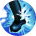

# ペット専用スキル (`PetSkill`)

27 entries. See ../README.md for how to read these blocks.

### บาสต์แอคแทค (BusterAttack) · uid 929

 
**Tree:** ペット専用スキル (`PetSkill`, tier 1) · **Type:** Attack · **Max Lv:** 1 · **Client class:** `BusterAttack`

> N$ทำการโจมตีทางกายภาพตามค่า ATK
> สร้างความเสียหายทางกายภาพอย่างรุนแรงแก่เป้าหมาย$S$การโจมตีกายภาพ/สร้างค่าความเสียหายอย่างรุนแรง

**Damage numbers by level** (gem bonuses assumed 0)

| | Lv1 | Lv2 | Lv3 | Lv4 | Lv5 | Lv6 | Lv7 | Lv8 | Lv9 | Lv10 |
|---|---|---|---|---|---|---|---|---|---|---|
| SkillRate × | 4.3 | 4.6 | 4.9 | 5.2 | 5.5 | 5.8 | 6.1 | 6.4 | 6.7 | 7 |
| Flat dmg + | 1100 | 1200 | 1300 | 1400 | 1500 | 1600 | 1700 | 1800 | 1900 | 2000 |

**Role:** attack (deals damage)

The skill builds one damage template (one hit). For each template the shared engine (`TemplateAssignment`) fills base damage, defence, element, stability and proration; this skill then adds its own terms listed below and `GetDamage()` multiplies them in `CalcStep` order.

Proration uses the **physical-skill proration slot**; Proration changes on the FIRST damaging hit of one cast on each target only; later hits of the same cast read the updated value but do not change it.

**Damage formula for this skill** (per template; `int()` after every multiplier)

- Engine terms (always present): `BaseDamage`, target `Def` (after pierce), element bonus, stability, `ExpRate = p[slot]/100` (proration), type / last-damage / gem multipliers.
- `SkillConstantDamage` adds: `(((Lv * 100) + 1000))`
- `SkillRate` multiplies by (adds into): `((((Lv * 30) + 400) / 100))`

**Proration:** slot `Skill`, mode `first_hit_per_target`, attack type `Physics`, action id 929

Recovered formulas (per method)

**`OnInitialize`** (1 path)

- set `Element` = `PlayerStatusBase.GetEquipElement(PlayerActionManagerBase.get_PlayerStatus())`
- set `ActionRange` = `PlayerAttackBase.GetWeaponRange(GetWeaponType.item(actarAction))`
- set `fixAddDamage` = `((Lv * 100) + 1000)` = 1100
- set `skillRate` = `(((Lv * 30) + 400) / 100)` = 4.3

**`calcPlayerToMobDamage`** (2 paths)

- template `AddRate[SkillRate]` = `skillRate`
- template `AddConstant[SkillConstantDamage]` = `fixAddDamage`
- info `templates` = `1`

---

### HP อัพ (PetHpUp) · uid 930

 
**Tree:** ペット専用スキル (`PetSkill`, tier 1) · **Type:** Mastery · **Max Lv:** 1 · **Client class:** `PetHpUp` (passive mastery)

> N$เพิ่ม HP สูงสุดของสัตว์เลี้ยง$S$สกิลติดตัว/เพิ่ม HP สูงสุด

**Role:** passive mastery

**Passive bonuses by level** (`GetMasteryParam(MasteryId)`)

| | Lv1 | Lv2 | Lv3 | Lv4 | Lv5 | Lv6 | Lv7 | Lv8 | Lv9 | Lv10 |
|---|---|---|---|---|---|---|---|---|---|---|
| MaxHp | 500 | 1000 | 1500 | 2000 | 2500 | 3000 | 3500 | 4000 | 4500 | 5000 |
| MaxHpRate | 2 | 4 | 6 | 8 | 10 | 12 | 14 | 16 | 18 | 20 |

---

### ดูดซับ MP (MPDrain) · uid 931

 
**Tree:** ペット専用スキル (`PetSkill`, tier 1) · **Type:** Mastery · **Max Lv:** 1

> N$เพิ่ม MP สูงสุดของสัตว์เลี้ยง$S$สกิลติดตัว/เพิ่ม MP สูงสุด

**Role:** passive mastery · no client action class (system / production / unreleased)

---

### ซ่อนตัว (PetHide) · uid 932

 
**Tree:** ペット専用スキル (`PetSkill`, tier 1) · **Type:** Mastery · **Max Lv:** 1 · **Client class:** `PetHide` (passive mastery)

> N$ซ่อนอยู่หลังเจ้าของเพื่อลดความเสียหายที่ได้รับ
> เจ้าของจะเป็นผู้รับความเสียหายส่วนที่ลดลง$S$สกิลติดตัว/รับความเสียหายบางส่วนแทนสัตว์เลี้ยง

**Role:** passive mastery

**Passive bonuses by level** (`GetMasteryParam(MasteryId)`)

| | Lv1 | Lv2 | Lv3 | Lv4 | Lv5 | Lv6 | Lv7 | Lv8 | Lv9 | Lv10 |
|---|---|---|---|---|---|---|---|---|---|---|
| DamageTransferRate | 54 | 53 | 52 | 51 | 50 | 49 | 48 | 47 | 46 | 45 |

---

### เมจิกแลนซ์ (SorciereLance) · uid 933

 
**Tree:** ペット専用スキル (`PetSkill`, tier 1) · **Type:** Attack · **Max Lv:** 1 · **Client class:** `SorcielLance`

> N$ทำการโจมตีด้วยเวทมนตร์ตามค่า MATK
> สร้างค่าความเสียหายทางเวทมนตร์อย่างรุนแรงแก่เป้าหมาย$S$การโจมตีเวทมนตร์/สร้างความค่าเสียหายอย่างรุนแรงมาก

**Damage numbers by level** (gem bonuses assumed 0)

| | Lv1 | Lv2 | Lv3 | Lv4 | Lv5 | Lv6 | Lv7 | Lv8 | Lv9 | Lv10 |
|---|---|---|---|---|---|---|---|---|---|---|
| SkillRate × | 3.3 | 3.6 | 3.9 | 4.2 | 4.5 | 4.8 | 5.1 | 5.4 | 5.7 | 6 |
| Flat dmg + | 2100 | 2200 | 2300 | 2400 | 2500 | 2600 | 2700 | 2800 | 2900 | 3000 |

**Role:** attack (deals damage)

The skill builds one damage template (one hit). For each template the shared engine (`TemplateAssignment`) fills base damage, defence, element, stability and proration; this skill then adds its own terms listed below and `GetDamage()` multiplies them in `CalcStep` order.

Proration uses the **magic proration slot**; Proration changes on the FIRST damaging hit of one cast on each target only; later hits of the same cast read the updated value but do not change it.

**Damage formula for this skill** (per template; `int()` after every multiplier)

- Engine terms (always present): `BaseDamage`, target `Def` (after pierce), element bonus, stability, `ExpRate = p[slot]/100` (proration), type / last-damage / gem multipliers.
- `SkillConstantDamage` adds: `(((Lv * 100) + 2000))`
- `SkillRate` multiplies by (adds into): `((((Lv * 30) + 300) / 100))`

**Proration:** slot `Magic`, mode `first_hit_per_target`, attack type `Magic`, action id 933

Recovered formulas (per method)

**`OnInitialize`** (1 path)

- set `Element` = `PlayerStatusBase.GetEquipElement(PlayerActionManagerBase.get_PlayerStatus())`
- set `ActionRange` = `24` = 24
- set `skillRate` = `(((Lv * 30) + 300) / 100)` = 3.3
- set `fixAddDamage` = `((Lv * 100) + 2000)` = 2100

**`calcPlayerToMobDamage`** (2 paths)

- template `AddRate[SkillRate]` = `skillRate`
- template `AddConstant[SkillConstantDamage]` = `fixAddDamage`
- info `templates` = `1`

---

### คริติคอลอัพ (PetCriticalUp) · uid 934

 
**Tree:** ペット専用スキル (`PetSkill`, tier 1) · **Type:** Buffer · **Max Lv:** 1 · **Client class:** `PetCriticalUp`

> N$เพิ่มความเสียหายคริติคอลให้สมาชิกปาร์ตี้ทุกคนชั่วขณะ
> เพิ่มความเสียหายคริติคอล$S$สนับสนุน/เพิ่มความเสียหายคริติคอลให้สมาชิกปาร์ตี้

**Role:** buff (self) · buff (party / others)

This action never changes monster proration: ExpType None: no proration slot.

It applies the buff(s) listed under **Buffs**; the buff object keeps its own timer and returns bonus values through `GetParam(SkillBufferId)`.

**Proration:** slot `none`, mode `never (ExpType None: no proration slot)`, attack type `None`, action id 934

Recovered formulas (per method)

**`OnPetSkillInitialize`** (1 path)

- set `isSupportStrong` = `1` = 1

**`ActionHit`** (2 paths)

- calls `SkillBufferManager.AddBuffer` = `AddBuffer(PlayerAttackBase.get_ActionID(), Lv, 0)` — when UnityEngine.Object.op_Inequality(actarAction)

**Buffs**

**Buff `PetCriticalUpBuf`**
- Attached to this skill via `factory:CreateSkillBuffer` (no direct constructor call in the skill's own code).
- Duration: `10` s
- `CrtDmg` = `(Lv + (((value eq 1 ? 1 : 0)) << 1))` _(when BuffEffectActive ne 0)_
- `CrtDmg` = `0` _(when BuffEffectActive eq 0)_
- Buff fields set in the constructor (all recovered):
  - `isSupportSpecialty` = `(value eq 1 ? 1 : 0)`
- Hook `Updata`: `LeftTime`=(LeftTime - UnityEngine.Time.get_deltaTime()); `LeftTime`=0

---

### เฮวี่แอคแทค (HeavyAttack) · uid 935

 
**Tree:** ペット専用スキル (`PetSkill`, tier 1) · **Type:** Attack · **Max Lv:** 1 · **Client class:** `HeavyAttack`

> N$ทำการโจมตีทางกายภาพตามค่า ATK
> สร้างค่าความเสียหายทางกายภาพอย่างรุนแรงแก่เป้าหมาย$S$การโจมตีกายภาพ/สร้างค่าความเสียหายอย่างรุนแรง

**Damage numbers by level** (gem bonuses assumed 0)

| | Lv1 | Lv2 | Lv3 | Lv4 | Lv5 | Lv6 | Lv7 | Lv8 | Lv9 | Lv10 |
|---|---|---|---|---|---|---|---|---|---|---|
| SkillRate × | 3.2 | 3.4 | 3.6 | 3.8 | 4 | 4.2 | 4.4 | 4.6 | 4.8 | 5 |
| Flat dmg + | 40 | 80 | 120 | 160 | 200 | 240 | 280 | 320 | 360 | 400 |

**Role:** attack (deals damage)

The skill builds one damage template (one hit). For each template the shared engine (`TemplateAssignment`) fills base damage, defence, element, stability and proration; this skill then adds its own terms listed below and `GetDamage()` multiplies them in `CalcStep` order.

Proration uses the **physical-skill proration slot**; Proration changes on the FIRST damaging hit of one cast on each target only; later hits of the same cast read the updated value but do not change it.

**Damage formula for this skill** (per template; `int()` after every multiplier)

- Engine terms (always present): `BaseDamage`, target `Def` (after pierce), element bonus, stability, `ExpRate = p[slot]/100` (proration), type / last-damage / gem multipliers.
- `SkillConstantDamage` adds: `(((Lv + (Lv << 2)) << 3))`
- `SkillRate` multiplies by (adds into): `((((Lv * 20) + 300) / 100))`

**Proration:** slot `Skill`, mode `first_hit_per_target`, attack type `Physics`, action id 935

Recovered formulas (per method)

**`OnInitialize`** (1 path)

- set `Element` = `PlayerStatusBase.GetEquipElement(PlayerActionManagerBase.get_PlayerStatus())`
- set `ActionRange` = `PlayerAttackBase.GetWeaponRange(GetWeaponType.item(actarAction))`
- set `fixAddDamage` = `((Lv + (Lv << 2)) << 3)` = 40
- set `skillRate` = `(((Lv * 20) + 300) / 100)` = 3.2

**`calcPlayerToMobDamage`** (2 paths)

- template `AddRate[SkillRate]` = `skillRate`
- template `AddConstant[SkillConstantDamage]` = `fixAddDamage`
- info `templates` = `1`

---

### ลอบโจมตี (SneakAttack) · uid 936

 
**Tree:** ペット専用スキル (`PetSkill`, tier 1) · **Type:** Attack · **Max Lv:** 1 · **Client class:** `SneakAttack`

> N$การโจมตีที่ไม่เพิ่มค่าเฮท
> ถ้าสัตว์เลี้ยงมีค่า ATK สูงจะโจมตีทางกายภาพ
> ถ้า ค่า MATK สูงจะโจมตีด้วยเวทมนตร์$S$การโจมตีพิเศษ/ไม่ทำให้เกิดเฮท

**Formulas that depend on live stats (not tabulated)**

- SkillRate × `skillRate`
- Flat dmg + `fixAddDamage`

**Role:** attack (deals damage)

The skill builds one damage template (one hit). For each template the shared engine (`TemplateAssignment`) fills base damage, defence, element, stability and proration; this skill then adds its own terms listed below and `GetDamage()` multiplies them in `CalcStep` order.

Proration uses the **slot chosen at runtime (physical or magic by a per-cast flag)**; Proration changes on the FIRST damaging hit of one cast on each target only; later hits of the same cast read the updated value but do not change it.

**Damage formula for this skill** (per template; `int()` after every multiplier)

- Engine terms (always present): `BaseDamage`, target `Def` (after pierce), element bonus, stability, `ExpRate = p[slot]/100` (proration), type / last-damage / gem multipliers.
- `SkillConstantDamage` adds: `fixAddDamage`
- `SkillRate` multiplies by (adds into): `skillRate`

**Proration:** slot `dynamic`, mode `first_hit_per_target`, attack type `dynamic`, action id 936

Recovered formulas (per method)

**`OnInitialize`** (1 path)

- set `Element` = `PlayerStatusBase.GetEquipElement(PlayerActionManagerBase.get_PlayerStatus())`
- set `ActionRange` = `PlayerAttackBase.GetWeaponRange(GetWeaponType.item(actarAction))`
- set `attackType` = `(status.Atk lt status.Matk ? 2 : 1)`

**`calcPlayerToMobDamage`** (6 paths)

- set `Delay` = `(IPlayerStatusCalculator.GetNextAtkTime(PlayerStatusBase.get_BattleStatus()) * 5)`
- template `AddRate[SkillRate]` = `skillRate`
- template `AddConstant[SkillConstantDamage]` = `fixAddDamage`
- info `templates` = `1`

---

### เมจิกชอต (MagicShot) · uid 937

 
**Tree:** ペット専用スキル (`PetSkill`, tier 1) · **Type:** Attack · **Max Lv:** 1 · **Client class:** `MagicShot`

> N$ทำการโจมตีด้วยเวทมนตร์ตามค่า MATK
> สร้างค่าความเสียหายทางเวทมนตร์อย่างรุนแรงแก่เป้าหมาย$S$การโจมตีเวทมนตร์/สร้างความค่าเสียหายอย่างรุนแรง

**Damage numbers by level** (gem bonuses assumed 0)

| | Lv1 | Lv2 | Lv3 | Lv4 | Lv5 | Lv6 | Lv7 | Lv8 | Lv9 | Lv10 |
|---|---|---|---|---|---|---|---|---|---|---|
| SkillRate × | 2.2 | 2.4 | 2.6 | 2.8 | 3 | 3.2 | 3.4 | 3.6 | 3.8 | 4 |
| Flat dmg + | 275 | 300 | 325 | 350 | 375 | 400 | 425 | 450 | 475 | 500 |

**Role:** attack (deals damage)

The skill builds one damage template (one hit). For each template the shared engine (`TemplateAssignment`) fills base damage, defence, element, stability and proration; this skill then adds its own terms listed below and `GetDamage()` multiplies them in `CalcStep` order.

Proration uses the **magic proration slot**; Proration changes on the FIRST damaging hit of one cast on each target only; later hits of the same cast read the updated value but do not change it.

**Damage formula for this skill** (per template; `int()` after every multiplier)

- Engine terms (always present): `BaseDamage`, target `Def` (after pierce), element bonus, stability, `ExpRate = p[slot]/100` (proration), type / last-damage / gem multipliers.
- `SkillConstantDamage` adds: `(((Lv * 25) + 250))`
- `SkillRate` multiplies by (adds into): `((((Lv * 20) + 200) / 100))`

**Proration:** slot `Magic`, mode `first_hit_per_target`, attack type `Magic`, action id 937

Recovered formulas (per method)

**`OnInitialize`** (1 path)

- set `Element` = `PlayerStatusBase.GetEquipElement(PlayerActionManagerBase.get_PlayerStatus())`
- set `ActionRange` = `24` = 24
- set `skillRate` = `(((Lv * 20) + 200) / 100)` = 2.2
- set `fixAddDamage` = `((Lv * 25) + 250)` = 275

**`calcPlayerToMobDamage`** (2 paths)

- template `AddRate[SkillRate]` = `skillRate`
- template `AddConstant[SkillConstantDamage]` = `fixAddDamage`
- info `templates` = `1`

---

### บลาสต์แฟลร์ (BlastFlare) · uid 938

 
**Tree:** ペット専用スキル (`PetSkill`, tier 1) · **Type:** Attack · **Max Lv:** 1 · **Client class:** `BlastFlare`

> N$ทำการโจมตีด้วยเวทมนตร์ตามค่า MATK
> โจมตีเป้าหมายและศัตรูที่อยู่รอบๆ
> ขอบเขตการโจมตีจะกว้างขึ้นเมื่อเลเวลสูงขึ้น$S$การโจมตีเวทมนตร์/สร้างความเสียหายแก่เป้าหมายและศัตรูที่อยู่รอบๆ

**Formulas that depend on live stats (not tabulated)**

- SkillRate × `skillRate`
- Flat dmg + `fixAddDamage`

**Role:** attack (deals damage)

The skill builds one damage template (one hit). For each template the shared engine (`TemplateAssignment`) fills base damage, defence, element, stability and proration; this skill then adds its own terms listed below and `GetDamage()` multiplies them in `CalcStep` order.

Proration uses the **magic proration slot**; Proration changes on the FIRST damaging hit of one cast on each target only; later hits of the same cast read the updated value but do not change it.

**Damage formula for this skill** (per template; `int()` after every multiplier)

- Engine terms (always present): `BaseDamage`, target `Def` (after pierce), element bonus, stability, `ExpRate = p[slot]/100` (proration), type / last-damage / gem multipliers.
- `SkillConstantDamage` adds: `fixAddDamage`
- `SkillRate` multiplies by (adds into): `skillRate`

**Proration:** slot `Magic`, mode `first_hit_per_target`, attack type `Magic`, action id 938

Recovered formulas (per method)

**`OnInitialize`** (1 path)

- set `Element` = `PlayerStatusBase.GetEquipElement(PlayerActionManagerBase.get_PlayerStatus())`
- set `ActionRange` = `24` = 24

**`calcPlayerToMobDamage`** (2 paths)

- template `AddRate[SkillRate]` = `skillRate`
- template `AddConstant[SkillConstantDamage]` = `fixAddDamage`
- info `templates` = `1`

**`ActionStart`** (1 path)

- set `attackTransform` = `UnityEngine.GameObject.get_transform(target)`
- set `attackPosition` = `UnityEngine.Transform.get_position(UnityEngine.GameObject.get_transform(target)).x`
- set `attackPosition.y` = `UnityEngine.Transform.get_position(UnityEngine.GameObject.get_transform(target)).y`
- set `attackPosition.z` = `UnityEngine.Transform.get_position(UnityEngine.GameObject.get_transform(target)).z`

---

### เซอร์เคิลฮีล (KreisHeel) · uid 939

 
**Tree:** ペット専用スキル (`PetSkill`, tier 1) · **Type:** Heal · **Max Lv:** 1 · **Client class:** `KreisHeel`

> N$ฟื้นฟู HP ให้สมาชิกปาร์ตี้ทุกคน
> ปริมาณการฟื้นฟูจะขึ้นอยู่กับ MATK ของสัตว์เลี้ยง$S$ฮีล/ฟื้นฟู HP ของสมาชิกปาร์ตี้ทุกคนที่อยู่ใกล้

**Role:** heal / recovery

This action never changes monster proration: ExpType None: no proration slot.

**Proration:** slot `none`, mode `never (ExpType None: no proration slot)`, attack type `None`, action id 939

Recovered formulas (per method)

**`OnInitialize`** (1 path)

- set `ActionRange` = `200` = 200

**`ActionHit`** (1 path)

- set `checkPos` = `UnityEngine.Transform.get_position(UnityEngine.Component.get_transform(actarAction)).x`
- set `checkPos.y` = `UnityEngine.Transform.get_position(UnityEngine.Component.get_transform(actarAction)).y`
- set `checkPos.z` = `UnityEngine.Transform.get_position(UnityEngine.Component.get_transform(actarAction)).z`

---

### กระตุ้นพลัง (BraveUp) · uid 940

 
**Tree:** ペット専用スキル (`PetSkill`, tier 1) · **Type:** Buffer · **Max Lv:** 1 · **Client class:** `BraveUp`

> N$เพิ่ม ATK และ ASPD ให้สมาชิกปาร์ตี้ที่อยู่ใกล้ชั่วขณะ
> $S$สนับสนุน/เพิ่ม ATK และ ASPD ให้สมาชิกปาร์ตี้

**Role:** buff (self) · buff (party / others)

This action never changes monster proration: ExpType None: no proration slot.

It applies the buff(s) listed under **Buffs**; the buff object keeps its own timer and returns bonus values through `GetParam(SkillBufferId)`.

**Proration:** slot `none`, mode `never (ExpType None: no proration slot)`, attack type `None`, action id 940

Recovered formulas (per method)

**`OnPetSkillInitialize`** (1 path)

- set `isSupportStrong` = `1` = 1

**`ActionHit`** (2 paths)

- calls `SkillBufferManager.AddBuffer` = `AddBuffer(PlayerAttackBase.get_ActionID(), Lv, 0)` — when UnityEngine.Object.op_Inequality(actarAction)

**Buffs**

**Buff `BraveUpBuf`**
- Attached to this skill via `factory:CreateSkillBuffer` (no direct constructor call in the skill's own code).
- Duration: `10` s
- `AtkUp` = `(((((value eq 1 ? 1 : 0)) eq 0 ? 0 : 25) + (Lv << 1)) + 30)` _(when BuffEffectActive ne 0)_
- `AspdRate` = `((((value eq 1 ? 1 : 0)) eq 0 ? 0 : 10) + Lv)` _(when BuffEffectActive ne 0)_

| | Lv1 | Lv2 | Lv3 | Lv4 | Lv5 | Lv6 | Lv7 | Lv8 | Lv9 | Lv10 |
|---|---|---|---|---|---|---|---|---|---|---|
| Aspd | 120 | 140 | 160 | 180 | 200 | 220 | 240 | 260 | 280 | 300 |
| AtkUpRate | 1 | 2 | 3 | 4 | 5 | 6 | 7 | 8 | 9 | 10 |

- Buff fields set in the constructor (all recovered):
  - `isSupportSpecialty` = `(value eq 1 ? 1 : 0)`
- Hook `Updata`: `LeftTime`=(LeftTime - UnityEngine.Time.get_deltaTime()); `LeftTime`=0

---

### ปฐมพยาบาล (PetFirstAid) · uid 941

 
**Tree:** ペット専用スキル (`PetSkill`, tier 1) · **Type:** Special · **Max Lv:** 1 · **Client class:** `PetFirstAid`

> N$ปฐมพยาบาลให้เจ้าของตอนที่หมดพลัง
> ลดเวลาที่รอเพื่อคืนชีพ$S$ฮีล/ปฐมพยาบาลให้เจ้าของตอนหมดพลัง

**Role:** buff (self)

This action never changes monster proration: ExpType None: no proration slot.

It applies the buff(s) listed under **Buffs**; the buff object keeps its own timer and returns bonus values through `GetParam(SkillBufferId)`.

**Mechanics recovered from code**

- **Cost** (`cost`): `FirstAidBuf.GetParam(14)`; `100` = 100

**Proration:** slot `none`, mode `never (ExpType None: no proration slot)`, attack type `None`, action id 941

Recovered formulas (per method)

**`OnInitialize`** (2 paths)

- set `ActionRange` = `6` = 6
- set `cost` = `FirstAidBuf.GetParam(14)`
- set `cost` = `100` = 100

**`InitializeOthers`** (1 path)

- set `ActionRange` = `-1` = -1

**Buffs**

**Buff `FirstAidBuf`**
- Attached to this skill via `caller2:SkillBufferManager$$UpdateFirstAidBuffer<-PetFirstAid$$ActionStart` (no direct constructor call in the skill's own code).
- Buff hook methods: `InvalidInvincible`, `LevelUp`, `ValidInvincible`
- `FirstAidCost` = `0` _(when BuffEffectActive eq 0)_

| | Lv1 | Lv2 | Lv3 | Lv4 | Lv5 | Lv6 | Lv7 | Lv8 | Lv9 | Lv10 |
|---|---|---|---|---|---|---|---|---|---|---|
| FirstAidCost | 200 | 300 | 400 | 500 | 600 | 700 | 800 | 900 | 1000 | 1100 |

- Buff fields set in the constructor (all recovered):
  - `_flag` = `2560` = 2560
  - `levelDownTimer` = `time`
- Hook `Updata`: `levelDownTimer`=((levelDownTimer - UnityEngine.Time.get_deltaTime()) + 60); `Level`=(Lv - 1); `LeftTime`=(LeftTime - UnityEngine.Time.get_deltaTime()); `LeftTime`=0
- Hook `LevelUp`: `Level`=(Lv + 1); `levelDownTimer`=60
- Hook `ValidInvincible`: `LeftTime`=time; `_flag`=((_flag & 0xffffe7ff) | 0x1000)
- Hook `InvalidInvincible`: `LeftTime`=0; `_flag`=((_flag & 0xffffe7ff) | 2048)

---

### เพิ่มกำลังใจ (MindUp) · uid 942

 
**Tree:** ペット専用スキル (`PetSkill`, tier 1) · **Type:** Buffer · **Max Lv:** 1 · **Client class:** `MindUp`

> N$N$เพิ่ม MATK และ CSPD ให้สมาชิกปาร์ตี้ที่อยู่ใกล้ชั่วขณะ
> $S$สนับสนุน/เพิ่ม MATK และ CSPD ให้สมาชิกปาร์ตี้

**Role:** buff (self) · buff (party / others)

This action never changes monster proration: ExpType None: no proration slot.

It applies the buff(s) listed under **Buffs**; the buff object keeps its own timer and returns bonus values through `GetParam(SkillBufferId)`.

**Proration:** slot `none`, mode `never (ExpType None: no proration slot)`, attack type `None`, action id 942

Recovered formulas (per method)

**`OnPetSkillInitialize`** (1 path)

- set `isSupportStrong` = `1` = 1

**`ActionHit`** (2 paths)

- calls `SkillBufferManager.AddBuffer` = `AddBuffer(PlayerAttackBase.get_ActionID(), Lv, 0)` — when UnityEngine.Object.op_Inequality(actarAction)

**Buffs**

**Buff `MindUpBuf`**
- Attached to this skill via `factory:CreateSkillBuffer` (no direct constructor call in the skill's own code).
- Duration: `10` s
- `CspdUpRate` = `((((value eq 1 ? 1 : 0)) eq 0 ? 0 : 10) + Lv)` _(when BuffEffectActive ne 0)_
- `MatkUp` = `(((((value eq 1 ? 1 : 0)) eq 0 ? 0 : 25) + (Lv << 1)) + 30)` _(when BuffEffectActive ne 0)_

| | Lv1 | Lv2 | Lv3 | Lv4 | Lv5 | Lv6 | Lv7 | Lv8 | Lv9 | Lv10 |
|---|---|---|---|---|---|---|---|---|---|---|
| MAtkUpRate | 1 | 2 | 3 | 4 | 5 | 6 | 7 | 8 | 9 | 10 |
| CspdUp | 120 | 140 | 160 | 180 | 200 | 220 | 240 | 260 | 280 | 300 |

- Buff fields set in the constructor (all recovered):
  - `isSupportSpecialty` = `(value eq 1 ? 1 : 0)`
- Hook `Updata`: `LeftTime`=(LeftTime - UnityEngine.Time.get_deltaTime()); `LeftTime`=0

---

### ฟื้นฟู (PetHealing) · uid 943

 
**Tree:** ペット専用スキル (`PetSkill`, tier 1) · **Type:** Heal · **Max Lv:** 1 · **Client class:** `PetHealing`

> N$ฟื้นฟูให้ผู้เล่นที่มี HP เหลือน้อยที่สุด
> ปริมาณการฟื้นฟูจะขึ้นอยู่กับ MATK ของสัตว์เลี้ยง$S$ฮีล/ฟื้นฟูให้เป้าหมายที่มี HP เหลือน้อยที่สุด

**Role:** heal / recovery

This action never changes monster proration: ExpType None: no proration slot.

**Proration:** slot `none`, mode `never (ExpType None: no proration slot)`, attack type `None`, action id 943

Recovered formulas (per method)

**`OnInitialize`** (1 path)

- set `ActionRange` = `200` = 200

---

### สวีปแอคแทค (SweepAttack) · uid 944

 
**Tree:** ペット専用スキル (`PetSkill`, tier 1) · **Type:** Attack · **Max Lv:** 1 · **Client class:** `SweepAttack`

> N$ทำการโจมตีทางกายภาพตามค่า ATK
> มีโอกาสทำให้เป้าหมาย[ล้มคว่ำ]$S$การโจมตีกายภาพ/มีโอกาสทำให้[ล้มคว่ำ]

**Formulas that depend on live stats (not tabulated)**

- SkillRate × `skillRate`
- Flat dmg + `fixAddDamage`

**Role:** attack (deals damage) · applies status ailment

The skill builds one damage template (one hit). For each template the shared engine (`TemplateAssignment`) fills base damage, defence, element, stability and proration; this skill then adds its own terms listed below and `GetDamage()` multiplies them in `CalcStep` order.

Proration uses the **physical-skill proration slot**; Proration changes on the FIRST damaging hit of one cast on each target only; later hits of the same cast read the updated value but do not change it.

**Damage formula for this skill** (per template; `int()` after every multiplier)

- Engine terms (always present): `BaseDamage`, target `Def` (after pierce), element bonus, stability, `ExpRate = p[slot]/100` (proration), type / last-damage / gem multipliers.
- `SkillConstantDamage` adds: `fixAddDamage`
- `SkillRate` multiplies by (adds into): `skillRate`

**Proration:** slot `Skill`, mode `first_hit_per_target`, attack type `Physics`, action id 944

Recovered formulas (per method)

**`OnInitialize`** (1 path)

- set `Element` = `PlayerStatusBase.GetEquipElement(PlayerActionManagerBase.get_PlayerStatus())`
- set `ActionRange` = `PlayerAttackBase.GetWeaponRange(GetWeaponType.item(actarAction))`

**`calcPlayerToMobDamage`** (8 paths)

- template `AddRate[SkillRate]` = `skillRate`
- template `AddConstant[SkillConstantDamage]` = `fixAddDamage`
- calls `PlayerAttackBase.checkAbnormalPercent` = `checkAbnormalPercent(2, abnormalPercent, playerAction)`
- calls `SkillDamageData.SetAbnormalType` = `SetAbnormalType(2, 0)` — when PlayerAttackBase.checkAbnormalPercent(this, 2, abnormalPercent, playerAction)
- info `templates` = `1`

---

### คลีนฮิต (DownBlow) · uid 945

 
**Tree:** ペット専用スキル (`PetSkill`, tier 1) · **Type:** Attack · **Max Lv:** 1 · **Client class:** `DownBlow`

> N$ทำการโจมตีทางกายภาพตามค่า ATK
> มีโอกาสทำให้เป้าหมาย[ผงะ]$S$การโจมตีกายภาพ/มีโอกาสทำให้[ผงะ]

**Formulas that depend on live stats (not tabulated)**

- SkillRate × `skillRate`
- Flat dmg + `fixAddDamage`

**Role:** attack (deals damage) · applies status ailment

The skill builds one damage template (one hit). For each template the shared engine (`TemplateAssignment`) fills base damage, defence, element, stability and proration; this skill then adds its own terms listed below and `GetDamage()` multiplies them in `CalcStep` order.

Proration uses the **physical-skill proration slot**; Proration changes on the FIRST damaging hit of one cast on each target only; later hits of the same cast read the updated value but do not change it.

**Damage formula for this skill** (per template; `int()` after every multiplier)

- Engine terms (always present): `BaseDamage`, target `Def` (after pierce), element bonus, stability, `ExpRate = p[slot]/100` (proration), type / last-damage / gem multipliers.
- `SkillConstantDamage` adds: `fixAddDamage`
- `SkillRate` multiplies by (adds into): `skillRate`

**Proration:** slot `Skill`, mode `first_hit_per_target`, attack type `Physics`, action id 945

Recovered formulas (per method)

**`OnInitialize`** (1 path)

- set `Element` = `PlayerStatusBase.GetEquipElement(PlayerActionManagerBase.get_PlayerStatus())`
- set `ActionRange` = `PlayerAttackBase.GetWeaponRange(GetWeaponType.item(actarAction))`

**`calcPlayerToMobDamage`** (8 paths)

- template `AddRate[SkillRate]` = `skillRate`
- template `AddConstant[SkillConstantDamage]` = `fixAddDamage`
- calls `PlayerAttackBase.checkAbnormalPercent` = `checkAbnormalPercent(1, abnormalPercent, playerAction)`
- calls `SkillDamageData.SetAbnormalType` = `SetAbnormalType(1, 0)` — when PlayerAttackBase.checkAbnormalPercent(this, 1, abnormalPercent, playerAction)
- info `templates` = `1`

---

### เรจแอคแทค (RageAttack) · uid 946

 
**Tree:** ペット専用スキル (`PetSkill`, tier 1) · **Type:** Attack · **Max Lv:** 1 · **Client class:** `RageAttack`

> N$การโจมตีที่ทำให้เกิดค่าเฮทสูง
> าสัตว์เลี้ยงมีค่า ATK สูงจะโจมตีทางกายภาพ
> ถ้า ค่า MATK สูงจะโจมตีด้วยเวทย์$S$การโจมตีพิเศษ/ทำให้เกิดเฮทจำนวนมาก

**Formulas that depend on live stats (not tabulated)**

- SkillRate × `skillRate`
- Flat dmg + `fixAddDamage`

**Role:** attack (deals damage)

The skill builds one damage template (one hit). For each template the shared engine (`TemplateAssignment`) fills base damage, defence, element, stability and proration; this skill then adds its own terms listed below and `GetDamage()` multiplies them in `CalcStep` order.

Proration uses the **slot chosen at runtime (physical or magic by a per-cast flag)**; Proration changes on the FIRST damaging hit of one cast on each target only; later hits of the same cast read the updated value but do not change it.

**Damage formula for this skill** (per template; `int()` after every multiplier)

- Engine terms (always present): `BaseDamage`, target `Def` (after pierce), element bonus, stability, `ExpRate = p[slot]/100` (proration), type / last-damage / gem multipliers.
- `SkillConstantDamage` adds: `fixAddDamage`
- `SkillRate` multiplies by (adds into): `skillRate`

**Proration:** slot `dynamic`, mode `first_hit_per_target`, attack type `dynamic`, action id 946

Recovered formulas (per method)

**`OnInitialize`** (1 path)

- set `Element` = `PlayerStatusBase.GetEquipElement(PlayerActionManagerBase.get_PlayerStatus())`
- set `ActionRange` = `PlayerAttackBase.GetWeaponRange(GetWeaponType.item(actarAction))`
- set `attackType` = `(status.Atk lt status.Matk ? 2 : 1)`

**`calcPlayerToMobDamage`** (6 paths)

- set `Delay` = `(IPlayerStatusCalculator.GetNextAtkTime(PlayerStatusBase.get_BattleStatus()) * 5)`
- template `AddRate[SkillRate]` = `skillRate`
- template `AddConstant[SkillConstantDamage]` = `fixAddDamage`
- info `templates` = `1`

---

### บลายอิ้งแชโดว์ (BlindEye) · uid 947

 
**Tree:** ペット専用スキル (`PetSkill`, tier 1) · **Type:** Attack · **Max Lv:** 1 · **Client class:** `BlindEye`

> N$ทำการโจมตีด้วยเวทมนตร์ตามค่า MATK
> มีโอกาสทำให้เป้าหมายติด[มืดบอด]$S$การโจมตีกายภาพ/มีโอกาสทำให้[มืดบอด]

**Damage numbers by level** (gem bonuses assumed 0)

| | Lv1 | Lv2 | Lv3 | Lv4 | Lv5 | Lv6 | Lv7 | Lv8 | Lv9 | Lv10 |
|---|---|---|---|---|---|---|---|---|---|---|
| SkillRate × | 0.6 | 0.7 | 0.8 | 0.9 | 1 | 1.1 | 1.2 | 1.3 | 1.4 | 1.5 |
| Flat dmg + | 110 | 120 | 130 | 140 | 150 | 160 | 170 | 180 | 190 | 200 |

**Role:** attack (deals damage) · applies status ailment

The skill builds one damage template (one hit). For each template the shared engine (`TemplateAssignment`) fills base damage, defence, element, stability and proration; this skill then adds its own terms listed below and `GetDamage()` multiplies them in `CalcStep` order.

Proration uses the **magic proration slot**; Proration changes on the FIRST damaging hit of one cast on each target only; later hits of the same cast read the updated value but do not change it.

**Damage formula for this skill** (per template; `int()` after every multiplier)

- Engine terms (always present): `BaseDamage`, target `Def` (after pierce), element bonus, stability, `ExpRate = p[slot]/100` (proration), type / last-damage / gem multipliers.
- `SkillConstantDamage` adds: `((((Lv + (Lv << 2)) << 1) + 100))`
- `SkillRate` multiplies by (adds into): `(((((Lv + (Lv << 2)) << 1) + 50) / 100))`

**Mechanics recovered from code**

- **Chance to inflict the skill's status ailment (%)** (`abnormalPercent`): `((Lv + (Lv << 1)) + 70)` = 73

**Proration:** slot `Magic`, mode `first_hit_per_target`, attack type `Magic`, action id 947

Recovered formulas (per method)

**`OnInitialize`** (1 path)

- set `Element` = `PlayerStatusBase.GetEquipElement(PlayerActionManagerBase.get_PlayerStatus())`
- set `ActionRange` = `16` = 16
- set `fixAddDamage` = `(((Lv + (Lv << 2)) << 1) + 100)` = 110
- set `skillRate` = `((((Lv + (Lv << 2)) << 1) + 50) / 100)` = 0.6
- set `abnormalPercent` = `((Lv + (Lv << 1)) + 70)` = 73

**`calcPlayerToMobDamage`** (8 paths)

- template `AddRate[SkillRate]` = `skillRate`
- template `AddConstant[SkillConstantDamage]` = `fixAddDamage`
- calls `PlayerAttackBase.checkAbnormalPercent` = `checkAbnormalPercent(7, abnormalPercent, playerAction)`
- calls `SkillDamageData.SetAbnormalType` = `SetAbnormalType(7, 0)` — when PlayerAttackBase.checkAbnormalPercent(this, 7, abnormalPercent, playerAction)
- info `templates` = `1`

---

### เพิ่มแรงต้านทาน (CutUp) · uid 948

 
**Tree:** ペット専用スキル (`PetSkill`, tier 1) · **Type:** Buffer · **Max Lv:** 1 · **Client class:** `CutUp`

> N$N$เพิ่มความต้านทานทางกายภาพและต้านทานเวท
> ให้สมาชิกปาร์ตี้ที่อยู่ใกล้ชั่วขณะ
> $S$สนับสนุน/เพิ่มความต้านทานทางกายภาพและต้านทานเวทให้สมาชิกปาร์ตี้

**Role:** buff (self) · buff (party / others)

This action never changes monster proration: ExpType None: no proration slot.

It applies the buff(s) listed under **Buffs**; the buff object keeps its own timer and returns bonus values through `GetParam(SkillBufferId)`.

**Proration:** slot `none`, mode `never (ExpType None: no proration slot)`, attack type `None`, action id 948

Recovered formulas (per method)

**`OnPetSkillInitialize`** (1 path)

- set `isSupportStrong` = `1` = 1

**`ActionHit`** (2 paths)

- calls `SkillBufferManager.AddBuffer` = `AddBuffer(PlayerAttackBase.get_ActionID(), Lv, 0)` — when UnityEngine.Object.op_Inequality(actarAction)

**Buffs**

**Buff `CutUpBuf`**
- Attached to this skill via `factory:CreateSkillBuffer` (no direct constructor call in the skill's own code).
- Duration: `10` s
- `PowerDmgCut` = `((((value eq 1 ? 1 : 0)) eq 0 ? 0 : 5) + (Lv + (Lv << 1)))` _(when BuffEffectActive ne 0)_
- `MagicDmgCut` = `((((value eq 1 ? 1 : 0)) eq 0 ? 0 : 5) + (Lv + (Lv << 1)))` _(when BuffEffectActive ne 0)_
- Buff fields set in the constructor (all recovered):
  - `isSupportSpecialty` = `(value eq 1 ? 1 : 0)`
- Hook `Updata`: `LeftTime`=(LeftTime - UnityEngine.Time.get_deltaTime()); `LeftTime`=0

---

### สตันแอคแทค (StanAttack) · uid 949

 
**Tree:** ペット専用スキル (`PetSkill`, tier 1) · **Type:** Attack · **Max Lv:** 1 · **Client class:** `StanAttack`

> N$ทำการโจมตีทางกายภาพตามค่า ATK
> มีโอกาสทำให้เป้าหมาย[หมดสติ]$S$การโจมตีกายภาพ/มีโอกาสทำให้[หมดสติ]

**Formulas that depend on live stats (not tabulated)**

- SkillRate × `skillRate`
- Flat dmg + `fixAddDamage`

**Role:** attack (deals damage) · applies status ailment

The skill builds one damage template (one hit). For each template the shared engine (`TemplateAssignment`) fills base damage, defence, element, stability and proration; this skill then adds its own terms listed below and `GetDamage()` multiplies them in `CalcStep` order.

Proration uses the **physical-skill proration slot**; Proration changes on the FIRST damaging hit of one cast on each target only; later hits of the same cast read the updated value but do not change it.

**Damage formula for this skill** (per template; `int()` after every multiplier)

- Engine terms (always present): `BaseDamage`, target `Def` (after pierce), element bonus, stability, `ExpRate = p[slot]/100` (proration), type / last-damage / gem multipliers.
- `SkillConstantDamage` adds: `fixAddDamage`
- `SkillRate` multiplies by (adds into): `skillRate`

**Proration:** slot `Skill`, mode `first_hit_per_target`, attack type `Physics`, action id 949

Recovered formulas (per method)

**`OnInitialize`** (1 path)

- set `Element` = `PlayerStatusBase.GetEquipElement(PlayerActionManagerBase.get_PlayerStatus())`
- set `ActionRange` = `PlayerAttackBase.GetWeaponRange(GetWeaponType.item(actarAction))`

**`calcPlayerToMobDamage`** (8 paths)

- template `AddRate[SkillRate]` = `skillRate`
- template `AddConstant[SkillConstantDamage]` = `fixAddDamage`
- calls `PlayerAttackBase.checkAbnormalPercent` = `checkAbnormalPercent(3, abnormalPercent, playerAction)`
- calls `SkillDamageData.SetAbnormalType` = `SetAbnormalType(3, 0)` — when PlayerAttackBase.checkAbnormalPercent(this, 3, abnormalPercent, playerAction)
- info `templates` = `1`

---

### ปกป้อง (PetProtect) · uid 950

 
**Tree:** ペット専用スキル (`PetSkill`, tier 1) · **Type:** Mastery · **Max Lv:** 1 · **Client class:** `PetProtect` (passive mastery)

> N$ลดค่าความเสียหายที่เจ้าของได้รับ
> สัตว์เลี้ยงจะรับค่าความเสียหายส่วนที่ลดลง$S$สกิลติดตัว/สัตว์เลี้ยงจะรับความเสียหายบางส่วนแทนเจ้าของ

**Role:** passive mastery

**Passive bonuses by level** (`GetMasteryParam(MasteryId)`)

| | Lv1 | Lv2 | Lv3 | Lv4 | Lv5 | Lv6 | Lv7 | Lv8 | Lv9 | Lv10 |
|---|---|---|---|---|---|---|---|---|---|---|
| DamageTransferRate | 54 | 53 | 52 | 51 | 50 | 49 | 48 | 47 | 46 | 45 |

---

### ดูดซับ HP (HPDrain) · uid 951

 
**Tree:** ペット専用スキル (`PetSkill`, tier 1) · **Type:** Mastery · **Max Lv:** 1

> N$เปลี่ยนค่าความเสียหายบางส่วนที่ได้รับเป็น HP
> $S$สกิลติดตัว/ฟื้นฟู HP จากความเสียหายที่ได้รับบางส่วน

**Role:** passive mastery · no client action class (system / production / unreleased)

---

### MP อัพ (PetMpUp) · uid 952

 
**Tree:** ペット専用スキル (`PetSkill`, tier 1) · **Type:** Mastery · **Max Lv:** 1 · **Client class:** `PetMpUp` (passive mastery)

> N$เพิ่ม MP สูงสุดของสัตว์เลี้ยง$S$สกิลติดตัว/เพิ่ม MP สูงสุด

**Role:** passive mastery

**Passive bonuses by level** (`GetMasteryParam(MasteryId)`)

| | Lv1 | Lv2 | Lv3 | Lv4 | Lv5 | Lv6 | Lv7 | Lv8 | Lv9 | Lv10 |
|---|---|---|---|---|---|---|---|---|---|---|
| MaxMp | 100 | 200 | 300 | 400 | 500 | 600 | 700 | 800 | 900 | 1000 |

---

### ชีลเบรคเกอร์ (SealBreaker) · uid 953

 
**Tree:** ペット専用スキル (`PetSkill`, tier 1) · **Type:** Attack · **Max Lv:** 1 · **Client class:** `SealBreaker`

> N$ทำการโจมตีด้วยเวทมนตร์ตามค่า MATK
> มีโอกาสทำให้เป้าหมาย[ลดการป้องกัน]$S$การโจมตีกายภาพ/มีโอกาสทำให้[ลดการป้องกัน]

**Formulas that depend on live stats (not tabulated)**

- SkillRate × `skillRate`
- Flat dmg + `fixAddDamage`

**Role:** attack (deals damage) · applies status ailment

The skill builds one damage template (one hit). For each template the shared engine (`TemplateAssignment`) fills base damage, defence, element, stability and proration; this skill then adds its own terms listed below and `GetDamage()` multiplies them in `CalcStep` order.

Proration uses the **magic proration slot**; Proration changes on the FIRST damaging hit of one cast on each target only; later hits of the same cast read the updated value but do not change it.

**Damage formula for this skill** (per template; `int()` after every multiplier)

- Engine terms (always present): `BaseDamage`, target `Def` (after pierce), element bonus, stability, `ExpRate = p[slot]/100` (proration), type / last-damage / gem multipliers.
- `SkillConstantDamage` adds: `fixAddDamage`
- `SkillRate` multiplies by (adds into): `skillRate`

**Proration:** slot `Magic`, mode `first_hit_per_target`, attack type `Magic`, action id 953

Recovered formulas (per method)

**`OnInitialize`** (1 path)

- set `Element` = `PlayerStatusBase.GetEquipElement(PlayerActionManagerBase.get_PlayerStatus())`
- set `ActionRange` = `16` = 16

**`calcPlayerToMobDamage`** (8 paths)

- template `AddRate[SkillRate]` = `skillRate`
- template `AddConstant[SkillConstantDamage]` = `fixAddDamage`
- calls `PlayerAttackBase.checkAbnormalPercent` = `checkAbnormalPercent(10, abnormalPercent, playerAction)`
- calls `SkillDamageData.SetAbnormalType` = `SetAbnormalType(10, 0)` — when PlayerAttackBase.checkAbnormalPercent(this, 10, abnormalPercent, playerAction)
- info `templates` = `1`

---

### การการโจมตีปกติ (กายภาพ) (PetPhysicalAttack) · uid 958

**Tree:** ペット専用スキル (`PetSkill`, tier 1) · **Type:** Attack · **Client class:** `PetNormalAttackAction`

> No Info Data...

**Role:** utility / system action

This action never changes monster proration: ExpType None: no proration slot.

**Proration:** slot `none`, mode `never (ExpType None: no proration slot)`, attack type `None`, action id 958

Recovered formulas (per method)

**`OnInitialize`** (1 path)

- set `Element` = `PlayerStatusBase.GetEquipElement(PlayerActionManagerBase.get_PlayerStatus())`
- set `ActionRange` = `PlayerAttackBase.GetWeaponRange(GetWeaponType.item(actarAction))`

**`calcPlayerToMobDamage`** (2 paths)

- set `Delay` = `IPlayerStatusCalculator.GetNextAtkTime(PlayerStatusBase.get_SecondaryStatus())`
- info `templates` = `1`

---

### การโจมตีปกติ (เวทมนตร์) (PetMagicAttack) · uid 959

**Tree:** ペット専用スキル (`PetSkill`, tier 1) · **Type:** Attack · **Client class:** `PetNormalMagicAction`

> No Info Data...

**Role:** attack (deals damage)

The skill builds one damage template (one hit). For each template the shared engine (`TemplateAssignment`) fills base damage, defence, element, stability and proration; this skill then adds its own terms listed below and `GetDamage()` multiplies them in `CalcStep` order.

This action never changes monster proration: ExpType None: no proration slot.

**Damage formula for this skill** (per template; `int()` after every multiplier)

- Engine terms (always present): `BaseDamage`, target `Def` (after pierce), element bonus, stability, `ExpRate = p[slot]/100` (proration), type / last-damage / gem multipliers.
- `ExpRate` sets: `ExtensionMethod.ExSkillData.SkillDataExtentionMethod.GetTargetExpRate(PetNormalMagicAction.get_AttackType(), PetNormalMagicAction.get_ActionID(), MobActionManagerBase.get_MobBattleStatus(mobAction))`

**Proration:** slot `none`, mode `never (ExpType None: no proration slot)`, attack type `None`, action id 959

Recovered formulas (per method)

**`OnInitialize`** (1 path)

- set `Element` = `PlayerStatusBase.GetEquipElement(PlayerActionManagerBase.get_PlayerStatus())`
- set `ActionRange` = `MathUtil.DisplayMeterToDistance(9)`

**`calcPlayerToMobDamage`** (2 paths)

- set `Delay` = `IPlayerStatusCalculator.GetNextAtkTime(PlayerStatusBase.get_SecondaryStatus())`
- template `SetRate[ExpRate]` = `ExtensionMethod.ExSkillData.SkillDataExtentionMethod.GetTargetExpRate(PetNormalMagicAction.get_AttackType(), PetNormalMagicAction.get_ActionID(), MobActionManagerBase.get_MobBattleStatus(mobAction))`
- info `templates` = `1`

---
