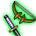
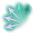

# สกิลยิง (`ShootSkill`)

25 entries. See ../README.md for how to read these blocks.

### พาวเวอร์ชู้ต (PowerShoot) · uid 65

 
**Tree:** สกิลยิง (`ShootSkill`, tier 1) · **Type:** Attack · **Max Lv:** 10 · **Weapons:** Bow, Bowgun, Arrow · **Flags:** StarGem, MercenaryCanUseSkill · **Client class:** `PowerShootAction`

> โจมตีเป้าหมายด้วยพลังรุนแรง
> เวลาชาร์จจะลดลงเมื่อเลเวลเพิ่มสูงขึ้น
> มีโอกาสทำให้เป้าหมาย[ล้มคว่ำ]
> และอัตราคริติคอลจะเพิ่มขึ้นถ้าเป้าหมายติดสภาวะ[เชื่องช้า]

In-game level notes

- Lv12: *อัตราติดล้มคว่ำ+40%
- Lv13: *เวลาชาร์จน้อยลง *อัตราติดล้มคว่ำ-40%

**Damage numbers by level** (gem bonuses assumed 0)

| | Lv1 | Lv2 | Lv3 | Lv4 | Lv5 | Lv6 | Lv7 | Lv8 | Lv9 | Lv10 |
|---|---|---|---|---|---|---|---|---|---|---|
| SkillRate × [AbnormalStateManager.Contains(MobActionManagerBase.get_AbnormalStateManager(mobAction), 11) AND PlayerAttackBase.checkAbnormalPercent(this, 2, tumblePercent, playerAction) AND SkillCalcTemplate.CheckStepResult(PlayerAttackBase.TemplateAssignment(this, new SkillCalcTemplate, playerAction, mobAction), 0) OR !AbnormalStateManager.Contains(MobActionManagerBase.get_AbnormalStateManager(mobAction), 11) AND PlayerAttackBase.checkAbnormalPercent(this, 2, tumblePercent, playerAction) AND SkillCalcTemplate.CheckStepResult(PlayerAttackBase.TemplateAssignment(this, new SkillCalcTemplate, playerAction, mobAction), 0)] | 1.3 | 1.35 | 1.4 | 1.45 | 1.5 | 1.55 | 1.6 | 1.65 | 1.7 | 1.75 |
| SkillRate × [!SkillCalcTemplate.CheckStepResult(PlayerAttackBase.TemplateAssignment(this, new SkillCalcTemplate, playerAction, mobAction), 0) AND AbnormalStateManager.Contains(MobActionManagerBase.get_AbnormalStateManager(mobAction), 11) OR !AbnormalStateManager.Contains(MobActionManagerBase.get_AbnormalStateManager(mobAction), 11) AND !SkillCalcTemplate.CheckStepResult(PlayerAttackBase.TemplateAssignment(this, new SkillCalcTemplate, playerAction, mobAction), 0) OR !PlayerAttackBase.checkAbnormalPercent(this, 2, tumblePercent, playerAction) AND AbnormalStateManager.Contains(MobActionManagerBase.get_AbnormalStateManager(mobAction), 11) AND SkillCalcTemplate.CheckStepResult(PlayerAttackBase.TemplateAssignment(this, new SkillCalcTemplate, playerAction, mobAction), 0)] | 1.3 | 1.35 | 1.4 | 1.45 | 1.5 | 1.55 | 1.6 | 1.65 | 1.7 | 1.75 |
| Flat dmg + | 58 | 66 | 74 | 82 | 90 | 98 | 106 | 114 | 122 | 130 |

**Formulas that depend on live stats (not tabulated)**

- SkillRate × `(((((Lv * 5) + 125)) + gemCart(103[4])) / 100)` — AbnormalStateManager.Contains(MobActionManagerBase.get_AbnormalStateManager(mobAction), 11) AND PlayerAttackBase.checkAbnormalPercent(this, 2, tumblePercent, playerAction) AND SkillCalcTemplate.CheckStepResult(PlayerAttackBase.TemplateAssignment(this, new SkillCalcTemplate, playerAction, mobAction), 0) OR !AbnormalStateManager.Contains(MobActionManagerBase.get_AbnormalStateManager(mobAction), 11) AND PlayerAttackBase.checkAbnormalPercent(this, 2, tumblePercent, playerAction) AND SkillCalcTemplate.CheckStepResult(PlayerAttackBase.TemplateAssignment(this, new SkillCalcTemplate, playerAction, mobAction), 0) & AbnormalStateManager.Contains(MobActionManagerBase.get_AbnormalStateManager(mobAction), 11) AND PlayerAttackBase.checkAbnormalPercent(this, 2, tumblePercent, playerAction) AND SkillCalcTemplate.CheckStepResult(PlayerAttackBase.TemplateAssignment(this, new SkillCalcTemplate, playerAction, mobAction), 0) OR !AbnormalStateManager.Contains(MobActionManagerBase.get_AbnormalStateManager(mobAction), 11) AND PlayerAttackBase.checkAbnormalPercent(this, 2, tumblePercent, playerAction) AND SkillCalcTemplate.CheckStepResult(PlayerAttackBase.TemplateAssignment(this, new SkillCalcTemplate, playerAction, mobAction), 0)
- SkillRate × `((((Lv * 5) + 125)) / 100)` — AbnormalStateManager.Contains(MobActionManagerBase.get_AbnormalStateManager(mobAction), 11) AND PlayerAttackBase.checkAbnormalPercent(this, 2, tumblePercent, playerAction) AND SkillCalcTemplate.CheckStepResult(PlayerAttackBase.TemplateAssignment(this, new SkillCalcTemplate, playerAction, mobAction), 0) OR !AbnormalStateManager.Contains(MobActionManagerBase.get_AbnormalStateManager(mobAction), 11) AND PlayerAttackBase.checkAbnormalPercent(this, 2, tumblePercent, playerAction) AND SkillCalcTemplate.CheckStepResult(PlayerAttackBase.TemplateAssignment(this, new SkillCalcTemplate, playerAction, mobAction), 0) & !SkillCalcTemplate.CheckStepResult(PlayerAttackBase.TemplateAssignment(this, new SkillCalcTemplate, playerAction, mobAction), 0) AND AbnormalStateManager.Contains(MobActionManagerBase.get_AbnormalStateManager(mobAction), 11) OR !AbnormalStateManager.Contains(MobActionManagerBase.get_AbnormalStateManager(mobAction), 11) AND !SkillCalcTemplate.CheckStepResult(PlayerAttackBase.TemplateAssignment(this, new SkillCalcTemplate, playerAction, mobAction), 0) OR !PlayerAttackBase.checkAbnormalPercent(this, 2, tumblePercent, playerAction) AND AbnormalStateManager.Contains(MobActionManagerBase.get_AbnormalStateManager(mobAction), 11) AND SkillCalcTemplate.CheckStepResult(PlayerAttackBase.TemplateAssignment(this, new SkillCalcTemplate, playerAction, mobAction), 0)

**Role:** attack (deals damage) · applies status ailment

The skill builds one damage template (one hit). For each template the shared engine (`TemplateAssignment`) fills base damage, defence, element, stability and proration; this skill then adds its own terms listed below and `GetDamage()` multiplies them in `CalcStep` order.

Proration uses the **physical-skill proration slot**; Proration changes on the FIRST damaging hit of one cast on each target only; later hits of the same cast read the updated value but do not change it.

**Damage formula for this skill** (per template; `int()` after every multiplier)

- Engine terms (always present): `BaseDamage`, target `Def` (after pierce), element bonus, stability, `ExpRate = p[slot]/100` (proration), type / last-damage / gem multipliers.
- `SkillConstantDamage` adds: `(((Lv << 3) + 50))`
- `SkillRate` multiplies by (adds into): `(((((Lv * 5) + 125)) + gemCart(103[4])) / 100)` | `((((Lv * 5) + 125)) / 100)`

**Mechanics recovered from code**

- **Tumble chance (%)** (`tumblePercent`): `(((Lv + (Lv << 1)) + 20) + 40)` → Lv1..10 [63, 66, 69, 72, 75, 78, 81, 84, 87, 90] _(when (mainWeaponType & 0xfffffffe) ne 12 AND subWeapon != Bowgun AND subWeapon == Bow OR (mainWeaponType & 0xfffffffe) eq 12 AND mainWeapon != Bowgun AND mainWeapon == Bow)_; `((Lv + (Lv << 1)) + 20)` → Lv1..10 [23, 26, 29, 32, 35, 38, 41, 44, 47, 50] _(when (mainWeaponType & 0xfffffffe) ne 12 AND subWeapon != Bow AND subWeapon != Bowgun OR (mainWeaponType & 0xfffffffe) eq 12 AND mainWeapon != Bow AND mainWeapon != Bowgun)_; `(((Lv + (Lv << 1)) + 20) - 40)` → Lv1..10 [-17, -14, -11, -8, -5, -2, 1, 4, 7, 10] _(when (mainWeaponType & 0xfffffffe) ne 12 AND subWeapon == Bowgun OR (mainWeaponType & 0xfffffffe) eq 12 AND mainWeapon == Bowgun)_

**Proration:** slot `Skill`, mode `first_hit_per_target`, attack type `Physics`, action id 65

Recovered formulas (per method)

**`OnInitialize`** (6 paths)

- set `ActionRange` = `MathUtil.DisplayMeterToDistance(16)`
- set `crtUpRate` = `(Lv + (Lv << 2))` → Lv1..10: [5, 10, 15, 20, 25, 30, 35, 40, 45, 50]
- set `fixAddDamage` = `((Lv << 3) + 50)` → Lv1..10: [58, 66, 74, 82, 90, 98, 106, 114, 122, 130]
- set `tumblePercent` = `(((Lv + (Lv << 1)) + 20) + 40)` → Lv1..10: [63, 66, 69, 72, 75, 78, 81, 84, 87, 90] — when (mainWeaponType & 0xfffffffe) ne 12 AND subWeapon != Bowgun AND subWeapon == Bow OR (mainWeaponType & 0xfffffffe) eq 12 AND mainWeapon != Bowgun AND mainWeapon == Bow
- set `skillRate` = `((Lv * 5) + 125)` → Lv1..10: [130, 135, 140, 145, 150, 155, 160, 165, 170, 175]
- set `tumblePercent` = `((Lv + (Lv << 1)) + 20)` → Lv1..10: [23, 26, 29, 32, 35, 38, 41, 44, 47, 50] — when (mainWeaponType & 0xfffffffe) ne 12 AND subWeapon != Bow AND subWeapon != Bowgun OR (mainWeaponType & 0xfffffffe) eq 12 AND mainWeapon != Bow AND mainWeapon != Bowgun
- set `tumblePercent` = `(((Lv + (Lv << 1)) + 20) - 40)` → Lv1..10: [-17, -14, -11, -8, -5, -2, 1, 4, 7, 10] — when (mainWeaponType & 0xfffffffe) ne 12 AND subWeapon == Bowgun OR (mainWeaponType & 0xfffffffe) eq 12 AND mainWeapon == Bowgun

**`InitializeOthers`** (2 paths)

- set `ActionRange` = `-1` = -1
- set `Element` = `loopCount`

**`calcPlayerToMobDamage`** (12 paths)

- set `Element` = `PlayerAttackBase.GetWeaponElementType(this, playerAction, mobAction)`
- set `skillRate` = `(skillRate + gemCart(103[4]))` — when AbnormalStateManager.Contains(MobActionManagerBase.get_AbnormalStateManager(mobAction), 11) AND PlayerAttackBase.checkAbnormalPercent(this, 2, tumblePercent, playerAction) AND SkillCalcTemplate.CheckStepResult(PlayerAttackBase.TemplateAssignment(this, new SkillCalcTemplate, playerAction, mobAction), 0) OR !AbnormalStateManager.Contains(MobActionManagerBase.get_AbnormalStateManager(mobAction), 11) AND PlayerAttackBase.checkAbnormalPercent(this, 2, tumblePercent, playerAction) AND SkillCalcTemplate.CheckStepResult(PlayerAttackBase.TemplateAssignment(this, new SkillCalcTemplate, playerAction, mobAction), 0)
- template `AddRate[SkillRate]` = `((skillRate + gemCart(103[4])) / 100)` — when AbnormalStateManager.Contains(MobActionManagerBase.get_AbnormalStateManager(mobAction), 11) AND PlayerAttackBase.checkAbnormalPercent(this, 2, tumblePercent, playerAction) AND SkillCalcTemplate.CheckStepResult(PlayerAttackBase.TemplateAssignment(this, new SkillCalcTemplate, playerAction, mobAction), 0) OR !AbnormalStateManager.Contains(MobActionManagerBase.get_AbnormalStateManager(mobAction), 11) AND PlayerAttackBase.checkAbnormalPercent(this, 2, tumblePercent, playerAction) AND SkillCalcTemplate.CheckStepResult(PlayerAttackBase.TemplateAssignment(this, new SkillCalcTemplate, playerAction, mobAction), 0)
- template `AddConstant[SkillConstantDamage]` = `fixAddDamage`
- calls `PlayerAttackBase.checkAbnormalPercent` = `checkAbnormalPercent(2, tumblePercent, playerAction)` — when AbnormalStateManager.Contains(MobActionManagerBase.get_AbnormalStateManager(mobAction), 11) AND PlayerAttackBase.checkAbnormalPercent(this, 2, tumblePercent, playerAction) AND SkillCalcTemplate.CheckStepResult(PlayerAttackBase.TemplateAssignment(this, new SkillCalcTemplate, playerAction, mobAction), 0) OR !PlayerAttackBase.checkAbnormalPercent(this, 2, tumblePercent, playerAction) AND AbnormalStateManager.Contains(MobActionManagerBase.get_AbnormalStateManager(mobAction), 11) AND SkillCalcTemplate.CheckStepResult(PlayerAttackBase.TemplateAssignment(this, new SkillCalcTemplate, playerAction, mobAction), 0) OR !AbnormalStateManager.Contains(MobActionManagerBase.get_AbnormalStateManager(mobAction), 11) AND PlayerAttackBase.checkAbnormalPercent(this, 2, tumblePercent, playerAction) AND SkillCalcTemplate.CheckStepResult(PlayerAttackBase.TemplateAssignment(this, new SkillCalcTemplate, playerAction, mobAction), 0)
- calls `AbnormalStateManager.GetDefaultAnbormalStateTime` = `GetDefaultAnbormalStateTime()` — when AbnormalStateManager.Contains(MobActionManagerBase.get_AbnormalStateManager(mobAction), 11) AND PlayerAttackBase.checkAbnormalPercent(this, 2, tumblePercent, playerAction) AND SkillCalcTemplate.CheckStepResult(PlayerAttackBase.TemplateAssignment(this, new SkillCalcTemplate, playerAction, mobAction), 0) OR !AbnormalStateManager.Contains(MobActionManagerBase.get_AbnormalStateManager(mobAction), 11) AND PlayerAttackBase.checkAbnormalPercent(this, 2, tumblePercent, playerAction) AND SkillCalcTemplate.CheckStepResult(PlayerAttackBase.TemplateAssignment(this, new SkillCalcTemplate, playerAction, mobAction), 0)
- info `templates` = `1`
- template `AddRate[SkillRate]` = `(skillRate / 100)` — when !SkillCalcTemplate.CheckStepResult(PlayerAttackBase.TemplateAssignment(this, new SkillCalcTemplate, playerAction, mobAction), 0) AND AbnormalStateManager.Contains(MobActionManagerBase.get_AbnormalStateManager(mobAction), 11) OR !AbnormalStateManager.Contains(MobActionManagerBase.get_AbnormalStateManager(mobAction), 11) AND !SkillCalcTemplate.CheckStepResult(PlayerAttackBase.TemplateAssignment(this, new SkillCalcTemplate, playerAction, mobAction), 0) OR !PlayerAttackBase.checkAbnormalPercent(this, 2, tumblePercent, playerAction) AND AbnormalStateManager.Contains(MobActionManagerBase.get_AbnormalStateManager(mobAction), 11) AND SkillCalcTemplate.CheckStepResult(PlayerAttackBase.TemplateAssignment(this, new SkillCalcTemplate, playerAction, mobAction), 0)

---

### บูลส์อาย (OneWheel) · uid 66

 
**Tree:** สกิลยิง (`ShootSkill`, tier 1) · **Type:** Attack · **Max Lv:** 10 · **Weapons:** Bow, Bowgun, Arrow · **Requires:** พาวเวอร์ชู้ต · **Flags:** StarGem, MercenaryCanUseSkill · **Client class:** `OneWheelAction`

> ยิงซ้ำจุดเดิม
> นัดแรกจะแรงกว่านัดที่สอง
> และนัดที่สองจะแรงกว่านัดที่สาม

In-game level notes

- Lv12: *พลัง+75
- Lv13: *เพิ่มอาวุธเจาะเข้า

**Damage numbers by level** (gem bonuses assumed 0)

| | Lv1 | Lv2 | Lv3 | Lv4 | Lv5 | Lv6 | Lv7 | Lv8 | Lv9 | Lv10 |
|---|---|---|---|---|---|---|---|---|---|---|
| SkillRate × [(mainWeaponType & 0xfffffffe) ne 12 AND difBreakPercent.Length hi 2 AND difBreakPercent.Length ne 0 AND difBreakPercent.Length ne 1 AND subWeapon != Bowgun AND subWeapon == Bow OR (mainWeaponType & 0xfffffffe) eq 12 AND difBreakPercent.Length hi 2 AND difBreakPercent.Length ne 0 AND difBreakPercent.Length ne 1 AND mainWeapon != Bowgun AND mainWeapon == Bow & 0 lo difBreakPercent.Length AND 1 hs difBreakPercent.Length OR 0 lo difBreakPercent.Length AND 1 lo difBreakPercent.Length AND 2 lo difBreakPercent.Length OR 0 lo difBreakPercent.Length AND 1 lo difBreakPercent.Length AND 2 hs difBreakPercent.Length] | 0.55 | 0.6 | 0.65 | 0.7 | 0.75 | 0.8 | 0.85 | 0.9 | 0.95 | 1 |
| SkillRate × [(mainWeaponType & 0xfffffffe) ne 12 AND difBreakPercent.Length eq 0 OR (mainWeaponType & 0xfffffffe) eq 12 AND difBreakPercent.Length eq 0 OR (mainWeaponType & 0xfffffffe) ne 12 AND difBreakPercent.Length eq 1 AND difBreakPercent.Length ne 0 & 0 lo difBreakPercent.Length AND 1 hs difBreakPercent.Length OR 0 lo difBreakPercent.Length AND 1 lo difBreakPercent.Length AND 2 lo difBreakPercent.Length OR 0 lo difBreakPercent.Length AND 1 lo difBreakPercent.Length AND 2 hs difBreakPercent.Length] | 0.3 | 0.35 | 0.4 | 0.45 | 0.5 | 0.55 | 0.6 | 0.65 | 0.7 | 0.75 |
| Flat dmg + | 34 | 38 | 42 | 46 | 50 | 54 | 58 | 62 | 66 | 70 |

**Role:** attack (deals damage)

The skill builds 3 separate damage templates (each is a full hit with its own crit roll). For each template the shared engine (`TemplateAssignment`) fills base damage, defence, element, stability and proration; this skill then adds its own terms listed below and `GetDamage()` multiplies them in `CalcStep` order.

Proration uses the **physical-skill proration slot**; Proration changes on the FIRST damaging hit of one cast on each target only; later hits of the same cast read the updated value but do not change it.

**Damage formula for this skill** (per template; `int()` after every multiplier)

- Engine terms (always present): `BaseDamage`, target `Def` (after pierce), element bonus, stability, `ExpRate = p[slot]/100` (proration), type / last-damage / gem multipliers.
- `SkillConstantDamage` adds: `(((Lv << 2) + 30))`
- `SkillRate` multiplies by (adds into): `((((((Lv + (Lv << 2)) + 25) + gemCart(104[4])) + 25)) / 100)`

**Proration:** slot `Skill`, mode `first_hit_per_target`, attack type `Physics`, action id 66

Recovered formulas (per method)

**`OnInitialize`** (16 paths)

- set `ActionRange` = `MathUtil.DisplayMeterToDistance(12)`
- set `skillRate` = `((((Lv + (Lv << 2)) + 25) + gemCart(104[4])) + 25)` — when (mainWeaponType & 0xfffffffe) ne 12 AND difBreakPercent.Length hi 2 AND difBreakPercent.Length ne 0 AND difBreakPercent.Length ne 1 AND subWeapon != Bowgun AND subWeapon == Bow OR (mainWeaponType & 0xfffffffe) eq 12 AND difBreakPercent.Length hi 2 AND difBreakPercent.Length ne 0 AND difBreakPercent.Length ne 1 AND mainWeapon != Bowgun AND mainWeapon == Bow
- set `fixAddDamage` = `((Lv << 2) + 30)` → Lv1..10: [34, 38, 42, 46, 50, 54, 58, 62, 66, 70]
- set `difBreakPercent[0]` = `0` = 0 — when (mainWeaponType & 0xfffffffe) ne 12 AND difBreakPercent.Length eq 1 AND difBreakPercent.Length ne 0 OR (mainWeaponType & 0xfffffffe) eq 12 AND difBreakPercent.Length eq 1 AND difBreakPercent.Length ne 0 OR (mainWeaponType & 0xfffffffe) ne 12 AND difBreakPercent.Length ls 2 AND difBreakPercent.Length ne 0 AND difBreakPercent.Length ne 1
- set `difBreakPercent[1]` = `(Lv << 2)` → Lv1..10: [4, 8, 12, 16, 20, 24, 28, 32, 36, 40] — when (mainWeaponType & 0xfffffffe) ne 12 AND difBreakPercent.Length ls 2 AND difBreakPercent.Length ne 0 AND difBreakPercent.Length ne 1 OR (mainWeaponType & 0xfffffffe) eq 12 AND difBreakPercent.Length ls 2 AND difBreakPercent.Length ne 0 AND difBreakPercent.Length ne 1 OR (mainWeaponType & 0xfffffffe) ne 12 AND difBreakPercent.Length hi 2 AND difBreakPercent.Length ne 0 AND difBreakPercent.Length ne 1 AND subWeapon != Bowgun AND subWeapon == Bow
- set `difBreakPercent[2]` = `(Lv << 3)` → Lv1..10: [8, 16, 24, 32, 40, 48, 56, 64, 72, 80] — when (mainWeaponType & 0xfffffffe) ne 12 AND difBreakPercent.Length hi 2 AND difBreakPercent.Length ne 0 AND difBreakPercent.Length ne 1 AND subWeapon != Bowgun AND subWeapon == Bow OR (mainWeaponType & 0xfffffffe) ne 12 AND difBreakPercent.Length hi 2 AND difBreakPercent.Length ne 0 AND difBreakPercent.Length ne 1 AND subWeapon != Bow AND subWeapon != Bowgun OR (mainWeaponType & 0xfffffffe) ne 12 AND difBreakPercent.Length hi 2 AND difBreakPercent.Length ls 1 AND difBreakPercent.Length ne 0 AND difBreakPercent.Length ne 1 AND subWeapon == Bowgun
- set `skillRate` = `(((Lv + (Lv << 2)) + 25) + gemCart(104[4]))` — when (mainWeaponType & 0xfffffffe) ne 12 AND difBreakPercent.Length eq 0 OR (mainWeaponType & 0xfffffffe) eq 12 AND difBreakPercent.Length eq 0 OR (mainWeaponType & 0xfffffffe) ne 12 AND difBreakPercent.Length eq 1 AND difBreakPercent.Length ne 0
- set `difBreakPercent[1]` = `((Lv << 2) + 10)` → Lv1..10: [14, 18, 22, 26, 30, 34, 38, 42, 46, 50] — when (mainWeaponType & 0xfffffffe) ne 12 AND difBreakPercent.Length hi 1 AND difBreakPercent.Length hi 2 AND difBreakPercent.Length ne 0 AND difBreakPercent.Length ne 1 AND difBreakPercent.Length ne 2 AND subWeapon == Bowgun OR (mainWeaponType & 0xfffffffe) ne 12 AND difBreakPercent.Length eq 2 AND difBreakPercent.Length hi 1 AND difBreakPercent.Length hi 2 AND difBreakPercent.Length ne 0 AND difBreakPercent.Length ne 1 AND subWeapon == Bowgun OR (mainWeaponType & 0xfffffffe) eq 12 AND difBreakPercent.Length hi 1 AND difBreakPercent.Length hi 2 AND difBreakPercent.Length ne 0 AND difBreakPercent.Length ne 1 AND difBreakPercent.Length ne 2 AND mainWeapon == Bowgun
- set `difBreakPercent[2]` = `((Lv << 3) + 20)` → Lv1..10: [28, 36, 44, 52, 60, 68, 76, 84, 92, 100] — when (mainWeaponType & 0xfffffffe) ne 12 AND difBreakPercent.Length hi 1 AND difBreakPercent.Length hi 2 AND difBreakPercent.Length ne 0 AND difBreakPercent.Length ne 1 AND difBreakPercent.Length ne 2 AND subWeapon == Bowgun OR (mainWeaponType & 0xfffffffe) eq 12 AND difBreakPercent.Length hi 1 AND difBreakPercent.Length hi 2 AND difBreakPercent.Length ne 0 AND difBreakPercent.Length ne 1 AND difBreakPercent.Length ne 2 AND mainWeapon == Bowgun

**`InitializeOthers`** (2 paths)

- set `ActionRange` = `-1` = -1
- set `Element` = `loopCount`

**`calcPlayerToMobDamage`** (23 paths)

- set `Element` = `PlayerAttackBase.GetWeaponElementType(this, playerAction, mobAction)`
- template `AddRate[SkillRate]` = `(skillRate / 100)` — when 0 lo difBreakPercent.Length AND 1 hs difBreakPercent.Length OR 0 lo difBreakPercent.Length AND 1 lo difBreakPercent.Length AND 2 lo difBreakPercent.Length OR 0 lo difBreakPercent.Length AND 1 lo difBreakPercent.Length AND 2 hs difBreakPercent.Length
- template `AddConstant[SkillConstantDamage]` = `fixAddDamage` — when 0 lo difBreakPercent.Length AND 1 hs difBreakPercent.Length OR 0 lo difBreakPercent.Length AND 1 lo difBreakPercent.Length AND 2 lo difBreakPercent.Length OR 0 lo difBreakPercent.Length AND 1 lo difBreakPercent.Length AND 2 hs difBreakPercent.Length
- info `templates` = `3` — when 0 lo difBreakPercent.Length AND 1 lo difBreakPercent.Length AND 2 lo difBreakPercent.Length
- info `templates` = `2` — when 0 lo difBreakPercent.Length AND 1 lo difBreakPercent.Length AND 2 hs difBreakPercent.Length
- info `templates` = `1` — when 0 lo difBreakPercent.Length AND 1 hs difBreakPercent.Length

**`via PlayerAttackBase$$HitReactionAssign`** (3467 paths)

- calls `MathUtil.CheckPercent` = `CheckPercent()` — when !MobActionManagerBase.get_SystemInvincible(mobAction) AND !SkillActionBase.op_Inequality(this) AND ((1 | isCritical) & 1) ne 0 AND MathUtil.CheckPercent(SkillComboState.GetThirdEyeValue(_currentSkillCombo)) AND MobaMode eq 0 AND PlayerAttackBase.CalcHitReaction(this, attackType, playerAction, mobAction) eq 0 AND attackType eq 2 AND comboType eq 3 OR !MathUtil.CheckPercent(SkillComboState.GetThirdEyeValue(_currentSkillCombo)) AND !MobActionManagerBase.get_SystemInvincible(mobAction) AND !SkillActionBase.op_Inequality(this) AND ((1 | isCritical) & 1) ne 0 AND MobaMode eq 0 AND PlayerAttackBase.CalcHitReaction(this, attackType, playerAction, mobAction) eq 0 AND attackType eq 2 AND comboType eq 3 OR !MobActionManagerBase.get_SystemInvincible(mobAction) AND !SkillActionBase.op_Inequality(this) AND ((1 | isCritical) & 1) eq 0 AND MathUtil.CheckPercent(SkillComboState.GetThirdEyeValue(_currentSkillCombo)) AND MobaMode eq 0 AND PlayerAttackBase.CalcHitReaction(this, attackType, playerAction, mobAction) eq 0 AND attackType eq 2 AND comboType eq 3
- template `SetCalcValue[GuardPower]` = `System.Math.Max(0, (25 - MobBuffer.GuardUpBuff.get_GuardUpval(TryGetBuff.buff(MobActionManagerBase.get_BuffManager(mobAction), 4))))` — when !MobActionManagerBase.get_SystemInvincible(mobAction) AND ((1 | isCritical) & 1) ne 0 AND (False & 1) eq 0 AND MobaMode eq 0 AND PlayerAttackBase.CalcHitReaction(this, attackType, playerAction, mobAction) eq 2 AND PlayerAttackBase.CalcHitReaction(this, attackType, playerAction, mobAction) ne 0 AND TryGetBuff.buff(MobActionManagerBase.get_BuffManager(mobAction), 4) ne 0 AND attackType eq 2 AND comboType ne 3 OR !MobActionManagerBase.get_SystemInvincible(mobAction) AND ((1 | isCritical) & 1) eq 0 AND (False & 1) eq 0 AND MobaMode eq 0 AND PlayerAttackBase.CalcHitReaction(this, attackType, playerAction, mobAction) eq 2 AND PlayerAttackBase.CalcHitReaction(this, attackType, playerAction, mobAction) ne 0 AND TryGetBuff.buff(MobActionManagerBase.get_BuffManager(mobAction), 4) ne 0 AND attackType eq 2 AND comboType ne 3 OR !MobActionManagerBase.get_SystemInvincible(mobAction) AND (False & 1) eq 0 AND AbnormalStateManager.Contains(PlayerStatusBase.get_AbnormalStatusManager(), 33) AND MobaMode eq 0 AND PlayerAttackBase.CalcHitReaction(this, attackType, playerAction, mobAction) eq 2 AND PlayerAttackBase.CalcHitReaction(this, attackType, playerAction, mobAction) ne 0 AND TryGetBuff.buff(MobActionManagerBase.get_BuffManager(mobAction), 4) ne 0 AND attackType ne 2 AND comboType ne 3
- template `SetCalcValue[GuardPower]` = `25` — when !MobActionManagerBase.get_SystemInvincible(mobAction) AND ((1 | isCritical) & 1) ne 0 AND (False & 1) eq 0 AND MobaMode eq 0 AND PlayerAttackBase.CalcHitReaction(this, attackType, playerAction, mobAction) eq 2 AND PlayerAttackBase.CalcHitReaction(this, attackType, playerAction, mobAction) ne 0 AND attackType eq 2 AND comboType ne 3 OR !MobActionManagerBase.get_SystemInvincible(mobAction) AND ((1 | isCritical) & 1) eq 0 AND (False & 1) eq 0 AND MobaMode eq 0 AND PlayerAttackBase.CalcHitReaction(this, attackType, playerAction, mobAction) eq 2 AND PlayerAttackBase.CalcHitReaction(this, attackType, playerAction, mobAction) ne 0 AND attackType eq 2 AND comboType ne 3 OR !MobActionManagerBase.get_SystemInvincible(mobAction) AND (False & 1) eq 0 AND AbnormalStateManager.Contains(PlayerStatusBase.get_AbnormalStatusManager(), 33) AND MobaMode eq 0 AND PlayerAttackBase.CalcHitReaction(this, attackType, playerAction, mobAction) eq 2 AND PlayerAttackBase.CalcHitReaction(this, attackType, playerAction, mobAction) ne 0 AND attackType ne 2 AND comboType ne 3

---

### มีบาช็อต (MeebaShot) · uid 67

 
**Tree:** สกิลยิง (`ShootSkill`, tier 1) · **Type:** Attack · **Max Lv:** 10 · **Weapons:** Bow, Bowgun, Arrow · **Requires:** พาวเวอร์ชู้ต · **Flags:** StarGem, MercenaryCanUseSkill · **Client class:** `MeebaShotAction`

> ยิงด้วยของเหลวเหนียวหนึบ
> โจมตีด้วยธาตุน้ำ เป็นธาตุคู่กับธนู
> มีโอกาสทำให้เป้าหมายติดสภาวะ[เชื่องช้า]
> ถ้าทำให้ติดเชื่องช้าได้สำเร็จ พลังจะเพิ่มขึ้นเป็นอย่างมาก

In-game level notes

- Lv12: *อัตราติดเชื่องช้า+30%
- Lv13: *พลัง+50 *อัตราติดเชื่องช้า-30%

**Damage numbers by level** (gem bonuses assumed 0)

| | Lv1 | Lv2 | Lv3 | Lv4 | Lv5 | Lv6 | Lv7 | Lv8 | Lv9 | Lv10 |
|---|---|---|---|---|---|---|---|---|---|---|
| SkillRate × [(mainWeaponType & 0xfffffffe) ne 12 AND EquipItemData.get_SubWeaponItemType(PlayerStatusBase.get_EquipItemData()) eq 19 AND subWeapon != Bowgun AND subWeapon == Bow OR (mainWeaponType & 0xfffffffe) ne 12 AND EquipItemData.get_SubWeaponItemType(PlayerStatusBase.get_EquipItemData()) eq 19 AND subWeapon != Bow AND subWeapon != Bowgun OR (mainWeaponType & 0xfffffffe) eq 12 AND EquipItemData.get_SubWeaponItemType(PlayerStatusBase.get_EquipItemData()) eq 19 AND mainWeapon != Bowgun AND mainWeapon == Bow] | 1.05 | 1.1 | 1.15 | 1.2 | 1.25 | 1.3 | 1.35 | 1.4 | 1.45 | 1.5 |
| SkillRate × [(mainWeaponType & 0xfffffffe) ne 12 AND EquipItemData.get_SubWeaponItemType(PlayerStatusBase.get_EquipItemData()) eq 19 AND subWeapon == Bowgun OR (mainWeaponType & 0xfffffffe) eq 12 AND EquipItemData.get_SubWeaponItemType(PlayerStatusBase.get_EquipItemData()) eq 19 AND mainWeapon == Bowgun OR (mainWeaponType & 0xfffffffe) ne 12 AND EquipItemData.get_SubWeaponItemType(PlayerStatusBase.get_EquipItemData()) ne 19 AND subWeapon == Bowgun] | 1.55 | 1.6 | 1.65 | 1.7 | 1.75 | 1.8 | 1.85 | 1.9 | 1.95 | 2 |
| Flat dmg + | 55 | 60 | 65 | 70 | 75 | 80 | 85 | 90 | 95 | 100 |

**Formulas that depend on live stats (not tabulated)**

- SkillRate × `(((baseDEX + 50)) / 100)` — !AbnormalStateManager.Contains(MobActionManagerBase.get_AbnormalStateManager(mobAction), 11) AND (System.Collections.Generic.Dictionary<Int32Enum, object>.ContainsKey!MobActionManagerBase.get_AbnormalStateManager(mobAction).resistTimeList, 11, meta(0x39a06e0, Method$System.Collections.Generic.Dictionary<AbnormalType, AbnormalData>.ContainsKey())) AND PlayerAttackBase.checkAbnormalPercent(this, 11, slowPercent, playerAction) AND SkillCalcTemplate.CheckStepResult(PlayerAttackBase.TemplateAssignment(this, new SkillCalcTemplate, playerAction, mobAction), 0)

**Role:** attack (deals damage) · applies status ailment

The skill builds one damage template (one hit). For each template the shared engine (`TemplateAssignment`) fills base damage, defence, element, stability and proration; this skill then adds its own terms listed below and `GetDamage()` multiplies them in `CalcStep` order.

Proration uses the **physical-skill proration slot**; Proration changes on the FIRST damaging hit of one cast on each target only; later hits of the same cast read the updated value but do not change it.

**Damage formula for this skill** (per template; `int()` after every multiplier)

- Engine terms (always present): `BaseDamage`, target `Def` (after pierce), element bonus, stability, `ExpRate = p[slot]/100` (proration), type / last-damage / gem multipliers.
- `SkillConstantDamage` adds: `(((Lv + (Lv << 2)) + 50))`
- `SkillRate` multiplies by (adds into): `((((Lv + (Lv << 2)) + 100)) / 100)` | `(((baseDEX + 50)) / 100)`

**Mechanics recovered from code**

- **Slow chance (%)** (`slowPercent`): `(((Lv << 1) + 50) + 30)` → Lv1..10 [82, 84, 86, 88, 90, 92, 94, 96, 98, 100] _(when (mainWeaponType & 0xfffffffe) ne 12 AND EquipItemData.get_SubWeaponItemType(PlayerStatusBase.get_EquipItemData()) eq 19 AND subWeapon != Bowgun AND subWeapon == Bow OR (mainWeaponType & 0xfffffffe) eq 12 AND EquipItemData.get_SubWeaponItemType(PlayerStatusBase.get_EquipItemData()) eq 19 AND mainWeapon != Bowgun AND mainWeapon == Bow OR (mainWeaponType & 0xfffffffe) ne 12 AND EquipItemData.get_SubWeaponItemType(PlayerStatusBase.get_EquipItemData()) ne 19 AND subWeapon != Bowgun AND subWeapon == Bow)_; `((Lv << 1) + 50)` → Lv1..10 [52, 54, 56, 58, 60, 62, 64, 66, 68, 70] _(when (mainWeaponType & 0xfffffffe) ne 12 AND EquipItemData.get_SubWeaponItemType(PlayerStatusBase.get_EquipItemData()) eq 19 AND subWeapon != Bow AND subWeapon != Bowgun OR (mainWeaponType & 0xfffffffe) eq 12 AND EquipItemData.get_SubWeaponItemType(PlayerStatusBase.get_EquipItemData()) eq 19 AND mainWeapon != Bow AND mainWeapon != Bowgun OR (mainWeaponType & 0xfffffffe) ne 12 AND EquipItemData.get_SubWeaponItemType(PlayerStatusBase.get_EquipItemData()) ne 19 AND subWeapon != Bow AND subWeapon != Bowgun)_; `(((Lv << 1) + 50) - 30)` → Lv1..10 [22, 24, 26, 28, 30, 32, 34, 36, 38, 40] _(when (mainWeaponType & 0xfffffffe) ne 12 AND EquipItemData.get_SubWeaponItemType(PlayerStatusBase.get_EquipItemData()) eq 19 AND subWeapon == Bowgun OR (mainWeaponType & 0xfffffffe) eq 12 AND EquipItemData.get_SubWeaponItemType(PlayerStatusBase.get_EquipItemData()) eq 19 AND mainWeapon == Bowgun OR (mainWeaponType & 0xfffffffe) ne 12 AND EquipItemData.get_SubWeaponItemType(PlayerStatusBase.get_EquipItemData()) ne 19 AND subWeapon == Bowgun)_
- **Alternate skill multiplier (%)** (`bonusSkillRate`): `(baseDEX + 50)`

**Proration:** slot `Skill`, mode `first_hit_per_target`, attack type `Physics`, action id 67

Recovered formulas (per method)

**`OnInitialize`** (12 paths)

- set `Element` = `2` = 2
- set `SubElement` = `BonusManager.GetEquipElement(PlayerStatusBase.get_BonusManager(), 2)`
- set `IsValidDualElement` = `1` = 1 — when (mainWeaponType & 0xfffffffe) ne 12 AND EquipItemData.get_SubWeaponItemType(PlayerStatusBase.get_EquipItemData()) eq 19 AND subWeapon == Bowgun OR (mainWeaponType & 0xfffffffe) eq 12 AND EquipItemData.get_SubWeaponItemType(PlayerStatusBase.get_EquipItemData()) eq 19 AND mainWeapon == Bowgun OR (mainWeaponType & 0xfffffffe) ne 12 AND EquipItemData.get_SubWeaponItemType(PlayerStatusBase.get_EquipItemData()) eq 19 AND subWeapon != Bowgun AND subWeapon == Bow
- set `ActionRange` = `MathUtil.DisplayMeterToDistance(14)`
- set `fixAddDamage` = `((Lv + (Lv << 2)) + 50)` → Lv1..10: [55, 60, 65, 70, 75, 80, 85, 90, 95, 100]
- set `slowPercent` = `(((Lv << 1) + 50) + 30)` → Lv1..10: [82, 84, 86, 88, 90, 92, 94, 96, 98, 100] — when (mainWeaponType & 0xfffffffe) ne 12 AND EquipItemData.get_SubWeaponItemType(PlayerStatusBase.get_EquipItemData()) eq 19 AND subWeapon != Bowgun AND subWeapon == Bow OR (mainWeaponType & 0xfffffffe) eq 12 AND EquipItemData.get_SubWeaponItemType(PlayerStatusBase.get_EquipItemData()) eq 19 AND mainWeapon != Bowgun AND mainWeapon == Bow OR (mainWeaponType & 0xfffffffe) ne 12 AND EquipItemData.get_SubWeaponItemType(PlayerStatusBase.get_EquipItemData()) ne 19 AND subWeapon != Bowgun AND subWeapon == Bow
- set `skillRate` = `((Lv + (Lv << 2)) + 100)` → Lv1..10: [105, 110, 115, 120, 125, 130, 135, 140, 145, 150] — when (mainWeaponType & 0xfffffffe) ne 12 AND EquipItemData.get_SubWeaponItemType(PlayerStatusBase.get_EquipItemData()) eq 19 AND subWeapon != Bowgun AND subWeapon == Bow OR (mainWeaponType & 0xfffffffe) ne 12 AND EquipItemData.get_SubWeaponItemType(PlayerStatusBase.get_EquipItemData()) eq 19 AND subWeapon != Bow AND subWeapon != Bowgun OR (mainWeaponType & 0xfffffffe) eq 12 AND EquipItemData.get_SubWeaponItemType(PlayerStatusBase.get_EquipItemData()) eq 19 AND mainWeapon != Bowgun AND mainWeapon == Bow
- set `bonusSkillRate` = `(baseDEX + 50)`
- set `slowPercent` = `((Lv << 1) + 50)` → Lv1..10: [52, 54, 56, 58, 60, 62, 64, 66, 68, 70] — when (mainWeaponType & 0xfffffffe) ne 12 AND EquipItemData.get_SubWeaponItemType(PlayerStatusBase.get_EquipItemData()) eq 19 AND subWeapon != Bow AND subWeapon != Bowgun OR (mainWeaponType & 0xfffffffe) eq 12 AND EquipItemData.get_SubWeaponItemType(PlayerStatusBase.get_EquipItemData()) eq 19 AND mainWeapon != Bow AND mainWeapon != Bowgun OR (mainWeaponType & 0xfffffffe) ne 12 AND EquipItemData.get_SubWeaponItemType(PlayerStatusBase.get_EquipItemData()) ne 19 AND subWeapon != Bow AND subWeapon != Bowgun
- set `slowPercent` = `(((Lv << 1) + 50) - 30)` → Lv1..10: [22, 24, 26, 28, 30, 32, 34, 36, 38, 40] — when (mainWeaponType & 0xfffffffe) ne 12 AND EquipItemData.get_SubWeaponItemType(PlayerStatusBase.get_EquipItemData()) eq 19 AND subWeapon == Bowgun OR (mainWeaponType & 0xfffffffe) eq 12 AND EquipItemData.get_SubWeaponItemType(PlayerStatusBase.get_EquipItemData()) eq 19 AND mainWeapon == Bowgun OR (mainWeaponType & 0xfffffffe) ne 12 AND EquipItemData.get_SubWeaponItemType(PlayerStatusBase.get_EquipItemData()) ne 19 AND subWeapon == Bowgun
- set `skillRate` = `(((Lv + (Lv << 2)) + 100) + 50)` → Lv1..10: [155, 160, 165, 170, 175, 180, 185, 190, 195, 200] — when (mainWeaponType & 0xfffffffe) ne 12 AND EquipItemData.get_SubWeaponItemType(PlayerStatusBase.get_EquipItemData()) eq 19 AND subWeapon == Bowgun OR (mainWeaponType & 0xfffffffe) eq 12 AND EquipItemData.get_SubWeaponItemType(PlayerStatusBase.get_EquipItemData()) eq 19 AND mainWeapon == Bowgun OR (mainWeaponType & 0xfffffffe) ne 12 AND EquipItemData.get_SubWeaponItemType(PlayerStatusBase.get_EquipItemData()) ne 19 AND subWeapon == Bowgun

**`InitializeOthers`** (3 paths)

- set `ActionRange` = `-1` = -1
- set `Element` = `loopCount`

**`calcPlayerToMobDamage`** (10 paths)

- template `AddRate[SkillRate]` = `(skillRate / 100)`
- template `AddConstant[SkillConstantDamage]` = `fixAddDamage`
- calls `PlayerAttackBase.checkAbnormalPercent` = `checkAbnormalPercent(11, slowPercent, playerAction)` — when !PlayerAttackBase.checkAbnormalPercent(this, 11, slowPercent, playerAction) AND SkillCalcTemplate.CheckStepResult(PlayerAttackBase.TemplateAssignment(this, new SkillCalcTemplate, playerAction, mobAction), 0) OR AbnormalStateManager.Contains(MobActionManagerBase.get_AbnormalStateManager(mobAction), 11) AND PlayerAttackBase.checkAbnormalPercent(this, 11, slowPercent, playerAction) AND SkillCalcTemplate.CheckStepResult(PlayerAttackBase.TemplateAssignment(this, new SkillCalcTemplate, playerAction, mobAction), 0) OR !AbnormalStateManager.Contains(MobActionManagerBase.get_AbnormalStateManager(mobAction), 11) AND (System.Collections.Generic.Dictionary<Int32Enum, object>.ContainsKey!MobActionManagerBase.get_AbnormalStateManager(mobAction).resistTimeList, 11, meta(0x39a06e0, Method$System.Collections.Generic.Dictionary<AbnormalType, AbnormalData>.ContainsKey())) AND PlayerAttackBase.checkAbnormalPercent(this, 11, slowPercent, playerAction) AND SkillCalcTemplate.CheckStepResult(PlayerAttackBase.TemplateAssignment(this, new SkillCalcTemplate, playerAction, mobAction), 0)
- calls `SkillDamageData.SetAbnormalType` = `SetAbnormalType(11, 0)` — when AbnormalStateManager.Contains(MobActionManagerBase.get_AbnormalStateManager(mobAction), 11) AND PlayerAttackBase.checkAbnormalPercent(this, 11, slowPercent, playerAction) AND SkillCalcTemplate.CheckStepResult(PlayerAttackBase.TemplateAssignment(this, new SkillCalcTemplate, playerAction, mobAction), 0) OR !AbnormalStateManager.Contains(MobActionManagerBase.get_AbnormalStateManager(mobAction), 11) AND (System.Collections.Generic.Dictionary<Int32Enum, object>.ContainsKey!MobActionManagerBase.get_AbnormalStateManager(mobAction).resistTimeList, 11, meta(0x39a06e0, Method$System.Collections.Generic.Dictionary<AbnormalType, AbnormalData>.ContainsKey())) AND PlayerAttackBase.checkAbnormalPercent(this, 11, slowPercent, playerAction) AND SkillCalcTemplate.CheckStepResult(PlayerAttackBase.TemplateAssignment(this, new SkillCalcTemplate, playerAction, mobAction), 0) OR !AbnormalStateManager.Contains(MobActionManagerBase.get_AbnormalStateManager(mobAction), 11) AND (System.Collections.Generic.Dictionary<Int32Enum, object>.ContainsKeyMobActionManagerBase.get_AbnormalStateManager(mobAction).resistTimeList, 11, meta(0x39a06e0, Method$System.Collections.Generic.Dictionary<AbnormalType, AbnormalData>.ContainsKey())) AND PlayerAttackBase.checkAbnormalPercent(this, 11, slowPercent, playerAction) AND SkillCalcTemplate.CheckStepResult(PlayerAttackBase.TemplateAssignment(this, new SkillCalcTemplate, playerAction, mobAction), 0)
- info `templates` = `1`
- set `SkillIndividualFlag` = `1` = 1 — when !AbnormalStateManager.Contains(MobActionManagerBase.get_AbnormalStateManager(mobAction), 11) AND (System.Collections.Generic.Dictionary<Int32Enum, object>.ContainsKey!MobActionManagerBase.get_AbnormalStateManager(mobAction).resistTimeList, 11, meta(0x39a06e0, Method$System.Collections.Generic.Dictionary<AbnormalType, AbnormalData>.ContainsKey())) AND PlayerAttackBase.checkAbnormalPercent(this, 11, slowPercent, playerAction) AND SkillCalcTemplate.CheckStepResult(PlayerAttackBase.TemplateAssignment(this, new SkillCalcTemplate, playerAction, mobAction), 0)
- template `AddRate[SkillRate]` = `(bonusSkillRate / 100)` — when !AbnormalStateManager.Contains(MobActionManagerBase.get_AbnormalStateManager(mobAction), 11) AND (System.Collections.Generic.Dictionary<Int32Enum, object>.ContainsKey!MobActionManagerBase.get_AbnormalStateManager(mobAction).resistTimeList, 11, meta(0x39a06e0, Method$System.Collections.Generic.Dictionary<AbnormalType, AbnormalData>.ContainsKey())) AND PlayerAttackBase.checkAbnormalPercent(this, 11, slowPercent, playerAction) AND SkillCalcTemplate.CheckStepResult(PlayerAttackBase.TemplateAssignment(this, new SkillCalcTemplate, playerAction, mobAction), 0)

Effect applied in `HuntingOneNormalAttackAction$$calcPlayerToMobDamage` (300 guarded paths, truncated)

- when `(SkillBufferManager.TryGetBuf(?blr, 804, stkp(-136), 0) & 1) ne 0` AND `TryGetBuf.out2() ne 0` AND `(MobBuffManager.TryGetBuff(MobActionManagerBase.get_BuffManager(mobAction), 10, stkp(-144), 0) & 1) ne 0` AND `TryGetBuff.out2() ne 0`
  - returns `0x165d8dc(([targetDamageData+0x10] + ([targetDamageData+0x18] << 3)), 0x165db78(meta(0x398c078, SkillActionBase.DamageData_TypeInfo), ?x1, ?x2, ?x3), ?x2, ?x3)`
  - calls `SkillBufferManager$$SetBufferEffectActive`, `PlayerSecondaryStatus$$GetCrtRate`, `PlayerSecondaryStatus$$GetCrtConstant`, `PlayerSecondaryStatus$$CalcCritical`, `PlayerAttackBase$$checkCriticalPercent`, `interface MobActionManagerBase.get_AbnormalStateManager`, `AbnormalStateManager$$CheckEffectAbnormal`, `interface MobActionManagerBase.get_MobBattleStatus`
- when `(SkillBufferManager.TryGetBuf(?blr, 804, stkp(-136), 0) & 1) ne 0` AND `TryGetBuf.out2() ne 0` AND `(MobBuffManager.TryGetBuff(MobActionManagerBase.get_BuffManager(mobAction), 10, stkp(-144), 0) & 1) ne 0` AND `TryGetBuff.out2() ne 0`
  - returns `System.Collections.Generic.List<object>.AddWithResize(targetDamageData, 0x165db78(meta(0x398c078, SkillActionBase.DamageData_TypeInfo), ?x1, ?x2, ?x3), meta(0), ?x3)`
  - calls `SkillBufferManager$$SetBufferEffectActive`, `PlayerSecondaryStatus$$GetCrtRate`, `PlayerSecondaryStatus$$GetCrtConstant`, `PlayerSecondaryStatus$$CalcCritical`, `PlayerAttackBase$$checkCriticalPercent`, `interface MobActionManagerBase.get_AbnormalStateManager`, `AbnormalStateManager$$CheckEffectAbnormal`, `interface MobActionManagerBase.get_MobBattleStatus`
- when `(SkillBufferManager.TryGetBuf(?blr, 804, stkp(-136), 0) & 1) ne 0` AND `TryGetBuf.out2() ne 0` AND `(MobBuffManager.TryGetBuff(MobActionManagerBase.get_BuffManager(mobAction), 10, stkp(-144), 0) & 1) ne 0` AND `TryGetBuff.out2() ne 0`
  - returns `0x165d8dc(([targetDamageData+0x10] + ([targetDamageData+0x18] << 3)), 0x165db78(meta(0x398c078, SkillActionBase.DamageData_TypeInfo), ?x1, ?x2, ?x3), ?x2, ?x3)`
  - calls `SkillBufferManager$$SetBufferEffectActive`, `PlayerSecondaryStatus$$GetCrtRate`, `PlayerSecondaryStatus$$GetCrtConstant`, `PlayerSecondaryStatus$$CalcCritical`, `PlayerAttackBase$$checkCriticalPercent`, `interface MobActionManagerBase.get_AbnormalStateManager`, `AbnormalStateManager$$CheckEffectAbnormal`, `interface MobActionManagerBase.get_MobBattleStatus`
- when `(SkillBufferManager.TryGetBuf(?blr, 804, stkp(-136), 0) & 1) ne 0` AND `TryGetBuf.out2() ne 0` AND `(MobBuffManager.TryGetBuff(MobActionManagerBase.get_BuffManager(mobAction), 10, stkp(-144), 0) & 1) ne 0` AND `TryGetBuff.out2() ne 0`
  - returns `System.Collections.Generic.List<object>.AddWithResize(targetDamageData, 0x165db78(meta(0x398c078, SkillActionBase.DamageData_TypeInfo), ?x1, ?x2, ?x3), meta(0), ?x3)`
  - calls `SkillBufferManager$$SetBufferEffectActive`, `PlayerSecondaryStatus$$GetCrtRate`, `PlayerSecondaryStatus$$GetCrtConstant`, `PlayerSecondaryStatus$$CalcCritical`, `PlayerAttackBase$$checkCriticalPercent`, `interface MobActionManagerBase.get_AbnormalStateManager`, `AbnormalStateManager$$CheckEffectAbnormal`, `interface MobActionManagerBase.get_MobBattleStatus`
- when `(SkillBufferManager.TryGetBuf(?blr, 804, stkp(-136), 0) & 1) ne 0` AND `TryGetBuf.out2() ne 0` AND `(MobBuffManager.TryGetBuff(MobActionManagerBase.get_BuffManager(mobAction), 10, stkp(-144), 0) & 1) ne 0` AND `TryGetBuff.out2() ne 0`
  - returns `0x165d8dc(([targetDamageData+0x10] + ([targetDamageData+0x18] << 3)), 0x165db78(meta(0x398c078, SkillActionBase.DamageData_TypeInfo), ?x1, ?x2, ?x3), ?x2, ?x3)`
  - calls `SkillBufferManager$$SetBufferEffectActive`, `PlayerSecondaryStatus$$GetCrtRate`, `PlayerSecondaryStatus$$GetCrtConstant`, `PlayerSecondaryStatus$$CalcCritical`, `PlayerAttackBase$$checkCriticalPercent`, `interface MobActionManagerBase.get_AbnormalStateManager`, `AbnormalStateManager$$CheckEffectAbnormal`, `interface MobActionManagerBase.get_MobBattleStatus`
- when `(SkillBufferManager.TryGetBuf(?blr, 804, stkp(-136), 0) & 1) ne 0` AND `TryGetBuf.out2() ne 0` AND `(MobBuffManager.TryGetBuff(MobActionManagerBase.get_BuffManager(mobAction), 10, stkp(-144), 0) & 1) ne 0` AND `TryGetBuff.out2() ne 0`
  - returns `System.Collections.Generic.List<object>.AddWithResize(targetDamageData, 0x165db78(meta(0x398c078, SkillActionBase.DamageData_TypeInfo), ?x1, ?x2, ?x3), meta(0), ?x3)`
  - calls `SkillBufferManager$$SetBufferEffectActive`, `PlayerSecondaryStatus$$GetCrtRate`, `PlayerSecondaryStatus$$GetCrtConstant`, `PlayerSecondaryStatus$$CalcCritical`, `PlayerAttackBase$$checkCriticalPercent`, `interface MobActionManagerBase.get_AbnormalStateManager`, `AbnormalStateManager$$CheckEffectAbnormal`, `interface MobActionManagerBase.get_MobBattleStatus`
- when `(SkillBufferManager.TryGetBuf(?blr, 804, stkp(-136), 0) & 1) ne 0` AND `TryGetBuf.out2() ne 0` AND `(MobBuffManager.TryGetBuff(MobActionManagerBase.get_BuffManager(mobAction), 10, stkp(-144), 0) & 1) ne 0` AND `TryGetBuff.out2() ne 0`
  - calls `SkillBufferManager$$SetBufferEffectActive`, `PlayerSecondaryStatus$$GetCrtRate`, `PlayerSecondaryStatus$$GetCrtConstant`, `PlayerSecondaryStatus$$CalcCritical`, `PlayerAttackBase$$checkCriticalPercent`, `interface MobActionManagerBase.get_AbnormalStateManager`, `AbnormalStateManager$$CheckEffectAbnormal`, `interface MobActionManagerBase.get_MobBattleStatus`
- when `(SkillBufferManager.TryGetBuf(?blr, 804, stkp(-136), 0) & 1) ne 0` AND `TryGetBuf.out2() ne 0` AND `(MobBuffManager.TryGetBuff(MobActionManagerBase.get_BuffManager(mobAction), 10, stkp(-144), 0) & 1) ne 0` AND `TryGetBuff.out2() ne 0`
  - calls `SkillBufferManager$$SetBufferEffectActive`, `PlayerSecondaryStatus$$GetCrtRate`, `PlayerSecondaryStatus$$GetCrtConstant`, `PlayerSecondaryStatus$$CalcCritical`, `PlayerAttackBase$$checkCriticalPercent`, `interface MobActionManagerBase.get_AbnormalStateManager`, `AbnormalStateManager$$CheckEffectAbnormal`, `interface MobActionManagerBase.get_MobBattleStatus`

**Code that reads this skill** (level / buff lookups with a constant skill id; where its effect is applied)

- `HuntingOneNormalAttackAction$$calcPlayerToMobDamage (GetSkillLv)`

---

### ชู้ตมาสเตอรี่ (ShootMastary) · uid 68

 
**Tree:** สกิลยิง (`ShootSkill`, tier 1) · **Type:** Mastery · **Max Lv:** 10 · **Weapons:** Bow, Bowgun · **Flags:** StarGem · **Client class:** `ShootMastary` (passive mastery)

> ใช้ธนูหรือโบว์กันได้ชำนาญขึ้น
> โจมตีได้แรงขึ้นเมื่อใช้ธนูหรือโบว์กัน

**Role:** passive mastery

**Passive bonuses by level** (`GetMasteryParam(MasteryId)`)

| | Lv1 | Lv2 | Lv3 | Lv4 | Lv5 | Lv6 | Lv7 | Lv8 | Lv9 | Lv10 |
|---|---|---|---|---|---|---|---|---|---|---|
| EqAtkRate | 3 | 6 | 9 | 12 | 15 | 18 | 21 | 24 | 27 | 30 |
| AtkRate | 1 | 1 | 1 | 1 | 1 | 1 | 2 | 2 | 2 | 2 |

---

### สเนคแอคแทค (HideAttack) · uid 69

 
**Tree:** สกิลยิง (`ShootSkill`, tier 1) · **Type:** Buffer · **Max Lv:** 10 · **Weapons:** Hand, OneHandSword, TwoHandSword, Bow, Bowgun, Rod, Magictool, Knuckle, Halberd, Katana · **Requires:** ชู้ตมาสเตอรี่ · **Flags:** StarGem · **Client class:** `HideAttackAction`

> ซ่อนตัวเพื่อลดจิตอาฆาต
> ไม่เกิดเฮทจตามจำนวนครั้งที่กำหนด
> หลังใช้สกิล

In-game level notes

- Lv12: *MP ที่ใช้-200
- Lv13: *MP ที่ใช้-200

**Role:** buff (self)

This action never changes monster proration: ExpType None: no proration slot.

It applies the buff(s) listed under **Buffs**; the buff object keeps its own timer and returns bonus values through `GetParam(SkillBufferId)`.

**Mechanics recovered from code**

- **MP cost** (`mp`): `(mp - 200)` _(when (EquipItemData.get_Weapon(PlayerStatusBase.get_EquipItemData()).Type & 0xfffffffe) eq 12 AND UnityEngine.Object.op_Inequality(actarAction))_
- **Loop / hit-repeat count** (`LoopParam`): `Lv` → Lv1..10 [1, 2, 3, 4, 5, 6, 7, 8, 9, 10]

**Proration:** slot `none`, mode `never (ExpType None: no proration slot)`, attack type `None`, action id 69

Recovered formulas (per method)

**`OnInitialize`** (3 paths)

- set `ActionRange` = `-1` = -1
- set `mp` = `(mp - 200)` — when (EquipItemData.get_Weapon(PlayerStatusBase.get_EquipItemData()).Type & 0xfffffffe) eq 12 AND UnityEngine.Object.op_Inequality(actarAction)
- set `LoopParam` = `Lv` → Lv1..10: [1, 2, 3, 4, 5, 6, 7, 8, 9, 10]

**`InitializeOthers`** (1 path)

- set `ActionRange` = `-1` = -1

**`ActionHit`** (2 paths)

- calls `HideAttackBuf..ctor` = `.ctor(Lv, (hasGemCart(1029) & 1))` — when UnityEngine.Object.op_Inequality(actarAction)
- calls `SkillBufferManager.AddSelfBuffer` = `AddSelfBuffer(new HideAttackBuf, Id)` — when UnityEngine.Object.op_Inequality(actarAction)

**`OnInheritance`** (1 path)

- set `IsInheritance` = `1` = 1

**Buffs**

**Buff `HideAttackBuf`**
- Buff hook methods: `Next`
- Duration: `int((Lv * 1.5))` s [(isGemCart & 1) ne 0]
- Buff fields set in the constructor (all recovered):
  - `isGemCart` = `(isGemCart & 1)`
- Hook `Updata`: `LeftTime`=0; `LeftTime`=(LeftTime - UnityEngine.Time.get_deltaTime())
**Buff `CountBufferBase`**
- Attached to this skill via `caller2:HideAttackBuf$$.ctor<-HideAttackAction$$ActionHit` (no direct constructor call in the skill's own code).
- Buff hook methods: `Next`, `NextSkip`, `Prev`, `PrevSkip`, `get_Count`, `get_Max`, `get_Peak`, `set_Count`, `set_Max`
- `Count` = `(0)`
- Buff fields set in the constructor (all recovered):
  - `Count` = `0`
  - `Max` = `max`
- Hook `set_Count`: `Count`=value
- Hook `set_Max`: `Max`=value
- Hook `Next`: `Count`=System.Math.Min((Count + 1), Max)
- Hook `NextSkip`: `Count`=System.Math.Min((Count + count), Max)
- Hook `Prev`: `Count`=System.Math.Max((Count - 1), 0)
- Hook `PrevSkip`: `Count`=System.Math.Max((Count - count), 0)

Effect applied in `QuickLoaderAction$$ActionHit` (2 guarded paths)

- when `(SkillBufferManager.TryGetBuf<object>(?blr, 85, stkp(-56), meta(0x39a9890, Method$SkillBufferManager.TryGetBuf<QuickLoaderBuf>())) & 1) eq 0` AND `SkillLv(69) ge 1`
  - returns `SkillBufferManager.AddSelfBuffer(?blr, 0x165db78(meta(0x39ac498, HideAttackBuf_TypeInfo), ?x1, ?x2, ?x3), 0, 0)`
  - calls `0x165db78`, `System.Object$$.ctor`, `0x165d8dc`, `0x165d8dc`, `0x165db78`, `QuickLoaderBuf$$.ctor`, `SkillBufferManager$$AddSelfBuffer`, `0x165db78`
- when `(SkillBufferManager.TryGetBuf<object>(?blr, 85, stkp(-56), meta(0x39a9890, Method$SkillBufferManager.TryGetBuf<QuickLoaderBuf>())) & 1) eq 0` AND `SkillLv(69) lt 1`
  - returns `SkillLv(69)`
  - calls `0x165db78`, `System.Object$$.ctor`, `0x165d8dc`, `0x165d8dc`, `0x165db78`, `QuickLoaderBuf$$.ctor`, `SkillBufferManager$$AddSelfBuffer`

**Code that reads this skill** (level / buff lookups with a constant skill id; where its effect is applied)

- `QuickLoaderAction$$ActionHit (GetSkillLv)`

---

### แอร์โรว์เรน (ArrowRain) · uid 70

 
**Tree:** สกิลยิง (`ShootSkill`, tier 2) · **Type:** Object · **Max Lv:** 30 · **Weapons:** Bow, Bowgun, Arrow · **Requires:** บูลส์อาย · **Flags:** MercenaryCanUseSkill · **Client class:** `ArrowRainAction`

> ยิงธนูขึ้นไปบนฟ้าจำนวนมาก
> ห่าธนูจะตกลงมาสร้างความเสียหายให้ศัตรู

In-game level notes

- Lv12: *เพิ่มจำนวนครั้งการโจมตี *เพิ่มความเร็วการโจมตี *ระยะโจมตี (รัศมี) +2m
- Lv13: *พลัง+70

**Damage numbers by level** (gem bonuses assumed 0)

| | Lv1 | Lv2 | Lv3 | Lv4 | Lv5 | Lv6 | Lv7 | Lv8 | Lv9 | Lv10 |
|---|---|---|---|---|---|---|---|---|---|---|
| SkillRate × [(mainWeaponType & 0xfffffffe) ne 12 AND Lv hs 2 AND subWeapon != Bowgun AND subWeapon == Bow OR (mainWeaponType & 0xfffffffe) ne 12 AND Lv hs 2 AND subWeapon != Bow AND subWeapon != Bowgun OR (mainWeaponType & 0xfffffffe) eq 12 AND Lv hs 2 AND mainWeapon != Bowgun AND mainWeapon == Bow] | 1.05 | 1.1 | 1.1 | 1.15 | 1.15 | 1.2 | 1.2 | 1.25 | 1.25 | 1.3 |
| SkillRate × [(mainWeaponType & 0xfffffffe) ne 12 AND Lv hs 2 AND subWeapon == Bowgun OR (mainWeaponType & 0xfffffffe) eq 12 AND Lv hs 2 AND mainWeapon == Bowgun] | 1.75 | 1.8 | 1.8 | 1.85 | 1.85 | 1.9 | 1.9 | 1.95 | 1.95 | 2 |
| SkillRate × [(mainWeaponType & 0xfffffffe) ne 12 AND Lv lo 2 AND subWeapon != Bowgun AND subWeapon == Bow OR (mainWeaponType & 0xfffffffe) ne 12 AND Lv lo 2 AND subWeapon != Bow AND subWeapon != Bowgun OR (mainWeaponType & 0xfffffffe) eq 12 AND Lv lo 2 AND mainWeapon != Bowgun AND mainWeapon == Bow] | 1 | 1 | 1 | 1 | 1 | 1 | 1 | 1 | 1 | 1 |
| SkillRate × [(mainWeaponType & 0xfffffffe) ne 12 AND Lv lo 2 AND subWeapon == Bowgun OR (mainWeaponType & 0xfffffffe) eq 12 AND Lv lo 2 AND mainWeapon == Bowgun] | 1.7 | 1.7 | 1.7 | 1.7 | 1.7 | 1.7 | 1.7 | 1.7 | 1.7 | 1.7 |
| Flat dmg + | 50 | 60 | 60 | 70 | 70 | 80 | 80 | 90 | 90 | 100 |

**Role:** attack (deals damage) · placed object / trap / summon

The skill builds one damage template (one hit). For each template the shared engine (`TemplateAssignment`) fills base damage, defence, element, stability and proration; this skill then adds its own terms listed below and `GetDamage()` multiplies them in `CalcStep` order.

Proration uses the **physical-skill proration slot**; Proration changes on the FIRST damaging hit of one cast on each target only; later hits of the same cast read the updated value but do not change it.

**Damage formula for this skill** (per template; `int()` after every multiplier)

- Engine terms (always present): `BaseDamage`, target `Def` (after pierce), element bonus, stability, `ExpRate = p[slot]/100` (proration), type / last-damage / gem multipliers.
- `SkillConstantDamage` adds: `(((int((Lv * 0.5)) * 10) + 50))`
- `SkillRate` multiplies by (adds into): `(((((int((Lv * 0.5)) * 5) + 5) + 100)) / 100)`
- `ExpRate` sets: `(target.ExpDefSkill / 100)` | `(targetExpRegister[MobActionManagerBase.get_CharacterActionManagerBase(mobAction)] / 100)`

**Mechanics recovered from code**

- **Number of damage events** (`damageCount`): `((gemCart(203[2]) + ((Lv // 3) + 1)) << 1)` _(when (mainWeaponType & 0xfffffffe) ne 12 AND Lv hs 2 AND subWeapon != Bowgun AND subWeapon == Bow OR (mainWeaponType & 0xfffffffe) ne 12 AND Lv lo 2 AND subWeapon != Bowgun AND subWeapon == Bow OR (mainWeaponType & 0xfffffffe) eq 12 AND Lv hs 2 AND mainWeapon != Bowgun AND mainWeapon == Bow)_; `(gemCart(203[2]) + ((Lv // 3) + 1))` _(when (mainWeaponType & 0xfffffffe) ne 12 AND Lv hs 2 AND subWeapon == Bowgun OR (mainWeaponType & 0xfffffffe) ne 12 AND Lv lo 2 AND subWeapon == Bowgun OR (mainWeaponType & 0xfffffffe) eq 12 AND Lv hs 2 AND mainWeapon == Bowgun)_
- **Loop / hit-repeat count** (`LoopParam`): `(gemCart(203[2]) + ((Lv // 3) + 1))`

**Proration:** slot `Skill`, mode `first_hit_per_target`, attack type `Physics`, action id 70

Recovered formulas (per method)

**`OnInitialize`** (12 paths)

- set `Element` = `PlayerStatusBase.GetEquipElement(PlayerActionManagerBase.get_PlayerStatus())`
- set `ActionRange` = `MathUtil.DisplayMeterToDistance(12)`
- set `skillRate` = `(((int((Lv * 0.5)) * 5) + 5) + 100)` → Lv1..10: [105, 110, 110, 115, 115, 120, 120, 125, 125, 130] — when (mainWeaponType & 0xfffffffe) ne 12 AND Lv hs 2 AND subWeapon != Bowgun AND subWeapon == Bow OR (mainWeaponType & 0xfffffffe) ne 12 AND Lv hs 2 AND subWeapon != Bow AND subWeapon != Bowgun OR (mainWeaponType & 0xfffffffe) eq 12 AND Lv hs 2 AND mainWeapon != Bowgun AND mainWeapon == Bow
- set `fixAddDamage` = `((int((Lv * 0.5)) * 10) + 50)` → Lv1..10: [50, 60, 60, 70, 70, 80, 80, 90, 90, 100]
- set `damageCount` = `((gemCart(203[2]) + ((Lv // 3) + 1)) << 1)` — when (mainWeaponType & 0xfffffffe) ne 12 AND Lv hs 2 AND subWeapon != Bowgun AND subWeapon == Bow OR (mainWeaponType & 0xfffffffe) ne 12 AND Lv lo 2 AND subWeapon != Bowgun AND subWeapon == Bow OR (mainWeaponType & 0xfffffffe) eq 12 AND Lv hs 2 AND mainWeapon != Bowgun AND mainWeapon == Bow
- set `LoopParam` = `(gemCart(203[2]) + ((Lv // 3) + 1))`
- set `damageCount` = `(gemCart(203[2]) + ((Lv // 3) + 1))` — when (mainWeaponType & 0xfffffffe) ne 12 AND Lv hs 2 AND subWeapon == Bowgun OR (mainWeaponType & 0xfffffffe) ne 12 AND Lv lo 2 AND subWeapon == Bowgun OR (mainWeaponType & 0xfffffffe) eq 12 AND Lv hs 2 AND mainWeapon == Bowgun
- set `skillRate` = `((((int((Lv * 0.5)) * 5) + 5) + 100) + 70)` → Lv1..10: [175, 180, 180, 185, 185, 190, 190, 195, 195, 200] — when (mainWeaponType & 0xfffffffe) ne 12 AND Lv hs 2 AND subWeapon == Bowgun OR (mainWeaponType & 0xfffffffe) eq 12 AND Lv hs 2 AND mainWeapon == Bowgun
- set `skillRate` = `100` = 100 — when (mainWeaponType & 0xfffffffe) ne 12 AND Lv lo 2 AND subWeapon != Bowgun AND subWeapon == Bow OR (mainWeaponType & 0xfffffffe) ne 12 AND Lv lo 2 AND subWeapon != Bow AND subWeapon != Bowgun OR (mainWeaponType & 0xfffffffe) eq 12 AND Lv lo 2 AND mainWeapon != Bowgun AND mainWeapon == Bow
- set `skillRate` = `170` = 170 — when (mainWeaponType & 0xfffffffe) ne 12 AND Lv lo 2 AND subWeapon == Bowgun OR (mainWeaponType & 0xfffffffe) eq 12 AND Lv lo 2 AND mainWeapon == Bowgun

**`InitializeOthers`** (2 paths)

- set `ActionRange` = `-1` = -1
- set `Element` = `loopCount`

**`calcPlayerToMobDamage`** (4 paths)

- set `Element` = `PlayerAttackBase.GetWeaponElementType(this, playerAction, mobAction)`
- template `SetRate[ExpRate]` = `(target.ExpDefSkill / 100)`
- template `AddRate[SkillRate]` = `(skillRate / 100)`
- template `AddConstant[SkillConstantDamage]` = `fixAddDamage`
- calls `PlayerAttackBase.SetBufferConstantDamage` = `SetBufferConstantDamage(PlayerAttackBase.TemplateAssignment(this, new SkillCalcTemplate, playerAction, mobAction), damageCount)`
- info `templates` = `1`
- template `SetRate[ExpRate]` = `(targetExpRegister[MobActionManagerBase.get_CharacterActionManagerBase(mobAction)] / 100)`

---

### พาราไลซิสช็อต (ParalysisShot) · uid 71

 
**Tree:** สกิลยิง (`ShootSkill`, tier 2) · **Type:** Attack · **Max Lv:** 30 · **Weapons:** Bow, Bowgun, Arrow · **Requires:** มีบาช็อต · **Flags:** MercenaryCanUseSkill · **Client class:** `ParalysisShotAction`

> โจมตีด้วยธนูอาบยาพิษอัมพาต
> โจมตีด้วยธาตุลม เป็นธาตุคู่กับธนู
> มีโอกาสทำให้เป้าหมายติด[อัมพาต]
> ถ้าทำให้ติดอัมพาตได้สำเร็จ พลังจะเพิ่มขึ้นเป็นอย่างมาก
> และเพิ่มอัตราความเสถียรให้ตัวเองชั่วขณะเมื่อสำเร็จ

In-game level notes

- Lv12: *พลัง+100 *อัตราติดอัมพาต+20%
- Lv13: *พลัง+150 *อัตราติดอัมพาต-20%
- Lv19: *อัตราติดอัมพาต+20%

**Damage numbers by level** (gem bonuses assumed 0)

| | Lv1 | Lv2 | Lv3 | Lv4 | Lv5 | Lv6 | Lv7 | Lv8 | Lv9 | Lv10 |
|---|---|---|---|---|---|---|---|---|---|---|
| SkillRate × [EquipItemData.get_SubWeaponItemType(PlayerStatusBase.get_EquipItemData()) eq 19 AND mainWeapon != Bow AND mainWeapon == Bowgun AND subWeapon == Arrow OR EquipItemData.get_SubWeaponItemType(PlayerStatusBase.get_EquipItemData()) eq 19 AND mainWeapon != Bow AND mainWeapon == Bowgun AND subWeapon != Arrow OR EquipItemData.get_SubWeaponItemType(PlayerStatusBase.get_EquipItemData()) ne 19 AND mainWeapon != Bow AND mainWeapon == Bowgun AND subWeapon == Arrow] | 2.65 | 2.7 | 2.75 | 2.8 | 2.85 | 2.9 | 2.95 | 3 | 3.05 | 3.1 |
| SkillRate × [EquipItemData.get_SubWeaponItemType(PlayerStatusBase.get_EquipItemData()) eq 19 AND mainWeapon != Bow AND mainWeapon != Bowgun AND subWeapon == Arrow OR EquipItemData.get_SubWeaponItemType(PlayerStatusBase.get_EquipItemData()) eq 19 AND mainWeapon != Bow AND mainWeapon != Bowgun AND subWeapon != Arrow OR EquipItemData.get_SubWeaponItemType(PlayerStatusBase.get_EquipItemData()) ne 19 AND mainWeapon != Bow AND mainWeapon != Bowgun AND subWeapon == Arrow] | 1.15 | 1.2 | 1.25 | 1.3 | 1.35 | 1.4 | 1.45 | 1.5 | 1.55 | 1.6 |
| SkillRate × [EquipItemData.get_SubWeaponItemType(PlayerStatusBase.get_EquipItemData()) eq 19 AND mainWeapon == Bow AND subWeapon == Arrow OR EquipItemData.get_SubWeaponItemType(PlayerStatusBase.get_EquipItemData()) eq 19 AND mainWeapon == Bow AND subWeapon != Arrow OR EquipItemData.get_SubWeaponItemType(PlayerStatusBase.get_EquipItemData()) ne 19 AND mainWeapon == Bow AND subWeapon == Arrow] | 2.15 | 2.2 | 2.25 | 2.3 | 2.35 | 2.4 | 2.45 | 2.5 | 2.55 | 2.6 |
| Flat dmg + | 120 | 140 | 160 | 180 | 200 | 220 | 240 | 260 | 280 | 300 |

**Formulas that depend on live stats (not tabulated)**

- SkillRate × `(((baseDEX + 100)) / 100)` — !AbnormalStateManager.Contains(MobActionManagerBase.get_AbnormalStateManager(mobAction), 6) AND (System.Collections.Generic.Dictionary<Int32Enum, object>.ContainsKey!MobActionManagerBase.get_AbnormalStateManager(mobAction).resistTimeList, 6, meta(0x39a06e0, Method$System.Collections.Generic.Dictionary<AbnormalType, AbnormalData>.ContainsKey())) AND PlayerAttackBase.checkAbnormalPercent(this, 6, paralysisPercent, playerAction) AND SkillCalcTemplate.CheckStepResult(PlayerAttackBase.TemplateAssignment(this, new SkillCalcTemplate, playerAction, mobAction), 0)

**Role:** attack (deals damage) · buff (self) · applies status ailment

The skill builds one damage template (one hit). For each template the shared engine (`TemplateAssignment`) fills base damage, defence, element, stability and proration; this skill then adds its own terms listed below and `GetDamage()` multiplies them in `CalcStep` order.

Proration uses the **physical-skill proration slot**; Proration changes on the FIRST damaging hit of one cast on each target only; later hits of the same cast read the updated value but do not change it.

It applies the buff(s) listed under **Buffs**; the buff object keeps its own timer and returns bonus values through `GetParam(SkillBufferId)`.

**Damage formula for this skill** (per template; `int()` after every multiplier)

- Engine terms (always present): `BaseDamage`, target `Def` (after pierce), element bonus, stability, `ExpRate = p[slot]/100` (proration), type / last-damage / gem multipliers.
- `SkillConstantDamage` adds: `(((Lv * 20) + 100))`
- `SkillRate` multiplies by (adds into): `(((((Lv + (Lv << 2)) + 110) + 150)) / 100)` | `(((baseDEX + 100)) / 100)`

**Mechanics recovered from code**

- **Alternate skill multiplier (%)** (`bonusSkillRate`): `(baseDEX + 100)`

**Proration:** slot `Skill`, mode `first_hit_per_target`, attack type `Physics`, action id 71

Recovered formulas (per method)

**`OnInitialize`** (12 paths)

- set `Element` = `3` = 3
- set `SubElement` = `BonusManager.GetEquipElement(PlayerStatusBase.get_BonusManager(), 2)`
- set `IsValidDualElement` = `1` = 1 — when EquipItemData.get_SubWeaponItemType(PlayerStatusBase.get_EquipItemData()) eq 19 AND mainWeapon == Bow AND subWeapon == Arrow OR EquipItemData.get_SubWeaponItemType(PlayerStatusBase.get_EquipItemData()) eq 19 AND mainWeapon == Bow AND subWeapon != Arrow OR EquipItemData.get_SubWeaponItemType(PlayerStatusBase.get_EquipItemData()) eq 19 AND mainWeapon != Bow AND mainWeapon == Bowgun AND subWeapon == Arrow
- set `ActionRange` = `MathUtil.DisplayMeterToDistance(14)`
- set `skillRate` = `(((Lv + (Lv << 2)) + 110) + 150)` → Lv1..10: [265, 270, 275, 280, 285, 290, 295, 300, 305, 310] — when EquipItemData.get_SubWeaponItemType(PlayerStatusBase.get_EquipItemData()) eq 19 AND mainWeapon != Bow AND mainWeapon == Bowgun AND subWeapon == Arrow OR EquipItemData.get_SubWeaponItemType(PlayerStatusBase.get_EquipItemData()) eq 19 AND mainWeapon != Bow AND mainWeapon == Bowgun AND subWeapon != Arrow OR EquipItemData.get_SubWeaponItemType(PlayerStatusBase.get_EquipItemData()) ne 19 AND mainWeapon != Bow AND mainWeapon == Bowgun AND subWeapon == Arrow
- set `bonusSkillRate` = `(baseDEX + 100)`
- set `fixAddDamage` = `((Lv * 20) + 100)` → Lv1..10: [120, 140, 160, 180, 200, 220, 240, 260, 280, 300]
- set `paralysisPercent` = `(((Lv << 1) + 30) + 20)` → Lv1..10: [52, 54, 56, 58, 60, 62, 64, 66, 68, 70] — when EquipItemData.get_SubWeaponItemType(PlayerStatusBase.get_EquipItemData()) eq 19 AND mainWeapon != Bow AND mainWeapon == Bowgun AND subWeapon == Arrow OR EquipItemData.get_SubWeaponItemType(PlayerStatusBase.get_EquipItemData()) ne 19 AND mainWeapon != Bow AND mainWeapon == Bowgun AND subWeapon == Arrow
- set `paralysisPercent` = `((Lv << 1) + 30)` → Lv1..10: [32, 34, 36, 38, 40, 42, 44, 46, 48, 50] — when EquipItemData.get_SubWeaponItemType(PlayerStatusBase.get_EquipItemData()) eq 19 AND mainWeapon != Bow AND mainWeapon == Bowgun AND subWeapon != Arrow OR EquipItemData.get_SubWeaponItemType(PlayerStatusBase.get_EquipItemData()) ne 19 AND mainWeapon != Bow AND mainWeapon == Bowgun AND subWeapon != Arrow
- set `skillRate` = `((Lv + (Lv << 2)) + 110)` → Lv1..10: [115, 120, 125, 130, 135, 140, 145, 150, 155, 160] — when EquipItemData.get_SubWeaponItemType(PlayerStatusBase.get_EquipItemData()) eq 19 AND mainWeapon != Bow AND mainWeapon != Bowgun AND subWeapon == Arrow OR EquipItemData.get_SubWeaponItemType(PlayerStatusBase.get_EquipItemData()) eq 19 AND mainWeapon != Bow AND mainWeapon != Bowgun AND subWeapon != Arrow OR EquipItemData.get_SubWeaponItemType(PlayerStatusBase.get_EquipItemData()) ne 19 AND mainWeapon != Bow AND mainWeapon != Bowgun AND subWeapon == Arrow
- set `paralysisPercent` = `(((Lv << 1) + 50) + 20)` → Lv1..10: [72, 74, 76, 78, 80, 82, 84, 86, 88, 90] — when EquipItemData.get_SubWeaponItemType(PlayerStatusBase.get_EquipItemData()) eq 19 AND mainWeapon != Bow AND mainWeapon != Bowgun AND subWeapon == Arrow OR EquipItemData.get_SubWeaponItemType(PlayerStatusBase.get_EquipItemData()) ne 19 AND mainWeapon != Bow AND mainWeapon != Bowgun AND subWeapon == Arrow
- set `paralysisPercent` = `((Lv << 1) + 50)` → Lv1..10: [52, 54, 56, 58, 60, 62, 64, 66, 68, 70] — when EquipItemData.get_SubWeaponItemType(PlayerStatusBase.get_EquipItemData()) eq 19 AND mainWeapon != Bow AND mainWeapon != Bowgun AND subWeapon != Arrow OR EquipItemData.get_SubWeaponItemType(PlayerStatusBase.get_EquipItemData()) ne 19 AND mainWeapon != Bow AND mainWeapon != Bowgun AND subWeapon != Arrow
- set `skillRate` = `(((Lv + (Lv << 2)) + 110) + 100)` → Lv1..10: [215, 220, 225, 230, 235, 240, 245, 250, 255, 260] — when EquipItemData.get_SubWeaponItemType(PlayerStatusBase.get_EquipItemData()) eq 19 AND mainWeapon == Bow AND subWeapon == Arrow OR EquipItemData.get_SubWeaponItemType(PlayerStatusBase.get_EquipItemData()) eq 19 AND mainWeapon == Bow AND subWeapon != Arrow OR EquipItemData.get_SubWeaponItemType(PlayerStatusBase.get_EquipItemData()) ne 19 AND mainWeapon == Bow AND subWeapon == Arrow
- set `paralysisPercent` = `(((Lv << 1) + 70) + 20)` → Lv1..10: [92, 94, 96, 98, 100, 102, 104, 106, 108, 110] — when EquipItemData.get_SubWeaponItemType(PlayerStatusBase.get_EquipItemData()) eq 19 AND mainWeapon == Bow AND subWeapon == Arrow OR EquipItemData.get_SubWeaponItemType(PlayerStatusBase.get_EquipItemData()) ne 19 AND mainWeapon == Bow AND subWeapon == Arrow
- set `paralysisPercent` = `((Lv << 1) + 70)` → Lv1..10: [72, 74, 76, 78, 80, 82, 84, 86, 88, 90] — when EquipItemData.get_SubWeaponItemType(PlayerStatusBase.get_EquipItemData()) eq 19 AND mainWeapon == Bow AND subWeapon != Arrow OR EquipItemData.get_SubWeaponItemType(PlayerStatusBase.get_EquipItemData()) ne 19 AND mainWeapon == Bow AND subWeapon != Arrow

**`InitializeOthers`** (3 paths)

- set `ActionRange` = `-1` = -1
- set `Element` = `loopCount`

**`calcPlayerToMobDamage`** (10 paths)

- template `AddRate[SkillRate]` = `(skillRate / 100)`
- template `AddConstant[SkillConstantDamage]` = `fixAddDamage`
- calls `PlayerAttackBase.checkAbnormalPercent` = `checkAbnormalPercent(6, paralysisPercent, playerAction)` — when !PlayerAttackBase.checkAbnormalPercent(this, 6, paralysisPercent, playerAction) AND SkillCalcTemplate.CheckStepResult(PlayerAttackBase.TemplateAssignment(this, new SkillCalcTemplate, playerAction, mobAction), 0) OR AbnormalStateManager.Contains(MobActionManagerBase.get_AbnormalStateManager(mobAction), 6) AND PlayerAttackBase.checkAbnormalPercent(this, 6, paralysisPercent, playerAction) AND SkillCalcTemplate.CheckStepResult(PlayerAttackBase.TemplateAssignment(this, new SkillCalcTemplate, playerAction, mobAction), 0) OR !AbnormalStateManager.Contains(MobActionManagerBase.get_AbnormalStateManager(mobAction), 6) AND (System.Collections.Generic.Dictionary<Int32Enum, object>.ContainsKey!MobActionManagerBase.get_AbnormalStateManager(mobAction).resistTimeList, 6, meta(0x39a06e0, Method$System.Collections.Generic.Dictionary<AbnormalType, AbnormalData>.ContainsKey())) AND PlayerAttackBase.checkAbnormalPercent(this, 6, paralysisPercent, playerAction) AND SkillCalcTemplate.CheckStepResult(PlayerAttackBase.TemplateAssignment(this, new SkillCalcTemplate, playerAction, mobAction), 0)
- calls `SkillDamageData.SetAbnormalType` = `SetAbnormalType(6, 0)` — when AbnormalStateManager.Contains(MobActionManagerBase.get_AbnormalStateManager(mobAction), 6) AND PlayerAttackBase.checkAbnormalPercent(this, 6, paralysisPercent, playerAction) AND SkillCalcTemplate.CheckStepResult(PlayerAttackBase.TemplateAssignment(this, new SkillCalcTemplate, playerAction, mobAction), 0) OR !AbnormalStateManager.Contains(MobActionManagerBase.get_AbnormalStateManager(mobAction), 6) AND (System.Collections.Generic.Dictionary<Int32Enum, object>.ContainsKey!MobActionManagerBase.get_AbnormalStateManager(mobAction).resistTimeList, 6, meta(0x39a06e0, Method$System.Collections.Generic.Dictionary<AbnormalType, AbnormalData>.ContainsKey())) AND PlayerAttackBase.checkAbnormalPercent(this, 6, paralysisPercent, playerAction) AND SkillCalcTemplate.CheckStepResult(PlayerAttackBase.TemplateAssignment(this, new SkillCalcTemplate, playerAction, mobAction), 0) OR !AbnormalStateManager.Contains(MobActionManagerBase.get_AbnormalStateManager(mobAction), 6) AND (System.Collections.Generic.Dictionary<Int32Enum, object>.ContainsKeyMobActionManagerBase.get_AbnormalStateManager(mobAction).resistTimeList, 6, meta(0x39a06e0, Method$System.Collections.Generic.Dictionary<AbnormalType, AbnormalData>.ContainsKey())) AND PlayerAttackBase.checkAbnormalPercent(this, 6, paralysisPercent, playerAction) AND SkillCalcTemplate.CheckStepResult(PlayerAttackBase.TemplateAssignment(this, new SkillCalcTemplate, playerAction, mobAction), 0)
- info `templates` = `1`
- set `SkillIndividualFlag` = `1` = 1 — when !AbnormalStateManager.Contains(MobActionManagerBase.get_AbnormalStateManager(mobAction), 6) AND (System.Collections.Generic.Dictionary<Int32Enum, object>.ContainsKey!MobActionManagerBase.get_AbnormalStateManager(mobAction).resistTimeList, 6, meta(0x39a06e0, Method$System.Collections.Generic.Dictionary<AbnormalType, AbnormalData>.ContainsKey())) AND PlayerAttackBase.checkAbnormalPercent(this, 6, paralysisPercent, playerAction) AND SkillCalcTemplate.CheckStepResult(PlayerAttackBase.TemplateAssignment(this, new SkillCalcTemplate, playerAction, mobAction), 0)
- template `AddRate[SkillRate]` = `(bonusSkillRate / 100)` — when !AbnormalStateManager.Contains(MobActionManagerBase.get_AbnormalStateManager(mobAction), 6) AND (System.Collections.Generic.Dictionary<Int32Enum, object>.ContainsKey!MobActionManagerBase.get_AbnormalStateManager(mobAction).resistTimeList, 6, meta(0x39a06e0, Method$System.Collections.Generic.Dictionary<AbnormalType, AbnormalData>.ContainsKey())) AND PlayerAttackBase.checkAbnormalPercent(this, 6, paralysisPercent, playerAction) AND SkillCalcTemplate.CheckStepResult(PlayerAttackBase.TemplateAssignment(this, new SkillCalcTemplate, playerAction, mobAction), 0)

**`ActionHit`** (3 paths)

- calls `SkillBufferManager.AddSelfBuffer` = `AddSelfBuffer(71, Lv, ParalysisShotAction.CalcBufferTime(PlayerActionManagerBase.get_PlayerStatus()))` — when IsInstanceOf(actarAction, MobaPlayerActionManager) ne 1 AND UnityEngine.Object.op_Inequality(actarAction)

**Buffs**

**Buff `ParalysisShotBuf`**
- Attached to this skill via `factory:CreateSkillBuffer` (no direct constructor call in the skill's own code).
- Duration: `time` s
- `Stable` = `0` _(when BuffEffectActive eq 0)_

| | Lv1 | Lv2 | Lv3 | Lv4 | Lv5 | Lv6 | Lv7 | Lv8 | Lv9 | Lv10 |
|---|---|---|---|---|---|---|---|---|---|---|
| Stable | 1 | 2 | 3 | 4 | 5 | 6 | 7 | 8 | 9 | 10 |

- Buff fields set in the constructor (all recovered):
  - `Level` = `lv` → Lv1..10 [1, 2, 3, 4, 5, 6, 7, 8, 9, 10]
  - `IsSelfAction` = `1` = 1
  - `BuffEffectActive` = `1` = 1
  - `BufEffectTakeUid` = `-1` = -1
- Hook `Updata`: `LeftTime`=0; `LeftTime`=(LeftTime - UnityEngine.Time.get_deltaTime())

Effect applied in `HuntingOneNormalAttackAction$$calcPlayerToMobDamage` (300 guarded paths, truncated)

- when `(SkillBufferManager.TryGetBuf(?blr, 804, stkp(-136), 0) & 1) ne 0` AND `TryGetBuf.out2() ne 0` AND `(MobBuffManager.TryGetBuff(MobActionManagerBase.get_BuffManager(mobAction), 10, stkp(-144), 0) & 1) ne 0` AND `TryGetBuff.out2() ne 0`
  - returns `0x165d8dc(([targetDamageData+0x10] + ([targetDamageData+0x18] << 3)), 0x165db78(meta(0x398c078, SkillActionBase.DamageData_TypeInfo), ?x1, ?x2, ?x3), ?x2, ?x3)`
  - calls `SkillBufferManager$$SetBufferEffectActive`, `PlayerSecondaryStatus$$GetCrtRate`, `PlayerSecondaryStatus$$GetCrtConstant`, `PlayerSecondaryStatus$$CalcCritical`, `PlayerAttackBase$$checkCriticalPercent`, `interface MobActionManagerBase.get_AbnormalStateManager`, `AbnormalStateManager$$CheckEffectAbnormal`, `interface MobActionManagerBase.get_MobBattleStatus`
- when `(SkillBufferManager.TryGetBuf(?blr, 804, stkp(-136), 0) & 1) ne 0` AND `TryGetBuf.out2() ne 0` AND `(MobBuffManager.TryGetBuff(MobActionManagerBase.get_BuffManager(mobAction), 10, stkp(-144), 0) & 1) ne 0` AND `TryGetBuff.out2() ne 0`
  - returns `System.Collections.Generic.List<object>.AddWithResize(targetDamageData, 0x165db78(meta(0x398c078, SkillActionBase.DamageData_TypeInfo), ?x1, ?x2, ?x3), meta(0), ?x3)`
  - calls `SkillBufferManager$$SetBufferEffectActive`, `PlayerSecondaryStatus$$GetCrtRate`, `PlayerSecondaryStatus$$GetCrtConstant`, `PlayerSecondaryStatus$$CalcCritical`, `PlayerAttackBase$$checkCriticalPercent`, `interface MobActionManagerBase.get_AbnormalStateManager`, `AbnormalStateManager$$CheckEffectAbnormal`, `interface MobActionManagerBase.get_MobBattleStatus`
- when `(SkillBufferManager.TryGetBuf(?blr, 804, stkp(-136), 0) & 1) ne 0` AND `TryGetBuf.out2() ne 0` AND `(MobBuffManager.TryGetBuff(MobActionManagerBase.get_BuffManager(mobAction), 10, stkp(-144), 0) & 1) ne 0` AND `TryGetBuff.out2() ne 0`
  - returns `0x165d8dc(([targetDamageData+0x10] + ([targetDamageData+0x18] << 3)), 0x165db78(meta(0x398c078, SkillActionBase.DamageData_TypeInfo), ?x1, ?x2, ?x3), ?x2, ?x3)`
  - calls `SkillBufferManager$$SetBufferEffectActive`, `PlayerSecondaryStatus$$GetCrtRate`, `PlayerSecondaryStatus$$GetCrtConstant`, `PlayerSecondaryStatus$$CalcCritical`, `PlayerAttackBase$$checkCriticalPercent`, `interface MobActionManagerBase.get_AbnormalStateManager`, `AbnormalStateManager$$CheckEffectAbnormal`, `interface MobActionManagerBase.get_MobBattleStatus`
- when `(SkillBufferManager.TryGetBuf(?blr, 804, stkp(-136), 0) & 1) ne 0` AND `TryGetBuf.out2() ne 0` AND `(MobBuffManager.TryGetBuff(MobActionManagerBase.get_BuffManager(mobAction), 10, stkp(-144), 0) & 1) ne 0` AND `TryGetBuff.out2() ne 0`
  - returns `System.Collections.Generic.List<object>.AddWithResize(targetDamageData, 0x165db78(meta(0x398c078, SkillActionBase.DamageData_TypeInfo), ?x1, ?x2, ?x3), meta(0), ?x3)`
  - calls `SkillBufferManager$$SetBufferEffectActive`, `PlayerSecondaryStatus$$GetCrtRate`, `PlayerSecondaryStatus$$GetCrtConstant`, `PlayerSecondaryStatus$$CalcCritical`, `PlayerAttackBase$$checkCriticalPercent`, `interface MobActionManagerBase.get_AbnormalStateManager`, `AbnormalStateManager$$CheckEffectAbnormal`, `interface MobActionManagerBase.get_MobBattleStatus`
- when `(SkillBufferManager.TryGetBuf(?blr, 804, stkp(-136), 0) & 1) ne 0` AND `TryGetBuf.out2() ne 0` AND `(MobBuffManager.TryGetBuff(MobActionManagerBase.get_BuffManager(mobAction), 10, stkp(-144), 0) & 1) ne 0` AND `TryGetBuff.out2() ne 0`
  - returns `0x165d8dc(([targetDamageData+0x10] + ([targetDamageData+0x18] << 3)), 0x165db78(meta(0x398c078, SkillActionBase.DamageData_TypeInfo), ?x1, ?x2, ?x3), ?x2, ?x3)`
  - calls `SkillBufferManager$$SetBufferEffectActive`, `PlayerSecondaryStatus$$GetCrtRate`, `PlayerSecondaryStatus$$GetCrtConstant`, `PlayerSecondaryStatus$$CalcCritical`, `PlayerAttackBase$$checkCriticalPercent`, `interface MobActionManagerBase.get_AbnormalStateManager`, `AbnormalStateManager$$CheckEffectAbnormal`, `interface MobActionManagerBase.get_MobBattleStatus`
- when `(SkillBufferManager.TryGetBuf(?blr, 804, stkp(-136), 0) & 1) ne 0` AND `TryGetBuf.out2() ne 0` AND `(MobBuffManager.TryGetBuff(MobActionManagerBase.get_BuffManager(mobAction), 10, stkp(-144), 0) & 1) ne 0` AND `TryGetBuff.out2() ne 0`
  - returns `System.Collections.Generic.List<object>.AddWithResize(targetDamageData, 0x165db78(meta(0x398c078, SkillActionBase.DamageData_TypeInfo), ?x1, ?x2, ?x3), meta(0), ?x3)`
  - calls `SkillBufferManager$$SetBufferEffectActive`, `PlayerSecondaryStatus$$GetCrtRate`, `PlayerSecondaryStatus$$GetCrtConstant`, `PlayerSecondaryStatus$$CalcCritical`, `PlayerAttackBase$$checkCriticalPercent`, `interface MobActionManagerBase.get_AbnormalStateManager`, `AbnormalStateManager$$CheckEffectAbnormal`, `interface MobActionManagerBase.get_MobBattleStatus`
- when `(SkillBufferManager.TryGetBuf(?blr, 804, stkp(-136), 0) & 1) ne 0` AND `TryGetBuf.out2() ne 0` AND `(MobBuffManager.TryGetBuff(MobActionManagerBase.get_BuffManager(mobAction), 10, stkp(-144), 0) & 1) ne 0` AND `TryGetBuff.out2() ne 0`
  - calls `SkillBufferManager$$SetBufferEffectActive`, `PlayerSecondaryStatus$$GetCrtRate`, `PlayerSecondaryStatus$$GetCrtConstant`, `PlayerSecondaryStatus$$CalcCritical`, `PlayerAttackBase$$checkCriticalPercent`, `interface MobActionManagerBase.get_AbnormalStateManager`, `AbnormalStateManager$$CheckEffectAbnormal`, `interface MobActionManagerBase.get_MobBattleStatus`
- when `(SkillBufferManager.TryGetBuf(?blr, 804, stkp(-136), 0) & 1) ne 0` AND `TryGetBuf.out2() ne 0` AND `(MobBuffManager.TryGetBuff(MobActionManagerBase.get_BuffManager(mobAction), 10, stkp(-144), 0) & 1) ne 0` AND `TryGetBuff.out2() ne 0`
  - calls `SkillBufferManager$$SetBufferEffectActive`, `PlayerSecondaryStatus$$GetCrtRate`, `PlayerSecondaryStatus$$GetCrtConstant`, `PlayerSecondaryStatus$$CalcCritical`, `PlayerAttackBase$$checkCriticalPercent`, `interface MobActionManagerBase.get_AbnormalStateManager`, `AbnormalStateManager$$CheckEffectAbnormal`, `interface MobActionManagerBase.get_MobBattleStatus`

**Code that reads this skill** (level / buff lookups with a constant skill id; where its effect is applied)

- `HuntingOneNormalAttackAction$$calcPlayerToMobDamage (GetSkillLv)`
- `MobaPlayerActionManager$$ReceiveAttack (GetSkillLv)`

---

### ลองเรนจ์ (LongRangeMastary) · uid 72

 
**Tree:** สกิลยิง (`ShootSkill`, tier 2) · **Type:** Mastery · **Max Lv:** 30 · **Weapons:** Hand, OneHandSword, TwoHandSword, Bow, Bowgun, Rod, Magictool, Knuckle, Halberd, Katana · **Requires:** ชู้ตมาสเตอรี่ · **Client class:** `LongRangeMastary` (passive mastery)

> โจมตีจากระยะไกลได้อย่างชำนาญ
> พลังโจมตีจะเพิ่มขึ้นเมื่อโจมตีจากระยะห่างเกิน 8m ขึ้นไป

**Role:** passive mastery

**Passive bonuses by level** (`GetMasteryParam(MasteryId)`)

| | Lv1 | Lv2 | Lv3 | Lv4 | Lv5 | Lv6 | Lv7 | Lv8 | Lv9 | Lv10 |
|---|---|---|---|---|---|---|---|---|---|---|
| LastDmgRate | 1 | 2 | 3 | 4 | 5 | 6 | 7 | 8 | 9 | 10 |

---

### สไนป์ (Sniping) · uid 73

 
**Tree:** สกิลยิง (`ShootSkill`, tier 3) · **Type:** Attack · **Max Lv:** 70 · **Weapons:** Bow, Bowgun, Arrow · **Requires:** บูลส์อาย · **Flags:** MercenaryCanUseSkill · **Client class:** `SnipingAction`

> เล็งเป้าหมายที่จุดอ่อน
> เวลาชาร์จจะลดลงเมื่อเลเวลเพิ่มสูงขึ้น
> มีโอกาสทำให้เป้าหมายอยู่ในสภาวะ[ลดการป้องกัน]
> ถ้าศัตรูอยู่ในสภาวะ[มืดบอด]จะโจมตีโดน 100%

In-game level notes

- Lv12: *พลัง+200 *อัตราติดลดการป้องกัน+30% *ลดปริมาณการลดอัตราคริติคอล
- Lv13: *พลัง+300 *ความเสถียร+20% *ใช้เวลาในการชาร์จน้อยลง *อัตราติดลดการป้องกัน-60%

**Damage numbers by level** (gem bonuses assumed 0)

| | Lv1 | Lv2 | Lv3 | Lv4 | Lv5 | Lv6 | Lv7 | Lv8 | Lv9 | Lv10 |
|---|---|---|---|---|---|---|---|---|---|---|
| SkillRate × [(mainWeaponType & 0xfffffffe) ne 12 AND subWeapon != Bowgun AND subWeapon == Bow OR (mainWeaponType & 0xfffffffe) eq 12 AND mainWeapon != Bowgun AND mainWeapon == Bow] | 9.1 | 9.2 | 9.3 | 9.4 | 9.5 | 9.6 | 9.7 | 9.8 | 9.9 | 10 |
| SkillRate × [(mainWeaponType & 0xfffffffe) ne 12 AND subWeapon != Bow AND subWeapon != Bowgun AND subWeapon == Arrow OR (mainWeaponType & 0xfffffffe) ne 12 AND subWeapon != Arrow AND subWeapon != Bow AND subWeapon != Bowgun OR (mainWeaponType & 0xfffffffe) eq 12 AND mainWeapon != Bow AND mainWeapon != Bowgun AND mainWeapon == Arrow] | 7.1 | 7.2 | 7.3 | 7.4 | 7.5 | 7.6 | 7.7 | 7.8 | 7.9 | 8 |
| SkillRate × [(mainWeaponType & 0xfffffffe) ne 12 AND subWeapon == Bowgun OR (mainWeaponType & 0xfffffffe) eq 12 AND mainWeapon == Bowgun] | 10.1 | 10.2 | 10.3 | 10.4 | 10.5 | 10.6 | 10.7 | 10.8 | 10.9 | 11 |
| Flat dmg + | 310 | 320 | 330 | 340 | 350 | 360 | 370 | 380 | 390 | 400 |

**Role:** attack (deals damage) · buff (self) · applies status ailment

The skill builds one damage template (one hit). For each template the shared engine (`TemplateAssignment`) fills base damage, defence, element, stability and proration; this skill then adds its own terms listed below and `GetDamage()` multiplies them in `CalcStep` order.

Proration uses the **physical-skill proration slot**; Proration changes on the FIRST damaging hit of one cast on each target only; later hits of the same cast read the updated value but do not change it.

It applies the buff(s) listed under **Buffs**; the buff object keeps its own timer and returns bonus values through `GetParam(SkillBufferId)`.

**Damage formula for this skill** (per template; `int()` after every multiplier)

- Engine terms (always present): `BaseDamage`, target `Def` (after pierce), element bonus, stability, `ExpRate = p[slot]/100` (proration), type / last-damage / gem multipliers.
- `SkillConstantDamage` adds: `(((Lv * 10) + 300))`
- `SkillRate` multiplies by (adds into): `(((((Lv * 10) + 700) + 200)) / 100)`

**Mechanics recovered from code**

- **Cast time modifier** (`CastTime`): `int((((Lv - (Lv hi 5 ? 1 : 0)) * -0.5) + 5.5))` → Lv1..10 [5, 4, 4, 3, 3, 3, 2, 2, 1, 1] _(when (mainWeaponType & 0xfffffffe) ne 12 AND subWeapon != Bowgun AND subWeapon == Bow OR (mainWeaponType & 0xfffffffe) eq 12 AND mainWeapon != Bowgun AND mainWeapon == Bow OR (mainWeaponType & 0xfffffffe) ne 12 AND subWeapon != Bow AND subWeapon != Bowgun AND subWeapon == Arrow)_; `(int((((Lv - (Lv hi 5 ? 1 : 0)) * -0.5) + 5.5)) + -0.5)` → Lv1..10 [4.5, 3.5, 3.5, 2.5, 2.5, 2.5, 1.5, 1.5, 0.5, 0.5] _(when (mainWeaponType & 0xfffffffe) ne 12 AND subWeapon == Bowgun OR (mainWeaponType & 0xfffffffe) eq 12 AND mainWeapon == Bowgun)_

**Proration:** slot `Skill`, mode `first_hit_per_target`, attack type `Physics`, action id 73

Recovered formulas (per method)

**`OnInitialize`** (8 paths)

- set `ActionRange` = `MathUtil.DisplayMeterToDistance(16)`
- set `fixAddDamage` = `((Lv * 10) + 300)` → Lv1..10: [310, 320, 330, 340, 350, 360, 370, 380, 390, 400]
- set `breakingPercent` = `(((Lv << 1) + 50) + 30)` → Lv1..10: [82, 84, 86, 88, 90, 92, 94, 96, 98, 100] — when (mainWeaponType & 0xfffffffe) ne 12 AND subWeapon != Bowgun AND subWeapon == Bow OR (mainWeaponType & 0xfffffffe) eq 12 AND mainWeapon != Bowgun AND mainWeapon == Bow
- set `skillRate` = `(((Lv * 10) + 700) + 200)` → Lv1..10: [910, 920, 930, 940, 950, 960, 970, 980, 990, 1000] — when (mainWeaponType & 0xfffffffe) ne 12 AND subWeapon != Bowgun AND subWeapon == Bow OR (mainWeaponType & 0xfffffffe) eq 12 AND mainWeapon != Bowgun AND mainWeapon == Bow
- set `CastTime` = `int((((Lv - (Lv hi 5 ? 1 : 0)) * -0.5) + 5.5))` → Lv1..10: [5, 4, 4, 3, 3, 3, 2, 2, 1, 1] — when (mainWeaponType & 0xfffffffe) ne 12 AND subWeapon != Bowgun AND subWeapon == Bow OR (mainWeaponType & 0xfffffffe) eq 12 AND mainWeapon != Bowgun AND mainWeapon == Bow OR (mainWeaponType & 0xfffffffe) ne 12 AND subWeapon != Bow AND subWeapon != Bowgun AND subWeapon == Arrow
- set `breakingPercent` = `((Lv << 1) + 50)` → Lv1..10: [52, 54, 56, 58, 60, 62, 64, 66, 68, 70] — when (mainWeaponType & 0xfffffffe) ne 12 AND subWeapon != Bow AND subWeapon != Bowgun AND subWeapon == Arrow OR (mainWeaponType & 0xfffffffe) ne 12 AND subWeapon != Arrow AND subWeapon != Bow AND subWeapon != Bowgun OR (mainWeaponType & 0xfffffffe) eq 12 AND mainWeapon != Bow AND mainWeapon != Bowgun AND mainWeapon == Arrow
- set `skillRate` = `((Lv * 10) + 700)` → Lv1..10: [710, 720, 730, 740, 750, 760, 770, 780, 790, 800] — when (mainWeaponType & 0xfffffffe) ne 12 AND subWeapon != Bow AND subWeapon != Bowgun AND subWeapon == Arrow OR (mainWeaponType & 0xfffffffe) ne 12 AND subWeapon != Arrow AND subWeapon != Bow AND subWeapon != Bowgun OR (mainWeaponType & 0xfffffffe) eq 12 AND mainWeapon != Bow AND mainWeapon != Bowgun AND mainWeapon == Arrow
- set `breakingPercent` = `(((Lv << 1) + 50) - 60)` → Lv1..10: [-8, -6, -4, -2, 0, 2, 4, 6, 8, 10] — when (mainWeaponType & 0xfffffffe) ne 12 AND subWeapon == Bowgun OR (mainWeaponType & 0xfffffffe) eq 12 AND mainWeapon == Bowgun
- set `skillRate` = `(((Lv * 10) + 700) + 300)` → Lv1..10: [1010, 1020, 1030, 1040, 1050, 1060, 1070, 1080, 1090, 1100] — when (mainWeaponType & 0xfffffffe) ne 12 AND subWeapon == Bowgun OR (mainWeaponType & 0xfffffffe) eq 12 AND mainWeapon == Bowgun
- set `CastTime` = `(int((((Lv - (Lv hi 5 ? 1 : 0)) * -0.5) + 5.5)) + -0.5)` → Lv1..10: [4.5, 3.5, 3.5, 2.5, 2.5, 2.5, 1.5, 1.5, 0.5, 0.5] — when (mainWeaponType & 0xfffffffe) ne 12 AND subWeapon == Bowgun OR (mainWeaponType & 0xfffffffe) eq 12 AND mainWeapon == Bowgun

**`InitializeOthers`** (6 paths)

- set `Element` = `loopCount`
- set `ActionRange` = `-1` = -1

**`calcPlayerToMobDamage`** (8 paths)

- set `Element` = `PlayerAttackBase.GetWeaponElementType(this, playerAction, mobAction)`
- template `AddRate[SkillRate]` = `(skillRate / 100)`
- template `AddConstant[SkillConstantDamage]` = `fixAddDamage`
- calls `SkillBufferManager.AddSelfBuffer` = `AddSelfBuffer(73, Lv, 0)`
- calls `PlayerAttackBase.checkAbnormalPercent` = `checkAbnormalPercent(10, breakingPercent, playerAction)`
- calls `SkillDamageData.SetAbnormalType` = `SetAbnormalType(10, 0)` — when PlayerAttackBase.checkAbnormalPercent(this, 10, breakingPercent, playerAction)
- calls `SkillBufferManager.RemoveSelfBuffer` = `RemoveSelfBuffer(73)`
- info `templates` = `1`

**Buffs**

**Buff `SnipingBuf`**
- Attached to this skill via `factory:CreateSkillBuffer` (no direct constructor call in the skill's own code).
- `Stable` = `(0)` _(when BuffEffectActive ne 0)_

| | Lv1 | Lv2 | Lv3 | Lv4 | Lv5 | Lv6 | Lv7 | Lv8 | Lv9 | Lv10 |
|---|---|---|---|---|---|---|---|---|---|---|
| CrtUp | -9 | -8 | -7 | -6 | -5 | -4 | -3 | -2 | -1 | 0 |

- Buff parameters that depend on the weapon/gem (constructor overloads):
  - `IsSelfAction` = `1` = 1 when weaponType eq 13 OR weaponType eq 12 AND weaponType ne 13 OR weaponType ne 12 AND weaponType ne 13
  - `BuffEffectActive` = `1` = 1 when weaponType eq 13 OR weaponType eq 12 AND weaponType ne 13 OR weaponType ne 12 AND weaponType ne 13
  - `Level` = `lv` → Lv1..10 [1, 2, 3, 4, 5, 6, 7, 8, 9, 10] when weaponType eq 13 OR weaponType eq 12 AND weaponType ne 13 OR weaponType ne 12 AND weaponType ne 13
  - `BufEffectTakeUid` = `-1` = -1 when weaponType eq 13 OR weaponType eq 12 AND weaponType ne 13 OR weaponType ne 12 AND weaponType ne 13
  - `critical` = `(10 - Lv)` → Lv1..10 [9, 8, 7, 6, 5, 4, 3, 2, 1, 0] when weaponType eq 12 AND weaponType ne 13
  - `critical` = `(35 - lv)` → Lv1..10 [34, 33, 32, 31, 30, 29, 28, 27, 26, 25] when weaponType eq 13 OR weaponType ne 12 AND weaponType ne 13
  - `stable` = `0` when weaponType eq 12 AND weaponType ne 13 OR weaponType ne 12 AND weaponType ne 13
  - `stable` = `20` = 20 when weaponType eq 13

---

### สโมคดัส (SmokeDust) · uid 74

 
**Tree:** สกิลยิง (`ShootSkill`, tier 3) · **Type:** Attack · **Max Lv:** 70 · **Weapons:** Bow, Bowgun, Arrow · **Requires:** พาราไลซิสช็อต · **Flags:** MercenaryCanUseSkill · **Client class:** `SmokeDustAction`

> โจมตีด้วยหมอกควัน
> โจมตีด้วยธาตุมืด เป็นธาตุคู่กับธนู
> มีโอกาสทำให้เป้าหมายติด[มืดบอด]
> ถ้าทำให้ติดมืดบอดได้สำเร็จ พลังจะเพิ่มขึ้นเป็นอย่างมาก
> เพิ่มอัตราความแม่นให้ตัวเองชั่วขณะเมื่อใช้สำเร็จ

In-game level notes

- Lv12: *พลัง+200 *อัตราติดมืดบอด+20%
- Lv13: *พลัง+250 *อัตราติดมืดบอด-20%
- Lv19: *อัตราติดมืดบอด+20%

**Damage numbers by level** (gem bonuses assumed 0)

| | Lv1 | Lv2 | Lv3 | Lv4 | Lv5 | Lv6 | Lv7 | Lv8 | Lv9 | Lv10 |
|---|---|---|---|---|---|---|---|---|---|---|
| SkillRate × [EquipItemData.get_SubWeaponItemType(PlayerStatusBase.get_EquipItemData()) eq 19 AND mainWeapon != Bow AND mainWeapon == Bowgun AND subWeapon == Arrow OR EquipItemData.get_SubWeaponItemType(PlayerStatusBase.get_EquipItemData()) eq 19 AND mainWeapon != Bow AND mainWeapon == Bowgun AND subWeapon != Arrow OR EquipItemData.get_SubWeaponItemType(PlayerStatusBase.get_EquipItemData()) ne 19 AND mainWeapon != Bow AND mainWeapon == Bowgun AND subWeapon == Arrow] | 3.75 | 3.8 | 3.85 | 3.9 | 3.95 | 4 | 4.05 | 4.1 | 4.15 | 4.2 |
| SkillRate × [EquipItemData.get_SubWeaponItemType(PlayerStatusBase.get_EquipItemData()) eq 19 AND mainWeapon != Bow AND mainWeapon != Bowgun AND subWeapon == Arrow OR EquipItemData.get_SubWeaponItemType(PlayerStatusBase.get_EquipItemData()) eq 19 AND mainWeapon != Bow AND mainWeapon != Bowgun AND subWeapon != Arrow OR EquipItemData.get_SubWeaponItemType(PlayerStatusBase.get_EquipItemData()) ne 19 AND mainWeapon != Bow AND mainWeapon != Bowgun AND subWeapon == Arrow] | 1.25 | 1.3 | 1.35 | 1.4 | 1.45 | 1.5 | 1.55 | 1.6 | 1.65 | 1.7 |
| SkillRate × [EquipItemData.get_SubWeaponItemType(PlayerStatusBase.get_EquipItemData()) eq 19 AND mainWeapon == Bow AND subWeapon == Arrow OR EquipItemData.get_SubWeaponItemType(PlayerStatusBase.get_EquipItemData()) eq 19 AND mainWeapon == Bow AND subWeapon != Arrow OR EquipItemData.get_SubWeaponItemType(PlayerStatusBase.get_EquipItemData()) ne 19 AND mainWeapon == Bow AND subWeapon == Arrow] | 3.25 | 3.3 | 3.35 | 3.4 | 3.45 | 3.5 | 3.55 | 3.6 | 3.65 | 3.7 |
| Flat dmg + | 230 | 260 | 290 | 320 | 350 | 380 | 410 | 440 | 470 | 500 |

**Formulas that depend on live stats (not tabulated)**

- SkillRate × `(((baseDEX + 200)) / 100)` — !AbnormalStateManager.Contains(MobActionManagerBase.get_AbnormalStateManager(mobAction), 7) AND (System.Collections.Generic.Dictionary<Int32Enum, object>.ContainsKey!MobActionManagerBase.get_AbnormalStateManager(mobAction).resistTimeList, 7, meta(0x39a06e0, Method$System.Collections.Generic.Dictionary<AbnormalType, AbnormalData>.ContainsKey())) AND PlayerAttackBase.checkAbnormalPercent(this, 7, blindnessPercent, playerAction) AND SkillCalcTemplate.CheckStepResult(PlayerAttackBase.TemplateAssignment(this, new SkillCalcTemplate, playerAction, mobAction), 0)

**Role:** attack (deals damage) · buff (self) · applies status ailment

The skill builds one damage template (one hit). For each template the shared engine (`TemplateAssignment`) fills base damage, defence, element, stability and proration; this skill then adds its own terms listed below and `GetDamage()` multiplies them in `CalcStep` order.

Proration uses the **physical-skill proration slot**; Proration changes on the FIRST damaging hit of one cast on each target only; later hits of the same cast read the updated value but do not change it.

It applies the buff(s) listed under **Buffs**; the buff object keeps its own timer and returns bonus values through `GetParam(SkillBufferId)`.

**Damage formula for this skill** (per template; `int()` after every multiplier)

- Engine terms (always present): `BaseDamage`, target `Def` (after pierce), element bonus, stability, `ExpRate = p[slot]/100` (proration), type / last-damage / gem multipliers.
- `SkillConstantDamage` adds: `(((Lv * 30) + 200))`
- `SkillRate` multiplies by (adds into): `(((((Lv + (Lv << 2)) + 120) + 250)) / 100)` | `(((baseDEX + 200)) / 100)`

**Mechanics recovered from code**

- **Alternate skill multiplier (%)** (`bonusSkillRate`): `(baseDEX + 200)`

**Proration:** slot `Skill`, mode `first_hit_per_target`, attack type `Physics`, action id 74

Recovered formulas (per method)

**`OnInitialize`** (12 paths)

- set `Element` = `6` = 6
- set `SubElement` = `BonusManager.GetEquipElement(PlayerStatusBase.get_BonusManager(), 2)`
- set `IsValidDualElement` = `1` = 1 — when EquipItemData.get_SubWeaponItemType(PlayerStatusBase.get_EquipItemData()) eq 19 AND mainWeapon == Bow AND subWeapon == Arrow OR EquipItemData.get_SubWeaponItemType(PlayerStatusBase.get_EquipItemData()) eq 19 AND mainWeapon == Bow AND subWeapon != Arrow OR EquipItemData.get_SubWeaponItemType(PlayerStatusBase.get_EquipItemData()) eq 19 AND mainWeapon != Bow AND mainWeapon == Bowgun AND subWeapon == Arrow
- set `ActionRange` = `MathUtil.DisplayMeterToDistance(14)`
- set `skillRate` = `(((Lv + (Lv << 2)) + 120) + 250)` → Lv1..10: [375, 380, 385, 390, 395, 400, 405, 410, 415, 420] — when EquipItemData.get_SubWeaponItemType(PlayerStatusBase.get_EquipItemData()) eq 19 AND mainWeapon != Bow AND mainWeapon == Bowgun AND subWeapon == Arrow OR EquipItemData.get_SubWeaponItemType(PlayerStatusBase.get_EquipItemData()) eq 19 AND mainWeapon != Bow AND mainWeapon == Bowgun AND subWeapon != Arrow OR EquipItemData.get_SubWeaponItemType(PlayerStatusBase.get_EquipItemData()) ne 19 AND mainWeapon != Bow AND mainWeapon == Bowgun AND subWeapon == Arrow
- set `bonusSkillRate` = `(baseDEX + 200)`
- set `fixAddDamage` = `((Lv * 30) + 200)` → Lv1..10: [230, 260, 290, 320, 350, 380, 410, 440, 470, 500]
- set `blindnessPercent` = `(((Lv << 1) + 30) + 20)` → Lv1..10: [52, 54, 56, 58, 60, 62, 64, 66, 68, 70] — when EquipItemData.get_SubWeaponItemType(PlayerStatusBase.get_EquipItemData()) eq 19 AND mainWeapon != Bow AND mainWeapon == Bowgun AND subWeapon == Arrow OR EquipItemData.get_SubWeaponItemType(PlayerStatusBase.get_EquipItemData()) ne 19 AND mainWeapon != Bow AND mainWeapon == Bowgun AND subWeapon == Arrow
- set `blindnessPercent` = `((Lv << 1) + 30)` → Lv1..10: [32, 34, 36, 38, 40, 42, 44, 46, 48, 50] — when EquipItemData.get_SubWeaponItemType(PlayerStatusBase.get_EquipItemData()) eq 19 AND mainWeapon != Bow AND mainWeapon == Bowgun AND subWeapon != Arrow OR EquipItemData.get_SubWeaponItemType(PlayerStatusBase.get_EquipItemData()) ne 19 AND mainWeapon != Bow AND mainWeapon == Bowgun AND subWeapon != Arrow
- set `skillRate` = `((Lv + (Lv << 2)) + 120)` → Lv1..10: [125, 130, 135, 140, 145, 150, 155, 160, 165, 170] — when EquipItemData.get_SubWeaponItemType(PlayerStatusBase.get_EquipItemData()) eq 19 AND mainWeapon != Bow AND mainWeapon != Bowgun AND subWeapon == Arrow OR EquipItemData.get_SubWeaponItemType(PlayerStatusBase.get_EquipItemData()) eq 19 AND mainWeapon != Bow AND mainWeapon != Bowgun AND subWeapon != Arrow OR EquipItemData.get_SubWeaponItemType(PlayerStatusBase.get_EquipItemData()) ne 19 AND mainWeapon != Bow AND mainWeapon != Bowgun AND subWeapon == Arrow
- set `blindnessPercent` = `(((Lv << 1) + 50) + 20)` → Lv1..10: [72, 74, 76, 78, 80, 82, 84, 86, 88, 90] — when EquipItemData.get_SubWeaponItemType(PlayerStatusBase.get_EquipItemData()) eq 19 AND mainWeapon != Bow AND mainWeapon != Bowgun AND subWeapon == Arrow OR EquipItemData.get_SubWeaponItemType(PlayerStatusBase.get_EquipItemData()) ne 19 AND mainWeapon != Bow AND mainWeapon != Bowgun AND subWeapon == Arrow
- set `blindnessPercent` = `((Lv << 1) + 50)` → Lv1..10: [52, 54, 56, 58, 60, 62, 64, 66, 68, 70] — when EquipItemData.get_SubWeaponItemType(PlayerStatusBase.get_EquipItemData()) eq 19 AND mainWeapon != Bow AND mainWeapon != Bowgun AND subWeapon != Arrow OR EquipItemData.get_SubWeaponItemType(PlayerStatusBase.get_EquipItemData()) ne 19 AND mainWeapon != Bow AND mainWeapon != Bowgun AND subWeapon != Arrow
- set `skillRate` = `(((Lv + (Lv << 2)) + 120) + 200)` → Lv1..10: [325, 330, 335, 340, 345, 350, 355, 360, 365, 370] — when EquipItemData.get_SubWeaponItemType(PlayerStatusBase.get_EquipItemData()) eq 19 AND mainWeapon == Bow AND subWeapon == Arrow OR EquipItemData.get_SubWeaponItemType(PlayerStatusBase.get_EquipItemData()) eq 19 AND mainWeapon == Bow AND subWeapon != Arrow OR EquipItemData.get_SubWeaponItemType(PlayerStatusBase.get_EquipItemData()) ne 19 AND mainWeapon == Bow AND subWeapon == Arrow
- set `blindnessPercent` = `(((Lv << 1) + 70) + 20)` → Lv1..10: [92, 94, 96, 98, 100, 102, 104, 106, 108, 110] — when EquipItemData.get_SubWeaponItemType(PlayerStatusBase.get_EquipItemData()) eq 19 AND mainWeapon == Bow AND subWeapon == Arrow OR EquipItemData.get_SubWeaponItemType(PlayerStatusBase.get_EquipItemData()) ne 19 AND mainWeapon == Bow AND subWeapon == Arrow
- set `blindnessPercent` = `((Lv << 1) + 70)` → Lv1..10: [72, 74, 76, 78, 80, 82, 84, 86, 88, 90] — when EquipItemData.get_SubWeaponItemType(PlayerStatusBase.get_EquipItemData()) eq 19 AND mainWeapon == Bow AND subWeapon != Arrow OR EquipItemData.get_SubWeaponItemType(PlayerStatusBase.get_EquipItemData()) ne 19 AND mainWeapon == Bow AND subWeapon != Arrow

**`InitializeOthers`** (1 path)

- set `ActionRange` = `-1` = -1
- set `Element` = `6` = 6

**`calcPlayerToMobDamage`** (10 paths)

- template `AddRate[SkillRate]` = `(skillRate / 100)`
- template `AddConstant[SkillConstantDamage]` = `fixAddDamage`
- calls `PlayerAttackBase.checkAbnormalPercent` = `checkAbnormalPercent(7, blindnessPercent, playerAction)` — when !PlayerAttackBase.checkAbnormalPercent(this, 7, blindnessPercent, playerAction) AND SkillCalcTemplate.CheckStepResult(PlayerAttackBase.TemplateAssignment(this, new SkillCalcTemplate, playerAction, mobAction), 0) OR AbnormalStateManager.Contains(MobActionManagerBase.get_AbnormalStateManager(mobAction), 7) AND PlayerAttackBase.checkAbnormalPercent(this, 7, blindnessPercent, playerAction) AND SkillCalcTemplate.CheckStepResult(PlayerAttackBase.TemplateAssignment(this, new SkillCalcTemplate, playerAction, mobAction), 0) OR !AbnormalStateManager.Contains(MobActionManagerBase.get_AbnormalStateManager(mobAction), 7) AND (System.Collections.Generic.Dictionary<Int32Enum, object>.ContainsKey!MobActionManagerBase.get_AbnormalStateManager(mobAction).resistTimeList, 7, meta(0x39a06e0, Method$System.Collections.Generic.Dictionary<AbnormalType, AbnormalData>.ContainsKey())) AND PlayerAttackBase.checkAbnormalPercent(this, 7, blindnessPercent, playerAction) AND SkillCalcTemplate.CheckStepResult(PlayerAttackBase.TemplateAssignment(this, new SkillCalcTemplate, playerAction, mobAction), 0)
- calls `SkillDamageData.SetAbnormalType` = `SetAbnormalType(7, 0)` — when AbnormalStateManager.Contains(MobActionManagerBase.get_AbnormalStateManager(mobAction), 7) AND PlayerAttackBase.checkAbnormalPercent(this, 7, blindnessPercent, playerAction) AND SkillCalcTemplate.CheckStepResult(PlayerAttackBase.TemplateAssignment(this, new SkillCalcTemplate, playerAction, mobAction), 0) OR !AbnormalStateManager.Contains(MobActionManagerBase.get_AbnormalStateManager(mobAction), 7) AND (System.Collections.Generic.Dictionary<Int32Enum, object>.ContainsKey!MobActionManagerBase.get_AbnormalStateManager(mobAction).resistTimeList, 7, meta(0x39a06e0, Method$System.Collections.Generic.Dictionary<AbnormalType, AbnormalData>.ContainsKey())) AND PlayerAttackBase.checkAbnormalPercent(this, 7, blindnessPercent, playerAction) AND SkillCalcTemplate.CheckStepResult(PlayerAttackBase.TemplateAssignment(this, new SkillCalcTemplate, playerAction, mobAction), 0) OR !AbnormalStateManager.Contains(MobActionManagerBase.get_AbnormalStateManager(mobAction), 7) AND (System.Collections.Generic.Dictionary<Int32Enum, object>.ContainsKeyMobActionManagerBase.get_AbnormalStateManager(mobAction).resistTimeList, 7, meta(0x39a06e0, Method$System.Collections.Generic.Dictionary<AbnormalType, AbnormalData>.ContainsKey())) AND PlayerAttackBase.checkAbnormalPercent(this, 7, blindnessPercent, playerAction) AND SkillCalcTemplate.CheckStepResult(PlayerAttackBase.TemplateAssignment(this, new SkillCalcTemplate, playerAction, mobAction), 0)
- info `templates` = `1`
- set `SkillIndividualFlag` = `1` = 1 — when !AbnormalStateManager.Contains(MobActionManagerBase.get_AbnormalStateManager(mobAction), 7) AND (System.Collections.Generic.Dictionary<Int32Enum, object>.ContainsKey!MobActionManagerBase.get_AbnormalStateManager(mobAction).resistTimeList, 7, meta(0x39a06e0, Method$System.Collections.Generic.Dictionary<AbnormalType, AbnormalData>.ContainsKey())) AND PlayerAttackBase.checkAbnormalPercent(this, 7, blindnessPercent, playerAction) AND SkillCalcTemplate.CheckStepResult(PlayerAttackBase.TemplateAssignment(this, new SkillCalcTemplate, playerAction, mobAction), 0)
- template `AddRate[SkillRate]` = `(bonusSkillRate / 100)` — when !AbnormalStateManager.Contains(MobActionManagerBase.get_AbnormalStateManager(mobAction), 7) AND (System.Collections.Generic.Dictionary<Int32Enum, object>.ContainsKey!MobActionManagerBase.get_AbnormalStateManager(mobAction).resistTimeList, 7, meta(0x39a06e0, Method$System.Collections.Generic.Dictionary<AbnormalType, AbnormalData>.ContainsKey())) AND PlayerAttackBase.checkAbnormalPercent(this, 7, blindnessPercent, playerAction) AND SkillCalcTemplate.CheckStepResult(PlayerAttackBase.TemplateAssignment(this, new SkillCalcTemplate, playerAction, mobAction), 0)

**`ActionHit`** (3 paths)

- calls `SkillBufferManager.AddSelfBuffer` = `AddSelfBuffer(74, Lv, SmokeDustAction.CalcBufferTime(PlayerActionManagerBase.get_PlayerStatus()))` — when IsInstanceOf(actarAction, MobaPlayerActionManager) ne 1 AND UnityEngine.Object.op_Inequality(actarAction)

**Buffs**

**Buff `SmokeDustBuf`**
- Attached to this skill via `factory:CreateSkillBuffer` (no direct constructor call in the skill's own code).
- Duration: `time` s
- `HitUp` = `0` _(when BuffEffectActive eq 0)_

| | Lv1 | Lv2 | Lv3 | Lv4 | Lv5 | Lv6 | Lv7 | Lv8 | Lv9 | Lv10 |
|---|---|---|---|---|---|---|---|---|---|---|
| HitUp | 5 | 12 | 19 | 28 | 37 | 48 | 59 | 72 | 85 | 100 |

- Buff fields set in the constructor (all recovered):
  - `Level` = `lv` → Lv1..10 [1, 2, 3, 4, 5, 6, 7, 8, 9, 10]
  - `IsSelfAction` = `1` = 1
  - `BuffEffectActive` = `1` = 1
  - `BufEffectTakeUid` = `-1` = -1
- Hook `Updata`: `LeftTime`=0; `LeftTime`=(LeftTime - UnityEngine.Time.get_deltaTime())

Effect applied in `HuntingOneNormalAttackAction$$calcPlayerToMobDamage` (300 guarded paths, truncated)

- when `(SkillBufferManager.TryGetBuf(?blr, 804, stkp(-136), 0) & 1) ne 0` AND `TryGetBuf.out2() ne 0` AND `(MobBuffManager.TryGetBuff(MobActionManagerBase.get_BuffManager(mobAction), 10, stkp(-144), 0) & 1) ne 0` AND `TryGetBuff.out2() ne 0`
  - returns `0x165d8dc(([targetDamageData+0x10] + ([targetDamageData+0x18] << 3)), 0x165db78(meta(0x398c078, SkillActionBase.DamageData_TypeInfo), ?x1, ?x2, ?x3), ?x2, ?x3)`
  - calls `SkillBufferManager$$SetBufferEffectActive`, `PlayerSecondaryStatus$$GetCrtRate`, `PlayerSecondaryStatus$$GetCrtConstant`, `PlayerSecondaryStatus$$CalcCritical`, `PlayerAttackBase$$checkCriticalPercent`, `interface MobActionManagerBase.get_AbnormalStateManager`, `AbnormalStateManager$$CheckEffectAbnormal`, `interface MobActionManagerBase.get_MobBattleStatus`
- when `(SkillBufferManager.TryGetBuf(?blr, 804, stkp(-136), 0) & 1) ne 0` AND `TryGetBuf.out2() ne 0` AND `(MobBuffManager.TryGetBuff(MobActionManagerBase.get_BuffManager(mobAction), 10, stkp(-144), 0) & 1) ne 0` AND `TryGetBuff.out2() ne 0`
  - returns `System.Collections.Generic.List<object>.AddWithResize(targetDamageData, 0x165db78(meta(0x398c078, SkillActionBase.DamageData_TypeInfo), ?x1, ?x2, ?x3), meta(0), ?x3)`
  - calls `SkillBufferManager$$SetBufferEffectActive`, `PlayerSecondaryStatus$$GetCrtRate`, `PlayerSecondaryStatus$$GetCrtConstant`, `PlayerSecondaryStatus$$CalcCritical`, `PlayerAttackBase$$checkCriticalPercent`, `interface MobActionManagerBase.get_AbnormalStateManager`, `AbnormalStateManager$$CheckEffectAbnormal`, `interface MobActionManagerBase.get_MobBattleStatus`
- when `(SkillBufferManager.TryGetBuf(?blr, 804, stkp(-136), 0) & 1) ne 0` AND `TryGetBuf.out2() ne 0` AND `(MobBuffManager.TryGetBuff(MobActionManagerBase.get_BuffManager(mobAction), 10, stkp(-144), 0) & 1) ne 0` AND `TryGetBuff.out2() ne 0`
  - returns `0x165d8dc(([targetDamageData+0x10] + ([targetDamageData+0x18] << 3)), 0x165db78(meta(0x398c078, SkillActionBase.DamageData_TypeInfo), ?x1, ?x2, ?x3), ?x2, ?x3)`
  - calls `SkillBufferManager$$SetBufferEffectActive`, `PlayerSecondaryStatus$$GetCrtRate`, `PlayerSecondaryStatus$$GetCrtConstant`, `PlayerSecondaryStatus$$CalcCritical`, `PlayerAttackBase$$checkCriticalPercent`, `interface MobActionManagerBase.get_AbnormalStateManager`, `AbnormalStateManager$$CheckEffectAbnormal`, `interface MobActionManagerBase.get_MobBattleStatus`
- when `(SkillBufferManager.TryGetBuf(?blr, 804, stkp(-136), 0) & 1) ne 0` AND `TryGetBuf.out2() ne 0` AND `(MobBuffManager.TryGetBuff(MobActionManagerBase.get_BuffManager(mobAction), 10, stkp(-144), 0) & 1) ne 0` AND `TryGetBuff.out2() ne 0`
  - returns `System.Collections.Generic.List<object>.AddWithResize(targetDamageData, 0x165db78(meta(0x398c078, SkillActionBase.DamageData_TypeInfo), ?x1, ?x2, ?x3), meta(0), ?x3)`
  - calls `SkillBufferManager$$SetBufferEffectActive`, `PlayerSecondaryStatus$$GetCrtRate`, `PlayerSecondaryStatus$$GetCrtConstant`, `PlayerSecondaryStatus$$CalcCritical`, `PlayerAttackBase$$checkCriticalPercent`, `interface MobActionManagerBase.get_AbnormalStateManager`, `AbnormalStateManager$$CheckEffectAbnormal`, `interface MobActionManagerBase.get_MobBattleStatus`
- when `(SkillBufferManager.TryGetBuf(?blr, 804, stkp(-136), 0) & 1) ne 0` AND `TryGetBuf.out2() ne 0` AND `(MobBuffManager.TryGetBuff(MobActionManagerBase.get_BuffManager(mobAction), 10, stkp(-144), 0) & 1) ne 0` AND `TryGetBuff.out2() ne 0`
  - returns `0x165d8dc(([targetDamageData+0x10] + ([targetDamageData+0x18] << 3)), 0x165db78(meta(0x398c078, SkillActionBase.DamageData_TypeInfo), ?x1, ?x2, ?x3), ?x2, ?x3)`
  - calls `SkillBufferManager$$SetBufferEffectActive`, `PlayerSecondaryStatus$$GetCrtRate`, `PlayerSecondaryStatus$$GetCrtConstant`, `PlayerSecondaryStatus$$CalcCritical`, `PlayerAttackBase$$checkCriticalPercent`, `interface MobActionManagerBase.get_AbnormalStateManager`, `AbnormalStateManager$$CheckEffectAbnormal`, `interface MobActionManagerBase.get_MobBattleStatus`
- when `(SkillBufferManager.TryGetBuf(?blr, 804, stkp(-136), 0) & 1) ne 0` AND `TryGetBuf.out2() ne 0` AND `(MobBuffManager.TryGetBuff(MobActionManagerBase.get_BuffManager(mobAction), 10, stkp(-144), 0) & 1) ne 0` AND `TryGetBuff.out2() ne 0`
  - returns `System.Collections.Generic.List<object>.AddWithResize(targetDamageData, 0x165db78(meta(0x398c078, SkillActionBase.DamageData_TypeInfo), ?x1, ?x2, ?x3), meta(0), ?x3)`
  - calls `SkillBufferManager$$SetBufferEffectActive`, `PlayerSecondaryStatus$$GetCrtRate`, `PlayerSecondaryStatus$$GetCrtConstant`, `PlayerSecondaryStatus$$CalcCritical`, `PlayerAttackBase$$checkCriticalPercent`, `interface MobActionManagerBase.get_AbnormalStateManager`, `AbnormalStateManager$$CheckEffectAbnormal`, `interface MobActionManagerBase.get_MobBattleStatus`
- when `(SkillBufferManager.TryGetBuf(?blr, 804, stkp(-136), 0) & 1) ne 0` AND `TryGetBuf.out2() ne 0` AND `(MobBuffManager.TryGetBuff(MobActionManagerBase.get_BuffManager(mobAction), 10, stkp(-144), 0) & 1) ne 0` AND `TryGetBuff.out2() ne 0`
  - calls `SkillBufferManager$$SetBufferEffectActive`, `PlayerSecondaryStatus$$GetCrtRate`, `PlayerSecondaryStatus$$GetCrtConstant`, `PlayerSecondaryStatus$$CalcCritical`, `PlayerAttackBase$$checkCriticalPercent`, `interface MobActionManagerBase.get_AbnormalStateManager`, `AbnormalStateManager$$CheckEffectAbnormal`, `interface MobActionManagerBase.get_MobBattleStatus`
- when `(SkillBufferManager.TryGetBuf(?blr, 804, stkp(-136), 0) & 1) ne 0` AND `TryGetBuf.out2() ne 0` AND `(MobBuffManager.TryGetBuff(MobActionManagerBase.get_BuffManager(mobAction), 10, stkp(-144), 0) & 1) ne 0` AND `TryGetBuff.out2() ne 0`
  - calls `SkillBufferManager$$SetBufferEffectActive`, `PlayerSecondaryStatus$$GetCrtRate`, `PlayerSecondaryStatus$$GetCrtConstant`, `PlayerSecondaryStatus$$CalcCritical`, `PlayerAttackBase$$checkCriticalPercent`, `interface MobActionManagerBase.get_AbnormalStateManager`, `AbnormalStateManager$$CheckEffectAbnormal`, `interface MobActionManagerBase.get_MobBattleStatus`

**Code that reads this skill** (level / buff lookups with a constant skill id; where its effect is applied)

- `HuntingOneNormalAttackAction$$calcPlayerToMobDamage (GetSkillLv)`
- `MobaPlayerActionManager$$ReceiveAttack (GetSkillLv)`

---

### ควิกดรอ (QuickDraw) · uid 75

 
**Tree:** สกิลยิง (`ShootSkill`, tier 3) · **Type:** Mastery · **Max Lv:** 70 · **Weapons:** Hand, OneHandSword, TwoHandSword, Bow, Bowgun, Rod, Magictool, Knuckle, Halberd, Katana · **Requires:** ลองเรนจ์ · **Client class:** `QuickDraw` (passive mastery)

> เตรียมการอย่างรวดเร็วสำหรับการเคลื่อนไหวถัดไป
> มีโอกาสฟื้นฟู MP เล็กน้อย
> เมื่อโจมตีด้วยสกิลนี้สำเร็จ

**Role:** passive mastery

**Passive bonuses by level** (`GetMasteryParam(MasteryId)`)

| | Lv1 | Lv2 | Lv3 | Lv4 | Lv5 | Lv6 | Lv7 | Lv8 | Lv9 | Lv10 |
|---|---|---|---|---|---|---|---|---|---|---|
| Trigger | 3 | 6 | 9 | 12 | 15 | 18 | 21 | 24 | 27 | 30 |

---

### เดสทอลก์ช็อต (DeathTorqueShot) · uid 79

 
**Tree:** สกิลยิง (`ShootSkill`, tier 3) · **Type:** Attack · **Max Lv:** 70 · **Weapons:** Bow, Bowgun · **Flags:** NoMarketSearch, MercenaryCanUseSkill · **Client class:** `DeathTorqueShotAction`

> เทคนิคการยิงที่เจาะเกราะที่แข็งแกร่ง
> เป็นการโจมตีพิเศษที่อัตราคริติคอลสูงแต่อัตราความแม่นต่ำ
> ถ้าเล็งตรงเป้าส่วนที่ทำลายได้จะปรากฏนานขึ้น

**Damage numbers by level** (gem bonuses assumed 0)

| | Lv1 | Lv2 | Lv3 | Lv4 | Lv5 | Lv6 | Lv7 | Lv8 | Lv9 | Lv10 |
|---|---|---|---|---|---|---|---|---|---|---|
| SkillRate × | 5.1 | 5.2 | 5.3 | 5.4 | 5.5 | 5.6 | 5.7 | 5.8 | 5.9 | 6 |
| Flat dmg + | 200 | 200 | 200 | 200 | 200 | 200 | 200 | 200 | 200 | 200 |

**Formulas that depend on live stats (not tabulated)**

- SkillRate × `(((((Lv * 10) + 500) + (((status.Dex + status.Str) lt 0 ? ((status.Dex + status.Str) + 1) : (status.Dex + status.Str)) >> 1))) / 100)` — mainWeapon != Bowgun AND mainWeapon == Bow
- SkillRate × `(((((Lv * 10) + 500) + (((status.Dex + status.Str) lt 0 ? ((status.Dex + status.Str) + 1) : (status.Dex + status.Str)) >> 1))) / 100)` — mainWeapon == Bowgun

**Role:** attack (deals damage) · buff (self)

The skill builds one damage template (one hit). For each template the shared engine (`TemplateAssignment`) fills base damage, defence, element, stability and proration; this skill then adds its own terms listed below and `GetDamage()` multiplies them in `CalcStep` order.

Proration uses the **physical-skill proration slot**; Proration changes on the FIRST damaging hit of one cast on each target only; later hits of the same cast read the updated value but do not change it.

It applies the buff(s) listed under **Buffs**; the buff object keeps its own timer and returns bonus values through `GetParam(SkillBufferId)`.

**Damage formula for this skill** (per template; `int()` after every multiplier)

- Engine terms (always present): `BaseDamage`, target `Def` (after pierce), element bonus, stability, `ExpRate = p[slot]/100` (proration), type / last-damage / gem multipliers.
- `SkillConstantDamage` adds: `(200)`
- `SkillRate` multiplies by (adds into): `(((((Lv * 10) + 500) + (((status.Dex + status.Str) lt 0 ? ((status.Dex + status.Str) + 1) : (status.Dex + status.Str)) >> 1))) / 100)`

**Proration:** slot `Skill`, mode `first_hit_per_target`, attack type `Physics`, action id 79

Recovered formulas (per method)

**`OnInitialize`** (3 paths)

- set `ActionRange` = `MathUtil.DisplayMeterToDistance(14)`
- set `skillRate` = `(((Lv * 10) + 500) + (((status.Dex + status.Str) lt 0 ? ((status.Dex + status.Str) + 1) : (status.Dex + status.Str)) >> 1))` — when mainWeapon != Bowgun AND mainWeapon == Bow
- set `fixAddDamage` = `200` = 200
- set `skillRate` = `((Lv * 10) + 500)` → Lv1..10: [510, 520, 530, 540, 550, 560, 570, 580, 590, 600] — when mainWeapon != Bow AND mainWeapon != Bowgun
- set `skillRate` = `(((Lv * 10) + 500) + status.Dex)` — when mainWeapon == Bowgun

**`InitializeOthers`** (1 path)

- set `ActionRange` = `-1` = -1
- set `Element` = `loopCount`

**`calcPlayerToMobDamage`** (8 paths)

- set `Element` = `PlayerAttackBase.GetWeaponElementType(this, playerAction, mobAction)`
- template `AddRate[SkillRate]` = `(skillRate / 100)`
- template `AddConstant[SkillConstantDamage]` = `fixAddDamage`
- calls `DeathTorqueShotBuf..ctor` = `.ctor(Lv)`
- calls `SkillBufferManager.AddSelfBuffer` = `AddSelfBuffer(new DeathTorqueShotBuf, Id)`
- calls `SkillBufferManager.RemoveSelfBuffer` = `RemoveSelfBuffer(PlayerAttackBase.get_ActionID())`
- info `templates` = `1`

**Buffs**

**Buff `DeathTorqueShotBuf`**

| | Lv1 | Lv2 | Lv3 | Lv4 | Lv5 | Lv6 | Lv7 | Lv8 | Lv9 | Lv10 |
|---|---|---|---|---|---|---|---|---|---|---|
| HitRate | -100 | -100 | -99 | -97 | -95 | -93 | -91 | -88 | -84 | -80 |
| CrtUp | 25 | 27 | 29 | 33 | 37 | 43 | 49 | 57 | 65 | 75 |

- Buff fields set in the constructor (all recovered):
  - `hitRate` = `(100 - ((Lv * Lv) // 5))` → Lv1..10 [100, 100, 99, 97, 95, 93, 91, 88, 84, 80]
  - `critical` = `(((Lv * Lv) >> 1) + 25)` → Lv1..10 [25, 27, 29, 33, 37, 43, 49, 57, 65, 75]
**Buff `SkillBufferDataBase`**
- Attached to this skill via `caller2:DeathTorqueShotBuf$$.ctor<-DeathTorqueShotAction$$calcPlayerToMobDamage` (no direct constructor call in the skill's own code).
- Buff hook methods: `get_BufEffectTakeId`, `get_IsAbnormalDamageCancel`, `get_IsDamageCancel`, `get_IsEnd`, `get_IsRange`, `get_IsSelfAction`, `get_LeftTime`, `get_Level`, `set_IsDamageCancel`, `set_IsEnd`, `set_IsSelfAction`, `set_LeftTime`, `set_Level`
- Hook `set_Level`: `Level`=value
- Hook `set_IsSelfAction`: `IsSelfAction`=(value & 1)
- Hook `set_IsDamageCancel`: `IsDamageCancel`=(value & 1)
- Hook `set_LeftTime`: `LeftTime`=value

---

### ครอสสเฟียร์ (CrossFire) · uid 76

 
**Tree:** สกิลยิง (`ShootSkill`, tier 4) · **Type:** Attack · **Max Lv:** 150 · **Weapons:** Bow, Bowgun · **Requires:** แอร์โรว์เรน · **Flags:** MercenaryCanUseSkill · **Client class:** `CrossFireAction`

> ชาร์จสกิล5 เลเวล
> โจมตีและสร้างความเสียหายให้เป้าหมายเป็นเส้นตรง
> พลังจะเพิ่มขึ้นตามปริมาณที่สะสมไว้และเพิ่มการโจมตี
> จะเพิ่มการโจมตีอีกเมื่อตรงตามเงื่อนไข

In-game level notes

- Lv12: *พลัง+50 *พลังเพิ่มตามค่า DEX ระยะโจมตี (แนวนอน)+1m
- Lv13: *พลังของกระสุนเพิ่มเติม +100 *พลังเจาะทะลุของกระสุนเพิ่มขึ้นตามค่า DEX

**Damage numbers by level** (gem bonuses assumed 0)

| | Lv1 | Lv2 | Lv3 | Lv4 | Lv5 | Lv6 | Lv7 | Lv8 | Lv9 | Lv10 |
|---|---|---|---|---|---|---|---|---|---|---|
| SkillRate × [type ne 0 AND type ne 1 AND type ne 2] | 0 | 0 | 0 | 0 | 0 | 0 | 0 | 0 | 0 | 0 |
| SkillRate × [mainWeapon != Bowgun AND mainWeapon == Bow OR mainWeapon != Bow AND mainWeapon != Bowgun OR TryGetBuf.buf(PlayerStatusBase.get_SkillBufferManager(), 76) ne 0 AND mainWeapon != Bowgun AND mainWeapon == Bow & type eq 1 AND type ne 2] | 2 | 2 | 2 | 2 | 2 | 2 | 2 | 2 | 2 | 2 |
| SkillRate × [mainWeapon == Bowgun OR TryGetBuf.buf(PlayerStatusBase.get_SkillBufferManager(), 76) ne 0 AND mainWeapon == Bowgun OR TryGetBuf.buf(PlayerStatusBase.get_SkillBufferManager(), 76) eq 0 AND mainWeapon == Bowgun & type eq 1 AND type ne 2] | 3 | 3 | 3 | 3 | 3 | 3 | 3 | 3 | 3 | 3 |
| Flat dmg + [type eq 0 AND type ne 1 AND type ne 2] | 310 | 320 | 330 | 340 | 350 | 360 | 370 | 380 | 390 | 400 |
| Flat dmg + [type ne 0 AND type ne 1 AND type ne 2] | 0 | 0 | 0 | 0 | 0 | 0 | 0 | 0 | 0 | 0 |
| Flat dmg + [type eq 1 AND type ne 2] | 310 | 320 | 330 | 340 | 350 | 360 | 370 | 380 | 390 | 400 |

**Formulas that depend on live stats (not tabulated)**

- SkillRate × `((((((Lv * 50) + 400) + ((baseDEX // 5) + 50))) * ((SkillBufferDataBase.GetParam(50)))) / 100)` — mainWeapon != Bowgun AND mainWeapon == Bow OR TryGetBuf.buf(PlayerStatusBase.get_SkillBufferManager(), 76) ne 0 AND mainWeapon != Bowgun AND mainWeapon == Bow OR TryGetBuf.buf(PlayerStatusBase.get_SkillBufferManager(), 76) eq 0 AND mainWeapon != Bowgun AND mainWeapon == Bow & TryGetBuf.buf(PlayerStatusBase.get_SkillBufferManager(), 76) ne 0 AND mainWeapon == Bowgun OR TryGetBuf.buf(PlayerStatusBase.get_SkillBufferManager(), 76) ne 0 AND mainWeapon != Bowgun AND mainWeapon == Bow OR TryGetBuf.buf(PlayerStatusBase.get_SkillBufferManager(), 76) ne 0 AND mainWeapon != Bow AND mainWeapon != Bowgun & type eq 0 AND type ne 1 AND type ne 2
- SkillRate × `((((((Lv * 50) + 400) + ((baseDEX // 5) + 50))) * ((SkillBufferDataBase.GetParam(50)))) / 100)` — mainWeapon != Bowgun AND mainWeapon == Bow OR TryGetBuf.buf(PlayerStatusBase.get_SkillBufferManager(), 76) ne 0 AND mainWeapon != Bowgun AND mainWeapon == Bow OR TryGetBuf.buf(PlayerStatusBase.get_SkillBufferManager(), 76) eq 0 AND mainWeapon != Bowgun AND mainWeapon == Bow & type eq 0 AND type ne 1 AND type ne 2
- SkillRate × `((((((Lv * 50) + 400) + ((baseDEX // 5) + 50))) * ((SkillBufferDataBase.GetParam(50)))) / 100)` — mainWeapon != Bowgun AND mainWeapon == Bow OR TryGetBuf.buf(PlayerStatusBase.get_SkillBufferManager(), 76) ne 0 AND mainWeapon != Bowgun AND mainWeapon == Bow OR TryGetBuf.buf(PlayerStatusBase.get_SkillBufferManager(), 76) eq 0 AND mainWeapon != Bowgun AND mainWeapon == Bow & !CountBufferBase.get_Peak() AND IsInstanceOf(actarAction, MercenaryActionManager) ne 1 AND TryGetBuf<object>.out2(PlayerStatusBase.get_SkillBufferManager(), 85) ne 0 AND UnityEngine.Object.op_Inequality(UnityEngine.Component.GetComponent<CharacterMove>(actarAction), 0) AND UnityEngine.Object.op_Inequality(actarAction) AND UnityEngine.Object.op_Inequality(actarAction.battleManager.skillActManager) AND chargeLevel lt maxChargeLevel OR !CountBufferBase.get_Peak() AND !UnityEngine.Object.op_Inequality(actarAction.battleManager.skillActManager) AND IsInstanceOf(actarAction, MercenaryActionManager) ne 1 AND TryGetBuf<object>.out2(PlayerStatusBase.get_SkillBufferManager(), 85) ne 0 AND UnityEngine.Object.op_Inequality(UnityEngine.Component.GetComponent<CharacterMove>(actarAction), 0) AND UnityEngine.Object.op_Inequality(actarAction) AND chargeLevel lt maxChargeLevel OR !CountBufferBase.get_Peak() AND !UnityEngine.Object.op_Inequality(UnityEngine.Component.GetComponent<CharacterMove>(actarAction), 0) AND IsInstanceOf(actarAction, MercenaryActionManager) ne 1 AND TryGetBuf<object>.out2(PlayerStatusBase.get_SkillBufferManager(), 85) ne 0 AND UnityEngine.Object.op_Inequality(actarAction) AND UnityEngine.Object.op_Inequality(actarAction.battleManager.skillActManager) AND chargeLevel lt maxChargeLevel & type eq 0 AND type ne 1 AND type ne 2
- SkillRate × `((((((Lv * 50) + 400) + ((baseDEX // 5) + 50))) * ((SkillBufferDataBase.GetParam(50)))) / 100)` — mainWeapon == Bowgun OR mainWeapon != Bow AND mainWeapon != Bowgun OR TryGetBuf.buf(PlayerStatusBase.get_SkillBufferManager(), 76) ne 0 AND mainWeapon == Bowgun & TryGetBuf.buf(PlayerStatusBase.get_SkillBufferManager(), 76) ne 0 AND mainWeapon == Bowgun OR TryGetBuf.buf(PlayerStatusBase.get_SkillBufferManager(), 76) ne 0 AND mainWeapon != Bowgun AND mainWeapon == Bow OR TryGetBuf.buf(PlayerStatusBase.get_SkillBufferManager(), 76) ne 0 AND mainWeapon != Bow AND mainWeapon != Bowgun & type eq 0 AND type ne 1 AND type ne 2
- SkillRate × `((((((Lv * 50) + 400) + ((baseDEX // 5) + 50))) * ((SkillBufferDataBase.GetParam(50)))) / 100)` — mainWeapon == Bowgun OR mainWeapon != Bow AND mainWeapon != Bowgun OR TryGetBuf.buf(PlayerStatusBase.get_SkillBufferManager(), 76) ne 0 AND mainWeapon == Bowgun & type eq 0 AND type ne 1 AND type ne 2
- SkillRate × `((((((Lv * 50) + 400) + ((baseDEX // 5) + 50))) * ((SkillBufferDataBase.GetParam(50)))) / 100)` — mainWeapon == Bowgun OR mainWeapon != Bow AND mainWeapon != Bowgun OR TryGetBuf.buf(PlayerStatusBase.get_SkillBufferManager(), 76) ne 0 AND mainWeapon == Bowgun & !CountBufferBase.get_Peak() AND IsInstanceOf(actarAction, MercenaryActionManager) ne 1 AND TryGetBuf<object>.out2(PlayerStatusBase.get_SkillBufferManager(), 85) ne 0 AND UnityEngine.Object.op_Inequality(UnityEngine.Component.GetComponent<CharacterMove>(actarAction), 0) AND UnityEngine.Object.op_Inequality(actarAction) AND UnityEngine.Object.op_Inequality(actarAction.battleManager.skillActManager) AND chargeLevel lt maxChargeLevel OR !CountBufferBase.get_Peak() AND !UnityEngine.Object.op_Inequality(actarAction.battleManager.skillActManager) AND IsInstanceOf(actarAction, MercenaryActionManager) ne 1 AND TryGetBuf<object>.out2(PlayerStatusBase.get_SkillBufferManager(), 85) ne 0 AND UnityEngine.Object.op_Inequality(UnityEngine.Component.GetComponent<CharacterMove>(actarAction), 0) AND UnityEngine.Object.op_Inequality(actarAction) AND chargeLevel lt maxChargeLevel OR !CountBufferBase.get_Peak() AND !UnityEngine.Object.op_Inequality(UnityEngine.Component.GetComponent<CharacterMove>(actarAction), 0) AND IsInstanceOf(actarAction, MercenaryActionManager) ne 1 AND TryGetBuf<object>.out2(PlayerStatusBase.get_SkillBufferManager(), 85) ne 0 AND UnityEngine.Object.op_Inequality(actarAction) AND UnityEngine.Object.op_Inequality(actarAction.battleManager.skillActManager) AND chargeLevel lt maxChargeLevel & type eq 0 AND type ne 1 AND type ne 2

**Role:** attack (deals damage) · buff (self)

The skill builds one damage template (one hit). For each template the shared engine (`TemplateAssignment`) fills base damage, defence, element, stability and proration; this skill then adds its own terms listed below and `GetDamage()` multiplies them in `CalcStep` order.

Proration uses the **physical-skill proration slot**; Proration changes on the FIRST damaging hit of one cast on each target only; later hits of the same cast read the updated value but do not change it.

It applies the buff(s) listed under **Buffs**; the buff object keeps its own timer and returns bonus values through `GetParam(SkillBufferId)`.

**Damage formula for this skill** (per template; `int()` after every multiplier)

- Engine terms (always present): `BaseDamage`, target `Def` (after pierce), element bonus, stability, `ExpRate = p[slot]/100` (proration), type / last-damage / gem multipliers.
- `SkillConstantDamage` adds: `((((Lv + (Lv << 2)) << 1) + 300))` | `0`
- `SkillRate` multiplies by (adds into): `((((((Lv * 50) + 400) + ((baseDEX // 5) + 50))) * ((SkillBufferDataBase.GetParam(50)))) / 100)` | `0` | `((200) / 100)`
- `ExpRate` sets: `(target.ExpDefSkill / 100)` | `(targetExpRegister[MobActionManagerBase.get_CharacterActionManagerBase(mobAction)] / 100)`

**Mechanics recovered from code**

- **MP cost** (`mp`): `(hasBuff(ReceiveWaterElementDmgRate) ? 0 : 400)`

**Proration:** slot `Skill`, mode `first_hit_per_target`, attack type `Physics`, action id 76

Recovered formulas (per method)

**`OnInitialize`** (9 paths)

- set `Element` = `PlayerStatusBase.GetEquipElement(PlayerActionManagerBase.get_PlayerStatus())`
- set `ActionRange` = `MathUtil.DisplayMeterToDistance(12)`
- set `width` = `(MathUtil.DisplayMeterToDistance(1) + MathUtil.DisplayMeterToDistance(1))` — when mainWeapon != Bowgun AND mainWeapon == Bow OR TryGetBuf.buf(PlayerStatusBase.get_SkillBufferManager(), 76) ne 0 AND mainWeapon != Bowgun AND mainWeapon == Bow OR TryGetBuf.buf(PlayerStatusBase.get_SkillBufferManager(), 76) eq 0 AND mainWeapon != Bowgun AND mainWeapon == Bow
- set `subSkillRate` = `200` = 200 — when mainWeapon != Bowgun AND mainWeapon == Bow OR mainWeapon != Bow AND mainWeapon != Bowgun OR TryGetBuf.buf(PlayerStatusBase.get_SkillBufferManager(), 76) ne 0 AND mainWeapon != Bowgun AND mainWeapon == Bow
- set `length` = `MathUtil.DisplayMeterToDistance(12)`
- set `decoyFixAddDamage` = `((Lv << 1) + 60)` → Lv1..10: [62, 64, 66, 68, 70, 72, 74, 76, 78, 80]
- set `mainSkillRate` = `(((Lv * 50) + 400) + ((baseDEX // 5) + 50))` — when mainWeapon != Bowgun AND mainWeapon == Bow OR TryGetBuf.buf(PlayerStatusBase.get_SkillBufferManager(), 76) ne 0 AND mainWeapon != Bowgun AND mainWeapon == Bow OR TryGetBuf.buf(PlayerStatusBase.get_SkillBufferManager(), 76) eq 0 AND mainWeapon != Bowgun AND mainWeapon == Bow
- set `mainFixAddDamage` = `(((Lv + (Lv << 2)) << 1) + 300)` → Lv1..10: [310, 320, 330, 340, 350, 360, 370, 380, 390, 400]
- set `subFixAddDamage` = `(((Lv + (Lv << 2)) << 1) + 300)` → Lv1..10: [310, 320, 330, 340, 350, 360, 370, 380, 390, 400]
- set `decoySkillRate` = `(((Lv + (Lv << 2)) << 1) + 80)` → Lv1..10: [90, 100, 110, 120, 130, 140, 150, 160, 170, 180]
- set `maxChargeLevel` = `(int((Lv * 0.3)) + 2)` → Lv1..10: [2, 2, 2, 3, 3, 3, 4, 4, 4, 5]
- set `mp` = `(hasBuff(ReceiveWaterElementDmgRate) ? 0 : 400)`
- set `SkillIndividualFlag` = `SkillBufferDataBase.GetParam(50)` — when TryGetBuf.buf(PlayerStatusBase.get_SkillBufferManager(), 76) ne 0 AND mainWeapon == Bowgun OR TryGetBuf.buf(PlayerStatusBase.get_SkillBufferManager(), 76) ne 0 AND mainWeapon != Bowgun AND mainWeapon == Bow OR TryGetBuf.buf(PlayerStatusBase.get_SkillBufferManager(), 76) ne 0 AND mainWeapon != Bow AND mainWeapon != Bowgun
- set `chargeLevel` = `SkillBufferDataBase.GetParam(50)` — when TryGetBuf.buf(PlayerStatusBase.get_SkillBufferManager(), 76) ne 0 AND mainWeapon == Bowgun OR TryGetBuf.buf(PlayerStatusBase.get_SkillBufferManager(), 76) ne 0 AND mainWeapon != Bowgun AND mainWeapon == Bow OR TryGetBuf.buf(PlayerStatusBase.get_SkillBufferManager(), 76) ne 0 AND mainWeapon != Bow AND mainWeapon != Bowgun
- set `width` = `MathUtil.DisplayMeterToDistance(1)` — when mainWeapon == Bowgun OR mainWeapon != Bow AND mainWeapon != Bowgun OR TryGetBuf.buf(PlayerStatusBase.get_SkillBufferManager(), 76) ne 0 AND mainWeapon == Bowgun
- set `mainSkillRate` = `((Lv * 50) + 400)` → Lv1..10: [450, 500, 550, 600, 650, 700, 750, 800, 850, 900] — when mainWeapon == Bowgun OR mainWeapon != Bow AND mainWeapon != Bowgun OR TryGetBuf.buf(PlayerStatusBase.get_SkillBufferManager(), 76) ne 0 AND mainWeapon == Bowgun
- set `subSkillRate` = `300` = 300 — when mainWeapon == Bowgun OR TryGetBuf.buf(PlayerStatusBase.get_SkillBufferManager(), 76) ne 0 AND mainWeapon == Bowgun OR TryGetBuf.buf(PlayerStatusBase.get_SkillBufferManager(), 76) eq 0 AND mainWeapon == Bowgun
- set `subResist` = `((baseDEX // 10) + subResist)` — when mainWeapon == Bowgun OR TryGetBuf.buf(PlayerStatusBase.get_SkillBufferManager(), 76) ne 0 AND mainWeapon == Bowgun OR TryGetBuf.buf(PlayerStatusBase.get_SkillBufferManager(), 76) eq 0 AND mainWeapon == Bowgun

**`InitializeOthers`** (1 path)

- set `ActionRange` = `-1` = -1
- set `Element` = `loopCount`
- set `otherTargetPos` = `castTime`

**`OtherPlayerAttackStartReceive`** (3 paths)

- set `chargeLevel` = `SkillIndividualFlag`

**`ActionStart`** (34 paths)

- set `chargeLevel` = `(chargeLevel + 1)` — when !CountBufferBase.get_Peak() AND IsInstanceOf(actarAction, MercenaryActionManager) ne 1 AND TryGetBuf<object>.out2(PlayerStatusBase.get_SkillBufferManager(), 85) ne 0 AND UnityEngine.Object.op_Inequality(UnityEngine.Component.GetComponent<CharacterMove>(actarAction), 0) AND UnityEngine.Object.op_Inequality(actarAction) AND UnityEngine.Object.op_Inequality(actarAction.battleManager.skillActManager) AND chargeLevel lt maxChargeLevel OR !CountBufferBase.get_Peak() AND !UnityEngine.Object.op_Inequality(actarAction.battleManager.skillActManager) AND IsInstanceOf(actarAction, MercenaryActionManager) ne 1 AND TryGetBuf<object>.out2(PlayerStatusBase.get_SkillBufferManager(), 85) ne 0 AND UnityEngine.Object.op_Inequality(UnityEngine.Component.GetComponent<CharacterMove>(actarAction), 0) AND UnityEngine.Object.op_Inequality(actarAction) AND chargeLevel lt maxChargeLevel OR !CountBufferBase.get_Peak() AND !UnityEngine.Object.op_Inequality(UnityEngine.Component.GetComponent<CharacterMove>(actarAction), 0) AND IsInstanceOf(actarAction, MercenaryActionManager) ne 1 AND TryGetBuf<object>.out2(PlayerStatusBase.get_SkillBufferManager(), 85) ne 0 AND UnityEngine.Object.op_Inequality(actarAction) AND UnityEngine.Object.op_Inequality(actarAction.battleManager.skillActManager) AND chargeLevel lt maxChargeLevel
- set `SkillIndividualFlag` = `(chargeLevel + 1)` — when !CountBufferBase.get_Peak() AND IsInstanceOf(actarAction, MercenaryActionManager) ne 1 AND TryGetBuf<object>.out2(PlayerStatusBase.get_SkillBufferManager(), 85) ne 0 AND UnityEngine.Object.op_Inequality(UnityEngine.Component.GetComponent<CharacterMove>(actarAction), 0) AND UnityEngine.Object.op_Inequality(actarAction) AND UnityEngine.Object.op_Inequality(actarAction.battleManager.skillActManager) AND chargeLevel lt maxChargeLevel OR !CountBufferBase.get_Peak() AND !UnityEngine.Object.op_Inequality(actarAction.battleManager.skillActManager) AND IsInstanceOf(actarAction, MercenaryActionManager) ne 1 AND TryGetBuf<object>.out2(PlayerStatusBase.get_SkillBufferManager(), 85) ne 0 AND UnityEngine.Object.op_Inequality(UnityEngine.Component.GetComponent<CharacterMove>(actarAction), 0) AND UnityEngine.Object.op_Inequality(actarAction) AND chargeLevel lt maxChargeLevel OR !CountBufferBase.get_Peak() AND !UnityEngine.Object.op_Inequality(UnityEngine.Component.GetComponent<CharacterMove>(actarAction), 0) AND IsInstanceOf(actarAction, MercenaryActionManager) ne 1 AND TryGetBuf<object>.out2(PlayerStatusBase.get_SkillBufferManager(), 85) ne 0 AND UnityEngine.Object.op_Inequality(actarAction) AND UnityEngine.Object.op_Inequality(actarAction.battleManager.skillActManager) AND chargeLevel lt maxChargeLevel
- set `mainForward` = `UnityEngine.Transform.get_forward(UnityEngine.Component.get_transform(actarAction)).x` — when IsInstanceOf(actarAction, MercenaryActionManager) ne 1 AND UnityEngine.Object.op_Inequality(UnityEngine.Component.GetComponent<CharacterMove>(actarAction), 0) AND UnityEngine.Object.op_Inequality(actarAction) AND UnityEngine.Object.op_Inequality(actarAction.battleManager.skillActManager) OR !UnityEngine.Object.op_Inequality(actarAction.battleManager.skillActManager) AND IsInstanceOf(actarAction, MercenaryActionManager) ne 1 AND UnityEngine.Object.op_Inequality(UnityEngine.Component.GetComponent<CharacterMove>(actarAction), 0) AND UnityEngine.Object.op_Inequality(actarAction) OR IsInstanceOf(actarAction, MercenaryActionManager) eq 1 AND UnityEngine.Object.op_Inequality(UnityEngine.Component.GetComponent<CharacterMove>(actarAction), 0) AND UnityEngine.Object.op_Inequality(actarAction) AND UnityEngine.Object.op_Inequality(actarAction.battleManager.skillActManager)
- set `mainForward.y` = `UnityEngine.Transform.get_forward(UnityEngine.Component.get_transform(actarAction)).y` — when IsInstanceOf(actarAction, MercenaryActionManager) ne 1 AND UnityEngine.Object.op_Inequality(UnityEngine.Component.GetComponent<CharacterMove>(actarAction), 0) AND UnityEngine.Object.op_Inequality(actarAction) AND UnityEngine.Object.op_Inequality(actarAction.battleManager.skillActManager) OR !UnityEngine.Object.op_Inequality(actarAction.battleManager.skillActManager) AND IsInstanceOf(actarAction, MercenaryActionManager) ne 1 AND UnityEngine.Object.op_Inequality(UnityEngine.Component.GetComponent<CharacterMove>(actarAction), 0) AND UnityEngine.Object.op_Inequality(actarAction) OR IsInstanceOf(actarAction, MercenaryActionManager) eq 1 AND UnityEngine.Object.op_Inequality(UnityEngine.Component.GetComponent<CharacterMove>(actarAction), 0) AND UnityEngine.Object.op_Inequality(actarAction) AND UnityEngine.Object.op_Inequality(actarAction.battleManager.skillActManager)
- set `mainForward.z` = `UnityEngine.Transform.get_forward(UnityEngine.Component.get_transform(actarAction)).z` — when IsInstanceOf(actarAction, MercenaryActionManager) ne 1 AND UnityEngine.Object.op_Inequality(UnityEngine.Component.GetComponent<CharacterMove>(actarAction), 0) AND UnityEngine.Object.op_Inequality(actarAction) AND UnityEngine.Object.op_Inequality(actarAction.battleManager.skillActManager) OR !UnityEngine.Object.op_Inequality(actarAction.battleManager.skillActManager) AND IsInstanceOf(actarAction, MercenaryActionManager) ne 1 AND UnityEngine.Object.op_Inequality(UnityEngine.Component.GetComponent<CharacterMove>(actarAction), 0) AND UnityEngine.Object.op_Inequality(actarAction) OR IsInstanceOf(actarAction, MercenaryActionManager) eq 1 AND UnityEngine.Object.op_Inequality(UnityEngine.Component.GetComponent<CharacterMove>(actarAction), 0) AND UnityEngine.Object.op_Inequality(actarAction) AND UnityEngine.Object.op_Inequality(actarAction.battleManager.skillActManager)
- set `mainAttackPos` = `UnityEngine.Transform.get_position(UnityEngine.Component.get_transform(actarAction)).x` — when IsInstanceOf(actarAction, MercenaryActionManager) ne 1 AND UnityEngine.Object.op_Inequality(UnityEngine.Component.GetComponent<CharacterMove>(actarAction), 0) AND UnityEngine.Object.op_Inequality(actarAction) AND UnityEngine.Object.op_Inequality(actarAction.battleManager.skillActManager) OR !UnityEngine.Object.op_Inequality(actarAction.battleManager.skillActManager) AND IsInstanceOf(actarAction, MercenaryActionManager) ne 1 AND UnityEngine.Object.op_Inequality(UnityEngine.Component.GetComponent<CharacterMove>(actarAction), 0) AND UnityEngine.Object.op_Inequality(actarAction) OR !UnityEngine.Object.op_Inequality(UnityEngine.Component.GetComponent<CharacterMove>(actarAction), 0) AND IsInstanceOf(actarAction, MercenaryActionManager) ne 1 AND UnityEngine.Object.op_Inequality(actarAction) AND UnityEngine.Object.op_Inequality(actarAction.battleManager.skillActManager)
- set `mainAttackPos.y` = `UnityEngine.Transform.get_position(UnityEngine.Component.get_transform(actarAction)).y` — when IsInstanceOf(actarAction, MercenaryActionManager) ne 1 AND UnityEngine.Object.op_Inequality(UnityEngine.Component.GetComponent<CharacterMove>(actarAction), 0) AND UnityEngine.Object.op_Inequality(actarAction) AND UnityEngine.Object.op_Inequality(actarAction.battleManager.skillActManager) OR !UnityEngine.Object.op_Inequality(actarAction.battleManager.skillActManager) AND IsInstanceOf(actarAction, MercenaryActionManager) ne 1 AND UnityEngine.Object.op_Inequality(UnityEngine.Component.GetComponent<CharacterMove>(actarAction), 0) AND UnityEngine.Object.op_Inequality(actarAction) OR !UnityEngine.Object.op_Inequality(UnityEngine.Component.GetComponent<CharacterMove>(actarAction), 0) AND IsInstanceOf(actarAction, MercenaryActionManager) ne 1 AND UnityEngine.Object.op_Inequality(actarAction) AND UnityEngine.Object.op_Inequality(actarAction.battleManager.skillActManager)
- set `mainAttackPos.z` = `UnityEngine.Transform.get_position(UnityEngine.Component.get_transform(actarAction)).z` — when IsInstanceOf(actarAction, MercenaryActionManager) ne 1 AND UnityEngine.Object.op_Inequality(UnityEngine.Component.GetComponent<CharacterMove>(actarAction), 0) AND UnityEngine.Object.op_Inequality(actarAction) AND UnityEngine.Object.op_Inequality(actarAction.battleManager.skillActManager) OR !UnityEngine.Object.op_Inequality(actarAction.battleManager.skillActManager) AND IsInstanceOf(actarAction, MercenaryActionManager) ne 1 AND UnityEngine.Object.op_Inequality(UnityEngine.Component.GetComponent<CharacterMove>(actarAction), 0) AND UnityEngine.Object.op_Inequality(actarAction) OR !UnityEngine.Object.op_Inequality(UnityEngine.Component.GetComponent<CharacterMove>(actarAction), 0) AND IsInstanceOf(actarAction, MercenaryActionManager) ne 1 AND UnityEngine.Object.op_Inequality(actarAction) AND UnityEngine.Object.op_Inequality(actarAction.battleManager.skillActManager)
- set `mainTarget` = `UnityEngine.GameObject.get_transform(target)` — when IsInstanceOf(actarAction, MercenaryActionManager) ne 1 AND UnityEngine.Object.op_Inequality(UnityEngine.Component.GetComponent<CharacterMove>(actarAction), 0) AND UnityEngine.Object.op_Inequality(actarAction) AND UnityEngine.Object.op_Inequality(actarAction.battleManager.skillActManager) OR !UnityEngine.Object.op_Inequality(actarAction.battleManager.skillActManager) AND IsInstanceOf(actarAction, MercenaryActionManager) ne 1 AND UnityEngine.Object.op_Inequality(UnityEngine.Component.GetComponent<CharacterMove>(actarAction), 0) AND UnityEngine.Object.op_Inequality(actarAction) OR !UnityEngine.Object.op_Inequality(UnityEngine.Component.GetComponent<CharacterMove>(actarAction), 0) AND IsInstanceOf(actarAction, MercenaryActionManager) ne 1 AND UnityEngine.Object.op_Inequality(actarAction) AND UnityEngine.Object.op_Inequality(actarAction.battleManager.skillActManager)
- set `decoyPos` = `SkillActionManager.GetPlaceSkillPos(actarAction.battleManager.skillActManager, 78).x` — when IsInstanceOf(actarAction, MercenaryActionManager) ne 1 AND UnityEngine.Object.op_Inequality(UnityEngine.Component.GetComponent<CharacterMove>(actarAction), 0) AND UnityEngine.Object.op_Inequality(actarAction) AND UnityEngine.Object.op_Inequality(actarAction.battleManager.skillActManager) OR !UnityEngine.Object.op_Inequality(UnityEngine.Component.GetComponent<CharacterMove>(actarAction), 0) AND IsInstanceOf(actarAction, MercenaryActionManager) ne 1 AND UnityEngine.Object.op_Inequality(actarAction) AND UnityEngine.Object.op_Inequality(actarAction.battleManager.skillActManager) OR IsInstanceOf(actarAction, MercenaryActionManager) eq 1 AND UnityEngine.Object.op_Inequality(UnityEngine.Component.GetComponent<CharacterMove>(actarAction), 0) AND UnityEngine.Object.op_Inequality(actarAction) AND UnityEngine.Object.op_Inequality(actarAction.battleManager.skillActManager)
- set `decoyPos.y` = `SkillActionManager.GetPlaceSkillPos(actarAction.battleManager.skillActManager, 78).y` — when IsInstanceOf(actarAction, MercenaryActionManager) ne 1 AND UnityEngine.Object.op_Inequality(UnityEngine.Component.GetComponent<CharacterMove>(actarAction), 0) AND UnityEngine.Object.op_Inequality(actarAction) AND UnityEngine.Object.op_Inequality(actarAction.battleManager.skillActManager) OR !UnityEngine.Object.op_Inequality(UnityEngine.Component.GetComponent<CharacterMove>(actarAction), 0) AND IsInstanceOf(actarAction, MercenaryActionManager) ne 1 AND UnityEngine.Object.op_Inequality(actarAction) AND UnityEngine.Object.op_Inequality(actarAction.battleManager.skillActManager) OR IsInstanceOf(actarAction, MercenaryActionManager) eq 1 AND UnityEngine.Object.op_Inequality(UnityEngine.Component.GetComponent<CharacterMove>(actarAction), 0) AND UnityEngine.Object.op_Inequality(actarAction) AND UnityEngine.Object.op_Inequality(actarAction.battleManager.skillActManager)
- set `decoyPos.z` = `SkillActionManager.GetPlaceSkillPos(actarAction.battleManager.skillActManager, 78).z` — when IsInstanceOf(actarAction, MercenaryActionManager) ne 1 AND UnityEngine.Object.op_Inequality(UnityEngine.Component.GetComponent<CharacterMove>(actarAction), 0) AND UnityEngine.Object.op_Inequality(actarAction) AND UnityEngine.Object.op_Inequality(actarAction.battleManager.skillActManager) OR !UnityEngine.Object.op_Inequality(UnityEngine.Component.GetComponent<CharacterMove>(actarAction), 0) AND IsInstanceOf(actarAction, MercenaryActionManager) ne 1 AND UnityEngine.Object.op_Inequality(actarAction) AND UnityEngine.Object.op_Inequality(actarAction.battleManager.skillActManager) OR IsInstanceOf(actarAction, MercenaryActionManager) eq 1 AND UnityEngine.Object.op_Inequality(UnityEngine.Component.GetComponent<CharacterMove>(actarAction), 0) AND UnityEngine.Object.op_Inequality(actarAction) AND UnityEngine.Object.op_Inequality(actarAction.battleManager.skillActManager)
- calls `SkillBufferManager.RemoveSelfBuffer` = `RemoveSelfBuffer(76)` — when IsInstanceOf(actarAction, MercenaryActionManager) ne 1 AND UnityEngine.Object.op_Inequality(UnityEngine.Component.GetComponent<CharacterMove>(actarAction), 0) AND UnityEngine.Object.op_Inequality(actarAction) AND UnityEngine.Object.op_Inequality(actarAction.battleManager.skillActManager) OR !UnityEngine.Object.op_Inequality(actarAction.battleManager.skillActManager) AND IsInstanceOf(actarAction, MercenaryActionManager) ne 1 AND UnityEngine.Object.op_Inequality(UnityEngine.Component.GetComponent<CharacterMove>(actarAction), 0) AND UnityEngine.Object.op_Inequality(actarAction) OR !UnityEngine.Object.op_Inequality(UnityEngine.Component.GetComponent<CharacterMove>(actarAction), 0) AND IsInstanceOf(actarAction, MercenaryActionManager) ne 1 AND UnityEngine.Object.op_Inequality(actarAction) AND UnityEngine.Object.op_Inequality(actarAction.battleManager.skillActManager)
- set `SkillIndividualFlag` = `chargeLevel` — when IsInstanceOf(actarAction, MercenaryActionManager) ne 1 AND UnityEngine.Object.op_Inequality(UnityEngine.Component.GetComponent<CharacterMove>(actarAction), 0) AND UnityEngine.Object.op_Inequality(actarAction) AND UnityEngine.Object.op_Inequality(actarAction.battleManager.skillActManager) OR !UnityEngine.Object.op_Inequality(actarAction.battleManager.skillActManager) AND IsInstanceOf(actarAction, MercenaryActionManager) ne 1 AND UnityEngine.Object.op_Inequality(UnityEngine.Component.GetComponent<CharacterMove>(actarAction), 0) AND UnityEngine.Object.op_Inequality(actarAction) OR !UnityEngine.Object.op_Inequality(UnityEngine.Component.GetComponent<CharacterMove>(actarAction), 0) AND IsInstanceOf(actarAction, MercenaryActionManager) ne 1 AND UnityEngine.Object.op_Inequality(actarAction) AND UnityEngine.Object.op_Inequality(actarAction.battleManager.skillActManager)

**`calcPlayerToMobDamage`** (13 paths)

- set `Element` = `PlayerAttackBase.GetWeaponElementType(this, playerAction, mobAction)`
- set `isRangeBonus` = `0` = 0 — when type eq 1 AND type ne 2 OR type eq 0 AND type ne 1 AND type ne 2 OR type ne 0 AND type ne 1 AND type ne 2
- template `AddRate[SkillRate]` = `((mainSkillRate * chargeLevel) / 100)` — when type eq 0 AND type ne 1 AND type ne 2
- template `AddConstant[SkillConstantDamage]` = `mainFixAddDamage` — when type eq 0 AND type ne 1 AND type ne 2
- template `SetRate[ExpRate]` = `(target.ExpDefSkill / 100)` — when type eq 1 AND type ne 2 OR type eq 0 AND type ne 1 AND type ne 2 OR type ne 0 AND type ne 1 AND type ne 2
- info `templates` = `1` — when type eq 1 AND type ne 2 OR type eq 0 AND type ne 1 AND type ne 2 OR type ne 0 AND type ne 1 AND type ne 2
- template `SetRate[ExpRate]` = `(targetExpRegister[MobActionManagerBase.get_CharacterActionManagerBase(mobAction)] / 100)` — when type eq 1 AND type ne 2 OR type eq 0 AND type ne 1 AND type ne 2 OR type ne 0 AND type ne 1 AND type ne 2
- template `AddRate[SkillRate]` = `0` — when type ne 0 AND type ne 1 AND type ne 2
- template `AddConstant[SkillConstantDamage]` = `0` — when type ne 0 AND type ne 1 AND type ne 2
- template `AddRate[SkillRate]` = `(subSkillRate / 100)` — when type eq 1 AND type ne 2
- template `AddConstant[SkillConstantDamage]` = `subFixAddDamage` — when type eq 1 AND type ne 2

**Buffs**

**Buff `CrossFireBuf`**
- Attached to this skill via `factory:CreateSkillBuffer` (no direct constructor call in the skill's own code).
- Buff hook methods: `ChargeAura`, `GetComboParam`, `NextChargeLevel`, `OnDamage`, `SetComboParam`, `get_IsPlayer`
- `Value` = `chargeLevel`
- Buff parameters that depend on the weapon/gem (constructor overloads):
  - `Count` = `0` when !UnityEngine.Object.op_Inequality(PlayerDataManager.GetPlayerDataManager(), 0) AND (archetypeType & 255) eq 9 OR (archetypeType & 255) eq 9 AND UnityEngine.Object.op_Inequality(PlayerDataManager.GetPlayerDataManager(), 0) OR (archetypeType & 255) ne 0 AND (archetypeType & 255) ne 9
  - `Max` = `(int((Lv * 0.3)) + 2)` → Lv1..10 [2, 2, 2, 3, 3, 3, 4, 4, 4, 5] when !UnityEngine.Object.op_Inequality(PlayerDataManager.GetPlayerDataManager(), 0) AND (archetypeType & 255) eq 9 OR (archetypeType & 255) eq 9 AND UnityEngine.Object.op_Inequality(PlayerDataManager.GetPlayerDataManager(), 0) OR (archetypeType & 255) ne 0 AND (archetypeType & 255) ne 9
  - `maxChargeLevel` = `(int((Lv * 0.3)) + 2)` → Lv1..10 [2, 2, 2, 3, 3, 3, 4, 4, 4, 5] when !UnityEngine.Object.op_Inequality(PlayerDataManager.GetPlayerDataManager(), 0) AND (archetypeType & 255) eq 9 OR (archetypeType & 255) eq 9 AND UnityEngine.Object.op_Inequality(PlayerDataManager.GetPlayerDataManager(), 0) OR (archetypeType & 255) ne 0 AND (archetypeType & 255) ne 9
  - `chargeTime` = `((chargeLevel * chargeLevel) + 1)` when !UnityEngine.Object.op_Inequality(PlayerDataManager.GetPlayerDataManager(), 0) AND (archetypeType & 255) eq 9 OR (archetypeType & 255) eq 9 AND UnityEngine.Object.op_Inequality(PlayerDataManager.GetPlayerDataManager(), 0) OR (archetypeType & 255) ne 0 AND (archetypeType & 255) ne 9
  - `archetypeType` = `archetypeType` when !UnityEngine.Object.op_Inequality(PlayerDataManager.GetPlayerDataManager(), 0) AND (archetypeType & 255) eq 9 OR (archetypeType & 255) eq 9 AND UnityEngine.Object.op_Inequality(PlayerDataManager.GetPlayerDataManager(), 0) OR (archetypeType & 255) ne 0 AND (archetypeType & 255) ne 9
  - `player` = `PlayerDataManager.GetPlayerDataManager()` when !UnityEngine.Object.op_Inequality(PlayerDataManager.GetPlayerDataManager(), 0) AND (archetypeType & 255) eq 9 OR (archetypeType & 255) eq 9 AND UnityEngine.Object.op_Inequality(PlayerDataManager.GetPlayerDataManager(), 0) OR !UnityEngine.Object.op_Inequality(PlayerDataManager.GetPlayerDataManager(), 0) AND (archetypeType & 255) eq 0 AND (archetypeType & 255) ne 9
- Hook `Updata`: `chargeTime`=(chargeTime - UnityEngine.Time.get_deltaTime())
- Hook `OnDamage`: `Max`=chargeLevel; `isDamage`=1
- Hook `SetComboParam`: `comboType`=type; `comboRate`=rate
- Hook `NextChargeLevel`: `chargeLevel`=System.Math.Min((chargeLevel + 1), maxChargeLevel); `Count`=System.Math.Min((chargeLevel + 1), maxChargeLevel); `chargeTime`=((System.Math.Min((chargeLevel + 1), maxChargeLevel) * System.Math.Min((chargeLevel + 1), maxChargeLevel)) + 1)

Effect applied in `CrossFireAction$$OnInitialize` (9 guarded paths)

- when `(SkillBufferManager.TryGetBuf(?blr, 76, stkp(-56), 0) & 1) ne 0` AND `TryGetBuf.out2() ne 0`
  - returns `0x165d8dc(this, CrossFireAction.CreateTake(PlayerAttackBase.GetWeaponType(actarAction, 0, ?x2, ?x3), PlayerStatusBase.GetEquipElement(?blr, 0, ?x2, ?x3), CharacterActionManagerBase.set_DefaultMoveSpeed(), ?x3), ?x2, ?x3)`
  - set `Element` = `PlayerStatusBase.GetEquipElement(?blr, 0, ?x2, ?x3)`
  - set `WeaponType` = `PlayerAttackBase.GetWeaponType(actarAction, 0, ?x2, ?x3)`
  - set `ActionRange` = `MathUtil.DisplayMeterToDistance(0, ?x1, ?x2, ?x3)`
  - set `width` = `(MathUtil.DisplayMeterToDistance(0, ?x1, ?x2, ?x3) + MathUtil.DisplayMeterToDistance(0, [[?blr+0x0]+0x190], ?x2, ?x3))`
  - set `subSkillRate` = `200`
  - set `length` = `MathUtil.DisplayMeterToDistance(0, ?x1, ?x2, ?x3)`
  - set `decoyFixAddDamage` = `((Lv << 1) + 60)`
  - set `mainSkillRate` = `(((Lv * 50) + 400) + (([?blr+0x24] // 5) + 50))`
  - set `mainFixAddDamage` = `(((Lv + (Lv << 2)) << 1) + 300)`
  - set `subFixAddDamage` = `(((Lv + (Lv << 2)) << 1) + 300)`
  - set `decoySkillRate` = `(((Lv + (Lv << 2)) << 1) + 80)`
  - set `maxChargeLevel` = `(int((Lv * 0.3)) + 2)`
  - calls `PlayerStatusBase$$GetEquipElement`, `PlayerAttackBase$$GetWeaponType`, `MathUtil$$DisplayMeterToDistance`, `MathUtil$$DisplayMeterToDistance`, `MathUtil$$DisplayMeterToDistance`, `PlayerAttackBase$$CalcMotionSpeed`, `PlayerAttackBase$$CalcMp`, `virtual CharacterActionManagerBase.set_DefaultMoveSpeed`
- when `(SkillBufferManager.TryGetBuf(?blr, 76, stkp(-56), 0) & 1) ne 0` AND `TryGetBuf.out2() eq 0`
  - set `Element` = `PlayerStatusBase.GetEquipElement(?blr, 0, ?x2, ?x3)`
  - set `WeaponType` = `PlayerAttackBase.GetWeaponType(actarAction, 0, ?x2, ?x3)`
  - set `ActionRange` = `MathUtil.DisplayMeterToDistance(0, ?x1, ?x2, ?x3)`
  - set `width` = `(MathUtil.DisplayMeterToDistance(0, ?x1, ?x2, ?x3) + MathUtil.DisplayMeterToDistance(0, [[?blr+0x0]+0x190], ?x2, ?x3))`
  - set `subSkillRate` = `200`
  - set `length` = `MathUtil.DisplayMeterToDistance(0, ?x1, ?x2, ?x3)`
  - set `decoyFixAddDamage` = `((Lv << 1) + 60)`
  - set `mainSkillRate` = `(((Lv * 50) + 400) + (([?blr+0x24] // 5) + 50))`
  - set `mainFixAddDamage` = `(((Lv + (Lv << 2)) << 1) + 300)`
  - set `subFixAddDamage` = `(((Lv + (Lv << 2)) << 1) + 300)`
  - set `decoySkillRate` = `(((Lv + (Lv << 2)) << 1) + 80)`
  - set `maxChargeLevel` = `(int((Lv * 0.3)) + 2)`
  - calls `PlayerStatusBase$$GetEquipElement`, `PlayerAttackBase$$GetWeaponType`, `MathUtil$$DisplayMeterToDistance`, `MathUtil$$DisplayMeterToDistance`, `MathUtil$$DisplayMeterToDistance`, `PlayerAttackBase$$CalcMotionSpeed`, `PlayerAttackBase$$CalcMp`, `0x165db84`
- when `(SkillBufferManager.TryGetBuf(?blr, 76, stkp(-56), 0) & 1) eq 0`
  - returns `0x165d8dc(this, CrossFireAction.CreateTake(PlayerAttackBase.GetWeaponType(actarAction, 0, ?x2, ?x3), PlayerStatusBase.GetEquipElement(?blr, 0, ?x2, ?x3), chargeLevel, ?x3), ?x2, ?x3)`
  - set `Element` = `PlayerStatusBase.GetEquipElement(?blr, 0, ?x2, ?x3)`
  - set `WeaponType` = `PlayerAttackBase.GetWeaponType(actarAction, 0, ?x2, ?x3)`
  - set `ActionRange` = `MathUtil.DisplayMeterToDistance(0, ?x1, ?x2, ?x3)`
  - set `width` = `(MathUtil.DisplayMeterToDistance(0, ?x1, ?x2, ?x3) + MathUtil.DisplayMeterToDistance(0, [[?blr+0x0]+0x190], ?x2, ?x3))`
  - set `subSkillRate` = `200`
  - set `length` = `MathUtil.DisplayMeterToDistance(0, ?x1, ?x2, ?x3)`
  - set `decoyFixAddDamage` = `((Lv << 1) + 60)`
  - set `mainSkillRate` = `(((Lv * 50) + 400) + (([?blr+0x24] // 5) + 50))`
  - set `mainFixAddDamage` = `(((Lv + (Lv << 2)) << 1) + 300)`
  - set `subFixAddDamage` = `(((Lv + (Lv << 2)) << 1) + 300)`
  - set `decoySkillRate` = `(((Lv + (Lv << 2)) << 1) + 80)`
  - set `maxChargeLevel` = `(int((Lv * 0.3)) + 2)`
  - calls `PlayerStatusBase$$GetEquipElement`, `PlayerAttackBase$$GetWeaponType`, `MathUtil$$DisplayMeterToDistance`, `MathUtil$$DisplayMeterToDistance`, `MathUtil$$DisplayMeterToDistance`, `PlayerAttackBase$$CalcMotionSpeed`, `PlayerAttackBase$$CalcMp`, `CrossFireAction$$CreateTake`
- when `(SkillBufferManager.TryGetBuf(?blr, 76, stkp(-56), 0) & 1) ne 0` AND `TryGetBuf.out2() ne 0`
  - returns `0x165d8dc(this, CrossFireAction.CreateTake(PlayerAttackBase.GetWeaponType(actarAction, 0, ?x2, ?x3), PlayerStatusBase.GetEquipElement(?blr, 0, ?x2, ?x3), CharacterActionManagerBase.set_DefaultMoveSpeed(), ?x3), ?x2, ?x3)`
  - set `Element` = `PlayerStatusBase.GetEquipElement(?blr, 0, ?x2, ?x3)`
  - set `WeaponType` = `PlayerAttackBase.GetWeaponType(actarAction, 0, ?x2, ?x3)`
  - set `ActionRange` = `MathUtil.DisplayMeterToDistance(0, ?x1, ?x2, ?x3)`
  - set `width` = `MathUtil.DisplayMeterToDistance(0, ?x1, ?x2, ?x3)`
  - set `subSkillRate` = `200`
  - set `length` = `MathUtil.DisplayMeterToDistance(0, ?x1, ?x2, ?x3)`
  - set `decoyFixAddDamage` = `((Lv << 1) + 60)`
  - set `mainSkillRate` = `((Lv * 50) + 400)`
  - set `mainFixAddDamage` = `(((Lv + (Lv << 2)) << 1) + 300)`
  - set `subFixAddDamage` = `(((Lv + (Lv << 2)) << 1) + 300)`
  - set `decoySkillRate` = `(((Lv + (Lv << 2)) << 1) + 80)`
  - set `maxChargeLevel` = `(int((Lv * 0.3)) + 2)`
  - calls `PlayerStatusBase$$GetEquipElement`, `PlayerAttackBase$$GetWeaponType`, `MathUtil$$DisplayMeterToDistance`, `MathUtil$$DisplayMeterToDistance`, `PlayerAttackBase$$CalcMotionSpeed`, `PlayerAttackBase$$CalcMp`, `virtual CharacterActionManagerBase.set_DefaultMoveSpeed`, `CrossFireBuf$$GetComboParam`
- when `(SkillBufferManager.TryGetBuf(?blr, 76, stkp(-56), 0) & 1) ne 0` AND `TryGetBuf.out2() eq 0`
  - set `Element` = `PlayerStatusBase.GetEquipElement(?blr, 0, ?x2, ?x3)`
  - set `WeaponType` = `PlayerAttackBase.GetWeaponType(actarAction, 0, ?x2, ?x3)`
  - set `ActionRange` = `MathUtil.DisplayMeterToDistance(0, ?x1, ?x2, ?x3)`
  - set `width` = `MathUtil.DisplayMeterToDistance(0, ?x1, ?x2, ?x3)`
  - set `subSkillRate` = `200`
  - set `length` = `MathUtil.DisplayMeterToDistance(0, ?x1, ?x2, ?x3)`
  - set `decoyFixAddDamage` = `((Lv << 1) + 60)`
  - set `mainSkillRate` = `((Lv * 50) + 400)`
  - set `mainFixAddDamage` = `(((Lv + (Lv << 2)) << 1) + 300)`
  - set `subFixAddDamage` = `(((Lv + (Lv << 2)) << 1) + 300)`
  - set `decoySkillRate` = `(((Lv + (Lv << 2)) << 1) + 80)`
  - set `maxChargeLevel` = `(int((Lv * 0.3)) + 2)`
  - calls `PlayerStatusBase$$GetEquipElement`, `PlayerAttackBase$$GetWeaponType`, `MathUtil$$DisplayMeterToDistance`, `MathUtil$$DisplayMeterToDistance`, `PlayerAttackBase$$CalcMotionSpeed`, `PlayerAttackBase$$CalcMp`, `0x165db84`, `0x165df00`
- when `(SkillBufferManager.TryGetBuf(?blr, 76, stkp(-56), 0) & 1) eq 0`
  - returns `0x165d8dc(this, CrossFireAction.CreateTake(PlayerAttackBase.GetWeaponType(actarAction, 0, ?x2, ?x3), PlayerStatusBase.GetEquipElement(?blr, 0, ?x2, ?x3), chargeLevel, ?x3), ?x2, ?x3)`
  - set `Element` = `PlayerStatusBase.GetEquipElement(?blr, 0, ?x2, ?x3)`
  - set `WeaponType` = `PlayerAttackBase.GetWeaponType(actarAction, 0, ?x2, ?x3)`
  - set `ActionRange` = `MathUtil.DisplayMeterToDistance(0, ?x1, ?x2, ?x3)`
  - set `width` = `MathUtil.DisplayMeterToDistance(0, ?x1, ?x2, ?x3)`
  - set `subSkillRate` = `200`
  - set `length` = `MathUtil.DisplayMeterToDistance(0, ?x1, ?x2, ?x3)`
  - set `decoyFixAddDamage` = `((Lv << 1) + 60)`
  - set `mainSkillRate` = `((Lv * 50) + 400)`
  - set `mainFixAddDamage` = `(((Lv + (Lv << 2)) << 1) + 300)`
  - set `subFixAddDamage` = `(((Lv + (Lv << 2)) << 1) + 300)`
  - set `decoySkillRate` = `(((Lv + (Lv << 2)) << 1) + 80)`
  - set `maxChargeLevel` = `(int((Lv * 0.3)) + 2)`
  - calls `PlayerStatusBase$$GetEquipElement`, `PlayerAttackBase$$GetWeaponType`, `MathUtil$$DisplayMeterToDistance`, `MathUtil$$DisplayMeterToDistance`, `PlayerAttackBase$$CalcMotionSpeed`, `PlayerAttackBase$$CalcMp`, `CrossFireAction$$CreateTake`, `0x165d8dc`
- when `(SkillBufferManager.TryGetBuf(?blr, 76, stkp(-56), 0) & 1) ne 0` AND `TryGetBuf.out2() ne 0`
  - returns `0x165d8dc(this, CrossFireAction.CreateTake(PlayerAttackBase.GetWeaponType(actarAction, 0, ?x2, ?x3), PlayerStatusBase.GetEquipElement(?blr, 0, ?x2, ?x3), CharacterActionManagerBase.set_DefaultMoveSpeed(), ?x3), ?x2, ?x3)`
  - set `Element` = `PlayerStatusBase.GetEquipElement(?blr, 0, ?x2, ?x3)`
  - set `WeaponType` = `PlayerAttackBase.GetWeaponType(actarAction, 0, ?x2, ?x3)`
  - set `ActionRange` = `MathUtil.DisplayMeterToDistance(0, ?x1, ?x2, ?x3)`
  - set `width` = `MathUtil.DisplayMeterToDistance(0, ?x1, ?x2, ?x3)`
  - set `subSkillRate` = `300`
  - set `length` = `MathUtil.DisplayMeterToDistance(0, ?x1, ?x2, ?x3)`
  - set `decoyFixAddDamage` = `((Lv << 1) + 60)`
  - set `mainSkillRate` = `((Lv * 50) + 400)`
  - set `mainFixAddDamage` = `(((Lv + (Lv << 2)) << 1) + 300)`
  - set `subFixAddDamage` = `(((Lv + (Lv << 2)) << 1) + 300)`
  - set `decoySkillRate` = `(((Lv + (Lv << 2)) << 1) + 80)`
  - set `maxChargeLevel` = `(int((Lv * 0.3)) + 2)`
  - calls `PlayerStatusBase$$GetEquipElement`, `PlayerAttackBase$$GetWeaponType`, `MathUtil$$DisplayMeterToDistance`, `MathUtil$$DisplayMeterToDistance`, `PlayerAttackBase$$CalcMotionSpeed`, `PlayerAttackBase$$CalcMp`, `virtual CharacterActionManagerBase.set_DefaultMoveSpeed`, `CrossFireBuf$$GetComboParam`
- when `(SkillBufferManager.TryGetBuf(?blr, 76, stkp(-56), 0) & 1) ne 0` AND `TryGetBuf.out2() eq 0`
  - set `Element` = `PlayerStatusBase.GetEquipElement(?blr, 0, ?x2, ?x3)`
  - set `WeaponType` = `PlayerAttackBase.GetWeaponType(actarAction, 0, ?x2, ?x3)`
  - set `ActionRange` = `MathUtil.DisplayMeterToDistance(0, ?x1, ?x2, ?x3)`
  - set `width` = `MathUtil.DisplayMeterToDistance(0, ?x1, ?x2, ?x3)`
  - set `subSkillRate` = `300`
  - set `length` = `MathUtil.DisplayMeterToDistance(0, ?x1, ?x2, ?x3)`
  - set `decoyFixAddDamage` = `((Lv << 1) + 60)`
  - set `mainSkillRate` = `((Lv * 50) + 400)`
  - set `mainFixAddDamage` = `(((Lv + (Lv << 2)) << 1) + 300)`
  - set `subFixAddDamage` = `(((Lv + (Lv << 2)) << 1) + 300)`
  - set `decoySkillRate` = `(((Lv + (Lv << 2)) << 1) + 80)`
  - set `maxChargeLevel` = `(int((Lv * 0.3)) + 2)`
  - calls `PlayerStatusBase$$GetEquipElement`, `PlayerAttackBase$$GetWeaponType`, `MathUtil$$DisplayMeterToDistance`, `MathUtil$$DisplayMeterToDistance`, `PlayerAttackBase$$CalcMotionSpeed`, `PlayerAttackBase$$CalcMp`, `0x165db84`, `0x165df00`

Effect applied in `MobaPlayerActionManager$$GetSkillTargetType` (2 guarded paths)

- when `skillId le 577` AND `skillId le 76` AND `skillId gt 9` AND `skillId ne 50`
  - returns `[MasterSkillDataManager.GetSkillMaster(Singleton<object>.get_Instance(meta(0x397a328, Method$Singleton<MasterSkillDataManager>.get_Instance()), ?x1, ?x2, ?x3), 76, 0, ?x3)+0x2c]`
  - calls `Singleton<object>$$get_Instance`, `MasterSkillDataManager$$GetSkillMaster`
- when `skillId le 577` AND `skillId le 76` AND `skillId gt 9` AND `skillId ne 50`
  - returns `1`

Effect applied in `PlayerActionManager$$GetSkillTargetType` (2 guarded paths)

- when `skillId le 629` AND `skillId le 112` AND `skillId gt 9` AND `skillId ne 50`
  - returns `[MasterSkillDataManager.GetSkillMaster(Singleton<object>.get_Instance(meta(0x397a328, Method$Singleton<MasterSkillDataManager>.get_Instance()), ?x1, ?x2, ?x3), 76, 0, ?x3)+0x2c]`
  - calls `Singleton<object>$$get_Instance`, `MasterSkillDataManager$$GetSkillMaster`
- when `skillId le 629` AND `skillId le 112` AND `skillId gt 9` AND `skillId ne 50`
  - returns `1`

**Code that reads this skill** (level / buff lookups with a constant skill id; where its effect is applied)

- `CrossFireAction$$OnInitialize (ContainsBuffer)`
- `CrossFireAction$$OnInitialize (TryGetBuf)`
- `MobaPlayerActionManager$$GetSkillTargetType (ContainsBuffer)`
- `PlayerActionManager$$GetSkillTargetType (ContainsBuffer)`

---

### อาร์มเบรค (ArmBreak) · uid 77

 
**Tree:** สกิลยิง (`ShootSkill`, tier 4) · **Type:** Attack · **Max Lv:** 150 · **Weapons:** Bow, Bowgun, Arrow · **Requires:** สโมคดัส · **Flags:** MercenaryCanUseSkill · **Client class:** `ArmBreakAction`

> โจมตีแขนของเป้าหมายเพื่อลดพลังโจมตี
> โจมตีด้วยไร้ธาตุ เป็นธาตุคู่กับธนู
> มีโอกาสทำให้เป้าหมายติดสภาวะ[เฉื่อยชา]
> ถ้าทำให้ติดเฉื่อยชาได้สำเร็จ พลังจะเพิ่มขึ้นเป็นอย่างมาก

In-game level notes

- Lv12: *พลัง +300 *อัตราติดเฉื่อยชา +20%
- Lv13: *พลัง +350 *อัตราติดเฉื่อยชา -20%
- Lv19: *อัตราติดเฉื่อยชา +20%

**Damage numbers by level** (gem bonuses assumed 0)

| | Lv1 | Lv2 | Lv3 | Lv4 | Lv5 | Lv6 | Lv7 | Lv8 | Lv9 | Lv10 |
|---|---|---|---|---|---|---|---|---|---|---|
| SkillRate × [EquipItemData.get_SubWeaponItemType(PlayerStatusBase.get_EquipItemData()) eq 19 AND mainWeapon != Bow AND mainWeapon == Bowgun AND subWeapon == Arrow OR EquipItemData.get_SubWeaponItemType(PlayerStatusBase.get_EquipItemData()) eq 19 AND mainWeapon != Bow AND mainWeapon == Bowgun AND subWeapon != Arrow OR EquipItemData.get_SubWeaponItemType(PlayerStatusBase.get_EquipItemData()) ne 19 AND mainWeapon != Bow AND mainWeapon == Bowgun AND subWeapon == Arrow] | 4.85 | 4.9 | 4.95 | 5 | 5.05 | 5.1 | 5.15 | 5.2 | 5.25 | 5.3 |
| SkillRate × [EquipItemData.get_SubWeaponItemType(PlayerStatusBase.get_EquipItemData()) eq 19 AND mainWeapon != Bow AND mainWeapon != Bowgun AND subWeapon == Arrow OR EquipItemData.get_SubWeaponItemType(PlayerStatusBase.get_EquipItemData()) eq 19 AND mainWeapon != Bow AND mainWeapon != Bowgun AND subWeapon != Arrow OR EquipItemData.get_SubWeaponItemType(PlayerStatusBase.get_EquipItemData()) ne 19 AND mainWeapon != Bow AND mainWeapon != Bowgun AND subWeapon == Arrow] | 1.35 | 1.4 | 1.45 | 1.5 | 1.55 | 1.6 | 1.65 | 1.7 | 1.75 | 1.8 |
| SkillRate × [EquipItemData.get_SubWeaponItemType(PlayerStatusBase.get_EquipItemData()) eq 19 AND mainWeapon == Bow AND subWeapon == Arrow OR EquipItemData.get_SubWeaponItemType(PlayerStatusBase.get_EquipItemData()) eq 19 AND mainWeapon == Bow AND subWeapon != Arrow OR EquipItemData.get_SubWeaponItemType(PlayerStatusBase.get_EquipItemData()) ne 19 AND mainWeapon == Bow AND subWeapon == Arrow] | 4.35 | 4.4 | 4.45 | 4.5 | 4.55 | 4.6 | 4.65 | 4.7 | 4.75 | 4.8 |
| Flat dmg + | 340 | 380 | 420 | 460 | 500 | 540 | 580 | 620 | 660 | 700 |

**Formulas that depend on live stats (not tabulated)**

- SkillRate × `(((baseDEX + 300)) / 100)` — !AbnormalStateManager.Contains(MobActionManagerBase.get_AbnormalStateManager(mobAction), 15) AND (System.Collections.Generic.Dictionary<Int32Enum, object>.ContainsKey!MobActionManagerBase.get_AbnormalStateManager(mobAction).resistTimeList, 15, meta(0x39a06e0, Method$System.Collections.Generic.Dictionary<AbnormalType, AbnormalData>.ContainsKey())) AND PlayerAttackBase.checkAbnormalPercent(this, 15, abnormalPercent, playerAction) AND SkillCalcTemplate.CheckStepResult(PlayerAttackBase.TemplateAssignment(this, new SkillCalcTemplate, playerAction, mobAction), 0)

**Role:** attack (deals damage) · applies status ailment

The skill builds one damage template (one hit). For each template the shared engine (`TemplateAssignment`) fills base damage, defence, element, stability and proration; this skill then adds its own terms listed below and `GetDamage()` multiplies them in `CalcStep` order.

Proration uses the **physical-skill proration slot**; Proration changes on the FIRST damaging hit of one cast on each target only; later hits of the same cast read the updated value but do not change it.

**Damage formula for this skill** (per template; `int()` after every multiplier)

- Engine terms (always present): `BaseDamage`, target `Def` (after pierce), element bonus, stability, `ExpRate = p[slot]/100` (proration), type / last-damage / gem multipliers.
- `SkillConstantDamage` adds: `(((Lv * 40) + 300))`
- `SkillRate` multiplies by (adds into): `(((((Lv + (Lv << 2)) + 130) + 350)) / 100)` | `(((baseDEX + 300)) / 100)`

**Mechanics recovered from code**

- **Chance to inflict the skill's status ailment (%)** (`abnormalPercent`): `(((Lv << 1) + 30) + 20)` → Lv1..10 [52, 54, 56, 58, 60, 62, 64, 66, 68, 70] _(when EquipItemData.get_SubWeaponItemType(PlayerStatusBase.get_EquipItemData()) eq 19 AND mainWeapon != Bow AND mainWeapon == Bowgun AND subWeapon == Arrow OR EquipItemData.get_SubWeaponItemType(PlayerStatusBase.get_EquipItemData()) ne 19 AND mainWeapon != Bow AND mainWeapon == Bowgun AND subWeapon == Arrow)_; `((Lv << 1) + 30)` → Lv1..10 [32, 34, 36, 38, 40, 42, 44, 46, 48, 50] _(when EquipItemData.get_SubWeaponItemType(PlayerStatusBase.get_EquipItemData()) eq 19 AND mainWeapon != Bow AND mainWeapon == Bowgun AND subWeapon != Arrow OR EquipItemData.get_SubWeaponItemType(PlayerStatusBase.get_EquipItemData()) ne 19 AND mainWeapon != Bow AND mainWeapon == Bowgun AND subWeapon != Arrow)_; `(((Lv << 1) + 50) + 20)` → Lv1..10 [72, 74, 76, 78, 80, 82, 84, 86, 88, 90] _(when EquipItemData.get_SubWeaponItemType(PlayerStatusBase.get_EquipItemData()) eq 19 AND mainWeapon != Bow AND mainWeapon != Bowgun AND subWeapon == Arrow OR EquipItemData.get_SubWeaponItemType(PlayerStatusBase.get_EquipItemData()) ne 19 AND mainWeapon != Bow AND mainWeapon != Bowgun AND subWeapon == Arrow)_
- **Alternate skill multiplier (%)** (`bonusSkillRate`): `(baseDEX + 300)`

**Proration:** slot `Skill`, mode `first_hit_per_target`, attack type `Physics`, action id 77

Recovered formulas (per method)

**`OnInitialize`** (12 paths)

- set `Element` = `7` = 7
- set `SubElement` = `BonusManager.GetEquipElement(PlayerStatusBase.get_BonusManager(), 2)`
- set `IsValidDualElement` = `1` = 1 — when EquipItemData.get_SubWeaponItemType(PlayerStatusBase.get_EquipItemData()) eq 19 AND mainWeapon == Bow AND subWeapon == Arrow OR EquipItemData.get_SubWeaponItemType(PlayerStatusBase.get_EquipItemData()) eq 19 AND mainWeapon == Bow AND subWeapon != Arrow OR EquipItemData.get_SubWeaponItemType(PlayerStatusBase.get_EquipItemData()) eq 19 AND mainWeapon != Bow AND mainWeapon == Bowgun AND subWeapon == Arrow
- set `ActionRange` = `MathUtil.DisplayMeterToDistance(14)`
- set `fixAddDamage` = `((Lv * 40) + 300)` → Lv1..10: [340, 380, 420, 460, 500, 540, 580, 620, 660, 700]
- set `skillRate` = `(((Lv + (Lv << 2)) + 130) + 350)` → Lv1..10: [485, 490, 495, 500, 505, 510, 515, 520, 525, 530] — when EquipItemData.get_SubWeaponItemType(PlayerStatusBase.get_EquipItemData()) eq 19 AND mainWeapon != Bow AND mainWeapon == Bowgun AND subWeapon == Arrow OR EquipItemData.get_SubWeaponItemType(PlayerStatusBase.get_EquipItemData()) eq 19 AND mainWeapon != Bow AND mainWeapon == Bowgun AND subWeapon != Arrow OR EquipItemData.get_SubWeaponItemType(PlayerStatusBase.get_EquipItemData()) ne 19 AND mainWeapon != Bow AND mainWeapon == Bowgun AND subWeapon == Arrow
- set `abnormalPercent` = `(((Lv << 1) + 30) + 20)` → Lv1..10: [52, 54, 56, 58, 60, 62, 64, 66, 68, 70] — when EquipItemData.get_SubWeaponItemType(PlayerStatusBase.get_EquipItemData()) eq 19 AND mainWeapon != Bow AND mainWeapon == Bowgun AND subWeapon == Arrow OR EquipItemData.get_SubWeaponItemType(PlayerStatusBase.get_EquipItemData()) ne 19 AND mainWeapon != Bow AND mainWeapon == Bowgun AND subWeapon == Arrow
- set `bonusSkillRate` = `(baseDEX + 300)`
- set `abnormalPercent` = `((Lv << 1) + 30)` → Lv1..10: [32, 34, 36, 38, 40, 42, 44, 46, 48, 50] — when EquipItemData.get_SubWeaponItemType(PlayerStatusBase.get_EquipItemData()) eq 19 AND mainWeapon != Bow AND mainWeapon == Bowgun AND subWeapon != Arrow OR EquipItemData.get_SubWeaponItemType(PlayerStatusBase.get_EquipItemData()) ne 19 AND mainWeapon != Bow AND mainWeapon == Bowgun AND subWeapon != Arrow
- set `skillRate` = `((Lv + (Lv << 2)) + 130)` → Lv1..10: [135, 140, 145, 150, 155, 160, 165, 170, 175, 180] — when EquipItemData.get_SubWeaponItemType(PlayerStatusBase.get_EquipItemData()) eq 19 AND mainWeapon != Bow AND mainWeapon != Bowgun AND subWeapon == Arrow OR EquipItemData.get_SubWeaponItemType(PlayerStatusBase.get_EquipItemData()) eq 19 AND mainWeapon != Bow AND mainWeapon != Bowgun AND subWeapon != Arrow OR EquipItemData.get_SubWeaponItemType(PlayerStatusBase.get_EquipItemData()) ne 19 AND mainWeapon != Bow AND mainWeapon != Bowgun AND subWeapon == Arrow
- set `abnormalPercent` = `(((Lv << 1) + 50) + 20)` → Lv1..10: [72, 74, 76, 78, 80, 82, 84, 86, 88, 90] — when EquipItemData.get_SubWeaponItemType(PlayerStatusBase.get_EquipItemData()) eq 19 AND mainWeapon != Bow AND mainWeapon != Bowgun AND subWeapon == Arrow OR EquipItemData.get_SubWeaponItemType(PlayerStatusBase.get_EquipItemData()) ne 19 AND mainWeapon != Bow AND mainWeapon != Bowgun AND subWeapon == Arrow
- set `abnormalPercent` = `((Lv << 1) + 50)` → Lv1..10: [52, 54, 56, 58, 60, 62, 64, 66, 68, 70] — when EquipItemData.get_SubWeaponItemType(PlayerStatusBase.get_EquipItemData()) eq 19 AND mainWeapon != Bow AND mainWeapon != Bowgun AND subWeapon != Arrow OR EquipItemData.get_SubWeaponItemType(PlayerStatusBase.get_EquipItemData()) ne 19 AND mainWeapon != Bow AND mainWeapon != Bowgun AND subWeapon != Arrow
- set `skillRate` = `(((Lv + (Lv << 2)) + 130) + 300)` → Lv1..10: [435, 440, 445, 450, 455, 460, 465, 470, 475, 480] — when EquipItemData.get_SubWeaponItemType(PlayerStatusBase.get_EquipItemData()) eq 19 AND mainWeapon == Bow AND subWeapon == Arrow OR EquipItemData.get_SubWeaponItemType(PlayerStatusBase.get_EquipItemData()) eq 19 AND mainWeapon == Bow AND subWeapon != Arrow OR EquipItemData.get_SubWeaponItemType(PlayerStatusBase.get_EquipItemData()) ne 19 AND mainWeapon == Bow AND subWeapon == Arrow
- set `abnormalPercent` = `(((Lv << 1) + 70) + 20)` → Lv1..10: [92, 94, 96, 98, 100, 102, 104, 106, 108, 110] — when EquipItemData.get_SubWeaponItemType(PlayerStatusBase.get_EquipItemData()) eq 19 AND mainWeapon == Bow AND subWeapon == Arrow OR EquipItemData.get_SubWeaponItemType(PlayerStatusBase.get_EquipItemData()) ne 19 AND mainWeapon == Bow AND subWeapon == Arrow
- set `abnormalPercent` = `((Lv << 1) + 70)` → Lv1..10: [72, 74, 76, 78, 80, 82, 84, 86, 88, 90] — when EquipItemData.get_SubWeaponItemType(PlayerStatusBase.get_EquipItemData()) eq 19 AND mainWeapon == Bow AND subWeapon != Arrow OR EquipItemData.get_SubWeaponItemType(PlayerStatusBase.get_EquipItemData()) ne 19 AND mainWeapon == Bow AND subWeapon != Arrow

**`InitializeOthers`** (2 paths)

- set `ActionRange` = `-1` = -1
- set `Element` = `7` = 7

**`calcPlayerToMobDamage`** (10 paths)

- template `AddRate[SkillRate]` = `(skillRate / 100)`
- template `AddConstant[SkillConstantDamage]` = `fixAddDamage`
- calls `PlayerAttackBase.checkAbnormalPercent` = `checkAbnormalPercent(15, abnormalPercent, playerAction)` — when !PlayerAttackBase.checkAbnormalPercent(this, 15, abnormalPercent, playerAction) AND SkillCalcTemplate.CheckStepResult(PlayerAttackBase.TemplateAssignment(this, new SkillCalcTemplate, playerAction, mobAction), 0) OR AbnormalStateManager.Contains(MobActionManagerBase.get_AbnormalStateManager(mobAction), 15) AND PlayerAttackBase.checkAbnormalPercent(this, 15, abnormalPercent, playerAction) AND SkillCalcTemplate.CheckStepResult(PlayerAttackBase.TemplateAssignment(this, new SkillCalcTemplate, playerAction, mobAction), 0) OR !AbnormalStateManager.Contains(MobActionManagerBase.get_AbnormalStateManager(mobAction), 15) AND (System.Collections.Generic.Dictionary<Int32Enum, object>.ContainsKey!MobActionManagerBase.get_AbnormalStateManager(mobAction).resistTimeList, 15, meta(0x39a06e0, Method$System.Collections.Generic.Dictionary<AbnormalType, AbnormalData>.ContainsKey())) AND PlayerAttackBase.checkAbnormalPercent(this, 15, abnormalPercent, playerAction) AND SkillCalcTemplate.CheckStepResult(PlayerAttackBase.TemplateAssignment(this, new SkillCalcTemplate, playerAction, mobAction), 0)
- calls `SkillDamageData.SetAbnormalType` = `SetAbnormalType(15, 0)` — when AbnormalStateManager.Contains(MobActionManagerBase.get_AbnormalStateManager(mobAction), 15) AND PlayerAttackBase.checkAbnormalPercent(this, 15, abnormalPercent, playerAction) AND SkillCalcTemplate.CheckStepResult(PlayerAttackBase.TemplateAssignment(this, new SkillCalcTemplate, playerAction, mobAction), 0) OR !AbnormalStateManager.Contains(MobActionManagerBase.get_AbnormalStateManager(mobAction), 15) AND (System.Collections.Generic.Dictionary<Int32Enum, object>.ContainsKey!MobActionManagerBase.get_AbnormalStateManager(mobAction).resistTimeList, 15, meta(0x39a06e0, Method$System.Collections.Generic.Dictionary<AbnormalType, AbnormalData>.ContainsKey())) AND PlayerAttackBase.checkAbnormalPercent(this, 15, abnormalPercent, playerAction) AND SkillCalcTemplate.CheckStepResult(PlayerAttackBase.TemplateAssignment(this, new SkillCalcTemplate, playerAction, mobAction), 0) OR !AbnormalStateManager.Contains(MobActionManagerBase.get_AbnormalStateManager(mobAction), 15) AND (System.Collections.Generic.Dictionary<Int32Enum, object>.ContainsKeyMobActionManagerBase.get_AbnormalStateManager(mobAction).resistTimeList, 15, meta(0x39a06e0, Method$System.Collections.Generic.Dictionary<AbnormalType, AbnormalData>.ContainsKey())) AND PlayerAttackBase.checkAbnormalPercent(this, 15, abnormalPercent, playerAction) AND SkillCalcTemplate.CheckStepResult(PlayerAttackBase.TemplateAssignment(this, new SkillCalcTemplate, playerAction, mobAction), 0)
- info `templates` = `1`
- set `SkillIndividualFlag` = `1` = 1 — when !AbnormalStateManager.Contains(MobActionManagerBase.get_AbnormalStateManager(mobAction), 15) AND (System.Collections.Generic.Dictionary<Int32Enum, object>.ContainsKey!MobActionManagerBase.get_AbnormalStateManager(mobAction).resistTimeList, 15, meta(0x39a06e0, Method$System.Collections.Generic.Dictionary<AbnormalType, AbnormalData>.ContainsKey())) AND PlayerAttackBase.checkAbnormalPercent(this, 15, abnormalPercent, playerAction) AND SkillCalcTemplate.CheckStepResult(PlayerAttackBase.TemplateAssignment(this, new SkillCalcTemplate, playerAction, mobAction), 0)
- template `AddRate[SkillRate]` = `(bonusSkillRate / 100)` — when !AbnormalStateManager.Contains(MobActionManagerBase.get_AbnormalStateManager(mobAction), 15) AND (System.Collections.Generic.Dictionary<Int32Enum, object>.ContainsKey!MobActionManagerBase.get_AbnormalStateManager(mobAction).resistTimeList, 15, meta(0x39a06e0, Method$System.Collections.Generic.Dictionary<AbnormalType, AbnormalData>.ContainsKey())) AND PlayerAttackBase.checkAbnormalPercent(this, 15, abnormalPercent, playerAction) AND SkillCalcTemplate.CheckStepResult(PlayerAttackBase.TemplateAssignment(this, new SkillCalcTemplate, playerAction, mobAction), 0)

Effect applied in `HuntingOneNormalAttackAction$$calcPlayerToMobDamage` (275 guarded paths, truncated)

- when `(SkillBufferManager.TryGetBuf(?blr, 804, stkp(-136), 0) & 1) ne 0` AND `TryGetBuf.out2() ne 0` AND `(MobBuffManager.TryGetBuff(MobActionManagerBase.get_BuffManager(mobAction), 10, stkp(-144), 0) & 1) ne 0` AND `TryGetBuff.out2() ne 0`
  - returns `0x165d8dc(([targetDamageData+0x10] + ([targetDamageData+0x18] << 3)), 0x165db78(meta(0x398c078, SkillActionBase.DamageData_TypeInfo), ?x1, ?x2, ?x3), ?x2, ?x3)`
  - calls `SkillBufferManager$$SetBufferEffectActive`, `PlayerSecondaryStatus$$GetCrtRate`, `PlayerSecondaryStatus$$GetCrtConstant`, `PlayerSecondaryStatus$$CalcCritical`, `PlayerAttackBase$$checkCriticalPercent`, `interface MobActionManagerBase.get_AbnormalStateManager`, `AbnormalStateManager$$CheckEffectAbnormal`, `interface MobActionManagerBase.get_MobBattleStatus`
- when `(SkillBufferManager.TryGetBuf(?blr, 804, stkp(-136), 0) & 1) ne 0` AND `TryGetBuf.out2() ne 0` AND `(MobBuffManager.TryGetBuff(MobActionManagerBase.get_BuffManager(mobAction), 10, stkp(-144), 0) & 1) ne 0` AND `TryGetBuff.out2() ne 0`
  - returns `System.Collections.Generic.List<object>.AddWithResize(targetDamageData, 0x165db78(meta(0x398c078, SkillActionBase.DamageData_TypeInfo), ?x1, ?x2, ?x3), meta(0), ?x3)`
  - calls `SkillBufferManager$$SetBufferEffectActive`, `PlayerSecondaryStatus$$GetCrtRate`, `PlayerSecondaryStatus$$GetCrtConstant`, `PlayerSecondaryStatus$$CalcCritical`, `PlayerAttackBase$$checkCriticalPercent`, `interface MobActionManagerBase.get_AbnormalStateManager`, `AbnormalStateManager$$CheckEffectAbnormal`, `interface MobActionManagerBase.get_MobBattleStatus`
- when `(SkillBufferManager.TryGetBuf(?blr, 804, stkp(-136), 0) & 1) ne 0` AND `TryGetBuf.out2() ne 0` AND `(MobBuffManager.TryGetBuff(MobActionManagerBase.get_BuffManager(mobAction), 10, stkp(-144), 0) & 1) ne 0` AND `TryGetBuff.out2() ne 0`
  - returns `0x165d8dc(([targetDamageData+0x10] + ([targetDamageData+0x18] << 3)), 0x165db78(meta(0x398c078, SkillActionBase.DamageData_TypeInfo), ?x1, ?x2, ?x3), ?x2, ?x3)`
  - calls `SkillBufferManager$$SetBufferEffectActive`, `PlayerSecondaryStatus$$GetCrtRate`, `PlayerSecondaryStatus$$GetCrtConstant`, `PlayerSecondaryStatus$$CalcCritical`, `PlayerAttackBase$$checkCriticalPercent`, `interface MobActionManagerBase.get_AbnormalStateManager`, `AbnormalStateManager$$CheckEffectAbnormal`, `interface MobActionManagerBase.get_MobBattleStatus`
- when `(SkillBufferManager.TryGetBuf(?blr, 804, stkp(-136), 0) & 1) ne 0` AND `TryGetBuf.out2() ne 0` AND `(MobBuffManager.TryGetBuff(MobActionManagerBase.get_BuffManager(mobAction), 10, stkp(-144), 0) & 1) ne 0` AND `TryGetBuff.out2() ne 0`
  - returns `System.Collections.Generic.List<object>.AddWithResize(targetDamageData, 0x165db78(meta(0x398c078, SkillActionBase.DamageData_TypeInfo), ?x1, ?x2, ?x3), meta(0), ?x3)`
  - calls `SkillBufferManager$$SetBufferEffectActive`, `PlayerSecondaryStatus$$GetCrtRate`, `PlayerSecondaryStatus$$GetCrtConstant`, `PlayerSecondaryStatus$$CalcCritical`, `PlayerAttackBase$$checkCriticalPercent`, `interface MobActionManagerBase.get_AbnormalStateManager`, `AbnormalStateManager$$CheckEffectAbnormal`, `interface MobActionManagerBase.get_MobBattleStatus`
- when `(SkillBufferManager.TryGetBuf(?blr, 804, stkp(-136), 0) & 1) ne 0` AND `TryGetBuf.out2() ne 0` AND `(MobBuffManager.TryGetBuff(MobActionManagerBase.get_BuffManager(mobAction), 10, stkp(-144), 0) & 1) ne 0` AND `TryGetBuff.out2() ne 0`
  - returns `0x165d8dc(([targetDamageData+0x10] + ([targetDamageData+0x18] << 3)), 0x165db78(meta(0x398c078, SkillActionBase.DamageData_TypeInfo), ?x1, ?x2, ?x3), ?x2, ?x3)`
  - calls `SkillBufferManager$$SetBufferEffectActive`, `PlayerSecondaryStatus$$GetCrtRate`, `PlayerSecondaryStatus$$GetCrtConstant`, `PlayerSecondaryStatus$$CalcCritical`, `PlayerAttackBase$$checkCriticalPercent`, `interface MobActionManagerBase.get_AbnormalStateManager`, `AbnormalStateManager$$CheckEffectAbnormal`, `interface MobActionManagerBase.get_MobBattleStatus`
- when `(SkillBufferManager.TryGetBuf(?blr, 804, stkp(-136), 0) & 1) ne 0` AND `TryGetBuf.out2() ne 0` AND `(MobBuffManager.TryGetBuff(MobActionManagerBase.get_BuffManager(mobAction), 10, stkp(-144), 0) & 1) ne 0` AND `TryGetBuff.out2() ne 0`
  - returns `System.Collections.Generic.List<object>.AddWithResize(targetDamageData, 0x165db78(meta(0x398c078, SkillActionBase.DamageData_TypeInfo), ?x1, ?x2, ?x3), meta(0), ?x3)`
  - calls `SkillBufferManager$$SetBufferEffectActive`, `PlayerSecondaryStatus$$GetCrtRate`, `PlayerSecondaryStatus$$GetCrtConstant`, `PlayerSecondaryStatus$$CalcCritical`, `PlayerAttackBase$$checkCriticalPercent`, `interface MobActionManagerBase.get_AbnormalStateManager`, `AbnormalStateManager$$CheckEffectAbnormal`, `interface MobActionManagerBase.get_MobBattleStatus`
- when `(SkillBufferManager.TryGetBuf(?blr, 804, stkp(-136), 0) & 1) ne 0` AND `TryGetBuf.out2() ne 0` AND `(MobBuffManager.TryGetBuff(MobActionManagerBase.get_BuffManager(mobAction), 10, stkp(-144), 0) & 1) ne 0` AND `TryGetBuff.out2() ne 0`
  - calls `SkillBufferManager$$SetBufferEffectActive`, `PlayerSecondaryStatus$$GetCrtRate`, `PlayerSecondaryStatus$$GetCrtConstant`, `PlayerSecondaryStatus$$CalcCritical`, `PlayerAttackBase$$checkCriticalPercent`, `interface MobActionManagerBase.get_AbnormalStateManager`, `AbnormalStateManager$$CheckEffectAbnormal`, `interface MobActionManagerBase.get_MobBattleStatus`
- when `(SkillBufferManager.TryGetBuf(?blr, 804, stkp(-136), 0) & 1) ne 0` AND `TryGetBuf.out2() ne 0` AND `(MobBuffManager.TryGetBuff(MobActionManagerBase.get_BuffManager(mobAction), 10, stkp(-144), 0) & 1) ne 0` AND `TryGetBuff.out2() ne 0`
  - calls `SkillBufferManager$$SetBufferEffectActive`, `PlayerSecondaryStatus$$GetCrtRate`, `PlayerSecondaryStatus$$GetCrtConstant`, `PlayerSecondaryStatus$$CalcCritical`, `PlayerAttackBase$$checkCriticalPercent`, `interface MobActionManagerBase.get_AbnormalStateManager`, `AbnormalStateManager$$CheckEffectAbnormal`, `interface MobActionManagerBase.get_MobBattleStatus`

**Code that reads this skill** (level / buff lookups with a constant skill id; where its effect is applied)

- `HuntingOneNormalAttackAction$$calcPlayerToMobDamage (GetSkillLv)`

---

### เดคอยชูตเตอร์ (DecoyShooter) · uid 78

 
**Tree:** สกิลยิง (`ShootSkill`, tier 4) · **Type:** Object · **Max Lv:** 150 · **Weapons:** Hand, OneHandSword, TwoHandSword, Bow, Bowgun, Rod, Magictool, Knuckle, Halberd, Katana · **Requires:** ควิกดรอ · **Client class:** `DecoyShooterAction`

> สร้างร่างแยกและโจมตี
> ร่างแยกจะโจมตีศัตรูที่เป็นเป้าหมายในระยะโจมตี
> การโจมตีของร่างแยกจะเป็นการโจมตีปกติ
> แต่จะไม่มีการปันส่วน

**Formulas that depend on live stats (not tabulated)**

- SkillRate × `(((gemCart(402[4]) + (int(GemCartBufferManager.GetNormalAttackRate(PlayerStatusBase.get_GemCartBuffManager())) + ((Lv << 3) + 20)))) / 100)` — isFirst eq 0

**Role:** attack (deals damage) · placed object / trap / summon

The skill builds one damage template (one hit). For each template the shared engine (`TemplateAssignment`) fills base damage, defence, element, stability and proration; this skill then adds its own terms listed below and `GetDamage()` multiplies them in `CalcStep` order.

This action never changes monster proration: ExpType None: no proration slot.

**Damage formula for this skill** (per template; `int()` after every multiplier)

- Engine terms (always present): `BaseDamage`, target `Def` (after pierce), element bonus, stability, `ExpRate = p[slot]/100` (proration), type / last-damage / gem multipliers.
- `SkillRate` multiplies by (adds into): `(((gemCart(402[4]) + (int(GemCartBufferManager.GetNormalAttackRate(PlayerStatusBase.get_GemCartBuffManager())) + ((Lv << 3) + 20)))) / 100)`
- `ExpRate` sets: `(MobActionManagerBase.get_MobStatus(mobAction).localExpDefNormal / 100)`

**Mechanics recovered from code**

- **Range** (`range`): `PlayerAttackBase.GetWeaponRange(GetWeaponType.item(actarAction))`
- **Cast time modifier** (`CastTime`): `PlayerAttackBase.CalcCastTime(this, 1, PlayerActionManagerBase.get_PlayerStatus())`
- **Loop / hit-repeat count** (`LoopParam`): `((DecoyShooterAction.CalcDuration(IPlayerStatusCalculator.GetNextAtkTime(PlayerStatusBase.get_SecondaryStatus()), Lv) lt 0 ? (DecoyShooterAction.CalcDuration(IPlayerStatusCalculator.GetNextAtkTime(PlayerStatusBase.get_SecondaryStatus()), Lv) + 1) : DecoyShooterAction.CalcDuration(IPlayerStatusCalculator.GetNextAtkTime(PlayerStatusBase.get_SecondaryStatus()), Lv)) >> 1)`

**Proration:** slot `none`, mode `never (ExpType None: no proration slot)`, attack type `None`, action id 78

Recovered formulas (per method)

**`OnInitialize`** (4 paths)

- set `ActionRange` = `MathUtil.DisplayMeterToDistance(100)`
- set `range` = `PlayerAttackBase.GetWeaponRange(GetWeaponType.item(actarAction))`
- set `skillRate` = `(gemCart(402[4]) + (int(GemCartBufferManager.GetNormalAttackRate(PlayerStatusBase.get_GemCartBuffManager())) + ((Lv << 3) + 20)))`
- set `CastTime` = `PlayerAttackBase.CalcCastTime(this, 1, PlayerActionManagerBase.get_PlayerStatus())`
- set `delayTime` = `IPlayerStatusCalculator.GetNextAtkTime(PlayerStatusBase.get_SecondaryStatus())`
- set `takeEventId` = `DecoyShooterAction.GetTakeEventID(subWeaponType, mainWeaponType, subWeaponType)`
- set `LoopParam` = `((DecoyShooterAction.CalcDuration(IPlayerStatusCalculator.GetNextAtkTime(PlayerStatusBase.get_SecondaryStatus()), Lv) lt 0 ? (DecoyShooterAction.CalcDuration(IPlayerStatusCalculator.GetNextAtkTime(PlayerStatusBase.get_SecondaryStatus()), Lv) + 1) : DecoyShooterAction.CalcDuration(IPlayerStatusCalculator.GetNextAtkTime(PlayerStatusBase.get_SecondaryStatus()), Lv)) >> 1)`
- set `SkillIndividualFlag` = `(SkillIndividualFlag | 1)` — when Lv ne 0 AND status.Aspd ge 1100 OR Lv eq 0 AND status.Aspd ge 1100

**`InitializeOthers`** (1 path)

- set `Element` = `loopCount`
- set `ActionRange` = `-1` = -1

**`OtherPlayerAttackStartReceive`** (2 paths)

- set `isFirst` = `0` = 0 — when PlayerAttackBase.CheckSkillIndividualFlag(this, 2)

**`ActionStart`** (72 paths)

- set `PlacePos.y` = `CloningTechniqueAction.GetCloningEffectPos(System.Linq.Enumerable.FirstOrDefault<SkillActionBase>(SkillActionManager.get_PlaceSkilList(actarAction.battleManager.skillActManager), DecoyShooterAction.<>c.<>9__37_2)).y` — when SkillActionBase.op_Inequality(System.Linq.Enumerable.FirstOrDefault<SkillActionBase>(SkillActionManager.get_PlaceSkilList(actarAction.battleManager.skillActManager), DecoyShooterAction.<>c.<>9__37_2), 0) AND System.Linq.Enumerable.FirstOrDefault<SkillActionBase>(SkillActionManager.get_PlaceSkilList(actarAction.battleManager.skillActManager), DecoyShooterAction.<>c.<>9__37_2) ne 0 AND UnityEngine.Object.op_Inequality(actarAction) AND UnityEngine.Object.op_Inequality(actarAction.battleManager.skillActManager) AND fsqrt((((UnityEngine.Transform.get_position(UnityEngine.GameObject.get_transform(target)).z - UnityEngine.Transform.get_position(UnityEngine.Component.get_transform(actarAction)).z) * (UnityEngine.Transform.get_position(UnityEngine.GameObject.get_transform(target)).z - UnityEngine.Transform.get_position(UnityEngine.Component.get_transform(actarAction)).z)) + ((UnityEngine.Transform.get_position(UnityEngine.GameObject.get_transform(target)).x - UnityEngine.Transform.get_position(UnityEngine.Component.get_transform(actarAction)).x) * (UnityEngine.Transform.get_position(UnityEngine.GameObject.get_transform(target)).x - UnityEngine.Transform.get_position(UnityEngine.Component.get_transform(actarAction)).x)))) gt 1e-05 OR SkillActionBase.op_Inequality(System.Linq.Enumerable.FirstOrDefault<SkillActionBase>(SkillActionManager.get_PlaceSkilList(actarAction.battleManager.skillActManager), DecoyShooterAction.<>c.<>9__37_2), 0) AND System.Linq.Enumerable.FirstOrDefault<SkillActionBase>(SkillActionManager.get_PlaceSkilList(actarAction.battleManager.skillActManager), DecoyShooterAction.<>c.<>9__37_2) ne 0 AND UnityEngine.Object.op_Inequality(actarAction) AND UnityEngine.Object.op_Inequality(actarAction.battleManager.skillActManager) AND fsqrt((((UnityEngine.Transform.get_position(UnityEngine.GameObject.get_transform(target)).z - UnityEngine.Transform.get_position(UnityEngine.Component.get_transform(actarAction)).z) * (UnityEngine.Transform.get_position(UnityEngine.GameObject.get_transform(target)).z - UnityEngine.Transform.get_position(UnityEngine.Component.get_transform(actarAction)).z)) + ((UnityEngine.Transform.get_position(UnityEngine.GameObject.get_transform(target)).x - UnityEngine.Transform.get_position(UnityEngine.Component.get_transform(actarAction)).x) * (UnityEngine.Transform.get_position(UnityEngine.GameObject.get_transform(target)).x - UnityEngine.Transform.get_position(UnityEngine.Component.get_transform(actarAction)).x)))) le 1e-05
- set `PlacePos.z` = `CloningTechniqueAction.GetCloningEffectPos(System.Linq.Enumerable.FirstOrDefault<SkillActionBase>(SkillActionManager.get_PlaceSkilList(actarAction.battleManager.skillActManager), DecoyShooterAction.<>c.<>9__37_2)).z` — when SkillActionBase.op_Inequality(System.Linq.Enumerable.FirstOrDefault<SkillActionBase>(SkillActionManager.get_PlaceSkilList(actarAction.battleManager.skillActManager), DecoyShooterAction.<>c.<>9__37_2), 0) AND System.Linq.Enumerable.FirstOrDefault<SkillActionBase>(SkillActionManager.get_PlaceSkilList(actarAction.battleManager.skillActManager), DecoyShooterAction.<>c.<>9__37_2) ne 0 AND UnityEngine.Object.op_Inequality(actarAction) AND UnityEngine.Object.op_Inequality(actarAction.battleManager.skillActManager) AND fsqrt((((UnityEngine.Transform.get_position(UnityEngine.GameObject.get_transform(target)).z - UnityEngine.Transform.get_position(UnityEngine.Component.get_transform(actarAction)).z) * (UnityEngine.Transform.get_position(UnityEngine.GameObject.get_transform(target)).z - UnityEngine.Transform.get_position(UnityEngine.Component.get_transform(actarAction)).z)) + ((UnityEngine.Transform.get_position(UnityEngine.GameObject.get_transform(target)).x - UnityEngine.Transform.get_position(UnityEngine.Component.get_transform(actarAction)).x) * (UnityEngine.Transform.get_position(UnityEngine.GameObject.get_transform(target)).x - UnityEngine.Transform.get_position(UnityEngine.Component.get_transform(actarAction)).x)))) gt 1e-05 OR SkillActionBase.op_Inequality(System.Linq.Enumerable.FirstOrDefault<SkillActionBase>(SkillActionManager.get_PlaceSkilList(actarAction.battleManager.skillActManager), DecoyShooterAction.<>c.<>9__37_2), 0) AND System.Linq.Enumerable.FirstOrDefault<SkillActionBase>(SkillActionManager.get_PlaceSkilList(actarAction.battleManager.skillActManager), DecoyShooterAction.<>c.<>9__37_2) ne 0 AND UnityEngine.Object.op_Inequality(actarAction) AND UnityEngine.Object.op_Inequality(actarAction.battleManager.skillActManager) AND fsqrt((((UnityEngine.Transform.get_position(UnityEngine.GameObject.get_transform(target)).z - UnityEngine.Transform.get_position(UnityEngine.Component.get_transform(actarAction)).z) * (UnityEngine.Transform.get_position(UnityEngine.GameObject.get_transform(target)).z - UnityEngine.Transform.get_position(UnityEngine.Component.get_transform(actarAction)).z)) + ((UnityEngine.Transform.get_position(UnityEngine.GameObject.get_transform(target)).x - UnityEngine.Transform.get_position(UnityEngine.Component.get_transform(actarAction)).x) * (UnityEngine.Transform.get_position(UnityEngine.GameObject.get_transform(target)).x - UnityEngine.Transform.get_position(UnityEngine.Component.get_transform(actarAction)).x)))) le 1e-05
- set `checkFunc` = `new System.Func<GameObject, bool>` — when !UnityEngine.Object.op_Inequality(actarAction) AND fsqrt((((UnityEngine.Transform.get_position(UnityEngine.GameObject.get_transform(target)).z - UnityEngine.Transform.get_position(UnityEngine.Component.get_transform(actarAction)).z) * (UnityEngine.Transform.get_position(UnityEngine.GameObject.get_transform(target)).z - UnityEngine.Transform.get_position(UnityEngine.Component.get_transform(actarAction)).z)) + ((UnityEngine.Transform.get_position(UnityEngine.GameObject.get_transform(target)).x - UnityEngine.Transform.get_position(UnityEngine.Component.get_transform(actarAction)).x) * (UnityEngine.Transform.get_position(UnityEngine.GameObject.get_transform(target)).x - UnityEngine.Transform.get_position(UnityEngine.Component.get_transform(actarAction)).x)))) gt 1e-05 OR !UnityEngine.Object.op_Inequality(actarAction) AND fsqrt((((UnityEngine.Transform.get_position(UnityEngine.GameObject.get_transform(target)).z - UnityEngine.Transform.get_position(UnityEngine.Component.get_transform(actarAction)).z) * (UnityEngine.Transform.get_position(UnityEngine.GameObject.get_transform(target)).z - UnityEngine.Transform.get_position(UnityEngine.Component.get_transform(actarAction)).z)) + ((UnityEngine.Transform.get_position(UnityEngine.GameObject.get_transform(target)).x - UnityEngine.Transform.get_position(UnityEngine.Component.get_transform(actarAction)).x) * (UnityEngine.Transform.get_position(UnityEngine.GameObject.get_transform(target)).x - UnityEngine.Transform.get_position(UnityEngine.Component.get_transform(actarAction)).x)))) le 1e-05 OR !UnityEngine.Object.op_Inequality(actarAction.battleManager.skillActManager) AND UnityEngine.Object.op_Inequality(actarAction) AND fsqrt((((UnityEngine.Transform.get_position(UnityEngine.GameObject.get_transform(target)).z - UnityEngine.Transform.get_position(UnityEngine.Component.get_transform(actarAction)).z) * (UnityEngine.Transform.get_position(UnityEngine.GameObject.get_transform(target)).z - UnityEngine.Transform.get_position(UnityEngine.Component.get_transform(actarAction)).z)) + ((UnityEngine.Transform.get_position(UnityEngine.GameObject.get_transform(target)).x - UnityEngine.Transform.get_position(UnityEngine.Component.get_transform(actarAction)).x) * (UnityEngine.Transform.get_position(UnityEngine.GameObject.get_transform(target)).x - UnityEngine.Transform.get_position(UnityEngine.Component.get_transform(actarAction)).x)))) gt 1e-05
- set `PlacePos.z` = `0` = 0 — when !UnityEngine.Object.op_Inequality(actarAction) AND fsqrt((((UnityEngine.Transform.get_position(UnityEngine.GameObject.get_transform(target)).z - UnityEngine.Transform.get_position(UnityEngine.Component.get_transform(actarAction)).z) * (UnityEngine.Transform.get_position(UnityEngine.GameObject.get_transform(target)).z - UnityEngine.Transform.get_position(UnityEngine.Component.get_transform(actarAction)).z)) + ((UnityEngine.Transform.get_position(UnityEngine.GameObject.get_transform(target)).x - UnityEngine.Transform.get_position(UnityEngine.Component.get_transform(actarAction)).x) * (UnityEngine.Transform.get_position(UnityEngine.GameObject.get_transform(target)).x - UnityEngine.Transform.get_position(UnityEngine.Component.get_transform(actarAction)).x)))) gt 1e-05 OR !UnityEngine.Object.op_Inequality(actarAction) AND fsqrt((((UnityEngine.Transform.get_position(UnityEngine.GameObject.get_transform(target)).z - UnityEngine.Transform.get_position(UnityEngine.Component.get_transform(actarAction)).z) * (UnityEngine.Transform.get_position(UnityEngine.GameObject.get_transform(target)).z - UnityEngine.Transform.get_position(UnityEngine.Component.get_transform(actarAction)).z)) + ((UnityEngine.Transform.get_position(UnityEngine.GameObject.get_transform(target)).x - UnityEngine.Transform.get_position(UnityEngine.Component.get_transform(actarAction)).x) * (UnityEngine.Transform.get_position(UnityEngine.GameObject.get_transform(target)).x - UnityEngine.Transform.get_position(UnityEngine.Component.get_transform(actarAction)).x)))) le 1e-05 OR !UnityEngine.Object.op_Inequality(actarAction.battleManager.skillActManager) AND UnityEngine.Object.op_Inequality(actarAction) AND fsqrt((((UnityEngine.Transform.get_position(UnityEngine.GameObject.get_transform(target)).z - UnityEngine.Transform.get_position(UnityEngine.Component.get_transform(actarAction)).z) * (UnityEngine.Transform.get_position(UnityEngine.GameObject.get_transform(target)).z - UnityEngine.Transform.get_position(UnityEngine.Component.get_transform(actarAction)).z)) + ((UnityEngine.Transform.get_position(UnityEngine.GameObject.get_transform(target)).x - UnityEngine.Transform.get_position(UnityEngine.Component.get_transform(actarAction)).x) * (UnityEngine.Transform.get_position(UnityEngine.GameObject.get_transform(target)).x - UnityEngine.Transform.get_position(UnityEngine.Component.get_transform(actarAction)).x)))) gt 1e-05
- set `PlacePos.y` = `CloningTechniqueAction.GetCloningEffectPos(0).y` — when SkillActionBase.op_Inequality(0) AND System.Linq.Enumerable.FirstOrDefault<SkillActionBase>(SkillActionManager.get_PlaceSkilList(actarAction.battleManager.skillActManager), DecoyShooterAction.<>c.<>9__37_2) eq 0 AND UnityEngine.Object.op_Inequality(actarAction) AND UnityEngine.Object.op_Inequality(actarAction.battleManager.skillActManager) AND fsqrt((((UnityEngine.Transform.get_position(UnityEngine.GameObject.get_transform(target)).z - UnityEngine.Transform.get_position(UnityEngine.Component.get_transform(actarAction)).z) * (UnityEngine.Transform.get_position(UnityEngine.GameObject.get_transform(target)).z - UnityEngine.Transform.get_position(UnityEngine.Component.get_transform(actarAction)).z)) + ((UnityEngine.Transform.get_position(UnityEngine.GameObject.get_transform(target)).x - UnityEngine.Transform.get_position(UnityEngine.Component.get_transform(actarAction)).x) * (UnityEngine.Transform.get_position(UnityEngine.GameObject.get_transform(target)).x - UnityEngine.Transform.get_position(UnityEngine.Component.get_transform(actarAction)).x)))) gt 1e-05 OR SkillActionBase.op_Inequality(0) AND System.Linq.Enumerable.FirstOrDefault<SkillActionBase>(SkillActionManager.get_PlaceSkilList(actarAction.battleManager.skillActManager), DecoyShooterAction.<>c.<>9__37_2) eq 0 AND UnityEngine.Object.op_Inequality(actarAction) AND UnityEngine.Object.op_Inequality(actarAction.battleManager.skillActManager) AND fsqrt((((UnityEngine.Transform.get_position(UnityEngine.GameObject.get_transform(target)).z - UnityEngine.Transform.get_position(UnityEngine.Component.get_transform(actarAction)).z) * (UnityEngine.Transform.get_position(UnityEngine.GameObject.get_transform(target)).z - UnityEngine.Transform.get_position(UnityEngine.Component.get_transform(actarAction)).z)) + ((UnityEngine.Transform.get_position(UnityEngine.GameObject.get_transform(target)).x - UnityEngine.Transform.get_position(UnityEngine.Component.get_transform(actarAction)).x) * (UnityEngine.Transform.get_position(UnityEngine.GameObject.get_transform(target)).x - UnityEngine.Transform.get_position(UnityEngine.Component.get_transform(actarAction)).x)))) le 1e-05
- set `PlacePos.z` = `CloningTechniqueAction.GetCloningEffectPos(0).z` — when SkillActionBase.op_Inequality(0) AND System.Linq.Enumerable.FirstOrDefault<SkillActionBase>(SkillActionManager.get_PlaceSkilList(actarAction.battleManager.skillActManager), DecoyShooterAction.<>c.<>9__37_2) eq 0 AND UnityEngine.Object.op_Inequality(actarAction) AND UnityEngine.Object.op_Inequality(actarAction.battleManager.skillActManager) AND fsqrt((((UnityEngine.Transform.get_position(UnityEngine.GameObject.get_transform(target)).z - UnityEngine.Transform.get_position(UnityEngine.Component.get_transform(actarAction)).z) * (UnityEngine.Transform.get_position(UnityEngine.GameObject.get_transform(target)).z - UnityEngine.Transform.get_position(UnityEngine.Component.get_transform(actarAction)).z)) + ((UnityEngine.Transform.get_position(UnityEngine.GameObject.get_transform(target)).x - UnityEngine.Transform.get_position(UnityEngine.Component.get_transform(actarAction)).x) * (UnityEngine.Transform.get_position(UnityEngine.GameObject.get_transform(target)).x - UnityEngine.Transform.get_position(UnityEngine.Component.get_transform(actarAction)).x)))) gt 1e-05 OR SkillActionBase.op_Inequality(0) AND System.Linq.Enumerable.FirstOrDefault<SkillActionBase>(SkillActionManager.get_PlaceSkilList(actarAction.battleManager.skillActManager), DecoyShooterAction.<>c.<>9__37_2) eq 0 AND UnityEngine.Object.op_Inequality(actarAction) AND UnityEngine.Object.op_Inequality(actarAction.battleManager.skillActManager) AND fsqrt((((UnityEngine.Transform.get_position(UnityEngine.GameObject.get_transform(target)).z - UnityEngine.Transform.get_position(UnityEngine.Component.get_transform(actarAction)).z) * (UnityEngine.Transform.get_position(UnityEngine.GameObject.get_transform(target)).z - UnityEngine.Transform.get_position(UnityEngine.Component.get_transform(actarAction)).z)) + ((UnityEngine.Transform.get_position(UnityEngine.GameObject.get_transform(target)).x - UnityEngine.Transform.get_position(UnityEngine.Component.get_transform(actarAction)).x) * (UnityEngine.Transform.get_position(UnityEngine.GameObject.get_transform(target)).x - UnityEngine.Transform.get_position(UnityEngine.Component.get_transform(actarAction)).x)))) le 1e-05
- set `PlacePos.y` = `UnityEngine.Transform.get_position(UnityEngine.Component.get_transform(actarAction)).y` — when fsqrt((((UnityEngine.Transform.get_position(UnityEngine.GameObject.get_transform(target)).z - UnityEngine.Transform.get_position(UnityEngine.Component.get_transform(actarAction)).z) * (UnityEngine.Transform.get_position(UnityEngine.GameObject.get_transform(target)).z - UnityEngine.Transform.get_position(UnityEngine.Component.get_transform(actarAction)).z)) + ((UnityEngine.Transform.get_position(UnityEngine.GameObject.get_transform(target)).x - UnityEngine.Transform.get_position(UnityEngine.Component.get_transform(actarAction)).x) * (UnityEngine.Transform.get_position(UnityEngine.GameObject.get_transform(target)).x - UnityEngine.Transform.get_position(UnityEngine.Component.get_transform(actarAction)).x)))) gt 1e-05 OR fsqrt((((UnityEngine.Transform.get_position(UnityEngine.GameObject.get_transform(target)).z - UnityEngine.Transform.get_position(UnityEngine.Component.get_transform(actarAction)).z) * (UnityEngine.Transform.get_position(UnityEngine.GameObject.get_transform(target)).z - UnityEngine.Transform.get_position(UnityEngine.Component.get_transform(actarAction)).z)) + ((UnityEngine.Transform.get_position(UnityEngine.GameObject.get_transform(target)).x - UnityEngine.Transform.get_position(UnityEngine.Component.get_transform(actarAction)).x) * (UnityEngine.Transform.get_position(UnityEngine.GameObject.get_transform(target)).x - UnityEngine.Transform.get_position(UnityEngine.Component.get_transform(actarAction)).x)))) le 1e-05
- set `PlacePos.z` = `UnityEngine.Transform.get_position(UnityEngine.Component.get_transform(actarAction)).z` — when fsqrt((((UnityEngine.Transform.get_position(UnityEngine.GameObject.get_transform(target)).z - UnityEngine.Transform.get_position(UnityEngine.Component.get_transform(actarAction)).z) * (UnityEngine.Transform.get_position(UnityEngine.GameObject.get_transform(target)).z - UnityEngine.Transform.get_position(UnityEngine.Component.get_transform(actarAction)).z)) + ((UnityEngine.Transform.get_position(UnityEngine.GameObject.get_transform(target)).x - UnityEngine.Transform.get_position(UnityEngine.Component.get_transform(actarAction)).x) * (UnityEngine.Transform.get_position(UnityEngine.GameObject.get_transform(target)).x - UnityEngine.Transform.get_position(UnityEngine.Component.get_transform(actarAction)).x)))) gt 1e-05 OR fsqrt((((UnityEngine.Transform.get_position(UnityEngine.GameObject.get_transform(target)).z - UnityEngine.Transform.get_position(UnityEngine.Component.get_transform(actarAction)).z) * (UnityEngine.Transform.get_position(UnityEngine.GameObject.get_transform(target)).z - UnityEngine.Transform.get_position(UnityEngine.Component.get_transform(actarAction)).z)) + ((UnityEngine.Transform.get_position(UnityEngine.GameObject.get_transform(target)).x - UnityEngine.Transform.get_position(UnityEngine.Component.get_transform(actarAction)).x) * (UnityEngine.Transform.get_position(UnityEngine.GameObject.get_transform(target)).x - UnityEngine.Transform.get_position(UnityEngine.Component.get_transform(actarAction)).x)))) le 1e-05

**`NextRangeHit`** (2 paths)

- set `isFirst` = `0` = 0

**`ActionSkillEvent`** (65 paths)

- set `stopTime` = `0` = 0 — when !UnityEngine.Object.op_Equality(actarAction) AND UnityEngine.Object.op_Inequality(actarAction) AND param eq 100 AND param le 100 AND param ne 10 OR MobaMode ne 0 AND UnityEngine.Object.op_Equality(actarAction) AND UnityEngine.Object.op_Inequality(actarAction) AND param eq 100 AND param le 100 AND param ne 10 OR MobaMode eq 0 AND UnityEngine.Object.op_Equality(actarAction) AND UnityEngine.Object.op_Inequality(actarAction) AND param eq 100 AND param le 100 AND param ne 10
- set `PlacePos.y` = `CloningTechniqueAction.GetCloningEffectPos(System.Linq.Enumerable.FirstOrDefault<SkillActionBase>(SkillActionManager.get_PlaceSkilList(actarAction.battleManager.skillActManager), DecoyShooterAction.<>c.<>9__40_0)).y` — when IsInstanceOf(actarAction, OtherPlayerActionManager) ne 1 AND IsInstanceOf(actarAction, PlayerActionManagerBase) eq 1 AND SkillActionBase.op_Inequality(System.Linq.Enumerable.FirstOrDefault<SkillActionBase>(SkillActionManager.get_PlaceSkilList(actarAction.battleManager.skillActManager), DecoyShooterAction.<>c.<>9__40_0), 0) AND System.Linq.Enumerable.FirstOrDefault<SkillActionBase>(SkillActionManager.get_PlaceSkilList(actarAction.battleManager.skillActManager), DecoyShooterAction.<>c.<>9__40_0) ne 0 AND UnityEngine.Object.op_Inequality(actarAction.battleManager.skillActManager) AND param eq 10 AND param le 100
- set `PlacePos.z` = `CloningTechniqueAction.GetCloningEffectPos(System.Linq.Enumerable.FirstOrDefault<SkillActionBase>(SkillActionManager.get_PlaceSkilList(actarAction.battleManager.skillActManager), DecoyShooterAction.<>c.<>9__40_0)).z` — when IsInstanceOf(actarAction, OtherPlayerActionManager) ne 1 AND IsInstanceOf(actarAction, PlayerActionManagerBase) eq 1 AND SkillActionBase.op_Inequality(System.Linq.Enumerable.FirstOrDefault<SkillActionBase>(SkillActionManager.get_PlaceSkilList(actarAction.battleManager.skillActManager), DecoyShooterAction.<>c.<>9__40_0), 0) AND System.Linq.Enumerable.FirstOrDefault<SkillActionBase>(SkillActionManager.get_PlaceSkilList(actarAction.battleManager.skillActManager), DecoyShooterAction.<>c.<>9__40_0) ne 0 AND UnityEngine.Object.op_Inequality(actarAction.battleManager.skillActManager) AND param eq 10 AND param le 100
- calls `SkillBufferManager.RemoveSelfBuffer` = `RemoveSelfBuffer(1226)` — when IsInstanceOf(actarAction, OtherPlayerActionManager) ne 1 AND IsInstanceOf(actarAction, PlayerActionManagerBase) eq 1 AND SkillActionBase.op_Inequality(System.Linq.Enumerable.FirstOrDefault<SkillActionBase>(SkillActionManager.get_PlaceSkilList(actarAction.battleManager.skillActManager), DecoyShooterAction.<>c.<>9__40_0), 0) AND System.Linq.Enumerable.FirstOrDefault<SkillActionBase>(SkillActionManager.get_PlaceSkilList(actarAction.battleManager.skillActManager), DecoyShooterAction.<>c.<>9__40_0) ne 0 AND UnityEngine.Object.op_Inequality(actarAction.battleManager.skillActManager) AND param eq 10 AND param le 100 OR IsInstanceOf(actarAction, OtherPlayerActionManager) ne 1 AND IsInstanceOf(actarAction, PlayerActionManagerBase) eq 1 AND SkillActionBase.op_Inequality(0) AND System.Linq.Enumerable.FirstOrDefault<SkillActionBase>(SkillActionManager.get_PlaceSkilList(actarAction.battleManager.skillActManager), DecoyShooterAction.<>c.<>9__40_0) eq 0 AND UnityEngine.Object.op_Inequality(actarAction.battleManager.skillActManager) AND param eq 10 AND param le 100
- set `PlacePos.y` = `CloningTechniqueAction.GetCloningEffectPos(0).y` — when IsInstanceOf(actarAction, OtherPlayerActionManager) ne 1 AND IsInstanceOf(actarAction, PlayerActionManagerBase) eq 1 AND SkillActionBase.op_Inequality(0) AND System.Linq.Enumerable.FirstOrDefault<SkillActionBase>(SkillActionManager.get_PlaceSkilList(actarAction.battleManager.skillActManager), DecoyShooterAction.<>c.<>9__40_0) eq 0 AND UnityEngine.Object.op_Inequality(actarAction.battleManager.skillActManager) AND param eq 10 AND param le 100 OR IsInstanceOf(actarAction, PlayerActionManager) eq 1 AND IsInstanceOf(actarAction, PlayerActionManagerBase) eq 1 AND SkillActionBase.op_Inequality(0) AND System.Linq.Enumerable.FirstOrDefault<SkillActionBase>(SkillActionManager.get_PlaceSkilList(actarAction.battleManager.skillActManager), DecoyShooterAction.<>c.<>9__40_1) eq 0 AND UnityEngine.Object.op_Inequality(actarAction.battleManager.skillActManager) AND param eq 102 AND param gt 100 AND param ne 101 OR IsInstanceOf(actarAction, MobaPlayerActionManager) eq 1 AND IsInstanceOf(actarAction, PlayerActionManager) ne 1 AND IsInstanceOf(actarAction, PlayerActionManagerBase) eq 1 AND SkillActionBase.op_Inequality(0) AND System.Linq.Enumerable.FirstOrDefault<SkillActionBase>(SkillActionManager.get_PlaceSkilList(actarAction.battleManager.skillActManager), DecoyShooterAction.<>c.<>9__40_1) eq 0 AND UnityEngine.Object.op_Inequality(actarAction.battleManager.skillActManager) AND param eq 102 AND param gt 100 AND param ne 101
- set `PlacePos.z` = `CloningTechniqueAction.GetCloningEffectPos(0).z` — when IsInstanceOf(actarAction, OtherPlayerActionManager) ne 1 AND IsInstanceOf(actarAction, PlayerActionManagerBase) eq 1 AND SkillActionBase.op_Inequality(0) AND System.Linq.Enumerable.FirstOrDefault<SkillActionBase>(SkillActionManager.get_PlaceSkilList(actarAction.battleManager.skillActManager), DecoyShooterAction.<>c.<>9__40_0) eq 0 AND UnityEngine.Object.op_Inequality(actarAction.battleManager.skillActManager) AND param eq 10 AND param le 100 OR IsInstanceOf(actarAction, PlayerActionManager) eq 1 AND IsInstanceOf(actarAction, PlayerActionManagerBase) eq 1 AND SkillActionBase.op_Inequality(0) AND System.Linq.Enumerable.FirstOrDefault<SkillActionBase>(SkillActionManager.get_PlaceSkilList(actarAction.battleManager.skillActManager), DecoyShooterAction.<>c.<>9__40_1) eq 0 AND UnityEngine.Object.op_Inequality(actarAction.battleManager.skillActManager) AND param eq 102 AND param gt 100 AND param ne 101 OR IsInstanceOf(actarAction, MobaPlayerActionManager) eq 1 AND IsInstanceOf(actarAction, PlayerActionManager) ne 1 AND IsInstanceOf(actarAction, PlayerActionManagerBase) eq 1 AND SkillActionBase.op_Inequality(0) AND System.Linq.Enumerable.FirstOrDefault<SkillActionBase>(SkillActionManager.get_PlaceSkilList(actarAction.battleManager.skillActManager), DecoyShooterAction.<>c.<>9__40_1) eq 0 AND UnityEngine.Object.op_Inequality(actarAction.battleManager.skillActManager) AND param eq 102 AND param gt 100 AND param ne 101
- set `PlacePos.y` = `CloningTechniqueAction.GetCloningEffectPos(System.Linq.Enumerable.FirstOrDefault<SkillActionBase>(SkillActionManager.get_PlaceSkilList(actarAction.battleManager.skillActManager), DecoyShooterAction.<>c.<>9__40_1)).y` — when IsInstanceOf(actarAction, PlayerActionManager) eq 1 AND IsInstanceOf(actarAction, PlayerActionManagerBase) eq 1 AND SkillActionBase.op_Inequality(System.Linq.Enumerable.FirstOrDefault<SkillActionBase>(SkillActionManager.get_PlaceSkilList(actarAction.battleManager.skillActManager), DecoyShooterAction.<>c.<>9__40_1), 0) AND System.Linq.Enumerable.FirstOrDefault<SkillActionBase>(SkillActionManager.get_PlaceSkilList(actarAction.battleManager.skillActManager), DecoyShooterAction.<>c.<>9__40_1) ne 0 AND UnityEngine.Object.op_Inequality(actarAction.battleManager.skillActManager) AND param eq 102 AND param gt 100 AND param ne 101 OR IsInstanceOf(actarAction, MobaPlayerActionManager) eq 1 AND IsInstanceOf(actarAction, PlayerActionManager) ne 1 AND IsInstanceOf(actarAction, PlayerActionManagerBase) eq 1 AND SkillActionBase.op_Inequality(System.Linq.Enumerable.FirstOrDefault<SkillActionBase>(SkillActionManager.get_PlaceSkilList(actarAction.battleManager.skillActManager), DecoyShooterAction.<>c.<>9__40_1), 0) AND System.Linq.Enumerable.FirstOrDefault<SkillActionBase>(SkillActionManager.get_PlaceSkilList(actarAction.battleManager.skillActManager), DecoyShooterAction.<>c.<>9__40_1) ne 0 AND UnityEngine.Object.op_Inequality(actarAction.battleManager.skillActManager) AND param eq 102 AND param gt 100 AND param ne 101 OR IsInstanceOf(actarAction, MobaPlayerActionManager) ne 1 AND IsInstanceOf(actarAction, PlayerActionManager) ne 1 AND IsInstanceOf(actarAction, PlayerActionManagerBase) eq 1 AND SkillActionBase.op_Inequality(System.Linq.Enumerable.FirstOrDefault<SkillActionBase>(SkillActionManager.get_PlaceSkilList(actarAction.battleManager.skillActManager), DecoyShooterAction.<>c.<>9__40_1), 0) AND System.Linq.Enumerable.FirstOrDefault<SkillActionBase>(SkillActionManager.get_PlaceSkilList(actarAction.battleManager.skillActManager), DecoyShooterAction.<>c.<>9__40_1) ne 0 AND UnityEngine.Object.op_Inequality(actarAction.battleManager.skillActManager) AND param eq 102 AND param gt 100 AND param ne 101
- set `PlacePos.z` = `CloningTechniqueAction.GetCloningEffectPos(System.Linq.Enumerable.FirstOrDefault<SkillActionBase>(SkillActionManager.get_PlaceSkilList(actarAction.battleManager.skillActManager), DecoyShooterAction.<>c.<>9__40_1)).z` — when IsInstanceOf(actarAction, PlayerActionManager) eq 1 AND IsInstanceOf(actarAction, PlayerActionManagerBase) eq 1 AND SkillActionBase.op_Inequality(System.Linq.Enumerable.FirstOrDefault<SkillActionBase>(SkillActionManager.get_PlaceSkilList(actarAction.battleManager.skillActManager), DecoyShooterAction.<>c.<>9__40_1), 0) AND System.Linq.Enumerable.FirstOrDefault<SkillActionBase>(SkillActionManager.get_PlaceSkilList(actarAction.battleManager.skillActManager), DecoyShooterAction.<>c.<>9__40_1) ne 0 AND UnityEngine.Object.op_Inequality(actarAction.battleManager.skillActManager) AND param eq 102 AND param gt 100 AND param ne 101 OR IsInstanceOf(actarAction, MobaPlayerActionManager) eq 1 AND IsInstanceOf(actarAction, PlayerActionManager) ne 1 AND IsInstanceOf(actarAction, PlayerActionManagerBase) eq 1 AND SkillActionBase.op_Inequality(System.Linq.Enumerable.FirstOrDefault<SkillActionBase>(SkillActionManager.get_PlaceSkilList(actarAction.battleManager.skillActManager), DecoyShooterAction.<>c.<>9__40_1), 0) AND System.Linq.Enumerable.FirstOrDefault<SkillActionBase>(SkillActionManager.get_PlaceSkilList(actarAction.battleManager.skillActManager), DecoyShooterAction.<>c.<>9__40_1) ne 0 AND UnityEngine.Object.op_Inequality(actarAction.battleManager.skillActManager) AND param eq 102 AND param gt 100 AND param ne 101 OR IsInstanceOf(actarAction, MobaPlayerActionManager) ne 1 AND IsInstanceOf(actarAction, PlayerActionManager) ne 1 AND IsInstanceOf(actarAction, PlayerActionManagerBase) eq 1 AND SkillActionBase.op_Inequality(System.Linq.Enumerable.FirstOrDefault<SkillActionBase>(SkillActionManager.get_PlaceSkilList(actarAction.battleManager.skillActManager), DecoyShooterAction.<>c.<>9__40_1), 0) AND System.Linq.Enumerable.FirstOrDefault<SkillActionBase>(SkillActionManager.get_PlaceSkilList(actarAction.battleManager.skillActManager), DecoyShooterAction.<>c.<>9__40_1) ne 0 AND UnityEngine.Object.op_Inequality(actarAction.battleManager.skillActManager) AND param eq 102 AND param gt 100 AND param ne 101
- set `stopTime` = `System.Math.Min((System.Math.Min((System.Math.Min((stopTime + 1), 3) + 1), 3) + 1), 3)` — when !UnityEngine.Object.op_Equality(actarAction) AND (WeaponType & 0xfffffffe) ne 12 AND System.Math.Min((System.Math.Min((stopTime + 1), 3) + 1), 3) le 2 AND System.Math.Min((stopTime + 1), 3) le 2 AND UnityEngine.Object.op_Inequality(actarAction) AND param eq 101 AND param gt 100 AND stopTime le 2 OR (WeaponType & 0xfffffffe) ne 12 AND MobaMode ne 0 AND System.Math.Min((System.Math.Min((stopTime + 1), 3) + 1), 3) le 2 AND System.Math.Min((stopTime + 1), 3) le 2 AND UnityEngine.Object.op_Equality(actarAction) AND UnityEngine.Object.op_Inequality(actarAction) AND param eq 101 AND param gt 100 AND stopTime le 2 OR (WeaponType & 0xfffffffe) ne 12 AND MobaMode eq 0 AND System.Math.Min((System.Math.Min((stopTime + 1), 3) + 1), 3) le 2 AND System.Math.Min((stopTime + 1), 3) le 2 AND UnityEngine.Object.op_Equality(actarAction) AND UnityEngine.Object.op_Inequality(actarAction) AND param eq 101 AND param gt 100 AND stopTime le 2
- set `stopTime` = `System.Math.Min((System.Math.Min((stopTime + 1), 3) + 1), 3)` — when !UnityEngine.Object.op_Equality(actarAction) AND (WeaponType & 0xfffffffe) ne 12 AND System.Math.Min((System.Math.Min((stopTime + 1), 3) + 1), 3) gt 2 AND System.Math.Min((stopTime + 1), 3) le 2 AND UnityEngine.Object.op_Inequality(actarAction) AND param eq 101 AND param gt 100 AND stopTime le 2 OR !UnityEngine.Object.op_Equality(actarAction) AND (WeaponType & 0xfffffffe) ne 12 AND System.Math.Min((stopTime + 1), 3) gt 2 AND System.Math.Min((stopTime + 1), 3) le 2 AND UnityEngine.Object.op_Inequality(actarAction) AND param eq 101 AND param gt 100 AND stopTime le 2 OR !UnityEngine.Object.op_Equality(actarAction) AND (WeaponType & 0xfffffffe) ne 12 AND System.Math.Min((stopTime + 1), 3) le 2 AND UnityEngine.Object.op_Inequality(actarAction) AND param eq 101 AND param gt 100 AND stopTime gt 2 AND stopTime le 2
- set `stopTime` = `System.Math.Min((stopTime + 1), 3)` — when !UnityEngine.Object.op_Equality(actarAction) AND (WeaponType & 0xfffffffe) ne 12 AND System.Math.Min((stopTime + 1), 3) gt 2 AND UnityEngine.Object.op_Inequality(actarAction) AND param eq 101 AND param gt 100 AND stopTime le 2 OR !UnityEngine.Object.op_Equality(actarAction) AND (WeaponType & 0xfffffffe) ne 12 AND UnityEngine.Object.op_Inequality(actarAction) AND param eq 101 AND param gt 100 AND stopTime gt 2 AND stopTime le 2 OR (WeaponType & 0xfffffffe) ne 12 AND MobaMode ne 0 AND System.Math.Min((stopTime + 1), 3) gt 2 AND UnityEngine.Object.op_Equality(actarAction) AND UnityEngine.Object.op_Inequality(actarAction) AND param eq 101 AND param gt 100 AND stopTime le 2

**`calcPlayerToMobDamage`** (4 paths)

- template `AddRate[SkillRate]` = `(skillRate / 100)` — when isFirst eq 0
- template `SetRate[ExpRate]` = `(MobActionManagerBase.get_MobStatus(mobAction).localExpDefNormal / 100)` — when isFirst eq 0
- info `templates` = `1` — when isFirst eq 0

Effect applied in `MobaPlayerBattleManager$$StartDetectionDecoyShooter` (8 guarded paths)

- when `CharacterActionManagerBase.get_IsLocalDead() ne 78` AND `SkillLv(78) ge 1`
  - calls `virtual CharacterActionManagerBase.get_IsLocalDead`, `virtual CharacterActionManagerBase.get_IsLocalDead`, `virtual CharacterActionManagerBase.get_IsLocalDead`, `0x165db78`, `DecoyShooterPursuitAction$$.ctor`, `Singleton<object>$$get_Instance`, `MasterSkillDataManager$$GetSkillMaster`, `0x165d8dc`
- when `CharacterActionManagerBase.get_IsLocalDead() ne 78` AND `SkillLv(78) ge 1`
  - returns `UnityEngine.Object.op_Equality(UnityEngine.GameObject.GetComponent<object>([mainTargetData+0x18], meta(0x39745c0, Method$UnityEngine.GameObject.GetComponent<CharacterActionManagerBase>()), ?x2, ?x3), 0, 0, ?x3)`
  - calls `virtual CharacterActionManagerBase.get_IsLocalDead`, `virtual CharacterActionManagerBase.get_IsLocalDead`, `virtual CharacterActionManagerBase.get_IsLocalDead`, `0x165db78`, `DecoyShooterPursuitAction$$.ctor`, `Singleton<object>$$get_Instance`, `MasterSkillDataManager$$GetSkillMaster`, `0x165d8dc`
- when `CharacterActionManagerBase.get_IsLocalDead() ne 78` AND `SkillLv(78) ge 1`
  - returns `UnityEngine.Object.op_Equality([mainTargetData+0x18], 0, 0, ?x3)`
  - calls `virtual CharacterActionManagerBase.get_IsLocalDead`, `virtual CharacterActionManagerBase.get_IsLocalDead`, `virtual CharacterActionManagerBase.get_IsLocalDead`, `0x165db78`, `DecoyShooterPursuitAction$$.ctor`, `Singleton<object>$$get_Instance`, `MasterSkillDataManager$$GetSkillMaster`, `0x165d8dc`
- when `CharacterActionManagerBase.get_IsLocalDead() ne 78` AND `SkillLv(78) lt 1`
  - returns `SkillLv(78)`
  - calls `virtual CharacterActionManagerBase.get_IsLocalDead`, `virtual CharacterActionManagerBase.get_IsLocalDead`, `virtual CharacterActionManagerBase.get_IsLocalDead`
- when `SkillLv(78) ge 1`
  - calls `virtual CharacterActionManagerBase.get_IsLocalDead`, `0x165db78`, `DecoyShooterPursuitAction$$.ctor`, `Singleton<object>$$get_Instance`, `MasterSkillDataManager$$GetSkillMaster`, `0x165d8dc`, `SkillActionBase$$Initialize`, `UnityEngine.GameObject$$GetComponent<object>`
- when `SkillLv(78) ge 1`
  - returns `UnityEngine.Object.op_Equality(UnityEngine.GameObject.GetComponent<object>([mainTargetData+0x18], meta(0x39745c0, Method$UnityEngine.GameObject.GetComponent<CharacterActionManagerBase>()), ?x2, ?x3), 0, 0, ?x3)`
  - calls `virtual CharacterActionManagerBase.get_IsLocalDead`, `0x165db78`, `DecoyShooterPursuitAction$$.ctor`, `Singleton<object>$$get_Instance`, `MasterSkillDataManager$$GetSkillMaster`, `0x165d8dc`, `SkillActionBase$$Initialize`, `UnityEngine.GameObject$$GetComponent<object>`
- when `SkillLv(78) ge 1`
  - returns `UnityEngine.Object.op_Equality([mainTargetData+0x18], 0, 0, ?x3)`
  - calls `virtual CharacterActionManagerBase.get_IsLocalDead`, `0x165db78`, `DecoyShooterPursuitAction$$.ctor`, `Singleton<object>$$get_Instance`, `MasterSkillDataManager$$GetSkillMaster`, `0x165d8dc`, `SkillActionBase$$Initialize`
- when `SkillLv(78) lt 1`
  - returns `SkillLv(78)`
  - calls `virtual CharacterActionManagerBase.get_IsLocalDead`

Effect applied in `PlayerBattleManager$$StartDetectionDecoyShooter` (8 guarded paths)

- when `CharacterActionManagerBase.get_IsLocalDead() ne 78` AND `SkillLv(78) ge 1`
  - calls `virtual CharacterActionManagerBase.get_IsLocalDead`, `virtual CharacterActionManagerBase.get_IsLocalDead`, `virtual CharacterActionManagerBase.get_IsLocalDead`, `0x165db78`, `DecoyShooterPursuitAction$$.ctor`, `Singleton<object>$$get_Instance`, `MasterSkillDataManager$$GetSkillMaster`, `0x165d8dc`
- when `CharacterActionManagerBase.get_IsLocalDead() ne 78` AND `SkillLv(78) ge 1`
  - returns `UnityEngine.Object.op_Equality(UnityEngine.GameObject.GetComponent<object>([mainTargetData+0x18], meta(0x39745c0, Method$UnityEngine.GameObject.GetComponent<CharacterActionManagerBase>()), ?x2, ?x3), 0, 0, ?x3)`
  - calls `virtual CharacterActionManagerBase.get_IsLocalDead`, `virtual CharacterActionManagerBase.get_IsLocalDead`, `virtual CharacterActionManagerBase.get_IsLocalDead`, `0x165db78`, `DecoyShooterPursuitAction$$.ctor`, `Singleton<object>$$get_Instance`, `MasterSkillDataManager$$GetSkillMaster`, `0x165d8dc`
- when `CharacterActionManagerBase.get_IsLocalDead() ne 78` AND `SkillLv(78) ge 1`
  - returns `UnityEngine.Object.op_Equality([mainTargetData+0x18], 0, 0, ?x3)`
  - calls `virtual CharacterActionManagerBase.get_IsLocalDead`, `virtual CharacterActionManagerBase.get_IsLocalDead`, `virtual CharacterActionManagerBase.get_IsLocalDead`, `0x165db78`, `DecoyShooterPursuitAction$$.ctor`, `Singleton<object>$$get_Instance`, `MasterSkillDataManager$$GetSkillMaster`, `0x165d8dc`
- when `CharacterActionManagerBase.get_IsLocalDead() ne 78` AND `SkillLv(78) lt 1`
  - returns `SkillLv(78)`
  - calls `virtual CharacterActionManagerBase.get_IsLocalDead`, `virtual CharacterActionManagerBase.get_IsLocalDead`, `virtual CharacterActionManagerBase.get_IsLocalDead`
- when `SkillLv(78) ge 1`
  - calls `virtual CharacterActionManagerBase.get_IsLocalDead`, `0x165db78`, `DecoyShooterPursuitAction$$.ctor`, `Singleton<object>$$get_Instance`, `MasterSkillDataManager$$GetSkillMaster`, `0x165d8dc`, `SkillActionBase$$Initialize`, `UnityEngine.GameObject$$GetComponent<object>`
- when `SkillLv(78) ge 1`
  - returns `UnityEngine.Object.op_Equality(UnityEngine.GameObject.GetComponent<object>([mainTargetData+0x18], meta(0x39745c0, Method$UnityEngine.GameObject.GetComponent<CharacterActionManagerBase>()), ?x2, ?x3), 0, 0, ?x3)`
  - calls `virtual CharacterActionManagerBase.get_IsLocalDead`, `0x165db78`, `DecoyShooterPursuitAction$$.ctor`, `Singleton<object>$$get_Instance`, `MasterSkillDataManager$$GetSkillMaster`, `0x165d8dc`, `SkillActionBase$$Initialize`, `UnityEngine.GameObject$$GetComponent<object>`
- when `SkillLv(78) ge 1`
  - returns `UnityEngine.Object.op_Equality([mainTargetData+0x18], 0, 0, ?x3)`
  - calls `virtual CharacterActionManagerBase.get_IsLocalDead`, `0x165db78`, `DecoyShooterPursuitAction$$.ctor`, `Singleton<object>$$get_Instance`, `MasterSkillDataManager$$GetSkillMaster`, `0x165d8dc`, `SkillActionBase$$Initialize`
- when `SkillLv(78) lt 1`
  - returns `SkillLv(78)`
  - calls `virtual CharacterActionManagerBase.get_IsLocalDead`

**Code that reads this skill** (level / buff lookups with a constant skill id; where its effect is applied)

- `MobaPlayerBattleManager$$StartDetectionDecoyShooter (GetSkillLv)`
- `PlayerBattleManager$$StartDetectionDecoyShooter (GetSkillLv)`

---

### คู่หูนักล่า (HuntingOne) · uid 87

 
**Tree:** สกิลยิง (`ShootSkill`, tier 4) · **Type:** Special · **Max Lv:** 150 · **Weapons:** Bow, Bowgun · **Requires:** สเนคแอคแทค · **Client class:** `HuntingOneAction`

> เรียกคู่หูนักล่ามาร่วมต่อสู้
> คู่หูจะโจมตีทุกๆ สองสามวินาที และเมื่อใช้สกิลยิง
> ตามความเคยชินตามปกติโดนเป้าหมายจะทำให้สแต็คเพิ่มขึ้น
> ช่วยเพิ่มความแข็งแกร่งให้กับการโจมตีครั้งต่อไปของคู่หู

In-game level notes

- Lv12: [ได้รับผลแบบเดียวกันเมื่อใช้กับโบว์กัน] เมื่อพลังชีวิตหมดและยังมีสมาชิกปาร์ตี้เหลืออยู่ คู่หูจะช่วยปฐมพยาบาลก่อนออกจากการต่อสู้

**Role:** buff (self)

This action never changes monster proration: ExpType None: no proration slot.

It applies the buff(s) listed under **Buffs**; the buff object keeps its own timer and returns bonus values through `GetParam(SkillBufferId)`.

**Mechanics recovered from code**

- **Cast time modifier** (`CastTime`): `PlayerAttackBase.CalcCastTime(this, 0.1, PlayerActionManagerBase.get_PlayerStatus())`
- **MP cost** (`mp`): `0` = 0 _(when hasBuff(AvoidUp))_

**Proration:** slot `none`, mode `never (ExpType None: no proration slot)`, attack type `None`, action id 87

Recovered formulas (per method)

**`OnInitialize`** (2 paths)

- set `ActionRange` = `-1` = -1
- set `CastTime` = `PlayerAttackBase.CalcCastTime(this, 0.1, PlayerActionManagerBase.get_PlayerStatus())`
- set `mp` = `0` = 0 — when hasBuff(AvoidUp)

**`InitializeOthers`** (1 path)

- set `ActionRange` = `-1` = -1

**Buffs**

**Buff `HuntingOneBuf`**
- Attached to this skill via `name` (no direct constructor call in the skill's own code).
- Buff hook methods: `BufferEnd`, `Clear`, `Stack`
- Buff fields set in the constructor (all recovered):
  - `hitSkillList` = `new System.Collections.Generic.List<SkillIdData>`
- Hook `Updata`: `LeftTime`=(LeftTime - UnityEngine.Time.get_deltaTime()); `LeftTime`=0
- Hook `Stack`: `Count`=(Max lt hitSkillList.Count ? Max : hitSkillList.Count)
- Hook `Clear`: `Count`=0

Effect applied in `HuntingOneAction$$OnInitialize` (2 guarded paths)

- always
  - set `ActionRange` = `-1`
  - set `_motionSpeed` = `PlayerAttackBase.CalcMotionSpeed(?blr, 0, ?x2, ?x3)`
  - set `CastTime` = `PlayerAttackBase.CalcCastTime(this, ?blr, 0, ?x3)`
  - set `mp` = `0`
  - set `CurrentTake` = `0x165db78(meta(0x399a650, SkillLinkedTake_TypeInfo), ?x1, ?x2, ?x3)`
  - calls `PlayerAttackBase$$CalcMotionSpeed`, `PlayerAttackBase$$CalcCastTime`, `PlayerAttackBase$$CalcMp`, `0x165db78`, `SkillLinkedTake$$.ctor`, `0x165d8dc`
- always
  - set `ActionRange` = `-1`
  - set `_motionSpeed` = `PlayerAttackBase.CalcMotionSpeed(?blr, 0, ?x2, ?x3)`
  - set `CastTime` = `PlayerAttackBase.CalcCastTime(this, ?blr, 0, ?x3)`
  - set `CurrentTake` = `0x165db78(meta(0x399a650, SkillLinkedTake_TypeInfo), ?x1, ?x2, ?x3)`
  - calls `PlayerAttackBase$$CalcMotionSpeed`, `PlayerAttackBase$$CalcCastTime`, `PlayerAttackBase$$CalcMp`, `0x165db78`, `SkillLinkedTake$$.ctor`, `0x165d8dc`

**Code that reads this skill** (level / buff lookups with a constant skill id; where its effect is applied)

- `GameManager$$ReceiveSummons (GetSkillLv)`
- `HuntingOneAction$$OnInitialize (ContainsBuffer)`
- `HuntingOneActionManager$$BattleReservation (GetSkillLv)`
- `HuntingOneActionManager$$SupportResevation (GetSkillLv)`
- `UIExSkillManager$$ExSkillList (GetSkillLv)`
- `UISkillTreeManager$$SkillTreeList (GetSkillLv)`

---

### รีโทรเกรดชอท (JumpbackShot) · uid 80

 
**Tree:** สกิลยิง (`ShootSkill`, tier 5) · **Type:** Attack · **Max Lv:** 240 · **Weapons:** Bow · **Requires:** ครอสสเฟียร์ · **Client class:** `JumpbackShotAction`

> สกิลการยิงศัตรูขณะล่าถอย
> โจมตีเป็นเส้นตรงและจะหมายหัวเป้าหมาย
> ที่มี HP มากที่สุด
> เปิดใช้แบบไม่ต้องถอยโดยการกดปุ่มเคลื่อนที่ไปข้างหน้า

In-game level notes

- Lv12: [ผลของการหมายหัว] ลดอัตราหลบหลีกของเป้าหมายที่ถูกหมายหัว *สมาชิกในปาร์ตี้จะมองเห็นการหมายหัวด้วย  สร้างความเสียหายเพิ่มเติมเมื่อโจมตีโดนเป้าหมาย ที่ถูกหมายหัวด้วยสกิลยิงหรือสกิลฮันเตอร์ และพลังจะเพิ่มขึ้นอย่างต่อเนื่องจนถึงจำนวนครั้วที่กำหนด

**Damage numbers by level** (gem bonuses assumed 0)

| | Lv1 | Lv2 | Lv3 | Lv4 | Lv5 | Lv6 | Lv7 | Lv8 | Lv9 | Lv10 |
|---|---|---|---|---|---|---|---|---|---|---|
| Flat dmg + | 300 | 300 | 300 | 300 | 300 | 300 | 300 | 300 | 300 | 300 |

**Formulas that depend on live stats (not tabulated)**

- SkillRate × `(((((Lv * 50) + 500) + baseDEX)) / 100)`

**Role:** attack (deals damage) · buff (self)

The skill builds one damage template (one hit). For each template the shared engine (`TemplateAssignment`) fills base damage, defence, element, stability and proration; this skill then adds its own terms listed below and `GetDamage()` multiplies them in `CalcStep` order.

Proration uses the **physical-skill proration slot**; Proration changes on the FIRST damaging hit of one cast on each target only; later hits of the same cast read the updated value but do not change it.

It applies the buff(s) listed under **Buffs**; the buff object keeps its own timer and returns bonus values through `GetParam(SkillBufferId)`.

**Damage formula for this skill** (per template; `int()` after every multiplier)

- Engine terms (always present): `BaseDamage`, target `Def` (after pierce), element bonus, stability, `ExpRate = p[slot]/100` (proration), type / last-damage / gem multipliers.
- `SkillConstantDamage` adds: `(300)`
- `SkillRate` multiplies by (adds into): `(((((Lv * 50) + 500) + baseDEX)) / 100)`

**Mechanics recovered from code**

- **Attack range** (`attackRange`): `MathUtil.DisplayMeterToDistance(20)`

**Proration:** slot `Skill`, mode `first_hit_per_target`, attack type `Physics`, action id 80

Recovered formulas (per method)

**`OnInitialize`** (1 path)

- set `ActionRange` = `MathUtil.DisplayMeterToDistance(12)`
- set `Element` = `PlayerStatusBase.GetEquipElement(PlayerActionManagerBase.get_PlayerStatus())`
- set `skillRate` = `(((Lv * 50) + 500) + baseDEX)`
- set `fixAddDamage` = `300` = 300
- set `attackRange` = `MathUtil.DisplayMeterToDistance(20)`
- set `width` = `MathUtil.DisplayMeterToDistance(1.5)`

**`ActionStart`** (7 paths)

- set `SkillIndividualFlag` = `1` = 1 — when !PlayerAttackBase.IsBlank(this) AND !UnityEngine.Object.op_Inequality(actarAction.battleManager.mainTargetData.Target) AND JumpbackShotAction.CheckForwardInput(UnityEngine.Component.get_gameObject(actarAction), UnityEngine.Component.get_gameObject(actarAction), target) OR !PlayerAttackBase.IsBlank(this) AND JumpbackShotAction.CheckForwardInput(UnityEngine.Component.get_gameObject(actarAction), UnityEngine.Component.get_gameObject(actarAction), target) AND UnityEngine.Object.op_Inequality(actarAction.battleManager.mainTargetData.Target) AND fsqrt((((UnityEngine.Transform.get_position(UnityEngine.GameObject.get_transform(actarAction.battleManager.mainTargetData.Target)).z - UnityEngine.Transform.get_position(UnityEngine.Component.get_transform(actarAction)).z) * (UnityEngine.Transform.get_position(UnityEngine.GameObject.get_transform(actarAction.battleManager.mainTargetData.Target)).z - UnityEngine.Transform.get_position(UnityEngine.Component.get_transform(actarAction)).z)) + (((UnityEngine.Transform.get_position(UnityEngine.GameObject.get_transform(actarAction.battleManager.mainTargetData.Target)).x - UnityEngine.Transform.get_position(UnityEngine.Component.get_transform(actarAction)).x) * (UnityEngine.Transform.get_position(UnityEngine.GameObject.get_transform(actarAction.battleManager.mainTargetData.Target)).x - UnityEngine.Transform.get_position(UnityEngine.Component.get_transform(actarAction)).x)) + ((UnityEngine.Transform.get_position(UnityEngine.GameObject.get_transform(actarAction.battleManager.mainTargetData.Target)).y - UnityEngine.Transform.get_position(UnityEngine.Component.get_transform(actarAction)).y) * (UnityEngine.Transform.get_position(UnityEngine.GameObject.get_transform(actarAction.battleManager.mainTargetData.Target)).y - UnityEngine.Transform.get_position(UnityEngine.Component.get_transform(actarAction)).y))))) gt 1e-05 OR !PlayerAttackBase.IsBlank(this) AND JumpbackShotAction.CheckForwardInput(UnityEngine.Component.get_gameObject(actarAction), UnityEngine.Component.get_gameObject(actarAction), target) AND UnityEngine.Object.op_Inequality(actarAction.battleManager.mainTargetData.Target) AND fsqrt((((UnityEngine.Transform.get_position(UnityEngine.GameObject.get_transform(actarAction.battleManager.mainTargetData.Target)).z - UnityEngine.Transform.get_position(UnityEngine.Component.get_transform(actarAction)).z) * (UnityEngine.Transform.get_position(UnityEngine.GameObject.get_transform(actarAction.battleManager.mainTargetData.Target)).z - UnityEngine.Transform.get_position(UnityEngine.Component.get_transform(actarAction)).z)) + (((UnityEngine.Transform.get_position(UnityEngine.GameObject.get_transform(actarAction.battleManager.mainTargetData.Target)).x - UnityEngine.Transform.get_position(UnityEngine.Component.get_transform(actarAction)).x) * (UnityEngine.Transform.get_position(UnityEngine.GameObject.get_transform(actarAction.battleManager.mainTargetData.Target)).x - UnityEngine.Transform.get_position(UnityEngine.Component.get_transform(actarAction)).x)) + ((UnityEngine.Transform.get_position(UnityEngine.GameObject.get_transform(actarAction.battleManager.mainTargetData.Target)).y - UnityEngine.Transform.get_position(UnityEngine.Component.get_transform(actarAction)).y) * (UnityEngine.Transform.get_position(UnityEngine.GameObject.get_transform(actarAction.battleManager.mainTargetData.Target)).y - UnityEngine.Transform.get_position(UnityEngine.Component.get_transform(actarAction)).y))))) le 1e-05
- set `attackDir` = `UnityEngine.Transform.get_forward(UnityEngine.Component.get_transform(actarAction)).x` — when !PlayerAttackBase.IsBlank(this) AND !UnityEngine.Object.op_Inequality(actarAction.battleManager.mainTargetData.Target) AND JumpbackShotAction.CheckForwardInput(UnityEngine.Component.get_gameObject(actarAction), UnityEngine.Component.get_gameObject(actarAction), target) OR !JumpbackShotAction.CheckForwardInput(UnityEngine.Component.get_gameObject(actarAction), UnityEngine.Component.get_gameObject(actarAction), target) AND !PlayerAttackBase.IsBlank(this) AND !UnityEngine.Object.op_Inequality(actarAction.battleManager.mainTargetData.Target) OR !PlayerAttackBase.IsBlank(this) AND JumpbackShotAction.CheckForwardInput(UnityEngine.Component.get_gameObject(actarAction), UnityEngine.Component.get_gameObject(actarAction), target) AND UnityEngine.Object.op_Inequality(actarAction.battleManager.mainTargetData.Target) AND fsqrt((((UnityEngine.Transform.get_position(UnityEngine.GameObject.get_transform(actarAction.battleManager.mainTargetData.Target)).z - UnityEngine.Transform.get_position(UnityEngine.Component.get_transform(actarAction)).z) * (UnityEngine.Transform.get_position(UnityEngine.GameObject.get_transform(actarAction.battleManager.mainTargetData.Target)).z - UnityEngine.Transform.get_position(UnityEngine.Component.get_transform(actarAction)).z)) + (((UnityEngine.Transform.get_position(UnityEngine.GameObject.get_transform(actarAction.battleManager.mainTargetData.Target)).x - UnityEngine.Transform.get_position(UnityEngine.Component.get_transform(actarAction)).x) * (UnityEngine.Transform.get_position(UnityEngine.GameObject.get_transform(actarAction.battleManager.mainTargetData.Target)).x - UnityEngine.Transform.get_position(UnityEngine.Component.get_transform(actarAction)).x)) + ((UnityEngine.Transform.get_position(UnityEngine.GameObject.get_transform(actarAction.battleManager.mainTargetData.Target)).y - UnityEngine.Transform.get_position(UnityEngine.Component.get_transform(actarAction)).y) * (UnityEngine.Transform.get_position(UnityEngine.GameObject.get_transform(actarAction.battleManager.mainTargetData.Target)).y - UnityEngine.Transform.get_position(UnityEngine.Component.get_transform(actarAction)).y))))) gt 1e-05
- set `attackDir.y` = `UnityEngine.Transform.get_forward(UnityEngine.Component.get_transform(actarAction)).y` — when !PlayerAttackBase.IsBlank(this) AND !UnityEngine.Object.op_Inequality(actarAction.battleManager.mainTargetData.Target) AND JumpbackShotAction.CheckForwardInput(UnityEngine.Component.get_gameObject(actarAction), UnityEngine.Component.get_gameObject(actarAction), target) OR !JumpbackShotAction.CheckForwardInput(UnityEngine.Component.get_gameObject(actarAction), UnityEngine.Component.get_gameObject(actarAction), target) AND !PlayerAttackBase.IsBlank(this) AND !UnityEngine.Object.op_Inequality(actarAction.battleManager.mainTargetData.Target) OR !PlayerAttackBase.IsBlank(this) AND JumpbackShotAction.CheckForwardInput(UnityEngine.Component.get_gameObject(actarAction), UnityEngine.Component.get_gameObject(actarAction), target) AND UnityEngine.Object.op_Inequality(actarAction.battleManager.mainTargetData.Target) AND fsqrt((((UnityEngine.Transform.get_position(UnityEngine.GameObject.get_transform(actarAction.battleManager.mainTargetData.Target)).z - UnityEngine.Transform.get_position(UnityEngine.Component.get_transform(actarAction)).z) * (UnityEngine.Transform.get_position(UnityEngine.GameObject.get_transform(actarAction.battleManager.mainTargetData.Target)).z - UnityEngine.Transform.get_position(UnityEngine.Component.get_transform(actarAction)).z)) + (((UnityEngine.Transform.get_position(UnityEngine.GameObject.get_transform(actarAction.battleManager.mainTargetData.Target)).x - UnityEngine.Transform.get_position(UnityEngine.Component.get_transform(actarAction)).x) * (UnityEngine.Transform.get_position(UnityEngine.GameObject.get_transform(actarAction.battleManager.mainTargetData.Target)).x - UnityEngine.Transform.get_position(UnityEngine.Component.get_transform(actarAction)).x)) + ((UnityEngine.Transform.get_position(UnityEngine.GameObject.get_transform(actarAction.battleManager.mainTargetData.Target)).y - UnityEngine.Transform.get_position(UnityEngine.Component.get_transform(actarAction)).y) * (UnityEngine.Transform.get_position(UnityEngine.GameObject.get_transform(actarAction.battleManager.mainTargetData.Target)).y - UnityEngine.Transform.get_position(UnityEngine.Component.get_transform(actarAction)).y))))) gt 1e-05
- set `attackDir.z` = `UnityEngine.Transform.get_forward(UnityEngine.Component.get_transform(actarAction)).z` — when !PlayerAttackBase.IsBlank(this) AND !UnityEngine.Object.op_Inequality(actarAction.battleManager.mainTargetData.Target) AND JumpbackShotAction.CheckForwardInput(UnityEngine.Component.get_gameObject(actarAction), UnityEngine.Component.get_gameObject(actarAction), target) OR !JumpbackShotAction.CheckForwardInput(UnityEngine.Component.get_gameObject(actarAction), UnityEngine.Component.get_gameObject(actarAction), target) AND !PlayerAttackBase.IsBlank(this) AND !UnityEngine.Object.op_Inequality(actarAction.battleManager.mainTargetData.Target) OR !PlayerAttackBase.IsBlank(this) AND JumpbackShotAction.CheckForwardInput(UnityEngine.Component.get_gameObject(actarAction), UnityEngine.Component.get_gameObject(actarAction), target) AND UnityEngine.Object.op_Inequality(actarAction.battleManager.mainTargetData.Target) AND fsqrt((((UnityEngine.Transform.get_position(UnityEngine.GameObject.get_transform(actarAction.battleManager.mainTargetData.Target)).z - UnityEngine.Transform.get_position(UnityEngine.Component.get_transform(actarAction)).z) * (UnityEngine.Transform.get_position(UnityEngine.GameObject.get_transform(actarAction.battleManager.mainTargetData.Target)).z - UnityEngine.Transform.get_position(UnityEngine.Component.get_transform(actarAction)).z)) + (((UnityEngine.Transform.get_position(UnityEngine.GameObject.get_transform(actarAction.battleManager.mainTargetData.Target)).x - UnityEngine.Transform.get_position(UnityEngine.Component.get_transform(actarAction)).x) * (UnityEngine.Transform.get_position(UnityEngine.GameObject.get_transform(actarAction.battleManager.mainTargetData.Target)).x - UnityEngine.Transform.get_position(UnityEngine.Component.get_transform(actarAction)).x)) + ((UnityEngine.Transform.get_position(UnityEngine.GameObject.get_transform(actarAction.battleManager.mainTargetData.Target)).y - UnityEngine.Transform.get_position(UnityEngine.Component.get_transform(actarAction)).y) * (UnityEngine.Transform.get_position(UnityEngine.GameObject.get_transform(actarAction.battleManager.mainTargetData.Target)).y - UnityEngine.Transform.get_position(UnityEngine.Component.get_transform(actarAction)).y))))) gt 1e-05
- calls `JumpbackShotAction.<>c__DisplayClass30_0..ctor` = `.ctor()` — when PlayerAttackBase.IsBlank(this) OR !PlayerAttackBase.IsBlank(this) AND !UnityEngine.Object.op_Inequality(actarAction.battleManager.mainTargetData.Target) AND JumpbackShotAction.CheckForwardInput(UnityEngine.Component.get_gameObject(actarAction), UnityEngine.Component.get_gameObject(actarAction), target) OR !JumpbackShotAction.CheckForwardInput(UnityEngine.Component.get_gameObject(actarAction), UnityEngine.Component.get_gameObject(actarAction), target) AND !PlayerAttackBase.IsBlank(this) AND !UnityEngine.Object.op_Inequality(actarAction.battleManager.mainTargetData.Target)
- calls `JumpbackShotProtectionBuf..ctor` = `.ctor(Lv)` — when !PlayerAttackBase.IsBlank(this) AND !UnityEngine.Object.op_Inequality(actarAction.battleManager.mainTargetData.Target) AND JumpbackShotAction.CheckForwardInput(UnityEngine.Component.get_gameObject(actarAction), UnityEngine.Component.get_gameObject(actarAction), target) OR !JumpbackShotAction.CheckForwardInput(UnityEngine.Component.get_gameObject(actarAction), UnityEngine.Component.get_gameObject(actarAction), target) AND !PlayerAttackBase.IsBlank(this) AND !UnityEngine.Object.op_Inequality(actarAction.battleManager.mainTargetData.Target) OR !PlayerAttackBase.IsBlank(this) AND JumpbackShotAction.CheckForwardInput(UnityEngine.Component.get_gameObject(actarAction), UnityEngine.Component.get_gameObject(actarAction), target) AND UnityEngine.Object.op_Inequality(actarAction.battleManager.mainTargetData.Target) AND fsqrt((((UnityEngine.Transform.get_position(UnityEngine.GameObject.get_transform(actarAction.battleManager.mainTargetData.Target)).z - UnityEngine.Transform.get_position(UnityEngine.Component.get_transform(actarAction)).z) * (UnityEngine.Transform.get_position(UnityEngine.GameObject.get_transform(actarAction.battleManager.mainTargetData.Target)).z - UnityEngine.Transform.get_position(UnityEngine.Component.get_transform(actarAction)).z)) + (((UnityEngine.Transform.get_position(UnityEngine.GameObject.get_transform(actarAction.battleManager.mainTargetData.Target)).x - UnityEngine.Transform.get_position(UnityEngine.Component.get_transform(actarAction)).x) * (UnityEngine.Transform.get_position(UnityEngine.GameObject.get_transform(actarAction.battleManager.mainTargetData.Target)).x - UnityEngine.Transform.get_position(UnityEngine.Component.get_transform(actarAction)).x)) + ((UnityEngine.Transform.get_position(UnityEngine.GameObject.get_transform(actarAction.battleManager.mainTargetData.Target)).y - UnityEngine.Transform.get_position(UnityEngine.Component.get_transform(actarAction)).y) * (UnityEngine.Transform.get_position(UnityEngine.GameObject.get_transform(actarAction.battleManager.mainTargetData.Target)).y - UnityEngine.Transform.get_position(UnityEngine.Component.get_transform(actarAction)).y))))) gt 1e-05
- calls `SkillBufferManager.AddSelfBuffer` = `AddSelfBuffer(new JumpbackShotProtectionBuf, Id)` — when !PlayerAttackBase.IsBlank(this) AND !UnityEngine.Object.op_Inequality(actarAction.battleManager.mainTargetData.Target) AND JumpbackShotAction.CheckForwardInput(UnityEngine.Component.get_gameObject(actarAction), UnityEngine.Component.get_gameObject(actarAction), target) OR !JumpbackShotAction.CheckForwardInput(UnityEngine.Component.get_gameObject(actarAction), UnityEngine.Component.get_gameObject(actarAction), target) AND !PlayerAttackBase.IsBlank(this) AND !UnityEngine.Object.op_Inequality(actarAction.battleManager.mainTargetData.Target) OR !PlayerAttackBase.IsBlank(this) AND JumpbackShotAction.CheckForwardInput(UnityEngine.Component.get_gameObject(actarAction), UnityEngine.Component.get_gameObject(actarAction), target) AND UnityEngine.Object.op_Inequality(actarAction.battleManager.mainTargetData.Target) AND fsqrt((((UnityEngine.Transform.get_position(UnityEngine.GameObject.get_transform(actarAction.battleManager.mainTargetData.Target)).z - UnityEngine.Transform.get_position(UnityEngine.Component.get_transform(actarAction)).z) * (UnityEngine.Transform.get_position(UnityEngine.GameObject.get_transform(actarAction.battleManager.mainTargetData.Target)).z - UnityEngine.Transform.get_position(UnityEngine.Component.get_transform(actarAction)).z)) + (((UnityEngine.Transform.get_position(UnityEngine.GameObject.get_transform(actarAction.battleManager.mainTargetData.Target)).x - UnityEngine.Transform.get_position(UnityEngine.Component.get_transform(actarAction)).x) * (UnityEngine.Transform.get_position(UnityEngine.GameObject.get_transform(actarAction.battleManager.mainTargetData.Target)).x - UnityEngine.Transform.get_position(UnityEngine.Component.get_transform(actarAction)).x)) + ((UnityEngine.Transform.get_position(UnityEngine.GameObject.get_transform(actarAction.battleManager.mainTargetData.Target)).y - UnityEngine.Transform.get_position(UnityEngine.Component.get_transform(actarAction)).y) * (UnityEngine.Transform.get_position(UnityEngine.GameObject.get_transform(actarAction.battleManager.mainTargetData.Target)).y - UnityEngine.Transform.get_position(UnityEngine.Component.get_transform(actarAction)).y))))) gt 1e-05

**`InitializeOthers`** (1 path)

- set `Element` = `loopCount`
- set `ActionRange` = `-1` = -1

**`ActionStartOthers`** (4 paths)

- calls `JumpbackShotAction.<>c__DisplayClass32_0..ctor` = `.ctor()` — when PlayerAttackBase.CheckSkillIndividualFlag(this, 1) AND fsqrt((((UnityEngine.Transform.get_position(UnityEngine.GameObject.get_transform(target)).z - UnityEngine.Transform.get_position(UnityEngine.Component.get_transform(actarAction)).z) * (UnityEngine.Transform.get_position(UnityEngine.GameObject.get_transform(target)).z - UnityEngine.Transform.get_position(UnityEngine.Component.get_transform(actarAction)).z)) + ((UnityEngine.Transform.get_position(UnityEngine.GameObject.get_transform(target)).x - UnityEngine.Transform.get_position(UnityEngine.Component.get_transform(actarAction)).x) * (UnityEngine.Transform.get_position(UnityEngine.GameObject.get_transform(target)).x - UnityEngine.Transform.get_position(UnityEngine.Component.get_transform(actarAction)).x)))) gt 1e-05 OR !PlayerAttackBase.CheckSkillIndividualFlag(this, 1) AND fsqrt((((UnityEngine.Transform.get_position(UnityEngine.GameObject.get_transform(target)).z - UnityEngine.Transform.get_position(UnityEngine.Component.get_transform(actarAction)).z) * (UnityEngine.Transform.get_position(UnityEngine.GameObject.get_transform(target)).z - UnityEngine.Transform.get_position(UnityEngine.Component.get_transform(actarAction)).z)) + ((UnityEngine.Transform.get_position(UnityEngine.GameObject.get_transform(target)).x - UnityEngine.Transform.get_position(UnityEngine.Component.get_transform(actarAction)).x) * (UnityEngine.Transform.get_position(UnityEngine.GameObject.get_transform(target)).x - UnityEngine.Transform.get_position(UnityEngine.Component.get_transform(actarAction)).x)))) gt 1e-05 OR PlayerAttackBase.CheckSkillIndividualFlag(this, 1) AND fsqrt((((UnityEngine.Transform.get_position(UnityEngine.GameObject.get_transform(target)).z - UnityEngine.Transform.get_position(UnityEngine.Component.get_transform(actarAction)).z) * (UnityEngine.Transform.get_position(UnityEngine.GameObject.get_transform(target)).z - UnityEngine.Transform.get_position(UnityEngine.Component.get_transform(actarAction)).z)) + ((UnityEngine.Transform.get_position(UnityEngine.GameObject.get_transform(target)).x - UnityEngine.Transform.get_position(UnityEngine.Component.get_transform(actarAction)).x) * (UnityEngine.Transform.get_position(UnityEngine.GameObject.get_transform(target)).x - UnityEngine.Transform.get_position(UnityEngine.Component.get_transform(actarAction)).x)))) le 1e-05

**`calcPlayerToMobDamage`** (2 paths)

- set `Element` = `PlayerAttackBase.GetWeaponElementType(this, playerAction, mobAction)`
- template `AddRate[SkillRate]` = `(skillRate / 100)`
- template `AddConstant[SkillConstantDamage]` = `fixAddDamage`
- info `templates` = `1`

**`.<>c__DisplayClass30_0::<ActionStart>b__0`** (1 path)

- calls `SkillBufferManager.RemoveSelfBuffer` = `RemoveSelfBuffer(94)`

**`.<>c__DisplayClass30_0::<ActionStart>b__1`** (1 path)

- calls `SkillBufferManager.RemoveSelfBuffer` = `RemoveSelfBuffer(94)`

**`.<>c__DisplayClass30_1::<ActionStart>b__2`** (2 paths)

- calls `SkillBufferManager.RemoveSelfBuffer` = `RemoveSelfBuffer(94)`

**`.<>c__DisplayClass30_1::<ActionStart>b__3`** (2 paths)

- calls `SkillBufferManager.RemoveSelfBuffer` = `RemoveSelfBuffer(94)`

**Buffs**

**Buff `JumpbackShotProtectionBuf`**
- Buff hook methods: `CheckDamageInvalid`, `Damaged`
- Buff fields set in the constructor (all recovered):
  - `damageCut` = `1` = 1
- Hook `Damaged`: `damageCut`=0
**Buff `SkillBufferDataBase`**
- Attached to this skill via `caller2:JumpbackShotProtectionBuf$$.ctor<-JumpbackShotAction$$ActionStart` (no direct constructor call in the skill's own code).
- Buff hook methods: `get_BufEffectTakeId`, `get_IsAbnormalDamageCancel`, `get_IsDamageCancel`, `get_IsEnd`, `get_IsRange`, `get_IsSelfAction`, `get_LeftTime`, `get_Level`, `set_IsDamageCancel`, `set_IsEnd`, `set_IsSelfAction`, `set_LeftTime`, `set_Level`
- Hook `set_Level`: `Level`=value
- Hook `set_IsSelfAction`: `IsSelfAction`=(value & 1)
- Hook `set_IsDamageCancel`: `IsDamageCancel`=(value & 1)
- Hook `set_LeftTime`: `LeftTime`=value
**Buff `JumpBackShotBuf`**
- Attached to this skill via `manual:constructed only by PlayerBattleManager.PursuitJumpbackShotAttack, which gates on TryGetBuf(80); ReMark called from JumpbackShotAction.ReceiveAttackResult` (no direct constructor call in the skill's own code).
- Buff hook methods: `GetCount`, `Next`, `ReMark`, `Resister`
- Buff fields set in the constructor (all recovered):
  - `counter` = `new System.Collections.Generic.Dictionary<MobActionManagerBase, int>`
  - `max` = `(int((Lv * 0.3)) + 2)` → Lv1..10 [2, 2, 2, 3, 3, 3, 4, 4, 4, 5]

Effect applied in `JumpbackShotAction$$ReceiveAttackResult` (27 guarded paths)

- when `TryGetBuf.out2() ne 0`
  - returns `JumpBackShotBuf.ReMark(TryGetBuf.out2(), MobManager.GetMobActionManager(TargetableListManagerBase<object>.get_Instance(meta(0x3974240, Method$TargetableListManagerBase<MobManager>.get_Instance()), ?x1, ?x2, ?x3), responseData, 0, ?x3), 0, ?x3)`
  - calls `TargetableListManagerBase<object>$$get_Instance`, `MobManager$$GetMobActionManager`, `PlayerDataManager$$GetPlayerDataManager`, `PlayerDataManager$$get_SkillManager`, `interface MobActionManagerBase.get_BuffManager`, `interface MobActionManagerBase.get_BuffManager`, `MobBuffManager$$RemoveBuff`, `MobBuffManager$$CreateBuff`
- when `TryGetBuf.out2() eq 0`
  - calls `TargetableListManagerBase<object>$$get_Instance`, `MobManager$$GetMobActionManager`, `PlayerDataManager$$GetPlayerDataManager`, `PlayerDataManager$$get_SkillManager`, `interface MobActionManagerBase.get_BuffManager`, `interface MobActionManagerBase.get_BuffManager`, `MobBuffManager$$RemoveBuff`, `MobBuffManager$$CreateBuff`
- always
  - returns `SkillBufferManager.TryGetBuf(PlayerDataManager.get_SkillBufferManager(PlayerDataManager.GetPlayerDataManager(0, ?x1, ?x2, ?x3), 0, ?x2, ?x3), 80, stkp(-56), 0)`
  - calls `TargetableListManagerBase<object>$$get_Instance`, `MobManager$$GetMobActionManager`, `PlayerDataManager$$GetPlayerDataManager`, `PlayerDataManager$$get_SkillManager`, `interface MobActionManagerBase.get_BuffManager`, `interface MobActionManagerBase.get_BuffManager`, `MobBuffManager$$RemoveBuff`, `MobBuffManager$$CreateBuff`
- when `TryGetBuf.out2() ne 0`
  - returns `JumpBackShotBuf.ReMark(TryGetBuf.out2(), MobManager.GetMobActionManager(TargetableListManagerBase<object>.get_Instance(meta(0x3974240, Method$TargetableListManagerBase<MobManager>.get_Instance()), ?x1, ?x2, ?x3), responseData, 0, ?x3), 0, ?x3)`
  - calls `TargetableListManagerBase<object>$$get_Instance`, `MobManager$$GetMobActionManager`, `PlayerDataManager$$GetPlayerDataManager`, `PlayerDataManager$$get_SkillManager`, `interface MobActionManagerBase.get_BuffManager`, `interface MobActionManagerBase.get_BuffManager`, `MobBuffManager$$RemoveBuff`, `MobBuffManager$$CreateBuff`
- when `TryGetBuf.out2() eq 0`
  - calls `TargetableListManagerBase<object>$$get_Instance`, `MobManager$$GetMobActionManager`, `PlayerDataManager$$GetPlayerDataManager`, `PlayerDataManager$$get_SkillManager`, `interface MobActionManagerBase.get_BuffManager`, `interface MobActionManagerBase.get_BuffManager`, `MobBuffManager$$RemoveBuff`, `MobBuffManager$$CreateBuff`
- always
  - returns `SkillBufferManager.TryGetBuf(PlayerDataManager.get_SkillBufferManager(PlayerDataManager.GetPlayerDataManager(0, ?x1, ?x2, ?x3), 0, ?x2, ?x3), 80, stkp(-56), 0)`
  - calls `TargetableListManagerBase<object>$$get_Instance`, `MobManager$$GetMobActionManager`, `PlayerDataManager$$GetPlayerDataManager`, `PlayerDataManager$$get_SkillManager`, `interface MobActionManagerBase.get_BuffManager`, `interface MobActionManagerBase.get_BuffManager`, `MobBuffManager$$RemoveBuff`, `MobBuffManager$$CreateBuff`
- always
  - calls `TargetableListManagerBase<object>$$get_Instance`, `MobManager$$GetMobActionManager`, `PlayerDataManager$$GetPlayerDataManager`, `PlayerDataManager$$get_SkillManager`, `interface MobActionManagerBase.get_BuffManager`, `interface MobActionManagerBase.get_BuffManager`, `MobBuffManager$$RemoveBuff`, `0x165db8c`
- when `TryGetBuf.out2() ne 0`
  - returns `JumpBackShotBuf.ReMark(TryGetBuf.out2(), MobManager.GetMobActionManager(TargetableListManagerBase<object>.get_Instance(meta(0x3974240, Method$TargetableListManagerBase<MobManager>.get_Instance()), ?x1, ?x2, ?x3), responseData, 0, ?x3), 0, ?x3)`
  - calls `TargetableListManagerBase<object>$$get_Instance`, `MobManager$$GetMobActionManager`, `PlayerDataManager$$GetPlayerDataManager`, `PlayerDataManager$$get_SkillManager`, `interface MobActionManagerBase.get_BuffManager`, `interface MobActionManagerBase.get_BuffManager`, `MobBuffManager$$RemoveBuff`, `MobBuffManager$$CreateBuff`

Effect applied in `MobaPlayerBattleManager$$PursuitJumpbackShotAttack` (17 guarded paths)

- when `(SkillBufferManager.TryGetBuf(?blr, 80, stkp(-56), 0) & 1) ne 0` AND `TryGetBuf.out2() ne 0`
  - returns `PlayerSkillActionManager.PlaceEffectPlay(skillActManager, UnityEngine.Component.get_gameObject(targetActionManager, 0, ?x2, ?x3), SkillFactory.CreateSkill(95, 0, ?x2, ?x3), 0)`
  - calls `SkillFactory$$CreateSkill`, `SkillActionBase$$Initialize`, `virtual EnemyMobActionManagerBase.get_Size`, `JumpBackShotBuf$$GetCount`, `JumpBackShotBuf$$Next`, `UnityEngine.Component$$get_gameObject`, `SkillActionBase$$SetMainTarget`, `MobPopAreaGaugeManager$$get_Instance`
- when `(SkillBufferManager.TryGetBuf(?blr, 80, stkp(-56), 0) & 1) ne 0` AND `TryGetBuf.out2() ne 0`
  - returns `CharacterActionManagerBase.get_IsDeadOrLocalDead(targetActionManager, 0, ?x2, ?x3)`
  - calls `SkillFactory$$CreateSkill`, `SkillActionBase$$Initialize`, `virtual EnemyMobActionManagerBase.get_Size`, `JumpBackShotBuf$$GetCount`, `JumpBackShotBuf$$Next`, `UnityEngine.Component$$get_gameObject`, `SkillActionBase$$SetMainTarget`, `MobPopAreaGaugeManager$$get_Instance`
- when `(SkillBufferManager.TryGetBuf(?blr, 80, stkp(-56), 0) & 1) ne 0` AND `TryGetBuf.out2() ne 0`
  - returns `MobManager.ContainsEnemy(TargetableListManagerBase<object>.get_Instance(meta(0x3974240, Method$TargetableListManagerBase<MobManager>.get_Instance()), ?x1, ?x2, ?x3), UnityEngine.Component.get_gameObject(targetActionManager, 0, ?x2, ?x3), 0, ?x3)`
  - calls `SkillFactory$$CreateSkill`, `SkillActionBase$$Initialize`, `virtual EnemyMobActionManagerBase.get_Size`, `JumpBackShotBuf$$GetCount`, `JumpBackShotBuf$$Next`, `UnityEngine.Component$$get_gameObject`, `SkillActionBase$$SetMainTarget`, `MobPopAreaGaugeManager$$get_Instance`
- when `(SkillBufferManager.TryGetBuf(?blr, 80, stkp(-56), 0) & 1) ne 0` AND `TryGetBuf.out2() ne 0`
  - returns `PlayerSkillActionManager.PlaceEffectPlay(skillActManager, UnityEngine.Component.get_gameObject(targetActionManager, 0, ?x2, ?x3), SkillFactory.CreateSkill(95, 0, ?x2, ?x3), 0)`
  - calls `SkillFactory$$CreateSkill`, `SkillActionBase$$Initialize`, `virtual EnemyMobActionManagerBase.get_Size`, `JumpBackShotBuf$$GetCount`, `JumpBackShotBuf$$Next`, `UnityEngine.Component$$get_gameObject`, `SkillActionBase$$SetMainTarget`, `MobPopAreaGaugeManager$$get_Instance`
- when `(SkillBufferManager.TryGetBuf(?blr, 80, stkp(-56), 0) & 1) ne 0` AND `TryGetBuf.out2() ne 0`
  - returns `CharacterActionManagerBase.get_IsDeadOrLocalDead(targetActionManager, 0, ?x2, ?x3)`
  - calls `SkillFactory$$CreateSkill`, `SkillActionBase$$Initialize`, `virtual EnemyMobActionManagerBase.get_Size`, `JumpBackShotBuf$$GetCount`, `JumpBackShotBuf$$Next`, `UnityEngine.Component$$get_gameObject`, `SkillActionBase$$SetMainTarget`, `MobPopAreaGaugeManager$$get_Instance`
- when `(SkillBufferManager.TryGetBuf(?blr, 80, stkp(-56), 0) & 1) ne 0` AND `TryGetBuf.out2() ne 0`
  - returns `PlayerSkillActionManager.PlaceEffectPlay(skillActManager, UnityEngine.Component.get_gameObject(targetActionManager, 0, ?x2, ?x3), SkillFactory.CreateSkill(95, 0, ?x2, ?x3), 0)`
  - calls `SkillFactory$$CreateSkill`, `SkillActionBase$$Initialize`, `virtual EnemyMobActionManagerBase.get_Size`, `JumpBackShotBuf$$GetCount`, `JumpBackShotBuf$$Next`, `UnityEngine.Component$$get_gameObject`, `SkillActionBase$$SetMainTarget`, `MobPopAreaGaugeManager$$get_Instance`
- when `(SkillBufferManager.TryGetBuf(?blr, 80, stkp(-56), 0) & 1) ne 0` AND `TryGetBuf.out2() ne 0`
  - returns `CharacterActionManagerBase.get_IsDeadOrLocalDead(targetActionManager, 0, ?x2, ?x3)`
  - calls `SkillFactory$$CreateSkill`, `SkillActionBase$$Initialize`, `virtual EnemyMobActionManagerBase.get_Size`, `JumpBackShotBuf$$GetCount`, `JumpBackShotBuf$$Next`, `UnityEngine.Component$$get_gameObject`, `SkillActionBase$$SetMainTarget`, `MobPopAreaGaugeManager$$get_Instance`
- when `(SkillBufferManager.TryGetBuf(?blr, 80, stkp(-56), 0) & 1) ne 0` AND `TryGetBuf.out2() ne 0`
  - returns `UnityEngine.Object.op_Implicit(UnityEngine.Component.get_gameObject(targetActionManager, 0, ?x2, ?x3), 0, ?x2, ?x3)`
  - calls `SkillFactory$$CreateSkill`, `SkillActionBase$$Initialize`, `virtual EnemyMobActionManagerBase.get_Size`, `JumpBackShotBuf$$GetCount`, `JumpBackShotBuf$$Next`, `UnityEngine.Component$$get_gameObject`

Effect applied in `PlayerBattleManager$$PursuitJumpbackShotAttack` (17 guarded paths)

- when `(SkillBufferManager.TryGetBuf(?blr, 80, stkp(-56), 0) & 1) ne 0` AND `TryGetBuf.out2() ne 0`
  - returns `PlayerSkillActionManager.PlaceEffectPlay(skillActManager, UnityEngine.Component.get_gameObject(targetActionManager, 0, ?x2, ?x3), SkillFactory.CreateSkill(95, 0, ?x2, ?x3), 0)`
  - calls `SkillFactory$$CreateSkill`, `SkillActionBase$$Initialize`, `virtual EnemyMobActionManagerBase.get_Size`, `JumpBackShotBuf$$GetCount`, `JumpBackShotBuf$$Next`, `UnityEngine.Component$$get_gameObject`, `SkillActionBase$$SetMainTarget`, `MobPopAreaGaugeManager$$get_Instance`
- when `(SkillBufferManager.TryGetBuf(?blr, 80, stkp(-56), 0) & 1) ne 0` AND `TryGetBuf.out2() ne 0`
  - returns `CharacterActionManagerBase.get_IsDeadOrLocalDead(targetActionManager, 0, ?x2, ?x3)`
  - calls `SkillFactory$$CreateSkill`, `SkillActionBase$$Initialize`, `virtual EnemyMobActionManagerBase.get_Size`, `JumpBackShotBuf$$GetCount`, `JumpBackShotBuf$$Next`, `UnityEngine.Component$$get_gameObject`, `SkillActionBase$$SetMainTarget`, `MobPopAreaGaugeManager$$get_Instance`
- when `(SkillBufferManager.TryGetBuf(?blr, 80, stkp(-56), 0) & 1) ne 0` AND `TryGetBuf.out2() ne 0`
  - returns `MobManager.ContainsEnemy(TargetableListManagerBase<object>.get_Instance(meta(0x3974240, Method$TargetableListManagerBase<MobManager>.get_Instance()), ?x1, ?x2, ?x3), UnityEngine.Component.get_gameObject(targetActionManager, 0, ?x2, ?x3), 0, ?x3)`
  - calls `SkillFactory$$CreateSkill`, `SkillActionBase$$Initialize`, `virtual EnemyMobActionManagerBase.get_Size`, `JumpBackShotBuf$$GetCount`, `JumpBackShotBuf$$Next`, `UnityEngine.Component$$get_gameObject`, `SkillActionBase$$SetMainTarget`, `MobPopAreaGaugeManager$$get_Instance`
- when `(SkillBufferManager.TryGetBuf(?blr, 80, stkp(-56), 0) & 1) ne 0` AND `TryGetBuf.out2() ne 0`
  - returns `PlayerSkillActionManager.PlaceEffectPlay(skillActManager, UnityEngine.Component.get_gameObject(targetActionManager, 0, ?x2, ?x3), SkillFactory.CreateSkill(95, 0, ?x2, ?x3), 0)`
  - calls `SkillFactory$$CreateSkill`, `SkillActionBase$$Initialize`, `virtual EnemyMobActionManagerBase.get_Size`, `JumpBackShotBuf$$GetCount`, `JumpBackShotBuf$$Next`, `UnityEngine.Component$$get_gameObject`, `SkillActionBase$$SetMainTarget`, `MobPopAreaGaugeManager$$get_Instance`
- when `(SkillBufferManager.TryGetBuf(?blr, 80, stkp(-56), 0) & 1) ne 0` AND `TryGetBuf.out2() ne 0`
  - returns `CharacterActionManagerBase.get_IsDeadOrLocalDead(targetActionManager, 0, ?x2, ?x3)`
  - calls `SkillFactory$$CreateSkill`, `SkillActionBase$$Initialize`, `virtual EnemyMobActionManagerBase.get_Size`, `JumpBackShotBuf$$GetCount`, `JumpBackShotBuf$$Next`, `UnityEngine.Component$$get_gameObject`, `SkillActionBase$$SetMainTarget`, `MobPopAreaGaugeManager$$get_Instance`
- when `(SkillBufferManager.TryGetBuf(?blr, 80, stkp(-56), 0) & 1) ne 0` AND `TryGetBuf.out2() ne 0`
  - returns `PlayerSkillActionManager.PlaceEffectPlay(skillActManager, UnityEngine.Component.get_gameObject(targetActionManager, 0, ?x2, ?x3), SkillFactory.CreateSkill(95, 0, ?x2, ?x3), 0)`
  - calls `SkillFactory$$CreateSkill`, `SkillActionBase$$Initialize`, `virtual EnemyMobActionManagerBase.get_Size`, `JumpBackShotBuf$$GetCount`, `JumpBackShotBuf$$Next`, `UnityEngine.Component$$get_gameObject`, `SkillActionBase$$SetMainTarget`, `MobPopAreaGaugeManager$$get_Instance`
- when `(SkillBufferManager.TryGetBuf(?blr, 80, stkp(-56), 0) & 1) ne 0` AND `TryGetBuf.out2() ne 0`
  - returns `CharacterActionManagerBase.get_IsDeadOrLocalDead(targetActionManager, 0, ?x2, ?x3)`
  - calls `SkillFactory$$CreateSkill`, `SkillActionBase$$Initialize`, `virtual EnemyMobActionManagerBase.get_Size`, `JumpBackShotBuf$$GetCount`, `JumpBackShotBuf$$Next`, `UnityEngine.Component$$get_gameObject`, `SkillActionBase$$SetMainTarget`, `MobPopAreaGaugeManager$$get_Instance`
- when `(SkillBufferManager.TryGetBuf(?blr, 80, stkp(-56), 0) & 1) ne 0` AND `TryGetBuf.out2() ne 0`
  - returns `UnityEngine.Object.op_Implicit(UnityEngine.Component.get_gameObject(targetActionManager, 0, ?x2, ?x3), 0, ?x2, ?x3)`
  - calls `SkillFactory$$CreateSkill`, `SkillActionBase$$Initialize`, `virtual EnemyMobActionManagerBase.get_Size`, `JumpBackShotBuf$$GetCount`, `JumpBackShotBuf$$Next`, `UnityEngine.Component$$get_gameObject`

**Code that reads this skill** (level / buff lookups with a constant skill id; where its effect is applied)

- `JumpbackShotAction$$ReceiveAttackResult (GetSkillLv)`
- `JumpbackShotAction$$ReceiveAttackResult (TryGetBuf)`
- `MobaPlayerBattleManager$$PursuitJumpbackShotAttack (GetSkillLv)`
- `MobaPlayerBattleManager$$PursuitJumpbackShotAttack (TryGetBuf)`
- `PlayerBattleManager$$PursuitJumpbackShotAttack (GetSkillLv)`
- `PlayerBattleManager$$PursuitJumpbackShotAttack (TryGetBuf)`

---

### พาราโบลาแคนนอน (ParabolaCannon) · uid 81

 
**Tree:** สกิลยิง (`ShootSkill`, tier 5) · **Type:** Attack · **Max Lv:** 240 · **Weapons:** Bow, Bowgun, Arrow · **Requires:** อาร์มเบรค · **Client class:** `ParabolaCannonAction`

> โจมตีโดยยิงกระสุนเป็นแนวโค้งพาราโบลา
> ยิ่งเป้าหมายอยู่ไกลกระสุนก็จะยิ่งโดนเร็วขึ้น
> มีโอกาสที่จะทำให้ศัตรูติด[นิ่งเงียบ]

In-game level notes

- Lv12: [ได้รับผลแบบเดียวกันเมื่อใช้กับโบว์กัน] *หากกดปุ่มค้างไว้ตอนใช้สกิลจะเป็นการกลิ้งตัว *เมื่อยิงโดนหรือตกกระทบจะกลายเป็นกับดักที่ทำงานในอีก 1 วินาที *กับดักมีโอกาสทำให้ติด[นิ่งเงียบ]เพิ่มขึ้นอย่างมาก

**Damage numbers by level** (gem bonuses assumed 0)

| | Lv1 | Lv2 | Lv3 | Lv4 | Lv5 | Lv6 | Lv7 | Lv8 | Lv9 | Lv10 |
|---|---|---|---|---|---|---|---|---|---|---|
| Flat dmg + [state ne 0 OR PlayerAttackBase.checkAbnormalPercent(this, 18, (state eq 0 ? percent : (percent << 2)), playerAction) AND state ne 0 OR !PlayerAttackBase.checkAbnormalPercent(this, 18, (state eq 0 ? percent : (percent << 2)), playerAction) AND state ne 0] | 400 | 400 | 400 | 400 | 400 | 400 | 400 | 400 | 400 | 400 |
| Flat dmg + [state eq 0 OR PlayerAttackBase.checkAbnormalPercent(this, 18, (state eq 0 ? percent : (percent << 2)), playerAction) AND state eq 0 OR !PlayerAttackBase.checkAbnormalPercent(this, 18, (state eq 0 ? percent : (percent << 2)), playerAction) AND state eq 0] | 40 | 80 | 120 | 160 | 200 | 240 | 280 | 320 | 360 | 400 |

**Formulas that depend on live stats (not tabulated)**

- SkillRate × `(((((Lv * 25) + 1000) + baseDEX)) / 100)` — state ne 0 OR PlayerAttackBase.checkAbnormalPercent(this, 18, (state eq 0 ? percent : (percent << 2)), playerAction) AND state ne 0 OR !PlayerAttackBase.checkAbnormalPercent(this, 18, (state eq 0 ? percent : (percent << 2)), playerAction) AND state ne 0
- SkillRate × `(((((Lv * 25) + 750) + status.Dex)) / 100)` — state eq 0 OR PlayerAttackBase.checkAbnormalPercent(this, 18, (state eq 0 ? percent : (percent << 2)), playerAction) AND state eq 0 OR !PlayerAttackBase.checkAbnormalPercent(this, 18, (state eq 0 ? percent : (percent << 2)), playerAction) AND state eq 0

**Role:** attack (deals damage) · applies status ailment

The skill builds one damage template (one hit). For each template the shared engine (`TemplateAssignment`) fills base damage, defence, element, stability and proration; this skill then adds its own terms listed below and `GetDamage()` multiplies them in `CalcStep` order.

Proration uses the **physical-skill proration slot**; Proration changes on the FIRST damaging hit of one cast on each target only; later hits of the same cast read the updated value but do not change it.

**Damage formula for this skill** (per template; `int()` after every multiplier)

- Engine terms (always present): `BaseDamage`, target `Def` (after pierce), element bonus, stability, `ExpRate = p[slot]/100` (proration), type / last-damage / gem multipliers.
- `SkillConstantDamage` adds: `(400)` | `(((Lv + (Lv << 2)) << 3))`
- `SkillRate` multiplies by (adds into): `(((((Lv * 25) + 1000) + baseDEX)) / 100)` | `(((((Lv * 25) + 750) + status.Dex)) / 100)`

**Mechanics recovered from code**

- **Effect percent** (`percent`): `int((Lv * 2.5))` → Lv1..10 [2, 5, 7, 10, 12, 15, 17, 20, 22, 25]
- **Attack range** (`attackRange`): `MathUtil.DisplayMeterToDistance(((frintp((Lv * 0.5)) * 0.5) + 2.5))`
- **Effect radius (Unity units)** (`Radius`): `(motionSpeed / 10)`; `0` = 0 _(when IsOtherPlayer eq 0 AND param eq 100 AND param le 199 AND param ne 11 OR IsOtherPlayer eq 0 AND param eq 201 AND param gt 199 AND param ne 200 OR IsOtherPlayer ne 0 AND param eq 201 AND param gt 199 AND param ne 200)_; `MathUtil.DisplayMeterToDistance(0.5)` _(when param eq 200 AND param gt 199)_

**Proration:** slot `Skill`, mode `first_hit_per_target`, attack type `Physics`, action id 81

Recovered formulas (per method)

**`OnInitialize`** (1 path)

- set `ActionRange` = `MathUtil.DisplayMeterToDistance(24)`
- set `Element` = `PlayerStatusBase.GetEquipElement(PlayerActionManagerBase.get_PlayerStatus())`
- set `skillRate` = `(((Lv * 25) + 750) + status.Dex)`
- set `constantDamage` = `((Lv + (Lv << 2)) << 3)` → Lv1..10: [40, 80, 120, 160, 200, 240, 280, 320, 360, 400]
- set `trapSkillRate` = `(((Lv * 25) + 1000) + baseDEX)`
- set `trapConstantDamage` = `400` = 400
- set `percent` = `int((Lv * 2.5))` → Lv1..10: [2, 5, 7, 10, 12, 15, 17, 20, 22, 25]
- set `attackRange` = `MathUtil.DisplayMeterToDistance(((frintp((Lv * 0.5)) * 0.5) + 2.5))`
- set `trapDetectionRange` = `MathUtil.DisplayMeterToDistance(((frintp(((Lv + 3) * 0.25)) * 0.5) + (baseTEC // 100)))`
- set `trapAttackRange` = `MathUtil.DisplayMeterToDistance((((frintp((Lv * 0.5)) * 0.5) + 1) + (baseTEC // 100)))`

**`InitializeOthers`** (2 paths)

- set `ActionRange` = `-1` = -1
- set `Element` = `loopCount`
- set `Radius` = `(motionSpeed / 10)`

**`ActionStartOthers`** (48 paths)

- set `allowedRolling` = `0` = 0 — when (WeaponType & 0xfffffffe) ne 12 AND IsInstanceOf(actarAction, MobaOtherPlayerActionManager) ne 1 AND fsqrt((((UnityEngine.Transform.get_position(UnityEngine.GameObject.get_transform(target)).z - UnityEngine.Transform.get_position(UnityEngine.Component.get_transform(actarAction)).z) * (UnityEngine.Transform.get_position(UnityEngine.GameObject.get_transform(target)).z - UnityEngine.Transform.get_position(UnityEngine.Component.get_transform(actarAction)).z)) + ((UnityEngine.Transform.get_position(UnityEngine.GameObject.get_transform(target)).x - UnityEngine.Transform.get_position(UnityEngine.Component.get_transform(actarAction)).x) * (UnityEngine.Transform.get_position(UnityEngine.GameObject.get_transform(target)).x - UnityEngine.Transform.get_position(UnityEngine.Component.get_transform(actarAction)).x)))) gt 1e-05 OR (WeaponType & 0xfffffffe) ne 12 AND IsInstanceOf(actarAction, MobaOtherPlayerActionManager) eq 1 AND fsqrt((((UnityEngine.Transform.get_position(UnityEngine.GameObject.get_transform(target)).z - UnityEngine.Transform.get_position(UnityEngine.Component.get_transform(actarAction)).z) * (UnityEngine.Transform.get_position(UnityEngine.GameObject.get_transform(target)).z - UnityEngine.Transform.get_position(UnityEngine.Component.get_transform(actarAction)).z)) + ((UnityEngine.Transform.get_position(UnityEngine.GameObject.get_transform(target)).x - UnityEngine.Transform.get_position(UnityEngine.Component.get_transform(actarAction)).x) * (UnityEngine.Transform.get_position(UnityEngine.GameObject.get_transform(target)).x - UnityEngine.Transform.get_position(UnityEngine.Component.get_transform(actarAction)).x)))) gt 1e-05 OR (WeaponType & 0xfffffffe) ne 12 AND IsInstanceOf(actarAction, MobaOtherPlayerActionManager) ne 1 AND fsqrt((((UnityEngine.Transform.get_position(UnityEngine.GameObject.get_transform(target)).z - UnityEngine.Transform.get_position(UnityEngine.Component.get_transform(actarAction)).z) * (UnityEngine.Transform.get_position(UnityEngine.GameObject.get_transform(target)).z - UnityEngine.Transform.get_position(UnityEngine.Component.get_transform(actarAction)).z)) + ((UnityEngine.Transform.get_position(UnityEngine.GameObject.get_transform(target)).x - UnityEngine.Transform.get_position(UnityEngine.Component.get_transform(actarAction)).x) * (UnityEngine.Transform.get_position(UnityEngine.GameObject.get_transform(target)).x - UnityEngine.Transform.get_position(UnityEngine.Component.get_transform(actarAction)).x)))) le 1e-05
- set `attackPos.y` = `UnityEngine.Transform.get_position(UnityEngine.GameObject.get_transform(skillPosition)).y`
- set `attackPos.z` = `UnityEngine.Transform.get_position(UnityEngine.GameObject.get_transform(skillPosition)).z`

**`OtherPlayerSkillEventReceive`** (6 paths)

- set `otherHit` = `1` = 1 — when (skillEventId & 0xffff) eq 100 AND (skillEventId & 0xffff) ne 12

**`ActionStart`** (73 paths)

- set `actorAction` = `actarAction` — when !PlayerAttackBase.IsBlank(this) AND !UnityEngine.Object.op_Inequality(actarAction) AND (WeaponType & 0xfffffffe) ne 12 AND fsqrt((((UnityEngine.Transform.get_position(UnityEngine.GameObject.get_transform(target)).z - UnityEngine.Transform.get_position(UnityEngine.Component.get_transform(actarAction)).z) * (UnityEngine.Transform.get_position(UnityEngine.GameObject.get_transform(target)).z - UnityEngine.Transform.get_position(UnityEngine.Component.get_transform(actarAction)).z)) + ((UnityEngine.Transform.get_position(UnityEngine.GameObject.get_transform(target)).x - UnityEngine.Transform.get_position(UnityEngine.Component.get_transform(actarAction)).x) * (UnityEngine.Transform.get_position(UnityEngine.GameObject.get_transform(target)).x - UnityEngine.Transform.get_position(UnityEngine.Component.get_transform(actarAction)).x)))) gt 1e-05 OR !PlayerAttackBase.IsBlank(this) AND !UnityEngine.Object.op_Inequality(actarAction) AND (WeaponType & 0xfffffffe) eq 12 AND fsqrt((((UnityEngine.Transform.get_position(UnityEngine.GameObject.get_transform(target)).z - UnityEngine.Transform.get_position(UnityEngine.Component.get_transform(actarAction)).z) * (UnityEngine.Transform.get_position(UnityEngine.GameObject.get_transform(target)).z - UnityEngine.Transform.get_position(UnityEngine.Component.get_transform(actarAction)).z)) + ((UnityEngine.Transform.get_position(UnityEngine.GameObject.get_transform(target)).x - UnityEngine.Transform.get_position(UnityEngine.Component.get_transform(actarAction)).x) * (UnityEngine.Transform.get_position(UnityEngine.GameObject.get_transform(target)).x - UnityEngine.Transform.get_position(UnityEngine.Component.get_transform(actarAction)).x)))) gt 1e-05 OR !PlayerAttackBase.IsBlank(this) AND !UnityEngine.Object.op_Inequality(actarAction) AND (WeaponType & 0xfffffffe) ne 12 AND fsqrt((((UnityEngine.Transform.get_position(UnityEngine.GameObject.get_transform(target)).z - UnityEngine.Transform.get_position(UnityEngine.Component.get_transform(actarAction)).z) * (UnityEngine.Transform.get_position(UnityEngine.GameObject.get_transform(target)).z - UnityEngine.Transform.get_position(UnityEngine.Component.get_transform(actarAction)).z)) + ((UnityEngine.Transform.get_position(UnityEngine.GameObject.get_transform(target)).x - UnityEngine.Transform.get_position(UnityEngine.Component.get_transform(actarAction)).x) * (UnityEngine.Transform.get_position(UnityEngine.GameObject.get_transform(target)).x - UnityEngine.Transform.get_position(UnityEngine.Component.get_transform(actarAction)).x)))) le 1e-05
- set `allowedRolling` = `0` = 0 — when !PlayerAttackBase.IsBlank(this) AND !UnityEngine.Object.op_Inequality(actarAction) AND (WeaponType & 0xfffffffe) ne 12 AND fsqrt((((UnityEngine.Transform.get_position(UnityEngine.GameObject.get_transform(target)).z - UnityEngine.Transform.get_position(UnityEngine.Component.get_transform(actarAction)).z) * (UnityEngine.Transform.get_position(UnityEngine.GameObject.get_transform(target)).z - UnityEngine.Transform.get_position(UnityEngine.Component.get_transform(actarAction)).z)) + ((UnityEngine.Transform.get_position(UnityEngine.GameObject.get_transform(target)).x - UnityEngine.Transform.get_position(UnityEngine.Component.get_transform(actarAction)).x) * (UnityEngine.Transform.get_position(UnityEngine.GameObject.get_transform(target)).x - UnityEngine.Transform.get_position(UnityEngine.Component.get_transform(actarAction)).x)))) gt 1e-05 OR !PlayerAttackBase.IsBlank(this) AND !UnityEngine.Object.op_Inequality(actarAction) AND (WeaponType & 0xfffffffe) ne 12 AND fsqrt((((UnityEngine.Transform.get_position(UnityEngine.GameObject.get_transform(target)).z - UnityEngine.Transform.get_position(UnityEngine.Component.get_transform(actarAction)).z) * (UnityEngine.Transform.get_position(UnityEngine.GameObject.get_transform(target)).z - UnityEngine.Transform.get_position(UnityEngine.Component.get_transform(actarAction)).z)) + ((UnityEngine.Transform.get_position(UnityEngine.GameObject.get_transform(target)).x - UnityEngine.Transform.get_position(UnityEngine.Component.get_transform(actarAction)).x) * (UnityEngine.Transform.get_position(UnityEngine.GameObject.get_transform(target)).x - UnityEngine.Transform.get_position(UnityEngine.Component.get_transform(actarAction)).x)))) le 1e-05 OR !PlayerAttackBase.IsBlank(this) AND (WeaponType & 0xfffffffe) ne 12 AND UnityEngine.Object.op_Inequality(actarAction) AND fsqrt((((UnityEngine.Transform.get_position(UnityEngine.GameObject.get_transform(target)).z - UnityEngine.Transform.get_position(UnityEngine.Component.get_transform(actarAction)).z) * (UnityEngine.Transform.get_position(UnityEngine.GameObject.get_transform(target)).z - UnityEngine.Transform.get_position(UnityEngine.Component.get_transform(actarAction)).z)) + ((UnityEngine.Transform.get_position(UnityEngine.GameObject.get_transform(target)).x - UnityEngine.Transform.get_position(UnityEngine.Component.get_transform(actarAction)).x) * (UnityEngine.Transform.get_position(UnityEngine.GameObject.get_transform(target)).x - UnityEngine.Transform.get_position(UnityEngine.Component.get_transform(actarAction)).x)))) gt 1e-05 AND hasGemCart(1049)
- set `attackPos.y` = `UnityEngine.Transform.get_position(UnityEngine.GameObject.get_transform(skillPosition)).y` — when !PlayerAttackBase.IsBlank(this) AND !UnityEngine.Object.op_Inequality(actarAction) AND (WeaponType & 0xfffffffe) ne 12 AND fsqrt((((UnityEngine.Transform.get_position(UnityEngine.GameObject.get_transform(target)).z - UnityEngine.Transform.get_position(UnityEngine.Component.get_transform(actarAction)).z) * (UnityEngine.Transform.get_position(UnityEngine.GameObject.get_transform(target)).z - UnityEngine.Transform.get_position(UnityEngine.Component.get_transform(actarAction)).z)) + ((UnityEngine.Transform.get_position(UnityEngine.GameObject.get_transform(target)).x - UnityEngine.Transform.get_position(UnityEngine.Component.get_transform(actarAction)).x) * (UnityEngine.Transform.get_position(UnityEngine.GameObject.get_transform(target)).x - UnityEngine.Transform.get_position(UnityEngine.Component.get_transform(actarAction)).x)))) gt 1e-05 OR !PlayerAttackBase.IsBlank(this) AND !UnityEngine.Object.op_Inequality(actarAction) AND (WeaponType & 0xfffffffe) eq 12 AND fsqrt((((UnityEngine.Transform.get_position(UnityEngine.GameObject.get_transform(target)).z - UnityEngine.Transform.get_position(UnityEngine.Component.get_transform(actarAction)).z) * (UnityEngine.Transform.get_position(UnityEngine.GameObject.get_transform(target)).z - UnityEngine.Transform.get_position(UnityEngine.Component.get_transform(actarAction)).z)) + ((UnityEngine.Transform.get_position(UnityEngine.GameObject.get_transform(target)).x - UnityEngine.Transform.get_position(UnityEngine.Component.get_transform(actarAction)).x) * (UnityEngine.Transform.get_position(UnityEngine.GameObject.get_transform(target)).x - UnityEngine.Transform.get_position(UnityEngine.Component.get_transform(actarAction)).x)))) gt 1e-05 OR !PlayerAttackBase.IsBlank(this) AND !UnityEngine.Object.op_Inequality(actarAction) AND (WeaponType & 0xfffffffe) ne 12 AND fsqrt((((UnityEngine.Transform.get_position(UnityEngine.GameObject.get_transform(target)).z - UnityEngine.Transform.get_position(UnityEngine.Component.get_transform(actarAction)).z) * (UnityEngine.Transform.get_position(UnityEngine.GameObject.get_transform(target)).z - UnityEngine.Transform.get_position(UnityEngine.Component.get_transform(actarAction)).z)) + ((UnityEngine.Transform.get_position(UnityEngine.GameObject.get_transform(target)).x - UnityEngine.Transform.get_position(UnityEngine.Component.get_transform(actarAction)).x) * (UnityEngine.Transform.get_position(UnityEngine.GameObject.get_transform(target)).x - UnityEngine.Transform.get_position(UnityEngine.Component.get_transform(actarAction)).x)))) le 1e-05
- set `attackPos.z` = `UnityEngine.Transform.get_position(UnityEngine.GameObject.get_transform(skillPosition)).z` — when !PlayerAttackBase.IsBlank(this) AND !UnityEngine.Object.op_Inequality(actarAction) AND (WeaponType & 0xfffffffe) ne 12 AND fsqrt((((UnityEngine.Transform.get_position(UnityEngine.GameObject.get_transform(target)).z - UnityEngine.Transform.get_position(UnityEngine.Component.get_transform(actarAction)).z) * (UnityEngine.Transform.get_position(UnityEngine.GameObject.get_transform(target)).z - UnityEngine.Transform.get_position(UnityEngine.Component.get_transform(actarAction)).z)) + ((UnityEngine.Transform.get_position(UnityEngine.GameObject.get_transform(target)).x - UnityEngine.Transform.get_position(UnityEngine.Component.get_transform(actarAction)).x) * (UnityEngine.Transform.get_position(UnityEngine.GameObject.get_transform(target)).x - UnityEngine.Transform.get_position(UnityEngine.Component.get_transform(actarAction)).x)))) gt 1e-05 OR !PlayerAttackBase.IsBlank(this) AND !UnityEngine.Object.op_Inequality(actarAction) AND (WeaponType & 0xfffffffe) eq 12 AND fsqrt((((UnityEngine.Transform.get_position(UnityEngine.GameObject.get_transform(target)).z - UnityEngine.Transform.get_position(UnityEngine.Component.get_transform(actarAction)).z) * (UnityEngine.Transform.get_position(UnityEngine.GameObject.get_transform(target)).z - UnityEngine.Transform.get_position(UnityEngine.Component.get_transform(actarAction)).z)) + ((UnityEngine.Transform.get_position(UnityEngine.GameObject.get_transform(target)).x - UnityEngine.Transform.get_position(UnityEngine.Component.get_transform(actarAction)).x) * (UnityEngine.Transform.get_position(UnityEngine.GameObject.get_transform(target)).x - UnityEngine.Transform.get_position(UnityEngine.Component.get_transform(actarAction)).x)))) gt 1e-05 OR !PlayerAttackBase.IsBlank(this) AND !UnityEngine.Object.op_Inequality(actarAction) AND (WeaponType & 0xfffffffe) ne 12 AND fsqrt((((UnityEngine.Transform.get_position(UnityEngine.GameObject.get_transform(target)).z - UnityEngine.Transform.get_position(UnityEngine.Component.get_transform(actarAction)).z) * (UnityEngine.Transform.get_position(UnityEngine.GameObject.get_transform(target)).z - UnityEngine.Transform.get_position(UnityEngine.Component.get_transform(actarAction)).z)) + ((UnityEngine.Transform.get_position(UnityEngine.GameObject.get_transform(target)).x - UnityEngine.Transform.get_position(UnityEngine.Component.get_transform(actarAction)).x) * (UnityEngine.Transform.get_position(UnityEngine.GameObject.get_transform(target)).x - UnityEngine.Transform.get_position(UnityEngine.Component.get_transform(actarAction)).x)))) le 1e-05
- set `isIdentify` = `1` = 1 — when !PlayerAttackBase.IsBlank(this) AND (WeaponType & 0xfffffffe) ne 12 AND UnityEngine.Object.op_Inequality(actarAction) AND fsqrt((((UnityEngine.Transform.get_position(UnityEngine.GameObject.get_transform(target)).z - UnityEngine.Transform.get_position(UnityEngine.Component.get_transform(actarAction)).z) * (UnityEngine.Transform.get_position(UnityEngine.GameObject.get_transform(target)).z - UnityEngine.Transform.get_position(UnityEngine.Component.get_transform(actarAction)).z)) + ((UnityEngine.Transform.get_position(UnityEngine.GameObject.get_transform(target)).x - UnityEngine.Transform.get_position(UnityEngine.Component.get_transform(actarAction)).x) * (UnityEngine.Transform.get_position(UnityEngine.GameObject.get_transform(target)).x - UnityEngine.Transform.get_position(UnityEngine.Component.get_transform(actarAction)).x)))) gt 1e-05 AND hasGemCart(1049) OR !PlayerAttackBase.IsBlank(this) AND (WeaponType & 0xfffffffe) eq 12 AND UnityEngine.Object.op_Inequality(actarAction) AND fsqrt((((UnityEngine.Transform.get_position(UnityEngine.GameObject.get_transform(target)).z - UnityEngine.Transform.get_position(UnityEngine.Component.get_transform(actarAction)).z) * (UnityEngine.Transform.get_position(UnityEngine.GameObject.get_transform(target)).z - UnityEngine.Transform.get_position(UnityEngine.Component.get_transform(actarAction)).z)) + ((UnityEngine.Transform.get_position(UnityEngine.GameObject.get_transform(target)).x - UnityEngine.Transform.get_position(UnityEngine.Component.get_transform(actarAction)).x) * (UnityEngine.Transform.get_position(UnityEngine.GameObject.get_transform(target)).x - UnityEngine.Transform.get_position(UnityEngine.Component.get_transform(actarAction)).x)))) gt 1e-05 AND hasGemCart(1049) OR !PlayerAttackBase.IsBlank(this) AND (WeaponType & 0xfffffffe) ne 12 AND UnityEngine.Object.op_Inequality(actarAction) AND fsqrt((((UnityEngine.Transform.get_position(UnityEngine.GameObject.get_transform(target)).z - UnityEngine.Transform.get_position(UnityEngine.Component.get_transform(actarAction)).z) * (UnityEngine.Transform.get_position(UnityEngine.GameObject.get_transform(target)).z - UnityEngine.Transform.get_position(UnityEngine.Component.get_transform(actarAction)).z)) + ((UnityEngine.Transform.get_position(UnityEngine.GameObject.get_transform(target)).x - UnityEngine.Transform.get_position(UnityEngine.Component.get_transform(actarAction)).x) * (UnityEngine.Transform.get_position(UnityEngine.GameObject.get_transform(target)).x - UnityEngine.Transform.get_position(UnityEngine.Component.get_transform(actarAction)).x)))) le 1e-05 AND hasGemCart(1049)

**`ActionSkillEvent`** (10 paths)

- set `Radius` = `0` = 0 — when IsOtherPlayer eq 0 AND param eq 100 AND param le 199 AND param ne 11 OR IsOtherPlayer eq 0 AND param eq 201 AND param gt 199 AND param ne 200 OR IsOtherPlayer ne 0 AND param eq 201 AND param gt 199 AND param ne 200
- set `rolling` = `1` = 1 — when param eq 11 AND param le 199
- set `state` = `2` = 2 — when IsOtherPlayer eq 0 AND param eq 201 AND param gt 199 AND param ne 200 OR IsOtherPlayer ne 0 AND param eq 201 AND param gt 199 AND param ne 200
- set `state` = `1` = 1 — when param eq 200 AND param gt 199
- set `Placed` = `1` = 1 — when param eq 200 AND param gt 199
- set `Radius` = `MathUtil.DisplayMeterToDistance(0.5)` — when param eq 200 AND param gt 199

**`calcPlayerToMobDamage`** (16 paths)

- set `Element` = `PlayerAttackBase.GetWeaponElementType(this, playerAction, mobAction)`
- template `AddRate[SkillRate]` = `(trapSkillRate / 100)` — when state ne 0 OR PlayerAttackBase.checkAbnormalPercent(this, 18, (state eq 0 ? percent : (percent << 2)), playerAction) AND state ne 0 OR !PlayerAttackBase.checkAbnormalPercent(this, 18, (state eq 0 ? percent : (percent << 2)), playerAction) AND state ne 0
- template `AddConstant[SkillConstantDamage]` = `trapConstantDamage` — when state ne 0 OR PlayerAttackBase.checkAbnormalPercent(this, 18, (state eq 0 ? percent : (percent << 2)), playerAction) AND state ne 0 OR !PlayerAttackBase.checkAbnormalPercent(this, 18, (state eq 0 ? percent : (percent << 2)), playerAction) AND state ne 0
- calls `PlayerAttackBase.checkAbnormalPercent` = `checkAbnormalPercent(18, (state eq 0 ? percent : (percent << 2)), playerAction)` — when PlayerAttackBase.checkAbnormalPercent(this, 18, (state eq 0 ? percent : (percent << 2)), playerAction) AND state ne 0 OR !PlayerAttackBase.checkAbnormalPercent(this, 18, (state eq 0 ? percent : (percent << 2)), playerAction) AND state ne 0 OR PlayerAttackBase.checkAbnormalPercent(this, 18, (state eq 0 ? percent : (percent << 2)), playerAction) AND state eq 0
- calls `SkillDamageData.SetAbnormalType` = `SetAbnormalType(18, 0)` — when PlayerAttackBase.checkAbnormalPercent(this, 18, (state eq 0 ? percent : (percent << 2)), playerAction) AND state ne 0 OR PlayerAttackBase.checkAbnormalPercent(this, 18, (state eq 0 ? percent : (percent << 2)), playerAction) AND state eq 0
- info `templates` = `1`
- template `AddRate[SkillRate]` = `(skillRate / 100)` — when state eq 0 OR PlayerAttackBase.checkAbnormalPercent(this, 18, (state eq 0 ? percent : (percent << 2)), playerAction) AND state eq 0 OR !PlayerAttackBase.checkAbnormalPercent(this, 18, (state eq 0 ? percent : (percent << 2)), playerAction) AND state eq 0
- template `AddConstant[SkillConstantDamage]` = `constantDamage` — when state eq 0 OR PlayerAttackBase.checkAbnormalPercent(this, 18, (state eq 0 ? percent : (percent << 2)), playerAction) AND state eq 0 OR !PlayerAttackBase.checkAbnormalPercent(this, 18, (state eq 0 ? percent : (percent << 2)), playerAction) AND state eq 0

**`SetRollingTake`** (1 path)

- set `moveInput` = `1` = 1

---

### ทวินสตอร์ม (TwinStorm) · uid 82

 
**Tree:** สกิลยิง (`ShootSkill`, tier 5) · **Type:** Buffer · **Max Lv:** 240 · **Weapons:** Bowgun · **Requires:** ครอสสเฟียร์ · **Client class:** `TwinStormAction`

> เพิ่มพลังการโจมตีปกติอย่างมหาศาลและเพิ่มความเร็วในการเคลื่อนที่
> 
> ทุกครั้งที่การโจมตีปกติโดนเป้าหมาย
> สแต็คโอเวอร์ฮีทจะเพิ่มขึ้น
> เมื่อกดใช้สกิลนี้อีกครั้งจะเป็นการยกเลิกสถานะของสกิล

In-game level notes

- Lv13: บัฟ[โอเวอร์ฮีทสแต็ค]  เมื่อโอเวอร์ฮีทสแต็คเพิ่มขึ้นพลังโจมตีปกติ พลังสกิลยิงและสกิลนายพรานจะเพิ่มขึ้นด้วย ถ้าโอเวอร์ฮีทสแต็คสูงเกินไปความเสถียรจะลดลง
- Lv15: ถ้า MATK สูงกว่า ATK จะทำการโจมตีปกติด้วย MATK
- Lv18: จะใช้พลังโจมตีระยะใกล้หรือระยะไกลที่สูงกว่าเสมอ

**Role:** buff (self) · changes attack pattern (motion / combo chain; heuristic) · modifies normal-attack behaviour · boosts normal-attack damage

This action never changes monster proration: ExpType None: no proration slot.

It applies the buff(s) listed under **Buffs**; the buff object keeps its own timer and returns bonus values through `GetParam(SkillBufferId)`.

**Proration:** slot `none`, mode `never (ExpType None: no proration slot)`, attack type `None`, action id 82

Recovered formulas (per method)

**`InitializeOthers`** (1 path)

- set `ActionRange` = `-1` = -1

**`ActionHit`** (4 paths)

- calls `TwinStormBuf..ctor` = `.ctor(Lv, actarAction)` — when UnityEngine.Object.op_Inequality(actarAction)
- calls `SkillBufferManager.AddSelfBuffer` = `AddSelfBuffer(new TwinStormBuf, Id)` — when UnityEngine.Object.op_Inequality(actarAction)

**Buffs**

**Buff `TwinStormBuf`**
- **Changes the attack pattern**: the buff object drives a motion/combo chain (`ChangeTwinStorm`, `Next`, `get_BufEffectTakeId`).
- **Modifies normal attacks**: `NormalAttackAction` looks this buff up while it builds the normal-attack damage / hit logic.
- **Boosts normal-attack damage** through the `NormalAttackRate` / `NormalAttackConstantDamage` parameters.
- Buff hook methods: `BufferEnd`, `ChangeTwinStorm`, `CheckTwinStorm`, `IsBattleActive`, `Next`, `TakeStop`, `UseConquester`, `UseTwinStorm`, `get_BufEffectTakeId`
- `NormalAttackRate` = `normalAttackRate` _(when BuffEffectActive ne 0; isTwinStorm ne 0)_
- `MoveSpeed` = `moveSpeed` _(when BuffEffectActive ne 0; isTwinStorm ne 0)_
- `NormalAttackConstantDamage` = `normalAttackConstant` _(when BuffEffectActive ne 0; isTwinStorm ne 0)_
- `Value` = `updateNextAttackCount` _(when BuffEffectActive ne 0; isTwinStorm ne 0)_
- `Stable` = `effectiveStable` _(when BuffEffectActive ne 0; isTwinStorm ne 0)_
- `Aspd` = `aspd` _(when BuffEffectActive ne 0; isTwinStorm ne 0)_
- `LastDmgUpRate` = `effectiveLastDamageRate` _(when BuffEffectActive ne 0; isTwinStorm ne 0)_
- Buff fields set in the constructor (all recovered):
  - `BufferTakeId` = `0xbf399d0` = 200514000
  - `isTwinStorm` = `1` = 1
  - `isBattleActive` = `1` = 1
  - `actionManager` = `playerAction`
  - `takeController` = `UnityEngine.Component.GetComponent<TakeController>(playerAction)`
  - `effectManager` = `PlayerActionManagerBase.get_BufferEffectManager()`
- Hook `Updata`: `isUpdateWeapon`=0; `isBattleActive`=(TwinStormBuf.IsBattleActive(this) & 1); `isBattleActive`=1; `isUpdateWeapon`=1
- Hook `Next`: `updateNextAttackCount`=0; `updateNextAttackCount`=(updateNextAttackCount + 1)
- Hook `TakeStop`: `isUpdateWeapon`=1
- Hook `ChangeTwinStorm`: `isTwinStorm`=(active & 1); `updateNextAttackCount`=0
- Hook `UseConquester`: `Count`=max((Count - 5), 0)
- Hook `UseTwinStorm`: `isTwinStorm`=(isTwinStorm ^ 1); `updateNextAttackCount`=0
**Buff `CountBufferBase`**
- Attached to this skill via `caller2:TwinStormBuf$$.ctor<-TwinStormAction$$ActionHit` (no direct constructor call in the skill's own code).
- Buff hook methods: `Next`, `NextSkip`, `Prev`, `PrevSkip`, `get_Count`, `get_Max`, `get_Peak`, `set_Count`, `set_Max`
- `Count` = `(0)`
- Buff fields set in the constructor (all recovered):
  - `Count` = `0`
  - `Max` = `max`
- Hook `set_Count`: `Count`=value
- Hook `set_Max`: `Max`=value
- Hook `Next`: `Count`=System.Math.Min((Count + 1), Max)
- Hook `NextSkip`: `Count`=System.Math.Min((Count + count), Max)
- Hook `Prev`: `Count`=System.Math.Max((Count - 1), 0)
- Hook `PrevSkip`: `Count`=System.Math.Max((Count - count), 0)

Effect applied in `MobaPlayerActionManager$$get_MoveSpeed` (32 guarded paths)

- when `(SkillBufferManager.TryGetBuf(?blr, 82, stkp(-24), 0) & 1) ne 0` AND `TryGetBuf.out2() ne 0`
  - returns `SkillBufferManager.ContainsBuffer(?blr, 1223, 0, ?x3)`
  - calls `AbnormalStateManager$$Contains`, `MobaPlayerActionManager$$get_mobaRoomData`, `MobaPlayerActionManager$$get_mobaRoomData`, `MobaRoomData$$get_NowGamePhase`, `PlayerActionManagerBase$$get_IsBattleActive`, `virtual CharacterActionManagerBase.set_DefaultMoveSpeed`, `AbnormalStateManager$$Contains`, `GemCartBufferManager$$GetGemCartBuffer`
- when `(SkillBufferManager.TryGetBuf(?blr, 82, stkp(-24), 0) & 1) ne 0` AND `TryGetBuf.out2() ne 0`
  - returns `AbnormalStateManager.Contains(?blr, 11, 0, ?x3)`
  - calls `AbnormalStateManager$$Contains`, `MobaPlayerActionManager$$get_mobaRoomData`, `MobaPlayerActionManager$$get_mobaRoomData`, `MobaRoomData$$get_NowGamePhase`, `PlayerActionManagerBase$$get_IsBattleActive`, `virtual CharacterActionManagerBase.set_DefaultMoveSpeed`, `AbnormalStateManager$$Contains`
- when `(SkillBufferManager.TryGetBuf(?blr, 82, stkp(-24), 0) & 1) ne 0` AND `TryGetBuf.out2() ne 0`
  - returns `SkillBufferManager.ContainsBuffer(?blr, 1223, 0, ?x3)`
  - calls `AbnormalStateManager$$Contains`, `MobaPlayerActionManager$$get_mobaRoomData`, `MobaPlayerActionManager$$get_mobaRoomData`, `MobaRoomData$$get_NowGamePhase`, `PlayerActionManagerBase$$get_IsBattleActive`, `SkillBufferManager$$GetSkillBuffer`, `virtual CharacterActionManagerBase.set_DefaultMoveSpeed`, `AbnormalStateManager$$Contains`
- when `(SkillBufferManager.TryGetBuf(?blr, 82, stkp(-24), 0) & 1) ne 0` AND `TryGetBuf.out2() ne 0`
  - returns `AbnormalStateManager.Contains(?blr, 11, 0, ?x3)`
  - calls `AbnormalStateManager$$Contains`, `MobaPlayerActionManager$$get_mobaRoomData`, `MobaPlayerActionManager$$get_mobaRoomData`, `MobaRoomData$$get_NowGamePhase`, `PlayerActionManagerBase$$get_IsBattleActive`, `SkillBufferManager$$GetSkillBuffer`, `virtual CharacterActionManagerBase.set_DefaultMoveSpeed`, `AbnormalStateManager$$Contains`
- when `(SkillBufferManager.TryGetBuf(?blr, 82, stkp(-24), 0) & 1) ne 0` AND `TryGetBuf.out2() ne 0`
  - returns `SkillBufferManager.ContainsBuffer(?blr, 1223, 0, ?x3)`
  - calls `AbnormalStateManager$$Contains`, `MobaPlayerActionManager$$get_mobaRoomData`, `MobaPlayerActionManager$$get_mobaRoomData`, `MobaRoomData$$get_NowGamePhase`, `PlayerActionManagerBase$$get_IsBattleActive`, `AbnormalStateManager$$Contains`, `GemCartBufferManager$$GetGemCartBuffer`, `GemCartBufferBase$$GetValue`
- when `(SkillBufferManager.TryGetBuf(?blr, 82, stkp(-24), 0) & 1) ne 0` AND `TryGetBuf.out2() ne 0`
  - returns `AbnormalStateManager.Contains(?blr, 11, 0, ?x3)`
  - calls `AbnormalStateManager$$Contains`, `MobaPlayerActionManager$$get_mobaRoomData`, `MobaPlayerActionManager$$get_mobaRoomData`, `MobaRoomData$$get_NowGamePhase`, `PlayerActionManagerBase$$get_IsBattleActive`, `AbnormalStateManager$$Contains`
- when `(SkillBufferManager.TryGetBuf(?blr, 82, stkp(-24), 0) & 1) ne 0` AND `TryGetBuf.out2() ne 0`
  - returns `SkillBufferManager.ContainsBuffer(?blr, 1223, 0, ?x3)`
  - calls `AbnormalStateManager$$Contains`, `MobaPlayerActionManager$$get_mobaRoomData`, `MobaPlayerActionManager$$get_mobaRoomData`, `MobaRoomData$$get_NowGamePhase`, `PlayerActionManagerBase$$get_IsBattleActive`, `virtual CharacterActionManagerBase.set_DefaultMoveSpeed`, `AbnormalStateManager$$Contains`, `GemCartBufferManager$$GetGemCartBuffer`
- when `(SkillBufferManager.TryGetBuf(?blr, 82, stkp(-24), 0) & 1) ne 0` AND `TryGetBuf.out2() ne 0`
  - returns `AbnormalStateManager.Contains(?blr, 11, 0, ?x3)`
  - calls `AbnormalStateManager$$Contains`, `MobaPlayerActionManager$$get_mobaRoomData`, `MobaPlayerActionManager$$get_mobaRoomData`, `MobaRoomData$$get_NowGamePhase`, `PlayerActionManagerBase$$get_IsBattleActive`, `virtual CharacterActionManagerBase.set_DefaultMoveSpeed`, `AbnormalStateManager$$Contains`

Effect applied in `TwinStormAction$$IsFailure` (2 guarded paths)

- always
  - calls `virtual PlayerStatusBase.get_SkillBufferManager`, `PlayerAttackBase$$IsFailure`, `virtual PlayerStatusBase.get_SkillBufferManager`, `SkillBufferManager$$GetSkillBufferFlagMachBuffer`, `PlayerAttackBase$$IsFailure`
- always
  - calls `virtual PlayerStatusBase.get_SkillBufferManager`, `virtual PlayerStatusBase.get_SkillBufferManager`, `SkillBufferManager$$GetSkillBufferFlagMachBuffer`, `PlayerAttackBase$$IsFailure`

Effect applied in `PlayerActionManager$$get_MoveSpeed` (52 guarded paths)

- always
  - returns `SkillBufferManager.ContainsBuffer(?blr, 706, 0, ?x3)`
  - calls `AbnormalStateManager$$Contains`, `Singleton<object>$$get_Instance`, `FieldManager$$get_RoomType`, `Singleton<object>$$get_Instance`, `FieldManager$$get_RoomType`, `Singleton<object>$$get_Instance`, `FieldManager$$get_RoomType`, `PlayerActionManagerBase$$get_IsBattleActive`
- always
  - returns `AbnormalStateManager.Contains(?blr, 11, 0, ?x3)`
  - calls `AbnormalStateManager$$Contains`, `Singleton<object>$$get_Instance`, `FieldManager$$get_RoomType`, `Singleton<object>$$get_Instance`, `FieldManager$$get_RoomType`, `Singleton<object>$$get_Instance`, `FieldManager$$get_RoomType`, `PlayerActionManagerBase$$get_IsBattleActive`
- always
  - returns `SkillBufferManager.ContainsBuffer(?blr, 706, 0, ?x3)`
  - calls `AbnormalStateManager$$Contains`, `Singleton<object>$$get_Instance`, `FieldManager$$get_RoomType`, `Singleton<object>$$get_Instance`, `FieldManager$$get_RoomType`, `Singleton<object>$$get_Instance`, `FieldManager$$get_RoomType`, `PlayerActionManagerBase$$get_IsBattleActive`
- always
  - returns `AbnormalStateManager.Contains(?blr, 11, 0, ?x3)`
  - calls `AbnormalStateManager$$Contains`, `Singleton<object>$$get_Instance`, `FieldManager$$get_RoomType`, `Singleton<object>$$get_Instance`, `FieldManager$$get_RoomType`, `Singleton<object>$$get_Instance`, `FieldManager$$get_RoomType`, `PlayerActionManagerBase$$get_IsBattleActive`
- always
  - returns `SkillBufferManager.ContainsBuffer(?blr, 706, 0, ?x3)`
  - calls `AbnormalStateManager$$Contains`, `Singleton<object>$$get_Instance`, `FieldManager$$get_RoomType`, `Singleton<object>$$get_Instance`, `FieldManager$$get_RoomType`, `Singleton<object>$$get_Instance`, `FieldManager$$get_RoomType`, `PlayerActionManagerBase$$get_IsBattleActive`
- always
  - returns `AbnormalStateManager.Contains(?blr, 11, 0, ?x3)`
  - calls `AbnormalStateManager$$Contains`, `Singleton<object>$$get_Instance`, `FieldManager$$get_RoomType`, `Singleton<object>$$get_Instance`, `FieldManager$$get_RoomType`, `Singleton<object>$$get_Instance`, `FieldManager$$get_RoomType`, `PlayerActionManagerBase$$get_IsBattleActive`
- always
  - calls `AbnormalStateManager$$Contains`, `Singleton<object>$$get_Instance`, `FieldManager$$get_RoomType`, `Singleton<object>$$get_Instance`, `FieldManager$$get_RoomType`, `Singleton<object>$$get_Instance`, `FieldManager$$get_RoomType`, `PlayerActionManagerBase$$get_IsBattleActive`
- always
  - returns `SkillBufferManager.ContainsBuffer(?blr, 706, 0, ?x3)`
  - calls `AbnormalStateManager$$Contains`, `Singleton<object>$$get_Instance`, `FieldManager$$get_RoomType`, `Singleton<object>$$get_Instance`, `FieldManager$$get_RoomType`, `Singleton<object>$$get_Instance`, `FieldManager$$get_RoomType`, `PlayerActionManagerBase$$get_IsBattleActive`

Effect applied in `NormalAttackAction$$Damaged` (144 guarded paths, truncated)

- when `(SkillIndividualFlag & 2) ne 0` AND `(MobActionManagerBase.get_IsDead(mobActionManager) & 1) eq 0` AND `(SkillIndividualFlag & 8) ne 0` AND `checkSamuraiArchery eq 0`
  - returns `CrazyDaggerBuf.AttackStart(TryGetBuf.out2(), playerActionManager, mobActionManager, 0)`
  - set `checkSamuraiArchery` = `1`
  - set `checkTwinStorm` = `1`
  - calls `interface MobActionManagerBase.get_IsDead`, `0x165db78`, `SamuraiArcheryBuf$$.ctor`, `SkillBufferManager$$AddSelfBuffer`, `SamuraiArcheryBuf$$CountUp`, `PlayerAttackBase$$CheckSkillIndividualFlag`, `StormBlazerAction$$StackStormBlazer`, `IchijhinnokazeAction$$NormalAttackDamaged`
- when `(SkillIndividualFlag & 2) ne 0` AND `(MobActionManagerBase.get_IsDead(mobActionManager) & 1) eq 0` AND `(SkillIndividualFlag & 8) ne 0` AND `checkSamuraiArchery eq 0`
  - returns `SkillBufferManager.TryGetBuf(?blr, 301, stkp(-72), 0)`
  - set `checkSamuraiArchery` = `1`
  - set `checkTwinStorm` = `1`
  - calls `interface MobActionManagerBase.get_IsDead`, `0x165db78`, `SamuraiArcheryBuf$$.ctor`, `SkillBufferManager$$AddSelfBuffer`, `SamuraiArcheryBuf$$CountUp`, `PlayerAttackBase$$CheckSkillIndividualFlag`, `StormBlazerAction$$StackStormBlazer`, `IchijhinnokazeAction$$NormalAttackDamaged`
- when `(SkillIndividualFlag & 2) ne 0` AND `(MobActionManagerBase.get_IsDead(mobActionManager) & 1) eq 0` AND `(SkillIndividualFlag & 8) ne 0` AND `checkSamuraiArchery eq 0`
  - set `checkSamuraiArchery` = `1`
  - set `checkTwinStorm` = `1`
  - calls `interface MobActionManagerBase.get_IsDead`, `0x165db78`, `SamuraiArcheryBuf$$.ctor`, `SkillBufferManager$$AddSelfBuffer`, `SamuraiArcheryBuf$$CountUp`, `PlayerAttackBase$$CheckSkillIndividualFlag`, `StormBlazerAction$$StackStormBlazer`, `IchijhinnokazeAction$$NormalAttackDamaged`
- when `(SkillIndividualFlag & 2) ne 0` AND `(MobActionManagerBase.get_IsDead(mobActionManager) & 1) eq 0` AND `(SkillIndividualFlag & 8) ne 0` AND `checkSamuraiArchery eq 0`
  - returns `CrazyDaggerBuf.AttackStart(TryGetBuf.out2(), playerActionManager, mobActionManager, 0)`
  - set `checkSamuraiArchery` = `1`
  - set `checkTwinStorm` = `1`
  - calls `interface MobActionManagerBase.get_IsDead`, `0x165db78`, `SamuraiArcheryBuf$$.ctor`, `SkillBufferManager$$AddSelfBuffer`, `SamuraiArcheryBuf$$CountUp`, `PlayerAttackBase$$CheckSkillIndividualFlag`, `StormBlazerAction$$StackStormBlazer`, `IchijhinnokazeAction$$NormalAttackDamaged`
- when `(SkillIndividualFlag & 2) ne 0` AND `(MobActionManagerBase.get_IsDead(mobActionManager) & 1) eq 0` AND `(SkillIndividualFlag & 8) ne 0` AND `checkSamuraiArchery eq 0`
  - returns `SkillBufferManager.TryGetBuf(?blr, 301, stkp(-72), 0)`
  - set `checkSamuraiArchery` = `1`
  - set `checkTwinStorm` = `1`
  - calls `interface MobActionManagerBase.get_IsDead`, `0x165db78`, `SamuraiArcheryBuf$$.ctor`, `SkillBufferManager$$AddSelfBuffer`, `SamuraiArcheryBuf$$CountUp`, `PlayerAttackBase$$CheckSkillIndividualFlag`, `StormBlazerAction$$StackStormBlazer`, `IchijhinnokazeAction$$NormalAttackDamaged`
- when `(SkillIndividualFlag & 2) ne 0` AND `(MobActionManagerBase.get_IsDead(mobActionManager) & 1) eq 0` AND `(SkillIndividualFlag & 8) ne 0` AND `checkSamuraiArchery eq 0`
  - returns `CrazyDaggerBuf.AttackStart(TryGetBuf.out2(), playerActionManager, mobActionManager, 0)`
  - set `checkSamuraiArchery` = `1`
  - set `checkTwinStorm` = `1`
  - calls `interface MobActionManagerBase.get_IsDead`, `0x165db78`, `SamuraiArcheryBuf$$.ctor`, `SkillBufferManager$$AddSelfBuffer`, `SamuraiArcheryBuf$$CountUp`, `PlayerAttackBase$$CheckSkillIndividualFlag`, `StormBlazerAction$$StackStormBlazer`, `CrazyDaggerBuf$$AttackStart`
- when `(SkillIndividualFlag & 2) ne 0` AND `(MobActionManagerBase.get_IsDead(mobActionManager) & 1) eq 0` AND `(SkillIndividualFlag & 8) ne 0` AND `checkSamuraiArchery eq 0`
  - returns `SkillBufferManager.TryGetBuf(?blr, 301, stkp(-72), 0)`
  - set `checkSamuraiArchery` = `1`
  - set `checkTwinStorm` = `1`
  - calls `interface MobActionManagerBase.get_IsDead`, `0x165db78`, `SamuraiArcheryBuf$$.ctor`, `SkillBufferManager$$AddSelfBuffer`, `SamuraiArcheryBuf$$CountUp`, `PlayerAttackBase$$CheckSkillIndividualFlag`, `StormBlazerAction$$StackStormBlazer`
- when `(SkillIndividualFlag & 2) ne 0` AND `(MobActionManagerBase.get_IsDead(mobActionManager) & 1) eq 0` AND `(SkillIndividualFlag & 8) ne 0` AND `checkSamuraiArchery eq 0`
  - set `checkSamuraiArchery` = `1`
  - set `checkTwinStorm` = `1`
  - calls `interface MobActionManagerBase.get_IsDead`, `0x165db78`, `SamuraiArcheryBuf$$.ctor`, `SkillBufferManager$$AddSelfBuffer`, `SamuraiArcheryBuf$$CountUp`, `PlayerAttackBase$$CheckSkillIndividualFlag`, `StormBlazerAction$$StackStormBlazer`, `0x165db84`

Effect applied in `NormalAttackAction$$OnInitialize` (300 guarded paths, truncated)

- when `(SkillBufferManager.TryGetBuf(?blr, 41, stkp(-72), 0) & 1) ne 0` AND `TryGetBuf.out2() ne 0` AND `CharacterActionManagerBase.set_DefaultMoveSpeed() eq 1` AND `(SkillBufferManager.TryGetBuf(?blr, 82, stkp(-72), 0) & 1) ne 0`
  - returns `SkillBufferManager.SetBufferEffectActive(?blr, 678, 0, 0)`
  - set `Element` = `PlayerStatusBase.GetEquipElement(?blr, meta(0), ?x2, ?x3)`
  - set `WeaponType` = `PlayerAttackBase.GetWeaponType(actarAction, stkp(-56), 0, ?x3)`
  - set `subWeaponType` = `PlayerAttackBase.GetSubWeaponType(actarAction, 0, ?x2, ?x3)`
  - set `ActionRange` = `PlayerAttackBase.GetWeaponRange(GetWeaponType.out1(), 0, ?x2, ?x3)`
  - set `SkillIndividualFlag` = `(((((SkillIndividualFlag | 2) | 16) | 1024) | 0x2000) & 0xfffffe7f)`
  - set `defaultRange` = `0`
  - set `powerWaveRate` = `0`
  - set `damageCount` = `3`
  - set `sheatheMove` = `0x165db78(meta(0x399f8f8, SheatheMove_TypeInfo), ?x1, ?x2, ?x3)`
  - set `ChangeCriticalHitTake` = `0`
  - set `powerWaveMastery` = `0`
  - set `+0x13c` = `0`
  - calls `PlayerStatusBase$$GetEquipElement`, `PlayerAttackBase$$GetWeaponType`, `PlayerAttackBase$$GetSubWeaponType`, `PlayerAttackBase$$GetWeaponRange`, `virtual CharacterActionManagerBase.set_DefaultMoveSpeed`, `MathUtil$$DisplayMeterToDistance`, `EquipItemData$$get_SubWeaponItemType`, `MathUtil$$DisplayMeterToDistance`
- when `(SkillBufferManager.TryGetBuf(?blr, 41, stkp(-72), 0) & 1) ne 0` AND `TryGetBuf.out2() ne 0` AND `CharacterActionManagerBase.set_DefaultMoveSpeed() eq 1` AND `(SkillBufferManager.TryGetBuf(?blr, 82, stkp(-72), 0) & 1) ne 0`
  - returns `SkillBufferManager.SetBufferEffectActive(?blr, 678, 0, 0)`
  - set `Element` = `PlayerStatusBase.GetEquipElement(?blr, meta(0), ?x2, ?x3)`
  - set `WeaponType` = `PlayerAttackBase.GetWeaponType(actarAction, stkp(-56), 0, ?x3)`
  - set `subWeaponType` = `PlayerAttackBase.GetSubWeaponType(actarAction, 0, ?x2, ?x3)`
  - set `ActionRange` = `PlayerAttackBase.GetWeaponRange(GetWeaponType.out1(), 0, ?x2, ?x3)`
  - set `SkillIndividualFlag` = `(((((SkillIndividualFlag | 2) | 16) | 1024) | 0x2000) & 0xfffffe7f)`
  - set `defaultRange` = `0`
  - set `powerWaveRate` = `0`
  - set `damageCount` = `3`
  - set `sheatheMove` = `0x165db78(meta(0x399f8f8, SheatheMove_TypeInfo), ?x1, ?x2, ?x3)`
  - set `ChangeCriticalHitTake` = `0`
  - set `powerWaveMastery` = `0`
  - set `+0x13c` = `0`
  - calls `PlayerStatusBase$$GetEquipElement`, `PlayerAttackBase$$GetWeaponType`, `PlayerAttackBase$$GetSubWeaponType`, `PlayerAttackBase$$GetWeaponRange`, `virtual CharacterActionManagerBase.set_DefaultMoveSpeed`, `MathUtil$$DisplayMeterToDistance`, `EquipItemData$$get_SubWeaponItemType`, `MathUtil$$DisplayMeterToDistance`
- when `(SkillBufferManager.TryGetBuf(?blr, 41, stkp(-72), 0) & 1) ne 0` AND `TryGetBuf.out2() ne 0` AND `CharacterActionManagerBase.set_DefaultMoveSpeed() eq 1` AND `(SkillBufferManager.TryGetBuf(?blr, 82, stkp(-72), 0) & 1) ne 0`
  - returns `SkillBufferManager.SetBufferEffectActive(?blr, 678, 0, 0)`
  - set `Element` = `PlayerStatusBase.GetEquipElement(?blr, meta(0), ?x2, ?x3)`
  - set `WeaponType` = `PlayerAttackBase.GetWeaponType(actarAction, stkp(-56), 0, ?x3)`
  - set `subWeaponType` = `PlayerAttackBase.GetSubWeaponType(actarAction, 0, ?x2, ?x3)`
  - set `ActionRange` = `PlayerAttackBase.GetWeaponRange(GetWeaponType.out1(), 0, ?x2, ?x3)`
  - set `SkillIndividualFlag` = `(((((SkillIndividualFlag | 2) | 16) | 1024) | 0x2000) & 0xfffffe7f)`
  - set `defaultRange` = `0`
  - set `powerWaveRate` = `0`
  - set `damageCount` = `3`
  - set `sheatheMove` = `0x165db78(meta(0x399f8f8, SheatheMove_TypeInfo), ?x1, ?x2, ?x3)`
  - set `ChangeCriticalHitTake` = `0`
  - set `powerWaveMastery` = `0`
  - set `+0x13c` = `0`
  - calls `PlayerStatusBase$$GetEquipElement`, `PlayerAttackBase$$GetWeaponType`, `PlayerAttackBase$$GetSubWeaponType`, `PlayerAttackBase$$GetWeaponRange`, `virtual CharacterActionManagerBase.set_DefaultMoveSpeed`, `MathUtil$$DisplayMeterToDistance`, `EquipItemData$$get_SubWeaponItemType`, `MathUtil$$DisplayMeterToDistance`
- when `(SkillBufferManager.TryGetBuf(?blr, 41, stkp(-72), 0) & 1) ne 0` AND `TryGetBuf.out2() ne 0` AND `CharacterActionManagerBase.set_DefaultMoveSpeed() eq 1` AND `(SkillBufferManager.TryGetBuf(?blr, 82, stkp(-72), 0) & 1) ne 0`
  - returns `SkillBufferManager.SetBufferEffectActive(?blr, 678, 0, 0)`
  - set `Element` = `PlayerStatusBase.GetEquipElement(?blr, meta(0), ?x2, ?x3)`
  - set `WeaponType` = `PlayerAttackBase.GetWeaponType(actarAction, stkp(-56), 0, ?x3)`
  - set `subWeaponType` = `PlayerAttackBase.GetSubWeaponType(actarAction, 0, ?x2, ?x3)`
  - set `ActionRange` = `PlayerAttackBase.GetWeaponRange(GetWeaponType.out1(), 0, ?x2, ?x3)`
  - set `SkillIndividualFlag` = `(((((SkillIndividualFlag | 2) | 16) | 1024) | 0x2000) & 0xfffffe7f)`
  - set `defaultRange` = `0`
  - set `powerWaveRate` = `0`
  - set `damageCount` = `3`
  - set `sheatheMove` = `0x165db78(meta(0x399f8f8, SheatheMove_TypeInfo), ?x1, ?x2, ?x3)`
  - set `ChangeCriticalHitTake` = `0`
  - set `powerWaveMastery` = `0`
  - set `+0x13c` = `0`
  - calls `PlayerStatusBase$$GetEquipElement`, `PlayerAttackBase$$GetWeaponType`, `PlayerAttackBase$$GetSubWeaponType`, `PlayerAttackBase$$GetWeaponRange`, `virtual CharacterActionManagerBase.set_DefaultMoveSpeed`, `MathUtil$$DisplayMeterToDistance`, `EquipItemData$$get_SubWeaponItemType`, `MathUtil$$DisplayMeterToDistance`
- when `(SkillBufferManager.TryGetBuf(?blr, 41, stkp(-72), 0) & 1) ne 0` AND `TryGetBuf.out2() ne 0` AND `CharacterActionManagerBase.set_DefaultMoveSpeed() eq 1` AND `(SkillBufferManager.TryGetBuf(?blr, 82, stkp(-72), 0) & 1) ne 0`
  - returns `SkillBufferManager.SetBufferEffectActive(?blr, 678, 0, 0)`
  - set `Element` = `PlayerStatusBase.GetEquipElement(?blr, meta(0), ?x2, ?x3)`
  - set `WeaponType` = `PlayerAttackBase.GetWeaponType(actarAction, stkp(-56), 0, ?x3)`
  - set `subWeaponType` = `PlayerAttackBase.GetSubWeaponType(actarAction, 0, ?x2, ?x3)`
  - set `ActionRange` = `PlayerAttackBase.GetWeaponRange(GetWeaponType.out1(), 0, ?x2, ?x3)`
  - set `SkillIndividualFlag` = `(((((SkillIndividualFlag | 2) | 16) | 1024) | 0x2000) & 0xfffffe7f)`
  - set `defaultRange` = `0`
  - set `powerWaveRate` = `0`
  - set `damageCount` = `3`
  - set `sheatheMove` = `0x165db78(meta(0x399f8f8, SheatheMove_TypeInfo), ?x1, ?x2, ?x3)`
  - set `ChangeCriticalHitTake` = `0`
  - set `powerWaveMastery` = `0`
  - set `+0x13c` = `0`
  - calls `PlayerStatusBase$$GetEquipElement`, `PlayerAttackBase$$GetWeaponType`, `PlayerAttackBase$$GetSubWeaponType`, `PlayerAttackBase$$GetWeaponRange`, `virtual CharacterActionManagerBase.set_DefaultMoveSpeed`, `MathUtil$$DisplayMeterToDistance`, `EquipItemData$$get_SubWeaponItemType`, `MathUtil$$DisplayMeterToDistance`
- when `(SkillBufferManager.TryGetBuf(?blr, 41, stkp(-72), 0) & 1) ne 0` AND `TryGetBuf.out2() ne 0` AND `CharacterActionManagerBase.set_DefaultMoveSpeed() eq 1` AND `(SkillBufferManager.TryGetBuf(?blr, 82, stkp(-72), 0) & 1) ne 0`
  - returns `SkillBufferManager.SetBufferEffectActive(?blr, 678, 0, 0)`
  - set `Element` = `PlayerStatusBase.GetEquipElement(?blr, meta(0), ?x2, ?x3)`
  - set `WeaponType` = `PlayerAttackBase.GetWeaponType(actarAction, stkp(-56), 0, ?x3)`
  - set `subWeaponType` = `PlayerAttackBase.GetSubWeaponType(actarAction, 0, ?x2, ?x3)`
  - set `ActionRange` = `PlayerAttackBase.GetWeaponRange(GetWeaponType.out1(), 0, ?x2, ?x3)`
  - set `SkillIndividualFlag` = `(((((SkillIndividualFlag | 2) | 16) | 1024) | 0x2000) & 0xfffffe7f)`
  - set `defaultRange` = `0`
  - set `powerWaveRate` = `0`
  - set `damageCount` = `3`
  - set `sheatheMove` = `0x165db78(meta(0x399f8f8, SheatheMove_TypeInfo), ?x1, ?x2, ?x3)`
  - set `ChangeCriticalHitTake` = `0`
  - set `powerWaveMastery` = `0`
  - set `+0x13c` = `0`
  - calls `PlayerStatusBase$$GetEquipElement`, `PlayerAttackBase$$GetWeaponType`, `PlayerAttackBase$$GetSubWeaponType`, `PlayerAttackBase$$GetWeaponRange`, `virtual CharacterActionManagerBase.set_DefaultMoveSpeed`, `MathUtil$$DisplayMeterToDistance`, `EquipItemData$$get_SubWeaponItemType`, `MathUtil$$DisplayMeterToDistance`
- when `(SkillBufferManager.TryGetBuf(?blr, 41, stkp(-72), 0) & 1) ne 0` AND `TryGetBuf.out2() ne 0` AND `CharacterActionManagerBase.set_DefaultMoveSpeed() eq 1` AND `(SkillBufferManager.TryGetBuf(?blr, 82, stkp(-72), 0) & 1) ne 0`
  - returns `SkillBufferManager.SetBufferEffectActive(?blr, 678, 0, 0)`
  - set `Element` = `PlayerStatusBase.GetEquipElement(?blr, meta(0), ?x2, ?x3)`
  - set `WeaponType` = `PlayerAttackBase.GetWeaponType(actarAction, stkp(-56), 0, ?x3)`
  - set `subWeaponType` = `PlayerAttackBase.GetSubWeaponType(actarAction, 0, ?x2, ?x3)`
  - set `ActionRange` = `PlayerAttackBase.GetWeaponRange(GetWeaponType.out1(), 0, ?x2, ?x3)`
  - set `SkillIndividualFlag` = `(((((SkillIndividualFlag | 2) | 16) | 1024) | 0x2000) & 0xfffffe7f)`
  - set `defaultRange` = `0`
  - set `powerWaveRate` = `0`
  - set `damageCount` = `3`
  - set `sheatheMove` = `0x165db78(meta(0x399f8f8, SheatheMove_TypeInfo), ?x1, ?x2, ?x3)`
  - set `ChangeCriticalHitTake` = `0`
  - set `powerWaveMastery` = `0`
  - set `+0x13c` = `0`
  - calls `PlayerStatusBase$$GetEquipElement`, `PlayerAttackBase$$GetWeaponType`, `PlayerAttackBase$$GetSubWeaponType`, `PlayerAttackBase$$GetWeaponRange`, `virtual CharacterActionManagerBase.set_DefaultMoveSpeed`, `MathUtil$$DisplayMeterToDistance`, `EquipItemData$$get_SubWeaponItemType`, `MathUtil$$DisplayMeterToDistance`
- when `(SkillBufferManager.TryGetBuf(?blr, 41, stkp(-72), 0) & 1) ne 0` AND `TryGetBuf.out2() ne 0` AND `CharacterActionManagerBase.set_DefaultMoveSpeed() eq 1` AND `(SkillBufferManager.TryGetBuf(?blr, 82, stkp(-72), 0) & 1) ne 0`
  - returns `SkillBufferManager.SetBufferEffectActive(?blr, 678, 0, 0)`
  - set `Element` = `PlayerStatusBase.GetEquipElement(?blr, meta(0), ?x2, ?x3)`
  - set `WeaponType` = `PlayerAttackBase.GetWeaponType(actarAction, stkp(-56), 0, ?x3)`
  - set `subWeaponType` = `PlayerAttackBase.GetSubWeaponType(actarAction, 0, ?x2, ?x3)`
  - set `ActionRange` = `PlayerAttackBase.GetWeaponRange(GetWeaponType.out1(), 0, ?x2, ?x3)`
  - set `SkillIndividualFlag` = `(((((SkillIndividualFlag | 2) | 16) | 1024) | 0x2000) & 0xfffffe7f)`
  - set `defaultRange` = `0`
  - set `powerWaveRate` = `0`
  - set `damageCount` = `3`
  - set `sheatheMove` = `0x165db78(meta(0x399f8f8, SheatheMove_TypeInfo), ?x1, ?x2, ?x3)`
  - set `ChangeCriticalHitTake` = `0`
  - set `powerWaveMastery` = `0`
  - set `+0x13c` = `0`
  - calls `PlayerStatusBase$$GetEquipElement`, `PlayerAttackBase$$GetWeaponType`, `PlayerAttackBase$$GetSubWeaponType`, `PlayerAttackBase$$GetWeaponRange`, `virtual CharacterActionManagerBase.set_DefaultMoveSpeed`, `MathUtil$$DisplayMeterToDistance`, `EquipItemData$$get_SubWeaponItemType`, `MathUtil$$DisplayMeterToDistance`

**Code that reads this skill** (level / buff lookups with a constant skill id; where its effect is applied)

- `MobaPlayerActionManager$$get_MoveSpeed (TryGetBuf)`
- `NormalAttackAction$$Damaged (TryGetBuf)`
- `NormalAttackAction$$OnInitialize (TryGetBuf)`
- `PlayerActionManager$$get_MoveSpeed (TryGetBuf)`
- `TwinStormAction$$IsFailure (ContainsBuffer)`
- `UIFishingPanelManager$$StartFishingResponse (TryGetBuf)`

---

### ซามูไรอาร์เชอรี (SamuraiArchery) · uid 83

 
**Tree:** สกิลยิง (`ShootSkill`, tier 5) · **Type:** Mastery · **Max Lv:** 240 · **Weapons:** SubKatana · **Requires:** ชู้ตมาสเตอรี่ · **Client class:** `SamuraiArchery` (passive mastery)

> ATK และความเสถียรจะเพิ่มขึ้นเล็กน้อย
> เมื่อมีการติดตั้งธนูและคาตานะพร้อมกัน
> หากทำการโจมตีปกติด้วยคาตานะ
> ความแม่นของสกิลถัดไปที่ใช้จะเพิ่มขึ้น

**Role:** passive mastery

Effect applied in `ElementReach$$CheckActiveSamuraiArcherySubElement` (1 guarded path)

- when `SkillLv(86) ge 1`
  - returns `(SkillLv(83) gt 9 ? 1 : 0)`
  - calls `EquipItemData$$get_WeaponItemType`, `EquipItemData$$get_SubWeaponItemType`

Effect applied in `ElementReach$$SetSubElement` (7 guarded paths)

- when `SkillLv(86) ge 1` AND `SkillLv(83) ge 10`
  - calls `virtual PlayerStatusBase.get_EquipItemData`, `EquipItemData$$get_WeaponItemType`, `virtual PlayerStatusBase.get_EquipItemData`, `EquipItemData$$get_SubWeaponItemType`, `virtual PlayerStatusBase.get_SkillManager`, `virtual PlayerStatusBase.get_SkillManager`, `virtual PlayerStatusBase.get_EquipItemData`, `EquipItemData$$get_SubWeapon`
- when `SkillLv(86) ge 1` AND `SkillLv(83) ge 10`
  - returns `0x165d8dc(([0x165db78(meta(0x3982870, System.Collections.Generic.List<BonusParameter>_TypeInfo), ?x1, ?x2, ?x3)+0x10] + ([0x165db78(meta(0x3982870, System.Collections.Generic.List<BonusParameter>_TypeInfo), ?x1, ?x2, ?x3)+0x18] << 3)), System.Linq.Enumerable.FirstOrDefault<object>(ItemData.get_BonusLines(EquipItemData.get_SubWeapon(PlayerStatusBase.get_EquipItemData(), 0, ?x2, ?x3), 0, ?x2, ?x3), meta(0), meta(0x399ea98, Method$System.Linq.Enumerable.FirstOrDefault<BonusParameter>()), ?x3), ?x2, ?x3)`
  - calls `virtual PlayerStatusBase.get_EquipItemData`, `EquipItemData$$get_WeaponItemType`, `virtual PlayerStatusBase.get_EquipItemData`, `EquipItemData$$get_SubWeaponItemType`, `virtual PlayerStatusBase.get_SkillManager`, `virtual PlayerStatusBase.get_SkillManager`, `virtual PlayerStatusBase.get_EquipItemData`, `EquipItemData$$get_SubWeapon`
- when `SkillLv(86) ge 1` AND `SkillLv(83) ge 10`
  - calls `virtual PlayerStatusBase.get_EquipItemData`, `EquipItemData$$get_WeaponItemType`, `virtual PlayerStatusBase.get_EquipItemData`, `EquipItemData$$get_SubWeaponItemType`, `virtual PlayerStatusBase.get_SkillManager`, `virtual PlayerStatusBase.get_SkillManager`, `virtual PlayerStatusBase.get_EquipItemData`, `EquipItemData$$get_SubWeapon`
- when `SkillLv(86) ge 1` AND `SkillLv(83) ge 10`
  - returns `System.Collections.Generic.List<object>.AddWithResize(0x165db78(meta(0x3982870, System.Collections.Generic.List<BonusParameter>_TypeInfo), ?x1, ?x2, ?x3), System.Linq.Enumerable.FirstOrDefault<object>(ItemData.get_BonusLines(EquipItemData.get_SubWeapon(PlayerStatusBase.get_EquipItemData(), 0, ?x2, ?x3), 0, ?x2, ?x3), meta(0), meta(0x399ea98, Method$System.Linq.Enumerable.FirstOrDefault<BonusParameter>()), ?x3), meta(0), ?x3)`
  - calls `virtual PlayerStatusBase.get_EquipItemData`, `EquipItemData$$get_WeaponItemType`, `virtual PlayerStatusBase.get_EquipItemData`, `EquipItemData$$get_SubWeaponItemType`, `virtual PlayerStatusBase.get_SkillManager`, `virtual PlayerStatusBase.get_SkillManager`, `virtual PlayerStatusBase.get_EquipItemData`, `EquipItemData$$get_SubWeapon`
- when `SkillLv(86) ge 1` AND `SkillLv(83) ge 10`
  - calls `virtual PlayerStatusBase.get_EquipItemData`, `EquipItemData$$get_WeaponItemType`, `virtual PlayerStatusBase.get_EquipItemData`, `EquipItemData$$get_SubWeaponItemType`, `virtual PlayerStatusBase.get_SkillManager`, `virtual PlayerStatusBase.get_SkillManager`, `virtual PlayerStatusBase.get_EquipItemData`, `EquipItemData$$get_SubWeapon`
- when `SkillLv(86) ge 1` AND `SkillLv(83) ge 10`
  - returns `System.Linq.Enumerable.FirstOrDefault<object>(ItemData.get_BonusLines(EquipItemData.get_SubWeapon(PlayerStatusBase.get_EquipItemData(), 0, ?x2, ?x3), 0, ?x2, ?x3), meta(0), meta(0x399ea98, Method$System.Linq.Enumerable.FirstOrDefault<BonusParameter>()), ?x3)`
  - calls `virtual PlayerStatusBase.get_EquipItemData`, `EquipItemData$$get_WeaponItemType`, `virtual PlayerStatusBase.get_EquipItemData`, `EquipItemData$$get_SubWeaponItemType`, `virtual PlayerStatusBase.get_SkillManager`, `virtual PlayerStatusBase.get_SkillManager`, `virtual PlayerStatusBase.get_EquipItemData`, `EquipItemData$$get_SubWeapon`
- when `SkillLv(86) ge 1` AND `SkillLv(83) lt 10`
  - returns `SkillLv(83)`
  - calls `virtual PlayerStatusBase.get_EquipItemData`, `EquipItemData$$get_WeaponItemType`, `virtual PlayerStatusBase.get_EquipItemData`, `EquipItemData$$get_SubWeaponItemType`, `virtual PlayerStatusBase.get_SkillManager`, `virtual PlayerStatusBase.get_SkillManager`

Effect applied in `GameManager$$PlayerSkillUpdate` (18 guarded paths)

- when `TryGetExSkillData<object>.out2() ne 0`
  - returns `ElementReach.ResetShootSkill(PlayerDataManager.get_PlayerStatus(playerManager, 0, ?x2, ?x3), 0, ?x2, ?x3)`
  - calls `PlayerDataManager$$UpdateSkillList`, `GameManager$$PlayerPrimaryStatusUpdate`, `PlayerDataManager$$get_PlayerActionManager`, `PlayerDataManager$$get_SkillManager`, `PlayerDataManager$$get_ExSkillManager`, `ExSkillManager$$TryGetExSkillData<object>`, `ExSkillCallGolem$$PointReset`, `PlayerDataManager$$get_SkillManager`
- when `TryGetExSkillData<object>.out2() ne 0`
  - returns `SkillLv(83)`
  - calls `PlayerDataManager$$UpdateSkillList`, `GameManager$$PlayerPrimaryStatusUpdate`, `PlayerDataManager$$get_PlayerActionManager`, `PlayerDataManager$$get_SkillManager`, `PlayerDataManager$$get_ExSkillManager`, `ExSkillManager$$TryGetExSkillData<object>`, `ExSkillCallGolem$$PointReset`, `PlayerDataManager$$get_SkillManager`
- when `TryGetExSkillData<object>.out2() ne 0`
  - returns `ElementReach.ResetShootSkill(PlayerDataManager.get_PlayerStatus(playerManager, 0, ?x2, ?x3), 0, ?x2, ?x3)`
  - calls `PlayerDataManager$$UpdateSkillList`, `GameManager$$PlayerPrimaryStatusUpdate`, `PlayerDataManager$$get_PlayerActionManager`, `PlayerDataManager$$get_SkillManager`, `PlayerDataManager$$get_ExSkillManager`, `ExSkillManager$$TryGetExSkillData<object>`, `ExSkillCallGolem$$PointReset`, `PlayerDataManager$$get_SkillManager`
- when `TryGetExSkillData<object>.out2() ne 0`
  - returns `SkillLv(83)`
  - calls `PlayerDataManager$$UpdateSkillList`, `GameManager$$PlayerPrimaryStatusUpdate`, `PlayerDataManager$$get_PlayerActionManager`, `PlayerDataManager$$get_SkillManager`, `PlayerDataManager$$get_ExSkillManager`, `ExSkillManager$$TryGetExSkillData<object>`, `ExSkillCallGolem$$PointReset`, `PlayerDataManager$$get_SkillManager`
- when `TryGetExSkillData<object>.out2() ne 0`
  - returns `ElementReach.ResetShootSkill(PlayerDataManager.get_PlayerStatus(playerManager, 0, ?x2, ?x3), 0, ?x2, ?x3)`
  - calls `PlayerDataManager$$UpdateSkillList`, `GameManager$$PlayerPrimaryStatusUpdate`, `PlayerDataManager$$get_PlayerActionManager`, `PlayerDataManager$$get_SkillManager`, `PlayerDataManager$$get_ExSkillManager`, `ExSkillManager$$TryGetExSkillData<object>`, `ExSkillCallGolem$$PointReset`, `PlayerDataManager$$get_SkillManager`
- when `TryGetExSkillData<object>.out2() ne 0`
  - returns `SkillLv(83)`
  - calls `PlayerDataManager$$UpdateSkillList`, `GameManager$$PlayerPrimaryStatusUpdate`, `PlayerDataManager$$get_PlayerActionManager`, `PlayerDataManager$$get_SkillManager`, `PlayerDataManager$$get_ExSkillManager`, `ExSkillManager$$TryGetExSkillData<object>`, `ExSkillCallGolem$$PointReset`, `PlayerDataManager$$get_SkillManager`
- when `TryGetExSkillData<object>.out2() ne 0`
  - returns `ElementReach.ResetShootSkill(PlayerDataManager.get_PlayerStatus(playerManager, 0, ?x2, ?x3), 0, ?x2, ?x3)`
  - calls `PlayerDataManager$$UpdateSkillList`, `GameManager$$PlayerPrimaryStatusUpdate`, `PlayerDataManager$$get_PlayerActionManager`, `PlayerDataManager$$get_SkillManager`, `PlayerDataManager$$get_ExSkillManager`, `ExSkillManager$$TryGetExSkillData<object>`, `PlayerDataManager$$get_SkillManager`, `PlayerDataManager$$get_ExSkillManager`
- when `TryGetExSkillData<object>.out2() ne 0`
  - returns `SkillLv(83)`
  - calls `PlayerDataManager$$UpdateSkillList`, `GameManager$$PlayerPrimaryStatusUpdate`, `PlayerDataManager$$get_PlayerActionManager`, `PlayerDataManager$$get_SkillManager`, `PlayerDataManager$$get_ExSkillManager`, `ExSkillManager$$TryGetExSkillData<object>`, `PlayerDataManager$$get_SkillManager`, `PlayerDataManager$$get_ExSkillManager`

Effect applied in `PlayerStatusBase$$SetEquip` (23 guarded paths)

- when `type ls 9` AND `((1 << type) & 58) eq 0` AND `((1 << type) & 896) eq 0` AND `type eq 2`
  - calls `virtual PlayerStatusBase.get_EquipItemData`, `EquipItemData$$SetEquipItem`, `virtual PlayerStatusBase.get_SkillManager`, `virtual PlayerStatusBase.get_SkillManager`, `0x165db78`, `System.Collections.Generic.List<Int32Enum>$$.ctor`, `0x165db78`, `System.Collections.Generic.List<object>$$.ctor`
- when `type ls 9` AND `((1 << type) & 58) eq 0` AND `((1 << type) & 896) eq 0` AND `type eq 2`
  - calls `virtual PlayerStatusBase.get_EquipItemData`, `EquipItemData$$SetEquipItem`, `virtual PlayerStatusBase.get_SkillManager`, `virtual PlayerStatusBase.get_SkillManager`, `0x165db78`, `System.Collections.Generic.List<Int32Enum>$$.ctor`, `0x165db78`, `System.Collections.Generic.List<object>$$.ctor`
- when `type ls 9` AND `((1 << type) & 58) eq 0` AND `((1 << type) & 896) eq 0` AND `type eq 2`
  - calls `virtual PlayerStatusBase.get_EquipItemData`, `EquipItemData$$SetEquipItem`, `virtual PlayerStatusBase.get_SkillManager`, `virtual PlayerStatusBase.get_SkillManager`, `0x165db78`, `System.Collections.Generic.List<Int32Enum>$$.ctor`, `0x165db78`, `System.Collections.Generic.List<object>$$.ctor`
- when `type ls 9` AND `((1 << type) & 58) eq 0` AND `((1 << type) & 896) eq 0` AND `type eq 2`
  - calls `virtual PlayerStatusBase.get_EquipItemData`, `EquipItemData$$SetEquipItem`, `virtual PlayerStatusBase.get_SkillManager`, `virtual PlayerStatusBase.get_SkillManager`, `0x165db78`, `System.Collections.Generic.List<Int32Enum>$$.ctor`, `0x165db78`, `System.Collections.Generic.List<object>$$.ctor`
- when `type ls 9` AND `((1 << type) & 58) eq 0` AND `((1 << type) & 896) eq 0` AND `type eq 2`
  - calls `virtual PlayerStatusBase.get_EquipItemData`, `EquipItemData$$SetEquipItem`, `virtual PlayerStatusBase.get_SkillManager`, `virtual PlayerStatusBase.get_SkillManager`, `0x165db78`, `System.Collections.Generic.List<Int32Enum>$$.ctor`, `0x165db78`, `System.Collections.Generic.List<object>$$.ctor`
- when `type ls 9` AND `((1 << type) & 58) eq 0` AND `((1 << type) & 896) eq 0` AND `type eq 2`
  - calls `virtual PlayerStatusBase.get_EquipItemData`, `EquipItemData$$SetEquipItem`, `virtual PlayerStatusBase.get_SkillManager`, `virtual PlayerStatusBase.get_SkillManager`, `0x165db78`, `System.Collections.Generic.List<Int32Enum>$$.ctor`, `0x165db78`, `System.Collections.Generic.List<object>$$.ctor`
- when `type ls 9` AND `((1 << type) & 58) eq 0` AND `((1 << type) & 896) eq 0` AND `type eq 2`
  - calls `virtual PlayerStatusBase.get_EquipItemData`, `EquipItemData$$SetEquipItem`, `virtual PlayerStatusBase.get_SkillManager`, `virtual PlayerStatusBase.get_SkillManager`, `0x165db78`, `System.Collections.Generic.List<Int32Enum>$$.ctor`, `0x165db78`, `System.Collections.Generic.List<object>$$.ctor`
- when `type ls 9` AND `((1 << type) & 58) eq 0` AND `((1 << type) & 896) eq 0` AND `type eq 2`
  - calls `virtual PlayerStatusBase.get_EquipItemData`, `EquipItemData$$SetEquipItem`, `virtual PlayerStatusBase.get_SkillManager`, `virtual PlayerStatusBase.get_SkillManager`, `0x165db78`, `System.Collections.Generic.List<Int32Enum>$$.ctor`, `0x165db78`, `System.Collections.Generic.List<object>$$.ctor`

Effect applied in `NormalAttackAction$$Damaged` (195 guarded paths, truncated)

- when `(SkillIndividualFlag & 2) ne 0` AND `(MobActionManagerBase.get_IsDead(mobActionManager) & 1) eq 0` AND `(SkillIndividualFlag & 8) ne 0` AND `checkSamuraiArchery eq 0`
  - returns `CrazyDaggerBuf.AttackStart(TryGetBuf.out2(), playerActionManager, mobActionManager, 0)`
  - set `checkSamuraiArchery` = `1`
  - set `checkTwinStorm` = `1`
  - calls `interface MobActionManagerBase.get_IsDead`, `0x165db78`, `SamuraiArcheryBuf$$.ctor`, `SkillBufferManager$$AddSelfBuffer`, `SamuraiArcheryBuf$$CountUp`, `PlayerAttackBase$$CheckSkillIndividualFlag`, `StormBlazerAction$$StackStormBlazer`, `IchijhinnokazeAction$$NormalAttackDamaged`
- when `(SkillIndividualFlag & 2) ne 0` AND `(MobActionManagerBase.get_IsDead(mobActionManager) & 1) eq 0` AND `(SkillIndividualFlag & 8) ne 0` AND `checkSamuraiArchery eq 0`
  - returns `SkillBufferManager.TryGetBuf(?blr, 301, stkp(-72), 0)`
  - set `checkSamuraiArchery` = `1`
  - set `checkTwinStorm` = `1`
  - calls `interface MobActionManagerBase.get_IsDead`, `0x165db78`, `SamuraiArcheryBuf$$.ctor`, `SkillBufferManager$$AddSelfBuffer`, `SamuraiArcheryBuf$$CountUp`, `PlayerAttackBase$$CheckSkillIndividualFlag`, `StormBlazerAction$$StackStormBlazer`, `IchijhinnokazeAction$$NormalAttackDamaged`
- when `(SkillIndividualFlag & 2) ne 0` AND `(MobActionManagerBase.get_IsDead(mobActionManager) & 1) eq 0` AND `(SkillIndividualFlag & 8) ne 0` AND `checkSamuraiArchery eq 0`
  - set `checkSamuraiArchery` = `1`
  - set `checkTwinStorm` = `1`
  - calls `interface MobActionManagerBase.get_IsDead`, `0x165db78`, `SamuraiArcheryBuf$$.ctor`, `SkillBufferManager$$AddSelfBuffer`, `SamuraiArcheryBuf$$CountUp`, `PlayerAttackBase$$CheckSkillIndividualFlag`, `StormBlazerAction$$StackStormBlazer`, `IchijhinnokazeAction$$NormalAttackDamaged`
- when `(SkillIndividualFlag & 2) ne 0` AND `(MobActionManagerBase.get_IsDead(mobActionManager) & 1) eq 0` AND `(SkillIndividualFlag & 8) ne 0` AND `checkSamuraiArchery eq 0`
  - returns `CrazyDaggerBuf.AttackStart(TryGetBuf.out2(), playerActionManager, mobActionManager, 0)`
  - set `checkSamuraiArchery` = `1`
  - set `checkTwinStorm` = `1`
  - calls `interface MobActionManagerBase.get_IsDead`, `0x165db78`, `SamuraiArcheryBuf$$.ctor`, `SkillBufferManager$$AddSelfBuffer`, `SamuraiArcheryBuf$$CountUp`, `PlayerAttackBase$$CheckSkillIndividualFlag`, `StormBlazerAction$$StackStormBlazer`, `IchijhinnokazeAction$$NormalAttackDamaged`
- when `(SkillIndividualFlag & 2) ne 0` AND `(MobActionManagerBase.get_IsDead(mobActionManager) & 1) eq 0` AND `(SkillIndividualFlag & 8) ne 0` AND `checkSamuraiArchery eq 0`
  - returns `SkillBufferManager.TryGetBuf(?blr, 301, stkp(-72), 0)`
  - set `checkSamuraiArchery` = `1`
  - set `checkTwinStorm` = `1`
  - calls `interface MobActionManagerBase.get_IsDead`, `0x165db78`, `SamuraiArcheryBuf$$.ctor`, `SkillBufferManager$$AddSelfBuffer`, `SamuraiArcheryBuf$$CountUp`, `PlayerAttackBase$$CheckSkillIndividualFlag`, `StormBlazerAction$$StackStormBlazer`, `IchijhinnokazeAction$$NormalAttackDamaged`
- when `(SkillIndividualFlag & 2) ne 0` AND `(MobActionManagerBase.get_IsDead(mobActionManager) & 1) eq 0` AND `(SkillIndividualFlag & 8) ne 0` AND `checkSamuraiArchery eq 0`
  - returns `CrazyDaggerBuf.AttackStart(TryGetBuf.out2(), playerActionManager, mobActionManager, 0)`
  - set `checkSamuraiArchery` = `1`
  - set `checkTwinStorm` = `1`
  - calls `interface MobActionManagerBase.get_IsDead`, `0x165db78`, `SamuraiArcheryBuf$$.ctor`, `SkillBufferManager$$AddSelfBuffer`, `SamuraiArcheryBuf$$CountUp`, `PlayerAttackBase$$CheckSkillIndividualFlag`, `StormBlazerAction$$StackStormBlazer`, `CrazyDaggerBuf$$AttackStart`
- when `(SkillIndividualFlag & 2) ne 0` AND `(MobActionManagerBase.get_IsDead(mobActionManager) & 1) eq 0` AND `(SkillIndividualFlag & 8) ne 0` AND `checkSamuraiArchery eq 0`
  - returns `SkillBufferManager.TryGetBuf(?blr, 301, stkp(-72), 0)`
  - set `checkSamuraiArchery` = `1`
  - set `checkTwinStorm` = `1`
  - calls `interface MobActionManagerBase.get_IsDead`, `0x165db78`, `SamuraiArcheryBuf$$.ctor`, `SkillBufferManager$$AddSelfBuffer`, `SamuraiArcheryBuf$$CountUp`, `PlayerAttackBase$$CheckSkillIndividualFlag`, `StormBlazerAction$$StackStormBlazer`
- when `(SkillIndividualFlag & 2) ne 0` AND `(MobActionManagerBase.get_IsDead(mobActionManager) & 1) eq 0` AND `(SkillIndividualFlag & 8) ne 0` AND `checkSamuraiArchery eq 0`
  - set `checkSamuraiArchery` = `1`
  - set `checkTwinStorm` = `1`
  - calls `interface MobActionManagerBase.get_IsDead`, `0x165db78`, `SamuraiArcheryBuf$$.ctor`, `SkillBufferManager$$AddSelfBuffer`, `SamuraiArcheryBuf$$CountUp`, `PlayerAttackBase$$CheckSkillIndividualFlag`, `StormBlazerAction$$StackStormBlazer`, `0x165db84`

**Code that reads this skill** (level / buff lookups with a constant skill id; where its effect is applied)

- `ElementReach$$CheckActiveSamuraiArcherySubElement (GetSkillLv)`
- `ElementReach$$SetSubElement (GetSkillLv)`
- `GameManager$$PlayerSkillUpdate (GetSkillLv)`
- `NormalAttackAction$$Damaged (TryGetBuf)`
- `PlayerStatusBase$$SetEquip (GetSkillLv)`

---

### แวนควิชเชอร์ (Conquester) · uid 84

 
**Tree:** สกิลยิง (`ShootSkill`, tier 5) · **Type:** Attack · **Max Lv:** 240 · **Weapons:** Bow, Bowgun · **Requires:** สไนป์ · **Client class:** `ConquesterAction`

> โจมตีอย่างรุนแรงในวงแคบ
> พลังจะถูกกระจายออกไปหากมีหลายเป้าหมายในระยะโจมตี
> 
> ยิ่งเข้าใกล้เป้าหมายมากเท่าไหร่ก็จะยิ่งเพิกเฉยต่อ Guard และ Avoid

In-game level notes

- Lv12: ถ้าตัวเองติดสภาวะไหม้ไฟอยู่จะถูกถอนออกไปเมื่อใช้สกิล โจมตีโดนแน่นอนไม่มีการกระจายของพลัง
- Lv13: ถ้าตัวเองติดสภาวะไหม้ไฟอยู่จะถูกถอนออกไปเมื่อใช้สกิล โจมตีโดนแน่นอนไม่มีการกระจายของพลัง  *หากบัฟโอเวอร์ฮีทสแต็คของทวินสตอร์มมีตั้งแต่ 5 ขึ้นไป สแต็คจะถูกใช้ไปเพื่อเสริมความแข็งแกร่งให้กับแวนควิชเชอร์
- Lv15: *สูญเสียพลังที่เพิ่มขึ้นจากค่า DEX *พลังเพิ่มขึ้นตามค่า INT
- Lv18: *ลบขอบเขตการโจมตีออกกลายเป็นการโจมตีเป้าหมายเดี่ยว

**Damage numbers by level** (gem bonuses assumed 0)

| | Lv1 | Lv2 | Lv3 | Lv4 | Lv5 | Lv6 | Lv7 | Lv8 | Lv9 | Lv10 |
|---|---|---|---|---|---|---|---|---|---|---|
| Flat dmg + | 1200 | 1200 | 1200 | 1200 | 1200 | 1200 | 1200 | 1200 | 1200 | 1200 |

**Formulas that depend on live stats (not tabulated)**

- SkillRate × `(((((Lv * 100) + 500) + baseINT)) / 100)` — subWeapon == Magictool
- SkillRate × `(((((Lv * 100) + 500) + baseINT)) / 100)` — subWeapon != Magictool AND subWeapon == ShortSword OR subWeapon != Magictool AND subWeapon != ShortSword
- SkillRate × `(((((Lv * 100) + 500) + baseINT)) / 100)` — !PlayerAttackBase.IsBlank(this) AND AbnormalStateManager.Contains(PlayerActionManagerBase.get_AbnormalStatusManager(), 8) AND TryGetBuf<object>.out2(PlayerStatusBase.get_SkillBufferManager(), 82) ne 0 AND TwinStormBuf.GetParam(20) ge 5 AND UnityEngine.Object.op_Inequality(actarAction) AND fsqrt((((UnityEngine.Transform.get_position(UnityEngine.GameObject.get_transform(target)).z - UnityEngine.Transform.get_position(UnityEngine.Component.get_transform(actarAction)).z) * (UnityEngine.Transform.get_position(UnityEngine.GameObject.get_transform(target)).z - UnityEngine.Transform.get_position(UnityEngine.Component.get_transform(actarAction)).z)) + ((UnityEngine.Transform.get_position(UnityEngine.GameObject.get_transform(target)).x - UnityEngine.Transform.get_position(UnityEngine.Component.get_transform(actarAction)).x) * (UnityEngine.Transform.get_position(UnityEngine.GameObject.get_transform(target)).x - UnityEngine.Transform.get_position(UnityEngine.Component.get_transform(actarAction)).x)))) gt 1e-05 OR !AbnormalStateManager.Contains(PlayerActionManagerBase.get_AbnormalStatusManager(), 8) AND !PlayerAttackBase.IsBlank(this) AND TryGetBuf<object>.out2(PlayerStatusBase.get_SkillBufferManager(), 82) ne 0 AND TwinStormBuf.GetParam(20) ge 5 AND UnityEngine.Object.op_Inequality(actarAction) AND fsqrt((((UnityEngine.Transform.get_position(UnityEngine.GameObject.get_transform(target)).z - UnityEngine.Transform.get_position(UnityEngine.Component.get_transform(actarAction)).z) * (UnityEngine.Transform.get_position(UnityEngine.GameObject.get_transform(target)).z - UnityEngine.Transform.get_position(UnityEngine.Component.get_transform(actarAction)).z)) + ((UnityEngine.Transform.get_position(UnityEngine.GameObject.get_transform(target)).x - UnityEngine.Transform.get_position(UnityEngine.Component.get_transform(actarAction)).x) * (UnityEngine.Transform.get_position(UnityEngine.GameObject.get_transform(target)).x - UnityEngine.Transform.get_position(UnityEngine.Component.get_transform(actarAction)).x)))) gt 1e-05 OR !PlayerAttackBase.IsBlank(this) AND AbnormalStateManager.Contains(PlayerActionManagerBase.get_AbnormalStatusManager(), 8) AND TryGetBuf<object>.out2(PlayerStatusBase.get_SkillBufferManager(), 82) ne 0 AND TwinStormBuf.GetParam(20) ge 5 AND UnityEngine.Object.op_Inequality(actarAction) AND fsqrt((((UnityEngine.Transform.get_position(UnityEngine.GameObject.get_transform(target)).z - UnityEngine.Transform.get_position(UnityEngine.Component.get_transform(actarAction)).z) * (UnityEngine.Transform.get_position(UnityEngine.GameObject.get_transform(target)).z - UnityEngine.Transform.get_position(UnityEngine.Component.get_transform(actarAction)).z)) + ((UnityEngine.Transform.get_position(UnityEngine.GameObject.get_transform(target)).x - UnityEngine.Transform.get_position(UnityEngine.Component.get_transform(actarAction)).x) * (UnityEngine.Transform.get_position(UnityEngine.GameObject.get_transform(target)).x - UnityEngine.Transform.get_position(UnityEngine.Component.get_transform(actarAction)).x)))) le 1e-05

**Role:** attack (deals damage)

The skill builds one damage template (one hit). For each template the shared engine (`TemplateAssignment`) fills base damage, defence, element, stability and proration; this skill then adds its own terms listed below and `GetDamage()` multiplies them in `CalcStep` order.

Proration uses the **physical-skill proration slot**; Proration changes on the FIRST damaging hit of one cast on each target only; later hits of the same cast read the updated value but do not change it.

**Damage formula for this skill** (per template; `int()` after every multiplier)

- Engine terms (always present): `BaseDamage`, target `Def` (after pierce), element bonus, stability, `ExpRate = p[slot]/100` (proration), type / last-damage / gem multipliers.
- `SkillConstantDamage` adds: `(1200)`
- `SkillRate` multiplies by (adds into): `(((((Lv * 100) + 500) + baseINT)) / 100)`

**Mechanics recovered from code**

- **Effect radius (Unity units)** (`Radius`): `MathUtil.DisplayMeterToDistance(((Lv * 0.1) + 0.5))`

**Proration:** slot `Skill`, mode `first_hit_per_target`, attack type `Physics`, action id 84

Recovered formulas (per method)

**`OnInitialize`** (3 paths)

- set `ActionRange` = `MathUtil.DisplayMeterToDistance(8)`
- set `Element` = `PlayerStatusBase.GetEquipElement(PlayerActionManagerBase.get_PlayerStatus())`
- set `skillRate` = `(((Lv * 100) + 500) + baseINT)` — when subWeapon == Magictool
- set `constantDamage` = `1200` = 1200
- set `Radius` = `MathUtil.DisplayMeterToDistance(((Lv * 0.1) + 0.5))`
- set `skillRate` = `(((Lv * 100) + 500) + baseDEX)` — when subWeapon != Magictool AND subWeapon == ShortSword OR subWeapon != Magictool AND subWeapon != ShortSword
- set `isRange` = `0` = 0 — when subWeapon != Magictool AND subWeapon == ShortSword

**`InitializeOthers`** (2 paths)

- set `ActionRange` = `-1` = -1
- set `Element` = `loopCount`

**`ActionPreparation`** (17 paths)

- set `isPowerUp` = `1` = 1 — when !PlayerAttackBase.IsBlank(this) AND AbnormalStateManager.Contains(PlayerActionManagerBase.get_AbnormalStatusManager(), 8) AND TryGetBuf<object>.out2(PlayerStatusBase.get_SkillBufferManager(), 82) ne 0 AND TwinStormBuf.GetParam(20) ge 5 AND UnityEngine.Object.op_Inequality(actarAction) AND fsqrt((((UnityEngine.Transform.get_position(UnityEngine.GameObject.get_transform(target)).z - UnityEngine.Transform.get_position(UnityEngine.Component.get_transform(actarAction)).z) * (UnityEngine.Transform.get_position(UnityEngine.GameObject.get_transform(target)).z - UnityEngine.Transform.get_position(UnityEngine.Component.get_transform(actarAction)).z)) + ((UnityEngine.Transform.get_position(UnityEngine.GameObject.get_transform(target)).x - UnityEngine.Transform.get_position(UnityEngine.Component.get_transform(actarAction)).x) * (UnityEngine.Transform.get_position(UnityEngine.GameObject.get_transform(target)).x - UnityEngine.Transform.get_position(UnityEngine.Component.get_transform(actarAction)).x)))) gt 1e-05 OR !AbnormalStateManager.Contains(PlayerActionManagerBase.get_AbnormalStatusManager(), 8) AND !PlayerAttackBase.IsBlank(this) AND TryGetBuf<object>.out2(PlayerStatusBase.get_SkillBufferManager(), 82) ne 0 AND TwinStormBuf.GetParam(20) ge 5 AND UnityEngine.Object.op_Inequality(actarAction) AND fsqrt((((UnityEngine.Transform.get_position(UnityEngine.GameObject.get_transform(target)).z - UnityEngine.Transform.get_position(UnityEngine.Component.get_transform(actarAction)).z) * (UnityEngine.Transform.get_position(UnityEngine.GameObject.get_transform(target)).z - UnityEngine.Transform.get_position(UnityEngine.Component.get_transform(actarAction)).z)) + ((UnityEngine.Transform.get_position(UnityEngine.GameObject.get_transform(target)).x - UnityEngine.Transform.get_position(UnityEngine.Component.get_transform(actarAction)).x) * (UnityEngine.Transform.get_position(UnityEngine.GameObject.get_transform(target)).x - UnityEngine.Transform.get_position(UnityEngine.Component.get_transform(actarAction)).x)))) gt 1e-05 OR !PlayerAttackBase.IsBlank(this) AND AbnormalStateManager.Contains(PlayerActionManagerBase.get_AbnormalStatusManager(), 8) AND TryGetBuf<object>.out2(PlayerStatusBase.get_SkillBufferManager(), 82) ne 0 AND TwinStormBuf.GetParam(20) ge 5 AND UnityEngine.Object.op_Inequality(actarAction) AND fsqrt((((UnityEngine.Transform.get_position(UnityEngine.GameObject.get_transform(target)).z - UnityEngine.Transform.get_position(UnityEngine.Component.get_transform(actarAction)).z) * (UnityEngine.Transform.get_position(UnityEngine.GameObject.get_transform(target)).z - UnityEngine.Transform.get_position(UnityEngine.Component.get_transform(actarAction)).z)) + ((UnityEngine.Transform.get_position(UnityEngine.GameObject.get_transform(target)).x - UnityEngine.Transform.get_position(UnityEngine.Component.get_transform(actarAction)).x) * (UnityEngine.Transform.get_position(UnityEngine.GameObject.get_transform(target)).x - UnityEngine.Transform.get_position(UnityEngine.Component.get_transform(actarAction)).x)))) le 1e-05
- set `skillRate` = `(skillRate + skillRate)` — when !PlayerAttackBase.IsBlank(this) AND AbnormalStateManager.Contains(PlayerActionManagerBase.get_AbnormalStatusManager(), 8) AND TryGetBuf<object>.out2(PlayerStatusBase.get_SkillBufferManager(), 82) ne 0 AND TwinStormBuf.GetParam(20) ge 5 AND UnityEngine.Object.op_Inequality(actarAction) AND fsqrt((((UnityEngine.Transform.get_position(UnityEngine.GameObject.get_transform(target)).z - UnityEngine.Transform.get_position(UnityEngine.Component.get_transform(actarAction)).z) * (UnityEngine.Transform.get_position(UnityEngine.GameObject.get_transform(target)).z - UnityEngine.Transform.get_position(UnityEngine.Component.get_transform(actarAction)).z)) + ((UnityEngine.Transform.get_position(UnityEngine.GameObject.get_transform(target)).x - UnityEngine.Transform.get_position(UnityEngine.Component.get_transform(actarAction)).x) * (UnityEngine.Transform.get_position(UnityEngine.GameObject.get_transform(target)).x - UnityEngine.Transform.get_position(UnityEngine.Component.get_transform(actarAction)).x)))) gt 1e-05 OR !AbnormalStateManager.Contains(PlayerActionManagerBase.get_AbnormalStatusManager(), 8) AND !PlayerAttackBase.IsBlank(this) AND TryGetBuf<object>.out2(PlayerStatusBase.get_SkillBufferManager(), 82) ne 0 AND TwinStormBuf.GetParam(20) ge 5 AND UnityEngine.Object.op_Inequality(actarAction) AND fsqrt((((UnityEngine.Transform.get_position(UnityEngine.GameObject.get_transform(target)).z - UnityEngine.Transform.get_position(UnityEngine.Component.get_transform(actarAction)).z) * (UnityEngine.Transform.get_position(UnityEngine.GameObject.get_transform(target)).z - UnityEngine.Transform.get_position(UnityEngine.Component.get_transform(actarAction)).z)) + ((UnityEngine.Transform.get_position(UnityEngine.GameObject.get_transform(target)).x - UnityEngine.Transform.get_position(UnityEngine.Component.get_transform(actarAction)).x) * (UnityEngine.Transform.get_position(UnityEngine.GameObject.get_transform(target)).x - UnityEngine.Transform.get_position(UnityEngine.Component.get_transform(actarAction)).x)))) gt 1e-05 OR !PlayerAttackBase.IsBlank(this) AND AbnormalStateManager.Contains(PlayerActionManagerBase.get_AbnormalStatusManager(), 8) AND TryGetBuf<object>.out2(PlayerStatusBase.get_SkillBufferManager(), 82) ne 0 AND TwinStormBuf.GetParam(20) ge 5 AND UnityEngine.Object.op_Inequality(actarAction) AND fsqrt((((UnityEngine.Transform.get_position(UnityEngine.GameObject.get_transform(target)).z - UnityEngine.Transform.get_position(UnityEngine.Component.get_transform(actarAction)).z) * (UnityEngine.Transform.get_position(UnityEngine.GameObject.get_transform(target)).z - UnityEngine.Transform.get_position(UnityEngine.Component.get_transform(actarAction)).z)) + ((UnityEngine.Transform.get_position(UnityEngine.GameObject.get_transform(target)).x - UnityEngine.Transform.get_position(UnityEngine.Component.get_transform(actarAction)).x) * (UnityEngine.Transform.get_position(UnityEngine.GameObject.get_transform(target)).x - UnityEngine.Transform.get_position(UnityEngine.Component.get_transform(actarAction)).x)))) le 1e-05
- set `isIgnition` = `1` = 1 — when !PlayerAttackBase.IsBlank(this) AND AbnormalStateManager.Contains(PlayerActionManagerBase.get_AbnormalStatusManager(), 8) AND UnityEngine.Object.op_Inequality(actarAction) AND fsqrt((((UnityEngine.Transform.get_position(UnityEngine.GameObject.get_transform(target)).z - UnityEngine.Transform.get_position(UnityEngine.Component.get_transform(actarAction)).z) * (UnityEngine.Transform.get_position(UnityEngine.GameObject.get_transform(target)).z - UnityEngine.Transform.get_position(UnityEngine.Component.get_transform(actarAction)).z)) + ((UnityEngine.Transform.get_position(UnityEngine.GameObject.get_transform(target)).x - UnityEngine.Transform.get_position(UnityEngine.Component.get_transform(actarAction)).x) * (UnityEngine.Transform.get_position(UnityEngine.GameObject.get_transform(target)).x - UnityEngine.Transform.get_position(UnityEngine.Component.get_transform(actarAction)).x)))) gt 1e-05 OR !PlayerAttackBase.IsBlank(this) AND AbnormalStateManager.Contains(PlayerActionManagerBase.get_AbnormalStatusManager(), 8) AND UnityEngine.Object.op_Inequality(actarAction) AND fsqrt((((UnityEngine.Transform.get_position(UnityEngine.GameObject.get_transform(target)).z - UnityEngine.Transform.get_position(UnityEngine.Component.get_transform(actarAction)).z) * (UnityEngine.Transform.get_position(UnityEngine.GameObject.get_transform(target)).z - UnityEngine.Transform.get_position(UnityEngine.Component.get_transform(actarAction)).z)) + ((UnityEngine.Transform.get_position(UnityEngine.GameObject.get_transform(target)).x - UnityEngine.Transform.get_position(UnityEngine.Component.get_transform(actarAction)).x) * (UnityEngine.Transform.get_position(UnityEngine.GameObject.get_transform(target)).x - UnityEngine.Transform.get_position(UnityEngine.Component.get_transform(actarAction)).x)))) le 1e-05 OR !PlayerAttackBase.IsBlank(this) AND AbnormalStateManager.Contains(PlayerActionManagerBase.get_AbnormalStatusManager(), 8) AND TryGetBuf<object>.out2(PlayerStatusBase.get_SkillBufferManager(), 82) ne 0 AND TwinStormBuf.GetParam(20) ge 5 AND UnityEngine.Object.op_Inequality(actarAction) AND fsqrt((((UnityEngine.Transform.get_position(UnityEngine.GameObject.get_transform(target)).z - UnityEngine.Transform.get_position(UnityEngine.Component.get_transform(actarAction)).z) * (UnityEngine.Transform.get_position(UnityEngine.GameObject.get_transform(target)).z - UnityEngine.Transform.get_position(UnityEngine.Component.get_transform(actarAction)).z)) + ((UnityEngine.Transform.get_position(UnityEngine.GameObject.get_transform(target)).x - UnityEngine.Transform.get_position(UnityEngine.Component.get_transform(actarAction)).x) * (UnityEngine.Transform.get_position(UnityEngine.GameObject.get_transform(target)).x - UnityEngine.Transform.get_position(UnityEngine.Component.get_transform(actarAction)).x)))) gt 1e-05
- calls `AbnormalStateManager.RemoveAbnormalState` = `RemoveAbnormalState(8)` — when !PlayerAttackBase.IsBlank(this) AND AbnormalStateManager.Contains(PlayerActionManagerBase.get_AbnormalStatusManager(), 8) AND UnityEngine.Object.op_Inequality(actarAction) AND fsqrt((((UnityEngine.Transform.get_position(UnityEngine.GameObject.get_transform(target)).z - UnityEngine.Transform.get_position(UnityEngine.Component.get_transform(actarAction)).z) * (UnityEngine.Transform.get_position(UnityEngine.GameObject.get_transform(target)).z - UnityEngine.Transform.get_position(UnityEngine.Component.get_transform(actarAction)).z)) + ((UnityEngine.Transform.get_position(UnityEngine.GameObject.get_transform(target)).x - UnityEngine.Transform.get_position(UnityEngine.Component.get_transform(actarAction)).x) * (UnityEngine.Transform.get_position(UnityEngine.GameObject.get_transform(target)).x - UnityEngine.Transform.get_position(UnityEngine.Component.get_transform(actarAction)).x)))) gt 1e-05 OR !PlayerAttackBase.IsBlank(this) AND AbnormalStateManager.Contains(PlayerActionManagerBase.get_AbnormalStatusManager(), 8) AND UnityEngine.Object.op_Inequality(actarAction) AND fsqrt((((UnityEngine.Transform.get_position(UnityEngine.GameObject.get_transform(target)).z - UnityEngine.Transform.get_position(UnityEngine.Component.get_transform(actarAction)).z) * (UnityEngine.Transform.get_position(UnityEngine.GameObject.get_transform(target)).z - UnityEngine.Transform.get_position(UnityEngine.Component.get_transform(actarAction)).z)) + ((UnityEngine.Transform.get_position(UnityEngine.GameObject.get_transform(target)).x - UnityEngine.Transform.get_position(UnityEngine.Component.get_transform(actarAction)).x) * (UnityEngine.Transform.get_position(UnityEngine.GameObject.get_transform(target)).x - UnityEngine.Transform.get_position(UnityEngine.Component.get_transform(actarAction)).x)))) le 1e-05 OR !PlayerAttackBase.IsBlank(this) AND AbnormalStateManager.Contains(PlayerActionManagerBase.get_AbnormalStatusManager(), 8) AND TryGetBuf<object>.out2(PlayerStatusBase.get_SkillBufferManager(), 82) ne 0 AND TwinStormBuf.GetParam(20) ge 5 AND UnityEngine.Object.op_Inequality(actarAction) AND fsqrt((((UnityEngine.Transform.get_position(UnityEngine.GameObject.get_transform(target)).z - UnityEngine.Transform.get_position(UnityEngine.Component.get_transform(actarAction)).z) * (UnityEngine.Transform.get_position(UnityEngine.GameObject.get_transform(target)).z - UnityEngine.Transform.get_position(UnityEngine.Component.get_transform(actarAction)).z)) + ((UnityEngine.Transform.get_position(UnityEngine.GameObject.get_transform(target)).x - UnityEngine.Transform.get_position(UnityEngine.Component.get_transform(actarAction)).x) * (UnityEngine.Transform.get_position(UnityEngine.GameObject.get_transform(target)).x - UnityEngine.Transform.get_position(UnityEngine.Component.get_transform(actarAction)).x)))) gt 1e-05

**`ActionSkillEvent`** (6 paths)

- set `split` = `(System.Linq.Enumerable.Count<MobActionManagerBase>(MobManager.get_TargetableMobList(TargetableListManagerBase<MobManager>.get_Instance(actarAction)), new System.Func<MobActionManagerBase, bool>) gt 1 ? System.Linq.Enumerable.Count<MobActionManagerBase>(MobManager.get_TargetableMobList(TargetableListManagerBase<MobManager>.get_Instance(actarAction)), new System.Func<MobActionManagerBase, bool>) : 1)` — when isRange ne 0 AND param eq 100 AND param ne 101

**`calcPlayerToMobDamage`** (20 paths)

- set `Element` = `PlayerAttackBase.GetWeaponElementType(this, playerAction, mobAction)`
- template `AddRate[SkillRate]` = `(skillRate / 100)`
- template `AddConstant[SkillConstantDamage]` = `constantDamage`
- calls `MathUtil.CheckPercent` = `CheckPercent()` — when MobActionManagerBase.get_PlayerMeterDistance(mobAction) lt 4 AND isIgnition ne 0 OR MobActionManagerBase.get_PlayerMeterDistance(mobAction) lt 4 AND isIgnition eq 0 OR MobActionManagerBase.get_PlayerMeterDistance(mobAction) ge 4 AND MobActionManagerBase.get_PlayerMeterDistance(mobAction) lt 5 AND isIgnition ne 0
- info `templates` = `1`

---

### ควิกโหลดเดอร์ (QuickLoader) · uid 85

 
**Tree:** สกิลยิง (`ShootSkill`, tier 5) · **Type:** Buffer · **Max Lv:** 240 · **Weapons:** Bow, Bowgun · **Requires:** ครอสสเฟียร์ · **Client class:** `QuickLoaderAction`

> เมื่อเปิดใช้งานครอสสเฟียร์
> หากชาร์จไม่เต็มสแต็คจะถูกใช้เพื่อเพิ่ม
> การชาร์จหนึ่งระดับและเปิดใช้งาน
> 
> สกิลนี้จะไม่ถูกบันทึกทับ

In-game level notes

- Lv12: *เมื่อเปิดใช้สกิล สเนคแอคแทคที่เรียนจะถูกเปิดใช้พร้อมกัน *เลเวลการเปิดใช้ขึ้นอยู่กับเลเวลของควิกโหลด
- Lv13: *เมื่อเปิดใช้สกิลสเนคแอคแทคที่เรียนจะถูกเปิดใช้พร้อมกัน *เลเวลการเปิดใช้ขึ้นอยู่กับเลเวลของควิกโหลด  *จำนวนสแต็คที่ได้รับ -1

**Role:** buff (self)

This action never changes monster proration: ExpType None: no proration slot.

It applies the buff(s) listed under **Buffs**; the buff object keeps its own timer and returns bonus values through `GetParam(SkillBufferId)`.

**Proration:** slot `none`, mode `never (ExpType None: no proration slot)`, attack type `None`, action id 85

Recovered formulas (per method)

**`OnInitialize`** (1 path)

- set `ActionRange` = `-1` = -1

**`ActionHit`** (5 paths)

- calls `QuickLoaderBuf..ctor` = `.ctor(Lv, (WeaponType eq 13 ? 1 : 0))` — when SkillManager.GetSkillLv(PlayerStatusBase.get_SkillManager(), 69, 1) ge 1 AND UnityEngine.Object.op_Inequality(actarAction) OR SkillManager.GetSkillLv(PlayerStatusBase.get_SkillManager(), 69, 1) lt 1 AND UnityEngine.Object.op_Inequality(actarAction)
- calls `SkillBufferManager.AddSelfBuffer` = `AddSelfBuffer(new QuickLoaderBuf, Id)` — when SkillManager.GetSkillLv(PlayerStatusBase.get_SkillManager(), 69, 1) ge 1 AND UnityEngine.Object.op_Inequality(actarAction) OR SkillManager.GetSkillLv(PlayerStatusBase.get_SkillManager(), 69, 1) lt 1 AND UnityEngine.Object.op_Inequality(actarAction)
- calls `HideAttackBuf..ctor` = `.ctor((SkillManager.GetSkillLv(PlayerStatusBase.get_SkillManager(), 69, 1) gt Lv ? Lv : SkillManager.GetSkillLv(PlayerStatusBase.get_SkillManager(), 69, 1)), (hasGemCart(1029) & 1))` — when SkillManager.GetSkillLv(PlayerStatusBase.get_SkillManager(), 69, 1) ge 1 AND UnityEngine.Object.op_Inequality(actarAction)
- calls `SkillBufferManager.AddSelfBuffer` = `AddSelfBuffer(new HideAttackBuf, 0)` — when SkillManager.GetSkillLv(PlayerStatusBase.get_SkillManager(), 69, 1) ge 1 AND UnityEngine.Object.op_Inequality(actarAction)

**`InitializeOthers`** (1 path)

- set `ActionRange` = `-1` = -1

**Buffs**

**Buff `HideAttackBuf`**
- Buff hook methods: `Next`
- Duration: `int((Lv * 1.5))` s [(isGemCart & 1) ne 0]
- Buff fields set in the constructor (all recovered):
  - `isGemCart` = `(isGemCart & 1)`
- Hook `Updata`: `LeftTime`=0; `LeftTime`=(LeftTime - UnityEngine.Time.get_deltaTime())
**Buff `QuickLoaderBuf`**
- Buff hook methods: `InvalidQuickSpeed`, `ValidQuickSpeed`
- Duration: `((Lv * 0xfffffffa) + 120)` s
- `MotionSpeed` = `0` _(when BuffEffectActive ne 0; quickSpeed eq 0)_
- `MotionSpeed` = `CountBufferBase.GetParam(this, id)` _(when BuffEffectActive eq 0)_

| | Lv1 | Lv2 | Lv3 | Lv4 | Lv5 | Lv6 | Lv7 | Lv8 | Lv9 | Lv10 |
|---|---|---|---|---|---|---|---|---|---|---|
| MotionSpeed | 5 | 10 | 15 | 20 | 25 | 30 | 35 | 40 | 45 | 50 |

- Buff fields set in the constructor (all recovered):
  - `motionSpeed` = `((Lv << 2) + lv)` → Lv1..10 [5, 10, 15, 20, 25, 30, 35, 40, 45, 50]
- Hook `Updata`: `LeftTime`=0; `LeftTime`=(LeftTime - UnityEngine.Time.get_deltaTime())
- Hook `ValidQuickSpeed`: `quickSpeed`=1
- Hook `InvalidQuickSpeed`: `quickSpeed`=0
**Buff `CountBufferBase`**
- Attached to this skill via `caller2:QuickLoaderBuf$$.ctor<-QuickLoaderAction$$ActionHit` (no direct constructor call in the skill's own code).
- Buff hook methods: `Next`, `NextSkip`, `Prev`, `PrevSkip`, `get_Count`, `get_Max`, `get_Peak`, `set_Count`, `set_Max`
- `Count` = `(0)`
- Buff fields set in the constructor (all recovered):
  - `Count` = `0`
  - `Max` = `max`
- Hook `set_Count`: `Count`=value
- Hook `set_Max`: `Max`=value
- Hook `Next`: `Count`=System.Math.Min((Count + 1), Max)
- Hook `NextSkip`: `Count`=System.Math.Min((Count + count), Max)
- Hook `Prev`: `Count`=System.Math.Max((Count - 1), 0)
- Hook `PrevSkip`: `Count`=System.Math.Max((Count - count), 0)

Effect applied in `PlayerAttackBase$$RemoveAfterSkillBuf` (298 guarded paths, truncated)

- when `TryGetValue.out2() ne 0` AND `PlayerAttackBase.get_ActionID() ne 517`
  - returns `SkillBufferManager.RemoveSelfBuffer(?blr, 1129, 0, ?x3)`
  - set `_motionSpeed` = `CharacterActionManagerBase.set_DefaultMoveSpeed()`
  - set `appliedQuicklyMotionSpeedValue` = `255`
  - set `appliedQuicklyType` = `(((appliedQuicklyType | 2) | 16) | 8)`
  - calls `virtual PlayerAttackBase.get_ActionID`, `PlayerAttackBase$$ContainsNotApplicableSkill`, `virtual CharacterActionManagerBase.set_DefaultMoveSpeed`, `SkillBufferManager$$RemoveSelfBuffer`, `SkillBufferManager$$RemoveBuffer`, `SkillBufferManager$$RemoveBuffer`, `SkillBufferManager$$RemoveBuffer`, `virtual PlayerAttackBase.get_ActionID`
- when `TryGetValue.out2() ne 0` AND `PlayerAttackBase.get_ActionID() ne 517`
  - returns `SkillBufferManager.TryGetBuf(?blr, 1129, stkp(-88), 0)`
  - set `_motionSpeed` = `((SkillActionBase.get_MotionSpeed(this, 0, ?mi, ?x3) - CharacterActionManagerBase.set_DefaultMoveSpeed()) gt 50 ? (SkillActionBase.get_MotionSpeed(this, 0, ?mi, ?x3) - CharacterActionManagerBase.set_DefaultMoveSpeed()) : 50)`
  - set `appliedQuicklyMotionSpeedValue` = `CharacterActionManagerBase.set_DefaultMoveSpeed()`
  - set `appliedQuicklyType` = `((appliedQuicklyType | 2) | 16)`
  - calls `virtual PlayerAttackBase.get_ActionID`, `PlayerAttackBase$$ContainsNotApplicableSkill`, `virtual CharacterActionManagerBase.set_DefaultMoveSpeed`, `SkillBufferManager$$RemoveSelfBuffer`, `SkillBufferManager$$RemoveBuffer`, `SkillBufferManager$$RemoveBuffer`, `SkillBufferManager$$RemoveBuffer`, `virtual PlayerAttackBase.get_ActionID`
- when `TryGetValue.out2() ne 0` AND `PlayerAttackBase.get_ActionID() ne 517`
  - returns `SkillBufferManager.RemoveSelfBuffer(?blr, 1129, 0, ?x3)`
  - set `_motionSpeed` = `CharacterActionManagerBase.set_DefaultMoveSpeed()`
  - set `appliedQuicklyMotionSpeedValue` = `255`
  - set `appliedQuicklyType` = `(((appliedQuicklyType | 2) | 16) | 8)`
  - calls `virtual PlayerAttackBase.get_ActionID`, `PlayerAttackBase$$ContainsNotApplicableSkill`, `virtual CharacterActionManagerBase.set_DefaultMoveSpeed`, `SkillBufferManager$$RemoveSelfBuffer`, `SkillBufferManager$$RemoveBuffer`, `SkillBufferManager$$RemoveBuffer`, `SkillBufferManager$$RemoveBuffer`, `virtual PlayerAttackBase.get_ActionID`
- when `TryGetValue.out2() ne 0` AND `PlayerAttackBase.get_ActionID() ne 517`
  - returns `SkillBufferManager.TryGetBuf(?blr, 1129, stkp(-88), 0)`
  - set `_motionSpeed` = `((SkillActionBase.get_MotionSpeed(this, 0, ?mi, ?x3) - CharacterActionManagerBase.set_DefaultMoveSpeed()) gt 50 ? (SkillActionBase.get_MotionSpeed(this, 0, ?mi, ?x3) - CharacterActionManagerBase.set_DefaultMoveSpeed()) : 50)`
  - set `appliedQuicklyMotionSpeedValue` = `CharacterActionManagerBase.set_DefaultMoveSpeed()`
  - set `appliedQuicklyType` = `((appliedQuicklyType | 2) | 16)`
  - calls `virtual PlayerAttackBase.get_ActionID`, `PlayerAttackBase$$ContainsNotApplicableSkill`, `virtual CharacterActionManagerBase.set_DefaultMoveSpeed`, `SkillBufferManager$$RemoveSelfBuffer`, `SkillBufferManager$$RemoveBuffer`, `SkillBufferManager$$RemoveBuffer`, `SkillBufferManager$$RemoveBuffer`, `virtual PlayerAttackBase.get_ActionID`
- when `TryGetValue.out2() ne 0` AND `PlayerAttackBase.get_ActionID() ne 517`
  - returns `SkillBufferManager.RemoveSelfBuffer(?blr, 1129, 0, ?x3)`
  - set `_motionSpeed` = `CharacterActionManagerBase.set_DefaultMoveSpeed()`
  - set `appliedQuicklyMotionSpeedValue` = `255`
  - set `appliedQuicklyType` = `(((appliedQuicklyType | 2) | 16) | 8)`
  - calls `virtual PlayerAttackBase.get_ActionID`, `PlayerAttackBase$$ContainsNotApplicableSkill`, `virtual CharacterActionManagerBase.set_DefaultMoveSpeed`, `SkillBufferManager$$RemoveSelfBuffer`, `SkillBufferManager$$RemoveBuffer`, `SkillBufferManager$$RemoveBuffer`, `SkillBufferManager$$RemoveBuffer`, `virtual PlayerAttackBase.get_ActionID`
- when `TryGetValue.out2() ne 0` AND `PlayerAttackBase.get_ActionID() ne 517`
  - returns `SkillBufferManager.TryGetBuf(?blr, 1129, stkp(-88), 0)`
  - set `_motionSpeed` = `((SkillActionBase.get_MotionSpeed(this, 0, ?mi, ?x3) - CharacterActionManagerBase.set_DefaultMoveSpeed()) gt 50 ? (SkillActionBase.get_MotionSpeed(this, 0, ?mi, ?x3) - CharacterActionManagerBase.set_DefaultMoveSpeed()) : 50)`
  - set `appliedQuicklyMotionSpeedValue` = `CharacterActionManagerBase.set_DefaultMoveSpeed()`
  - set `appliedQuicklyType` = `((appliedQuicklyType | 2) | 16)`
  - calls `virtual PlayerAttackBase.get_ActionID`, `PlayerAttackBase$$ContainsNotApplicableSkill`, `virtual CharacterActionManagerBase.set_DefaultMoveSpeed`, `SkillBufferManager$$RemoveSelfBuffer`, `SkillBufferManager$$RemoveBuffer`, `SkillBufferManager$$RemoveBuffer`, `SkillBufferManager$$RemoveBuffer`, `virtual PlayerAttackBase.get_ActionID`
- when `TryGetValue.out2() ne 0` AND `PlayerAttackBase.get_ActionID() ne 517`
  - returns `SkillBufferManager.RemoveSelfBuffer(?blr, 1129, 0, ?x3)`
  - set `_motionSpeed` = `CharacterActionManagerBase.set_DefaultMoveSpeed()`
  - set `appliedQuicklyMotionSpeedValue` = `255`
  - set `appliedQuicklyType` = `(((appliedQuicklyType | 2) | 16) | 8)`
  - calls `virtual PlayerAttackBase.get_ActionID`, `PlayerAttackBase$$ContainsNotApplicableSkill`, `virtual CharacterActionManagerBase.set_DefaultMoveSpeed`, `SkillBufferManager$$RemoveSelfBuffer`, `SkillBufferManager$$RemoveBuffer`, `SkillBufferManager$$RemoveBuffer`, `SkillBufferManager$$RemoveBuffer`, `virtual PlayerAttackBase.get_ActionID`
- when `TryGetValue.out2() ne 0` AND `PlayerAttackBase.get_ActionID() ne 517`
  - returns `SkillBufferManager.TryGetBuf(?blr, 1129, stkp(-88), 0)`
  - set `_motionSpeed` = `((SkillActionBase.get_MotionSpeed(this, 0, ?mi, ?x3) - CharacterActionManagerBase.set_DefaultMoveSpeed()) gt 50 ? (SkillActionBase.get_MotionSpeed(this, 0, ?mi, ?x3) - CharacterActionManagerBase.set_DefaultMoveSpeed()) : 50)`
  - set `appliedQuicklyMotionSpeedValue` = `CharacterActionManagerBase.set_DefaultMoveSpeed()`
  - set `appliedQuicklyType` = `((appliedQuicklyType | 2) | 16)`
  - calls `virtual PlayerAttackBase.get_ActionID`, `PlayerAttackBase$$ContainsNotApplicableSkill`, `virtual CharacterActionManagerBase.set_DefaultMoveSpeed`, `SkillBufferManager$$RemoveSelfBuffer`, `SkillBufferManager$$RemoveBuffer`, `SkillBufferManager$$RemoveBuffer`, `SkillBufferManager$$RemoveBuffer`, `virtual PlayerAttackBase.get_ActionID`

**Code that reads this skill** (level / buff lookups with a constant skill id; where its effect is applied)

- `PlayerAttackBase$$RemoveAfterSkillBuf (TryGetBuf)`

---

### เอเลเมนท์สตาร์ทเตอร์ (ElementReach) · uid 86

 
**Tree:** สกิลยิง (`ShootSkill`, tier 5) · **Type:** Mastery · **Max Lv:** 240 · **Weapons:** Bow, Bowgun · **Requires:** เดคอยชูตเตอร์ · **Client class:** `ElementReach` (passive mastery)

> ธาตุของธนูหรือโบว์กันจะถูก
> เปิดใช้งานพร้อมลูกธนู
> *ไม่สามารถใช้กับสกิลที่เป็นธาตุคู่ได้
> ได้รับบาเรียฟื้นฟูเล็กน้อยทุกครั้งที่สร้างความเสียหาย
> ให้กับเป้าหมายที่มีธาตุที่เป็นจุดอ่อน

In-game level notes

- Lv8: หากเรียนรู้ซามูไรอาร์เชอรี Lv10 แล้ว ธาตุที่ติดอยู่กับคาตานะของอาวุธเสริม จะได้รับผลของธาตุนั้นด้วย

**Role:** buff (self) · passive mastery

It applies the buff(s) listed under **Buffs**; the buff object keeps its own timer and returns bonus values through `GetParam(SkillBufferId)`.

**Buffs**

**Buff `ElementReachBuf`**
- Attached to this skill via `name` (no direct constructor call in the skill's own code).
- Buff fields set in the constructor (all recovered):
  - `Count` = `0`
  - `Max` = `99` = 99
**Buff `SkillBufferDataBase`**
- Attached to this skill via `caller2:ElementReachBuf$$.ctor<-ElementReach$$EnemyDamage` (no direct constructor call in the skill's own code).
- Buff hook methods: `get_BufEffectTakeId`, `get_IsAbnormalDamageCancel`, `get_IsDamageCancel`, `get_IsEnd`, `get_IsRange`, `get_IsSelfAction`, `get_LeftTime`, `get_Level`, `set_IsDamageCancel`, `set_IsEnd`, `set_IsSelfAction`, `set_LeftTime`, `set_Level`
- Hook `set_Level`: `Level`=value
- Hook `set_IsSelfAction`: `IsSelfAction`=(value & 1)
- Hook `set_IsDamageCancel`: `IsDamageCancel`=(value & 1)
- Hook `set_LeftTime`: `LeftTime`=value

Effect applied in `ElementReach$$CheckActiveSamuraiArcherySubElement` (2 guarded paths)

- when `SkillLv(86) ge 1`
  - returns `(SkillLv(83) gt 9 ? 1 : 0)`
  - calls `EquipItemData$$get_WeaponItemType`, `EquipItemData$$get_SubWeaponItemType`
- when `SkillLv(86) lt 1`
  - returns `0`
  - calls `EquipItemData$$get_WeaponItemType`, `EquipItemData$$get_SubWeaponItemType`

Effect applied in `ElementReach$$SetSubElement` (8 guarded paths)

- when `SkillLv(86) ge 1` AND `SkillLv(83) ge 10`
  - calls `virtual PlayerStatusBase.get_EquipItemData`, `EquipItemData$$get_WeaponItemType`, `virtual PlayerStatusBase.get_EquipItemData`, `EquipItemData$$get_SubWeaponItemType`, `virtual PlayerStatusBase.get_SkillManager`, `virtual PlayerStatusBase.get_SkillManager`, `virtual PlayerStatusBase.get_EquipItemData`, `EquipItemData$$get_SubWeapon`
- when `SkillLv(86) ge 1` AND `SkillLv(83) ge 10`
  - returns `0x165d8dc(([0x165db78(meta(0x3982870, System.Collections.Generic.List<BonusParameter>_TypeInfo), ?x1, ?x2, ?x3)+0x10] + ([0x165db78(meta(0x3982870, System.Collections.Generic.List<BonusParameter>_TypeInfo), ?x1, ?x2, ?x3)+0x18] << 3)), System.Linq.Enumerable.FirstOrDefault<object>(ItemData.get_BonusLines(EquipItemData.get_SubWeapon(PlayerStatusBase.get_EquipItemData(), 0, ?x2, ?x3), 0, ?x2, ?x3), meta(0), meta(0x399ea98, Method$System.Linq.Enumerable.FirstOrDefault<BonusParameter>()), ?x3), ?x2, ?x3)`
  - calls `virtual PlayerStatusBase.get_EquipItemData`, `EquipItemData$$get_WeaponItemType`, `virtual PlayerStatusBase.get_EquipItemData`, `EquipItemData$$get_SubWeaponItemType`, `virtual PlayerStatusBase.get_SkillManager`, `virtual PlayerStatusBase.get_SkillManager`, `virtual PlayerStatusBase.get_EquipItemData`, `EquipItemData$$get_SubWeapon`
- when `SkillLv(86) ge 1` AND `SkillLv(83) ge 10`
  - calls `virtual PlayerStatusBase.get_EquipItemData`, `EquipItemData$$get_WeaponItemType`, `virtual PlayerStatusBase.get_EquipItemData`, `EquipItemData$$get_SubWeaponItemType`, `virtual PlayerStatusBase.get_SkillManager`, `virtual PlayerStatusBase.get_SkillManager`, `virtual PlayerStatusBase.get_EquipItemData`, `EquipItemData$$get_SubWeapon`
- when `SkillLv(86) ge 1` AND `SkillLv(83) ge 10`
  - returns `System.Collections.Generic.List<object>.AddWithResize(0x165db78(meta(0x3982870, System.Collections.Generic.List<BonusParameter>_TypeInfo), ?x1, ?x2, ?x3), System.Linq.Enumerable.FirstOrDefault<object>(ItemData.get_BonusLines(EquipItemData.get_SubWeapon(PlayerStatusBase.get_EquipItemData(), 0, ?x2, ?x3), 0, ?x2, ?x3), meta(0), meta(0x399ea98, Method$System.Linq.Enumerable.FirstOrDefault<BonusParameter>()), ?x3), meta(0), ?x3)`
  - calls `virtual PlayerStatusBase.get_EquipItemData`, `EquipItemData$$get_WeaponItemType`, `virtual PlayerStatusBase.get_EquipItemData`, `EquipItemData$$get_SubWeaponItemType`, `virtual PlayerStatusBase.get_SkillManager`, `virtual PlayerStatusBase.get_SkillManager`, `virtual PlayerStatusBase.get_EquipItemData`, `EquipItemData$$get_SubWeapon`
- when `SkillLv(86) ge 1` AND `SkillLv(83) ge 10`
  - calls `virtual PlayerStatusBase.get_EquipItemData`, `EquipItemData$$get_WeaponItemType`, `virtual PlayerStatusBase.get_EquipItemData`, `EquipItemData$$get_SubWeaponItemType`, `virtual PlayerStatusBase.get_SkillManager`, `virtual PlayerStatusBase.get_SkillManager`, `virtual PlayerStatusBase.get_EquipItemData`, `EquipItemData$$get_SubWeapon`
- when `SkillLv(86) ge 1` AND `SkillLv(83) ge 10`
  - returns `System.Linq.Enumerable.FirstOrDefault<object>(ItemData.get_BonusLines(EquipItemData.get_SubWeapon(PlayerStatusBase.get_EquipItemData(), 0, ?x2, ?x3), 0, ?x2, ?x3), meta(0), meta(0x399ea98, Method$System.Linq.Enumerable.FirstOrDefault<BonusParameter>()), ?x3)`
  - calls `virtual PlayerStatusBase.get_EquipItemData`, `EquipItemData$$get_WeaponItemType`, `virtual PlayerStatusBase.get_EquipItemData`, `EquipItemData$$get_SubWeaponItemType`, `virtual PlayerStatusBase.get_SkillManager`, `virtual PlayerStatusBase.get_SkillManager`, `virtual PlayerStatusBase.get_EquipItemData`, `EquipItemData$$get_SubWeapon`
- when `SkillLv(86) ge 1` AND `SkillLv(83) lt 10`
  - returns `SkillLv(83)`
  - calls `virtual PlayerStatusBase.get_EquipItemData`, `EquipItemData$$get_WeaponItemType`, `virtual PlayerStatusBase.get_EquipItemData`, `EquipItemData$$get_SubWeaponItemType`, `virtual PlayerStatusBase.get_SkillManager`, `virtual PlayerStatusBase.get_SkillManager`
- when `SkillLv(86) lt 1`
  - returns `SkillLv(86)`
  - calls `virtual PlayerStatusBase.get_EquipItemData`, `EquipItemData$$get_WeaponItemType`, `virtual PlayerStatusBase.get_EquipItemData`, `EquipItemData$$get_SubWeaponItemType`, `virtual PlayerStatusBase.get_SkillManager`

Effect applied in `GameManager$$PlayerSkillUpdate` (27 guarded paths)

- when `TryGetExSkillData<object>.out2() ne 0`
  - returns `ElementReach.ResetShootSkill(PlayerDataManager.get_PlayerStatus(playerManager, 0, ?x2, ?x3), 0, ?x2, ?x3)`
  - calls `PlayerDataManager$$UpdateSkillList`, `GameManager$$PlayerPrimaryStatusUpdate`, `PlayerDataManager$$get_PlayerActionManager`, `PlayerDataManager$$get_SkillManager`, `PlayerDataManager$$get_ExSkillManager`, `ExSkillManager$$TryGetExSkillData<object>`, `ExSkillCallGolem$$PointReset`, `PlayerDataManager$$get_SkillManager`
- when `TryGetExSkillData<object>.out2() ne 0`
  - returns `SkillLv(83)`
  - calls `PlayerDataManager$$UpdateSkillList`, `GameManager$$PlayerPrimaryStatusUpdate`, `PlayerDataManager$$get_PlayerActionManager`, `PlayerDataManager$$get_SkillManager`, `PlayerDataManager$$get_ExSkillManager`, `ExSkillManager$$TryGetExSkillData<object>`, `ExSkillCallGolem$$PointReset`, `PlayerDataManager$$get_SkillManager`
- when `TryGetExSkillData<object>.out2() ne 0`
  - returns `ElementReach.ResetShootSkill(PlayerDataManager.get_PlayerStatus(playerManager, 0, ?x2, ?x3), 0, ?x2, ?x3)`
  - calls `PlayerDataManager$$UpdateSkillList`, `GameManager$$PlayerPrimaryStatusUpdate`, `PlayerDataManager$$get_PlayerActionManager`, `PlayerDataManager$$get_SkillManager`, `PlayerDataManager$$get_ExSkillManager`, `ExSkillManager$$TryGetExSkillData<object>`, `ExSkillCallGolem$$PointReset`, `PlayerDataManager$$get_SkillManager`
- when `TryGetExSkillData<object>.out2() ne 0`
  - returns `ElementReach.ResetShootSkill(PlayerDataManager.get_PlayerStatus(playerManager, 0, ?x2, ?x3), 0, ?x2, ?x3)`
  - calls `PlayerDataManager$$UpdateSkillList`, `GameManager$$PlayerPrimaryStatusUpdate`, `PlayerDataManager$$get_PlayerActionManager`, `PlayerDataManager$$get_SkillManager`, `PlayerDataManager$$get_ExSkillManager`, `ExSkillManager$$TryGetExSkillData<object>`, `ExSkillCallGolem$$PointReset`, `PlayerDataManager$$get_SkillManager`
- when `TryGetExSkillData<object>.out2() ne 0`
  - returns `SkillLv(83)`
  - calls `PlayerDataManager$$UpdateSkillList`, `GameManager$$PlayerPrimaryStatusUpdate`, `PlayerDataManager$$get_PlayerActionManager`, `PlayerDataManager$$get_SkillManager`, `PlayerDataManager$$get_ExSkillManager`, `ExSkillManager$$TryGetExSkillData<object>`, `ExSkillCallGolem$$PointReset`, `PlayerDataManager$$get_SkillManager`
- when `TryGetExSkillData<object>.out2() ne 0`
  - returns `ElementReach.ResetShootSkill(PlayerDataManager.get_PlayerStatus(playerManager, 0, ?x2, ?x3), 0, ?x2, ?x3)`
  - calls `PlayerDataManager$$UpdateSkillList`, `GameManager$$PlayerPrimaryStatusUpdate`, `PlayerDataManager$$get_PlayerActionManager`, `PlayerDataManager$$get_SkillManager`, `PlayerDataManager$$get_ExSkillManager`, `ExSkillManager$$TryGetExSkillData<object>`, `ExSkillCallGolem$$PointReset`, `PlayerDataManager$$get_SkillManager`
- when `TryGetExSkillData<object>.out2() ne 0`
  - returns `ElementReach.ResetShootSkill(PlayerDataManager.get_PlayerStatus(playerManager, 0, ?x2, ?x3), 0, ?x2, ?x3)`
  - calls `PlayerDataManager$$UpdateSkillList`, `GameManager$$PlayerPrimaryStatusUpdate`, `PlayerDataManager$$get_PlayerActionManager`, `PlayerDataManager$$get_SkillManager`, `PlayerDataManager$$get_ExSkillManager`, `ExSkillManager$$TryGetExSkillData<object>`, `ExSkillCallGolem$$PointReset`, `PlayerDataManager$$get_SkillManager`
- when `TryGetExSkillData<object>.out2() ne 0`
  - returns `SkillLv(83)`
  - calls `PlayerDataManager$$UpdateSkillList`, `GameManager$$PlayerPrimaryStatusUpdate`, `PlayerDataManager$$get_PlayerActionManager`, `PlayerDataManager$$get_SkillManager`, `PlayerDataManager$$get_ExSkillManager`, `ExSkillManager$$TryGetExSkillData<object>`, `ExSkillCallGolem$$PointReset`, `PlayerDataManager$$get_SkillManager`

Effect applied in `ElementReach$$EnemyDamage` (6 guarded paths)

- when `SkillActionBase.get_ActionID() ne 0` AND `SkillActionBase.get_ActionID() ne 733` AND `SkillActionBase.get_ActionID() ne 17` AND `SkillLv(86) ge 1`
  - returns `?blr`
  - calls `virtual SkillActionBase.get_ActionID`, `virtual SkillActionBase.get_ActionID`, `virtual SkillActionBase.get_ActionID`, `virtual SkillActionBase.get_ActionID`, `SkillUtil$$IsPursuitSkill`, `EquipItemData.WeaponTypeCalculatorBase$$get_WeaponType`, `0x165db78`, `ElementReachBuf$$.ctor`
- when `SkillActionBase.get_ActionID() ne 0` AND `SkillActionBase.get_ActionID() ne 733` AND `SkillActionBase.get_ActionID() ne 17` AND `SkillLv(86) ge 1`
  - returns `?blr`
  - calls `virtual SkillActionBase.get_ActionID`, `virtual SkillActionBase.get_ActionID`, `virtual SkillActionBase.get_ActionID`, `virtual SkillActionBase.get_ActionID`, `SkillUtil$$IsPursuitSkill`, `EquipItemData.WeaponTypeCalculatorBase$$get_WeaponType`
- when `SkillActionBase.get_ActionID() ne 0` AND `SkillActionBase.get_ActionID() ne 733` AND `SkillActionBase.get_ActionID() ne 17` AND `SkillLv(86) ge 1`
  - calls `virtual SkillActionBase.get_ActionID`, `virtual SkillActionBase.get_ActionID`, `virtual SkillActionBase.get_ActionID`, `virtual SkillActionBase.get_ActionID`, `SkillUtil$$IsPursuitSkill`, `EquipItemData.WeaponTypeCalculatorBase$$get_WeaponType`, `0x165db84`
- when `SkillActionBase.get_ActionID() ne 0` AND `SkillActionBase.get_ActionID() ne 733` AND `SkillActionBase.get_ActionID() ne 17` AND `SkillLv(86) ge 1`
  - returns `EquipItemData.WeaponTypeCalculatorBase.get_WeaponType([?blr+0x18], 0, ?x2, ?x3)`
  - calls `virtual SkillActionBase.get_ActionID`, `virtual SkillActionBase.get_ActionID`, `virtual SkillActionBase.get_ActionID`, `virtual SkillActionBase.get_ActionID`, `SkillUtil$$IsPursuitSkill`, `EquipItemData.WeaponTypeCalculatorBase$$get_WeaponType`
- when `SkillActionBase.get_ActionID() ne 0` AND `SkillActionBase.get_ActionID() ne 733` AND `SkillActionBase.get_ActionID() ne 17` AND `SkillLv(86) ge 1`
  - returns `EquipItemData.WeaponTypeCalculatorBase.get_WeaponType([?blr+0x18], 0, ?x2, ?x3)`
  - calls `virtual SkillActionBase.get_ActionID`, `virtual SkillActionBase.get_ActionID`, `virtual SkillActionBase.get_ActionID`, `virtual SkillActionBase.get_ActionID`, `SkillUtil$$IsPursuitSkill`, `EquipItemData.WeaponTypeCalculatorBase$$get_WeaponType`
- when `SkillActionBase.get_ActionID() ne 0` AND `SkillActionBase.get_ActionID() ne 733` AND `SkillActionBase.get_ActionID() ne 17` AND `SkillLv(86) lt 1`
  - returns `SkillLv(86)`
  - calls `virtual SkillActionBase.get_ActionID`, `virtual SkillActionBase.get_ActionID`, `virtual SkillActionBase.get_ActionID`, `virtual SkillActionBase.get_ActionID`, `SkillUtil$$IsPursuitSkill`

Effect applied in `ElementReach$$TryGetWeaponElement` (3 guarded paths)

- when `SkillLv(86) ge 1`
  - returns `1`
  - calls `EquipItemData.WeaponTypeCalculatorBase$$get_WeaponType`, `BonusManager$$GetEquipElement`
- when `SkillLv(86) ge 1`
  - returns `0`
  - calls `EquipItemData.WeaponTypeCalculatorBase$$get_WeaponType`
- when `SkillLv(86) lt 1`
  - returns `0`

Effect applied in `PlayerStatusBase$$SetEquip` (24 guarded paths)

- when `type ls 9` AND `((1 << type) & 58) eq 0` AND `((1 << type) & 896) eq 0` AND `type eq 2`
  - calls `virtual PlayerStatusBase.get_EquipItemData`, `EquipItemData$$SetEquipItem`, `virtual PlayerStatusBase.get_SkillManager`, `virtual PlayerStatusBase.get_SkillManager`, `0x165db78`, `System.Collections.Generic.List<Int32Enum>$$.ctor`, `0x165db78`, `System.Collections.Generic.List<object>$$.ctor`
- when `type ls 9` AND `((1 << type) & 58) eq 0` AND `((1 << type) & 896) eq 0` AND `type eq 2`
  - calls `virtual PlayerStatusBase.get_EquipItemData`, `EquipItemData$$SetEquipItem`, `virtual PlayerStatusBase.get_SkillManager`, `virtual PlayerStatusBase.get_SkillManager`, `0x165db78`, `System.Collections.Generic.List<Int32Enum>$$.ctor`, `0x165db78`, `System.Collections.Generic.List<object>$$.ctor`
- when `type ls 9` AND `((1 << type) & 58) eq 0` AND `((1 << type) & 896) eq 0` AND `type eq 2`
  - calls `virtual PlayerStatusBase.get_EquipItemData`, `EquipItemData$$SetEquipItem`, `virtual PlayerStatusBase.get_SkillManager`, `virtual PlayerStatusBase.get_SkillManager`, `0x165db78`, `System.Collections.Generic.List<Int32Enum>$$.ctor`, `0x165db78`, `System.Collections.Generic.List<object>$$.ctor`
- when `type ls 9` AND `((1 << type) & 58) eq 0` AND `((1 << type) & 896) eq 0` AND `type eq 2`
  - calls `virtual PlayerStatusBase.get_EquipItemData`, `EquipItemData$$SetEquipItem`, `virtual PlayerStatusBase.get_SkillManager`, `virtual PlayerStatusBase.get_SkillManager`, `0x165db78`, `System.Collections.Generic.List<Int32Enum>$$.ctor`, `0x165db78`, `System.Collections.Generic.List<object>$$.ctor`
- when `type ls 9` AND `((1 << type) & 58) eq 0` AND `((1 << type) & 896) eq 0` AND `type eq 2`
  - calls `virtual PlayerStatusBase.get_EquipItemData`, `EquipItemData$$SetEquipItem`, `virtual PlayerStatusBase.get_SkillManager`, `virtual PlayerStatusBase.get_SkillManager`, `0x165db78`, `System.Collections.Generic.List<Int32Enum>$$.ctor`, `0x165db78`, `System.Collections.Generic.List<object>$$.ctor`
- when `type ls 9` AND `((1 << type) & 58) eq 0` AND `((1 << type) & 896) eq 0` AND `type eq 2`
  - calls `virtual PlayerStatusBase.get_EquipItemData`, `EquipItemData$$SetEquipItem`, `virtual PlayerStatusBase.get_SkillManager`, `virtual PlayerStatusBase.get_SkillManager`, `0x165db78`, `System.Collections.Generic.List<Int32Enum>$$.ctor`, `0x165db78`, `System.Collections.Generic.List<object>$$.ctor`
- when `type ls 9` AND `((1 << type) & 58) eq 0` AND `((1 << type) & 896) eq 0` AND `type eq 2`
  - calls `virtual PlayerStatusBase.get_EquipItemData`, `EquipItemData$$SetEquipItem`, `virtual PlayerStatusBase.get_SkillManager`, `virtual PlayerStatusBase.get_SkillManager`, `0x165db78`, `System.Collections.Generic.List<Int32Enum>$$.ctor`, `0x165db78`, `System.Collections.Generic.List<object>$$.ctor`
- when `type ls 9` AND `((1 << type) & 58) eq 0` AND `((1 << type) & 896) eq 0` AND `type eq 2`
  - calls `virtual PlayerStatusBase.get_EquipItemData`, `EquipItemData$$SetEquipItem`, `virtual PlayerStatusBase.get_SkillManager`, `virtual PlayerStatusBase.get_SkillManager`, `0x165db78`, `System.Collections.Generic.List<Int32Enum>$$.ctor`, `0x165db78`, `System.Collections.Generic.List<object>$$.ctor`

**Code that reads this skill** (level / buff lookups with a constant skill id; where its effect is applied)

- `ElementReach$$CheckActiveSamuraiArcherySubElement (GetSkillLv)`
- `ElementReach$$EnemyDamage (GetSkillLv)`
- `ElementReach$$SetSubElement (GetSkillLv)`
- `ElementReach$$TryGetWeaponElement (GetSkillLv)`
- `GameManager$$PlayerSkillUpdate (GetSkillLv)`
- `PlayerStatusBase$$SetEquip (GetSkillLv)`

---

### เจาะทะลุ (Penetrator) · uid 88

 
**Tree:** สกิลยิง (`ShootSkill`, tier 5) · **Type:** Attack · **Max Lv:** 240 · **Weapons:** Bow, Bowgun · **Requires:** สไนป์ · **Client class:** `PenetratorAction`

> พาวเวอร์ช็อตทะลวงเกราะศัตรู
> โจมตีเป็นเส้นตรงตามเป้าหมายที่เล็งไว้ด้วยชาร์จสกิล (5 เลเวล)
> สามารถ Avoid และปรับเปลี่ยนเป้าหมายได้ขณะชาร์จ
> ทุก 1HIT (ยกเว้น Graze) จะเพิ่มพลังโจมตีและฟื้นฟู MP เล็กน้อย

In-game level notes

- Lv13: เมื่อเริ่มหรือกลับมาชาร์จตัวเองจะติดคงกระพัน 1.5 วินาที *คงกระพันจะหายไปเมื่อใช้สกิล

**Damage numbers by level** (gem bonuses assumed 0)

| | Lv1 | Lv2 | Lv3 | Lv4 | Lv5 | Lv6 | Lv7 | Lv8 | Lv9 | Lv10 |
|---|---|---|---|---|---|---|---|---|---|---|
| Flat dmg + | 600 | 600 | 600 | 600 | 600 | 600 | 600 | 600 | 600 | 600 |

**Formulas that depend on live stats (not tabulated)**

- SkillRate × `(((((Lv * 25) + 1000) + (((baseSTR gt baseDEX ? baseSTR : baseDEX) lt 0 ? ((baseSTR gt baseDEX ? baseSTR : baseDEX) + 1) : (baseSTR gt baseDEX ? baseSTR : baseDEX)) >> 1))) / 100)` — !SkillCalcTemplate.CheckStepResult(PlayerAttackBase.HitReactionAssign(this, new SkillCalcTemplate, playerAction, mobAction), 0) AND 1 le maxAttackCount AND 2 le maxAttackCount AND 3 le maxAttackCount AND isFireFailure eq 0 AND target.AvoidProbability le 99 OR !SkillCalcTemplate.CheckStepResult(PlayerAttackBase.HitReactionAssign(this, new SkillCalcTemplate, playerAction, mobAction), 0) AND 1 le maxAttackCount AND 2 le maxAttackCount AND 3 gt maxAttackCount AND isFireFailure eq 0 AND target.AvoidProbability le 99 OR !SkillCalcTemplate.CheckStepResult(PlayerAttackBase.HitReactionAssign(this, new SkillCalcTemplate, playerAction, mobAction), 0) AND 1 le maxAttackCount AND 2 gt maxAttackCount AND 3 le maxAttackCount AND isFireFailure eq 0 AND target.AvoidProbability le 99
- Flat dmg + `int(status.Lv)` — !SkillCalcTemplate.CheckStepResult(PlayerAttackBase.HitReactionAssign(this, new SkillCalcTemplate, playerAction, mobAction), 4) AND (((0.25 * IMobStatusCalculator.CalcDef(MobActionManagerBase.get_MobBattleStatus(mobAction))) - ((1 - (PlayerStatusBase.GetBonusValueWithBuf(PlayerActionManagerBase.get_PlayerStatus(), 51) / 100)) * target.Def)) - (0.25 * IMobStatusCalculator.CalcDef(MobActionManagerBase.get_MobBattleStatus(mobAction)))) hi status.Lv AND 1 le maxAttackCount AND 2 gt maxAttackCount AND 3 gt maxAttackCount AND SkillCalcTemplate.CheckStepResult(PlayerAttackBase.HitReactionAssign(this, new SkillCalcTemplate, playerAction, mobAction), 0) AND isFireFailure eq 0 AND target.AvoidProbability le 99 OR !SkillCalcTemplate.CheckStepResult(PlayerAttackBase.HitReactionAssign(this, new SkillCalcTemplate, playerAction, mobAction), 4) AND (((0.25 * IMobStatusCalculator.CalcDef(MobActionManagerBase.get_MobBattleStatus(mobAction))) - ((1 - (PlayerStatusBase.GetBonusValueWithBuf(PlayerActionManagerBase.get_PlayerStatus(), 51) / 100)) * target.Def)) - (0.25 * IMobStatusCalculator.CalcDef(MobActionManagerBase.get_MobBattleStatus(mobAction)))) hi status.Lv AND 1 le maxAttackCount AND 2 gt maxAttackCount AND 3 gt maxAttackCount AND SkillCalcTemplate.CheckStepResult(PlayerAttackBase.HitReactionAssign(this, new SkillCalcTemplate, playerAction, mobAction), 0) AND isFireFailure eq 0 AND target.AvoidProbability gt 99 OR !SkillCalcTemplate.CheckStepResult(PlayerAttackBase.HitReactionAssign(this, new SkillCalcTemplate, playerAction, mobAction), 4) AND (((0.5 * IMobStatusCalculator.CalcDef(MobActionManagerBase.get_MobBattleStatus(mobAction))) - ((1 - (PlayerStatusBase.GetBonusValueWithBuf(PlayerActionManagerBase.get_PlayerStatus(), 51) / 100)) * target.Def)) - (0.5 * IMobStatusCalculator.CalcDef(MobActionManagerBase.get_MobBattleStatus(mobAction)))) hi status.Lv AND 1 gt maxAttackCount AND 2 le maxAttackCount AND 3 gt maxAttackCount AND SkillCalcTemplate.CheckStepResult(PlayerAttackBase.HitReactionAssign(this, new SkillCalcTemplate, playerAction, mobAction), 0) AND isFireFailure eq 0 AND target.AvoidProbability le 99
- Flat dmg + `int((0.75 * IMobStatusCalculator.CalcDef(MobActionManagerBase.get_MobBattleStatus(mobAction))))` — !SkillCalcTemplate.CheckStepResult(PlayerAttackBase.HitReactionAssign(this, new SkillCalcTemplate, playerAction, mobAction), 4) AND (((0.75 * IMobStatusCalculator.CalcDef(MobActionManagerBase.get_MobBattleStatus(mobAction))) - ((1 - (PlayerStatusBase.GetBonusValueWithBuf(PlayerActionManagerBase.get_PlayerStatus(), 51) / 100)) * target.Def)) - (0.75 * IMobStatusCalculator.CalcDef(MobActionManagerBase.get_MobBattleStatus(mobAction)))) ls status.Lv AND 1 gt maxAttackCount AND 2 gt maxAttackCount AND 3 le maxAttackCount AND SkillCalcTemplate.CheckStepResult(PlayerAttackBase.HitReactionAssign(this, new SkillCalcTemplate, playerAction, mobAction), 0) AND isFireFailure eq 0 AND target.AvoidProbability le 99 OR !SkillCalcTemplate.CheckStepResult(PlayerAttackBase.HitReactionAssign(this, new SkillCalcTemplate, playerAction, mobAction), 4) AND (((0.75 * IMobStatusCalculator.CalcDef(MobActionManagerBase.get_MobBattleStatus(mobAction))) - ((1 - (PlayerStatusBase.GetBonusValueWithBuf(PlayerActionManagerBase.get_PlayerStatus(), 51) / 100)) * target.Def)) - (0.75 * IMobStatusCalculator.CalcDef(MobActionManagerBase.get_MobBattleStatus(mobAction)))) ls status.Lv AND 1 gt maxAttackCount AND 2 gt maxAttackCount AND 3 le maxAttackCount AND SkillCalcTemplate.CheckStepResult(PlayerAttackBase.HitReactionAssign(this, new SkillCalcTemplate, playerAction, mobAction), 0) AND isFireFailure eq 0 AND target.AvoidProbability gt 99 OR !SkillCalcTemplate.CheckStepResult(PlayerAttackBase.HitReactionAssign(this, new SkillCalcTemplate, playerAction, mobAction), 4) AND (((0.25 * IMobStatusCalculator.CalcDef(MobActionManagerBase.get_MobBattleStatus(mobAction))) - ((1 - (PlayerStatusBase.GetBonusValueWithBuf(PlayerActionManagerBase.get_PlayerStatus(), 51) / 100)) * target.Def)) - (0.25 * IMobStatusCalculator.CalcDef(MobActionManagerBase.get_MobBattleStatus(mobAction)))) hi status.Lv AND (((0.75 * IMobStatusCalculator.CalcDef(MobActionManagerBase.get_MobBattleStatus(mobAction))) - ((1 - (PlayerStatusBase.GetBonusValueWithBuf(PlayerActionManagerBase.get_PlayerStatus(), 51) / 100)) * target.Def)) - (0.75 * IMobStatusCalculator.CalcDef(MobActionManagerBase.get_MobBattleStatus(mobAction)))) ls status.Lv AND 1 le maxAttackCount AND 2 gt maxAttackCount AND 3 le maxAttackCount AND SkillCalcTemplate.CheckStepResult(PlayerAttackBase.HitReactionAssign(this, new SkillCalcTemplate, playerAction, mobAction), 0) AND isFireFailure eq 0 AND target.AvoidProbability le 99
- Flat dmg + `int((0.5 * IMobStatusCalculator.CalcDef(MobActionManagerBase.get_MobBattleStatus(mobAction))))` — !SkillCalcTemplate.CheckStepResult(PlayerAttackBase.HitReactionAssign(this, new SkillCalcTemplate, playerAction, mobAction), 4) AND (((0.5 * IMobStatusCalculator.CalcDef(MobActionManagerBase.get_MobBattleStatus(mobAction))) - ((1 - (PlayerStatusBase.GetBonusValueWithBuf(PlayerActionManagerBase.get_PlayerStatus(), 51) / 100)) * target.Def)) - (0.5 * IMobStatusCalculator.CalcDef(MobActionManagerBase.get_MobBattleStatus(mobAction)))) ls status.Lv AND 1 gt maxAttackCount AND 2 le maxAttackCount AND 3 gt maxAttackCount AND SkillCalcTemplate.CheckStepResult(PlayerAttackBase.HitReactionAssign(this, new SkillCalcTemplate, playerAction, mobAction), 0) AND isFireFailure eq 0 AND target.AvoidProbability le 99 OR !SkillCalcTemplate.CheckStepResult(PlayerAttackBase.HitReactionAssign(this, new SkillCalcTemplate, playerAction, mobAction), 4) AND (((0.5 * IMobStatusCalculator.CalcDef(MobActionManagerBase.get_MobBattleStatus(mobAction))) - ((1 - (PlayerStatusBase.GetBonusValueWithBuf(PlayerActionManagerBase.get_PlayerStatus(), 51) / 100)) * target.Def)) - (0.5 * IMobStatusCalculator.CalcDef(MobActionManagerBase.get_MobBattleStatus(mobAction)))) ls status.Lv AND 1 gt maxAttackCount AND 2 le maxAttackCount AND 3 gt maxAttackCount AND SkillCalcTemplate.CheckStepResult(PlayerAttackBase.HitReactionAssign(this, new SkillCalcTemplate, playerAction, mobAction), 0) AND isFireFailure eq 0 AND target.AvoidProbability gt 99 OR !SkillCalcTemplate.CheckStepResult(PlayerAttackBase.HitReactionAssign(this, new SkillCalcTemplate, playerAction, mobAction), 4) AND (((0.25 * IMobStatusCalculator.CalcDef(MobActionManagerBase.get_MobBattleStatus(mobAction))) - ((1 - (PlayerStatusBase.GetBonusValueWithBuf(PlayerActionManagerBase.get_PlayerStatus(), 51) / 100)) * target.Def)) - (0.25 * IMobStatusCalculator.CalcDef(MobActionManagerBase.get_MobBattleStatus(mobAction)))) hi status.Lv AND (((0.5 * IMobStatusCalculator.CalcDef(MobActionManagerBase.get_MobBattleStatus(mobAction))) - ((1 - (PlayerStatusBase.GetBonusValueWithBuf(PlayerActionManagerBase.get_PlayerStatus(), 51) / 100)) * target.Def)) - (0.5 * IMobStatusCalculator.CalcDef(MobActionManagerBase.get_MobBattleStatus(mobAction)))) ls status.Lv AND 1 le maxAttackCount AND 2 le maxAttackCount AND 3 gt maxAttackCount AND SkillCalcTemplate.CheckStepResult(PlayerAttackBase.HitReactionAssign(this, new SkillCalcTemplate, playerAction, mobAction), 0) AND isFireFailure eq 0 AND target.AvoidProbability le 99
- Flat dmg + `int((0.25 * IMobStatusCalculator.CalcDef(MobActionManagerBase.get_MobBattleStatus(mobAction))))` — !SkillCalcTemplate.CheckStepResult(PlayerAttackBase.HitReactionAssign(this, new SkillCalcTemplate, playerAction, mobAction), 4) AND (((0.25 * IMobStatusCalculator.CalcDef(MobActionManagerBase.get_MobBattleStatus(mobAction))) - ((1 - (PlayerStatusBase.GetBonusValueWithBuf(PlayerActionManagerBase.get_PlayerStatus(), 51) / 100)) * target.Def)) - (0.25 * IMobStatusCalculator.CalcDef(MobActionManagerBase.get_MobBattleStatus(mobAction)))) ls status.Lv AND 1 le maxAttackCount AND 2 gt maxAttackCount AND 3 gt maxAttackCount AND SkillCalcTemplate.CheckStepResult(PlayerAttackBase.HitReactionAssign(this, new SkillCalcTemplate, playerAction, mobAction), 0) AND isFireFailure eq 0 AND target.AvoidProbability le 99 OR !SkillCalcTemplate.CheckStepResult(PlayerAttackBase.HitReactionAssign(this, new SkillCalcTemplate, playerAction, mobAction), 4) AND (((0.25 * IMobStatusCalculator.CalcDef(MobActionManagerBase.get_MobBattleStatus(mobAction))) - ((1 - (PlayerStatusBase.GetBonusValueWithBuf(PlayerActionManagerBase.get_PlayerStatus(), 51) / 100)) * target.Def)) - (0.25 * IMobStatusCalculator.CalcDef(MobActionManagerBase.get_MobBattleStatus(mobAction)))) ls status.Lv AND 1 le maxAttackCount AND 2 gt maxAttackCount AND 3 gt maxAttackCount AND SkillCalcTemplate.CheckStepResult(PlayerAttackBase.HitReactionAssign(this, new SkillCalcTemplate, playerAction, mobAction), 0) AND isFireFailure eq 0 AND target.AvoidProbability gt 99 OR !SkillCalcTemplate.CheckStepResult(PlayerAttackBase.HitReactionAssign(this, new SkillCalcTemplate, playerAction, mobAction), 4) AND (((0.25 * IMobStatusCalculator.CalcDef(MobActionManagerBase.get_MobBattleStatus(mobAction))) - ((1 - (PlayerStatusBase.GetBonusValueWithBuf(PlayerActionManagerBase.get_PlayerStatus(), 51) / 100)) * target.Def)) - (0.25 * IMobStatusCalculator.CalcDef(MobActionManagerBase.get_MobBattleStatus(mobAction)))) ls status.Lv AND (((0.5 * IMobStatusCalculator.CalcDef(MobActionManagerBase.get_MobBattleStatus(mobAction))) - ((1 - (PlayerStatusBase.GetBonusValueWithBuf(PlayerActionManagerBase.get_PlayerStatus(), 51) / 100)) * target.Def)) - (0.5 * IMobStatusCalculator.CalcDef(MobActionManagerBase.get_MobBattleStatus(mobAction)))) hi status.Lv AND 1 le maxAttackCount AND 2 le maxAttackCount AND 3 gt maxAttackCount AND SkillCalcTemplate.CheckStepResult(PlayerAttackBase.HitReactionAssign(this, new SkillCalcTemplate, playerAction, mobAction), 0) AND isFireFailure eq 0 AND target.AvoidProbability le 99

**Role:** attack (deals damage) · buff (self)

The skill builds 3 separate damage templates (each is a full hit with its own crit roll). For each template the shared engine (`TemplateAssignment`) fills base damage, defence, element, stability and proration; this skill then adds its own terms listed below and `GetDamage()` multiplies them in `CalcStep` order.

Proration uses the **physical-skill proration slot**; Proration changes on the FIRST damaging hit of one cast on each target only; later hits of the same cast read the updated value but do not change it.

It applies the buff(s) listed under **Buffs**; the buff object keeps its own timer and returns bonus values through `GetParam(SkillBufferId)`.

**Damage formula for this skill** (per template; `int()` after every multiplier)

- Engine terms (always present): `BaseDamage`, target `Def` (after pierce), element bonus, stability, `ExpRate = p[slot]/100` (proration), type / last-damage / gem multipliers.
- `SkillConstantDamage` adds: `(600)` | `int(status.Lv)` | `int((0.75 * IMobStatusCalculator.CalcDef(MobActionManagerBase.get_MobBattleStatus(mobAction))))`
- `SkillRate` multiplies by (adds into): `(((((Lv * 25) + 1000) + (((baseSTR gt baseDEX ? baseSTR : baseDEX) lt 0 ? ((baseSTR gt baseDEX ? baseSTR : baseDEX) + 1) : (baseSTR gt baseDEX ? baseSTR : baseDEX)) >> 1))) / 100)`
- `ExpRate` sets: `(target.ExpDefSkill / 100)`

**Mechanics recovered from code**

- **MP cost** (`mp`): `0` = 0 _(when hasBuff(AvoidStack))_
- **Max attacks** (`maxAttackCount`): `1` = 1 _(when !PlayerAttackBase.IsBlank(this) AND UnityEngine.Object.op_Inequality(actarAction))_; `(TryGetBuf<object>.out2(PlayerStatusBase.get_SkillBufferManager(), 88).Count + 1)` _(when !CountBufferBase.get_Peak() AND (TryGetBuf<object>.out2(PlayerStatusBase.get_SkillBufferManager(), 88).Count + 1) ne 0 AND TryGetBuf<object>.out2(PlayerStatusBase.get_SkillBufferManager(), 85) ne 0 AND TryGetBuf<object>.out2(PlayerStatusBase.get_SkillBufferManager(), 88) ne 0 AND TryGetBuf<object>.out2(PlayerStatusBase.get_SkillBufferManager(), 88).Count le 4 AND UnityEngine.Object.op_Inequality(actorPlayerAction) AND isCombo eq 0 OR !CountBufferBase.get_Peak() AND (TryGetBuf<object>.out2(PlayerStatusBase.get_SkillBufferManager(), 88).Count + 1) eq 0 AND TryGetBuf<object>.out2(PlayerStatusBase.get_SkillBufferManager(), 85) ne 0 AND TryGetBuf<object>.out2(PlayerStatusBase.get_SkillBufferManager(), 88) ne 0 AND TryGetBuf<object>.out2(PlayerStatusBase.get_SkillBufferManager(), 88).Count le 4 AND UnityEngine.Object.op_Inequality(actorPlayerAction) AND isCombo eq 0)_; `TryGetBuf<object>.out2(PlayerStatusBase.get_SkillBufferManager(), 88).Count` _(when TryGetBuf<object>.out2(PlayerStatusBase.get_SkillBufferManager(), 85) eq 0 AND TryGetBuf<object>.out2(PlayerStatusBase.get_SkillBufferManager(), 88) ne 0 AND UnityEngine.Object.op_Inequality(actorPlayerAction) AND isCombo eq 0 OR TryGetBuf<object>.out2(PlayerStatusBase.get_SkillBufferManager(), 88) ne 0 AND TryGetBuf<object>.out2(PlayerStatusBase.get_SkillBufferManager(), 88).Count ne 0 AND UnityEngine.Object.op_Inequality(actorPlayerAction) AND isCombo eq 0 OR TryGetBuf<object>.out2(PlayerStatusBase.get_SkillBufferManager(), 88) ne 0 AND TryGetBuf<object>.out2(PlayerStatusBase.get_SkillBufferManager(), 88).Count eq 0 AND UnityEngine.Object.op_Inequality(actorPlayerAction) AND isCombo eq 0)_

**Proration:** slot `Skill`, mode `first_hit_per_target`, attack type `Physics`, action id 88

Recovered formulas (per method)

**`OnInitialize`** (2 paths)

- set `ActionRange` = `MathUtil.DisplayMeterToDistance(24)`
- set `mp` = `0` = 0 — when hasBuff(AvoidStack)
- set `skillRate` = `(((Lv * 25) + 1000) + (((baseSTR gt baseDEX ? baseSTR : baseDEX) lt 0 ? ((baseSTR gt baseDEX ? baseSTR : baseDEX) + 1) : (baseSTR gt baseDEX ? baseSTR : baseDEX)) >> 1))`
- set `constantDamage` = `600` = 600
- set `attackWidth` = `MathUtil.DisplayMeterToDistance(1)`

**`ActionPreparation`** (3 paths)

- set `targetObject` = `target` — when !PlayerAttackBase.IsBlank(this) AND UnityEngine.Object.op_Inequality(actarAction) OR !PlayerAttackBase.IsBlank(this) AND !UnityEngine.Object.op_Inequality(actarAction)
- set `actorPlayerAction` = `actarAction` — when !PlayerAttackBase.IsBlank(this) AND UnityEngine.Object.op_Inequality(actarAction) OR !PlayerAttackBase.IsBlank(this) AND !UnityEngine.Object.op_Inequality(actarAction)
- set `isCombo` = `(?mvn & 1)` — when !PlayerAttackBase.IsBlank(this) AND UnityEngine.Object.op_Inequality(actarAction)
- set `maxAttackCount` = `1` = 1 — when !PlayerAttackBase.IsBlank(this) AND UnityEngine.Object.op_Inequality(actarAction)
- calls `SkillBufferManager.RemoveSelfBuffer` = `RemoveSelfBuffer(88)` — when !PlayerAttackBase.IsBlank(this) AND UnityEngine.Object.op_Inequality(actarAction)

**`ActionSkillEvent`** (49 paths)

- set `isAvoid` = `0` = 0 — when !UnityEngine.Object.op_Inequality(actorPlayerAction) AND IsOtherPlayer ne 0 AND param eq 301 AND param gt 199 AND param ne 200 AND param ne 300 OR !UnityEngine.Object.op_Inequality(UnityEngine.Component.GetComponent<CharacterMove>(actorPlayerAction), 0) AND IsOtherPlayer eq 0 AND param eq 301 AND param gt 199 AND param ne 200 AND param ne 300 OR !UnityEngine.Object.op_Inequality(UnityEngine.Component.GetComponent<CharacterMove>(actorPlayerAction), 0) AND IsOtherPlayer ne 0 AND UnityEngine.Object.op_Inequality(actorPlayerAction) AND param eq 301 AND param gt 199 AND param ne 200 AND param ne 300
- set `avoidEndMoveRotateStop` = `1` = 1 — when IsOtherPlayer eq 0 AND UnityEngine.Object.op_Inequality(UnityEngine.Component.GetComponent<CharacterMove>(actorPlayerAction), 0) AND avoidEndMoveRotateStop eq 0 AND param eq 301 AND param gt 199 AND param ne 200 AND param ne 300 OR IsOtherPlayer eq 0 AND UnityEngine.Object.op_Inequality(UnityEngine.Component.GetComponent<CharacterMove>(actorPlayerAction), 0) AND avoidEndMoveRotateStop ne 0 AND param eq 301 AND param gt 199 AND param ne 200 AND param ne 300 OR IsOtherPlayer ne 0 AND UnityEngine.Object.op_Inequality(UnityEngine.Component.GetComponent<CharacterMove>(actorPlayerAction), 0) AND UnityEngine.Object.op_Inequality(actorPlayerAction) AND avoidEndMoveRotateStop eq 0 AND param eq 301 AND param gt 199 AND param ne 200 AND param ne 300
- set `isAvoidable` = `0` = 0 — when !UnityEngine.Object.op_Inequality(actorPlayerAction) AND IsOtherPlayer eq 0 AND param eq 200 AND param gt 199 OR IAvoidAction.get_IsAvoid(isinst(actorPlayerAction.battleManager, meta(0x399ced8, IAvoidAction_TypeInfo))) AND IsOtherPlayer eq 0 AND UnityEngine.Object.op_Inequality(actorPlayerAction) AND isCombo ne 0 AND param eq 200 AND param gt 199 OR !IAvoidAction.get_IsAvoid(isinst(actorPlayerAction.battleManager, meta(0x399ced8, IAvoidAction_TypeInfo))) AND IsOtherPlayer eq 0 AND UnityEngine.Object.op_Inequality(actorPlayerAction) AND isCombo ne 0 AND param eq 200 AND param gt 199
- set `isAvoidable` = `1` = 1 — when !UnityEngine.Object.op_Inequality(actorPlayerAction) AND IsOtherPlayer eq 0 AND chargeEnd eq 0 AND isCombo eq 0 AND param eq 100 AND param le 199 OR !UnityEngine.Object.op_Inequality(actorPlayerAction) AND IsOtherPlayer ne 0 AND chargeEnd eq 0 AND isCombo eq 0 AND param eq 100 AND param le 199 OR IAvoidAction.get_IsAvoid(isinst(actorPlayerAction.battleManager, meta(0x399ced8, IAvoidAction_TypeInfo))) AND IsOtherPlayer ne 0 AND UnityEngine.Object.op_Inequality(actorPlayerAction) AND chargeEnd eq 0 AND isCombo eq 0 AND param eq 100 AND param le 199
- calls `PenetratorBuf..ctor` = `.ctor(Lv, (WeaponType eq 12 ? 1 : 0), targetMobAction)` — when IAvoidAction.get_IsAvoid(isinst(actorPlayerAction.battleManager, meta(0x399ced8, IAvoidAction_TypeInfo))) AND IsOtherPlayer eq 0 AND UnityEngine.Object.op_Inequality(actorPlayerAction) AND WeaponType eq 13 AND chargeEnd eq 0 AND isCombo eq 0 AND param eq 100 AND param le 199 OR !IAvoidAction.get_IsAvoid(isinst(actorPlayerAction.battleManager, meta(0x399ced8, IAvoidAction_TypeInfo))) AND IsOtherPlayer eq 0 AND UnityEngine.Object.op_Inequality(actorPlayerAction) AND WeaponType eq 13 AND chargeEnd eq 0 AND isCombo eq 0 AND param eq 100 AND param le 199 OR IAvoidAction.get_IsAvoid(isinst(actorPlayerAction.battleManager, meta(0x399ced8, IAvoidAction_TypeInfo))) AND IsOtherPlayer eq 0 AND UnityEngine.Object.op_Inequality(actorPlayerAction) AND WeaponType ne 13 AND chargeEnd eq 0 AND isCombo eq 0 AND param eq 100 AND param le 199
- calls `SkillBufferManager.AddSelfBuffer` = `AddSelfBuffer(new PenetratorBuf, Id)` — when IAvoidAction.get_IsAvoid(isinst(actorPlayerAction.battleManager, meta(0x399ced8, IAvoidAction_TypeInfo))) AND IsOtherPlayer eq 0 AND UnityEngine.Object.op_Inequality(actorPlayerAction) AND WeaponType eq 13 AND chargeEnd eq 0 AND isCombo eq 0 AND param eq 100 AND param le 199 OR !IAvoidAction.get_IsAvoid(isinst(actorPlayerAction.battleManager, meta(0x399ced8, IAvoidAction_TypeInfo))) AND IsOtherPlayer eq 0 AND UnityEngine.Object.op_Inequality(actorPlayerAction) AND WeaponType eq 13 AND chargeEnd eq 0 AND isCombo eq 0 AND param eq 100 AND param le 199 OR IAvoidAction.get_IsAvoid(isinst(actorPlayerAction.battleManager, meta(0x399ced8, IAvoidAction_TypeInfo))) AND IsOtherPlayer eq 0 AND UnityEngine.Object.op_Inequality(actorPlayerAction) AND WeaponType ne 13 AND chargeEnd eq 0 AND isCombo eq 0 AND param eq 100 AND param le 199

**`StopCharge`** (12 paths)

- set `isAvoidable` = `0` = 0 — when UnityEngine.Object.op_Inequality(actorPlayerAction) AND isCombo eq 0 OR TryGetBuf<object>.out2(PlayerStatusBase.get_SkillBufferManager(), 88) eq 0 AND UnityEngine.Object.op_Inequality(actorPlayerAction) AND isCombo eq 0 OR TryGetBuf<object>.out2(PlayerStatusBase.get_SkillBufferManager(), 85) eq 0 AND TryGetBuf<object>.out2(PlayerStatusBase.get_SkillBufferManager(), 88) ne 0 AND UnityEngine.Object.op_Inequality(actorPlayerAction) AND isCombo eq 0
- set `attackDir` = `UnityEngine.Transform.get_forward(UnityEngine.Component.get_transform(actorPlayerAction)).x` — when TryGetBuf<object>.out2(PlayerStatusBase.get_SkillBufferManager(), 88) eq 0 AND UnityEngine.Object.op_Inequality(actorPlayerAction) AND isCombo eq 0 OR TryGetBuf<object>.out2(PlayerStatusBase.get_SkillBufferManager(), 85) eq 0 AND TryGetBuf<object>.out2(PlayerStatusBase.get_SkillBufferManager(), 88) ne 0 AND UnityEngine.Object.op_Inequality(actorPlayerAction) AND isCombo eq 0 OR TryGetBuf<object>.out2(PlayerStatusBase.get_SkillBufferManager(), 88) ne 0 AND TryGetBuf<object>.out2(PlayerStatusBase.get_SkillBufferManager(), 88).Count ne 0 AND UnityEngine.Object.op_Inequality(actorPlayerAction) AND isCombo eq 0
- set `attackDir.y` = `UnityEngine.Transform.get_forward(UnityEngine.Component.get_transform(actorPlayerAction)).y` — when TryGetBuf<object>.out2(PlayerStatusBase.get_SkillBufferManager(), 88) eq 0 AND UnityEngine.Object.op_Inequality(actorPlayerAction) AND isCombo eq 0 OR TryGetBuf<object>.out2(PlayerStatusBase.get_SkillBufferManager(), 85) eq 0 AND TryGetBuf<object>.out2(PlayerStatusBase.get_SkillBufferManager(), 88) ne 0 AND UnityEngine.Object.op_Inequality(actorPlayerAction) AND isCombo eq 0 OR TryGetBuf<object>.out2(PlayerStatusBase.get_SkillBufferManager(), 88) ne 0 AND TryGetBuf<object>.out2(PlayerStatusBase.get_SkillBufferManager(), 88).Count ne 0 AND UnityEngine.Object.op_Inequality(actorPlayerAction) AND isCombo eq 0
- set `attackDir.z` = `UnityEngine.Transform.get_forward(UnityEngine.Component.get_transform(actorPlayerAction)).z` — when TryGetBuf<object>.out2(PlayerStatusBase.get_SkillBufferManager(), 88) eq 0 AND UnityEngine.Object.op_Inequality(actorPlayerAction) AND isCombo eq 0 OR TryGetBuf<object>.out2(PlayerStatusBase.get_SkillBufferManager(), 85) eq 0 AND TryGetBuf<object>.out2(PlayerStatusBase.get_SkillBufferManager(), 88) ne 0 AND UnityEngine.Object.op_Inequality(actorPlayerAction) AND isCombo eq 0 OR TryGetBuf<object>.out2(PlayerStatusBase.get_SkillBufferManager(), 88) ne 0 AND TryGetBuf<object>.out2(PlayerStatusBase.get_SkillBufferManager(), 88).Count ne 0 AND UnityEngine.Object.op_Inequality(actorPlayerAction) AND isCombo eq 0
- set `chargeEnd` = `1` = 1 — when TryGetBuf<object>.out2(PlayerStatusBase.get_SkillBufferManager(), 88) eq 0 AND UnityEngine.Object.op_Inequality(actorPlayerAction) AND isCombo eq 0 OR TryGetBuf<object>.out2(PlayerStatusBase.get_SkillBufferManager(), 85) eq 0 AND TryGetBuf<object>.out2(PlayerStatusBase.get_SkillBufferManager(), 88) ne 0 AND UnityEngine.Object.op_Inequality(actorPlayerAction) AND isCombo eq 0 OR TryGetBuf<object>.out2(PlayerStatusBase.get_SkillBufferManager(), 88) ne 0 AND TryGetBuf<object>.out2(PlayerStatusBase.get_SkillBufferManager(), 88).Count ne 0 AND UnityEngine.Object.op_Inequality(actorPlayerAction) AND isCombo eq 0
- set `maxAttackCount` = `(TryGetBuf<object>.out2(PlayerStatusBase.get_SkillBufferManager(), 88).Count + 1)` — when !CountBufferBase.get_Peak() AND (TryGetBuf<object>.out2(PlayerStatusBase.get_SkillBufferManager(), 88).Count + 1) ne 0 AND TryGetBuf<object>.out2(PlayerStatusBase.get_SkillBufferManager(), 85) ne 0 AND TryGetBuf<object>.out2(PlayerStatusBase.get_SkillBufferManager(), 88) ne 0 AND TryGetBuf<object>.out2(PlayerStatusBase.get_SkillBufferManager(), 88).Count le 4 AND UnityEngine.Object.op_Inequality(actorPlayerAction) AND isCombo eq 0 OR !CountBufferBase.get_Peak() AND (TryGetBuf<object>.out2(PlayerStatusBase.get_SkillBufferManager(), 88).Count + 1) eq 0 AND TryGetBuf<object>.out2(PlayerStatusBase.get_SkillBufferManager(), 85) ne 0 AND TryGetBuf<object>.out2(PlayerStatusBase.get_SkillBufferManager(), 88) ne 0 AND TryGetBuf<object>.out2(PlayerStatusBase.get_SkillBufferManager(), 88).Count le 4 AND UnityEngine.Object.op_Inequality(actorPlayerAction) AND isCombo eq 0
- calls `SkillBufferManager.RemoveSelfBuffer` = `RemoveSelfBuffer(88)` — when TryGetBuf<object>.out2(PlayerStatusBase.get_SkillBufferManager(), 88) ne 0 AND TryGetBuf<object>.out2(PlayerStatusBase.get_SkillBufferManager(), 88).Count ne 0 AND UnityEngine.Object.op_Inequality(actorPlayerAction) AND isCombo eq 0 OR TryGetBuf<object>.out2(PlayerStatusBase.get_SkillBufferManager(), 88) ne 0 AND TryGetBuf<object>.out2(PlayerStatusBase.get_SkillBufferManager(), 88).Count eq 0 AND UnityEngine.Object.op_Inequality(actorPlayerAction) AND isCombo eq 0 OR !CountBufferBase.get_Peak() AND TryGetBuf<object>.out2(PlayerStatusBase.get_SkillBufferManager(), 85) ne 0 AND TryGetBuf<object>.out2(PlayerStatusBase.get_SkillBufferManager(), 88) ne 0 AND TryGetBuf<object>.out2(PlayerStatusBase.get_SkillBufferManager(), 88).Count gt 4 AND UnityEngine.Object.op_Inequality(actorPlayerAction) AND isCombo eq 0
- set `isFireFailure` = `1` = 1 — when TryGetBuf<object>.out2(PlayerStatusBase.get_SkillBufferManager(), 88) ne 0 AND TryGetBuf<object>.out2(PlayerStatusBase.get_SkillBufferManager(), 88).Count eq 0 AND UnityEngine.Object.op_Inequality(actorPlayerAction) AND isCombo eq 0 OR CountBufferBase.get_Peak() AND TryGetBuf<object>.out2(PlayerStatusBase.get_SkillBufferManager(), 85) ne 0 AND TryGetBuf<object>.out2(PlayerStatusBase.get_SkillBufferManager(), 88) ne 0 AND TryGetBuf<object>.out2(PlayerStatusBase.get_SkillBufferManager(), 88).Count eq 0 AND UnityEngine.Object.op_Inequality(actorPlayerAction) AND isCombo eq 0 OR !CountBufferBase.get_Peak() AND (TryGetBuf<object>.out2(PlayerStatusBase.get_SkillBufferManager(), 88).Count + 1) eq 0 AND TryGetBuf<object>.out2(PlayerStatusBase.get_SkillBufferManager(), 85) ne 0 AND TryGetBuf<object>.out2(PlayerStatusBase.get_SkillBufferManager(), 88) ne 0 AND TryGetBuf<object>.out2(PlayerStatusBase.get_SkillBufferManager(), 88).Count le 4 AND UnityEngine.Object.op_Inequality(actorPlayerAction) AND isCombo eq 0
- set `maxAttackCount` = `TryGetBuf<object>.out2(PlayerStatusBase.get_SkillBufferManager(), 88).Count` — when TryGetBuf<object>.out2(PlayerStatusBase.get_SkillBufferManager(), 85) eq 0 AND TryGetBuf<object>.out2(PlayerStatusBase.get_SkillBufferManager(), 88) ne 0 AND UnityEngine.Object.op_Inequality(actorPlayerAction) AND isCombo eq 0 OR TryGetBuf<object>.out2(PlayerStatusBase.get_SkillBufferManager(), 88) ne 0 AND TryGetBuf<object>.out2(PlayerStatusBase.get_SkillBufferManager(), 88).Count ne 0 AND UnityEngine.Object.op_Inequality(actorPlayerAction) AND isCombo eq 0 OR TryGetBuf<object>.out2(PlayerStatusBase.get_SkillBufferManager(), 88) ne 0 AND TryGetBuf<object>.out2(PlayerStatusBase.get_SkillBufferManager(), 88).Count eq 0 AND UnityEngine.Object.op_Inequality(actorPlayerAction) AND isCombo eq 0

**`ActionSkillEventIfMoveIndex`** (10 paths)

- set `oldChargeNum` = `TryGetBuf<object>.out2(PlayerStatusBase.get_SkillBufferManager(), 88).Count` — when !CountBufferBase.get_Peak() AND IsOtherPlayer eq 0 AND TryGetBuf<object>.out2(PlayerStatusBase.get_SkillBufferManager(), 88) ne 0 AND TryGetBuf<object>.out2(PlayerStatusBase.get_SkillBufferManager(), 88).Count ne oldChargeNum AND UnityEngine.Object.op_Inequality(actorPlayerAction) AND chargeEnd eq 0 AND isAvoid eq 0 OR !CountBufferBase.get_Peak() AND IsOtherPlayer eq 0 AND TryGetBuf<object>.out2(PlayerStatusBase.get_SkillBufferManager(), 88) ne 0 AND TryGetBuf<object>.out2(PlayerStatusBase.get_SkillBufferManager(), 88).Count eq oldChargeNum AND UnityEngine.Object.op_Inequality(actorPlayerAction) AND chargeEnd eq 0 AND isAvoid eq 0
- set `chargeEnd` = `1` = 1 — when IsOtherPlayer eq 0 AND UnityEngine.Object.op_Inequality(actorPlayerAction) AND chargeEnd eq 0 AND isAvoid eq 0 AND isCombo eq 0
- set `isFireFailure` = `1` = 1 — when IsOtherPlayer eq 0 AND UnityEngine.Object.op_Inequality(actorPlayerAction) AND chargeEnd eq 0 AND isAvoid eq 0 AND isCombo eq 0

**`AvoidMove`** (187 paths)

- set `isAvoidable` = `256` = 256
- set `oldChargeNum` = `[TryGetBuf.buf(PlayerStatusBase.get_SkillBufferManager(), 88)+0x20]` — when !InputManager.get_LeftInputKey(Singleton<InputManager>.get_Instance()) AND TryGetBuf.buf(PlayerStatusBase.get_SkillBufferManager(), 88) ne 0 OR InputManager.get_LeftInputKey(Singleton<InputManager>.get_Instance()) AND TryGetBuf.buf(PlayerStatusBase.get_SkillBufferManager(), 88) ne 0
- set `charaDir` = `0` = 0
- set `charaDir` = `2` = 2
- set `charaDir` = `1` = 1
- set `charaDir` = `3` = 3

**`NextRangeHit`** (2 paths)

- set `isFirstAttack` = `0` = 0
- set `nowAttackCount` = `(nowAttackCount + 1)`

**`calcPlayerToMobDamage`** (981 paths)

- set `targetExp` = `target.ExpDefSkill` — when 1 gt maxAttackCount AND 2 gt maxAttackCount AND 3 gt maxAttackCount AND isFireFailure eq 0 OR !SkillCalcTemplate.CheckStepResult(PlayerAttackBase.HitReactionAssign(this, new SkillCalcTemplate, playerAction, mobAction), 0) AND 1 le maxAttackCount AND 2 le maxAttackCount AND 3 le maxAttackCount AND isFireFailure eq 0 AND target.AvoidProbability le 99 OR !SkillCalcTemplate.CheckStepResult(PlayerAttackBase.HitReactionAssign(this, new SkillCalcTemplate, playerAction, mobAction), 0) AND 1 le maxAttackCount AND 2 le maxAttackCount AND 3 gt maxAttackCount AND isFireFailure eq 0 AND target.AvoidProbability le 99
- template `AddRate[SkillRate]` = `(skillRate / 100)` — when !SkillCalcTemplate.CheckStepResult(PlayerAttackBase.HitReactionAssign(this, new SkillCalcTemplate, playerAction, mobAction), 0) AND 1 le maxAttackCount AND 2 le maxAttackCount AND 3 le maxAttackCount AND isFireFailure eq 0 AND target.AvoidProbability le 99 OR !SkillCalcTemplate.CheckStepResult(PlayerAttackBase.HitReactionAssign(this, new SkillCalcTemplate, playerAction, mobAction), 0) AND 1 le maxAttackCount AND 2 le maxAttackCount AND 3 gt maxAttackCount AND isFireFailure eq 0 AND target.AvoidProbability le 99 OR !SkillCalcTemplate.CheckStepResult(PlayerAttackBase.HitReactionAssign(this, new SkillCalcTemplate, playerAction, mobAction), 0) AND 1 le maxAttackCount AND 2 gt maxAttackCount AND 3 le maxAttackCount AND isFireFailure eq 0 AND target.AvoidProbability le 99
- template `AddConstant[SkillConstantDamage]` = `constantDamage` — when !SkillCalcTemplate.CheckStepResult(PlayerAttackBase.HitReactionAssign(this, new SkillCalcTemplate, playerAction, mobAction), 0) AND 1 le maxAttackCount AND 2 le maxAttackCount AND 3 le maxAttackCount AND isFireFailure eq 0 AND target.AvoidProbability le 99 OR !SkillCalcTemplate.CheckStepResult(PlayerAttackBase.HitReactionAssign(this, new SkillCalcTemplate, playerAction, mobAction), 0) AND 1 le maxAttackCount AND 2 le maxAttackCount AND 3 gt maxAttackCount AND isFireFailure eq 0 AND target.AvoidProbability le 99 OR !SkillCalcTemplate.CheckStepResult(PlayerAttackBase.HitReactionAssign(this, new SkillCalcTemplate, playerAction, mobAction), 0) AND 1 le maxAttackCount AND 2 gt maxAttackCount AND 3 le maxAttackCount AND isFireFailure eq 0 AND target.AvoidProbability le 99
- template `AddConstant[SkillConstantDamage]` = `int(status.Lv)` — when !SkillCalcTemplate.CheckStepResult(PlayerAttackBase.HitReactionAssign(this, new SkillCalcTemplate, playerAction, mobAction), 4) AND (((0.25 * IMobStatusCalculator.CalcDef(MobActionManagerBase.get_MobBattleStatus(mobAction))) - ((1 - (PlayerStatusBase.GetBonusValueWithBuf(PlayerActionManagerBase.get_PlayerStatus(), 51) / 100)) * target.Def)) - (0.25 * IMobStatusCalculator.CalcDef(MobActionManagerBase.get_MobBattleStatus(mobAction)))) hi status.Lv AND 1 le maxAttackCount AND 2 gt maxAttackCount AND 3 gt maxAttackCount AND SkillCalcTemplate.CheckStepResult(PlayerAttackBase.HitReactionAssign(this, new SkillCalcTemplate, playerAction, mobAction), 0) AND isFireFailure eq 0 AND target.AvoidProbability le 99 OR !SkillCalcTemplate.CheckStepResult(PlayerAttackBase.HitReactionAssign(this, new SkillCalcTemplate, playerAction, mobAction), 4) AND (((0.25 * IMobStatusCalculator.CalcDef(MobActionManagerBase.get_MobBattleStatus(mobAction))) - ((1 - (PlayerStatusBase.GetBonusValueWithBuf(PlayerActionManagerBase.get_PlayerStatus(), 51) / 100)) * target.Def)) - (0.25 * IMobStatusCalculator.CalcDef(MobActionManagerBase.get_MobBattleStatus(mobAction)))) hi status.Lv AND 1 le maxAttackCount AND 2 gt maxAttackCount AND 3 gt maxAttackCount AND SkillCalcTemplate.CheckStepResult(PlayerAttackBase.HitReactionAssign(this, new SkillCalcTemplate, playerAction, mobAction), 0) AND isFireFailure eq 0 AND target.AvoidProbability gt 99 OR !SkillCalcTemplate.CheckStepResult(PlayerAttackBase.HitReactionAssign(this, new SkillCalcTemplate, playerAction, mobAction), 4) AND (((0.5 * IMobStatusCalculator.CalcDef(MobActionManagerBase.get_MobBattleStatus(mobAction))) - ((1 - (PlayerStatusBase.GetBonusValueWithBuf(PlayerActionManagerBase.get_PlayerStatus(), 51) / 100)) * target.Def)) - (0.5 * IMobStatusCalculator.CalcDef(MobActionManagerBase.get_MobBattleStatus(mobAction)))) hi status.Lv AND 1 gt maxAttackCount AND 2 le maxAttackCount AND 3 gt maxAttackCount AND SkillCalcTemplate.CheckStepResult(PlayerAttackBase.HitReactionAssign(this, new SkillCalcTemplate, playerAction, mobAction), 0) AND isFireFailure eq 0 AND target.AvoidProbability le 99
- template `SetRate[ExpRate]` = `(target.ExpDefSkill / 100)` — when !SkillCalcTemplate.CheckStepResult(PlayerAttackBase.HitReactionAssign(this, new SkillCalcTemplate, playerAction, mobAction), 0) AND 1 le maxAttackCount AND 2 le maxAttackCount AND 3 le maxAttackCount AND isFireFailure eq 0 AND target.AvoidProbability le 99 OR !SkillCalcTemplate.CheckStepResult(PlayerAttackBase.HitReactionAssign(this, new SkillCalcTemplate, playerAction, mobAction), 0) AND 1 le maxAttackCount AND 2 le maxAttackCount AND 3 gt maxAttackCount AND isFireFailure eq 0 AND target.AvoidProbability le 99 OR !SkillCalcTemplate.CheckStepResult(PlayerAttackBase.HitReactionAssign(this, new SkillCalcTemplate, playerAction, mobAction), 0) AND 1 le maxAttackCount AND 2 gt maxAttackCount AND 3 le maxAttackCount AND isFireFailure eq 0 AND target.AvoidProbability le 99
- calls `MathUtil.CheckPercent` = `CheckPercent()` — when !SkillCalcTemplate.CheckStepResult(PlayerAttackBase.HitReactionAssign(this, new SkillCalcTemplate, playerAction, mobAction), 0) AND 1 le maxAttackCount AND 2 le maxAttackCount AND 3 le maxAttackCount AND isFireFailure eq 0 AND target.AvoidProbability le 99 OR !SkillCalcTemplate.CheckStepResult(PlayerAttackBase.HitReactionAssign(this, new SkillCalcTemplate, playerAction, mobAction), 0) AND 1 le maxAttackCount AND 2 le maxAttackCount AND 3 gt maxAttackCount AND isFireFailure eq 0 AND target.AvoidProbability le 99 OR !SkillCalcTemplate.CheckStepResult(PlayerAttackBase.HitReactionAssign(this, new SkillCalcTemplate, playerAction, mobAction), 0) AND 1 le maxAttackCount AND 2 gt maxAttackCount AND 3 le maxAttackCount AND isFireFailure eq 0 AND target.AvoidProbability le 99
- info `templates` = `3` — when !SkillCalcTemplate.CheckStepResult(PlayerAttackBase.HitReactionAssign(this, new SkillCalcTemplate, playerAction, mobAction), 0) AND 1 le maxAttackCount AND 2 le maxAttackCount AND 3 le maxAttackCount AND isFireFailure eq 0 AND target.AvoidProbability le 99 OR !SkillCalcTemplate.CheckStepResult(PlayerAttackBase.HitReactionAssign(this, new SkillCalcTemplate, playerAction, mobAction), 0) AND 1 le maxAttackCount AND 2 le maxAttackCount AND 3 le maxAttackCount AND isFireFailure eq 0 AND target.AvoidProbability gt 99 OR 1 le maxAttackCount AND 2 le maxAttackCount AND 3 le maxAttackCount AND SkillCalcTemplate.CheckStepResult(PlayerAttackBase.HitReactionAssign(this, new SkillCalcTemplate, playerAction, mobAction), 0) AND SkillCalcTemplate.CheckStepResult(PlayerAttackBase.HitReactionAssign(this, new SkillCalcTemplate, playerAction, mobAction), 4) AND isFireFailure eq 0 AND target.AvoidProbability le 99
- template `AddConstant[SkillConstantDamage]` = `int((0.75 * IMobStatusCalculator.CalcDef(MobActionManagerBase.get_MobBattleStatus(mobAction))))` — when !SkillCalcTemplate.CheckStepResult(PlayerAttackBase.HitReactionAssign(this, new SkillCalcTemplate, playerAction, mobAction), 4) AND (((0.75 * IMobStatusCalculator.CalcDef(MobActionManagerBase.get_MobBattleStatus(mobAction))) - ((1 - (PlayerStatusBase.GetBonusValueWithBuf(PlayerActionManagerBase.get_PlayerStatus(), 51) / 100)) * target.Def)) - (0.75 * IMobStatusCalculator.CalcDef(MobActionManagerBase.get_MobBattleStatus(mobAction)))) ls status.Lv AND 1 gt maxAttackCount AND 2 gt maxAttackCount AND 3 le maxAttackCount AND SkillCalcTemplate.CheckStepResult(PlayerAttackBase.HitReactionAssign(this, new SkillCalcTemplate, playerAction, mobAction), 0) AND isFireFailure eq 0 AND target.AvoidProbability le 99 OR !SkillCalcTemplate.CheckStepResult(PlayerAttackBase.HitReactionAssign(this, new SkillCalcTemplate, playerAction, mobAction), 4) AND (((0.75 * IMobStatusCalculator.CalcDef(MobActionManagerBase.get_MobBattleStatus(mobAction))) - ((1 - (PlayerStatusBase.GetBonusValueWithBuf(PlayerActionManagerBase.get_PlayerStatus(), 51) / 100)) * target.Def)) - (0.75 * IMobStatusCalculator.CalcDef(MobActionManagerBase.get_MobBattleStatus(mobAction)))) ls status.Lv AND 1 gt maxAttackCount AND 2 gt maxAttackCount AND 3 le maxAttackCount AND SkillCalcTemplate.CheckStepResult(PlayerAttackBase.HitReactionAssign(this, new SkillCalcTemplate, playerAction, mobAction), 0) AND isFireFailure eq 0 AND target.AvoidProbability gt 99 OR !SkillCalcTemplate.CheckStepResult(PlayerAttackBase.HitReactionAssign(this, new SkillCalcTemplate, playerAction, mobAction), 4) AND (((0.25 * IMobStatusCalculator.CalcDef(MobActionManagerBase.get_MobBattleStatus(mobAction))) - ((1 - (PlayerStatusBase.GetBonusValueWithBuf(PlayerActionManagerBase.get_PlayerStatus(), 51) / 100)) * target.Def)) - (0.25 * IMobStatusCalculator.CalcDef(MobActionManagerBase.get_MobBattleStatus(mobAction)))) hi status.Lv AND (((0.75 * IMobStatusCalculator.CalcDef(MobActionManagerBase.get_MobBattleStatus(mobAction))) - ((1 - (PlayerStatusBase.GetBonusValueWithBuf(PlayerActionManagerBase.get_PlayerStatus(), 51) / 100)) * target.Def)) - (0.75 * IMobStatusCalculator.CalcDef(MobActionManagerBase.get_MobBattleStatus(mobAction)))) ls status.Lv AND 1 le maxAttackCount AND 2 gt maxAttackCount AND 3 le maxAttackCount AND SkillCalcTemplate.CheckStepResult(PlayerAttackBase.HitReactionAssign(this, new SkillCalcTemplate, playerAction, mobAction), 0) AND isFireFailure eq 0 AND target.AvoidProbability le 99
- info `templates` = `2` — when !SkillCalcTemplate.CheckStepResult(PlayerAttackBase.HitReactionAssign(this, new SkillCalcTemplate, playerAction, mobAction), 0) AND 1 le maxAttackCount AND 2 le maxAttackCount AND 3 gt maxAttackCount AND isFireFailure eq 0 AND target.AvoidProbability le 99 OR !SkillCalcTemplate.CheckStepResult(PlayerAttackBase.HitReactionAssign(this, new SkillCalcTemplate, playerAction, mobAction), 0) AND 1 le maxAttackCount AND 2 gt maxAttackCount AND 3 le maxAttackCount AND isFireFailure eq 0 AND target.AvoidProbability le 99 OR !SkillCalcTemplate.CheckStepResult(PlayerAttackBase.HitReactionAssign(this, new SkillCalcTemplate, playerAction, mobAction), 0) AND 1 le maxAttackCount AND 2 le maxAttackCount AND 3 gt maxAttackCount AND isFireFailure eq 0 AND target.AvoidProbability gt 99
- template `AddConstant[SkillConstantDamage]` = `int((0.5 * IMobStatusCalculator.CalcDef(MobActionManagerBase.get_MobBattleStatus(mobAction))))` — when !SkillCalcTemplate.CheckStepResult(PlayerAttackBase.HitReactionAssign(this, new SkillCalcTemplate, playerAction, mobAction), 4) AND (((0.5 * IMobStatusCalculator.CalcDef(MobActionManagerBase.get_MobBattleStatus(mobAction))) - ((1 - (PlayerStatusBase.GetBonusValueWithBuf(PlayerActionManagerBase.get_PlayerStatus(), 51) / 100)) * target.Def)) - (0.5 * IMobStatusCalculator.CalcDef(MobActionManagerBase.get_MobBattleStatus(mobAction)))) ls status.Lv AND 1 gt maxAttackCount AND 2 le maxAttackCount AND 3 gt maxAttackCount AND SkillCalcTemplate.CheckStepResult(PlayerAttackBase.HitReactionAssign(this, new SkillCalcTemplate, playerAction, mobAction), 0) AND isFireFailure eq 0 AND target.AvoidProbability le 99 OR !SkillCalcTemplate.CheckStepResult(PlayerAttackBase.HitReactionAssign(this, new SkillCalcTemplate, playerAction, mobAction), 4) AND (((0.5 * IMobStatusCalculator.CalcDef(MobActionManagerBase.get_MobBattleStatus(mobAction))) - ((1 - (PlayerStatusBase.GetBonusValueWithBuf(PlayerActionManagerBase.get_PlayerStatus(), 51) / 100)) * target.Def)) - (0.5 * IMobStatusCalculator.CalcDef(MobActionManagerBase.get_MobBattleStatus(mobAction)))) ls status.Lv AND 1 gt maxAttackCount AND 2 le maxAttackCount AND 3 gt maxAttackCount AND SkillCalcTemplate.CheckStepResult(PlayerAttackBase.HitReactionAssign(this, new SkillCalcTemplate, playerAction, mobAction), 0) AND isFireFailure eq 0 AND target.AvoidProbability gt 99 OR !SkillCalcTemplate.CheckStepResult(PlayerAttackBase.HitReactionAssign(this, new SkillCalcTemplate, playerAction, mobAction), 4) AND (((0.25 * IMobStatusCalculator.CalcDef(MobActionManagerBase.get_MobBattleStatus(mobAction))) - ((1 - (PlayerStatusBase.GetBonusValueWithBuf(PlayerActionManagerBase.get_PlayerStatus(), 51) / 100)) * target.Def)) - (0.25 * IMobStatusCalculator.CalcDef(MobActionManagerBase.get_MobBattleStatus(mobAction)))) hi status.Lv AND (((0.5 * IMobStatusCalculator.CalcDef(MobActionManagerBase.get_MobBattleStatus(mobAction))) - ((1 - (PlayerStatusBase.GetBonusValueWithBuf(PlayerActionManagerBase.get_PlayerStatus(), 51) / 100)) * target.Def)) - (0.5 * IMobStatusCalculator.CalcDef(MobActionManagerBase.get_MobBattleStatus(mobAction)))) ls status.Lv AND 1 le maxAttackCount AND 2 le maxAttackCount AND 3 gt maxAttackCount AND SkillCalcTemplate.CheckStepResult(PlayerAttackBase.HitReactionAssign(this, new SkillCalcTemplate, playerAction, mobAction), 0) AND isFireFailure eq 0 AND target.AvoidProbability le 99
- info `templates` = `1` — when !SkillCalcTemplate.CheckStepResult(PlayerAttackBase.HitReactionAssign(this, new SkillCalcTemplate, playerAction, mobAction), 0) AND 1 le maxAttackCount AND 2 gt maxAttackCount AND 3 gt maxAttackCount AND isFireFailure eq 0 AND target.AvoidProbability le 99 OR !SkillCalcTemplate.CheckStepResult(PlayerAttackBase.HitReactionAssign(this, new SkillCalcTemplate, playerAction, mobAction), 0) AND 1 le maxAttackCount AND 2 gt maxAttackCount AND 3 gt maxAttackCount AND isFireFailure eq 0 AND target.AvoidProbability gt 99 OR !SkillCalcTemplate.CheckStepResult(PlayerAttackBase.HitReactionAssign(this, new SkillCalcTemplate, playerAction, mobAction), 0) AND 1 gt maxAttackCount AND 2 le maxAttackCount AND 3 gt maxAttackCount AND isFireFailure eq 0 AND target.AvoidProbability le 99
- template `AddConstant[SkillConstantDamage]` = `int((0.25 * IMobStatusCalculator.CalcDef(MobActionManagerBase.get_MobBattleStatus(mobAction))))` — when !SkillCalcTemplate.CheckStepResult(PlayerAttackBase.HitReactionAssign(this, new SkillCalcTemplate, playerAction, mobAction), 4) AND (((0.25 * IMobStatusCalculator.CalcDef(MobActionManagerBase.get_MobBattleStatus(mobAction))) - ((1 - (PlayerStatusBase.GetBonusValueWithBuf(PlayerActionManagerBase.get_PlayerStatus(), 51) / 100)) * target.Def)) - (0.25 * IMobStatusCalculator.CalcDef(MobActionManagerBase.get_MobBattleStatus(mobAction)))) ls status.Lv AND 1 le maxAttackCount AND 2 gt maxAttackCount AND 3 gt maxAttackCount AND SkillCalcTemplate.CheckStepResult(PlayerAttackBase.HitReactionAssign(this, new SkillCalcTemplate, playerAction, mobAction), 0) AND isFireFailure eq 0 AND target.AvoidProbability le 99 OR !SkillCalcTemplate.CheckStepResult(PlayerAttackBase.HitReactionAssign(this, new SkillCalcTemplate, playerAction, mobAction), 4) AND (((0.25 * IMobStatusCalculator.CalcDef(MobActionManagerBase.get_MobBattleStatus(mobAction))) - ((1 - (PlayerStatusBase.GetBonusValueWithBuf(PlayerActionManagerBase.get_PlayerStatus(), 51) / 100)) * target.Def)) - (0.25 * IMobStatusCalculator.CalcDef(MobActionManagerBase.get_MobBattleStatus(mobAction)))) ls status.Lv AND 1 le maxAttackCount AND 2 gt maxAttackCount AND 3 gt maxAttackCount AND SkillCalcTemplate.CheckStepResult(PlayerAttackBase.HitReactionAssign(this, new SkillCalcTemplate, playerAction, mobAction), 0) AND isFireFailure eq 0 AND target.AvoidProbability gt 99 OR !SkillCalcTemplate.CheckStepResult(PlayerAttackBase.HitReactionAssign(this, new SkillCalcTemplate, playerAction, mobAction), 4) AND (((0.25 * IMobStatusCalculator.CalcDef(MobActionManagerBase.get_MobBattleStatus(mobAction))) - ((1 - (PlayerStatusBase.GetBonusValueWithBuf(PlayerActionManagerBase.get_PlayerStatus(), 51) / 100)) * target.Def)) - (0.25 * IMobStatusCalculator.CalcDef(MobActionManagerBase.get_MobBattleStatus(mobAction)))) ls status.Lv AND (((0.5 * IMobStatusCalculator.CalcDef(MobActionManagerBase.get_MobBattleStatus(mobAction))) - ((1 - (PlayerStatusBase.GetBonusValueWithBuf(PlayerActionManagerBase.get_PlayerStatus(), 51) / 100)) * target.Def)) - (0.5 * IMobStatusCalculator.CalcDef(MobActionManagerBase.get_MobBattleStatus(mobAction)))) hi status.Lv AND 1 le maxAttackCount AND 2 le maxAttackCount AND 3 gt maxAttackCount AND SkillCalcTemplate.CheckStepResult(PlayerAttackBase.HitReactionAssign(this, new SkillCalcTemplate, playerAction, mobAction), 0) AND isFireFailure eq 0 AND target.AvoidProbability le 99

**`LookTarget`** (4 paths)

- set `attackDir` = `UnityEngine.Transform.get_forward(UnityEngine.Component.get_transform(actorPlayerAction)).x` — when UnityEngine.Object.op_Inequality(actorPlayerAction) AND UnityEngine.Object.op_Inequality(targetObject) AND fsqrt((((UnityEngine.Transform.get_position(UnityEngine.GameObject.get_transform(targetObject)).z - UnityEngine.Transform.get_position(UnityEngine.Component.get_transform(actorPlayerAction)).z) * (UnityEngine.Transform.get_position(UnityEngine.GameObject.get_transform(targetObject)).z - UnityEngine.Transform.get_position(UnityEngine.Component.get_transform(actorPlayerAction)).z)) + ((UnityEngine.Transform.get_position(UnityEngine.GameObject.get_transform(targetObject)).x - UnityEngine.Transform.get_position(UnityEngine.Component.get_transform(actorPlayerAction)).x) * (UnityEngine.Transform.get_position(UnityEngine.GameObject.get_transform(targetObject)).x - UnityEngine.Transform.get_position(UnityEngine.Component.get_transform(actorPlayerAction)).x)))) gt 1e-05 OR UnityEngine.Object.op_Inequality(actorPlayerAction) AND UnityEngine.Object.op_Inequality(targetObject) AND fsqrt((((UnityEngine.Transform.get_position(UnityEngine.GameObject.get_transform(targetObject)).z - UnityEngine.Transform.get_position(UnityEngine.Component.get_transform(actorPlayerAction)).z) * (UnityEngine.Transform.get_position(UnityEngine.GameObject.get_transform(targetObject)).z - UnityEngine.Transform.get_position(UnityEngine.Component.get_transform(actorPlayerAction)).z)) + ((UnityEngine.Transform.get_position(UnityEngine.GameObject.get_transform(targetObject)).x - UnityEngine.Transform.get_position(UnityEngine.Component.get_transform(actorPlayerAction)).x) * (UnityEngine.Transform.get_position(UnityEngine.GameObject.get_transform(targetObject)).x - UnityEngine.Transform.get_position(UnityEngine.Component.get_transform(actorPlayerAction)).x)))) le 1e-05
- set `attackDir.y` = `UnityEngine.Transform.get_forward(UnityEngine.Component.get_transform(actorPlayerAction)).y` — when UnityEngine.Object.op_Inequality(actorPlayerAction) AND UnityEngine.Object.op_Inequality(targetObject) AND fsqrt((((UnityEngine.Transform.get_position(UnityEngine.GameObject.get_transform(targetObject)).z - UnityEngine.Transform.get_position(UnityEngine.Component.get_transform(actorPlayerAction)).z) * (UnityEngine.Transform.get_position(UnityEngine.GameObject.get_transform(targetObject)).z - UnityEngine.Transform.get_position(UnityEngine.Component.get_transform(actorPlayerAction)).z)) + ((UnityEngine.Transform.get_position(UnityEngine.GameObject.get_transform(targetObject)).x - UnityEngine.Transform.get_position(UnityEngine.Component.get_transform(actorPlayerAction)).x) * (UnityEngine.Transform.get_position(UnityEngine.GameObject.get_transform(targetObject)).x - UnityEngine.Transform.get_position(UnityEngine.Component.get_transform(actorPlayerAction)).x)))) gt 1e-05 OR UnityEngine.Object.op_Inequality(actorPlayerAction) AND UnityEngine.Object.op_Inequality(targetObject) AND fsqrt((((UnityEngine.Transform.get_position(UnityEngine.GameObject.get_transform(targetObject)).z - UnityEngine.Transform.get_position(UnityEngine.Component.get_transform(actorPlayerAction)).z) * (UnityEngine.Transform.get_position(UnityEngine.GameObject.get_transform(targetObject)).z - UnityEngine.Transform.get_position(UnityEngine.Component.get_transform(actorPlayerAction)).z)) + ((UnityEngine.Transform.get_position(UnityEngine.GameObject.get_transform(targetObject)).x - UnityEngine.Transform.get_position(UnityEngine.Component.get_transform(actorPlayerAction)).x) * (UnityEngine.Transform.get_position(UnityEngine.GameObject.get_transform(targetObject)).x - UnityEngine.Transform.get_position(UnityEngine.Component.get_transform(actorPlayerAction)).x)))) le 1e-05
- set `attackDir.z` = `UnityEngine.Transform.get_forward(UnityEngine.Component.get_transform(actorPlayerAction)).z` — when UnityEngine.Object.op_Inequality(actorPlayerAction) AND UnityEngine.Object.op_Inequality(targetObject) AND fsqrt((((UnityEngine.Transform.get_position(UnityEngine.GameObject.get_transform(targetObject)).z - UnityEngine.Transform.get_position(UnityEngine.Component.get_transform(actorPlayerAction)).z) * (UnityEngine.Transform.get_position(UnityEngine.GameObject.get_transform(targetObject)).z - UnityEngine.Transform.get_position(UnityEngine.Component.get_transform(actorPlayerAction)).z)) + ((UnityEngine.Transform.get_position(UnityEngine.GameObject.get_transform(targetObject)).x - UnityEngine.Transform.get_position(UnityEngine.Component.get_transform(actorPlayerAction)).x) * (UnityEngine.Transform.get_position(UnityEngine.GameObject.get_transform(targetObject)).x - UnityEngine.Transform.get_position(UnityEngine.Component.get_transform(actorPlayerAction)).x)))) gt 1e-05 OR UnityEngine.Object.op_Inequality(actorPlayerAction) AND UnityEngine.Object.op_Inequality(targetObject) AND fsqrt((((UnityEngine.Transform.get_position(UnityEngine.GameObject.get_transform(targetObject)).z - UnityEngine.Transform.get_position(UnityEngine.Component.get_transform(actorPlayerAction)).z) * (UnityEngine.Transform.get_position(UnityEngine.GameObject.get_transform(targetObject)).z - UnityEngine.Transform.get_position(UnityEngine.Component.get_transform(actorPlayerAction)).z)) + ((UnityEngine.Transform.get_position(UnityEngine.GameObject.get_transform(targetObject)).x - UnityEngine.Transform.get_position(UnityEngine.Component.get_transform(actorPlayerAction)).x) * (UnityEngine.Transform.get_position(UnityEngine.GameObject.get_transform(targetObject)).x - UnityEngine.Transform.get_position(UnityEngine.Component.get_transform(actorPlayerAction)).x)))) le 1e-05

**`InitializeOthers`** (1 path)

- set `ActionRange` = `-1` = -1
- set `Element` = `loopCount`

**`ActionStartOthers`** (1 path)

- set `actorPlayerAction` = `actarAction`
- set `targetObject` = `target`
- set `isCombo` = `(?mvn & 1)`

**`OtherPlayerSkillEventReceive`** (5 paths)

- set `chargeEnd` = `1` = 1 — when (System.Collections.Generic.Dictionary<int, int>.ContainsKey(values, 54, meta(0x39823b0, Method$System.Collections.Generic.Dictionary<int, int>.ContainsKey())) & 1) ne 0 AND (skillEventId & 0xffff) eq 101 AND System.Collections.Generic.Dictionary<int, int>.get_Item(values, 54, meta(0x3974b60, Method$System.Collections.Generic.Dictionary<int, int>.get_Item())) eq 0 OR (System.Collections.Generic.Dictionary<int, int>.ContainsKey(values, 54, meta(0x39823b0, Method$System.Collections.Generic.Dictionary<int, int>.ContainsKey())) & 1) ne 0 AND (skillEventId & 0xffff) eq 101 AND System.Collections.Generic.Dictionary<int, int>.get_Item(values, 54, meta(0x3974b60, Method$System.Collections.Generic.Dictionary<int, int>.get_Item())) ne 0 OR (System.Collections.Generic.Dictionary<int, int>.ContainsKey(values, 54, meta(0x39823b0, Method$System.Collections.Generic.Dictionary<int, int>.ContainsKey())) & 1) eq 0 AND (skillEventId & 0xffff) eq 101 AND maxAttackCount eq 0
- set `isFireFailure` = `1` = 1 — when (System.Collections.Generic.Dictionary<int, int>.ContainsKey(values, 54, meta(0x39823b0, Method$System.Collections.Generic.Dictionary<int, int>.ContainsKey())) & 1) ne 0 AND (skillEventId & 0xffff) eq 101 AND System.Collections.Generic.Dictionary<int, int>.get_Item(values, 54, meta(0x3974b60, Method$System.Collections.Generic.Dictionary<int, int>.get_Item())) eq 0 OR (System.Collections.Generic.Dictionary<int, int>.ContainsKey(values, 54, meta(0x39823b0, Method$System.Collections.Generic.Dictionary<int, int>.ContainsKey())) & 1) eq 0 AND (skillEventId & 0xffff) eq 101 AND maxAttackCount eq 0

**`OtherPlayerAvoidMove`** (31 paths)

- set `isAvoidable` = `256` = 256
- set `charaDir` = `0` = 0
- set `charaDir` = `2` = 2
- set `charaDir` = `1` = 1
- set `charaDir` = `3` = 3

**`<ActionPreparation>b__44_0`** (2 paths)

- calls `SkillBufferManager.RemoveSelfBuffer` = `RemoveSelfBuffer(88)` — when (cancel & 1) ne 0

**`via PlayerAttackBase$$HitReactionAssign`** (3467 paths)

- calls `MathUtil.CheckPercent` = `CheckPercent()` — when !MobActionManagerBase.get_SystemInvincible(mobAction) AND !SkillActionBase.op_Inequality(this) AND ((1 | isCritical) & 1) ne 0 AND MathUtil.CheckPercent(SkillComboState.GetThirdEyeValue(_currentSkillCombo)) AND MobaMode eq 0 AND PlayerAttackBase.CalcHitReaction(this, attackType, playerAction, mobAction) eq 0 AND attackType eq 2 AND comboType eq 3 OR !MathUtil.CheckPercent(SkillComboState.GetThirdEyeValue(_currentSkillCombo)) AND !MobActionManagerBase.get_SystemInvincible(mobAction) AND !SkillActionBase.op_Inequality(this) AND ((1 | isCritical) & 1) ne 0 AND MobaMode eq 0 AND PlayerAttackBase.CalcHitReaction(this, attackType, playerAction, mobAction) eq 0 AND attackType eq 2 AND comboType eq 3 OR !MobActionManagerBase.get_SystemInvincible(mobAction) AND !SkillActionBase.op_Inequality(this) AND ((1 | isCritical) & 1) eq 0 AND MathUtil.CheckPercent(SkillComboState.GetThirdEyeValue(_currentSkillCombo)) AND MobaMode eq 0 AND PlayerAttackBase.CalcHitReaction(this, attackType, playerAction, mobAction) eq 0 AND attackType eq 2 AND comboType eq 3
- template `SetCalcValue[GuardPower]` = `System.Math.Max(0, (25 - MobBuffer.GuardUpBuff.get_GuardUpval(TryGetBuff.buff(MobActionManagerBase.get_BuffManager(mobAction), 4))))` — when !MobActionManagerBase.get_SystemInvincible(mobAction) AND ((1 | isCritical) & 1) ne 0 AND (False & 1) eq 0 AND MobaMode eq 0 AND PlayerAttackBase.CalcHitReaction(this, attackType, playerAction, mobAction) eq 2 AND PlayerAttackBase.CalcHitReaction(this, attackType, playerAction, mobAction) ne 0 AND TryGetBuff.buff(MobActionManagerBase.get_BuffManager(mobAction), 4) ne 0 AND attackType eq 2 AND comboType ne 3 OR !MobActionManagerBase.get_SystemInvincible(mobAction) AND ((1 | isCritical) & 1) eq 0 AND (False & 1) eq 0 AND MobaMode eq 0 AND PlayerAttackBase.CalcHitReaction(this, attackType, playerAction, mobAction) eq 2 AND PlayerAttackBase.CalcHitReaction(this, attackType, playerAction, mobAction) ne 0 AND TryGetBuff.buff(MobActionManagerBase.get_BuffManager(mobAction), 4) ne 0 AND attackType eq 2 AND comboType ne 3 OR !MobActionManagerBase.get_SystemInvincible(mobAction) AND (False & 1) eq 0 AND AbnormalStateManager.Contains(PlayerStatusBase.get_AbnormalStatusManager(), 33) AND MobaMode eq 0 AND PlayerAttackBase.CalcHitReaction(this, attackType, playerAction, mobAction) eq 2 AND PlayerAttackBase.CalcHitReaction(this, attackType, playerAction, mobAction) ne 0 AND TryGetBuff.buff(MobActionManagerBase.get_BuffManager(mobAction), 4) ne 0 AND attackType ne 2 AND comboType ne 3
- template `SetCalcValue[GuardPower]` = `25` — when !MobActionManagerBase.get_SystemInvincible(mobAction) AND ((1 | isCritical) & 1) ne 0 AND (False & 1) eq 0 AND MobaMode eq 0 AND PlayerAttackBase.CalcHitReaction(this, attackType, playerAction, mobAction) eq 2 AND PlayerAttackBase.CalcHitReaction(this, attackType, playerAction, mobAction) ne 0 AND attackType eq 2 AND comboType ne 3 OR !MobActionManagerBase.get_SystemInvincible(mobAction) AND ((1 | isCritical) & 1) eq 0 AND (False & 1) eq 0 AND MobaMode eq 0 AND PlayerAttackBase.CalcHitReaction(this, attackType, playerAction, mobAction) eq 2 AND PlayerAttackBase.CalcHitReaction(this, attackType, playerAction, mobAction) ne 0 AND attackType eq 2 AND comboType ne 3 OR !MobActionManagerBase.get_SystemInvincible(mobAction) AND (False & 1) eq 0 AND AbnormalStateManager.Contains(PlayerStatusBase.get_AbnormalStatusManager(), 33) AND MobaMode eq 0 AND PlayerAttackBase.CalcHitReaction(this, attackType, playerAction, mobAction) eq 2 AND PlayerAttackBase.CalcHitReaction(this, attackType, playerAction, mobAction) ne 0 AND attackType ne 2 AND comboType ne 3

**Buffs**

**Buff `PenetratorBuf`**
- Buff hook methods: `ActiveCharge`, `Avoid`, `InactiveCharge`, `UpdateIntervalTime`, `get_BufEffectTakeId`
- Buff fields set in the constructor (all recovered):
  - `flag` = `0x2202` = 8706
  - `isBow` = `(isBow & 1)`
  - `targetMobAction` = `mobActionManager`
- Hook `Updata`: `LeftTime`=(LeftTime - UnityEngine.Time.get_deltaTime())
- Hook `ActiveCharge`: `activeCharge`=1
- Hook `InactiveCharge`: `activeCharge`=0
- Hook `Avoid`: `activeCharge`=0
- Hook `UpdateIntervalTime`: `LeftTime`=(MobActionManagerBase.get_AbnormalStateManager(targetMobAction).IsActionLock eq 0 ? 1.5 : 0.5); `LeftTime`=1.5
**Buff `CountBufferBase`**
- Attached to this skill via `caller2:PenetratorBuf$$.ctor<-PenetratorAction$$ActionSkillEvent` (no direct constructor call in the skill's own code).
- Buff hook methods: `Next`, `NextSkip`, `Prev`, `PrevSkip`, `get_Count`, `get_Max`, `get_Peak`, `set_Count`, `set_Max`
- `Count` = `(0)`
- Buff fields set in the constructor (all recovered):
  - `Count` = `0`
  - `Max` = `max`
- Hook `set_Count`: `Count`=value
- Hook `set_Max`: `Max`=value
- Hook `Next`: `Count`=System.Math.Min((Count + 1), Max)
- Hook `NextSkip`: `Count`=System.Math.Min((Count + count), Max)
- Hook `Prev`: `Count`=System.Math.Max((Count - 1), 0)
- Hook `PrevSkip`: `Count`=System.Math.Max((Count - count), 0)

Effect applied in `PenetratorAction$$OnInitialize` (2 guarded paths)

- always
  - returns `MathUtil.DisplayMeterToDistance(0, [[?blr+0x0]+0x190], ?x2, ?x3)`
  - set `WeaponType` = `PlayerAttackBase.GetWeaponType(actarAction, 0, ?x2, ?x3)`
  - set `ActionRange` = `MathUtil.DisplayMeterToDistance(0, ?x1, ?x2, ?x3)`
  - set `_motionSpeed` = `PlayerAttackBase.CalcMotionSpeed(?blr, 0, ?x2, ?x3)`
  - set `mp` = `0`
  - set `skillRate` = `(((Lv * 25) + 1000) + (([?blr+0x24] lt 0 ? ([?blr+0x24] + 1) : [?blr+0x24]) >> 1))`
  - set `constantDamage` = `600`
  - set `attackWidth` = `MathUtil.DisplayMeterToDistance(0, [[?blr+0x0]+0x190], ?x2, ?x3)`
  - calls `PlayerAttackBase$$GetWeaponType`, `MathUtil$$DisplayMeterToDistance`, `PlayerAttackBase$$CalcMotionSpeed`, `PlayerAttackBase$$CalcMp`, `MathUtil$$DisplayMeterToDistance`
- always
  - returns `MathUtil.DisplayMeterToDistance(0, [[?blr+0x0]+0x190], ?x2, ?x3)`
  - set `WeaponType` = `PlayerAttackBase.GetWeaponType(actarAction, 0, ?x2, ?x3)`
  - set `ActionRange` = `MathUtil.DisplayMeterToDistance(0, ?x1, ?x2, ?x3)`
  - set `_motionSpeed` = `PlayerAttackBase.CalcMotionSpeed(?blr, 0, ?x2, ?x3)`
  - set `skillRate` = `(((Lv * 25) + 1000) + (([?blr+0x24] lt 0 ? ([?blr+0x24] + 1) : [?blr+0x24]) >> 1))`
  - set `constantDamage` = `600`
  - set `attackWidth` = `MathUtil.DisplayMeterToDistance(0, [[?blr+0x0]+0x190], ?x2, ?x3)`
  - calls `PlayerAttackBase$$GetWeaponType`, `MathUtil$$DisplayMeterToDistance`, `PlayerAttackBase$$CalcMotionSpeed`, `PlayerAttackBase$$CalcMp`, `MathUtil$$DisplayMeterToDistance`

Effect applied in `PenetratorAction$$AvoidMove` (187 guarded paths)

- when `(SkillBufferManager.TryGetBuf(?blr, 88, stkp(-40), 0) & 1) ne 0` AND `TryGetBuf.out2() ne 0`
  - returns `0x165d8dc(CurrentTake, 0x165db78(meta(0x399a650, SkillLinkedTake_TypeInfo), ?x1, ?x2, ?x3), ?x2, ?x3)`
  - set `isAvoidable` = `256`
  - set `oldChargeNum` = `[TryGetBuf.out2()+0x20]`
  - set `charaDir` = `0`
  - calls `PenetratorBuf$$Avoid`, `BufferEffectManager$$SkillBufferEffectReplay`, `Singleton<object>$$get_Instance`, `MathUtil$$DisplayMeterToDistance`, `InputManager$$get_LeftInputKey`, `AvoidAction$$CalcMoveAngle`, `InputManager$$get_LeftInputValue`, `InputManager$$get_LeftInputValue`
- when `(SkillBufferManager.TryGetBuf(?blr, 88, stkp(-40), 0) & 1) ne 0` AND `TryGetBuf.out2() ne 0`
  - returns `0x165d8dc(CurrentTake, 0x165db78(meta(0x399a650, SkillLinkedTake_TypeInfo), ?x1, ?x2, ?x3), ?x2, ?x3)`
  - set `isAvoidable` = `256`
  - set `oldChargeNum` = `[TryGetBuf.out2()+0x20]`
  - set `charaDir` = `2`
  - calls `PenetratorBuf$$Avoid`, `BufferEffectManager$$SkillBufferEffectReplay`, `Singleton<object>$$get_Instance`, `MathUtil$$DisplayMeterToDistance`, `InputManager$$get_LeftInputKey`, `AvoidAction$$CalcMoveAngle`, `InputManager$$get_LeftInputValue`, `InputManager$$get_LeftInputValue`
- when `(SkillBufferManager.TryGetBuf(?blr, 88, stkp(-40), 0) & 1) ne 0` AND `TryGetBuf.out2() ne 0`
  - returns `0x165d8dc(CurrentTake, 0x165db78(meta(0x399a650, SkillLinkedTake_TypeInfo), ?x1, ?x2, ?x3), ?x2, ?x3)`
  - set `isAvoidable` = `256`
  - set `oldChargeNum` = `[TryGetBuf.out2()+0x20]`
  - set `charaDir` = `1`
  - calls `PenetratorBuf$$Avoid`, `BufferEffectManager$$SkillBufferEffectReplay`, `Singleton<object>$$get_Instance`, `MathUtil$$DisplayMeterToDistance`, `InputManager$$get_LeftInputKey`, `AvoidAction$$CalcMoveAngle`, `InputManager$$get_LeftInputValue`, `InputManager$$get_LeftInputValue`
- when `(SkillBufferManager.TryGetBuf(?blr, 88, stkp(-40), 0) & 1) ne 0` AND `TryGetBuf.out2() ne 0`
  - returns `0x165d8dc(CurrentTake, 0x165db78(meta(0x399a650, SkillLinkedTake_TypeInfo), ?x1, ?x2, ?x3), ?x2, ?x3)`
  - set `isAvoidable` = `256`
  - set `oldChargeNum` = `[TryGetBuf.out2()+0x20]`
  - set `charaDir` = `3`
  - calls `PenetratorBuf$$Avoid`, `BufferEffectManager$$SkillBufferEffectReplay`, `Singleton<object>$$get_Instance`, `MathUtil$$DisplayMeterToDistance`, `InputManager$$get_LeftInputKey`, `AvoidAction$$CalcMoveAngle`, `InputManager$$get_LeftInputValue`, `InputManager$$get_LeftInputValue`
- when `(SkillBufferManager.TryGetBuf(?blr, 88, stkp(-40), 0) & 1) ne 0` AND `TryGetBuf.out2() ne 0`
  - returns `0x165d8dc(CurrentTake, 0x165db78(meta(0x399a650, SkillLinkedTake_TypeInfo), ?x1, ?x2, ?x3), ?x2, ?x3)`
  - set `isAvoidable` = `256`
  - set `oldChargeNum` = `[TryGetBuf.out2()+0x20]`
  - set `charaDir` = `0`
  - calls `PenetratorBuf$$Avoid`, `BufferEffectManager$$SkillBufferEffectReplay`, `Singleton<object>$$get_Instance`, `MathUtil$$DisplayMeterToDistance`, `InputManager$$get_LeftInputKey`, `AvoidAction$$CalcMoveAngle`, `InputManager$$get_LeftInputValue`, `InputManager$$get_LeftInputValue`
- when `(SkillBufferManager.TryGetBuf(?blr, 88, stkp(-40), 0) & 1) ne 0` AND `TryGetBuf.out2() ne 0`
  - returns `0x165d8dc(CurrentTake, 0x165db78(meta(0x399a650, SkillLinkedTake_TypeInfo), ?x1, ?x2, ?x3), ?x2, ?x3)`
  - set `isAvoidable` = `256`
  - set `oldChargeNum` = `[TryGetBuf.out2()+0x20]`
  - set `charaDir` = `3`
  - calls `PenetratorBuf$$Avoid`, `BufferEffectManager$$SkillBufferEffectReplay`, `Singleton<object>$$get_Instance`, `MathUtil$$DisplayMeterToDistance`, `InputManager$$get_LeftInputKey`, `AvoidAction$$CalcMoveAngle`, `InputManager$$get_LeftInputValue`, `InputManager$$get_LeftInputValue`
- when `(SkillBufferManager.TryGetBuf(?blr, 88, stkp(-40), 0) & 1) ne 0` AND `TryGetBuf.out2() ne 0`
  - returns `0x165d8dc(CurrentTake, 0x165db78(meta(0x399a650, SkillLinkedTake_TypeInfo), ?x1, ?x2, ?x3), ?x2, ?x3)`
  - set `isAvoidable` = `256`
  - set `oldChargeNum` = `[TryGetBuf.out2()+0x20]`
  - set `charaDir` = `3`
  - calls `PenetratorBuf$$Avoid`, `BufferEffectManager$$SkillBufferEffectReplay`, `Singleton<object>$$get_Instance`, `MathUtil$$DisplayMeterToDistance`, `InputManager$$get_LeftInputKey`, `AvoidAction$$CalcMoveAngle`, `InputManager$$get_LeftInputValue`, `InputManager$$get_LeftInputValue`
- when `(SkillBufferManager.TryGetBuf(?blr, 88, stkp(-40), 0) & 1) ne 0` AND `TryGetBuf.out2() ne 0`
  - returns `0x165d8dc(CurrentTake, 0x165db78(meta(0x399a650, SkillLinkedTake_TypeInfo), ?x1, ?x2, ?x3), ?x2, ?x3)`
  - set `isAvoidable` = `256`
  - set `oldChargeNum` = `[TryGetBuf.out2()+0x20]`
  - set `charaDir` = `0`
  - calls `PenetratorBuf$$Avoid`, `BufferEffectManager$$SkillBufferEffectReplay`, `Singleton<object>$$get_Instance`, `MathUtil$$DisplayMeterToDistance`, `InputManager$$get_LeftInputKey`, `AvoidAction$$CalcMoveAngle`, `InputManager$$get_LeftInputValue`, `InputManager$$get_LeftInputValue`

**Code that reads this skill** (level / buff lookups with a constant skill id; where its effect is applied)

- `PenetratorAction$$AvoidMove (TryGetBuf)`
- `PenetratorAction$$OnInitialize (ContainsBuffer)`

---

### ไวด์สเปรด (WideSpread) · uid 89

 
**Tree:** สกิลยิง (`ShootSkill`, tier 5) · **Type:** Object · **Max Lv:** 240 · **Weapons:** Bow, Bowgun · **Requires:** อาร์มเบรค · **Client class:** `WideSpreadAction`

> ใช้ธนู 5 ดอกโจมตีด้วยทักษะความชำนาญ
> มีโอกาสทำให้เป้าหมายติดภาวะผิดปกติตาม(ธาตุอาวุธ)
> เมื่อโจมตีเป้าหมายเดิมซ้ำๆ ประสิทธิภาพจะเพิ่มขึ้นเล็กน้อย
> 
> และสามารถปรับเปลี่ยนรูปแบบการยิงได้ตามปุ่มที่กด

In-game level notes

- Lv12: *อัตราติดภาวะผิดปกติ 2 เท่า *รีโทรเกรดชอทโจมตีต่อเนื่องได้สูงสุด 4 ครั้ง
- Lv13: *เมื่อเปิดใช้งานโดยการกดปุ่ม (ซ้าย/ขวา) พลังจะเพิ่มเป็นสองเท่า

**Damage numbers by level** (gem bonuses assumed 0)

| | Lv1 | Lv2 | Lv3 | Lv4 | Lv5 | Lv6 | Lv7 | Lv8 | Lv9 | Lv10 |
|---|---|---|---|---|---|---|---|---|---|---|
| SkillRate × | 2.1 | 2.2 | 2.3 | 2.4 | 2.5 | 2.6 | 2.7 | 2.8 | 2.9 | 3 |
| Flat dmg + | 200 | 200 | 200 | 200 | 200 | 200 | 200 | 200 | 200 | 200 |

**Formulas that depend on live stats (not tabulated)**

- SkillRate × `((((Lv * 10) + 200)) / 100)` — !PlayerAttackBase.IsBlank(this) AND ((InputManager.get_LeftInputValue(Singleton<InputManager>.get_Instance()).x * InputManager.get_LeftInputValue(Singleton<InputManager>.get_Instance()).x) + (InputManager.get_LeftInputValue(Singleton<InputManager>.get_Instance()).y * InputManager.get_LeftInputValue(Singleton<InputManager>.get_Instance()).y)) gt 1e-05 AND UnityEngine.Object.op_Inequality((((InputManager.get_LeftInputValue(Singleton<InputManager>.get_Instance()).x * InputManager.get_LeftInputValue(Singleton<InputManager>.get_Instance()).x) + (InputManager.get_LeftInputValue(Singleton<InputManager>.get_Instance()).y * InputManager.get_LeftInputValue(Singleton<InputManager>.get_Instance()).y)) gt 1e-05 ? actarAction : 0), 0) AND WeaponType eq 13 AND fsqrt(((((InputManager.get_LeftInputValue(Singleton<InputManager>.get_Instance()).x * UnityEngine.Transform.get_right(UnityEngine.Component.get_transform(UnityEngine.Camera.get_main())).z) + (InputManager.get_LeftInputValue(Singleton<InputManager>.get_Instance()).y * UnityEngine.Transform.get_forward(UnityEngine.Component.get_transform(UnityEngine.Camera.get_main())).z)) * ((InputManager.get_LeftInputValue(Singleton<InputManager>.get_Instance()).x * UnityEngine.Transform.get_right(UnityEngine.Component.get_transform(UnityEngine.Camera.get_main())).z) + (InputManager.get_LeftInputValue(Singleton<InputManager>.get_Instance()).y * UnityEngine.Transform.get_forward(UnityEngine.Component.get_transform(UnityEngine.Camera.get_main())).z))) + (((InputManager.get_LeftInputValue(Singleton<InputManager>.get_Instance()).x * UnityEngine.Transform.get_right(UnityEngine.Component.get_transform(UnityEngine.Camera.get_main())).x) + (InputManager.get_LeftInputValue(Singleton<InputManager>.get_Instance()).y * UnityEngine.Transform.get_forward(UnityEngine.Component.get_transform(UnityEngine.Camera.get_main())).x)) * ((InputManager.get_LeftInputValue(Singleton<InputManager>.get_Instance()).x * UnityEngine.Transform.get_right(UnityEngine.Component.get_transform(UnityEngine.Camera.get_main())).x) + (InputManager.get_LeftInputValue(Singleton<InputManager>.get_Instance()).y * UnityEngine.Transform.get_forward(UnityEngine.Component.get_transform(UnityEngine.Camera.get_main())).x))))) gt 1e-05 AND fsqrt((((UnityEngine.Transform.get_position(UnityEngine.GameObject.get_transform(target)).z - UnityEngine.Transform.get_position(UnityEngine.Component.get_transform(actarAction)).z) * (UnityEngine.Transform.get_position(UnityEngine.GameObject.get_transform(target)).z - UnityEngine.Transform.get_position(UnityEngine.Component.get_transform(actarAction)).z)) + ((UnityEngine.Transform.get_position(UnityEngine.GameObject.get_transform(target)).x - UnityEngine.Transform.get_position(UnityEngine.Component.get_transform(actarAction)).x) * (UnityEngine.Transform.get_position(UnityEngine.GameObject.get_transform(target)).x - UnityEngine.Transform.get_position(UnityEngine.Component.get_transform(actarAction)).x)))) gt 1e-05 OR !PlayerAttackBase.IsBlank(this) AND !UnityEngine.Object.op_Inequality((((InputManager.get_LeftInputValue(Singleton<InputManager>.get_Instance()).x * InputManager.get_LeftInputValue(Singleton<InputManager>.get_Instance()).x) + (InputManager.get_LeftInputValue(Singleton<InputManager>.get_Instance()).y * InputManager.get_LeftInputValue(Singleton<InputManager>.get_Instance()).y)) gt 1e-05 ? actarAction : 0), 0) AND ((InputManager.get_LeftInputValue(Singleton<InputManager>.get_Instance()).x * InputManager.get_LeftInputValue(Singleton<InputManager>.get_Instance()).x) + (InputManager.get_LeftInputValue(Singleton<InputManager>.get_Instance()).y * InputManager.get_LeftInputValue(Singleton<InputManager>.get_Instance()).y)) gt 1e-05 AND WeaponType eq 13 AND fsqrt(((((InputManager.get_LeftInputValue(Singleton<InputManager>.get_Instance()).x * UnityEngine.Transform.get_right(UnityEngine.Component.get_transform(UnityEngine.Camera.get_main())).z) + (InputManager.get_LeftInputValue(Singleton<InputManager>.get_Instance()).y * UnityEngine.Transform.get_forward(UnityEngine.Component.get_transform(UnityEngine.Camera.get_main())).z)) * ((InputManager.get_LeftInputValue(Singleton<InputManager>.get_Instance()).x * UnityEngine.Transform.get_right(UnityEngine.Component.get_transform(UnityEngine.Camera.get_main())).z) + (InputManager.get_LeftInputValue(Singleton<InputManager>.get_Instance()).y * UnityEngine.Transform.get_forward(UnityEngine.Component.get_transform(UnityEngine.Camera.get_main())).z))) + (((InputManager.get_LeftInputValue(Singleton<InputManager>.get_Instance()).x * UnityEngine.Transform.get_right(UnityEngine.Component.get_transform(UnityEngine.Camera.get_main())).x) + (InputManager.get_LeftInputValue(Singleton<InputManager>.get_Instance()).y * UnityEngine.Transform.get_forward(UnityEngine.Component.get_transform(UnityEngine.Camera.get_main())).x)) * ((InputManager.get_LeftInputValue(Singleton<InputManager>.get_Instance()).x * UnityEngine.Transform.get_right(UnityEngine.Component.get_transform(UnityEngine.Camera.get_main())).x) + (InputManager.get_LeftInputValue(Singleton<InputManager>.get_Instance()).y * UnityEngine.Transform.get_forward(UnityEngine.Component.get_transform(UnityEngine.Camera.get_main())).x))))) gt 1e-05 AND fsqrt((((UnityEngine.Transform.get_position(UnityEngine.GameObject.get_transform(target)).z - UnityEngine.Transform.get_position(UnityEngine.Component.get_transform(actarAction)).z) * (UnityEngine.Transform.get_position(UnityEngine.GameObject.get_transform(target)).z - UnityEngine.Transform.get_position(UnityEngine.Component.get_transform(actarAction)).z)) + ((UnityEngine.Transform.get_position(UnityEngine.GameObject.get_transform(target)).x - UnityEngine.Transform.get_position(UnityEngine.Component.get_transform(actarAction)).x) * (UnityEngine.Transform.get_position(UnityEngine.GameObject.get_transform(target)).x - UnityEngine.Transform.get_position(UnityEngine.Component.get_transform(actarAction)).x)))) gt 1e-05 OR !PlayerAttackBase.IsBlank(this) AND ((InputManager.get_LeftInputValue(Singleton<InputManager>.get_Instance()).x * InputManager.get_LeftInputValue(Singleton<InputManager>.get_Instance()).x) + (InputManager.get_LeftInputValue(Singleton<InputManager>.get_Instance()).y * InputManager.get_LeftInputValue(Singleton<InputManager>.get_Instance()).y)) gt 1e-05 AND UnityEngine.Object.op_Inequality(actarAction) AND WeaponType eq 13 AND fsqrt(((((InputManager.get_LeftInputValue(Singleton<InputManager>.get_Instance()).x * UnityEngine.Transform.get_right(UnityEngine.Component.get_transform(UnityEngine.Camera.get_main())).z) + (InputManager.get_LeftInputValue(Singleton<InputManager>.get_Instance()).y * UnityEngine.Transform.get_forward(UnityEngine.Component.get_transform(UnityEngine.Camera.get_main())).z)) * ((InputManager.get_LeftInputValue(Singleton<InputManager>.get_Instance()).x * UnityEngine.Transform.get_right(UnityEngine.Component.get_transform(UnityEngine.Camera.get_main())).z) + (InputManager.get_LeftInputValue(Singleton<InputManager>.get_Instance()).y * UnityEngine.Transform.get_forward(UnityEngine.Component.get_transform(UnityEngine.Camera.get_main())).z))) + (((InputManager.get_LeftInputValue(Singleton<InputManager>.get_Instance()).x * UnityEngine.Transform.get_right(UnityEngine.Component.get_transform(UnityEngine.Camera.get_main())).x) + (InputManager.get_LeftInputValue(Singleton<InputManager>.get_Instance()).y * UnityEngine.Transform.get_forward(UnityEngine.Component.get_transform(UnityEngine.Camera.get_main())).x)) * ((InputManager.get_LeftInputValue(Singleton<InputManager>.get_Instance()).x * UnityEngine.Transform.get_right(UnityEngine.Component.get_transform(UnityEngine.Camera.get_main())).x) + (InputManager.get_LeftInputValue(Singleton<InputManager>.get_Instance()).y * UnityEngine.Transform.get_forward(UnityEngine.Component.get_transform(UnityEngine.Camera.get_main())).x))))) gt 1e-05 AND fsqrt((((UnityEngine.Transform.get_position(UnityEngine.GameObject.get_transform(target)).z - UnityEngine.Transform.get_position(UnityEngine.Component.get_transform(actarAction)).z) * (UnityEngine.Transform.get_position(UnityEngine.GameObject.get_transform(target)).z - UnityEngine.Transform.get_position(UnityEngine.Component.get_transform(actarAction)).z)) + ((UnityEngine.Transform.get_position(UnityEngine.GameObject.get_transform(target)).x - UnityEngine.Transform.get_position(UnityEngine.Component.get_transform(actarAction)).x) * (UnityEngine.Transform.get_position(UnityEngine.GameObject.get_transform(target)).x - UnityEngine.Transform.get_position(UnityEngine.Component.get_transform(actarAction)).x)))) gt 1e-05

**Role:** attack (deals damage) · buff (self) · applies status ailment · placed object / trap / summon

The skill builds one damage template (one hit). For each template the shared engine (`TemplateAssignment`) fills base damage, defence, element, stability and proration; this skill then adds its own terms listed below and `GetDamage()` multiplies them in `CalcStep` order.

Proration uses the **physical-skill proration slot**; Proration changes on the FIRST damaging hit of one cast on each target only; later hits of the same cast read the updated value but do not change it.

It applies the buff(s) listed under **Buffs**; the buff object keeps its own timer and returns bonus values through `GetParam(SkillBufferId)`.

**Damage formula for this skill** (per template; `int()` after every multiplier)

- Engine terms (always present): `BaseDamage`, target `Def` (after pierce), element bonus, stability, `ExpRate = p[slot]/100` (proration), type / last-damage / gem multipliers.
- `SkillConstantDamage` adds: `(200)`
- `SkillRate` multiplies by (adds into): `((((Lv * 10) + 200)) / 100)`
- `ExpRate` sets: `(targetExpList[mobAction].Exp / 100)` | `(target.ExpDefSkill / 100)`

**Mechanics recovered from code**

- **Chance to inflict the skill's status ailment (%)** (`abnormalPercent`): `(Lv << 1)` → Lv1..10 [2, 4, 6, 8, 10, 12, 14, 16, 18, 20] _(when (PlayerStatusBase.GetEquipElement(PlayerActionManagerBase.get_PlayerStatus()) - 1) ls 5 AND GemCartBufferManager.GetTalentElementType(PlayerStatusBase.get_GemCartBuffManager()) hi 6 AND mainWeapon == Bow OR (PlayerStatusBase.GetEquipElement(PlayerActionManagerBase.get_PlayerStatus()) - 1) hi 5 AND GemCartBufferManager.GetTalentElementType(PlayerStatusBase.get_GemCartBuffManager()) hi 6 AND mainWeapon == Bow OR (BonusManager.GetEquipElement(PlayerStatusBase.get_BonusManager(), 2) - 1) ls 5 AND (PlayerStatusBase.GetEquipElement(PlayerActionManagerBase.get_PlayerStatus()) - 1) ls 5 AND (TryGetWeaponElement.element(actarAction) - 1) ls 5 AND GemCartBufferManager.GetTalentElementType(PlayerStatusBase.get_GemCartBuffManager()) hi 6 AND mainWeapon == Bow)_; `Lv` → Lv1..10 [1, 2, 3, 4, 5, 6, 7, 8, 9, 10] _(when (PlayerStatusBase.GetEquipElement(PlayerActionManagerBase.get_PlayerStatus()) - 1) ls 5 AND GemCartBufferManager.GetTalentElementType(PlayerStatusBase.get_GemCartBuffManager()) hi 6 AND mainWeapon != Bow OR (PlayerStatusBase.GetEquipElement(PlayerActionManagerBase.get_PlayerStatus()) - 1) hi 5 AND GemCartBufferManager.GetTalentElementType(PlayerStatusBase.get_GemCartBuffManager()) hi 6 AND mainWeapon != Bow OR (BonusManager.GetEquipElement(PlayerStatusBase.get_BonusManager(), 2) - 1) ls 5 AND (PlayerStatusBase.GetEquipElement(PlayerActionManagerBase.get_PlayerStatus()) - 1) ls 5 AND (TryGetWeaponElement.element(actarAction) - 1) ls 5 AND GemCartBufferManager.GetTalentElementType(PlayerStatusBase.get_GemCartBuffManager()) hi 6 AND mainWeapon != Bow)_

**Proration:** slot `Skill`, mode `first_hit_per_target`, attack type `Physics`, action id 89

Recovered formulas (per method)

**`OnInitialize`** (30 paths)

- set `ActionRange` = `MathUtil.DisplayMeterToDistance(12)`
- set `Element` = `PlayerStatusBase.GetEquipElement(PlayerActionManagerBase.get_PlayerStatus())`
- set `skillRate` = `((Lv * 10) + 200)` → Lv1..10: [210, 220, 230, 240, 250, 260, 270, 280, 290, 300]
- set `constantDamage` = `200` = 200
- set `mainAbnormalType` = `0` = 0 — when (PlayerStatusBase.GetEquipElement(PlayerActionManagerBase.get_PlayerStatus()) - 1) hi 5 AND GemCartBufferManager.GetTalentElementType(PlayerStatusBase.get_GemCartBuffManager()) ls 6 OR (PlayerStatusBase.GetEquipElement(PlayerActionManagerBase.get_PlayerStatus()) - 1) ls 5 AND GemCartBufferManager.GetTalentElementType(PlayerStatusBase.get_GemCartBuffManager()) hi 6 AND mainWeapon == Bow OR (PlayerStatusBase.GetEquipElement(PlayerActionManagerBase.get_PlayerStatus()) - 1) ls 5 AND GemCartBufferManager.GetTalentElementType(PlayerStatusBase.get_GemCartBuffManager()) hi 6 AND mainWeapon != Bow
- set `subAbnormalType` = `0` = 0 — when (PlayerStatusBase.GetEquipElement(PlayerActionManagerBase.get_PlayerStatus()) - 1) ls 5 AND GemCartBufferManager.GetTalentElementType(PlayerStatusBase.get_GemCartBuffManager()) hi 6 AND mainWeapon == Bow OR (PlayerStatusBase.GetEquipElement(PlayerActionManagerBase.get_PlayerStatus()) - 1) ls 5 AND GemCartBufferManager.GetTalentElementType(PlayerStatusBase.get_GemCartBuffManager()) hi 6 AND mainWeapon != Bow OR (PlayerStatusBase.GetEquipElement(PlayerActionManagerBase.get_PlayerStatus()) - 1) hi 5 AND GemCartBufferManager.GetTalentElementType(PlayerStatusBase.get_GemCartBuffManager()) hi 6 AND mainWeapon == Bow
- set `abnormalPercent` = `(Lv << 1)` → Lv1..10: [2, 4, 6, 8, 10, 12, 14, 16, 18, 20] — when (PlayerStatusBase.GetEquipElement(PlayerActionManagerBase.get_PlayerStatus()) - 1) ls 5 AND GemCartBufferManager.GetTalentElementType(PlayerStatusBase.get_GemCartBuffManager()) hi 6 AND mainWeapon == Bow OR (PlayerStatusBase.GetEquipElement(PlayerActionManagerBase.get_PlayerStatus()) - 1) hi 5 AND GemCartBufferManager.GetTalentElementType(PlayerStatusBase.get_GemCartBuffManager()) hi 6 AND mainWeapon == Bow OR (BonusManager.GetEquipElement(PlayerStatusBase.get_BonusManager(), 2) - 1) ls 5 AND (PlayerStatusBase.GetEquipElement(PlayerActionManagerBase.get_PlayerStatus()) - 1) ls 5 AND (TryGetWeaponElement.element(actarAction) - 1) ls 5 AND GemCartBufferManager.GetTalentElementType(PlayerStatusBase.get_GemCartBuffManager()) hi 6 AND mainWeapon == Bow
- set `abnormalPercent` = `Lv` → Lv1..10: [1, 2, 3, 4, 5, 6, 7, 8, 9, 10] — when (PlayerStatusBase.GetEquipElement(PlayerActionManagerBase.get_PlayerStatus()) - 1) ls 5 AND GemCartBufferManager.GetTalentElementType(PlayerStatusBase.get_GemCartBuffManager()) hi 6 AND mainWeapon != Bow OR (PlayerStatusBase.GetEquipElement(PlayerActionManagerBase.get_PlayerStatus()) - 1) hi 5 AND GemCartBufferManager.GetTalentElementType(PlayerStatusBase.get_GemCartBuffManager()) hi 6 AND mainWeapon != Bow OR (BonusManager.GetEquipElement(PlayerStatusBase.get_BonusManager(), 2) - 1) ls 5 AND (PlayerStatusBase.GetEquipElement(PlayerActionManagerBase.get_PlayerStatus()) - 1) ls 5 AND (TryGetWeaponElement.element(actarAction) - 1) ls 5 AND GemCartBufferManager.GetTalentElementType(PlayerStatusBase.get_GemCartBuffManager()) hi 6 AND mainWeapon != Bow

**`ActionPreparation`** (261 paths)

- set `attackMode` = `3` = 3 — when !PlayerAttackBase.IsBlank(this) AND ((InputManager.get_LeftInputValue(Singleton<InputManager>.get_Instance()).x * InputManager.get_LeftInputValue(Singleton<InputManager>.get_Instance()).x) + (InputManager.get_LeftInputValue(Singleton<InputManager>.get_Instance()).y * InputManager.get_LeftInputValue(Singleton<InputManager>.get_Instance()).y)) gt 1e-05 AND UnityEngine.Object.op_Inequality((((InputManager.get_LeftInputValue(Singleton<InputManager>.get_Instance()).x * InputManager.get_LeftInputValue(Singleton<InputManager>.get_Instance()).x) + (InputManager.get_LeftInputValue(Singleton<InputManager>.get_Instance()).y * InputManager.get_LeftInputValue(Singleton<InputManager>.get_Instance()).y)) gt 1e-05 ? actarAction : 0), 0) AND WeaponType eq 13 AND fsqrt(((((InputManager.get_LeftInputValue(Singleton<InputManager>.get_Instance()).x * UnityEngine.Transform.get_right(UnityEngine.Component.get_transform(UnityEngine.Camera.get_main())).z) + (InputManager.get_LeftInputValue(Singleton<InputManager>.get_Instance()).y * UnityEngine.Transform.get_forward(UnityEngine.Component.get_transform(UnityEngine.Camera.get_main())).z)) * ((InputManager.get_LeftInputValue(Singleton<InputManager>.get_Instance()).x * UnityEngine.Transform.get_right(UnityEngine.Component.get_transform(UnityEngine.Camera.get_main())).z) + (InputManager.get_LeftInputValue(Singleton<InputManager>.get_Instance()).y * UnityEngine.Transform.get_forward(UnityEngine.Component.get_transform(UnityEngine.Camera.get_main())).z))) + (((InputManager.get_LeftInputValue(Singleton<InputManager>.get_Instance()).x * UnityEngine.Transform.get_right(UnityEngine.Component.get_transform(UnityEngine.Camera.get_main())).x) + (InputManager.get_LeftInputValue(Singleton<InputManager>.get_Instance()).y * UnityEngine.Transform.get_forward(UnityEngine.Component.get_transform(UnityEngine.Camera.get_main())).x)) * ((InputManager.get_LeftInputValue(Singleton<InputManager>.get_Instance()).x * UnityEngine.Transform.get_right(UnityEngine.Component.get_transform(UnityEngine.Camera.get_main())).x) + (InputManager.get_LeftInputValue(Singleton<InputManager>.get_Instance()).y * UnityEngine.Transform.get_forward(UnityEngine.Component.get_transform(UnityEngine.Camera.get_main())).x))))) gt 1e-05 AND fsqrt((((UnityEngine.Transform.get_position(UnityEngine.GameObject.get_transform(target)).z - UnityEngine.Transform.get_position(UnityEngine.Component.get_transform(actarAction)).z) * (UnityEngine.Transform.get_position(UnityEngine.GameObject.get_transform(target)).z - UnityEngine.Transform.get_position(UnityEngine.Component.get_transform(actarAction)).z)) + ((UnityEngine.Transform.get_position(UnityEngine.GameObject.get_transform(target)).x - UnityEngine.Transform.get_position(UnityEngine.Component.get_transform(actarAction)).x) * (UnityEngine.Transform.get_position(UnityEngine.GameObject.get_transform(target)).x - UnityEngine.Transform.get_position(UnityEngine.Component.get_transform(actarAction)).x)))) gt 1e-05 OR !PlayerAttackBase.IsBlank(this) AND !UnityEngine.Object.op_Inequality((((InputManager.get_LeftInputValue(Singleton<InputManager>.get_Instance()).x * InputManager.get_LeftInputValue(Singleton<InputManager>.get_Instance()).x) + (InputManager.get_LeftInputValue(Singleton<InputManager>.get_Instance()).y * InputManager.get_LeftInputValue(Singleton<InputManager>.get_Instance()).y)) gt 1e-05 ? actarAction : 0), 0) AND ((InputManager.get_LeftInputValue(Singleton<InputManager>.get_Instance()).x * InputManager.get_LeftInputValue(Singleton<InputManager>.get_Instance()).x) + (InputManager.get_LeftInputValue(Singleton<InputManager>.get_Instance()).y * InputManager.get_LeftInputValue(Singleton<InputManager>.get_Instance()).y)) gt 1e-05 AND WeaponType eq 13 AND fsqrt(((((InputManager.get_LeftInputValue(Singleton<InputManager>.get_Instance()).x * UnityEngine.Transform.get_right(UnityEngine.Component.get_transform(UnityEngine.Camera.get_main())).z) + (InputManager.get_LeftInputValue(Singleton<InputManager>.get_Instance()).y * UnityEngine.Transform.get_forward(UnityEngine.Component.get_transform(UnityEngine.Camera.get_main())).z)) * ((InputManager.get_LeftInputValue(Singleton<InputManager>.get_Instance()).x * UnityEngine.Transform.get_right(UnityEngine.Component.get_transform(UnityEngine.Camera.get_main())).z) + (InputManager.get_LeftInputValue(Singleton<InputManager>.get_Instance()).y * UnityEngine.Transform.get_forward(UnityEngine.Component.get_transform(UnityEngine.Camera.get_main())).z))) + (((InputManager.get_LeftInputValue(Singleton<InputManager>.get_Instance()).x * UnityEngine.Transform.get_right(UnityEngine.Component.get_transform(UnityEngine.Camera.get_main())).x) + (InputManager.get_LeftInputValue(Singleton<InputManager>.get_Instance()).y * UnityEngine.Transform.get_forward(UnityEngine.Component.get_transform(UnityEngine.Camera.get_main())).x)) * ((InputManager.get_LeftInputValue(Singleton<InputManager>.get_Instance()).x * UnityEngine.Transform.get_right(UnityEngine.Component.get_transform(UnityEngine.Camera.get_main())).x) + (InputManager.get_LeftInputValue(Singleton<InputManager>.get_Instance()).y * UnityEngine.Transform.get_forward(UnityEngine.Component.get_transform(UnityEngine.Camera.get_main())).x))))) gt 1e-05 AND fsqrt((((UnityEngine.Transform.get_position(UnityEngine.GameObject.get_transform(target)).z - UnityEngine.Transform.get_position(UnityEngine.Component.get_transform(actarAction)).z) * (UnityEngine.Transform.get_position(UnityEngine.GameObject.get_transform(target)).z - UnityEngine.Transform.get_position(UnityEngine.Component.get_transform(actarAction)).z)) + ((UnityEngine.Transform.get_position(UnityEngine.GameObject.get_transform(target)).x - UnityEngine.Transform.get_position(UnityEngine.Component.get_transform(actarAction)).x) * (UnityEngine.Transform.get_position(UnityEngine.GameObject.get_transform(target)).x - UnityEngine.Transform.get_position(UnityEngine.Component.get_transform(actarAction)).x)))) gt 1e-05 OR !PlayerAttackBase.IsBlank(this) AND ((InputManager.get_LeftInputValue(Singleton<InputManager>.get_Instance()).x * InputManager.get_LeftInputValue(Singleton<InputManager>.get_Instance()).x) + (InputManager.get_LeftInputValue(Singleton<InputManager>.get_Instance()).y * InputManager.get_LeftInputValue(Singleton<InputManager>.get_Instance()).y)) gt 1e-05 AND UnityEngine.Object.op_Inequality((((InputManager.get_LeftInputValue(Singleton<InputManager>.get_Instance()).x * InputManager.get_LeftInputValue(Singleton<InputManager>.get_Instance()).x) + (InputManager.get_LeftInputValue(Singleton<InputManager>.get_Instance()).y * InputManager.get_LeftInputValue(Singleton<InputManager>.get_Instance()).y)) gt 1e-05 ? actarAction : 0), 0) AND WeaponType ne 13 AND fsqrt(((((InputManager.get_LeftInputValue(Singleton<InputManager>.get_Instance()).x * UnityEngine.Transform.get_right(UnityEngine.Component.get_transform(UnityEngine.Camera.get_main())).z) + (InputManager.get_LeftInputValue(Singleton<InputManager>.get_Instance()).y * UnityEngine.Transform.get_forward(UnityEngine.Component.get_transform(UnityEngine.Camera.get_main())).z)) * ((InputManager.get_LeftInputValue(Singleton<InputManager>.get_Instance()).x * UnityEngine.Transform.get_right(UnityEngine.Component.get_transform(UnityEngine.Camera.get_main())).z) + (InputManager.get_LeftInputValue(Singleton<InputManager>.get_Instance()).y * UnityEngine.Transform.get_forward(UnityEngine.Component.get_transform(UnityEngine.Camera.get_main())).z))) + (((InputManager.get_LeftInputValue(Singleton<InputManager>.get_Instance()).x * UnityEngine.Transform.get_right(UnityEngine.Component.get_transform(UnityEngine.Camera.get_main())).x) + (InputManager.get_LeftInputValue(Singleton<InputManager>.get_Instance()).y * UnityEngine.Transform.get_forward(UnityEngine.Component.get_transform(UnityEngine.Camera.get_main())).x)) * ((InputManager.get_LeftInputValue(Singleton<InputManager>.get_Instance()).x * UnityEngine.Transform.get_right(UnityEngine.Component.get_transform(UnityEngine.Camera.get_main())).x) + (InputManager.get_LeftInputValue(Singleton<InputManager>.get_Instance()).y * UnityEngine.Transform.get_forward(UnityEngine.Component.get_transform(UnityEngine.Camera.get_main())).x))))) gt 1e-05 AND fsqrt((((UnityEngine.Transform.get_position(UnityEngine.GameObject.get_transform(target)).z - UnityEngine.Transform.get_position(UnityEngine.Component.get_transform(actarAction)).z) * (UnityEngine.Transform.get_position(UnityEngine.GameObject.get_transform(target)).z - UnityEngine.Transform.get_position(UnityEngine.Component.get_transform(actarAction)).z)) + ((UnityEngine.Transform.get_position(UnityEngine.GameObject.get_transform(target)).x - UnityEngine.Transform.get_position(UnityEngine.Component.get_transform(actarAction)).x) * (UnityEngine.Transform.get_position(UnityEngine.GameObject.get_transform(target)).x - UnityEngine.Transform.get_position(UnityEngine.Component.get_transform(actarAction)).x)))) gt 1e-05
- set `skillRate` = `(skillRate + skillRate)` — when !PlayerAttackBase.IsBlank(this) AND ((InputManager.get_LeftInputValue(Singleton<InputManager>.get_Instance()).x * InputManager.get_LeftInputValue(Singleton<InputManager>.get_Instance()).x) + (InputManager.get_LeftInputValue(Singleton<InputManager>.get_Instance()).y * InputManager.get_LeftInputValue(Singleton<InputManager>.get_Instance()).y)) gt 1e-05 AND UnityEngine.Object.op_Inequality((((InputManager.get_LeftInputValue(Singleton<InputManager>.get_Instance()).x * InputManager.get_LeftInputValue(Singleton<InputManager>.get_Instance()).x) + (InputManager.get_LeftInputValue(Singleton<InputManager>.get_Instance()).y * InputManager.get_LeftInputValue(Singleton<InputManager>.get_Instance()).y)) gt 1e-05 ? actarAction : 0), 0) AND WeaponType eq 13 AND fsqrt(((((InputManager.get_LeftInputValue(Singleton<InputManager>.get_Instance()).x * UnityEngine.Transform.get_right(UnityEngine.Component.get_transform(UnityEngine.Camera.get_main())).z) + (InputManager.get_LeftInputValue(Singleton<InputManager>.get_Instance()).y * UnityEngine.Transform.get_forward(UnityEngine.Component.get_transform(UnityEngine.Camera.get_main())).z)) * ((InputManager.get_LeftInputValue(Singleton<InputManager>.get_Instance()).x * UnityEngine.Transform.get_right(UnityEngine.Component.get_transform(UnityEngine.Camera.get_main())).z) + (InputManager.get_LeftInputValue(Singleton<InputManager>.get_Instance()).y * UnityEngine.Transform.get_forward(UnityEngine.Component.get_transform(UnityEngine.Camera.get_main())).z))) + (((InputManager.get_LeftInputValue(Singleton<InputManager>.get_Instance()).x * UnityEngine.Transform.get_right(UnityEngine.Component.get_transform(UnityEngine.Camera.get_main())).x) + (InputManager.get_LeftInputValue(Singleton<InputManager>.get_Instance()).y * UnityEngine.Transform.get_forward(UnityEngine.Component.get_transform(UnityEngine.Camera.get_main())).x)) * ((InputManager.get_LeftInputValue(Singleton<InputManager>.get_Instance()).x * UnityEngine.Transform.get_right(UnityEngine.Component.get_transform(UnityEngine.Camera.get_main())).x) + (InputManager.get_LeftInputValue(Singleton<InputManager>.get_Instance()).y * UnityEngine.Transform.get_forward(UnityEngine.Component.get_transform(UnityEngine.Camera.get_main())).x))))) gt 1e-05 AND fsqrt((((UnityEngine.Transform.get_position(UnityEngine.GameObject.get_transform(target)).z - UnityEngine.Transform.get_position(UnityEngine.Component.get_transform(actarAction)).z) * (UnityEngine.Transform.get_position(UnityEngine.GameObject.get_transform(target)).z - UnityEngine.Transform.get_position(UnityEngine.Component.get_transform(actarAction)).z)) + ((UnityEngine.Transform.get_position(UnityEngine.GameObject.get_transform(target)).x - UnityEngine.Transform.get_position(UnityEngine.Component.get_transform(actarAction)).x) * (UnityEngine.Transform.get_position(UnityEngine.GameObject.get_transform(target)).x - UnityEngine.Transform.get_position(UnityEngine.Component.get_transform(actarAction)).x)))) gt 1e-05 OR !PlayerAttackBase.IsBlank(this) AND !UnityEngine.Object.op_Inequality((((InputManager.get_LeftInputValue(Singleton<InputManager>.get_Instance()).x * InputManager.get_LeftInputValue(Singleton<InputManager>.get_Instance()).x) + (InputManager.get_LeftInputValue(Singleton<InputManager>.get_Instance()).y * InputManager.get_LeftInputValue(Singleton<InputManager>.get_Instance()).y)) gt 1e-05 ? actarAction : 0), 0) AND ((InputManager.get_LeftInputValue(Singleton<InputManager>.get_Instance()).x * InputManager.get_LeftInputValue(Singleton<InputManager>.get_Instance()).x) + (InputManager.get_LeftInputValue(Singleton<InputManager>.get_Instance()).y * InputManager.get_LeftInputValue(Singleton<InputManager>.get_Instance()).y)) gt 1e-05 AND WeaponType eq 13 AND fsqrt(((((InputManager.get_LeftInputValue(Singleton<InputManager>.get_Instance()).x * UnityEngine.Transform.get_right(UnityEngine.Component.get_transform(UnityEngine.Camera.get_main())).z) + (InputManager.get_LeftInputValue(Singleton<InputManager>.get_Instance()).y * UnityEngine.Transform.get_forward(UnityEngine.Component.get_transform(UnityEngine.Camera.get_main())).z)) * ((InputManager.get_LeftInputValue(Singleton<InputManager>.get_Instance()).x * UnityEngine.Transform.get_right(UnityEngine.Component.get_transform(UnityEngine.Camera.get_main())).z) + (InputManager.get_LeftInputValue(Singleton<InputManager>.get_Instance()).y * UnityEngine.Transform.get_forward(UnityEngine.Component.get_transform(UnityEngine.Camera.get_main())).z))) + (((InputManager.get_LeftInputValue(Singleton<InputManager>.get_Instance()).x * UnityEngine.Transform.get_right(UnityEngine.Component.get_transform(UnityEngine.Camera.get_main())).x) + (InputManager.get_LeftInputValue(Singleton<InputManager>.get_Instance()).y * UnityEngine.Transform.get_forward(UnityEngine.Component.get_transform(UnityEngine.Camera.get_main())).x)) * ((InputManager.get_LeftInputValue(Singleton<InputManager>.get_Instance()).x * UnityEngine.Transform.get_right(UnityEngine.Component.get_transform(UnityEngine.Camera.get_main())).x) + (InputManager.get_LeftInputValue(Singleton<InputManager>.get_Instance()).y * UnityEngine.Transform.get_forward(UnityEngine.Component.get_transform(UnityEngine.Camera.get_main())).x))))) gt 1e-05 AND fsqrt((((UnityEngine.Transform.get_position(UnityEngine.GameObject.get_transform(target)).z - UnityEngine.Transform.get_position(UnityEngine.Component.get_transform(actarAction)).z) * (UnityEngine.Transform.get_position(UnityEngine.GameObject.get_transform(target)).z - UnityEngine.Transform.get_position(UnityEngine.Component.get_transform(actarAction)).z)) + ((UnityEngine.Transform.get_position(UnityEngine.GameObject.get_transform(target)).x - UnityEngine.Transform.get_position(UnityEngine.Component.get_transform(actarAction)).x) * (UnityEngine.Transform.get_position(UnityEngine.GameObject.get_transform(target)).x - UnityEngine.Transform.get_position(UnityEngine.Component.get_transform(actarAction)).x)))) gt 1e-05 OR !PlayerAttackBase.IsBlank(this) AND ((InputManager.get_LeftInputValue(Singleton<InputManager>.get_Instance()).x * InputManager.get_LeftInputValue(Singleton<InputManager>.get_Instance()).x) + (InputManager.get_LeftInputValue(Singleton<InputManager>.get_Instance()).y * InputManager.get_LeftInputValue(Singleton<InputManager>.get_Instance()).y)) gt 1e-05 AND UnityEngine.Object.op_Inequality(actarAction) AND WeaponType eq 13 AND fsqrt(((((InputManager.get_LeftInputValue(Singleton<InputManager>.get_Instance()).x * UnityEngine.Transform.get_right(UnityEngine.Component.get_transform(UnityEngine.Camera.get_main())).z) + (InputManager.get_LeftInputValue(Singleton<InputManager>.get_Instance()).y * UnityEngine.Transform.get_forward(UnityEngine.Component.get_transform(UnityEngine.Camera.get_main())).z)) * ((InputManager.get_LeftInputValue(Singleton<InputManager>.get_Instance()).x * UnityEngine.Transform.get_right(UnityEngine.Component.get_transform(UnityEngine.Camera.get_main())).z) + (InputManager.get_LeftInputValue(Singleton<InputManager>.get_Instance()).y * UnityEngine.Transform.get_forward(UnityEngine.Component.get_transform(UnityEngine.Camera.get_main())).z))) + (((InputManager.get_LeftInputValue(Singleton<InputManager>.get_Instance()).x * UnityEngine.Transform.get_right(UnityEngine.Component.get_transform(UnityEngine.Camera.get_main())).x) + (InputManager.get_LeftInputValue(Singleton<InputManager>.get_Instance()).y * UnityEngine.Transform.get_forward(UnityEngine.Component.get_transform(UnityEngine.Camera.get_main())).x)) * ((InputManager.get_LeftInputValue(Singleton<InputManager>.get_Instance()).x * UnityEngine.Transform.get_right(UnityEngine.Component.get_transform(UnityEngine.Camera.get_main())).x) + (InputManager.get_LeftInputValue(Singleton<InputManager>.get_Instance()).y * UnityEngine.Transform.get_forward(UnityEngine.Component.get_transform(UnityEngine.Camera.get_main())).x))))) gt 1e-05 AND fsqrt((((UnityEngine.Transform.get_position(UnityEngine.GameObject.get_transform(target)).z - UnityEngine.Transform.get_position(UnityEngine.Component.get_transform(actarAction)).z) * (UnityEngine.Transform.get_position(UnityEngine.GameObject.get_transform(target)).z - UnityEngine.Transform.get_position(UnityEngine.Component.get_transform(actarAction)).z)) + ((UnityEngine.Transform.get_position(UnityEngine.GameObject.get_transform(target)).x - UnityEngine.Transform.get_position(UnityEngine.Component.get_transform(actarAction)).x) * (UnityEngine.Transform.get_position(UnityEngine.GameObject.get_transform(target)).x - UnityEngine.Transform.get_position(UnityEngine.Component.get_transform(actarAction)).x)))) gt 1e-05
- set `mainTarget` = `target` — when !PlayerAttackBase.IsBlank(this) AND ((InputManager.get_LeftInputValue(Singleton<InputManager>.get_Instance()).x * InputManager.get_LeftInputValue(Singleton<InputManager>.get_Instance()).x) + (InputManager.get_LeftInputValue(Singleton<InputManager>.get_Instance()).y * InputManager.get_LeftInputValue(Singleton<InputManager>.get_Instance()).y)) gt 1e-05 AND UnityEngine.Object.op_Inequality((((InputManager.get_LeftInputValue(Singleton<InputManager>.get_Instance()).x * InputManager.get_LeftInputValue(Singleton<InputManager>.get_Instance()).x) + (InputManager.get_LeftInputValue(Singleton<InputManager>.get_Instance()).y * InputManager.get_LeftInputValue(Singleton<InputManager>.get_Instance()).y)) gt 1e-05 ? actarAction : 0), 0) AND WeaponType eq 13 AND fsqrt(((((InputManager.get_LeftInputValue(Singleton<InputManager>.get_Instance()).x * UnityEngine.Transform.get_right(UnityEngine.Component.get_transform(UnityEngine.Camera.get_main())).z) + (InputManager.get_LeftInputValue(Singleton<InputManager>.get_Instance()).y * UnityEngine.Transform.get_forward(UnityEngine.Component.get_transform(UnityEngine.Camera.get_main())).z)) * ((InputManager.get_LeftInputValue(Singleton<InputManager>.get_Instance()).x * UnityEngine.Transform.get_right(UnityEngine.Component.get_transform(UnityEngine.Camera.get_main())).z) + (InputManager.get_LeftInputValue(Singleton<InputManager>.get_Instance()).y * UnityEngine.Transform.get_forward(UnityEngine.Component.get_transform(UnityEngine.Camera.get_main())).z))) + (((InputManager.get_LeftInputValue(Singleton<InputManager>.get_Instance()).x * UnityEngine.Transform.get_right(UnityEngine.Component.get_transform(UnityEngine.Camera.get_main())).x) + (InputManager.get_LeftInputValue(Singleton<InputManager>.get_Instance()).y * UnityEngine.Transform.get_forward(UnityEngine.Component.get_transform(UnityEngine.Camera.get_main())).x)) * ((InputManager.get_LeftInputValue(Singleton<InputManager>.get_Instance()).x * UnityEngine.Transform.get_right(UnityEngine.Component.get_transform(UnityEngine.Camera.get_main())).x) + (InputManager.get_LeftInputValue(Singleton<InputManager>.get_Instance()).y * UnityEngine.Transform.get_forward(UnityEngine.Component.get_transform(UnityEngine.Camera.get_main())).x))))) gt 1e-05 AND fsqrt((((UnityEngine.Transform.get_position(UnityEngine.GameObject.get_transform(target)).z - UnityEngine.Transform.get_position(UnityEngine.Component.get_transform(actarAction)).z) * (UnityEngine.Transform.get_position(UnityEngine.GameObject.get_transform(target)).z - UnityEngine.Transform.get_position(UnityEngine.Component.get_transform(actarAction)).z)) + ((UnityEngine.Transform.get_position(UnityEngine.GameObject.get_transform(target)).x - UnityEngine.Transform.get_position(UnityEngine.Component.get_transform(actarAction)).x) * (UnityEngine.Transform.get_position(UnityEngine.GameObject.get_transform(target)).x - UnityEngine.Transform.get_position(UnityEngine.Component.get_transform(actarAction)).x)))) gt 1e-05 OR !PlayerAttackBase.IsBlank(this) AND !UnityEngine.Object.op_Inequality((((InputManager.get_LeftInputValue(Singleton<InputManager>.get_Instance()).x * InputManager.get_LeftInputValue(Singleton<InputManager>.get_Instance()).x) + (InputManager.get_LeftInputValue(Singleton<InputManager>.get_Instance()).y * InputManager.get_LeftInputValue(Singleton<InputManager>.get_Instance()).y)) gt 1e-05 ? actarAction : 0), 0) AND ((InputManager.get_LeftInputValue(Singleton<InputManager>.get_Instance()).x * InputManager.get_LeftInputValue(Singleton<InputManager>.get_Instance()).x) + (InputManager.get_LeftInputValue(Singleton<InputManager>.get_Instance()).y * InputManager.get_LeftInputValue(Singleton<InputManager>.get_Instance()).y)) gt 1e-05 AND WeaponType eq 13 AND fsqrt(((((InputManager.get_LeftInputValue(Singleton<InputManager>.get_Instance()).x * UnityEngine.Transform.get_right(UnityEngine.Component.get_transform(UnityEngine.Camera.get_main())).z) + (InputManager.get_LeftInputValue(Singleton<InputManager>.get_Instance()).y * UnityEngine.Transform.get_forward(UnityEngine.Component.get_transform(UnityEngine.Camera.get_main())).z)) * ((InputManager.get_LeftInputValue(Singleton<InputManager>.get_Instance()).x * UnityEngine.Transform.get_right(UnityEngine.Component.get_transform(UnityEngine.Camera.get_main())).z) + (InputManager.get_LeftInputValue(Singleton<InputManager>.get_Instance()).y * UnityEngine.Transform.get_forward(UnityEngine.Component.get_transform(UnityEngine.Camera.get_main())).z))) + (((InputManager.get_LeftInputValue(Singleton<InputManager>.get_Instance()).x * UnityEngine.Transform.get_right(UnityEngine.Component.get_transform(UnityEngine.Camera.get_main())).x) + (InputManager.get_LeftInputValue(Singleton<InputManager>.get_Instance()).y * UnityEngine.Transform.get_forward(UnityEngine.Component.get_transform(UnityEngine.Camera.get_main())).x)) * ((InputManager.get_LeftInputValue(Singleton<InputManager>.get_Instance()).x * UnityEngine.Transform.get_right(UnityEngine.Component.get_transform(UnityEngine.Camera.get_main())).x) + (InputManager.get_LeftInputValue(Singleton<InputManager>.get_Instance()).y * UnityEngine.Transform.get_forward(UnityEngine.Component.get_transform(UnityEngine.Camera.get_main())).x))))) gt 1e-05 AND fsqrt((((UnityEngine.Transform.get_position(UnityEngine.GameObject.get_transform(target)).z - UnityEngine.Transform.get_position(UnityEngine.Component.get_transform(actarAction)).z) * (UnityEngine.Transform.get_position(UnityEngine.GameObject.get_transform(target)).z - UnityEngine.Transform.get_position(UnityEngine.Component.get_transform(actarAction)).z)) + ((UnityEngine.Transform.get_position(UnityEngine.GameObject.get_transform(target)).x - UnityEngine.Transform.get_position(UnityEngine.Component.get_transform(actarAction)).x) * (UnityEngine.Transform.get_position(UnityEngine.GameObject.get_transform(target)).x - UnityEngine.Transform.get_position(UnityEngine.Component.get_transform(actarAction)).x)))) gt 1e-05 OR !PlayerAttackBase.IsBlank(this) AND ((InputManager.get_LeftInputValue(Singleton<InputManager>.get_Instance()).x * InputManager.get_LeftInputValue(Singleton<InputManager>.get_Instance()).x) + (InputManager.get_LeftInputValue(Singleton<InputManager>.get_Instance()).y * InputManager.get_LeftInputValue(Singleton<InputManager>.get_Instance()).y)) gt 1e-05 AND UnityEngine.Object.op_Inequality((((InputManager.get_LeftInputValue(Singleton<InputManager>.get_Instance()).x * InputManager.get_LeftInputValue(Singleton<InputManager>.get_Instance()).x) + (InputManager.get_LeftInputValue(Singleton<InputManager>.get_Instance()).y * InputManager.get_LeftInputValue(Singleton<InputManager>.get_Instance()).y)) gt 1e-05 ? actarAction : 0), 0) AND WeaponType ne 13 AND fsqrt(((((InputManager.get_LeftInputValue(Singleton<InputManager>.get_Instance()).x * UnityEngine.Transform.get_right(UnityEngine.Component.get_transform(UnityEngine.Camera.get_main())).z) + (InputManager.get_LeftInputValue(Singleton<InputManager>.get_Instance()).y * UnityEngine.Transform.get_forward(UnityEngine.Component.get_transform(UnityEngine.Camera.get_main())).z)) * ((InputManager.get_LeftInputValue(Singleton<InputManager>.get_Instance()).x * UnityEngine.Transform.get_right(UnityEngine.Component.get_transform(UnityEngine.Camera.get_main())).z) + (InputManager.get_LeftInputValue(Singleton<InputManager>.get_Instance()).y * UnityEngine.Transform.get_forward(UnityEngine.Component.get_transform(UnityEngine.Camera.get_main())).z))) + (((InputManager.get_LeftInputValue(Singleton<InputManager>.get_Instance()).x * UnityEngine.Transform.get_right(UnityEngine.Component.get_transform(UnityEngine.Camera.get_main())).x) + (InputManager.get_LeftInputValue(Singleton<InputManager>.get_Instance()).y * UnityEngine.Transform.get_forward(UnityEngine.Component.get_transform(UnityEngine.Camera.get_main())).x)) * ((InputManager.get_LeftInputValue(Singleton<InputManager>.get_Instance()).x * UnityEngine.Transform.get_right(UnityEngine.Component.get_transform(UnityEngine.Camera.get_main())).x) + (InputManager.get_LeftInputValue(Singleton<InputManager>.get_Instance()).y * UnityEngine.Transform.get_forward(UnityEngine.Component.get_transform(UnityEngine.Camera.get_main())).x))))) gt 1e-05 AND fsqrt((((UnityEngine.Transform.get_position(UnityEngine.GameObject.get_transform(target)).z - UnityEngine.Transform.get_position(UnityEngine.Component.get_transform(actarAction)).z) * (UnityEngine.Transform.get_position(UnityEngine.GameObject.get_transform(target)).z - UnityEngine.Transform.get_position(UnityEngine.Component.get_transform(actarAction)).z)) + ((UnityEngine.Transform.get_position(UnityEngine.GameObject.get_transform(target)).x - UnityEngine.Transform.get_position(UnityEngine.Component.get_transform(actarAction)).x) * (UnityEngine.Transform.get_position(UnityEngine.GameObject.get_transform(target)).x - UnityEngine.Transform.get_position(UnityEngine.Component.get_transform(actarAction)).x)))) gt 1e-05
- set `mainTargetPos` = `UnityEngine.Transform.get_position(UnityEngine.GameObject.get_transform(target)).x` — when !PlayerAttackBase.IsBlank(this) AND ((InputManager.get_LeftInputValue(Singleton<InputManager>.get_Instance()).x * InputManager.get_LeftInputValue(Singleton<InputManager>.get_Instance()).x) + (InputManager.get_LeftInputValue(Singleton<InputManager>.get_Instance()).y * InputManager.get_LeftInputValue(Singleton<InputManager>.get_Instance()).y)) gt 1e-05 AND UnityEngine.Object.op_Inequality((((InputManager.get_LeftInputValue(Singleton<InputManager>.get_Instance()).x * InputManager.get_LeftInputValue(Singleton<InputManager>.get_Instance()).x) + (InputManager.get_LeftInputValue(Singleton<InputManager>.get_Instance()).y * InputManager.get_LeftInputValue(Singleton<InputManager>.get_Instance()).y)) gt 1e-05 ? actarAction : 0), 0) AND WeaponType eq 13 AND fsqrt(((((InputManager.get_LeftInputValue(Singleton<InputManager>.get_Instance()).x * UnityEngine.Transform.get_right(UnityEngine.Component.get_transform(UnityEngine.Camera.get_main())).z) + (InputManager.get_LeftInputValue(Singleton<InputManager>.get_Instance()).y * UnityEngine.Transform.get_forward(UnityEngine.Component.get_transform(UnityEngine.Camera.get_main())).z)) * ((InputManager.get_LeftInputValue(Singleton<InputManager>.get_Instance()).x * UnityEngine.Transform.get_right(UnityEngine.Component.get_transform(UnityEngine.Camera.get_main())).z) + (InputManager.get_LeftInputValue(Singleton<InputManager>.get_Instance()).y * UnityEngine.Transform.get_forward(UnityEngine.Component.get_transform(UnityEngine.Camera.get_main())).z))) + (((InputManager.get_LeftInputValue(Singleton<InputManager>.get_Instance()).x * UnityEngine.Transform.get_right(UnityEngine.Component.get_transform(UnityEngine.Camera.get_main())).x) + (InputManager.get_LeftInputValue(Singleton<InputManager>.get_Instance()).y * UnityEngine.Transform.get_forward(UnityEngine.Component.get_transform(UnityEngine.Camera.get_main())).x)) * ((InputManager.get_LeftInputValue(Singleton<InputManager>.get_Instance()).x * UnityEngine.Transform.get_right(UnityEngine.Component.get_transform(UnityEngine.Camera.get_main())).x) + (InputManager.get_LeftInputValue(Singleton<InputManager>.get_Instance()).y * UnityEngine.Transform.get_forward(UnityEngine.Component.get_transform(UnityEngine.Camera.get_main())).x))))) gt 1e-05 AND fsqrt((((UnityEngine.Transform.get_position(UnityEngine.GameObject.get_transform(target)).z - UnityEngine.Transform.get_position(UnityEngine.Component.get_transform(actarAction)).z) * (UnityEngine.Transform.get_position(UnityEngine.GameObject.get_transform(target)).z - UnityEngine.Transform.get_position(UnityEngine.Component.get_transform(actarAction)).z)) + ((UnityEngine.Transform.get_position(UnityEngine.GameObject.get_transform(target)).x - UnityEngine.Transform.get_position(UnityEngine.Component.get_transform(actarAction)).x) * (UnityEngine.Transform.get_position(UnityEngine.GameObject.get_transform(target)).x - UnityEngine.Transform.get_position(UnityEngine.Component.get_transform(actarAction)).x)))) gt 1e-05 OR !PlayerAttackBase.IsBlank(this) AND !UnityEngine.Object.op_Inequality((((InputManager.get_LeftInputValue(Singleton<InputManager>.get_Instance()).x * InputManager.get_LeftInputValue(Singleton<InputManager>.get_Instance()).x) + (InputManager.get_LeftInputValue(Singleton<InputManager>.get_Instance()).y * InputManager.get_LeftInputValue(Singleton<InputManager>.get_Instance()).y)) gt 1e-05 ? actarAction : 0), 0) AND ((InputManager.get_LeftInputValue(Singleton<InputManager>.get_Instance()).x * InputManager.get_LeftInputValue(Singleton<InputManager>.get_Instance()).x) + (InputManager.get_LeftInputValue(Singleton<InputManager>.get_Instance()).y * InputManager.get_LeftInputValue(Singleton<InputManager>.get_Instance()).y)) gt 1e-05 AND WeaponType eq 13 AND fsqrt(((((InputManager.get_LeftInputValue(Singleton<InputManager>.get_Instance()).x * UnityEngine.Transform.get_right(UnityEngine.Component.get_transform(UnityEngine.Camera.get_main())).z) + (InputManager.get_LeftInputValue(Singleton<InputManager>.get_Instance()).y * UnityEngine.Transform.get_forward(UnityEngine.Component.get_transform(UnityEngine.Camera.get_main())).z)) * ((InputManager.get_LeftInputValue(Singleton<InputManager>.get_Instance()).x * UnityEngine.Transform.get_right(UnityEngine.Component.get_transform(UnityEngine.Camera.get_main())).z) + (InputManager.get_LeftInputValue(Singleton<InputManager>.get_Instance()).y * UnityEngine.Transform.get_forward(UnityEngine.Component.get_transform(UnityEngine.Camera.get_main())).z))) + (((InputManager.get_LeftInputValue(Singleton<InputManager>.get_Instance()).x * UnityEngine.Transform.get_right(UnityEngine.Component.get_transform(UnityEngine.Camera.get_main())).x) + (InputManager.get_LeftInputValue(Singleton<InputManager>.get_Instance()).y * UnityEngine.Transform.get_forward(UnityEngine.Component.get_transform(UnityEngine.Camera.get_main())).x)) * ((InputManager.get_LeftInputValue(Singleton<InputManager>.get_Instance()).x * UnityEngine.Transform.get_right(UnityEngine.Component.get_transform(UnityEngine.Camera.get_main())).x) + (InputManager.get_LeftInputValue(Singleton<InputManager>.get_Instance()).y * UnityEngine.Transform.get_forward(UnityEngine.Component.get_transform(UnityEngine.Camera.get_main())).x))))) gt 1e-05 AND fsqrt((((UnityEngine.Transform.get_position(UnityEngine.GameObject.get_transform(target)).z - UnityEngine.Transform.get_position(UnityEngine.Component.get_transform(actarAction)).z) * (UnityEngine.Transform.get_position(UnityEngine.GameObject.get_transform(target)).z - UnityEngine.Transform.get_position(UnityEngine.Component.get_transform(actarAction)).z)) + ((UnityEngine.Transform.get_position(UnityEngine.GameObject.get_transform(target)).x - UnityEngine.Transform.get_position(UnityEngine.Component.get_transform(actarAction)).x) * (UnityEngine.Transform.get_position(UnityEngine.GameObject.get_transform(target)).x - UnityEngine.Transform.get_position(UnityEngine.Component.get_transform(actarAction)).x)))) gt 1e-05 OR !PlayerAttackBase.IsBlank(this) AND ((InputManager.get_LeftInputValue(Singleton<InputManager>.get_Instance()).x * InputManager.get_LeftInputValue(Singleton<InputManager>.get_Instance()).x) + (InputManager.get_LeftInputValue(Singleton<InputManager>.get_Instance()).y * InputManager.get_LeftInputValue(Singleton<InputManager>.get_Instance()).y)) gt 1e-05 AND UnityEngine.Object.op_Inequality((((InputManager.get_LeftInputValue(Singleton<InputManager>.get_Instance()).x * InputManager.get_LeftInputValue(Singleton<InputManager>.get_Instance()).x) + (InputManager.get_LeftInputValue(Singleton<InputManager>.get_Instance()).y * InputManager.get_LeftInputValue(Singleton<InputManager>.get_Instance()).y)) gt 1e-05 ? actarAction : 0), 0) AND WeaponType ne 13 AND fsqrt(((((InputManager.get_LeftInputValue(Singleton<InputManager>.get_Instance()).x * UnityEngine.Transform.get_right(UnityEngine.Component.get_transform(UnityEngine.Camera.get_main())).z) + (InputManager.get_LeftInputValue(Singleton<InputManager>.get_Instance()).y * UnityEngine.Transform.get_forward(UnityEngine.Component.get_transform(UnityEngine.Camera.get_main())).z)) * ((InputManager.get_LeftInputValue(Singleton<InputManager>.get_Instance()).x * UnityEngine.Transform.get_right(UnityEngine.Component.get_transform(UnityEngine.Camera.get_main())).z) + (InputManager.get_LeftInputValue(Singleton<InputManager>.get_Instance()).y * UnityEngine.Transform.get_forward(UnityEngine.Component.get_transform(UnityEngine.Camera.get_main())).z))) + (((InputManager.get_LeftInputValue(Singleton<InputManager>.get_Instance()).x * UnityEngine.Transform.get_right(UnityEngine.Component.get_transform(UnityEngine.Camera.get_main())).x) + (InputManager.get_LeftInputValue(Singleton<InputManager>.get_Instance()).y * UnityEngine.Transform.get_forward(UnityEngine.Component.get_transform(UnityEngine.Camera.get_main())).x)) * ((InputManager.get_LeftInputValue(Singleton<InputManager>.get_Instance()).x * UnityEngine.Transform.get_right(UnityEngine.Component.get_transform(UnityEngine.Camera.get_main())).x) + (InputManager.get_LeftInputValue(Singleton<InputManager>.get_Instance()).y * UnityEngine.Transform.get_forward(UnityEngine.Component.get_transform(UnityEngine.Camera.get_main())).x))))) gt 1e-05 AND fsqrt((((UnityEngine.Transform.get_position(UnityEngine.GameObject.get_transform(target)).z - UnityEngine.Transform.get_position(UnityEngine.Component.get_transform(actarAction)).z) * (UnityEngine.Transform.get_position(UnityEngine.GameObject.get_transform(target)).z - UnityEngine.Transform.get_position(UnityEngine.Component.get_transform(actarAction)).z)) + ((UnityEngine.Transform.get_position(UnityEngine.GameObject.get_transform(target)).x - UnityEngine.Transform.get_position(UnityEngine.Component.get_transform(actarAction)).x) * (UnityEngine.Transform.get_position(UnityEngine.GameObject.get_transform(target)).x - UnityEngine.Transform.get_position(UnityEngine.Component.get_transform(actarAction)).x)))) gt 1e-05
- set `mainTargetPos.y` = `UnityEngine.Transform.get_position(UnityEngine.GameObject.get_transform(target)).y` — when !PlayerAttackBase.IsBlank(this) AND ((InputManager.get_LeftInputValue(Singleton<InputManager>.get_Instance()).x * InputManager.get_LeftInputValue(Singleton<InputManager>.get_Instance()).x) + (InputManager.get_LeftInputValue(Singleton<InputManager>.get_Instance()).y * InputManager.get_LeftInputValue(Singleton<InputManager>.get_Instance()).y)) gt 1e-05 AND UnityEngine.Object.op_Inequality((((InputManager.get_LeftInputValue(Singleton<InputManager>.get_Instance()).x * InputManager.get_LeftInputValue(Singleton<InputManager>.get_Instance()).x) + (InputManager.get_LeftInputValue(Singleton<InputManager>.get_Instance()).y * InputManager.get_LeftInputValue(Singleton<InputManager>.get_Instance()).y)) gt 1e-05 ? actarAction : 0), 0) AND WeaponType eq 13 AND fsqrt(((((InputManager.get_LeftInputValue(Singleton<InputManager>.get_Instance()).x * UnityEngine.Transform.get_right(UnityEngine.Component.get_transform(UnityEngine.Camera.get_main())).z) + (InputManager.get_LeftInputValue(Singleton<InputManager>.get_Instance()).y * UnityEngine.Transform.get_forward(UnityEngine.Component.get_transform(UnityEngine.Camera.get_main())).z)) * ((InputManager.get_LeftInputValue(Singleton<InputManager>.get_Instance()).x * UnityEngine.Transform.get_right(UnityEngine.Component.get_transform(UnityEngine.Camera.get_main())).z) + (InputManager.get_LeftInputValue(Singleton<InputManager>.get_Instance()).y * UnityEngine.Transform.get_forward(UnityEngine.Component.get_transform(UnityEngine.Camera.get_main())).z))) + (((InputManager.get_LeftInputValue(Singleton<InputManager>.get_Instance()).x * UnityEngine.Transform.get_right(UnityEngine.Component.get_transform(UnityEngine.Camera.get_main())).x) + (InputManager.get_LeftInputValue(Singleton<InputManager>.get_Instance()).y * UnityEngine.Transform.get_forward(UnityEngine.Component.get_transform(UnityEngine.Camera.get_main())).x)) * ((InputManager.get_LeftInputValue(Singleton<InputManager>.get_Instance()).x * UnityEngine.Transform.get_right(UnityEngine.Component.get_transform(UnityEngine.Camera.get_main())).x) + (InputManager.get_LeftInputValue(Singleton<InputManager>.get_Instance()).y * UnityEngine.Transform.get_forward(UnityEngine.Component.get_transform(UnityEngine.Camera.get_main())).x))))) gt 1e-05 AND fsqrt((((UnityEngine.Transform.get_position(UnityEngine.GameObject.get_transform(target)).z - UnityEngine.Transform.get_position(UnityEngine.Component.get_transform(actarAction)).z) * (UnityEngine.Transform.get_position(UnityEngine.GameObject.get_transform(target)).z - UnityEngine.Transform.get_position(UnityEngine.Component.get_transform(actarAction)).z)) + ((UnityEngine.Transform.get_position(UnityEngine.GameObject.get_transform(target)).x - UnityEngine.Transform.get_position(UnityEngine.Component.get_transform(actarAction)).x) * (UnityEngine.Transform.get_position(UnityEngine.GameObject.get_transform(target)).x - UnityEngine.Transform.get_position(UnityEngine.Component.get_transform(actarAction)).x)))) gt 1e-05 OR !PlayerAttackBase.IsBlank(this) AND !UnityEngine.Object.op_Inequality((((InputManager.get_LeftInputValue(Singleton<InputManager>.get_Instance()).x * InputManager.get_LeftInputValue(Singleton<InputManager>.get_Instance()).x) + (InputManager.get_LeftInputValue(Singleton<InputManager>.get_Instance()).y * InputManager.get_LeftInputValue(Singleton<InputManager>.get_Instance()).y)) gt 1e-05 ? actarAction : 0), 0) AND ((InputManager.get_LeftInputValue(Singleton<InputManager>.get_Instance()).x * InputManager.get_LeftInputValue(Singleton<InputManager>.get_Instance()).x) + (InputManager.get_LeftInputValue(Singleton<InputManager>.get_Instance()).y * InputManager.get_LeftInputValue(Singleton<InputManager>.get_Instance()).y)) gt 1e-05 AND WeaponType eq 13 AND fsqrt(((((InputManager.get_LeftInputValue(Singleton<InputManager>.get_Instance()).x * UnityEngine.Transform.get_right(UnityEngine.Component.get_transform(UnityEngine.Camera.get_main())).z) + (InputManager.get_LeftInputValue(Singleton<InputManager>.get_Instance()).y * UnityEngine.Transform.get_forward(UnityEngine.Component.get_transform(UnityEngine.Camera.get_main())).z)) * ((InputManager.get_LeftInputValue(Singleton<InputManager>.get_Instance()).x * UnityEngine.Transform.get_right(UnityEngine.Component.get_transform(UnityEngine.Camera.get_main())).z) + (InputManager.get_LeftInputValue(Singleton<InputManager>.get_Instance()).y * UnityEngine.Transform.get_forward(UnityEngine.Component.get_transform(UnityEngine.Camera.get_main())).z))) + (((InputManager.get_LeftInputValue(Singleton<InputManager>.get_Instance()).x * UnityEngine.Transform.get_right(UnityEngine.Component.get_transform(UnityEngine.Camera.get_main())).x) + (InputManager.get_LeftInputValue(Singleton<InputManager>.get_Instance()).y * UnityEngine.Transform.get_forward(UnityEngine.Component.get_transform(UnityEngine.Camera.get_main())).x)) * ((InputManager.get_LeftInputValue(Singleton<InputManager>.get_Instance()).x * UnityEngine.Transform.get_right(UnityEngine.Component.get_transform(UnityEngine.Camera.get_main())).x) + (InputManager.get_LeftInputValue(Singleton<InputManager>.get_Instance()).y * UnityEngine.Transform.get_forward(UnityEngine.Component.get_transform(UnityEngine.Camera.get_main())).x))))) gt 1e-05 AND fsqrt((((UnityEngine.Transform.get_position(UnityEngine.GameObject.get_transform(target)).z - UnityEngine.Transform.get_position(UnityEngine.Component.get_transform(actarAction)).z) * (UnityEngine.Transform.get_position(UnityEngine.GameObject.get_transform(target)).z - UnityEngine.Transform.get_position(UnityEngine.Component.get_transform(actarAction)).z)) + ((UnityEngine.Transform.get_position(UnityEngine.GameObject.get_transform(target)).x - UnityEngine.Transform.get_position(UnityEngine.Component.get_transform(actarAction)).x) * (UnityEngine.Transform.get_position(UnityEngine.GameObject.get_transform(target)).x - UnityEngine.Transform.get_position(UnityEngine.Component.get_transform(actarAction)).x)))) gt 1e-05 OR !PlayerAttackBase.IsBlank(this) AND ((InputManager.get_LeftInputValue(Singleton<InputManager>.get_Instance()).x * InputManager.get_LeftInputValue(Singleton<InputManager>.get_Instance()).x) + (InputManager.get_LeftInputValue(Singleton<InputManager>.get_Instance()).y * InputManager.get_LeftInputValue(Singleton<InputManager>.get_Instance()).y)) gt 1e-05 AND UnityEngine.Object.op_Inequality((((InputManager.get_LeftInputValue(Singleton<InputManager>.get_Instance()).x * InputManager.get_LeftInputValue(Singleton<InputManager>.get_Instance()).x) + (InputManager.get_LeftInputValue(Singleton<InputManager>.get_Instance()).y * InputManager.get_LeftInputValue(Singleton<InputManager>.get_Instance()).y)) gt 1e-05 ? actarAction : 0), 0) AND WeaponType ne 13 AND fsqrt(((((InputManager.get_LeftInputValue(Singleton<InputManager>.get_Instance()).x * UnityEngine.Transform.get_right(UnityEngine.Component.get_transform(UnityEngine.Camera.get_main())).z) + (InputManager.get_LeftInputValue(Singleton<InputManager>.get_Instance()).y * UnityEngine.Transform.get_forward(UnityEngine.Component.get_transform(UnityEngine.Camera.get_main())).z)) * ((InputManager.get_LeftInputValue(Singleton<InputManager>.get_Instance()).x * UnityEngine.Transform.get_right(UnityEngine.Component.get_transform(UnityEngine.Camera.get_main())).z) + (InputManager.get_LeftInputValue(Singleton<InputManager>.get_Instance()).y * UnityEngine.Transform.get_forward(UnityEngine.Component.get_transform(UnityEngine.Camera.get_main())).z))) + (((InputManager.get_LeftInputValue(Singleton<InputManager>.get_Instance()).x * UnityEngine.Transform.get_right(UnityEngine.Component.get_transform(UnityEngine.Camera.get_main())).x) + (InputManager.get_LeftInputValue(Singleton<InputManager>.get_Instance()).y * UnityEngine.Transform.get_forward(UnityEngine.Component.get_transform(UnityEngine.Camera.get_main())).x)) * ((InputManager.get_LeftInputValue(Singleton<InputManager>.get_Instance()).x * UnityEngine.Transform.get_right(UnityEngine.Component.get_transform(UnityEngine.Camera.get_main())).x) + (InputManager.get_LeftInputValue(Singleton<InputManager>.get_Instance()).y * UnityEngine.Transform.get_forward(UnityEngine.Component.get_transform(UnityEngine.Camera.get_main())).x))))) gt 1e-05 AND fsqrt((((UnityEngine.Transform.get_position(UnityEngine.GameObject.get_transform(target)).z - UnityEngine.Transform.get_position(UnityEngine.Component.get_transform(actarAction)).z) * (UnityEngine.Transform.get_position(UnityEngine.GameObject.get_transform(target)).z - UnityEngine.Transform.get_position(UnityEngine.Component.get_transform(actarAction)).z)) + ((UnityEngine.Transform.get_position(UnityEngine.GameObject.get_transform(target)).x - UnityEngine.Transform.get_position(UnityEngine.Component.get_transform(actarAction)).x) * (UnityEngine.Transform.get_position(UnityEngine.GameObject.get_transform(target)).x - UnityEngine.Transform.get_position(UnityEngine.Component.get_transform(actarAction)).x)))) gt 1e-05
- set `mainTargetPos.z` = `UnityEngine.Transform.get_position(UnityEngine.GameObject.get_transform(target)).z` — when !PlayerAttackBase.IsBlank(this) AND ((InputManager.get_LeftInputValue(Singleton<InputManager>.get_Instance()).x * InputManager.get_LeftInputValue(Singleton<InputManager>.get_Instance()).x) + (InputManager.get_LeftInputValue(Singleton<InputManager>.get_Instance()).y * InputManager.get_LeftInputValue(Singleton<InputManager>.get_Instance()).y)) gt 1e-05 AND UnityEngine.Object.op_Inequality((((InputManager.get_LeftInputValue(Singleton<InputManager>.get_Instance()).x * InputManager.get_LeftInputValue(Singleton<InputManager>.get_Instance()).x) + (InputManager.get_LeftInputValue(Singleton<InputManager>.get_Instance()).y * InputManager.get_LeftInputValue(Singleton<InputManager>.get_Instance()).y)) gt 1e-05 ? actarAction : 0), 0) AND WeaponType eq 13 AND fsqrt(((((InputManager.get_LeftInputValue(Singleton<InputManager>.get_Instance()).x * UnityEngine.Transform.get_right(UnityEngine.Component.get_transform(UnityEngine.Camera.get_main())).z) + (InputManager.get_LeftInputValue(Singleton<InputManager>.get_Instance()).y * UnityEngine.Transform.get_forward(UnityEngine.Component.get_transform(UnityEngine.Camera.get_main())).z)) * ((InputManager.get_LeftInputValue(Singleton<InputManager>.get_Instance()).x * UnityEngine.Transform.get_right(UnityEngine.Component.get_transform(UnityEngine.Camera.get_main())).z) + (InputManager.get_LeftInputValue(Singleton<InputManager>.get_Instance()).y * UnityEngine.Transform.get_forward(UnityEngine.Component.get_transform(UnityEngine.Camera.get_main())).z))) + (((InputManager.get_LeftInputValue(Singleton<InputManager>.get_Instance()).x * UnityEngine.Transform.get_right(UnityEngine.Component.get_transform(UnityEngine.Camera.get_main())).x) + (InputManager.get_LeftInputValue(Singleton<InputManager>.get_Instance()).y * UnityEngine.Transform.get_forward(UnityEngine.Component.get_transform(UnityEngine.Camera.get_main())).x)) * ((InputManager.get_LeftInputValue(Singleton<InputManager>.get_Instance()).x * UnityEngine.Transform.get_right(UnityEngine.Component.get_transform(UnityEngine.Camera.get_main())).x) + (InputManager.get_LeftInputValue(Singleton<InputManager>.get_Instance()).y * UnityEngine.Transform.get_forward(UnityEngine.Component.get_transform(UnityEngine.Camera.get_main())).x))))) gt 1e-05 AND fsqrt((((UnityEngine.Transform.get_position(UnityEngine.GameObject.get_transform(target)).z - UnityEngine.Transform.get_position(UnityEngine.Component.get_transform(actarAction)).z) * (UnityEngine.Transform.get_position(UnityEngine.GameObject.get_transform(target)).z - UnityEngine.Transform.get_position(UnityEngine.Component.get_transform(actarAction)).z)) + ((UnityEngine.Transform.get_position(UnityEngine.GameObject.get_transform(target)).x - UnityEngine.Transform.get_position(UnityEngine.Component.get_transform(actarAction)).x) * (UnityEngine.Transform.get_position(UnityEngine.GameObject.get_transform(target)).x - UnityEngine.Transform.get_position(UnityEngine.Component.get_transform(actarAction)).x)))) gt 1e-05 OR !PlayerAttackBase.IsBlank(this) AND !UnityEngine.Object.op_Inequality((((InputManager.get_LeftInputValue(Singleton<InputManager>.get_Instance()).x * InputManager.get_LeftInputValue(Singleton<InputManager>.get_Instance()).x) + (InputManager.get_LeftInputValue(Singleton<InputManager>.get_Instance()).y * InputManager.get_LeftInputValue(Singleton<InputManager>.get_Instance()).y)) gt 1e-05 ? actarAction : 0), 0) AND ((InputManager.get_LeftInputValue(Singleton<InputManager>.get_Instance()).x * InputManager.get_LeftInputValue(Singleton<InputManager>.get_Instance()).x) + (InputManager.get_LeftInputValue(Singleton<InputManager>.get_Instance()).y * InputManager.get_LeftInputValue(Singleton<InputManager>.get_Instance()).y)) gt 1e-05 AND WeaponType eq 13 AND fsqrt(((((InputManager.get_LeftInputValue(Singleton<InputManager>.get_Instance()).x * UnityEngine.Transform.get_right(UnityEngine.Component.get_transform(UnityEngine.Camera.get_main())).z) + (InputManager.get_LeftInputValue(Singleton<InputManager>.get_Instance()).y * UnityEngine.Transform.get_forward(UnityEngine.Component.get_transform(UnityEngine.Camera.get_main())).z)) * ((InputManager.get_LeftInputValue(Singleton<InputManager>.get_Instance()).x * UnityEngine.Transform.get_right(UnityEngine.Component.get_transform(UnityEngine.Camera.get_main())).z) + (InputManager.get_LeftInputValue(Singleton<InputManager>.get_Instance()).y * UnityEngine.Transform.get_forward(UnityEngine.Component.get_transform(UnityEngine.Camera.get_main())).z))) + (((InputManager.get_LeftInputValue(Singleton<InputManager>.get_Instance()).x * UnityEngine.Transform.get_right(UnityEngine.Component.get_transform(UnityEngine.Camera.get_main())).x) + (InputManager.get_LeftInputValue(Singleton<InputManager>.get_Instance()).y * UnityEngine.Transform.get_forward(UnityEngine.Component.get_transform(UnityEngine.Camera.get_main())).x)) * ((InputManager.get_LeftInputValue(Singleton<InputManager>.get_Instance()).x * UnityEngine.Transform.get_right(UnityEngine.Component.get_transform(UnityEngine.Camera.get_main())).x) + (InputManager.get_LeftInputValue(Singleton<InputManager>.get_Instance()).y * UnityEngine.Transform.get_forward(UnityEngine.Component.get_transform(UnityEngine.Camera.get_main())).x))))) gt 1e-05 AND fsqrt((((UnityEngine.Transform.get_position(UnityEngine.GameObject.get_transform(target)).z - UnityEngine.Transform.get_position(UnityEngine.Component.get_transform(actarAction)).z) * (UnityEngine.Transform.get_position(UnityEngine.GameObject.get_transform(target)).z - UnityEngine.Transform.get_position(UnityEngine.Component.get_transform(actarAction)).z)) + ((UnityEngine.Transform.get_position(UnityEngine.GameObject.get_transform(target)).x - UnityEngine.Transform.get_position(UnityEngine.Component.get_transform(actarAction)).x) * (UnityEngine.Transform.get_position(UnityEngine.GameObject.get_transform(target)).x - UnityEngine.Transform.get_position(UnityEngine.Component.get_transform(actarAction)).x)))) gt 1e-05 OR !PlayerAttackBase.IsBlank(this) AND ((InputManager.get_LeftInputValue(Singleton<InputManager>.get_Instance()).x * InputManager.get_LeftInputValue(Singleton<InputManager>.get_Instance()).x) + (InputManager.get_LeftInputValue(Singleton<InputManager>.get_Instance()).y * InputManager.get_LeftInputValue(Singleton<InputManager>.get_Instance()).y)) gt 1e-05 AND UnityEngine.Object.op_Inequality((((InputManager.get_LeftInputValue(Singleton<InputManager>.get_Instance()).x * InputManager.get_LeftInputValue(Singleton<InputManager>.get_Instance()).x) + (InputManager.get_LeftInputValue(Singleton<InputManager>.get_Instance()).y * InputManager.get_LeftInputValue(Singleton<InputManager>.get_Instance()).y)) gt 1e-05 ? actarAction : 0), 0) AND WeaponType ne 13 AND fsqrt(((((InputManager.get_LeftInputValue(Singleton<InputManager>.get_Instance()).x * UnityEngine.Transform.get_right(UnityEngine.Component.get_transform(UnityEngine.Camera.get_main())).z) + (InputManager.get_LeftInputValue(Singleton<InputManager>.get_Instance()).y * UnityEngine.Transform.get_forward(UnityEngine.Component.get_transform(UnityEngine.Camera.get_main())).z)) * ((InputManager.get_LeftInputValue(Singleton<InputManager>.get_Instance()).x * UnityEngine.Transform.get_right(UnityEngine.Component.get_transform(UnityEngine.Camera.get_main())).z) + (InputManager.get_LeftInputValue(Singleton<InputManager>.get_Instance()).y * UnityEngine.Transform.get_forward(UnityEngine.Component.get_transform(UnityEngine.Camera.get_main())).z))) + (((InputManager.get_LeftInputValue(Singleton<InputManager>.get_Instance()).x * UnityEngine.Transform.get_right(UnityEngine.Component.get_transform(UnityEngine.Camera.get_main())).x) + (InputManager.get_LeftInputValue(Singleton<InputManager>.get_Instance()).y * UnityEngine.Transform.get_forward(UnityEngine.Component.get_transform(UnityEngine.Camera.get_main())).x)) * ((InputManager.get_LeftInputValue(Singleton<InputManager>.get_Instance()).x * UnityEngine.Transform.get_right(UnityEngine.Component.get_transform(UnityEngine.Camera.get_main())).x) + (InputManager.get_LeftInputValue(Singleton<InputManager>.get_Instance()).y * UnityEngine.Transform.get_forward(UnityEngine.Component.get_transform(UnityEngine.Camera.get_main())).x))))) gt 1e-05 AND fsqrt((((UnityEngine.Transform.get_position(UnityEngine.GameObject.get_transform(target)).z - UnityEngine.Transform.get_position(UnityEngine.Component.get_transform(actarAction)).z) * (UnityEngine.Transform.get_position(UnityEngine.GameObject.get_transform(target)).z - UnityEngine.Transform.get_position(UnityEngine.Component.get_transform(actarAction)).z)) + ((UnityEngine.Transform.get_position(UnityEngine.GameObject.get_transform(target)).x - UnityEngine.Transform.get_position(UnityEngine.Component.get_transform(actarAction)).x) * (UnityEngine.Transform.get_position(UnityEngine.GameObject.get_transform(target)).x - UnityEngine.Transform.get_position(UnityEngine.Component.get_transform(actarAction)).x)))) gt 1e-05
- set `attackDir` = `(UnityEngine.Transform.get_position(UnityEngine.GameObject.get_transform(target)).x - UnityEngine.Transform.get_position(UnityEngine.Component.get_transform(actarAction)).x)` — when !PlayerAttackBase.IsBlank(this) AND ((InputManager.get_LeftInputValue(Singleton<InputManager>.get_Instance()).x * InputManager.get_LeftInputValue(Singleton<InputManager>.get_Instance()).x) + (InputManager.get_LeftInputValue(Singleton<InputManager>.get_Instance()).y * InputManager.get_LeftInputValue(Singleton<InputManager>.get_Instance()).y)) gt 1e-05 AND UnityEngine.Object.op_Inequality((((InputManager.get_LeftInputValue(Singleton<InputManager>.get_Instance()).x * InputManager.get_LeftInputValue(Singleton<InputManager>.get_Instance()).x) + (InputManager.get_LeftInputValue(Singleton<InputManager>.get_Instance()).y * InputManager.get_LeftInputValue(Singleton<InputManager>.get_Instance()).y)) gt 1e-05 ? actarAction : 0), 0) AND WeaponType eq 13 AND fsqrt(((((InputManager.get_LeftInputValue(Singleton<InputManager>.get_Instance()).x * UnityEngine.Transform.get_right(UnityEngine.Component.get_transform(UnityEngine.Camera.get_main())).z) + (InputManager.get_LeftInputValue(Singleton<InputManager>.get_Instance()).y * UnityEngine.Transform.get_forward(UnityEngine.Component.get_transform(UnityEngine.Camera.get_main())).z)) * ((InputManager.get_LeftInputValue(Singleton<InputManager>.get_Instance()).x * UnityEngine.Transform.get_right(UnityEngine.Component.get_transform(UnityEngine.Camera.get_main())).z) + (InputManager.get_LeftInputValue(Singleton<InputManager>.get_Instance()).y * UnityEngine.Transform.get_forward(UnityEngine.Component.get_transform(UnityEngine.Camera.get_main())).z))) + (((InputManager.get_LeftInputValue(Singleton<InputManager>.get_Instance()).x * UnityEngine.Transform.get_right(UnityEngine.Component.get_transform(UnityEngine.Camera.get_main())).x) + (InputManager.get_LeftInputValue(Singleton<InputManager>.get_Instance()).y * UnityEngine.Transform.get_forward(UnityEngine.Component.get_transform(UnityEngine.Camera.get_main())).x)) * ((InputManager.get_LeftInputValue(Singleton<InputManager>.get_Instance()).x * UnityEngine.Transform.get_right(UnityEngine.Component.get_transform(UnityEngine.Camera.get_main())).x) + (InputManager.get_LeftInputValue(Singleton<InputManager>.get_Instance()).y * UnityEngine.Transform.get_forward(UnityEngine.Component.get_transform(UnityEngine.Camera.get_main())).x))))) gt 1e-05 AND fsqrt((((UnityEngine.Transform.get_position(UnityEngine.GameObject.get_transform(target)).z - UnityEngine.Transform.get_position(UnityEngine.Component.get_transform(actarAction)).z) * (UnityEngine.Transform.get_position(UnityEngine.GameObject.get_transform(target)).z - UnityEngine.Transform.get_position(UnityEngine.Component.get_transform(actarAction)).z)) + ((UnityEngine.Transform.get_position(UnityEngine.GameObject.get_transform(target)).x - UnityEngine.Transform.get_position(UnityEngine.Component.get_transform(actarAction)).x) * (UnityEngine.Transform.get_position(UnityEngine.GameObject.get_transform(target)).x - UnityEngine.Transform.get_position(UnityEngine.Component.get_transform(actarAction)).x)))) gt 1e-05 OR !PlayerAttackBase.IsBlank(this) AND !UnityEngine.Object.op_Inequality((((InputManager.get_LeftInputValue(Singleton<InputManager>.get_Instance()).x * InputManager.get_LeftInputValue(Singleton<InputManager>.get_Instance()).x) + (InputManager.get_LeftInputValue(Singleton<InputManager>.get_Instance()).y * InputManager.get_LeftInputValue(Singleton<InputManager>.get_Instance()).y)) gt 1e-05 ? actarAction : 0), 0) AND ((InputManager.get_LeftInputValue(Singleton<InputManager>.get_Instance()).x * InputManager.get_LeftInputValue(Singleton<InputManager>.get_Instance()).x) + (InputManager.get_LeftInputValue(Singleton<InputManager>.get_Instance()).y * InputManager.get_LeftInputValue(Singleton<InputManager>.get_Instance()).y)) gt 1e-05 AND WeaponType eq 13 AND fsqrt(((((InputManager.get_LeftInputValue(Singleton<InputManager>.get_Instance()).x * UnityEngine.Transform.get_right(UnityEngine.Component.get_transform(UnityEngine.Camera.get_main())).z) + (InputManager.get_LeftInputValue(Singleton<InputManager>.get_Instance()).y * UnityEngine.Transform.get_forward(UnityEngine.Component.get_transform(UnityEngine.Camera.get_main())).z)) * ((InputManager.get_LeftInputValue(Singleton<InputManager>.get_Instance()).x * UnityEngine.Transform.get_right(UnityEngine.Component.get_transform(UnityEngine.Camera.get_main())).z) + (InputManager.get_LeftInputValue(Singleton<InputManager>.get_Instance()).y * UnityEngine.Transform.get_forward(UnityEngine.Component.get_transform(UnityEngine.Camera.get_main())).z))) + (((InputManager.get_LeftInputValue(Singleton<InputManager>.get_Instance()).x * UnityEngine.Transform.get_right(UnityEngine.Component.get_transform(UnityEngine.Camera.get_main())).x) + (InputManager.get_LeftInputValue(Singleton<InputManager>.get_Instance()).y * UnityEngine.Transform.get_forward(UnityEngine.Component.get_transform(UnityEngine.Camera.get_main())).x)) * ((InputManager.get_LeftInputValue(Singleton<InputManager>.get_Instance()).x * UnityEngine.Transform.get_right(UnityEngine.Component.get_transform(UnityEngine.Camera.get_main())).x) + (InputManager.get_LeftInputValue(Singleton<InputManager>.get_Instance()).y * UnityEngine.Transform.get_forward(UnityEngine.Component.get_transform(UnityEngine.Camera.get_main())).x))))) gt 1e-05 AND fsqrt((((UnityEngine.Transform.get_position(UnityEngine.GameObject.get_transform(target)).z - UnityEngine.Transform.get_position(UnityEngine.Component.get_transform(actarAction)).z) * (UnityEngine.Transform.get_position(UnityEngine.GameObject.get_transform(target)).z - UnityEngine.Transform.get_position(UnityEngine.Component.get_transform(actarAction)).z)) + ((UnityEngine.Transform.get_position(UnityEngine.GameObject.get_transform(target)).x - UnityEngine.Transform.get_position(UnityEngine.Component.get_transform(actarAction)).x) * (UnityEngine.Transform.get_position(UnityEngine.GameObject.get_transform(target)).x - UnityEngine.Transform.get_position(UnityEngine.Component.get_transform(actarAction)).x)))) gt 1e-05 OR !PlayerAttackBase.IsBlank(this) AND ((InputManager.get_LeftInputValue(Singleton<InputManager>.get_Instance()).x * InputManager.get_LeftInputValue(Singleton<InputManager>.get_Instance()).x) + (InputManager.get_LeftInputValue(Singleton<InputManager>.get_Instance()).y * InputManager.get_LeftInputValue(Singleton<InputManager>.get_Instance()).y)) gt 1e-05 AND UnityEngine.Object.op_Inequality((((InputManager.get_LeftInputValue(Singleton<InputManager>.get_Instance()).x * InputManager.get_LeftInputValue(Singleton<InputManager>.get_Instance()).x) + (InputManager.get_LeftInputValue(Singleton<InputManager>.get_Instance()).y * InputManager.get_LeftInputValue(Singleton<InputManager>.get_Instance()).y)) gt 1e-05 ? actarAction : 0), 0) AND WeaponType ne 13 AND fsqrt(((((InputManager.get_LeftInputValue(Singleton<InputManager>.get_Instance()).x * UnityEngine.Transform.get_right(UnityEngine.Component.get_transform(UnityEngine.Camera.get_main())).z) + (InputManager.get_LeftInputValue(Singleton<InputManager>.get_Instance()).y * UnityEngine.Transform.get_forward(UnityEngine.Component.get_transform(UnityEngine.Camera.get_main())).z)) * ((InputManager.get_LeftInputValue(Singleton<InputManager>.get_Instance()).x * UnityEngine.Transform.get_right(UnityEngine.Component.get_transform(UnityEngine.Camera.get_main())).z) + (InputManager.get_LeftInputValue(Singleton<InputManager>.get_Instance()).y * UnityEngine.Transform.get_forward(UnityEngine.Component.get_transform(UnityEngine.Camera.get_main())).z))) + (((InputManager.get_LeftInputValue(Singleton<InputManager>.get_Instance()).x * UnityEngine.Transform.get_right(UnityEngine.Component.get_transform(UnityEngine.Camera.get_main())).x) + (InputManager.get_LeftInputValue(Singleton<InputManager>.get_Instance()).y * UnityEngine.Transform.get_forward(UnityEngine.Component.get_transform(UnityEngine.Camera.get_main())).x)) * ((InputManager.get_LeftInputValue(Singleton<InputManager>.get_Instance()).x * UnityEngine.Transform.get_right(UnityEngine.Component.get_transform(UnityEngine.Camera.get_main())).x) + (InputManager.get_LeftInputValue(Singleton<InputManager>.get_Instance()).y * UnityEngine.Transform.get_forward(UnityEngine.Component.get_transform(UnityEngine.Camera.get_main())).x))))) gt 1e-05 AND fsqrt((((UnityEngine.Transform.get_position(UnityEngine.GameObject.get_transform(target)).z - UnityEngine.Transform.get_position(UnityEngine.Component.get_transform(actarAction)).z) * (UnityEngine.Transform.get_position(UnityEngine.GameObject.get_transform(target)).z - UnityEngine.Transform.get_position(UnityEngine.Component.get_transform(actarAction)).z)) + ((UnityEngine.Transform.get_position(UnityEngine.GameObject.get_transform(target)).x - UnityEngine.Transform.get_position(UnityEngine.Component.get_transform(actarAction)).x) * (UnityEngine.Transform.get_position(UnityEngine.GameObject.get_transform(target)).x - UnityEngine.Transform.get_position(UnityEngine.Component.get_transform(actarAction)).x)))) gt 1e-05
- set `attackDir.z` = `((UnityEngine.Transform.get_position(UnityEngine.GameObject.get_transform(target)).z - UnityEngine.Transform.get_position(UnityEngine.Component.get_transform(actarAction)).z) / fsqrt((((UnityEngine.Transform.get_position(UnityEngine.GameObject.get_transform(target)).z - UnityEngine.Transform.get_position(UnityEngine.Component.get_transform(actarAction)).z) * (UnityEngine.Transform.get_position(UnityEngine.GameObject.get_transform(target)).z - UnityEngine.Transform.get_position(UnityEngine.Component.get_transform(actarAction)).z)) + ((UnityEngine.Transform.get_position(UnityEngine.GameObject.get_transform(target)).x - UnityEngine.Transform.get_position(UnityEngine.Component.get_transform(actarAction)).x) * (UnityEngine.Transform.get_position(UnityEngine.GameObject.get_transform(target)).x - UnityEngine.Transform.get_position(UnityEngine.Component.get_transform(actarAction)).x)))))` — when !PlayerAttackBase.IsBlank(this) AND ((InputManager.get_LeftInputValue(Singleton<InputManager>.get_Instance()).x * InputManager.get_LeftInputValue(Singleton<InputManager>.get_Instance()).x) + (InputManager.get_LeftInputValue(Singleton<InputManager>.get_Instance()).y * InputManager.get_LeftInputValue(Singleton<InputManager>.get_Instance()).y)) gt 1e-05 AND UnityEngine.Object.op_Inequality((((InputManager.get_LeftInputValue(Singleton<InputManager>.get_Instance()).x * InputManager.get_LeftInputValue(Singleton<InputManager>.get_Instance()).x) + (InputManager.get_LeftInputValue(Singleton<InputManager>.get_Instance()).y * InputManager.get_LeftInputValue(Singleton<InputManager>.get_Instance()).y)) gt 1e-05 ? actarAction : 0), 0) AND WeaponType eq 13 AND fsqrt(((((InputManager.get_LeftInputValue(Singleton<InputManager>.get_Instance()).x * UnityEngine.Transform.get_right(UnityEngine.Component.get_transform(UnityEngine.Camera.get_main())).z) + (InputManager.get_LeftInputValue(Singleton<InputManager>.get_Instance()).y * UnityEngine.Transform.get_forward(UnityEngine.Component.get_transform(UnityEngine.Camera.get_main())).z)) * ((InputManager.get_LeftInputValue(Singleton<InputManager>.get_Instance()).x * UnityEngine.Transform.get_right(UnityEngine.Component.get_transform(UnityEngine.Camera.get_main())).z) + (InputManager.get_LeftInputValue(Singleton<InputManager>.get_Instance()).y * UnityEngine.Transform.get_forward(UnityEngine.Component.get_transform(UnityEngine.Camera.get_main())).z))) + (((InputManager.get_LeftInputValue(Singleton<InputManager>.get_Instance()).x * UnityEngine.Transform.get_right(UnityEngine.Component.get_transform(UnityEngine.Camera.get_main())).x) + (InputManager.get_LeftInputValue(Singleton<InputManager>.get_Instance()).y * UnityEngine.Transform.get_forward(UnityEngine.Component.get_transform(UnityEngine.Camera.get_main())).x)) * ((InputManager.get_LeftInputValue(Singleton<InputManager>.get_Instance()).x * UnityEngine.Transform.get_right(UnityEngine.Component.get_transform(UnityEngine.Camera.get_main())).x) + (InputManager.get_LeftInputValue(Singleton<InputManager>.get_Instance()).y * UnityEngine.Transform.get_forward(UnityEngine.Component.get_transform(UnityEngine.Camera.get_main())).x))))) gt 1e-05 AND fsqrt((((UnityEngine.Transform.get_position(UnityEngine.GameObject.get_transform(target)).z - UnityEngine.Transform.get_position(UnityEngine.Component.get_transform(actarAction)).z) * (UnityEngine.Transform.get_position(UnityEngine.GameObject.get_transform(target)).z - UnityEngine.Transform.get_position(UnityEngine.Component.get_transform(actarAction)).z)) + ((UnityEngine.Transform.get_position(UnityEngine.GameObject.get_transform(target)).x - UnityEngine.Transform.get_position(UnityEngine.Component.get_transform(actarAction)).x) * (UnityEngine.Transform.get_position(UnityEngine.GameObject.get_transform(target)).x - UnityEngine.Transform.get_position(UnityEngine.Component.get_transform(actarAction)).x)))) gt 1e-05 OR !PlayerAttackBase.IsBlank(this) AND !UnityEngine.Object.op_Inequality((((InputManager.get_LeftInputValue(Singleton<InputManager>.get_Instance()).x * InputManager.get_LeftInputValue(Singleton<InputManager>.get_Instance()).x) + (InputManager.get_LeftInputValue(Singleton<InputManager>.get_Instance()).y * InputManager.get_LeftInputValue(Singleton<InputManager>.get_Instance()).y)) gt 1e-05 ? actarAction : 0), 0) AND ((InputManager.get_LeftInputValue(Singleton<InputManager>.get_Instance()).x * InputManager.get_LeftInputValue(Singleton<InputManager>.get_Instance()).x) + (InputManager.get_LeftInputValue(Singleton<InputManager>.get_Instance()).y * InputManager.get_LeftInputValue(Singleton<InputManager>.get_Instance()).y)) gt 1e-05 AND WeaponType eq 13 AND fsqrt(((((InputManager.get_LeftInputValue(Singleton<InputManager>.get_Instance()).x * UnityEngine.Transform.get_right(UnityEngine.Component.get_transform(UnityEngine.Camera.get_main())).z) + (InputManager.get_LeftInputValue(Singleton<InputManager>.get_Instance()).y * UnityEngine.Transform.get_forward(UnityEngine.Component.get_transform(UnityEngine.Camera.get_main())).z)) * ((InputManager.get_LeftInputValue(Singleton<InputManager>.get_Instance()).x * UnityEngine.Transform.get_right(UnityEngine.Component.get_transform(UnityEngine.Camera.get_main())).z) + (InputManager.get_LeftInputValue(Singleton<InputManager>.get_Instance()).y * UnityEngine.Transform.get_forward(UnityEngine.Component.get_transform(UnityEngine.Camera.get_main())).z))) + (((InputManager.get_LeftInputValue(Singleton<InputManager>.get_Instance()).x * UnityEngine.Transform.get_right(UnityEngine.Component.get_transform(UnityEngine.Camera.get_main())).x) + (InputManager.get_LeftInputValue(Singleton<InputManager>.get_Instance()).y * UnityEngine.Transform.get_forward(UnityEngine.Component.get_transform(UnityEngine.Camera.get_main())).x)) * ((InputManager.get_LeftInputValue(Singleton<InputManager>.get_Instance()).x * UnityEngine.Transform.get_right(UnityEngine.Component.get_transform(UnityEngine.Camera.get_main())).x) + (InputManager.get_LeftInputValue(Singleton<InputManager>.get_Instance()).y * UnityEngine.Transform.get_forward(UnityEngine.Component.get_transform(UnityEngine.Camera.get_main())).x))))) gt 1e-05 AND fsqrt((((UnityEngine.Transform.get_position(UnityEngine.GameObject.get_transform(target)).z - UnityEngine.Transform.get_position(UnityEngine.Component.get_transform(actarAction)).z) * (UnityEngine.Transform.get_position(UnityEngine.GameObject.get_transform(target)).z - UnityEngine.Transform.get_position(UnityEngine.Component.get_transform(actarAction)).z)) + ((UnityEngine.Transform.get_position(UnityEngine.GameObject.get_transform(target)).x - UnityEngine.Transform.get_position(UnityEngine.Component.get_transform(actarAction)).x) * (UnityEngine.Transform.get_position(UnityEngine.GameObject.get_transform(target)).x - UnityEngine.Transform.get_position(UnityEngine.Component.get_transform(actarAction)).x)))) gt 1e-05 OR !PlayerAttackBase.IsBlank(this) AND ((InputManager.get_LeftInputValue(Singleton<InputManager>.get_Instance()).x * InputManager.get_LeftInputValue(Singleton<InputManager>.get_Instance()).x) + (InputManager.get_LeftInputValue(Singleton<InputManager>.get_Instance()).y * InputManager.get_LeftInputValue(Singleton<InputManager>.get_Instance()).y)) gt 1e-05 AND UnityEngine.Object.op_Inequality((((InputManager.get_LeftInputValue(Singleton<InputManager>.get_Instance()).x * InputManager.get_LeftInputValue(Singleton<InputManager>.get_Instance()).x) + (InputManager.get_LeftInputValue(Singleton<InputManager>.get_Instance()).y * InputManager.get_LeftInputValue(Singleton<InputManager>.get_Instance()).y)) gt 1e-05 ? actarAction : 0), 0) AND WeaponType ne 13 AND fsqrt(((((InputManager.get_LeftInputValue(Singleton<InputManager>.get_Instance()).x * UnityEngine.Transform.get_right(UnityEngine.Component.get_transform(UnityEngine.Camera.get_main())).z) + (InputManager.get_LeftInputValue(Singleton<InputManager>.get_Instance()).y * UnityEngine.Transform.get_forward(UnityEngine.Component.get_transform(UnityEngine.Camera.get_main())).z)) * ((InputManager.get_LeftInputValue(Singleton<InputManager>.get_Instance()).x * UnityEngine.Transform.get_right(UnityEngine.Component.get_transform(UnityEngine.Camera.get_main())).z) + (InputManager.get_LeftInputValue(Singleton<InputManager>.get_Instance()).y * UnityEngine.Transform.get_forward(UnityEngine.Component.get_transform(UnityEngine.Camera.get_main())).z))) + (((InputManager.get_LeftInputValue(Singleton<InputManager>.get_Instance()).x * UnityEngine.Transform.get_right(UnityEngine.Component.get_transform(UnityEngine.Camera.get_main())).x) + (InputManager.get_LeftInputValue(Singleton<InputManager>.get_Instance()).y * UnityEngine.Transform.get_forward(UnityEngine.Component.get_transform(UnityEngine.Camera.get_main())).x)) * ((InputManager.get_LeftInputValue(Singleton<InputManager>.get_Instance()).x * UnityEngine.Transform.get_right(UnityEngine.Component.get_transform(UnityEngine.Camera.get_main())).x) + (InputManager.get_LeftInputValue(Singleton<InputManager>.get_Instance()).y * UnityEngine.Transform.get_forward(UnityEngine.Component.get_transform(UnityEngine.Camera.get_main())).x))))) gt 1e-05 AND fsqrt((((UnityEngine.Transform.get_position(UnityEngine.GameObject.get_transform(target)).z - UnityEngine.Transform.get_position(UnityEngine.Component.get_transform(actarAction)).z) * (UnityEngine.Transform.get_position(UnityEngine.GameObject.get_transform(target)).z - UnityEngine.Transform.get_position(UnityEngine.Component.get_transform(actarAction)).z)) + ((UnityEngine.Transform.get_position(UnityEngine.GameObject.get_transform(target)).x - UnityEngine.Transform.get_position(UnityEngine.Component.get_transform(actarAction)).x) * (UnityEngine.Transform.get_position(UnityEngine.GameObject.get_transform(target)).x - UnityEngine.Transform.get_position(UnityEngine.Component.get_transform(actarAction)).x)))) gt 1e-05
- set `attackDir.y` = `0` = 0 — when !PlayerAttackBase.IsBlank(this) AND ((InputManager.get_LeftInputValue(Singleton<InputManager>.get_Instance()).x * InputManager.get_LeftInputValue(Singleton<InputManager>.get_Instance()).x) + (InputManager.get_LeftInputValue(Singleton<InputManager>.get_Instance()).y * InputManager.get_LeftInputValue(Singleton<InputManager>.get_Instance()).y)) gt 1e-05 AND UnityEngine.Object.op_Inequality((((InputManager.get_LeftInputValue(Singleton<InputManager>.get_Instance()).x * InputManager.get_LeftInputValue(Singleton<InputManager>.get_Instance()).x) + (InputManager.get_LeftInputValue(Singleton<InputManager>.get_Instance()).y * InputManager.get_LeftInputValue(Singleton<InputManager>.get_Instance()).y)) gt 1e-05 ? actarAction : 0), 0) AND WeaponType eq 13 AND fsqrt(((((InputManager.get_LeftInputValue(Singleton<InputManager>.get_Instance()).x * UnityEngine.Transform.get_right(UnityEngine.Component.get_transform(UnityEngine.Camera.get_main())).z) + (InputManager.get_LeftInputValue(Singleton<InputManager>.get_Instance()).y * UnityEngine.Transform.get_forward(UnityEngine.Component.get_transform(UnityEngine.Camera.get_main())).z)) * ((InputManager.get_LeftInputValue(Singleton<InputManager>.get_Instance()).x * UnityEngine.Transform.get_right(UnityEngine.Component.get_transform(UnityEngine.Camera.get_main())).z) + (InputManager.get_LeftInputValue(Singleton<InputManager>.get_Instance()).y * UnityEngine.Transform.get_forward(UnityEngine.Component.get_transform(UnityEngine.Camera.get_main())).z))) + (((InputManager.get_LeftInputValue(Singleton<InputManager>.get_Instance()).x * UnityEngine.Transform.get_right(UnityEngine.Component.get_transform(UnityEngine.Camera.get_main())).x) + (InputManager.get_LeftInputValue(Singleton<InputManager>.get_Instance()).y * UnityEngine.Transform.get_forward(UnityEngine.Component.get_transform(UnityEngine.Camera.get_main())).x)) * ((InputManager.get_LeftInputValue(Singleton<InputManager>.get_Instance()).x * UnityEngine.Transform.get_right(UnityEngine.Component.get_transform(UnityEngine.Camera.get_main())).x) + (InputManager.get_LeftInputValue(Singleton<InputManager>.get_Instance()).y * UnityEngine.Transform.get_forward(UnityEngine.Component.get_transform(UnityEngine.Camera.get_main())).x))))) gt 1e-05 AND fsqrt((((UnityEngine.Transform.get_position(UnityEngine.GameObject.get_transform(target)).z - UnityEngine.Transform.get_position(UnityEngine.Component.get_transform(actarAction)).z) * (UnityEngine.Transform.get_position(UnityEngine.GameObject.get_transform(target)).z - UnityEngine.Transform.get_position(UnityEngine.Component.get_transform(actarAction)).z)) + ((UnityEngine.Transform.get_position(UnityEngine.GameObject.get_transform(target)).x - UnityEngine.Transform.get_position(UnityEngine.Component.get_transform(actarAction)).x) * (UnityEngine.Transform.get_position(UnityEngine.GameObject.get_transform(target)).x - UnityEngine.Transform.get_position(UnityEngine.Component.get_transform(actarAction)).x)))) gt 1e-05 OR !PlayerAttackBase.IsBlank(this) AND !UnityEngine.Object.op_Inequality((((InputManager.get_LeftInputValue(Singleton<InputManager>.get_Instance()).x * InputManager.get_LeftInputValue(Singleton<InputManager>.get_Instance()).x) + (InputManager.get_LeftInputValue(Singleton<InputManager>.get_Instance()).y * InputManager.get_LeftInputValue(Singleton<InputManager>.get_Instance()).y)) gt 1e-05 ? actarAction : 0), 0) AND ((InputManager.get_LeftInputValue(Singleton<InputManager>.get_Instance()).x * InputManager.get_LeftInputValue(Singleton<InputManager>.get_Instance()).x) + (InputManager.get_LeftInputValue(Singleton<InputManager>.get_Instance()).y * InputManager.get_LeftInputValue(Singleton<InputManager>.get_Instance()).y)) gt 1e-05 AND WeaponType eq 13 AND fsqrt(((((InputManager.get_LeftInputValue(Singleton<InputManager>.get_Instance()).x * UnityEngine.Transform.get_right(UnityEngine.Component.get_transform(UnityEngine.Camera.get_main())).z) + (InputManager.get_LeftInputValue(Singleton<InputManager>.get_Instance()).y * UnityEngine.Transform.get_forward(UnityEngine.Component.get_transform(UnityEngine.Camera.get_main())).z)) * ((InputManager.get_LeftInputValue(Singleton<InputManager>.get_Instance()).x * UnityEngine.Transform.get_right(UnityEngine.Component.get_transform(UnityEngine.Camera.get_main())).z) + (InputManager.get_LeftInputValue(Singleton<InputManager>.get_Instance()).y * UnityEngine.Transform.get_forward(UnityEngine.Component.get_transform(UnityEngine.Camera.get_main())).z))) + (((InputManager.get_LeftInputValue(Singleton<InputManager>.get_Instance()).x * UnityEngine.Transform.get_right(UnityEngine.Component.get_transform(UnityEngine.Camera.get_main())).x) + (InputManager.get_LeftInputValue(Singleton<InputManager>.get_Instance()).y * UnityEngine.Transform.get_forward(UnityEngine.Component.get_transform(UnityEngine.Camera.get_main())).x)) * ((InputManager.get_LeftInputValue(Singleton<InputManager>.get_Instance()).x * UnityEngine.Transform.get_right(UnityEngine.Component.get_transform(UnityEngine.Camera.get_main())).x) + (InputManager.get_LeftInputValue(Singleton<InputManager>.get_Instance()).y * UnityEngine.Transform.get_forward(UnityEngine.Component.get_transform(UnityEngine.Camera.get_main())).x))))) gt 1e-05 AND fsqrt((((UnityEngine.Transform.get_position(UnityEngine.GameObject.get_transform(target)).z - UnityEngine.Transform.get_position(UnityEngine.Component.get_transform(actarAction)).z) * (UnityEngine.Transform.get_position(UnityEngine.GameObject.get_transform(target)).z - UnityEngine.Transform.get_position(UnityEngine.Component.get_transform(actarAction)).z)) + ((UnityEngine.Transform.get_position(UnityEngine.GameObject.get_transform(target)).x - UnityEngine.Transform.get_position(UnityEngine.Component.get_transform(actarAction)).x) * (UnityEngine.Transform.get_position(UnityEngine.GameObject.get_transform(target)).x - UnityEngine.Transform.get_position(UnityEngine.Component.get_transform(actarAction)).x)))) gt 1e-05 OR !PlayerAttackBase.IsBlank(this) AND ((InputManager.get_LeftInputValue(Singleton<InputManager>.get_Instance()).x * InputManager.get_LeftInputValue(Singleton<InputManager>.get_Instance()).x) + (InputManager.get_LeftInputValue(Singleton<InputManager>.get_Instance()).y * InputManager.get_LeftInputValue(Singleton<InputManager>.get_Instance()).y)) gt 1e-05 AND UnityEngine.Object.op_Inequality((((InputManager.get_LeftInputValue(Singleton<InputManager>.get_Instance()).x * InputManager.get_LeftInputValue(Singleton<InputManager>.get_Instance()).x) + (InputManager.get_LeftInputValue(Singleton<InputManager>.get_Instance()).y * InputManager.get_LeftInputValue(Singleton<InputManager>.get_Instance()).y)) gt 1e-05 ? actarAction : 0), 0) AND WeaponType ne 13 AND fsqrt(((((InputManager.get_LeftInputValue(Singleton<InputManager>.get_Instance()).x * UnityEngine.Transform.get_right(UnityEngine.Component.get_transform(UnityEngine.Camera.get_main())).z) + (InputManager.get_LeftInputValue(Singleton<InputManager>.get_Instance()).y * UnityEngine.Transform.get_forward(UnityEngine.Component.get_transform(UnityEngine.Camera.get_main())).z)) * ((InputManager.get_LeftInputValue(Singleton<InputManager>.get_Instance()).x * UnityEngine.Transform.get_right(UnityEngine.Component.get_transform(UnityEngine.Camera.get_main())).z) + (InputManager.get_LeftInputValue(Singleton<InputManager>.get_Instance()).y * UnityEngine.Transform.get_forward(UnityEngine.Component.get_transform(UnityEngine.Camera.get_main())).z))) + (((InputManager.get_LeftInputValue(Singleton<InputManager>.get_Instance()).x * UnityEngine.Transform.get_right(UnityEngine.Component.get_transform(UnityEngine.Camera.get_main())).x) + (InputManager.get_LeftInputValue(Singleton<InputManager>.get_Instance()).y * UnityEngine.Transform.get_forward(UnityEngine.Component.get_transform(UnityEngine.Camera.get_main())).x)) * ((InputManager.get_LeftInputValue(Singleton<InputManager>.get_Instance()).x * UnityEngine.Transform.get_right(UnityEngine.Component.get_transform(UnityEngine.Camera.get_main())).x) + (InputManager.get_LeftInputValue(Singleton<InputManager>.get_Instance()).y * UnityEngine.Transform.get_forward(UnityEngine.Component.get_transform(UnityEngine.Camera.get_main())).x))))) gt 1e-05 AND fsqrt((((UnityEngine.Transform.get_position(UnityEngine.GameObject.get_transform(target)).z - UnityEngine.Transform.get_position(UnityEngine.Component.get_transform(actarAction)).z) * (UnityEngine.Transform.get_position(UnityEngine.GameObject.get_transform(target)).z - UnityEngine.Transform.get_position(UnityEngine.Component.get_transform(actarAction)).z)) + ((UnityEngine.Transform.get_position(UnityEngine.GameObject.get_transform(target)).x - UnityEngine.Transform.get_position(UnityEngine.Component.get_transform(actarAction)).x) * (UnityEngine.Transform.get_position(UnityEngine.GameObject.get_transform(target)).x - UnityEngine.Transform.get_position(UnityEngine.Component.get_transform(actarAction)).x)))) gt 1e-05
- set `curveMove` = `new WideSpreadAction.CurveMove` — when !PlayerAttackBase.IsBlank(this) AND ((InputManager.get_LeftInputValue(Singleton<InputManager>.get_Instance()).x * InputManager.get_LeftInputValue(Singleton<InputManager>.get_Instance()).x) + (InputManager.get_LeftInputValue(Singleton<InputManager>.get_Instance()).y * InputManager.get_LeftInputValue(Singleton<InputManager>.get_Instance()).y)) gt 1e-05 AND UnityEngine.Object.op_Inequality((((InputManager.get_LeftInputValue(Singleton<InputManager>.get_Instance()).x * InputManager.get_LeftInputValue(Singleton<InputManager>.get_Instance()).x) + (InputManager.get_LeftInputValue(Singleton<InputManager>.get_Instance()).y * InputManager.get_LeftInputValue(Singleton<InputManager>.get_Instance()).y)) gt 1e-05 ? actarAction : 0), 0) AND WeaponType eq 13 AND fsqrt(((((InputManager.get_LeftInputValue(Singleton<InputManager>.get_Instance()).x * UnityEngine.Transform.get_right(UnityEngine.Component.get_transform(UnityEngine.Camera.get_main())).z) + (InputManager.get_LeftInputValue(Singleton<InputManager>.get_Instance()).y * UnityEngine.Transform.get_forward(UnityEngine.Component.get_transform(UnityEngine.Camera.get_main())).z)) * ((InputManager.get_LeftInputValue(Singleton<InputManager>.get_Instance()).x * UnityEngine.Transform.get_right(UnityEngine.Component.get_transform(UnityEngine.Camera.get_main())).z) + (InputManager.get_LeftInputValue(Singleton<InputManager>.get_Instance()).y * UnityEngine.Transform.get_forward(UnityEngine.Component.get_transform(UnityEngine.Camera.get_main())).z))) + (((InputManager.get_LeftInputValue(Singleton<InputManager>.get_Instance()).x * UnityEngine.Transform.get_right(UnityEngine.Component.get_transform(UnityEngine.Camera.get_main())).x) + (InputManager.get_LeftInputValue(Singleton<InputManager>.get_Instance()).y * UnityEngine.Transform.get_forward(UnityEngine.Component.get_transform(UnityEngine.Camera.get_main())).x)) * ((InputManager.get_LeftInputValue(Singleton<InputManager>.get_Instance()).x * UnityEngine.Transform.get_right(UnityEngine.Component.get_transform(UnityEngine.Camera.get_main())).x) + (InputManager.get_LeftInputValue(Singleton<InputManager>.get_Instance()).y * UnityEngine.Transform.get_forward(UnityEngine.Component.get_transform(UnityEngine.Camera.get_main())).x))))) gt 1e-05 AND fsqrt((((UnityEngine.Transform.get_position(UnityEngine.GameObject.get_transform(target)).z - UnityEngine.Transform.get_position(UnityEngine.Component.get_transform(actarAction)).z) * (UnityEngine.Transform.get_position(UnityEngine.GameObject.get_transform(target)).z - UnityEngine.Transform.get_position(UnityEngine.Component.get_transform(actarAction)).z)) + ((UnityEngine.Transform.get_position(UnityEngine.GameObject.get_transform(target)).x - UnityEngine.Transform.get_position(UnityEngine.Component.get_transform(actarAction)).x) * (UnityEngine.Transform.get_position(UnityEngine.GameObject.get_transform(target)).x - UnityEngine.Transform.get_position(UnityEngine.Component.get_transform(actarAction)).x)))) gt 1e-05 OR !PlayerAttackBase.IsBlank(this) AND !UnityEngine.Object.op_Inequality((((InputManager.get_LeftInputValue(Singleton<InputManager>.get_Instance()).x * InputManager.get_LeftInputValue(Singleton<InputManager>.get_Instance()).x) + (InputManager.get_LeftInputValue(Singleton<InputManager>.get_Instance()).y * InputManager.get_LeftInputValue(Singleton<InputManager>.get_Instance()).y)) gt 1e-05 ? actarAction : 0), 0) AND ((InputManager.get_LeftInputValue(Singleton<InputManager>.get_Instance()).x * InputManager.get_LeftInputValue(Singleton<InputManager>.get_Instance()).x) + (InputManager.get_LeftInputValue(Singleton<InputManager>.get_Instance()).y * InputManager.get_LeftInputValue(Singleton<InputManager>.get_Instance()).y)) gt 1e-05 AND WeaponType eq 13 AND fsqrt(((((InputManager.get_LeftInputValue(Singleton<InputManager>.get_Instance()).x * UnityEngine.Transform.get_right(UnityEngine.Component.get_transform(UnityEngine.Camera.get_main())).z) + (InputManager.get_LeftInputValue(Singleton<InputManager>.get_Instance()).y * UnityEngine.Transform.get_forward(UnityEngine.Component.get_transform(UnityEngine.Camera.get_main())).z)) * ((InputManager.get_LeftInputValue(Singleton<InputManager>.get_Instance()).x * UnityEngine.Transform.get_right(UnityEngine.Component.get_transform(UnityEngine.Camera.get_main())).z) + (InputManager.get_LeftInputValue(Singleton<InputManager>.get_Instance()).y * UnityEngine.Transform.get_forward(UnityEngine.Component.get_transform(UnityEngine.Camera.get_main())).z))) + (((InputManager.get_LeftInputValue(Singleton<InputManager>.get_Instance()).x * UnityEngine.Transform.get_right(UnityEngine.Component.get_transform(UnityEngine.Camera.get_main())).x) + (InputManager.get_LeftInputValue(Singleton<InputManager>.get_Instance()).y * UnityEngine.Transform.get_forward(UnityEngine.Component.get_transform(UnityEngine.Camera.get_main())).x)) * ((InputManager.get_LeftInputValue(Singleton<InputManager>.get_Instance()).x * UnityEngine.Transform.get_right(UnityEngine.Component.get_transform(UnityEngine.Camera.get_main())).x) + (InputManager.get_LeftInputValue(Singleton<InputManager>.get_Instance()).y * UnityEngine.Transform.get_forward(UnityEngine.Component.get_transform(UnityEngine.Camera.get_main())).x))))) gt 1e-05 AND fsqrt((((UnityEngine.Transform.get_position(UnityEngine.GameObject.get_transform(target)).z - UnityEngine.Transform.get_position(UnityEngine.Component.get_transform(actarAction)).z) * (UnityEngine.Transform.get_position(UnityEngine.GameObject.get_transform(target)).z - UnityEngine.Transform.get_position(UnityEngine.Component.get_transform(actarAction)).z)) + ((UnityEngine.Transform.get_position(UnityEngine.GameObject.get_transform(target)).x - UnityEngine.Transform.get_position(UnityEngine.Component.get_transform(actarAction)).x) * (UnityEngine.Transform.get_position(UnityEngine.GameObject.get_transform(target)).x - UnityEngine.Transform.get_position(UnityEngine.Component.get_transform(actarAction)).x)))) gt 1e-05 OR !PlayerAttackBase.IsBlank(this) AND ((InputManager.get_LeftInputValue(Singleton<InputManager>.get_Instance()).x * InputManager.get_LeftInputValue(Singleton<InputManager>.get_Instance()).x) + (InputManager.get_LeftInputValue(Singleton<InputManager>.get_Instance()).y * InputManager.get_LeftInputValue(Singleton<InputManager>.get_Instance()).y)) gt 1e-05 AND UnityEngine.Object.op_Inequality((((InputManager.get_LeftInputValue(Singleton<InputManager>.get_Instance()).x * InputManager.get_LeftInputValue(Singleton<InputManager>.get_Instance()).x) + (InputManager.get_LeftInputValue(Singleton<InputManager>.get_Instance()).y * InputManager.get_LeftInputValue(Singleton<InputManager>.get_Instance()).y)) gt 1e-05 ? actarAction : 0), 0) AND WeaponType ne 13 AND fsqrt(((((InputManager.get_LeftInputValue(Singleton<InputManager>.get_Instance()).x * UnityEngine.Transform.get_right(UnityEngine.Component.get_transform(UnityEngine.Camera.get_main())).z) + (InputManager.get_LeftInputValue(Singleton<InputManager>.get_Instance()).y * UnityEngine.Transform.get_forward(UnityEngine.Component.get_transform(UnityEngine.Camera.get_main())).z)) * ((InputManager.get_LeftInputValue(Singleton<InputManager>.get_Instance()).x * UnityEngine.Transform.get_right(UnityEngine.Component.get_transform(UnityEngine.Camera.get_main())).z) + (InputManager.get_LeftInputValue(Singleton<InputManager>.get_Instance()).y * UnityEngine.Transform.get_forward(UnityEngine.Component.get_transform(UnityEngine.Camera.get_main())).z))) + (((InputManager.get_LeftInputValue(Singleton<InputManager>.get_Instance()).x * UnityEngine.Transform.get_right(UnityEngine.Component.get_transform(UnityEngine.Camera.get_main())).x) + (InputManager.get_LeftInputValue(Singleton<InputManager>.get_Instance()).y * UnityEngine.Transform.get_forward(UnityEngine.Component.get_transform(UnityEngine.Camera.get_main())).x)) * ((InputManager.get_LeftInputValue(Singleton<InputManager>.get_Instance()).x * UnityEngine.Transform.get_right(UnityEngine.Component.get_transform(UnityEngine.Camera.get_main())).x) + (InputManager.get_LeftInputValue(Singleton<InputManager>.get_Instance()).y * UnityEngine.Transform.get_forward(UnityEngine.Component.get_transform(UnityEngine.Camera.get_main())).x))))) gt 1e-05 AND fsqrt((((UnityEngine.Transform.get_position(UnityEngine.GameObject.get_transform(target)).z - UnityEngine.Transform.get_position(UnityEngine.Component.get_transform(actarAction)).z) * (UnityEngine.Transform.get_position(UnityEngine.GameObject.get_transform(target)).z - UnityEngine.Transform.get_position(UnityEngine.Component.get_transform(actarAction)).z)) + ((UnityEngine.Transform.get_position(UnityEngine.GameObject.get_transform(target)).x - UnityEngine.Transform.get_position(UnityEngine.Component.get_transform(actarAction)).x) * (UnityEngine.Transform.get_position(UnityEngine.GameObject.get_transform(target)).x - UnityEngine.Transform.get_position(UnityEngine.Component.get_transform(actarAction)).x)))) gt 1e-05
- set `SkillIndividualFlag` = `(3 | (int(((((max(((12 - MobActionManagerBase.get_PlayerMeterDistance(UnityEngine.GameObject.GetComponent<MobActionManagerBase>(target))) lt 10 ? (12 - MobActionManagerBase.get_PlayerMeterDistance(UnityEngine.GameObject.GetComponent<MobActionManagerBase>(target))) : 10), 0) / 10) * 45) + 45) * 100)) << 16))` — when !PlayerAttackBase.IsBlank(this) AND ((InputManager.get_LeftInputValue(Singleton<InputManager>.get_Instance()).x * InputManager.get_LeftInputValue(Singleton<InputManager>.get_Instance()).x) + (InputManager.get_LeftInputValue(Singleton<InputManager>.get_Instance()).y * InputManager.get_LeftInputValue(Singleton<InputManager>.get_Instance()).y)) gt 1e-05 AND UnityEngine.Object.op_Inequality((((InputManager.get_LeftInputValue(Singleton<InputManager>.get_Instance()).x * InputManager.get_LeftInputValue(Singleton<InputManager>.get_Instance()).x) + (InputManager.get_LeftInputValue(Singleton<InputManager>.get_Instance()).y * InputManager.get_LeftInputValue(Singleton<InputManager>.get_Instance()).y)) gt 1e-05 ? actarAction : 0), 0) AND WeaponType eq 13 AND fsqrt(((((InputManager.get_LeftInputValue(Singleton<InputManager>.get_Instance()).x * UnityEngine.Transform.get_right(UnityEngine.Component.get_transform(UnityEngine.Camera.get_main())).z) + (InputManager.get_LeftInputValue(Singleton<InputManager>.get_Instance()).y * UnityEngine.Transform.get_forward(UnityEngine.Component.get_transform(UnityEngine.Camera.get_main())).z)) * ((InputManager.get_LeftInputValue(Singleton<InputManager>.get_Instance()).x * UnityEngine.Transform.get_right(UnityEngine.Component.get_transform(UnityEngine.Camera.get_main())).z) + (InputManager.get_LeftInputValue(Singleton<InputManager>.get_Instance()).y * UnityEngine.Transform.get_forward(UnityEngine.Component.get_transform(UnityEngine.Camera.get_main())).z))) + (((InputManager.get_LeftInputValue(Singleton<InputManager>.get_Instance()).x * UnityEngine.Transform.get_right(UnityEngine.Component.get_transform(UnityEngine.Camera.get_main())).x) + (InputManager.get_LeftInputValue(Singleton<InputManager>.get_Instance()).y * UnityEngine.Transform.get_forward(UnityEngine.Component.get_transform(UnityEngine.Camera.get_main())).x)) * ((InputManager.get_LeftInputValue(Singleton<InputManager>.get_Instance()).x * UnityEngine.Transform.get_right(UnityEngine.Component.get_transform(UnityEngine.Camera.get_main())).x) + (InputManager.get_LeftInputValue(Singleton<InputManager>.get_Instance()).y * UnityEngine.Transform.get_forward(UnityEngine.Component.get_transform(UnityEngine.Camera.get_main())).x))))) gt 1e-05 AND fsqrt((((UnityEngine.Transform.get_position(UnityEngine.GameObject.get_transform(target)).z - UnityEngine.Transform.get_position(UnityEngine.Component.get_transform(actarAction)).z) * (UnityEngine.Transform.get_position(UnityEngine.GameObject.get_transform(target)).z - UnityEngine.Transform.get_position(UnityEngine.Component.get_transform(actarAction)).z)) + ((UnityEngine.Transform.get_position(UnityEngine.GameObject.get_transform(target)).x - UnityEngine.Transform.get_position(UnityEngine.Component.get_transform(actarAction)).x) * (UnityEngine.Transform.get_position(UnityEngine.GameObject.get_transform(target)).x - UnityEngine.Transform.get_position(UnityEngine.Component.get_transform(actarAction)).x)))) gt 1e-05 OR !PlayerAttackBase.IsBlank(this) AND !UnityEngine.Object.op_Inequality((((InputManager.get_LeftInputValue(Singleton<InputManager>.get_Instance()).x * InputManager.get_LeftInputValue(Singleton<InputManager>.get_Instance()).x) + (InputManager.get_LeftInputValue(Singleton<InputManager>.get_Instance()).y * InputManager.get_LeftInputValue(Singleton<InputManager>.get_Instance()).y)) gt 1e-05 ? actarAction : 0), 0) AND ((InputManager.get_LeftInputValue(Singleton<InputManager>.get_Instance()).x * InputManager.get_LeftInputValue(Singleton<InputManager>.get_Instance()).x) + (InputManager.get_LeftInputValue(Singleton<InputManager>.get_Instance()).y * InputManager.get_LeftInputValue(Singleton<InputManager>.get_Instance()).y)) gt 1e-05 AND WeaponType eq 13 AND fsqrt(((((InputManager.get_LeftInputValue(Singleton<InputManager>.get_Instance()).x * UnityEngine.Transform.get_right(UnityEngine.Component.get_transform(UnityEngine.Camera.get_main())).z) + (InputManager.get_LeftInputValue(Singleton<InputManager>.get_Instance()).y * UnityEngine.Transform.get_forward(UnityEngine.Component.get_transform(UnityEngine.Camera.get_main())).z)) * ((InputManager.get_LeftInputValue(Singleton<InputManager>.get_Instance()).x * UnityEngine.Transform.get_right(UnityEngine.Component.get_transform(UnityEngine.Camera.get_main())).z) + (InputManager.get_LeftInputValue(Singleton<InputManager>.get_Instance()).y * UnityEngine.Transform.get_forward(UnityEngine.Component.get_transform(UnityEngine.Camera.get_main())).z))) + (((InputManager.get_LeftInputValue(Singleton<InputManager>.get_Instance()).x * UnityEngine.Transform.get_right(UnityEngine.Component.get_transform(UnityEngine.Camera.get_main())).x) + (InputManager.get_LeftInputValue(Singleton<InputManager>.get_Instance()).y * UnityEngine.Transform.get_forward(UnityEngine.Component.get_transform(UnityEngine.Camera.get_main())).x)) * ((InputManager.get_LeftInputValue(Singleton<InputManager>.get_Instance()).x * UnityEngine.Transform.get_right(UnityEngine.Component.get_transform(UnityEngine.Camera.get_main())).x) + (InputManager.get_LeftInputValue(Singleton<InputManager>.get_Instance()).y * UnityEngine.Transform.get_forward(UnityEngine.Component.get_transform(UnityEngine.Camera.get_main())).x))))) gt 1e-05 AND fsqrt((((UnityEngine.Transform.get_position(UnityEngine.GameObject.get_transform(target)).z - UnityEngine.Transform.get_position(UnityEngine.Component.get_transform(actarAction)).z) * (UnityEngine.Transform.get_position(UnityEngine.GameObject.get_transform(target)).z - UnityEngine.Transform.get_position(UnityEngine.Component.get_transform(actarAction)).z)) + ((UnityEngine.Transform.get_position(UnityEngine.GameObject.get_transform(target)).x - UnityEngine.Transform.get_position(UnityEngine.Component.get_transform(actarAction)).x) * (UnityEngine.Transform.get_position(UnityEngine.GameObject.get_transform(target)).x - UnityEngine.Transform.get_position(UnityEngine.Component.get_transform(actarAction)).x)))) gt 1e-05 OR !PlayerAttackBase.IsBlank(this) AND ((InputManager.get_LeftInputValue(Singleton<InputManager>.get_Instance()).x * InputManager.get_LeftInputValue(Singleton<InputManager>.get_Instance()).x) + (InputManager.get_LeftInputValue(Singleton<InputManager>.get_Instance()).y * InputManager.get_LeftInputValue(Singleton<InputManager>.get_Instance()).y)) gt 1e-05 AND UnityEngine.Object.op_Inequality((((InputManager.get_LeftInputValue(Singleton<InputManager>.get_Instance()).x * InputManager.get_LeftInputValue(Singleton<InputManager>.get_Instance()).x) + (InputManager.get_LeftInputValue(Singleton<InputManager>.get_Instance()).y * InputManager.get_LeftInputValue(Singleton<InputManager>.get_Instance()).y)) gt 1e-05 ? actarAction : 0), 0) AND WeaponType ne 13 AND fsqrt(((((InputManager.get_LeftInputValue(Singleton<InputManager>.get_Instance()).x * UnityEngine.Transform.get_right(UnityEngine.Component.get_transform(UnityEngine.Camera.get_main())).z) + (InputManager.get_LeftInputValue(Singleton<InputManager>.get_Instance()).y * UnityEngine.Transform.get_forward(UnityEngine.Component.get_transform(UnityEngine.Camera.get_main())).z)) * ((InputManager.get_LeftInputValue(Singleton<InputManager>.get_Instance()).x * UnityEngine.Transform.get_right(UnityEngine.Component.get_transform(UnityEngine.Camera.get_main())).z) + (InputManager.get_LeftInputValue(Singleton<InputManager>.get_Instance()).y * UnityEngine.Transform.get_forward(UnityEngine.Component.get_transform(UnityEngine.Camera.get_main())).z))) + (((InputManager.get_LeftInputValue(Singleton<InputManager>.get_Instance()).x * UnityEngine.Transform.get_right(UnityEngine.Component.get_transform(UnityEngine.Camera.get_main())).x) + (InputManager.get_LeftInputValue(Singleton<InputManager>.get_Instance()).y * UnityEngine.Transform.get_forward(UnityEngine.Component.get_transform(UnityEngine.Camera.get_main())).x)) * ((InputManager.get_LeftInputValue(Singleton<InputManager>.get_Instance()).x * UnityEngine.Transform.get_right(UnityEngine.Component.get_transform(UnityEngine.Camera.get_main())).x) + (InputManager.get_LeftInputValue(Singleton<InputManager>.get_Instance()).y * UnityEngine.Transform.get_forward(UnityEngine.Component.get_transform(UnityEngine.Camera.get_main())).x))))) gt 1e-05 AND fsqrt((((UnityEngine.Transform.get_position(UnityEngine.GameObject.get_transform(target)).z - UnityEngine.Transform.get_position(UnityEngine.Component.get_transform(actarAction)).z) * (UnityEngine.Transform.get_position(UnityEngine.GameObject.get_transform(target)).z - UnityEngine.Transform.get_position(UnityEngine.Component.get_transform(actarAction)).z)) + ((UnityEngine.Transform.get_position(UnityEngine.GameObject.get_transform(target)).x - UnityEngine.Transform.get_position(UnityEngine.Component.get_transform(actarAction)).x) * (UnityEngine.Transform.get_position(UnityEngine.GameObject.get_transform(target)).x - UnityEngine.Transform.get_position(UnityEngine.Component.get_transform(actarAction)).x)))) gt 1e-05
- calls `WideSpreadAction.CurveMove..ctor` = `.ctor(UnityEngine.Component.get_gameObject(actarAction), target, (((max(((12 - MobActionManagerBase.get_PlayerMeterDistance(UnityEngine.GameObject.GetComponent<MobActionManagerBase>(target))) lt 10 ? (12 - MobActionManagerBase.get_PlayerMeterDistance(UnityEngine.GameObject.GetComponent<MobActionManagerBase>(target))) : 10), 0) / 10) * 45) + 45))` — when !PlayerAttackBase.IsBlank(this) AND ((InputManager.get_LeftInputValue(Singleton<InputManager>.get_Instance()).x * InputManager.get_LeftInputValue(Singleton<InputManager>.get_Instance()).x) + (InputManager.get_LeftInputValue(Singleton<InputManager>.get_Instance()).y * InputManager.get_LeftInputValue(Singleton<InputManager>.get_Instance()).y)) gt 1e-05 AND UnityEngine.Object.op_Inequality((((InputManager.get_LeftInputValue(Singleton<InputManager>.get_Instance()).x * InputManager.get_LeftInputValue(Singleton<InputManager>.get_Instance()).x) + (InputManager.get_LeftInputValue(Singleton<InputManager>.get_Instance()).y * InputManager.get_LeftInputValue(Singleton<InputManager>.get_Instance()).y)) gt 1e-05 ? actarAction : 0), 0) AND WeaponType eq 13 AND fsqrt(((((InputManager.get_LeftInputValue(Singleton<InputManager>.get_Instance()).x * UnityEngine.Transform.get_right(UnityEngine.Component.get_transform(UnityEngine.Camera.get_main())).z) + (InputManager.get_LeftInputValue(Singleton<InputManager>.get_Instance()).y * UnityEngine.Transform.get_forward(UnityEngine.Component.get_transform(UnityEngine.Camera.get_main())).z)) * ((InputManager.get_LeftInputValue(Singleton<InputManager>.get_Instance()).x * UnityEngine.Transform.get_right(UnityEngine.Component.get_transform(UnityEngine.Camera.get_main())).z) + (InputManager.get_LeftInputValue(Singleton<InputManager>.get_Instance()).y * UnityEngine.Transform.get_forward(UnityEngine.Component.get_transform(UnityEngine.Camera.get_main())).z))) + (((InputManager.get_LeftInputValue(Singleton<InputManager>.get_Instance()).x * UnityEngine.Transform.get_right(UnityEngine.Component.get_transform(UnityEngine.Camera.get_main())).x) + (InputManager.get_LeftInputValue(Singleton<InputManager>.get_Instance()).y * UnityEngine.Transform.get_forward(UnityEngine.Component.get_transform(UnityEngine.Camera.get_main())).x)) * ((InputManager.get_LeftInputValue(Singleton<InputManager>.get_Instance()).x * UnityEngine.Transform.get_right(UnityEngine.Component.get_transform(UnityEngine.Camera.get_main())).x) + (InputManager.get_LeftInputValue(Singleton<InputManager>.get_Instance()).y * UnityEngine.Transform.get_forward(UnityEngine.Component.get_transform(UnityEngine.Camera.get_main())).x))))) gt 1e-05 AND fsqrt((((UnityEngine.Transform.get_position(UnityEngine.GameObject.get_transform(target)).z - UnityEngine.Transform.get_position(UnityEngine.Component.get_transform(actarAction)).z) * (UnityEngine.Transform.get_position(UnityEngine.GameObject.get_transform(target)).z - UnityEngine.Transform.get_position(UnityEngine.Component.get_transform(actarAction)).z)) + ((UnityEngine.Transform.get_position(UnityEngine.GameObject.get_transform(target)).x - UnityEngine.Transform.get_position(UnityEngine.Component.get_transform(actarAction)).x) * (UnityEngine.Transform.get_position(UnityEngine.GameObject.get_transform(target)).x - UnityEngine.Transform.get_position(UnityEngine.Component.get_transform(actarAction)).x)))) gt 1e-05 OR !PlayerAttackBase.IsBlank(this) AND !UnityEngine.Object.op_Inequality((((InputManager.get_LeftInputValue(Singleton<InputManager>.get_Instance()).x * InputManager.get_LeftInputValue(Singleton<InputManager>.get_Instance()).x) + (InputManager.get_LeftInputValue(Singleton<InputManager>.get_Instance()).y * InputManager.get_LeftInputValue(Singleton<InputManager>.get_Instance()).y)) gt 1e-05 ? actarAction : 0), 0) AND ((InputManager.get_LeftInputValue(Singleton<InputManager>.get_Instance()).x * InputManager.get_LeftInputValue(Singleton<InputManager>.get_Instance()).x) + (InputManager.get_LeftInputValue(Singleton<InputManager>.get_Instance()).y * InputManager.get_LeftInputValue(Singleton<InputManager>.get_Instance()).y)) gt 1e-05 AND WeaponType eq 13 AND fsqrt(((((InputManager.get_LeftInputValue(Singleton<InputManager>.get_Instance()).x * UnityEngine.Transform.get_right(UnityEngine.Component.get_transform(UnityEngine.Camera.get_main())).z) + (InputManager.get_LeftInputValue(Singleton<InputManager>.get_Instance()).y * UnityEngine.Transform.get_forward(UnityEngine.Component.get_transform(UnityEngine.Camera.get_main())).z)) * ((InputManager.get_LeftInputValue(Singleton<InputManager>.get_Instance()).x * UnityEngine.Transform.get_right(UnityEngine.Component.get_transform(UnityEngine.Camera.get_main())).z) + (InputManager.get_LeftInputValue(Singleton<InputManager>.get_Instance()).y * UnityEngine.Transform.get_forward(UnityEngine.Component.get_transform(UnityEngine.Camera.get_main())).z))) + (((InputManager.get_LeftInputValue(Singleton<InputManager>.get_Instance()).x * UnityEngine.Transform.get_right(UnityEngine.Component.get_transform(UnityEngine.Camera.get_main())).x) + (InputManager.get_LeftInputValue(Singleton<InputManager>.get_Instance()).y * UnityEngine.Transform.get_forward(UnityEngine.Component.get_transform(UnityEngine.Camera.get_main())).x)) * ((InputManager.get_LeftInputValue(Singleton<InputManager>.get_Instance()).x * UnityEngine.Transform.get_right(UnityEngine.Component.get_transform(UnityEngine.Camera.get_main())).x) + (InputManager.get_LeftInputValue(Singleton<InputManager>.get_Instance()).y * UnityEngine.Transform.get_forward(UnityEngine.Component.get_transform(UnityEngine.Camera.get_main())).x))))) gt 1e-05 AND fsqrt((((UnityEngine.Transform.get_position(UnityEngine.GameObject.get_transform(target)).z - UnityEngine.Transform.get_position(UnityEngine.Component.get_transform(actarAction)).z) * (UnityEngine.Transform.get_position(UnityEngine.GameObject.get_transform(target)).z - UnityEngine.Transform.get_position(UnityEngine.Component.get_transform(actarAction)).z)) + ((UnityEngine.Transform.get_position(UnityEngine.GameObject.get_transform(target)).x - UnityEngine.Transform.get_position(UnityEngine.Component.get_transform(actarAction)).x) * (UnityEngine.Transform.get_position(UnityEngine.GameObject.get_transform(target)).x - UnityEngine.Transform.get_position(UnityEngine.Component.get_transform(actarAction)).x)))) gt 1e-05 OR !PlayerAttackBase.IsBlank(this) AND ((InputManager.get_LeftInputValue(Singleton<InputManager>.get_Instance()).x * InputManager.get_LeftInputValue(Singleton<InputManager>.get_Instance()).x) + (InputManager.get_LeftInputValue(Singleton<InputManager>.get_Instance()).y * InputManager.get_LeftInputValue(Singleton<InputManager>.get_Instance()).y)) gt 1e-05 AND UnityEngine.Object.op_Inequality((((InputManager.get_LeftInputValue(Singleton<InputManager>.get_Instance()).x * InputManager.get_LeftInputValue(Singleton<InputManager>.get_Instance()).x) + (InputManager.get_LeftInputValue(Singleton<InputManager>.get_Instance()).y * InputManager.get_LeftInputValue(Singleton<InputManager>.get_Instance()).y)) gt 1e-05 ? actarAction : 0), 0) AND WeaponType ne 13 AND fsqrt(((((InputManager.get_LeftInputValue(Singleton<InputManager>.get_Instance()).x * UnityEngine.Transform.get_right(UnityEngine.Component.get_transform(UnityEngine.Camera.get_main())).z) + (InputManager.get_LeftInputValue(Singleton<InputManager>.get_Instance()).y * UnityEngine.Transform.get_forward(UnityEngine.Component.get_transform(UnityEngine.Camera.get_main())).z)) * ((InputManager.get_LeftInputValue(Singleton<InputManager>.get_Instance()).x * UnityEngine.Transform.get_right(UnityEngine.Component.get_transform(UnityEngine.Camera.get_main())).z) + (InputManager.get_LeftInputValue(Singleton<InputManager>.get_Instance()).y * UnityEngine.Transform.get_forward(UnityEngine.Component.get_transform(UnityEngine.Camera.get_main())).z))) + (((InputManager.get_LeftInputValue(Singleton<InputManager>.get_Instance()).x * UnityEngine.Transform.get_right(UnityEngine.Component.get_transform(UnityEngine.Camera.get_main())).x) + (InputManager.get_LeftInputValue(Singleton<InputManager>.get_Instance()).y * UnityEngine.Transform.get_forward(UnityEngine.Component.get_transform(UnityEngine.Camera.get_main())).x)) * ((InputManager.get_LeftInputValue(Singleton<InputManager>.get_Instance()).x * UnityEngine.Transform.get_right(UnityEngine.Component.get_transform(UnityEngine.Camera.get_main())).x) + (InputManager.get_LeftInputValue(Singleton<InputManager>.get_Instance()).y * UnityEngine.Transform.get_forward(UnityEngine.Component.get_transform(UnityEngine.Camera.get_main())).x))))) gt 1e-05 AND fsqrt((((UnityEngine.Transform.get_position(UnityEngine.GameObject.get_transform(target)).z - UnityEngine.Transform.get_position(UnityEngine.Component.get_transform(actarAction)).z) * (UnityEngine.Transform.get_position(UnityEngine.GameObject.get_transform(target)).z - UnityEngine.Transform.get_position(UnityEngine.Component.get_transform(actarAction)).z)) + ((UnityEngine.Transform.get_position(UnityEngine.GameObject.get_transform(target)).x - UnityEngine.Transform.get_position(UnityEngine.Component.get_transform(actarAction)).x) * (UnityEngine.Transform.get_position(UnityEngine.GameObject.get_transform(target)).x - UnityEngine.Transform.get_position(UnityEngine.Component.get_transform(actarAction)).x)))) gt 1e-05
- calls `WideSpreadBuf..ctor` = `.ctor(Lv)` — when !PlayerAttackBase.IsBlank(this) AND ((InputManager.get_LeftInputValue(Singleton<InputManager>.get_Instance()).x * InputManager.get_LeftInputValue(Singleton<InputManager>.get_Instance()).x) + (InputManager.get_LeftInputValue(Singleton<InputManager>.get_Instance()).y * InputManager.get_LeftInputValue(Singleton<InputManager>.get_Instance()).y)) le 1e-05 AND UnityEngine.Object.op_Inequality(actarAction) AND fsqrt((((UnityEngine.Transform.get_position(UnityEngine.GameObject.get_transform(target)).z - UnityEngine.Transform.get_position(UnityEngine.Component.get_transform(actarAction)).z) * (UnityEngine.Transform.get_position(UnityEngine.GameObject.get_transform(target)).z - UnityEngine.Transform.get_position(UnityEngine.Component.get_transform(actarAction)).z)) + ((UnityEngine.Transform.get_position(UnityEngine.GameObject.get_transform(target)).x - UnityEngine.Transform.get_position(UnityEngine.Component.get_transform(actarAction)).x) * (UnityEngine.Transform.get_position(UnityEngine.GameObject.get_transform(target)).x - UnityEngine.Transform.get_position(UnityEngine.Component.get_transform(actarAction)).x)))) gt 1e-05 OR !PlayerAttackBase.IsBlank(this) AND ((InputManager.get_LeftInputValue(Singleton<InputManager>.get_Instance()).x * InputManager.get_LeftInputValue(Singleton<InputManager>.get_Instance()).x) + (InputManager.get_LeftInputValue(Singleton<InputManager>.get_Instance()).y * InputManager.get_LeftInputValue(Singleton<InputManager>.get_Instance()).y)) le 1e-05 AND UnityEngine.Object.op_Inequality(actarAction) AND fsqrt((((UnityEngine.Transform.get_position(UnityEngine.GameObject.get_transform(target)).z - UnityEngine.Transform.get_position(UnityEngine.Component.get_transform(actarAction)).z) * (UnityEngine.Transform.get_position(UnityEngine.GameObject.get_transform(target)).z - UnityEngine.Transform.get_position(UnityEngine.Component.get_transform(actarAction)).z)) + ((UnityEngine.Transform.get_position(UnityEngine.GameObject.get_transform(target)).x - UnityEngine.Transform.get_position(UnityEngine.Component.get_transform(actarAction)).x) * (UnityEngine.Transform.get_position(UnityEngine.GameObject.get_transform(target)).x - UnityEngine.Transform.get_position(UnityEngine.Component.get_transform(actarAction)).x)))) le 1e-05 OR !PlayerAttackBase.IsBlank(this) AND ((InputManager.get_LeftInputValue(Singleton<InputManager>.get_Instance()).x * InputManager.get_LeftInputValue(Singleton<InputManager>.get_Instance()).x) + (InputManager.get_LeftInputValue(Singleton<InputManager>.get_Instance()).y * InputManager.get_LeftInputValue(Singleton<InputManager>.get_Instance()).y)) gt 1e-05 AND UnityEngine.Object.op_Inequality((((InputManager.get_LeftInputValue(Singleton<InputManager>.get_Instance()).x * InputManager.get_LeftInputValue(Singleton<InputManager>.get_Instance()).x) + (InputManager.get_LeftInputValue(Singleton<InputManager>.get_Instance()).y * InputManager.get_LeftInputValue(Singleton<InputManager>.get_Instance()).y)) gt 1e-05 ? actarAction : 0), 0) AND fsqrt(((((InputManager.get_LeftInputValue(Singleton<InputManager>.get_Instance()).x * UnityEngine.Transform.get_right(UnityEngine.Component.get_transform(UnityEngine.Camera.get_main())).z) + (InputManager.get_LeftInputValue(Singleton<InputManager>.get_Instance()).y * UnityEngine.Transform.get_forward(UnityEngine.Component.get_transform(UnityEngine.Camera.get_main())).z)) * ((InputManager.get_LeftInputValue(Singleton<InputManager>.get_Instance()).x * UnityEngine.Transform.get_right(UnityEngine.Component.get_transform(UnityEngine.Camera.get_main())).z) + (InputManager.get_LeftInputValue(Singleton<InputManager>.get_Instance()).y * UnityEngine.Transform.get_forward(UnityEngine.Component.get_transform(UnityEngine.Camera.get_main())).z))) + (((InputManager.get_LeftInputValue(Singleton<InputManager>.get_Instance()).x * UnityEngine.Transform.get_right(UnityEngine.Component.get_transform(UnityEngine.Camera.get_main())).x) + (InputManager.get_LeftInputValue(Singleton<InputManager>.get_Instance()).y * UnityEngine.Transform.get_forward(UnityEngine.Component.get_transform(UnityEngine.Camera.get_main())).x)) * ((InputManager.get_LeftInputValue(Singleton<InputManager>.get_Instance()).x * UnityEngine.Transform.get_right(UnityEngine.Component.get_transform(UnityEngine.Camera.get_main())).x) + (InputManager.get_LeftInputValue(Singleton<InputManager>.get_Instance()).y * UnityEngine.Transform.get_forward(UnityEngine.Component.get_transform(UnityEngine.Camera.get_main())).x))))) gt 1e-05 AND fsqrt((((UnityEngine.Transform.get_position(UnityEngine.GameObject.get_transform(target)).z - UnityEngine.Transform.get_position(UnityEngine.Component.get_transform(actarAction)).z) * (UnityEngine.Transform.get_position(UnityEngine.GameObject.get_transform(target)).z - UnityEngine.Transform.get_position(UnityEngine.Component.get_transform(actarAction)).z)) + ((UnityEngine.Transform.get_position(UnityEngine.GameObject.get_transform(target)).x - UnityEngine.Transform.get_position(UnityEngine.Component.get_transform(actarAction)).x) * (UnityEngine.Transform.get_position(UnityEngine.GameObject.get_transform(target)).x - UnityEngine.Transform.get_position(UnityEngine.Component.get_transform(actarAction)).x)))) gt 1e-05
- calls `SkillBufferManager.AddSelfBuffer` = `AddSelfBuffer(new WideSpreadBuf, Id)` — when !PlayerAttackBase.IsBlank(this) AND ((InputManager.get_LeftInputValue(Singleton<InputManager>.get_Instance()).x * InputManager.get_LeftInputValue(Singleton<InputManager>.get_Instance()).x) + (InputManager.get_LeftInputValue(Singleton<InputManager>.get_Instance()).y * InputManager.get_LeftInputValue(Singleton<InputManager>.get_Instance()).y)) le 1e-05 AND UnityEngine.Object.op_Inequality(actarAction) AND fsqrt((((UnityEngine.Transform.get_position(UnityEngine.GameObject.get_transform(target)).z - UnityEngine.Transform.get_position(UnityEngine.Component.get_transform(actarAction)).z) * (UnityEngine.Transform.get_position(UnityEngine.GameObject.get_transform(target)).z - UnityEngine.Transform.get_position(UnityEngine.Component.get_transform(actarAction)).z)) + ((UnityEngine.Transform.get_position(UnityEngine.GameObject.get_transform(target)).x - UnityEngine.Transform.get_position(UnityEngine.Component.get_transform(actarAction)).x) * (UnityEngine.Transform.get_position(UnityEngine.GameObject.get_transform(target)).x - UnityEngine.Transform.get_position(UnityEngine.Component.get_transform(actarAction)).x)))) gt 1e-05 OR !PlayerAttackBase.IsBlank(this) AND ((InputManager.get_LeftInputValue(Singleton<InputManager>.get_Instance()).x * InputManager.get_LeftInputValue(Singleton<InputManager>.get_Instance()).x) + (InputManager.get_LeftInputValue(Singleton<InputManager>.get_Instance()).y * InputManager.get_LeftInputValue(Singleton<InputManager>.get_Instance()).y)) le 1e-05 AND UnityEngine.Object.op_Inequality(actarAction) AND fsqrt((((UnityEngine.Transform.get_position(UnityEngine.GameObject.get_transform(target)).z - UnityEngine.Transform.get_position(UnityEngine.Component.get_transform(actarAction)).z) * (UnityEngine.Transform.get_position(UnityEngine.GameObject.get_transform(target)).z - UnityEngine.Transform.get_position(UnityEngine.Component.get_transform(actarAction)).z)) + ((UnityEngine.Transform.get_position(UnityEngine.GameObject.get_transform(target)).x - UnityEngine.Transform.get_position(UnityEngine.Component.get_transform(actarAction)).x) * (UnityEngine.Transform.get_position(UnityEngine.GameObject.get_transform(target)).x - UnityEngine.Transform.get_position(UnityEngine.Component.get_transform(actarAction)).x)))) le 1e-05 OR !PlayerAttackBase.IsBlank(this) AND ((InputManager.get_LeftInputValue(Singleton<InputManager>.get_Instance()).x * InputManager.get_LeftInputValue(Singleton<InputManager>.get_Instance()).x) + (InputManager.get_LeftInputValue(Singleton<InputManager>.get_Instance()).y * InputManager.get_LeftInputValue(Singleton<InputManager>.get_Instance()).y)) gt 1e-05 AND UnityEngine.Object.op_Inequality((((InputManager.get_LeftInputValue(Singleton<InputManager>.get_Instance()).x * InputManager.get_LeftInputValue(Singleton<InputManager>.get_Instance()).x) + (InputManager.get_LeftInputValue(Singleton<InputManager>.get_Instance()).y * InputManager.get_LeftInputValue(Singleton<InputManager>.get_Instance()).y)) gt 1e-05 ? actarAction : 0), 0) AND fsqrt(((((InputManager.get_LeftInputValue(Singleton<InputManager>.get_Instance()).x * UnityEngine.Transform.get_right(UnityEngine.Component.get_transform(UnityEngine.Camera.get_main())).z) + (InputManager.get_LeftInputValue(Singleton<InputManager>.get_Instance()).y * UnityEngine.Transform.get_forward(UnityEngine.Component.get_transform(UnityEngine.Camera.get_main())).z)) * ((InputManager.get_LeftInputValue(Singleton<InputManager>.get_Instance()).x * UnityEngine.Transform.get_right(UnityEngine.Component.get_transform(UnityEngine.Camera.get_main())).z) + (InputManager.get_LeftInputValue(Singleton<InputManager>.get_Instance()).y * UnityEngine.Transform.get_forward(UnityEngine.Component.get_transform(UnityEngine.Camera.get_main())).z))) + (((InputManager.get_LeftInputValue(Singleton<InputManager>.get_Instance()).x * UnityEngine.Transform.get_right(UnityEngine.Component.get_transform(UnityEngine.Camera.get_main())).x) + (InputManager.get_LeftInputValue(Singleton<InputManager>.get_Instance()).y * UnityEngine.Transform.get_forward(UnityEngine.Component.get_transform(UnityEngine.Camera.get_main())).x)) * ((InputManager.get_LeftInputValue(Singleton<InputManager>.get_Instance()).x * UnityEngine.Transform.get_right(UnityEngine.Component.get_transform(UnityEngine.Camera.get_main())).x) + (InputManager.get_LeftInputValue(Singleton<InputManager>.get_Instance()).y * UnityEngine.Transform.get_forward(UnityEngine.Component.get_transform(UnityEngine.Camera.get_main())).x))))) gt 1e-05 AND fsqrt((((UnityEngine.Transform.get_position(UnityEngine.GameObject.get_transform(target)).z - UnityEngine.Transform.get_position(UnityEngine.Component.get_transform(actarAction)).z) * (UnityEngine.Transform.get_position(UnityEngine.GameObject.get_transform(target)).z - UnityEngine.Transform.get_position(UnityEngine.Component.get_transform(actarAction)).z)) + ((UnityEngine.Transform.get_position(UnityEngine.GameObject.get_transform(target)).x - UnityEngine.Transform.get_position(UnityEngine.Component.get_transform(actarAction)).x) * (UnityEngine.Transform.get_position(UnityEngine.GameObject.get_transform(target)).x - UnityEngine.Transform.get_position(UnityEngine.Component.get_transform(actarAction)).x)))) gt 1e-05
- set `attackDir.z` = `UnityEngine.Vector3.static+0x8` — when !PlayerAttackBase.IsBlank(this) AND ((InputManager.get_LeftInputValue(Singleton<InputManager>.get_Instance()).x * InputManager.get_LeftInputValue(Singleton<InputManager>.get_Instance()).x) + (InputManager.get_LeftInputValue(Singleton<InputManager>.get_Instance()).y * InputManager.get_LeftInputValue(Singleton<InputManager>.get_Instance()).y)) gt 1e-05 AND UnityEngine.Object.op_Inequality((((InputManager.get_LeftInputValue(Singleton<InputManager>.get_Instance()).x * InputManager.get_LeftInputValue(Singleton<InputManager>.get_Instance()).x) + (InputManager.get_LeftInputValue(Singleton<InputManager>.get_Instance()).y * InputManager.get_LeftInputValue(Singleton<InputManager>.get_Instance()).y)) gt 1e-05 ? actarAction : 0), 0) AND WeaponType eq 13 AND fsqrt(((((InputManager.get_LeftInputValue(Singleton<InputManager>.get_Instance()).x * UnityEngine.Transform.get_right(UnityEngine.Component.get_transform(UnityEngine.Camera.get_main())).z) + (InputManager.get_LeftInputValue(Singleton<InputManager>.get_Instance()).y * UnityEngine.Transform.get_forward(UnityEngine.Component.get_transform(UnityEngine.Camera.get_main())).z)) * ((InputManager.get_LeftInputValue(Singleton<InputManager>.get_Instance()).x * UnityEngine.Transform.get_right(UnityEngine.Component.get_transform(UnityEngine.Camera.get_main())).z) + (InputManager.get_LeftInputValue(Singleton<InputManager>.get_Instance()).y * UnityEngine.Transform.get_forward(UnityEngine.Component.get_transform(UnityEngine.Camera.get_main())).z))) + (((InputManager.get_LeftInputValue(Singleton<InputManager>.get_Instance()).x * UnityEngine.Transform.get_right(UnityEngine.Component.get_transform(UnityEngine.Camera.get_main())).x) + (InputManager.get_LeftInputValue(Singleton<InputManager>.get_Instance()).y * UnityEngine.Transform.get_forward(UnityEngine.Component.get_transform(UnityEngine.Camera.get_main())).x)) * ((InputManager.get_LeftInputValue(Singleton<InputManager>.get_Instance()).x * UnityEngine.Transform.get_right(UnityEngine.Component.get_transform(UnityEngine.Camera.get_main())).x) + (InputManager.get_LeftInputValue(Singleton<InputManager>.get_Instance()).y * UnityEngine.Transform.get_forward(UnityEngine.Component.get_transform(UnityEngine.Camera.get_main())).x))))) gt 1e-05 AND fsqrt((((UnityEngine.Transform.get_position(UnityEngine.GameObject.get_transform(target)).z - UnityEngine.Transform.get_position(UnityEngine.Component.get_transform(actarAction)).z) * (UnityEngine.Transform.get_position(UnityEngine.GameObject.get_transform(target)).z - UnityEngine.Transform.get_position(UnityEngine.Component.get_transform(actarAction)).z)) + ((UnityEngine.Transform.get_position(UnityEngine.GameObject.get_transform(target)).x - UnityEngine.Transform.get_position(UnityEngine.Component.get_transform(actarAction)).x) * (UnityEngine.Transform.get_position(UnityEngine.GameObject.get_transform(target)).x - UnityEngine.Transform.get_position(UnityEngine.Component.get_transform(actarAction)).x)))) le 1e-05 OR !PlayerAttackBase.IsBlank(this) AND !UnityEngine.Object.op_Inequality((((InputManager.get_LeftInputValue(Singleton<InputManager>.get_Instance()).x * InputManager.get_LeftInputValue(Singleton<InputManager>.get_Instance()).x) + (InputManager.get_LeftInputValue(Singleton<InputManager>.get_Instance()).y * InputManager.get_LeftInputValue(Singleton<InputManager>.get_Instance()).y)) gt 1e-05 ? actarAction : 0), 0) AND ((InputManager.get_LeftInputValue(Singleton<InputManager>.get_Instance()).x * InputManager.get_LeftInputValue(Singleton<InputManager>.get_Instance()).x) + (InputManager.get_LeftInputValue(Singleton<InputManager>.get_Instance()).y * InputManager.get_LeftInputValue(Singleton<InputManager>.get_Instance()).y)) gt 1e-05 AND WeaponType eq 13 AND fsqrt(((((InputManager.get_LeftInputValue(Singleton<InputManager>.get_Instance()).x * UnityEngine.Transform.get_right(UnityEngine.Component.get_transform(UnityEngine.Camera.get_main())).z) + (InputManager.get_LeftInputValue(Singleton<InputManager>.get_Instance()).y * UnityEngine.Transform.get_forward(UnityEngine.Component.get_transform(UnityEngine.Camera.get_main())).z)) * ((InputManager.get_LeftInputValue(Singleton<InputManager>.get_Instance()).x * UnityEngine.Transform.get_right(UnityEngine.Component.get_transform(UnityEngine.Camera.get_main())).z) + (InputManager.get_LeftInputValue(Singleton<InputManager>.get_Instance()).y * UnityEngine.Transform.get_forward(UnityEngine.Component.get_transform(UnityEngine.Camera.get_main())).z))) + (((InputManager.get_LeftInputValue(Singleton<InputManager>.get_Instance()).x * UnityEngine.Transform.get_right(UnityEngine.Component.get_transform(UnityEngine.Camera.get_main())).x) + (InputManager.get_LeftInputValue(Singleton<InputManager>.get_Instance()).y * UnityEngine.Transform.get_forward(UnityEngine.Component.get_transform(UnityEngine.Camera.get_main())).x)) * ((InputManager.get_LeftInputValue(Singleton<InputManager>.get_Instance()).x * UnityEngine.Transform.get_right(UnityEngine.Component.get_transform(UnityEngine.Camera.get_main())).x) + (InputManager.get_LeftInputValue(Singleton<InputManager>.get_Instance()).y * UnityEngine.Transform.get_forward(UnityEngine.Component.get_transform(UnityEngine.Camera.get_main())).x))))) gt 1e-05 AND fsqrt((((UnityEngine.Transform.get_position(UnityEngine.GameObject.get_transform(target)).z - UnityEngine.Transform.get_position(UnityEngine.Component.get_transform(actarAction)).z) * (UnityEngine.Transform.get_position(UnityEngine.GameObject.get_transform(target)).z - UnityEngine.Transform.get_position(UnityEngine.Component.get_transform(actarAction)).z)) + ((UnityEngine.Transform.get_position(UnityEngine.GameObject.get_transform(target)).x - UnityEngine.Transform.get_position(UnityEngine.Component.get_transform(actarAction)).x) * (UnityEngine.Transform.get_position(UnityEngine.GameObject.get_transform(target)).x - UnityEngine.Transform.get_position(UnityEngine.Component.get_transform(actarAction)).x)))) le 1e-05 OR !PlayerAttackBase.IsBlank(this) AND ((InputManager.get_LeftInputValue(Singleton<InputManager>.get_Instance()).x * InputManager.get_LeftInputValue(Singleton<InputManager>.get_Instance()).x) + (InputManager.get_LeftInputValue(Singleton<InputManager>.get_Instance()).y * InputManager.get_LeftInputValue(Singleton<InputManager>.get_Instance()).y)) gt 1e-05 AND UnityEngine.Object.op_Inequality((((InputManager.get_LeftInputValue(Singleton<InputManager>.get_Instance()).x * InputManager.get_LeftInputValue(Singleton<InputManager>.get_Instance()).x) + (InputManager.get_LeftInputValue(Singleton<InputManager>.get_Instance()).y * InputManager.get_LeftInputValue(Singleton<InputManager>.get_Instance()).y)) gt 1e-05 ? actarAction : 0), 0) AND WeaponType ne 13 AND fsqrt(((((InputManager.get_LeftInputValue(Singleton<InputManager>.get_Instance()).x * UnityEngine.Transform.get_right(UnityEngine.Component.get_transform(UnityEngine.Camera.get_main())).z) + (InputManager.get_LeftInputValue(Singleton<InputManager>.get_Instance()).y * UnityEngine.Transform.get_forward(UnityEngine.Component.get_transform(UnityEngine.Camera.get_main())).z)) * ((InputManager.get_LeftInputValue(Singleton<InputManager>.get_Instance()).x * UnityEngine.Transform.get_right(UnityEngine.Component.get_transform(UnityEngine.Camera.get_main())).z) + (InputManager.get_LeftInputValue(Singleton<InputManager>.get_Instance()).y * UnityEngine.Transform.get_forward(UnityEngine.Component.get_transform(UnityEngine.Camera.get_main())).z))) + (((InputManager.get_LeftInputValue(Singleton<InputManager>.get_Instance()).x * UnityEngine.Transform.get_right(UnityEngine.Component.get_transform(UnityEngine.Camera.get_main())).x) + (InputManager.get_LeftInputValue(Singleton<InputManager>.get_Instance()).y * UnityEngine.Transform.get_forward(UnityEngine.Component.get_transform(UnityEngine.Camera.get_main())).x)) * ((InputManager.get_LeftInputValue(Singleton<InputManager>.get_Instance()).x * UnityEngine.Transform.get_right(UnityEngine.Component.get_transform(UnityEngine.Camera.get_main())).x) + (InputManager.get_LeftInputValue(Singleton<InputManager>.get_Instance()).y * UnityEngine.Transform.get_forward(UnityEngine.Component.get_transform(UnityEngine.Camera.get_main())).x))))) gt 1e-05 AND fsqrt((((UnityEngine.Transform.get_position(UnityEngine.GameObject.get_transform(target)).z - UnityEngine.Transform.get_position(UnityEngine.Component.get_transform(actarAction)).z) * (UnityEngine.Transform.get_position(UnityEngine.GameObject.get_transform(target)).z - UnityEngine.Transform.get_position(UnityEngine.Component.get_transform(actarAction)).z)) + ((UnityEngine.Transform.get_position(UnityEngine.GameObject.get_transform(target)).x - UnityEngine.Transform.get_position(UnityEngine.Component.get_transform(actarAction)).x) * (UnityEngine.Transform.get_position(UnityEngine.GameObject.get_transform(target)).x - UnityEngine.Transform.get_position(UnityEngine.Component.get_transform(actarAction)).x)))) le 1e-05
- set `attackMode` = `1` = 1 — when !PlayerAttackBase.IsBlank(this) AND ((InputManager.get_LeftInputValue(Singleton<InputManager>.get_Instance()).x * InputManager.get_LeftInputValue(Singleton<InputManager>.get_Instance()).x) + (InputManager.get_LeftInputValue(Singleton<InputManager>.get_Instance()).y * InputManager.get_LeftInputValue(Singleton<InputManager>.get_Instance()).y)) gt 1e-05 AND UnityEngine.Object.op_Inequality((((InputManager.get_LeftInputValue(Singleton<InputManager>.get_Instance()).x * InputManager.get_LeftInputValue(Singleton<InputManager>.get_Instance()).x) + (InputManager.get_LeftInputValue(Singleton<InputManager>.get_Instance()).y * InputManager.get_LeftInputValue(Singleton<InputManager>.get_Instance()).y)) gt 1e-05 ? actarAction : 0), 0) AND fsqrt(((((InputManager.get_LeftInputValue(Singleton<InputManager>.get_Instance()).x * UnityEngine.Transform.get_right(UnityEngine.Component.get_transform(UnityEngine.Camera.get_main())).z) + (InputManager.get_LeftInputValue(Singleton<InputManager>.get_Instance()).y * UnityEngine.Transform.get_forward(UnityEngine.Component.get_transform(UnityEngine.Camera.get_main())).z)) * ((InputManager.get_LeftInputValue(Singleton<InputManager>.get_Instance()).x * UnityEngine.Transform.get_right(UnityEngine.Component.get_transform(UnityEngine.Camera.get_main())).z) + (InputManager.get_LeftInputValue(Singleton<InputManager>.get_Instance()).y * UnityEngine.Transform.get_forward(UnityEngine.Component.get_transform(UnityEngine.Camera.get_main())).z))) + (((InputManager.get_LeftInputValue(Singleton<InputManager>.get_Instance()).x * UnityEngine.Transform.get_right(UnityEngine.Component.get_transform(UnityEngine.Camera.get_main())).x) + (InputManager.get_LeftInputValue(Singleton<InputManager>.get_Instance()).y * UnityEngine.Transform.get_forward(UnityEngine.Component.get_transform(UnityEngine.Camera.get_main())).x)) * ((InputManager.get_LeftInputValue(Singleton<InputManager>.get_Instance()).x * UnityEngine.Transform.get_right(UnityEngine.Component.get_transform(UnityEngine.Camera.get_main())).x) + (InputManager.get_LeftInputValue(Singleton<InputManager>.get_Instance()).y * UnityEngine.Transform.get_forward(UnityEngine.Component.get_transform(UnityEngine.Camera.get_main())).x))))) gt 1e-05 AND fsqrt((((UnityEngine.Transform.get_position(UnityEngine.GameObject.get_transform(target)).z - UnityEngine.Transform.get_position(UnityEngine.Component.get_transform(actarAction)).z) * (UnityEngine.Transform.get_position(UnityEngine.GameObject.get_transform(target)).z - UnityEngine.Transform.get_position(UnityEngine.Component.get_transform(actarAction)).z)) + ((UnityEngine.Transform.get_position(UnityEngine.GameObject.get_transform(target)).x - UnityEngine.Transform.get_position(UnityEngine.Component.get_transform(actarAction)).x) * (UnityEngine.Transform.get_position(UnityEngine.GameObject.get_transform(target)).x - UnityEngine.Transform.get_position(UnityEngine.Component.get_transform(actarAction)).x)))) gt 1e-05 OR !PlayerAttackBase.IsBlank(this) AND !UnityEngine.Object.op_Inequality((((InputManager.get_LeftInputValue(Singleton<InputManager>.get_Instance()).x * InputManager.get_LeftInputValue(Singleton<InputManager>.get_Instance()).x) + (InputManager.get_LeftInputValue(Singleton<InputManager>.get_Instance()).y * InputManager.get_LeftInputValue(Singleton<InputManager>.get_Instance()).y)) gt 1e-05 ? actarAction : 0), 0) AND ((InputManager.get_LeftInputValue(Singleton<InputManager>.get_Instance()).x * InputManager.get_LeftInputValue(Singleton<InputManager>.get_Instance()).x) + (InputManager.get_LeftInputValue(Singleton<InputManager>.get_Instance()).y * InputManager.get_LeftInputValue(Singleton<InputManager>.get_Instance()).y)) gt 1e-05 AND fsqrt(((((InputManager.get_LeftInputValue(Singleton<InputManager>.get_Instance()).x * UnityEngine.Transform.get_right(UnityEngine.Component.get_transform(UnityEngine.Camera.get_main())).z) + (InputManager.get_LeftInputValue(Singleton<InputManager>.get_Instance()).y * UnityEngine.Transform.get_forward(UnityEngine.Component.get_transform(UnityEngine.Camera.get_main())).z)) * ((InputManager.get_LeftInputValue(Singleton<InputManager>.get_Instance()).x * UnityEngine.Transform.get_right(UnityEngine.Component.get_transform(UnityEngine.Camera.get_main())).z) + (InputManager.get_LeftInputValue(Singleton<InputManager>.get_Instance()).y * UnityEngine.Transform.get_forward(UnityEngine.Component.get_transform(UnityEngine.Camera.get_main())).z))) + (((InputManager.get_LeftInputValue(Singleton<InputManager>.get_Instance()).x * UnityEngine.Transform.get_right(UnityEngine.Component.get_transform(UnityEngine.Camera.get_main())).x) + (InputManager.get_LeftInputValue(Singleton<InputManager>.get_Instance()).y * UnityEngine.Transform.get_forward(UnityEngine.Component.get_transform(UnityEngine.Camera.get_main())).x)) * ((InputManager.get_LeftInputValue(Singleton<InputManager>.get_Instance()).x * UnityEngine.Transform.get_right(UnityEngine.Component.get_transform(UnityEngine.Camera.get_main())).x) + (InputManager.get_LeftInputValue(Singleton<InputManager>.get_Instance()).y * UnityEngine.Transform.get_forward(UnityEngine.Component.get_transform(UnityEngine.Camera.get_main())).x))))) gt 1e-05 AND fsqrt((((UnityEngine.Transform.get_position(UnityEngine.GameObject.get_transform(target)).z - UnityEngine.Transform.get_position(UnityEngine.Component.get_transform(actarAction)).z) * (UnityEngine.Transform.get_position(UnityEngine.GameObject.get_transform(target)).z - UnityEngine.Transform.get_position(UnityEngine.Component.get_transform(actarAction)).z)) + ((UnityEngine.Transform.get_position(UnityEngine.GameObject.get_transform(target)).x - UnityEngine.Transform.get_position(UnityEngine.Component.get_transform(actarAction)).x) * (UnityEngine.Transform.get_position(UnityEngine.GameObject.get_transform(target)).x - UnityEngine.Transform.get_position(UnityEngine.Component.get_transform(actarAction)).x)))) gt 1e-05 OR !PlayerAttackBase.IsBlank(this) AND ((InputManager.get_LeftInputValue(Singleton<InputManager>.get_Instance()).x * InputManager.get_LeftInputValue(Singleton<InputManager>.get_Instance()).x) + (InputManager.get_LeftInputValue(Singleton<InputManager>.get_Instance()).y * InputManager.get_LeftInputValue(Singleton<InputManager>.get_Instance()).y)) gt 1e-05 AND UnityEngine.Object.op_Inequality(actarAction) AND fsqrt(((((InputManager.get_LeftInputValue(Singleton<InputManager>.get_Instance()).x * UnityEngine.Transform.get_right(UnityEngine.Component.get_transform(UnityEngine.Camera.get_main())).z) + (InputManager.get_LeftInputValue(Singleton<InputManager>.get_Instance()).y * UnityEngine.Transform.get_forward(UnityEngine.Component.get_transform(UnityEngine.Camera.get_main())).z)) * ((InputManager.get_LeftInputValue(Singleton<InputManager>.get_Instance()).x * UnityEngine.Transform.get_right(UnityEngine.Component.get_transform(UnityEngine.Camera.get_main())).z) + (InputManager.get_LeftInputValue(Singleton<InputManager>.get_Instance()).y * UnityEngine.Transform.get_forward(UnityEngine.Component.get_transform(UnityEngine.Camera.get_main())).z))) + (((InputManager.get_LeftInputValue(Singleton<InputManager>.get_Instance()).x * UnityEngine.Transform.get_right(UnityEngine.Component.get_transform(UnityEngine.Camera.get_main())).x) + (InputManager.get_LeftInputValue(Singleton<InputManager>.get_Instance()).y * UnityEngine.Transform.get_forward(UnityEngine.Component.get_transform(UnityEngine.Camera.get_main())).x)) * ((InputManager.get_LeftInputValue(Singleton<InputManager>.get_Instance()).x * UnityEngine.Transform.get_right(UnityEngine.Component.get_transform(UnityEngine.Camera.get_main())).x) + (InputManager.get_LeftInputValue(Singleton<InputManager>.get_Instance()).y * UnityEngine.Transform.get_forward(UnityEngine.Component.get_transform(UnityEngine.Camera.get_main())).x))))) gt 1e-05 AND fsqrt((((UnityEngine.Transform.get_position(UnityEngine.GameObject.get_transform(target)).z - UnityEngine.Transform.get_position(UnityEngine.Component.get_transform(actarAction)).z) * (UnityEngine.Transform.get_position(UnityEngine.GameObject.get_transform(target)).z - UnityEngine.Transform.get_position(UnityEngine.Component.get_transform(actarAction)).z)) + ((UnityEngine.Transform.get_position(UnityEngine.GameObject.get_transform(target)).x - UnityEngine.Transform.get_position(UnityEngine.Component.get_transform(actarAction)).x) * (UnityEngine.Transform.get_position(UnityEngine.GameObject.get_transform(target)).x - UnityEngine.Transform.get_position(UnityEngine.Component.get_transform(actarAction)).x)))) gt 1e-05
- set `SkillIndividualFlag` = `1` = 1 — when !PlayerAttackBase.IsBlank(this) AND ((InputManager.get_LeftInputValue(Singleton<InputManager>.get_Instance()).x * InputManager.get_LeftInputValue(Singleton<InputManager>.get_Instance()).x) + (InputManager.get_LeftInputValue(Singleton<InputManager>.get_Instance()).y * InputManager.get_LeftInputValue(Singleton<InputManager>.get_Instance()).y)) gt 1e-05 AND UnityEngine.Object.op_Inequality((((InputManager.get_LeftInputValue(Singleton<InputManager>.get_Instance()).x * InputManager.get_LeftInputValue(Singleton<InputManager>.get_Instance()).x) + (InputManager.get_LeftInputValue(Singleton<InputManager>.get_Instance()).y * InputManager.get_LeftInputValue(Singleton<InputManager>.get_Instance()).y)) gt 1e-05 ? actarAction : 0), 0) AND fsqrt(((((InputManager.get_LeftInputValue(Singleton<InputManager>.get_Instance()).x * UnityEngine.Transform.get_right(UnityEngine.Component.get_transform(UnityEngine.Camera.get_main())).z) + (InputManager.get_LeftInputValue(Singleton<InputManager>.get_Instance()).y * UnityEngine.Transform.get_forward(UnityEngine.Component.get_transform(UnityEngine.Camera.get_main())).z)) * ((InputManager.get_LeftInputValue(Singleton<InputManager>.get_Instance()).x * UnityEngine.Transform.get_right(UnityEngine.Component.get_transform(UnityEngine.Camera.get_main())).z) + (InputManager.get_LeftInputValue(Singleton<InputManager>.get_Instance()).y * UnityEngine.Transform.get_forward(UnityEngine.Component.get_transform(UnityEngine.Camera.get_main())).z))) + (((InputManager.get_LeftInputValue(Singleton<InputManager>.get_Instance()).x * UnityEngine.Transform.get_right(UnityEngine.Component.get_transform(UnityEngine.Camera.get_main())).x) + (InputManager.get_LeftInputValue(Singleton<InputManager>.get_Instance()).y * UnityEngine.Transform.get_forward(UnityEngine.Component.get_transform(UnityEngine.Camera.get_main())).x)) * ((InputManager.get_LeftInputValue(Singleton<InputManager>.get_Instance()).x * UnityEngine.Transform.get_right(UnityEngine.Component.get_transform(UnityEngine.Camera.get_main())).x) + (InputManager.get_LeftInputValue(Singleton<InputManager>.get_Instance()).y * UnityEngine.Transform.get_forward(UnityEngine.Component.get_transform(UnityEngine.Camera.get_main())).x))))) gt 1e-05 AND fsqrt((((UnityEngine.Transform.get_position(UnityEngine.GameObject.get_transform(target)).z - UnityEngine.Transform.get_position(UnityEngine.Component.get_transform(actarAction)).z) * (UnityEngine.Transform.get_position(UnityEngine.GameObject.get_transform(target)).z - UnityEngine.Transform.get_position(UnityEngine.Component.get_transform(actarAction)).z)) + ((UnityEngine.Transform.get_position(UnityEngine.GameObject.get_transform(target)).x - UnityEngine.Transform.get_position(UnityEngine.Component.get_transform(actarAction)).x) * (UnityEngine.Transform.get_position(UnityEngine.GameObject.get_transform(target)).x - UnityEngine.Transform.get_position(UnityEngine.Component.get_transform(actarAction)).x)))) gt 1e-05 OR !PlayerAttackBase.IsBlank(this) AND !UnityEngine.Object.op_Inequality((((InputManager.get_LeftInputValue(Singleton<InputManager>.get_Instance()).x * InputManager.get_LeftInputValue(Singleton<InputManager>.get_Instance()).x) + (InputManager.get_LeftInputValue(Singleton<InputManager>.get_Instance()).y * InputManager.get_LeftInputValue(Singleton<InputManager>.get_Instance()).y)) gt 1e-05 ? actarAction : 0), 0) AND ((InputManager.get_LeftInputValue(Singleton<InputManager>.get_Instance()).x * InputManager.get_LeftInputValue(Singleton<InputManager>.get_Instance()).x) + (InputManager.get_LeftInputValue(Singleton<InputManager>.get_Instance()).y * InputManager.get_LeftInputValue(Singleton<InputManager>.get_Instance()).y)) gt 1e-05 AND fsqrt(((((InputManager.get_LeftInputValue(Singleton<InputManager>.get_Instance()).x * UnityEngine.Transform.get_right(UnityEngine.Component.get_transform(UnityEngine.Camera.get_main())).z) + (InputManager.get_LeftInputValue(Singleton<InputManager>.get_Instance()).y * UnityEngine.Transform.get_forward(UnityEngine.Component.get_transform(UnityEngine.Camera.get_main())).z)) * ((InputManager.get_LeftInputValue(Singleton<InputManager>.get_Instance()).x * UnityEngine.Transform.get_right(UnityEngine.Component.get_transform(UnityEngine.Camera.get_main())).z) + (InputManager.get_LeftInputValue(Singleton<InputManager>.get_Instance()).y * UnityEngine.Transform.get_forward(UnityEngine.Component.get_transform(UnityEngine.Camera.get_main())).z))) + (((InputManager.get_LeftInputValue(Singleton<InputManager>.get_Instance()).x * UnityEngine.Transform.get_right(UnityEngine.Component.get_transform(UnityEngine.Camera.get_main())).x) + (InputManager.get_LeftInputValue(Singleton<InputManager>.get_Instance()).y * UnityEngine.Transform.get_forward(UnityEngine.Component.get_transform(UnityEngine.Camera.get_main())).x)) * ((InputManager.get_LeftInputValue(Singleton<InputManager>.get_Instance()).x * UnityEngine.Transform.get_right(UnityEngine.Component.get_transform(UnityEngine.Camera.get_main())).x) + (InputManager.get_LeftInputValue(Singleton<InputManager>.get_Instance()).y * UnityEngine.Transform.get_forward(UnityEngine.Component.get_transform(UnityEngine.Camera.get_main())).x))))) gt 1e-05 AND fsqrt((((UnityEngine.Transform.get_position(UnityEngine.GameObject.get_transform(target)).z - UnityEngine.Transform.get_position(UnityEngine.Component.get_transform(actarAction)).z) * (UnityEngine.Transform.get_position(UnityEngine.GameObject.get_transform(target)).z - UnityEngine.Transform.get_position(UnityEngine.Component.get_transform(actarAction)).z)) + ((UnityEngine.Transform.get_position(UnityEngine.GameObject.get_transform(target)).x - UnityEngine.Transform.get_position(UnityEngine.Component.get_transform(actarAction)).x) * (UnityEngine.Transform.get_position(UnityEngine.GameObject.get_transform(target)).x - UnityEngine.Transform.get_position(UnityEngine.Component.get_transform(actarAction)).x)))) gt 1e-05 OR !PlayerAttackBase.IsBlank(this) AND ((InputManager.get_LeftInputValue(Singleton<InputManager>.get_Instance()).x * InputManager.get_LeftInputValue(Singleton<InputManager>.get_Instance()).x) + (InputManager.get_LeftInputValue(Singleton<InputManager>.get_Instance()).y * InputManager.get_LeftInputValue(Singleton<InputManager>.get_Instance()).y)) gt 1e-05 AND UnityEngine.Object.op_Inequality(actarAction) AND fsqrt(((((InputManager.get_LeftInputValue(Singleton<InputManager>.get_Instance()).x * UnityEngine.Transform.get_right(UnityEngine.Component.get_transform(UnityEngine.Camera.get_main())).z) + (InputManager.get_LeftInputValue(Singleton<InputManager>.get_Instance()).y * UnityEngine.Transform.get_forward(UnityEngine.Component.get_transform(UnityEngine.Camera.get_main())).z)) * ((InputManager.get_LeftInputValue(Singleton<InputManager>.get_Instance()).x * UnityEngine.Transform.get_right(UnityEngine.Component.get_transform(UnityEngine.Camera.get_main())).z) + (InputManager.get_LeftInputValue(Singleton<InputManager>.get_Instance()).y * UnityEngine.Transform.get_forward(UnityEngine.Component.get_transform(UnityEngine.Camera.get_main())).z))) + (((InputManager.get_LeftInputValue(Singleton<InputManager>.get_Instance()).x * UnityEngine.Transform.get_right(UnityEngine.Component.get_transform(UnityEngine.Camera.get_main())).x) + (InputManager.get_LeftInputValue(Singleton<InputManager>.get_Instance()).y * UnityEngine.Transform.get_forward(UnityEngine.Component.get_transform(UnityEngine.Camera.get_main())).x)) * ((InputManager.get_LeftInputValue(Singleton<InputManager>.get_Instance()).x * UnityEngine.Transform.get_right(UnityEngine.Component.get_transform(UnityEngine.Camera.get_main())).x) + (InputManager.get_LeftInputValue(Singleton<InputManager>.get_Instance()).y * UnityEngine.Transform.get_forward(UnityEngine.Component.get_transform(UnityEngine.Camera.get_main())).x))))) gt 1e-05 AND fsqrt((((UnityEngine.Transform.get_position(UnityEngine.GameObject.get_transform(target)).z - UnityEngine.Transform.get_position(UnityEngine.Component.get_transform(actarAction)).z) * (UnityEngine.Transform.get_position(UnityEngine.GameObject.get_transform(target)).z - UnityEngine.Transform.get_position(UnityEngine.Component.get_transform(actarAction)).z)) + ((UnityEngine.Transform.get_position(UnityEngine.GameObject.get_transform(target)).x - UnityEngine.Transform.get_position(UnityEngine.Component.get_transform(actarAction)).x) * (UnityEngine.Transform.get_position(UnityEngine.GameObject.get_transform(target)).x - UnityEngine.Transform.get_position(UnityEngine.Component.get_transform(actarAction)).x)))) gt 1e-05
- set `attackMode` = `2` = 2 — when !PlayerAttackBase.IsBlank(this) AND ((InputManager.get_LeftInputValue(Singleton<InputManager>.get_Instance()).x * InputManager.get_LeftInputValue(Singleton<InputManager>.get_Instance()).x) + (InputManager.get_LeftInputValue(Singleton<InputManager>.get_Instance()).y * InputManager.get_LeftInputValue(Singleton<InputManager>.get_Instance()).y)) gt 1e-05 AND UnityEngine.Object.op_Inequality((((InputManager.get_LeftInputValue(Singleton<InputManager>.get_Instance()).x * InputManager.get_LeftInputValue(Singleton<InputManager>.get_Instance()).x) + (InputManager.get_LeftInputValue(Singleton<InputManager>.get_Instance()).y * InputManager.get_LeftInputValue(Singleton<InputManager>.get_Instance()).y)) gt 1e-05 ? actarAction : 0), 0) AND WeaponType eq 13 AND fsqrt(((((InputManager.get_LeftInputValue(Singleton<InputManager>.get_Instance()).x * UnityEngine.Transform.get_right(UnityEngine.Component.get_transform(UnityEngine.Camera.get_main())).z) + (InputManager.get_LeftInputValue(Singleton<InputManager>.get_Instance()).y * UnityEngine.Transform.get_forward(UnityEngine.Component.get_transform(UnityEngine.Camera.get_main())).z)) * ((InputManager.get_LeftInputValue(Singleton<InputManager>.get_Instance()).x * UnityEngine.Transform.get_right(UnityEngine.Component.get_transform(UnityEngine.Camera.get_main())).z) + (InputManager.get_LeftInputValue(Singleton<InputManager>.get_Instance()).y * UnityEngine.Transform.get_forward(UnityEngine.Component.get_transform(UnityEngine.Camera.get_main())).z))) + (((InputManager.get_LeftInputValue(Singleton<InputManager>.get_Instance()).x * UnityEngine.Transform.get_right(UnityEngine.Component.get_transform(UnityEngine.Camera.get_main())).x) + (InputManager.get_LeftInputValue(Singleton<InputManager>.get_Instance()).y * UnityEngine.Transform.get_forward(UnityEngine.Component.get_transform(UnityEngine.Camera.get_main())).x)) * ((InputManager.get_LeftInputValue(Singleton<InputManager>.get_Instance()).x * UnityEngine.Transform.get_right(UnityEngine.Component.get_transform(UnityEngine.Camera.get_main())).x) + (InputManager.get_LeftInputValue(Singleton<InputManager>.get_Instance()).y * UnityEngine.Transform.get_forward(UnityEngine.Component.get_transform(UnityEngine.Camera.get_main())).x))))) gt 1e-05 AND fsqrt((((UnityEngine.Transform.get_position(UnityEngine.GameObject.get_transform(target)).z - UnityEngine.Transform.get_position(UnityEngine.Component.get_transform(actarAction)).z) * (UnityEngine.Transform.get_position(UnityEngine.GameObject.get_transform(target)).z - UnityEngine.Transform.get_position(UnityEngine.Component.get_transform(actarAction)).z)) + ((UnityEngine.Transform.get_position(UnityEngine.GameObject.get_transform(target)).x - UnityEngine.Transform.get_position(UnityEngine.Component.get_transform(actarAction)).x) * (UnityEngine.Transform.get_position(UnityEngine.GameObject.get_transform(target)).x - UnityEngine.Transform.get_position(UnityEngine.Component.get_transform(actarAction)).x)))) gt 1e-05 OR !PlayerAttackBase.IsBlank(this) AND !UnityEngine.Object.op_Inequality((((InputManager.get_LeftInputValue(Singleton<InputManager>.get_Instance()).x * InputManager.get_LeftInputValue(Singleton<InputManager>.get_Instance()).x) + (InputManager.get_LeftInputValue(Singleton<InputManager>.get_Instance()).y * InputManager.get_LeftInputValue(Singleton<InputManager>.get_Instance()).y)) gt 1e-05 ? actarAction : 0), 0) AND ((InputManager.get_LeftInputValue(Singleton<InputManager>.get_Instance()).x * InputManager.get_LeftInputValue(Singleton<InputManager>.get_Instance()).x) + (InputManager.get_LeftInputValue(Singleton<InputManager>.get_Instance()).y * InputManager.get_LeftInputValue(Singleton<InputManager>.get_Instance()).y)) gt 1e-05 AND WeaponType eq 13 AND fsqrt(((((InputManager.get_LeftInputValue(Singleton<InputManager>.get_Instance()).x * UnityEngine.Transform.get_right(UnityEngine.Component.get_transform(UnityEngine.Camera.get_main())).z) + (InputManager.get_LeftInputValue(Singleton<InputManager>.get_Instance()).y * UnityEngine.Transform.get_forward(UnityEngine.Component.get_transform(UnityEngine.Camera.get_main())).z)) * ((InputManager.get_LeftInputValue(Singleton<InputManager>.get_Instance()).x * UnityEngine.Transform.get_right(UnityEngine.Component.get_transform(UnityEngine.Camera.get_main())).z) + (InputManager.get_LeftInputValue(Singleton<InputManager>.get_Instance()).y * UnityEngine.Transform.get_forward(UnityEngine.Component.get_transform(UnityEngine.Camera.get_main())).z))) + (((InputManager.get_LeftInputValue(Singleton<InputManager>.get_Instance()).x * UnityEngine.Transform.get_right(UnityEngine.Component.get_transform(UnityEngine.Camera.get_main())).x) + (InputManager.get_LeftInputValue(Singleton<InputManager>.get_Instance()).y * UnityEngine.Transform.get_forward(UnityEngine.Component.get_transform(UnityEngine.Camera.get_main())).x)) * ((InputManager.get_LeftInputValue(Singleton<InputManager>.get_Instance()).x * UnityEngine.Transform.get_right(UnityEngine.Component.get_transform(UnityEngine.Camera.get_main())).x) + (InputManager.get_LeftInputValue(Singleton<InputManager>.get_Instance()).y * UnityEngine.Transform.get_forward(UnityEngine.Component.get_transform(UnityEngine.Camera.get_main())).x))))) gt 1e-05 AND fsqrt((((UnityEngine.Transform.get_position(UnityEngine.GameObject.get_transform(target)).z - UnityEngine.Transform.get_position(UnityEngine.Component.get_transform(actarAction)).z) * (UnityEngine.Transform.get_position(UnityEngine.GameObject.get_transform(target)).z - UnityEngine.Transform.get_position(UnityEngine.Component.get_transform(actarAction)).z)) + ((UnityEngine.Transform.get_position(UnityEngine.GameObject.get_transform(target)).x - UnityEngine.Transform.get_position(UnityEngine.Component.get_transform(actarAction)).x) * (UnityEngine.Transform.get_position(UnityEngine.GameObject.get_transform(target)).x - UnityEngine.Transform.get_position(UnityEngine.Component.get_transform(actarAction)).x)))) gt 1e-05 OR !PlayerAttackBase.IsBlank(this) AND ((InputManager.get_LeftInputValue(Singleton<InputManager>.get_Instance()).x * InputManager.get_LeftInputValue(Singleton<InputManager>.get_Instance()).x) + (InputManager.get_LeftInputValue(Singleton<InputManager>.get_Instance()).y * InputManager.get_LeftInputValue(Singleton<InputManager>.get_Instance()).y)) gt 1e-05 AND UnityEngine.Object.op_Inequality((((InputManager.get_LeftInputValue(Singleton<InputManager>.get_Instance()).x * InputManager.get_LeftInputValue(Singleton<InputManager>.get_Instance()).x) + (InputManager.get_LeftInputValue(Singleton<InputManager>.get_Instance()).y * InputManager.get_LeftInputValue(Singleton<InputManager>.get_Instance()).y)) gt 1e-05 ? actarAction : 0), 0) AND WeaponType ne 13 AND fsqrt(((((InputManager.get_LeftInputValue(Singleton<InputManager>.get_Instance()).x * UnityEngine.Transform.get_right(UnityEngine.Component.get_transform(UnityEngine.Camera.get_main())).z) + (InputManager.get_LeftInputValue(Singleton<InputManager>.get_Instance()).y * UnityEngine.Transform.get_forward(UnityEngine.Component.get_transform(UnityEngine.Camera.get_main())).z)) * ((InputManager.get_LeftInputValue(Singleton<InputManager>.get_Instance()).x * UnityEngine.Transform.get_right(UnityEngine.Component.get_transform(UnityEngine.Camera.get_main())).z) + (InputManager.get_LeftInputValue(Singleton<InputManager>.get_Instance()).y * UnityEngine.Transform.get_forward(UnityEngine.Component.get_transform(UnityEngine.Camera.get_main())).z))) + (((InputManager.get_LeftInputValue(Singleton<InputManager>.get_Instance()).x * UnityEngine.Transform.get_right(UnityEngine.Component.get_transform(UnityEngine.Camera.get_main())).x) + (InputManager.get_LeftInputValue(Singleton<InputManager>.get_Instance()).y * UnityEngine.Transform.get_forward(UnityEngine.Component.get_transform(UnityEngine.Camera.get_main())).x)) * ((InputManager.get_LeftInputValue(Singleton<InputManager>.get_Instance()).x * UnityEngine.Transform.get_right(UnityEngine.Component.get_transform(UnityEngine.Camera.get_main())).x) + (InputManager.get_LeftInputValue(Singleton<InputManager>.get_Instance()).y * UnityEngine.Transform.get_forward(UnityEngine.Component.get_transform(UnityEngine.Camera.get_main())).x))))) gt 1e-05 AND fsqrt((((UnityEngine.Transform.get_position(UnityEngine.GameObject.get_transform(target)).z - UnityEngine.Transform.get_position(UnityEngine.Component.get_transform(actarAction)).z) * (UnityEngine.Transform.get_position(UnityEngine.GameObject.get_transform(target)).z - UnityEngine.Transform.get_position(UnityEngine.Component.get_transform(actarAction)).z)) + ((UnityEngine.Transform.get_position(UnityEngine.GameObject.get_transform(target)).x - UnityEngine.Transform.get_position(UnityEngine.Component.get_transform(actarAction)).x) * (UnityEngine.Transform.get_position(UnityEngine.GameObject.get_transform(target)).x - UnityEngine.Transform.get_position(UnityEngine.Component.get_transform(actarAction)).x)))) gt 1e-05
- set `SkillIndividualFlag` = `(2 | (int(((((max(((12 - MobActionManagerBase.get_PlayerMeterDistance(UnityEngine.GameObject.GetComponent<MobActionManagerBase>(target))) lt 10 ? (12 - MobActionManagerBase.get_PlayerMeterDistance(UnityEngine.GameObject.GetComponent<MobActionManagerBase>(target))) : 10), 0) / 10) * 45) + 45) * 100)) << 16))` — when !PlayerAttackBase.IsBlank(this) AND ((InputManager.get_LeftInputValue(Singleton<InputManager>.get_Instance()).x * InputManager.get_LeftInputValue(Singleton<InputManager>.get_Instance()).x) + (InputManager.get_LeftInputValue(Singleton<InputManager>.get_Instance()).y * InputManager.get_LeftInputValue(Singleton<InputManager>.get_Instance()).y)) gt 1e-05 AND UnityEngine.Object.op_Inequality((((InputManager.get_LeftInputValue(Singleton<InputManager>.get_Instance()).x * InputManager.get_LeftInputValue(Singleton<InputManager>.get_Instance()).x) + (InputManager.get_LeftInputValue(Singleton<InputManager>.get_Instance()).y * InputManager.get_LeftInputValue(Singleton<InputManager>.get_Instance()).y)) gt 1e-05 ? actarAction : 0), 0) AND WeaponType eq 13 AND fsqrt(((((InputManager.get_LeftInputValue(Singleton<InputManager>.get_Instance()).x * UnityEngine.Transform.get_right(UnityEngine.Component.get_transform(UnityEngine.Camera.get_main())).z) + (InputManager.get_LeftInputValue(Singleton<InputManager>.get_Instance()).y * UnityEngine.Transform.get_forward(UnityEngine.Component.get_transform(UnityEngine.Camera.get_main())).z)) * ((InputManager.get_LeftInputValue(Singleton<InputManager>.get_Instance()).x * UnityEngine.Transform.get_right(UnityEngine.Component.get_transform(UnityEngine.Camera.get_main())).z) + (InputManager.get_LeftInputValue(Singleton<InputManager>.get_Instance()).y * UnityEngine.Transform.get_forward(UnityEngine.Component.get_transform(UnityEngine.Camera.get_main())).z))) + (((InputManager.get_LeftInputValue(Singleton<InputManager>.get_Instance()).x * UnityEngine.Transform.get_right(UnityEngine.Component.get_transform(UnityEngine.Camera.get_main())).x) + (InputManager.get_LeftInputValue(Singleton<InputManager>.get_Instance()).y * UnityEngine.Transform.get_forward(UnityEngine.Component.get_transform(UnityEngine.Camera.get_main())).x)) * ((InputManager.get_LeftInputValue(Singleton<InputManager>.get_Instance()).x * UnityEngine.Transform.get_right(UnityEngine.Component.get_transform(UnityEngine.Camera.get_main())).x) + (InputManager.get_LeftInputValue(Singleton<InputManager>.get_Instance()).y * UnityEngine.Transform.get_forward(UnityEngine.Component.get_transform(UnityEngine.Camera.get_main())).x))))) gt 1e-05 AND fsqrt((((UnityEngine.Transform.get_position(UnityEngine.GameObject.get_transform(target)).z - UnityEngine.Transform.get_position(UnityEngine.Component.get_transform(actarAction)).z) * (UnityEngine.Transform.get_position(UnityEngine.GameObject.get_transform(target)).z - UnityEngine.Transform.get_position(UnityEngine.Component.get_transform(actarAction)).z)) + ((UnityEngine.Transform.get_position(UnityEngine.GameObject.get_transform(target)).x - UnityEngine.Transform.get_position(UnityEngine.Component.get_transform(actarAction)).x) * (UnityEngine.Transform.get_position(UnityEngine.GameObject.get_transform(target)).x - UnityEngine.Transform.get_position(UnityEngine.Component.get_transform(actarAction)).x)))) gt 1e-05 OR !PlayerAttackBase.IsBlank(this) AND !UnityEngine.Object.op_Inequality((((InputManager.get_LeftInputValue(Singleton<InputManager>.get_Instance()).x * InputManager.get_LeftInputValue(Singleton<InputManager>.get_Instance()).x) + (InputManager.get_LeftInputValue(Singleton<InputManager>.get_Instance()).y * InputManager.get_LeftInputValue(Singleton<InputManager>.get_Instance()).y)) gt 1e-05 ? actarAction : 0), 0) AND ((InputManager.get_LeftInputValue(Singleton<InputManager>.get_Instance()).x * InputManager.get_LeftInputValue(Singleton<InputManager>.get_Instance()).x) + (InputManager.get_LeftInputValue(Singleton<InputManager>.get_Instance()).y * InputManager.get_LeftInputValue(Singleton<InputManager>.get_Instance()).y)) gt 1e-05 AND WeaponType eq 13 AND fsqrt(((((InputManager.get_LeftInputValue(Singleton<InputManager>.get_Instance()).x * UnityEngine.Transform.get_right(UnityEngine.Component.get_transform(UnityEngine.Camera.get_main())).z) + (InputManager.get_LeftInputValue(Singleton<InputManager>.get_Instance()).y * UnityEngine.Transform.get_forward(UnityEngine.Component.get_transform(UnityEngine.Camera.get_main())).z)) * ((InputManager.get_LeftInputValue(Singleton<InputManager>.get_Instance()).x * UnityEngine.Transform.get_right(UnityEngine.Component.get_transform(UnityEngine.Camera.get_main())).z) + (InputManager.get_LeftInputValue(Singleton<InputManager>.get_Instance()).y * UnityEngine.Transform.get_forward(UnityEngine.Component.get_transform(UnityEngine.Camera.get_main())).z))) + (((InputManager.get_LeftInputValue(Singleton<InputManager>.get_Instance()).x * UnityEngine.Transform.get_right(UnityEngine.Component.get_transform(UnityEngine.Camera.get_main())).x) + (InputManager.get_LeftInputValue(Singleton<InputManager>.get_Instance()).y * UnityEngine.Transform.get_forward(UnityEngine.Component.get_transform(UnityEngine.Camera.get_main())).x)) * ((InputManager.get_LeftInputValue(Singleton<InputManager>.get_Instance()).x * UnityEngine.Transform.get_right(UnityEngine.Component.get_transform(UnityEngine.Camera.get_main())).x) + (InputManager.get_LeftInputValue(Singleton<InputManager>.get_Instance()).y * UnityEngine.Transform.get_forward(UnityEngine.Component.get_transform(UnityEngine.Camera.get_main())).x))))) gt 1e-05 AND fsqrt((((UnityEngine.Transform.get_position(UnityEngine.GameObject.get_transform(target)).z - UnityEngine.Transform.get_position(UnityEngine.Component.get_transform(actarAction)).z) * (UnityEngine.Transform.get_position(UnityEngine.GameObject.get_transform(target)).z - UnityEngine.Transform.get_position(UnityEngine.Component.get_transform(actarAction)).z)) + ((UnityEngine.Transform.get_position(UnityEngine.GameObject.get_transform(target)).x - UnityEngine.Transform.get_position(UnityEngine.Component.get_transform(actarAction)).x) * (UnityEngine.Transform.get_position(UnityEngine.GameObject.get_transform(target)).x - UnityEngine.Transform.get_position(UnityEngine.Component.get_transform(actarAction)).x)))) gt 1e-05 OR !PlayerAttackBase.IsBlank(this) AND ((InputManager.get_LeftInputValue(Singleton<InputManager>.get_Instance()).x * InputManager.get_LeftInputValue(Singleton<InputManager>.get_Instance()).x) + (InputManager.get_LeftInputValue(Singleton<InputManager>.get_Instance()).y * InputManager.get_LeftInputValue(Singleton<InputManager>.get_Instance()).y)) gt 1e-05 AND UnityEngine.Object.op_Inequality((((InputManager.get_LeftInputValue(Singleton<InputManager>.get_Instance()).x * InputManager.get_LeftInputValue(Singleton<InputManager>.get_Instance()).x) + (InputManager.get_LeftInputValue(Singleton<InputManager>.get_Instance()).y * InputManager.get_LeftInputValue(Singleton<InputManager>.get_Instance()).y)) gt 1e-05 ? actarAction : 0), 0) AND WeaponType ne 13 AND fsqrt(((((InputManager.get_LeftInputValue(Singleton<InputManager>.get_Instance()).x * UnityEngine.Transform.get_right(UnityEngine.Component.get_transform(UnityEngine.Camera.get_main())).z) + (InputManager.get_LeftInputValue(Singleton<InputManager>.get_Instance()).y * UnityEngine.Transform.get_forward(UnityEngine.Component.get_transform(UnityEngine.Camera.get_main())).z)) * ((InputManager.get_LeftInputValue(Singleton<InputManager>.get_Instance()).x * UnityEngine.Transform.get_right(UnityEngine.Component.get_transform(UnityEngine.Camera.get_main())).z) + (InputManager.get_LeftInputValue(Singleton<InputManager>.get_Instance()).y * UnityEngine.Transform.get_forward(UnityEngine.Component.get_transform(UnityEngine.Camera.get_main())).z))) + (((InputManager.get_LeftInputValue(Singleton<InputManager>.get_Instance()).x * UnityEngine.Transform.get_right(UnityEngine.Component.get_transform(UnityEngine.Camera.get_main())).x) + (InputManager.get_LeftInputValue(Singleton<InputManager>.get_Instance()).y * UnityEngine.Transform.get_forward(UnityEngine.Component.get_transform(UnityEngine.Camera.get_main())).x)) * ((InputManager.get_LeftInputValue(Singleton<InputManager>.get_Instance()).x * UnityEngine.Transform.get_right(UnityEngine.Component.get_transform(UnityEngine.Camera.get_main())).x) + (InputManager.get_LeftInputValue(Singleton<InputManager>.get_Instance()).y * UnityEngine.Transform.get_forward(UnityEngine.Component.get_transform(UnityEngine.Camera.get_main())).x))))) gt 1e-05 AND fsqrt((((UnityEngine.Transform.get_position(UnityEngine.GameObject.get_transform(target)).z - UnityEngine.Transform.get_position(UnityEngine.Component.get_transform(actarAction)).z) * (UnityEngine.Transform.get_position(UnityEngine.GameObject.get_transform(target)).z - UnityEngine.Transform.get_position(UnityEngine.Component.get_transform(actarAction)).z)) + ((UnityEngine.Transform.get_position(UnityEngine.GameObject.get_transform(target)).x - UnityEngine.Transform.get_position(UnityEngine.Component.get_transform(actarAction)).x) * (UnityEngine.Transform.get_position(UnityEngine.GameObject.get_transform(target)).x - UnityEngine.Transform.get_position(UnityEngine.Component.get_transform(actarAction)).x)))) gt 1e-05
- calls `WideSpreadAction.CurveMove..ctor` = `.ctor(UnityEngine.Component.get_gameObject(actarAction), target, -(((max(((12 - MobActionManagerBase.get_PlayerMeterDistance(UnityEngine.GameObject.GetComponent<MobActionManagerBase>(target))) lt 10 ? (12 - MobActionManagerBase.get_PlayerMeterDistance(UnityEngine.GameObject.GetComponent<MobActionManagerBase>(target))) : 10), 0) / 10) * 45) + 45))` — when !PlayerAttackBase.IsBlank(this) AND ((InputManager.get_LeftInputValue(Singleton<InputManager>.get_Instance()).x * InputManager.get_LeftInputValue(Singleton<InputManager>.get_Instance()).x) + (InputManager.get_LeftInputValue(Singleton<InputManager>.get_Instance()).y * InputManager.get_LeftInputValue(Singleton<InputManager>.get_Instance()).y)) gt 1e-05 AND UnityEngine.Object.op_Inequality((((InputManager.get_LeftInputValue(Singleton<InputManager>.get_Instance()).x * InputManager.get_LeftInputValue(Singleton<InputManager>.get_Instance()).x) + (InputManager.get_LeftInputValue(Singleton<InputManager>.get_Instance()).y * InputManager.get_LeftInputValue(Singleton<InputManager>.get_Instance()).y)) gt 1e-05 ? actarAction : 0), 0) AND WeaponType eq 13 AND fsqrt(((((InputManager.get_LeftInputValue(Singleton<InputManager>.get_Instance()).x * UnityEngine.Transform.get_right(UnityEngine.Component.get_transform(UnityEngine.Camera.get_main())).z) + (InputManager.get_LeftInputValue(Singleton<InputManager>.get_Instance()).y * UnityEngine.Transform.get_forward(UnityEngine.Component.get_transform(UnityEngine.Camera.get_main())).z)) * ((InputManager.get_LeftInputValue(Singleton<InputManager>.get_Instance()).x * UnityEngine.Transform.get_right(UnityEngine.Component.get_transform(UnityEngine.Camera.get_main())).z) + (InputManager.get_LeftInputValue(Singleton<InputManager>.get_Instance()).y * UnityEngine.Transform.get_forward(UnityEngine.Component.get_transform(UnityEngine.Camera.get_main())).z))) + (((InputManager.get_LeftInputValue(Singleton<InputManager>.get_Instance()).x * UnityEngine.Transform.get_right(UnityEngine.Component.get_transform(UnityEngine.Camera.get_main())).x) + (InputManager.get_LeftInputValue(Singleton<InputManager>.get_Instance()).y * UnityEngine.Transform.get_forward(UnityEngine.Component.get_transform(UnityEngine.Camera.get_main())).x)) * ((InputManager.get_LeftInputValue(Singleton<InputManager>.get_Instance()).x * UnityEngine.Transform.get_right(UnityEngine.Component.get_transform(UnityEngine.Camera.get_main())).x) + (InputManager.get_LeftInputValue(Singleton<InputManager>.get_Instance()).y * UnityEngine.Transform.get_forward(UnityEngine.Component.get_transform(UnityEngine.Camera.get_main())).x))))) gt 1e-05 AND fsqrt((((UnityEngine.Transform.get_position(UnityEngine.GameObject.get_transform(target)).z - UnityEngine.Transform.get_position(UnityEngine.Component.get_transform(actarAction)).z) * (UnityEngine.Transform.get_position(UnityEngine.GameObject.get_transform(target)).z - UnityEngine.Transform.get_position(UnityEngine.Component.get_transform(actarAction)).z)) + ((UnityEngine.Transform.get_position(UnityEngine.GameObject.get_transform(target)).x - UnityEngine.Transform.get_position(UnityEngine.Component.get_transform(actarAction)).x) * (UnityEngine.Transform.get_position(UnityEngine.GameObject.get_transform(target)).x - UnityEngine.Transform.get_position(UnityEngine.Component.get_transform(actarAction)).x)))) gt 1e-05 OR !PlayerAttackBase.IsBlank(this) AND !UnityEngine.Object.op_Inequality((((InputManager.get_LeftInputValue(Singleton<InputManager>.get_Instance()).x * InputManager.get_LeftInputValue(Singleton<InputManager>.get_Instance()).x) + (InputManager.get_LeftInputValue(Singleton<InputManager>.get_Instance()).y * InputManager.get_LeftInputValue(Singleton<InputManager>.get_Instance()).y)) gt 1e-05 ? actarAction : 0), 0) AND ((InputManager.get_LeftInputValue(Singleton<InputManager>.get_Instance()).x * InputManager.get_LeftInputValue(Singleton<InputManager>.get_Instance()).x) + (InputManager.get_LeftInputValue(Singleton<InputManager>.get_Instance()).y * InputManager.get_LeftInputValue(Singleton<InputManager>.get_Instance()).y)) gt 1e-05 AND WeaponType eq 13 AND fsqrt(((((InputManager.get_LeftInputValue(Singleton<InputManager>.get_Instance()).x * UnityEngine.Transform.get_right(UnityEngine.Component.get_transform(UnityEngine.Camera.get_main())).z) + (InputManager.get_LeftInputValue(Singleton<InputManager>.get_Instance()).y * UnityEngine.Transform.get_forward(UnityEngine.Component.get_transform(UnityEngine.Camera.get_main())).z)) * ((InputManager.get_LeftInputValue(Singleton<InputManager>.get_Instance()).x * UnityEngine.Transform.get_right(UnityEngine.Component.get_transform(UnityEngine.Camera.get_main())).z) + (InputManager.get_LeftInputValue(Singleton<InputManager>.get_Instance()).y * UnityEngine.Transform.get_forward(UnityEngine.Component.get_transform(UnityEngine.Camera.get_main())).z))) + (((InputManager.get_LeftInputValue(Singleton<InputManager>.get_Instance()).x * UnityEngine.Transform.get_right(UnityEngine.Component.get_transform(UnityEngine.Camera.get_main())).x) + (InputManager.get_LeftInputValue(Singleton<InputManager>.get_Instance()).y * UnityEngine.Transform.get_forward(UnityEngine.Component.get_transform(UnityEngine.Camera.get_main())).x)) * ((InputManager.get_LeftInputValue(Singleton<InputManager>.get_Instance()).x * UnityEngine.Transform.get_right(UnityEngine.Component.get_transform(UnityEngine.Camera.get_main())).x) + (InputManager.get_LeftInputValue(Singleton<InputManager>.get_Instance()).y * UnityEngine.Transform.get_forward(UnityEngine.Component.get_transform(UnityEngine.Camera.get_main())).x))))) gt 1e-05 AND fsqrt((((UnityEngine.Transform.get_position(UnityEngine.GameObject.get_transform(target)).z - UnityEngine.Transform.get_position(UnityEngine.Component.get_transform(actarAction)).z) * (UnityEngine.Transform.get_position(UnityEngine.GameObject.get_transform(target)).z - UnityEngine.Transform.get_position(UnityEngine.Component.get_transform(actarAction)).z)) + ((UnityEngine.Transform.get_position(UnityEngine.GameObject.get_transform(target)).x - UnityEngine.Transform.get_position(UnityEngine.Component.get_transform(actarAction)).x) * (UnityEngine.Transform.get_position(UnityEngine.GameObject.get_transform(target)).x - UnityEngine.Transform.get_position(UnityEngine.Component.get_transform(actarAction)).x)))) gt 1e-05 OR !PlayerAttackBase.IsBlank(this) AND ((InputManager.get_LeftInputValue(Singleton<InputManager>.get_Instance()).x * InputManager.get_LeftInputValue(Singleton<InputManager>.get_Instance()).x) + (InputManager.get_LeftInputValue(Singleton<InputManager>.get_Instance()).y * InputManager.get_LeftInputValue(Singleton<InputManager>.get_Instance()).y)) gt 1e-05 AND UnityEngine.Object.op_Inequality((((InputManager.get_LeftInputValue(Singleton<InputManager>.get_Instance()).x * InputManager.get_LeftInputValue(Singleton<InputManager>.get_Instance()).x) + (InputManager.get_LeftInputValue(Singleton<InputManager>.get_Instance()).y * InputManager.get_LeftInputValue(Singleton<InputManager>.get_Instance()).y)) gt 1e-05 ? actarAction : 0), 0) AND WeaponType ne 13 AND fsqrt(((((InputManager.get_LeftInputValue(Singleton<InputManager>.get_Instance()).x * UnityEngine.Transform.get_right(UnityEngine.Component.get_transform(UnityEngine.Camera.get_main())).z) + (InputManager.get_LeftInputValue(Singleton<InputManager>.get_Instance()).y * UnityEngine.Transform.get_forward(UnityEngine.Component.get_transform(UnityEngine.Camera.get_main())).z)) * ((InputManager.get_LeftInputValue(Singleton<InputManager>.get_Instance()).x * UnityEngine.Transform.get_right(UnityEngine.Component.get_transform(UnityEngine.Camera.get_main())).z) + (InputManager.get_LeftInputValue(Singleton<InputManager>.get_Instance()).y * UnityEngine.Transform.get_forward(UnityEngine.Component.get_transform(UnityEngine.Camera.get_main())).z))) + (((InputManager.get_LeftInputValue(Singleton<InputManager>.get_Instance()).x * UnityEngine.Transform.get_right(UnityEngine.Component.get_transform(UnityEngine.Camera.get_main())).x) + (InputManager.get_LeftInputValue(Singleton<InputManager>.get_Instance()).y * UnityEngine.Transform.get_forward(UnityEngine.Component.get_transform(UnityEngine.Camera.get_main())).x)) * ((InputManager.get_LeftInputValue(Singleton<InputManager>.get_Instance()).x * UnityEngine.Transform.get_right(UnityEngine.Component.get_transform(UnityEngine.Camera.get_main())).x) + (InputManager.get_LeftInputValue(Singleton<InputManager>.get_Instance()).y * UnityEngine.Transform.get_forward(UnityEngine.Component.get_transform(UnityEngine.Camera.get_main())).x))))) gt 1e-05 AND fsqrt((((UnityEngine.Transform.get_position(UnityEngine.GameObject.get_transform(target)).z - UnityEngine.Transform.get_position(UnityEngine.Component.get_transform(actarAction)).z) * (UnityEngine.Transform.get_position(UnityEngine.GameObject.get_transform(target)).z - UnityEngine.Transform.get_position(UnityEngine.Component.get_transform(actarAction)).z)) + ((UnityEngine.Transform.get_position(UnityEngine.GameObject.get_transform(target)).x - UnityEngine.Transform.get_position(UnityEngine.Component.get_transform(actarAction)).x) * (UnityEngine.Transform.get_position(UnityEngine.GameObject.get_transform(target)).x - UnityEngine.Transform.get_position(UnityEngine.Component.get_transform(actarAction)).x)))) gt 1e-05
- set `attackMode` = `0` = 0 — when !PlayerAttackBase.IsBlank(this) AND ((InputManager.get_LeftInputValue(Singleton<InputManager>.get_Instance()).x * InputManager.get_LeftInputValue(Singleton<InputManager>.get_Instance()).x) + (InputManager.get_LeftInputValue(Singleton<InputManager>.get_Instance()).y * InputManager.get_LeftInputValue(Singleton<InputManager>.get_Instance()).y)) le 1e-05 AND UnityEngine.Object.op_Inequality(actarAction) AND fsqrt((((UnityEngine.Transform.get_position(UnityEngine.GameObject.get_transform(target)).z - UnityEngine.Transform.get_position(UnityEngine.Component.get_transform(actarAction)).z) * (UnityEngine.Transform.get_position(UnityEngine.GameObject.get_transform(target)).z - UnityEngine.Transform.get_position(UnityEngine.Component.get_transform(actarAction)).z)) + ((UnityEngine.Transform.get_position(UnityEngine.GameObject.get_transform(target)).x - UnityEngine.Transform.get_position(UnityEngine.Component.get_transform(actarAction)).x) * (UnityEngine.Transform.get_position(UnityEngine.GameObject.get_transform(target)).x - UnityEngine.Transform.get_position(UnityEngine.Component.get_transform(actarAction)).x)))) gt 1e-05 OR !PlayerAttackBase.IsBlank(this) AND !UnityEngine.Object.op_Inequality(actarAction) AND ((InputManager.get_LeftInputValue(Singleton<InputManager>.get_Instance()).x * InputManager.get_LeftInputValue(Singleton<InputManager>.get_Instance()).x) + (InputManager.get_LeftInputValue(Singleton<InputManager>.get_Instance()).y * InputManager.get_LeftInputValue(Singleton<InputManager>.get_Instance()).y)) le 1e-05 AND fsqrt((((UnityEngine.Transform.get_position(UnityEngine.GameObject.get_transform(target)).z - UnityEngine.Transform.get_position(UnityEngine.Component.get_transform(actarAction)).z) * (UnityEngine.Transform.get_position(UnityEngine.GameObject.get_transform(target)).z - UnityEngine.Transform.get_position(UnityEngine.Component.get_transform(actarAction)).z)) + ((UnityEngine.Transform.get_position(UnityEngine.GameObject.get_transform(target)).x - UnityEngine.Transform.get_position(UnityEngine.Component.get_transform(actarAction)).x) * (UnityEngine.Transform.get_position(UnityEngine.GameObject.get_transform(target)).x - UnityEngine.Transform.get_position(UnityEngine.Component.get_transform(actarAction)).x)))) gt 1e-05 OR !PlayerAttackBase.IsBlank(this) AND ((InputManager.get_LeftInputValue(Singleton<InputManager>.get_Instance()).x * InputManager.get_LeftInputValue(Singleton<InputManager>.get_Instance()).x) + (InputManager.get_LeftInputValue(Singleton<InputManager>.get_Instance()).y * InputManager.get_LeftInputValue(Singleton<InputManager>.get_Instance()).y)) le 1e-05 AND UnityEngine.Object.op_Inequality(actarAction) AND fsqrt((((UnityEngine.Transform.get_position(UnityEngine.GameObject.get_transform(target)).z - UnityEngine.Transform.get_position(UnityEngine.Component.get_transform(actarAction)).z) * (UnityEngine.Transform.get_position(UnityEngine.GameObject.get_transform(target)).z - UnityEngine.Transform.get_position(UnityEngine.Component.get_transform(actarAction)).z)) + ((UnityEngine.Transform.get_position(UnityEngine.GameObject.get_transform(target)).x - UnityEngine.Transform.get_position(UnityEngine.Component.get_transform(actarAction)).x) * (UnityEngine.Transform.get_position(UnityEngine.GameObject.get_transform(target)).x - UnityEngine.Transform.get_position(UnityEngine.Component.get_transform(actarAction)).x)))) le 1e-05
- set `SkillIndividualFlag` = `0` = 0 — when !PlayerAttackBase.IsBlank(this) AND ((InputManager.get_LeftInputValue(Singleton<InputManager>.get_Instance()).x * InputManager.get_LeftInputValue(Singleton<InputManager>.get_Instance()).x) + (InputManager.get_LeftInputValue(Singleton<InputManager>.get_Instance()).y * InputManager.get_LeftInputValue(Singleton<InputManager>.get_Instance()).y)) le 1e-05 AND UnityEngine.Object.op_Inequality(actarAction) AND fsqrt((((UnityEngine.Transform.get_position(UnityEngine.GameObject.get_transform(target)).z - UnityEngine.Transform.get_position(UnityEngine.Component.get_transform(actarAction)).z) * (UnityEngine.Transform.get_position(UnityEngine.GameObject.get_transform(target)).z - UnityEngine.Transform.get_position(UnityEngine.Component.get_transform(actarAction)).z)) + ((UnityEngine.Transform.get_position(UnityEngine.GameObject.get_transform(target)).x - UnityEngine.Transform.get_position(UnityEngine.Component.get_transform(actarAction)).x) * (UnityEngine.Transform.get_position(UnityEngine.GameObject.get_transform(target)).x - UnityEngine.Transform.get_position(UnityEngine.Component.get_transform(actarAction)).x)))) gt 1e-05 OR !PlayerAttackBase.IsBlank(this) AND !UnityEngine.Object.op_Inequality(actarAction) AND ((InputManager.get_LeftInputValue(Singleton<InputManager>.get_Instance()).x * InputManager.get_LeftInputValue(Singleton<InputManager>.get_Instance()).x) + (InputManager.get_LeftInputValue(Singleton<InputManager>.get_Instance()).y * InputManager.get_LeftInputValue(Singleton<InputManager>.get_Instance()).y)) le 1e-05 AND fsqrt((((UnityEngine.Transform.get_position(UnityEngine.GameObject.get_transform(target)).z - UnityEngine.Transform.get_position(UnityEngine.Component.get_transform(actarAction)).z) * (UnityEngine.Transform.get_position(UnityEngine.GameObject.get_transform(target)).z - UnityEngine.Transform.get_position(UnityEngine.Component.get_transform(actarAction)).z)) + ((UnityEngine.Transform.get_position(UnityEngine.GameObject.get_transform(target)).x - UnityEngine.Transform.get_position(UnityEngine.Component.get_transform(actarAction)).x) * (UnityEngine.Transform.get_position(UnityEngine.GameObject.get_transform(target)).x - UnityEngine.Transform.get_position(UnityEngine.Component.get_transform(actarAction)).x)))) gt 1e-05 OR !PlayerAttackBase.IsBlank(this) AND ((InputManager.get_LeftInputValue(Singleton<InputManager>.get_Instance()).x * InputManager.get_LeftInputValue(Singleton<InputManager>.get_Instance()).x) + (InputManager.get_LeftInputValue(Singleton<InputManager>.get_Instance()).y * InputManager.get_LeftInputValue(Singleton<InputManager>.get_Instance()).y)) le 1e-05 AND UnityEngine.Object.op_Inequality(actarAction) AND fsqrt((((UnityEngine.Transform.get_position(UnityEngine.GameObject.get_transform(target)).z - UnityEngine.Transform.get_position(UnityEngine.Component.get_transform(actarAction)).z) * (UnityEngine.Transform.get_position(UnityEngine.GameObject.get_transform(target)).z - UnityEngine.Transform.get_position(UnityEngine.Component.get_transform(actarAction)).z)) + ((UnityEngine.Transform.get_position(UnityEngine.GameObject.get_transform(target)).x - UnityEngine.Transform.get_position(UnityEngine.Component.get_transform(actarAction)).x) * (UnityEngine.Transform.get_position(UnityEngine.GameObject.get_transform(target)).x - UnityEngine.Transform.get_position(UnityEngine.Component.get_transform(actarAction)).x)))) le 1e-05

**`ActionSkillEvent`** (24 paths)

- set `skillStartTime` = `UnityEngine.Time.get_realtimeSinceStartup()` — when (param - 101) hi 4 AND (param - 201) hi 4 AND IsInstanceOf(actarAction, PlayerActionManagerBase) eq 1 AND param eq 300 AND param ne 301 OR (param - 101) hi 4 AND (param - 201) hi 4 AND IsInstanceOf(actarAction, PlayerActionManagerBase) ne 1 AND param eq 300 AND param ne 301
- set `isMoveStop` = `0` = 0 — when (param - 101) hi 4 AND (param - 201) hi 4 AND IsInstanceOf(actarAction, PlayerActionManagerBase) eq 1 AND param eq 300 AND param ne 301 OR (param - 101) hi 4 AND (param - 201) hi 4 AND IsInstanceOf(actarAction, PlayerActionManagerBase) ne 1 AND param eq 300 AND param ne 301
- set `prevElapsedTime` = `(prevElapsedTime + 0.0166667)` — when (param - 101) hi 4 AND (param - 201) hi 4 AND (prevElapsedTime + 0.0166667) pl (UnityEngine.Time.get_realtimeSinceStartup() - skillStartTime) AND FrameMove.pos(curveMove) ne 0 AND isMoveStop eq 0 AND param eq 301 AND prevElapsedTime mi (UnityEngine.Time.get_realtimeSinceStartup() - skillStartTime)
- set `prevElapsedTime` = `((prevElapsedTime + 0.0166667) + 0.0166667)` — when ((prevElapsedTime + 0.0166667) + 0.0166667) pl (UnityEngine.Time.get_realtimeSinceStartup() - skillStartTime) AND (param - 101) hi 4 AND (param - 201) hi 4 AND (prevElapsedTime + 0.0166667) mi (UnityEngine.Time.get_realtimeSinceStartup() - skillStartTime) AND FrameMove.pos(curveMove) ne 0 AND isMoveStop eq 0 AND param eq 301 AND prevElapsedTime mi (UnityEngine.Time.get_realtimeSinceStartup() - skillStartTime)
- set `prevElapsedTime` = `(((prevElapsedTime + 0.0166667) + 0.0166667) + 0.0166667)` — when (((prevElapsedTime + 0.0166667) + 0.0166667) + 0.0166667) pl (UnityEngine.Time.get_realtimeSinceStartup() - skillStartTime) AND ((prevElapsedTime + 0.0166667) + 0.0166667) mi (UnityEngine.Time.get_realtimeSinceStartup() - skillStartTime) AND (param - 101) hi 4 AND (param - 201) hi 4 AND (prevElapsedTime + 0.0166667) mi (UnityEngine.Time.get_realtimeSinceStartup() - skillStartTime) AND FrameMove.pos(curveMove) ne 0 AND isMoveStop eq 0 AND param eq 301 AND prevElapsedTime mi (UnityEngine.Time.get_realtimeSinceStartup() - skillStartTime)
- set `isMoveStop` = `1` = 1 — when (param - 101) hi 4 AND (param - 201) hi 4 AND FrameMove.pos(curveMove) eq 0 AND isMoveStop eq 0 AND param eq 301 AND prevElapsedTime mi (UnityEngine.Time.get_realtimeSinceStartup() - skillStartTime)
- set `prevElapsedTime` = `prevElapsedTime` — when (param - 101) hi 4 AND (param - 201) hi 4 AND isMoveStop eq 0 AND param eq 301 AND prevElapsedTime pl (UnityEngine.Time.get_realtimeSinceStartup() - skillStartTime) OR (param - 101) hi 4 AND (param - 201) hi 4 AND FrameMove.pos(curveMove) eq 0 AND isMoveStop eq 0 AND param eq 301 AND prevElapsedTime mi (UnityEngine.Time.get_realtimeSinceStartup() - skillStartTime)
- set `attackArrowNumber` = `(param - 200)` — when (param - 101) hi 4 AND (param - 201) ls 4
- set `mainTargetPos` = `UnityEngine.Transform.get_position(UnityEngine.GameObject.get_transform(mainTarget)).x` — when (attackMode - 2) lo 2 AND (param - 101) ls 4 AND UnityEngine.Object.op_Inequality(actarAction) AND UnityEngine.Object.op_Inequality(mainTarget) AND fsqrt((((UnityEngine.Transform.get_position(UnityEngine.GameObject.get_transform(mainTarget)).z - UnityEngine.Transform.get_position(UnityEngine.Component.get_transform(actarAction)).z) * (UnityEngine.Transform.get_position(UnityEngine.GameObject.get_transform(mainTarget)).z - UnityEngine.Transform.get_position(UnityEngine.Component.get_transform(actarAction)).z)) + ((UnityEngine.Transform.get_position(UnityEngine.GameObject.get_transform(mainTarget)).x - UnityEngine.Transform.get_position(UnityEngine.Component.get_transform(actarAction)).x) * (UnityEngine.Transform.get_position(UnityEngine.GameObject.get_transform(mainTarget)).x - UnityEngine.Transform.get_position(UnityEngine.Component.get_transform(actarAction)).x)))) gt 1e-05 OR !UnityEngine.Object.op_Inequality(actarAction) AND (attackMode - 2) lo 2 AND (param - 101) ls 4 AND UnityEngine.Object.op_Inequality(mainTarget) AND fsqrt((((UnityEngine.Transform.get_position(UnityEngine.GameObject.get_transform(mainTarget)).z - UnityEngine.Transform.get_position(UnityEngine.Component.get_transform(actarAction)).z) * (UnityEngine.Transform.get_position(UnityEngine.GameObject.get_transform(mainTarget)).z - UnityEngine.Transform.get_position(UnityEngine.Component.get_transform(actarAction)).z)) + ((UnityEngine.Transform.get_position(UnityEngine.GameObject.get_transform(mainTarget)).x - UnityEngine.Transform.get_position(UnityEngine.Component.get_transform(actarAction)).x) * (UnityEngine.Transform.get_position(UnityEngine.GameObject.get_transform(mainTarget)).x - UnityEngine.Transform.get_position(UnityEngine.Component.get_transform(actarAction)).x)))) gt 1e-05 OR (attackMode - 2) lo 2 AND (param - 101) ls 4 AND UnityEngine.Object.op_Inequality(actarAction) AND UnityEngine.Object.op_Inequality(mainTarget) AND fsqrt((((UnityEngine.Transform.get_position(UnityEngine.GameObject.get_transform(mainTarget)).z - UnityEngine.Transform.get_position(UnityEngine.Component.get_transform(actarAction)).z) * (UnityEngine.Transform.get_position(UnityEngine.GameObject.get_transform(mainTarget)).z - UnityEngine.Transform.get_position(UnityEngine.Component.get_transform(actarAction)).z)) + ((UnityEngine.Transform.get_position(UnityEngine.GameObject.get_transform(mainTarget)).x - UnityEngine.Transform.get_position(UnityEngine.Component.get_transform(actarAction)).x) * (UnityEngine.Transform.get_position(UnityEngine.GameObject.get_transform(mainTarget)).x - UnityEngine.Transform.get_position(UnityEngine.Component.get_transform(actarAction)).x)))) le 1e-05
- set `mainTargetPos.y` = `UnityEngine.Transform.get_position(UnityEngine.GameObject.get_transform(mainTarget)).y` — when (attackMode - 2) lo 2 AND (param - 101) ls 4 AND UnityEngine.Object.op_Inequality(actarAction) AND UnityEngine.Object.op_Inequality(mainTarget) AND fsqrt((((UnityEngine.Transform.get_position(UnityEngine.GameObject.get_transform(mainTarget)).z - UnityEngine.Transform.get_position(UnityEngine.Component.get_transform(actarAction)).z) * (UnityEngine.Transform.get_position(UnityEngine.GameObject.get_transform(mainTarget)).z - UnityEngine.Transform.get_position(UnityEngine.Component.get_transform(actarAction)).z)) + ((UnityEngine.Transform.get_position(UnityEngine.GameObject.get_transform(mainTarget)).x - UnityEngine.Transform.get_position(UnityEngine.Component.get_transform(actarAction)).x) * (UnityEngine.Transform.get_position(UnityEngine.GameObject.get_transform(mainTarget)).x - UnityEngine.Transform.get_position(UnityEngine.Component.get_transform(actarAction)).x)))) gt 1e-05 OR !UnityEngine.Object.op_Inequality(actarAction) AND (attackMode - 2) lo 2 AND (param - 101) ls 4 AND UnityEngine.Object.op_Inequality(mainTarget) AND fsqrt((((UnityEngine.Transform.get_position(UnityEngine.GameObject.get_transform(mainTarget)).z - UnityEngine.Transform.get_position(UnityEngine.Component.get_transform(actarAction)).z) * (UnityEngine.Transform.get_position(UnityEngine.GameObject.get_transform(mainTarget)).z - UnityEngine.Transform.get_position(UnityEngine.Component.get_transform(actarAction)).z)) + ((UnityEngine.Transform.get_position(UnityEngine.GameObject.get_transform(mainTarget)).x - UnityEngine.Transform.get_position(UnityEngine.Component.get_transform(actarAction)).x) * (UnityEngine.Transform.get_position(UnityEngine.GameObject.get_transform(mainTarget)).x - UnityEngine.Transform.get_position(UnityEngine.Component.get_transform(actarAction)).x)))) gt 1e-05 OR (attackMode - 2) lo 2 AND (param - 101) ls 4 AND UnityEngine.Object.op_Inequality(actarAction) AND UnityEngine.Object.op_Inequality(mainTarget) AND fsqrt((((UnityEngine.Transform.get_position(UnityEngine.GameObject.get_transform(mainTarget)).z - UnityEngine.Transform.get_position(UnityEngine.Component.get_transform(actarAction)).z) * (UnityEngine.Transform.get_position(UnityEngine.GameObject.get_transform(mainTarget)).z - UnityEngine.Transform.get_position(UnityEngine.Component.get_transform(actarAction)).z)) + ((UnityEngine.Transform.get_position(UnityEngine.GameObject.get_transform(mainTarget)).x - UnityEngine.Transform.get_position(UnityEngine.Component.get_transform(actarAction)).x) * (UnityEngine.Transform.get_position(UnityEngine.GameObject.get_transform(mainTarget)).x - UnityEngine.Transform.get_position(UnityEngine.Component.get_transform(actarAction)).x)))) le 1e-05
- set `mainTargetPos.z` = `UnityEngine.Transform.get_position(UnityEngine.GameObject.get_transform(mainTarget)).z` — when (attackMode - 2) lo 2 AND (param - 101) ls 4 AND UnityEngine.Object.op_Inequality(actarAction) AND UnityEngine.Object.op_Inequality(mainTarget) AND fsqrt((((UnityEngine.Transform.get_position(UnityEngine.GameObject.get_transform(mainTarget)).z - UnityEngine.Transform.get_position(UnityEngine.Component.get_transform(actarAction)).z) * (UnityEngine.Transform.get_position(UnityEngine.GameObject.get_transform(mainTarget)).z - UnityEngine.Transform.get_position(UnityEngine.Component.get_transform(actarAction)).z)) + ((UnityEngine.Transform.get_position(UnityEngine.GameObject.get_transform(mainTarget)).x - UnityEngine.Transform.get_position(UnityEngine.Component.get_transform(actarAction)).x) * (UnityEngine.Transform.get_position(UnityEngine.GameObject.get_transform(mainTarget)).x - UnityEngine.Transform.get_position(UnityEngine.Component.get_transform(actarAction)).x)))) gt 1e-05 OR !UnityEngine.Object.op_Inequality(actarAction) AND (attackMode - 2) lo 2 AND (param - 101) ls 4 AND UnityEngine.Object.op_Inequality(mainTarget) AND fsqrt((((UnityEngine.Transform.get_position(UnityEngine.GameObject.get_transform(mainTarget)).z - UnityEngine.Transform.get_position(UnityEngine.Component.get_transform(actarAction)).z) * (UnityEngine.Transform.get_position(UnityEngine.GameObject.get_transform(mainTarget)).z - UnityEngine.Transform.get_position(UnityEngine.Component.get_transform(actarAction)).z)) + ((UnityEngine.Transform.get_position(UnityEngine.GameObject.get_transform(mainTarget)).x - UnityEngine.Transform.get_position(UnityEngine.Component.get_transform(actarAction)).x) * (UnityEngine.Transform.get_position(UnityEngine.GameObject.get_transform(mainTarget)).x - UnityEngine.Transform.get_position(UnityEngine.Component.get_transform(actarAction)).x)))) gt 1e-05 OR (attackMode - 2) lo 2 AND (param - 101) ls 4 AND UnityEngine.Object.op_Inequality(actarAction) AND UnityEngine.Object.op_Inequality(mainTarget) AND fsqrt((((UnityEngine.Transform.get_position(UnityEngine.GameObject.get_transform(mainTarget)).z - UnityEngine.Transform.get_position(UnityEngine.Component.get_transform(actarAction)).z) * (UnityEngine.Transform.get_position(UnityEngine.GameObject.get_transform(mainTarget)).z - UnityEngine.Transform.get_position(UnityEngine.Component.get_transform(actarAction)).z)) + ((UnityEngine.Transform.get_position(UnityEngine.GameObject.get_transform(mainTarget)).x - UnityEngine.Transform.get_position(UnityEngine.Component.get_transform(actarAction)).x) * (UnityEngine.Transform.get_position(UnityEngine.GameObject.get_transform(mainTarget)).x - UnityEngine.Transform.get_position(UnityEngine.Component.get_transform(actarAction)).x)))) le 1e-05
- set `attackDir.y` = `0` = 0 — when (attackMode - 2) lo 2 AND (param - 101) ls 4 AND UnityEngine.Object.op_Inequality(actarAction) AND UnityEngine.Object.op_Inequality(mainTarget) AND fsqrt((((UnityEngine.Transform.get_position(UnityEngine.GameObject.get_transform(mainTarget)).z - UnityEngine.Transform.get_position(UnityEngine.Component.get_transform(actarAction)).z) * (UnityEngine.Transform.get_position(UnityEngine.GameObject.get_transform(mainTarget)).z - UnityEngine.Transform.get_position(UnityEngine.Component.get_transform(actarAction)).z)) + ((UnityEngine.Transform.get_position(UnityEngine.GameObject.get_transform(mainTarget)).x - UnityEngine.Transform.get_position(UnityEngine.Component.get_transform(actarAction)).x) * (UnityEngine.Transform.get_position(UnityEngine.GameObject.get_transform(mainTarget)).x - UnityEngine.Transform.get_position(UnityEngine.Component.get_transform(actarAction)).x)))) gt 1e-05 OR !UnityEngine.Object.op_Inequality(actarAction) AND (attackMode - 2) lo 2 AND (param - 101) ls 4 AND UnityEngine.Object.op_Inequality(mainTarget) AND fsqrt((((UnityEngine.Transform.get_position(UnityEngine.GameObject.get_transform(mainTarget)).z - UnityEngine.Transform.get_position(UnityEngine.Component.get_transform(actarAction)).z) * (UnityEngine.Transform.get_position(UnityEngine.GameObject.get_transform(mainTarget)).z - UnityEngine.Transform.get_position(UnityEngine.Component.get_transform(actarAction)).z)) + ((UnityEngine.Transform.get_position(UnityEngine.GameObject.get_transform(mainTarget)).x - UnityEngine.Transform.get_position(UnityEngine.Component.get_transform(actarAction)).x) * (UnityEngine.Transform.get_position(UnityEngine.GameObject.get_transform(mainTarget)).x - UnityEngine.Transform.get_position(UnityEngine.Component.get_transform(actarAction)).x)))) gt 1e-05 OR (attackMode - 2) lo 2 AND (param - 101) ls 4 AND UnityEngine.Object.op_Inequality(actarAction) AND UnityEngine.Object.op_Inequality(mainTarget) AND fsqrt((((UnityEngine.Transform.get_position(UnityEngine.GameObject.get_transform(mainTarget)).z - UnityEngine.Transform.get_position(UnityEngine.Component.get_transform(actarAction)).z) * (UnityEngine.Transform.get_position(UnityEngine.GameObject.get_transform(mainTarget)).z - UnityEngine.Transform.get_position(UnityEngine.Component.get_transform(actarAction)).z)) + ((UnityEngine.Transform.get_position(UnityEngine.GameObject.get_transform(mainTarget)).x - UnityEngine.Transform.get_position(UnityEngine.Component.get_transform(actarAction)).x) * (UnityEngine.Transform.get_position(UnityEngine.GameObject.get_transform(mainTarget)).x - UnityEngine.Transform.get_position(UnityEngine.Component.get_transform(actarAction)).x)))) le 1e-05
- set `attackDir` = `(UnityEngine.Transform.get_position(UnityEngine.GameObject.get_transform(mainTarget)).x - UnityEngine.Transform.get_position(UnityEngine.Component.get_transform(actarAction)).x)` — when (attackMode - 2) lo 2 AND (param - 101) ls 4 AND UnityEngine.Object.op_Inequality(actarAction) AND UnityEngine.Object.op_Inequality(mainTarget) AND fsqrt((((UnityEngine.Transform.get_position(UnityEngine.GameObject.get_transform(mainTarget)).z - UnityEngine.Transform.get_position(UnityEngine.Component.get_transform(actarAction)).z) * (UnityEngine.Transform.get_position(UnityEngine.GameObject.get_transform(mainTarget)).z - UnityEngine.Transform.get_position(UnityEngine.Component.get_transform(actarAction)).z)) + ((UnityEngine.Transform.get_position(UnityEngine.GameObject.get_transform(mainTarget)).x - UnityEngine.Transform.get_position(UnityEngine.Component.get_transform(actarAction)).x) * (UnityEngine.Transform.get_position(UnityEngine.GameObject.get_transform(mainTarget)).x - UnityEngine.Transform.get_position(UnityEngine.Component.get_transform(actarAction)).x)))) gt 1e-05 OR !UnityEngine.Object.op_Inequality(actarAction) AND (attackMode - 2) lo 2 AND (param - 101) ls 4 AND UnityEngine.Object.op_Inequality(mainTarget) AND fsqrt((((UnityEngine.Transform.get_position(UnityEngine.GameObject.get_transform(mainTarget)).z - UnityEngine.Transform.get_position(UnityEngine.Component.get_transform(actarAction)).z) * (UnityEngine.Transform.get_position(UnityEngine.GameObject.get_transform(mainTarget)).z - UnityEngine.Transform.get_position(UnityEngine.Component.get_transform(actarAction)).z)) + ((UnityEngine.Transform.get_position(UnityEngine.GameObject.get_transform(mainTarget)).x - UnityEngine.Transform.get_position(UnityEngine.Component.get_transform(actarAction)).x) * (UnityEngine.Transform.get_position(UnityEngine.GameObject.get_transform(mainTarget)).x - UnityEngine.Transform.get_position(UnityEngine.Component.get_transform(actarAction)).x)))) gt 1e-05 OR (attackMode - 2) lo 2 AND (param - 101) ls 4 AND UnityEngine.Object.op_Inequality(actarAction) AND UnityEngine.Object.op_Inequality(mainTarget) AND fsqrt((((UnityEngine.Transform.get_position(UnityEngine.GameObject.get_transform(mainTarget)).z - UnityEngine.Transform.get_position(UnityEngine.Component.get_transform(actarAction)).z) * (UnityEngine.Transform.get_position(UnityEngine.GameObject.get_transform(mainTarget)).z - UnityEngine.Transform.get_position(UnityEngine.Component.get_transform(actarAction)).z)) + ((UnityEngine.Transform.get_position(UnityEngine.GameObject.get_transform(mainTarget)).x - UnityEngine.Transform.get_position(UnityEngine.Component.get_transform(actarAction)).x) * (UnityEngine.Transform.get_position(UnityEngine.GameObject.get_transform(mainTarget)).x - UnityEngine.Transform.get_position(UnityEngine.Component.get_transform(actarAction)).x)))) le 1e-05
- set `attackDir.z` = `((UnityEngine.Transform.get_position(UnityEngine.GameObject.get_transform(mainTarget)).z - UnityEngine.Transform.get_position(UnityEngine.Component.get_transform(actarAction)).z) / fsqrt((((UnityEngine.Transform.get_position(UnityEngine.GameObject.get_transform(mainTarget)).z - UnityEngine.Transform.get_position(UnityEngine.Component.get_transform(actarAction)).z) * (UnityEngine.Transform.get_position(UnityEngine.GameObject.get_transform(mainTarget)).z - UnityEngine.Transform.get_position(UnityEngine.Component.get_transform(actarAction)).z)) + ((UnityEngine.Transform.get_position(UnityEngine.GameObject.get_transform(mainTarget)).x - UnityEngine.Transform.get_position(UnityEngine.Component.get_transform(actarAction)).x) * (UnityEngine.Transform.get_position(UnityEngine.GameObject.get_transform(mainTarget)).x - UnityEngine.Transform.get_position(UnityEngine.Component.get_transform(actarAction)).x)))))` — when (attackMode - 2) lo 2 AND (param - 101) ls 4 AND UnityEngine.Object.op_Inequality(actarAction) AND UnityEngine.Object.op_Inequality(mainTarget) AND fsqrt((((UnityEngine.Transform.get_position(UnityEngine.GameObject.get_transform(mainTarget)).z - UnityEngine.Transform.get_position(UnityEngine.Component.get_transform(actarAction)).z) * (UnityEngine.Transform.get_position(UnityEngine.GameObject.get_transform(mainTarget)).z - UnityEngine.Transform.get_position(UnityEngine.Component.get_transform(actarAction)).z)) + ((UnityEngine.Transform.get_position(UnityEngine.GameObject.get_transform(mainTarget)).x - UnityEngine.Transform.get_position(UnityEngine.Component.get_transform(actarAction)).x) * (UnityEngine.Transform.get_position(UnityEngine.GameObject.get_transform(mainTarget)).x - UnityEngine.Transform.get_position(UnityEngine.Component.get_transform(actarAction)).x)))) gt 1e-05 OR !UnityEngine.Object.op_Inequality(actarAction) AND (attackMode - 2) lo 2 AND (param - 101) ls 4 AND UnityEngine.Object.op_Inequality(mainTarget) AND fsqrt((((UnityEngine.Transform.get_position(UnityEngine.GameObject.get_transform(mainTarget)).z - UnityEngine.Transform.get_position(UnityEngine.Component.get_transform(actarAction)).z) * (UnityEngine.Transform.get_position(UnityEngine.GameObject.get_transform(mainTarget)).z - UnityEngine.Transform.get_position(UnityEngine.Component.get_transform(actarAction)).z)) + ((UnityEngine.Transform.get_position(UnityEngine.GameObject.get_transform(mainTarget)).x - UnityEngine.Transform.get_position(UnityEngine.Component.get_transform(actarAction)).x) * (UnityEngine.Transform.get_position(UnityEngine.GameObject.get_transform(mainTarget)).x - UnityEngine.Transform.get_position(UnityEngine.Component.get_transform(actarAction)).x)))) gt 1e-05
- set `attackDir.z` = `UnityEngine.Vector3.static+0x8` — when (attackMode - 2) lo 2 AND (param - 101) ls 4 AND UnityEngine.Object.op_Inequality(actarAction) AND UnityEngine.Object.op_Inequality(mainTarget) AND fsqrt((((UnityEngine.Transform.get_position(UnityEngine.GameObject.get_transform(mainTarget)).z - UnityEngine.Transform.get_position(UnityEngine.Component.get_transform(actarAction)).z) * (UnityEngine.Transform.get_position(UnityEngine.GameObject.get_transform(mainTarget)).z - UnityEngine.Transform.get_position(UnityEngine.Component.get_transform(actarAction)).z)) + ((UnityEngine.Transform.get_position(UnityEngine.GameObject.get_transform(mainTarget)).x - UnityEngine.Transform.get_position(UnityEngine.Component.get_transform(actarAction)).x) * (UnityEngine.Transform.get_position(UnityEngine.GameObject.get_transform(mainTarget)).x - UnityEngine.Transform.get_position(UnityEngine.Component.get_transform(actarAction)).x)))) le 1e-05 OR !UnityEngine.Object.op_Inequality(actarAction) AND (attackMode - 2) lo 2 AND (param - 101) ls 4 AND UnityEngine.Object.op_Inequality(mainTarget) AND fsqrt((((UnityEngine.Transform.get_position(UnityEngine.GameObject.get_transform(mainTarget)).z - UnityEngine.Transform.get_position(UnityEngine.Component.get_transform(actarAction)).z) * (UnityEngine.Transform.get_position(UnityEngine.GameObject.get_transform(mainTarget)).z - UnityEngine.Transform.get_position(UnityEngine.Component.get_transform(actarAction)).z)) + ((UnityEngine.Transform.get_position(UnityEngine.GameObject.get_transform(mainTarget)).x - UnityEngine.Transform.get_position(UnityEngine.Component.get_transform(actarAction)).x) * (UnityEngine.Transform.get_position(UnityEngine.GameObject.get_transform(mainTarget)).x - UnityEngine.Transform.get_position(UnityEngine.Component.get_transform(actarAction)).x)))) le 1e-05 OR !UnityEngine.Object.op_Inequality(mainTarget) AND (attackMode - 2) lo 2 AND (param - 101) ls 4 AND UnityEngine.Object.op_Inequality(actarAction) AND fsqrt((((mainTargetPos.z - UnityEngine.Transform.get_position(UnityEngine.Component.get_transform(actarAction)).z) * (mainTargetPos.z - UnityEngine.Transform.get_position(UnityEngine.Component.get_transform(actarAction)).z)) + ((mainTargetPos - UnityEngine.Transform.get_position(UnityEngine.Component.get_transform(actarAction)).x) * (mainTargetPos - UnityEngine.Transform.get_position(UnityEngine.Component.get_transform(actarAction)).x)))) le 1e-05
- set `attackDir` = `(mainTargetPos - UnityEngine.Transform.get_position(UnityEngine.Component.get_transform(actarAction)).x)` — when !UnityEngine.Object.op_Inequality(mainTarget) AND (attackMode - 2) lo 2 AND (param - 101) ls 4 AND UnityEngine.Object.op_Inequality(actarAction) AND fsqrt((((mainTargetPos.z - UnityEngine.Transform.get_position(UnityEngine.Component.get_transform(actarAction)).z) * (mainTargetPos.z - UnityEngine.Transform.get_position(UnityEngine.Component.get_transform(actarAction)).z)) + ((mainTargetPos - UnityEngine.Transform.get_position(UnityEngine.Component.get_transform(actarAction)).x) * (mainTargetPos - UnityEngine.Transform.get_position(UnityEngine.Component.get_transform(actarAction)).x)))) gt 1e-05 OR !UnityEngine.Object.op_Inequality(actarAction) AND !UnityEngine.Object.op_Inequality(mainTarget) AND (attackMode - 2) lo 2 AND (param - 101) ls 4 AND fsqrt((((mainTargetPos.z - UnityEngine.Transform.get_position(UnityEngine.Component.get_transform(actarAction)).z) * (mainTargetPos.z - UnityEngine.Transform.get_position(UnityEngine.Component.get_transform(actarAction)).z)) + ((mainTargetPos - UnityEngine.Transform.get_position(UnityEngine.Component.get_transform(actarAction)).x) * (mainTargetPos - UnityEngine.Transform.get_position(UnityEngine.Component.get_transform(actarAction)).x)))) gt 1e-05 OR !UnityEngine.Object.op_Inequality(mainTarget) AND (attackMode - 2) lo 2 AND (param - 101) ls 4 AND UnityEngine.Object.op_Inequality(actarAction) AND fsqrt((((mainTargetPos.z - UnityEngine.Transform.get_position(UnityEngine.Component.get_transform(actarAction)).z) * (mainTargetPos.z - UnityEngine.Transform.get_position(UnityEngine.Component.get_transform(actarAction)).z)) + ((mainTargetPos - UnityEngine.Transform.get_position(UnityEngine.Component.get_transform(actarAction)).x) * (mainTargetPos - UnityEngine.Transform.get_position(UnityEngine.Component.get_transform(actarAction)).x)))) le 1e-05
- set `attackDir.z` = `((mainTargetPos.z - UnityEngine.Transform.get_position(UnityEngine.Component.get_transform(actarAction)).z) / fsqrt((((mainTargetPos.z - UnityEngine.Transform.get_position(UnityEngine.Component.get_transform(actarAction)).z) * (mainTargetPos.z - UnityEngine.Transform.get_position(UnityEngine.Component.get_transform(actarAction)).z)) + ((mainTargetPos - UnityEngine.Transform.get_position(UnityEngine.Component.get_transform(actarAction)).x) * (mainTargetPos - UnityEngine.Transform.get_position(UnityEngine.Component.get_transform(actarAction)).x)))))` — when !UnityEngine.Object.op_Inequality(mainTarget) AND (attackMode - 2) lo 2 AND (param - 101) ls 4 AND UnityEngine.Object.op_Inequality(actarAction) AND fsqrt((((mainTargetPos.z - UnityEngine.Transform.get_position(UnityEngine.Component.get_transform(actarAction)).z) * (mainTargetPos.z - UnityEngine.Transform.get_position(UnityEngine.Component.get_transform(actarAction)).z)) + ((mainTargetPos - UnityEngine.Transform.get_position(UnityEngine.Component.get_transform(actarAction)).x) * (mainTargetPos - UnityEngine.Transform.get_position(UnityEngine.Component.get_transform(actarAction)).x)))) gt 1e-05 OR !UnityEngine.Object.op_Inequality(actarAction) AND !UnityEngine.Object.op_Inequality(mainTarget) AND (attackMode - 2) lo 2 AND (param - 101) ls 4 AND fsqrt((((mainTargetPos.z - UnityEngine.Transform.get_position(UnityEngine.Component.get_transform(actarAction)).z) * (mainTargetPos.z - UnityEngine.Transform.get_position(UnityEngine.Component.get_transform(actarAction)).z)) + ((mainTargetPos - UnityEngine.Transform.get_position(UnityEngine.Component.get_transform(actarAction)).x) * (mainTargetPos - UnityEngine.Transform.get_position(UnityEngine.Component.get_transform(actarAction)).x)))) gt 1e-05

**`calcPlayerToMobDamage`** (38 paths)

- template `AddRate[SkillRate]` = `(skillRate / 100)`
- template `AddConstant[SkillConstantDamage]` = `constantDamage`
- template `SetRate[ExpRate]` = `(targetExpList[mobAction].Exp / 100)`
- info `templates` = `1`
- template `SetRate[ExpRate]` = `(target.ExpDefSkill / 100)`

**`CalcAbnormal`** (21 paths)

- calls `PlayerAttackBase.checkAbnormalPercent` = `checkAbnormalPercent(subAbnormalType, (abnormalPercent * data.HitCount), playerAction)` — when (attackMode - 2) lo 2 AND PlayerAttackBase.checkAbnormalPercent(this, subAbnormalType, (abnormalPercent * data.HitCount), playerAction) AND data.HitCount eq 2 AND subAbnormalType ne 0 OR !PlayerAttackBase.checkAbnormalPercent(this, subAbnormalType, (abnormalPercent * data.HitCount), playerAction) AND (attackMode - 2) lo 2 AND data.HitCount eq 2 AND subAbnormalType ne 0 OR (attackMode - 2) hs 2 AND PlayerAttackBase.checkAbnormalPercent(this, subAbnormalType, (abnormalPercent * data.HitCount), playerAction) AND attackMode ls 1 AND data.IsEffectiveMainAbnormal ne 0 AND data.IsEffectiveSubAbnormal eq 0 AND subAbnormalType ne 0
- calls `SkillDamageData.SetAbnormalType` = `SetAbnormalType(subAbnormalType, ?stack)` — when (attackMode - 2) hs 2 AND PlayerAttackBase.checkAbnormalPercent(this, subAbnormalType, (abnormalPercent * data.HitCount), playerAction) AND attackMode ls 1 AND data.IsEffectiveMainAbnormal ne 0 AND data.IsEffectiveSubAbnormal eq 0 AND subAbnormalType ne 0 OR (attackMode - 2) hs 2 AND PlayerAttackBase.checkAbnormalPercent(this, subAbnormalType, (abnormalPercent * data.HitCount), playerAction) AND attackMode ls 1 AND data.IsEffectiveMainAbnormal eq 0 AND data.IsEffectiveSubAbnormal eq 0 AND mainAbnormalType eq 0 AND subAbnormalType ne 0 OR !PlayerAttackBase.checkAbnormalPercent(this, mainAbnormalType, (abnormalPercent * data.HitCount), playerAction) AND (attackMode - 2) hs 2 AND PlayerAttackBase.checkAbnormalPercent(this, subAbnormalType, (abnormalPercent * data.HitCount), playerAction) AND attackMode ls 1 AND data.IsEffectiveMainAbnormal eq 0 AND data.IsEffectiveSubAbnormal eq 0 AND mainAbnormalType ne 0 AND subAbnormalType ne 0
- calls `PlayerAttackBase.checkAbnormalPercent` = `checkAbnormalPercent(mainAbnormalType, (abnormalPercent * data.HitCount), playerAction)` — when (attackMode - 2) hs 2 AND PlayerAttackBase.checkAbnormalPercent(this, mainAbnormalType, (abnormalPercent * data.HitCount), playerAction) AND attackMode ls 1 AND data.IsEffectiveMainAbnormal eq 0 AND mainAbnormalType ne 0 OR (attackMode - 2) lo 2 AND PlayerAttackBase.checkAbnormalPercent(this, mainAbnormalType, (abnormalPercent * data.HitCount), playerAction) AND data.HitCount eq 1 AND data.HitCount ne 2 AND mainAbnormalType ne 0 OR !PlayerAttackBase.checkAbnormalPercent(this, mainAbnormalType, (abnormalPercent * data.HitCount), playerAction) AND (attackMode - 2) lo 2 AND data.HitCount eq 1 AND data.HitCount ne 2 AND mainAbnormalType ne 0
- calls `SkillDamageData.SetAbnormalType` = `SetAbnormalType(mainAbnormalType, ?stack)` — when (attackMode - 2) hs 2 AND PlayerAttackBase.checkAbnormalPercent(this, mainAbnormalType, (abnormalPercent * data.HitCount), playerAction) AND attackMode ls 1 AND data.IsEffectiveMainAbnormal eq 0 AND mainAbnormalType ne 0
- calls `SkillDamageData.SetAbnormalType` = `SetAbnormalType(mainAbnormalType, 0)` — when (attackMode - 2) lo 2 AND PlayerAttackBase.checkAbnormalPercent(this, subAbnormalType, (abnormalPercent * data.HitCount), playerAction) AND data.HitCount eq 2 AND subAbnormalType ne 0 OR (attackMode - 2) lo 2 AND PlayerAttackBase.checkAbnormalPercent(this, mainAbnormalType, (abnormalPercent * data.HitCount), playerAction) AND data.HitCount eq 1 AND data.HitCount ne 2 AND mainAbnormalType ne 0

**`CheckPursuitJumpbackShot`** (1 path)

- set `pursuitJumpbackShotCount` = `(pursuitJumpbackShotCount + 1)`

**`InitializeOthers`** (1 path)

- set `ActionRange` = `-1` = -1
- set `Element` = `loopCount`

**`SetTargetMobOthers`** (1 path)

- set `mainTarget` = `target`

**`ActionStartOthers`** (8 paths)

- set `attackMode` = `(SkillIndividualFlag & 0xffff)`
- set `mainTarget` = `target` — when ((SkillIndividualFlag & 0xffff) - 2) lo 2 AND fsqrt((((UnityEngine.Transform.get_position(UnityEngine.GameObject.get_transform(target)).z - UnityEngine.Transform.get_position(UnityEngine.Component.get_transform(actarAction)).z) * (UnityEngine.Transform.get_position(UnityEngine.GameObject.get_transform(target)).z - UnityEngine.Transform.get_position(UnityEngine.Component.get_transform(actarAction)).z)) + ((UnityEngine.Transform.get_position(UnityEngine.GameObject.get_transform(target)).x - UnityEngine.Transform.get_position(UnityEngine.Component.get_transform(actarAction)).x) * (UnityEngine.Transform.get_position(UnityEngine.GameObject.get_transform(target)).x - UnityEngine.Transform.get_position(UnityEngine.Component.get_transform(actarAction)).x)))) gt 1e-05 OR ((SkillIndividualFlag & 0xffff) - 2) lo 2 AND fsqrt((((UnityEngine.Transform.get_position(UnityEngine.GameObject.get_transform(target)).z - UnityEngine.Transform.get_position(UnityEngine.Component.get_transform(actarAction)).z) * (UnityEngine.Transform.get_position(UnityEngine.GameObject.get_transform(target)).z - UnityEngine.Transform.get_position(UnityEngine.Component.get_transform(actarAction)).z)) + ((UnityEngine.Transform.get_position(UnityEngine.GameObject.get_transform(target)).x - UnityEngine.Transform.get_position(UnityEngine.Component.get_transform(actarAction)).x) * (UnityEngine.Transform.get_position(UnityEngine.GameObject.get_transform(target)).x - UnityEngine.Transform.get_position(UnityEngine.Component.get_transform(actarAction)).x)))) le 1e-05 OR ((SkillIndividualFlag & 0xffff) - 2) lo 2 AND fsqrt((((UnityEngine.Transform.get_position(UnityEngine.GameObject.get_transform(target)).z - UnityEngine.Transform.get_position(UnityEngine.Component.get_transform(actarAction)).z) * (UnityEngine.Transform.get_position(UnityEngine.GameObject.get_transform(target)).z - UnityEngine.Transform.get_position(UnityEngine.Component.get_transform(actarAction)).z)) + ((UnityEngine.Transform.get_position(UnityEngine.GameObject.get_transform(target)).x - UnityEngine.Transform.get_position(UnityEngine.Component.get_transform(actarAction)).x) * (UnityEngine.Transform.get_position(UnityEngine.GameObject.get_transform(target)).x - UnityEngine.Transform.get_position(UnityEngine.Component.get_transform(actarAction)).x)))) gt 1e-05 AND fsqrt((((UnityEngine.Transform.get_position(UnityEngine.GameObject.get_transform(target)).z - UnityEngine.Transform.get_position(UnityEngine.Component.get_transform(actarAction)).z) * (UnityEngine.Transform.get_position(UnityEngine.GameObject.get_transform(target)).z - UnityEngine.Transform.get_position(UnityEngine.Component.get_transform(actarAction)).z)) + ((UnityEngine.Transform.get_position(UnityEngine.GameObject.get_transform(target)).x - UnityEngine.Transform.get_position(UnityEngine.Component.get_transform(actarAction)).x) * (UnityEngine.Transform.get_position(UnityEngine.GameObject.get_transform(target)).x - UnityEngine.Transform.get_position(UnityEngine.Component.get_transform(actarAction)).x)))) le 1e-05
- set `mainTargetPos` = `UnityEngine.Transform.get_position(UnityEngine.GameObject.get_transform(target)).x` — when ((SkillIndividualFlag & 0xffff) - 2) lo 2 AND fsqrt((((UnityEngine.Transform.get_position(UnityEngine.GameObject.get_transform(target)).z - UnityEngine.Transform.get_position(UnityEngine.Component.get_transform(actarAction)).z) * (UnityEngine.Transform.get_position(UnityEngine.GameObject.get_transform(target)).z - UnityEngine.Transform.get_position(UnityEngine.Component.get_transform(actarAction)).z)) + ((UnityEngine.Transform.get_position(UnityEngine.GameObject.get_transform(target)).x - UnityEngine.Transform.get_position(UnityEngine.Component.get_transform(actarAction)).x) * (UnityEngine.Transform.get_position(UnityEngine.GameObject.get_transform(target)).x - UnityEngine.Transform.get_position(UnityEngine.Component.get_transform(actarAction)).x)))) gt 1e-05 OR ((SkillIndividualFlag & 0xffff) - 2) lo 2 AND fsqrt((((UnityEngine.Transform.get_position(UnityEngine.GameObject.get_transform(target)).z - UnityEngine.Transform.get_position(UnityEngine.Component.get_transform(actarAction)).z) * (UnityEngine.Transform.get_position(UnityEngine.GameObject.get_transform(target)).z - UnityEngine.Transform.get_position(UnityEngine.Component.get_transform(actarAction)).z)) + ((UnityEngine.Transform.get_position(UnityEngine.GameObject.get_transform(target)).x - UnityEngine.Transform.get_position(UnityEngine.Component.get_transform(actarAction)).x) * (UnityEngine.Transform.get_position(UnityEngine.GameObject.get_transform(target)).x - UnityEngine.Transform.get_position(UnityEngine.Component.get_transform(actarAction)).x)))) le 1e-05 OR ((SkillIndividualFlag & 0xffff) - 2) lo 2 AND fsqrt((((UnityEngine.Transform.get_position(UnityEngine.GameObject.get_transform(target)).z - UnityEngine.Transform.get_position(UnityEngine.Component.get_transform(actarAction)).z) * (UnityEngine.Transform.get_position(UnityEngine.GameObject.get_transform(target)).z - UnityEngine.Transform.get_position(UnityEngine.Component.get_transform(actarAction)).z)) + ((UnityEngine.Transform.get_position(UnityEngine.GameObject.get_transform(target)).x - UnityEngine.Transform.get_position(UnityEngine.Component.get_transform(actarAction)).x) * (UnityEngine.Transform.get_position(UnityEngine.GameObject.get_transform(target)).x - UnityEngine.Transform.get_position(UnityEngine.Component.get_transform(actarAction)).x)))) gt 1e-05 AND fsqrt((((UnityEngine.Transform.get_position(UnityEngine.GameObject.get_transform(target)).z - UnityEngine.Transform.get_position(UnityEngine.Component.get_transform(actarAction)).z) * (UnityEngine.Transform.get_position(UnityEngine.GameObject.get_transform(target)).z - UnityEngine.Transform.get_position(UnityEngine.Component.get_transform(actarAction)).z)) + ((UnityEngine.Transform.get_position(UnityEngine.GameObject.get_transform(target)).x - UnityEngine.Transform.get_position(UnityEngine.Component.get_transform(actarAction)).x) * (UnityEngine.Transform.get_position(UnityEngine.GameObject.get_transform(target)).x - UnityEngine.Transform.get_position(UnityEngine.Component.get_transform(actarAction)).x)))) le 1e-05
- set `mainTargetPos.y` = `UnityEngine.Transform.get_position(UnityEngine.GameObject.get_transform(target)).y` — when ((SkillIndividualFlag & 0xffff) - 2) lo 2 AND fsqrt((((UnityEngine.Transform.get_position(UnityEngine.GameObject.get_transform(target)).z - UnityEngine.Transform.get_position(UnityEngine.Component.get_transform(actarAction)).z) * (UnityEngine.Transform.get_position(UnityEngine.GameObject.get_transform(target)).z - UnityEngine.Transform.get_position(UnityEngine.Component.get_transform(actarAction)).z)) + ((UnityEngine.Transform.get_position(UnityEngine.GameObject.get_transform(target)).x - UnityEngine.Transform.get_position(UnityEngine.Component.get_transform(actarAction)).x) * (UnityEngine.Transform.get_position(UnityEngine.GameObject.get_transform(target)).x - UnityEngine.Transform.get_position(UnityEngine.Component.get_transform(actarAction)).x)))) gt 1e-05 OR ((SkillIndividualFlag & 0xffff) - 2) lo 2 AND fsqrt((((UnityEngine.Transform.get_position(UnityEngine.GameObject.get_transform(target)).z - UnityEngine.Transform.get_position(UnityEngine.Component.get_transform(actarAction)).z) * (UnityEngine.Transform.get_position(UnityEngine.GameObject.get_transform(target)).z - UnityEngine.Transform.get_position(UnityEngine.Component.get_transform(actarAction)).z)) + ((UnityEngine.Transform.get_position(UnityEngine.GameObject.get_transform(target)).x - UnityEngine.Transform.get_position(UnityEngine.Component.get_transform(actarAction)).x) * (UnityEngine.Transform.get_position(UnityEngine.GameObject.get_transform(target)).x - UnityEngine.Transform.get_position(UnityEngine.Component.get_transform(actarAction)).x)))) le 1e-05 OR ((SkillIndividualFlag & 0xffff) - 2) lo 2 AND fsqrt((((UnityEngine.Transform.get_position(UnityEngine.GameObject.get_transform(target)).z - UnityEngine.Transform.get_position(UnityEngine.Component.get_transform(actarAction)).z) * (UnityEngine.Transform.get_position(UnityEngine.GameObject.get_transform(target)).z - UnityEngine.Transform.get_position(UnityEngine.Component.get_transform(actarAction)).z)) + ((UnityEngine.Transform.get_position(UnityEngine.GameObject.get_transform(target)).x - UnityEngine.Transform.get_position(UnityEngine.Component.get_transform(actarAction)).x) * (UnityEngine.Transform.get_position(UnityEngine.GameObject.get_transform(target)).x - UnityEngine.Transform.get_position(UnityEngine.Component.get_transform(actarAction)).x)))) gt 1e-05 AND fsqrt((((UnityEngine.Transform.get_position(UnityEngine.GameObject.get_transform(target)).z - UnityEngine.Transform.get_position(UnityEngine.Component.get_transform(actarAction)).z) * (UnityEngine.Transform.get_position(UnityEngine.GameObject.get_transform(target)).z - UnityEngine.Transform.get_position(UnityEngine.Component.get_transform(actarAction)).z)) + ((UnityEngine.Transform.get_position(UnityEngine.GameObject.get_transform(target)).x - UnityEngine.Transform.get_position(UnityEngine.Component.get_transform(actarAction)).x) * (UnityEngine.Transform.get_position(UnityEngine.GameObject.get_transform(target)).x - UnityEngine.Transform.get_position(UnityEngine.Component.get_transform(actarAction)).x)))) le 1e-05
- set `mainTargetPos.z` = `UnityEngine.Transform.get_position(UnityEngine.GameObject.get_transform(target)).z` — when ((SkillIndividualFlag & 0xffff) - 2) lo 2 AND fsqrt((((UnityEngine.Transform.get_position(UnityEngine.GameObject.get_transform(target)).z - UnityEngine.Transform.get_position(UnityEngine.Component.get_transform(actarAction)).z) * (UnityEngine.Transform.get_position(UnityEngine.GameObject.get_transform(target)).z - UnityEngine.Transform.get_position(UnityEngine.Component.get_transform(actarAction)).z)) + ((UnityEngine.Transform.get_position(UnityEngine.GameObject.get_transform(target)).x - UnityEngine.Transform.get_position(UnityEngine.Component.get_transform(actarAction)).x) * (UnityEngine.Transform.get_position(UnityEngine.GameObject.get_transform(target)).x - UnityEngine.Transform.get_position(UnityEngine.Component.get_transform(actarAction)).x)))) gt 1e-05 OR ((SkillIndividualFlag & 0xffff) - 2) lo 2 AND fsqrt((((UnityEngine.Transform.get_position(UnityEngine.GameObject.get_transform(target)).z - UnityEngine.Transform.get_position(UnityEngine.Component.get_transform(actarAction)).z) * (UnityEngine.Transform.get_position(UnityEngine.GameObject.get_transform(target)).z - UnityEngine.Transform.get_position(UnityEngine.Component.get_transform(actarAction)).z)) + ((UnityEngine.Transform.get_position(UnityEngine.GameObject.get_transform(target)).x - UnityEngine.Transform.get_position(UnityEngine.Component.get_transform(actarAction)).x) * (UnityEngine.Transform.get_position(UnityEngine.GameObject.get_transform(target)).x - UnityEngine.Transform.get_position(UnityEngine.Component.get_transform(actarAction)).x)))) le 1e-05 OR ((SkillIndividualFlag & 0xffff) - 2) lo 2 AND fsqrt((((UnityEngine.Transform.get_position(UnityEngine.GameObject.get_transform(target)).z - UnityEngine.Transform.get_position(UnityEngine.Component.get_transform(actarAction)).z) * (UnityEngine.Transform.get_position(UnityEngine.GameObject.get_transform(target)).z - UnityEngine.Transform.get_position(UnityEngine.Component.get_transform(actarAction)).z)) + ((UnityEngine.Transform.get_position(UnityEngine.GameObject.get_transform(target)).x - UnityEngine.Transform.get_position(UnityEngine.Component.get_transform(actarAction)).x) * (UnityEngine.Transform.get_position(UnityEngine.GameObject.get_transform(target)).x - UnityEngine.Transform.get_position(UnityEngine.Component.get_transform(actarAction)).x)))) gt 1e-05 AND fsqrt((((UnityEngine.Transform.get_position(UnityEngine.GameObject.get_transform(target)).z - UnityEngine.Transform.get_position(UnityEngine.Component.get_transform(actarAction)).z) * (UnityEngine.Transform.get_position(UnityEngine.GameObject.get_transform(target)).z - UnityEngine.Transform.get_position(UnityEngine.Component.get_transform(actarAction)).z)) + ((UnityEngine.Transform.get_position(UnityEngine.GameObject.get_transform(target)).x - UnityEngine.Transform.get_position(UnityEngine.Component.get_transform(actarAction)).x) * (UnityEngine.Transform.get_position(UnityEngine.GameObject.get_transform(target)).x - UnityEngine.Transform.get_position(UnityEngine.Component.get_transform(actarAction)).x)))) le 1e-05
- set `attackDir` = `(UnityEngine.Transform.get_position(UnityEngine.GameObject.get_transform(target)).x - UnityEngine.Transform.get_position(UnityEngine.Component.get_transform(actarAction)).x)` — when ((SkillIndividualFlag & 0xffff) - 2) lo 2 AND fsqrt((((UnityEngine.Transform.get_position(UnityEngine.GameObject.get_transform(target)).z - UnityEngine.Transform.get_position(UnityEngine.Component.get_transform(actarAction)).z) * (UnityEngine.Transform.get_position(UnityEngine.GameObject.get_transform(target)).z - UnityEngine.Transform.get_position(UnityEngine.Component.get_transform(actarAction)).z)) + ((UnityEngine.Transform.get_position(UnityEngine.GameObject.get_transform(target)).x - UnityEngine.Transform.get_position(UnityEngine.Component.get_transform(actarAction)).x) * (UnityEngine.Transform.get_position(UnityEngine.GameObject.get_transform(target)).x - UnityEngine.Transform.get_position(UnityEngine.Component.get_transform(actarAction)).x)))) gt 1e-05 OR ((SkillIndividualFlag & 0xffff) - 2) lo 2 AND fsqrt((((UnityEngine.Transform.get_position(UnityEngine.GameObject.get_transform(target)).z - UnityEngine.Transform.get_position(UnityEngine.Component.get_transform(actarAction)).z) * (UnityEngine.Transform.get_position(UnityEngine.GameObject.get_transform(target)).z - UnityEngine.Transform.get_position(UnityEngine.Component.get_transform(actarAction)).z)) + ((UnityEngine.Transform.get_position(UnityEngine.GameObject.get_transform(target)).x - UnityEngine.Transform.get_position(UnityEngine.Component.get_transform(actarAction)).x) * (UnityEngine.Transform.get_position(UnityEngine.GameObject.get_transform(target)).x - UnityEngine.Transform.get_position(UnityEngine.Component.get_transform(actarAction)).x)))) le 1e-05 OR ((SkillIndividualFlag & 0xffff) - 2) lo 2 AND fsqrt((((UnityEngine.Transform.get_position(UnityEngine.GameObject.get_transform(target)).z - UnityEngine.Transform.get_position(UnityEngine.Component.get_transform(actarAction)).z) * (UnityEngine.Transform.get_position(UnityEngine.GameObject.get_transform(target)).z - UnityEngine.Transform.get_position(UnityEngine.Component.get_transform(actarAction)).z)) + ((UnityEngine.Transform.get_position(UnityEngine.GameObject.get_transform(target)).x - UnityEngine.Transform.get_position(UnityEngine.Component.get_transform(actarAction)).x) * (UnityEngine.Transform.get_position(UnityEngine.GameObject.get_transform(target)).x - UnityEngine.Transform.get_position(UnityEngine.Component.get_transform(actarAction)).x)))) gt 1e-05 AND fsqrt((((UnityEngine.Transform.get_position(UnityEngine.GameObject.get_transform(target)).z - UnityEngine.Transform.get_position(UnityEngine.Component.get_transform(actarAction)).z) * (UnityEngine.Transform.get_position(UnityEngine.GameObject.get_transform(target)).z - UnityEngine.Transform.get_position(UnityEngine.Component.get_transform(actarAction)).z)) + ((UnityEngine.Transform.get_position(UnityEngine.GameObject.get_transform(target)).x - UnityEngine.Transform.get_position(UnityEngine.Component.get_transform(actarAction)).x) * (UnityEngine.Transform.get_position(UnityEngine.GameObject.get_transform(target)).x - UnityEngine.Transform.get_position(UnityEngine.Component.get_transform(actarAction)).x)))) le 1e-05
- set `attackDir.z` = `((UnityEngine.Transform.get_position(UnityEngine.GameObject.get_transform(target)).z - UnityEngine.Transform.get_position(UnityEngine.Component.get_transform(actarAction)).z) / fsqrt((((UnityEngine.Transform.get_position(UnityEngine.GameObject.get_transform(target)).z - UnityEngine.Transform.get_position(UnityEngine.Component.get_transform(actarAction)).z) * (UnityEngine.Transform.get_position(UnityEngine.GameObject.get_transform(target)).z - UnityEngine.Transform.get_position(UnityEngine.Component.get_transform(actarAction)).z)) + ((UnityEngine.Transform.get_position(UnityEngine.GameObject.get_transform(target)).x - UnityEngine.Transform.get_position(UnityEngine.Component.get_transform(actarAction)).x) * (UnityEngine.Transform.get_position(UnityEngine.GameObject.get_transform(target)).x - UnityEngine.Transform.get_position(UnityEngine.Component.get_transform(actarAction)).x)))))` — when ((SkillIndividualFlag & 0xffff) - 2) lo 2 AND fsqrt((((UnityEngine.Transform.get_position(UnityEngine.GameObject.get_transform(target)).z - UnityEngine.Transform.get_position(UnityEngine.Component.get_transform(actarAction)).z) * (UnityEngine.Transform.get_position(UnityEngine.GameObject.get_transform(target)).z - UnityEngine.Transform.get_position(UnityEngine.Component.get_transform(actarAction)).z)) + ((UnityEngine.Transform.get_position(UnityEngine.GameObject.get_transform(target)).x - UnityEngine.Transform.get_position(UnityEngine.Component.get_transform(actarAction)).x) * (UnityEngine.Transform.get_position(UnityEngine.GameObject.get_transform(target)).x - UnityEngine.Transform.get_position(UnityEngine.Component.get_transform(actarAction)).x)))) gt 1e-05 OR ((SkillIndividualFlag & 0xffff) - 2) lo 2 AND fsqrt((((UnityEngine.Transform.get_position(UnityEngine.GameObject.get_transform(target)).z - UnityEngine.Transform.get_position(UnityEngine.Component.get_transform(actarAction)).z) * (UnityEngine.Transform.get_position(UnityEngine.GameObject.get_transform(target)).z - UnityEngine.Transform.get_position(UnityEngine.Component.get_transform(actarAction)).z)) + ((UnityEngine.Transform.get_position(UnityEngine.GameObject.get_transform(target)).x - UnityEngine.Transform.get_position(UnityEngine.Component.get_transform(actarAction)).x) * (UnityEngine.Transform.get_position(UnityEngine.GameObject.get_transform(target)).x - UnityEngine.Transform.get_position(UnityEngine.Component.get_transform(actarAction)).x)))) gt 1e-05 AND fsqrt((((UnityEngine.Transform.get_position(UnityEngine.GameObject.get_transform(target)).z - UnityEngine.Transform.get_position(UnityEngine.Component.get_transform(actarAction)).z) * (UnityEngine.Transform.get_position(UnityEngine.GameObject.get_transform(target)).z - UnityEngine.Transform.get_position(UnityEngine.Component.get_transform(actarAction)).z)) + ((UnityEngine.Transform.get_position(UnityEngine.GameObject.get_transform(target)).x - UnityEngine.Transform.get_position(UnityEngine.Component.get_transform(actarAction)).x) * (UnityEngine.Transform.get_position(UnityEngine.GameObject.get_transform(target)).x - UnityEngine.Transform.get_position(UnityEngine.Component.get_transform(actarAction)).x)))) le 1e-05
- set `attackDir.y` = `0` = 0 — when ((SkillIndividualFlag & 0xffff) - 2) lo 2 AND fsqrt((((UnityEngine.Transform.get_position(UnityEngine.GameObject.get_transform(target)).z - UnityEngine.Transform.get_position(UnityEngine.Component.get_transform(actarAction)).z) * (UnityEngine.Transform.get_position(UnityEngine.GameObject.get_transform(target)).z - UnityEngine.Transform.get_position(UnityEngine.Component.get_transform(actarAction)).z)) + ((UnityEngine.Transform.get_position(UnityEngine.GameObject.get_transform(target)).x - UnityEngine.Transform.get_position(UnityEngine.Component.get_transform(actarAction)).x) * (UnityEngine.Transform.get_position(UnityEngine.GameObject.get_transform(target)).x - UnityEngine.Transform.get_position(UnityEngine.Component.get_transform(actarAction)).x)))) gt 1e-05 OR ((SkillIndividualFlag & 0xffff) - 2) lo 2 AND fsqrt((((UnityEngine.Transform.get_position(UnityEngine.GameObject.get_transform(target)).z - UnityEngine.Transform.get_position(UnityEngine.Component.get_transform(actarAction)).z) * (UnityEngine.Transform.get_position(UnityEngine.GameObject.get_transform(target)).z - UnityEngine.Transform.get_position(UnityEngine.Component.get_transform(actarAction)).z)) + ((UnityEngine.Transform.get_position(UnityEngine.GameObject.get_transform(target)).x - UnityEngine.Transform.get_position(UnityEngine.Component.get_transform(actarAction)).x) * (UnityEngine.Transform.get_position(UnityEngine.GameObject.get_transform(target)).x - UnityEngine.Transform.get_position(UnityEngine.Component.get_transform(actarAction)).x)))) le 1e-05 OR ((SkillIndividualFlag & 0xffff) - 2) lo 2 AND fsqrt((((UnityEngine.Transform.get_position(UnityEngine.GameObject.get_transform(target)).z - UnityEngine.Transform.get_position(UnityEngine.Component.get_transform(actarAction)).z) * (UnityEngine.Transform.get_position(UnityEngine.GameObject.get_transform(target)).z - UnityEngine.Transform.get_position(UnityEngine.Component.get_transform(actarAction)).z)) + ((UnityEngine.Transform.get_position(UnityEngine.GameObject.get_transform(target)).x - UnityEngine.Transform.get_position(UnityEngine.Component.get_transform(actarAction)).x) * (UnityEngine.Transform.get_position(UnityEngine.GameObject.get_transform(target)).x - UnityEngine.Transform.get_position(UnityEngine.Component.get_transform(actarAction)).x)))) gt 1e-05 AND fsqrt((((UnityEngine.Transform.get_position(UnityEngine.GameObject.get_transform(target)).z - UnityEngine.Transform.get_position(UnityEngine.Component.get_transform(actarAction)).z) * (UnityEngine.Transform.get_position(UnityEngine.GameObject.get_transform(target)).z - UnityEngine.Transform.get_position(UnityEngine.Component.get_transform(actarAction)).z)) + ((UnityEngine.Transform.get_position(UnityEngine.GameObject.get_transform(target)).x - UnityEngine.Transform.get_position(UnityEngine.Component.get_transform(actarAction)).x) * (UnityEngine.Transform.get_position(UnityEngine.GameObject.get_transform(target)).x - UnityEngine.Transform.get_position(UnityEngine.Component.get_transform(actarAction)).x)))) le 1e-05
- set `curveMove` = `new WideSpreadAction.CurveMove` — when ((SkillIndividualFlag & 0xffff) - 2) lo 2 AND fsqrt((((UnityEngine.Transform.get_position(UnityEngine.GameObject.get_transform(target)).z - UnityEngine.Transform.get_position(UnityEngine.Component.get_transform(actarAction)).z) * (UnityEngine.Transform.get_position(UnityEngine.GameObject.get_transform(target)).z - UnityEngine.Transform.get_position(UnityEngine.Component.get_transform(actarAction)).z)) + ((UnityEngine.Transform.get_position(UnityEngine.GameObject.get_transform(target)).x - UnityEngine.Transform.get_position(UnityEngine.Component.get_transform(actarAction)).x) * (UnityEngine.Transform.get_position(UnityEngine.GameObject.get_transform(target)).x - UnityEngine.Transform.get_position(UnityEngine.Component.get_transform(actarAction)).x)))) gt 1e-05 OR ((SkillIndividualFlag & 0xffff) - 2) lo 2 AND fsqrt((((UnityEngine.Transform.get_position(UnityEngine.GameObject.get_transform(target)).z - UnityEngine.Transform.get_position(UnityEngine.Component.get_transform(actarAction)).z) * (UnityEngine.Transform.get_position(UnityEngine.GameObject.get_transform(target)).z - UnityEngine.Transform.get_position(UnityEngine.Component.get_transform(actarAction)).z)) + ((UnityEngine.Transform.get_position(UnityEngine.GameObject.get_transform(target)).x - UnityEngine.Transform.get_position(UnityEngine.Component.get_transform(actarAction)).x) * (UnityEngine.Transform.get_position(UnityEngine.GameObject.get_transform(target)).x - UnityEngine.Transform.get_position(UnityEngine.Component.get_transform(actarAction)).x)))) le 1e-05 OR ((SkillIndividualFlag & 0xffff) - 2) lo 2 AND fsqrt((((UnityEngine.Transform.get_position(UnityEngine.GameObject.get_transform(target)).z - UnityEngine.Transform.get_position(UnityEngine.Component.get_transform(actarAction)).z) * (UnityEngine.Transform.get_position(UnityEngine.GameObject.get_transform(target)).z - UnityEngine.Transform.get_position(UnityEngine.Component.get_transform(actarAction)).z)) + ((UnityEngine.Transform.get_position(UnityEngine.GameObject.get_transform(target)).x - UnityEngine.Transform.get_position(UnityEngine.Component.get_transform(actarAction)).x) * (UnityEngine.Transform.get_position(UnityEngine.GameObject.get_transform(target)).x - UnityEngine.Transform.get_position(UnityEngine.Component.get_transform(actarAction)).x)))) gt 1e-05 AND fsqrt((((UnityEngine.Transform.get_position(UnityEngine.GameObject.get_transform(target)).z - UnityEngine.Transform.get_position(UnityEngine.Component.get_transform(actarAction)).z) * (UnityEngine.Transform.get_position(UnityEngine.GameObject.get_transform(target)).z - UnityEngine.Transform.get_position(UnityEngine.Component.get_transform(actarAction)).z)) + ((UnityEngine.Transform.get_position(UnityEngine.GameObject.get_transform(target)).x - UnityEngine.Transform.get_position(UnityEngine.Component.get_transform(actarAction)).x) * (UnityEngine.Transform.get_position(UnityEngine.GameObject.get_transform(target)).x - UnityEngine.Transform.get_position(UnityEngine.Component.get_transform(actarAction)).x)))) le 1e-05
- calls `WideSpreadAction.CurveMove..ctor` = `.ctor(UnityEngine.Component.get_gameObject(actarAction), target, ((SkillIndividualFlag & 0xffff) eq 2 ? -((SkillIndividualFlag >> 16) / 100) : ((SkillIndividualFlag >> 16) / 100)))` — when ((SkillIndividualFlag & 0xffff) - 2) lo 2 AND fsqrt((((UnityEngine.Transform.get_position(UnityEngine.GameObject.get_transform(target)).z - UnityEngine.Transform.get_position(UnityEngine.Component.get_transform(actarAction)).z) * (UnityEngine.Transform.get_position(UnityEngine.GameObject.get_transform(target)).z - UnityEngine.Transform.get_position(UnityEngine.Component.get_transform(actarAction)).z)) + ((UnityEngine.Transform.get_position(UnityEngine.GameObject.get_transform(target)).x - UnityEngine.Transform.get_position(UnityEngine.Component.get_transform(actarAction)).x) * (UnityEngine.Transform.get_position(UnityEngine.GameObject.get_transform(target)).x - UnityEngine.Transform.get_position(UnityEngine.Component.get_transform(actarAction)).x)))) gt 1e-05 OR ((SkillIndividualFlag & 0xffff) - 2) lo 2 AND fsqrt((((UnityEngine.Transform.get_position(UnityEngine.GameObject.get_transform(target)).z - UnityEngine.Transform.get_position(UnityEngine.Component.get_transform(actarAction)).z) * (UnityEngine.Transform.get_position(UnityEngine.GameObject.get_transform(target)).z - UnityEngine.Transform.get_position(UnityEngine.Component.get_transform(actarAction)).z)) + ((UnityEngine.Transform.get_position(UnityEngine.GameObject.get_transform(target)).x - UnityEngine.Transform.get_position(UnityEngine.Component.get_transform(actarAction)).x) * (UnityEngine.Transform.get_position(UnityEngine.GameObject.get_transform(target)).x - UnityEngine.Transform.get_position(UnityEngine.Component.get_transform(actarAction)).x)))) le 1e-05 OR ((SkillIndividualFlag & 0xffff) - 2) lo 2 AND fsqrt((((UnityEngine.Transform.get_position(UnityEngine.GameObject.get_transform(target)).z - UnityEngine.Transform.get_position(UnityEngine.Component.get_transform(actarAction)).z) * (UnityEngine.Transform.get_position(UnityEngine.GameObject.get_transform(target)).z - UnityEngine.Transform.get_position(UnityEngine.Component.get_transform(actarAction)).z)) + ((UnityEngine.Transform.get_position(UnityEngine.GameObject.get_transform(target)).x - UnityEngine.Transform.get_position(UnityEngine.Component.get_transform(actarAction)).x) * (UnityEngine.Transform.get_position(UnityEngine.GameObject.get_transform(target)).x - UnityEngine.Transform.get_position(UnityEngine.Component.get_transform(actarAction)).x)))) gt 1e-05 AND fsqrt((((UnityEngine.Transform.get_position(UnityEngine.GameObject.get_transform(target)).z - UnityEngine.Transform.get_position(UnityEngine.Component.get_transform(actarAction)).z) * (UnityEngine.Transform.get_position(UnityEngine.GameObject.get_transform(target)).z - UnityEngine.Transform.get_position(UnityEngine.Component.get_transform(actarAction)).z)) + ((UnityEngine.Transform.get_position(UnityEngine.GameObject.get_transform(target)).x - UnityEngine.Transform.get_position(UnityEngine.Component.get_transform(actarAction)).x) * (UnityEngine.Transform.get_position(UnityEngine.GameObject.get_transform(target)).x - UnityEngine.Transform.get_position(UnityEngine.Component.get_transform(actarAction)).x)))) le 1e-05
- set `attackDir.z` = `UnityEngine.Vector3.static+0x8` — when ((SkillIndividualFlag & 0xffff) - 2) lo 2 AND fsqrt((((UnityEngine.Transform.get_position(UnityEngine.GameObject.get_transform(target)).z - UnityEngine.Transform.get_position(UnityEngine.Component.get_transform(actarAction)).z) * (UnityEngine.Transform.get_position(UnityEngine.GameObject.get_transform(target)).z - UnityEngine.Transform.get_position(UnityEngine.Component.get_transform(actarAction)).z)) + ((UnityEngine.Transform.get_position(UnityEngine.GameObject.get_transform(target)).x - UnityEngine.Transform.get_position(UnityEngine.Component.get_transform(actarAction)).x) * (UnityEngine.Transform.get_position(UnityEngine.GameObject.get_transform(target)).x - UnityEngine.Transform.get_position(UnityEngine.Component.get_transform(actarAction)).x)))) le 1e-05 OR ((SkillIndividualFlag & 0xffff) - 2) lo 2 AND fsqrt((((UnityEngine.Transform.get_position(UnityEngine.GameObject.get_transform(target)).z - UnityEngine.Transform.get_position(UnityEngine.Component.get_transform(actarAction)).z) * (UnityEngine.Transform.get_position(UnityEngine.GameObject.get_transform(target)).z - UnityEngine.Transform.get_position(UnityEngine.Component.get_transform(actarAction)).z)) + ((UnityEngine.Transform.get_position(UnityEngine.GameObject.get_transform(target)).x - UnityEngine.Transform.get_position(UnityEngine.Component.get_transform(actarAction)).x) * (UnityEngine.Transform.get_position(UnityEngine.GameObject.get_transform(target)).x - UnityEngine.Transform.get_position(UnityEngine.Component.get_transform(actarAction)).x)))) gt 1e-05 AND fsqrt((((UnityEngine.Transform.get_position(UnityEngine.GameObject.get_transform(target)).z - UnityEngine.Transform.get_position(UnityEngine.Component.get_transform(actarAction)).z) * (UnityEngine.Transform.get_position(UnityEngine.GameObject.get_transform(target)).z - UnityEngine.Transform.get_position(UnityEngine.Component.get_transform(actarAction)).z)) + ((UnityEngine.Transform.get_position(UnityEngine.GameObject.get_transform(target)).x - UnityEngine.Transform.get_position(UnityEngine.Component.get_transform(actarAction)).x) * (UnityEngine.Transform.get_position(UnityEngine.GameObject.get_transform(target)).x - UnityEngine.Transform.get_position(UnityEngine.Component.get_transform(actarAction)).x)))) le 1e-05

**`.CurveMove::SetParam`** (1 path)

- set `totalFrame` = `(motionTime * 60)`

**`.CurveMove::FrameMove`** (6 paths)

- set `frame` = `(CurveMove.frame + 1)`
- set `isMoveStop` = `1` = 1 — when (CurveMove.frame + 1) le CurveMove.totalFrame AND CurveMove.isMoveStop eq 0

**`.<>c__DisplayClass39_0::<ActionPreparation>b__0`** (1 path)

- calls `SkillBufferManager.RemoveSelfBuffer` = `RemoveSelfBuffer(CharacterActionManagerBase.get_IsLocalDead())`

**`.<>c__DisplayClass39_0::<ActionPreparation>b__1`** (2 paths)

- calls `SkillBufferManager.RemoveSelfBuffer` = `RemoveSelfBuffer(CharacterActionManagerBase.get_IsLocalDead())` — when (cancel & 1) ne 0

**Buffs**

**Buff `WideSpreadBuf`**
- Buff hook methods: `UpdateAttackArrow`
- `HitRate` = `(([((((Lv << 2) + lv) << 1))+0x24] - 1) * ((((Lv << 2) + lv) << 1)))` _(when BuffEffectActive ne 0)_
- `HitRate` = `0` _(when BuffEffectActive eq 0)_
- Buff fields set in the constructor (all recovered):
  - `IsSelfAction` = `1` = 1
  - `BuffEffectActive` = `1` = 1
  - `Level` = `lv` → Lv1..10 [1, 2, 3, 4, 5, 6, 7, 8, 9, 10]
  - `BufEffectTakeUid` = `-1` = -1
  - `hitRate` = `(((Lv << 2) + lv) << 1)` → Lv1..10 [10, 20, 30, 40, 50, 60, 70, 80, 90, 100]
- Hook `UpdateAttackArrow`: `number`=num

---
